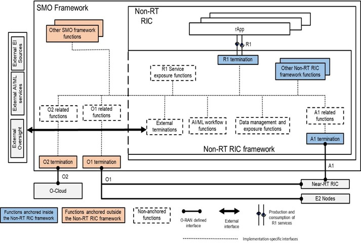
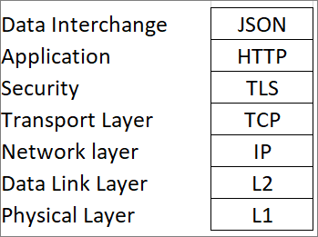

## O-RAN.SFG.Non-RT-RIC-Security-TR-v01.00.docx

- View in [Reader Mode](https://simewu.com/spec-reader/pages/02-WG11/O-RAN.SFG.Non-RT-RIC-Security-TR-v01.00.docx).
- Go back to [Table of Contents](../README.md).
- Download the [Original Document](https://github.com/Simewu/spec-reader/raw/refs/heads/main/documents/O-RAN.SFG.Non-RT-RIC-Security-TR-v01.00.docx).

---

*Technical Report*

**O-RAN Security Focus Group (SFG) Study on Security for Non-RT-RIC**

**This is a re-published version of the attached final specification.**

For this re-published version, the prior versions of the IPR Policy will apply, except that the previous requirement for Adopters (as defined in the earlier IPR Policy) to agree to an O-RAN Adopter License Agreement to access and use Final Specifications shall no longer apply or be required for these Final Specifications after 1st July 2022.

The copying or incorporation into any other work of part or all of the material available in this specification in any form without the prior written permission of O-RAN ALLIANCE e.V. is prohibited, save that you may print or download extracts of the material on this site for your personal use, or copy the material on this site for the purpose of sending to individual third parties for their information provided that you acknowledge O-RAN ALLIANCE as the source of the material and that you inform the third party that these conditions apply to them and that they must comply with them

Copyright (C) 2022 by the O-RAN ALLIANCE e.V.

Your use is subject to the copyright statement on the cover page of this specification.

*Technical Report*

**O-RAN Security Focus Group (SFG) Study on Security for Non-RT-RIC**

Copyright (C) 2021 by O-RAN ALLIANCE e.V.

By using, accessing or downloading any part of this O-RAN specification document, including by copying, saving, distributing, displaying or preparing derivatives of, you agree to be and are bound to the terms of the O-RAN Adopter License Agreement contained in the Annex ZZZ of this specification. All other rights reserved.

O-RAN ALLIANCE e.V.

Buschkauler Weg 27, 53347 Alfter, Germany Register of Associations, Bonn VR 11238 VAT ID DE321720189

[www.o-ran.org](http://www.o-ran.org/)

# 1 Revision History

|  |  |  |  |
| --- | --- | --- | --- |
| **Date** | **Revision** | **Author** | **Description** |
| 2022.03.08 | 01.00 | SFG | First version |

1 Contents

1. Revision History 2
2. 1 Introduction 5
3. 1.1 Scope 5
4. 1.2 Considerations 5
5. 1.3 References 6
6. 1.3.1 WG2 Specifications 6
7. 1.3.2 SFG Specifications 6
8. 1.3.3 Other O-RAN Specifications 6
9. 1.3.4 External Inputs 6
10. 1.4 Definitions and Abbreviations 7
11. 1.4.1 Definitions 7
12. 1.4.2 Abbreviations and acronyms 8
13. 1.4.3 Terms 9
14. 2 Non-RT-RIC Assets 10
15. 2.1 Architecture 10
16. 2.2 Framework 11
17. 2.3 Functions 12
18. 2.4 Interfaces 12
19. 2.5 Information 12
20. 3 Threats 14
21. 3.1 Threat Model 14
22. 3.2 Threat Template 14
23. 3.3 Potential Exploits 15
24. 4 Threat Analysis 16
25. 4.1 Non-RT-RIC Threats 16
26. 4.2 rApps Threats 17
27. 4.3 R1 Threats 19
28. 4.4 A1 Threats 21
29. 4.5 Protocol Stack Threats 22
30. 4.6 Machine Learning (ML) Threats 23
31. 5 Security Controls 24
32. 6 Risk Assessment 25
33. 6.1 Risk Assessment for Non-RT-RIC 25
34. !](../assets/images/f587264861aa.png)[6.2 Risk Assessment for rApps 26
35. 6.3 Risk Assessment for R1 Interface 26
36. 6.4 Risk Assessment for A1 Interface 27
37. 7 Recommendations 28
38. Annex A (informative): xxxxx 30
39. Annex ZZZ : O-RAN Adopter License Agreement 31

7

#### List of Tables

1. **No table of figures entries found.**

#### List of Figures

##### No table of figures entries found.

12

# 1 1 Introduction

## 1.1 Scope

1. This technical report provides the threat model and risk assessment for the Non-RT-RIC. The report identifies threats and risks and recommends potential security controls to
2. protect against those threats through safeguards or mitigation.
3. The steps of the threat modelling process are as follows:
4. 1. Identify assets: Identify the assets of the Non-RT-RIC that must be protected.
5. 2. Identify threats: Identify the threats that could adversely impact the Non-RT-RIC and threats that can use the Non-RT-RIC to adversely impact other components of the
6. O-RAN system.
7. 3. Identify the attack surface and attack vectors: Identify the points in the Non-RT-RIC where an attacker could gain entry, exploit a vulnerability or misconfiguration,
8. and compromise the system or its data.
9. 4. Measure risk: The extent to which confidentiality, integrity, or availability is threatened, based upon the impact level resulting from an attack and the likelihood of
10. occurrence.
11. 5. Recommend controls: The management, operational, and technical controls for an information system to protect the confidentiality, integrity and availability of the
12. Non-RT-RIC and its information 15

## 1.2 Considerations

1. The attack surface of the Non-RT-RIC includes its interfaces, functions, and data. Data-at-rest, Data-in-motion, and Data-in-use must be considered.
2. The O-RAN Alliance is pursuing a zero-trust architecture (ZTA) for its specifications. A ZTA assumes that the adversary is already inside the network and makes no
3. assumption of implicit trust based upon asset ownership, network location, or physical location. This has the effect of increasing the likelihood scoring.
4. Security controls are recommended for specifications of the Non-RT-RIC, which is the responsibility of WG2. Some recommended controls provided in this report may be
5. shared with another responsible O-RAN Alliance working group, such as WG6 or WG10, so that the specification relevant to the recommended control can be properly updated.

22

## 1.3 References

1. The following documents contain provisions which, through reference in this text, constitute provisions of the present document. 3

### 1.3.1 WG2 Specifications

1. [1] Non-RT RIC Architecture, v01.00, O-RAN.WG2.Non-RT-RIC-ARCH-TS-v01.00.
2. [2] A1 interface General Aspects & Principles Specification (A1 GA&P), v02.03, O-RAN.WG2.A1GAP-v02.03.
3. [3] A1 Interface Transport Protocol Specification (A1 TP), v01.01, O-RAN.WG2.A1TP-v01.01.
4. [4] A1 Interface Application Protocol Specification (A1 AP), v03.01, O-RAN.WG2.A1AP-v03.01.
5. [5] A1 Interface Type Definitions Specification (A1 TD), v02.00, O-RAN.WG2.A1TD-v02.00.
6. [6] R1 General Aspects and Principles (R1GAP), v01.00, O-RAN.WG2.R1GAP-v01.00.

### 1.3.2 SFG Specifications

1. [7] O-RAN Security Requirements Specifications, v01.00.05, O-RAN.SFG.O-RAN-Security-Requirements-Specifications-v01.00.05.
2. [8] O-RAN Threat Modelling and Remediation Analysis, v02.00.02, O-RAN.SFG.O-RAN-Threat-Model-v02.00.02.
3. [9] O-RAN Security Test Specifications, v01.00, O-RAN.SFG.Security-Test-Specifications-v01.00.

### 1.3.3 Other O-RAN Specifications

1. [10] O-RAN Architecture Description, v06.00, O-RAN.WG1.O-RAN-Architecture-Description-v06.00.
2. [11] O-RAN Drafting Rules, v01.00, O-RAN.TSC.Drafting-Rules.0-v01.00.

### 1.3.4 External Inputs

1. [12] Threat Landscape for 5G Networks, ENISA, [https://www.enisa.europa.eu/publications/enisa-threat-landscape-for-5g-networks.](https://www.enisa.europa.eu/publications/enisa-threat-landscape-for-5g-networks)
2. [13] Zero Trust Architecture, NIST SP 800-207, NIST, [https://csrc.nist.gov/publications/detail/sp/800-207/final.](https://csrc.nist.gov/publications/detail/sp/800-207/final)
3. [14] OWASP Top 10 Web Application Security Risks, 2021, [https://owasp.org/www-project-top-ten/.](https://owasp.org/www-project-top-ten/)
4. [15] OWASP Top 10 Proactive Controls, 2021, [https://owasp.org/projects/spotlight/historical/2021.02.10/.](https://owasp.org/projects/spotlight/historical/2021.02.10/)
5. [16] Cloud Security Alliance (CSA), Top Threats to Cloud Computing: Egregious Eleven, 2019, https://cloudsecurityalliance.org/artifacts/top-threats-to-cloud-computing-
6. egregious-eleven.
7. [17] Cloud Security Alliance (CSA), Cloud Controls Matrix (CCM), v4, 2021,https://cloudsecurityalliance.org/research/cloud-controls-matrix/.
8. [18] ISO/IEC 27001:2013 Information Security Management System (ISMS).
9. [19] NIST SP 800-53r5, Security and Privacy Controls for Information Systems and Organizations, 2020.
10. [20] US National Security Agency (NSA) / Cybersecurity and Infrastructure Security Agency (CISA), Security Guidance for 5G Cloud Infrastructures, Part I, Oct 28, 2021,
11. Part II, Nov 18, 2021, Part III, Dec 2, 2021, Part IV, Dec 16, 2021. <https://www.nsa.gov/Press-Room/Cybersecurity-Advisories-Guidance/smdpage11747/2/> (as of Feb 28,
12. 2022).

9

10

11

## 1.4 Definitions and Abbreviations

### 1.4.1 Definitions

1. For the purposes of the present document, the terms and definitions provided in O-RAN.WG1.O-RAN-Architecture-Description-v06.00 apply:
2. **A1**: Interface between non-RT RIC and Near-RT RIC to enable policy-driven guidance of Near-RT RIC applications/functions, and support AI/ML workflow.
3. **A1 policy:** Type of declarative policies expressed using formal statements that enable the non-RT RIC function in the SMO to guide the near-RT RIC function, and hence the
4. RAN, towards better fulfilment of the RAN intent.
5. **A1 Enrichment information:** Information utilized by near-RT RIC that is collected or derived at SMO/non-RT RIC either from non-network data sources or from network
6. functions themselves.
7. **Near-RT RIC:** O-RAN Near-Real-Time RAN Intelligent Controller: A logical function that enables near-real-time control and optimization of RAN elements and resources via
8. fine-grained data collection and actions over E2 interface. It may include AI/ML (Artificial Intelligence / Machine Learning) workflow including model training, inference and
9. updates.
10. **Non-RT RIC:** O-RAN Non-Real-Time RAN Intelligent Controller: A logical function within SMO that drives the content carried across the A1 interface. It is comprised of the
11. Non-RT RIC Framework and the Non-RT RIC Applications (rApps) whose functions are defined below.
12. **Non-RT RIC Applications (rApps):** Modular applications that leverage the functionality exposed via the Non-RT RIC Framework's R1 interface to provide added value services
13. relative to RAN operation, such as driving the A1 interface, recommending values and actions that may be subsequently applied over the O1/O2 interface and generating
14. "enrichment information" for the use of other rApps. The rApp functionality within the Non-RT RIC enables non-real-time control and optimization of RAN elements and
15. resources and policy-based guidance to the applications/features in Near-RT RIC.
16. **Non-RT RIC Framework:** That functionality internal to the SMO that logically terminates the A1 interface to the Near-RT RIC and exposes to rApps, via its R1 interface, the
17. set of internal SMO services needed for their runtime processing. The Non-RT RIC Framework functionality within the Non-RT RIC provides AI/ML workflow including model
18. training, inference and updates needed for rApps.
19. **SMO:** A Service Management and Orchestration system
20. **R1 Interface:** Interface between rApps and Non-RT RIC framework via which R1 Services can be produced and consumed. 6
21. **R1 Services**: A collection of services including, but not limited to, service registration and discovery services, authentication and authorization services, AI/ML workflow
22. services, and A1, O1 and O2 related services. 9

### 1.4.2 Abbreviations and acronyms

1. For the purposes of the present document, the abbreviations given in 3GPP TR 21.905 and the following apply:

|  |  |  |
| --- | --- | --- |
| 12 | AI | Artificial Intelligence |
| 13 | DAR | Data at Rest |
| 14 | DIM | Data in Motion |
| 15 | DIU | Data in Use |
| 16 | eNB | eNodeB (applies to LTE) |
| 17 | FTP | File Transfer Protocol |
| 18 | FTPS | File Transfer Protocol Secure |
| 19 | gNB | gNodeB (applies to NR) |
| 20 | HTTP | Hypertext Transfer Protocol |
| 21 | HTTPS | Hypertext Transfer Protocol Secure |
| 22 | JSON | JavaScript Object Notation |
| 23 | KPI | Key Performance Indicator |
| 24 | KQI | Key Quality Indicator |
| 25 | ML | Machine Learning |
| 26 | MNO | Mobile Network Operator |
| 27 | NF | Network Function |
| 28 | PII | Personally Identifiable Information |

|  |  |  |
| --- | --- | --- |
| 1 | PTP | Precision Timing Protocol |
| 2 | RBAC | Role-based Access Control |
| 3 | REST | Representational State Transfer |
| 4 | RIC | RAN Intelligent Controller |
| 5 | RT | Real-Time |
| 6 | SMO | Service Management and Orchestration |
| 7 | SSH | Secure Shell |
| 8 | TCP | Transmission Control Protocol |
| 9 | TLS | Transport Layer Security |
| 10 |  |  |

### 1.4.3 Terms

1. This document uses the verbal forms for the expression of provisions as defined in O-RAN.TSC.Drafting-Rules.0-v01.00.

# 1 2 Non-RT-RIC Assets

## 2.1 Architecture

1. The primary goal of non-RT RIC is to support non-real-time intelligent radio resource management, higher layer procedure optimization, policy optimization in RAN, and
2. providing AI/ML models to near-RT RIC and other RAN functions. The A1 interface supports communication & information exchange between non-RT RIC and near-RT RIC,
3. key objective of A1 interface is to support policy-based guidance of near-RT RIC functions/use-cases, transmission of enrichment information in support of AI/ML models into
4. near-RT RIC, and basic feedback mechanisms from near-RT RIC.
5. The non-RT-RIC architecture is shown in the Figure 2.1-1 below. The Non-RT-RIC Reference Architecture is a logical architecture, not an implementation architecture. The
6. Non-RT-RIC can be one black box or multiple disaggregated services.
7. US National Institute of Standards and Technology (NIST) defines Attack Surface as:
8. *The set of points on the boundary of a system, a system element, or an environment where an attacker can try to enter, cause an effect on, or extract data from, that system,*
9. *system element, or environment.* [https://csrc.nist.gov/glossary/term/attack\_surface]
10. The Attack Surface of the Non-RT-RIC can be grouped into Functions, Interfaces, and Information, which each having assets that should be protected. These assets, as listed in
11. the subsections below, are addressed in this report. Where an asset name is listed is indication that this asset has been identified in the O-RAN Security Threat Modeling and
12. Remediation Analysis document [O-RAN.WG1.SFG.Threat-Model-v02.00].
13. The Non-RT-RIC attack surface also includes Application On-Boarding, SMO, O-Cloud, Machine Learning, etc. These are relevant to securing the Non-RT-RIC, but are not
14. exclusive to the Non-RT-RIC. These points of the O-RAN attack surface are out of scope for this work item and should be further addressed in separate work items.

1

2

3

## 2.2 Framework

##### Figure 2.1-1 Non-RT-RIC Reference Logical Architecture [1]

1. ? ASSET-C-11: Non-RT-RIC, see O-RAN.WG2.Non-RT-RIC-ARCH-TS-v01.00

6

## 2.3 Functions

1. The functions in the scope of this document include the rApps, R1 Termination, and A1 Termination. The other functions in the Non-RT RIC framework as shown in Figure
2. 2.1-1 are out of scope.
3. ? **ASSET-C-10**: rApps, see O-RAN.WG2.Non-RT-RIC-ARCH-TS-v01.00
4. ? ASSET-C-13: A1 termination, see O-RAN.WG2.A1GAP-v02.03, A1 interface General Aspects & Principles Specification (A1 GA&P
5. ? ASSET-C-15: R1 termination, see O-RAN.WG2.R1GAP-v01.00, R1 General Aspects and Principles 7

## 2.4 Interfaces

1. ? ASSET-C-14: A1 interface, including the protocol stack, O-RAN.WG2.A1GAP-v02.03, A1 interface General Aspects & Principles Specification (A1 GA&P)
2. ? ASSET-C-16: R1 interface, including the protocol stack, O-RAN.WG2.R1GAP-v01.00, R1 General Aspects and Principles
3. ? ASSET-C-17: External Interfaces
4. o NOTE: External interfaces are use case specific interfaces that are not standardized in O-RAN. Security of these interfaces is outside the scope of this work
5. item and recommended to be outside the scope of the O-RAN Alliance. 14

## 2.5 Information

1. o Interface Information
2. o **ASSET-D-07:** A1 Policies
3. o **ASSET-D-08:** A1 Enrichment Information
4. o **ASSET-D-28:** R1 Observables
5. o Secret Stores -
6. o NOTE: Secret Stores is a SMO service provided to Non-RT-RIC. Securing the secret stores is outside the scope of this work item. This includes the
7. following assets:
8. o **ASSET-D-16:** X.509 certificates

1

2

3 o ML Data

* + **ASSET-D-17:** Security private keys
  + **ASSET-D-20:** Administrator credentials

4

5

6

7

8

9

10

11

12

13 o PII

14

15

* NOTE: Security for ML Data is an evolving technology and should be treated across all of O-RAN as a separate work item outside the scope of this work item. This includes the following assets:
  + **ASSET-D-25:** Training or test data: data sets collected externally or internally from the Near-RT RIC, O-CU and O-DU and passed to the ML training hosts in a ML system.
  + **ASSET-D-26:** The trained ML model which includes intellectual property, numerous configured hyperparameters and millions of learned parameters.
  + **ASSET-D-27:** The ML prediction results built into the model (e.g. expected outcomes)
  + **ASSET-D-28:** The behavior of the ML system including tasks for data collection, data wrangling, pipeline management, model retraining, and model deployment.
* **ASSET-D-30:** O-RAN specific UE IDs

# 1 3 Threats

## 3.1 Threat Model

1. For identifying threats, we are using STRIDE:
2. 1. S - Spoofing identity. An application or program can masquerade as another to gain advantages not typically
3. allowed for that program.
4. 2. T - Tampering with data. This involves the malicious modification of data, including making unauthorized
5. changes to a database and alteration of data as it flows between computers.
6. 3. R - Repudiation. A user or program refuses the authenticity of a good or reasonable command or action.
7. 4. I - Information disclosure. This involves the exposure of information to individuals with unauthorized access to
8. it. For example, users gain the ability to read a file that they normally would not have been granted access to, or
9. an intruder can read data in transit between computers.
10. 5. D - Denial of service. These attacks deny service to valid users, such as making a website unavailable or unusable
11. by flooding it with illegitimate requests to keep legitimate users without access.
12. 6. E - Elevation of privileges. An unauthorized user gains privileged rights to access previously no granted to
13. compromise or destroy the system, such as a change in membership. 16

17

|  |  |
| --- | --- |
| **Threat types** | **Impact types** |
| Spoofing | Authenticity |
| Tampering | Integrity |
| Repudiation | Non-repudiation |
| Information disclosure | Confidentiality |
| Denial of Service | Availability |
| Elevation of Privilege | Authorization |

18

## 3.2 Threat Template

1. Template to present the threat characteristics:

|  |  |
| --- | --- |
| **Threat ID** |  |
| **Threat title** |  |
| **Threat description** |  |
| **Threat type** | Spoofing Tampering Repudiation  Information disclosure Denial of Service Elevation of Privilege |
| **Vulnerabilities** |  |
| **Impact type** | Authenticity Integrity  Non-repudiation Confidentiality  Availability Authorization |
| **Affected Assets** |  |

## 3.3 Potential Exploits

1. A threat analysis is facilitated by an understanding of potential threats, as identified by the Cloud Security Alliance
2. (CSA) and the Open Web Application Security Project (OWASP). 4
3. The CSA Top Threats to Cloud was updated in 2019 to the "Egregious Eleven" [16], which includes the following:
4. 1. Data Breaches
5. 2. Misconfiguration and Inadequate Change Control
6. 3. Lack of Cloud Security Architecture and Strategy
7. 4. Insufficient Identity, Credential, Access, and Key Management
8. 5. Account Hijacking
9. 6. Insider Threat
10. 7. Insecure Interfaces and APIs
11. 8. Weak Control plane
12. 9. Metastructure and Applistructure Failures
13. 10. Limited Cloud Usage Visibility
14. 11. Abuse and Nefarious Uses of Cloud Services 17

18

19 The OWASP Top 10 Web Application Security Risks [14] was updated in 2021 to include the following: 20

1. A01:2021 Broken Access Control
2. A02:2021 Cryptographic Failure
3. A03:2021 Injection (including Cross-Site Scripting)
4. A04:2021 Insecure Design
5. A05:2021 Security Misconfiguration
6. A06:2021 Vulnerable and Outdated Components
7. A07:2021 Identification and Authentication Failures
8. A08:2021 Software and Data Integrity Failures (including Insecure Deserialization)
9. A09:2021 Security Logging and Monitoring Failures
10. A10:2021 Server-Side Request Forgery 31

32

1. The threats listed above are considered in the Non-RT-RIC threat analysis where relevant to O-RAN and the Non-RT-
2. RIC.

35

36

# 1 4 Threat Analysis

## 4.1 Non-RT-RIC Threats

|  |  |
| --- | --- |
| **Threat ID** | T-NONRTRIC-01 |
| **Threat title** | An attacker penetrates the Non-RT RIC to cause a denial of service or degrade the performance |
| **Threat description** | An attacker penetrates the Non-RT RIC through A1 interface or from external sources through SMO and attempts to trigger a Denial of Service or degrade the performance of non-RT RIC so that non-RT RIC would not be liable for ensuring:   * The monitoring or tracing of the network to understand the effect of the A1 policy on performance in Near-RT RIC * The update of A1 policy * The exposure and secure delivery of A1 Enrichment Information to near-RT RIC * The setup of access control rules and the selection of which Enrichment Information ID (EiId) are exposed to a near-RT RIC |
| **Threat type** | Denial of Service |
| **Impact type** | Availability |
| **Affected Asset** | Non-RT-RIC |

3

|  |  |
| --- | --- |
| Threat ID | T-NONRTRIC-02 |
| **Threat title** | UE tracking in the Non-RT RIC |
| **Threat description** | An attacker gains access to the Non-RT RIC through the SMO to gain access to sensitive information for UE tracking. |
| **Threat type** | Information Disclosure |
| **Impact type** | Confidentiality |
| **Affected Asset** | Non-RT-RIC |

4

|  |  |
| --- | --- |
| **Threat ID** | T- NONRTRIC-03 |
| **Threat title**  **Threat description**  **Threat type Impact type**  **Affected Asset** | Data Corruption/Modification |
| An attacker gains access to the Non-RT RIC through the SMO to cause Data Corruption/Modification. For example, a malicious actor who gains unauthorized access to the Non-RT-RIC can modify policy to pass a "False Policy" to the Near-RT-RIC. |
| Tampering |
| Integrity |
| Non-RT-RIC, Near-RT-RIC, A1 interface |

5

6

## 4.2 rApps Threats

1. rApps have the ability to manipulate behavior of a certain cell, a group of UEs, and a specific UE. A malfunctioning rApp could
2. potentially be used to track or impact service for a certain UE-Id or degrade service in an area.

|  |  |
| --- | --- |
| **Threat ID** | T-rAPP-01 |
| **Threat title**  **Threat description**  **Threat type Impact type**  **Affected Asset** | Conflicting rApps unintentionally or maliciously impact O-RAN system functions to degrade performance or trigger a DoS |
| rApps in the Non-RT RIC can be provided by different vendors. For example, one vendor can provide the rApp for Carrier license scheduling and another vendor provide the rApp for energy saving, etc.  This creates the risk that different rApps will take conflicting decisions at the same instance in time for the same user. Such conflicts between rApps include:   * Direct conflicts: different rApps request change for the same parameter. * Indirect conflicts: different rApps request change to different parameters that will create opposite effects. * Implicit conflicts: different rApps request change to different parameters that are not creating any obvious opposite effect but result in an overall network performance degradation, instabilities, etc.   These conflicts are difficult to mitigate since dependencies are impossible to observe. |
| Denial of Service |
| Availability |
| rApps |

4

5

|  |  |
| --- | --- |
| **Threat ID** | T-rAPP-02 |
| **Threat title**  **Threat description**  **Threat type Impact type**  **Affected Asset** | An attacker exploits rApp vulnerabilities |
| Vulnerabilities can potentially exist in any rApp. If attackers can find exploitable rApp, they can disrupt the offered network service and potentially take over another rApp or the non-RT RIC.  The actual consequences may vary. For example, an attacker may gain the ability to alter data transmitted over A1 interface, extract sensitive information, etc. |
| Tampering, Denial of Service |
| Integrity, Availability |
| rApps |

6

|  |  |
| --- | --- |
| **Threat ID** | T-rAPP-03 |
| **Threat title**  **Threat description**  **Threat type** | An attacker exploits rApps misconfiguration |
| Security misconfiguration, such as open ports or enabled unused protocols, can potentially exist in an rApp. If attackers can find exploitable rApp, they can disrupt the offered network service and potentially take over another rApp or the whole non-RT RIC.  The actual consequences may vary. For example, an attacker may gain the ability to alter data transmitted over A1 interface, extract sensitive information, etc. |
| Information Disclosure, Tampering, Denial of Service |

|  |  |
| --- | --- |
| **Impact type**  **Affected Asset** | Confidentiality, Integrity, Availability |
| rApps |

1

|  |  |
| --- | --- |
| **Threat ID** | T-rAPP-04 |
| **Threat title**  **Threat description**  **Threat type Impact type**  **Affected Asset** | An attacker bypasses authentication and authorization |
| An Attacker can exploit an rApp that has weak or misconfigured authentication and authorization to gain access to the rApp and pose as a tenant. |
| Elevation of Privilege |
| Authenticity, Authorization |
| rApps |

2

|  |  |
| --- | --- |
| **Threat ID Threat title**  **Threat description**  **Threat type Impact type**  **Affected Asset** | T-rAPP-05 |
| An attacker exploits malicious rApp |
| An untrusted source may intentionally provide a malicious rApp. A trusted source may have a backdoor intentionally inserted in the rApp. If attackers can find exploitable rApp, they can disrupt the offered network service and potentially take over another rApp or the whole non-RT RIC.  Malicious rApps could impact non-RT RIC functions such as AI/ML model training, A1 policy management, Enrichment information management, Network Configuration Optimization in the purpose of performance degradation, DoS, enrichment data sniffing (UE location, trajectory, navigation information, GPS data, etc.), etc. |
| Information disclosure, Tampering, Denial of Service |
| Confidentiality, Integrity, Availability |
| rApps |

3

|  |  |
| --- | --- |
| **Threat ID** | T-rAPP-06 |
| **Threat title**  **Threat description**  **Threat type**  **Impact type**  **Affected Asset** | An attacker bypasses authentication and authorization using an injection attack |
| It is possible that an attacker to submit requests without prior authentication and authorization by executing an injection attack to manipulate configurations, access logs, perform remote code execution, etc. |
| Tampering, Information disclosure, Denial of Service |
| Integrity, Confidentiality, Availability |
| rApps, R1 Termination |

4

|  |  |
| --- | --- |
| **Threat ID** | T-rAPP-07 |
| **Threat title**  **Threat description**  **Threat type** | rApp exploits O1 services |
| A malicious rApp or a trusted but compromised rApp can exploit O1 services across the R1 interface |
| Tampering, Information disclosure, Denial of Service |

|  |  |
| --- | --- |
| **Impact type**  **Affected Asset** | Integrity, Confidentiality, Availability |
| rApps |

1

2

## 4.3 R1 Threats

1. The R1 interface facilitates inter-connection between rApps and Non-RT RIC framework supplied by different vendors,
2. and provides a level of abstraction between rApps and Non-RT RIC framework/SMO that can be the consumers and or
3. producers of R1 services. 7

|  |  |
| --- | --- |
| **Threat ID** | T-R1-01 |
| **Threat title**  **Threat description**  **Threat type Impact type**  **Affected Asset** | An attacker gains unauthorized access to services |
| "Service management and exposure services Producer" determines whether the Service Producer is authorized to produce the service. An attacker can perform a spoofing attack to gain unauthorized access to R1 services. |
| Spoofing |
| Authorization |
| R1, rApps |

8

|  |  |
| --- | --- |
| **Threat ID** | T-R1-02 |
| **Threat title**  **Threat description**  **Threat type**  **Impact type**  **Affected Asset** | Exploit of Service Heartbeat |
| Attacker can exploit the Service Heartbeat on the R1 by modifying or inserting heartbeat messages to cause denial of service |
| Tampering, Denial of Service |
| Integrity, Availability |
| R1, rApps |

9

|  |  |
| --- | --- |
| **Threat ID** | T-R1-03 |
| **Threat title**  **Threat description**  **Threat type Impact type**  **Affected Asset** | Bypass authentication to Request Data |
| Attacker can exploit password-based authentication on the R1 to request unauthorized data. Weak password management can easily be exploited. (Certificate-based mutual authentication using TLS and PKI X.509 certificates is recommended). |
| Spoofing |
| Authenticity, Authorization |
| R1, rApps |

10

|  |  |
| --- | --- |
| **Threat ID** | T-R1-04 |

|  |  |
| --- | --- |
| **Threat title** | An attacker performs spoofing attack to discover data |
| **Threat description**  **Threat type**  **Impact type**  **Affected Asset** | "Data registration and discovery service producer" determines whether the Data Producer is authorized to produce the data types. An attacker can perform a spoofing attack to discover available data. |
| Spoofing |
| Authorization |
| R1, rApps |

1

|  |  |
| --- | --- |
| **Threat ID** | T-R1-05 |
| **Threat title**  **Threat description**  **Threat type Impact type**  **Affected Asset** | An attacker gains unauthorized access to data |
| An attacker can perform a spoofing attack to exploit the Data request and subscription service for the purpose to gain unauthorized access to data. |
| Spoofing |
| Authorization |
| R1, rApps |

2

|  |  |
| --- | --- |
| **Threat ID** | T-R1-06 |
| **Threat title**  **Threat description**  **Threat type**  **Impact type**  **Affected Asset** | Compromised Data Request |
| Data Consumers consume the "Data request and subscription service" to request data instances or subscribe to them. An attacker can modify a request to force the consumer to receive a different data set then that intended. Without checks, the received data could be processed, leading to erroneous decisions or triggers. |
| Tampering |
| Integrity |
| R1, rApps |

3

|  |  |
| --- | --- |
| **Threat ID** | T-R1-07 |
| **Threat title**  **Threat description**  **Threat type**  **Impact type**  **Affected Asset** | Compromised data delivery |
| Data delivery messages relate to a particular data request or subscription. The data can be delivered to the Data Consumer in different ways, including:   * as part of the payload of a data delivery message, * as a data stream, * from e.g., a REST endpoint, a message bus or object store location.   An attacker can perform snooping, injection, or modification attacks in the Delivery of Data process. |
| Information Disclosure and Tampering |
| Confidentiality, Integrity |
| R1, rApps |

4

## 4.4 A1 Threats

1. The purpose of the A1 interface is to enable the Non-RT RIC function to provide policy-based guidance, ML model
2. management and enrichment information to the Near-RT RIC function for RAN can optimization. The Non-RT RIC
3. can provide enrichment information over the A1 interface to support the policy enforcement in the Near-RT RIC. The
4. A1 interface is used for discovery, request and delivery of A1 Enrichment Information and discovery of External
5. Enrichment Information.

7

A1

Near-RT-RIC

Non-RT-RIC

8

9 Figure. A1 interface between the Non-RT RIC and the Near-RT RIC. 10

|  |  |
| --- | --- |
| **Threat ID** | T-A1-01 |
| **Threat title**  **Threat description**  **Threat type**  **Impact type**  **Affected Asset** | Untrusted peering between Non-RT-RIC and Near-RT-RIC |
| Malicious Non-RT-RIC peers with a Near-RT-RIC over the A1 interface, or a malicious Near-RT-RIC peers with a Non-RT-RIC over the A1 interface, due to weak mutual authentication. |
| Spoofing |
| Authenticity |
| Non-RT-RIC, Near-RT-RIC, A1 interface |

11

12

13

|  |  |
| --- | --- |
| **Threat ID** | T-A1-02 |
| **Threat title**  **Threat description**  **Threat type Impact type**  **Affected Asset** | Malicious function or application monitors messaging across A1 interface |
| Internal threat actor can gain access to the messaging across the A1 interface for a MiTM attack to read policy. |
| Information Disclosure |
| Confidentiality |
| Non-RT-RIC, Near-RT-RIC, A1 interface |

14

15

|  |  |
| --- | --- |
| **Threat ID** | T-A1-03 |
| **Threat title** | Malicious function or application modifies messaging across A1 interface |
| **Threat description** | Internal threat actor can gain access to the messaging across the A1 interface for a MiTM attack to modify or inject policy. This can result in the Near-RT RIC receiving malicious policy. |
| **Threat type** | Tampering |
| **Impact type** | Integrity |
| **Affected Asset** | Non-RT-RIC, Near-RT-RIC, A1 interface |

1

2

## 4.5 Protocol Stack Threats

1. The A1 and R1 interfaces use the REST protocol stack shown in the figure below. The transport network layer is built
2. on IP transport. TCP provides the communication service at the transport layer. HTTP is the application-level protocol
3. used providing reliable transport of messages. TLS provides secure HTTP connections for secure transport of
4. messages. The application layer protocol is based on a RESTful approach with transfer of JSON formatted policy
5. statements. Each of these protocols has known vulnerabilities that can be exploited by a malicious actor. 9

10

11 Figure. REST Protocol Stack for the A1 and R1 Interfaces 12

|  |  |
| --- | --- |
| **Threat ID** | T-ProtocolStack-01 |
| **Threat title** | REST API Exploits |
| **Threat description** | The A1 and R1 interfaces use the REST API. REST API common attacks include injection, cross site scripting, and DoS attacks that can exploit common vulnerabilities if proper controls are not used to protect against vulnerabilities. |
| **Threat type** | Spoofing, Tampering, Information Disclosure |
| **Impact type** | Confidentiality, Integrity, Authenticity |
| **Affected Asset** | Non-RT-RIC, Near-RT-RIC, A1 interface |

13

|  |  |
| --- | --- |
| **Threat ID** | T-ProtocolStack-02 |
| **Threat title** | REST API - Broken Object Level Authorization |
| **Threat description** | The A1 and R1 interfaces use the REST API, which could expose object identifiers without proper authorization checks. |
| **Threat type** | Information Disclosure |

|  |  |
| --- | --- |
| **Impact type** | Authorization |
| **Affected Asset** | Non-RT-RIC, Near-RT-RIC, A1 interface |

1

|  |  |
| --- | --- |
| **Threat ID** | T-ProtocolStack-03 |
| **Threat title** | JSON Exploits |
| **Threat description** | The A1 and R1 interfaces use JSON formatted policy statements. JSON attacks include injection, deserialization, web token, and cross site scripting attacks that can exploit common vulnerabilities if proper controls are not used to protect against vulnerabilities. |
| **Threat type** | Spoofing, Tampering, Information Disclosure |
| **Impact type** | Confidentiality, Integrity, Authenticity |
| **Affected Asset** | Non-RT-RIC, Near-RT-RIC, A1 interface |

2

3

|  |  |
| --- | --- |
| **Threat ID** | T-ProtocolStack-04 |
| **Threat title** | HTTP Exploits |
| **Threat description** | The A1 and R1 interfaces use HTTPS. DDoS attacks include HTTP GET Flood, Garbage Flood, and Reverse Bandwidth Floods. Other well known HTTP attacks include injection attacks, such as Cross-Site Scripting (XSS) and SQL injection. |
| **Threat type** | Spoofing, Tampering, Information Disclosure, DDoS |
| **Impact type** | Confidentiality, Integrity, Authenticity, Availability |
| **Affected Asset** | Non-RT-RIC, Near-RT-RIC, A1 interface |

4

|  |  |
| --- | --- |
| **Threat ID** | T-ProtocolStack-05 |
| **Threat title** | TCP Volumetric DDoS |
| **Threat description** | The A1 and R1 interfaces use TCP. TCP DDoS attacks include TCP SYN Flood, ACK Flood, and RST Flood. |
| **Threat type** | DDoS |
| **Impact type** | Availability |
| **Affected Asset** | Non-RT-RIC, Near-RT-RIC, A1 interface |

5

## 4.6 Machine Learning (ML) Threats

1. ML threats in this subsection should be specific to the Non-RT-RIC. General ML Threats applicable to the O-RAN
2. architecture should be addressed in a separate work item.
3. For Further Study (FFS).

# 1 5 Security Controls

1. Industry recommendations for strong security controls are provided from sources such as the OWASP Top 10 Proactive
2. Controls [15], Cloud Security Alliance (CSA) Cloud Control Matrix (CCM) [17], ISO/IEC 27001:2013 Information
3. Security Management System (ISMS) [18], NIST SP 800-53r5 Security and Privacy Controls for Information Systems
4. and Organizations [19], and Cybersecurity and Infrastructure Security Agency (CISA) Security Guidance for 5G Cloud
5. Infrastructures [20].
6. With consideration of these external sources, the following security controls should be considered for the Non-RT-RIC
7. risk analysis:
8. Control-1: TLS with PKI and X.509 certificates
9. Control-2: OAuth 2.0
10. Control-3: IAM (using RBAC, ABAC, PBAC, TBAC)
11. Control-4: Encryption for Data at Rest
12. Control-5: Integrity Protection for Data at Rest
13. Control-6: Certificate Management
14. Control-7: Message Authentication
15. Control-8: Message Integrity Protection
16. Control-9: Digital Signatures
17. Control-10: Logging
18. Control-11: Configuration Validation
19. Control-12: Conflict detection and resolution
20. Control-13: Encryption for Data in Motion
21. Control-14: Integrity Protection for Data in Motion 23

24

# 1 6 Risk Assessment

* 1. This section provides risk assessment tables for each of the identified assets: Non-RT RIC, R1 interface, A1 interface,
  2. and rApps. These tables list the assets, threats, impacts, and possible security controls.
  3. A malicious actor may be a nation-state adversary, cybercriminal, or employee. Risk scoring includes Likelihood and
  4. Impact.
  5. Likelihood scoring is based upon current security controls. Likelihood scoring does not consider security controls that

7 may be potentially specified in the future.

1. Likelihood scoring considers a zero trust architecture which protects against internal threat actors. Likelihood scores
2. are higher for a zero trust architecture (ZTA) because internal threats must be considered in addition to external threats.
3. In a ZTA it cannot be assumed that perimeter defenses are sufficient. As a result, scored Likelihood = Medium, at a
4. minimum. Reconnaissance type attacks can be scored Likelihood = High while damaging/availability attacks can be
5. scored Likelihood = Medium. The reason is that threat actors are less likely to perform damaging attacks that are
6. quickly and easily detected. Advanced Persistent Threats (APTs) typically move laterally in anonymous fashion to
7. prevent detection while providing reconnaissance.
8. Zero trust architecture removes the ability to assume perimeter security is sufficient. The Non-RT RIC must be
9. protected from untrusted external sources attempting to have access, while also assuming the adversary is already inside
10. the network with access to its functions. As a result, the Non-RT RIC cannot have its security posture founded on the
11. assumption the SMO is secure. 19

## 20 6.1 Risk Assessment for Non-RT-RIC

21

|  |  |  |  |  |  |  |  |
| --- | --- | --- | --- | --- | --- | --- | --- |
| **Asset-Id** | **Asset Name** | **Threat- Id** | **Threat Description (Brief)** | **Impact/ Likelihood Raw Score** | **Possible Security Controls** | **Security Control- Id** | **Comments** |
| ASSET- | Non-RT- | T- | An attacker gains | Impact = | IAM, Logging | Control-3, | WG1 ATG is starting a |
| C-11 | RIC | NONRTRI | access to the Non-RT | High |  | Control-10 | study on SMO and Non-RT- |
|  |  | C-01 | RIC through the SMO | Likelihood = |  |  | RIC integration. Secure |
|  |  |  | to cause a denial of | Medium |  |  | integration should be |
|  |  |  | service or degrade the |  |  |  | addressed as the |
|  |  |  | performance of the |  |  |  | requirements evolve |
|  |  |  | Non-RT-RIC |  |  |  |  |
| ASSET- | Non-RT- | T- | An attacker gains | Impact = | Encryption of | Control-3, | WG1 ATG is starting a |
| C-11 | RIC | NONRTRI | access to the Non-RT | High | Data at Rest, | Control-4, | study on SMO and Non-RT- |
|  |  | C-02 | RIC through the SMO | Likelihood = | IAM, Logging | Control-10 | RIC integration. Secure |
|  |  |  | for UE tracking | High |  |  | integration should be |
|  |  |  |  |  |  |  | addressed as the |
|  |  |  |  |  |  |  | requirements evolve |
| ASSET- | Non-RT- | T- | An attacker gains | Impact = | Integrity | Control-3, | WG1 ATG is starting a |
| C-11 | RIC | NONRTRI | access to the Non-RT | High | protection for | Control-5, | study on SMO and Non-RT- |
|  |  | C-03 | RIC through the SMO | Likelihood = | Data at Rest, | Control-10 | RIC integration. Secure |
|  |  |  | to cause Data | Medium | IAM, Logging |  | integration should be |
|  |  |  | Corruption/Modification |  |  |  | addressed as the |
|  |  |  |  |  |  |  | requirements evolve |

22 Table 6.1-1 Risk Assessment for Non-RT-RIC 23

## 6.2 Risk Assessment for rApps

|  |  |  |  |  |  |  |  |
| --- | --- | --- | --- | --- | --- | --- | --- |
| **Asset-Id** | **Asset Name** | **Threat- Id** | **Threat Description (Brief)** | **Impact/ Likelihood Score** | **Security Controls** | **Security Control- Id** | **Comments** |
| ASSET- C-10 | rAPPs | T-rAPP-01 | Conflicting rApps impact O-RAN system functions to degrade performance or trigger  a DoS | Impact = High Likelihood = Medium | IAM, Logging | Control-12 |  |
| ASSET- C-10 | rAPPs | T-rAPP-02 | An attacker exploits rApp vulnerability for data breach or denial of service | Impact = High Likelihood = Medium | IAM, Logging, Data protection | Control-3, Control-4, Control-10 | |
| ASSET- C-10 | rAPPs | T-rAPP-03 | An attacker exploits rApps misconfiguration | Impact = High Likelihood =  Medium | IAM, Logging | Control-11 | |
| ASSET- C-10 | rAPPs | T-rAPP-04 | An attacker bypasses authentication and authorization | Impact = High Likelihood = Medium | TLS, PKI,  X.509, Oauth 2.0, IAM | Control-1, Control-2, Control-3 | |
| ASSET- C-10 | rAPPs | T-rAPP-05 | An attacker deploys and exploits malicious rApp | Impact = High  Likelihood = Medium | IAM, Logging | Control-9, Control-11 | |
| ASSET- C-10 | rAPPs | T-rAPP-06 | An attacker bypasses authentication and authorization using an injection attack | Impact = High Likelihood = Medium | Data encryption, security configuration validation | Control-4, Control-11 | |
| ASSET- C-10 | rAPPs | T-rAPP-07 | rApp exploits services | Impact = High Likelihood = Medium | Digital Signatures, Logging, Configuration Validation | Control-9, Control-10, Control-11 | |
| Table 6.2-1 Risk Assessment for r  6.3 Risk Assessment for R1 Interface | | | | | Apps |  | |
| **Asset-Id** | **Asset Name** | **Threat- Id** | **Threat Description (Brief)** | **Impact/ Likelihood Score** | **Security Controls** | **Security Control- Id** | **Comments** |
| ASSET- C-16 | R1  interface | T-R1-01 | A malicious actor gains unauthorized access to R1 services | Impact = High Likelihood = Medium | TLS, PKI, X.509  certificates, Certificate Management,  IAM, Logging | Control-1, Control-3, Control-6, Control-10 | |
| ASSET- C-16 | R1  interface | T-R1-02 | Attacker modifies Service Heartbeat message to cause Denial of Service | Impact = High Likelihood = Medium | Integrity protection, Message Authentication, Logging | Control-7, Control-8, Control-10 | |
| ASSET- C-16 | R1  interface | T-R1-03 | Malicious actor bypasses authentication to  Request Data | Impact = High Likelihood =  High | TLS, PKI,  X.509 , Logging | Control-1, Control-10 | |

2

3

4

5

|  |  |  |  |  |  |  |
| --- | --- | --- | --- | --- | --- | --- |
| ASSET- | R1 | T-R1-04 | Malicious actor | Impact = | IAM, Logging | Control-3, |
| C-16 | interface |  | bypasses authorization to Discover Data | High Likelihood = |  | Control-10 |
|  |  |  |  | High |  |  |

1

|  |  |  |  |  |  |  |  |
| --- | --- | --- | --- | --- | --- | --- | --- |
| ASSET- C-16 | R1  interface | T-R1-05 | A malicious actor gains unauthorized access to data | Impact = High Likelihood = High | TLS, PKI, X.509  certificates, Certificate  Management, IAM, Logging | Control-1, Control-3, Control-6, Control-10 | |
| ASSET- C-16 | R1  interface | T-R1-06 | Malicious actor modifies a Data Request | Impact = High Likelihood = Medium | Integrity protection for Data in Motion, Message Authentication, Logging | Control-7, Control-8, Control-10 | |
| ASSET- C-16 | R1  interface | T-R1-07 | Malicious actor compromises Data Delivery to the Data Consumer | Impact = High Likelihood = High | Encryption of Data in Motion using TLS, Logging | Control-1, Control-10 | |
| Table 6.3-1 Risk Assessment for R1 Interface  6.4 Risk Assessment for A1 Interface | | | | | |  | |
| **Asset-Id** | **Asset Name** | **Threat- Id** | **Threat Description (Brief)** | **Impact/ Likelihood Score** | **Security Controls** | **Security Control- Id** | **Comments** |
| ASSET- C-14 | A1  interface | T-A1-01 | Untrusted peering between Non-RT-RIC and Near-RT-RIC | Impact = High Likelihood = Medium | TLS, PKI, X.509  certificates, Certificate Management, Logging | Control-1, Control-6, Control-10 | |
|  |  |
| ASSET- C-14 | A1  interface | T-A1-02 | Malicious function or application monitors messaging across A1 interface | Impact = High Likelihood = High | Encryption of Data in Motion using TLS | Control-1 | |
| ASSET- C-14 | A1  interface | T-A1-03 | Malicious function or application modifies messaging across A1 interface | Impact = High Likelihood = Medium | Integrity Protection of Data in Motion using TLS | Control-1 | |

2

3

4 Table 6.4-1 Risk Assessment for A1 Interface 5

# 1 7 Recommendations

1. The Security Analysis presented in this technical report used the following process:
2. 1. Asset identification -> 2. Threat identification -> 3. Threat analysis -> 4. Risk analysis -> 5. Recommend
3. Security Controls
4. The Non-RT RIC Reference Architecture is a logical architecture, not an implementation architecture. The Non-RT
5. RIC can be monolithic or multiple disaggregated functions. The Non-RT RIC Framework may be considered an asset
6. for which security controls can be applied. Other critical assets that are part of the Non-RT RIC Framework are rApps,
7. the R1 interface, and the A1 interface, which are considered assets for this security analysis.
8. **Recommendation 1**: SFG should update the Security Threat and Remediation document [8] to include the assets
9. identified in this security analysis technical report. A CR will be generated.
10. 20 threats were identified, which are categorized as 3 Non-RT RIC threats, 7 rApps threats, 7 R1 threats, and 3 A1
11. threats. In addition, 6 threats for the protocol stack of the R1 and A1 interfaces were identified.
12. **Recommendation 2**: SFG should update the Security Threat and Remediation document [8] to include the threats
13. and threat tables created for this security analysis technical report. A CR will be generated. 15
14. Risk analysis included impact-likelihood scoring. All 20 of the identified threats were score either high-medium or
15. high-high. Likelihood scoring was influenced by the consideration of a zero trust architecture (ZTA), which is a
16. publicly expressed goal of the O-RAN Alliance. ZTA is built on the foundational principles that perimeter defenses are
17. insufficient to secure a network as internal external threats pose risk to a network. There are two guidelines for
18. designing a network and its network functions for a ZTA:
19. 1. There is no implicit trust granted to an asset based upon ownership, physical location, or network location [13].
20. 2. Assume the adversary is already inside the network [20].
21. **Recommendation 3**: The Non-RT RIC should be protected from untrusted external sources attempting to have
22. access. Specific requirements will be formed as this SFG work item continues.
23. **Recommendation 4**: The Non-RT RIC should have security controls implemented to protect its functions and
24. interfaces from internal threats, consistent with a ZTA. Specific requirements will be formed as this SFG work item
25. continues.

28

1. 14 security controls were identified for securing the Non-RT RIC to provide protection from confidentiality, integrity,
2. and availability attacks.
3. **Recommendation 5**: The SFG should update its Security Requirements Specifications document [7] and Security
4. Protocols Specifications document [9] to provide guidance for use of the suggested security controls. Requirements
5. for these security controls will be developed as this SFG work item continues. The security controls recommended
6. in the Risk Analysis tables in section 6 for the R1 and A1 interfaces should be considered by WG2.
7. **Recommendation 6**: Consistent with a ZTA architecture the Non-RT RIC should be secure by design in which its
8. security posture does not assume that the SMO is secure and will provide perimeter protection for the Non-RT-RIC.
9. A new SFG work item should address security of SMO and Non-RT RIC integration. 38
10. Non-RT-RIC has additional attack vectors that have broader scope across O-RAN. These additional attack vectors that
11. are not exclusive to the Non-RT-RIC include secure application on-boarding and lifecycle management of rApps,
12. certificate management, key management, implementation of a secure protocol stack on the A1 and R1 interfaces,
13. security configuration validation, cloud security best practices, ML/AI security, logging security, and secure software
14. development, including secure use of open source software.
    1. **Recommendation 7**: SFG should address each of these non-exclusive attack vectors mentioned above as work
    2. items to be studied in collaboration with the relevant working group of the O-RAN Alliance. In some cases, the
    3. SFG itself may be the relevant working group. 4

# 1 Annex A (informative): xxxxx

1 Annex ZZZ : O-RAN Adopter License Agreement

1. BY DOWNLOADING, USING OR OTHERWISE ACCESSING ANY O-RAN SPECIFICATION, ADOPTER
2. AGREES TO THE TERMS OF THIS AGREEMENT.
3. This O-RAN Adopter License Agreement (the "Agreement") is made by and between the O-RAN Alliance and the
4. entity that downloads, uses or otherwise accesses any O-RAN Specification, including its Affiliates (the "Adopter").
5. This is a license agreement for entities who wish to adopt any O-RAN Specification.

## Section 1: DEFINITIONS

1. 1.1 "Affiliate" means an entity that directly or indirectly controls, is controlled by, or is under common control with
2. another entity, so long as such control exists. For the purpose of this Section, "Control" means beneficial ownership of
3. fifty (50%) percent or more of the voting stock or equity in an entity.
4. 1.2 "Compliant Implementation" means any system, device, method or operation (whether implemented in hardware,
5. software or combinations thereof) that fully conforms to a Final Specification.
6. 1.3 "Adopter(s)" means all entities, who are not Members, Contributors or Academic Contributors, including their
7. Affiliates, who wish to download, use or otherwise access O-RAN Specifications.
8. 1.4 "Minor Update" means an update or revision to an O-RAN Specification published by O-RAN Alliance that does
9. not add any significant new features or functionality and remains interoperable with the prior version of an O-RAN
10. Specification. The term "O-RAN Specifications" includes Minor Updates.
11. 1.5 "Necessary Claims" means those claims of all present and future patents and patent applications, other than design
12. patents and design registrations, throughout the world, which (i) are owned or otherwise licensable by a Member,
13. Contributor or Academic Contributor during the term of its Member, Contributor or Academic Contributorship; (ii)
14. such Member, Contributor or Academic Contributor has the right to grant a license without the payment of
15. consideration to a third party; and (iii) are necessarily infringed by a Compliant Implementation (without considering
16. any Contributions not included in the Final Specification). A claim is necessarily infringed only when it is not possible
17. on technical (but not commercial) grounds, taking into account normal technical practice and the state of the art
18. generally available at the date any Final Specification was published by the O-RAN Alliance or the date the patent
19. claim first came into existence, whichever last occurred, to make, sell, lease, otherwise dispose of, repair, use or operate
20. a Compliant Implementation without infringing that claim. For the avoidance of doubt in exceptional cases where a
21. Final Specification can only be implemented by technical solutions, all of which infringe patent claims, all such patent
22. claims shall be considered Necessary Claims.
23. 1.6 "Defensive Suspension" means for the purposes of any license grant pursuant to Section 3, Member, Contributor,
24. Academic Contributor, Adopter, or any of their Affiliates, may have the discretion to include in their license a term
25. allowing the licensor to suspend the license against a licensee who brings a patent infringement suit against the
26. licensing Member, Contributor, Academic Contributor, Adopter, or any of their Affiliates.

## Section 2: COPYRIGHT LICENSE

1. 2.1 Subject to the terms and conditions of this Agreement, O-RAN Alliance hereby grants to Adopter a nonexclusive,
2. nontransferable, irrevocable, non-sublicensable, worldwide copyright license to obtain, use and modify O-RAN
3. Specifications, but not to further distribute such O-RAN Specification in any modified or unmodified way, solely in
4. furtherance of implementations of an O-RAN
5. Specification.
6. 2.2 Adopter shall not use O-RAN Specifications except as expressly set forth in this Agreement or in a separate written
7. agreement with O-RAN Alliance.

## Section 3: FRAND LICENSE

1. 3.1 Members, Contributors and Academic Contributors and their Affiliates are prepared to grant based on a separate
2. Patent License Agreement to each Adopter under Fair Reasonable And Non- Discriminatory (FRAND) terms and
3. conditions with or without compensation (royalties) a nonexclusive, non-transferable, irrevocable (but subject to
4. Defensive Suspension), non-sublicensable, worldwide patent license under their Necessary Claims to make, have made,
5. use, import, offer to sell, lease, sell and otherwise distribute Compliant Implementations; provided, however, that such
6. license shall not extend: (a) to any part or function of a product in which a Compliant Implementation is incorporated
7. that is not itself part of the Compliant Implementation; or (b) to any Adopter if that Adopter is not making a reciprocal
8. grant to Members, Contributors and Academic Contributors, as set forth in Section 3.3. For the avoidance of doubt, the
9. foregoing licensing commitment includes the distribution by the Adopter's distributors and the use by the Adopter's
10. customers of such licensed Compliant Implementations.
11. 3.2 Notwithstanding the above, if any Member, Contributor or Academic Contributor, Adopter or their Affiliates has
12. reserved the right to charge a FRAND royalty or other fee for its license of Necessary Claims to Adopter, then Adopter
13. is entitled to charge a FRAND royalty or other fee to such Member, Contributor or Academic Contributor, Adopter and
14. its Affiliates for its license of Necessary Claims to its licensees.
15. 3.3 Adopter, on behalf of itself and its Affiliates, shall be prepared to grant based on a separate Patent License
16. Agreement to each Members, Contributors, Academic Contributors, Adopters and their Affiliates under Fair
17. Reasonable And Non-Discriminatory (FRAND) terms and conditions with or without compensation (royalties) a
18. nonexclusive, non-transferable, irrevocable (but subject to Defensive Suspension), non-sublicensable, worldwide patent
19. license under their Necessary Claims to make, have made, use, import, offer to sell, lease, sell and otherwise distribute
20. Compliant Implementations; provided, however, that such license will not extend: (a) to any part or function of a
21. product in which a Compliant Implementation is incorporated that is not itself part of the Compliant Implementation; or
22. (b) to any Members, Contributors, Academic Contributors, Adopters and their Affiliates that is not making a reciprocal
23. grant to Adopter, as set forth in Section 3.1. For the avoidance of doubt, the foregoing licensing commitment includes
24. the distribution by the Members', Contributors', Academic Contributors', Adopters' and their Affiliates' distributors
25. and the use by the Members', Contributors', Academic Contributors', Adopters' and their Affiliates' customers of such
26. licensed Compliant Implementations.

## Section 4: TERM AND TERMINATION

1. 4.1 This Agreement shall remain in force, unless early terminated according to this Section 4.
2. 4.2 O-RAN Alliance on behalf of its Members, Contributors and Academic Contributors may terminate this Agreement
3. if Adopter materially breaches this Agreement and does not cure or is not capable of curing such breach within thirty
4. (30) days after being given notice specifying the breach.
5. 4.3 Sections 1, 3, 5 - 11 of this Agreement shall survive any termination of this Agreement. Under surviving Section 3,
6. after termination of this Agreement, Adopter will continue to grant licenses (a) to entities who become Adopters after
7. the date of termination; and (b) for future versions of O-RAN Specifications that are backwards compatible with the
8. version that was current as of the date of termination.

## Section 5: CONFIDENTIALITY

1. Adopter will use the same care and discretion to avoid disclosure, publication, and dissemination of O-RAN
2. Specifications to third parties, as Adopter employs with its own confidential information, but no less than reasonable
3. care. Any disclosure by Adopter to its Affiliates, contractors and consultants should be subject to an obligation of
4. confidentiality at least as restrictive as those contained in this Section. The foregoing obligation shall not apply to any
5. information which is: (1) rightfully known by Adopter without any limitation on use or disclosure prior to disclosure;
6. (2) publicly available through no fault of Adopter; (3) rightfully received without a duty of confidentiality; (4) disclosed
7. by O-RAN Alliance or a Member, Contributor or Academic Contributor to a third party without a duty of
8. confidentiality on such third party; (5) independently developed by Adopter; (6) disclosed pursuant to the order of a
9. court or other authorized governmental body, or as required by law, provided that Adopter provides reasonable prior
10. written notice to O-RAN Alliance, and cooperates with O-RAN Alliance and/or the applicable Member, Contributor or
11. Academic Contributor to have the opportunity to oppose any such order; or (7) disclosed by Adopter with O-RAN
12. Alliance's prior written approval.

## Section 6: INDEMNIFICATION

1. Adopter shall indemnify, defend, and hold harmless the O-RAN Alliance, its Members, Contributors or Academic
2. Contributors, and their employees, and agents and their respective successors, heirs and assigns (the "Indemnitees"),
3. against any liability, damage, loss, or expense (including reasonable attorneys' fees and expenses) incurred by or
4. imposed upon any of the Indemnitees in connection with any claims, suits, investigations, actions, demands or
5. judgments arising out of Adopter's use of the licensed O-RAN Specifications or Adopter's commercialization of
6. products that comply with O-RAN Specifications.

## Section 7: LIMITATIONS ON LIABILITY; NO WARRANTY

1. EXCEPT FOR BREACH OF CONFIDENTIALITY, ADOPTER'S BREACH OF SECTION 3, AND ADOPTER'S
2. INDEMNIFICATION OBLIGATIONS, IN NO EVENT SHALL ANY PARTY BE LIABLE TO ANY OTHER
3. PARTY OR THIRD PARTY FOR ANY INDIRECT, SPECIAL, INCIDENTAL, PUNITIVE OR CONSEQUENTIAL
4. DAMAGES RESULTING FROM ITS PERFORMANCE OR NON-PERFORMANCE UNDER THIS AGREEMENT,
5. IN EACH CASE WHETHER UNDER CONTRACT, TORT, WARRANTY, OR OTHERWISE, AND WHETHER OR
6. NOT SUCH PARTY HAD ADVANCE NOTICE OF THE POSSIBILITY OF SUCH DAMAGES. O-RAN
7. SPECIFICATIONS ARE PROVIDED "AS IS" WITH NO WARRANTIES OR CONDITIONS WHATSOEVER,
8. WHETHER EXPRESS, IMPLIED, STATUTORY, OR OTHERWISE. THE O-RAN ALLIANCE AND THE
9. MEMBERS, CONTRIBUTORS OR ACADEMIC CONTRIBUTORS EXPRESSLY DISCLAIM ANY WARRANTY
10. OR CONDITION OF MERCHANTABILITY, SECURITY, SATISFACTORY QUALITY, NONINFRINGEMENT,
11. FITNESS FOR ANY PARTICULAR PURPOSE, ERROR-FREE OPERATION, OR ANY WARRANTY OR
12. CONDITION FOR O-RAN SPECIFICATIONS.

## Section 8: ASSIGNMENT

1. Adopter may not assign the Agreement or any of its rights or obligations under this Agreement or make any grants or
2. other sublicenses to this Agreement, except as expressly authorized hereunder, without having first received the prior,
3. written consent of the O-RAN Alliance, which consent may be withheld in O-RAN Alliance's sole discretion. O-RAN
4. Alliance may freely assign this Agreement.

## Section 9: THIRD-PARTY BENEFICIARY RIGHTS

1. Adopter acknowledges and agrees that Members, Contributors and Academic Contributors (including future Members,
2. Contributors and Academic Contributors) are entitled to rights as a third-party beneficiary under this Agreement,
3. including as licensees under Section 3.

## Section 10: BINDING ON AFFILIATES

1. Execution of this Agreement by Adopter in its capacity as a legal entity or association constitutes that legal entity's or
2. association's agreement that its Affiliates are likewise bound to the obligations that are applicable to Adopter hereunder
3. and are also entitled to the benefits of the rights of Adopter hereunder.

## Section 11: GENERAL

1. This Agreement is governed by the laws of Germany without regard to its conflict or choice of law provisions.
2. This Agreement constitutes the entire agreement between the parties as to its express subject matter and expressly
3. supersedes and replaces any prior or contemporaneous agreements between the parties, whether written or oral, relating
4. to the subject matter of this Agreement.
5. Adopter, on behalf of itself and its Affiliates, agrees to comply at all times with all applicable laws, rules and
6. regulations with respect to its and its Affiliates' performance under this Agreement, including without limitation, export
7. control and antitrust laws. Without limiting the generality of the foregoing, Adopter acknowledges that this Agreement
8. prohibits any communication that would violate the antitrust laws.
9. By execution hereof, no form of any partnership, joint venture or other special relationship is created between Adopter,
10. or O-RAN Alliance or its Members, Contributors or Academic Contributors. Except as expressly set forth in this
11. Agreement, no party is authorized to make any commitment on behalf of Adopter, or O-RAN Alliance or its Members,
12. Contributors or Academic Contributors.
13. In the event that any provision of this Agreement conflicts with governing law or if any provision is held to be null,
14. void or otherwise ineffective or invalid by a court of competent jurisdiction, (i) such provisions will be deemed stricken
15. from the contract, and (ii) the remaining terms, provisions, covenants and restrictions of this Agreement will remain in
16. full force and effect. Any failure by a party or third party beneficiary to insist upon or enforce performance by another
17. party of any of the provisions of this Agreement or to exercise any rights or remedies under this Agreement or
18. otherwise by law shall not be construed as a waiver or relinquishment to any extent of the other parties' or third party
19. beneficiary's right to assert or rely upon any such provision, right or remedy in that or any other instance; rather the
20. same shall be and remain in full force and effect.

17
---

- View in [Reader Mode](https://simewu.com/spec-reader/pages/02-WG11/O-RAN.SFG.Non-RT-RIC-Security-TR-v01.00.docx).
- Go back to [Table of Contents](../README.md).
- Download the [Original Document](https://github.com/Simewu/spec-reader/raw/refs/heads/main/documents/O-RAN.SFG.Non-RT-RIC-Security-TR-v01.00.docx).
