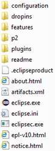

## O-RAN.WG1.Information Model and Data Models-v01.00.docx

- View in [Reader Mode](https://simewu.com/spec-reader/pages/11-WG1/O-RAN.WG1.Information%20Model%20and%20Data%20Models-v01.00.docx).
- Go back to [Table of Contents](../README.md).
- Download the [Original Document](https://github.com/Simewu/spec-reader/raw/refs/heads/main/documents/O-RAN.WG1.Information%20Model%20and%20Data%20Models-v01.00.docx).

---

**O-RAN Information Model and Data Models Specification**

**This is a re-published version of the attached final specification.**

For this re-published version, the prior versions of the IPR Policy will apply, except that the previous requirement for Adopters (as defined in the earlier IPR Policy) to agree to an O-RAN Adopter License Agreement to access and use Final Specifications shall no longer apply or be required for these Final Specifications after 1st July 2022.

The copying or incorporation into any other work of part or all of the material available in this specification in any form without the prior written permission of O-RAN ALLIANCE e.V. is prohibited, save that you may print or download extracts of the material on this site for your personal use, or copy the material on this site for the purpose of sending to individual third parties for their information provided that you acknowledge O-RAN ALLIANCE as the source of the material and that you inform the third party that these conditions apply to them and that they must comply with them.

1

**O-RAN Information Model and Data Models Specification**

Copyright (C) 2021 by O-RAN ALLIANCE e.V.

By using, accessing or downloading any part of this O-RAN specification document, including by copying, saving, distributing, displaying or preparing derivatives of, you agree to be and are bound to the terms of the O-RAN Adopter License Agreement contained in the Annex ZZZ of this specification. All other rights reserved.

O-RAN ALLIANCE e.V.

Buschkauler Weg 27, 53347 Alfter, Germany Register of Associations, Bonn VR 11238 VAT ID DE321720189

[www.o-ran.org](http://www.o-ran.org/)

# 1 Contents

2

1. Chapter 1. Introductory Material 3
2. 1.1 Scope 3
3. 1.2 References 3
4. 1.2.1 Definitions and Abbreviations 5
5. 1.2.2 Definitions 5
6. 1.2.3 Abbreviations and acronyms 5
7. Chapter 2. Overview and Philosophy 7
8. 2.1 "Prosumer" relationship between O-RAN and Standards Development Organizations 7
9. 2.2 Information and Data Models as a Modeling Continuum 8
10. 2.3 Information and Data Modeling Co-Evolution 9
11. 2.4 Model and Use Case Development (process) 10
12. 2.5 O-RAN components reflected within O-RAN Information Model and Data Model(s) 10
13. 2.6 Open Issues and Future Considerations 11
14. Chapter 3. O-RAN Information Model 12
15. 3.1 A general view of an Information Model 12
16. 3.2 Modeling approach, Unified Modeling Language (UML) 12
17. 3.3 IISOMI (Informal Inter-SDO Open Model Initiative) guidelines 12
18. 3.4 General Information on the UML Model 13
19. 3.5 O-RAN Information Model 13
20. 3.6 Classes/components and interfaces that comprise the O-RAN Information Model and Data Models 13
21. 3.7 Installing and using Papyrus 14
22. Chapter 4. O-RAN Data Models 15
23. 4.1 Repositories; current conventions to distinguish between models under development versus models that
24. are approved for use 15
25. 4.2 Formal relationship (traceability) between O-RAN Data Models and the O-RAN Information Model 16
26. 4.3 Usage of 3GPP Data Models 17
27. 4.4 Usage of non-3GPP data models 18
28. 4.5 YANG Conventions 21
29. 4.5.1 Naming 21
30. 4.5.2 Revision Statement 21
31. 4.5.3 Indents 22
32. 4.5.4 YANG Language Usage 22
33. 4.5.5 Cross Working Group Co-ordination 22
34. Annex A: Link to Information Model source (under development; not approved for use) 23
35. [Annex B: Installing and using Eclipse Papyrus refer to O-RAN wiki for the most up-to-date guidelines] 24
36. Annex C: Links to Data Models approved for use 28
37. Annex ZZZ : O-RAN Adopter License Agreement 29
38. Section 1: DEFINITIONS 29
39. Section 2: COPYRIGHT LICENSE 29
40. Section 3: FRAND LICENSE 29
41. Section 4: TERM AND TERMINATION 30
42. Section 5: CONFIDENTIALITY 30
43. Section 6: INDEMNIFICATION 30
44. Section 7: LIMITATIONS ON LIABILITY; NO WARRANTY 30
45. Section 8: ASSIGNMENT 31
46. Section 9: THIRD-PARTY BENEFICIARY RIGHTS 31
47. Section 10: BINDING ON AFFILIATES 31
48. Section 11: GENERAL 31

51

# 1 Chapter 1.Introductory Material

## 1.1 Scope

1. This Technical Specification has been produced by the O-RAN.org.
2. The contents of the present document are subject to continuing work within O-RAN WG1 and may change following
3. formal O-RAN approval. Should the O-RAN.org modify the contents of the present document, it will be re-released by
4. O-RAN Alliance with an identifying change of release date and an increase in version number as follows:
5. Release x.y.z
6. where:
7. x the first digit is incremented for all changes of substance, i.e. technical enhancements, corrections, updates,
8. etc. (the initial approved document will have x=01).
9. y the second digit is incremented when editorial only changes have been incorporated in the document.
10. z the third digit included only in working versions of the document indicating incremental changes during the
11. editing process.
12. **This document is both a Specification and an Informational Report in that it specifies the Information Model (not**
13. **yet approved for use) and the Data Models (approved for use) that are foundational for O-RAN's model-driven**
14. **architecture and for the functions carried out over O-RAN interfaces, e.g., management functions, procedures,**
15. **operations and corresponding solutions.**
16. **In addition, this document includes information about existing standards and industry work that serve as a basis**
17. **for work items in O-RAN. There is a "prosumer" relationship evolving between O-RAN and 3GPP, as each makes**
18. **its model available and provides model feedback to the other.**
19. **Lastly, this document describes the de facto methods and procedures with respect to a "modeling continuum" that**
20. **aims to establish and evolve an O-RAN Information Model from which O-RAN Data Models may be generated**
21. **manually or with a set of tools.**

## 1.2 References

1. The following documents contain provisions which, through reference in this text, constitute provisions of the present
2. document.
3. - References are either specific (identified by date of publication, edition number, version number, etc.) or
4. non-specific.
5. - For a specific reference, subsequent revisions do not apply.
6. - For a non-specific reference, the latest version applies. In the case of a reference to a 3GPP document (including
7. a GSM document), a non-specific reference implicitly refers to the latest version of that document in Release 16 32

|  |  |  |
| --- | --- | --- |
| 33 | [1] | 3GPP TR 21.905: Vocabulary for 3GPP Specifications |
| 34 | [2] | 3GPP TR 28.890: Management and orchestration; Study on integration of Open Network Automation |
| 35 |  | Platform (ONAP) and 3GPP management for 5G networks |
| 36 | [3] | 3GPP TS 28.530: "Management and orchestration; Concepts, use cases and requirements" |
| 37 | [4] | 3GPP TS 28.531: Management and orchestration; Provisioning |
| 38 | [5] | 3GPP TS 28.532: Management and orchestration; Generic management services |
| 39 | [6] | 3GPP TS 28.533: Management and orchestration: Architecture framework |
| 40 | [7] | 3GPP TS 28.540: Management and orchestration; 5G Network Resource Model (NRM); Stage 1 |
| 41 | [8] | 3GPP TS 28.541: Management and orchestration; 5G Network Resource Model (NRM); Stage 2 and stage 3 |
| 42 | [9] | 3GPP TS 28.545: Management and orchestration; Fault Supervision (FS) |

|  |  |  |
| --- | --- | --- |
| 1 | [10] | 3GPP TS 28.550: Management and orchestration; Performance assurance |
| 2 | [11] | 3GPP TS 28.552: Management and orchestration; 5G performance measurements |
| 3 | [12] | 3GPP TS 28.554: Management and orchestration; 5G end to end Key Performance Indicators (KPI) |
| 4 | [13] | 3GPP TS 28.621: Telecommunication management; Generic Network Resource Model (NRM) Integration |
| 5 |  | Reference Point (IRP); Requirements |
| 6 | [14] | 3GPP TS 28.622: Telecommunication management; Generic Network Resource Model (NRM) Integration |
| 7 |  | Reference Point (IRP); Information Service (IS) |
| 8 | [15] | 3GPP TS 32.341: Telecommunication management; File Transfer (FT) Integration Reference Point (IRP); |
| 9 |  | Requirements |
| 10 | [16] | 3GPP TS 32.342: Telecommunication management; File Transfer (FT) Integration Reference Point (IRP); |
| 11 |  | Information Service (IS) |
| 12 | [17] | 3GPP TS 32.346: Telecommunication management; File Transfer (FT) Integration Reference Point (IRP): |
| 13 |  | Solution Set (SS) definitions |
| 14 | [18] | 3GPP TS 32.421: Telecommunication management; Subscriber and equipment trace; Trace concepts and |
| 15 |  | requirements |
| 16 | [19] | 3GPP TS 32.422: Telecommunication management; Subscriber and equipment trace; Trace control and |
| 17 |  | configuration management |
| 18 | [20] | 3GPP TS 32.423: Telecommunication management; Subscriber and equipment trace; Trace data definition |
| 19 |  | and management |
| 20 | [21] | 3GPP TS 32.508: Telecommunication management; Procedure flows for multi-vendor plug-and-play eNode |
| 21 |  | B connection to the network |
| 22 | [22] | 3GPP TS 32.509: Telecommunication management; Data formats for multi-vendor plug and play eNode B |
| 23 |  | connection to the network |
| 24 | [23] | 3GPP TS 38.401: NG-RAN; Architecture description |
| 25 | [24] | O-RAN-WG4.MP.0-v05.00: O-RAN Alliance Working Group 4 Management Plane Specification |
| 26 | [25] | O-RAN WG1 OAM Architecture v03.00 |
| 27 | [26] | RFC 6241, "Network Configuration Protocol (NETCONF)", IETF, June 2011 |
| 28 | [27] | RFC 7950, "The YANG 1.1 Data Modeling Language", IETF, August 2016 |
| 29 | [28] | 3GPP TS 32.156: Telecommunication management; Fixed Mobile Convergence (FMC) Model repertoire |
| 30 | [29] | 3GPP TS 32.160: Management and orchestration; Management service template |
| 31 | [30] | ONF TR-514: UML Modeling Guidelines |
| 32 | [31] | ONF TR-515: Papyrus Guidelines |
| 33 | [32] | ONF TR-531: UML to YANG Mapping Guidelines |
| 34 | [33] | O-RAN Information Model (from Eclipse/Papyrus); <https://wiki.o-ran-sc.org/x/RYCj> |
| 35 | [34] | "Modeling, Use Case and Architecture Process," B.Cheung et al, May 2019, ONAP |
| 36 |  |  |
| 37 |  |  |
| 38 |  |  |
| 39 |  |  |
| 40 |  |  |

### 1.2.1 Definitions and Abbreviations

* 1. 1.2.2 Definitions
  2. For the purposes of the present document, the terms and definitions given in 3GPP TR 21.905 [1] and the following apply.
  3. A term defined in the present document takes precedence over the definition of the same term, if any, in 3GPP TR 21.905
  4. [1].

### 1.2.3 Abbreviations and acronyms

* 1. For the purposes of the present document, the abbreviations given in 3GPP TR 21.905 [1] and the following apply. An
  2. abbreviation defined in the present document takes precedence over the definition of the same abbreviation, if any, in
  3. 3GPP TR 21.905 [1].

10

|  |  |  |
| --- | --- | --- |
| 11 | 3GPP | 3rd Generation Partnership Project |
| 12 | API | Application Programming Interface |
| 13 | CR | Change Requests |
| 14 | EMS | Element Management System |
| 15 | FCAPS | Fault, Configuration, Accounting, Performance, Security |
| 16 | IOC | Information Object Class |
| 17 | LS | Liaison Statement |
| 18 | MANO | Management and Orchestration |
| 19 | ME | Managed Element |
| 20 | MF | Managed Function |
| 21 | MnS | Management Service |
| 22 | MO | Managed Object |
| 23 | MOC | Managed Object Class |
| 24 | MOI | Managed Object Instance |
| 25 | NAT | Network Address Translation |
| 26 | Near-RT RIC | O-RAN near real time RAN Intelligent Controller |
| 27 | NMS | Network Management System |
| 28 | Non-RT RIC | O-RAN non real time RAN Intelligent Controller |
| 29 | NRM | Network Resource Model |
| 30 | O-CU-CP | O-RAN Central Unit - Control Plane. |
| 31 | O-CU-UP | O-RAN Central Unit - User Plane |
| 32 | O-DU | O-RAN Distributed Unit |
| 33 | OMG | Object Management Group |
| 34 | O-RAN | Open Radio Access Network |
| 35 | O-RU | O-RAN Radio Unit |
| 36 | ONAP | Open Network Automation Platform |
| 37 | PNF | Physical Network Function |

|  |  |  |
| --- | --- | --- |
| 1 | RAN | Radio Access Network |
| 2 | RRH | Remote Radio Head |
| 3 | SDO | Standards Development Organization |
| 4 | SMO | Service Management and Orchestration (layer) |
| 5 | TR | Technical Report |
| 6 | TS | Technical Specification |
| 7 | UML | Unified Modeling Language |
| 8 | SA5 | Services & System Aspects Working Group 5 Telecom Management |
| 9 | VNF | Virtualized Network Function |

# 1 Chapter 2.Overview and Philosophy

## 2.1 "Prosumer" relationship between O-RAN and Standards

1. Development Organizations
2. The O-RAN Alliance complements the work of other Standards Development Organizations (SDO): 3GPP, IETF, and
3. IANA are among the primary sources for OAM (Management) specifications for O-RAN components.
4. 3GPP published its 5G Network Resource Model (Information Model) as well as "Trial - SA5 Data models," i.e., yang
5. data models in a publicly available git repository with the license statement "No license. All rights reserved."
6. In addition, 3GPP published its 4G Network Resource Model (Information Model); however, this is not yet being
7. referenced and/or used within O-RAN. It should be noted that there is a proposal within O-RAN to model O-eNB that
8. is likely to necessitate the inclusion of elements from 4G NRM as part of a subsequent release.
9. To reiterate, the O-RAN Information Model, Data Models, and modeling processes should complement the work of
10. other SDOs, not conflict or compete.
11. Accordingly, whenever any O-RAN WG (Working Group) identifies defects and/or omissions in 3GPP models, a
12. Change Request (CR) is fed back into 3GPP for a mutually agreed upon resolution. It should be noted, however, that
13. there is still no formalized process for 3GPP to receive CRs from the O-RAN Alliance. This could be addressed via a
14. statement of intent to be followed by 3GPP member companies that, more often than not, are O-RAN member
15. companies as well.
16. Not all identified gaps are within the 3GPP domain. Some may be specific to O-RAN and are not suitable for inclusion
17. in 3GPP.
18. As 3GPP CRs are approved, they are incorporated into the O1 Interface Specification. This, in turn, drives the updates
19. that are to be made to both the Information Model and Data Models within O-RAN. Alignment should proceed as a
20. clearly defined sequence of events. 23

24

25

26

27

28

29

30

31

32

33

34

35

36

37

## 2.2 Information and Data Models as a Modeling Continuum

1. Within O-RAN, the de facto methods and procedures with respect to the early stage of an O-RAN "modeling continuum"
2. aim to evolve **one common and coherent Information Model for providing O-RAN extensions to the existing 4G/5G**
3. **IMs such as the 3GPP NRMs, from which O-RAN Data Models may be generated manually or with a set of tools.**

5

6

7

8

1. **Definitions:**

**Figure 1 Information and Data Models as a Modeling Continuum (conceptual)**

1. Information Model: a representation of concepts and the relationships, constraints, rules, and operations to specify data
2. semantics for a chosen domain of discourse. Typically, and Information Model specifies relations between kinds of
3. things, but may also include relations with individual things. It can provide sharable, stable, and organized structure of
4. information requirements or knowledge for the domain context.
5. Data Model: an abstract model that organizes elements of data and standardizes how they relate to one another and to
6. the properties of real-world entities. The term data model may refer to two distinct but closely related concepts: (1) an
7. abstract formalization of the objects and relationships found in a particular application domain; (2) the set of concepts
8. used in defining such formalizations - for example concepts such as entities, attributes, relations, or tables.
9. Logical Data Model: a data model of a specific problem domain expressed independently of a particular database
10. management product or storage technology (physical data model) but in terms of data structures such as relational tables
11. and columns, object-oriented classes, or XML tag
12. Data Dictionary: a centralized repository of information about data such as meaning, relationships to other data, origin,
13. usage, and format
14. Component Physical Data Models: a representation of a data design as implemented, or intended to be implemented, in
15. a database management system for each component. In the lifecycle of a project it typically derives from a logical data
16. model and will include the database artifacts required to create relationships between tables or to achieve performance
17. goals, such as indexes, constraint definitions, linking tables, partitioned tables or clusters 27

28

## 2.3 Information and Data Modeling Co-Evolution

1. The "Modeling Continuum" depicted as Figure 1 (above) is purely conceptual and is intended to provide a framework
2. for Information and Data Modeling Co-evolution that can be applied within both O-RAN and 3GPP, laying the
3. groundwork for collaboration.
4. Here is an example of the process to be adapted to, and adopted by, O-RAN: 6

7

1. **Figure 2 Information and Data Modeling Co-Evolution**
2. ["Modeling, Use Case and Architecture Process," B.Cheung et al, May 2019, ONAP] 10

11

12

13

14

15

16

17

18

19

20

## 2.4 Model and Use Case Development (process)

1. In addition, there is another evolvoing process within O-RAN and 3GPP to guide and inform Information Model and
2. Data Model(s) development based on prioritized use cases.
3. Once again, alignment between O-RAN and 3GPP is paramount, as the former establishes a de facto "software-driven
4. standard," while the latter is responsible for the formal approval and acceptance of the full set of release-managed
5. standards for 5G/LTE RAN
6. Here is another example of the process to be adapted to, and adopted by, O-RAN. 8

|  |  |  |
| --- | --- | --- |
| 9 |  | |
| 10 |  | **Figure 3 Model and Use Case Development (process)** |
| 11 |  | ["Modeling, Use Case and Architecture Process," B.Cheung et al, May 2019, ONAP] |
| 12 | 2.5 | O-RAN components reflected within O-RAN Information Model |
| 13 |  | and Data Model(s) |

1. The work to evolve the following O-RAN components will both follow and provide feedback on the OAM Information
2. Model and Data Models of 3GPP:
3. ? Near-RT-RIC
4. ? O-CU-UP
5. ? O-CU-CP
6. ? O-DU
7. ? O-RU
8. ? O-eNB

22

* 1. The O-RAN entities listed below are also expected to be reflected within the O-RAN Information Model:
  2. ? Non-RT-RIC: ManagedApplication (rApp), A1-Policies
  3. ? Near-RT-RIC; ManagedApplication (xApp), A1 interfaces, A1 Policies, A1-Topology
  4. ? E2 interfaces and E2-Topology
  5. ? O2 interfaces and O2-Topology [O-Cloud is a future consideration from a modelling perspective]
  6. ? O1

## 2.6 Open Issues and Future Considerations

* 1. There are numerous Open Issues and Future Considerations that are captured within the O-RAN wiki pages; however,
  2. regardless of any future considerations, the guiding principle is clear and remains unchanged, that O-RAN seeks to re-
  3. use and/or augment, not re-invent, that which already exists and has been adopted, i.e., withstood the test of time, by the
  4. telecommunications industry in the areas of Information and Data Models.
  5. For the most up-to-date compendium of Open Issues and Future Considerations, please refer to the O-RAN wiki.

# 1 Chapter 3.O-RAN Information Model

## 3.1 A general view of an Information Model

1. In general, an Information Model is an abstract but formal representation of entities including their properties,
2. relationships and the operations that can be performed on them. In includes a representation of concepts and the
3. relationships, constraints, rules, and operations to specify data semantics for a chosen domain of discourse:
4. ? Things (Modeled as Classes) with Definitions
5. ? Class Properties (Attributes); Class Relationships
6. ? Association Types (Simple Association, Aggregation, Composition, Inheritance)
7. ? Multiplicity and Direction
8. ? Operations/Behaviors (optional)
9. ? Represented on a Collection of Class Diagrams
10. ? Implementation Independent
11. ? Interfaces - Operations, Attributes (in, out, return)

## 3.2 Modeling approach, Unified Modeling Language (UML)

1. Modeling is the designing of software applications before coding. Modeling is an essential part of large software
2. projects, and helpful to medium and even small projects as well. A model plays the analogous role in software
3. development that blueprints and other plans (site maps, elevations, physical models) play in the building of a
4. skyscraper.
5. Models raise the level of abstraction by hiding or masking details, bringing out the "big picture," or by focusing on
6. different aspects of a prototype.
7. The Information Model within O-RAN uses the Unified Modeling Language(TM) (UML(R)) from the Object Management
8. Group (OMG) with an open source Model-Based Engineering tool, Eclipse Papyrus.

## 3.3 IISOMI (Informal Inter-SDO Open Model Initiative) guidelines

1. The information model is split into a structural part and a behavioral part; i.e., data model (structural/static) is decoupled
2. from operations model (behavioral/dynamic).
3. The following guidelines are sourced from a Technical Recommendation developed within IISOMI (Informal Inter-
4. SDO Open Model Initiative) and originally published by the ONF:
5. o UML 2.5 (Unified Modeling Language) is used for specifying the model
6. o The model shall be management/control protocol-neutral, i.e., not reflect any middleware protocol-specific
7. characteristics (like e.g., CORBA, HTTP, JMS)
8. o The model shall be map-able to various protocol-specific interfaces (it is recommended to automate this mapping
9. supported by tools)
10. o It shall be possible to separate UML artifact properties which are only required for interface related (purpose
11. specific) models.
12. o Traceability from each modeling construct back to requirements and use cases shall be provided whenever possible. 36

## 3.4 General Information on the UML Model

1. The following general information on the model shall be set/defined, i.e., is captured within the tool (Papyrus) that is
2. currently being used within O-RAN:
3. o Namespace - a unique and persistent namespace for the identifiers in the model.
4. o Organization - a human friendly written name of the SDO/Open Source Project defining the model.
5. o Contact - detailed information on the project and editor which have developed the model.
6. o Description - a brief description of the model content; 1 line (optional).
7. o Copyright - the copyright notice for the model.
8. o License - the license statement for the model.
9. o Revision - detailed information on this revision of the model. Each revision of the model should add an additional
10. revision statement.

## 3.5 O-RAN Information Model

1. Typically, the Information Model specifies relations between kinds of things, but may also include relations with
2. individual things. It can provide sharable, stable, and organized structure of information requirements or knowledge for
3. the domain context.
4. The complete Information Model in both human- and machine-readable formats as of the date of this document may be
5. found in O-RAN's bitbucket - refer to Appendix A.
6. Please make sure that you are logged in using your Atlassian user ID & password.
7. **Note that access to the Information Model is purely for informational purposes, as the O-RAN Information**
8. **Model is still under development and is not yet approved for use.**

## 3.6 Classes/components and interfaces that comprise the O-RAN

1. Information Model and Data Models
2. Following are a list of classes/components as well as interfaces that should be part of the O-RAN Information model,
3. along with the working group developing this entity, any SDO references if appropriate, followed by comments and the
4. status. This is based on the premise that each WG is responsible for modeling the entity within the modeling tool,
5. Eclipse Papyrus, and WG1 is responsible for stewarding the overarching model inclusive of the input from the other
6. groups.

28

|  |  |  |  |  |
| --- | --- | --- | --- | --- |
| **Entity** | **WG Developing Model** | **Doc Reference** | **Comments** | **Status** |
| *Class / Component* |  |  |  |  |
| NonRTRIC |  |  | Out of scope for O-RAN, but will have interfaces into O-RAN components. |  |
| NearRTRIC | WG3 |  | Presently shell only in model. |  |
| O-CU-CP | WG5 | 3GPP TS 28.541 | 3GPP start, including attributes |  |
| O-CU-UP | WG5 | 3GPP TS 28.541 | 3GPP start, including attributes |  |
| O-DU |  | 3GPP TS 28.541 | 3GPP start, including attributes |  |

|  |  |  |  |  |
| --- | --- | --- | --- | --- |
| O-RU |  |  | Shell only |  |
| ManagedElement |  | 3GPP TS 28.622 | Class and attributes |  |
| Xapp |  |  | Not present in model |  |
|  |  |  |  |  |
| *Interfaces* |  |  |  |  |
| A1-P | WG2 | O-RAN.WG2.A1AP- v03.00 |  |  |
| A1-ML | WG2 |  | Shell Only - to be pursued in a later release |  |
| A1-EI | WG2 |  | Shell Only - to be pursued in a later release |  |
| O1 | WG1 | O-RAN-WG1.O1  Interface -v04 |  |  |
| E1 | WG5 | 3GPP TS 38.460 | 3GPP start, including operations list |  |
| E2 | WG3 | ORAN-WG3.E2GAP.0- v0.1 | Interface with 9 operations |  |
| F1-c | WG5 | 3GPP TS 38.470 | 3GPP start, including 24 operations |  |
| F1-u | WG5 | 3GPP TS 38.470 | 3GPP start, including limited operation list |  |
| OpenFrontHaul | WG4 | front-haul mplane / cus | Shell only |  |
| X2 | WG5 | 3GPP TS 36.423 | 3GPP based start, including a large number of operations |  |
| O2 | WG6 |  | Not present in model |  |

* 1. **Table 1 Classes/components and interfaces that comprise the O-RAN Information Model and Data Model(s)**

## 3.7 Installing and using Papyrus

* 1. Eclipse Papyrus is an industrial-grade open source Model-Based Engineering tool. Eclipse Papyrus has notably been
  2. used successfuly in industrial projects and is the base platform for several industrial modeling tools.
  3. **Information about this tool and how to use it as well as how it is being used within O-RAN may be found in**
  4. **Appendix B.**

# 1 Chapter 4.O-RAN Data Models

1. For O1 interfaces, the O-RAN Information Model development should precede and serve as the basis for the Data
2. Model development within each working group (WG1 through WG9).
3. 4.1 Repositories; current conventions to distinguish between
4. models under development versus models that are approved
5. for use
6. The data models are developed and published in working group specific bitbucket that are expected to be available at
7. the time this document is published:
8. <https://bitbucket.org/bitbucket-o-ran-alliance/workgroup1>
9. <https://bitbucket.org/bitbucket-o-ran-alliance/workgroup2>
10. <https://bitbucket.org/bitbucket-o-ran-alliance/workgroup3>
11. <https://bitbucket.org/bitbucket-o-ran-alliance/workgroup4>
12. <https://bitbucket.org/bitbucket-o-ran-alliance/workgroup5>
13. <https://bitbucket.org/bitbucket-o-ran-alliance/workgroup6>
14. <https://bitbucket.org/bitbucket-o-ran-alliance/workgroup7>
15. <https://bitbucket.org/bitbucket-o-ran-alliance/workgroup8>
16. <https://bitbucket.org/bitbucket-o-ran-alliance/workgroup9>
17. **Note that these are private repositories that include models that are under development, i.e., not yet approved**
18. **for use.**
19. O-RAN users who require access to bitbucket are instructed to email the WG co-chair(s) with "O-RAN WG\_ REPO
20. ACCESS" in the Subject: field, filling in the blank "WG\_" with the number of the WG for which repository access is
21. being requested.
22. **The link to the public-facing repository that includes the formally released versions of models may be found**
23. **within Appendix C.**
24. There is a convention to identify formally published data models and distinguish them from models that are considered
25. "experimental," i.e., still under development, not yet approved for use:
26. *The revision statement in all YANG models includes a reference statement used to cross-reference the first version*
27. *of the document where the corresponding description was introduced. For example, the reference in all revision*
28. *statements for the initial O-RAN models from WG4 include cross-reference to "ORAN-WG4.MP.0-v01.00".*
29. *The revision statement of the YANG models also includes a description that is used to track the versioning of the*
30. *YANG model. All revision statement descriptions will begin with "version "<a>"."<b>"."<c>, where <a>, <b>*
31. *and <c> are used to reflect the version of the YANG model, where*
32. *<a> corresponds to the first digit of the O-RAN specification version where the corresponding description*
33. *was first introduced, corresponding to <x> in sub-section 1.1;*
34. *<b> is incremented when errors in the YANG model have been corrected;*
35. *<c> is incremented only in working versions of the YANG model indicating incremental changes during the*
36. *editing process.*

38

## 4.2 Formal relationship (traceability) between O-RAN Data Models

* 1. and the O-RAN Information Model
  2. At present, there is no formal relationship and/or traceability between the O-RAN Data Models and O-RAN
  3. Information Model; however, this is expected to evolve over time.
  4. As indicated within Chapter 2 "Overview and Philosophy," there is a modeling continuum that aims to establish and
  5. evolve one common and coherent Information Model for 5G/LTE RAN from which Data Models may be generated
  6. either manually or with a set of tools.
  7. As the modeling practices and processes within O-RAN mature, the Information Model and Data Models are expected
  8. to co-evolve to develop the APIs required by specific use cases, as depicted below. 10

11

1. **Figure 4 Information and Data Modeling Co-Evolution**
2. ["Modeling, Use Case and Architecture Process," B.Cheung et al, May 2019, ONAP] 14

15

16

17

18

19

20

21

## 4.3 Usage of 3GPP Data Models

* 1. The O-RAN Alliance complements the work of other SDOs. 3GPP is the primary source for management plane
  2. specifications for O-RAN components. 3GPP has published its "Trial - SA5 Data models" including its yang data
  3. models in a public available git repository with the license statement "No license. All rights reserved."
  4. Please refer to Appendix C for the 3GPP-source Data Models that are approved for use.
  5. The following table (snapshot) shows a subset of the mapping of 3GPP yang data models to O-RAN element functions
  6. as defined by OAM Architecture Specifications. For the most current mapping, please refer to the O-RAN wiki. 8

|  |  |  |  |  |  |  |
| --- | --- | --- | --- | --- | --- | --- |
| **3GPP yang data model** | **3GPP spec for YANG model** | **o-ru**  (in hybrid mode) | **o-du** | **o-cu-up** | **o-cu-cp** | **near-rt-ric** |
| \_3gpp-5g- common-yang- types | 3GPP TS 28.541 | imported by \_3gpp- common-managed- element | imported by \_3gpp- common-managed- element | imported by  \_3gpp-common- managed-element | imported by  \_3gpp-common- managed- element | imported by  \_3gpp- common- managed- element |
| \_3gpp-common- ep-rp | 3GPP TS 28.623 | [open] o-ran-m- int.yang & o-ran-ru- itf.yang defines the interface of O-RU, maybe it is not needed to O-RU | imported by \_3gpp- nr-nrm-ep  abstract superclass for all 3GPP endpoints  [open] as O-RU remote PORT, to configure eCPRI port of O-DU just EP\_RP looks **not enough** | imported by  \_3gpp-nr-nrm-ep  abstract superclass for all 3GPP endpoints | imported by  \_3gpp-nr-nrm-ep  abstract superclass for all 3GPP endpoints | [open] **need discussion**, if RIC modeled as O-RU which need detailed configuration to interfaces, the common part probably from IETF |
| \_3gpp-common- fm | 3GPP TS 28.623 | imported by \_3gpp- common-managed- element  needed for alarm list handling | imported by \_3gpp- common-managed- element  needed for alarm list handling | imported by  \_3gpp-common- managed-element  needed for alarm list handling | imported by  \_3gpp-common- managed- element  needed for alarm list handling | imported by  \_3gpp- common- managed- element  needed for alarm list handling |
| \_3gpp-common- managed- element | 3GPP TS 28.623 | root object class | root object class | root object class | root object class | root object class |
| \_3gpp-common- managed- function | 3GPP TS 28.623 | needed to extend MF for O-RU functionality | imported by \_3gpp- nr-nrm- gnbdufunction | imported by  \_3gpp-nr-nrm- gnbcuupfunction | imported by  \_3gpp-nr-nrm- gnbcuCPfunction | needed either for a standalone RIC or combined RIC ME |
| \_3gpp-common- measurements | 3GPP TS 28.623 | imported by \_3gpp- common-managed- element  needed for PM job control and threshold monitoring | imported by \_3gpp- common-managed- element  needed for PM job control and threshold monitoring | imported by  \_3gpp-common- managed-element  needed for PM job control and threshold monitoring | imported by  \_3gpp-common- managed- element  needed for PM job control and threshold monitoring | imported by  \_3gpp- common- managed- element  needed for PM job control and threshold monitoring |

|  |  |  |  |  |  |  |
| --- | --- | --- | --- | --- | --- | --- |
| \_3gpp-common- subnetwork | 3GPP TS 28.623 | imported by \_3gpp- common- subscription-control  not needed from O- RAN point of view but cant be removed with modification of the yang, Contribution to 3GPP required | imported by \_3gpp- common- subscription-control  not needed from O- RAN point of view but cant be removed with modification of the yang, Contribution to 3GPP required | imported by  \_3gpp-common- subscription- control  not needed from O-RAN point of view but cant be removed with modification of the yang, Contribution to 3GPP required | imported by  \_3gpp-common- subscription- control  not needed from O-RAN point of view but cant be removed with modification of the yang, Contribution to 3GPP required | imported by  \_3gpp- common- subscription- control  not needed from O-RAN point of view but cant be removed with modification of the yang, Contribution to 3GPP required |
| \_3gpp-common- subscription- control | 3GPP TS 28.623 | needed for VES subscription | needed for VES subscription | needed for VES subscription | needed for VES subscription | needed for VES subscription |
| \_3gpp-common- top | 3GPP TS 28.623 | imported by \_3gpp- common-managed- element  abstract class supplying a naming attribute | imported by \_3gpp- common-managed- element  abstract class supplying a naming attribute | imported by  \_3gpp-common- managed-element  abstract class supplying a naming attribute | imported by  \_3gpp-common- managed- element  abstract class supplying a naming attribute | imported by  \_3gpp- common- managed- element  abstract class supplying a naming attribute |
| \_3gpp-common- yang-extensions | 3GPP TS 28.623 | expected for inVariant | expected for inVariant | expected for inVariant | expected for inVariant | expected for inVariant |
| \_3gpp-common- yang-types | 3GPP TS 28.623 | imported by many other 3GPP yang modules  essential 3GPP typedefs, in particular DistinguishedName, and other useful typedefs like OperationalState, AdministrativeState, AvailabilityStatus | imported by many other 3GPP yang modules  essential 3GPP typedefs, in particular DistinguishedName, and other useful typedefs like OperationalState, AdministrativeState, AvailabilityStatus | imported by many other 3GPP yang modules  essential 3GPP typedefs, in particular DistinguishedNam e, and other useful typedefs like OperationalState, AdministrativeStat e, AvailabilityStatus | imported by many other 3GPP yang modules  essential 3GPP typedefs, in particular DistinguishedNa me, and other useful typedefs like OperationalState, AdministrativeSta te, AvailabilityStatus | imported by many other 3GPP yang modules  essential 3GPP typedefs, in particular DistinguishedN ame, and other useful typedefs like OperationalStat e, AdministrativeS tate, AvailabilityStatu s |

1

2 **Table 2 Mapping of 3GPP yang data models to O-RAN element functions**

3

## 4.4 Usage of non-3GPP data models

1. There are domains of data-models being considered by O-RAN WGs (Working Groups) that are not covered by 3GPP
2. but are covered by other SDOs, e.g., IETF, MEF, IEEE, ONF, BBF, and occasionally imported by 3GPP.
3. Note that this is merely a snapshot as of the date of this document and is expected to be revisited as part of subsequent
4. release(s).
5. The following table shows data models that are of interest and being considered within O-RAN and/or 3GPP: 10

|  |  |  |  |  |  |  |  |
| --- | --- | --- | --- | --- | --- | --- | --- |
| **Order No** | **yang data model** | **o-ru (to be revised to separate O1 and M-Plane)** | **o-du** | **o-cu-up** | **o-cu-cp** | **near-rt-ric** | **Comments** |
| 001 | ietf-yang- types | import by several models including \_3gpp- common-yang- types.yang | import by  \_3gpp- common-yang- types.yang | import by  \_3gpp- common- yang- types.yang | import by  \_3gpp- common- yang- types.yang | import by  \_3gpp- common- yang- types.yang |  |
| 002 | ietf-inet- types | import by several models including \_3gpp- common-yang- types.yang | import by  \_3gpp- common-yang- types.yang | import by  \_3gpp- common- yang- types.yang | import by  \_3gpp- common- yang- types.yang | import by  \_3gpp- common- yang- types.yang |  |
| 011 | ietf- netconf.yang | must have | must have | must have | must have | must have |  |
| 012 | ietf-netconf- acm.yang | baseline for access control |  |  |  |  | Network Configuration Access Control Model |
| 013 | ietf-netconf- monitoring | used by WG4 M- Plane |  |  |  |  | NETCONF Monitoring Module |
| 014 | ietf-netconf- nmda |  |  |  |  |  | NETCONF operations to support  the Network Management Datastore Architecture |
| 015 | ietf-netconf- notifications | not O1 but OpenFronthaul mPlane | not O1 but OpenFronthaul mPlane |  |  |  | This module defines a YANG data model for use with the  NETCONF protocol that allows the NETCONF client to receive common NETCONF base event notifications |
| 016 | ietf-netconf- partial-lock |  |  |  |  |  |  |
| 017 | ietf-netconf- time |  |  |  |  |  | time-triggered configuration and management operations |
| 018 | ietf-netconf- with-defaults |  |  |  |  |  | NETCONF client to control how default values are handled by the server in particular NETCONF operations |

|  |  |  |  |  |  |  |  |
| --- | --- | --- | --- | --- | --- | --- | --- |
| 020 | ietf-system | overlaps with o- ran-operations but may be required to support 802.1X |  |  |  |  | configuration and identification of some common system properties within a device containing a NETCONF server   * time-zone management * radius * local users * NTP |
| 030 | ietf-hardware | not O1 but OpenFronthaul mPlane | not O1 but OpenFronthaul mPlane |  |  |  |  |
| 031 | iana- hardware | import by ietf- hardware | import by ietf- hardware |  |  |  | IANA-defined identities for hardware class. |
| 032 | ietf- hardware- state |  |  |  |  |  | hardware monitoring |
| 033 | ietf- interfaces | foundation for fronthaul |  |  |  |  |  |
| 034 | iana-if-type | not O1 but OpenFronthaul mPlane | not O1 but OpenFronthaul mPlane |  |  |  | YANG identities for IANA- registered  interface types |
| 040 | ietf-alarms |  |  |  |  |  | This module defines an interface for managing alarms. |
|  | ietf-ip | foundation for fronthaul M- Plane |  |  |  |  | managing IP implementations |
|  | ietf-ptp | considered - but decided o define owno-ran- sync.yang |  |  |  |  | configuration of IEEE Std 1588-2008 clocks |
|  | ietf-yang- library | foundation for YANG 1.1 |  |  |  |  |  |
|  | ietf-yang- metadata |  |  |  |  |  | This YANG module defines an 'extension' statement that allows  for defining metadata annotations |
|  | ietf-yang- patch |  |  |  |  |  | This module contains conceptual YANG specifications for the YANG Patch and YANG Patch Status data structures. |

|  |  |  |  |  |  |  |  |
| --- | --- | --- | --- | --- | --- | --- | --- |
|  | ietf-yang- push |  |  |  |  |  |  |
|  | ietf-yang- schema- mount |  |  |  |  |  | This module defines a YANG extension statement that can be used to incorporate data models defined in other YANG modules in a  module. |
|  | ietf-yang- smiv2 |  |  |  |  |  | This module defines YANG extensions that are used to translate  SMIv2 concepts into YANG. |
|  | iana-crypto- hash | used in CTI |  |  |  |  |  |
|  | ietf-crypto- types | used by fronthaul file management |  |  |  |  |  |
|  | ieee802- dot1x | being considered by STG |  |  |  |  |  |

1

1. **Table 3 Non 3GPP yang models**

3

## 4.5 YANG Conventions

1. This section describes the recommended conventions to be used in the O-RAN Alliance when writing YANG models.
2. In particular, because the creation and maintenance of YANG models is expected to be distributed across different
3. working groups, this guide is intended to ensure that the way the models are organized and presented will be consistent
4. across the entirety of the O-RAN Alliance.

### 4.5.1 Naming

1. MODULE FILE NAMING: M-Plane YANG modules should have filenames of the form "o-ran-xxx.yang" (for O1 the
2. file naming is TBD)
3. MODULE NAMESPACE: YANG modules should have a namespace defined of the form namespace "urn:o-
4. ran:xxx:version"; where version represents an increasing numerical integer value and where the value used in all newly
5. defined models is "1". The module namespace version will be incremented when any non-backwards compatible
6. changes are introduced into a model.
7. PREFIX NAMING: Each module requires a prefix statement with a prefix that other dependent modules will use (also
8. used in path references within the same module). Prefixes should be short and clear, with abbreviations as appropriate.
9. Module prefixes should be of the form: o-ran-xxx, or or-xxx, and must be unique regardless of over which interface the
10. YANG module is exposed (ex. O1 or Open FrontHaul M-Plane).

### 4.5.2 Revision Statement

1. The revision statement in all YANG models includes a reference statement used to cross-reference to the version of a
2. particular O-RAN publication where the corresponding functionality was initially introduced. The revision statement of
3. the YANG models also includes a description that is used to track the versioning of the YANG model. All revision
4. statement descriptions will begin with version a.b.c, where a, b and c are used to reflect the version of the YANG
5. model, where 'a' corresponds to the first digit of the O-RAN specification version where the corresponding
6. description was first introduced; 'b' is incremented when errors in the YANG model have been corrected; 'c' is
7. incremented only in working versions of the YANG model indicating incremental changes during the editing process.
8. Hence, all published versions of O-RAN alliance YANG models should have this value set to zero.

### 4.5.3 Indents

1. O-RAN Alliance YANG models should use two-space tab indents.

### 4.5.4 YANG Language Usage

1. YANG VERSION: All models should use YANG data modeling language version 1.1 [1] (RFC 7950) and follow the
2. Guidelines for Authors and Reviewers of YANG Data Model Documents [RFC 6087].
3. TOP-LEVEL DATA NODE: There should only be one top-level data node defined in each YANG module, if any data
4. nodes are defined at all.
5. NMDA (Network Management Datastore Architecture): No O-RAN YANG models should prevent the use of NMDA
6. [RFC 8342].
7. KEY-LESS LISTS OF OPERATIONAL STATE: Although permitted in YANG, the use of a list that consists of
8. operational-state without a defined key should be avoided.
9. VALIDATION: All YANG modules should be validated / compiled with pyang tool using the following flag: pyang --
10. lint <module>. Note, successful compilation with pyang does not guarantee a working model, as xPATH expressions
11. aren't evaluated and forbidden operational data dependencies in the configuration may not generate appropriate errors.
12. NETCONF ACCESS CONTROL: Sensitive data within models should be tagged with an appropriate "nacm:default"
13. statement. O-RAN makes use of NACM (NETCONF Access Control Model RFC 8341) rules to define the privileges
14. associated with user groupings. An O-RAN NETCONF server should hard code these restrictions into the server. The
15. defined NACM rules are therefore unmodifiable, with the rules being used to provide an "external indication" of such
16. restrictions.
17. CONSTRAINTS: Generally, O-RAN systems should strive to consider a blank configuration to be a valid config.

### 4.5.5 Cross Working Group Co-ordination

1. Models that are likely to be applicable to more than one O-RAN Alliance working group should provide clear
2. delineation between separate working groups configuration and/or state. The use of feature and if-feature is
3. recommended to ensure that NETCONF servers are not required to implement the entire data model, e.g., when aspects
4. of such relate to the individual working group defined use cases. The feature name should indicate which working
5. group the capabilities have been defined by. 32

# 1 Annex A: Link to Information Model source (under

2 development; not approved for use)

3

1. Papyrus sources for the O-RAN Information Model can be found in O-RAN's bitbucket: [https://bitbucket.org/bitbucket-](https://bitbucket.org/bitbucket-o-ran-alliance/workgroup1/src/master/Working/information-model/papyrus/)
2. [o-ran-alliance/workgroup1/src/master/Working/information-model/papyrus/.](https://bitbucket.org/bitbucket-o-ran-alliance/workgroup1/src/master/Working/information-model/papyrus/)
3. Please make sure that you are logged in using your Atlassian userID and password.

# 1 Annex B: Installing and using Eclipse Papyrus [refer to O-

2 RAN wiki for the most up-to-date guidelines]

1. Eclipse Papyrus is an industrial-grade open source Model-Based Engineering tool. Eclipse Papyrus has notably been
2. used successfuly in industrial projects and is the base platform for several industrial modeling tools.
3. Eclipse Papyrus provides editors for all the UML diagrams:
4. ? Class Diagram
5. ? Object Diagram
6. ? Package Diagram
7. ? Composite Structure Diagram
8. ? Component Diagram
9. ? Deployment Diagram
10. ? Profile Diagram
11. ? Use case Diagram
12. ? Activity Diagram
13. ? State machine Diagram
14. ? Communication Diagram
15. ? Sequence Diagram
16. ? Timing Diagram
17. ? Interaction overview Diagram 20

### Installation

1. The Open Source UML tool Papyrus is a plug-in for the Open Source integrated development environment (IDE)
2. Eclipse. GenDoc is the associated tool that allows you to output a model in Papyrus into a word document. The artifacts
3. in the output (diagrams, classes, datatypes, etc.) can be copy/pasted directly into a model project's wiki page.
4. Currently applied tool versions:
5. ? Eclipse: version 4.8 "Photon"
6. ? Papyrus: version 4.0.0
7. ? GenDoc: version 0.6.0
8. Note: the full list of IISOMI-recommended modelling tool downloads in all versions is here:
9. [https://wiki.opennetworking.org/display/OIMT/Papyrus+Releases](https://wiki.opennetworking.org/display/OIMT/Papyrus%2BReleases)
10. ? **Eclipse**
11. ? Eclipse "Photon" Modeling Tools package version 4.8 can be downloaded from here:
12. [{+}](https://www.eclipse.org/downloads/packages/release/photon/r/eclipse-modeling-tools)[https://www.eclipse.org/downloads/packages/release/photon/r/eclipse-modeling-tools+](https://www.eclipse.org/downloads/packages/release/photon/r/eclipse-modeling-tools%2B)
13. ? Select the download link that is appropriate for the machine on which you will be making the install, i.e.
14. "Windows 64-bit"
15. ? This results in the download of a zip file.
16. ? Note that Eclipse Photon requires a 1.8 compatible JVM
17. ? Extract the contents of the zip file to wherever you would like to install Eclipse. On a PC, "Program Files" is
18. always a good option.
19. ? The content of the extracted files should look something like this:
20. 
21. ? To launch eclipse, double-click on the "eclipse.exe" file
22. ? When Eclipse starts coming up, it will prompt you for a "Workspace", providing a default that you can
23. override.
24. ? This is where the Eclipse projects, with associated models, will be stored.
25. ? When Eclipse fully comes up, you can close the Welcome tab
26. ? To verify you have the correct installation of the product, go to "Help" -> "About Eclipse"
27. ? You should see something that looks like
28. this: 
29. ? You have now successfully installed Eclipse
30. ? **Papyrus**
31. ? Papyrus Photon version 4.0.0 can be downloaded from here:
32. [{+}](https://www.eclipse.org/papyrus/download.html)[https://www.eclipse.org/papyrus/download.html+](https://www.eclipse.org/papyrus/download.html%2B)
33. ? Scroll down on the right side of the page and select: "Papyrus Photon 4.0.0 " and select "Download Page"
34. ? This takes you to "Papyrus Update Site for Photon"
35. ? Copy the URL of the update site to which it takes you. Should be something
36. like: [{+}](https://download.eclipse.org/modeling/mdt/papyrus/updates/releases/photon/)[https://download.eclipse.org/modeling/mdt/papyrus/updates/releases/photon/+](https://download.eclipse.org/modeling/mdt/papyrus/updates/releases/photon/%2B)
37. ([{+}](https://download.eclipse.org/modeling/mdt/papyrus/updates/releases/2019-06/)[https://download.eclipse.org/modeling/mdt/papyrus/updates/releases/2019-06/+](https://download.eclipse.org/modeling/mdt/papyrus/updates/releases/2019-06/%2B) for latest version)
38. ? Now you go back into Eclipse and select "Help"-> "Install new software"
39. 

2

3

1. ? An "Available Software" screen comes up. Paste your URL into the "Work with:" box and hit enter
2. ? There should be multiple "Papyrus" related packages available to install. Select only the box: "Papyrus" and
3. make sure the others are not selected.
4. ? Click "Next" to install the product. The installation will check for dependencies and requirements
5. ? You will get a screen indicating what will be installed
6. o Papyrus for UML
7. o Papyrus for UML Developer Resources
8. ? Select Next
9. ? The install will then prompt you to "Accept" the license agreement
10. ? Once accepted, you can select "Finish" and the installation process continues. Note: The installation might
11. take a while, and perhaps even appear to hang for a while. You can see in the lower right hand corner of
12. Eclipse the progress on the install. 
13. ? When the installation is finished, restart Eclipse to begin to use Papyrus.
14. ? Go to "Window"-> "Perspective"->"Open Perspective"-> "Other" and select Papyrus.
15. ? You will now be in the Papyrus Perspective where you can begin to use Papyrus.
16. ? **GenDoc**
17. The Gendoc plugin is used in conjunction with a document template. The template contains instructions that enable
18. generation of a Microsoft Word document. The document can include extracts from the model such as diagrams, class
19. definitions, attribute definitions along with their stereotypes etc as well as figures and text directly entered into the
20. template.
    1. ? In Eclipse, go to "Help" -> "Install new software"
    2. ? Enter the GenDoc site: [{+}](http://download.eclipse.org/gendoc/updates/releases/0.6.0/)[http://download.eclipse.org/gendoc/updates/releases/0.6.0/+](http://download.eclipse.org/gendoc/updates/releases/0.6.0/%2B) in the "Work with"
    3. section and hit enter. 
    4. ? The "gendoc" package should show. Select this package and hit "Next".
    5. ? Follow the instructions to complete the installation. Note: You may get a warning message about installing
    6. software that contains unsigned content - select "Install anyway".
    7. ? A Restart will be required to apply the changes. 8

# 1 Annex C: Links to Data Models approved for use

2

1. From O-RAN
2. The public facing web page that includes the formally released versions of models that are approved for use:
3. [www.o-ran.org/specifications](http://www.o-ran.org/specifications)

6

1. From 3GPP
2. 3GPP is one of the sources for management plane specifications for O-RAN components. 3GPP publishes its "SA5
3. Data models" including its yang data models in a public available git repository:
4. <https://forge.3gpp.org/rep/sa5/MnS>

11

1. From IETF
2. IETF is a complementary source for management plane specifications for O-RAN components. IETF publishes its
3. yang data models (inclusive of IANA yang data models) in a public available git repository:
4. <https://github.com/YangModels/yang/tree/master/standard/ietf>

16

# 1 Annex ZZZ : O-RAN Adopter License Agreement

1. BY DOWNLOADING, USING OR OTHERWISE ACCESSING ANY O-RAN SPECIFICATION, ADOPTER
2. AGREES TO THE TERMS OF THIS AGREEMENT.
3. This O-RAN Adopter License Agreement (the "Agreement") is made by and between the O-RAN Alliance and the
4. entity that downloads, uses or otherwise accesses any O-RAN Specification, including its Affiliates (the "Adopter").
5. This is a license agreement for entities who wish to adopt any O-RAN Specification.

## Section 1: DEFINITIONS

1. 1.1 "Affiliate" means an entity that directly or indirectly controls, is controlled by, or is under common control with
2. another entity, so long as such control exists. For the purpose of this Section, "Control" means beneficial ownership of
3. fifty (50%) percent or more of the voting stock or equity in an entity.
4. 1.2 "Compliant Implementation" means any system, device, method or operation (whether implemented in hardware,
5. software or combinations thereof) that fully conforms to a Final Specification.
6. 1.3 "Adopter(s)" means all entities, who are not Members, Contributors or Academic Contributors, including their
7. Affiliates, who wish to download, use or otherwise access O-RAN Specifications.
8. 1.4 "Minor Update" means an update or revision to an O-RAN Specification published by O-RAN Alliance that does
9. not add any significant new features or functionality and remains interoperable with the prior version of an O-RAN
10. Specification. The term "O-RAN Specifications" includes Minor Updates.
11. 1.5 "Necessary Claims" means those claims of all present and future patents and patent applications, other than design
12. patents and design registrations, throughout the world, which (i) are owned or otherwise licensable by a Member,
13. Contributor or Academic Contributor during the term of its Member, Contributor or Academic Contributorship; (ii)
14. such Member, Contributor or Academic Contributor has the right to grant a license without the payment of
15. consideration to a third party; and (iii) are necessarily infringed by a Compliant Implementation (without considering
16. any Contributions not included in the Final Specification). A claim is necessarily infringed only when it is not possible
17. on technical (but not commercial) grounds, taking into account normal technical practice and the state of the art
18. generally available at the date any Final Specification was published by the O-RAN Alliance or the date the patent
19. claim first came into existence, whichever last occurred, to make, sell, lease, otherwise dispose of, repair, use or operate
20. a Compliant Implementation without infringing that claim. For the avoidance of doubt in exceptional cases where a
21. Final Specification can only be implemented by technical solutions, all of which infringe patent claims, all such patent
22. claims shall be considered Necessary Claims.
23. 1.6 "Defensive Suspension" means for the purposes of any license grant pursuant to Section 3, Member, Contributor,
24. Academic Contributor, Adopter, or any of their Affiliates, may have the discretion to include in their license a term
25. allowing the licensor to suspend the license against a licensee who brings a patent infringement suit against the
26. licensing Member, Contributor, Academic Contributor, Adopter, or any of their Affiliates.

## Section 2: COPYRIGHT LICENSE

1. 2.1 Subject to the terms and conditions of this Agreement, O-RAN Alliance hereby grants to Adopter a nonexclusive,
2. nontransferable, irrevocable, non-sublicensable, worldwide copyright license to obtain, use and modify O-RAN
3. Specifications, but not to further distribute such O-RAN Specification in any modified or unmodified way, solely in
4. furtherance of implementations of an O-RAN
5. Specification.
6. 2.2 Adopter shall not use O-RAN Specifications except as expressly set forth in this Agreement or in a separate written
7. agreement with O-RAN Alliance.

## Section 3: FRAND LICENSE

1. 3.1 Members, Contributors and Academic Contributors and their Affiliates are prepared to grant based on a separate
2. Patent License Agreement to each Adopter under Fair Reasonable And Non- Discriminatory (FRAND) terms and
3. conditions with or without compensation (royalties) a nonexclusive, non-transferable, irrevocable (but subject to
4. Defensive Suspension), non-sublicensable, worldwide patent license under their Necessary Claims to make, have made,
5. use, import, offer to sell, lease, sell and otherwise distribute Compliant Implementations; provided, however, that such
6. license shall not extend: (a) to any part or function of a product in which a Compliant Implementation is incorporated
7. that is not itself part of the Compliant Implementation; or (b) to any Adopter if that Adopter is not making a reciprocal
8. grant to Members, Contributors and Academic Contributors, as set forth in Section 3.3. For the avoidance of doubt, the
9. foregoing licensing commitment includes the distribution by the Adopter's distributors and the use by the Adopter's
10. customers of such licensed Compliant Implementations.
11. 3.2 Notwithstanding the above, if any Member, Contributor or Academic Contributor, Adopter or their Affiliates has
12. reserved the right to charge a FRAND royalty or other fee for its license of Necessary Claims to Adopter, then Adopter
13. is entitled to charge a FRAND royalty or other fee to such Member, Contributor or Academic Contributor, Adopter and
14. its Affiliates for its license of Necessary Claims to its licensees.
15. 3.3 Adopter, on behalf of itself and its Affiliates, shall be prepared to grant based on a separate Patent License
16. Agreement to each Members, Contributors, Academic Contributors, Adopters and their Affiliates under Fair
17. Reasonable And Non-Discriminatory (FRAND) terms and conditions with or without compensation (royalties) a
18. nonexclusive, non-transferable, irrevocable (but subject to Defensive Suspension), non-sublicensable, worldwide patent
19. license under their Necessary Claims to make, have made, use, import, offer to sell, lease, sell and otherwise distribute
20. Compliant Implementations; provided, however, that such license will not extend: (a) to any part or function of a
21. product in which a Compliant Implementation is incorporated that is not itself part of the Compliant Implementation; or
22. (b) to any Members, Contributors, Academic Contributors, Adopters and their Affiliates that is not making a reciprocal
23. grant to Adopter, as set forth in Section 3.1. For the avoidance of doubt, the foregoing licensing commitment includes
24. the distribution by the Members', Contributors', Academic Contributors', Adopters' and their Affiliates' distributors
25. and the use by the Members', Contributors', Academic Contributors', Adopters' and their Affiliates' customers of such
26. licensed Compliant Implementations.

## Section 4: TERM AND TERMINATION

1. 4.1 This Agreement shall remain in force, unless early terminated according to this Section 4.
2. 4.2 O-RAN Alliance on behalf of its Members, Contributors and Academic Contributors may terminate this Agreement
3. if Adopter materially breaches this Agreement and does not cure or is not capable of curing such breach within thirty
4. (30) days after being given notice specifying the breach.
5. 4.3 Sections 1, 3, 5 - 11 of this Agreement shall survive any termination of this Agreement. Under surviving Section 3,
6. after termination of this Agreement, Adopter will continue to grant licenses (a) to entities who become Adopters after
7. the date of termination; and (b) for future versions of O-RAN Specifications that are backwards compatible with the
8. version that was current as of the date of termination.

## Section 5: CONFIDENTIALITY

1. Adopter will use the same care and discretion to avoid disclosure, publication, and dissemination of O-RAN
2. Specifications to third parties, as Adopter employs with its own confidential information, but no less than reasonable
3. care. Any disclosure by Adopter to its Affiliates, contractors and consultants should be subject to an obligation of
4. confidentiality at least as restrictive as those contained in this Section. The foregoing obligation shall not apply to any
5. information which is: (1) rightfully known by Adopter without any limitation on use or disclosure prior to disclosure;
6. (2) publicly available through no fault of Adopter; (3) rightfully received without a duty of confidentiality; (4) disclosed
7. by O-RAN Alliance or a Member, Contributor or Academic Contributor to a third party without a duty of
8. confidentiality on such third party; (5) independently developed by Adopter; (6) disclosed pursuant to the order of a
9. court or other authorized governmental body, or as required by law, provided that Adopter provides reasonable prior
10. written notice to O-RAN Alliance, and cooperates with O-RAN Alliance and/or the applicable Member, Contributor or
11. Academic Contributor to have the opportunity to oppose any such order; or (7) disclosed by Adopter with O-RAN
12. Alliance's prior written approval.

## Section 6: INDEMNIFICATION

1. Adopter shall indemnify, defend, and hold harmless the O-RAN Alliance, its Members, Contributors or Academic
2. Contributors, and their employees, and agents and their respective successors, heirs and assigns (the "Indemnitees"),
3. against any liability, damage, loss, or expense (including reasonable attorneys' fees and expenses) incurred by or
4. imposed upon any of the Indemnitees in connection with any claims, suits, investigations, actions, demands or
5. judgments arising out of Adopter's use of the licensed O-RAN Specifications or Adopter's commercialization of
6. products that comply with O-RAN Specifications.

## Section 7: LIMITATIONS ON LIABILITY; NO WARRANTY

1. EXCEPT FOR BREACH OF CONFIDENTIALITY, ADOPTER'S BREACH OF SECTION 3, AND ADOPTER'S
2. INDEMNIFICATION OBLIGATIONS, IN NO EVENT SHALL ANY PARTY BE LIABLE TO ANY OTHER
3. PARTY OR THIRD PARTY FOR ANY INDIRECT, SPECIAL, INCIDENTAL, PUNITIVE OR CONSEQUENTIAL
4. DAMAGES RESULTING FROM ITS PERFORMANCE OR NON-PERFORMANCE UNDER THIS AGREEMENT,
5. IN EACH CASE WHETHER UNDER CONTRACT, TORT, WARRANTY, OR OTHERWISE, AND WHETHER OR
6. NOT SUCH PARTY HAD ADVANCE NOTICE OF THE POSSIBILITY OF SUCH DAMAGES. O-RAN
7. SPECIFICATIONS ARE PROVIDED "AS IS" WITH NO WARRANTIES OR CONDITIONS WHATSOEVER,
8. WHETHER EXPRESS, IMPLIED, STATUTORY, OR OTHERWISE. THE O-RAN ALLIANCE AND THE
9. MEMBERS, CONTRIBUTORS OR ACADEMIC CONTRIBUTORS EXPRESSLY DISCLAIM ANY WARRANTY
10. OR CONDITION OF MERCHANTABILITY, SECURITY, SATISFACTORY QUALITY, NONINFRINGEMENT,
11. FITNESS FOR ANY PARTICULAR PURPOSE, ERROR-FREE OPERATION, OR ANY WARRANTY OR
12. CONDITION FOR O-RAN SPECIFICATIONS.

## Section 8: ASSIGNMENT

1. Adopter may not assign the Agreement or any of its rights or obligations under this Agreement or make any grants or
2. other sublicenses to this Agreement, except as expressly authorized hereunder, without having first received the prior,
3. written consent of the O-RAN Alliance, which consent may be withheld in O-RAN Alliance's sole discretion. O-RAN
4. Alliance may freely assign this Agreement.

## Section 9: THIRD-PARTY BENEFICIARY RIGHTS

1. Adopter acknowledges and agrees that Members, Contributors and Academic Contributors (including future Members,
2. Contributors and Academic Contributors) are entitled to rights as a third-party beneficiary under this Agreement,
3. including as licensees under Section 3.

## Section 10: BINDING ON AFFILIATES

1. Execution of this Agreement by Adopter in its capacity as a legal entity or association constitutes that legal entity's or
2. association's agreement that its Affiliates are likewise bound to the obligations that are applicable to Adopter hereunder
3. and are also entitled to the benefits of the rights of Adopter hereunder.

## Section 11: GENERAL

1. This Agreement is governed by the laws of Germany without regard to its conflict or choice of law provisions.
2. This Agreement constitutes the entire agreement between the parties as to its express subject matter and expressly
3. supersedes and replaces any prior or contemporaneous agreements between the parties, whether written or oral, relating
4. to the subject matter of this Agreement.
5. Adopter, on behalf of itself and its Affiliates, agrees to comply at all times with all applicable laws, rules and
6. regulations with respect to its and its Affiliates' performance under this Agreement, including without limitation, export
7. control and antitrust laws. Without limiting the generality of the foregoing, Adopter acknowledges that this Agreement
8. prohibits any communication that would violate the antitrust laws.
9. By execution hereof, no form of any partnership, joint venture or other special relationship is created between Adopter,
10. or O-RAN Alliance or its Members, Contributors or Academic Contributors. Except as expressly set forth in this
11. Agreement, no party is authorized to make any commitment on behalf of Adopter, or O-RAN Alliance or its Members,
12. Contributors or Academic Contributors.
13. In the event that any provision of this Agreement conflicts with governing law or if any provision is held to be null,
14. void or otherwise ineffective or invalid by a court of competent jurisdiction, (i) such provisions will be deemed stricken
15. from the contract, and (ii) the remaining terms, provisions, covenants and restrictions of this Agreement will remain in
16. full force and effect. Any failure by a party or third party beneficiary to insist upon or enforce performance by another
17. party of any of the provisions of this Agreement or to exercise any rights or remedies under this Agreement or
18. otherwise by law shall not be construed as a waiver or relinquishment to any extent of the other parties' or third party
19. beneficiary's right to assert or rely upon any such provision, right or remedy in that or any other instance; rather the
20. same shall be and remain in full force and effect.
---

- View in [Reader Mode](https://simewu.com/spec-reader/pages/11-WG1/O-RAN.WG1.Information%20Model%20and%20Data%20Models-v01.00.docx).
- Go back to [Table of Contents](../README.md).
- Download the [Original Document](https://github.com/Simewu/spec-reader/raw/refs/heads/main/documents/O-RAN.WG1.Information%20Model%20and%20Data%20Models-v01.00.docx).
