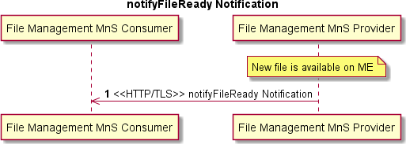

## O-RAN.WG1.O1-Interface.0-v04.00.docx

- View in [Reader Mode](https://simewu.com/spec-reader/pages/11-WG1/O-RAN.WG1.O1-Interface.0-v04.00.docx).
- Go back to [Table of Contents](../README.md).
- Download the [Original Document](https://github.com/Simewu/spec-reader/raw/refs/heads/main/documents/O-RAN.WG1.O1-Interface.0-v04.00.docx).

---

**O-RAN Operations and Maintenance Interface Specification**

**This is a re-published version of the attached final specification.**

##### For this re-published version, the prior versions of the IPR Policy will apply, except that the previous requirement for Adopters (as defined in the earlier IPR Policy) to agree to an O-RAN Adopter License Agreement to access and use Final Specifications shall no longer apply or be required for these Final Specifications after 1st July 2022.

The copying or incorporation into any other work of part or all of the material available in this specification in any form without the prior written permission of O-RAN ALLIANCE e.V. is prohibited, save that you may print or download extracts of the material on this site for your personal use, or copy the material on this site for the purpose of sending to individual third parties for their information provided that you acknowledge O-RAN ALLIANCE as the source of the material and that you inform the third party that these conditions apply to them and that they must comply with them.

1

**O-RAN Operations and Maintenance Interface Specification**

Copyright (C) 2021 by the O-RAN ALLIANCE e.V.

By using, accessing or downloading any part of this O-RAN specification document, including by copying, saving, distributing, displaying or preparing derivatives of, you agree to be and are bound to the terms of the O-RAN Adopter License Agreement contained in Annex ZZZ of this specification. All other rights reserved.

O-RAN ALLIANCE e.V.

Buschkauler Weg 27, 53347 Alfter, Germany Register of Associations, Bonn VR 11238 VAT ID DE321720189

(C) 2021 by the O-RAN ALLIANCE e.V. 1

# Revision History

|  |  |  |  |
| --- | --- | --- | --- |
| **Date** | **Revision** | **Author** | **Description** |
| 2019.03.18 | 0.01.00.00 | David Kinsey (AT&T) Li  Xiang(CMCC), Cagatay Buyukkoc (AT&T),  Lyndon Ong (Ciena), Marge Hillis (Nokia) and Linda Horn (Nokia) | First draft of O-RAN OAM Interface Specification |
| 2019.03.28 | 0.01.01.00 | Marge Hillis (Nokia) | Updates from review remarks received |
| 2019.05.21 | 0.01.01.01 | Marge Hillis (Nokia) | Fault Supervision, Performance Assurance and File Management updates |
| 2019.05.28 | 0.01.01.02 | Marge Hillis, Linda Horn (Nokia) | References, Abbreviations, Definitions, Provisioning, Communication Surveillance, PNF Start Up and Registration updates |
| 2019.06.13 | 0.01.01.03 | Marge Hillis, Linda Horn (Nokia), David Kinsey (ATT) | Diagrams for File Management converted to UML, Performance Assurance UML, PNF Software Management Updates |
| 2019.06.17 | 0.01.01.04 | Marge Hillis, Linda Horn | Provisioning Updates |
| 2019.07.01 | 01.00 | Marge Hillis, Linda Horn | Review Comments Addressed TSC approved copy |
| 2019.09.27 | 02.00 | Marge Hillis, Linda Horn | Updates for late review comments, additional CM notifications, NETCONF requirements and updated references to 3GPP SA5 Rel-16. |
| 2020.03.03 | 03.00 | Marge Hillis, Linda Horn | Update Heartbeat Management Service. New Sections for Subscription Control, Streaming PM, O-RAN Defined PM Measurements and an Annex showing exmaples for using the specified template for O-RAN defined PM Measurements. |
| 2020.08.18 | 04.00 | Marge Hillis, Linda Horn, Louise Sun | Update Introductory Material, Provisioning, Fault Supervision, Performance Assurance, Trace Management, and Heartbeat Management to incorporate 3GPP Rel 16 CRs. Add Annex B for stndDefined event example and Annex C for Streaming Trace example. |
| 2020.08.31 | 04.00 | Marge Hillis, Linda Horn | Update document with comments from WG1 review |

Contents

Revision History 2

Chapter 1. Introductory Material 5

1.1 Scope 5

1.2 References 5

1.3 Definitions and Abbreviations 7

* + 1. Definitions 7
    2. Abbreviations 7
  1. Philosophy 9
  2. Open Points 9
  3. General Requirements 9
     1. Service Management and Orchestration (SMO) 9
     2. Transport Layer Security (TLS) 9
     3. HyperText Transfer Protocol (HTTP) 9

Chapter 2. Management Services 11

* 1. Provisioning Management Services 11
     1. General NETCONF Requirements 11
     2. Create Managed Object Instance 12
     3. Modify Managed Object Instance Attributes 14
     4. Delete Managed Object Instance 16
     5. Read Managed Object Instance Attributes 18
     6. Notify Managed Object Instance Attribute Value Changes 19
     7. Notify Managed Object Instance Creation 20
     8. Notify Managed Object Instance Deletion 21
     9. Notify Managed Object Instance Changes 22
     10. Subscription Control 23
  2. Fault Supervision Management Services 24
     1. Fault Notification 24
     2. Fault Supervision Control 26
  3. Performance Assurance Management Services 26
     1. Performance Data File Reporting 27
     2. Performance Data Streaming 28
     3. Measurement Job Control 30
     4. O-RAN Defined Performance Measurements 31
  4. Trace Management Services 31
     1. Call Trace 32
     2. Minimization of Drive Testing (MDT) 34
     3. Radio Link Failure (RLF) 35
     4. RRC Connection Establishment Failure (RCEF) 35
     5. Trace Control 36
     6. Streaming Trace 36
  5. File Management Services 37
     1. File Ready Notification 37
     2. List Available Files 38
     3. File Transfer by File Management MnS Consumer 39
     4. Download File 41
  6. Heartbeat Management Services 42
     1. Heartbeat Notification 42
     2. Heartbeat Control 43
  7. PNF Startup and Registration Management Services 44
     1. PNF Plug-n-Play 44
     2. PNF Registration 44
  8. PNF Software Management Services 45
     1. Software Package Naming and Content 45
     2. Software Inventory 46
     3. Software Download 47
     4. Software Activation Pre-Check 49
     5. Software Activate 50

Annex A: (Informative) O-RAN Performance Measurement Definition Example 55

Annex B: (Informative) Guidelines and Example for stndDefined VES Events 57

Annex C: (Informative) Streaming Trace Management Activation Example 60

Annex ZZZ: O-RAN Adopter License Agreement 63

1 Chapter 1.Introductory Material

## 1.1 Scope

1. This Technical Specification has been produced by the O-RAN.org.
2. The contents of the present document are subject to continuing work within O-RAN WG1 and may change following
3. formal O-RAN approval. Should the O-RAN.org modify the contents of the present document, it will be re-released by
4. O-RAN Alliance with an identifying change of release date and an increase in version number as follows:
5. Release x.y.z
6. where:
7. x the first digit is incremented for all changes of substance, i.e. technical enhancements, corrections, updates,
8. etc. (the initial approved document will have x=01).
9. y the second digit is incremented when editorial only changes have been incorporated in the document.
10. z the third digit included only in working versions of the document indicating incremental changes during the
11. editing process.
12. This document defines O-RAN OAM interface functions and protocols for the O-RAN O1 interface. The document
13. studies the functions conveyed over the interface, including management functions, procedures, operations and
14. corresponding solutions, and identifies existing standards and industry work that can serve as a basis for O-RAN work.
15. This document will follow the requirements specification language defined in IETF RFC 2119 [32] updated by RFC
16. 8174 [36]. For consistency requirements are specified using "SHALL" to indicate that the implementation is required.

## 1.2 References

1. The following documents contain provisions which, through reference in this text, constitute provisions of the present
2. document.
3. - References are either specific (identified by date of publication, edition number, version number, etc.) or
4. non-specific.
5. - For a specific reference, subsequent revisions do not apply.
6. - For a non-specific reference, the latest version applies. In the case of a reference to a 3GPP document (including
7. a GSM document), a non-specific reference implicitly refers to the latest version of that document in Release 16. 27

|  |  |  |
| --- | --- | --- |
| 28 | [1] | 3GPP TR 21.905: Vocabulary for 3GPP Specifications (Release 16), v16.0.0, 2019-06 |
| 29 | [2] | 3GPP TS 28.530: Management and orchestration; Concepts, use cases and requirements (Release 16), |
| 30 |  | v16.2.0, 2020-07 |
| 31 | [3] | 3GPP TS 28.531: Management and orchestration; Provisioning (Release 16), v16.6.0, 2020-07 |
| 32 | [4] | 3GPP TS 28.532: Management and orchestration; Generic management services (Release 16), v16.4.0, |
| 33 |  | 2020-06 |
| 34 | [5] | 3GPP TS 28.533: Management and orchestration: Architecture framework (Release 16), v16.4.0, 2020-06 |
| 35 | [6] | 3GPP TS 28.537: Management and orchestration; Management capabilities (Release 16), v16.0.0, 2020-03 |
| 36 | [7] | 3GPP TS 28.540: Management and orchestration; 5G Network Resource Model (NRM); Stage 1 (Release |
| 37 |  | 16), v16.1.0, 2019-12 |
| 38 | [8] | 3GPP TS 28.541: Management and orchestration; 5G Network Resource Model (NRM); Stage 2 and stage 3 |
| 39 |  | (Release 16), v16.5.0, 2020-06 |
| 40 | [9] | 3GPP TS 28.545: Management and orchestration; Fault Supervision (FS) (Release 16), v16.0.0, 2020-07 |
| 41 | [10] | 3GPP TS 28.550: Management and orchestration; Performance assurance (Release 16), v16.5.0, 2020-07 |

|  |  |  |
| --- | --- | --- |
| 42 | [11] | 3GPP TS 28.552: Management and orchestration; 5G performance measurements (Release 16), v16.6.0, |
| 43 |  | 2020-07 |
| 44 | [12] | 3GPP TS 28.554: Management and orchestration; 5G end to end Key Performance Indicators (KPI) (Release |
| 45 |  | 16), v16.5.0, 2020-07 |
| 46 | [13] | 3GPP TS 28.621: Telecommunication management; Generic Network Resource Model (NRM) Integration |
| 47 |  | Reference Point (IRP); Requirements (Release 16), v16.0.0, 2020-07 |
| 48 | [14] | 3GPP TS 28.622: Telecommunication management; Generic Network Resource Model (NRM) Integration |
| 49 |  | Reference Point (IRP); Information Service (IS) (Release 16), v16.4.0, 2020-07 |
| 50 | [15] | 3GPP TS 28.623: Telecommunication management; Generic Network Resource Model (NRM) Integration |
| 51 |  | Reference Point (IRP); Solution Set (SS) definitions (Release 16), v16.4.0, 2020-07 |
| 52 | [16] | 3GPP TS 32.111-2: Telecommunication management; Fault Management; Part 2: Alarm Integration |
| 53 |  | Reference Point (IRP): Information Service (IS) (Release 16), v16.0.0, 2020-07 |
| 54 | [17] | 3GPP TS 32.341: Telecommunication management; File Transfer (FT) Integration Reference Point (IRP); |
| 55 |  | Requirements (Release 16), v16.0.0, 2020-07 |
| 56 | [18] | 3GPP TS 32.342: Telecommunication management; File Transfer (FT) Integration Reference Point (IRP); |
| 57 |  | Information Service (IS) (Release 16), v16.0.0, 2020-07 |
| 58 | [19] | 3GPP TS 32.346: Telecommunication management; File Transfer (FT) Integration Reference Point (IRP): |
| 59 |  | Solution Set (SS) definitions (Release 16), v16.0.0, 2020-07 |
| 60 | [20] | 3GPP TS 32.404: Telecommunication management; Performance Management (PM); Performance |
| 61 |  | Measurements; Definitions and template (Release 16), v16.0.0, 2020-07 |
| 62 | [21] | 3GPP TS 32.421: Telecommunication management; Subscriber and equipment trace; Trace concepts and |
| 63 |  | requirements (Release 16), v16.1.0, 2020-03 |
| 64 | [22] | 3GPP TS 32.422: Telecommunication management; Subscriber and equipment trace; Trace control and |
| 65 |  | configuration management (Release 16), v16.2.0, 2020-07 |
| 66 | [23] | 3GPP TS 32.423: Telecommunication management; Subscriber and equipment trace; Trace data definition |
| 67 |  | and management (Release 16), v16.1.0, 2020-07 |
| 68 | [24] | 3GPP TS 32.508: Telecommunication management; Procedure flows for multi-vendor plug-and-play eNode |
| 69 |  | B connection to the network (Release 16), v16.0.0, 2020-07 |
| 70 | [25] | 3GPP TS 32.509: Telecommunication management; Data formats for multi-vendor plug and play eNode B |
| 71 |  | connection to the network (Release 16), v16.0.0, 2020-07 |
| 72 | [26] | 3GPP TS 37.320: Universal Terrestrial Radio Access (UTRA), Evolved Universal Terrestrial Radio Access |
| 73 |  | (E-UTRA) and Next Generation Radio Access; Radio measurement collection for Minimization of Drive |
| 74 |  | Tests (MDT); Overall description; Stage 2 (Release 16), v16.0.0, 2020-03 |
| 75 | [27] | O-RAN WG1: O-RAN Use Cases and Deployment Scenarios WhitePaper, February 2020 |
| 76 | [28] | O-RAN WG1: O-RAN Architecture Description, v1.0, February 2020 |
| 77 | [29] | O-RAN WG1: O-RAN Operations and Maintenance Architecture, v3.0, April 2020 |
| 78 | [30] | O-RAN WG4: O-RAN Fronthaul Management Plane Specification, v3.0, April 2020 |
| 79 | [31] | ONAP VES Event Listener Specification v7.2, May 2020 (Draft) |
| 80 | [32] | RFC 2119, "Key words for use in RFCs to Indicate Requirement Levels", IETF, March 1997 |
| 81 | [33] | RFC 6241, "Network Configuration Protocol (NETCONF)", IETF, June 2011 |
| 82 | [34] | RFC 7950, "The YANG 1.1 Data Modeling Language", IETF, August 2016 |
| 83 | [35] | RFC 7951, "JSON Encoding of Data Modeled with YANG", IETF, August 2016 |
| 84 | [36] | RFC 8174, "Ambiguity of Uppercase vs Lowercase in [RFC 2119](https://tools.ietf.org/html/rfc2119) Key Words", IETF, May 2017 |

## 1.3 Definitions and Abbreviations

### 1.3.1 Definitions

1. For the purposes of the present document, the terms and definitions given in 3GPP TR 21.905 [1] and the following
2. apply. A term defined in the present document takes precedence over the definition of the same term, if any, in 3GPP
3. TR 21.905 [1].
4. Harmonized VES Event refers to the stndDefined VES event specified in VES Event Listener Specification [31] that
5. allows a VES event to carry, as its payload, a notification specified by another standards body. In the case of O-RAN
6. O1 Interface Specification, a harmonized stndDefined VES event carries a 3GPP-specified notification as its payload.
7. Legacy VES Event refers to any VES event specified in the VES Event Listener Specification [31], except for
8. stndDefined. Legacy VES events are fully defined in [31] and don't rely on another standards organization to specify
9. the content of the payload, like stndDefined does. Examples of Legacy VES Events are Fault, Heartbeat and FileReady
10. Notification.

### 1.3.2 Abbreviations

1. For the purposes of the present document, the abbreviations given in 3GPP TR 21.905 [1] and the following apply. An
2. abbreviation defined in the present document takes precedence over the definition of the same abbreviation, if any, in
3. 3GPP TR 21.905 [1].

|  |  |  |
| --- | --- | --- |
| 101 | 3GPP | 3rd Generation Partnership Project |
| 102 | ASN.1 | Abstract Syntax Notation One |
| 103 | CM | Configuration Management |
| 104 | CRUD | Create, Read, Update, Delete |
| 105 | EMS | Element Management System |
| 106 | FCAPS | Fault, Configuration, Accounting, Performance, Security |
| 107 | FG | Focus Group |
| 108 | FM | Fault Management |
| 109 | FS | Fault Supervision |
| 110 | FTPES | File Transfer Protocol with Explicit SSL/TLS encryption |
| 111 | GPB | Google Protocol Buffers |
| 112 | HTTP | HyperText Transfer Protocol |
| 113 | HTTPS | HTTP Secure |
| 114 | ID | IDentifier |
| 115 | IETF | Internet Engineering Task Force |
| 116 | IOC | Information Object Class |
| 117 | IP | Internet Protocol |
| 118 | JSON | JavaScript Object Notation |
| 119 | MANO | Management and Orchestration |
| 120 | MDT | Minimization of Drive Testing |
| 121 | ME | Managed Element |
| 122 | MF | Managed Function |
| 123 | MnS | Management Service |
| 124 | MO | Managed Object |
| 125 | MOC | Managed Object Class |

|  |  |  |
| --- | --- | --- |
| 126 | MOI | Managed Object Instance |
| 127 | NAT | Network Address Translation |
| 128 | Near-RT RIC | O-RAN Near Real Time RAN Intelligent Controller |
| 129 | NETCONF | NETwork CONFiguration protocol |
| 130 | NF | Network Function |
| 131 | NGRAN | Next Generation Radio Access Network |
| 132 | NMS | Network Management System |
| 133 | Non-RT RIC | O-RAN Non Real Time RAN Intelligent Controller |
| 134 | NR | New Radio |
| 135 | NRM | Network Resource Model |
| 136 | O-CU-CP | O-RAN Central Unit - Control Plane. |
| 137 | O-CU-UP | O-RAN Central Unit - User Plane |
| 138 | O-DU | O-RAN Distributed Unit |
| 139 | O-RAN | Open Radio Access Network |
| 140 | O-RU | O-RAN Radio Unit |
| 141 | ONAP | Open Network Automation Platform |
| 142 | OSM | Open Source Mano |
| 143 | PM | Performance Management or Performance Measurements |
| 144 | PNF | Physical Network FunctionRAN Radio Access Network |
| 145 | RCEF | RRC Connection Establishment Failure |
| 146 | RRH | Remote Radio Head |
| 147 | REST | REpresentational State Transfer |
| 148 | RFC | Request For Comments |
| 149 | RLF | Radio Link Failure |
| 150 | RRC | Radio Resource Control |
| 151 | SA5 | Services & System Aspects Working Group 5 Telecom Management |
| 152 | SBMA | Services Based Management Architecture |
| 153 | SMO | Service Management and Orchestration |
| 154 | SFTP | SSH File Transfer Protocol |
| 155 | SSH | Secure Shell |
| 156 | STG | Security Task Group |
| 157 | TG | Task Group |
| 158 | TLS | Transport Layer Security |
| 159 | TR | Technical Report |
| 160 | TRS | Trace Recording Session |
| 161 | TS | Technical Specification |
| 162 | UE | User Equipment |
| 163 | URI | Uniform Resource Identifier |
| 164 | VES | VNF Event Stream |
| 165 | VNF | Virtualized Network Function |

1. WG Working Group
2. WI Work Item
3. XML eXtensible Markup Language 169

## 1.4 Philosophy

1. It is expected that O-RAN Managed Elements, specified in O-RAN Operations and Maintenance Architecture [29],
2. comply with the O1 Interface Specification.
3. The O-RAN O1 management services follow existing standards wherever possible. The focus of this document is to
4. identify the use cases which conform to existing standards, identify gaps in management services for O-RAN and define
5. needed extensions. For identified gaps, the goal is to modify the standards to include the needed O-RAN extensions
6. and update the references in this document as the standards evolve to cover the gaps. If extensions and gaps are not
7. specified, it is expected that the management services providers and consumers are conforming to referenced 3GPP
8. specifications.

## 1.5 Open Points

1. As each Management Service is evaluated, the Use Cases and relevant specifications need to be assessed and
2. augmented as needed to support O-RAN. The current list of Use Cases in Chapter 2 below is not exhaustive, and the list
3. of specification references may not be complete.
4. Some Use Cases referred to in the standard may not be applicable to O-RAN and this needs to be addressed, as an
5. exception.
6. Future clarifications may be added to specify when citing a reference whether it is being used as a citation (meaning it
7. will be strictly followed) or as a reference. More precise terminology may be included as this draft matures.
8. O-RAN Security Task Group (STG) plans to develop an O-RAN security architecture, as well as security guidelines
9. and requirements for all O-RAN Working Groups (WG) and O-RAN entities. The security architecture, guidelines and
10. requirements will be incorporated into existing O-RAN documents, as appropriate. The O1 Interface Specification
11. intends to comply with the security architecture, guidelines and requirements that are applicable to the O1 interface and
12. will provide appropriate references, when available.
13. It is mandatory for the O-RU to comply with the O-RAN Fronthaul Management Plane Specification [30] for
14. management services. There is a joint WG1/WG4 Work Item (WI) in progress to determine how the O-RU can support
15. management services in the O1 Interface Specification, in what time frame, and under what conditions. Future versions
16. of the O1 Interface Specification will be updated as necessary to reflect the decisions of this WI.

## 1.6 General Requirements

1. This section contains general requirements that are applicable to many O1 Interface Management Services.

### 1.6.1 Service Management and Orchestration (SMO)

1. REQ-SMO-FUN-1: O-RAN compliant SMOs SHALL support the O1 interfaces as defined in this document.

### 1.6.2 Transport Layer Security (TLS)

1. REQ-TLS-FUN-1: Management Service providers and consumers that use TLS SHALL support TLS v1.2 or higher.

### 1.6.3 HyperText Transfer Protocol (HTTP)

1. REQ-HTP-FUN-1: Management Service providers and consumers that use HTTP SHALL support HTTP v1.1 or
2. higher. HTTP v2.0 is preferred.

205

# 1 Chapter 2.Management Services

## 2.1 Provisioning Management Services

1. Provisioning management services allow a Provisioning MnS Consumer to configure attributes of managed objects on
2. the Provisioning MnS Provider that modify the Provisioning MnS Provider's capabilities in its role in end-to-end
3. network services and allows a Provisioning MnS Provider to report configuration changes to the Provisioning MnS
4. Consumer. NETCONF is used for the Provisioning Management Services to Create Managed Object Instance, Delete
5. Managed Object Instance, Modify Managed Object Instance Attributes and Read Managed Object Instance Attributes.
6. A REST/HTTPS event is used to notify the Provisioning MnS subscribed Consumers when a configuration change
7. occurs.
8. Stage 1 Provisioning management services are specified in 3GPP TS 28.531 [3] section 6.3.
9. Stage 2 CM operations and notifications are specified in 3GPP TS 28.532 [4] section 11.1.1.
10. Stage 3 Provisioning operations for YANG/NETCONF solution set are specified in 3GPP TS 28.532 [4] section 12.1.3.
11. Stage 3 CM notifications for RESTful HTTP-based solution set are specified in 3GPP TS 28.532 [4] section A.1.1.
12. IETF reference documents for NETCONF and YANG include RFC 6241, "Network Configuration Protocol
13. (NETCONF)" [33] and RFC 7950, "The YANG 1.1 Data Modeling Language" [34].

### 2.1.1 General NETCONF Requirements

1. REQ-GNC-FUN-1: The provisioning management service provider and consumer SHALL support the following
2. NETCONF operations as specified in RFC 6241 [33]:
3. ? get
4. ? get-config
5. ? edit-config
6. ? lock
7. ? unlock
8. ? close-session
9. ? kill-session
10. Other operations are optional.
11. REQ-GNC-FUN-2: The provisioning management service provider and consumer SHALL support the following
12. NETCONF capabilities:
13. ? writable-running
14. ? rollback-on-error
15. ? validate
16. ? xpath
17. Other capabilities are optional.
18. REQ-GNC-FUN-3: The provisioning management service provider and consumer SHALL support a running datastore
19. for NETCONF. Support for a candidate datastore is optional.
20. REQ-GNC-FUN-4: The provisioning management service provider and consumer SHALL support YANG1.1, defined
21. in RFC 7950 [34], including coexistence with YANG Version 1 as specified therein.
22. REQ-GNC-FUN-5: The provisioning management service provider SHALL have the capability to establish a
23. NETCONF session with its authorized consumer upon request from the consumer.
24. REQ-GNC-FUN-6: The provisioning management service provider SHALL support an established NETCONF session
25. until the authorized consumer terminates the session. NOTE: The consumer may want to perform multiple provisioning
26. management services operations during a single NETCONF Session.
27. REQ-GNC-FUN-7: The provisioning management service provider SHALL have the capability to terminate a
28. NETCONF session with its authorized consumer when requested to do so by the authorized consumer.
29. REQ-GNC-FUN-8: The provisioning management service provider SHALL have the capability to make provisioning
30. operation results persistent over a reset.
31. REQ-GNC-FUN-9: The provisioning management service provider and consumer SHALL support NETCONF over
32. SSH or NETCONF over TLS.

### 2.1.2 Create Managed Object Instance

#### 2.1.2.1 Description

1. Provisioning MnS Consumer sends a synchronous provisioning update request to the Provisioning MnS Provider to
2. create a Managed Object Instance (MOI) on the Provisioning MnS Provider and set its attribute values.

#### 2.1.2.2 Requirements

1. Requirements are specified in 3GPP TS 28.532 [4] section 12.1.3.1.1 and section 12.1.3.1.2.

55

#### 56 2.1.2.3 Procedures

57

58

59 **Figure 2.1.2.3-1 Create MOI**

60

1. Pre-Condition: Provisioning MnS Consumer has current state of the target datastore of the Provisioning MnS
2. Provider.

63

1. 1. Provisioning MnS Consumer establishes NETCONF session with Provisioning MnS Provider. The
2. NETCONF session has authorized create, read, update, and delete privileges into the identified section of
3. the data store.

67

68 2. (Optional) Lock Datastore

69 a. Provisioning MnS Consumer sends NETCONF <rpc> <lock> <source><target DS>.

70 b. Provisioning MnS Provider locks target datastore (running or candidate). 71

72 3. Provisioning MnS Provider returns response <OK> or the appropriate rpc error code. 73

74 4. Create MOI

75 a. Provisioning MnS Consumer sends NETCONF <rpc> <edit-

76 config><source><targetDS><error-option><config><operation=create>.

77 b. Provisioning MnS Provider creates the MOI(s) and sets attribute values in the target

78 datastore (DS) as specified in operation and config. If an error occurs, Provisioning MnS

79 Provider behaves as specified in error-option. 80

81 5. Provisioning MnS Provider returns response <OK> or the appropriate rpc error code.

82

83 6. (Optional) Commit change if target was candidate

84 a. Provisioning MnS Consumer sends NETCONF <rpc> <commit><source><targetDS>.

85 b. Provisioning MnS Provider commits the change to the running DS. 86

87 7. Provisioning MnS Provider returns response <OK> or the appropriate rpc error code. 88

89 8. (Optional) Unlock Datastore

90 a. Provisioning MnS Consumer sends NETCONF <rpc> <unlock><source><targetDS>.

91 b. Provisioning MnS Provider unlocks the target DS. 92

93 9. Provisioning MnS Provider returns response <OK> or the appropriate rpc error code. 94

95 10. Provisioning MnS Consumer terminates NETCONF session with Provisioning MnS Provider. 96

### 97 2.1.3 Modify Managed Object Instance Attributes

#### 98 2.1.3.1 Description

99 Provisioning MnS Consumer sends synchronous provisioning updates to the Provisioning MnS Provider to modify the

100 attributes of a MOI on the Provisioning MnS Provider.

#### 101 2.1.3.2 Requirements

102 Requirements are specified in 3GPP TS 28.532 [4] section 12.1.3.1.1 and section 12.1.3.1.4.

103

#### 104 2.1.3.3 Procedures

105

106

107

108 **Figure 2.1.3.3-1 Modify MOI Attributes**

109

1. Pre-Condition: Provisioning MnS Consumer has current state of the target datastore of the Provisioning MnS
2. Provider.

112

1. 1. Provisioning MnS Consumer establishes NETCONF session with Provisioning MnS Provider. The
2. NETCONF session has authorized create, read, update, and delete privileges into the identified section of
3. the data store.

116

1. 2. (Optional) Lock Datastore--Provisioning MnS Consumer sends NETCONF <rpc> <lock>
2. <source><target DS>.

119

* 1. Provisioning MnS Provider locks target datastore (running or candidate).

|  |  |
| --- | --- |
| 120 |  |
| 121 |
| 122 | 3. |
| 123 |  |
| 124 | 4. |
| 125 |  |
| 126 |  |
| 127 |  |
| 128 |  |
| 129 |  |
| 130 |  |
| 131 | 5. |
| 132 |  |
| 133 | 6. |
| 134 |  |
| 135 |  |
| 136 |  |
| 137 | 7. |
| 138 |  |
| 139 | 8. |
| 140 |  |
| 141 |  |
| 142 |  |
| 143 | 9. |
| 144 |  |
| 145 | 10. |
| 146 |  |

Provisioning MnS Provider returns response <OK> or the appropriate rpc error code.

Modify MOI Attributes

1. Provisioning MnS Consumer sends NETCONF <rpc> <edit-config><source><targetDS><error- option><config><operation=merge, replace, create, delete or remove>.
2. Provisioning MnS Provider modifies the attributes of the MOI(s) in the target datastore (DS) as specified in operation and config. If an error occurs, Provisioning MnS Provider behaves as specified in error-option.

Provisioning MnS Provider returns response <OK> or the appropriate rpc error code. (Optional) Commit change if target was candidate

1. Provisioning MnS Consumer sends NETCONF <rpc> <commit><source><targetDS>.
2. Provisioning MnS Provider commits the change to the running DS.

Provisioning MnS Provider returns response <OK> or the appropriate rpc error code. (Optional) Unlock Datastore

1. Provisioning MnS Consumer sends NETCONF <rpc> <unlock><source><targetDS>.
2. Provisioning MnS Provider unlocks the target DS.

Provisioning MnS Provider returns response <OK> or the appropriate rpc error code. Provisioning MnS Consumer terminates NETCONF session with Provisioning MnS Provider.

### 147 2.1.4 Delete Managed Object Instance

#### 148 2.1.4.1 Description

149 Provisioning MnS Consumer sends synchronous provisioning updates to the Provisioning MnS Provider to delete a

150 MOI and its children on the Provisioning MnS Provider.

#### 151 2.1.4.2 Requirements

152 Requirements are specified in 3GPP TS 28.532 [4] section 12.1.3.1.1 and section 12.1.3.1.5.

153

#### 154 2.1.4.3 Procedures

155

156

157 **Figure 2.1.4.3-1 Delete MOI**

158

1. Pre-Condition: Provisioning MnS Consumer has current state of the target datastore of the Provisioning MnS
2. Provider.

161

Provisioning MnS Consumer establishes NETCONF session with Provisioning MnS Provider. The NETCONF session has authorized create, read, update, and delete privileges into the identified section of the data store.

|  |  |
| --- | --- |
| 162 | 1. |
| 163 |  |
| 164 |  |
| 165 |  |
| 166 | 2. |
| 167 |  |
| 168 |  |
| 169 |  |
| 170 | 3. |
| 171 |  |

(Optional) Lock Datastore

* 1. Provisioning MnS Consumer sends NETCONF <rpc> <lock> <source><target DS>.
  2. Provisioning MnS Provider locks target datastore (running or candidate).

Provisioning MnS Provider returns response <OK> or the appropriate rpc error code.

172 4. Delete MOI and its Children

173 a. Provisioning MnS Consumer sends NETCONF <rpc> <edit-

174 config><source><targetDS><error-option><config><operation=delete or remove>.

175 b. Provisioning MnS Provider deletes the MOI(s)and its children in the target datastore (DS)

176 as specified in operation and config. If an error occurs, Provisioning MnS Provider

177 behaves as specified in error-option.

178 .

179

180 5. Provisioning MnS Provider returns response <OK> or the appropriate rpc error code. 181

182 6. (Optional) Commit change if target was candidate

183 a. Provisioning MnS Consumer sends NETCONF <rpc> <commit><source><targetDS>.

184 b. Provisioning MnS Provider commits the change to the running DS. 185

186 7. Provisioning MnS Provider returns response <OK> or the appropriate rpc error code. 187

188 8. (Optional) Unlock Datastore

189 a. Provisioning MnS Consumer sends NETCONF <rpc> <unlock><source><targetDS>..

190 b. Provisioning MnS Provider unlocks the target DS. 191

192 9. Provisioning MnS Provider returns response <OK> or the appropriate rpc error code. 193

194 10. Provisioning MnS Consumer terminates NETCONF session with Provisioning MnS Provider. 195

### 196 2.1.5 Read Managed Object Instance Attributes

#### 197 2.1.5.1 Description

198 Provisioning MnS Consumer sends synchronous provisioning request to the Provisioning MnS Provider to return the

199 values of attributes of its MOI(s) on the Provisioning MnS Provider.

#### 200 2.1.5.2 Requirements

201 Requirements are specified in 3GPP TS 28.532 [4] section section 12.1.3.1.1 and 12.1.3.1.3.

202

#### 203 2.1.5.3 Procedures

204

205

206

207 **Figure 2.1.5.3-1 Read MOI Attributes**

208

209 1. Provisioning MnS Consumer establishes NETCONF session with Provisioning MnS Provider. 210

211 2. Read MOI Attributes

|  |  |  |
| --- | --- | --- |
| 212 |  | a. Provisioning MnS Consumer sends NETCONF <rpc> <get-config> |
| 213 |  | <source><targetDS><filter> to retrieve an optionally filtered subset configuration from |
| 214 |  | the source configuration datastore (running or candidate). filter can be used to identify |
| 215 |  | the MOIs and attributes to be returned. |
| 216 |  | OR |
| 217 |  | Provisioning MnS Consumer sends NETCONF NETCONF <rpc> <get><filter> to |
| 218 |  | retrieve an optionally filtered subset configuration and operational state of MOIs from |
| 219 |  | the running configuration datastore. filter can be used to identify the MOIs and |
| 220 |  | attributes to be returned. |
| 221 |  | b. Provisioning MnS Provider retrieves the requested config from the specified DS. |
| 222 |  |  |

223 3. Provisioning MnS Provider returns status in NETCONF response. 224

225 4. Provisioning MnS Consumer terminates NETCONF session with Provisioning MnS Provider. 226

### 2.1.6 Notify Managed Object Instance Attribute Value Changes

#### 2.1.6.1 Description

1. Provisioning MnS Provider sends an asynchronous notifyMOIAttributeValueChanges Notification to the Provisioning
2. MnS Consumer to report attribute changes to one MOI on the Provisioning MnS Provider.

#### 2.1.6.2 Requirements

1. Requirements are specified in 3GPP TS 28.532 [4] section 11.1.1.9.

233

#### 234 2.1.6.3 Procedures

235

236

237

1. **Figure 2.1.6.3-1 Notify Managed Object Instance Attribute Value Changes**
2. Pre-conditions: (1) One or more attributes of a MOI have changed in the running data store of the
3. Provisioning MnS Provider. (2) Provisioning MnS Consumer has subscribed for
4. notifyMOIAttributeValueChanges notifications.

242

1. 1. Provisioning MnS Provider sends notifyMOIAttributeValueChanges notification to the Provisioning
2. MnS Consumer over HTTP/TLS. Mutual certificate authentication is performed. 245
3. Post-condition: Provisioning MnS Consumer reconciles its copy of the Provisioning MnS Provider
4. configuration database with the change. 248

#### 249 2.1.6.4 Operations and Notifications

|  |  |
| --- | --- |
| 250 | See section 2.1.9.4. |
| 251 | 2.1.7 Notify Managed Object Instance Creation |
| 252 | 2.1.7.1 Description |
| 253 | Provisioning MnS Provider sends an asynchronous notifyMOICreation Notification to the Provisioning MnS Consumer |
| 254 | to report the creation of one MOI on the Provisioning MnS Provider. |
| 255 | 2.1.7.2 Requirements |
| 256 | Requirements are specified in 3GPP TS 28.532 [4] section 11.1.1.7. |
| 257 | 2.1.7.3 Procedures |
| 258 |  |

259

1. **Figure 2.1.7.3-1 Notify Managed Object Instance Creation**
2. Pre-conditions: (1) A MOI is created on the running data store of the Provisioning MnS Provider. (2)
3. Provisioning MnS Consumer has subscribed for notifyMOICreation notifications. 263
4. 1. Provisioning MnS Provider sends notifyMOICreation notification to the Provisioning MnS Consumer
5. over HTTP/TLS. Mutual certificate authentication is performed. 266
6. Post-condition: Provisioning MnS Consumer reconciles its copy of the Provisioning MnS Provider
7. configuration database with the change. 269

|  |  |
| --- | --- |
| 270 | 2.1.7.4 Operations and Notifications |
| 271 | See 2.1.9.4. |
| 272 | 2.1.8 Notify Managed Object Instance Deletion |
| 273 | 2.1.8.1 Description |
| 274 | Provisioning MnS Provider sends an asynchronous notifyMOIDeletion Notification to the Provisioning MnS Consumer |
| 275 | to report the deletion of one MOI on the Provisioning MnS Provider. |
| 276 | 2.1.8.2 Requirements |
| 277 | Requirements are specified in 3GPP TS 28.532 [4] section 11.1.1.8. |
| 278 | 2.1.8.3 Procedures |
| 279 |  |

280

281

1. **Figure 2.1.8.3-1 Notify Managed Object Instance Deletion**
2. Pre-conditions: (1) A MOI is deleted from the running data store of the Provisioning MnS Provider. (2)
3. Provisioning MnS Consumer has subscribed for notifyMOIDeletion notifications. 285
4. 1. Provisioning MnS Provider sends notifyMOIDeletion notification to the Provisioning MnS Consumer
5. over HTTP/TLS. Mutual certificate authentication is performed. 288
6. Post-condition: Provisioning MnS Consumer reconciles its copy of the Provisioning MnS Provider
7. configuration database with the change. 291

#### 2.1.8.4 Operations and Notifications

1. See section 2.1.9.4.

### 2.1.9 Notify Managed Object Instance Changes

#### 2.1.9.1 Description

1. Provisioning MnS Provider sends an asynchronous notifyMOIChanges Notification to the Provisioning MnS Consumer
2. to report configuration changes to one or more MOIs on the Provisioning MnS Provider.

#### 2.1.9.2 Requirements

1. Requirements are specified in 3GPP TS 28.532 [4] section 11.1.1.11.

#### 2.1.9.3 Procedures

301

302

303

1. **Figure 2.1.9.3-1 Notify Managed Object Instance Changes**
2. Pre-conditions: (1) One or more MOIs are created, deleted or modified in the running data store of the
3. Provisioning MnS Provider. (2) Provisioning MnS Consumer has subscribed for notifyMOIChanges
4. notifications.

308

1. 1. Provisioning MnS Provider sends notifyMOIChanges notification to the Provisioning MnS Consumer
2. over HTTP/TLS. Mutual certificate authentication is performed. 311
3. Post-condition: Provisioning MnS Consumer reconciles its copy of the Provisioning MnS Provider
4. configuration database with the change. 314

#### 315 2.1.9.4 Operations and Notifications

|  |  |
| --- | --- |
| 316 | An O-RAN CM notification is a JSON encoded asynchronous notification sent from the Provisioning MnS Provider to |
| 317 | the Provisioning MnS Consumer using REST/HTTPS. The attribute name value pairs in the CM notifications are |
| 318 | provided using YANG 1.1 encoded in JSON format as specified in RFC 7951 [35]. |
| 319 | The following 3GPP CM notifications specified in 3GPP TS 28.532 [4] are supported in O-RAN: |
| 320 | * notifyMOIAttributeValueChanges |
| 321 | * notifyMOICreation |
| 322 | * notifyMOIDeletion |
| 323 | * notifyMOIChanges |
| 324 |  |

1. A single notifyMOIChanges notification can report one or more MOI creations, MOI deletions and MOI attribute value
2. changes in one notification. The notifyMOIChanges notification can be used instead of notifyMOICreation,
3. notifyMOIDeletion and notifyMOIAttributeValueChanges notifications. For this reason, notifyMOIChanges is
4. recommended to support and notifyMOICreation, notifyMOIDeletion and notifyMOIAttributeValueChanges are
5. optional to support.
6. An O-RAN CM notification must be in one of the following formats:
7. 1. 3GPP format:
8. o A 3GPP CM notification as specified in TS 28.532 [4].
9. 2. VES format:
10. o A harmonized stndDefined VES event, consisting of a VES commonEventHeader and
11. stndDefinedFields with a "data" element that contains a 3GPP CM notification, as specified in 3GPP
12. TS 28.532 [4]. The stndDefined VES event is specified in the VES Event Specification [31]. Annex
13. B in this document provides more information about stndDefined VES events. 338
14. Two attributes are used to indicate the notification format:
15. 1. notifFormatCapabilities indicates whether the provider supports 3GPP format, VES format or both. This
16. attribute is set by the notification provider at the Managed Element level. It is read-only by the notification
17. consumer.
18. 2. notifFormatConfig indicates whether the provider will send the notifications in 3GPP format or VES format.
19. This attribute is set at the Managed Element level. This means all notifications from a provider are sent in the
20. same format. The configuration is not per notification type. If the provider only supports one format, the
21. provider sets the default value for this attribute to the supported format. Otherwise, if the provider supports
22. both formats, the provider sets the default value for this attribute to VES format. In this second case, the
23. consumer may change this value to 3GPP format. If the consumer attempts to set this attribute to a value not
24. supported by the provider, the configuration will be rejected. 350
25. It is not necessary to support legacy VES for CM notifications because there are no legacy VES events defined for CM.

### 2.1.10 Subscription Control

#### 2.1.10.1 Description

1. Subscription Control allows a MnS Consumer to subscribe to notifications emitted by a MnS Provider.
2. Starting with 3GPP Release 16, dedicated operations for Management Services Use Cases will be supported by IOCs
3. with attributes that can be read and/or set using generic provisioning mechanisms. For Subscription Control, the
4. Subscribe and Unsubscribe operations are replaced with a NtfSubscriptionControl IOC as specified in 3GPP TS 28.622
5. [14]. NtfSubscriptionControl IOC contains attributes that allow a MnS Consumer to set the recipient address for the
6. notifications and identify the scope of notifications desired. Optionally, the types of notifications desired, and
7. notification filtering may also be provided. If filtering of the notifications is supported, only those notificatons that
8. match the specified value would be sent. For example, notifyNewAlarm notifications can be filtered to send only those
9. with severity set to major or critical*.*

#### 2.1.10.2 Requirements

1. NtfSubscriptionControl IOC is specified in 3GPP TS 28.622 [14] section 4.3.22 with attribute definitions in 4.4.1.
2. XML, JSON and YANG models for NtfSubscriptionControl are specified in 3GPP TS 28.623 [15] section D.2.6a.

#### 2.1.10.3 Procedures

1. NtfSubscriptionControl instances may be created and deleted by the system or pre-installed. Optionally, the
2. NtfSubscriptionControl MOIs can be created and deleted and attributes modified using NETCONF/YANG by the
3. management service consumer following the procedures described in this Provisioning MnS section.

#### 2.1.10.4 Operations and Notifications

1. Subscription Control can be used to subscribe to alarm notifications specified in 3GPP TS 28.622 [14] section 4.4.1
2. notificationTypes. Subscription Control can be used to subscribe to heartbeat notifications as specified in 3GPP TS
3. 28.622 [14] Figure 4.2.1-5; i.e. by creating the HeartbeatControl MOI as a child of the NtfSubscriptionControl MOI.

## 2.2 Fault Supervision Management Services

1. Fault supervision management services allow a Fault Supervision MnS Provider to report errors and events to a Fault
2. Supervision MnS Consumer and allows a Fault Supervision MnS Consumer to perform fault supervision operations on
3. the Fault Supervision MnS Provider, such as get alarm list.
4. Stage 1 Fault Supervision MnS is specified in 3GPP TS 28.545 [9].
5. Stage 2 fault notifications are specified in 3GPP TS 28.532 [4].
6. Stage 2 AlarmList IOC and AlarmRecord data type are specified in 3GPP TS 28.622 [14].
7. Stage 3 Solution Sets for XML, JSON and YANG are specified in 3GPP TS 28.623 [15].

### 2.2.1 Fault Notification

#### 2.2.1.1 Description

1. Fault Supervision MnS Provider sends asynchronous Fault notification event to Fault Supervision MnS Consumer when
2. an alarm occurs, is cleared, or changes severity.

#### 2.2.1.2 Requirements

1. The following fault supervision data report service requirements specified in 3GPP TS 28.545 [9] Section 5.2.5 are
2. supported in O-RAN:

|  |  |
| --- | --- |
| 389 | * REQ-FSDR\_NF-FUN-1 for sending alarm notifications |
| 390 | * REQ-FSDR\_NF-FUN-3 for alarm notification subscription |
| 391 | * REQ-FSDR\_NF-FUN-4 for alarm notification unsubscription |
| 392 | * REQ-FSDR\_NF-FUN-6 for reading the alarm list |
| 393 | * REQ-FSDR\_NF-FUN-8 for reading the alarm list with a filter |
| 394 | * REQ-FSDR\_NF-FUN-9 for sending changed alarm notifications |
| 395 | * REQ-FSDR\_NF-FUN-10 for sending cleared alarm notifications |
| 396 | * REQ-FSDR\_NF-FUN-11 for sending new alarm notifications |
| 397 |  |
| 398 | The following requirements from 3GPP TS 28.545 [9] Section 5.2.5 are optional in O-RAN: |
| 399 | * REQ-FSDR\_NF-FUN-2 for providing alarms for virtualized resources |
| 400 | **Rationale:** Alarms for virtualized resources are reported over O2 by the O-Cloud. |

|  |  |
| --- | --- |
| 401 | * REQ-FSDR\_NF-FUN-5 for filtering the alarm notifications that are reported |
| 402 | **Rationale:** Filtering of alarm notifications at the NF level is not recommended. SMO should receive all alarm |
| 403 | notifications generated by the NF. Filtering is best done at the SMO level. |
| 404 | * REQ-FSDR\_NF-FUN-7 for maintaining an alarm list for virtualized resources |
| 405 | **Rationale:** Alarms for virtualized resources are reported over O2 by the O-Cloud. |
| 406 | 2.2.1.3 Procedures |
| 407 | Procedures are defined in 3GPP TS 28.545 [9] Section 9.1. |
| 408 | 2.2.1.4 Operations and Notifications |
| 409 | An O-RAN fault notification is a JSON encoded asynchronous notification sent from Fault Supervision MnS Provider |
| 410 | to Fault Supervision MnS Consumers using REST/HTTPS. |
| 411 | The following 3GPP fault notifications specified in TS 28.532 [4] are supported in O-RAN: |
| 412 | * notifyNewAlarm |
| 413 | * notifyChangedAlarm |
| 414 | * notifyClearedAlarm |
| 415 | The other 3GPP fault notifications specified in TS 28.532 [4] are optional. Rationale: There are no use cases defined in |
| 416 | O-RAN where these other notifications types are sent. If Use Cases are defined which send these notification types, |
| 417 | then this O1 Interface Specification will be updated. |
| 418 | An O-RAN fault notification must be in one of the following formats: |
| 419 | 1. 3GPP format: |
| 420 | * A 3GPP fault notification as specified in TS 28.532 [4]. |
| 421 | 2. VES format: |
| 422 | * A harmonized stndDefined VES event, consisting of a VES commonEventHeader and |
| 423 | stndDefinedFields with a "data" element that contains a 3GPP fault notification, as specified in TS |
| 424 | 28.532 [4]. The stndDefined VES event is specified in the VES Event Listener Specification [31]. |
| 425 | Annex B in this document provides more information about stndDefined VES events. |
| 426 | * A legacy fault VES event, consisting of a VES commonEventHeader and faultFields, as specified in |
| 427 | the VES Event Listener Specification [31], is also allowed for backward compatibility. However, a |
| 428 | stndDefined VES event is the preferred VES format going forward. |
| 429 |  |
| 430 | Two attributes are used to indicate the notification format: |
| 431 | 1. notifFormatCapabilities indicates whether the provider supports 3GPP format, VES format or both. This |
| 432 | attribute is set by the notification provider at the Managed Element level. It is read-only by the notification |
| 433 | consumer. |
| 434 | 2. notifFormatConfig indicates whether the provider will send the notifications in 3GPP format or VES format. |
| 435 | This attribute is set at the Managed Element level. This means all notifications from a provider are sent in the |
| 436 | same format. The configuration is not per notification type. If the provider only supports one format, the |
| 437 | provider sets the default value for this attribute to the supported format. Otherwise, if the provider supports |
| 438 | both formats, the provider sets the default value for this attribute to VES format. In this second case, the |
| 439 | consumer may change this value to 3GPP format. If the consumer attempts to set this attribute to a value not |
| 440 | supported by the provider, the configuration will be rejected. |

441

442 It is not necessary to have an attribute to indicate whether harmonized VES or legacy VES is sent for VES format

443 because the VES Event Registration artifact provided by the Network Function at onboarding time specifies the schema

444 of the VES event.

445

### 2.2.2 Fault Supervision Control

#### 2.2.2.1 Description

1. Starting with 3GPP Release 16, dedicated operations for Management Services Use Cases will be supported by IOCs
2. with attributes that can be read and/or set using generic provisioning mechanisms. For Fault Supervision, an AlarmList
3. IOC is specified in 3GPP TS 28.622 [14] that represents the capability to store and manage alarm records. There is one
4. AlarmList per Fault Supervision MnS Provider, created by the Provider. The AlarmList contains one AlarmRecord for
5. each active alarm. The AlarmRecords in the AlarmList can be read by the Fault Supervision MnS Consumer, with an
6. optional filter to retrieve selected AlarmRecords based on the value of attributes in the AlarmRecord. For example,
7. Fault Supervision MnS Consumer is able to retrieve only those AlarmRecords with perceivedSeverity = CRITICAL.

#### 2.2.2.2 Requirements

1. Fault supervision data report service requirements from 3GPP TS 28.545 [9] Section 5.2.5 that are mandatory for an O-
2. RAN Fault Supervision MnS Provider to support are specified in section 2.2.1.2.
3. The following fault supervision data control service requirements from 3GPP TS 28.545 [9] Section 5.2.6 are optional
4. for the O-RAN Fault Supervision MnS Provider to support:
5. ? **REQ-FSDC\_NF-FUN-1** to support alarm acknowledgement.
6. **Rationale:** There is no Use Case that requires a NF to acknowledge an alarm. This operation is best done
7. at the SMO level. If the NF does not support alarm acknowledgement from the MnS Consumer, then the
8. NF must consider cleared alarms as automatically acknowledged so that they may be removed from the
9. AlarmList.
10. ? **REQ-FSDC\_NF-FUN-2** to support manual alarm clearing.
11. **Rationale:** Manual clearing of alarms is only for ADMC (Automatically Detected, Manually Cleared)
12. alarms. If the NF supports ADMC alarms, then this operation should be supported. Otherwise, it is not
13. required.
14. ? **REQ-FSDC\_NF-FUN-4** to support acknowledgement state change notifications.
15. **Rationale:** There is no Use Case that requires a NF to acknowledge an alarm. This operation is best done
16. at the SMO level. If the NF supports alarm acknowledgement, then this operation should be supported.
17. Otherwise, it is not required.

#### 2.2.2.3 Procedures

1. NETCONF protocol and YANG data models are used to get and set the attributes of the AlarmRecords in the AlarmList.
2. Refer to Provisioning management services section for procedures to read MOI attributes and modify MOI attributes
3. using NETCONF.

#### 2.2.2.4 AlarmList IOC Definition

1. AlarmList IOC definition is specified in TS 28.622 [14] section 4.3.26 and 4.3.27 with attribute definitions in section
2. 4.4.1.
3. YANG solution set for AlarmList IOC is provided in TS 28.623 [15] appendix D.2.9.

## 2.3 Performance Assurance Management Services

1. Performance Assurance Management Services allow a Performance Assurance MnS Provider to report file-based (bulk)
2. and/or streaming (real time) performance data to a Performance Assurance MnS Consumer and allows a Performance
3. Assurance MnS Consumer to perform performance assurance operations on the Performance Assurance MnS Provider,
4. such as selecting the measurements to be reported and setting the frequency of reporting.
5. Use cases are specified in 3GPP TS 28.550 [10] Section 5.1.
6. Stage 2 File Ready notification is specified in 3GPP TS 28.532 [4].
7. Stage 2 PerfMetricJob IOC is specified in 3GPP TS 28.622 [14].
8. Stage 3 Solution Sets for XML, JSON and YANG are specified in 3GPP TS 28.623 [15].
9. Stage 2 and 3 for streaming data reporting service are specified in TS 28.532 [4].

### 2.3.1 Performance Data File Reporting

#### 2.3.1.1 Description

1. Performance Assurance MnS Provider sends asynchronous FileReady notification event to Performance Assurance
2. MnS Consumer sent when PM File(s) is ready for upload. The FileReady notification contains information needed to
3. retrieve the file such as filename and the location where the file can be retrieved.
4. Performance Assurance MnS Consumer uploads PM File(s) from the location specified in the notifyFileReady
5. notification.

#### 2.3.1.2 Requirements

1. Requirements are specified in 3GPP TS 28.550 [10] section 5.2.2.

#### 2.3.1.3 Procedures

1. Procedure is specified in 3GPP TS 28.550 [10] section 5.1.1.2.

502

503

504 **Figure 2.3.1.3-1 PM Data File Reporting and Upload**

505 Pre-condition: A new PM data file is available on the Performance Assurance MnS Provider. 506

1. 1. Performance Assurance MnS Provider sends FileReady notification to Performance Assurance MnS
2. Consumer over HTTP/TLS. Mutual certificate authentication is performed.
3. 2. Performance Assurance MnS Consumer sets up a secure FTPeS or SFTP connection to the location
4. specified in the notifyFileReady notification and uploads the PM data file(s). SFTP is authenticated with
5. username/password, SSH keys or X.509 certificates. FTPES is authenticated with X.509 certificates.

#### 2.3.1.4 Operations and Notifications

1. An O-RAN file ready notification is a JSON encoded asynchronous notification sent from Performance Assurance MnS
2. Provider to Performance Assurance MnS Consumers using REST/HTTPS
3. An O-RAN file ready notification must be in one of the following formats:
4. 1. 3GPP format:
5. o A 3GPP notifyFileReady notification as specified in TS 28.532 [4].
6. 2. VES format:
7. o A harmonized stndDefined VES event, consisting of a VES commonEventHeader and
8. stndDefinedFields with a "data" element that contains a 3GPP notifyFileReady notification, as
9. specified in TS 28.532 [4]. The stndDefined VES event is specified in the VES Event Specification
10. v7.2 [31]. Annex B in this document provides more information about stndDefined VES events.
11. o A legacy file ready VES event, consisting of a VES commonEventHeader and notificationFields, as
12. specified in the VES Event Specification v7.2 [31], is also allowed for backward compatibility.
13. However, a stndDefined VES event is the preferred VES format going forward. 526
14. Two attributes are used to indicate the notification format:
15. 1. notifFormatCapabilities indicates whether the provider supports 3GPP format, VES format or both. This
16. attribute is set by the notification provider at the Managed Element level. It is read-only by the notification
17. consumer.
18. 2. notifFormatConfig indicates whether the provider will send the notifications in 3GPP format or VES format.
19. This attribute is set at the Managed Element level. This means all notifications from a provider are sent in the
20. same format. The configuration is not per notification type. If the provider only supports one format, the
21. provider sets the default value for this attribute to the supported format. Otherwise, if the provider supports
22. both formats, the provider sets the default value for this attribute to VES format. In this second case, the
23. consumer may change this value to 3GPP format. If the consumer attempts to set this attribute to a value not
24. supported by the provider, the configuration will be rejected. 538
25. It is not necessary to have an attribute to indicate whether harmonized VES or legacy VES is sent for VES format
26. because the VES Event Registration artifact provided by the Network Function at onboarding time specifies the schema
27. of the VES event.

#### 2.3.1.5 PM File Generation and Reporting

1. PM file generation and reporting are specified in 3GPP TS 28.532 [4] section 11.3.2.1.1.

#### 2.3.1.6 PM File Content

1. PM file content is specified in 3GPP TS 28.532 [4] section 11.3.2.1.2.

#### 2.3.1.7 PM File Naming

1. PM file naming is specified in 3GPP TS 28.532 [4] section 11.3.2.1.3.

#### 2.3.1.8 PM File XML Format

1. PM file XML format is specified in 3GPP TS 28.532 [4] section 12.3.2.

#### 2.3.1.9 5G Performance Measurements

1. 3GPP defined 5G performance measurements are specified in 3GPP TS 28.552 [11]. In addition to the 3GPP-defined
2. measurements, it is possible to have O-RAN defined measurements and vendor supplied measurements. Section 2.3.4
3. provides requirements for O-RAN defined measurements. O-RAN defined measurements are named with an "OR."
4. prefix. Vendor supplied measurements are named with a "VS." prefix.

### 2.3.2 Performance Data Streaming

#### 2.3.2.1 Description

1. Performance Assurance MnS Provider steams high volume asynchronous streaming performance measurement data to
2. Performance Assurance MnS Consumer at a configurable frequency. A secure WebSocket connection is established
3. between the Performance Assurance Provider and the Performance Assurance Consumer. The connection will support
4. the transmission of one or more streams of PM data. Each stream of PM data is configured as a PerfMetricJob (see
5. section 2.3.6 of this document). The provider supplies information about the supported streams to the consumer during
6. the connection establishment. The connection may be established to support one or more streams. Streams can be
7. added or removed from the connection as the PerfMetricJobs are added or deleted. The connectionID that will carry the
8. streaming PM data is provided to the Performance Assurance Provider during the establishment of the WebSocket
9. connection by the Performance Assurance Consumer.

#### 2.3.2.2 Requirements

1. Requirements for Streaming PM are specified in 3GPP TS 28.550 [10] section 5.2.3.

#### 2.3.2.3 Procedures

1. Use Cases are specified in 3GPP TS 28.550 [10] section 5.1.1.3. Procedures are specified in 3GPP TS 28.532 [4]
2. Section 11.5. These procedures are applicable to both Streaming PM and Streaming Trace.

571

572

573

574 Figure 2.3.2.3-1 Perf Data Streaming Connection Establishment and Data Transmission 575

576 Pre-condition: Performance Assurance MnS Provider is configured to produce PerfMetricJob to be delivered via

577 streaming PM to the Performance Assurance Consumer. 578

1. 1. Performance Assurance MnS Provider requests to establish a WebSocket connection to begin streaming
2. PM data and provides MetaData about the streams that are to be sent on the connection
3. 2. Performance Assurance Consumer accepts the request to upgrade the connection to a WebSocket.
4. 3. Performance Assurance MnS Provider transmits binary encoded data to consumer while performance job is
5. active.

#### 2.3.2.4 Operations and Notifications

1. 3GPP TS 28.532 [4] Section 11.5.1 defines the following operations that an O-RAN compliant NF that supports
2. streaming PM must support. These are the same operations listed for streaming trace in Section 2.4.6.1 of this
3. document. They are repeated here, as it is possible that a NF may support different levels of streaming for trace and
4. performance assurance.
5. ? establishStreamingConnection operation is specified in TS 28.532 [4] Section 11.5.1.1. Establishing the
6. streaming connection is initiated via an HTTPS POST followed by an HTTP GET (upgrade) to establish the
7. WebSocket connection.
8. ? terminateStreamingConnection operation is specified in TS 28.532 [4] Section 11.5.1.2. This operation is
9. accomplished via a WebSocket Close Frame to tear down the streaming connection when all stream jobs on
10. this connection have been terminated. The delivery of WebSocket Close Frame is provided by the underlying
11. TCP.
12. ? reportStreamData operation is specified in TS 28.532 [4] Section 11.5.1.3. The streamData field contains the
13. streaming PM data which is encoded according to the format defined in TS 28.550 [10] Annex G which
14. provides the ASN.1 definition of the Performance Data Stream Units. The delivery of WebSocket Close
15. Frame is provided by the underlying TCP.
16. If the NF supports the capability of sending multiple PM streams across the WebSocket connection, the following
17. operations are required for O-RAN NFs.
18. ? addStream operation is specified in TS 28.532 Section 11.5.1.4. This operation is used when a new
19. Performance Assurance Stream (PM job started) is added on the Performance Assurance Provider to be
20. delivered to this consumer and the NF supports multiple streams per connection. The addStream operation is
21. accomplished via an HTTP POST.
22. ? deleteStream operation is specified in TS 28.532 [4] Section 11.5.1.5. This operation is used when a
23. Performance Assurance Stream (PM job stopped) is deleted from the connection between the Performance
24. Assurance Provider and the Performance Assurance Consumer. The deleteStream operation is accomplished
25. via an HTTP DELETE.
26. The following operations are specified in TS 28.532 [4] Section 11.5.1 but are optional for O-RAN NFs as there is no
27. use case requiring them.
28. ? getConnectionInfo operation is specified in TS 28.532 [4] Section 11.5.1.6. This operation allows the
29. performance data streaming service provider to get information from the performance data streaming service
30. consumer on the streams active on the connection. There is no use case in O-RAN requiring this operation.
31. ? getStreamInfo operation is specified in TS 28.532 [4] Section 11.5.1.7. This operation allows the performance
32. data streaming service provider to get the information for one or more streams from the streaming consumer
33. (i.e. stream target). There is no use case in O-RAN requiring this operation.
34. No notifications have been defined for Performance Data Streaming. 619

620

#### 2.3.2.5 PM Streaming Data Generation and Reporting

1. 3GPP TS 28.550 [10] Annex C lists all the Performance Data Stream Unit Content Items. Annex C of this document
2. provides a description of the establishment of the WebSocket connection and the subsequent operations that will be
3. provided as part of the data streaming service. The example utilizes the trace service, but the operations around the
4. establishment and tear down of the connection are the same for streaming PM and streaming Trace. The WebSocket
5. connection will remain until all streams configured to be provided between the PA Provider and the PA Consumer have
6. been terminated.

#### 2.3.2.6 PM Streaming Data Format

1. PM streaming data will be delivered in binary format encoded in ASN.1. 3GPP TS 28.550 [10] Annex G provides
2. ASN.1 definiton.

### 2.3.3 Measurement Job Control

#### 2.3.3.1 Description

1. Starting with 3GPP Release 16, dedicated operations for Performance Assurance Control will be supported by IOCs
2. with attributes that can be read and/or set using generic provisioning mechanisms in the Measurement Job Control
3. Service. For Performance Assurance, this includes operations such as Create Measurement Job, Terminate
4. Measurement Job, Query Measurement Job, Suspend Measurement Job and Resume Measurement Job. Measurement
5. jobs can be created and terminated by creating and deleting a PerfMetricJob MOI. Measurement jobs can be queried by
6. getting the attributes of a PerfMetricJob MOI. Measurement jobs can be temporarily suspended or resumed by
7. modifying the administrativeState attribute of a PerfMetricJob MOI to LOCKED or UNLOCKED.

#### 2.3.3.2 Requirements

1. Requirements for measurement job control are specified in TS 28.550 [10] section 5.2.1.

#### 2.3.3.3 Procedures

1. Procedures for measurement job creation, termination, query, suspend and resume are specified in TS 28.622 [14]
2. section 4.3.31.
3. NETCONF protocol and YANG data models are used to create MOI, delete MOI, modify attributes and get attributes of
4. a PerfMetricJob. Refer to Provisioning management services section for detailed procedures on how to perform these
5. operations using NETCONF.

#### 2.3.3.4 PerfMetricJob IOC Definition

1. PerfMetricJob IOC definition is specified in TS 28.622 [14] section 4.3.31 with attribute definitions in section 4.4.1.
2. SupportedPerfMetricGroup datatype is specified in TS 28.622 [14] section 4.3.32. ReportingCtrl specified in TS
3. 28.622 [14] section 4.3.33.
4. YANG solution set for PerfMetricJob IOC is provided in TS 28.623 [15] appendix D.2.4.

### 2.3.4 O-RAN Defined Performance Measurements

#### 2.3.4.1 Requirements

1. REQ-OPM-FUN-1: O-RAN specific counters shall be defined using the template specified in 3GPP TS 32.404 [20].
2. REQ-OPM-FUN-2: The Measurement Name for O-RAN defined counters shall not exceed 64 characters in length and
3. should be constrained to 32 characters maximum.
4. REQ-OPM-FUN-3: Measurement Name of O-RAN defined counters shall begin with OR.xxx to indicate that O-RAN
5. is the source of the measurement. When a measurement is accepted in 3GPP, the OR prefix shall be deleted.
6. Annex A provides an example of how two previously defined O-RAN O-RU counters could be re-specified following
7. the template in 3GPP TS 32.404 [20]. PLEASE NOTE, the O1 Interface Specification will not be specifying O-RAN
8. counters. It is the responsibility of the Working Groups to do this specification. This Annex is informational to provide
9. possible examples for defining counters as required in this document. O-RAN defined counters will be documented in
10. the appropriate Working Group specifications.

## 2.4 Trace Management Services

1. Trace management services allow a Trace MnS Provider to report file-based or streaming trace records to the Trace
2. MnS Consumer. Trace Control provides the ability for the Trace Consumer to start a trace session by configuring a
3. Trace Job via the Trace Control IOC or by establishing a trace session that will propagate trace parameters to other trace
4. management providers via signaling. There are multiple levels of trace that can be supported on the provider as
5. described in 3GPP TS 32.421 [21] Section 4.1. The Trace Provider may be configured to support file-based trace
6. reporting or streaming trace reporting.
7. Trace Management Services specified in 3GPP TS 32.421 [21], TS 32.422 [22] and TS 32.423 [23] and supported on an
8. applicable O-RAN ME include Call Trace, Minimization of Drive Testing (MDT), RRC Connection Establishment
9. Failure (RCEF) and Radio Link Failure TCE (RLF). All of these services follow a similar management paradigm.
10. Trace Sessions are configured on the provider with information on where and how to send the trace information to the
11. consumer. The provider creates trace records within a trace session as the trigger mechanism occurs. Trace records are
12. produced and provided to the consumer until the trace session is terminated.
13. File-based trace collects trace records in files that are available to the consumer with a time delay. In the case of
14. streaming trace, the data is sent in bursts across a WebSocket connection to the consumer, maintaining the relevance of
15. the data while minimizing transport overhead.
16. Stage 1 Trace Management Service is specified in 3GPP TS 32.421 [21]. Use cases for trace are specified in Section
17. 5.8 and elaborated in TS 32.421 [21] Annex A. General Trace Requirements are found in TS 32.421 [21] section 5.1.
18. Stage 2 Trace Operations are found in TS 32.422 [22] for 5G support of Call Trace and for streaming trace.
19. Stage 2 Trace Control IOC for management-based control is specified in 3GPP TS 28.622 [14]. Stage 2 for signaling
20. based activation is found in TS 32.422 [22].
21. Stage 3 definitions of trace record content for all trace types, XML trace file format, and streaming trace GPB record
22. definition are found in TS 32.423 [23].
23. Stage 3 Trace Control IOC mapping for management-based control is found in TS 28.623 [15]. A CR to specify the
24. YANG model for this IOC has been approved in 3GPP SA5 and will be incorporated into a future version of TS 28.623
25. [15].
26. Stage 2 and 3 definition of streaming data reporting are found in TS 28.532 [4].

### 2.4.1 Call Trace

#### 2.4.1.1 Trace Data Reporting

##### 2.4.1.1.1 Description

1. Trace Data can be reported from the Trace Provider to the Trace Consumer via trace files or via a streaming interface.
2. For management-based activation, Trace Data is collected after the TraceJob is configured on the Trace Provider, the
3. Trace Session is activated, and the triggering event occurs. For signaling-based activation, the Trace Recording Session
4. starts when the NF receives trace control and configuration parameters via one of the signalling messages specified in
5. TS 32.422 [22] Section 4.2.3.12.
6. When the Trace Provider collects trace data to a file, the file is periodically provided to the Trace Consumer. When the
7. provider supports streaming trace, the trace is sent to the consumer via data bursts which are sent frequently enough to
8. retain the relevance of the data while conserving transport resources. The WebSocket connection carrying the streaming
9. trace is preserved for the duration of the streaming trace.

##### 2.4.1.1.2 Requirements

1. Requirements for Trace data are specified in TS 32.421 [21] Section 5.2 and are applicable to both file-based and
2. streaming trace.

##### 2.4.1.1.3 Procedures

1. Trace Data is binary encoded and reported in Trace Records. The procedures for reporting data are specified in TS
2. 32.422 [22] Section 7. File-based trace reporting procedures are found in TS 32.422 [22] Sections 7.1.1 and 7.2.1.
3. Streaming trace reporting procedures are found in TS 32.422 [22] Sections 7.1.2 and 7.2.2. Trace Record Contents are
4. specified in TS 32.423 [23] Section 4. The Trace Record content is the same for trace jobs controlled by management-
5. based activation and signaling-based activation. The raw trace record content is the same for file-based trace and
6. streaming trace. Trace data is binary encoded in ASN.1. File-based trace is delivered in XML format with trace
7. records encoded in ASN.1. Streaming trace is delivered in GPB encoded data bursts with the trace record payload
8. containing ASN.1 encoded data.
9. Procedures for naming the trace data file are found in TS 32.423 [23] Annex B. File Naming Convention is fully
10. specified in TS 32.423 [23] Annex B.1.
11. Trace files are produced in XML format. The XML format is specified in TS 32.423 [23] Annex A2.2. Example XML
12. files are provided in TS 32.423 [23] Annex D.
13. If a trace file cannot be created, a trace failure notification file XML schema should be sent. The XML schema is
14. provided in TS 32.422 [22] Annex A5 and the naming convention for the file containing the failure is specified in
15. Annex A4.
16. For streaming trace, raw trace data is collected on the node and sent to the trace collector. The trace data will be binary
17. encoded. The format of the streaming trace data is provided in TS 32.423 [23]. The reportStreamData operation is
18. specified in TS 28.532 [4] Section 12.5.1.1.4.

#### 2.4.1.2 Trace Session Activation

##### 2.4.1.2.1 Description

1. A trace session will start on a provider configured to support a TraceJob via management or signaling-based activation.
2. Management-based trace session activation is initiated from the Provisioning Management Service Consumer to
3. activate a TraceJob which has been configured on the provider. See Section 2.4.5 of this document. With signaling-
4. based trace session activation, the provider receives a signaling message that contains trace consumer ID address (IP
5. address for file-based or URI for streaming) along with trace control parameters. Each Trace session has a unique trace
6. session identifier that is associated with all of the trace data collected for this session.
7. If the trace session is configured to be file-based, the provider collects the data and stores the data in a file. The
8. provider optionally sends the file directly to the consumer or sends the location of the file to the consumer. File
9. transport approach is not standardized.
10. SA5 Rel 16 introduces the support of streaming trace from the provider to the consumer. Trace data for a trace session
11. is collected and transmitted to the provider across a secure WebSocket connection in data bursts which are emitted
12. frequently enough to ensure the relevance of the data while conserving transport resources. See section 2.4.6 and Annex
13. C of this document for details on the streaming service.

##### 2.4.1.2.2 Requirements

1. Requirements for Trace Session Activation for file-based and streaming trace are found in TS 32.421 [21] Section 5.3.1.

##### 2.4.1.2.3 Procedures

1. Procedures for activating a Trace Session via management-based control are found in TS 32.422 [22] Section 4.1.1.1 for
2. general procedures and TS 32.422 [22] Section 4.1.1.9 for NGRAN specific procedures. Procedures for activating a
3. Trace Session via signaling are found in TS 32.422 [22] Section 4.1.2.1 and Section 4.1.2.16.

#### 2.4.1.3 Trace Session Deactivation

##### 2.4.1.3.1 Description

1. A Trace Session is terminated/deactivated when any of the defined stop triggering events occur as specified in TS
2. 32.421 [21], such as a timer expiring, or the TraceJob Session is deactivated via management control.

##### 2.4.1.3.2 Requirements

1. Requirements for Trace Session Deactivation are found in TS 32.421 [21] Section 5.4.1.

##### 2.4.1.3.3 Procedures

1. Procedures for Trace Session Deactivation are found in TS 32.422 [22] Section 4.1.3.10 for management-based trace
2. deactivation and 4.1.4.1.2 for signalling-based trace deactivation.

#### 2.4.1.4 Trace Recording Session Activation

##### 2.4.1.4.1 Description

1. A trace recording session is a specific instance of the data specified to be collected for a particular trace session, for
2. example, a specific call. For management-based activation, the trace recording session will start on a provider
3. configured with an active trace session when a triggering event occurs, such as a new call starting. Each Trace
4. recording session within a trace session has a unique trace recording session reference. This recording session reference
5. and the session reference are included with each trace record, uniquely identifying the trace record as belonging to a
6. particular trace recording session. For signaling-based activation, the Trace Recording Session starts when the NF
7. receives trace control and configuration parameters via a control signalling message. TS 32.422 [22] Section 4.3.2.12
8. outlines the procedures the node is to follow when determining when to begin a new trace recording session and when
9. to continue with an existing session.

##### 2.4.1.4.2 Requirements

1. Requirements for Trace Recording Session Activation are found in TS 32.421 [21] Section 5.3.2.

##### 2.4.1.4.3 Procedures

1. Procedures for starting a Trace Recording Session are found in TS 32.422 [22] Section 4.2.1 for general requirements.
2. TS 32.422 [22] Section 4.2.2.10 has requirements for management-based trace session activation and 4.2.3.12 has
3. requirements when the trace session was activated via signaling.

#### 2.4.1.5 Trace Recording Session Termination

##### 2.4.1.5.1 Description

1. A Trace Recording Session is terminated when any of the defined stop triggering events occur or the Trace Session is
2. deactivated.

##### 2.4.1.5.2 Requirements

1. Requirements for Trace Recording Session Termination are found in TS 32.421 [21] Section 5.4.2.

##### 2.4.1.5.3 Procedures

1. Procedures for Trace Recording Session Termination are found in TS 32.422 [22] Section 4.2.4.10 and 4.2.5.13.

### 2.4.2 Minimization of Drive Testing (MDT)

#### 2.4.2.1 Description

1. 3GPP TS 37.320 [26] provides an overall description for MDT. An O-RAN network function may support Immediate
2. and Logged MDT as described in TS 37.320 [26]. Logged MDT will always be file-based. Immediate MDT may be
3. configured to be file-based or streaming. MDT measurements are described in 3GPP TS 37.320 [26]. 3GPP TS 32.421
4. [17], 32.422 [22] and 32.423 [23] describe the management of MDT and have been updated to support 5G.

#### 2.4.2.2 Requirements

1. Requirements for managing MDT are found in TS 32.421 [21] Section 6.

#### 2.4.2.3 Procedures

1. Procedures for Trace Session Activation are the same for MDT as for Call Trace and are found in TS 32.422 [22]
2. section 4.1. Procedures for specifying MDT Trace selection conditions are found in TS 32.422 [22] section 4.1.5.
3. Procedures for Trace Recording Sessions start and stop for MDT are found in TS 32.422 [22] section 4.2.
4. Procedures for handling MDT sessions at handover for Immediate MDT are found in TS 32.422 [22] Section 4.4 and
5. Logged MDT in TS 32.422 [22] Section 4.5.
6. Procedures for user consent handling in MDT are specified in TS 32.422 [22] Section 4.6.
7. Procedures for MDT reporting are specified in TS 32.422 [22] Section 6.
8. MDT Trace Record Contents are specified in TS 32.423[23] Section 4.
9. Trace file format for MDT Trace is specified in TS 32.423 [23] Annex A2.1. Example XML files are provided in TS
10. 32.423 [23] Annex D.1.4.

### 2.4.3 Radio Link Failure (RLF)

#### 2.4.3.1 Description

1. Radio Link Failure (RLF) reporting is a special Trace Session which provides the detailed information when a UE
2. experiences an RLF event and the reestablishment is successful to the source gNB. 3GPP TS 32.421 [21], 32.422 [22]
3. and 32.423 [23] describe the management of RLF.

#### 2.4.3.2 Requirements

1. Requirements for RLF are found in TS 32.421 [21] Section 7.

#### 2.4.3.3 Procedures

1. Procedures for Trace session activation and deactivation for RLF reporting are found in TS 32.422 [22] Section 4.3.1
2. and 4.3.2.
3. Procedures for specifying the RLF reporting job type when configuring the RLF reporting session are found in TS
4. 32.422 [22] Section 5.9a.
5. Procedures for RLF reporting follow standard trace reporting procedures documented in TS 32.422 [22] Section 7.

### 2.4.4 RRC Connection Establishment Failure (RCEF)

#### 2.4.4.1 Description

1. Radio Resource Control (RRC) Connection Establishment Failure (RCEF) is activated on the gNB as a special Trace
2. Session where the job type indicates RCEF reporting only. The records are produced when a UE experiences an RCEF
3. event and the RRC establishment is successful to the same gNB.

#### 2.4.4.2 Requirements

1. Requirements for RCEF are found in TS 32.421 [21] Section 7.

#### 2.4.4.3 Procedures

1. Procedures for trace session activation of RCEF are found in TS 32.422 [22] Section 4.8.1.
2. Procedures for trace session deactivation for RCEF reporting are found in TS 32.422 [22] Section 4.8.2.
3. Procedures for specifying the job type for RCEF are found in TS 32.422 [22] Section 5.9a.
4. Procedures for RCEF Reporting are specified in TS 32.422 [22] Section 7.

### 2.4.5 Trace Control

#### 2.4.5.1 Description

1. Starting with 3GPP Release 16, Management-based Trace Control will be supported with IOCs with attributes that can
2. be read and/or set using generic provisioning mechanisms in the Trace Control Service. For Trace Control, this
3. includes operations such as Create TraceJob, Activate TraceJob, Deactivate TraceJob, and Query TraceJobs. TraceJobs
4. can be created, activated, deactivated and queried by setting and/or getting attributes in the TraceJob IOC. The
5. TraceJob IOC supports Management-based activation for Call Trace, MDT, RLF and RCEF.
6. Trace sessions can also be activated and deactivated via signalingbased configuration initiated from another NF to
7. propagate a configured trace, such as a UE trace when the UE moves from one NF to another.

#### 2.4.5.2 Requirements

1. Management-based activation and deactivation will be done via the TraceJob IOC defined in TS 28.622 [14] Section
2. 4.30. Requirements for TraceJob Activation are found in TS 32.421 [21] Section 5.3.1 and requirements for TraceJob
3. deactivation are found in TS 32.421 [21] Section 5.4.1. The requirements are applicable for both Management and
4. Signaling activation.

#### 2.4.5.3 Procedures

1. Management-based activation and deactivation will be accomplished using CRUD operations specified in section 2.1 of
2. this document. The attributes of the TraceJob are specified in TS 28.622 [14] Section 4.3.30.2. Constraints on these
3. attributes are specified in TS 28.622 [14] Section 4.3.30.3. Trace Control IOC mapping for management-based control
4. is found in TS 28.623 [15]. A CR to specify the YANG model for the Trace Control IOC has been approved in 3GPP
5. SA5 and will be incorporated into a future version of TS 28.623 [15]. .
6. Procedures for Signaling-based Trace Session Activation are found in TS 32.422 [22] Section 4.1.2.
7. Procedures for Trace Session Deactivation are found in TS 32.422 [22] Section 4.1.4.

### 2.4.6 Streaming Trace

1. A NF can be configured to deliver trace data via a file or via a streaming interface. The streaming capability was
2. introduced in SA5 Release 16. The additional requirements and procedures supported for streaming trace are provided
3. in this section. An example of the configuration, activation, recording and termination of a streaming trace connection
4. are shown in Informative Annex C.

#### 2.4.6.1 Streaming Trace Requirements and Procedures

1. As noted above, trace session and recording activation and deactivation, as well as the content of the trace record, are
2. the same for file-based and streaming trace. The requirements for streaming trace delivery are found in TS 32.421 [21]
3. Section 5.5. Operations for establishing the streaming connection, adding and deleting streams from the connection and
4. reporting streaming trace data are found in TS 28.532 [4] Section 11.5. O-RAN NFs supporting streaming trace must
5. support the establishStreamingConnection, reportStreamData and terminateStreamingConnection operations. O-RAN
6. NFs that support the multiplexing of trace streams across a single connection must support the addStream and
7. deleteStream operations. Optionally, the NF may also support the getConnectionInfo and getStreamInfo operations
8. which allow the provider to query for information on the connection and streams on the connection. This is optional in
9. O-RAN as there are no use cases currently defined that require this operation. No notifications have been defined for
10. streaming trace.
11. Stage 3 information on the streaming operations is provided in TS 28.532 [4] Section 12.5 with Open API YAML
12. definition provided in Annex 6.1.2.
13. The procedure for establishStreamingConnection is an HTTP POST operation to provide the information on the stream
14. to the consumer and to receive the Connection ID as a response. The HTTP POST is followed by an HTTP GET to
15. upgrade the connection to a WebSocket connection. This operation is used when no connection is established between
16. the provider and the consumer. The WebSocket connection can contain one or more streams of data from streaming
17. trace or streaming PM. See TS 28.532 [4] Section 12.5.1.1.2.
18. The terminateStreamingConnection is a WebSocket close frame operation. This operation is used when all streams on a
19. connection have terminated. See TS 28.532 [4] Section 12.5.1.1.3.
20. The addStream Operation is an HTTP POST to indicate that additional streams are being added to the connection. A
21. stream is a trace job or a streaming PM job. See TS 28.532 [4] Section 12.5.1.1.5.
22. The deleteStream Operation is an HTTP DELETE to indicate that a stream has been terminated from the connection.
23. See TS 28.532 [4] Section 12.5.1.1.6.
24. The reportStreamData is a WebSocket data frame sent across the connection containing the streaming trace or
25. streaming PM data or an optional alive message indicating that the stream is active but no data is available. See TS
26. 28.532 [4] Section 12.5.1.1.4.
27. The getConnectionInfo Operation is an HTTP GET from the provider to the consumer to obtain information about the
28. connection, such as which streams are supported. See TS 28.532 [4] Section 12.5.1.1.7.
29. The getStreamInfo Operation is an HTTP GET from the provider to the consumer to obtain information on the stream.
30. See TS 28.532 [4] Section 12.5.1.1.8.
31. Annex C in this document provides a streaming trace activation example for management-based activation control.

## 2.5 File Management Services

1. File management services allow a File Management MnS Consumer to request the transfer of files between the File
2. Management MnS Provider and the File Management MnS Consumer.
3. Use cases are based on the O-RAN Fronthaul Management Plane Specification [30].
4. Relevant 3GPP specifications for file transfer are 3GPP TS 32.341 [17], TS 32.342 [18] and TS 32.346 [19].
5. Alignment between 3GPP and O-RAN for File Management is targeted for 3GPP SA5 Rel 17. After the 3GPP CRs are
6. approved, this section will be updated to align with 3GPP.

### 2.5.1 File Ready Notification

#### 2.5.1.1 Description

1. The File Ready Notification notifies a File Management MnS Consumer that a file is available for upload from the File
2. Management MnS Provider. In general, File Management MnS Provider sends a notifyFileReady notification for files
3. that the File Management MnS Consumer has configured the File Management MnS Provider to collect on a periodic
4. basis, such as file-based Trace Data or PM Measurement Reports.

#### 2.5.1.2 Requirements

1. notifyFileReady notification event is a JSON encoded VES event, that consists of a Common VES Event Header and
2. notifyFileReady Notification Fields. It will be specified in 3GPP TS 28.532 [4] as part of the 3GPP/VES alignment
3. normative work. Until that time, the VES Event Listener Specification [31] specifies the FileReady notification.

#### 2.5.1.3 Procedures

1. File Management MnS Consumer configures a File Management MnS Provider to collect data files with specific
2. characteristics that the File Management MnS Consumer desires, such as file-based Trace Data or PM Measurement
3. Reports described in the Performance Assurance Section of this document. After configuration, the File Management
4. MnS Consumer terminates the configuration session and waits for the File Management MnS Provider to report that the
5. file is ready for collection.
6. When a file is available, the File Management MnS Provider sends a notifyFileReady notification to the File
7. Management MnS Consumer using REST/HTTPS.

909

910

911 **Figure 2.5.1.3-1 File Available for Transfer to Consumer**

912

913 Pre-condition: A new file is available on the File Management MnS Provider. 914

915 1. File Management MnS Provider sends notifyFileReady notification to File Management MnS Consumer

916 over HTTP/TLS. Mutual certificate authentication is performed. 917

#### 2.5.1.4 Standards Additions to support O-RAN

1. O-RAN will contact 3GPP reps to propose that the 3GPP/VES alignment includes re-naming of some fields within the
2. notification to provide more clarity, such as renaming the changeIdentifier field in the Notification event supporting
3. VES FileReady to a name more aligned with the field's purpose, such as fileType or to add an additional field called
4. fileType which can be utilized to specify the type of file available for upload. The 3GPP specification will need to be
5. updated if O-RAN wants to put specific naming conventions on the types of files that will be available for upload.
6. O-RAN will request that 3GPP add FTPeS to the transport requirements supported in 3GPP TS 32.342 [18].

#### 2.5.1.5 File Types Supported

1. File Type requirements are documented in 3GPP TS 32.341 [17] section 5.2.

#### 2.5.1.6 File Naming Requirements

1. File Naming requirements are specified in 3GPP TS 32.342 [18] Annex A.

### 2.5.2 List Available Files

#### 2.5.2.1 Description

1. File Management MnS Consumer queries the File Management MnS Provider to identify files that are available on the
2. File Management MnS Provider. Upon receipt of the available files and their locations, the File Management MnS
3. Consumer can determine the next appropriate action.

#### 2.5.2.2 Requirements

1. Requirements on the types of files are found in section 5.4 of 3GPP TS 32.341 [17]. O-RAN may request that
2. additional file types be specified in Rel-17 as part of the NRM fragment creation for List Available Files.

#### 2.5.2.3 Procedures

1. List Available Files Use Case allows the File Management MnS Consumer to obtain a list of available files and their
2. locations by reading the AvailableFileList IOC as specified in 3GPP TS 32.342 [18]. A File Management MnS
3. Consumer may use this management service in scenarios where the File Management MnS Provider is collecting
4. information, such as logs, on a standard basis in support of debugging activities. Under normal operations, the File
5. Management MnS Provider does not send this data to the File Management MnS Consumer as the File Management
6. MnS Consumer does not need it. The File Management MnS Provider retains the data with the oldest data being over-
7. written when space is exhausted. In some scenarios, the File Management MnS Consumer may want to upload some,
8. or all, of the available log files to resolve an issue. In this case, File Management MnS Consumer sends a NETCONF
9. <get> command to the File Management MnS Provider to obtain the list of available files. File Management MnS
10. Provider responds with AvailableFileList which contains a list of available files and their locations and file types. File
11. Management MnS Consumer may use this information to transfer the desired files. See Transfer File Service section
12. 2.5.3.
13. The File Management MnS Consumer does not have to initiate a file upload as a result of the obtaining the list of
14. available files. There are use cases where the File Management MnS Consumer may want to verify that files are being
15. collected or verify that all files of a particular type (PM for example) have been uploaded.

**Figure 2.5.2.3-1 List Available Files**

|  |  |
| --- | --- |
| 953 |  |
| 954 |
| 955 |
| 956 |
| 957 | 1. |
| 958 | 2. |
| 959 |  |
| 960 | 3. |
| 961 |  |
| 962 | 4. |
| 963 |  |

File Management MnS Consumer establishes NETCONF session with File Management MnS Provider.

File Management MnS Consumer sends NETCONF <get> <filter> to the File Management MnS Provider to retrieve the contents of the AvailableFileList.

File Management MnS Provider sends NETCONF <rpc-reply> <data>to the File Management MnS Consumer with list of available files on the File Management MnS Provider.

File Management MnS Consumer terminates NETCONF session with File Management MnS Provider.

### 2.5.3 File Transfer by File Management MnS Consumer

#### 2.5.3.1 Description

1. The File Transfer by File Management MnS Consumer Use Case provides the capability for a File Management MnS
2. Consumer to transfer files from or to the File Management MnS Provider. In this use case, File Management MnS
3. Consumer is the client and File Management MnS Provider is the file server.
4. The File Management MnS Consumer may perform this action as a result of:
5. 1. notifyFileReady notification from the File Management MnS Provider informing the File Management
6. MnS Consumer that a file(s)is available
7. 2. Querying the File Management MnS Provider for the list of available files (see section 2.5.2).
8. 3. A need to transfer a file from a known location on the File Management MnS Provider.
9. 4. A need to transfer a file to a known location on the File Management MnS Provider. Some examples of
10. files that could be transferred to the FileManagement MnS Provider are:
11. ? Beamforming configuration file (Opaque Vendor specific data)
12. ? Machine Learning
13. ? Certificates
14. File Transfer is performed using a secure file transfer protocol (SFTP or FTPeS) from or to the File Management MnS
15. Provider.

#### 2.5.3.2 Requirements

1. File Transfer Requirements are found in Section 5.3 of 3GPP TS 32.341 [17]*.*

#### 2.5.3.3 Procedures

1. **Case 1**: File Management MnS Consumer determines that a file should be transferred from the the location provided by
2. the File Management MnS Provider as a result of receiving a notifyFileReady notification from the File Management
3. MnS Provider (described in 2.5.1).
4. **Case 2:** File Management MnS Consumer determines that a file should be transferred from the File Management MnS
5. Provider as a result of receiving a list available files from the File Management MnS Provider (described in 2.5.2)
6. **Case 3:** File Management MnS Consumer determines that a file should be transferred from the File Management MnS
7. Provider from a known location on the File Management MnS Provider.
8. **Case 4:** File Management MnS Consumer determines that a file should be transferred to the File Management MnS
9. Provider to a known location on the File Management MnS Provider.
10. File Management MnS Consumer initiates a secure file transfer using FTPeS or SFTP to transfer a file from or to the
11. File Management MnS Provider.

995

996

997

998 **Figure 2.5.3.3-1 File Transfer by File Management MnS Consumer**

999

1000

### Download File

1001

#### Description

|  |  |
| --- | --- |
| 1002 | The File Management MnS Consumer has a file that needs to be downloaded to the File Management MnS Provider |
| 1003 | such as: |
| 1004 | * Software file to upgrade software version executed on the File Management MnS Provider |
| 1005 | * Beamforming configuration file (Opaque Vendor specific data) |
| 1006 | * Machine Learning |
| 1007 | * Certificates |
| 1008 | The File Management MnS Consumer triggers the file download. The File Management MnS Provider uses a secure |
| 1009 | file transfer protocol to download the file from the location specified by the File Management MnS Consumer and then |
| 1010 | notifies the File Management MnS Consumer of the result of the download. In this use case, the File Management MnS |
| 1011 | Provider is the client. The file could be located on any File Server reachable by the File Management MnS Provider. |
| 1012 | 2.5.4.2 Requirements |
| 1013 | General File Download requirements are found in section 5.3 of 3GPP TS 32.341 [17]. |
| 1014 | 2.5.4.3 Procedures |

|  |  |  |
| --- | --- | --- |
| 1015 |  | |
| 1016 |
| 1017 |
| 1018 |  | **Figure 2.5.4.3-1 File Download** |
| 1019 |  |  |
| 1020 | 1. | File Management MnS Consumer establishes NETCONF session with File Management MnS Provider. |
| 1021 | 2. | File Management MnS Consumer sends NETCONF RPC file-download request, including the location of the |
| 1022 |  | file to download, to the File Management MnS Provider to trigger a file download. |

|  |  |
| --- | --- |
| 1023 | 3. File Management MnS Provider replies with its ability to begin the download. |
| 1024 | 4. File Management MnS Consumer terminates NETCONF session with File Management MnS Provider. |
| 1025 | 5. File Management MnS Provider sets up a secure connection and downloads the file via FTPeS or SFTP. SFTP |
| 1026 | is authenticated with username/password, SSH keys or X.509 certificates. FTPES is authenticated with X.509 |
| 1027 | certificates. |
| 1028 | 6. (Optional) If the download takes a long time, File Management MnS Provider may send periodic downloadFile |
| 1029 | notifications to the File Management MnS Consumer with the current status of the download (download in |
| 1030 | progress). |
| 1031 | 7. When download completes, File Management MnS Provider sends a downloadFile notification to the File |
| 1032 | Management MnS Consumer with the final status of the download (success, file missing, failure). |
| 1033 | 2.5.4.4 Operations and Notifications |
| 1034 | downloadFile notification is a JSON encoded VES event sent from File Management MnS Provider to File |
| 1035 | Management MnS Consumer using REST/HTTPS. It consists of a Common VES Event Header and fileDownload |
| 1036 | Notification Fields to notify the File Management MnS Consumer of the progress and status of a file download. This |
| 1037 | event needs to be defined in VES and included in the 3GPP harmonization activity. |
| 1038 | 2.6 Heartbeat Management Services |
| 1039 | Heartbeat MnS allow a Heartbeat MnS Provider to send heartbeats to the Heartbeat MnS Consumer and allow the |
| 1040 | Heartbeat MnS Consumer to configure the heartbeat services on the Heartbeat MnS Provider. |
| 1041 | Stage 1 Heartbeat MnS is specified in 3GPP TS 28.537 [6]. This Release 16 specification is aligned with the Services |
| 1042 | Based Management Architecture (SBMA) approach and contains Use Cases, Requirements and Procedures for |
| 1043 | configuring the heartbeat period, reading the heartbeat period, triggering an immediate heartbeat notification and |
| 1044 | emitting a periodic heartbeat notification. |
| 1045 | Stage 2 notifyHeartbeat notification is specified in 3GPP TS 28.532 [4]. |
| 1046 | Stage 2 HeartbeatControl IOC is specified in 3GPP TS 28.622 [14]. |
| 1047 | Stage 3 Solution Sets for XML, JSON and YANG are specified in 3GPP TS 28.623 [15]. |
| 1048 | 2.6.1 Heartbeat Notification |
| 1049 | 2.6.1.1 Description |
| 1050 | Heartbeat MnS Provider sends asynchronous heartbeat notifications to Heartbeat MnS Consumer at a configurable |
| 1051 | frequency to allow Heartbeat MnS Consumer to supervise the connectivity to the Heartbeat MnS Provider. |
| 1052 | 2.6.1.2 Requirements |
| 1053 | Requirements for heartbeat notifications are specified in 3GPP TS 28.537 [6] section 4.2.2.2. |
| 1054 | 2.6.1.3 Procedures |
| 1055 | Procedures for heartbeat notifications are specified in 3GPP TS 28.537 [6] section 4.3.2 and 4.3.3. |
| 1056 | 2.6.1.4 Operations and Notifications |
| 1057 | An O-RAN heartbeat notification is a JSON encoded asynchronous notification sent from Heartbeat MnS Provider to |
| 1058 | Heartbeat MnS Consumer using REST/HTTPS. An O-RAN heartbeat notification must be in one of the following |
| 1059 | formats: |
| 1060 | 1. 3GPP format: |

1061

1062

1063

1064

1065

1066

1067

1068

1069

1070

1071

1072

1073

1074

1075

1076

1077

1078

1079

1080

1081

1082

1083

1084

1085

1086

1087

1088

* A 3GPP notifyHeartbeat notification as specified in 3GPP TS 28.532 [4].

1. VES format:
   * A harmonized stndDefined VES event, consisting of a VES commonEventHeader and

stndDefinedFields with a "data" element that contains a 3GPP notifyHeartbeat notification, as specified in 3GPP TS 28.532 [4]. The stndDefined VES event is specified in the VES Event Listener Specification [31]. Annex B in this document provides more information about stndDefined VES events.

* + A legacy heartbeat VES event, consisting of a VES commonEventHeader and heartbeatFields, as specified in the VES Event Listener Specification [31], is also allowed for backward compatibility. However, a stndDefined VES event is the preferred VES format going forward.

Two attributes are used to indicate the notification format:

1. notifFormatCapabilities indicates whether the provider supports 3GPP format, VES format or both. This attribute is set by the notification provider at the Managed Element level. It is read-only by the notification consumer.
2. notifFormatConfig indicates whether the provider will send the notifications in 3GPP format or VES format. This attribute is set at the Managed Element level. This means all notifications from a provider are sent in the same format. The configuration is not per notification type. If the provider only supports one format, the provider sets the default value for this attribute to the supported format. Otherwise, if the provider supports both formats, the provider sets the default value for this attribute to VES format. In this second case, the consumer may change this value to 3GPP format. If the consumer attempts to set this attribute to a value not supported by the provider, the configuration will be rejected.

It is not necessary to have an attribute to indicate whether harmonized VES or legacy VES is sent for VES format because the VES Event Registration artifact provided by the Network Function at onboarding time specifies the schema of the VES event.

### Heartbeat Control

1089

1090

1091

1092

1093

#### Description

Starting with 3GPP Release 16, dedicated operations for Management Services Use Cases will be supported by IOCs with attributes that can be read and/or set using generic provisioning mechanisms. For Heartbeat MnS, a Heartbeat Control IOC is specified in 3GPP TS 28.622 [14] that includes attributes to Get/Set Heartbeat Period, (heartbeatNtfPeriod) and Trigger Immediate Heartbeat (triggerHeartbeatNtf)*. .*

1094

1095

#### Requirements

Requirements for heartbeat control are specified in 3GPP TS 28.537 [6] section 4.2.2.1.

1096

1097

1098

1099

1100

#### Procedures

Procedures for heartbeat control are specified in 3GPP TS 28.537 [6] section 4.3.1 and 4.3.2.

NETCONF protocol and YANG data models are used to read and configure the heartbeatNtfPeriod and triggerHeartbeatNtf in the HeartbeatControl IOC. Refer to the Provisioning management services section for procedures to read MOI attributes and modify MOI attributes using NETCONF.

1101

1102

1103

#### HeartbeatControl IOC Definition

HeartbeatControl IOC definition is specified in3GPP TS 28.622 [14] section 4.3.

YANG solution set for HeartbeatControl IOC is provided in 3GPP TS 28.623 [15] Annex D.2.6a.

1104

## PNF Startup and Registration Management Services

|  |  |
| --- | --- |
| 1105 | PNF Startup and Registration management services allow a physical PNF Startup and Registration MnS Provider to |
| 1106 | acquire its network layer parameters either via static procedures (pre-configured in the element) or via dynamic |
| 1107 | procedures (Plug-n-Play) during startup. During this process, the PNF Startup and Registration MnS Provider also |
| 1108 | acquires the IP address of the PNF Startup and Registration MnS Consumer for PNF Startup and Registration MnS |
| 1109 | Provider registration. Once the PNF Startup and Registration MnS Provider registers, the PNF Startup and Registration |
| 1110 | MnS Consumer can then bring the PNF Startup and Registration MnS Provider to an operational state. |
| 1111 | Relevant 3GPP specifications for PNF Plug-n-Play (PnP) are 3GPP TS 32.508 [24] and TS 32.509 [25]. Additional |
| 1112 | Plug-n-Play information for IPV6 and other O-RAN extensions can be found in O-RAN Fronthaul Management Plane |
| 1113 | Specification [30]. |
| 1114 | Alignment between 3GPP and O-RAN for PNF startup and registration is targeted for 3GPP SA5 Rel 17. Normative |
| 1115 | work includes an update to add the pnfRegistration event and an update to add new DHCP tags for IPv6 and O-RU. |
| 1116 | After the 3GPP CRs are approved, this section will be updated to align with 3GPP. |
| 1117 | 2.7.1 PNF Plug-n-Play |
| 1118 | 2.7.1.1 Description |
| 1119 | PNF Plug-n-Play (PnP) scenario enables a PNF ME to obtain the necessary start-up configuration to allow it to register |
| 1120 | with a PNF Startup and Registration MnS Consumer for subsequent management. |
| 1121 | 2.7.1.2 Requirements |
| 1122 | Assuming O-RAN proposes a new Stage 1 spec for PNF Plug-n-Play and Registration, the PNF PnP requirements will |
| 1123 | be specified there. Until that time, the PNF PnP requirements are found in 3GPP TS 32.508 [24]. |
| 1124 | 2.7.1.3 Procedures |
| 1125 | Assuming O-RAN proposes a new Stage 1 spec for PNF Plug-n-Play and Registration, the PNF PnP procedures will be |
| 1126 | specified there. Until that time, the PNF PnP procedures are found in 3GPP TS 32.508 [24]. |
| 1127 | 2.7.2 PNF Registration |
| 1128 | 2.7.2.1 Description |
| 1129 | PNF Startup and Registration MnS Provider sends an asynchronous pnfRegistration event to a PNF Startup and |
| 1130 | Registration MnS Consumer after PnP to notify PNF Startup and Registration MnS Consumer of new PNF Startup and |
| 1131 | Registration MnS Provider to be managed. |
| 1132 | 2.7.2.2 Requirements |
| 1133 | Assuming O-RAN proposes a new Stage 1 spec for PNF Plug-n-Play and Registration, the PNF Registration |
| 1134 | requirements will be specified there. Until that time, the PNF Registration requirements are provided in the VES Event |
| 1135 | Listener Specification [31]. |
| 1136 | 2.7.2.3 Procedures |
| 1137 | Assuming O-RAN proposes a new Stage 1 spec for PNF Plug-n-Play and Registration, the PNF Registration procedures |
| 1138 | will be specified there. Until that time, the PNF Registration procedures are provided in this O1 Interface Specification. |
| 1139 | 2.7.2.4 Procedures |
| 1140 |  |

1141

1142

1143

1144

1145

1146

1147

1148

1149

1150

**Figure 2.7.2.4-1 PNF Registration Notification**

Pre-condition: PNF completes Plug-n-Play.

1. PNF Startup and Registration MnS Provider sends pnfRegistration notification VES event to PNF Startup and Registration MnS Consumer over HTTP/TLS. Mutual certificate authentication is performed.

Post-condition: PNF Startup and Registration MnS Consumer registers the PNF Startup and Registration MnS Provider so that it can be managed.

1151

1152

1153

1154

1155

1156

1157

#### 2.7.2.5 Operations and Notifications

pnfRegistration notification is a JSON encoded VES event sent from PNF Startup and Registration MnS Provider to PNF Startup and Registration MnS Consumer using REST/HTTPS. It consists of a Common VES Event Header and pnfRegistration Notification Fields.

pnfRegistration notification event will be specified in 3GPP TS 28.532 [4] as part of the 3GPP/VES alignment normative work. Until that time, the pnfRegistration notification is specified in the VES Event Listener Specification [31].

1158

1159

1160

1161

1162

1163

1164

1165

1166

1167

1168

1169

1170

1171

## PNF Software Management Services

Software management services allow a PNF Software MnS Consumer to request a physical PNF Software MnS Provider to download, install, validate and activate a new software package and allow a physical PNF Software MnS Provider to report its software versions. O-RAN will utilize the liaison to 3GPP to initiate enhancements to the 3GPP specifications for PNF Software Management. Until those enhancements are put in place, O-RAN PNF Software Management will be described in this specification. Software management described in this document is modeled on the O-RAN Fronthaul Management Plane Specification [30].

Alignment between 3GPP and O-RAN for PNF software management is targeted for 3GPP SA5 Rel 17. After the 3GPP CRs are approved, this section will be updated to align with 3GPP.

### Software Package Naming and Content

PNF Software Package naming, content and format are vendor specific and do not require standardization in O-RAN.

A PNF Software Package may contain one or more files. Some of the files in the Software Package may be optional for the PNF (example: a file that has not changed version). The PNF is aware of the content and format of its available Software Packages and can determine which files it needs to download.

|  |  |
| --- | --- |
| 1172 | The softwarePackage Managed Object Class (MOC) contains attributes about a software package such as: software |
| 1173 | package name, version, fileList, integrityStatus (valid, invalid, empty), runningState (active, passive), vendor, |
| 1174 | productName, softwareType (operational, factory), etc. This MOC is applicable to VNFs and PNFs and is a generic |
| 1175 | term that O-RAN will use to refer to the software available on the PNF rather than the legacy term of software slot |
| 1176 | The PNF creates one instance of softwarePackage for each software package supported concurrently on the PNF. |
| 1177 | Typically, a PNF will have two softwarePackage MOIs for operational software; one with runningState = active and |
| 1178 | one with runningState = passive. Some PNFs also have a softwarePackage MOI for the factory software which would |
| 1179 | be read only. O-RAN may have PNFs that support more than one passive slot. In this case the inventory query result |
| 1180 | would show multiple MOIs with runningState=passive. |
| 1181 | 2.8.2 Software Inventory |
| 1182 | 2.8.2.1 Description |
| 1183 | The PNF Startup and Registration MnS Consumer sends a Software Inventory Request and retrieves information about |
| 1184 | the software packages on the PNF Software MnS Provider. |
| 1185 | 2.8.2.2 Requirements |
| 1186 | Requirements are to be specified in a 3GPP spec for PNF Software Management. Until that time, the requirements are |
| 1187 | provided in this O1 Interface Specification. |
| 1188 | REQ-SWI-FUN-1: The PNF software management service provider SHALL have the capability to provide its |
| 1189 | authorized consumer information about the software packages on the PNF software management service provider. |
| 1190 | 2.8.2.3 Procedures |

1191

1192

1193

1194

1195

1196

1197

**Figure 2.8.2.3-1 Software Inventory**

1. PNF Software MnS Consumer establishes NETCONF session with PNF Software MnS Provider. The NETCONF session has authorized read privileges into the identified section of the data store.

|  |  |
| --- | --- |
| 1198 | 2. PNF Software MnS Consumer sends NETCONF <rpc> <get><filter> to retrieve an optionally filtered subset |
| 1199 | configuration from the running configuration datastore. <filter> can be used to identify the software package |
| 1200 | MOIs. GET retrieves configuration and operational-state of softwarePackage MOIs. |
| 1201 | a. PNF Software MnS Provider retrieves software inventory information. |
| 1202 | 3. PNF Software MnS Provider returns requested data in NETCONF <rpc-reply> response. |
| 1203 | 4. PNF Software MnS Consumer termintes NETCONF session with PNF Software MnS Provider. |
| 1204 |  |
| 1205 | 2.8.3 Software Download |
| 1206 | 2.8.3.1 Description |
| 1207 | Software Download triggers the download of a specific software package to the PNF Software MnS Provider. This |
| 1208 | download service includes integrity checks on the downloaded software and the installation of the software into the |
| 1209 | software slot corresponding to the softwarePackage MOI. |
| 1210 | 2.8.3.2 Requirements |
| 1211 | Requirements are to be specified in a 3GPP spec for PNF Software Management. Until that time, the requirements are |
| 1212 | provided in this O1 Interface Specification. |
| 1213 | REQ-SWD-FUN-1: The PNF software management service provider SHALL have the capability to allow its |
| 1214 | authorized consumer to specify the location of software that is to be downloaded and to specify into which |
| 1215 | softwarePackage the software is to be stored. |
| 1216 | REQ-SWD-FUN-2: The PNF software management service provider SHALL have the capability to verify if a software |
| 1217 | download is in progress and the ability to reject subsequent download commands until the one in progress completes. |
| 1218 | REQ-SWD-FUN-3: The PNF software management service provider SHALL have the capability to deny download of |
| 1219 | software if the download request is not valid for the PNF software management service provider. |
| 1220 | REQ-SWD-FUN-4: The PNF software management service provider SHALL have the capability to download needed |
| 1221 | files from a software server at a specified location. |
| 1222 | REQ-SWD-FUN-5: The PNF software management service provider SHALL have the capability to perform integrity |
| 1223 | checks on downloaded software. |
| 1224 | REQ-SWD-FUN-6: The PNF software management service provider SHALL have the capability to install the software |
| 1225 | into the software slot corresponding to the softwarePackage MOI identified by its authorized consumer in the download |
| 1226 | command. The PNF software management service provider SHALL not allow installation of newly downloaded |
| 1227 | software into the running software slot. |

1228

1229

1230

1231

1232

1233

1234

1235

1236

1237

1238

1239

1240

1241

1242

1243

1244

1245

1246

1247

1248

1249

1250

1251

1252

#### Procedures

**Figure 2.8.3.3-1 Software Download**

* + - * 1. PNF Software MnS Consumer establishes NETCONF session with PNF Software MnS Provider. The NETCONF session has authorized execution privileges for retrieve file list and file-download rpcs.
        2. PNF Software MnS Consumer sends NETCONF <rpc><software-download><remote-file- path><softwarePackage> to trigger a download of the software located at remoteFilePath and save its information in softwarePackage.

PNF Software MnS Provider validates the request. Validation includes determining if the operation can be performed. This is PNF Software MnS Provider specific but could include things like: checking that there is not a software download already in progress, softwarePackage is runningState = passive and softwareType = operational, etc.

* + - * 1. PNF Software MnS Provider returns NETCONF <rpc-reply><software-download-status>.
        2. PNF Software MnS Consumer terminates NETCONF session with PNF Software MnS Provider.
        3. PNF Software MnS Provider initiates SFTP or FTPES connection and downloads the software package from remoteFilePath. SFTP is authenticated with username/password, SSH keys or X.509 certificates. FTPES is authenticated with X.509 certificates. PNF Software MnS Provider understands the software package format and downloads all the files it needs from the package. PNF Software MnS Provider decides where to store the software internally. This is PNF Software MnS Provider specific but could be a temporary location like /tmp.

PNF Software MnS Provider integrity checks the downloaded software. This is PNF Software MnS Provider specific but could include checking checksum, correct software for the hardware, etc.

PNF Software MnS Provider installs software into the software slot corresponding to the softwarePackage.

1253

1254

1255

1256

1257

1258

1259

PNF Software MnS Provider updates softwarePackage; name, version, fileList, integrityStatus, runningState, etc.

* + - * 1. (Optional) If the download takes a long time, PNF Software MnS Provider may send periodic downloadFile notifications to the PNF Software MnS Consumer with the current status of the download (download in progress, integrity checks passed, install complete).
        2. When download operation completes, PNF Software MnS Provider sends downloadFile notification to PNF Software MnS Consumer with the final status of the download (success or the reason for failure).

1260

1261

1262

1263

1264

1265

1266

#### Operations and Notifications

downloadFile notification is a JSON encoded VES event sent from PNF Software MnS Provider to PNF Software MnS Consumer using REST/HTTPS. It consists of a Common VES Event Header and fileDownload Notification Fields to notify the PNF Software MnS Consumer of the progress and status of a file download. This event needs to be defined in VES and included in the harmonization activities between 3GPP and VES.

### Software Activation Pre-Check

1267

1268

1269

1270

#### Description

Activation Pre-check is an optional Use Case that the Service Provider may choose to utilize prior to software activation to confirm that the PNF Software MnS Provider is in a good state to activate the new software and provide information needed for planning the timing of the software replacement--such as whether a reset or a data migration is required.

1271

1272

1273

1274

1275

1276

1277

#### Requirements

Requirements are to be specified in a 3GPP spec for PNF Software Management. Until that time, the requirements are provided in this O1 Interface Specification.

REQ-SPC-FUN-1: The PNF software management service provider SHALL have the capability to confirm that the software in the passive slot targeted for activation is good.

REQ-SPC-FUN-2: The PNF software management service provider SHALL have the capability to determine whether the activation of the targeted software requires a reset and/or data migration.

1278

1279

#### Procedures

1280

1281

1282

1283

1284

1285

1286

1287

1288

1289

1290

1291

1292

1293

1294

1295

**Figure 2.8.4.3-1 Software Activation Pre-Check**

* + - * 1. PNF Software MnS Consumer establishes NETCONF session with PNF Software MnS Provider.
        2. PNF Software MnS Consumer sends NETCONF <rpc><activation-pre-check><softwarePackage> to trigger a pre-check of the software stored in softwarePackage and to return the results of the pre-check.

PNF Software MnS Provider performs the activation pre-check which includes validating that the software in softwarePackage is good, whether the activation of the software in softwarePackage will result in a reset and whether data migration is needed, etc.

* + - * 1. PNF Software MnS Provider returns NETCONF <rpc-reply> to the PNF Software MnS Consumer with the results of the pre-check.
        2. PNF Software MnS Consumer terminates NETCONF session with PNF Software MnS Provider.

### Software Activate

1296

1297

1298

#### Description

PNF Software MnS Consumer triggers the activation of a software package on the PNF Software MnS Provider including data migration and reset if needed.

1299

1300

1301

1302

1303

1304

1305

#### Requirements

Requirements are to be specified in a 3GPP spec for PNF Software Management. Until that time, the requirements are provided in this O1 Interface Specification.

REQ-SWA-FUN-1: The PNF software management service provider SHALL have the capability to allow its authorized consumer to activate valid software in a specific softwarePackage.

REQ-SWA-FUN-2: The PNF software management service provider SHALL have the capability to verify whether a software activation is in progress and deny a concurrent activation of software.

|  |  |
| --- | --- |
| 1306 | REQ-SWA-FUN-3: The PNF software management service provider SHALL have the capability to deny activation of |
| 1307 | software if the activation request is not valid for the PNF software management service provider. |
| 1308 | REQ-SWA-FUN-4: The PNF software management service provider SHALL have the capability to activate the |
| 1309 | softwarePackage. |
| 1310 | REQ-SWA-FUN-5: The PNF software management service provider SHALL have the capability to reset the PNF |
| 1311 | software management service provider if the software activation requires it. |
| 1312 | REQ-SWA-FUN-6: The PNF software management service provider SHALL provide the capability for the PNF |
| 1313 | software management service provider to send a re-set reason notification to its authorized consumer if the activation |
| 1314 | results in a reset. |
| 1315 | REQ-SWA-FUN-7: The PNF software management service provider SHALL have the capability to perform data |
| 1316 | migration on the PNF software management service provider if the software activation requires it. |
| 1317 | REQ-SWA-FUN-8: The PNF software management service provider SHALL have the capability to fallback to the |
| 1318 | previously active software if the new software cannot be activated. |
| 1319 | REQ-SWA-FUN-9: The PNF software management service provider SHALL have the capability to fallback to the |
| 1320 | factory software if the new and the previously active software can not be activated. |
| 1321 | 2.8.5.3 Procedures |
| 1322 |  |

1323

1324

1325

1326

1327

1328

1329

1330

1331

1332

1333

1334

1335

1336

1337

1338

1339

1340

1341

1342

1343

1344

1345

1346

1347

1348

1349

1350

1351

1352

1353

**Figure 2.8.5.3-1 Activate Software**

1. PNF Software MnS Consumer establishes NETCONF session with PNF Software MnS Provider.
2. PNF Software MnS Consumer sends NETCONF <rpc><software-activate><softwarePackage> to trigger an activation of the software in softwarePackage.
   1. PNF Software MnS Provider validates the request. This is PNF Software MnS Provider specific but could include things like checking that there is not a software activation already in progress, softwarePackage is runningState = passive and integrityStatus = valid, etc.
3. PNF Software MnS Provider returns status to the PNF Software MnS Consumer in the NETCONF <rpc-reply> response.
   1. PNF Software MnS Provider performs the steps needed to make the softwarePackage the active one. This is PNF Software MnS Provider specific but includes things like updating the runningState of the about-to-be-active and previously-active software packages.
4. PNF Software MnS Consumer terminates NETCONF session with PNF Software MnS Provider.

(Optional) PNF Software MnS Provider performs data migration if necessary. PNF Software MnS Provider knows whether this is necessary.

1. (Optional) PNF Software MnS Provider performs reset if necessary. PNF Software MnS Provider knows whether reset is necessary. If a reset occurs, PNF Software MnS Provider sends a resetReason notification to the PNF Software MnS Consumer with the reason for the reset; in this case software activation.

(Optional) If the PNF Software MnS Provider can not activate the software, PNF Software MnS Provider shall have recovery logic to fallback to the previously active software and potentially fallback to the factory software in a worst-case scenario.

1. (Optional) If the activation takes a long time, PNF Software MnS Provider may send periodic softwareActivate notifications to PNF Software MnS Consumer with the current status of the activation (e.g. activation in progress, data migration successful).
2. After activation operation completes, PNF Software MnS Provider sends a softwareActivate notification to PNF Software MnS Consumer with the final status of the activation.
3. PNF Software MnS Provider sends notifyMOIAttributeValueChange to the PNF MnS Consumer updating the active software running on the PNF.

1354

1355

1356

1357

1358

1359

1360

1361

1362

1363

#### 2.8.5.4 Operations and Notifications

softwareActivate notification is a JSON encoded VES event sent from PNF Software MnS Provider to PNF Software MnS Consumer using REST/HTTPS. It consists of a Common VES Event Header and softwareActivate Notification Fields to notify the PNF Software MnS Consumer of the progress and status of a software activation.

resetReason notification is a JSON encoded VES event sent from PNF Software MnS Provider to PNF Software MnS Consumer using REST/HTTPS. It consists of a Common VES Event Header and resetReason Notification Fields to notify the PNF Software MnS Consumer that a reset has occurred and the reason for the reset.

These events need to be defined in VES and included in the harmonization activities between 3GPP and VES.

1364

# 1 Annex A: (Informative) O-RAN Performance Measurement

2 Definition Example

## A.1 3GPP TS 32.404 PM Template Usage

1. Two examples are presented below to illustrate how to use the 3GPP TS 32.404 [20] template to specify already defined
2. O-RAN O-RU performance measurements. The sample template is shown first, followed by a snippet of the
3. corresponding 3GPP XML PM file for illustration purposes. These examples are not intended to be precise definitions
4. of counters but are intended to show how one can convert two existing O-RU counters to conform to the 3GPP TS
5. 32.404 [20] template format. The O-RAN defined PM counters will be defined and documented by the Working
6. Groups producing them; e.g. WG4 for O-RU, WG5 for O-DU, etc.
7. We expect that the Working Groups will create a template similar to table A.1.1.1 for each counter defined and that
8. these tables will be part of the official documentation. The XML files do not need to be included in the Working Group
9. documents.

### A.1.1 Example 1 How O-RU Transport counts for Transceiver RX Power

1. could be defined following 3GPP TS 32.404.

#### A.1.1.1 PM Template

|  |  |
| --- | --- |
| Measurement Name | OR.RUT.RxPower |
| Description | Measurement provides the number of times the Transceiver RX optical power measured in mW is in a particular range. Transceiver RX power is sampled every *transceiver-measurement-interval* during the granularity period. *transceiver-measurement-interval* is a configurable parameter. This measurement has 10 subcounters representing 10 mW ranges. This  measurement is reported per QSFP (per O-RU, per port, per lane). |
| Collection Method | CC (Cumulative Counter) |
| Condition | Measurement subcounter is incremented by 1 whenever the sampled  Transceiver RX Power is in the range represented by the subcounter *Binx*. |
| Measurement Result | Integer number |
| Measurement Type | OR.RUT.RxPower.*Binx* where *Bin1* is the range .0001 to .32 *Bin2* is the range .3201 to .64 *Bin3* is the range .6401 to .96 *Bin4* is the range .9601 to 1.28 *Bin5* is the range 1.2801 to 1.6 *Bin6* is the range 1.6001 to 1.92 *Bin7* is the range 1.9201 to 2.24 *Bin8* is the range 2.2401 to 2.56 *Bin9* is the range 2.5601 to 2.88  *Bin10* is the range 2.8801 to 3.2 |
| Measurement Object Class | QSFP |
| Switching Technology | Packet Switched |
| Generation | 5GS |
| Purpose | Network Operator's Traffic Engineering Community |

16

17

### A.1.2 Example 2 How O-RU Transport counts for Receive Window might be

1. defined following the 3GPP TS 32.404 template

#### A.1.2.1 PM Template

|  |  |
| --- | --- |
| Measurement Name | OR.RUT.ReceiveWindow |

|  |  |
| --- | --- |
| Description | Measurement provides the number of times user data was received in the reception window under a particular condition. This measurement has 6 subcounters representing the following conditions; received on time, received too early, received too late, received corrupted or with an incorrect packet  header, received a duplicate packet and total messages received. This measurement is reported per EAXC Id. |
| Collection Method | CC (Cumulative Counter) |
| Condition | Measurement subcounter is incremented by 1 whenever the user data is  received under the conditions represented by the subcounter *Conditionx.* |
| Measurement Result | Integer number |
| Measurement Type | OR.RUT.ReceiveWindow.*Conditionx* where *Conditionx* is  *RxOnTime* when the user data is received on time *RxEarly* when the user data is received early *RxLate* when the user data is received late  *RxCorrupted* when the user data is received corrupted or the packet header is incorrect  *RxDuplicate* when the user data packet is a duplicate  *RxTotalMsgs* to represent the total number of messages received |
| Measurement Object Class | EAXC Id |
| Switching Technology | Packet Switched |
| Generation | 5GS |
| Purpose | Network Operator's Traffic Engineering Community |

21

22

# 1 Annex B: (Informative) Guidelines and Example for

2 stndDefined VES Events

3

## B.1: Guidelines for use of stndDefined VES for sending 3GPP MnS

1. notifications
2. 3GPP has published an informative Annex B in TS 28.532 [4] providing guidelines for the integration of 3GPP MnS
3. notifications with VES. This Annex expands on the information provided by 3GPP.
4. When an O-RAN and 3GPP compliant ME supports VES stndDefined events for sending asynchronous notifications,
5. the native 3GPP notification, as defined by 3GPP, is included in the event.
6. A VES common event header, as defined by VES Event Specification v7.2 [31], is added to the notification.
7. In VES, the domain field in the common event header is used to route the event to the proper consumers and to map to a
8. schema for the event payload. VES Event Specification v7.2 [31] added a new domain field enumeration value called
9. stndDefined that indicates that the event is complying with a schema defined by a standards body.
10. An additional field was added to the VES common event header called stndDefinedNamespace, which contains a valid
11. namespace as defined by the standards body. This field is only populated when the domain is stndDefined. 3GPP has
12. defined four namespaces in TS 28.532 [4] Annex B; namely 3GPP-Provisioning, 3GPP-Heartbeat, 3GPP-
13. FaultSupervision and 3GPP-PerformanceAssurance. A VES collector uses the stndDefinedNamespace, along with the
14. stndDefined domain, to route the event to the correct consumer.
15. A stndDefined VES event has a field structure called stndDefinedFields, specified in VES Event Specification v7.2 [31].
16. This structure contains three properties:
17. ? schemaReference (type = string, format = uri)
18. ? data (JSON object which should be identical to the 3GPP notification)
19. ? stndDefinedFieldsVersion (type = string, format = enum) 24
20. The schemaReference, if present, should be used to verify that the notification content is correct. 3GPP is publishing
21. the notification schemas, in JSON format, to a public repository, (https://forge.3gpp.org/rep/sa5) so that schema
22. references can be included in the event.
23. The data element contains the 3GPP notification, in JSON format, as specified in 28.532 [4].
24. The stndDefinedFieldsVersion provides the version of the stndDefinedFields structure, as defined by VES Event
25. Specification v7.2 [31].
26. Annex B.2 provides an example of a stndDefined VES event for a new alarm notification.

## B.2: Example stndDefined VES event for a new alarm notification

1. The following example illustrates the population of a new alarm notification using a stndDefined VES event.
2. The VES Common Header is shown from line 44 through line 58. Note that it contains:
3. ? the domain set to stndDefined
4. ? the stndDefinedNamespace set to 3GPP-FaultSupervision. 37
5. The stndDefinedFields structure begins on line 59. Note that it contains:
6. ? the 3GPP schema reference for the 3GPP fault notification type
7. ? the data element which contains the full 3GPP notifyNewAlarm fault notification
8. ? the version of the stndDefinedFields. 42
9. { "**event": {**
10. **"commonEventHeader": {**
11. **"domain": "stndDefined",**
12. **"eventId": "stndDefined-gNB-Nokia-000001",**
13. **"eventName": "stndDefined-gNB-Nokia",**
14. **"lastEpochMicrosec": 1594909352208000,**
15. **"priority": "Normal",**
16. **"reportingEntityName": "NOKb5309",**
17. **"sequence": 0,**
18. **"sourceName": "NOKb5309",**
19. **"startEpochMicrosec": 1594909352208000,**
20. **"stndDefinedNamespace": "3GPP-FaultSupervision",**
21. **"version": "4.1",**
22. **"timeZoneOffset": "UTC-05.00",**
23. **"vesEventListenerVersion": "7.2"**
24. **},**
25. **"stndDefinedFields": {**
26. **"schemaReference":https://forge.3gpp.org/rep/sa5/5G\_APIs/blob/REL-16/(...)/**
27. **faultNotifications.json#definitions/notifyNewAlarm-NotifType,**
28. **"data": {**

63 **"href": 1,**

1. **"uri": "xyz",**
2. **"notificationId": "123",**
3. **"notificationType": "notifyNewAlarm",**
4. **"eventTime": "xyz",**
5. **"systemDN": "xyz"**
6. **"probableCause": "High Temperature",**
7. **"perceivedSeverity": "Major",**
8. **"rootCauseIndicator": false,**
9. **"specificProblem": "7052",**
10. **"backedUpStatus": true,**
11. **"backUpObject": "xyz",**

|  |  |  |  |
| --- | --- | --- | --- |
| 75 |  | | **"trendIndication": "No change",** |
| 76 |  | | **"thresholdInfo": {},** |
| 77 |  | | **"stateChangeDefinition": {},** |
| 78 |  | | **"monitoredAttributes": [],** |
| 79 |  | | **"proposedRepairActions": "xyz",** |
| 80 |  | | **"additionalText": "xyz",** |
| 81 |  | | **"additionalInformation": [],** |
| 82 |  | | **"alarmId": "15",** |
| 83 |  | | **"alarmType": "Environmental Alarm"** |
| 84 |  | | **}** |
| 85 | **},** | |  |
| 86 |  | **"stndDefinedFieldsVersion": "1.0"** | |
| 87 |  | } | |
| 88 | } |  | |
| 89 |  |  | |

# 1 Annex C: (Informative) Streaming Trace Management

2 Activation Example

3 Example with Management-based Trace Activation, Data Reporting and Deactivation for Streaming Trace follows.

4

5 **Figure C-1 : Streaming Trace Connection Establishment, Data Reporting and Deactivation Example**

6

### Scenario

1. 1. Provisioning Management Service Consumer activates/configures Trace Session on Trace Provider. This will
2. be accomplished using Provisioning Management services described in Section 2.1 of this document.
3. 2. Trace Provider sends a notifyMOIChanges to indicate the new MOI is created.
4. 3. Trace Provider needs to establish a connection to the Trace Consumer to set up a streaming connection
5. (streams are active at this time between the Provider and Consumer). This is done using the
6. establishStreamingConnection Operation via an HTTP POST request containing MetaData associated with this
7. Trace Session.
8. 4. Trace Consumer responds with an acknowledgement that contains the ConnectionID needed by the Provider
9. when requesting that the connection be upgraded to a WebSocket to support streaming of the trace data.
10. 5. Trace Provider requests the upgrade of the connection to a WebSocket using the ConnectionID and an HTTP
11. GET operation.
12. 6. Trace Consumer accepts the upgrade and WebSocket is established. WebSocket will remain connected until
13. the last streaming trace session active on the Trace Provider is ended. Note in this example, only one
14. streaming trace session is active.
15. 7. Trace Provider starts trace session, waiting for triggering event to occur.
16. 8. Triggering event occurs and a new trace recording session is started on the Trace Provider. Each trace
17. recording session has a unique Trace Recording Session (TRS) Reference associated with it.
18. 9. Trace Provider sends Trace Data to Trace Consumer indicating that this is the start of a new trace record
19. session. The start trace recording session information is included in the reportStreamingData Operation.
20. 10. While this trace record is active, the Trace Provider collects trace data.
21. 11. When the reporting timer expires or enough trace data is available, the Trace Provider sends a trace data report
22. to the Trace Consumer containing trace record data for active recording sessions in a trace session. These
23. records are the payload of the reportStreamingData operation.
24. 12. If the timer expires, but no trace data is present on the Trace Provider, the producer will send an alive message
25. to the Trace Consumer to confirm that the session is still active. The alive message is the payload of the
26. reportStreamingData operation.
27. 13. When the criteria for the trace recording session completion occurs (call ends, etc.), the Trace Provider stops
28. collecting data for this trace recording session.
29. 14. Trace Provider creates a record that indicates this trace recording session has ended and includes this record in
30. the payload of the reportStreamingData operation to the Trace Consumer.
31. 15. Provisioning Management Service Consumer deactivates the trace via procedures defined in section 2.1 of this
32. document. Deactivation means that the trace data collection should cease, and the Trace Provider should stop
33. all active trace recording sessions and send data that it has collected up to this point, if any, for each active
34. trace recording to the Trace Consumer.
35. 16. Trace Provider initiates the termination of the trace session.
36. 17. For each active session, Trace Provider initiates a Stop Trace Recording Session.
37. 18. If there are outstanding record(s) for this trace recording session that have not been streamed to the Trace
38. Consumer, Trace Provider sends them as the payload of the reportStreamingData operation.
39. 19. Trace Provider informs the Trace Consumer that this Trace Recording Session has ended by sending the trace
40. record termination via the reportStreamingData Operation. The producer repeats this until all trace recording
41. sessions for this trace session have been terminated.
42. 20. In this example, only one stream was on the connection, so the WebSocket should be disconnected. To
43. accomplish this, Trace Provider sends the Trace Consumer the deleteStream operation indicating that this
44. Trace Session has been terminated.
45. 21. When all active Trace Sessions between Trace Provider and Trace Consumer have ended, the WebSocket
46. connection is to be torn down. In this example, this occurs when this session terminates because only one
47. session is active. To terminate the session, Trace Provider sends the Trace Consumer the
48. terminateSignalingConnection Operation which is a WebSocket close frame.
49. 22. WebSocket connection is torn down. 57

# 1 Annex ZZZ: O-RAN Adopter License Agreement

* 1. BY DOWNLOADING, USING OR OTHERWISE ACCESSING ANY O-RAN SPECIFICATION, ADOPTER
  2. AGREES TO THE TERMS OF THIS AGREEMENT.
  3. This O-RAN Adopter License Agreement (the "Agreement") is made by and between the O-RAN Alliance and the
  4. entity that downloads, uses or otherwise accesses any O-RAN Specification, including its Affiliates (the "Adopter").
  5. This is a license agreement for entities who wish to adopt any O-RAN Specification.

## Section 1: DEFINITIONS

* 1. 1.1 "Affiliate" means an entity that directly or indirectly controls, is controlled by, or is under common control with
  2. another entity, so long as such control exists. For the purpose of this Section, "Control" means beneficial ownership of
  3. fifty (50%) percent or more of the voting stock or equity in an entity.
  4. 1.2 "Compliant Implementation" means any system, device, method or operation (whether implemented in hardware,
  5. software or combinations thereof) that fully conforms to a Final Specification.
  6. 1.3 "Adopter(s)" means all entities, who are not Members, Contributors or Academic Contributors, including their
  7. Affiliates, who wish to download, use or otherwise access O-RAN Specifications.
  8. 1.4 "Minor Update" means an update or revision to an O-RAN Specification published by O-RAN Alliance that does
  9. not add any significant new features or functionality and remains interoperable with the prior version of an O-RAN
  10. Specification. The term "O-RAN Specifications" includes Minor Updates.
  11. 1.5 "Necessary Claims" means those claims of all present and future patents and patent applications, other than design
  12. patents and design registrations, throughout the world, which (i) are owned or otherwise licensable by a Member,
  13. Contributor or Academic Contributor during the term of its Member, Contributor or Academic Contributorship; (ii)
  14. such Member, Contributor or Academic Contributor has the right to grant a license without the payment of
  15. consideration to a third party; and (iii) are necessarily infringed by a Compliant Implementation (without considering
  16. any Contributions not included in the Final Specification). A claim is necessarily infringed only when it is not possible
  17. on technical (but not commercial) grounds, taking into account normal technical practice and the state of the art
  18. generally available at the date any Final Specification was published by the O-RAN Alliance or the date the patent
  19. claim first came into existence, whichever last occurred, to make, sell, lease, otherwise dispose of, repair, use or operate
  20. a Compliant Implementation without infringing that claim. For the avoidance of doubt in exceptional cases where a
  21. Final Specification can only be implemented by technical solutions, all of which infringe patent claims, all such patent
  22. claims shall be considered Necessary Claims.
  23. 1.6 "Defensive Suspension" means for the purposes of any license grant pursuant to Section 3, Member, Contributor,
  24. Academic Contributor, Adopter, or any of their Affiliates, may have the discretion to include in their license a term
  25. allowing the licensor to suspend the license against a licensee who brings a patent infringement suit against the
  26. licensing Member, Contributor, Academic Contributor, Adopter, or any of their Affiliates.

## Section 2: COPYRIGHT LICENSE

* 1. 2.1 Subject to the terms and conditions of this Agreement, O-RAN Alliance hereby grants to Adopter a nonexclusive,
  2. nontransferable, irrevocable, non-sublicensable, worldwide copyright license to obtain, use and modify O-RAN
  3. Specifications, but not to further distribute such O-RAN Specification in any modified or unmodified way, solely in
  4. furtherance of implementations of an ORAN Specification.
  5. 2.2 Adopter shall not use O-RAN Specifications except as expressly set forth in this Agreement or in a separate written
  6. agreement with O-RAN Alliance.

## Section 3: FRAND LICENSE

* 1. 3.1 Members, Contributors and Academic Contributors and their Affiliates are prepared to grant based on a separate
  2. Patent License Agreement to each Adopter under Fair Reasonable And Non- Discriminatory (FRAND) terms and
  3. conditions with or without compensation (royalties) a nonexclusive, non-transferable, irrevocable (but subject to
  4. Defensive Suspension), non-sublicensable, worldwide patent license under their Necessary Claims to make, have made,
  5. use, import, offer to sell, lease, sell and otherwise distribute Compliant Implementations; provided, however, that such
  6. license shall not extend: (a) to any part or function of a product in which a Compliant Implementation is incorporated
  7. that is not itself part of the Compliant Implementation; or (b) to any Adopter if that Adopter is not making a reciprocal
  8. grant to Members, Contributors and Academic Contributors, as set forth in Section 3.3. For the avoidance of doubt, the
  9. foregoing licensing commitment includes the distribution by the Adopter's distributors and the use by the Adopter's
  10. customers of such licensed Compliant Implementations.
  11. 3.2 Notwithstanding the above, if any Member, Contributor or Academic Contributor, Adopter or their Affiliates has
  12. reserved the right to charge a FRAND royalty or other fee for its license of Necessary Claims to Adopter, then Adopter
  13. is entitled to charge a FRAND royalty or other fee to such Member, Contributor or Academic Contributor, Adopter and
  14. its Affiliates for its license of Necessary Claims to its licensees.
  15. 3.3 Adopter, on behalf of itself and its Affiliates, shall be prepared to grant based on a separate Patent License
  16. Agreement to each Members, Contributors, Academic Contributors, Adopters and their Affiliates under Fair
  17. Reasonable And Non-Discriminatory (FRAND) terms and conditions with or without compensation (royalties) a
  18. nonexclusive, non-transferable, irrevocable (but subject to Defensive Suspension), non-sublicensable, worldwide patent
  19. license under their Necessary Claims to make, have made, use, import, offer to sell, lease, sell and otherwise distribute
  20. Compliant Implementations; provided, however, that such license will not extend: (a) to any part or function of a
  21. product in which a Compliant Implementation is incorporated that is not itself part of the Compliant Implementation; or
  22. (b) to any Members, Contributors, Academic Contributors, Adopters and their Affiliates that is not making a reciprocal
  23. grant to Adopter, as set forth in Section 3.1. For the avoidance of doubt, the foregoing licensing commitment includes
  24. the distribution by the Members', Contributors', Academic Contributors', Adopters' and their Affiliates' distributors
  25. and the use by the Members', Contributors', Academic Contributors', Adopters' and their Affiliates' customers of such
  26. licensed Compliant Implementations.

## Section 4: TERM AND TERMINATION

* 1. 4.1 This Agreement shall remain in force, unless early terminated according to this Section 4.
  2. 4.2 O-RAN Alliance on behalf of its Members, Contributors and Academic Contributors may terminate this Agreement
  3. if Adopter materially breaches this Agreement and does not cure or is not capable of curing such breach within thirty
  4. (30) days after being given notice specifying the breach.
  5. 4.3 Sections 1, 3, 5 - 11 of this Agreement shall survive any termination of this Agreement. Under surviving Section 3,
  6. after termination of this Agreement, Adopter will continue to grant licenses (a) to entities who become Adopters after
  7. the date of termination; and (b) for future versions of ORAN Specifications that are backwards compatible with the
  8. version that was current as of the date of termination.

## Section 5: CONFIDENTIALITY

* 1. Adopter will use the same care and discretion to avoid disclosure, publication, and dissemination of O-RAN
  2. Specifications to third parties, as Adopter employs with its own confidential information, but no less than reasonable
  3. care. Any disclosure by Adopter to its Affiliates, contractors and consultants should be subject to an obligation of
  4. confidentiality at least as restrictive as those contained in this Section. The foregoing obligation shall not apply to any
  5. information which is: (1) rightfully known by Adopter without any limitation on use or disclosure prior to disclosure; (2)
  6. publicly available through no fault of Adopter; (3) rightfully received without a duty of confidentiality; (4) disclosed by
  7. O-RAN Alliance or a Member, Contributor or Academic Contributor to a third party without a duty of confidentiality
  8. on such third party; (5) independently developed by Adopter; (6) disclosed pursuant to the order of a court or other
  9. authorized governmental body, or as required by law, provided that Adopter provides reasonable prior written notice to
  10. O-RAN Alliance, and cooperates with O-RAN Alliance and/or the applicable Member, Contributor or Academic
  11. Contributor to have the opportunity to oppose any such order; or (7) disclosed by Adopter with O-RAN Alliance's prior
  12. written approval.

## Section 6: INDEMNIFICATION

* 1. Adopter shall indemnify, defend, and hold harmless the O-RAN Alliance, its Members, Contributors or Academic
  2. Contributors, and their employees, and agents and their respective successors, heirs and assigns (the "Indemnitees"),
  3. against any liability, damage, loss, or expense (including reasonable attorneys' fees and expenses) incurred by or
  4. imposed upon any of the Indemnitees in connection with any claims, suits, investigations, actions, demands or
  5. judgments arising out of Adopter's use of the licensed O-RAN Specifications or Adopter's commercialization of
  6. products that comply with O-RAN Specifications.

## Section 7: LIMITATIONS ON LIABILITY; NO WARRANTY

* 1. EXCEPT FOR BREACH OF CONFIDENTIALITY, ADOPTER'S BREACH OF SECTION 3, AND ADOPTER'S
  2. INDEMNIFICATION OBLIGATIONS, IN NO EVENT SHALL ANY PARTY BE LIABLE TO ANY OTHER
  3. PARTY OR THIRD PARTY FOR ANY INDIRECT, SPECIAL, INCIDENTAL, PUNITIVE OR CONSEQUENTIAL
  4. DAMAGES RESULTING FROM ITS PERFORMANCE OR NON-PERFORMANCE UNDER THIS AGREEMENT,
  5. IN EACH CASE WHETHER UNDER CONTRACT, TORT, WARRANTY, OR OTHERWISE, AND WHETHER OR
  6. NOT SUCH PARTY HAD ADVANCE NOTICE OF THE POSSIBILITY OF SUCH DAMAGES.
  7. O-RAN SPECIFICATIONS ARE PROVIDED "AS IS" WITH NO WARRANTIES OR CONDITIONS
  8. WHATSOEVER, WHETHER EXPRESS, IMPLIED, STATUTORY, OR OTHERWISE. THE O-RAN ALLIANCE
  9. AND THE MEMBERS, CONTRIBUTORS OR ACADEMIC CONTRIBUTORS EXPRESSLY DISCLAIM ANY
  10. WARRANTY OR CONDITION OF MERCHANTABILITY, SECURITY, SATISFACTORY QUALITY,
  11. NONINFRINGEMENT, FITNESS FOR ANY PARTICULAR PURPOSE, ERROR-FREE OPERATION, OR ANY
  12. WARRANTY OR CONDITION FOR O-RAN SPECIFICATIONS.

## Section 8: ASSIGNMENT

* 1. Adopter may not assign the Agreement or any of its rights or obligations under this Agreement or make any grants or
  2. other sublicenses to this Agreement, except as expressly authorized hereunder, without having first received the prior,
  3. written consent of the O-RAN Alliance, which consent may be withheld in O-RAN Alliance's sole discretion. O-RAN
  4. Alliance may freely assign this Agreement.

## Section 9: THIRD-PARTY BENEFICIARY RIGHTS

* 1. Adopter acknowledges and agrees that Members, Contributors and Academic Contributors (including future Members,
  2. Contributors and Academic Contributors) are entitled to rights as a third-party beneficiary under this Agreement,
  3. including as licensees under Section 3.

## Section 10: BINDING ON AFFILIATES

* 1. Execution of this Agreement by Adopter in its capacity as a legal entity or association constitutes that legal entity's or
  2. association's agreement that its Affiliates are likewise bound to the obligations that are applicable to Adopter hereunder
  3. and are also entitled to the benefits of the rights of Adopter hereunder.

## Section 11: GENERAL

* 1. This Agreement is governed by the laws of Germany without regard to its conflict or choice of law provisions.
  2. This Agreement constitutes the entire agreement between the parties as to its express subject matter and expressly
  3. supersedes and replaces any prior or contemporaneous agreements between the parties, whether written or oral, relating
  4. to the subject matter of this Agreement.
  5. Adopter, on behalf of itself and its Affiliates, agrees to comply at all times with all applicable laws, rules and
  6. regulations with respect to its and its Affiliates' performance under this Agreement, including without limitation, export
  7. control and antitrust laws. Without limiting the generality of the foregoing, Adopter acknowledges that this Agreement
  8. prohibits any communication that would violate the antitrust laws.
  9. By execution hereof, no form of any partnership, joint venture or other special relationship is created between Adopter,
  10. or O-RAN Alliance or its Members, Contributors or Academic Contributors. Except as expressly set forth in this
  11. Agreement, no party is authorized to make any commitment on behalf of Adopter, or O-RAN Alliance or its Members,
  12. Contributors or Academic Contributors.
  13. In the event that any provision of this Agreement conflicts with governing law or if any provision is held to be null,
  14. void or otherwise ineffective or invalid by a court of competent jurisdiction, (i) such provisions will be deemed stricken
  15. from the contract, and (ii) the remaining terms, provisions, covenants and restrictions of this Agreement will remain in
  16. full force and effect.
  17. Any failure by a party or third party beneficiary to insist upon or enforce performance by another party of any of the
  18. provisions of this Agreement or to exercise any rights or remedies under this Agreement or otherwise by law shall not
  19. be construed as a waiver or relinquishment to any extent of the other parties' or third party beneficiary's right to assert
  20. or rely upon any such provision, right or remedy in that or any other instance; rather the same shall be and remain in full
  21. force and effect. 145

146

147
---

- View in [Reader Mode](https://simewu.com/spec-reader/pages/11-WG1/O-RAN.WG1.O1-Interface.0-v04.00.docx).
- Go back to [Table of Contents](../README.md).
- Download the [Original Document](https://github.com/Simewu/spec-reader/raw/refs/heads/main/documents/O-RAN.WG1.O1-Interface.0-v04.00.docx).
