## O-RAN.WG1.TR.SA-MVD-R004-v03.00.docx

- View in [Reader Mode](https://simewu.com/spec-reader/pages/11-WG1/O-RAN.WG1.TR.SA-MVD-R004-v03.00.docx).
- Go back to [Table of Contents](../README.md).
- Download the [Original Document](https://github.com/Simewu/spec-reader/raw/refs/heads/main/documents/O-RAN.WG1.TR.SA-MVD-R004-v03.00.docx).

---

 O-RAN.WG1.TR.SA-MVD-R004-v03.00

Technical Report

O-RAN Work Group 1 (Use Cases and Overall Architecture)

Spectrum Aggregation for Multi-Vendor Deployments

Copyright (C) 2024 by the O-RAN ALLIANCE e.V.

The copying or incorporation into any other work of part or all of the material available in this document in any form without the prior written permission of O-RAN ALLIANCE e.V. is prohibited, save that you may print or download extracts of the material of this document for your personal use, or copy the material of this document for the purpose of sending to individual third parties for their information provided that you acknowledge O-RAN ALLIANCE as the source of the material and that you inform the third party that these conditions apply to them and that they must comply with them.

O-RAN ALLIANCE e.V., Buschkauler Weg 27, 53347 Alfter, Germany

Register of Associations, Bonn VR 11238, VAT ID DE321720189

Contents

Foreword 4

Modal verbs terminology 4

Executive summary 4

1 Scope 5

2 References 5

2.1 Normative references 5

2.2 Informative references 5

3 Definition of terms, symbols and abbreviations 6

3.1 Terms 6

3.2 Symbols 6

3.3 Abbreviations 6

4 Objectives and requirements 7

4.1 Current challenges for spectrum aggregation in multi-vendor RAN 7

4.2 Objectives 7

5 Scenarios and considerations 8

5.1 Overview 8

5.2 Deployment scenarios 9

5.2.1 Co-located deployments 9

5.2.2 Non-co-located deployments 10

5.2.3 Transport assumptions 12

5.3 Considerations for spectrum aggregation techniques 12

5.3.1 UE considerations from network perspective 12

5.3.2 Spectrum considerations 13

5.3.3 Synchronization considerations 16

5.3.4 Network management considerations 16

5.3.5 RAN intelligence considerations 17

5.3.6 Considerations for solution evaluation 17

6 Spectrum aggregation solutions 18

6.1 Overview 18

6.2 Solution 1: Intra O-DU Carrier Aggregation 19

6.2.1 Solution description 19

6.2.2 Mapping to deployment scenarios and other consideration 21

6.2.3 Impact analysis on specifications 21

6.2.4 Feasibility and gain/complexity analysis 21

6.3 Solution 2: Inter O-DU Carrier Aggregation 22

6.3.1 Solution description 22

6.3.2 Mapping to deployment scenarios and other consideration 27

6.3.3 Impact analysis on specifications 28

6.3.4 Feasibility and gain/complexity analysis 28

6.4 Solution 3: Dual Connectivity 30

6.4.1 Solution description 30

6.4.2 Mapping to deployment scenarios and other consideration 31

6.4.3 Impact analysis on specifications 32

6.4.4 Feasibility and gain/complexity analysis 32

7 Conclusions and recommendations 32

7.1 Summary of evaluation 32

7.2 Impact on standardization 36

7.3 Recommendations 36

Annex A: Xhaul delay considerations 37

Annex B: Examples of multi-vendor Inter O-DU interface 39

B.1 DL CA using an Inter O-DU interface 39

B.2 High-level description of Inter O-DU interface (D2) 39

Annex C: Spectrum aggregation solution decision tree analysis 42

Annex: Change history/Change request (history) 44

# Foreword

This Technical Report (TR) has been produced by O-RAN Alliance.

# Modal verbs terminology

In the present document "**shall**", "**shall not**", "**should**", "**should not**", "**may**", "**need not**", "**will**", "**will not**", "**can**" and "**cannot**" are to be interpreted as described in clause 3.2 of the O-RAN Drafting Rules (Verbal forms for the expression of provisions).

"**must**" and "**must not**" are **NOT** allowed in O-RAN deliverables except when used in direct citation.

# Executive summary

Spectrum aggregation across different bands plays an essential role for enhancing user experience and efficient use of frequency resources. As MNOs get access to new NR spectrum, they usually desire to aggregate the capacity across the different bands. The present document aims to identify practical scenarios for spectrum aggregation across equipment from multiple network equipment vendors. The spectrum aggregation scenarios cover a variety of deployment cases. The present document considers scenarios where different O-RAN NFs can be co-located or non-co-located. Supplementary spectrum aggregation scenarios such as SUL, SDL deployment are also covered. Different considerations for spectrum combinations, UE requirements and solution evaluation criteria are also documented.

To address spectrum aggregation in multi-vendor RAN deployment scenarios, three solutions are described: Intra O-DU CA, Inter O-DU CA, and Dual Connectivity. The solutions are mapped to different deployment scenarios and analyzed based on the evaluation criteria. While the Intra O-DU CA and Dual Connectivity scenarios are covered in existing O-RAN and 3GPP specifications, the present document also covers the requirements for supporting a newly proposed Inter O-DU CA solution along with a brief outline for the solution architecture.

# 1 Scope

The contents of the present document are subject to continuing work within O-RAN and may change following formal O-RAN approval. Should the O-RAN Alliance modify the contents of the present document, it will be re-released by O-RAN with an identifying change of version date and an increase in version number as follows:

version xx.yy.zz

where:

xx: the first digit-group is incremented for all changes of substance, i.e. technical enhancements, corrections, updates, etc. (the initial approved document will have xx=01). Always 2 digits with leading zero if needed.

yy: the second digit-group is incremented when editorial only changes have been incorporated in the document. Always 2 digits with leading zero if needed.

zz: the third digit-group included only in working versions of the document indicating incremental changes during the editing process. External versions never include the third digit-group. Always 2 digits with leading zero if needed.

The present document describes different deployment scenarios that can benefit from spectrum aggregation in a multi-vendor network deployment. Various solutions for spectrum aggregation are also studied.

# 2 References

## 2.1 Normative references

Not applicable.

## 2.2 Informative references

References are either specific (identified by date of publication and/or edition number or version number) or non-specific. For specific references, only the cited version applies. For non-specific references, the latest version of the referenced document (including any amendments) applies.

NOTE: While any hyperlinks included in this clause were valid at the time of publication, O-RAN cannot guarantee their long-term validity.

The following referenced documents are not necessary for the application of the present document, but they assist the user with regards to a particular subject area.

[i.1] 3GPP TR 21.905: "Vocabulary for 3GPP Specifications".

[i.2] O-RAN.WG9.XTRP-REQ-v01.00: "Xhaul Transport Requirements".

[i.3] 3GPP TS 38.801 v 14.0.0, 03/2017: "Study on new radio access technology: Radio access architecture and interfaces".

[i.4] 3GPP TS 38.300: "5G; NR; NR and NG-RAN Overall description; Stage-2".

[i.5] 3GPP TS 38.101-1: " NR; User Equipment (UE) radio transmission and reception; Part 1: Range 1 Standalone".

[i.6] 3GPP TS 38.133: "NR; Requirements for support of radio resource management".

[i.7] https://www.ericsson.com/en/blog/2021/6/what-why-how-5g-carrier-aggregation

[i.8] https://www.nokia.com/networks/mobile-networks/carrier-aggregation/

[i.9] 3GPP TS 38.331: "5G; NR; Radio Resource Control (RRC) Protocol specification".

[i.10] 3GPP TS 38.420: "5G; NG-RAN; Xn general aspects and principles".

[i.11] 3GPP TS 38.101-3: "NR; User Equipment (UE) radio transmission and reception; Part 3: Range 1 and Range 2 Interworking operation with other radios".

[i.12] 3GPP TS 38.473; F1 application protocol.

[i.13] 3GPP TS 38.423; Xn application protocol.

[i.14] O-RAN ALLIANCE O-RAN.WG4.CUS.0: "Control, User and Synchronization Plane Specification".

[i.15] O-RAN ALLIANCE O-RAN.WG4.MP.0: "Management Plane Specification".

[i.16] O-RAN ALLIANCE O-RAN.WG1. Use-Cases-Detailed-Specification: "Use Cases Detailed Specification".

[i.17] O-RAN.WG1.OAD, "O-RAN Architecture Description".

# 3 Definition of terms, symbols and abbreviations

## 3.1 Terms

For the purposes of the present document, the terms given in [i.1], O-RAN WG1.OAD [i.17] and the following apply:

**carrier aggregation:** aggregation of two or more NR or E-UTRA component carriers in order to support wider transmission bandwidths.

**Primary O-DU:** O-DU where PCell is hosted for a particular UE.

**Secondary O-DU:** O-DU where SCell is hosted for a particular UE.

## 3.2 Symbols

For the purposes of the present document, the symbols given in [i.1] and the following apply:

NRB Transmission bandwidth configuration, expressed in units of resource blocks (for E-UTRA)

## 3.3 Abbreviations

For the purposes of the present document, the abbreviations given in [i.1], O-RAN WG1.OAD [i.17] and the following apply:

C&M Plane Control and Management Plane

C-RAN Centralized RAN

C-RNTI Cell Radio Network Temporary Identifier

D-RAN Distributed RAN

EMS Element Management System

MCG Master Cell Group

MNO Mobile Network Operator

Near-RT RIC Near real time RAN Intelligent Controller

Non-RT RIC Non-real time RAN Intelligent Controller

PCI Physicall Cell Identity

SCG Secondary Cell Group

SMO Service Management and Orchestration

vRAN Virtualized RAN

# 4 Objectives and requirements

## 4.1 Current challenges for spectrum aggregation in multi-vendor RAN

Spectrum aggregation across different bands plays an essential role for user experience and efficient use of frequency resources. As MNOs get access to new NR spectrum, they usually desire to aggregate the capacity across the different bands to improve the user experience. The coverage areas of different frequency bands can be very different. There has been interest from several companies for spectrum aggregation over multi-vendor RAN deployment, where different bands may have different component suppliers. In addition to a greenfield multi-vendor RAN deployment, how spectrum can be aggregated when a new band with a new supplier(s) is introduced in an existing network is an area of potential interest.

## 4.2 Objectives

The present document captures the outcome of the WG1 spectrum aggregation study across multi-vendor RAN equipment. The objective of the study is to document various deployment scenarios for spectrum aggregation and then describe solutions that map to these deployment scenarios. The solution evaluation under various considerations defined in the present document is also part of the study.

The detailed objectives of this study item are:

1. Capture and document multi-vendor deployment scenarios to support spectrum aggregation in various RAN configurations such as
   1. Centralized RAN,
   2. Distributed RAN,
   3. Virtualized RAN,
   4. Legacy RAN (i.e., already deployed).
2. Capture and document spectrum aggregation use cases:
   1. Intra-band contiguous and non-contiguous in FR1/FR2,
   2. Inter-band within and across FR1/FR2,
   3. Duplexing schemes (FDD/TDD).
3. Capture the spectrum considerations and UE considerations for different spectrum aggregation techniques.
4. Identify and document the evaluation criteria for the different spectrum aggregation techniques such as:
   1. Minimize complexity, e.g., required interface bandwidth and latency,
   2. Minimize impact to inter-operability testing and standardization effort,
   3. Increase performance and lower latency,
   4. Minimize impact on O-RAN architecture,
   5. Minimize UE impact,
   6. Aligns with 3GPP RAN design,
   7. Increase spectral efficiency of combined carriers,
   8. Increase coverage,
   9. Address security concerns with different solutions.
5. Identify the different solutions possible for spectrum aggregation:
   1. Dual connectivity,
   2. Intra O-DU CA (Multi O-RU or Shared O-RU),
   3. Inter O-DU CA.
6. Identify the different interfaces used for supporting the spectrum aggregation techniques such as
   1. Xn Interface (Dual connectivity),
   2. F1 Interface (Dual connectivity),
   3. LLS interface (Intra O-DU CA),
   4. D2 Interface (Proposed interface to support Inter O-DU CA).
7. Evaluate and compare the solutions defined in 5) against the evaluation criteria mentioned in 4).
8. Briefly cover the outline of the proposed Inter O-DU CA solution.

# 5 Scenarios and considerations

## 5.1 Overview

In its most general form, deployed RAN network functions in an MNO's network can be sourced from a single-vendor or multiple vendors. The connectivity between the RAN logical functions may need to consider ideal and non-ideal transport scenarios. RAN deployments can also be mixed involving a combination of D-RAN, C-RAN and vRAN deployments.

Figure 5.1-1 shows the reference deployment architecture used in the present document. In addition to being purpose-built or virtualized, gNB network functions can be procured from multiple vendors. Depending on deployment factors, O-DUs can be connected to the same or different O-CU-CPs and O-CU-UPs.

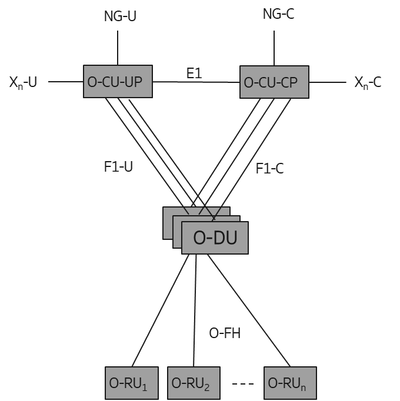

Figure 5.1-1: Multi-vendor equipment deployment architecture

## 5.2 Deployment scenarios

### 5.2.1 Co-located deployments

#### 5.2.1.1 Overview

This clause considers the deployment scenarios where relevant O-RAN network functions for aggregation of frequencies are co-located. In this use case, O-RAN NFs from multiple vendors, supporting the same or different band/duplexing capability are co-located. O-RAN NFs can be supporting a split RAN architecture, or it can be a monolithic integrated gNB. By supporting spectrum aggregation across the O-RAN NFs that are co-located, user throughput, cell coverage etc. can be improved.

Use cases based on different combinations of O-RAN NFs are described in clause 5.2.1.2 and 5.2.1.3.

#### 5.2.1.2 Addition of new O-RAN NFs co-located with existing intra/inter-band O-RAN NFs supporting same/different duplexing capability

The following use case covers the scenario where spectrum aggregation is needed between the co-located O-RAN NFs.

An MNO can have network function such as O-CU-CP, O-CU-UP, O-DU and O-RU with either TDD or FDD or both duplexing capabilities installed at a cell site. To increase the capacity of the site, MNO may need to install a new cell which could be operating in the same/different band. In one deployment scenario, depicted in Figure 5.2.1.2-1, MNO deploys a new O-RU, from a new vendor, to add a new frequency band to the existing infrastructure. The new O-RU can be connected to the existing O-DU through open fronthaul, as shown in Figure 5.2.1.2-1(b). In some instances, hardware or software realizing the existing O-DU may be limited by capacity and cannot host the new cell. One of the options available for the MNO is to enhance the capacity of existing hardware or software. Another possibility is to install a new hardware or software for capacity enhancements. The new hardware can be integrated with the existing hardware to realize the same logical O-DU (as in Figure 5.2.1.2-1(b)), or it can realize a new logical O-DU operating in parallel to the first O-DU as shown in Figure 5.2.1.2-1(c).

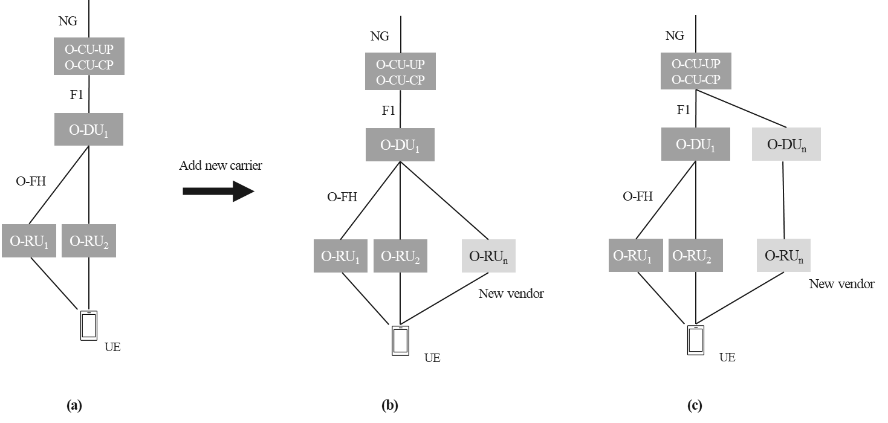

Figure 5.2.1.2-1: Adding new O-RU to support a new frequency band or carrier in a co-located deployment. (a) existing deployment. (b) addition of new O-RU. (c) addition of new O-RU and O-DU.

In some other deployment scenarios, deployed O-DU(s) may have limited capacity, may only support one duplexing method or can support a limited set of subcarrier spacing for real-time processing. The MNO may choose to deploy a new O-DU vendor to support a new O-RU, e.g., vendor c as shown in Figure 5.2.1.2-2. If the MNO chooses to install a new O-DU, it can be supporting the same or different duplexing capability or subcarrier spacing. If O-CU-CP and O-CU-UP are capable to handle the newly installed O-DU, the new O-DU can be connected to same O-CU-CP and O-CU-UP. Otherwise, a new O-CU-CP and O-CU-UP may also need to be installed. The MNO can choose the O-CU-CPs, O-CU-UPs, O-DUs or O-RUs from the same vendor or different vendors.

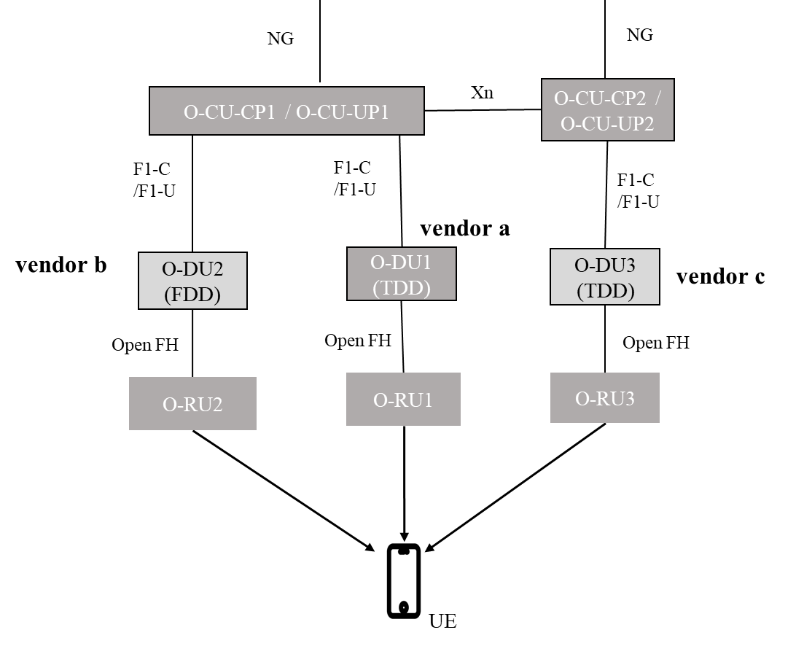

Figure 5.2.1.2-2: Spectrum aggregation in co-located O-DU

#### 5.2.1.3 Co-located intra/inter-band monolithic gNBs with same or different duplexing capability

This use case covers the deployment scenario where a monolithic gNB is installed at cell site. As shown in Figure 5.2.1.3-1, to increase the user capacity with spectrum aggregation, the MNO can install additional hardware and software either to upgrade the capacity of exiting gNB or to support a new gNB operating in parallel to the existing gNB. The newly installed gNB can operate in the same band or different band as the existing gNB. Both the gNBs may also support same or different duplexing capability. The new gNB can be monolithic or disaggregated. By supporting spectrum aggregation between these gNBs, improved coverage and throughput can be achieved.

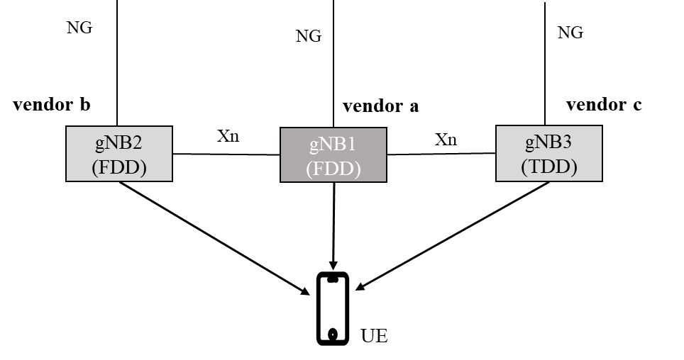

Figure 5.2.1.3-1: Spectrum aggregation in co-located gNBs

### 5.2.2 Non-co-located deployments

This clause covers the deployment scenarios where aggregated frequencies are served by equipments that are not co-located.

In this use case, gNBs are supporting split RAN architecture and it is distributed into different O-RAN network functions. O-CU-CP/O-CU-UP might be residing at a centralized location while O-DUs may be located at cell site or at a central location. Two cases are considered for this scenario:

* Single O-CU-CP and O-CU-UP connected to multiple O-DUs located at cell site.
* Each O-DU at cell site is connected to different O-CU-CP and O-CU-UP.

In one deployment scenario, the network MNO may deploy a new O-RU from a different vendor, to add a new frequency band, that is not co-located with other O-RUs serving the same geographic area. As an example, currently deployed O-RUs in a network may serve a large area and the MNO may decide to serve a high-demand zone within the larger coverage area by deploying additional spectrum. This is shown in Figure 5.2.2-1 below. By supporting spectrum aggregation across all the O-RUs serving the same area, user throughput, cell coverage etc. can be improved.

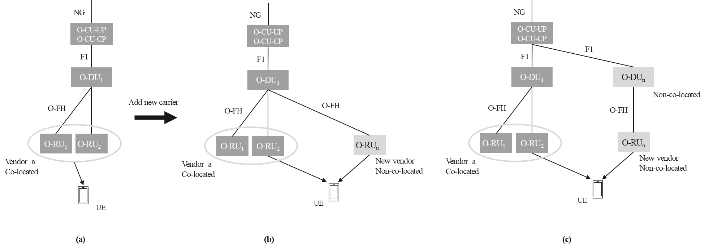

Figure 5.2.2-1: Deploying additional O-RU in a non-co-located manner. (a) existing deployment. (b) addition of non-co-located O-RU connected to existing O-DU. (c) addition of non-co-located O-RU and O-DU.

In some other deployment scenarios, as shown in Figure 5.2.2-2 below, deployed O-DU(s) at each cell site may have limited capacity, or may only support one duplexing method, or can support a limited set of subcarrier spacing. There may also be some other O-DUs which are not co-located with the existing O-DUs. But these O-DUs can be used together to overcome the limitations of existing cell site deployment. All the O-DUs can be supporting the same or different duplexing capability. The O-Dus can be connected to the same or different O-CU-CPs and O-CU-UPs. Also, these O-DUs may be provided by the same vendor or different vendors. The band configuration also can be the same or different for all these O-DUs. By supporting spectrum aggregation across different cells served by same or different non-co-located network functions (O-RU, O-DU, O-CU-CP, O-CU-UP), end user throughput and cell coverage of different frequency bands can be improved.

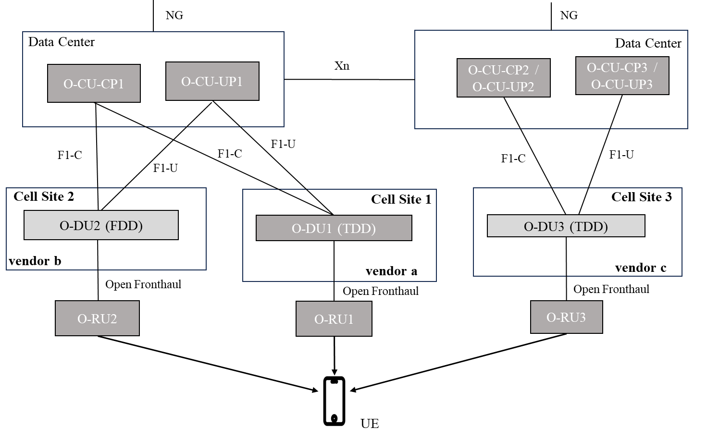

Figure 5.2.2-2: Spectrum aggregation in non-co-located RAN components

### 5.2.3 Transport assumptions

This clause covers the aspect of connectivity between the different equipment for supporting spectrum aggregation to consider ideal and non-ideal transport considerations.

Network devices can be connected directly or through L2/L3 switches within the range that meets delay requirements. There are multiple connectivity classes for the transport connecting the NFs. Some guidelines are provided in O-RAN Xhaul Transport Requirements document [i.2].

For more information on the latency requirements, see Annex A. The outlined solutions in the present document account for ideal and non-ideal transport scenarios.

## 5.3 Considerations for spectrum aggregation techniques

### 5.3.1 UE considerations from network perspective

Spectrum aggregation between RAN NFs can be achieved by multiple techniques such as carrier aggregation or dual connectivity. The usage of these techniques in a network are also dependent on UE capability. Different spectrum aggregation techniques can impact the UE performance differently. Use case considerations for UE performance and capabilities are discussed below.

* Spectrum aggregation to maximize component carrier (CC) combinations based on UE capability: Number of carrier frequency combinations play an important role in spectrum aggregation; larger the number, better the throughput and coverage. UEs supporting different 3GPP releases differ in CC combination capabilities. Number of available CCs for spectrum aggregation depends on a particular spectrum aggregation technique. For example, UEs, which are supporting earlier R15 or R16 3GPP releases, may be limited in supporting CC combinations for some of the spectrum aggregation techniques based on the band and bandwidth considerations for the component carriers. This needs to be considered for both SA and NSA UEs.
* UE power consumption: While considering spectrum aggregation techniques, power consumption by UEs at various distances from the cell site needs to be considered. Spectrum aggregation techniques should minimize impact on UE power consumption.

### 5.3.2 Spectrum considerations

#### 5.3.2.1 Overview

Most commercial RAN deployments involve multiple frequency bands. Spectrum aggregation across different bands should consider frequency band characteristics (coverage, supported SCS, duplexing).

The following clauses cover use cases, such as (i) intra-band contiguous and non-contiguous in FR1/FR2, (ii) inter-band within and across FR1/FR2, and (iii) considerations for DL-UL link balance in high-frequency bands and different duplexing schemes (FDD/TDD).

#### 5.3.2.2 Duplexing (FDD/TDD)

Spectrum usage is regulated into FDD and TDD domains. While FDD uses separate frequencies for the uplink and the downlink, TDD uses a single frequency for both uplink and downlink.

Generally, the unpaired spectrum for TDD is allocated in higher frequencies than FDD. The low-band FDD, due to physical propagation characteristics, offers a wider coverage area than the higher-frequency TDD spectrum. Typically, the low-band FDD is limited in capacity. Mid-band TDD has a higher bandwidth and capacity compared to the low-band FDD. However, mid-band TDD uplink coverage is more limited than the low-band FDD. Spectrum aggregation across FDD and TDD carriers can improve TDD cell coverage and deliver higher throughput than a TDD-only solution.

Figure 5.3.2.2-1 illustrates a possible way to aggregate the low-band FDD carrier (primary cell) and mid-band TDD carrier (secondary cell). By using the low-band FDD as the primary cell (PCell), the coverage-limiting UL data and control channels of the mid-band TDD carrier can be moved to the low-band FDD. This increases the overall mid-band cell coverage, which means that now the mid-band spectrum can be accessed by more users in the network. By using the mid-band TDD as secondary cell (SCell), the downlink throughput can be significantly improved. This use case provides the unique capability of aggregating low-band FDD and mid-band TDD for higher peak rates and increased cell coverage.

Figure 5.3.2.2-1: Aggregate low-band FDD carrier (PCell) and mid-band TDD carrier (SCell)

#### 5.3.2.3 Maximize the number of CCs being aggregated irrespective of inter or intra-band

MNO can access multiple carriers across various bands enabled by 5G in low, mid, and high frequencies. National regulators often grant additional spectrum licenses to MNOs in a phased manner. As a result, MNOs can offer services in multiple frequency bands and add spectrum in a phased manner at later dates including low, mid and high-frequency bands. To increase bandwidth and bitrate aggregation, MNOs need to consider spectrum aggregation from same or different vendor's equipment, involving low, mid, and high-band cells with considerations on availability, functionality, cost etc. This enables the use of downlink for all aggregated cells while ensuring connection stability through a common uplink on the lower frequency aggregated carriers. The MNOs primarily benefit from leveraging the cumulative spectrum bandwidth of these allocations from different vendors to achieve higher date rates for end users.

Figure 5.3.2.3-1 illustrates a scenario where three co-located and overlaid cells are provided by different vendor equipment; a low-band carrier, a mid-band carrier, and a high-band carrier. Maximizing the number of CCs being aggregated can be considered for both NSA and SA scenarios.

Figure 5.3.2.3-1: Aggregate multiple cells from different vendor equipment

#### 5.3.2.4 Spectrum aggregation between low band and mid/high band

This use case covers the need of spectrum aggregation between low and mid/high band. Let us consider that the MNO has O-DUs/O-RUs operating on low band allocated to the MNO, deployed in the cell site. Later, the regulatory body allocates a new mid/high band spectrum to the same MNO. By supporting aggregation between low and mid/high band cells, the MNO can achieve better coverage for mid/high band and can improve the throughput for UEs connected to low band cells. If existing O-DU with low band is restricted by capacity issue and hence cannot host new cells with mid/high band, a new O-DU may be required to be installed to utilize the newly allocated band. Existing cell may be supporting low band FDD capability while new cells may be supporting high or mid band with TDD duplexing capability. The introduction of new mid/high band cells can reduce the capacity demand of the low band cell as UEs in good coverage conditions can be served by the new cell as shown in Figure 5.3.2.4-1.

Figure 5.3.2.4-1: Example of spectrum aggregation between low and mid/high band

#### 5.3.2.5 Intra-band spectrum aggregation (contiguous or non-contiguous)

This use case covers the need of spectrum aggregation between the intra band cells. MNO deploys cells with spectrum allocated from Band B. Later more spectrum from same Band B is allocated to the MNO. Newly allocated spectrum can be contiguous or non-contiguous. The MNO wants to install cells from same or different vendor to support the newly allocated spectrum. As shown in Figure 5.3.2.5-1 below, to enhance the end user throughput by utilizing the newly allocated spectrum, aggregation between the two cells need to be supported.

Figure 5.3.2.5-1: Example of spectrum aggregation in intra band contiguous and non-contiguous spectrum

#### 5.3.2.6 Supplemental Uplink (SUL) use case

This is a use case to increase the UL coverage and/or capacity by using supplemental uplink (SUL) bands (see 3GPP TS 38.300 [i.4]). The coverage increase of a higher frequency cell is achieved by using the SUL carrier's lower frequency, which has lower path loss than the UL frequency of the higher frequency cell. UEs are typically limited in transmit power compared to gNBs/ng-eNBs. Usage of SUL allows UEs to extend UL coverage by switching the UL frequency to the SUL carrier. Figure 5.3.2.6-1 illustrates this use case. SUL bands are defined in 3GPP TS 38.101-1 [i.5]. The SUL carrier's provisioning and management can be addressed by a different RAN vendor than that of the UL carrier.

SUL

UL

DL

Frequency

UL coverage

DL coverage coverage

SUL coverage

gNB/ng-eNB

Figure 5.3.2.6-1: Switching to SUL carrier to increase coverage and/or capacity use case.

#### 5.3.2.7 Supplemental Downlink (SDL) use case

SDL is a spectrum aggregation use case to increase a cell's DL capacity. Aggregating SDL carrier (see 3GPP TS 38.101-1 [i.5]) with any downlink carrier increases the DL bandwidth, thereby increasing the cell's DL capacity. The Figure 5.3.2.7-1 illustrates this spectrum aggregation use case. The aggregation of SDL and DL carriers is as defined in 3GPP TS 38.101-1 [i.5]. The SDL carrier's provisioning and management can be taken care by a different RAN vendor than that of the DL carrier with which the SDL carrier is aggregated.

SDL

UL

DL

Frequency

UL coverage

DL coverage coverage

SDL coverage

gNB/ng-eNB

Increase capacity

Figure 5.3.2.7-1: Aggregation of SDL with DL carrier for increasing DL capacity use case.

### 5.3.3 Synchronization considerations

Spectrum aggregation often requires deploying multiple nodes to serve a single UE. Such nodes run their own clocks which may or may not be synched with GPS clock. Thus, it cannot be assumed that synchronization required by 3GPP for spectrum aggregation is always possible (as defined in TS 38.133 [i.6], for intra-FR1, maximum received timing difference cannot be bigger than 33 us). While considering techniques for spectrum aggregation, it should be made sure that the requirements for time synchronization between aggregated cells should be as flexible as possible to enable deployments also where the above requirements for time synchronization cannot be achieved.

### 5.3.4 Network management considerations

Network management aspects (FCAPS) need to be considered when new spectrum (intra/inter band, contiguous/non-contiguous, FDD/TDD) is added. A few possible scenarios wherein, either a new O-RAN NF needs to be added or existing O-RAN NF continues to support the additional spectrum are listed in Table 5.3.4-1.

Table 5.3.4-1: Network management scenarios

|  |  |  |  |  |
| --- | --- | --- | --- | --- |
| Scenario# | O-RU | O-DU | O-CU-CP | O-CU-UP |
| 1 | New | Existing | Existing | Existing |
| 2 | New | New | Existing | Existing |
| 3 | New | New | New | New |
| 4 | Existing | New | Existing | Existing |

As discussed in previous clauses, network functions (O-RU, O-DU, O-CU-CP, O-CU-UP) can be from one or more vendors with any combination of them. These network functions (NFs) can be managed by EMS/NMS/SMO from one or multiple vendors. Orchestration and automation aspects for multi-vendor scenarios need to be considered as well. This is not addressed in the present document.

### 5.3.5 RAN intelligence considerations

RAN intelligence aspects can be considered when new spectrum (intra/inter band, contiguous/non-contiguous, FDD/TDD) is added. Impacts on Near-RT RIC and Non-RT RIC due to the multi-vendor scenarios already listed in clause 5.3.4 can be considered. This is not addressed in the present document.

### 5.3.6 Considerations for solution evaluation

When evaluating different solutions and techniques for spectrum aggregation with multi-vendor deployments, the following criteria is proposed:

1. Minimize complexity: Solution complexity in terms of network deployment is an important evaluation criterion. The bandwidth and latency requirements on the underlying transport are to be considered. A multi-vendor interface is designed to be well-defined with clear functional split.
2. Minimize impact to inter-operability testing and standardization effort: Efforts needed in the standardization process and inter-operability testing are important criteria in the evaluation of the solutions. In addition, standardizing multiple solution options addressing the same problem is not desirable.
3. Increase performance and lower latency: The solution(s) can be evaluated for maximizing utilization of available system capacity (e.g., maximize average and 5th percentile user throughput) and lowering experienced latency to end users.
4. Minimize impact on O-RAN architecture: Impact on O-RAN architecture is considered in the evaluation of the solution. There is a benefit in reusing existing interfaces as well as minimizing the impacts to existing O-RAN functions.
5. Minimize UE impact: The proposed solution(s) cannot include any changes to the UE specifications or lead to changes to the Uu interface.
6. Aligns with 3GPP RAN design: All solutions are to conform to existing 3GPP specifications and cannot introduce any new requirements on 3GPP specifications.
7. Increase spectral efficiency of combined carriers: The spectrum aggregation solution(s) are expected to maximize spectral efficiency of combined component carriers. Performance under ideal and non-ideal transport can be assessed.
8. Increase coverage and capacity: The spectrum aggregation solution(s) are expected to account for DL and UL path imbalance of high frequency carriers and enable extending the reach of high frequency carrier to as many UEs as possible, e.g., by using UL of a low frequency carrier for UL data traffic while DL data traffic is carried over the higher frequency band, thus increasing coverage and capacity.
9. Address security concerns with different solutions: If new interface(s) are defined, the security and integrity of data transfer over the interface are to be protected as specified by O-RAN WG11. The impact of the security requirements on the equipment and the underlying transport needs to be assessed.
10. Minimize energy consumption: The preferred solution(s) is the one that minimizes energy consumption while maintaining the required performance (user throughput, enhanced coverage, etc.). All potential solutions can be evaluated for expected energy consumption and performance trade-offs.
11. Minimize exchange of scheduling-specific information over open interfaces: The preferred solution is the one that minimizes exchange of the scheduling-related information over open interfaces and thus helps encourage differentiation in particular scheduler implementations.

# 6 Spectrum aggregation solutions

## 6.1 Overview

There are multiple techniques available for multi-vendor spectrum aggregation in 3GPP and O-RAN. These techniques cover different use cases. However, not all the use case defined in clause 5.2.1 are covered due to limitations on existing interfaces.

Following Spectrum Aggregation techniques are defined in 3GPP Rel-15 for NR [i.4]:

1. Carrier Aggregation (CA)
2. Dual Connectivity (DC)

There are multiple interfaces that can be used to achieve the spectrum aggregation across multi-vendor components using above techniques. These interfaces are defined in 3GPP and O-RAN, and an additional interface is newly proposed below to provide additional functionality for multi-vendor interoperability.

1. Xn Interface (existing):
   1. Dual connectivity with aggregation at PDCP level, for supporting spectrum aggregation, can be achieved using Xn Interface
   2. Data exchange between primary node and secondary node takes place at PDCP PDU level.
2. F1 Interface (existing):
   1. If multiple O-DUs are connected to the same O-CU-CP/O-CU-UP, F1 interface can be used to provide spectrum aggregation via DC technique.
   2. If an O-DU supports multiple cells, each O-DU node can support CA simultaneously with DC. All the CA links will be within a single vendor O-DU in this case.
3. Open Fronthaul Interface (existing):
   1. CA between cells of different O-RUs connected to a single O-DU can be achieved using O-FH interface.
   2. The O-RUs and the O-DU can be provided by same or different vendors.
4. Inter O-DU Interface (proposal):
   1. CA across cells supported in different vendor O-DUs can be achieved by a potential new interface between O-DUs.
   2. Each O-DU can be connected to different or same vendor O-RUs. The O-DUs can be connected to different or same vendor O-CU-CP/O-CU-UP.

There are several additional aspects of spectrum aggregation that impact the performance and need to be considered. One such example is the increase in traffic load in O-DUs due to larger bandwidth available to UEs. This can result in an imbalance in the loading of O-DUs that are implementing spectrum aggregation. Therefore, mobility load balancing (MLB) techniques are an important consideration for effective usage of spectrum aggregation.

The MLB feature is defined in 3GPP TS38.300 specification [i.4]. MLB is achieved by exchanging resource information among gNBs periodically and initiating handover procedure to redirect UE session to other gNBs as shown in Figure 6.1-1.

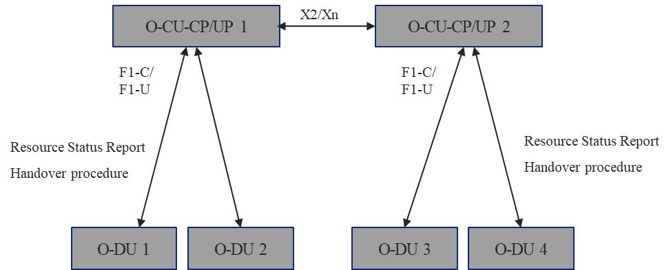

Figure 6.1-1: Mobility Load balancing between gNBs.

## 6.2 Solution 1: Intra O-DU Carrier Aggregation

### 6.2.1 Solution description

#### 6.2.1.1 Intra O-DU multi O-RU carrier aggregation

In carrier aggregation, spectrum aggregation is achieved at O-DU level. Each O-DU can support multiple cells possibly through multiple O-RUs. The cell where UE is attached is called the Primary Cell (PCell) for that UE while other cells used for carrier aggregation are called Secondary Cells (SCells).

In DL CA, the primary O-DU receives data from O-CU-UP and schedules the data between the PCell and SCells to transmit to the UE. The UE maintains multiple downlink links as per the number of component carriers (CCs) configured to receive data from gNB. Data received from SCells as well as from PCell is aggregated at MAC level in the UE and forwarded to higher layer. There is a single instance of PDCP, RLC, and other higher layers in the UE, when carrier aggregation is activated.

In UL CA, SCells and PCell receive UL data (PUSCH) separately from the UE. Data is then aggregated in the PCell and forwarded to the O-CU-UP. The UCI (PUCCH) can be transmitted on the component carriers configured for UL.

Both SCells and PCell are processed in a single O-DU which is connected with multiple O-RUs using the Open Fronthaul interface. The Open Fronthaul (and F1) interface enables multiple vendor options for an MNO to decide for deployment considerations as shown in Figure 6.2.1-1. Figure 6.2.1-1 shows the intra O-DU DL CA scenario, where the PCell is configured on a carrier served by O-RU1 and DL only SCell(s) are served by O-RUn. In this scenario, PUCCH is carried by the PCell. The UE transmits the PUCCH for PCell PDSCH as well as for SCell PDSCHs on PCell resources. The PUCCH is received by PCell in O-DU. If PUCCH for SCell is present, it is shared with SCells. The O-DU coordinates the sharing of the PUCCH between the PCell and the SCells configured for the UE.

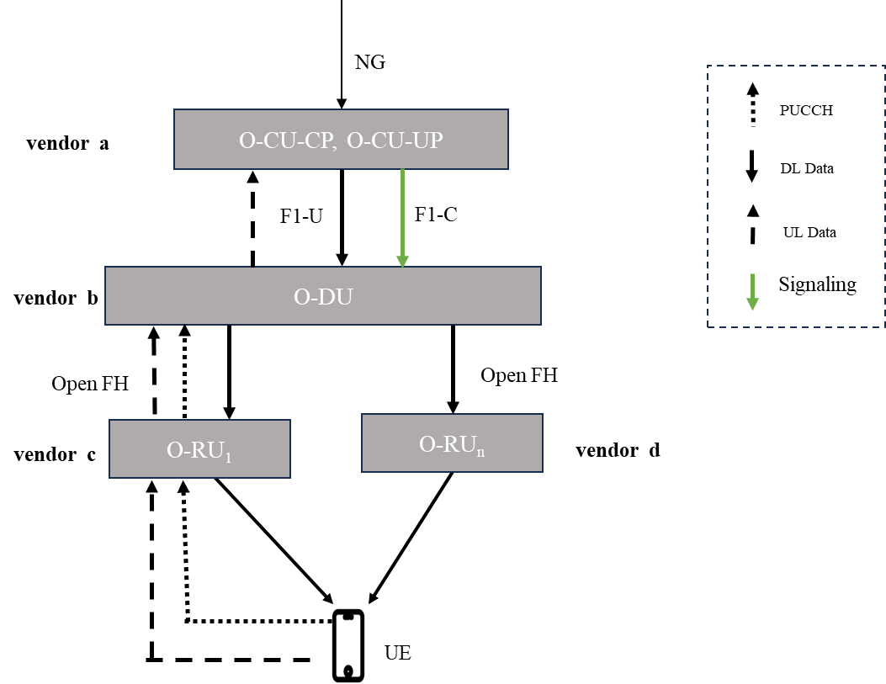

Figure 6.2.1-1: Intra O-DU, Multi O-RU DL CA without UL CA.

Intra O-DU CA is implemented within a single O-DU. MLB is taken care of by existing F1/X2/Xn interface by doing intra O-DU handover or inter O-DU handover to other O-DU.

#### 6.2.1.2 Intra O-DU Shared O-RU carrier aggregation

Shared O-RU reference architecture is shown in Figure 6.2.1.2-1, where a shared O-RU can share its resources (e.g., carriers) with two O-DUs. The Shared O-RU framework can be used in scenarios when a new O-RU deployment is also accompanied by an additional O-DU. Spectrum aggregation across cells supported by an O-DU is then achieved by carrier aggregation.

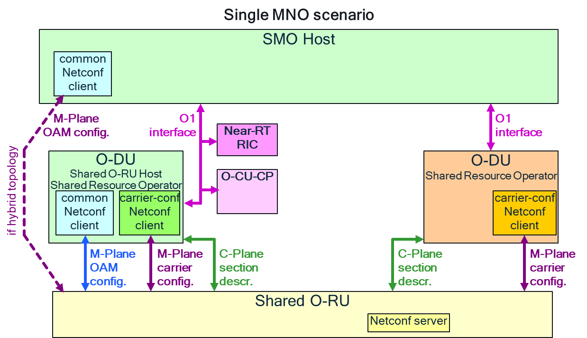

Figure 6.2.1.2-1: Shared O-RU reference diagram.

Figure 6.2.1.2-2 shows how shared O-RU can be used in a multi-vendor O-DU/O-RU deployment to enable carrier aggregation of newly deployed spectrum with already deployed carriers. In Figure 6.2.1.2-2 (a), O-RU1, supporting for example carrier 1, is connected to O-DU1. To support new spectrum, O-RUn is added to the network. A new O-DUn can be installed from a different vendor, for example to handle carrier(s) supported by O-RUn if O-DU1 is resource constrained. The new O-DU-n can also be connected to the O-RU1. O-RU1 is then configured as shared O-RU and its resources (carriers) are shared between O-DU1 and O-DUn. The UEs connected to O-DUn can use CA for carriers supported by O-RUn and the shared carrier(s) of O-RU1. Even though O-DUn is supported by a different vendor, CA is still achieved among the multiple component carriers within the single vendor O-DUn. In Figure 6.2.1.2-2 (b), a UE connected to O-DU1 cannot be configured for carrier aggregation with carriers(s) from O-RUn. UEs connected to O-DU1 can be configured for carrier aggregation for the carriers supported in O-DU1 (i.e., carriers supported by O-RU1 and carriers supported by other O-RUs, not shown in figure, which are connected to the O-DU1).

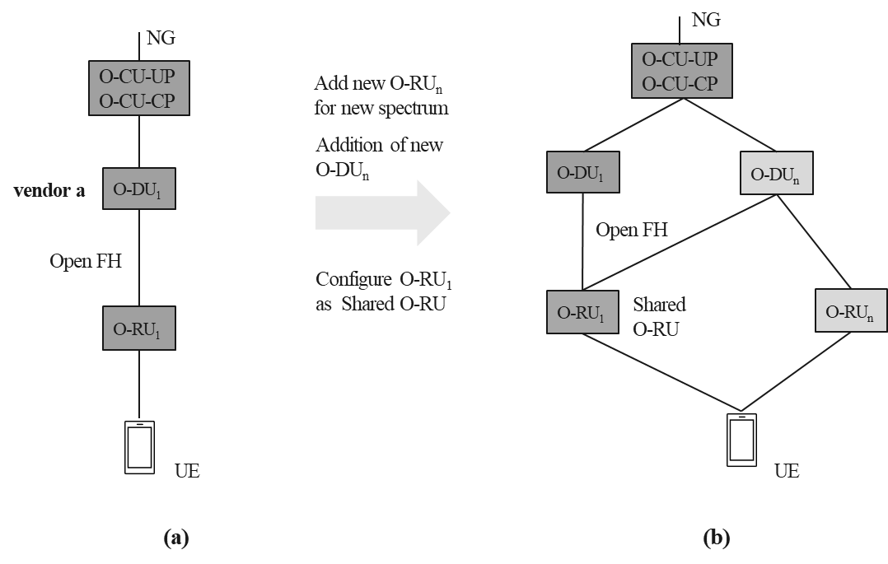

Figure 6.2.1.2-2: Shared O-RU can be used in multiple O-DU deployments to enable CA. (a) Initial deployment. (b) Bands supported by O-RU1 and O-RUn can use CA.

### 6.2.2 Mapping to deployment scenarios and other consideration

This solution can cover all the deployment scenarios mentioned in clause 5.2.1. Spectrum aggregation when adding the new O-RU to an existing O-DU can be done by intra O-DU carrier aggregation. When a new logical O-DU is also added to an existing deployment (see Figure 5.2.1.2-1(c)), then intra O-DU CA can be realized using the shared O-RU framework as described in clause 6.2.1.2.

For non-co-located deployment use cases of clause 5.2.2, this solution can cover all scenarios if the fronthaul connecting the O-RU and O-DU has latency within the latency classes of High25, High75 of Table A-1. The High100 and High200 latency classes can also be supported depending on implementation and performance trade-offs.

3GPP TS 38.101 specification [i.5] defines the various NR band combinations and carrier components that can be used in DC and CA technologies within each frequency range (FR1 or FR2). Table 6.2.2-1 captures the number of NR band combinations supported for various 3GPP releases.

Table 6.2.2-1: Band combinations supported across different 3GPP releases.

|  |  |  |  |  |  |  |  |  |  |  |  |
| --- | --- | --- | --- | --- | --- | --- | --- | --- | --- | --- | --- |
| 3GPP Release | Intra Band | | 2-Band, Inter Band | | 3-Band, Inter Band | | 4-Band, Inter Band | | 5-Band, Inter Band | | SUL |
| CA | DC | CA | DC | CA | DC | CA | DC | CA | DC | CA |
| Rel 15 (38.101-1 v15.23.0) | 4 | 0 | 13 | 0 | 0 | 0 | 0 | 0 | 0 | 0 | 8 |
| Rel 16 (38.101-1 v16.17.0) | 11 (contig) +  8 (non contig) | 0 | 82 | 1 | 35 | 0 | 6 | 0 | 0 | 0 | 15 |
| Rel 17 (38.101-1 v17.11.0) | 17 (contig.) +  13 (non contig) | 0 | 181 | 120 | 182 | 29 | 75 | 7 | 2 | 0 | 25 |
| Rel 18 (38.101-1 v18.3.0) | 17 (contig) +  14 (non contig) | 0 | 226 | 200 | 272 | 117 | 102 | 29 | 17 | 8 | 32 |

As shown in Table 6.2.2-1, NR CA has more band combinations compared to NR DC. Release 15 and Release 16 specify NR DC for inter frequency ranges (between FR1 and FR2) but not for bands/frequencies within a given frequency range (FR1 or FR2). For NR spectrum aggregation, Release 15 or Release 16 UEs can use NR DC across FR1 and FR2 but within each frequency range, they can only use CA. Since the UE has to maintain at least two separate uplink connections for DC, the UE power consumption is typically lower in CA (e.g., for DL only CA) where a single UL carrier can be used for all the carriers.

### 6.2.3 Impact analysis on specifications

Carrier aggregation for NR is defined in 3GPP specification [i.4]. In Intra O-DU carrier aggregation, the scheduler is residing in the single vendor O-DU and the vendor can implement proprietry algorithms to coordinate DL and UL resources and manage data transfer between PCell and SCells. There is no impact on any specification, as both the cells are running in the same O-DU and O-FH is a well-defined interface in O-RAN for O-DU and O-RU interoperability.

The shared O-RU approach described in clause 6.2.1.2 uses existing O-FH to connect the existing O-RU with the new O-DU (see Figure 6.2.1.2-2). No new interfaces are needed. However, enhancements to CUS-Plane and M-Plane specifications [i.14], [i.15] might be needed to enable an O-RU to connect with two O-DUs and for the O-RU to share its resources (carriers) dynamically between the two O-DUs for single MNO use case with carrier sharing. This resource partitioning (static or dynamic) use case of sharing carriers is described in clause 4.20.1.2, clause 4.20.2.2 and clause 4.20.3.2 of the O-RAN Use Cases Detailed Specification [i.16].

### 6.2.4 Feasibility and gain/complexity analysis

Table 6.2.4-1 captures the solution evaluation for intra O-DU carrier aggregation covering both multi-O-RU and shared O-RU sub use cases.

Table 6.2.4-1: Evaluation of intra-O-DU CA

|  |  |
| --- | --- |
| Solution Evaluation Criteria | Remarks |
| Minimize complexity | No impact. Open FH is already a standard solution in O-RAN. |
| Minimize impact to inter-operability testing and standardization effort | No impact. Already a standardized interface. |
| Increase performance and lower latency | Since spectrum aggregation is done at O-DU level, latency will be very low. Performance of spectrum aggregation is also better compared to DC. |
| Minimize impact on O-RAN architecture | No impact. Open FH is a standardized interface. |
| Minimize UE impact | No impact. |
| Aligns with 3GPP RAN design | Aligned (Open FH is not defined in 3GPP but is aligned with the 3GPP standards for CA). |
| Increase spectral efficiency of combined carriers | Maximum possible for spectrum aggregation techniques and allowed combinations. |
| Increase coverage and capacity | Maximum for any spectrum aggregation technique [i.7]. |
| Address security concerns with different solutions | No impact. Already a standardized solution. |
| Minimize energy consumption | In DL CA, single PUCCH on PCell can carry the HARQ feedback or CQI etc for all the carriers while in DC, it is different PUCCH for both the carriers. Hence, energy consumption by UE will be lesser in CA compared to DC [i.8]. |
| Minimize exchange of scheduling-specific information over open interfaces | No impact. Monitoring of the Open FH does not offer information about MAC implementation. Monitoring of multiple Open FH does not change this situation. |

## 6.3 Solution 2: Inter O-DU Carrier Aggregation

### 6.3.1 Solution description

In case the product/server realizing the O-DU is not capable of being upgraded to support new band or capability either because of software or hardware limitations, carrier aggregation still can be achieved by installing a new O-DU with the required capability or to increase the capacity. Newly installed O-DU can be provided by the same vendor or different vendors. For supporting CA, O-DUs can be connected with a newly proposed O-RAN interface inter-connecting the two MAC layers. Details on how this solution can potentially be implemented is described below.

For supporting carrier aggregation across multi-vendor O-DUs which are running in different servers, existing interfaces Xn (at O-CU-CP/O-CU-UP level), F1 (between O-CU-CP/O-CU-UP and O-DU) and Open Fronthaul (between O-DU and multiple O-RU) cannot be used as none of the interfaces support connection between O-DUs. Hence, support for newly proposed interface between O-DUs is required in this scenario. If existing O-DUs already support the interface or it can be supported by a software upgrade, carrier aggregation across O-DUs can be achieved. By supporting an inter O-DU interface for CA, MNO can benefit from all the benefits of spectrum aggregation through CA.

A Service Management & Orchestrator (SMO) configures O-DUs using O1 interface as shown in Figure 6.3.1-1. O-DUs and O-RUs need to be compatible from Management plane perspective. This is the requirement for interworking of newly installed O-DU with existing/new O-RU irrespective of inter O-DU CA. The O1 interface can be updated to bring additional information such as IP address of the O-DUs, C-RNTIs, or PCIs, that is needed for the functioning of inter O-DU interface. The inter O-DU interface can also be configured automatically based on self-detection of O-DUs supporting cells that can be aggregated.

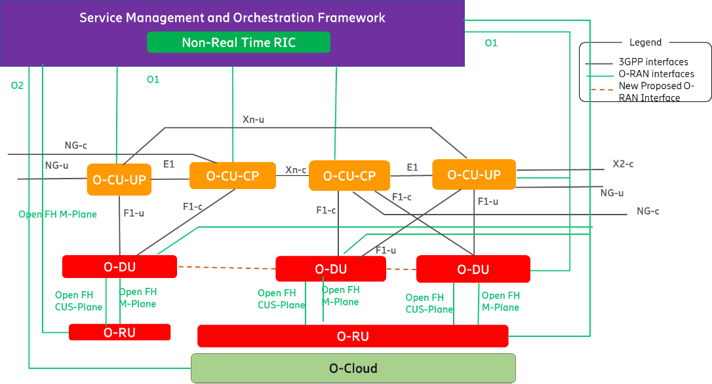

Figure 6.3.1-1: O-DU configuration by SMO (modified from [i.17] to show the new interface).

In Figure 6.3.1-2 O-DU1 is hosting primary cells while O-DU2... O-DUn are hosting SCells. The dotted colored interface is indicating the DL CA across O-DUs using the new interface (D2-C and D2-U). O-DU1 receives data from O-CU-UP and schedules DL Data with O-DU2 ... O-DUn to transmit on SCells. If there is no UL CA supported, PUCCH for SCells and PCells shall be received by O-DU1 as shown in Figure 6.3.1-2. O-DU1 shall extract the relevant part of the PUCCH information such as CQI, HARQ feedback and forward it to SCells.

NOTE: 'n' is not equal to maximum number of aggregated component carriers, rather the maximum number of inter-connected O-DUs for a given deployment that are used for CA across relevant SCells.

Figure 6.3.1-2: Inter O-DU DL Carrier Aggregation without UL CA.

At power up, each O-DU connects to its peer O-DUs based on the configuration received via O1 interface. SCells from peer O-DUs can be added only if link establishment between the O-DUs is successful. Once a O-DU triggers the link establishment request towards another O-DU, it may accept or reject the request. If the request is rejected, pair of O-DUs can not be used for CA. On SCell addition from O-CU-CP, primary O-DU shares the SCell information such as CRNTI, Cell ID of SCell, QoS, RLC configuration etc with secondary O-DUs supporting SCells. After successful addition of SCells from other O-DUs, SCells can be activated for the UE. At SCell activation, the primary O-DU, informs secondary O-DUs about CA activation so that data exchange can take place.

If UL CA is also enabled along-with DL CA, UE maintains multiple links for uplink data. UE transmits data on the respective SCells, which can belong to different O-DUs, depending on the scheduling of PUSCH in SCells. Data is then transferred from secondary O-DUs to the primary O-DU for aggregation. The primary O-DU sends the aggregated data to O-CU-UP. In this case UCI for both PCell and SCell can also come multiplexed with PUSCH data on SCell depending on scheduling in the SCell.

As showing in Figure 6.3.1-3 & Figure 6.3.1-4, UE is connected to PCell running in the O-DU1 while SCells are running in the O-DU2 and the O-DUn. UE transmits the data on the cell(s) as scheduled by the PDCCH. SCell(s) receive PUSCH containing user data and control (UCI) information. Secondary O-DU (O-DUn) then forwards the user data and UCI information (for example HARQ feebdback, CQI) for PCell and SCells to the Primary O-DU (O-DU1). Primary O-DU shares the UCI information with other secondary O-DUs (O-DU2). In Figure 6.3.1-3, UCI bits are scheduled on the primary O-DU (O-DU1). O-DU1 receives UCI information related to SCells. O-DU1 then parses and sends UCI information to O-DU2 and O-DUn if present. In Figure 6.3.1-4,, UCI is scheduled on secondary O-DUn multiplexed with PUSCH. The O-DUn receives the UL data along with the UCI information and shares UL Data and UCI information with the O-DU1. The O-DU1 forwards UCI information to secondary O-DU2, if present.

Figure 6.3.1-3: Inter O-DU UL CA, PUCCH on PCell.

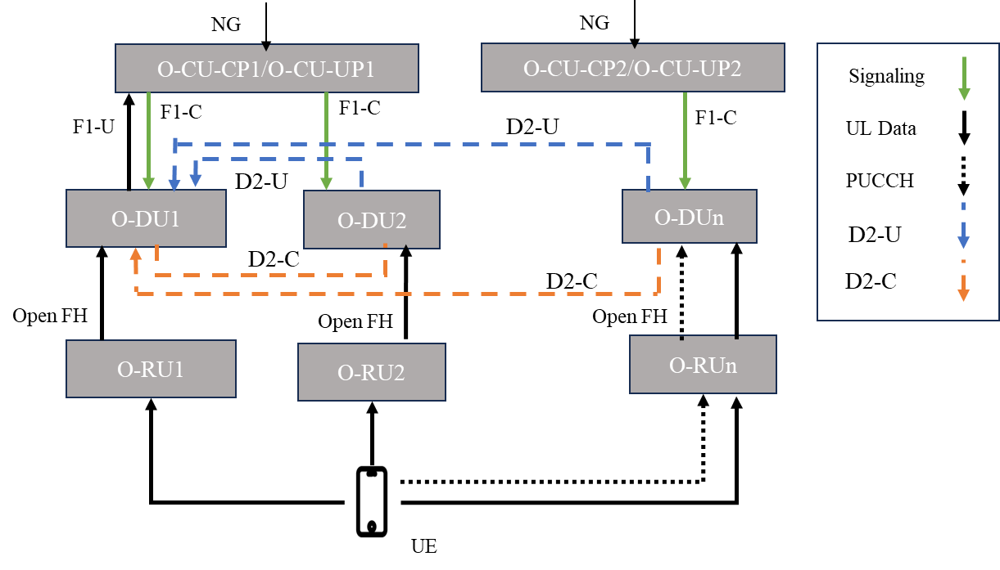

Figure 6.3.1-4: Inter O-DU UL CA, PUCCH on SCell.

In the case of intra gNB, inter O-DU CA, MLB can be achieved through F1 interface. For MLB, one or more UEs can be handed over to other O-DUs. Handover can be done to both co-located and non-co-located O-DUs. Inter O-DU handover using F1 interface is defined in 3GPP specifications. Additionally, the new interface between O-DUs, if defined, also can be used to share the resource status information between the O-DUs so that the PCell can avoid activating SCells on the O-DU facing loading condition as shown in Figure 6.3.1-5 below.

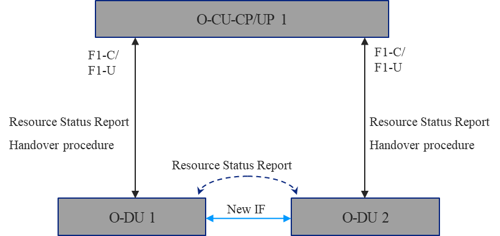

Figure 6.3.1-5: Mobility load balancing with intra gNB, inter O-Dus CA.

In the case of inter gNB, inter O-DU CA, MLB can be achieved via F1 and X2/Xn interface [i.12] [i.13]. On a condition triggering MLB, one or more UEs can be handed over to other O-DU. On detecting any MLB condition, O-DU can inform O-CU-CP about the resource status on F1 interface. Based on these reports, O-CU-CP can trigger X2/Xn handover towards another O-DU. All these procedures are defined in 3GPP specifications. Additionally, if secondary O-DU is loaded, interface between O-DUs can be used to report the resource condition to primary O-DU **as shown in** Figure 6.3.1-6 **below**. Primary O-DU can avoid SCell activation towards this O-DU to avoid loading with exchanging resource information such as "Radio Resource Status" IE defined in 3GPP TS 38.423 [i.13].

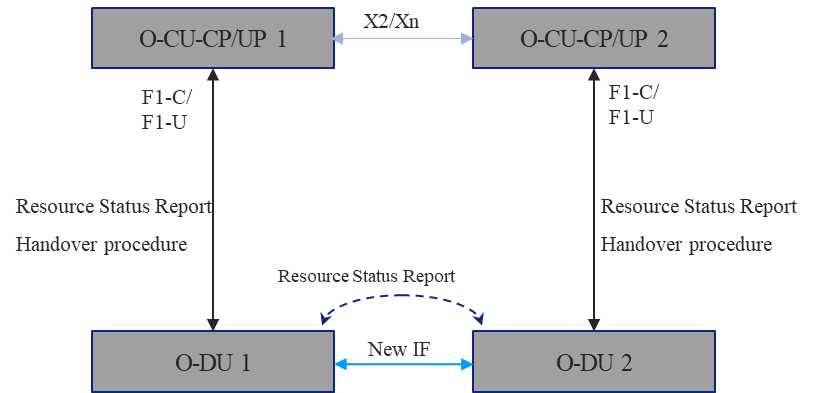

Figure 6.3.1-6: Mobility load balancing with inter gNB, inter O-DUs CA.

Figure 6.3.1-7 shows the protocol stack for inter O-DU CA between two O-DUs. The RLC layer hosted in primary O-DU is common for both primary and secondary O-DU for a particular UE while MAC layer can be present in both primary and secondary O-DUs for a UE.

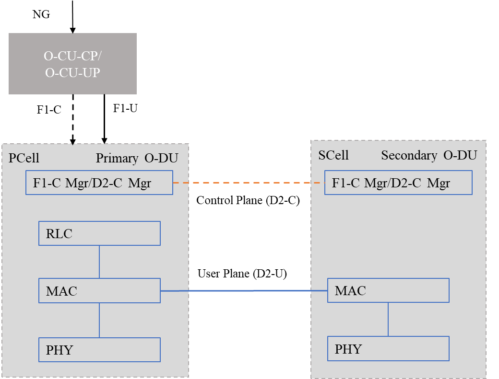

Figure 6.3.1-7: Protocol stack in O-DUs for Inter O-DU CA.

There are two parts of the inter O-DU interface referred to as D2 here.

* D2-C: Exchange of Control information. SCTP can be used as transport protocol.
* D2-U: Exchange of user data and PUCCH information. GTP-U is used for transport mechanisms.

**D2 Control Interface (D2-C):**

D2-C functionality involves the establishment and management of the link between O-DUs. SCTP is used as transport protocol. Link establishment between O-DUs takes place before any UE is connected to the O-DU. Main functionality of D2-C includes:

* Establish connection between O-DUs.
* Connection establishment can happen as soon as the O-DU comes up.
* SCell Addition/Deletion/Modification. It can be triggered on SCell addition/deletion/modification for a particular UE.

Figure 6.3.1-8 indicates the sample message sequence for D2 link establishment. Figure 6.3.1-8 indicates the procedure and not the actual interface name or parameters.

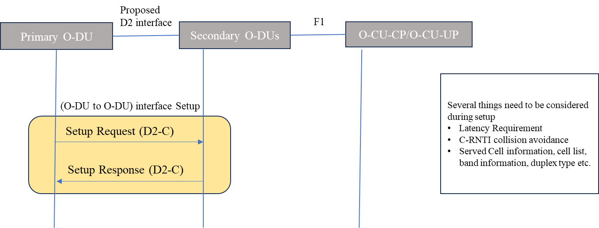

Figure 6.3.1-8: D2 link establishment.

**D2 User Interface (D2-U):**

The D2-U part of the interface is responsible for user data and PUCCH/UCI information exchange between O-DUs. GTP-U is used as the transport protocol for this interface. Main functionality of D2-U includes:

* Data exchange between primary and secondary O-DU.
* For DL-CA, primary O-DU receives data from O-CU-UP. The PDCCH is scheduled on both the O-DUs independently, similar to Intra O-DU CA case.
* For DL CA, PUCCH resource allocation is done by primary O-DU. PUCCH related information (e.g. PUCCH Resource Indicator etc), required to be encoded in PDCCH, is shared between the primary and secondary O-DUs. UCI information on PUCCH for all the O-DUs is received by primary O-DU. It then forwards the information related to an SCell to the respective secondary O-DU.
* For UL CA, both PCell on primary O-DU and SCells on secondary O-DUs receive data from UE. After MAC layer processing, secondary O-DU sends UE UL data to the primary O-DU, which then forwards it to the RLC layer residing in the primary O-DU.

Figure 6.3.1-9 indicates the information exchange on D2-U interface.

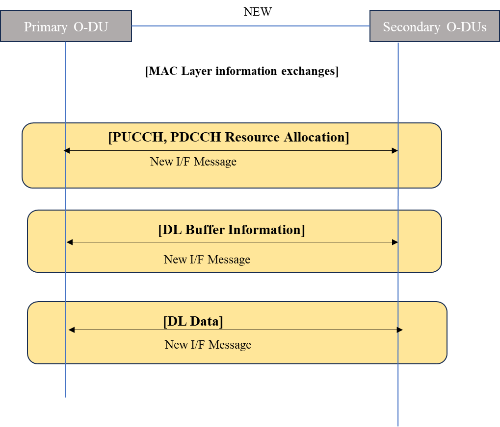

Figure 6.3.1-9: D2-U usage.

For D2 interface configuration and management, existing O1 interface that brings O-DU configuration from SMO can be enhanced. The D2 interface can be defined in a manner similar to the 3GPP defined F1 interface: a control part D2-C to carry control related information and a user plane part D2-U carrying user data as described above. Existing security mechanism defined in WG11 e.g., IPSec or any other mechanism can be utilized for protecting D2 interface as well. Brief outlines of control and data plane procedures expected from D2 interface are also described in Figure 6.3.1-8 and Figure 6.3.1-9. An example of protocol stack split for supporting inter O-DU CA is also captured in Annex B.

As the interface between the O-DUs is kept at MAC sub-layer for user plane, this tends to reduce the bandwidth requirement. Bandwidth requirements for inter O-DU CA can be the same or lower then F1 bandwidth requirement. The D2 interface can be designed to accommodate the latency class High75, High100 & High200 as described in Table A-1. The total round trip transmission and processing delay is bounded by 500 us. Coverage of mid/high band carrier can be improved if inter O-DU CA is supported between O-DUs with PCell on low band FDD carrier and SCell on mid/high band TDD carrier. This coverage improvement, due to PUCCH for mid/high band SCells being received on low band PCell, can be similar to the intra O-DU CA solution.

### 6.3.2 Mapping to deployment scenarios and other consideration

This solution can cover all the deployment scenarios mentioned in clause 5.2.1.2 and clause 5.2.2 if the latency requirement between O-DUs is maintained as mentioned in clause 6.3.1. Spectrum aggregation across multiple multi-vendor O-DUs, either in co-located or non-co-located scenarios, can be achieved with this solution. Band combinations for NR CA are defined in Table 6.2.2-1 in clause 6.2.2. Energy consumption at UE is similar to intra O-DU CA solution as defined in clause 6.2.2, but at the network side, energy consumption can be higher due to message exchange between O-DUs. SDL bands are low bands that can be used to increase the coverage and throughput. If an SDL band is allocated to the MNO and it is supported in a different O-DU, it can be used for CA using this interface. On allocation of SUL band, if support of the SUL band cannot be extended in existing O-DU(s), another O-DU supporting SUL carrier can be used to provide the switching between the carriers for better coverage and performance. The proposed interface can be used to support this switching.

### 6.3.3 Impact analysis on specifications

There is no direct standardized inter O-DU interface defined in existing 3GPP or O-RAN specifications. For supporting inter O-DU carrier aggregation, a new inter O-DU interface needs to be defined. For supporting multi-vendor inter O-DU CA, the following Table 6.3.3-1 captures all the WGs that will be impacted for supporting multi-vendor inter O-DU CA. Impact on each WG is also mentioned in the table.

Table 6.3.3-1: WGs and specifications impact of standardization of inter O-DU interface.

|  |  |  |  |
| --- | --- | --- | --- |
| # | WGs | Specifications | Objective description |
| 1 | WG1 (UCTG) | O-RAN.WG1.Use-Cases-Detailed-Specification | UCTG specification for existing use cases such as Shared O-RU, traffic steering may need some updates. |
| 2 | WG1 (ATG) | O-RAN.WG1.O-RAN-Architecture-Description | Existing architecture document need to be updated to capture the newly proposed interface between O-DUs. |
| 3 | WG5 | O-RAN Interoperability Test Specification (IOT)  New Specification:  O-RAN.WG5.O-DU-D2 Interface-Specification | New interface needs to be defined between O-DUs for supporting inter O-DU CA.  D2 Interface document will capture C Plane, U plane details as well synchronization requirement.  Heartbeat management can be taken care of by D2 Interface. |
| 4 | WG10 | WG10 O-RAN O1 Interface Specification  WG10 O-RAN O1 Network Resource Model Specification  WG10 O-RAN O1 Performance Measurements Specification | O1 interface and IM/DM documents can be updated to support configuration of the O-DUs with peer O-DUs information for supporting multi-vendor inter O-DU CA.  Existing yang model can be enhanced to bring in information such as IP address of peer O-DUs, RNTIs, PCI. Faults KPI can also be updated in O1 interface documents. |
| 5 | WG11 | O-RAN.WG11.Security-Requirements-Specification  O-RAN Security Test Specifications | Security documents can be reviewed and updated to support the new interface between O-DUs. It can be considered as interface security. |

### 6.3.4 Feasibility and gain/complexity analysis

Table 6.3.4-1 evaluates the Inter O-DU solution against the solution evaluation criteria listed in clause 5.3.

Table 6.3.4-1: Evaluation of Inter O-DU CA.

| Solution Evaluation Criteria | Comment |
| --- | --- |
| Minimize complexity | A new interface connecting multiple O-DUs needs to be defined for supporting spectrum aggregation. This requires defining a management interface for tasks such as to establish and maintain O-DU relations, and SCell associations. A new signaling protocol, for example, to add/remove UE context, transfer user plane data and data flow management is also needed. Time synchronization across O-DUs also need to be specified. Clause 6.3.1 covers more details on complexity. The bandwidth and latency requirements and their impact on performance of carrier aggregation also needs to be evaluated in detail at WI phase. Clause 6.3.1 covers more details on bandwidth and latency requirement. |
| Minimize impact to Inter-operability testing and standardization effort | A new interface requires additional inter-operability testing requirements. Standardization effort requires involving multiple WGs in O-RAN such as WG1, WG5, WG10, and WG11. In addition, other groups such as WG3 or WG6 may be involved to enable additional functionality. |
| Increase performance and lower latency | Performance will not only depend on the details of the signaling protocol designed for the new interface but also on the scheduling and flow control policies of the aggregated SCells residing in different Dus. Flow misconfiguration can adversely impact overall cell throughput. The underlying transport latency amongst different O-DUs can impact CA performance compared with single O-DU solution. In general, intra O-DU CA is expected to have superior performance in terms of user and cell throughput when compared with an inter O-DU solution. Therefore, the choice of interface termination points and solution design should take this into consideration while exploring the potential solutions.  Faster activation of CA helps in achieving better performance in bursty UL traffic scenarios, though transport delay between O-DUs may impact it. |
| Minimize impact on O-RAN architecture | A new interface needs to be defined in the O-RAN architecture between O-DUs and requires modification to the existing architecture. The impact on O-RAN depends on the solutions proposed for this new interface and detailed specification would be done in WI. Initial impact on O-RAN architecture is covered in clause 6.3.1.  O1 interface need to be enhanced to support D2 interface configuration and LCM. |
| Minimize UE impact | No impact. The solution is assumed to be transparent for the UE. |
| Aligns with 3GPP RAN design | From the UE perspective, the solution is transparent and thus aligned with 3GPP CA architecture. However, to support new interface, MNOs would need to update their O-DU software and/or hardware, depending on their current implementations to enable multi-vendor carrier aggregation. To support inter O-DU CA in beyond 5G, some changes might be required depending on the architecture of beyond 5G that need to be considered at the new RAN design. |
| Increase spectral efficiency of combined carriers | CA provides best spectral efficiency among known spectrum aggregation techniques. However, proper design choices need to be made for the protocol split and interface termination points as different flow management and scheduling policies of disjoint schedulers can adversely impact performance. |
| Increase coverage and capacity | CA provides best coverage and capacity among known spectrum aggregation techniques [i.7]. However, proper design choices need to be made for the protocol split and interface termination points in order to obtain best coverage and capacity for multi-vendor carrier aggregation. |
| Address security concerns with different solutions | The new interface needs a security analysis to be performed by WG11 to ensure the interface has appropriate protections for confidentiality, integrity, availability, authentication, and authorization. This process typically takes one release train and may result in normative requirements specified for the subsequent release train. Analysis and recommended normative security requirements need to be shared with all WGs that are stakeholders for the new interface specification |
| Minimize energy consumption | For DL CA, a single PUCCH on PCell carries the HARQ feedback/CQI etc for all the aggregated carriers while in DC each cell group has a separate carrier for UCI and hence energy consumption by UE will be lower in CA compared to DC [i.8]. From a network perspective, the interface between two or more separate O-DUs can slightly elevate overall network power consumption compared to a single O-DU CA; moreover, in certain deployments like vRANs, the flexibility and scalability offered by a multi-vendor inter-DU interface for CA should also be taken into account in the overall considerations on network energy consumption. |
| Minimize exchange of scheduling-specific information over open interfaces | The new interface should be defined in such a way that scheduling specific information exchange is minimized between the nodes. The information exchange depends on the details of the interface. Depending on the design, the new interface could resemble O-FH and offer limited opportunity for obtaining scheduling information of the primary O-DU. Alternatively, it may require flow control between the schedulers of involved O-DUs; this flow control mechanism may be more detailed as compared to the flow control used for DC due to higher performance requirements of CA.  The mechanism will have to be general enough to handle various schedulers, but this generality may handicap efficiency of the solution (as compared to intra O-DU CA).  Proposed solution for the D2 interface is described in clause 6.3.1 and clause 7.3. It outlines the information that may be shared between O-DUs for transfer of user data and control information. |

## 6.4 Solution 3: Dual Connectivity

### 6.4.1 Solution description

Dual Connectivity (DC) is a well defined spectrum aggregation technique specified by 3GPP in TS 38.331 [i.9] and TS 38.420 [i.10]. F1 and Xn interfaces, as described in 3GPP TS 38.473 [i.12] and 3GPP TS 38.423 [i.13], provide connection between relevant RAN nodes. There are master node (MN) and secondary node (SN) that together are used to provide connectivity to the UE using Xn or F1 interface as shown in Figure 6.4.1-1 which results in better throughput. Data exchange takes place at PDCP PDU level in DC. O-DU is transparent for data transfer in DC technique. For O-DUs, there are two separate links established in downlink and uplink direction for a particular UE for data and control (UCI) information exchange. Figure 6.4.1-1 indicates the DC between multiple O-CU-CPs/O-CU-UPs. O-CU-CP/O-CU-UP/O-DU or O-RU can be supported by the same vendor or different vendors.

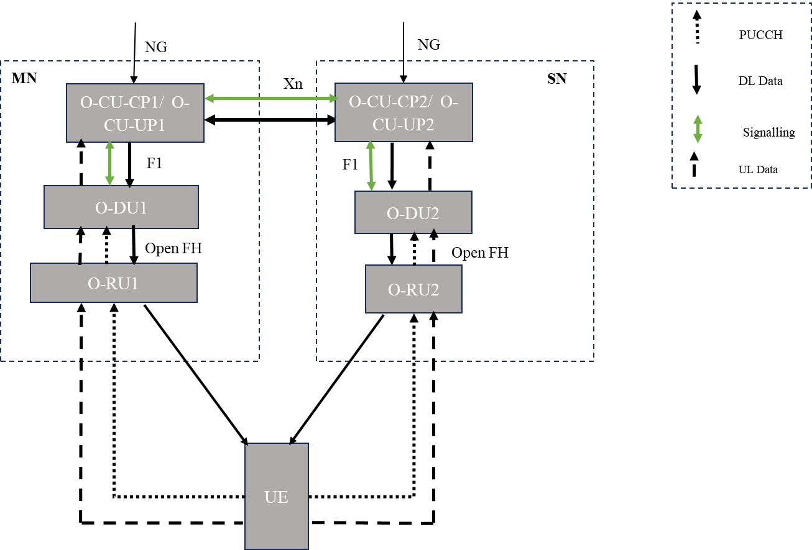

Figure 6.4.1-1: DC across multiple O-CU-CP/O-CU-UP.

In addition, DC can also be used when a UE is connected to two O-DUs, O-DU1/O-RU1 from vendor "a" serving as MCG and the O-DU2/O-RU2 from vendor "b" serving as SCG, connected to the same O-CU-CP/O-CU-UP as shown in Figure 6.4.1-2. O-DU and O-RU can also be provided by the same vendor or different vendors.

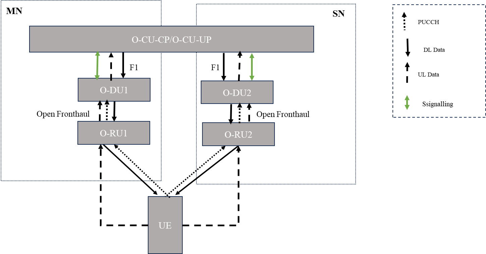

Figure 6.4.1-2: DC with single O-CU-CP/O-CU-UP with multiple O-DUs.

DC can also be combined with CA to further improve coverage and throughput. In this case, both or either of the nodes providing DC connectivity will have their own CC legs for carrier aggregation. CA can be Intra O-DU as shown for the MN node or Inter O-DU as shown for the SN node in Figure 6.4.1-3 below. Both the CA techniques are described in clause 6.2 and clause 6.3. The related requirement and details for the CA solutions are described in the respective clauses and DC will not impose any new requirement for supporting this scenario.

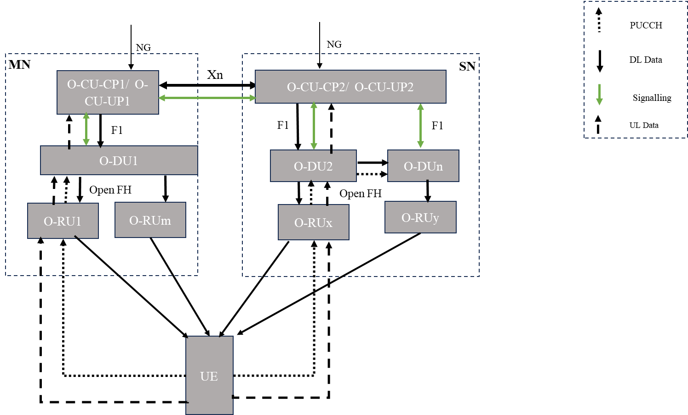

Figure 6.4.1-3: Intra/Inter O-DU DL CA with DC.

In the case of spectrum aggregation by DC, MLB can be done via F1 and X2/Xn interface.

### 6.4.2 Mapping to deployment scenarios and other consideration

Deployment use cases defined in clause 5.2.1.2, 5.2.1.3 and 5.2.2 for inter band spectrum aggregation can be supported with DC solution. 3GPP has defined lesser number of band combinations as compared to CA. This limits the benefits of spectrum aggregation in case MNO wants to apply them to legacy UEs. As there are multiple uplink links for DC, energy consumption at UE will be higher compared to DL CA but multiple UL links can also improve UL throughput.

### 6.4.3 Impact analysis on specifications

Xn and F1 interfaces are well defined in 3GPP specifications. There is no impact on O-RAN working groups.

### 6.4.4 Feasibility and gain/complexity analysis

Table 6.4.4-1 evaluates the Dual Connectivity solution with respect to solution evaluation criteria.

Table 6.4.4-1: Evaulation of Dual Connectivity.

|  |  |
| --- | --- |
| Solution evaluation criteria | Remarks |
| Minimize complexity | No Impact. This is already standardized solution. |
| Minimize impact to inter-operability testing and standardization effort | No Impact. This is already standardized solution. |
| Increase performance and lower latency | Performance depends on the MN-SN flow control which is at higher level at the PDCP layer. |
| Minimize impact on O-RAN architecture | No Impact. DC is a standard solution. |
| Minimize UE impact | No Impact. DC is a standard solution. |
| Align with 3GPP RAN design | No Impact. DC is a standard solution. |
| Increase spectral efficiency of combined carriers | Lesser number of band combinations for DC specified by 3GPP as compared to CA [i.11]. |
| Increase coverage and capacity | Coverage in DC is lesser compared to CA [i.7]. In DC, for each carrier, there is a separate UL PUCCH link for feedback on DL data. This limits the coverage of each DC carrier compared to CA. |
| Address security concerns with different solutions | No impact. DC is a standard solution. |
| Minimize energy consumption | In DC each carrier will have its own UL link for receiving UL data as well as PUCCH. Due to multiple UL links, power consumption at UE is higher compared to CA. |
| Minimize exchange of scheduling-specific information over open interfaces | No information exchange as data split is at higher level. |

# 7 Conclusions and recommendations

## 7.1 Summary of evaluation

In the present document different deployment scenarios are described which are relevant to spectrum aggregation. For a multi-vendor network deployment, the following spectrum aggregation solutions are documented.

* Intra O-DU CA
* Inter O-DU CA
* Dual connectivity

Figure 7.1-1 summarizes the key properties of the three spectrum aggregation solutions. Intra O-DU CA relies on Open FH interface (PHY layer) which enables multi vendor O-RUs. Inter O-DU CA using the D2 interface interconnects the two MAC layers in separate O-DUs. Dual connectivity makes use of PDCP aggregation at the O-CU-UP level. Depening on deployment scenario, one of the three solutions or a combination thereof can be used for spectrum aggregation. A decision tree to help arrive at a solution, considering different deployment scenarios, is described in Annex C.

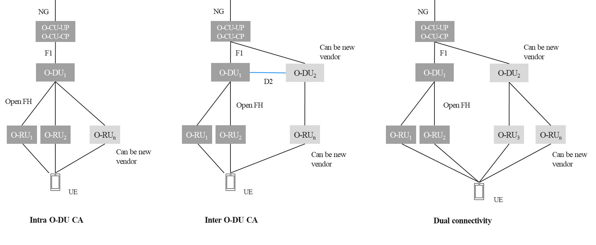

Figure 7.1-1: High-level depiction of the three solutions.

Table 7.1-1 covers the mapping of different deployment scenarios with the various solutions defined in clause 6.

Table 7.1-1: Mapping with deployment scenarios.

|  |  |  |  |
| --- | --- | --- | --- |
| Deployment Scenario | DC | Intra O-DU CA | Inter O-DU CA |
| Co-located deployments | Supported. | Supported. | Supported. |
| Non-co-located deployments | Supported and capable of supporting distributed O-DUs connected via non-ideal backhaul. | Supported with ideal fronthaul.  Fronthaul latency up to High200 can be supported. | Supported with ideal transport link or with latency up to High200. |

Table 7.1-2 captures the details of each solution against the considerations mentioned in clause 5.3.

Table 7.1-2: Considerations table.

| Considerations for each solution | DC | Intra O-DU CA | Inter O-DU CA |
| --- | --- | --- | --- |
| UE considerations:  Maximize CC combinations based on UE capability | In 3GPP Rel 15 specifications, DC is supported only between FR1 and FR2 bands. Also, NR DC support was added later in Rel 15 specification. Hence UEs supporting 3GPP Rel 15 UEs without NR-DC capability will be limited in CC combinations. Most of the UEs in the market are supporting 3GPP Rel 15 and EN-DC. | As majority of the 5G UEs are supporting 3GPP Rel 15. These UEs are also not supporting NR-DC as well, hence CA can improve CC combinations for spectrum aggregation. (NOTE) | Current majority of the 5G UEs are supporting 3GPP Rel 15. These UEs are also not supporting NR-DC as well, hence CA can improve CC combinations for spectrum aggregation. (NOTE) |
| UE consideration:  Energy consumption | In DC, two separate paths for UL & DL direction, one for SCG and MCG, are always present. If there is no UL data, presence of two UL links will increase the power consumption at UE. | In DL CA, multiple UL links across different carriers are not required. Hence, this can reduce power consumption at UE.  If DL and UL CA both are active, power consumption at UE can be higher due to the presence of 2 UL links. | In DL CA, multiple UL links across different carriers are not required. Hence, this can reduce power consumption at UE.  If DL and UL CA both are active, power consumption at UE can be higher due to presence of 2 UL links. |
| Spectrum consideration:  FDD+TDD | Coverage of mid band will improve around 67% [i.7] | Coverage of mid band will improve around 85% [i.7] | Coverage of mid band can improve and may be similar to intra O-DU CA scenario. |
| Spectrum consideration:  SUL/SDL | N/A | SUL/SDL carrier in Intra O-DU CA can be used for coverage and performance improvement | SUL/SDL carrier in inter O-DU can be used for coverage and performance improvement. |
| Synchronization consideration | Both synchronous and asynchronous deployments are supported. | All the carriers reside in the same O-DU, therefore no additional synchronization requirements apply. | Tight synchronization (maximum clock timing difference cannot be larger than 33 us) between O-DUs is needed for supporting inter O-DU CA. |
| Network management considerations | No additional considerations. | No additional considerations. | SMO can manage the interface between O-DUs. The existing O1 interface between SMO and O-DU can be extended to bring in the configuration for functioning of the new interface. |
| NOTE: This is dependent on the UE capability support for different 3GPP releases and NR-DC, which can change in future. | | | |

As there are multiple techniques that can be used for spectrum aggregation, evaluation criteria defined in clause 5.3.6 is used to evaluate each solution. Based on the evaluation criteria, Table 7.1-3 compares the three solutions.

Table 7.1-3: Comparison of solution evaluation.

| Solution evaluation criteria | Dual connectivity | Intra O-DU CA | Inter O-DU CA |
| --- | --- | --- | --- |
| Minimize complexity | No impact. | No impact. | A new interface needs to be defined between the O-DUs. |
| Minimize impact to inter-operability testing and standardization effort | No impact. | No impact. | As a new interface will be defined, it will have impact on inter-operability. |
| Increase performance and lower latency | For non-ideal backhaul, DC is the preferred solution.  For cell center condition, performance can be similar to inter O-DU CA as UL PUCCH reception on both MCG and SCG links may not show any degradation.  In cell edge scenarios, the SCG PUCCH link might be impacted and hence can cause retransmissions. This will impact the throughput. Also in this case, if SCG link drops, activation of the SCG link will take longer due to RRC signaling, which can further impact the performance. | More optimal usage of resources than any other spectrum aggregation technique and thus results in higher end user performance. Lower latency is achieved as spectrum aggregation is done in a single O-DU. | Despite O-DU being interconnected via transport system satisfying the transport requirement, the achieved performance could potentially be lower than intra O-DU CA. This performance degradation is seen as HARQ feedback from PCell to SCell will be delayed by the latency of the underlying transport connecting the O-DUs.  Different scheduler running in O-DUs may have impact on performance and latency. |
| Minimize impact on O-RAN architecture | No impact. | No impact. | Impact on multiple WGs e.g., WG1, WG5, WG10, WG11 etc. |
| Minimize UE impact | No impact. | No impact. | No impact. |
| Aligns with 3GPP RAN design | Aligned. | Aligned. | Aligned. |
| Increase spectral efficiency of combined carriers | Spectral efficiency of DC can be lower in certain scenario (e.g when UE is power limited) due to presence of separate PUCCH link for SCG cell. | Spectral efficiency of CA can be higher due to the reception of SCell PUCCH on PCell,  CA can be activated faster than DC which enables optimal usage of available resources and thus improving the overall spectral efficiency. | Spectral efficiency of CA can be higher due to the reception of SCell PUCCH on PCell.  CA can be activated faster than DC which enables optimal usage of available resources.  However, in Inter O-DU case, delayed HARQ feedback reception at SCell due to transport delay across O-DUs and the need for flow co-ordination among different schedulers can impact overall spectral efficiency. |
| Increase coverage and capacity (Number of users) | Maintenance of two separate UL links, lowers the coverage and capacity gains compared to Intra and Inter O-DU CA. | CA enables maximum coverage and capacity extension of mid/high bands by moving UL control to low/mid band. | Coverage and capacity gain of inter O-DU CA is expected to be similar to intra O-DU CA. |
| Address security concerns with different solutions | DC is a well-defined solution in 3GPP and ORAN so no new security requirements. | Intra O-DU CA is a well-defined solution in 3GPP and ORAN so no new security requirements. | Inter O-DU CA is a new solution hence security aspects need to be defined for the new interface. Existing techniques that are used on F1 can be considered. |
| Minimize exchange of scheduling-specific information over open interfaces | No exchange of scheduling information as data exchange is at higher level | No exchange of scheduling information as CA is within one O-DU | The new interface can be designed such that the input for scheduling the UE (data buffer size etc) can be exchanged without disclosing the proprietary scheduling algorithms and policies. |

As shown in Table 7.1-1, Table 7.1-2 and Table 7.1-3, for supporting spectrum aggregation across non-co-located nodes with non-ideal backhaul, DC is a preferred option. DC can support spectrum aggregation in non-synchronized components. It is a well defined solution in 3GPP and O-RAN. DC is the preferred option for spectrum aggregation between FR1 and FR2.

Table 7.1-2 indicates that CA has more band combinations (also see Table 6.2.2-1) defined in 3GPP specifications. Spectrum aggregation across intra band carriers cannot be achieved by NR DC. CA provides better coverage and capacity compared to DC for mid/high band aggregated with low band cells. If multiple cells are supported in single O-DU, intra O-DU CA with/without Shared O-RU solution can be utilized for spectrum aggregation across different bands to achieve the best coverage and capacity results with least energy consumption.

In a deployment scenario, where different frequency bands are supported in different O-DUs or if an O-DU instance cannot host further cells due to its processing limits, inter O-DU CA (assuming legacy O-DU can be upgraded to support new interface) can be used for achieving the benefits of carrier aggregation. This will be beneficial for both co-located and non-co-located deployments. The new interface between O-DUs can be specified within the transport latency requirements as described in clasue 6.3.1. Coverage and capacity (in terms of users) improvement can be similar to the intra O-DU CA solution. The new interface between O-DUs can provide further flexibility to the MNOs to install RAN NFs as per their need and from different vendors.

## 7.2 Impact on standardization

For intra O-DU CA multi-O-RU scenario and dual connectivity, there is no impact on any WG as it is specified in 3GPP and O-RAN specifications. For intra O-DU CA with shared O-RU, WG4 enhancements may be needed to support dynamic carrier sharing.

There is no direct standardized inter O-DU interface defined in 3GPP or in O-RAN. For supporting inter O-DU carrier aggregation, a new inter O-DU interface, referred to as D2, needs to be defined. Table 6.3.3-1 details the WGs and the specifications impact of standardizing the proposed interface.

Based on the prior Open FH experience, the development timeline of D2 interface is expected to be about 2 years from the start of the work item until the specification can be considered robust enough for the implementation.

## 7.3 Recommendations

The objective of this study is to evaluate spectrum aggregation techniques (carrier aggregation and dual connectivity) in both co-located and non-co-located scenarios utilizing specific assessment criteria. As shown in Table 7.1-1, Table 7.1-2 and Table 7.1-3, dual connectivity is appropriate when a user equipment (UE) connects to two separate cells concurrently, typically with different frequencies (e.g., FR1 and FR2) over non-ideal backhaul links.

In intra O-DU CA (shared O-RU or multi-O-RU) O-DUs, O-RUs can be provided by different vendors. Intra O-DU CA provides the best coverage and capacity improvement in spectrum aggregation. It can be used in co-located scenarios or deployments where single O-DU will be supporting multiple cells connected to different O-RUs. For non-co-located deployment use cases of clause 5.2.2, this solution can cover all scenarios if the fronthaul connecting the O-RU and O-DU has latency within the latency classes of High25, High75 of Table A-1. The High100 and High200 latency classes can also be supported depending on implementation and performance trade-offs.

Multi-vendor dual connectivity and intra O-DU CA are well-defined in 3GPP specifications and are supported by O-RAN.

For catering to deployment scenarios where different frequency bands are supported in different O-DUs or if an O-DU instance cannot host further cells due to its processing limits, multi-vendor inter O-DU CA can be used for achieving the benefits of spectrum aggregation. This will be beneficial for both co-located and non-co-located deployments. This assumes that legacy O-DUs are upgradable to support the new inter O-DU interface.

# Annex A: Xhaul delay considerations

This annex presents the Xhaul (Fronthaul, Midhaul and Backhaul) one way delay requirements captured in O-RAN.WG9.XTRP-REQ-v01.00 [i.2].

Table A-1 lists one-way delay requirements for fronthaul.

Table A-1: Fronthaul one-way delay requirement table, adapted from clause 7.2 of [i.2].

|  |  |  |
| --- | --- | --- |
| Latency class | Max. one-way frame delay performance | Use case |
| High25 | 25 us | Ultra-low latency performance |
| High75 | 75 us | For full NR performance with fiber lengths in 10km range |
| High100 | 100 us | For full NR performance with fiber lengths in 10km range |
| High200 | 200 us | For standard NR performance with fiber lengths in 10km range |
| High500 | 500 us | Large latency installations > 30 km |
| Medium | 1 ms | User Plane (slow) & C&M Plane (fast) |
| Low | 100 ms | C&M Plane |

Table A-2 lists the one-way end to end Midhaul transport delay requirements.

Table A-2: One-way end to end Midhaul transport delay table, adapted from clause 8.2 of [i.2].

|  |  |  |
| --- | --- | --- |
| Capability | Requirements | Notes |
| End to end Midhaul transport delay (one way) | <1.5 ms-10 ms [i.3] | Delay constraints for midhaul are derived mainly from the target service's latency requirements, rather than specific requirements of the Midhaul' s user or control planes. As service delay targets become tighter it may become necessary to:  1) Place Midhaul and Backhaul mobile components in close proximity to each other to reduce the delay impact of the transport network.  2) Combine mobile functions together so 3GPP interfaces run internally within a "Network Function" or within a data center to remove the delay impact associated with the WAN transport network. For example, combining O-RU, O-DU and O-CU-CP/UP or combining the O-DU and O-CU-CP/UP functions together. |

Table A-3 lists the one-way end to end Backhaul transport delay requirements.

Table A-3: One-way end to end Backhaul transport delay requirements, adapted from clause 9.3 of [i.2].

|  |  |  |
| --- | --- | --- |
| Capability | Requirements | Notes |
| End to end Backhaul transport delay (one way) | 1 ms - 50 ms service dependent. | Delay constraint for Backhaul are derived mainly from the target service's latency requirements, rather than specific requirements of the Backhaul's user or control planes. As  service delay targets become tighter it may become necessary to:  1) Place Midhaul and Backhaul mobile components in close proximity to each other to reduce the delay impact of the transport network. For example, O-DU, O-CU-CP/UP and UPF in the same data center.  2) Combine mobile functions together so 3GPP interfaces run internally within a "Network Function" or within a data center to remove the delay impact associated with the WAN transport network. For example, combining O-RU, O-DU and O-CU-CP/UP or combining the O-DU and O-CU-CP/UP functions together. |

# Annex B: Examples of multi-vendor Inter O-DU interface

## B.1 DL CA using an Inter O-DU interface

In Figure B.1-1, DL CA between two O-DUs for 2 UEs are shown. In Figure B.1-1, 2 O-DUs are present in the system connected to the same O-CU-UP/O-CU-CP. O-DU1 is configured as PCell for UE1 while O-DU2 is configured as SCell. For UE2, O-DU2 is serving as PCell while O-DU1 is hosting the SCell.

As both the UEs are using O-DUs for inter O-DU CA, for UE1, RLC is hosted in O-DU1. Data is received from O-CU-UP by O-DU1 and data is shared with O-DU2 if SCell is activated. PUCCH for UE1 is also received by O-DU1 and then shared with O-DU2. For UE2, the same functionality will be observed in O-DU2 (hosting RLC, RRC connection management and receiving data from O-CU-UP.

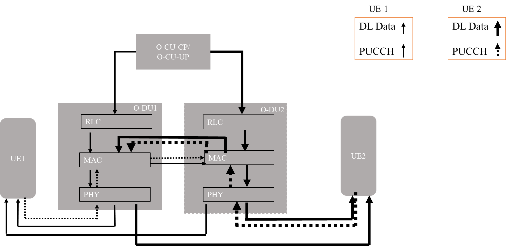

Figure B.1-1: Inter O-DU CA for multiple UEs hosting PCells in different O-DUs.

## B.2 High-level description of Inter O-DU interface (D2)

For supporting inter O-DU CA, a new interface between the O-DUs need to be defined. Figure B.2-1 below proposes the solution for inter O-DU CA where D2 identifies the new interface.

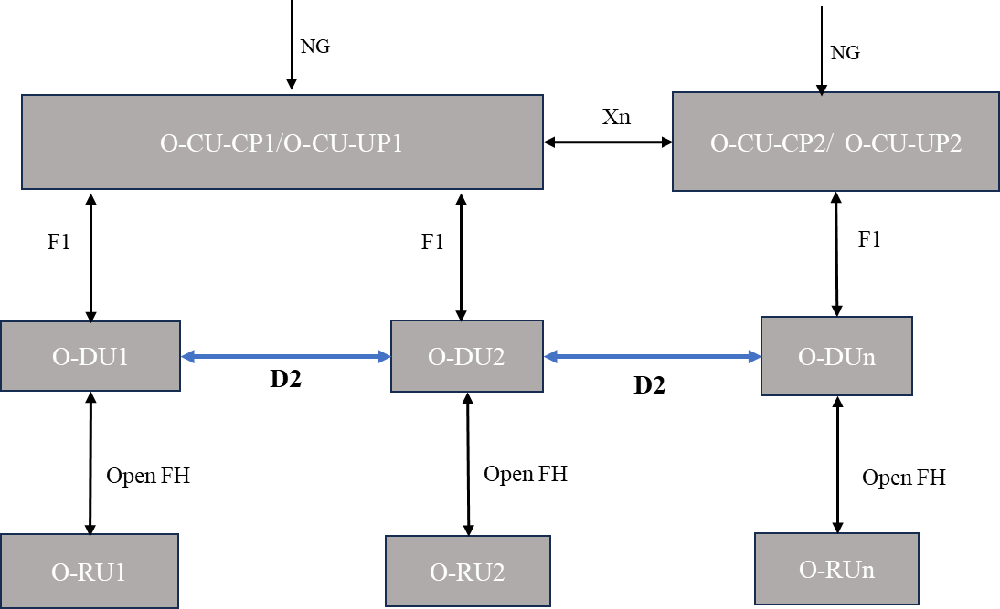

Figure B.2-1: D2 interface between O-DUs.

Interface between O-DUs can be defined such that transport requirement as defined in clause 6 can be met. Coverage and capacity improvement can be similar to the intra O-DU CA. A new interface between O-DUs can provide further flexibility to the MNOs to install RAN NFs as per their need and from different vendors.

There are two parts of the D2 interface:

* D2-C: Exchange of control information. SCTP can be used as transport protocol. Link establishment between O-DUs, SCell establishment/release can be taken care by the control part of the D2 interface.
* D2-U: Exchange of data and PUCCH information will be taken care of by the D2-U interface. GTP-U is used for transport mechanisms.

@startUML

Skinparam titleBorderRoundCorner 25

skinparam titleBorderThickness 2

skinparam titleBorderColor red

skinparam titleBackgroundColor Coral

skinparam titleFontSize 20

participant "O-CU-CP/O-CU-UP" as CU

participant "Primary O-DU" as pDU

participant "Secondary O-DU" as sDU

participant UE

pDU->sDU : D2 Setup Request

sDU -> pDU : D2 Setup Response

Note over pDU : SCell can be added only if D2 setup is successful.

CU -> pDU : UE Context Setup/Modification Request (SCell from other O-DU)

pDU -> sDU : SCell Addition Request

sDU->pDU : SCell Addition Response

pDU-> CU : UE Context Setup/Modification Response

Note over pDU : SCell can be activated only if SCell Addition is successful.

CU->pDU : User Data

pDU -> sDU : Buffer Indication

sDU->pDU : Data Request

pDU -> sDU : Data and PUCCH resource allocation

pDU-> UE : PDCCH and PDSCH Data

sDU-> UE : PDCCH and PDSCH Data

UE->pDU : PUCCH Indication (UCI Information)

pDU->sDU : PUCCH/UCI Indication

@endUML

Figure B.2-2 shows a proposed message flow for the D2 interface.

Figure B.2-2: Message flow for D2 interface.

# Annex C: Spectrum aggregation solution decision tree analysis

A decision tree is a useful tool to represent decision processes involving multiple decision points along different paths leading to a set of options. It helps in representing decision process in graphical form for better understanding of the decision process. Figure C-1 represents the decision tree for spectrum aggregation solutions. It takes into account key considerations that are discussed at length in the present document. They are listed along with their various possible values below for quick reference:

* Existing-new spectrum FR
* FR1-FR1
* FR1-FR2
* FR2-FR2
* Aggregated spectrum type
* Contiguous
* Non-contiguous
* Deployed O-DU capability
* Supports new spectrum.
* Does not support new spectrum.
* Added O-DU capability.
* Supports new spectrum only.
* Supports new+existing spectrum.
* Transport capability
* Delay/BW requirements met.
* Delay/BW requirements not met.
* Existing deployment
* SA
* NSA
* New spectrum duplex mode
* SDL/SUL
* TDD/FDD
* Specified combination
* DC
* CA

The inter O-DU CA solution has an impact on O-RAN standardization.

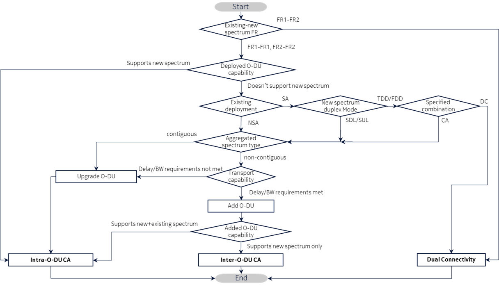

Figure C-1: Decision tree for spectrum aggregation solutions.

The decision tree represents key considerations for an MNO to choose an optimal solution from different spectrum aggregation solutions. These considerations sufficiently address the scope of the study. However, there may be other considerations beyond those mentioned here depending on specific MNO deployment scenarios.

# Annex: Change history/Change request (history)

|  |  |  |
| --- | --- | --- |
| Date | Revision | Description |
| 2023-06-22 | 00.04 | Initial version approved by UCTG of WG1. |
| 2023-07-01 | 00.04.01 | Incorporated agreed Multi-Vendor equipment deployment architecture section from ERI-2023.06.14-WG1-D-UCTG-Spectrum-aggregation-scenarios-v01.pptx  Incorporated CRs: SAM-0001, NOK-001, NOK-002. |
| 2023-08-16 | 00.04.02 | Incorporated CRs: MAV-0002, MAV-0003. |
| 2023-08-30 | 00.04.03 | Incorporated CRs: MAV-0001. |
| 2023-09-19 | 00.04.04 | Incorporated CRs: ERI-0078, ERI-0081, NOK-0004. |
| 2023-09-19 | 00.05 | Accepted all changes with attendant editorial clean-up. |
| 2023-09-29 | 00.05.01 | Incorporated CRs: NOK-003, SAM-0002, DIS-0001. |
| 2023-10-12 | 00.05.02 | Incorporated CRs: ERI-0086. |
| 2023-10-16 | 00.05.03 | Incorporated CRs: NOK-0006, NOK-0007. |
| 2023-10-17 | 00.05.04 | Editorial changes as agreed in O-RAN UCTG meeting. |
| 2023-10-17 | 1.00 | O-RAN WG1 approval of the document |
| 2023-12-07 | 1.00.01 | Incorporated CRs: SAM-0003. |
| 2024-01-17 | 1.00.02 | Incorporated CRs: MAV-0041. |
| 2024-01-31 | 1.00.03 | Incorporated CRs: MAV-0042. |
| 2024-02-01 | 1.00.04 | Incorporated CRs: MAV-0043. |
| 2024-02-15 | 1.00.05 | Incorporated CRs: MAV-0044. |
| 2024-02-20 | 1.00.06 | Incorporated CRs: MAV-0046, KDD-0002. |
| 2024-03-12 | 1.00.07 | Incorporated CRs: ERI-0126 |
| 2024-03-28 | 1.00.08 | Incorporated CRs: MAV-0045, MAV-0048. Included editorial updates. |
| 2024-04-24 | 1.00.09 | Incorporated CRs: MAV-0047, MAV-0050, MAV-0049. |
| 2024-05-08 | 1.00.10 | Incorporated CRs: ERI-013. |
| 2024-05-09 | 1.00.11 | Incorporated CRs: SAM-0005. Includes editorial updates. |
| 2024-05-30 | 1.00.12 | Incorporated CRs: NOK-0250, MAV-0052, MAV-0053, MAV-0054, SAM-0006, SAM-0007. Includes resolution of review comments 1-41 and editorial updates. |
| 2024-06-09 | 1.00.13 | Incorporated editorial updates including review comments 42-44. |
| 2024-06-10 | 1.00.14 | Editorial updates. |
| 2024-06-12 | 1.00.15 | Editorial updates and corrections. |
| 2024-07-01 | 1.00.16 | Editorial updates and corrections. |
| 2024-07-10 | 1.00.17 | Editorial updates and corrections. |
| 2024-07-10 | 2.00 | Document ready for WG1 approval. |
| 2024-07-25 | 2.00.01 | Editorial corrections implementing WG1 voting period feedback. |
| 2024-07-26 | 2.00.02 | Table format correction implementing WG1 voting period feedback. |
| 2024-07-26 | 3.00 | Document approved by WG1. |
---

- View in [Reader Mode](https://simewu.com/spec-reader/pages/11-WG1/O-RAN.WG1.TR.SA-MVD-R004-v03.00.docx).
- Go back to [Table of Contents](../README.md).
- Download the [Original Document](https://github.com/Simewu/spec-reader/raw/refs/heads/main/documents/O-RAN.WG1.TR.SA-MVD-R004-v03.00.docx).
