## O-RAN.WG1.mMIMO-Use-Cases-TR-v01.00.docx

- View in [Reader Mode](https://simewu.com/spec-reader/pages/12-WG1/O-RAN.WG1.mMIMO-Use-Cases-TR-v01.00.docx).
- Go back to [Table of Contents](../README.md).
- Download the [Original Document](https://github.com/Simewu/spec-reader/raw/refs/heads/main/documents/O-RAN.WG1.mMIMO-Use-Cases-TR-v01.00.docx).

---

**O-RAN Working Group 1 Massive MIMO Use Cases**

**Technical Report**

##### This is a re-published version of the attached final specification.

For this re-published version, the prior versions of the IPR Policy will apply, except that the previous requirement for Adopters (as defined in the earlier IPR Policy) to agree to an O-RAN Adopter License Agreement to access and use Final Specifications shall no longer apply or be required for these Final Specifications after 1st July 2022.

The copying or incorporation into any other work of part or all of the material available in this specification in any form without the prior written permission of O-RAN ALLIANCE e.V. is prohibited, save that you may print or download extracts of the material on this site for your personal use, or copy the material on this site for the purpose of sending to individual third parties for their information provided that you acknowledge O-RAN ALLIANCE as the source of the material and that you inform the third party that these conditions apply to them and that they must comply with them.

Copyright (C) 2022 by the O-RAN ALLIANCE e.V.

Your use is subject to the copyright statement on the cover page of this specification.

**O-RAN Working Group 1 Massive MIMO Use Cases**

**Technical Report**

Copyright (C) 2022 by O-RAN ALLIANCE e.V.

By using, accessing or downloading any part of this O-RAN specification document, including by copying, saving, distributing, displaying or preparing derivatives of, you agree to be and are bound to the terms of the O-RAN Adopter License Agreement contained in the Annex ZZZ of this specification. All other rights reserved.

O-RAN ALLIANCE e.V.

Buschkauler Weg 27, 53347 Alfter, Germany Register of Associations, Bonn VR 11238 VAT ID DE321720189

(C) 2022 O-RAN ALLIANCE e.V. All Rights Reserved

# 1 Revision History

|  |  |  |  |
| --- | --- | --- | --- |
| **Date** | **Revision** | **Author** | **Description** |
| 2021.06.14 | 01.00.00 | Nokia, Keysight | Document skeleton |
| 2021.07.09 | 01.00.01 | Nokia, Keysight | Update the ToC |
| 2021.10.06 | 01.00.02 | Editors | Added approved CRs |
| 2021.10.08 | 01.00.03 | Editors | Removed change marking |
| 2021.11.02 | 01.00.04 | Editors | Added additional approved CRs |
| 2021.11.18 | 01.00.05 | Editors | Added additional approved CRs |
| 2021.12.01 | 01.00.06 | Editors | Added additional approved CRs |
| 2021.12.03 | 01.00.07 | Editors | Added additional approved CRs |
| 2021.12.08 | 01.00.08 | Editors | Added additional approved CRs |
| 2021.12.12 | 01.00.09 | Editors | Added additional approved CRs |
| 2021.12.14 | 01.00.10 | Editors | Added 1 missing CR, clean-up formatting, fixed font issues, removed comments, fixed minor grammaticals |
| 2021.12.15 | 01.00.11 | Editors | Added additional approved CRs, and agreed-upon changes during call on 12/15 |
| 2022.03.24 | 01.00.12 | Editors | Changed title/header, corrected formatting and typos |
| 2022.03.24 | 01.00.13 | Editors | Changed title/header, corrected formatting and typos |
| 2022.03.29 | 00.00.14 | Editors | Fix title page, clean version for WG1 approval |
| 2022.04.04 | 01.00 | Editors | Spec renamed to v01.00 for publication |
| 2022.05.12 | 01.00 | Editors | Correction of one reference in Section 3.2.2.1.1 |
| 2022.06.01 | 01.00 | Editors | Editorial improvements: Included line separations and page breaks to avoid e.g. table splits, completed table and figure captions, removed few section numbering higher than five digits and included two four digits sub-sections to enable automatic figure and table caption numbering, copy & paste of one paragraph from chapter 7 into section 3.1 to fill empty space, corrected cross- references and minor editorials |
|  |  |  |  |
|  |  |  |  |
|  |  |  |  |
|  |  |  |  |
|  |  |  |  |
|  |  |  |  |
|  |  |  |  |

2

# 1 Contents

1. Revision History 2
2. 1 Introduction 6
3. 1.1 Scope 6
4. 1.2 References 6
5. 1.3 Definitions and Abbreviations 7
6. 1.3.1 Definitions 7
7. 1.3.2 Abbreviations 8
8. 2 Objectives and Requirements 9
9. 2.1 Objectives 9
10. 2.2 Requirements 9
11. 3 GoB / L3 Mobility 11
12. 3.1 Overview 11
13. 3.2 Solution 1: Grid-of-Beams Beamforming (GoB BF) Optimization 11
14. 3.2.1 Problem Statement, Solution and Value Proposition 11
15. 3.2.2 Architecture/Deployment Options 12
16. 3.2.3 Impact Analysis on O-RAN Working Groups 17
17. 3.2.4 Relation and Impact on 3GPP Specifications 19
18. 3.2.5 Feasibility and Gain/Complexity Analysis 20
19. 3.3 Solution 2: Beam-based Mobility Robustness Optimization (bMRO) 22
20. 3.3.1 Problem Statement, Solution, and Value Proposition 22
21. 3.3.2 Architecture/Deployment Options 22
22. 3.3.3 Impact Analysis on O-RAN Working Groups 26
23. 3.3.4 Relation and Impact on 3GPP Specification 28
24. 3.3.5 Feasibility and Gain/Complexity Analysis 30
25. 3.4 Solution 3: AI/ML Based Initial Access (SS Burst Set), CSI-RS and DMRS Configuration Optimization 33
26. 3.4.1 Problem Statement and Value Proposition 33
27. 3.4.2 Architecture/Deployment Options 34
28. 3.4.3 Feasibility and Gain/Complexity Analysis 54
29. 4 L1 / L2 Beam Management 64
30. 4.1 Overview 64
31. 4.2 Solution 1: AI/ML-assisted Beam Selection Optimization 64
32. 4.2.1 Problem Statement and Value Proposition 64
33. 4.2.2 Architecture/Deployment Options 65
34. 4.2.3 Impact Analysis on O-RAN Working Groups 73
35. 4.2.4 Relation and Impact on 3GPP Specification 74
36. 4.2.5 Feasibility and Gain/Complexity Analysis 74
37. 5 Non-GoB Beamforming 77
38. 5.1 Overview 77
39. 5.2 Solution 1: AI/ML-assisted non-GoB Optimization 77
40. 5.2.1 Problem Statement and Value Proposition 77
41. 5.2.2 Architecture/Deployment Options 78
42. 5.2.3 Impact Analysis on O-RAN Working Groups 86
43. 5.2.4 Relation and Impact on 3GPP Specification 87
44. 5.2.5 Feasibility and Gain/Complexity Analysis 87
45. 6 MIMO DL Tx Power Optimization, MU-MIMO Pairing and MIMO mode selection 91
46. 6.1 Overview 91
47. 6.2 MIMO optimization use-cases 91
48. 6.2.1 Solution 1: Downlink Transmit power optimization 91
49. 6.2.2 Solution 2: MU-MIMO Pairing Enhancement (User Separability or Pairing Control) 98
50. 6.2.3 Solution 3: MIMO mode selection (Mu-MIMO vs Su-MIMO selection optimization) 112
51. 7 Comparison and Conclusions 122
52. 7.1 Summary of Evaluation 124
53. 7.2 Impact on standardization 125
54. 7.3 Synergies among new measurements (definition and/or reporting) 126
55. Annex A Input and output data and its relation to 3GPP specification 127
56. Annex ZZZ: O-RAN Adopter License Agreement 129
57. Section 1: DEFINITIONS 129
58. Section 2: COPYRIGHT LICENSE 129
59. Section 3: FRAND LICENSE 130
60. Section 4: TERM AND TERMINATION 130
61. Section 5: CONFIDENTIALITY 131
62. Section 6: INDEMNIFICATION 131
63. Section 7: LIMITATIONS ON LIABILITY; NO WARRANTY 131
64. Section 8: ASSIGNMENT 131
65. Section 9: THIRD-PARTY BENEFICIARY RIGHTS 132
66. Section 10: BINDING ON AFFILIATES 132
67. Section 11: GENERAL 132

6

7

1 1 Introduction

## 1.1 Scope

1. This Technical Report has been produced by the O-RAN Alliance.
2. The contents of the present document are subject to continuing work within O-RAN and may change following formal
3. O-RAN approval. Should the O-RAN Alliance modify the contents of the present document, it will be re-released by O-
4. RAN with an identifying change of release date and an increase in version number as follows:
5. Release xx.yy.zz
6. where:
7. xx the first two-digit value is incremented for all changes of substance, i.e. technical enhancements, corrections,
8. updates, etc. (the initial approved document shall have xx=01).
9. yy the second two-digit value is incremented when editorial only changes have been incorporated in the document.
10. zz the third two-digit value is included only in working versions of the document indicating incremental changes
11. during the editing process; externally published documents never have this third two-digit value included.
12. The present document provides a technical report on RIC-enabled massive MIMO use cases. 15

## 1.2 References

1. The following documents contain provisions which, through reference in this text, constitute provisions of the present
2. document.
3. - References are either specific (identified by date of publication, edition number, version number, etc.) or
4. non-specific.
5. - For a specific reference, subsequent revisions do not apply.
6. - For a non-specific reference, the latest version applies. In the case of a reference to a 3GPP document (including
7. a GSM document), a non-specific reference implicitly refers to the latest version of that document *in the same*
8. Release as the present document.
9. [1] 3GPP TR 21.905: "Vocabulary for 3GPP Specifications".
10. [2] MU-MIMO and CSI Feedback Performance of NR/LTE, Bishwarup Mondal et al., 2019 53rd Annual
11. Conference on Information Sciences and Systems (CISS), 20-22 March 2019
12. [3] E. Bjornson, J. Hoydis, and L. Sanguinetti, Massive MIMO Networks: Spectral, Hardware, and Energy
13. Efficiency. Foundations and Trends in Signal Processing, vol. 11, no. 3-4, pp. 154-655, 2017
14. [4] T. Marzetta, E Larsson, H. Yang, and H. Ngo, Fundamentals of Massive MIMO, Cambridge University Press,

31 2016

32 [5] Physical Layer Measurements 3GPP TS 38.215 V16.4.0 (2020-12)

33

## 1.3 Definitions and Abbreviations

### 1.3.1 Definitions

1. For the purposes of the present document, the terms and definitions given in TR 21.905 [1] and the following apply.
2. A term defined in the present document takes precedence over the definition of the same term, if any, in TR 21.905
3. [1] .
4. **Non-RT RIC** (O-RAN non-real-time RAN Intelligent Controller): a logical function that enables non-real-time control
5. and optimization of RAN elements and resources, AI/ML workflow including model training and updates, and policy-
6. based guidance of applications/features in Near-RT RIC.
7. **Near-RT RIC (**O-RAN near-real-time RAN Intelligent Controller): a logical function that enables near-real-time control
8. and optimization of RAN elements and resources via fine-grained (e.g. UE basis, Cell basis) data collection and actions
9. over E2 interface.
10. **O-CU**: O-RAN Central Unit: a logical node hosting RRC, SDAP and PDCP protocols.
11. **O-CU-CP**: O-RAN Central Unit - Control Plane: a logical node hosting the RRC and the control plane part of the PDCP
12. protocol.
13. **O-CU-UP**: O-RAN Central Unit - User Plane: a logical node hosting the user plane part of the PDCP protocol and the
14. SDAP protocol.
15. **O-DU**: O-RAN Distributed Unit: a logical node hosting RLC/MAC/High-PHY layers based on a lower layer functional
16. split.
17. **O-RU**: O-RAN Radio Unit: a logical node hosting Low-PHY layer and RF processing based on a lower layer functional
18. split. This is similar to 3GPP's "TRP" or "RRH" but more specific in including the Low-PHY layer (FFT/iFFT, PRACH
19. extraction).
20. **O-eNB** (O-RAN eNB): an eNB or ng-eNB that supports E2 interface.
21. **O1**: Interface between orchestration & management entities (Orchestration/NMS) and O-RAN managed elements, for
22. operation and management, by which FCAPS management, Software management, File management and other similar
23. functions shall be achieved.
24. **SMO**: Service Management and Orchestration system.
25. **A1**: Interface between Non-RT RIC and Near-RT RIC to enable policy-driven guidance of Near-RT RIC
26. applications/functions, and support AI/ML workflow.
27. **E2**: Interface connecting the Near-RT RIC and one or more O-CU-CPs, one or more O-CU-UPs, and one or more O-DUs.
28. **E2 Node**: a logical node terminating E2 interface. In this version of the specification, ORAN nodes terminating E2
29. interface are:
30. - for NR access: O-CU-CP, O-CU-UP, O-DU or any combination
31. - for E-UTRA access: O-eNB.
32. **rApp:** An application designed to run on the Non-RT RIC. Such modular application leverages the functionality exposed
33. by the Non-RT RIC to provide added value services relative to intelligent RAN optimization and operation
34. **xApp:** An application designed to run on the Near-RT RIC. Such an application is likely to consist of one or more
35. microservices and at the point of on-boarding will identify which data it consumes and which data it provides. The
36. application is independent of the Near-RT RIC and may be provided by any third party. The E2 enables a direct association
37. between the xApp and the RAN functionality.
38. **O-Cloud:** O-Cloud is a cloud computing platform comprising a collection of physical infrastructure nodes that meet O-
39. RAN requirements to host the relevant O-RAN functions (such as Near-RT RIC, O-CU-CP, O-CU-UP, and O-DU), the
40. supporting software components (such as Operating System, Virtual Machine Monitor, Container Runtime, etc.) and the
41. appropriate management and orchestration functions. 3

### 1.3.2 Abbreviations

1. For the purposes of the present document, the following abbreviations apply.

|  |  |  |
| --- | --- | --- |
| 6 | ML | Machine Learning |
| 7 | Non-RT RIC | Non-real-time RAN Intelligent Controller |
| 8 | Near-RT RIC | Near-real-time RAN Intelligent Controller |
| 9 | RAN | Radio Access Network |
| 10 | SMO | Service Management and Orchestration |
| 11 |  |  |

# 1 2 Objectives and Requirements

## 2.1 Objectives

1. This Technical Report captures the outcome of the WG1 UCTG Massive MIMO pre-normative phase. The objectives of
2. the pre-normative phase are as follows:
3. ? study requirements, key issues, proposed solutions, benefits of the massive MIMO enhancements,
4. ? study potential impact and required enhancements to O-RAN interfaces E2, O1, A1, FH M-plane, FH CUS-Plane,
5. R1 and Near-RT RIC API,
6. ? study potential impact and required enhancements on data models of all O-RAN entities,
7. ? identify the any possible impact on Non-RT RIC architecture, Near-RT RIC architecture and AI/ML workflow. 10
8. The use cases studied in the Massive MIMO pre-normative phase include:
9. ? GoB optimization (SSB + CSI-RS based GoB), adaptive beam shaping and beam-based Mobility Robustness
10. Optimization,
11. ? Non-GoB optimization,
12. ? L1/L2 beam management optimization,
13. ? Additional use cases are DL and UL transmit power optimization, optimization of MU-MIMO co-scheduling
14. through control of spatial separation thresholds, reference sequence optimization for minimization of
15. contamination.

19

1. The use cases are applicable to FR1 as well as FR2. Algorithms discussed and analysed as part of the Massive MIMO
2. pre-normative phase will be examples only and will not be part of any specification as outcome of this pre-normative
3. phase or subsequent work items.
4. For each use case solution proposal, the detailed objectives are:
5. ? Review, evaluate applicability of, and select from existing deployment alternatives (Non-RT and/or Near-RT
6. RIC) and AI/ML deployment scenarios and document respective findings.
7. ? Review, evaluate, and select candidate(s) for normative standardization and document respective findings:
8. o Analyze and evaluate input/output parameters of the algorithm, the impact of the control loop delay on
9. the network performance (e.g., due to dynamic channel conditions) as well as the signaling overhead
10. over the relevant interface, e.g., O1, E2.
11. o Companies should provide simulation results for their mMIMO proposals to evaluate the performance
12. benefits versus complexity taking into consideration E2 load and latency requirements for RIC and E2
13. node procedures. The availability of simulation results will not be used for gating in decision making.
14. o Study and review additional simulation methodologies required for evaluating RIC-enabled mMIMO
15. optimization approaches. Review and, if possible, leverage existing methodologies already established in
16. 3GPP.

36

## 2.2 Requirements

1. - mMIMO use cases should reuse the existing 3GPP measurements / measurement reporting for input data as well
2. as the existing 3GPP configuration / provisioning management for the output data as much as possible.
3. - If new measurements or configuration parameters are essential to support new mMIMO use cases, then these
4. should preferably be based on parameters / variables / definitions / procedures that are already used in the 3GPP
5. / O-RAN specifications.
   1. - If new measurements or configuration parameters are essential to support new mMIMO use cases, the current
   2. standardization approach (specifying the new measurement in 3GPP specifications and referring to in in O-RAN
   3. specifications) should be prioritized over inventing new standardization approaches. 4

5

# 1 3 GoB / L3 Mobility

## 3.1 Overview

1. Grid of Beam Optimization (GoB) provides an automated beam forming configuration tailored to the topology of the cell,
2. the physical environment, as well as the distribution of users and traffic in a cell (e.g. wide beams might cover low-density
3. areas while narrow beams might cover high-density areas). Beam-based Mobility Robustness Optimization (bMRO) is
4. an autonomous self-optimizing algorithm that improves beam-based inter-cell mobility performance by applying beam-
5. specific Cell Individual Offsets (CIO) on the handover triggers between neighbor cells, based on the analysis of beam-
6. AI/ML assisted network-wide (multi-gNB/TRP) optimizations framework proactively and autonomously infers optimal
7. configuration per gNB/TRP for SS Burst Set, DMRS and CSI-RS based on available measurements, observations, and
8. PIs at different nodes of the 3GPP NR and/or O-RAN access and core network elements. 11

## 3.2 Solution 1: Grid-of-Beams Beamforming (GoB BF) Optimization

### 3.2.1 Problem Statement, Solution and Value Proposition

1. Massive MIMO (mMIMO) is among the key methods to increase performance and QoS in 5G networks. Capacity
2. enhancement is obtained by means of beamforming of the transmitted signals, and by spatially multiplexing data streams.
3. Beamforming can increase the received signal power and simultaneously decrease the interference generated for other
4. users, hence resulting in higher SINR and higher user throughputs. Grid-of-Beams (GoB) with the corresponding beam
5. sweeping has been introduced to allow beamforming of the control channels used during initial access as well as for data
6. transmission and reception, mainly for high frequency (but can be used also for the sub-6 GHz band) MIMO operation.
7. The physical properties of the antenna array and its possible configurations characterize the span of the beams, namely
8. the horizontal and vertical aperture in which beamforming is supported, and therefore the coverage area and the shape of
9. the cell. mMIMO can be deployed in 5G macrocell clusters as well as in heterogeneous networks, where macro-cells and
10. small cells co-exist and complement each other for better aggregated capacity and coverage. In order to obtain optimal
11. beamforming and cell resources (Tx power, PRB) configuration, one will have to look at a multi-cell environment instead
12. of a single cell. Moreover, different vendors may have different implementations in terms of the number of beams, the
13. horizontal/vertical beam widths, azimuth and elevation range, to achieve the desired coverage. In a multi-node/multi-
14. vendor scenario, centralized monitoring and control is required to offer optimal coverage, capacity and mobility
15. performance as well as control over electromagnetic emissions in order to comply with regulatory requirements.
16. The problem associated with traditional mMIMO BF is that its performance is highly dependent on the choice of the BF
17. pattern. Manual configuration is usually based on the empirical knowledge and manual test results of the domain expert(s)
18. and is performed in a semi-static way. That is, (near-)real time contextual, per-site information (such as cell geometry
19. change, user/traffic distribution, mobility patterns, seasonalities etc.) is taken into account in a suboptimal and non-real
20. time way. This may cause one or more of the following problems:
21. 1. High inter-cell interference.
22. 2. Unbalanced traffic between neighboring cells.
23. 3. Low performance at the cell edges or throughout the cell.
24. 4. Poor handover performance.

38

1. This solution proposes a framework that allows the operator to flexibly configure the mMIMO BF parameters in a cell or
2. in a cluster of cells by means of policies and configuration assisted by machine learning (ML) techniques. The
3. configuration optimization relies on contextual information and patterns such as the user distribution, traffic demand
4. distribution, cell geometries, and mobility. 43

### 3.2.2 Architecture/Deployment Options

####  Option 1: Non-RT RIC Deployment

1. The Non-RT RIC hosts an rApp application whose task is to determine the suitable GoB configuration for a cell or a
2. cluster of cells as a function of input metrics and of an operator objective. The underlying ML model is trained on
3. historical data collected from a cell or a cluster of cells and its aim is to determine correlation patterns between mMIMO
4. GoB configurations and performance metrics. The input data for GoB BF optimization training and inference can be
5. comprised of antenna array parameters, UE mobility/spatial density data, (averaged) traffic density data, timing advance
6. and Angle-of-Arrival measurements (for positioning estimation), power headroom (PH) reports, aggregated and/or pre-
7. processed beam-based reference signal measurements (e.g. CSI reporting, covariance matrix), neighboring cells'
8. beams/interference information, MDT measurement data, as well as performance measurements such as handover and
9. beam failure statistics. The rApp knows O-RU specifics such as antenna array parameters, O-RU capabilities, beam file
10. format (beamforming configuration update procedure) etc.
11. The output of the inference is the optimized GoB BF configuration, that is, the number of beams and either i) the beam
12. directions, horizontal & vertical beam widths, and power allocation of beams, or ii) the beam weights.
13. Operator objectives regarding adaptive GoB may include desired coverage, defined in terms of the cell geometry (SSB
14. beams), cell capacity requirements (CSI-RS beams), cell edge performance (e.g. minimum throughput per UE), minimum
15. guaranteed throughput (independent of traffic density), weighted average RSRP requirements (e.g., the operator might
16. wish to implement the strategy to cover low-density areas with wide beams and high-density areas with narrow beams),
17. and desired fairness between cell edge and non-edge UEs. 20

21

@startuml

Box "Personnel" #lightblue Actor "Operator" as RP

End box

box "Service Management & \nOrchestration Framework" #gold Participant "SMO & Non-RT RIC" as SMO

Participant "rApps" as rAPP end box

box "E2 Nodes" #lightpink collections "O-CUs" as OCU collections "O-DUs" as ODU

end box

box "O-RUs" #lightpink collections "O-RUs" as ORUs

end box

box "External" #lightseagreen Participant APP

end box Autonumber

activate RP activate APP activate SMO activate rAPP activate ODU

|||

group Data Collection

22

23

24

25

26

27

28

29

30

31

32

33

34

35

36

37

38

39

40

41

42

43

44

45

46

47

48

49

50

51

52

53

54

|  |  |  |  |  |
| --- | --- | --- | --- | --- |
| 1 |  | ODU | -> SMO : <<O1>> Data Collection | |
| 2 |  | OCU | -> SMO : <<O1>> Data Collection | |
| 3 |  | APP | -> SMO : <<EI>> Data Collection | |
| 4 | end |  |  | |
| 5 |  |  |  | |
| 6 | group ML Training | | | |
| 7 |  | SMO --> rAPP: Data Retrieval | | |
| 8 |  | rAPP --> rAPP: AI/ML model training | | |
| 9 |  |  | | |
| 10 | end |  | | |
| 11  12 | group ML Inference | | | |
| 13 | alt |  | | |
| 14 |  | RP --> SMO: Optimization Trigger/Target | | |
| 15 | else |  | | |
| 16 |  | SMO --> SMO: Performance Degradation | | |
| 17 | end |  | | |
| 18 |  | SMO -> rAPP: <<R1>> Update Model Request | | |
| 19 |  | SMO -> rAPP: <<R1>> Data Retrieval | | |
| 20 |  | rAPP --> rAPP: AI/ML model inference | | |
| 21 |  | rAPP -> SMO: <<R1>> Optimal mMIMO GoB Configuration | | |
| 22 | end | | |  |
| 23 | group GoB Configuration | | |  |
| 24 | alt via O1 | | |  |
| 25 | SMO -> ODU: <<O1>> File ready notification to inform about file with new | | | GoB |
| 26 | configuration | | |  |
| 27 | ODU -> SMO: <<O1>> File-download request | | |  |
| 28 | SMO -> ODU: <<O1>> Accepted | | |  |
| 29 | SMO -> ODU: <<O1>> Notification about successful file-download | | |  |
| 30 | ref over ODU, ORUs: <<OFH-MP>> Download file with new GoB configuration | | |  |
| 31 | ref over ODU, ORUs: gNB-DU Configuration Update | | |  |
| 32 | ref over ODU, ORUs: <<OFH-MP>> Carrier deactivation | | |  |
| 33 | ref over ODU, ORUs: <<OFH-MP>> New GoB Activation | | |  |
| 34 | ODU -> ORUs: <<OFH-MP>> <rpc get> (o-ran-beamforming.yang) </rpc> | | |  |
| 35 | ORUs -> ODU: <<OFH-MP>> <rpc reply> ... </rpc> | | |  |
| 36 | ref over ODU, ORUs: gNB-DU Configuration Update | | |  |
| 37 | ref over ODU, ORUs: <<OFH-MP>> Carrier activation | | |  |
| 38 | else via OFH-MP | | |  |
| 39 | ref over SMO, ORUs: <<OFH-MP>> Download file with new mMIMO GoB configuration | | |  |
| 40 | SMO -> ODU: <<O1>> Notification about new GoB configuration file | | |  |
| 41 | ref over ODU, ORUs: <<OFH-MP>> Carrier deactivation | | |  |
| 42 | ref over ODU, ORUs: <<OFH-MP>> Activate new GoB configuration | | |  |
| 43 | ODU -> ORUs: <<OFH-MP>> <rpc get> (o-ran-beamforming.yang) </rpc> | | |  |
| 44 | ORUs -> ODU: <<OFH-MP>> rpc reply | | |  |
| 45 | ref over ODU, ORUs: <<OFH-MP>> Carrier activation | | |  |
| 46 | end | | |  |
| 47 | end | | |  |
| 48 |  | | |  |
| 49 | group ML Performance Monitoring | | |  |
| 50 | SMO --> SMO : Performance monitoring and evaluation | | |  |
| 51 | SMO --> SMO : Fallback (e.g. restore configuration) | | |  |
| 52 | SMO -> ODU: <<O1>> Default/Fallback mMIMO configuration | | |  |
| 53 | SMO --> rAPP : <<R1>> Model retraining and update | | |  |
| 54 | end | | |  |
| 55 |  | | |  |
| 56 | @enduml | | |  |

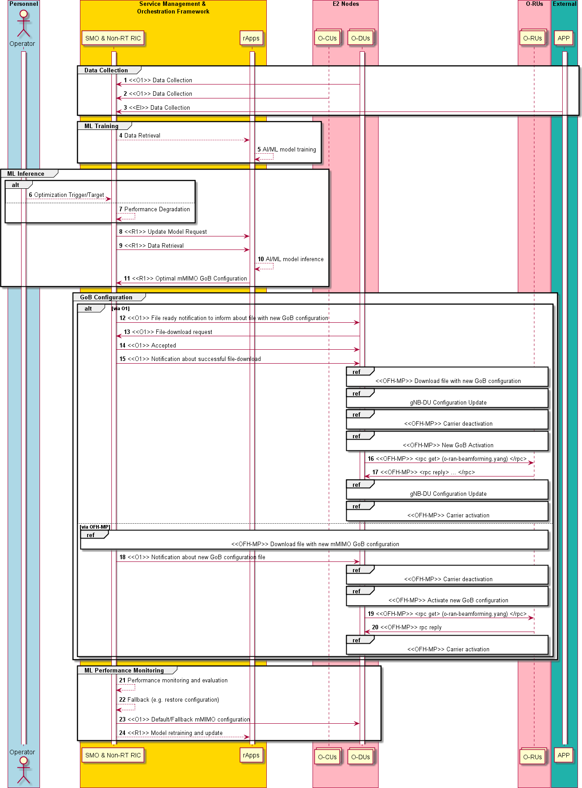

1

2 **Figure** 3.2.2.1**-**1**. Flow diagram of GoB BF Optimization**

###### Requirements

1. Required data:
2. 1) Environment data: Cell site information (e.g., location, inter-site distance), BS system configuration (e.g., operating
3. frequency, bandwidth, frame structure, transmit power, default beam weight configuration), complete set of mMIMO
4. configurations, i.e., horizontal/vertical beamwidth adjustable range, azimuth/elevation angle adjustable range.
5. 2) From E2 Nodes (O-CUs and O-DUs):
6. a) Essential: Measurement report options are forwarding UE's CSI (CQI, PMI, LI, RI, CRI) feedback information
7. or covariance matrix (or any other compressed form of the information) from the UEs or newly defined
8. Performance Management counters in the cells of interest; the time granularity of data collection should be
9. configurable and satisfy the requirement of the AI/ML model. Any of the three input parameter options
10. coherently support the GoB optimization use case but might support different implementation and deployment
11. options.
12. b) Optional: Network KPIs: cell downlink/uplink traffic load, RRC connection attempts, average RRC connected
13. UEs, maximum RRC connected UE, DL/UL average active connections, DL/UL throughput, DL/UL spectral
14. efficiency, NI (noise + interference), PH reports; beam resource usage (transmitted power per beam/directions
15. and associated PRB usage), beam-based handover and beam failure statistics.
16. 3) From External:
17. a) Optional: User location related information, e.g. GPS information.

|  |  |  |  |  |  |
| --- | --- | --- | --- | --- | --- |
| **Input Data Options** | | | | | |
| **Interf ace** | **Source -> Target** | **Name/Description** | **Units** | **Report- ing Period** | **New or existing measurement/reporting specification** |
| O1 | O-DU **->** SMO | CSI report (CQI, PMI, LI, RI, | CSI | ~15min | Measurements defined in |
|  |  | CRI) per UE | report |  | 3GPP TS 38.214 (section |
|  |  |  |  |  | 5.2) |
|  |  |  |  |  | New reporting e.g. 3GPP |
|  |  |  |  |  | TS 37.320 or O-RAN |
|  |  |  |  |  | O1/E2 |
| O1 | O-DU **->** SMO | Channel covariance matrix (or | Complex | ~15min | New measurement e.g. |
|  |  | any other compressed form of | values |  | 3GPP TS 38.215 or TS |
|  |  | the information) per UE |  |  | 38.314 |
|  |  |  |  |  | New reporting. e.g. 3GPP |
|  |  |  |  |  | TS 37.320 or, O-RAN |
|  |  |  |  |  | O1/E2 |
| O1 | O-DU **->** SMO | PM counter for spatial distribution of estimated traffic density | count | ~15min | New measurement counter and new reporting e.g. 3GPP TS 28.552 |

19 Table 3.2.2.1-1.

20

21

* 1. Configuration data towards E2 Nodes:
  2. Optimized GoB beam pattern related configuration parameter:
  3. 1) Towards O-DU
  4. a) via O1 transferring proprietary beamforming configuration files
  5. b) via Open FH M-Plane reading o-ran-beamforming YANG module.
  6. 2) Towards O-RU
  7. a) via Open FH M-Plane transferring proprietary beamforming configuration file

|  |  |  |  |  |  |  |  |
| --- | --- | --- | --- | --- | --- | --- | --- |
| **Output Data Options** | | | | | | | |
| **Interface** | **Source Target** | **->** | **Name/Description** | | **Units** | **Config. Period**\* | **(Target) Specification** |
| O1 | SMO **->**  DU | O- | Proprietary configuration file | beamforming | file | ~x hours | O-RAN.WG5.MP  Chapter 8 |
| Open FH M-Plane | O-RU **->**  DU | O- | Beamforming weights or attributes via YANG module | | Values in IE | ~x hours | O-RAN.WG4.MP  Section 12.4.2 |
| Open FH M-Plane | SMO **->** O- RU; O-DU **->** O-RU | | Proprietary configuration file | beamforming | File | ~x hours | O-RAN.WG4.MP  Section 12.4.2 |
| Open FH CUS-  Plane | O-DU **->**  RU | O- | Beamforming weights or attributes | | Values in IE | ~x hours | O-RAN-WG4.CUS  Section 5.4.2 |

8

1. ORAN Entity roles:
2. 1) SMO & Non-RT-RIC

Table 3.2.2.1-2.

1. a) Collect the necessary configurations, performance indicators, and measurement reports from the E2 nodes (O-
2. DU and O-CU), triggered by Non-RT RIC or rApp if required.
3. b) Transfer file including optimized mMIMO GoB parameters via O1 (to O-DU) or Open FH M-Plane (to O-RU)
4. interface.
5. c) Transfer collected data towards rApp.
6. d) Retrieve necessary UE location related information, e.g. GPS coordinates, from the application layer for the
7. purpose of i) training relevant rAPPs and ii) execution of relevant rAPPs.
8. e) Monitor the performance of the respective cells; when the optimization objective fails, initiate fallback
9. procedure and/or trigger the rAPP model retraining and re-optimization. Execute the inference/control loop
10. periodically or event-triggered.
11. 2) rApps
12. a) Retrieve necessary UE location related information, e.g. GPS coordinates, from the application layer for the
13. purpose of training and execution of relevant AI/ML models.
14. b) Infer an optimized GoB BF configuration.
15. 3) O-DUs
16. a) Collect and report to SMO KPIs related to user activity, traffic load and coverage, per beam/area, and
17. information about beams and resource utilization.
18. b) Apply GoB configuration received from the SMO over O1 or received from O-RU over Open FH M-Plane. 29
    1. 4) O-CU
    2. a) Collect and report to SMO KPI related to QoS performance and handover/beam failures statistics.
    3. 5) O-RU
    4. a) Apply GoB configuration received from the SMO or from the O-DU over Open FH M-Plane.
    5. Note: Aggregated and disaggregated gNB architecture is supported. 6

### 3.2.3 Impact Analysis on O-RAN Working Groups

1. *Please note: This is an initial impact analysis as part of the WG1 UCTG work on mMIMO. The intention is to estimate*
2. *the expected standardization effort within the O-RAN working groups. It is up to the WGs to decide how the mMIMO*
3. *functionality should be specified in specifications of each WG.*
4. WG1 (use cases, architecture)
5. ? O-RAN.WG1.Use-Cases-Analysis-Report-v05.00
6. o Update use case 6: Massive MIMO Beamforming Optimization (Section 3.6) considering stage 1 and
7. stage 2 decisions
8. ? O-RAN.WG1.Use-Cases-Detailed-Specification-v05.00
9. o Update use case 6: Massive MIMO Beamforming Optimization (Section 3.6) considering stage 1 and
10. stage 2 decisions
11. WG2 (Non-RT RIC, A1, R1) Impact
12. ? O-RAN.WG2.Use-Case-Requirements-v04.00
13. o Add new use case 6: Massive MIMO Beamforming Optimization based on agreements from pre-
14. normative phase
15. ? O-RAN.WG2.Non-RT-RIC-ARCH-TS-v01.00.02
16. o No impact identified
17. o O-RAN.WG2.R1.GAP-v01.00.00:
18. o Specifying retrieval of data collected, e.g., from the RAN over O1 or from external sources, towards
19. the rApps is required (Step 4 in Figure 3.2.2.1-1).
20. o Specifying the means of transmitting a GoB BF configuration, resulting from the ML
21. execution/inference, from the rApp to the SMO and further via O1 to the RAN nodes, is required (Step
22. 9 in Figure 3.2.2.1-1).
23. o Not mMIMO use case specific impact:
24. o Specifying ML Model deployment is required (Step 6 in Figure 3.2.2.1-1).
25. o Specifying the means of transmitting an optimization target (or equivalent) to the rApp (ML Inference
26. stage in Figure 3.2.2.1-1).
27. o Specifying ML Model performance monitoring roles and procedures is required (Steps 19 and 22 in

35 Figure 3.2.2.1-1).

1. o Specifying the means of a fallback mechanism in case of unsatisfying rApp performance is required
2. (Steps 20 and 23 in Figure 3.2.2.1-1).
3. WG4 (O-FH) Impact

39 ? O-RAN.WG4.MP.0-v07.00.00

1. o No impact identified
2. o Background
3. ? Upload and download of files (Sections 9 and 5.3)
4. ? Update of beamforming configuration files (Section 12.4)
5. ? Activation and deactivation of affected carriers (o-ran-uplane-conf.yang)
6. ? Activation of beamforming configuration by indicating the stored file (rpc commands in o-
7. ran-beamforming.yang module e.g. activate-beamforming-config)
   1. ? Notification of beamforming information update (beamforming-information-update in o-ran-
   2. beamforming.yang module)

3 ? O-RAN-WG4.CUS.0-v07.00

1. o No impact identified
2. o Background
3. ? Predefined beams (uploaded via M-Plane) can be used if update is supported by O-RU
4. ? Dynamic beamforming control option, see Section 5.4.2 using Information Elements
5. ? ExtType=1 Beamforming Weights Extension Type,
6. ? ExtType=2: Beamforming Attributes Extension Type,
7. ? ExtType=11: Flexible Beamforming Weights Extension Type,
8. ? ExtType=19: Section Compact multiple port beamforming information. Weight-based
9. dynamic beamforming (Section 10.4.2), attribute-based dynamic beamforming (Section
10. 10.4.3) and channel-information-based beamforming (Section 10.4.4) is supported
11. WG5 (O1) Impact

15 ? O-RAN.WG5.O-CU-O1.0-v01.00 and O-RAN.WG5.MP.0-v02.00

1. o Input parameter for GoB optimization are:
2. ? forward UEs CSI measurement reporting
3. ? reporting of channel covariance matrix (or any other compressed form of the information)
4. ? new Performance Measurement counters for spatial distribution of estimated traffic density
5. ?
6. o Impact depends on the selected option and
7. ? is very limited when such measurements are specified in 3GPP specifications (related PM
8. counter in 3GPP TS 28.552, CSI and channel covariance matrix in TS 37.320 etc.) and WG5
9. specs refer to 3GPP specifications or
10. ? is moderate if such measurements are defined in O-RAN specifications
11. ?
12. o Background
13. ? Performance assurance management (Section 6) is aligned with O-RAN.WG10.O1-
14. Interface.0-v05.00
15. ? File Management (Section 8) to transfer performance data files as well as notification files
16. from O-CU-CP/O-CU-UP to SMO and vice versa.
17. ? Provisioning Management (Section 9 in O-RAN.WG5.O-CU-O1.0-v01.00 or Section 10 in O-
18. RAN.WG5.MP.0-v02.00) to configure trace/performance metric jobs (3GPP TS 28.622)
19. WG10 (SMO, O1) Impact
20. ? O-RAN.WG10.O1-Interface.0-v05.00
21. o No impact identified
22. o Background
23. ? Provisioning management services is used to create/modify/delete/read/notify Managed
24. Object Instance (MOI); this means instantiating performance metric jobs and trace jobs
25. (Section 2.1)
26. ? depending on the options:
27. ? performance assurance management services (Section 2.3) collect performance
28. measurement data
29. ? trace management services collect measurements per UE (Trace, MDT, RCEF and
30. RLF reporting) (Section 2.4)
31. Summary: Impact on O-RAN specification will be very limited in case the input parameters for GoB optimization are
32. specified in 3GPP and moderate if specified in O-RAN. The Open Fronthaul specification already supports file-based
33. upload and download of GoB beam pattern on O-FH M-Plane as well as dynamic beamforming on O-FH CUS-Plane. 49

### 3.2.4 Relation and Impact on 3GPP Specifications

####  Relation to 3GPP Coverage and Capacity Optimization (CCO)

1. In Rel. 16, 3GPP carried out a study item on "RAN-centric data collection and utilization for LTE and NR" which resulted
2. in several measurements to be supported for NR and being defined in 3GPP TS 28.552. In particular the use case "Capacity
3. and Coverage Optimization" (CCO) related to GoB optimization was investigated and documented in the associated 3GPP
4. TR 37.816. The study recommended the CCO function to be considered for normative specification. 3GPP RAN3
5. currently discusses CCO as part of the Rel.17 Work Item on "Enhancements of Data Collection for SON/MDT in NR".
6. While work is ongoing the following working assumptions have been made in 3GPP RAN3#113-e:
7. ? LTE CCO function should be considered as baseline for NG-RAN CCO solution for dynamic coverage changes
8. with an index-based solution for coverage switching among deployment options.
9. ? In NG-RAN scenario, a NG-RAN node may send to a neighbor NG-RAN node a coverage modification list
10. which includes deployment related information concerning the serving cells.
11. ? Xn signalling for coverage modification shall exchange at least the following information: NG-RAN CGI, Cell
12. Coverage State, Cell Deployment Status Indicator and Cell Replacing Info in NG-RAN NODE
13. CONFIGURATION UPDATE.
14. ? DU signals to CU coverage related configuration information. Whether to include SSB beam information (on
15. top of cell info) is FFS.
16. ? CSI-RS based beam coverage tuning is an optimization and is not covered as part of NR CCO for Rel-17.
17. ? DU makes the final decision on which coverage configuration to use.

####  Impact on 3GPP Specification

1. Inter-gNB signalling (Xn)
2. ? 3GPP TS 38.423 NG-RAN; Xn Application Protocol (XnAP)
3. o Information about the Cell and SSB Beam Coverage State might be exchanged between gNB DUs to
4. identify the SSB beam deployment configuration enabled by the respective gNB DU
5. o Target 3GPP Rel.17
6. Intra-gNB signalling (F1)
7. ? 3GPP TS 38.473 38.473 NG-RAN; F1 Application Protocol (F1AP)
8. o A Coverage Modification Notification might be sent from gNB DU to gNB CU as part of a
9. configuration update message in case of changes on the Cell and SSB Beam Coverage State
10. o Target 3GPP Rel. 17
11. gNB measurements

32

1. ? 3GPP TS 38.314 NR; Layer 2 measurements
2. o The channel covariance matrix might be specified as new L2 measurement in RAN2.
3. gNB measurement reporting
4. ? 3GPP TS 37.320 UTRA and E-UTRA and NG Radio Access; Radio measurement collection for Minimization
5. of Drive Tests (MDT); Overall description; Stage 2
6. o The new UE specific measurement reporting (channel covariance matrix and CSI feedback reporting)
7. might be specified in the MDT framework in RAN2
8. ? 3GPP TS 28.552 Management and orchestration; 5G performance measurements
9. New PM counters (e.g. spatial distribution of estimated traffic density or histogram of covariance matrix) might
10. be specified in SA5
11. Summary: The related changes to 3GPP specifications for Inter- and Intra-gNB signalling are not essential to support
12. GoB optimization in O-RAN. The related enhancements to 3GPP specifications for gNB measurements and
13. measurement reporting are essential to support GoB optimization in O-RAN.

### 3.2.5 Feasibility and Gain/Complexity Analysis

####  Trial Results

1. Trail setup:
2. ? Product: AirScale MAA 64T64R n78 200W
3. ? Frequency band: 3.5 GHz
4. ? Standard: NR TDD
5. ? Number of base stations: 1
6. ? Total output power: 200 W
7. ? Sector opening angle: 120?
8. ? Number of UEs: 1 and 20
9. ? Scenarios: UEs stationary as well as drive tests with shopping street
10. ? Number of TX/RX paths: 64T / 64R
11. ? Number of CSI-RS ports: 8
12. ? TRx configuration: 4x8x2 array (4 columns, 8 rows, 2polarizations)
13. ? Channel type: actual channel in the field
14. Trial results:
15. ? Baseline configuration: 6 beams uniformly horizontally spread with 6? down tilt 18

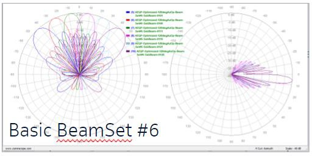19

20

21

22

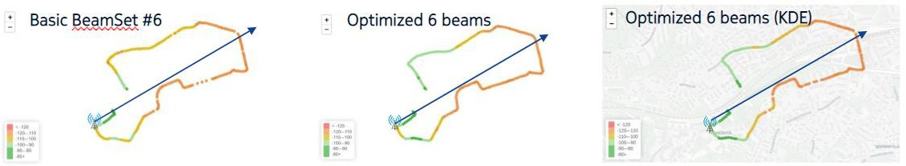23 ? Scenario: Single UE Drive Test

24

25

26

27

Figure 3.2.5.1-1.

**Figure 3.2.5.1-2.**

1. 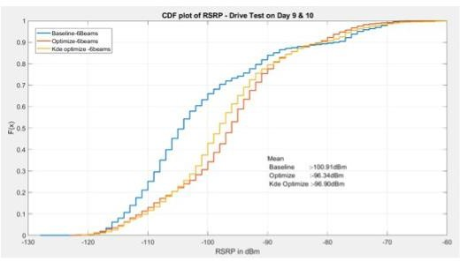? Weighted RSRP measurements - Single UE Drive Test

2

3 Figure 3.2.5.1-3.

4

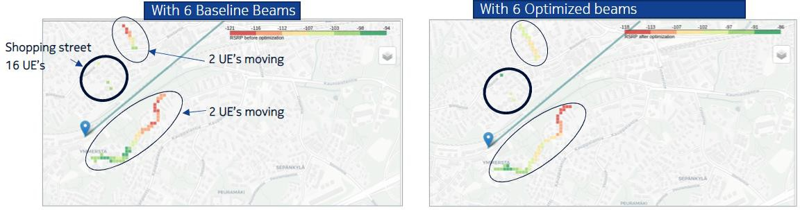5 ? Scenario: 20 UEs drive tests including shopping street

6

7 Figure 3.2.5.1-4.

8

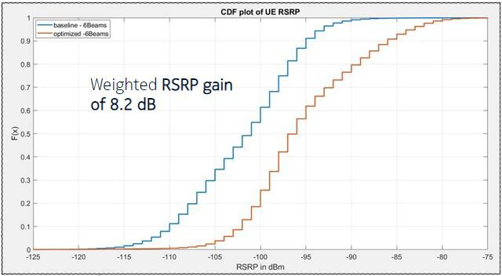9 ? Weighted RSRP measurements - 20 UEs drive tests including shopping street

10

11 Figure 3.2.5.1-5.

1. The ML based beam pattern optimization algorithm can adapt to the traffic distribution and hence provides a significant
2. gain in terms of weighted downlink RSRP. Uplink throughput enhancements are also expected since SSB beams are used
3. for uplink receive beamforming. 15

|  |  |  |  |  |  |  |
| --- | --- | --- | --- | --- | --- | --- |
| 1 | 3.3 Solution | 2: | Beam-based | Mobility | Robustness | Optimization |
| 2 | (bMRO) |  |  |  |  |  |

### 3.3.1 Problem Statement, Solution, and Value Proposition

* 1. Mobility Robustness Optimization is a well-known SON concept. First supporting measurements have been specified in
  2. LTE in Release 9. Its principle is to configure a number of parameters in the eNB that can delay or advance the HO
  3. procedure between two neighboring cells. The two parameters are 1. the cell individual offset (CIO) and 2. the time-to-
  4. trigger (TTT). One CIO value is a reference signal received power offset specific to one neighbor cell, stored in the eNB.
  5. The TTT value is a time offset specific to one neighbor cell, stored in the eNB.
  6. By changing the CIO and the TTT, the operator may solve the following problems:
  7. 1. Unbalanced traffic between neighboring cells.
  8. 2. Low performance of cell edge users.
  9. 3. Poor handover performance.

13

1. In particular, the prime use of optimizing the CIO and the TTT values is reducing the number of anomalous or problematic
2. HO events between neighbor cells. 16
3. In a 5G mMIMO cell/gNB whose coverage is provided not by a single beam but by several beams which radiate in
4. different directions. Thus, from the UEs point of view, the border between two neighbor cells is not a single border
5. anymore but degenerates to several beam->cell (or beam->beam) borders, where the one beam is radiated by the source
6. gNB and another beam is radiated from the target gNB. In this scenario, using a single CIO+TTT value pair on a cell->cell
7. basis will be suboptimal, as one beam->cell (or beam->beam) border might require a different CIO+TTT configuration
8. for optimal HOs than another beam->cell (or beam->beam) border.
9. This solution proposes to employ beam-specific CIO and TTT values between neighbor cells, e.g., instead of a single
10. CIO+TTT value pair for the cell1->cell2 border, to employ a CIO+TTT value pair for the SourceCell[Beam1]
11. ->TargetCell and SourceCell[Beam2] ->TargetCell borders.
12. The value of this solution is that the number of anomalous and problematic HOs can be resolved on a beam->cell basis,
13. i.e., with much finer granularity than with the legacy SON cell->cell solution. 28

### 3.3.2 Architecture/Deployment Options

####  Option 1

1. The Near-RT RIC may host an xApp to optimize inter-cell beam mobility such as bMRO. In this case the Near-RT RIC
2. might for instance configure beam individual offsets and the beam individual TTT for inter-cell mobility decisions. The
3. learning and the inference of the parameters may be done on individual beam->cell (or beam->beam) borders or
4. collectively on a group of beam->cell borders, depending on the implementation. The optimization might follow an
5. operator/SMO defined objective (e.g., minimize number/rate of TE HOs, TL HOs, or ping-pong HOs; optimize for certain
6. beam->cell borders; constrained optimization based on other objectives etc.), and so might be triggered by a new
7. operator/SMO defined optimization target, detection of performance degradation, or a change in the radio environment
8. (e.g., change in the mMIMO Beam Pattern). 39

1

1. @startuml
2. skinparam ParticipantPadding 5
3. skinparam BoxPadding 10
4. skinparam defaultFontSize 12
5. Autonumber

7

1. Box "SMO" #gold
2. Participant SMO as "Operator/SMO"
3. Participant NON as "Non-RT RIC"
4. end box

12

1. Box "O-RAN" #lightpink
2. Participant NearRTRIC as "Near-RT RIC"
3. Participant ORANnodes as "E2 Nodes"
4. End box

17

1. group Data Collection
2. ORANnodes -> NearRTRIC : <<E2>> KPI/PM report
3. Hnote over NearRTRIC
4. mMIMO Beam Pattern Information is available
5. Endhnote
6. end

24

1. group AI/ML Flow
2. SMO -> NearRTRIC: <<O1>> Initialize/Provide ML Model
3. ORANnodes -> NearRTRIC: <<E2>> KPI/PM report
4. Hnote over NearRTRIC
5. mMIMO Beam Pattern Information is available
6. Endhnote
7. NearRTRIC -> NearRTRIC: AI/ML model training
8. NearRTRIC -> NearRTRIC: AI/ML model inference
9. end

34

1. group Configuration Update
2. group alt 1
3. Hnote over NearRTRIC
4. mMIMO Beam Pattern Change
5. Endhnote
6. end
7. group alt 2
8. SMO -> NearRTRIC: <<O1>> Optimization Trigger:\nNew optimization target
9. end
10. group alt 3
11. NearRTRIC -> NearRTRIC: Optimization Trigger:\nPerformance degradation
12. end
13. NearRTRIC -> ORANnodes: <<E2>> Configure new mobility parameters
14. end

49

50 group Performance Monitoring

51 ORANnodes -> NearRTRIC: <<E2>> KPI/PM report

52 NearRTRIC -> NearRTRIC: Performance monitoring and evaluation

53 NearRTRIC -> NearRTRIC: Fallback configuration (O)

54 NearRTRIC -> NearRTRIC: Model retraining and update

55 end

56

57

58 @enduml

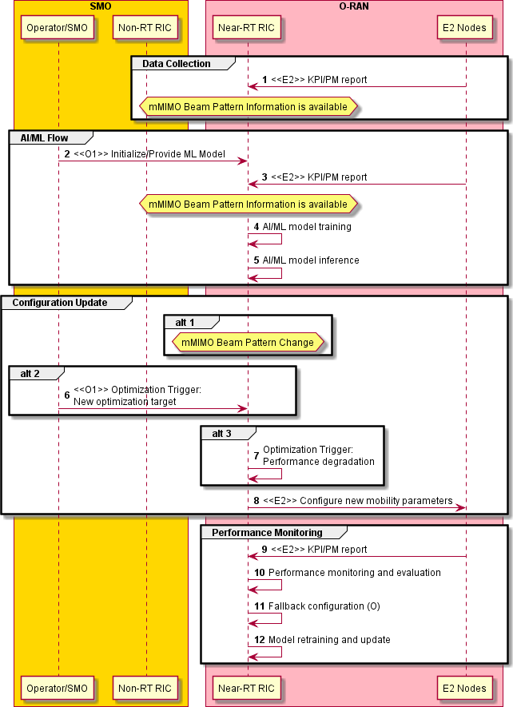1

2 Figure 3.3.2.1-1. bMRO solution diagram

1

1. One of the necessary inputs for training and inference of the bMRO function is the (current) mMIMO Beam Pattern that
2. is determined externally (in the SMO, in the Non-RT RIC, in the E2 Nodes, or in the Near-RT RIC by another function).
3. The relevant mMIMO Beam Pattern Information must be available at the Near-RT RIC bMRO function both for training
4. and inference. Depending on implementation, this can be achieved by transmission from the SMO (over O1), or by
5. transmission from the E2 Nodes (over E2), or by combined transmission from the SMO and the E2 Nodes, or by
6. communication between two Near-RT RIC functions. Moreover, depending on how the relevant mMIMO Beam Pattern
7. Information is configured/determined, the necessary information may be transmitted separately and asynchronously (e.g.,
8. SMO transmits a list of mMIMO Beam Patterns for the next time period(s), while the E2 Nodes transmit the exact times
9. of the mMIMO Beam Pattern changes and indicate the IDs of the mMIMO Beam Patterns in the list). 11

###### 12 Requirements

|  |  |  |  |  |  |
| --- | --- | --- | --- | --- | --- |
| **Input Data** | | | | | |
| **Interface** | **Source -> Target** | **Name/Description** | **Units** | **Reporting Period**\* | **(Target) Specification** |
| E2 | O-CU -> Near- RT RIC | Number of too early HOs from a given beam to a given neighbor cell | count | ~1 min | 3GPP TS 28.552  (Sec. 5.1.1.25) |
| E2 | O-CU -> Near- RT RIC | Number of too late HOs from a given beam to a given neighbor cell | count | ~1 min | 3GPP TS 28.552  (Sec. 5.1.1.25) |
| E2 | O-CU -> Near- RT RIC | Number of attempted HOs from a given beam to a given neighbor cell | count | ~1 min | 3GPP TS 28.552  (Sec. 5.1.1.25) |
| E2 | O-CU -> Near- RT RIC | Number of successful HOs from a given beam to a given neighbor cell | count | ~1 min | 3GPP TS 28.552  (Sec. 5.1.1.25) |
| E2 | O-CU -> Near- RT RIC | Number of failed HOs from a given beam to a given neighbor cell | count | ~1 min | 3GPP TS 28.552  (Sec. 5.1.1.25) |

13 Table 3.3.2.1-1.

14

|  |  |  |  |  |  |
| --- | --- | --- | --- | --- | --- |
| **Output Data** | | | | | |
| **Interface** | **Source -> Target** | **Name/Description** | **Units** | **Config. Period**\* | **(Target) Specification** |
| E2 | Near-RT RIC  -> O-CU | CIO for a given beam to a given neighbor cell | dB | trigger- based >= 1 min | 3GPP TS 38.331  (Sec. 5.3.5, Sec. 5.5.4) |

15 Table 3.3.2.1-2.

1. *\*The period represents the baseline assumption for the gain/complexity analysis in this document. Faster reporting*
2. *and reconfiguration periods or even different input data over E2 for faster Near-RT RIC control loops are not*
3. *excluded for the normative phase if seen beneficial.*

19

* 1. O-RAN Entity roles:
  2. 1) SMO & Non-RT RIC
  3. a) Trigger bMRO configuration. (O)
  4. b) Send bMRO configuration target to Near-RT RIC.
  5. c) Send mMIMO Beam Pattern related information (Beam Pattern configuration, Beam Pattern configuration list,
  6. Beam Pattern configuration switch timing/condition, Beam Pattern identifier etc.) to the Near-RT RIC.
  7. d) Trigger initiation of bMRO AI/ML Model training.
  8. e) Non-RT RIC
  9. f) Transfer the appropriate bMRO ML model to the Near-RT RIC over O1/O2.
  10. 2) Near-RT RIC
  11. a) Retrieve necessary configurations, performance indicators, measurement reports and other data from E2 nodes
  12. for the purpose of training of relevant AI/ML models. Retrieve ML Models from the Non-RT RIC over O1/O2.
  13. b) Train the relevant AI/ML model using the collected data. FFS: Perform offline training of relevant AI/ML
  14. models.
  15. c) Use the trained AI/ML models to infer the correlation between the Grid-of-Beam configuration, handover, and
  16. beam failure statistics of multiple cells and beams, and to predict the optimal configuration of mobility
  17. parameters (e.g., beam individual offsets for beam mobility) for each cell/beam pair optionally according to a
  18. global optimization objective designed by the operator and retrieved from the SMO.
  19. d) Send the optimal per beam mobility parameter configurations to E2 nodes.
  20. e) Monitor the performance of the AI/ML model based on configurations, performance indicators, and
  21. measurement reports received from the RAN.
  22. f) Retrain the AI/ML model and re-optimize the beam mobility configurations based on the monitored
  23. performance and/or based on a switch of the Grid-of-Beam configuration.
  24. g) Execute the control loop periodically or event-triggered.
  25. h) Retrieve mMIMO Beam Pattern related information from the SMO.
  26. 3) E2 nodes
  27. a) Collect and report to Near-RT RIC KPIs related to Grid-of-Beam configuration, handover and beam failure
  28. statistics.
  29. b) Apply L3 beam mobility parameter configuration following Near-RT RIC configuration.
  30. c) Send mMIMO Beam Pattern related information to the Near-RT RIC. 31

####  Option 2

1. The bMRO optimization algorithm might also be hosted in Non-RT RIC. Same principles apply, whereas KPI reporting
2. and configuration management over O1 interface will be used. 35

### 3.3.3 Impact Analysis on O-RAN Working Groups

1. *Editor's note: This is an initial impact analysis as part of the WG1 UCTG work on mMIMO. The intention is to estimate*
2. *the expected standardization effort within the O-RAN working groups. It is up to the WGs to decide how the mMIMO*
3. *functionality should be specified in specifications of each WG.*
4. WG1 (use cases, architecture) Impact
5. ? O-RAN.WG1.Use-Cases-Analysis-Report-v05.00
6. o Update use case 6: Massive MIMO Beamforming Optimization (Section 3.6) considering stage 1 and
7. stage 2 decisions
8. ? O-RAN.WG1.Use-Cases-Detailed-Specification-v05.00
   1. o Update use case 6: Massive MIMO Beamforming Optimization (Section 3.6) considering stage 1 and
   2. stage 2 decisions
   3. WG2 (Non-RT RIC, A1) Impact
   4. ? O-RAN.WG2.Use-Case-Requirements-v04.00
   5. o If seen as beneficial, add new use case 6: Massive MIMO Beamforming Optimization based on
   6. agreements from pre-normative phase
   7. ? O-RAN.WG2.AIML-v01.03
   8. o Depending on implementation, add a deployment scenario involving offline training in the Near-RT
   9. RIC.
   10. WG3 (Near-RT RIC, E2) Impact

11 ? O-RAN.WG3.UCR-v01.00

1. o Add new use case 6: Massive MIMO Beamforming Optimization based on agreements from pre-
2. normative phase
3. ? O-RAN.WG3.RICARCH-v02.00
4. o No impact identified
5. o Background information
6. ? bMRO is an xApp running in the Near-RT RIC
7. ? bMRO is using Near-RT RIC services REPORT and POLICY and uses the E2 interface to a)
8. get KPI/PM reports from the E2 Node and b) configure beam-based cell individual offsets as
9. policy in the E2 Node.

21 ? O-RAN.WG3.E2GAP-v02.00

1. o No impact identified
2. o Background information
3. ? bMRO xApp uses the E2 interface to a) get KPI/PM reports from the E2 Node and b) configure
4. beam-based cell individual offsets as policy in the E2 Node.
5. ? The following services of the E2 interface are used:
6. 1. E2 KPI/PM report (Figure 3.3.2.1-1: step 3, step 9) using Near-RT RIC REPORT
7. Service
8. 2. E2 Configure new mobility parameters (Figure 3.3.2.1-1: step 8) using Near-RT RIC
9. POLICY Service

31 ? O-RAN.WG3.E2AP-v02.00

1. o No impact identified
2. o Background information
3. ? The following services of the E2 interface are used:
4. 3. E2 KPI/PM report (Figure 3.3.2.1-1: step 3, step 9) using Near-RT RIC REPORT
5. Service
6. 4. E2 Configure new mobility parameters (Figure 3.3.2.1-1: step 8) using Near-RT RIC
7. POLICY Service
8. ? O-RAN.WG3.E2SM-RC-v01.01.00 or NEW: O-RAN.WG3.E2SM-CC
9. Add RAN POLICY service "Mobility Robustness Optimization" with Policy Approach "Offset" to
10. E2SM-RC (modify E2SM-RC to support cell specific signaling) or add this policy to a new Cell
11. level/E2 Node level Control (i.e. E2SM-CC)
12. ? O-RAN.WG3.E2SM-KPM-v02.00
13. o No direct impact identified
14. ? Assuming the new measurements will be specified in 3GPP TS 28.552
15. ? Dependency on completion of bMRO functionality in 3GPP Rel.17
16. o Background
17. ? The E2 Node (O-CU-CP) shall host the RAN Function "KPM Monitor"
18. WG5 (O1) Impact

50 ? O RAN.WG5.O-CU-O1.0-v01.00

51 o No direct impact identified

1. ? Assuming data model (provisioning management) will be enhanced with beam individual
2. offsets in 3GPP TS 28.541 (according to *cellIndividualOffset* in module *\_3gpp-nr-nrm-*
3. *nrcellrelation.yang*)
4. ? Assuming performance measurements in 3GPP TS 28.552 are enhanced to consider HO
5. failures TooEarly, Too Late and ToWrongCell per beam;
6. ? Assuming information about assignment of UE to beam is available at CU (using UE context
7. messages specified in 3GPP TS 38.473 to indicate)
8. o Dependency in completion of bMRO functionality in 3GPP Rel.17
9. o Background
10. ? Performance management (Section 6) is aligned with O-RAN.WG10.O1-Interface.0-v05.00
11. ? File Management (Section 8) to transfer configuration files as well as performance data files
12. and notification log files.
13. ? Provisioning Management (Section 9 in O RAN.WG5.O-CU-O1.0-v01.00 and O-
14. RAN.WG5.MP.0-v02.00 or Section 10 in O-RAN.WG5.MP.0-v02.00) to transmit trigger, to
15. configure beam individual offsets and to configure performance metric jobs (3GPP TS 28.622).
16. WG10 (SMO, O1) Impact
17. ? O-RAN.WG10.O1-Interface.0-v05.00
18. o No impact identified
19. o Background
20. ? Provisioning management services (Section 2.1) allow configuration changes using

21 NETCONF (TS 28.532, TS 28.541)

22 ? Performance assurance management services (Section 2.3) collect performance measurement

23 data for file reporting (File management services explained in Section 2.5) or data streaming 24

1. Summary: The impact on O-RAN specification is quite limited, assuming bMRO related KPIs are specified in 3GPP SA5.
2. Work in O-RAN WGs can be minimized by referring to 3GPP specification as done today, e.g., E2SM-KPM, O
3. RAN.WG5.O-CU-O1, O-RAN.WG10.O1.

28

### 3.3.4 Relation and Impact on 3GPP Specification

####  3GPP Mobility Robustness Optimization

1. LTE MRO is a well-known SON method that optimizes the mobility parameters and thereby minimizes the mobility
2. related failures as well as unnecessary handovers (HOs). First the following radio link or handover failure causes are
3. identified:
4. 1. Too late handovers (TL)
5. 2. Too early handovers (TE)
6. 3. Handover to wrong cell
7. 4. Ping-pong (PP) handovers
8. For this purpose, eNBs and UEs evaluate radio link or handover failure related information. UEs might provide respective
9. information after radio link re-establishment and neighbour eNBs might exchange respective failure indications.
10. SON MRO was first standardized in LTE Rel.9:
11. ? 3GPP TS 36.902 E-UTRAN; SON Use Cases and Solutions
12. ? 3GPP TS 36.300 E-UTRAN; Overall description stage 2
13. ? 3GPP TS 36.423 E-UTRAN; X2 Application Protocol (X2AP)
14. o New X2-AP procedures: *Radio Link Failure Indication*
15. o New X2-AP procedure: *Handover Report Indication*
16. ? 3GPP TS 36.331 E-UTRA; Radio Resource Control (RRC)
17. o RLF report indication (UE assistance signalling for root cause analysis)
    1. ? 3GPP TS 32.425 Performance Management (PM); Performance measurements E-UTRAN
    2. o KPIs for Too-Late HOs (TL), Too-Early HOs (TE), HO to wrong cell, Ping-pong (PP)
    3. ? 3GPP TS 28.658 E-UTRAN Network Resource Model (NRM) Integration Reference Point (IRP); Information
    4. Service (IS)
    5. o Configuration management of MRO Cell Individual Offsets (CIO)
    6. LTE Rel.10 specified that RLF Report will also be available after UE went to Idle mode (Re-establishment was not
    7. successful). LTE Rel.11 supports signalling between base stations for Inter-RAT support.
    8. MRO functionality was added to NR and NG-RAN in Rel.16:
    9. ? 3GPP TS 38.300 E-UTRAN; Overall description stage 2
    10. ? 3GPP TS 38.423 NG-RAN; Xn Application Protocol (XnAP)
    11. ? 3GPP TS 38.331 NR; Radio Resource Control (RRC)
    12. ? 3GPP TS 28.552 Management and orchestration; 5G performance measurements
    13. o KPIs for Too-Late HOs (TL), Too-Early HOs (TE), HO to wrong cell, Ping-pong (PP)
    14. ? 3GPP TS 28.541 Management and orchestration; 5G Network Resource Model (NRM); Stage 2 and stage 3
    15. o Configuration management of MRO Cell Individual Offsets (CIO)
    16. NR and NG-RAN MRO includes connection failure due to intra-system as well as inter-system mobility, inter-system
    17. unnecessary HO as well as inter-system ping-pong handover.
    18. Overall, LTE and NR MRO are essential mobility features that can reduce dominating radio link failures, make handover
    19. more robust and also reduce handover ping-pong effects by adapting cell individual offsets. 3GPP is also working to
    20. extent the concept to support mMIMO with beam-based approaches for MRO. 21

####  Impact of bMRO on 3GPP Specification

1. gNB reporting
2. ? 3GPP TS 28.552 Management and orchestration; 5G performance measurements
3. o Beam-based KPIs for Too-Late HOs (TL), Too-Early HOs (TE), HO to wrong cell
4. o CR S5-214485 submitted to 3GPP SA5 at 3GPP TSG-SA5 Meeting #138-e meeting, 23rd Aug 2021 -
5. 31st Aug 2021; Conclusion: noted
6. o CR S5-215326 submitted to 3GPP SA5 at 3GPP TSG-SA5 Meeting #139-e meeting, 11th Oct 2021 -

29 20th Oct 2021

1. o Target 3GPP Rel.17
2. ? 3GPP TS 28.313 Management and orchestration; Self-Organizing Networks (SON) for 5G networks
3. o Add beam based KPIs for too early handover failures, too late handover failures, handover failures to
4. wrong cell
5. o Target 3GPP Rel. 17
6. gNB configuration
7. ? 3GPP TS 28.541 Management and orchestration; 5G Network Resource Model (NRM); Stage 2 and stage 3
8. o Beam-based configuration management of MRO Cell Individual Offsets (CIO)
9. o CR S5-215328 (stage 2) and CR S5-215348 (stage 3) submitted to 3GPP SA5 at 3GPP TSG-SA5
10. Meeting #139-e meeting, 11th Oct 2021 - 20th Oct
11. o Target 3GPP Rel.17
12. UE configuration and reporting
13. ? 3GPP TS 38.331 NR; Radio Resource Control (RRC) protocol specification
14. o Add UE configuration of beam-based individual offsets for MRO
15. o Add UE reporting of last serving beam in the RLF report
16. o CR on 3GPP TS 38.331 should be submitted to 3GPP RAN2
17. o Target 3GPP Rel. 17
18. Intra-gNB signalling (F1)
19. ? 3GPP TS 38.473 NG-RAN; F1 Application Protocol (F1AP)
20. o Signalling needed on F1AP to support the per-beam mobility setting change
21. o TDoc 3GPP R3-213388 "Consideration on the CU-DU impacts of the per-beam mobility setting
22. change" submitted to 3GPP TSG-RAN WG3 Meeting #113-e meeting, 16th - 27th August 2021
23. o CR 3GPP R3-213389 "Enabling CU-DU information exchange to support per-beam mobility setting
24. change" submitted to 3GPP TSG-RAN WG3 Meeting #113-e meeting, 16th - 27th August 2021
25. o Target 3GPP Rel. 17
26. Summary: The related changes to 3GPP specifications for gNB reporting, gNB configuration and intra-gNB signalling
27. are essential to support bMRO optimization in O-RAN. First CRs to 3GPP SA5 and RAN3 have been submitted as part
28. of 3GPP Rel.17 and are currently being revised. Completion of bMRO in O-RAN can only take place after completion of
29. bMRO in 3GPP, which should be considered in the mMIMO feature plan.
30. The related changes to 3GPP specifications for UE configuration and UE reporting are not essential to support bMRO
31. optimization in O-RAN. Contribution to 3GPP RAN2 is still open and under discussion. 16

### 3.3.5 Feasibility and Gain/Complexity Analysis

####  Simulation Results

1. Simulation setup:
2. ? 7 site hexagonal grid scenario (3GPP TR38.901 Urban Micro, ISD=200m)
3. ? center frequency: 28 GHz (FR2), bandwidth: 100 MHz
4. ? 16x8 antennas
5. ? 8+4 beams (8 narrow beams with lower down tilt, 4 broader beams with higher down tilt)
6. ? 4 simultaneous beams (maximum number of active beams for transmission within a cell used for spatial
7. multiplexing)
8. ? BS height: 10 m, mechanical tilt: 9?
9. ? SSB beams with 15MHz bandwidth
10. ? KPI period: 30 seconds
11. ? Number of UEs: 630 UEs total (210 slow UEs + 420 street UEs)
12. ? Traffic: full buffer
    1. 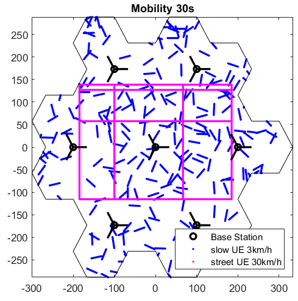? Example mobility:

2

3 Figure 3.3.5.1-1.

1. ? A3 Trigger with 80 ms TTT (time-to-trigger) and 2dB total offset, 60 ms L3 filtering
2. Simulation Results:
3. ? 3 KPI periods = 90 s
4. ? Reduction of the number of TE (too early) HOs and TL (too late) HOs:

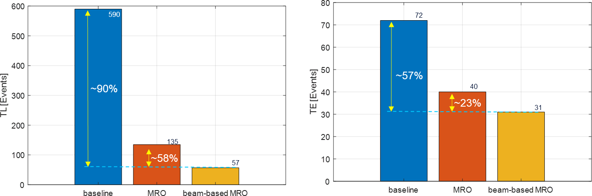8

9

10 Figure 3.3.5.1-2.

11

1. The beam-based MRO can reduce the number of total network TL failures by 90% compared to the baseline (no
2. MRO) and by 58% compared to legacy MRO (left graph). The beam-based MRO can reduce the total number
3. of network TE failures by 57% compared to the baseline and by 23% compared to legacy MRO (right graph). 15

16

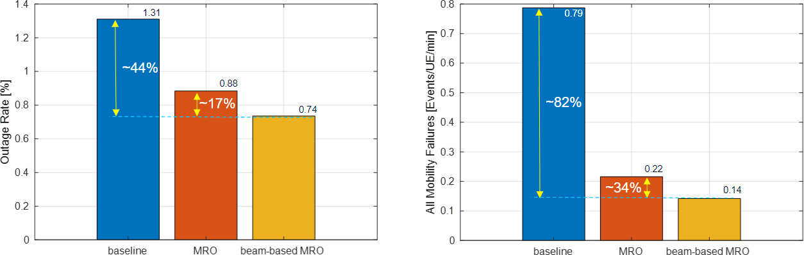1 ? Reduction of total network outage rate and failures:

2

3 Figure 3.3.5.1-3.

1. The beam-based MRO can reduce the outage rate by 44% compared to the baseline and 17% compared to legacy MRO
2. (left graph). The beam-based MRO can reduce the total network failure by 82% compared to the baseline and by 34%
3. compared to legacy MRO (right graph). 7

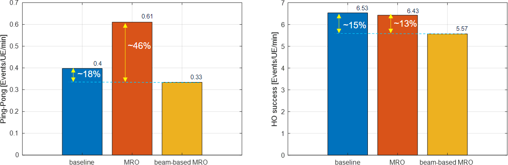8 ? Reduction of the rate of network ping-pong (PP) failures:

9

10 Figure 3.3.5.1-4.

* 1. The beam-based MRO can reduce the rate of PP handovers by 18% compared to the baseline and by 46% compared to
  2. legacy MRO (left graph). As the result of the reduction in the rate of PP handovers, the total frequency of HOs can be
  3. reduced by 15% compared to the baseline and by 13% compared to legacy MRO (right graph). 14

####  Complexity Analysis

1. Analysis is provided relative the legacy LTE MRO implementation.
2. The computational complexity as well as the signalling overhead (reporting from the E2 Node (O-CU) as well as
3. configuration towards the E2 Node (O-CU)) increases as follows:
4. ? Computational complexity: *?([No. of beams] x [MRO complexity])*
5. ? Increase of signaling: *?([No. of beams] x [MRO signalling])*
   1. The computational complexity may be reduced by enhanced proprietary implementations, e.g., forming virtual groups of
   2. beams with similar characteristics, e.g., neighbor beams covering the same street or area. With such an implementation
   3. the computational complexity can be reduced to:
   4. ? Computational complexity: *?([No. of beam groups] x [MRO complexity])*
   5. ? Increase of signaling: *?([No. of beam groups] x [MRO signalling])*
   6. Overall computational complexity seems reasonable since the time frequency of inter-cell handover events is relatively
   7. low and even decreases with the introduction of beam-based MRO. Similarly, the necessary signaling frequency (KPI
   8. reporting as well as configuration of Cell Individual Offsets) is rather low, e.g., in the range of seconds in the worst case. 9

## 3.4 Solution 3: AI/ML Based Initial Access (SS Burst Set), CSI-RS

1. and DMRS Configuration Optimization

### 3.4.1 Problem Statement and Value Proposition

1. 3GPP NR based wireless cellular networks promises to provide leaner system design compared to its predecessors in a
2. bid to improve spectral efficiency, power consumption performance and reduce interferences. Ultra-lean design aims to
3. minimize "always on" reference signal transmissions in the downlink. Impact is more on Massive MIMO (mMIMO)
4. system and networks where gNB/TRP should transmit downlink reference signals only when necessary. List of "always
5. on" reference signals include synchronization signals (SS Burst Sets), CSI-RS TRS, CSI-RS Acquisition, DMRS and
6. system broadcast information. Subsequent sections present AI/ML based optimization problem description with SS Burst
7. Set configuration optimization which operates in slowest control loop (Non-RT RIC Control Loop) of the O-RAN
8. architecture. Gradually problem statement is extended to CSI-RS and DMRS configuration optimizations operating in
9. Near-RT RIC and O-DU control loops.
10. In beamformed Massive MIMO systems, initial access (IA) and time frequency tracking (TA) mechanisms require
11. transmission of "Always On" signals SS Burst Sets periodically followed by CSI-RS TRS in the remaining part of the
12. frame stricture. During initial access process, the UE detects a preferred SS/PBCH beam at preferred receive beam. UEs
13. with beam correspondence support can use the same receive beam to transmit PRACH after receiving SIB1 on the
14. scheduled SS/PBCH time-frequency grids. When beam correspondence is not supported, the UE repeats PRACH
15. transmissions in different directions and then listen for the network response using the same beam used to detect the
16. SS/PBCH. From the initial access procedure, a default beam pair is established. After SS burst based synchronization, the
17. UE can start synchronizing with gNB/TRP using SS Block configuration dependent CSI-RS signals.
18. In large scale NR networks with thousands of gNB/TRPs deployed, system configurations derived manually using
19. heuristic methodologies will directly impact the following aspects.
20. a) High power consumptions in both network and UEs leading increased network CAPX and reduced UE battery
21. life respectively and
22. b) Degraded utilization of time-frequency resources affecting e2e spectral efficiency of the system.
23. Issue is compounded by increase in IA latency and non-satisfactory reactive tracking performance KPI reports due to
24. non-optimal configuration setting of large number of parameters available for SS bursts and CSI-RS TRS configuration
25. supported in NR. UE could observe degraded tracking performances (and related other network KPIs) without appropriate
26. CSI-RS planning. These are important network design aspects for massive MIMO systems with large carrier bandwidth
27. and systems with carrier aggregation support where multiple BWPs are active with multiple time-frequency resource
28. allocations for IA and TA reference signal transmissions. Typically, operators rely on skilled in the art manpower to
29. suggest network wide configuration set which is prone to be sub-optimal. In addition to the demography, time dependent
30. network usage parents have strong influence on designing optimal configuration sets which can lead to spectral and power
31. efficient network design.
32. We propose AI/ML assisted network-wide (multi-gNB/TRP) optimization framework wherein AI/ML agent/engine can
33. infer optimal SS Burst Set, CSI-RS TRS configurations per gNB/TRP based on multiple time, location, and usage
34. dependent observations which are already available at different nodes of the NR access and core network elements {E2
35. Nodes (O-DUs, O-CUs), O-RU, SMO}. Optimizer capability can be extended to derive configurations other reference
36. signals configurations including UE specific CSI-RS acquisition, and DMRS as well with additional observations or
37. training data for the AI/ML agent/engine. Joint optimizations are also definite possibility which can be considered as
38. extension of the use cases mentioned in this document. One example is jointly optimizing SSB and CSI-RS for faster
39. beam acquisition operation in mmWave FR2 system.
40. At high-level goal of this class of optimization problem (involving SS Burst Set, CSI-RS, and DMRS) is to minimize
41. reference signal transmissions based on 3GPP supported configuration/reconfigurations options available subject to
42. constraints given below (not an exhaustive list):
43. a) Target KPIs (like IA latency, TA estimation accuracy, reactiveness, channel estimation accuracy etc.) within the
44. working limit suggested by the operator.
45. b) Mobility and HO KPIs targets (operator inputs) which could be different in different parts of the network.
46. c) Enable faster/reduced set beam search in connected mode improving RLF performance.
47. d) Optimal CSI-RS and DMRS density for target parameter estimation accuracy (e.g., Mean Square Error metric).
48. In the architecture/deployment options section, SS Burst Set optimization is used for Non-RT RIC framework and Near-
49. RT RIC deployment framework is used for CSI-RS and DMRS configuration optimizations. 17

### 3.4.2 Architecture/Deployment Options

####  Option 1a: Non-RT RIC Based Training and Deployment (SS Burst Set

1. Configuration Optimization)
2. In this class of architecture/deployment option, raw training data gathering, pre-processing them to generate AI/ML model
3. training data, offline AI/ML model training and deployment are performed in the SMO/Non-Real Time RIC entity. Raw
4. training data set are collected from the TRP/gNB or cluster of deployed TRP/gNBs which constitute the large-scale
5. network deployment. By default, heterogeneous deployment is assumed supporting various slow time varying usage
6. patterns in different parts of the network.
7. Offline trained AI/ML agent/engine will allow operator to deploy it in Non-RT-RIC (if necessary, in Near-Real Time
8. RIC). AI/ML Agents can derive optimal per gNB/TRP configurations statically or semi-statically trigged by operator
9. requirements or KPIs observations from the NR E2 nodes. It is expected that AI/ML engine/agent will generate
10. same/similar inferences for a set of gNB/TRPs which are deployed at the same geographical neighbours having similar
11. usage pattern (example set of gNB/TRPs deployed to support a busy street with moderate mobility).
12. SMO needs to collect required observations sets over different observation time windows to generate required training
13. data set which necessitates O1, E2 and FH interface capability enhancements. Interface capabilities can be made scalable
14. future requirements to support any additional observations required over O1 and E2 interfaces which can help in faster
15. convergence of AI/ML agent/engine. 35
16. @startuml
17. skinparam defaultFontSize 12

3

1. Box "Personnel" #lightblue
2. Actor "Operator" as OPERATOR
3. End box

7

1. Box "Service Management and Orchestration" #gold
2. Participant "Data Collection and Control & Non-RT RIC" as SMO
3. Participant "rAPP" as NRTRIC
4. End box

12

1. Box "O-RAN Nodes" #lightpink
2. Participant "E2-Nodes(O-CUs & O-DUs)" as E2NODES
3. Participant "O-RUs" as ORUs
4. End box

17

1. group Data Collection and Pre-Processing
2. ORUs -> E2NODES : <<FH>> Observation, Mesaurement Data Collection
3. E2NODES -> SMO : <<O1>> Observation, Mesaurement Collection
4. OPERATOR -> SMO : Performance KPI Targets Inputs
5. SMO -> SMO : Data Pre-Processing and AI/ML Training Data Generation

23

24 end

25

1. group AI/ML Engine/Agent Training
2. SMO -> SMO : AI/ML Engine/Agent Training
3. end

29

1. group Model Deployment and Inference Generation
2. group Operator-Initiated
3. SMO -> NRTRIC : <<R1>> Model Deployment
4. OPERATOR -> SMO : KPI Targets/Deployment Updates
5. SMO -> NRTRIC : <<R1>> Model Data
6. end
7. group System Initiated
8. SMO -> NRTRIC : <<R1>> PI Degradation & Alarms
9. end
10. SMO -> E2NODES : <<O1>> Measurement, Report Configuration
11. E2NODES -> SMO : <<O1>> Observation, Mesaurement Collection
12. SMO -> NRTRIC : <<R1>> Model Data
13. NRTRIC -> NRTRIC : AI/ML Agent/Engine Inference
14. NRTRIC -> SMO : <<R1>> Updated Optimal Configs
15. SMO -> E2NODES : <<O1>>Updated E2 Nodes Configurations
16. E2NODES -> ORUs : <<FH>> Updated O-RU Configurations

46

47 end

48

1. group ML Agent Performance Monitoring
2. ORUs -> E2NODES : <<FH>> Data Collection
3. E2NODES -> SMO : KPIs, Measurment Report, Observations
4. SMO -> SMO : Performance Evaluation & Fallback Config Decision
5. SMO -> E2NODES : <<O1>> Default/Fallback mMIMO Configuration
6. E2NODES -> SMO : <<O1>> Observation, Mesaurement Collection
7. SMO -> SMO : AI/ML Agent/Engine Re-Training Trigger
8. end

57

58 @enduml

1

* 1. Figure 3.4.2.1-1. Flow diagram for SS Burst Set Configuration Optimization

3

4

###### Requirements for SS Burst Set Configuration Optimization

1. Required Observations for Training Data Set Generation
2. Initialization:

|  |  |  |  |  |  |  |  |  |  |
| --- | --- | --- | --- | --- | --- | --- | --- | --- | --- |
| **Input/Output Data** | | | | | | | | | |
| **Interface** | | **Source Target** | **->** | **Name/Description** | | | **Units** | **Reporting Period, granularity** | **New or existing config** |
| O1 SMO | via | O-DU -> Non- RT RIC | | Supported SSB and configurations per cell | CSI-RS | TRS | - | Initializatio n | 3GPP TS38.331 |
| M-Plane via SMO | | O-RU -> Non- RT RIC | | Supported common beam configuration from O-RU per cell | | | File | Initializatio n | Existing  O-RAN.WG5.MP  Chapter 8 |
| Open FH M-Plane | | O-RU **->**  DU | O- | Beamforming weights or attributes via YANG module per cell | | | values in IE | Initializatio n | O-RAN.WG4.MP  Section 12.4.2 |
| Open FH M-Plane | | SMO **->** O- RU; O-DU **->** O-RU | | Inferred SSB beam configuration in specified file per cell | | | file | Initializatio n | O-RAN.WG4.MP  Section 12.4.2 |
| Open FH CUS-  Plane | | O-DU **->**  RU | O- | SSB beam attributes per cell | | | values in IE | Initializatio n | O-RAN-WG4.CUS  Section 5.4.2 |
| Operator I/F to  SMO | | SMO -> Non- RT RIC | | Maximum Initial Access Latency for given SSB Beam Configuration | | | ms | Initialization | KPI metric input by the operator  New KPI |

4 Table 3.4.2.1-1.

5

6 Measurements/reports from E2 Nodes over O1 interface (AI/ML model training phase):

|  |  |  |  |  |  |
| --- | --- | --- | --- | --- | --- |
| **Input Data** | | | | | |
| **Interface** | **Source -> Target** | **Name/Description** | **Units** | **Reporting Period, granularity** | **New or existing measurement,**  **Existing Specification (Section)** |
| O1 via SMO | O-DU -> Non- RT RIC | SS reference signal received power (SS-RSRP) per UE | dBm | (non real- time, reported every  TWin \* time window) | 3GPP TS 38.215  (Sec. 5.1.1)  New reporting |
| O1 via SMO | O-DU -> Non- RT RIC | CSI reference signal received power (CSI-RSRP) per UE | dBm | (non real- time, reported every  TWin \* time window) | 3GPP TS 38.215  (Sec. 5.1.25)  New reporting |

|  |  |  |  |  |  |
| --- | --- | --- | --- | --- | --- |
| O1 via SMO | O-DU -> Non- RT RIC | UL SRS RSRP measurement per UE | dBm | (non real- time, reported every  TWin \* time window) | 3GPP TS 38.215  (Sec. 5.2.5)  New reporting |
| O1 via SMO | O-CU -> Non- RT RIC | Number of active UEs in NG-RAN (Number of RRC\_CONECTED UEs) per cell | Integer | (non real- time, measured and reported every  TWin \* time window) | 3GPP TS28.552  Sections: 5.1.1.23 & A.60  3GPP TS28.552 A.7 |
| O1 via SMO | O-CU -> Non- RT RIC | Cell Specific Offsets (HO) defined within measObjectNR per neighbor cell | dB | (non real- time, reported every  TWin \* time window) | 3GPP TS 28.331  (Sec. 5.3.4)  New Reporting |
| O1 via SMO | O-DU -> Non- RT RIC | PRACH correlation power for every received PRACH corresponding to each active SSB Beam Index | dBm | Non real-  time, for  every SSB Beam Index reported in  TWin \* time window | New Measurement  (Could be derived measurement at O-DU (derived based on the existing RA-report defined in RAN2, can be standardized in SA5)  New Reporting |
| O1 via SMO | O-DU -> Non- RT RIC | Received PRACH instance number and corresponding receive beam index | Integer | Non real-  time, for  every SSB Beam Index reported in  TWin \* time window | 3GPP TS 28.552-h40,  subclause 5.1.1.20/ TS 38.314-g40, subclause 4.2.1.1  New Reporting |
| O1 via SMO | O-CU -> Non- RT RIC | Network accessibility KPI per cell | Integer | Non real- time, reported every  TWin \* time window | 3GPP TS 28.554  Section 6.2 |
| O1 via SMO | O-CU -> Non- RT RIC | DL/UL throughput/spectral efficiency per slice | Float (kbit/se c) | Non real- time, reported every  TWin \* time window | 3GPP TS 28.554  Section 6.3.2 and section 6.3.3 |

1 Table 3.4.2.1-2.

2

3

1. Measurements/reports from E2 Nodes (inference phase):

|  |  |  |  |  |  |
| --- | --- | --- | --- | --- | --- |
| **Input Data** | | | | | |
| **Interface** | **Source -> Target** | **Name/Description** | **Units** | **Reporting Period, granularit y** | **New or existing measurement,**  **Existing Specification (Section)** |
| O1 via SMO | O-DU -> Near- RT RIC | PRACH correlation power for every received PRACH corresponding to each active SSB Beam Index | dBm | Reported every  TWin-R \* time window | New Measurement  (Could be derived measurement at O-DU (derived based on the existing RA-report defined in RAN2, can be standardized in SA5)  New Reporting |
| O1 via SMO | O-DU -> Near- RT RIC | Received PRACH instance number and corresponding beam index | Integer | Reported every  TWin-R \* time window | 3GPP TS 28.552-h40,  subclause 5.1.1.20/ TS 38.314-g40, subclause 4.2.1.1 |
| O1 via SMO | O-CU -> Non- RT RIC | Number of active UEs (mean, max) in NG-RAN (Number of RRC\_CONECTED UEs) per  direction per cell | Integer | Reported every  TWin-R \* time window | 3GPP TS28.552  Sections 5.1.1.23 & A.60 |

2 Table 3.4.2.1-3.

* 1. \*TWin is the predefined observation time window for offline training data collection.
  2. \*TWin-R is the predefined observation widow during inference generation, typically TWin-R <= TWin

5

1. In addition to these observations and KPIs, Data Collection and Control Unit is expected to have access to the cell site
2. deployment, configuration information and site-specific information for example gNB/TRP density, terrain type. A set of
3. predefined algorithmic steps will take these raw observations as inputs and generate required training data set in prescribed
4. format for the AI/ML engine/agent. AI/ML model will generate optimal SS Burst Set configuration and associated CSI-
5. RS configuration per gNB/TRP as inference.
6. Output Signalling towards E2 Nodes:

|  |  |  |  |  |  |
| --- | --- | --- | --- | --- | --- |
| **Output Data** | | | | | |
| **Interface** | **Source -> Target** | **Name/Description** | **Units** | **Config. Period, granularity** | **New or existing config** |
| O1 | SMO -> O-DU | Inferred O-RU SS Burst Set (SS Block Number and SS Burst Periodicity and CSI-RS TRS Configuration | - | Initialization, per O-RU | 3GPP TS38.331  IE:  ServingCellConfigCommon |

12 **Table 3.4.2.1-4.**

###### 3.4.2.1.1 O-RAN WG Impact Analysis

1. This use case focuses on O1, M-Plane (via SMO) interfaces for observations, measurements, KPIs collection. O-RAN
2. specified R1 interface is used as one of the options for trained AI/ML model deployment as rAPP in Non-Real Time RIC.
3. Another possibility is both offline AI/ML model training and model deployment can be done in the rAPP. In this case R1
4. interface is also used to transport training data to rAPP. Inference is communicated to E2 nodes (O-CU/O-DU) using R1
5. APIs and O1 interface (via SMO).
6. Impacts on O-RAN standards are identified below with the assumption that this is initial analysis report which is outcome
7. of the massive MIMO pre-normative stage work. Captured impact analysis are based on latest published specifications of
8. respective standards from identified O-RAN working groups.
9. WG1 (use cases, architecture) Impact
10. a) O-RAN.WG1 - Use Cases Analysis Report
11. o Based on the decision from pre-normative stage include this new use cases in the massive MIMO
12. optimization UCTG document for Initial Access (SS Burst set configuration) configuration
13. optimization problem.
14. b) O-RAN.WG1- Use Cases Detailed Specification
15. o Update use case specific details for Initial Access (SS Burst set configuration) massive-MIMO
16. optimization considering pre-normative and normative stage decisions.
17. WG2 (Non-RT RIC, R1) Impact
18. a) O-RAN.WG2 - Use Case Requirements
19. o Based on the necessity add Initial Access (SS Burst) Massive-MIMO optimization use-case based
20. on agreements from pre-normative phase.
21. o No impact on A1 interface is identified
22. ? AI/ML model training is done in SMO/Non-Real Time RIC and trained model
23. deployment is done in No-Real Time RIC as rAPP.
24. ? Generated inference is communicated to E2 nodes (O-CU/O-DU) over O1 interface.
25. b) O-RAN.WG2 - AIML
26. o No impact identified
27. ? This use case is expected to be in line with standardized AI/ML workflow.
28. c) O-RAN.WG2 - Non-RT RIC Architecture & O-RAN.WG2 O-RAN Non-RT RIC: Functional Architecture
29. o No impact identified for the Non-Real Time RIC architecture and functional architecture
30. specifications
31. o Incorporate the changes (if any) for R1 interface between the rAPPs and the non-RT RIC
32. framework functions for following two rAPP deployment aspects.
33. ? Case 1: When AI/ML model is offline trained in SMO and deployed in Non-Real Time
34. RIC as rAPP: Mechanism to deploy the model as rAPP over R1, inference communication
35. over R1 and finally over O1 interface to E2 nodes (O-CU/O-DU)
36. ? Case 2: Alternatively, when AI/ML model is offline trained and deployed in the rAPP
37. itself: Investigate AI/ML flow support for initial model load, training data transport to
38. rAPP and inference communication to O1 via R1.
39. ? Background information:
40. ? SS Burst set configuration optimization AI/ML model is a micro service (rAPP)
41. running in the Non-Real Time RIC.
42. ? Non-Real Time RIC framework handles rAPP LCM.
43. ? For model training data and inference communication from and to E2 nodes over
44. O1 interface and M-plane interfaces are used.
45. ? One of the feasible architectures is AI/ML model training in SMO or Non-Real
46. Time RIC framework and trained AI/ML model deployment is done as rAPP.
47. ? Alternative architecture for model training and deployment model is both are
48. done in rAPP. R1 interface is used for model onboarding, training data set

1

2

1. WG3 (Near-RT RIC, E2) Impact
2. a) No impact identified
3. WG4 (CUS, M-Plane) Impact
4. a) No impact identified

transport. Inference data communication via O1 interface within the current Near-RT RIC framework.

1. o Background information:
2. ? Over M-Plane interface SMO communicates/receives supported O-RU SSB beam
3. configurations.
4. ? These configurations are preprocessed with observations, measurements, KPIs data
5. received over O1 interface to generate training data set which is used for offline AI/ML
6. model training.
7. WG5 (O1) Impact
8. a) O-RAN.WG5 - SMO - O-CU (O-RAN O1 Interface specification for O-CU-UP and O-CU-CP & O-RAN
9. O1 Interface for O-CU-UP and O-CU-CP - YANG Models) ; SMO - O-DU (O-RAN O1 Interface
10. specification for O-DU & O-RAN O1 Interface for O-DU 2.0 - YANG Models)
11. o Enhance O1 data model yang definitions for new measurements/ observations reporting required for SS
12. Burst Set configuration optimization use case.
13. ? Data models/structures required for new measurement reports to the Non-Real Time RIC via
14. SMO. Refer to the requirement section of this use case.
15. ? L1/2 measurements: Analyse need for new data model definition over NETCONF for per cell
16. or per UE measurement reporting (refer to requirement section for new reporting requirements).
17. ? Counters: Add new data model to accommodate Number of active UEs in NG-RAN (Number
18. of RRC\_CONECTED UEs) over a predefined observation time window. 25
19. Based on the current understanding most of the measurements are specified in the 3GPP specifications except few like
20. PRACH power measurement, which can be possibly derived based on the existing RA-reports thus can be proposed to
21. 3GPP for standardized in SA5. New reporting will have to be incorporated into the O1 interface standard in terms of
22. addition of new yang data models.
23. WG10 (O1) Impact
24. a) O-RAN.WG10 - O-RAN Operations and Maintenance Architecture & O-RAN Operations and Maintenance
25. Interface Specifications
26. o No impact identified on the OAM architecture
27. o Impacts on the O1 interface to O-RAN elements are identified in WG5
28. ? Background information
29. ? Include data model enhancements to the O1 interface definitions for new
30. measurements, observations required for SS Burst Set configuration optimization use
31. case.
32. O-RAN Standard Impact Summary:
33. Impacts on O-RAN WGs is identified in the following areas:
34. ? Introduce a set of new measurements/observations and reporting at O-DU and/or O-CU which are not
35. defined in O-RAN specification already. New measurement/reporting are indicated in the requirement
36. section of the use case.
37. ? Incorporate changes in R1 interface specification for the case when model onboarding and training of
38. AI/ML model is done in the rAPP microservice and,
39. ? Implement potential changes to the O1 interfaces assuming other required KPIs are specified in 3GPP or
40. O-RAN standards.

###### 3.4.2.1.2 Relation and Impact on 3GPP Specification

* 1. UE- Specific Measurements and Reporting - From the requirement section, per UE specific measurements reporting
  2. which should be introduced in the upcoming release (e.g., RAN2 MDT trace specification, 3GPP TS 28.552 and related
  3. standards). We also propose that these new measurements should be taken up in the upcoming 3GPP RAN1 AI/ML
  4. discussion.
  5. PRACH power measurement be derived based on the existing RA-report defined in RAN2, thus can be proposed to 3GPP
  6. for standardized in SA5.
  7. New KPI - New KPI definition in 3GPP (e.g., Initial access latency value in case of SS Burst Set configuration
  8. optimization use case) need to be included in the future releases of 3GPP TS 32.425 Performance Management (PM);
  9. Performance measurements E-UTRAN specification.
  10. Thus, during the normative work phase, changes for the R1 and O1 interface need to be worked out with respective WGs.
  11. Similarly, for any 3GPP specification dependencies, appropriate steps should be taken based on the agreed O-RAN MVP-
  12. C Massive MIMO Optimization normative stage discussions points.

14

####  Option 2a: Non-RT RIC Based Training and Near-RT RIC Deployment (DMRS and

1. CSI-RS Configuration Optimizations)
2. For the class of use cases where few TTI level reaction time is necessary (example use cases are configuration
3. optimization for CSI-RS ports allocation for acquisition in DL and UL, UE specific DMRS allocation in DL or UL etc.),
4. offline trained AI/ML model need to be deployed in Near Real-Time RIC. In this architecture/deployment option, raw
5. training data gathering, pre-processing them to generate AI/ML model training data set, and offline AI/ML model training
6. are performed in the Data collection and control/Non-Real Time RIC entity and trained model deployment happens in
7. Near-RT RIC. Raw training data set are collected from the TRP/gNB or cluster of deployed TRP/gNBs which constitute
8. the large-scale network deployment. By default, heterogeneous network deployment is assumed supporting various usage
9. patterns in different parts of the network.
10. Offline trained AI/ML agent/engine will allow operator to deploy it in Near-RT-RIC over O1 interface. AI/ML Agents
11. can derive optimal per gNB/TRP configurations statically or semi-statically trigged by operator requirements or KPIs
12. observations, measurements from E2 nodes. It is expected that AI/ML engine/agent will generate same/similar inferences
13. for a set of gNB/TRPs which are deployed at the same geographical neighbours having similar usage pattern (example
14. set of gNB/TRPs deployed to support a busy street with low to moderate mobility).
15. Data Collection and Control Unit collects required observations sets over different observation time windows to generate
16. required training data set which necessitates O1, E2, and FH interface capability enhancements. Interface capabilities can
17. be made scalable for future requirements to support any additional observations required over O1 and E2 interfaces which
18. can help in faster convergence of AI/ML agent/engine. 34

1

@startuml

skinparam defaultFontSize 12

Box "Personnel" #lightblue Actor "Operator" as OPERATOR

End box

Box "Service Management and Orchestration" #gold Participant "Data Collection and Control" as SMO Participant "Non-RT RIC" as NRTRIC

End box

Box "O-RAN Nodes" #lightpink Participant "Near-RT RIC" as RTRIC Participant "E2-Nodes" as E2NODES Participant "O-RUs" as ORUs

End box

group Data Collection and Pre-Processing

ORUs -> E2NODES : <<FH>> Observation, Mesaurement Data Collection E2NODES -> SMO : <<O1>> Observation, Mesaurement Collection OPERATOR -> SMO : Performance KPI Targets

Inputs

SMO -> SMO : Data Pre-Processing and AI/ML Training Data Generation

end

group ML Engine/Agent Training

SMO -> NRTRIC : AI/ML Training Data

2

3

4

5

6

7

8

9

10

11

12

13

14

15

16

17

18

19

20

21

22

23

24

25

26

27

28

29

|  |  |  |  |
| --- | --- | --- | --- |
| 30  31 | end | NRTRIC -> NRTRIC : AI/ML Engine/Agent Training | |
| 32 |  |  | |
| 33 | group | Model Deployment and Inference Generation | |
| 34 | group | Operator-Initiated | |
| 35  36  37  38  39  40 | OPERATOR -> RTRIC : KPI Targets/Deployment Updates  end  group System Initiated  SMO -> RTRIC : <<O1>> PI Degradation & Alarms  end  NRTRIC -> RTRIC : <<O1>> Model Deployment | | |
| 41 |  | SMO -> E2NODES | : <<O1>> Measurement and Report Configuration |
| 42 |  | SMO -> RTRIC : | <<O1>> Traning Data (Optional) |
| 43 |  | E2NODES ->RTRIC : | <<E2>> Measure Reports Collection |
| 44 |  | RTRIC -> RTRIC : | AI/ML Agent/Engine Inference |
| 45 |  | RTRIC -> E2NODES | : <<E2>>Updated Optimal Configs (E2 Nodes and O-RU Configurations) |
| 46 |  | E2NODES -> ORUs : | <<FH>>Updated O-RU Configurations |
| 47 |  |  |  |
| 48 | end |  |  |
| 49 |  |  |  |
| 50  51  52  53  54  55  56  57  58  59  60  61 | group ML Agent Performance Monitoring  E2NODES -> SMO : KPIs, Measurment Report, Observations RTRIC -> SMO : <<O1>> ML Performance Feedback  ORUs -> E2NODES : <<FH>> Data Collection  SMO -> SMO : Performance Evaluation & Fallback Config Decision SMO -> E2NODES : <<O1>> Default/Fallback mMIMO Configuration E2NODES -> SMO : <<O1>> Observation, Mesaurement Collection  SMO -> NRTRIC : AI/ML Agent/Engine Re-Training Trigger  end  @enduml | | |

1

1. Figure 3.4.2.2-1. Flow diagram for CSI-RS and DMRS Configuration Optimization

3

4

###### Requirements for CSI-RS and DMRS Configuration Optimization

* 1. **a) DMRS Configuration Optimization**: Required Observations for Training Data Set Generation
  2. Initialization:

|  |  |  |  |  |  |
| --- | --- | --- | --- | --- | --- |
| **Input/Output Data** | | | | | |
| **Interface** | **Source -> Target** | **Name/Description** | **Units** | **Config. Period, granularity** | **New or existing config** |
| O1  Interface via SMO | O-DU -> Non- RT RIC | Supported DMRS configuration per cell (example for PDSCH, IE DMRS- DownlinkConfig, for PUSCH IE DMRS-UplinkConfig) per cell | - | Initialization | 3GPP TS 38.331 |
| O1  Interface via SMO | O-DU -> Non- RT RIC | Supported SRS configuration per cell (SRS-Config IE) per cell | - | Initialization | 3GPP TS 38.331 |

8 Table 3.4.2.2-1.

1 Measurements/reports from E2 Nodes over O1 interface (AI/ML model training phase):

|  |  |  |  |  |  |  |  |  |  |  |  |
| --- | --- | --- | --- | --- | --- | --- | --- | --- | --- | --- | --- |
| **Input Data** | | | | | | | | | | | |
| **Interface** | | **Source Target** | **->** | **Name/Description** | | | | **Units** | **Reporting Period, granularity** | | **New or existing measurement, Existing Specification**  **(Section)** |
| O1 SMO | via | O-DU -> RT RIC | Non- | SRS reference signal received power (SRS-RSRP) per UE | | | | dBm | (non real-time  for model training) | | 3GPP TS 38.215  (Sec. 5.1.19)  New reporting |
| O1 SMO | via | O-DU -> RT RIC | Non- | gNB Rx - Tx time difference (SRS based) per UE | | | | Sec | (non-real for training) | time, model | 3GPP TS 38.215  (Sec. 5.2.3)  New reporting |
| O1 SMO | via | O-DU -> RT RIC | Non- | DMRS based SNR measurement at O-DU per UE | | | | dB | (non-real for training) | time, model | New measurement and reporting |
| O1 SMO | via | O-DU -> RT RIC | Non- | CSI reference signal received power (CSI-RSRP) per UE | | | | dBm | (non real-time  for model training) | | 3GPP TS 38.215  (Sec. 5.1.2)  New reporting |
| O1 SMO | via | O-CU -> RT RIC | Non- | Number of active UEs in NG-RAN (Number of RRC\_CONECTED UEs) per direction per cell | | | | Integer | (non real-time, measured every  TWin \* time window) | | 3GPP TS28.552  Sections: 5.1.1.23 &  A.60  3GPP TS28.552 A.7 |
| O1 SMO | via | O-CU -> RT RIC | Non- | Network accessibility KPI per cell | | | | Integer | (non real-time, measured every  TWin \* time window | | 3GPP TS 28.554  Section 6.2 |
| O1 SMO | via | O-CU -> RT RIC | Non- | DL/UL  slice | network | throughput | per | Float (kbit/se c) | (non real-time, measured every  TWin \* time window | | 3GPP TS 28.554  Section 6.3.2 and  section 6.3.3 |
| O1 SMO | via | O-DU -> RT RIC | Non- | DMRS/SRS based Doppler estimate per UE | | | | Hz | (non real-time, measured every  TWin \* time window | | New measurement and reporting |

2 Table 3.4.2.2-2.

3

1 Measurements/reports from E2 Nodes (inference phase):

|  |  |  |  |  |  |
| --- | --- | --- | --- | --- | --- |
| **Input Data** | | | | | |
| **Interface** | **Source -> Target** | **Name/Description** | **Units** | **Reporting Period, granularity** | **New or existing measurement,**  **Existing Specification (Section)** |
| E2 | O-DU -> Near- RT RIC | DMRS/SRS Doppler Estimate per UE | Hz | every  TWin-R \* time window | New measurement and reporting |
| E2 | O-CU -> Near- | Number of active UEs (mean, max) in | Integer | Reported |  |
|  | RT RIC | NG-RAN (Number of RRC\_CONECTED UEs) per  direction per cell |  | every  TWin-R \* time window | 3GPP TS28.552  Sections 5.1.1.23 & A.60  3GPP TS28.552 A.7 |
| E2 | O-DU -> Near- RT RIC | DMRS based SNR measurement at O-DU per UE | dB | every  TWin-R \* time window | New Measurement and reporting |
| E2 | O-DU -> Near- RT RIC | SRS reference signal received power (SRS-RSRP) per UE | dBm | every SRS occasion and  averaged | 3GPP TS 38.215  (Sec. 5.1.19)  New reporting |
|  |  |  |  | over *K* |  |
|  |  |  |  | receptions |  |

2

3

4 Output Signalling towards E2 Nodes:

Table 3.4.2.2-3.

|  |  |  |  |  |  |
| --- | --- | --- | --- | --- | --- |
| **Output Data** | | | | | |
| **Interface** | **Source -> Target** | **Name/Description** | **Units** | **Config. Period, granularity** | **New or existing config** |
| E2 | Near-RT RIC -> O-DU | DMRS configuration per cell (example for PDSCH, IE DMRS-  DownlinkConfig, for PUSCH IE DMRS-UplinkConfig) per cell | Index | Configured every T >  TWin-R | 3GPP TS 38.331 |

5 **Table 3.4.2.2-4.**

1. \*TWin is the predefined observation time window for offline training data collection.
2. \*TWin-R is the predefined observation widow during inference generation, typically TWin-R <= TWin

8

9

10

1. **(b) CSI-RS Configuration Optimization**: Required Observations for Training Data Set Generation
2. Initialization:

|  |  |  |  |  |  |
| --- | --- | --- | --- | --- | --- |
| **Input/Output Data** | | | | | |
| **Interface** | **Source -> Target** | **Name/Description** | **Units** | **Config. Period, granularity** | **New or existing config** |
| O1  Interface via SMO | O-DU -> Non- RT RIC | Supported CSI-RS configuration per cell | - | Initialization | TS 138 331  Section 6.3.2 |
| O1  Interface via SMO | O-DU -> Non- RT RIC | Supported SSB configuration per cell | - | Initialization | TS 138 331  Section 6.3.2 |

3 Table 3.4.2.2-5.

4

5

1 Measurements/reports from E2 Nodes over O1 interface (AI/M model training phase):

|  |  |  |  |  |  |  |  |
| --- | --- | --- | --- | --- | --- | --- | --- |
| **Input Data** | | | | | | | |
| **Interface** | | **Source Target** | **->** | **Name/Description** | **Units** | **Reporting Period, granularity** | **New or existing measurement,**  **Existing Specification (Section)** |
| O1 SMO | via | O-DU -> RT RIC | Non- | SS reference signal received power (SS-RSRP) per UE | dBm | (non real-  time for model training) | 3GPP TS 38.215  (Sec. 5.1.1)  New reporting |
| O1 SMO | via | O-DU -> RT RIC | Non- | CSI reference signal received power (CSI-RSRP) per UE | dBm | (non real-  time for model training) | 3GPP TS 38.215  (Sec. 5.1.2)  New reporting |
| O1 SMO | via | O-DU -> RT RIC | Non- | CSI Reports UE specific Channel Quality Index (CQI), Precoding matrix  indicator (PMI), Rank Indicator (RI) per | CSI  Report | (non-real time  collection | 3GPP TS 38.214  (Sec. 5.2.2)  New reporting |
|  |  |  |  | UE |  | for model |  |
|  |  |  |  |  |  | training) |  |
| O1 | via | O-DU -> | Non- | PRACH correlation power for every | dBm | (non real- | New Measurement  (Could be derived measurement at O-DU (derived based on the existing RA-report defined in RAN2, can be standardized in SA5)  New Reporting |
| SMO |  | RT RIC |  | received PRACH corresponding to each |  | time |
|  |  |  |  | active SSB Beam Index |  | collection |
|  |  |  |  |  |  | for model |
|  |  |  |  |  |  | training) |
| O1 | via | O-DU -> | Non- | Received PRACH instance number and | Integer | Non real- | 3GPP TS 28.552-h40,  subclause 5.1.1.20/ TS 38.314-g40, subclause 4.2.1.1 |
| SMO |  | RT RIC |  | corresponding beam index |  | time, for |
|  |  |  |  |  |  | every SSB |
|  |  |  |  |  |  | Beam Index |
|  |  |  |  |  |  | within |
|  |  |  |  |  |  | TWin \* time window |
| O1 | via | O-CU -> | Non- | Number of active UEs (mean, max) in | Integer | Reported |  |
| SMO |  | RT RIC |  | NG-RAN (Number of RRC\_CONECTED UEs) per direction per cell |  | every  TWin-R \* time window | 3GPP TS28.552  Sections 5.1.1.23 & A.60  3GPP TS28.552 A.7 |
| O1  SMO | via | O-CU ->  RT RIC | Non- | Beam acquisition time per UE: UE  reports beam measurement through CSI | msec | (non real-  time, | New Measurement & Report |
|  |  |  |  | reports. gNB prepares an average beam |  | measured |  |
|  |  |  |  | acquisition time metric based on the per |  | every |  |
|  |  |  |  | UE CSI reports in stages P2/P3 |  | TWin \* time window |  |
| O1 SMO | via | O-CU -> RT RIC | Non- | DL/UL throughput per direction per cell  Spectral efficiency can be computed from the throughput. | Float (kbit/se c) | (non real- time, measured  every | 3GPP TS 28.554  Section 6.3.2 and section 6.3.3 |
|  |  |  |  |  |  | TWin \* time window |  |

2 Table 3.4.2.2-6.

1 Measurements/reports from E2 Nodes (inference phase):

|  |  |  |  |  |  |
| --- | --- | --- | --- | --- | --- |
| **Input Data** | | | | | |
| **Interface** | **Source -> Target** | **Name/Description** | **Units** | **Reporting Period, granularity** | **New or existing measurement,**  **Existing Specification (Section)** |
| E2 | O-DU -> Near- RT RIC | SS reference signal received power (SS-RSRP) per UE | dBm | Measured every  TWin-R \*  time | 3GPP TS 38.215  (Sec. 5.1.1)  New reporting |
|  |  |  |  | window |  |
| E2 | O-DU -> Near- RT RIC | CSI reference signal received power (CSI-RSRP) per UE | dBm | Measured every  TWin-R \*  time | 3GPP TS 38.215  (Sec. 5.1.2)  New reporting |
|  |  |  |  | window |  |
| E2 | O-DU -> Near- RT RIC | UE Specific Channel Quality Index (CQI), Precoding matrix indicator (PMI), Rank Indicator (RI) per UE | Index/N umber | Measured every  TWin-R \*  time | 3GPP TS 38.214  (Sec. 5.2.2)  New reporting |
|  |  |  |  | window |  |
| E2 | O-DU -> Near- | PRACH correlation power for every | dBm | Measured | New Measurement (Could be derived measurement at O-DU (derived based on the existing RA-report defined in RAN2, can be standardized in SA5)  New Reporting |
|  | RT RIC | received PRACH corresponding to each |  | every |
|  |  | active SSB Beam Index |  | TWin-R \*  time |
|  |  |  |  | window |

2 Table 3.4.2.2-7.

1. \*TWin is the predefined observation time window for offline training data set collection.
2. \*TWin-R is the predefined observation widow during inference generation, typically TWin-R <= TWin

5

1. For both DMRS and CSI-RS optimizations, in addition to the above measurements, observations and KPIs, Data
2. Collection and Control module is expected to have access to the cell site deployment- configuration information and site-
3. specific information for example gNB/TRP density, terrain type. A set of predefined algorithmic steps will take these raw
4. observations as inputs and generate required training data set in prescribed format for the AI/ML engine/agent. AI/ML
5. model will generate optimal SS Burst Set configuration and associated CSI-RS configuration per gNB/TRP as inference. 11

12

1 Output Signalling towards E2 Nodes:

|  |  |  |  |  |  |
| --- | --- | --- | --- | --- | --- |
| **Output Data** | | | | | |
| **Interface** | **Source -> Target** | **Name/Description** | **Units** | **Config. Period, granularity** | **New or existing config** |
| E2 | Near-RT RIC -> O-DU | Inferred CSI-RS configuration and related SSB configuration | Index | Non-real time per gNB | TS 138 331  Section 6.3.2 |

2

3

###### 3.4.2.2.1 O-RAN WG Impact Analysis

Table 3.4.2.2-8.

1. This set of use case focus is on O1, M-Plane (via SMO) interfaces for observations, measurements, KPIs collection. O-
2. RAN specified O1 interface is used for trained AI/ML model deployment as xAPP in Near-Real Time RIC. Inference is
3. communicated to E2 nodes (O-CU/O-DU) using E2 interface. Impacts on O-RAN standards are identified below with the
4. assumption that this is initial analysis report which is outcome of the massive MIMO pre-normative stage work. Captured
5. impact analysis are based on latest published specifications of respective standards from the identified O-RAN working
6. groups.
7. WG1 (use cases, architecture) Impact
8. a) O-RAN.WG1.Use Cases Analysis Report
9. o Update the use case Massive MIMO Optimization - Non-Real Time RIC Training and Near Real Time
10. RIC Deployment (CSI-RS and DMRS Configuration Optimization) considering pre-normative and
11. normative stage decisions.
12. b) O-RAN.WG1.Use Cases Detailed Specification
13. o Update the use case details for Massive MIMO Optimization Non-Real Time RIC Training and Near
14. Real Time RIC Deployment (CSI-RS and DMRS Configuration Optimization) considering pre-
15. normative and normative stage decisions.
16. WG2 (Non-RT RIC, R1, A1) Impact
17. c) O-RAN.WG2 - Use Case Requirements
18. o Add sub-use case details for the Non-Real Time RIC Training and Near Real Time RIC
19. Deployment (CSI-RS and DMRS Configuration Optimization) considering pre-normative and
20. normative stage decisions.
21. d) O-RAN.WG2 - AIML
22. o No impact identified
23. ? This use case is expected to be in line with standardized AI/ML workflow.
24. e) O-RAN.WG2 - Non-RT RIC Architecture & O-RAN.WG2 - Non-RT RIC ARCH TR
25. o No impact identified for the Non-Real Time RIC architecture
26. o Background information:
27. ? CSI-RS and DMRS configuration optimization is an xAPP running in the Near-Real Time
28. RIC after training in Non-Real Time RIC
29. ? Near-Real Time RIC framework handles xAPP LCM.
30. ? For model training data and inference communication from and to E2 nodes over O1
31. interface (via SMO) and M-plane interfaces are used.
32. f) A1 Interface
33. o No impact identified 38

1 WG3 (Near-RT RIC, E2) Impact

|  |  |  |
| --- | --- | --- |
| 2 | g) | O-RAN.WG3- Use Case and Requirements |
| 3 |  | * Add use case details for Non-RT RIC Training and Near RT RIC Deployment (CSI-RS and DMRS |
| 4 |  | Configuration Optimization) considering agreements from pre-normative and normative phase |
| 5 |  | approvals |
| 6 | h) | O-RAN.WG3. Near-RT RAN Intelligent Controller Near-RT RIC Architecture |
| 7 |  | * No impact identified |
| 8 |  | * Background information |
| 9 |  | * For CSI-RS and DMRS optimizations, trained AI/ML model is deployed as xAPP which will |
| 10 |  | interface with E2 nodes (O-CU/O-DU) using E2 interface. |
| 11 |  | * xAPP uses Near-Real Time RIC services and E2 interfaces to a) get measurements, |
| 12 |  | observations, PIs from the E2 Nodes for inference generation and b) configures DMRS or CSI- |
| 13 |  | RS in the E2 nodes. |
| 14 | i) | O-RAN.WG3- Near-Real-time RAN Intelligent Controller Architecture & E2 General Aspects and |
| 15 |  | Principles |
| 16 |  | * No impact identified |
| 17 |  | * Background information |
| 18 |  | * Offline trained AI/ML model is deployed as xAPP which uses Near-Real Time RIC services |
| 19 |  | and E2 interfaces to a) get measurements, observations, PIs from the E2 Nodes for inference |
| 20 |  | generation and b) configures DMRS or CSI-RS in the E2 nodes. |
| 21 | j) | O-RAN.WG3- Near-Real-time RAN Intelligent Controller, E2 Application Protocol |
| 22 |  | * Add new measurements and reporting to the E2 interface from E2 nodes (O-CU/O-DU) to Near-Real |
| 23 |  | Time RIC during inference generation and subsequent inference communication to E2 nodes. |
| 24 |  | * Background information |
| 25 |  | * DMRS/CSI-RS optimization xAPP uses E2 interface to a) get measurements, observations, |
| 26 |  | KPIs from the E2 Nodes for inference generation and b) configures DMRS/CSI-RS in the E2 |
| 27 |  | Nodes. |
| 28 | k) | O-RAN.WG3- Near-Real-time RAN Intelligent Controller E2 Service Model (KPM) |
| 29 | * Enhance the interface for cell level KPM and other measurements used in CSI-RS and DMRS | |
| 30 | configuration optimization use cases during inference generation. | |
| 31 | l) O-RAN.WG3- Near-Real-time RAN Intelligent Controller E2 Service Model (Common, EC, NI) | |
| 32 | * Add new E2AP requirements for DMRS and CSI/RS | |
| 33 | * Identify definition of new E2SMs and required information models that may be required by for DM- | |
| 34 | RS and CSI-RS configuration use cases and reflect them the next version of standard ORAN- | |
| 35 | WG3.E2SM. | |
| 36 | * We also assuming all measurement are specified in 3GPP TS 28.552, 3GPP TS 28.554, 3GPP | |
| 37 | TS 38.215, 3GPP TS 38.214, TS 38 331, TS 37.320 and/or respective O-RAN standards | |
| 38 | WG5 (O1) Impact | |
| 39 | m) | O-RAN.WG5 - SMO - O-CU (O-RAN O1 Interface specification for O-CU-UP and O-CU-CP & O-RAN |
| 40 |  | O1 Interface for O-CU-UP and O-CU-CP - YANG Models); SMO - O-DU (O-RAN O1 Interface |
| 41 |  | specification for O-DU & O-RAN O1 Interface for O-DU 2.0 - YANG Models) |
| 42 |  | * Enhance the yang data models due to new measurement/observations reporting listed for CSI-RS and |
| 43 |  | DMRS configuration optimizations use cases requirement section |

1. Based on the requirement section most of the measurements are specified in the 3GPP specification except couple of them
2. like PRACH power measurement, DMRS based SNR measurement, Doppler, Beam acquisition time measurement etc.
3. which need to be proposed to 3GPP for standardized in SA5. New reporting will have new data model definition on the
4. O1 interface standard in terms of addition of new yang data models.
5. WG10 (SMO, O1) Impact
6. n) O-RAN.WG10 - O-RAN Operations and Maintenance Architecture & O-RAN Operations and Maintenance
7. Interface Specifications
8. o No impact identified 52
   1. Summary of O-RAN WG Impacts:
   2. Impacts on O-RAN WGs are identified in the following areas:
   3. ? Introduce set of new UE/cell specific measurements/observations reporting at O-DU and/or O-CU which
   4. are not defined in O-RAN specification already as indicated in the requirement section of the respective
   5. use cases.
   6. ? Incorporate E2 interface specification improvements for new measurement data communication from E2
   7. nodes to Near-Real Time RIC. Impacts described here is based on the assumption that required KPIs are
   8. specified in 3GPP or O-RAN standard.
   9. Work in O-RAN WGs can be minimized by referring to the ongoing 3GPP and O-RAN specification as done today, e.g.,
   10. E2SM-KPM, O RAN.WG5.O-CU-O1, O-RAN.WG10.O1.

11

###### 3.4.2.2.2 Relation and Impact on 3GPP Specification

1. UE- Specific Measurements and Reporting - From the requirement section, per UE measurements and reporting have to
2. be added to the upcoming release (R17/18) of 3GPP standards (e.g., RAN2 MDT trace specification, 3GPP TS 28.552
3. and related standards). These new measurements will be also taken up in the upcoming AI/ML 3GPP RAN1 activities.
4. PRACH power measurement be derived based on the existing RA-report defined in RAN2, thus can be proposed to 3GPP
5. for standardized in SA5. 18

####  Options 1b, 2b: E2 Node (O-CU) based AI/ML inference (Optimization of SS Burst

1. Set, DMRS and CSI-RS Configuration)
2. In this architecture option, the AI/ML model training might also be hosted in Non-RT RIC in case of SS Burst Set and in
3. Near-RT RIC in case of DM-RS and CSI-RS configuration, but with the difference that the AI/ML model is deployed in
4. the O-CU where the inference is executed. In contrast to the Non-RT RIC-based deployment (option 1 - SS Burst Set
5. configuration optimization) or Near-RT RIC based deployment (option 2 - DMRS/CSI-RS configuration optimization),
6. this deployment scenario presents the opportunity for optimization with faster loop timing or in different deployment
7. architectures. While a Non-/Near-RT RIC based solution might be preferable to coordinate across multiple gNBs, a O-
8. CU based inference solution might be preferred for disaggregated deployments where an O-CU controls a large number
9. of O-DUs. Similarly, Non-/Near-RT RIC based solutions (option 1 or 2) might be preferred for slow loop timings while
10. a O-CU based solution might be preferred for fast loop timings. Besides this difference, the same principles as previously
11. described apply and the same performance gain can be expected.
12. The configuration is assumed to be a rather slow process for SS Burst Set reconfiguration. DM-RS and CSI-RS might be
13. reconfigured more dynamically, but there are probably no additional performance gains of an O-CU based inference over
14. a Near-RT RIC based inference. Nevertheless, the O1/E2 load to continuously transfer data for inference will be reduced
15. and the algorithm might have access to a larger number of configuration parameters when hosted at the O-CU.
16. Therefore, the operator can leverage on the non-real time data collection capabilities of the O1/E2 interface (for offline
17. ML training) plus the computational capacity (AI/ML framework) of the RIC(s) for ML training but perform the ML
18. inference in the E2 Node. More specifically, the alternative architecture for SS Burst Set configuration optimization
19. hosts ML training in the Non-Real Time RIC and inference in the E2 Node (O-CU) (Option 1b in Figure 3.4.2.3-1.
20. middle). The alternative architecture for DMRS and CSI-RS configuration optimization hosts ML training in the Near-
21. Real Time RIC and inference in the E2 Node (O-CU) (Option 2b in Figure 3.4.2.3-1. right).
22. ML Deployment Scenario 1.5 (Technical Report O-RAN.WG2.AIML-v01.03) supports training in the Non-RT RIC and
23. inference in the E2 Node. Training in the Near-RT RIC and inference in the E2 Node is a new deployment scenario still
24. to be added to respective specifications. Related impact on O-RAN WGs is analyzed in section 3.4.2.3.1. 3GPP RAN
25. WGs will start working on gNB hosted AI/ML algorithms in 3GPP Rel.18. More details are provided in 3GPP TR 37.817.
26. This O-RAN architecture option introduced in this section will complement the 3GPP AI/ML approach (i.e. model hosted
27. in E2 Node) with RIC based training capabilities and the ability to deploy a trained ML model in the E2 node.
28. In both cases of ML training in Non- or Near-RT RIC, the ML model will be deployed via the O1 interface. This means
29. in case of ML training in the Near-RT RIC, the trained ML model will be delivered from Near-RT RIC to SMO via O1
30. first and from SMO to E2 Node via O1 next. This ensures a common ML model deployment in the E2 nodes centrally
31. controlled via the SMO. ML model training in the Near-RT RIC might be preferred in cases where the ML training relies
32. on extensive RAN data provided via E2, which may not necessarily be available via O1. While Non-RT RIC training
33. might be preferred for network specific ML models, Near-RT RIC might be preferred for cell specific ML models. A
34. 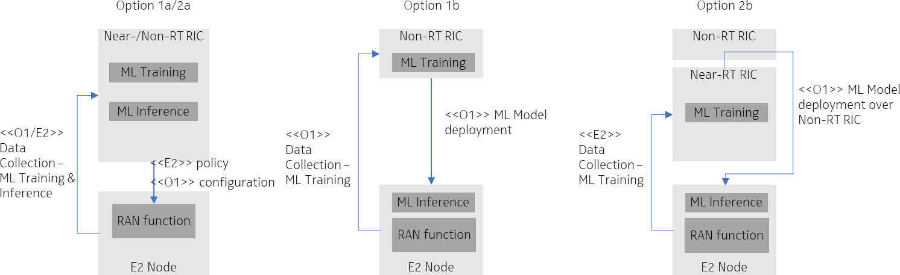retraining of an existing network specific ML model with cell specific data in the Near-RT RIC can also be envisioned.

10

* 1. Figure 3.4.2.3-1. Left: O-RAN deployment options 1a and 2a.
  2. **Middle, right: Deployment options 1b and 2b with ML inference in the RAN E2 Node.**

13

###### 3.4.2.3.1 Additional O-RAN Standardization Impact

1. WG2 (Non-RT RIC, A1, R1) Impact
2. ? O-RAN.WG2.AIML-v01.03
3. o Further specify deployment scenario 1.5, with training in the Non-RT RIC and inference in the E2 Node
4. (Option 2a).
5. o Specify a new deployment scenario with training (potentially for other than reinforcement ML tasks)
6. in the Near-RT RIC, ML Model management in the Non-RT RIC, and inference in the E2 Node (Option
7. 2b).
8. WG5 (O1) Impact / WG10 (SMO, O1) Impact
9. ? No impact identified
10. o Trained ML Model transfer from Near-RT RIC to SMO as part of the ML Model management (Option
11. 2b) - using file transfer.
12. o Trained ML Model deployment from SMO to O-CU as part of the ML Model management (Options 2a
13. and 2b) - using file transfer.

28

####  Discussion of Architecture Options

* 1. Comparing architecture deployment Options 1a, 2a with 1b, 2b:

|  |  |  |
| --- | --- | --- |
|  | **Option 1a, 2a** | **Option 1b, 2b** |
| **ML Training location** | Non-/Near- RT RIC | Non-/Near-RT RIC |
| **ML Inference location** | Non-/Near-RT RIC | E2 Node |
| **Suitable deployments** | Aggregated architecture or O-CUs controlling few DUs | Disaggregated architectures with O-CU controlling many O-DUs |
| **E2 capacity requirements** | high capacity & continuous (ML training & inference) | flexible capacity & temporary (only for ML training) |
| **E2 delay requirements** | delay critical | not delay critical (offline training) |
| **Control loop supported** | slower | faster possible |
| **Model complexity and optimization scope** | more complex models  (incl. wide area optimization across O-CUs) | more simple models (optimization within the O-CU) |

3 Table 3.4.2.4-1.

1. As can be seen from Table 3.4.2.4-1, the architecture options target different deployments with different requirements on
2. E2 capacity and may differ in terms of the optimization scope.
3. This means both architecture options are viable options for SSB Burst Set, DM-RS and CSI-RS configuration
4. optimization. The standard should not mandate the one or the other option, but it should be up to the vendor to make this
5. decision on a per product basis. This leaves room for enhancements over time and for operators to choose different
6. architectures for different deployment options. 10

### 3.4.3 Feasibility and Gain/Complexity Analysis

####  Feasibility and Gain Analysis

1. A. Near-RT RIC Deployment Architecture (SS Burst Set Configuration Optimization):
2. This section we present calculated peak SE gain trends with varying SS Burst Configurations, discusses suitability of
3. using AI/ML based optimization techniques for choosing deployment specific, slow time varying optimal SS Bust Set
4. configurations. Also, highlighted tradeoff between choosing lower SS Burst Set configuration and achievable SE gains
5. while meeting initial access latency KPI target set by the operator.
6. Goal of this discussion:
7. One aspect of presenting these results is to highlight the opportunity of significant SE gains when
8. optimal configuration is chosen and applied to the gNB/TRP. Another aspect is to highlight the
9. necessity of applying AI/ML based optimization techniques to these network performance optimization
10. problems.
11. AI/ML based optimization techniques are ideally suitable for 3GPP NR network optimization problems.
12. More and more automations are expected with growing network deployment and optimization
13. complexity. ML based intelligent agents are equipped to handle complex optimizations with trade-offs
14. between long-term and short-term benefits. AI/ML processes learns autonomously, without the human
15. intervention with domain expertise making them ideally suitable for time varying network function
16. optimizations.
17. What result is presented:
18. Impact of SS Burst Set configuration optimization on system overhead resulting in gNB Spectral
19. Efficiency gain and feasibility of using AI/ML techniques for such large parameter based constrained
20. optimization problem.
21. Presented results are peak spectral efficiency gain trends when different and allowable SS Burst Set
22. configurations (Number of SS Blocks in a SS Bust Set and SS Burst Set periodicity) are chosen.
23. Observed peak spectral efficiency (SE) gains are the result of system overhead reduction. Job of the
24. AI/ML optimizer is to infer an optimal SS Bust Set configuration based on the target deployment
25. scenario and slow time varying network usage patterns constrained to initial access latency target set
26. by the operator.
27. SE graphs are **per gNB Peak SE** results (ITU Document 5D/50-E 11 February 2020, 3GPP NR 38.336)
28. for varying SS block number and SS Burst periodicity in 3GPP NR FR1 and FR2 systems with realistic
29. parameters configurations ranges supported by 3GPP specifications for respective frequency bands.
30. One can observe from the presented results below that SE gain is maximum when lowest SS Burst Set
31. configuration is chosen for the system (within the configuration range supported by 3GPP). However,
32. this would lead to degraded Initial Access (IA) latency KPI. Thus, we need to opt for constrained
33. optimization techniques to avoid increase in IA latency beyond operator mentioned limit. Another
34. important aspect of the optimizer is to consider slow time varying network usage pattern and time
35. varying UE distribution patterns which can be inferred from the available measurements, observations,
36. PIs. Thus, the optimizer will provide slow time varying SS Burst Set configuration per gNB/TRP which
37. will result in system overhead reduction and hence can achieve optimal SE gain per gNB.
38. AI/ML based constrained optimization techniques are ideally suitable for large-scale (multi-gNB/TRP)
39. and multi-parameter constrained optimization problems and result in proactive and predictable solutions
40. for realistic NR network deployment scenarios. Traditionally one fixed configuration is decided for the
41. network by the skilled manpower and applied during deployment of the network hence results in
42. inefficient network design. 30
43. Tradeoff between SS Burst Set configuration optimization and SE improvement:
44. Directly selecting the lowest SS Burst Set configuration (without considering the network usage pattern)
45. to reduce reference signaling overhead will result in reduced SS Block density in both time and
46. frequency directions. This may result in (a) increased initial access latency, (b) reduced mobility support
47. (L3 mobility performance), (c) inferior time and frequency tracking performance, (d)potentially
48. clustered access to the network (impacting the L1/2 beam management (for GoB based MIMO
49. schemes), (d) reduced PBCH transmission frequency in SSB and hence impact timely availability of
50. the system information blocks.
51. Thus, the important role of an AI/ML optimization techniques is to constrain the SB Block optimization
52. to meet KPI targets set by the operator. Example KPI based constrains are operator defined IA latency
53. target and coverage, target mobility support by the network, beam management KPIs (tracking and
54. acquisition performances). Inferences generated by the AI/ML engine will be usage dependent slow
55. time varying configurations per gNB/TRP. Here optimization techniques should not exclude possibility
56. of joint optimizations example SSB and CSI-RS when required. 45

|  |  |  |
| --- | --- | --- |
| 1 | **Example Peak-SE Computation Scenario Descriptions:** |  |
| 2 | a) SE gain computational results are presented for three NR systems configurations: |
| 3 | 1. FR2: BW = 100MHz, SCS =120KHz |
| 4 | 2. BW = 90MHz FR1 (with 8 SS Block frequency domain multiplexing), |
| 5 | 3. BW = 90MHz FR1 (with 12 SS Block frequency domain multiplexing), |
| 6 | b) 1 gNB Peak SE computation |
| 7 | c) 1 UE SU-MIMO in one sector |
| 8 | d) Available DL antenna ports >= Max layers supported by 3GPP NR specs for target | system |
| 9 | configuration |  |
| 10 | e) Cell reference signal configurations are given in ITU Document 5D/50-E 11 February 2020 |  |
| 11 |  |  |
| 12 | **1. NR FR2 System Configuration (DL): SS Burst Set Configuration Optimization** |  |
| 13 | NR Numerology: FR2, |  |
| 14 | BW = 100MHz, SCS = 120KHz, |  |
| 15 | Maximum allocated number PRB = 66 |  |
| 16 | Maximum modulation order = 8 |  |
| 17 | {Minimum, Maximum} SS Block number per SS Burst Supported: {8, 64} |  |
| 18 | Maximum number of layers in DL: 6 (1 UE, SU-MIMO) |  |
| 19 | Max coding rate: 0.9258 |  |
| 20 | SSBurst Set config optimization goals: |  |
| 21 | * Reduce Number of SS Blocks/SS Burst Set through KPI optimization |  |
| 22 | * Reduce frequency of SS Burst Sending |  |

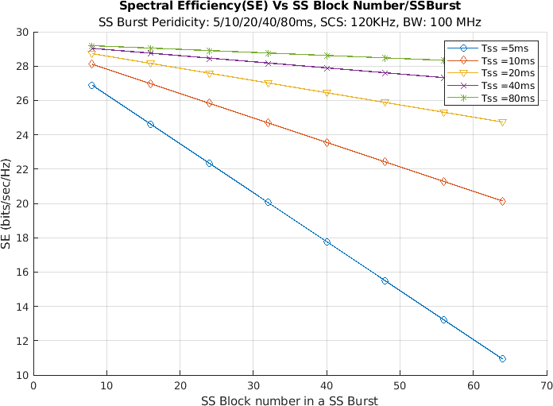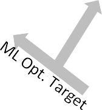

1

* 1. Figure 3.4.3.1-1. Computed SE variation plot with SS Block configuration change {SS Block number and SS
  2. **Burst Set periodicity}.**
  3. Achievable peak SE Improvement factor for the SSB resources saving ignoring potential performance
  4. degradation in this gNB is 200%.
  5. Results shows high SE improvement possibility in mmWave systems when optimal SS Block configuration is
  6. adopted in each gNB/TRP. Application of AI/ML will help in predictive and proactive inferences with reduced
  7. system overhead.
  8. 2. NR FR1 System Configuration (DL): SS Burst Set Configuration Optimization
  9. System Numerology: FR1
  10. BW = 90MHz, SCS = 30KHz,
  11. Maximum allocated number PRB = 245
  12. Maximum modulation order = 8
  13. {Minimum, Maximum} SS Block number per SS Burst Supported: {1,8}
  14. Maximum number of layers in DL: 8 (1 UE. SU-MIMO)
  15. Multi-SS Block capability: 8 per slot (not shown in the figure)
  16. Max coding rate: 0.9258
  17. SSB Config optimization goals:
  18. ? Reduce Number of SS Blocks/SS Burst Set by optimization
  19. ? Reduce frequency of SS Bust Sending

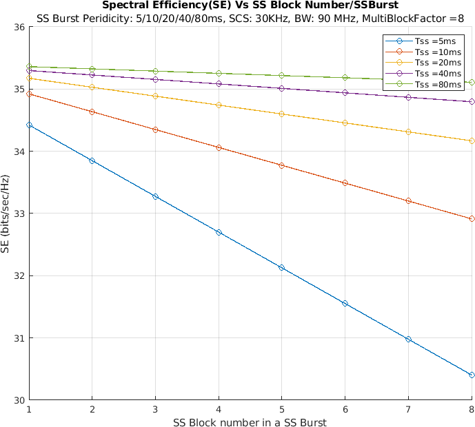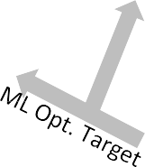

1

* + 1. Figure 3.4.3.1-2. Spectral efficiency variation over SS Block number and SS Burst Set periodicity configurations
    2. **plot for FR1 system with higher PRBs.**
    3. Achievable peak SE Improvement factor for the SSB resources saving ignoring potential performance
    4. degradation in this gNB is ~16.4%. Results shows noticeable SE improvement possibility in FR1 system when
    5. optimal SS Block configuration is adopted in each gNB/TRP. Application of AI/ML will help in predictive and
    6. proactive convergence.

8

1. 3. NR FR1 System Configuration (DL): SS Burst Set Configuration Optimization
2. System Numerology: FR1
3. BW = 90MHz, SCS = 30KHz,
4. Maximum allocated number PRB = 245
5. Maximum modulation order = 8
6. {Minimum, Maximum} SS Block number per SS Burst Supported: {1,8}
7. Maximum number of layers in DL: 8
8. Multi-SS Block capability: 12 per slot (not shown in the figure)
9. Max coding rate: 0.9258
10. SSB Config optimization goals:
11. ? Reduce Number of SS Blocks/SS Burst Set by optimization
12. ? Reduce frequency of SS Bust Sending

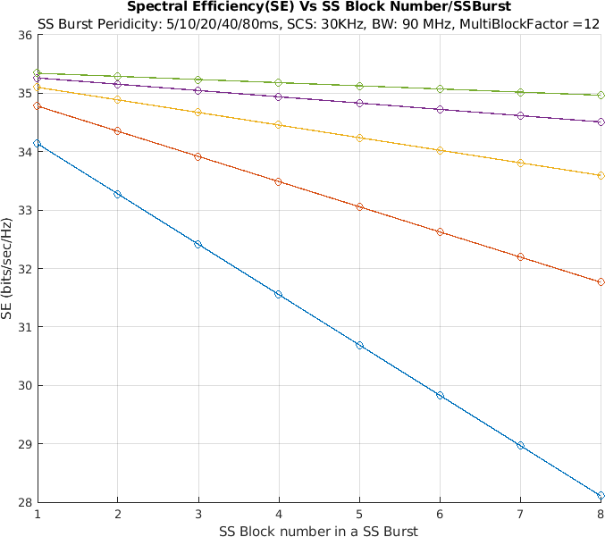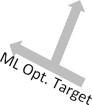

4

1. Figure 3.4.3.1-3. SE variation over SS Block number and SS Burst Set periodicity configuration for FR1 system
2. **with FDM in SSB transmission.**

7

1. SE plot shows significant gain (max 25.6%) can be achieved in FR1 systems having multi-SSB SSB transmission
2. even when large PRBs are used for data transmission. Note that in this scenario the number of SSB transmissions
3. in frequency domain multiplexing is increased to 12.
4. Achievable peak SE Improvement factor for the SSB resources saving ignoring potential performance
5. degradation in this gNB is ~25.6%. 13
6. B. Use Case Motivation for Near-RT RIC Deployment Architectures:
7. For Near-RT RIC based architecture/deployment scenario use-cases, goal is to optimize CSI-RS and DMRS transmission
8. configurations and CSI reporting configurations where applicable. Based on the observations, measurements and KPI
9. targets (training data) and using appropriate constrained optimization techniques, AI/ML model/agent will train the model
10. for Near-RT RIC deployment.
11. Deployed model can infer target usage specific optimal configurations for CSI-RS and DMRS which will minimize the
12. system overhead and hence will provide SE gains. AI/ML inferred configuration are not necessarily the lowest
13. configurations.
14. In line with SSB use-case scenario, to create motivation around Near-RT RIC deployment-based use cases, below we
15. have presented achievable peak Spectral Efficiency results for individual DMRS and CSI-RS transmission configuration
16. optimizations. Presented SE graphs are per gNB Peak SE results (ITU Document 5D/50-E 11 February 2020, 3GPP NR
17. 38.336) with varying (a) DMRS transmission configurations and (b) CSI-RS transmission configurations following 3GPP
18. NR (FR1 and FR2) standards with realistic system parameter configurations for respective frequency bands. It is also
19. important that both DMRS and CSI-RS optimization techniques can be jointly applied to the system for a target
20. deployment scenario and use cases to achieve improved SE performance. 8

##### 9 a) DMRS Configuration Optimization: Example System Configuration

|  |  |  |
| --- | --- | --- |
|  | **NR FR1** | **NR FR2** |
| BW & SCS | 90MHz, 30KHz | BW = 100MHz, SCS = 120KHz |
| Maximum PRB Number | 245 | 66 |
| Maximum Modulation Order | 8 | 8 |
| SS Block number per SS Burst | 8 | 64 |
| SS Burst Set Periodicity | 20ms | 20ms |
| SS Burst FDM | 1 | 1 |
| Maximum number of layers (DL) | 6 | 6 |
| Max coding rate | 0.9258 | 0.9258 |
| DMRS Type | Type-1, Single Symbol | Type-1, Single Symbol |
| DMRS Density (#RE/RB/Slot) | 6,12,18,24 | 6,12,18,24 |

1. Table 3.4.3.1-1. System configurations for FR1 and FR2 system to measure peak SE when DMIRS configuration
2. **is varied**

12

13

14

* 1. 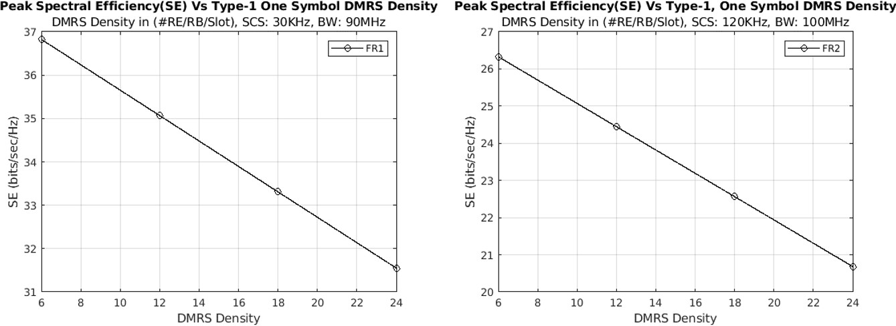Plots for peak SE for FR1 and FR2 System.

2

1. Figure 3.4.3.1-4. Peak SE variation over DMRS Density (#RE/RB/Slot) for Type 1, Single Symbol DMRS
2. **allocation for (a) FR1 and (b) FR2 systems with no FDM in SSB transmission.**

5

1. For both FR1 and FR2, peak SE plots from Figure 3.4.3.1-4 shows noticeable SE improvement can be achieved with the
2. system configurations indicated in Table 3.4.3.1-1. For FR1 max SE gain 16.7% and for FR2 max can be achieved is
3. approximately 27.3% assuming lowest DMRS configuration is used, resulting in resources saving ignoring potential
4. performance degradation in this gNB.
5. Directly configuring (without considering the network usage pattern) the lower configurations will degrade the channel
6. estimation performance and related other parameter estimations accuracies, impact achievable throughput for higher
7. mobility scenarios. Thus, one of the important jobs of the AI/ML engine is to take Operator's defined KPIs (parameter
8. estimation accuracy targets, mobility support etc. which are usage dependent parameters), constrain the optimization to
9. target KPIs from operator and infer suitable configurations. 15

##### b) CSI-RS Configuration Optimization: Example System Configuration

|  |  |  |
| --- | --- | --- |
|  | **NR FR1** | **NR FR2** |
| BW & SCS | 90MHz, 30KHz | BW = 100MHz, SCS = 120KHz |
| Maximum PRB Number | 245 | 66 |
| Maximum Modulation Order | 8 | 8 |
| SS Block number per SS Burst | 8 | 8 |
| SS Burst Set Periodicity | 5ms | 5ms |
| SS Burst FDM | 12 | 3 |
| Maximum number of layers (DL) | 6 | 6 |
| Max coding rate | 0.9258 | 0.9258 |
| DMRS Type | Type-1, Single Symbol | Type-1, Single Symbol |
| DMRS Density (#RE/RB/Slot) | 12 | 24 |
| CSI-RS Density (#RE/RB/Slot) | 32 | 8 |
| CSI-RS Tx in every kth Slot | 4 : 320 | 4 : 640 |

* 1. Table 3.4.3.1-2. System configurations for FR1 and FR2 system to measure peak SE when CSI-RS configuration
  2. **is varied**

4

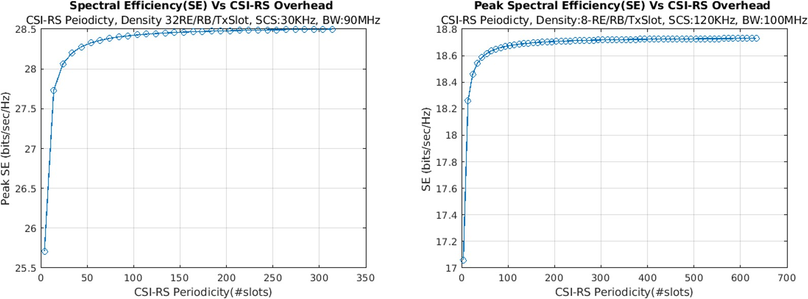5 Plots for peak SE for FR1 and FR2 System.

6

1. Figure 3.4.3.1-5. Peak SE variation over CSI-RS periodicity (#RE/RB/Slot) for (a) FR1 and (b) FR2 systems with
2. **FDM in SSB transmission.**

9

1. For both FR1 and FR2, peak SE plots from Figure 3.4.3.1-5 shows approximately 10% improvement can be achieved for
2. the system with configurations as shown in Table 3.4.3.1-2. For FR1 max SE gain 10.84% and for FR2 max can be
3. achieved is approximately 9.87% assuming lowest CSI-RS configuration is used which results in resources saving
4. ignoring potential performance degradation in this gNB. For FR2 system, for the above peak SE plot, system uses number
5. of SSB blocks as 8 and number of CSI-RS beams as 8 per SSB beam (joint SSB beam -CSI-RS beam acquisition).
6. Directly configuring (without considering the network usage pattern) lower CSI-RS acquisition/beam management
7. configurations may degrade the CSI feedback quality which has direct impact on the achievable throughput (FR1) or may
8. impact beam measurement performance (FR2). Thus, one of the important jobs of the AI/ML engine is to take Operator's
9. defined KPIs (CSI accuracy, beam acquisition KPIs) and constrain the optimization with the target KPIs and infer suitable
10. configuration.
11. 3GPP NR standard allows max 32 port CSI-RS transmission. It is important to note that SSB beam and CSI-RS
12. optimizations are closely related when SSB and CSI-RS are jointly used for beam measurement in NR FR2 systems. In
13. this case FR2 system will be limited by max 8 SS Blocks transmission per SS Burst and each SS beam will have 8 CSI-
14. RS for P2 based beam measurement which is uses as scenario for SE calculations in Figure 3.4.3.1-5. 13

####  Complexity

1. Complexity of AI/ML based optimization depends on the type of algorithm used for the optimization, size of the training
2. data set, feature list length. Computational power and memory availability of the model training and inference host will
3. also impact training and inference generation time. Typical learning algorithms have large model training time complexity
4. compared to inference generation.
5. One example is with logistics regression based supervised learning algorithms, training phase time complexity is
6. O(p2n + p3) and during prediction time complexity is O(p) where p is the number of features and n is the number
7. of training example.
8. Thus, offline training of the AI/ML model is desirable and recommended in all the sub sub-uses cases presented herein
9. (namely SS Burst Set, CSI-RS, and DMRS configuration optimization use cases).
10. Considering state of the art silicon technology availability in the network side we can assume that computation power (of
11. the training and inference host) has improved significantly over last decade following Moor's Law, through multicore
12. processor designs and parallel programming technology. Thus, large computation capacity at the model training and
13. inference host are available for these optimizations' problems to run. Including training, inferences can be generated at
14. rAPP (>=1sec) and Near-RT RIC (< 1sec) control loops efficiently with appropriate selection of training data sets size
15. and feature list for AI/ML algorithms.

30

# 1 4 L1 / L2 Beam Management

## 4.1 Overview

* 1. In 5G NR, mmWave communication using a large bandwidth is one of the key technologies to achieve high-data rate and
  2. capacity improvement. However, mmWave frequencies are suffered from high propagation loss including unexpected
  3. signal blockages in a mobile environment. To overcome these challenges, directional-beam transmission enabled by
  4. hybrid analogue-digital beamforming with large scale antenna array is typically applied at BS side at least. Under this
  5. hybrid beamforming architecture, achieving fine beam alignment between BS and UE beams becomes a prerequisite for
  6. successful data transmission and reception. A set of Layer 1 (i.e., physical layer) and Layer 2 (i.e., medium access control
  7. layer) procedures to acquire and maintain a set of BS and/or UE beams for DL and UL transmission/reception is referred
  8. to as L1/L2 beam management. In 3GPP, the beam management procedures that control the determination and
  9. maintenance of the serving beam(s) for each UE within a cell has been firstly specified in Release 15. The O-RAN
  10. architecture offer opportunities to improve beam management performance by utilizing Non-RT RIC and/or Near-RT
  11. RIC to assist E2 nodes to realize intelligent solution. 14

## 4.2 Solution 1: AI/ML-assisted Beam Selection Optimization

### 4.2.1 Problem Statement and Value Proposition

1. The L1/L2 beam management procedures that establish and maintain the highly directional transmission link between BS
2. and UE play an important role to enable high quality communications under mmWave frequencies. The current 3GPP 5G
3. NR standard support good flexibility of UE-specific configuration in terms of beam measurement, beam report and beam
4. indication. However, achieving accurate beam alignment between BS and UE is challenging and costly, and a trade-off
5. between network performance improvement and signaling overhead need to be solved. Without employing frequent beam
6. measurement and measurement report, connection between BS and UE may be easily interrupted due to UE movement
7. or blockage, in particular under high mobility scenarios. However, the number of required resources for frequent beam
8. measurement and measurement report will cause an overhead problem which may decrease the overall network
9. throughput. Without an intelligent solution, the network has to face an either-or situation, either high reliability with large
10. signaling overhead or small signaling overhead with poor reliability.
11. In recent years, application of AI/ML techniques in mobile communication networks has drawn a lot of interest. AI/ML
12. techniques can be also used as a powerful tool which enable RAN to make quicker and smarter decision in the beam
13. management related procedures, which will contribute to improved network performance in terms of throughput and
14. reliability. In particular, how to improve the performance of beam acquisition and tracking based on the existing 5G NR
15. standard should be considered. AI/ML-assisted solutions can be used to estimate the quality of SSB/CSI-RS beams based
16. on limited beam measurement and/or UE geolocation information, which allows fast beam acquisition and beam failure
17. recovery and ensures reliable radio link against blockage, especially in mmWave. AI/ML-assisted solutions can also be
18. used to predict a future beam(set), beam switching events or blockage events based on historical measurement reports
19. and/or UE geolocation information. Higher accuracy in beam tracking, lower signaling overhead and low latency in beam
20. switching are essential to guarantee service continuity for UEs. The L1/L2 beam management optimization is particularly
21. relevant for mmWave frequencies but may also be applicable for sub-6GHz frequencies.
22. Potential benefits of AI/ML assisted beam management will include signaling overhead reduction, latency reduction and
23. reliability improvement.

### 4.2.2 Architecture/Deployment Options

####  Option 1 - Non/Near-RT RIC based Beam Selection Optimization

1. To enable an intelligent beam management in the O-RAN architecture, interaction between SMO, Non-RT RIC, Near-
2. RT RIC and E2 nodes should be achieved. SMO needs to collect necessary KPIs, beam-related measurement from E2
3. nodes and enrichment information (e.g., UE geolocation information) from external application/server, if required, to
4. support AI/ML model training and performance monitoring which is hosted by Non-RT RIC. In this case, Non-RT RIC
5. can train the AI/ML model for beam management optimization based on beam-level measurements collected by UE
6. measurement report and/or drive test and decide whether to re-train/fine-tune the AI/ML model based on the performance
7. monitoring. Then the trained AI/ML model can be deployed to Near-RT RIC via O1 interface for beam management
8. related inference.
9. The AI/ML model training and inference to support beam management optimization can be done for different objectives,
10. such as, to reduce beam measurement overhead and to improve the connection reliability, depending on implementation
11. and operator's requirements. The beam management optimization for different objectives can follow the general process
12. as shown below.

15

1. @startuml
2. skinparam ParticipantPadding 4
3. skinparam BoxPadding 8
4. skinparam defaultFontSize 12

5

1. Box "Service Management and Orchestration" #gold
2. Participant CC as "Collection & Control"
3. Participant NON as "Non-RT RIC"
4. End box

10

1. Box "O-RAN" #lightpink
2. Participant NEAR as "Near-RT RIC"
3. Participant RAN as "E2 Nodes"
4. End box

15

1. Box "External" #lightcyan
2. Participant AS as "Application Server"
3. End box

19

1. group Data Collection
2. CC -> RAN : <<O1>>Request data collection for model training
3. RAN -> CC : <<O1>>Data collection
4. group Opt: Enrichment Information Collection (for training)
5. CC -> AS : Request enrichment information
6. AS -> CC : Enrichment information collection (UE position)
7. end
8. CC -> NON: Retrieval of collected data
9. end

29

1. group AI/ML Workflow
2. NON -> NON : AI/ML model training
3. NON -> NEAR : <<O1>>Deploy AI/ML model
4. end

34

1. group Opt:Enrichment Information Collection (for inference)
2. CC -> AS : Request enrichment information
3. AS -> CC : Enrichment information collection (UE position)
4. CC -> NON : Retrieval of collected data
5. NON -> NEAR : <<A1>>Enrichment information (UE position)
6. end

41

1. group E2 Control & Policy
2. NEAR -> RAN : <<E2>>Request data collection for model inference
3. RAN -> NEAR : <<E2>>Data collection
4. NEAR -> NEAR : AI/ML model inference
5. NEAR -> NEAR : E2 control or policy generation
6. NEAR -> RAN : <<E2>>Control or policy message
7. end

49

1. group Performance Evaluation and Optimization
2. CC -> RAN : <<O1>>Request data collection
3. RAN -> CC : <<O1>>Data collection
4. group Opt: Enrichment Information Collection (for training)
5. CC -> AS : Request enrichment information
6. AS -> CC : Enrichment information collection (UE position)
7. end
8. CC -> NON : Retrieval of collected data
9. NON -> NON : Performance monitoring and evaluation
10. NON -> NON : AI/ML model retraining and update
11. NON -> NEAR : <<O1>>Update AI/ML model

61

1. end
2. @enduml

64

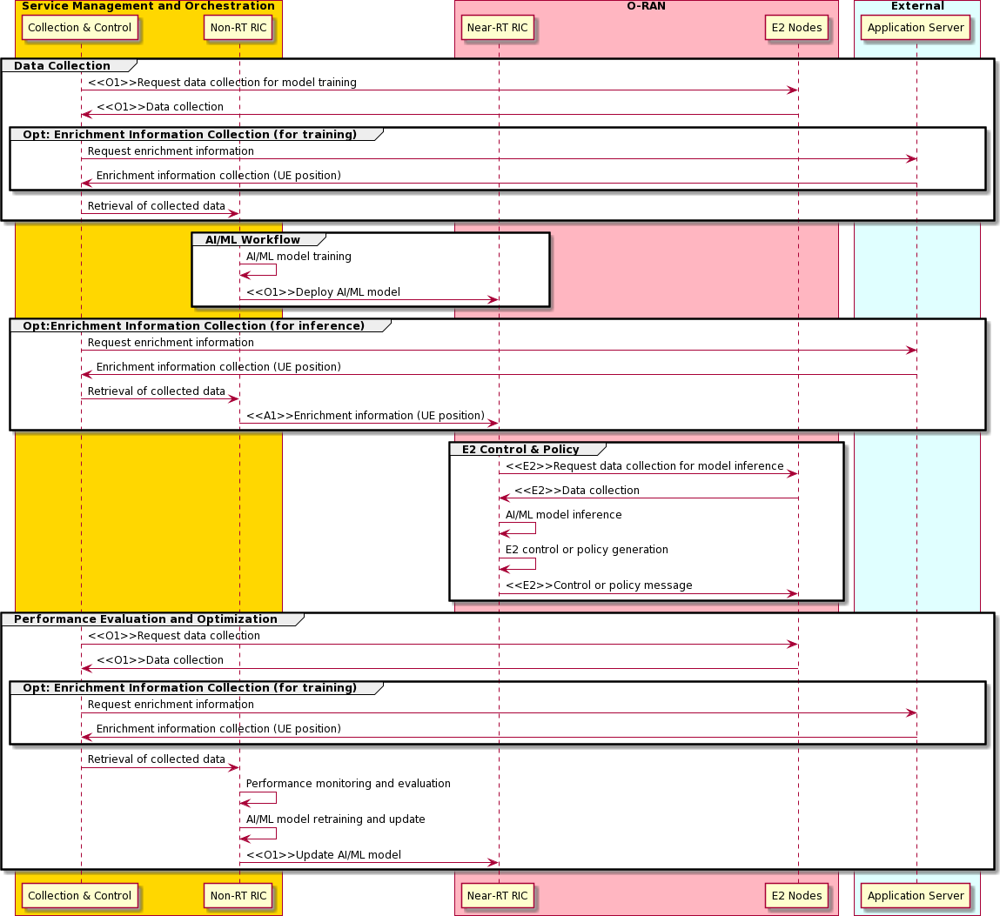1

* 1. Figure 4.2.2.1-1. Flow diagram for Non/Near-RT RIC based Beam Selection Optimization

3

1. An intelligent solution can be designed and implemented to optimize the beam selection for different objectives. For
2. example, to guarantee the service continuity and eliminate the need for frequent beam measurement, especially for high-
3. mobility UE, the xApp deployed in Near-RT RIC can performs AI/ML model inference to support predictive beam
4. switching. Specifically, the AI/ML model could be utilized to predict the changing trend of beams quality in future, which
5. can help BS to perform proactive beam switching or determine a "high-probability" candidate beam set for further
6. measurement. The process to support this example could be as follows,
7. ? The E2 Node (O-DU) receives the following information from the UE
8. o Periodic beam measurements (including L1-RSRP with corresponding CRI or SSBRI) which provide
9. indication of the UE's best beam
10. ? Data regarding beam switch events for UEs which provides predictive intelligence on future
11. beam switching events
12. o Beam failure indications
    1. ? Data regarding beam failure events which provides intelligence on beam-switching events to
    2. potentially be avoided
    3. ? E2 Node provides consolidated measurements and data to the Near-RT-RIC and the Non-RT-RIC (through
    4. SMO)
    5. ? Non-RT-RIC obtains other enrichment information (such as UE position and velocity) from an application server
    6. ? AI/ML model in Non-RT-RIC is trained based on measurement and enrichment data from (potentially) many E2
    7. Nodes
    8. ? Non-RT-RIC provides AI/ML model update to Near-RT-RIC
    9. ? Using the AI/ML model, the Near-RT-RIC provides control information to the E2 Node, specific to a particular
    10. UE, based on the UE's historical beam measurement reports, as well as other possible enrichment information.
    11. The control information could include
    12. o New serving beam for UE, or a sequence of future serving beams each with time offsets
    13. o Updated beam measurement set for UE 14

###### Requirements

1. Measurements/reports from E2 Nodes (for AI/ML model training and performance evaluation):

|  |  |  |  |  |  |
| --- | --- | --- | --- | --- | --- |
| **Input Data** | | | | | |
| **Interface** | **Source -> Target** | **Name/Description** | **Units** | **Reporting Period** | **New or existing measurement/repo rting specification** |
| O1 (via | O-DU -> | L1-RSRP measurement at UE- | dBm | ~x hours/days per cell  (for training) | Existing definition: |
| SMO) | Non-RT RIC | level (in the form of sequence) |  | 3GPP TS 38.214  (Sec. 5.2.1.4.3) |
|  |  |  |  | 3GPP TS 38.215 |
|  |  |  |  | (Sec. 5.1.1 and |
|  |  |  |  | 5.1.2) |
|  |  |  |  | New reporting |
| O1 (via | O-DU -> | L1-SINR measurement at UE- | dB | ~x hours/days per cell  (for training) | Existing definition: |
| SMO) | Non-RT RIC | level (in the form of sequence) |  | 3GPP TS 38.214  (Sec. 5.2.1.4.4) |
|  |  |  |  | 3GPP TS 38.215 |
|  |  |  |  | (Sec. 5.1.5 and |
|  |  |  |  | 5.1.6) |
|  |  |  |  | New reporting |
| O1 (via SMO) | O-DU ->  Non-RT RIC | CSI-RS Resource Indicator (CRI) and SS/PBCH Block Resource  Indicator (SSBRI) at UE-level (in | Index | ~x hours/days per cell  (for training) | Existing definition: 3GPP TS 38.214  (Sec. 5.2.1) |
|  |  | the form of sequence) |  | New reporting |
| O1 (via SMO) | O-DU -> Non-RT RIC | Average DL UE throughput in gNB | Kb/s | ~x hours/days per cell  (for | Existing definition and reporting:  3GPP TS 28.552  (Sec. 5.1.1.3.1) |
|  |  |  |  | performance |  |
|  |  |  |  | evaluation) |  |
| O1 (via | O-DU -> | Wideband CQI distribution | Integer | ~x hours/days | Existing definition |
| SMO) | Non-RT RIC |  |  | per cell | and reporting:  3GPP TS 28.552 |
|  |  |  |  |  | (Sec. 5.1.1.11.1) |

|  |  |  |  |  |  |
| --- | --- | --- | --- | --- | --- |
|  |  |  |  | (for performance evaluation) |  |
| O1 (via SMO) | O-DU -> Non-RT RIC | MCS distribution in PDSCH | Integer | ~x hours/days per cell  (for | Existing definition and reporting:  3GPP TS 28.552  (Sec. 5.1.1.12.1) |
|  |  |  |  | performance |  |
|  |  |  |  | evaluation) |  |
| O1 (via SMO) | O-DU ->  Non-RT RIC | Optional: Beam failure statistics per cell or per beam | Count/ percent | ~x hours/days per cell | New definition and reporting |
|  |  |  |  | (for |  |
|  |  |  |  | performance |  |
|  |  |  |  | evaluation) |  |

1 Table 4.2.2.1-1.

2

* 1. Measurements/reports from E2 Nodes (for AI/ML model inference):

|  |  |  |  |  |  |
| --- | --- | --- | --- | --- | --- |
| **Input Data** | | | | | |
| **Interface** | **Source -> Target** | **Name/Description** | **Units** | **Reporting Period** | **New or existing measurement/repo rting specification** |
| E2 | O-DU -> Near-RT RIC | L1-RSRP measurement per UE | dBm | ~per N x 100ms | Existing definition: 3GPP TS 38.214  (Sec. 5.2.1.4.3)  3GPP TS 38.215  (Sec. 5.1.1 and  5.1.2)  New reporting |
| E2 | O-DU -> Near-RT RIC | L1-SINR measurement per UE | dB | ~per N x 100ms | Existing definition: 3GPP TS 38.214  (Sec. 5.2.1.4.4)  3GPP TS 38.215  (Sec. 5.1.5 and  5.1.6)  New reporting |
| E2 | O-DU -> Near-RT RIC | CSI-RS Resource Indicator (CRI) and SS/PBCH Block Resource Indicator (SSBRI) per UE | Index | ~per N x 100ms | Existing definition: 3GPP TS 38.214  (Sec. 5.2.1)  New reporting |

4

1. Enrichment information from application server
2. 1. UE position
3. 2. UE velocity

Table 4.2.2.1-2.

1. The time granularity of these data collections should be configurable and satisfy the requirements of the AI/ML model
2. Output Signalling towards E2 Nodes:

|  |  |  |  |  |  |
| --- | --- | --- | --- | --- | --- |
| **Output Data** | | | | | |
| **Interface** | **Source -> Target** | **Name/Description** | **Units** | **Reporting Period** | **New or existing configuration specification** |
| E2 | Near-RT RIC  ->  O-CU/DU | Control/policy related to beam management operations (examples shown as below, details would be FFS)   * Beam measurement/reporting: updated beam measurement set, reporting type and period * Beam indication: indicate serving beam for UE * Beam failure recovery: identify the candidates beams for beam failure recovery | - | ~per N x 100ms | Existing configuration: 3GPP TS 38.331  (Sec. 6.3.2)  Related IE (FFS): CSI-MeasConfig CSI-Report Config PDSCH-Config  BeamFaliureRecovery Config  3GPP TS 38.321  (Sec. 6.1.3.14 and  6.1.3.15) |

2

3

* 1. ORAN Entity roles:
  2. 1) SMO

Table 4.2.2.1-3.

* 1. a) Collect necessary KPIs, measurement reports and enrichment information (e.g., UE position) from E2 nodes
  2. and application server.
  3. b) Send collected data to Non-RT RIC for AI/ML model training and performance monitoring.
  4. 2) Non-RT RIC
  5. a) Retrieve necessary KPIs, measurement reports and enrichment information (e.g., UE position) from SMO for
  6. purpose of constructing/training relevant AI/ML models and performance monitoring.
  7. b) Monitor performance of the AI/ML models based on the KPIs retrieved from SMO and decide whether to re-
  8. train/finetune and update the AI/ML models or not.
  9. c) Train the relevant AI/ML models using the retrieved data.
  10. d) Support deployment and update of the AI/ML models into Near-RT RIC over O1 interface.
  11. e) Support communication of policies and enrichment information to Near-RT RIC over A1 interface.
  12. 3) Near-RT RIC
  13. a) Support deployment, update and execution of the AI/ML models from Non-RT RIC.
  14. b) Support interpretation and execution of the policies from Non-RT RIC.
  15. c) Collect necessary measurement reports from E2 nodes for the purpose of AI/ML model inference over E2
  16. interface.
  17. d) Retrieve enrichment information from Non-NT RIC over A1 interface.
  18. e) Send control or policy message for beam management operation to E2 nodes.
  19. 4) E2 nodes
  20. a) Support data collection with required granularity to SMO and Near-RT RIC over O1 and E2 interface.
  21. b) Apply L1/L2 beam management parameter configuration based on the control or policy message received from
  22. Near-RT RIC.

28

####  Option 2 - E2 Node (O-DU) based Beam Selection Optimization

* + 1. L1/2 beam management includes a large number of very fast real time functions closely related to the uplink and downlink
    2. scheduling in the baseband. The NR L2 scheduling working operates at Transmission Time Interval even lower than 1ms
    3. depending on the numerology. It is one of the most demanding and time critical function of the base station that, depending
    4. on the bandwidth, will have to handle transmission of multiple GBytes of data traffic. Examples of L1/L2 beam
    5. management use cases are beam sweeping, beam measurements, beam reporting, beam acquisition, beam pairing, beam
    6. refinement, beam switching, beam indication, beam recovery. Some beam management features may require operating in
    7. a faster loop timing than what the E2 loop between Near-RT RIC and E2 Node (e.g, O-DU) allows. Still, AI/ML assisted
    8. techniques could achieve substantial gains with acceptable computational costs. In some cases, the ML model might carry
    9. intelligence with a local scope, i.e., it adapted to patterns of a single cell on which it was trained.
    10. Therefore, in another deployment option, the operator can leverage on the data collection capabilities of the E2 interface
    11. (for ML training) plus the computational capacity (AI/ML framework) of the RIC(s) for ML training, but perform the ML
    12. inference in the E2 Node, e.g., in the O-DU (Figure 4.2.2.2-1. middle). ML Deployment Scenario 1.5 (Technical Report
    13. O-RAN.WG2.AIML-v01.03) supports training in the Non-RT RIC and inference in the E2 Node. Training in the Near-
    14. RT RIC and inference in the E2 Node is a new deployment scenario still to be added to respective specifications (Figure
    15. 3.4.2.3-1. right). Related impact on O-RAN WGs is analyzed in sections [FFS]. 3GPP RAN WGs will start working on
    16. gNB hosted AI/ML algorithms in 3GPP Rel.18. More details are provided in [FFS: 3GPP TR 37.817]. This O-RAN
    17. architecture option introduced in this section will complement the 3GPP AI/ML approach (i.e. model hosted in E2 Node)
    18. 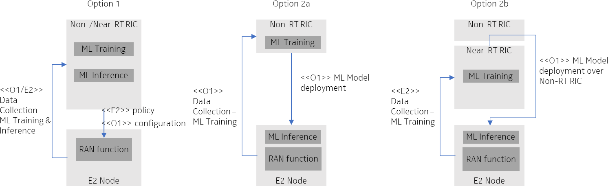with RIC based training capabilities and the ability to deploy a trained ML model in the E2 node. 20

21

1. **Figure 4.2.2.2-1. Left: O-RAN deployment Option 1 with both training and inference in the Near-RT RIC.**
2. **Middle and right: Deployment Options 2a and 2b with ML inference in the RAN node (O-DU) for faster control**
3. **loop.**

25

###### 4.2.2.2.1 Additional O-RAN Standardization Impact

1. WG2 (Non-RT RIC, A1, R1) Impact
2. ? O-RAN.WG2.AIML-v01.03
3. o Further specify deployment scenario 1.5, with training in the Non-RT RIC and inference in the E2 Node
4. (Option 2a).
5. o Specify a new deployment scenario with training (potentially for other than reinforcement ML tasks)
6. in the Near-RT RIC, ML Model management in the Non-RT RIC, and inference in the E2 Node (Option
7. 2b).

34

* 1. WG5 (O1) Impact / WG10 (SMO, O1) Impact
  2. ? No impact identified.
  3. o Trained ML Model transfer from Near-RT RIC to SMO as part of the ML Model management (Option
  4. 2b) - using file transfer.
  5. o Trained ML Model deployment from SMO to O-DU as part of the ML Model management (Options
  6. 2a and 2b) - using file transfer. 7

####  Discussion of Architecture Options

1. Comparing architecture deployment options 1 and 2:

|  |  |  |
| --- | --- | --- |
|  | **Option 1** | **Option 2** |
| **ML Training location** | Non-/Near- RT RIC | Non-/Near-RT RIC |
| **ML Inference location** | Near-RT RIC | E2 Node |
| **E2 capacity requirements** | high capacity & continuous (ML training & inference) | flexible capacity & temporary (only for ML training) |
| **E2 delay requirements** | delay critical | not delay critical (offline training) |
| **Processing capabilities** | higher capacity possible | capacity limited |
| **Control loop supported** | slower | faster |
| **Scheduler integration of fast algorithms** | difficult | easier |
| **Model complexity and optimization scope** | more complex models  (incl. multi-cell optimization) | more simple models  (mostly single cell optimization) |

10 Table 4.2.2.3-1.

1. As can be seen from Table 4.2.2.3-1, the two architecture deployment options target different use cases, have different
2. strengths and weaknesses. Requirements on gNB processing and on E2 delay and capacity are quite different. The same
3. problem might be addressed with a single cell optimization or a multi-cell optimization, with a more or less complex ML
4. model.
5. While the realization of L1/2 beam management algorithms might sometimes be limited to one of the options (e.g. due to
6. delay or interface constrains), some algorithms might also possibly be realized with both options. Considering that L1/2
7. beam management techniques are very fast algorithms tightly integrated in the L2 scheduler design, it will be the vendor
8. that evaluates the gain versus the complexity. While a small cell may have very limited processing and backhaul
9. capabilities, a macro base station site might have such capability. This means both architecture options are viable options
10. for L1/2 beam management algorithms and may even co-exist. The standard should not mandate the one or the other
11. option, but it should be up to the vendor to make this decision. This leaves room for enhancements over time and for
12. operators to choose different deployment options. 23

### 4.2.3 Impact Analysis on O-RAN Working Groups

1. *Editor's note: This is an initial impact analysis as part of the WG1 UCTG work on mMIMO. The intention is to estimate*
2. *the expected standardization effort within the O-RAN working groups. It is up to the WGs to decide how the mMIMO*
3. *functionality should be specified in specifications of each WG.*
4. WG1 (use cases, architecture) Impact
5. ? O-RAN.WG1.Use-Cases-Analysis-Report
6. o Update use case 6: Massive MIMO Beamforming Optimization (Section 3.6)
7. ? O-RAN.WG1.Use-Cases-Detailed-Specification
8. o Update use case 6: Massive MIMO Beamforming Optimization (Section 3.6)
9. WG2 (Non-RT RIC, A1) Impact
10. ? O-RAN.WG2.Use-Case-Requirements
11. o If seen as beneficial, add new use case 6: Massive MIMO Beamforming Optimization based on
12. agreements from pre-normative phase
13. ? O-RAN.WG2.A1TD
14. o Support exchange of relevant Enrichment Information from Non-RT to Near-RT RIC
15. WG3 (Near-RT RIC, E2) Impact
16. ? O-RAN.WG3.UCR
17. o If seen as beneficial, add new use case 6: Massive MIMO Beamforming Optimization based on
18. agreements from pre-normative phase
19. ? O-RAN.WG3.E2SM-KPM
20. o For cell-level measurements that are specified in 3GPP (i.e. 3GPP TS 28.552), there would be minor or
21. no direct specification impact. The optional new beam failure statistics might be specified in 3GPP or
22. in O-RAN (FFS).
23. o For UE-level L1/L2 measurements
24. ? Option 1: If UE-level L1/L2 measurement reporting is added to the 3GPP specification (e.g.
25. 3GPP TS37.320), E2 could refer to 3GPP specification and there will be minor or no direct
26. specification impact.
27. ? Option 2: If UE-level L1/L2 measurement reporting is not added to the 3GPP specifications,
28. O-RAN specific reporting need to be added. Given that measurement definitions already exist
29. in 3GPP, the impact will be minor (noting that E2SM-KPM has already extended the
30. definitions of measurement counters in TS 28.552 to be able to be retrieved per UE level from
31. RAN node).
32. ? O-RAN.WG3.E2SM-RC or creation of new E2SM
33. o Add new control/policy related to beam management operation
34. WG5 (O1) Impact
35. ? O-RAN.WG5.MP
36. o For cell-level measurements that are specified in 3GPP (i.e. 3GPP TS 28.552), there would be minor or
37. no direct specification impact. The optional new beam failure statistics might be specified in 3GPP or
38. in O-RAN (FFS).
39. o For UE-level L1/L2 measurements
40. ? Option 1: If UE-level L1/L2 measurement reporting is added to the 3GPP specification (e.g.
41. 3GPP TS37.320), O1 could refer to 3GPP specification and there will be minor or no direct
42. specification impact.
43. ? Option 2: If UE-level L1/L2 measurement reporting is not added to or re-used from the 3GPP
44. specifications, O-RAN would add reporting of these as an extension of O1. Given that
45. measurement definitions already exist in 3GPP, the impact will be moderate,
46. Summary: The overall impact on O-RAN specifications is limited, since all the measurement definitions are already
47. defined in 3GPP. There is a new cell level measurement beam failure statistic suggested that is optional. The detailed
48. impact might further depend on if required enhancements of measurement reporting (especially UE-level L1/L2
49. measurements) will be specified in 3GPP or O-RAN specifications. There might be some common parts on specification
50. impact among different sub-features, which may further reduce the overall workload in the normative phase. 4

### 4.2.4 Relation and Impact on 3GPP Specification

1. In 3GPP, the beam management procedures that control the determination and maintenance of the serving beam(s) for
2. each UE within a cell has been firstly specified in Release 15 and further enhanced in Release 16 and 17. The existing
3. 3GPP standard already support good flexibility of UE-specific configuration in terms of beam measurement/reporting,
4. beam indication and beam failure recovery with regard to fundamental beam-based transmission/reception. To support
5. the L1/L2 beam management optimization in O-RAN would mainly rely on the existing 3GPP standards, and the detailed
6. impact is listed as below,
7. Data collection:
8. ? Cell-level measurements: The definition and reporting of essential measurements is already existing in 3GPP
9. specification (3GPP TS 28.552). Whether and how to support the new measurements which is not essential
10. could be FFS.
11. ? UE-level L1/L2 measurements: The measurements definition is already existing in 3GPP specifications, and the
12. measurements reporting might be added to the existing 3GPP MDT framework (3GPP TS 37.320) or might be
13. added in a new AI/ML Data Collection framework currently discussed in 3GPP. Whether rely on 3GPP or
14. introduce O-RAN specific reporting could be FFS.
15. Configuration/Control:
16. ? The control will rely on the existing control signaling (3GPP TS 38.331/38.321) 22

### 4.2.5 Feasibility and Gain/Complexity Analysis

1. In mmWave bands, supporting good reliability of connectivity for high mobility UE is challenging. The network needs
2. to rely on frequent beam measurement to track the rapid change of wireless channel, which will require significant
3. signaling overhead. However, UEs with high mobility move along relatively fixed trajectory in many cases. For example,
4. a vehicle traveling at high speed mostly will not suddenly change its driving direction. Therefore, although the optimal
5. beam changes rapidly under the UE's high-speed movement, the trend of change is predictable. The xApp deployed in
6. Near-RT RIC can be used to perform AI/ML model inference to predict the changing trend of beams quality in future,
7. which can help BS to reduce the frequency of beam measurements and/or reduce the number of measured beams. 31

####  Simulation Results

1. The following part of this section presents the simulation results which show the benefits of beam prediction under an
2. urban street scenario (depicted in Figure 4.2.5.1-1). Within the simulation, vehicular UEs moving along the urban street
3. which is served by one BS, and the BS periodically sends reference signals on all the candidate beams to UE for beam
4. measurement. In the case of the conventional beam switching solution, which is reactive, the BS will configure serving
5. beam for UE according to the most recent beam measurement result. In the case of the AI/ML-based beam solution, which
6. is proactive, the optimal serving beams (i.e., beams sequence with time offset) before the next time of beam measurement
7. can be predicted accurately in advance based on the historical beam measurement report, so that the BS can configure
8. serving beams for UE by following this prediction. The simulation assumptions and results are shown in Table 4.2.5.1-1
9. and Figure 4.2.5.1-2 respectively.

1

1. Figure 4.2.5.1-1. Vehicular UEs moving along the urban street in both directions

3

4

|  |  |
| --- | --- |
| **Parameter** | **Value** |
| **Frequency band** | 28 GHz |
| **Bandwidth** | 100 MHz |
| **BS Trans. power** | 33 dBm |
| **BS height** | 6 m |
| **BS antenna configuration (M x N)** | 8 x 16 antennas |
| **Beam set configuration** | 64 beams uniformly distribute in horizontal with 5 degrees down tilt |
| **Beam measurement period** | 50/500/1000 ms |
| **Beam measurement report** | Best beam index with L1-RSRP |
| **UE velocity** | 60km/h |
| **Mobility model** | UEs moving along the urban street in both directions (moving trajectory is randomly generated with different starting/end point) |
| **Channel model** | Generated by ray-tracing based simulator |

5 Table 4.2.5.1-1. Simulation assumptions

6

7

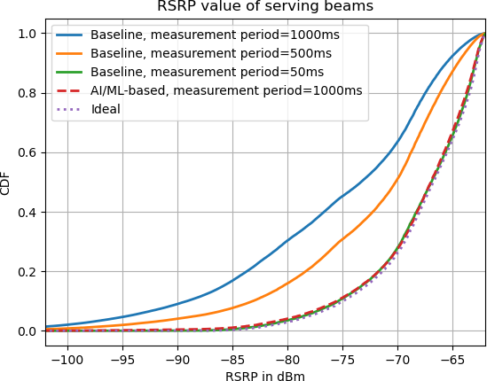1

2 Figure 4.2.5.1-2. CDF of serving beams RSRP

3

1. The simulation result in Figure 4.2.5.1-2 shows the CDF curves of serving beams' RSRP for the different beam
2. measurement periods. It can be seen that the conventional beam switching solution (indicated by "Baseline") heavily rely
3. on the frequent beam measurement reports and the quality of selected beams are severely degraded according to the
4. increase of measurement period. On the other hand, the AI/ML-based beam switching solution can predict the optimal
5. beam with high accuracy only based on the historical beam measurement reports. By comparing the performance of these
6. two solutions, it shows that the AI/ML-based solution can achieve near-optimal beam tracking performance under the
7. condition of beam measurement period of 1000 ms, while the conventional solution requires the beam measurement
8. period of 50 ms. The signaling overhead of beam measurement in the AI/ML-based solution is reduced by as much as
9. 95% compared to the conventional solution.
10. It is worth noting that the performance of simulated AI/ML-based solution do not sensitive to the latency introduced by
11. E2 interface and/or E2-nodes/RIC processing time because the solution does not rely on very fast control loop.

15

# 1 5 Non-GoB Beamforming

## 5.1 Overview

1. Non-GoB Beamforming, unlike GoB beamforming, does not rely on predefined beam sets, instead beam weights are
2. determined in real-time at the BS in response to channel measurements, offering the potential for optimum beam patterns
3. to be determined. For downlink, this approach relies on reciprocity in the channel and is therefore primarily aimed at
4. TDD systems. How well the system performs in practice depends on several factors including choice of beamforming
5. algorithm, the channel conditions between BS and UE and the configuration of reference signals. The O-RAN architecture
6. offer opportunities to improve the beamforming performance by utilizing both Non-RT RIC and Near-RT RIC to support
7. intelligent optimization of the Non-GoB beamforming configuration. 10

## 5.2 Solution 1: AI/ML-assisted non-GoB Optimization

### 5.2.1 Problem Statement and Value Proposition

1. Non- Grid of Beams (non-GoB) beamforming approaches are an important class of beamforming algorithms for 5G
2. mMIMO deployments, especially for fully digital, but also potentially for hybrid analog/digital, implementations in sub-
3. 6GHz frequency bands. Typically Sounding Reference Symbol (SRS) based approaches are used, which rely on
4. uplink/downlink correspondence, where uplink and downlink beam weights are computed "on the fly" in the O-DU / gNB
5. based on channel measurements made using SRS, rather than selecting from a set of predefined beams. The calculated
6. weights are transferred from O-DU / gNB to the O-RU using existing fronthaul mechanisms. SRS based beamforming is
7. particularly attractive for massive MIMO arrays because accurate channel state information can be obtained at the gNB
8. with potentially less overhead in the DL or UL channels. gNB uplink SRS measurements generally have no quantization
9. loss associated with reduction of over the air signaling and are faster availability for downlink adaptation since
10. measurement is done in gNB. On the other hand, SRS measurements might not always be recently available (due to SRS
11. periodicity and/or limited bandwidth), or reliable, especially towards cell edge since the UE transmit power in the uplink
12. is limited.
13. It should be noted that non-GoB algorithms are not standardized, instead these are vendor-specific proprietary algorithms.
14. In addition, multiple algorithm modes or options may be implemented, where some modes may be more suited to
15. particular conditions of the wireless channel, UE location/mobility, interference conditions, or to particular 3GPP
16. configuration options such as SRS periodicity. Examples of beamforming modes include but are not limited to: the use
17. of different SRS channel estimation algorithms; different weight calculation approaches (for example matched filter,
18. Eigen, Zero-forcing beamforming); and different time or frequency granularity.
19. Non-GoB beamforming may be applicable to multiple MIMO modes (SIMO, SU-MIMO or MU-MIMO) on the downlink
20. or uplink data channels (PDSCH/PUSCH). GoB beamforming will be used for other channels and may also be used for
21. data channels in some cases where, for example, SRS measurement quality is poor.
22. The problem statement is therefore how a 3rd-party xApp may provide intelligent control over multiple supported non-
23. GoB beamforming modes in order to recommend a preferred mode to a gNB / O-DU as a function of channel conditions,
24. UE location, interference conditions, etc.

37

### 5.2.2 Architecture/Deployment Options

####  Option 1

1. It is assumed in this description that SMO/Non-RT RIC is responsible for obtaining beamforming configuration
2. information from the gNB / O-DU, and for model training, and model deployment of the xApp to the near-RT RIC. The
3. near-RT RIC performs model inference and provides control messages to the gNB / O-DU. AI/ML-enabled control of
4. non-GoB beamforming configuration options is performed in the xApp to optimize a measure of performance (for
5. example UE throughput), given UE/cell conditions. It should be noted that the low-latency beamforming weight
6. calculation loop still resides in DU. xApp sits outside/above this loop and recommends configuration on a slower basis
7. than the weight calculation loop. 10
8. Referring to Figure 5.2.2.1-1, non-RT RIC first requests a report of supported beamforming configurations in the O-DU
9. (referred to as "non-GoB mMIMO Config" in the diagram), and O-DU provides the requested report for the supported
10. modes. This is done using the O1 interface, via SMO "Collection & Control" function, since non-RT does not terminate
11. O1.

15

1. The reported information could be as simple as the number of modes supported (=N). The modes are defined by the gNB
2. / O-DU vendor. Optionally, there could be additional information provided, such as the circumstances in which use of
3. each of the N modes is considered (by the gNB / O-DU) to be suitable (for example low or high mobility, low, medium
4. or high SNR on (for example) SRS), which is illustrated in Table 5.2.2.1-1. 20

|  |  |  |  |
| --- | --- | --- | --- |
| **Mode ID** | **UL or DL** | **SNR range**  **(low/med/high)** | **UE Mobility**  **(stationary/low/high)** |
| 0 |  |  |  |
| 1 |  |  |  |
| 2 |  |  |  |
| : |  |  |  |
| N-1 |  |  |  |

21 Table 5.2.2.1-1.

1. GoB-based approaches could be included as supported modes, thus enabling switch between non-GoB and GoB operation
2. where conditions favor GoB (for example at cell-edge). 24
3. Next, the Data Collection phase is entered, where non-RT RIC requests data collection from O-DU, again using O1 via
4. the "Collection and Control" function. The O-DU responds with measurements over O1, such as SINR, the measurements
5. being associated with each of the N beamforming modes (labelled "associated non-GoB mMIMO config" in the diagram).
6. Specific measurements defined in 3GPP 28.522 may be re-used, for example, for downlink operation: Average DL UE
7. throughput in gNB; Wideband CQI distribution; RSRQ measurement; RSRP measurement; SINR measurement.
8. Information related to 3GPP configuration, such as SRS periodicity, is also reported. 31
9. During the data collection phase, enrichment data, such as information related to UE location and mobility, may also be
10. collected from an Application Server. The non-RT RIC associates enrichment data with the corresponding O-DU
11. measurements, such that both are available for each UE. 35
12. In the next step, the non-RT RIC trains AI/ML model(s) which will be used to predict relative performance between the
13. N modes (or simply to predict the best mode) and deploys the trained models in xApp to near-RT RIC (over O1 or O2 -
14. to be determined by O-RAN). 39
15. Finally, models may be re-trained and re-deployed based on updated measurements sent between O-DU and non-RT RIC
16. (via the "Collection and Control" entity) and on updated enrichment information. 42

43

1. @startuml
2. skinparam ParticipantPadding 5
3. skinparam BoxPadding 10
4. skinparam defaultFontSize 12

5

1. Box "Service Management and Orchestration" #gold
2. Participant "Collection & Control" as smo
3. Participant "Non-RT RIC" as non
4. End box

10

1. Box "O-RAN" #lightpink
2. Participant near as "Near-RT RIC"
3. Participant ran as "O-DU"
4. End box

15

1. Box "External" #lightcyan
2. Participant "Application Server" as app
3. End box

19

1. group Non-GoB mMIMO Configuration Report
2. non --> smo : Request non-GoB mMIMO Config
3. smo --> ran : <<O1>> Request non-GoB mMIMO Config
4. ran --> smo : <<O1>> Report non-GoB mMIMO Config
5. smo --> non : Report non-GoB mMIMO Config
6. end

26

1. group Data Collection
2. non --> smo : Request Training Data Collection
3. smo --> ran : Non-GoB mMIMO Training Measurement Configuration
4. ran --> smo : <<O1>> Data collection (measurements with associated non-GoB mMIMO config)
5. app --> smo : Enrichment data collection (location/mobility)
6. smo --> non : Retrieval of collected data
7. end

|  |  |  |
| --- | --- | --- |
| 34 |  | |
| 35 | group | ML workflow |
| 36 | non | -> non : Association of Enrichment data with O-DU Measurements |
| 37 | non | -> non : Training of ML models |
| 38 | non | -> near: <<O1>> or <<O2>> Deploy AI/ML models |
| 39 | end |  |
| 40 |  |  |
| 41 | group | Performance evaluation and optimization |
| 42 | ran | --> smo : <<O1>> Data collection (measurements with associated non-GoB mMIMO config) |
| 43 | app | --> smo : Enrichment data collection (location/mobility) |
| 44 | smo | -> non : Data retrieval of RAN |
| 45 | non | -> non : Performance monitoring & evaluation |
| 46 | non | -> non : Model re-training/update |
| 47 | non | -> near: <<O1>> or <<O2>> Update AI/ML models |
| 48  49 | end @enduml | |

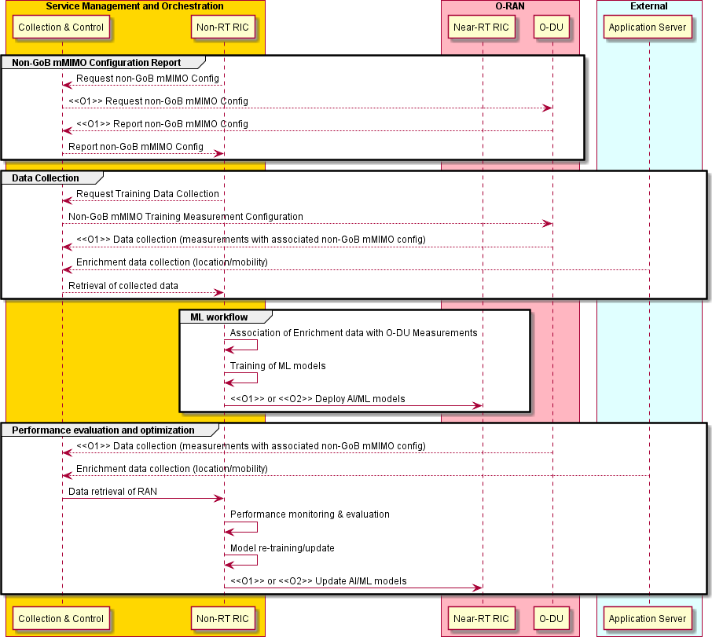1

2 Figure 5.2.2.1-1. Configuration Report, AI/ML training and deployment.

3

4

1. Referring to Figure 5.2.2.1-2, the near-RT RIC xApp performs AI/ML model inference using models previously deployed
2. from non-RT RIC. Enrichment data is provided from non-RT RIC via A1, and measurements (such as SINR) and SRS
3. configuration information is obtained from O-DU over E2. Association of measurements and enrichment data is
4. performed by near-RT RIC. The recommended beamforming mode(s) (out of N) is provided from near-RT to O-DU over
5. E2 ("mMIMO non-GoB control or policy message" in the diagram). The O-DU can then configure the non-GoB
6. beamforming algorithm taking account of the mode received from near-RT RIC. In exceptional circumstances in case the
7. O-DU is not able to apply the signaled mode then a failure indication could be returned by the O-DU. The xApp may
8. maintain statistics about success/failure rates. Optionally, the beamforming mode recommendation may be selected by
9. the near-RT RIC in order to improve the training data set, which could be used, for example, in the case of reinforcement
10. learning based implementations. 15

16

1

@startuml

skinparam ParticipantPadding 5

skinparam BoxPadding 10

skinparam defaultFontSize 12

Box "Service Management and Orchestration" #gold Participant "Collection & Control" as smo Participant "Non-RT RIC" as non

End box

Box "O-RAN" #lightpink

Participant near as "Near-RT RIC" Participant ran as "O-DU"

End box

Box "External" #lightcyan

Participant "Application Server" as app

End box

app --> smo : Enrichment data collection (location/mobility) smo --> non : Retrieval of collected data

non --> near : <<A1>> Enrichment data (location/mobility)

group E2 control & Policy

near --> ran : <<E2>> Non-GoB mMIMO Measurement Configuration ran --> near : <<E2>> Data collection (measurements)

near -> near: Association of Enrichment data with O-DU Measurements near -> near : ML model inference

near -> near : E2 control or policy generation

near -> ran: <<E2>> mMIMO non-GoB control or policy message end

@enduml

2

3

4

5

6

7

8

9

10

11

12

13

14

15

16

17

18

19

20

21

22

23

24

25

26

27

28

29

30

31

32

33

34

35

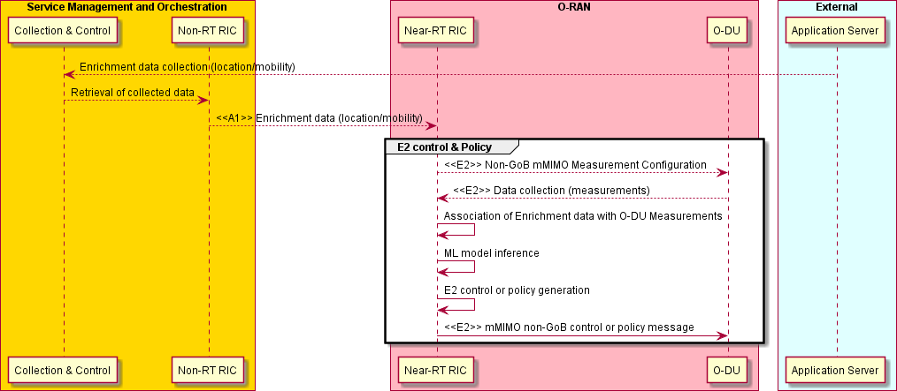36

1. Figure 5.2.2.1-2. AI/ML Inference

38

###### Requirements

* 1. Required data:
  2. Initialization:

|  |  |  |  |  |  |
| --- | --- | --- | --- | --- | --- |
| **Input/Output Data** | | | | | |
| **Interface** | **Source -> Target** | **Name/Description** | **Units** | **Config. Period, granularity** | **New or existing config** |
| O1 via SMO | Non-RT RIC -> O-DU | Supported Non-GoB beamforming modes Request | - | Initialization, per gNB | New |
| O1 via SMO | O-DU -> Non- RT RIC | Supported Non-GoB beamforming modes Response | - | Initialization, per gNB | New |

4

5

6 Training configuration:

Table 5.2.2.1-2.

|  |  |  |  |  |  |
| --- | --- | --- | --- | --- | --- |
| **Input/Output Data** | | | | | |
| **Interface** | **Source -> Target** | **Name/Description** | **Units** | **Config. Period, granularit y** | **New or existing config** |
| O1 via SMO | Non-RT RIC -> O-DU | Training configuration | \* | ~ hours/days, per gNB | New |

7 **Table 5.2.2.1-3.**

8 Note\*: to be elaborated during normative phase. One example is a schedule for the use of each beamforming mode for

9 use during the training phase. 10

11

1 Measurements/reports from E2 Nodes (training phase):

|  |  |  |  |  |  |
| --- | --- | --- | --- | --- | --- |
| **Input Data** | | | | | |
| **Interface** | **Source -> Target** | **Name/Description** | **Units** | **Reporting Period, granularit y** | **New or existing measurement,**  **Existing Specification (Section)** |
| O1 via SMO | O-DU -> Non- RT RIC | Average DL UE throughput in gNB with associated non-GoB mMIMO mode | Kb/s + index | (non real-  time for training) | Existing definition 3GPP TS 28.552  (Sec. 5.1.1.3.1)  Require new per-UE reporting. New component is associated non-GoB  mMIMO mode index |
| O1 via SMO | O-DU -> Non- RT RIC | Average UL UE throughput in gNB with associated non-GoB mMIMO mode | Kb/s + index | (non real-  time for training) | Existing definition 3GPP TS 28.552  (Sec. 5.1.1.3.3)  Require new per-UE reporting. New component is associated non-GoB  mMIMO mode index |
| O1 via SMO | O-DU -> Non- RT RIC | RSRQ L1 measurement (based on Synchronization Signal) | dB | (non real-  time for training) | Existing definition 3GPP TS 38.133  (Sec. 10.1.11)  3GPP TS 38.215  (Sec. 5.1.3)  New reporting |
| O1 via SMO | O-DU -> Non- RT RIC | RSRP L1 measurement (based on Synchronization Signal) | dBm | (non real-  time for training) | Existing definition 3GPP TS 38.133  (Sec. 10.1.6)  3GPP TS 38.215  (Sec. 5.1.1)  New reporting |
| O1 via SMO | O-DU -> Non- RT RIC | DL L1 SINR measurement (based on Synchronization Signal) | dB | (non real-  time for training) | Existing definition 3GPP TS 38.133  (Sec. 10.1.16)  3GPP TS 38.215  (Sec. 5.1.5)  New reporting |
| O1 via SMO | O-DU -> Non- RT RIC | UL SRS RSRP measurement | dBm | (non real-  time for training) | Existing definition 3GPP TS 38.133  (Sec. 13.3.1)  3GPP TS 38.215  (Sec. 5.2.5)  New reporting |
| O1 via SMO | O-DU -> Non- RT RIC | SRS configuration periodicity | slots | (non real-  time for training) | Existing definition 3GPP TS 38.331  (Sec. 6.3.2 "SRS-Config-  >periodicityAndOffset") New reporting |

2 Table 5.2.2.1-4.

3

4

1 Measurements/reports from E2 Nodes (inference phase):

|  |  |  |  |  |  |
| --- | --- | --- | --- | --- | --- |
| **Input Data** | | | | | |
| **Interface** | **Source -> Target** | **Name/Description** | **Units** | **Reporting Period, granularit y** | **New or existing measurement,**  **Existing Specification (Section)** |
| E2 | O-DU -> Near- RT RIC | RSRQ L1 measurement (based on Synchronization Signal) | dB | ~per N x 100ms, per UE | Existing definition 3GPP TS 38.133  (Sec. 10.1.11)  3GPP TS 38.215  (Sec. 5.1.3)  New reporting |
| E2 | O-DU -> Near- RT RIC | RSRP L1 measurement (based on Synchronization Signal) | dBm | ~per N x 100ms, per UE | Existing definition 3GPP TS 38.133  (Sec. 10.1.6)  3GPP TS 38.215  (Sec. 5.1.1)  New reporting |
| E2 | O-DU -> Near- RT RIC | DL L1 SINR measurement (based on Synchronization Signal) | dB | ~per N x 100ms, per UE | Existing definition 3GPP TS 38.133  (Sec. 10.1.16)  3GPP TS 38.215  (Sec. 5.1.5)  New reporting |
| E2 | O-DU -> Near- RT RIC | UL SRS RSRP measurement | dBm | ~per N x 100ms, per UE | Existing definition 3GPP TS 38.133  (Sec. 13.3.1)  3GPP TS 38.215  (Sec. 5.2.5)  New reporting |
| E2 | O-DU -> Near- RT RIC | SRS configuration periodicity | slots | ~per N x 100ms, per UE | Existing definition 3GPP TS 38.331  (Sec. 6.3.2 "SRS-Config-  >periodicityAndOffset") New reporting |

2 Table 5.2.2.1-5.

3 Whether additional filtering of L1 measurements is required in O-DU is for further study during the normative phase. 4

1. Enrichment data from Application Server:
2. 1. UE mobility (speed and direction)
3. 2. UE location
4. 3. The time granularity is an integer multiple of [1] second. 9

10

1. Output Signalling towards E2 Nodes:

|  |  |  |  |  |  |
| --- | --- | --- | --- | --- | --- |
| **Output Data** | | | | | |
| **Interface** | **Source -> Target** | **Name/Description** | **Units** | **Config. Period, granularit y** | **New or existing config** |
| E2 | Near-RT RIC -> O-DU | Non-GoB control/policy (non-GoB beamforming mode) | index | ~per N x 100ms, per UE | New |

2

1. ORAN Entity roles:
2. 1) SMO

Table 5.2.2.1-6.

1. a) Support O1-based Request and Report of O-DU supported non-GoB mMIMO configurations (beamforming
2. modes)
3. b) Support O1-based Configuration and Collection of Training Measurement data / SRS configuration from O-
4. DU
5. c) Enrichment Data Collection 10
6. 2) Non-RT RIC
7. a) Issue Request and receive Report of O-DU non-GoB beamforming modes from O-DU through SMO
8. b) Configuration and retrieval of Training Measurement Data from O-DU
9. c) Enrichment Data Retrieval
10. d) Perform association of Training Measurement Data and Enrichment Information
11. e) Model training/re-training
12. f) Model xApp deployment/re-deployment
13. g) Send Enrichment Data to near-RT RIC over A1
14. h) Performance monitoring and evaluation 20
15. 3) Near-RT RIC
16. a) Retrieval of Enrichment Data over A1
17. b) Retrieval of ML Models from the Non-RT RIC
18. c) Retrieval of O-DU measurements/SRS configuration over E2
19. d) Association of E2 Measurement Data and Enrichment Data
20. e) Model inference by xApp
21. f) Send non-GoB control/policy (recommendation of non-GoB beamforming mode) to O-DU over E2 28
22. 4) E2 nodes
23. a) Respond to O1-based Request by sending Report of O-DU supported non-GoB mMIMO configurations
24. (beamforming modes) over O1
25. b) Respond to O1-based Configuration and Report of Training Measurement data / SRS configuration over O1
26. c) Collect and report measurements (with associated beamforming mode)/SRS configuration over E2 to Near-RT
27. RIC
28. d) Apply non-GoB control/policy (non-GoB beamforming mode) received over E2 36

### 5.2.3 Impact Analysis on O-RAN Working Groups

* 1. *Editor's note: This is an initial impact analysis as part of the WG1 UCTG work on mMIMO. The intention is to estimate*
  2. *the expected standardization effort within the O-RAN working groups. It is up to the WGs to decide how the mMIMO*
  3. *functionality should be specified in specifications of each WG.*
  4. WG2 (Non-RT RIC, A1) Impact
  5. ? O-RAN.WG2.Use-Case-Requirements
  6. o If seen as beneficial, add new use case: Massive MIMO non-Grid-of-Beams Beamforming
  7. Optimization based on agreements from pre-normative phase
  8. ? O-RAN.WG2.A1 TD
  9. o Support exchange of relevant Enrichment Data from non-RT to near-RT RIC
  10. WG3 (Near-RT RIC, E2) Impact
  11. ? O-RAN.WG3.UCR
  12. o Add new use case: Massive MIMO non-Grid-of-Beams Beamforming Optimization based on
  13. agreements from pre-normative phase
  14. ? O-RAN.WG3.E2SM-KPM
  15. o Option 1: If UE specific L1/2 measurement reporting is added to the 3GPP specification (e.g. 3GPP
  16. TS37.320 section 5.4.1.), E2 will refer to 3GPP spec and there will be minor or no impact on E2SM-
  17. KPM specifications.
  18. o Option 2: If UE specific L1/2 measurement reporting is not added to the 3GPP specifications, "O-RAN
  19. specific" measurements need to be added to E2SM-KPM. Considering that measurement definitions
  20. exist in 3GPP the effort will be minor, noting that E2SM-KPM has already extended the definitions of
  21. measurement counters in TS 28.522 to be able to be retrieved per UE level from RAN node.
  22. o Note that there will likely be some commonality with other use cases
  23. ? O-RAN.WG3.E2SM-RC or any other suitable E2SM
  24. o Add new Non-GoB control/policy (non-GoB beamforming mode) in direction near-RT RIC to O-DU
  25. WG5 (O1) Impact
  26. ? O-RAN.WG5.MP O1 Interface specification for O-DU
  27. o Option 1: If UE specific L1/2 measurement reporting is added to the 3GPP specification (e.g. 3GPP
  28. TS37.320 section 5.4.1.), O1 could refer to 3GPP spec and there could be very limited or no impact on
  29. O1 specifications.
  30. o Option 2: If UE specific L1/2 measurement reporting is not added to or re-used from the 3GPP
  31. specifications, O-RAN would add reporting of these as an extension of O1. As the measurement
  32. definitions already exist, the impact will be moderate.
  33. o Similarly, initialization/training configuration might also be specified in 3GPP and/or in O-RAN (using
  34. type "O-RAN WG5 modified model based on 3GPP SA5" as defined in chapter 10).
  35. ? Supported Non-GoB beamforming modes Request in direction SMO to O-DU
  36. ? Supported Non-GoB beamforming modes Response in direction O-DU to SMO
  37. ? Training configuration in direction SMO to O-DU (exact definition is FFS, one
  38. example being a schedule for the application of different beamforming modes during
  39. training phase).
  40. Summary: The impact on O-RAN E2 specification is small. For O1, the impact on O-RAN specification is small in case
  41. measurement reporting/configuration management are specified in 3GPP and referred to by O-RAN specifications, and
  42. moderate if the reporting of new required per-UE L1/L2 measurements and related configuration management are
  43. specified in O-RAN.

45

### 5.2.4 Relation and Impact on 3GPP Specification

1. Per-UE L1/2 measurement reporting might be added to the existing 3GPP MDT framework or might be added in a new
2. AI/ML Data Collection framework currently discussed in 3GPP.
3. The 3GPP MDT framework is defined in 3GPP TS37.320 for UMTS, LTE and NG Radio Access. There are UE specific
4. signal measurements defined with reference to 3GPP TS38.215. The handling and management of MDT traces are
5. specified in 3GPP TS32.421, TS32.422, TS32.423 as well as TS32.445, TS32.446 etc.
6. In terms of a new AI/ML motivated measurement framework, related work is already underway in 3GPP RAN3 and SA5,
7. for example in the Study on enhancement for Data Collection for NR and EN-DC, which is being documented in 37.817.
8. Further work might be considered, for example as proposed in the recent Study Item proposal (S5-215397, "New SID
9. Study on measurement data collection to support RAN intelligence"). Support of new reporting of UE-specific L1/2
10. measurements in direction O-DU to non- RT RIC and near-RT RIC is therefore FFS.
11. In terms of configuration/control, it is FFS whether 3GPP will specify the following:
12. ? Supported Non-GoB beamforming modes Request in direction SMO to O-DU
13. ? Supported Non-GoB beamforming modes Response in direction O-DU to SMO
14. ? Training configuration in direction SMO to O-DU
15. The current working assumption is that these will first be specified by O-RAN WG5 in which case there is no dependency
16. on 3GPP progress (noting however that additional instances are expected to be proposed to 3GPP for having alignment
17. of the information models between 3GPP and O-RAN WG5).

### 5.2.5 Feasibility and Gain/Complexity Analysis

####  Simulation Results

1. Simulation results are provided for the assumptions shown in Table 5.2.5.1-1.

|  |  |
| --- | --- |
| **Parameter** | **Description** |
| Cell | Single cell, 120-degree sector, 300m radius |
| Channel model | Based on 3GPP non-line of sight CDL, with path gains and angles computed for random spatial placement of scatterers and static blockers. |
| Pathloss | Macro model per 3GPP TR 36.931 |
| Angular spread at BS | ~25 degrees |
| MIMO Mode | Downlink, SU-MIMO, 2 layers fixed (i.e. no adaptation of layers, pre-coding, no scheduling, etc.) |
| Beamforming modes | Mode 0: SRS-based  Mode 1: GoB-based |
| Relative SNR DL PDSCH to UL SRS channel estimate | +10 dB, takes account of relative noise figures and output powers between gNB and UE (UL Transmit Power Control not modelled) |
| gNB antenna array | 32 elements x 2 polarization panel antenna |
| UE antenna array | 1 element x 2 polarizations |
| SRS periodicity | 8 slots |
| Carrier Frequency | 3.5 GHz |
| Output metric | Simulated channel capacity |

1. Table 5.2.5.1-1. Simulation Assumptions
   1. Simulated downlink capacity for one example randomly dropped cell is shown for low (1km/h) and high (120 km/h)
   2. mobility scenarios, in the heatmaps in Figure 5.2.5.1-1, and in CDFs of relative throughputs in Figure 5.2.5.1-2 and in
   3. Figure 5.2.5.1-3.

4

5

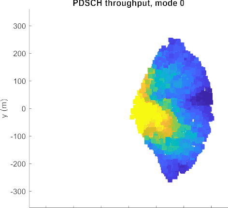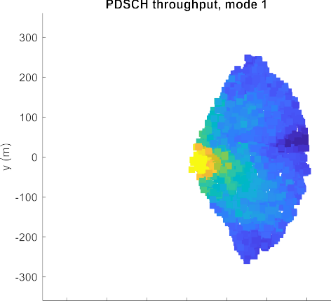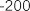

* + 1. Low mobility

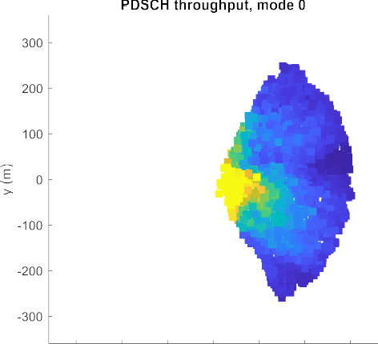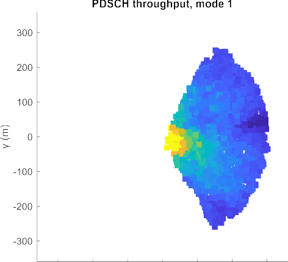

* + 1. High mobility

6

7

Figure 5.2.5.1-1. Heatmaps. Brighter colors represent higher throughputs.

1

1. Figure 5.2.5.1-2. Relative PDSCH throughput CDF, low mobility.

3

4

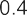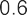

5

6 Figure 5.2.5.1-3. Relative PDSCH throughput CDF, low mobility.

7

8 The achieved throughput depends on UE location and mobility. The throughput pattern is not uniform across angles due

9 to random placement of scatterers and blockers within the cell.

1. Mode 0 performs best towards the center of the cell and mode 1 towards cell edge, however the cross-over point depends
2. on mobility, with mode 0 performing worse in the high mobility scenario.
3. Table 5.2.5.1-2 and Table 5.2.5.1-3 compare average, 5-percentile and 95-percentile relative throughputs for PDSCH for
4. modes 0 and 1, and for an ideal intelligent mode selection, for low and high mobility cases respectively. The opportunity
5. for intelligent mode selection is a substantial increase in throughput relative to either a fixed configuration of mode-0 or
6. mode-1.
7. It is worth noting that these results are for a single fixed assumed SRS periodicity (8 slots). The cross-over points between
8. mode 0 and mode 1 would also likely have a dependency on SRS periodicity. 9

|  |  |  |  |
| --- | --- | --- | --- |
| **Mode** | **Relative Av. cell throughput**  **%** | **Relative 5- percentile cell throughput**  **%** | **Relative 95- percentile cell throughput**  **%** |
| 0 | 100.0000 | 100.0000 | 100.0000 |
| 1 | 72.8874 | 159.9304 | 55.7866 |
| **Ideal intelligent mode selection** | **102.2254** | **159.9304** | **100.0000** |

10 Table 5.2.5.1-2. Average, 5-percentile and 95-percentile relative PDSCH throughputs, low mobility

11

|  |  |  |  |
| --- | --- | --- | --- |
| **Mode** | **Relative Av. cell throughput**  **%** | **Relative 5- percentile cell throughput**  **%** | **Relative 95- percentile cell throughput**  **%** |
| 0 | 100.0000 | 100.0000 | 100.0000 |
| 1 | 99.4713 | 241.0834 | 70.7448 |
| **Ideal intelligent mode selection** | **114.3104** | **241.0834** | 100.0000 |

12 Table 5.2.5.1-3. Average, 5-percentile and 95-percentile relative PDSCH throughputs, high mobility

13

1. The fixed configuration of a GoB and non-GoB SU-MIMO mode (mode-0 or mode-1) provides one example of the
2. potential benefit of a MIMO mode switching algorithm. The actual gain might be impacted by various factors not
3. considered in this simulation as described in Table 5.2.5.1-1.
4. Although these initial simulation results do not include MU-MIMO scheduling or inter-cell interference, similar findings
5. are expected for these conditions, some related simulated results can be found in [2] . One possibility, to be determined
6. during the normative phase, is for beamforming mode control to be performed for multiple MIMO modes, for example,
7. with one control for SU-MIMO, and one for MU-MIMO. 21

# 1 6 MIMO DL Tx Power Optimization, MU-MIMO Pairing and

2 MIMO mode selection

## 6.1 Overview

1. Massive MIMO holds promise in significantly increasing capacity in practical wireless network environments. Capacity
2. can depend on the wireless network environment (e.g., user velocity, etc.) and the desired quality of the user wireless
3. experience. In many practical cases, the capacity of the cell can be increased by, for example, proper choice of parallel
4. user groups, etc. On the other hand, increased number of parallel users can incur increased inter-user interference which
5. can reduce the user quality. In order to properly balance this trade off operators need fundamental observations (aka,
6. "dials") to assess the network environment and the user quality for both the uplink and the downlink. Further, to optimize
7. the capacity vs. quality for a given cell for a given time and user distribution, the operator needs fundamental parameters
8. to be changed (aka, "knobs"). The following sections will describe three relevant use-cases and list a number of dials and
9. knobs that we believe constitute a fundamental set for observations and manipulation of massive MIMO systems for both
10. Grid of Beams (GoB) and Reciprocity based implementations.
11. To further optimize/automate the complex process, it is proposed that O-RAN interfaces be provided (dials and knobs) to
12. enable a AI/ML model training and update, its inference, and finally the beam optimization to enhance the massive MIMO
13. system performance observe and manipulate the massive MIMO system. 17

## 6.2 MIMO optimization use-cases

1. The use-cases described in the subsequent sections will show how dials and knobs (specifically referenced) can be used
2. to optimize the three important use cases of downlink transmit power, MIMO pairing enhancement (user separability),
3. and user MIMO mode selection (Mu-MIMO or Su-MIMO). Each use case will address the proposed solution, value
4. proposition, use of specific dials and knobs, and where applicable the potential gains via analytical studies or simulation. 23

### 6.2.1 Solution 1: Downlink Transmit power optimization

####  Problem Statement, Solution and Value Proposition

1. For general downlink precoding, the downlink transmit power is usually evenly distributed across the UEs. However,
2. depending on the UE separability and path loss deltas, this may result in good cell capacity at the expense of individual
3. UE quality. This can be due to a number of issues such as cell edge UEs having general downlink SINR issues (even
4. without Mu-MIMO), poor UE separability between cell edge UEs, and poor uplink SINR resulting in degraded SRS
5. which are a few example issues. The result of these issues can be manifested by observations of very poor individual UE
6. SINRs (either downlink, uplink, or both) when running in a Mu-MIMO mode. Therefore, although the capacity of the
7. cell has been significantly increased, certain customer experiences may become unacceptable in this Mu-MIMO mode.
8. The solution to the problem described above is to simply provide observations ("dials") of UE performance in the form
9. of periodic histograms of UE channel quality as well as the overall cell capacity in order to compute an optimal solution
10. via AI/ML with control (knob) of the downlink minimum required SINR threshold to achieve a minimal UE quality
11. requirement that is set by the operator. The minimum required SINR is a policy and thus doesn't require real time
12. AI/ML adjustment of transmit power directly but rather leaves this to the scheduler to adjust and optimize consistent with
13. its numerous other priorities and requirements. This adjustment does not impact the normal iBLER (initial BLER) targets,
14. or the CQI/MCS process of adapting the MCS to the UE indicated CQI. Since the received SINR will vary across UEs
15. (see below) and even across PRBs due to frequency selective fading (where narrowband CQI is an option for operators)
16. there is no explicit impact for PRBs. This concept can be extended to the uplink minimum SINR and can improve the
17. uplink more in reciprocity Mu-MIMO modes since the performance in this mode is highly dependent on channel
18. estimation accuracy which is directly influenced by the SRS quality. Performance in the uplink can be improved as shown
19. in reference [3] when the channel quality increase can improve the interference rejection (gains are referenced in the
20. performance section below).
21. The value of this observability and adjustability allows the operator to optimize the trade-off between cell capacity and
22. individual user/customer quality which is essential to provide the best customer experience. The trade-off, for example,
23. can **reduce** a very high cell centre data rate (which would likely be unnoticeable for the user) to allow more power to be
24. allocated to the cell edge user (who is noticing low throughput and large latencies) to improve the cell edge data rate
25. situation. The gains to the cell edge occur when specifically, the SINR is so low (e.g., - 10 dB) such that the MCS is low
26. that the spectral efficiency is not sufficient to support the minimum throughput requirements needed by the customer and
27. thus the operator. Based on inputs from the AI/ML system, the scheduler can improve this undesirable situation by re-
28. allocation of transmit power to meet minimum SINR requirements for these degraded users. Thus, the scheduler has a
29. recommended policy that it may (or in special cases is not able to satisfy if UE buffer, latency, or other issues preclude)
30. use as guidance for the scheduling of Mu-MIMO users.
31. In summary, the target of this use case is to improve the downlink post-pairing SINR for MU-MIMO UE to improve cell
32. edge performance and overall cell throughput. The output of this use case is the Minimum Downlink Post-pairing SINR
33. Threshold for MU-MIMO UEs and provided as additional input to the L2 scheduler to support this optimization. The use
34. case does not suggest any specific behaviour. It is left to scheduler implementation how this target is achieved. The
35. relation of this parameter to the 5QI QoS throughput attributes of this UE is ffs. 20

####  Architecture/Deployment Options

1. The non-RT RIC trains and updates the specific Downlink transmit power control and optimization AI/ML models. Figure
2. 6.2.1.2-1 reflects the functional dependencies of the AI/ML implementation framework. The MU-MIMO DL power
3. control (MPC) rAPP performs optimization required. As shown in Figure 6.2.1.2-1, the rApp uses O1 interface
4. measurement data (via SMO exposed services over R1 interface) for training the ML model. The MPC rApp running in
5. the non-RT RIC uses O1 interface measurement data to optimize minimum downlink SINR threshold for MU-MIMO
6. users at the O-CU or O-DU (as applicable) over O1 interface (via SMO exposed services over R1 interface).
7. The ML model driving the MPC rApp will utilize UE orthogonality and path loss delta data to understand the scenarios
8. where there can be a set of UEs that have significantly degraded SINR, in addition to monitoring SINR from downlink
9. CQI measurements. The output of the ML model will be a configuration recommendation for the minimum downlink
10. SINR threshold for Mu-MIMO UEs. 32

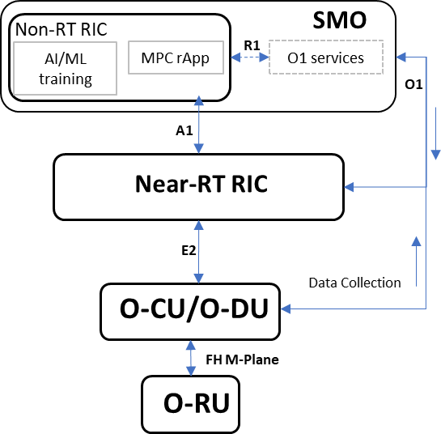1

2 Figure 6.2.1.2-1. High level architecture for MIMO power control use-case

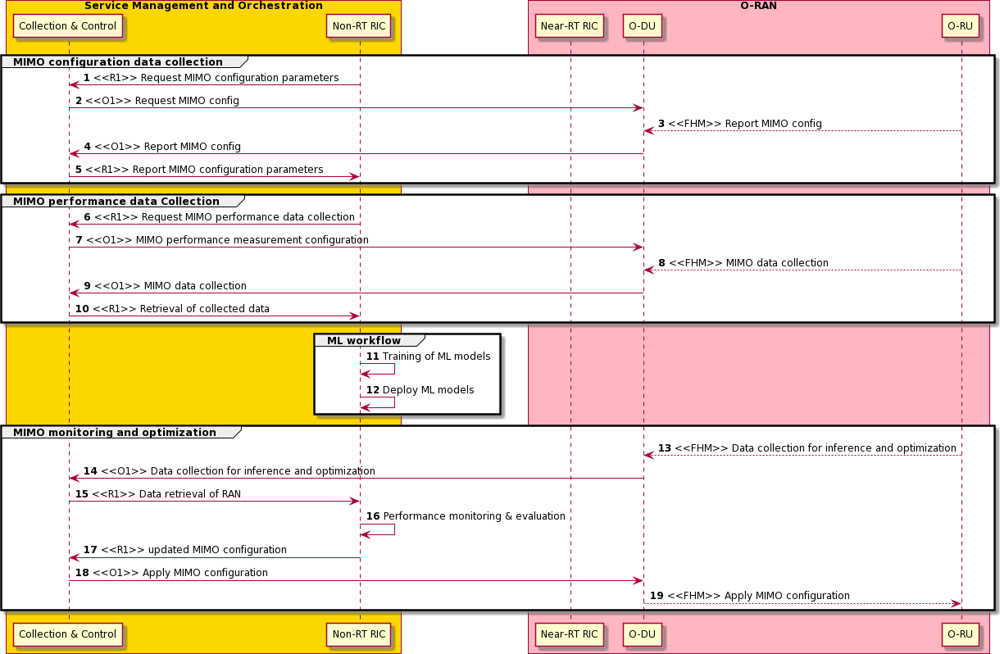3

4

5 Figure 6.2.1.2-2. Call Flow Diagram for MIMO power control use-case

1

1. In the call flow in Figure 6.2.1.2-2, the rApp can request the current MIMO configuration (e.g. downlink SINR threshold
2. values) (steps 2-5), as well as current network measurements and KPIs (steps 7-10). The R1 interface is used by the rApp
3. to communicate these requests to SMO, which in turn coordinates the collection via O1 interface. The AI/ML model that
4. is part of the rApp will use the measurements to evaluate the current capacity and UE performance and if required, will
5. generate a recommendation to update the SINR configuration (step 16). This new recommendation is sent to SMO via R1
6. interface, and finally communicated to the O-DU via O1 interface (step 18). 8

###### Requirements

1. This section outlines the required measurement data (dials) that form the input of the optimization app and also the output
2. control/configuration (knobs) that are to be fine-tuned to achieve the desired optimization objective.

|  |  |  |  |  |  |  |
| --- | --- | --- | --- | --- | --- | --- |
| **Interfac e** | **Source**  ?  **Target** | **Description** | **Units** | **Measureme nt Period** | **Reference** | **New or**  **existing measurement/ reporting specification** |
| O1 | O-DU  -> Non-  RT RIC | Paired UE Orthogonality Factor (min UE pair Cross Correlation Coefficient [0,1] for each K number of parallel UEs ) histogram  (the cross correlation coefficient is defined as E{hh\*]/E{|h|^2} where h = channel estimate for a given UE) | dB (0,..,-  50) for K  values | 1 .. 15 min. | [Dial09] | New measurement definition New measurement reporting |
| O1 | O-DU  -> Non-  RT RIC | Path Loss Delta distribution across all Mu-MIMO UEs (percent vs. < 1 dB, < 3 dB, < 5 dB, < 10 dB, < 15 dB, < 20 dB, < 30 dB, > 30 dB)  (the path loss may be estimated by the downlink TX power minus the RSRP all normalized to the SCS tone  bandwidth or be PHR reporting) | Percen t | 1 .. 15 min. | [Dial10] | New measurement definition New measurement reporting |

1. Table 6.2.1.2-1. UE spatial separability dials

13

14

|  |  |  |  |  |  |  |
| --- | --- | --- | --- | --- | --- | --- |
| O1 | O-DU  -> Non-  RT RIC | Downlink CQI Report histogram (one CQI histogram (percent use vs. CQI index) for each number of Mu-MIMO UEs in parallel (e.g., 1,2,3,..K) See section [0] (GoB) for other use cases. | Percen t | 1 .. 15  min. | [Dial18] | Measurement definition in  3GPP TS  38.214  New  measurement reporting |
| O1 | O-DU  -> Non-  RT RIC | Zero Power reference measurement value per beam (average value - dBm) - Intercell Interference Measurements | dBm | 1 .. 15  min. | [Dial20] | New measurement definition New measurement reporting |
| O1 | O-DU  -> Non-  RT RIC | Para. 5.1.6 (ref[.5]) CSI signal-to-noise and interference ratio (CSI-SINR) histogram | Percen t | 1 .. 15  min. | [Dial21] | Measurement definition in  3GPP TS  38.215  New  measurement reporting |

1 Table 6.2.1.2-2. Downlink MIMO quality dials

2

|  |  |  |  |  |  |  |
| --- | --- | --- | --- | --- | --- | --- |
| **Interfac e** | **Source**  ?  **Target** | **Description** | **Unit s** | **Control Period** | **Reference** | **New or**  **existing config** |
| O1 | Non- RT RIC  -> O- DU | Minimum Downlink post-pairing SINR Threshold for MU-MIMO UEs (Operator set [0,..,25]) | Inte ger (dB) | 1 .. 15 min. | [Knob02] | New |

3 Table 6.2.1.2-3. Downlink MIMO power control knobs

4

1. Note: It is FFS whether any of the listed measurements have any dependency on O-RU and if any information needs to
2. be exchanged over O-RAN FH m-plane interface from O-RU to O-DU.
3. O-RAN Entity roles:
4. 1) SMO & Non-RT RIC
5. a) Collect existing configuration and performance data from RAN
6. b) Trigger AI/ML Model training/update and deployment as necessary
7. c) Apply power control recommendations from rApp via R1 and O1 interface using config management service.
8. 2) O-CU
9. a) Report current configuration and performance data to non-RT RIC rApp via O1 interface if requested by rApp.
10. 3) O-DU
11. a) Report current configuration and performance data to non-RT RIC rApp via O1 interface.
12. b) Apply power control related knobs based on rAPP recommendation. 17

18

####  Impact Analysis on O-RAN WGs

* 1. *Editor's note: This is an initial impact analysis as part of the WG1 UCTG work on mMIMO. The intention is to estimate*
  2. *the expected standardization effort within the O-RAN working groups. It is up to the WGs to decide how the mMIMO*
  3. *functionality should be specified in specifications of each WG, and whether it will be part of existing or new set of*
  4. *specifications.*
  5. WG1 (use cases, architecture) Impact
  6. ? Update WG1 use case analysis report and use-case detailed specification with downlink power control use case.
  7. No impact to existing architecture.
  8. WG2 (Non-RT RIC, A1, R1) Impact
  9. ? Assess impact to A1 and R1 interfaces and non-RT RIC architecture, including AI/ML training and deployment.
  10. ? Add new use cases and corresponding requirements and specifications in case impact to A1 or R1 interfaces.
  11. WG5 (O-CU and O-DU) Impact
  12. ? Assess impact on O-CU and O-DU support for dials and knobs described in the use-case.
  13. WG10 (SMO, O1) Impact
  14. ? Assess impact with PM coordination group and IM/DM coordination group on support of proposed dials
  15. (measurements) and knobs (configuration IM/DM) and incorporation in existing O1 interface models, as well as
  16. any required coordination with 3GPP
  17. Summary: A detailed analysis of the specification impact is to be completed. There is large specification impact to specify
  18. new proposed measurement definitions and measurement reporting in 3GPP or in O-RAN. The impact of the required
  19. measurements and configurations will be reduced if they are already part of ongoing/upcoming O-RAN specifications
  20. (ffs) or are being considered for specification in other bodies such as 3GPP (ffs). 22

####  Complexity/Gains

1. The simulation of 8 UEs in an urban setting (without intercell interference just to keep it simple) is shown in Figure
2. 6.2.1.4-1 as a first step in simulation as next steps cell clusters are planned to be simulated as well to confirm intercell
3. interference performance. It was based on uniform downlink TX power distribution and a generic zero forcing precoding
4. algorithm (Green dots). Clearly the resulting downlink SINR is fairly uniform for most of the UEs except for UE#6 and
5. UE#8 which tend toward the cell edge. The poor SINR of these two UEs can be mitigated by either monitoring the
6. separability and potentially deleting them from the pairing with the other 6 UEs or by reallocating some of the power to
7. the other UEs. In the cases where there may be excessive SINR for a near-center of the cell UE (not in this simulated
8. case) the downlink TX power can be reallocated to benefit the cell edge UEs to bring them up to a minimum SINR for
9. example. Specifically, general statistical trends of poor cell edge SINR will be detected by the measurements (dials) and
10. optimized by the AI/ML to result in an appropriate minimum SINR threshold. 34

* Bandwidth = 20 MHz
* 8x8 Antenna Array
* 2 GHz frequency
  + Urban High Rise
* Base station height = 20 meters
* UE height = all at ground level

1

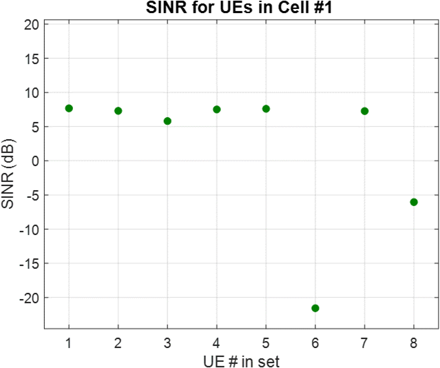

2 Figure 6.2.1.4-1. SINR distribution for UEs from simulation

3

1. Thus, the gain is highly dependent on the distribution of the SINR per UE but clearly TX power can be reallocated to
2. improve poorly performing UEs. However, the objective in this case is not to increase the capacity but to insure good
3. overall customer experience.
4. The complexity of having histograms requires generally low complexity since it reduces the data rates across the O-RAN
5. interfaces and keeps the high rate processing in the real-time capable processing hardware either in the DU or the RU
6. with FPGA and CPU/GPU capabilities.
7. Other downlink (and uplink) power/SINR optimization is described in references Bjornson [3] and Marzetta [4] that either
8. adjust downlink power directly or optimize SINR targets specifically for cell edge users and show good performances for
9. minimum user throughputs (directly proportional to minimum SINR) of up to 100% for the downlink and 50% for the
10. uplink [4].

14

####  Summary

1. In summary, a difference in SINR as received by paired MU-MIMO UEs has been shown for a system without inter-cell
2. interference. Further simulations at system level are under consideration. The gain of this use case in terms of cell edge
3. and overall cell performance will depend on the actual L2 scheduler implementation and the consideration of this
4. information by the L2 scheduler. A complexity analysis was not part of the pre-normative phase. 20

21

### 6.2.2 Solution 2: MU-MIMO Pairing Enhancement (User Separability or Pairing

1. Control)

####  Problem Statement, Solution, and Value Proposition

1. Existing channel orthogonality between multiple users is a key criterion to create user separability and allow for the
2. opportunity to share radio frequency resources simultaneously. Without so, residual interference will be too high to
3. maintain adequate post pairing radio link signal quality levels required to sustain MU-MIMO mode assignments. With
4. mobility there is an added demand to adjust beamforming weight assignments to not only maintain signal power levels at
5. the user end (beam quality), but also to continuously limit the inter user interference experienced between users assigned
6. with the same radio resource allocations. In the absence of creative solutions that capably and in a timely manner respond
7. to the above-described challenges, the 5G massive MIMO deployment will fail to utilize the full capability of large
8. antenna arrays powered by transceivers designed to transmit data channel signals towards a spatially confined direction.
9. Schedulers will also fail to realize potential multiplexing gains as fewer radio resource blocks are shared between users
10. within the same cell, reducing spectral efficiency.
11. Important too is the need to efficiently identify users with low demand for radio resources - sources of bursty traffic. An
12. intelligent assessment of how best such users can be effectively paired, if at all, with other users needs to be pre-
13. determined by the radio intelligent controller. Channel estimation mechanisms that can be extrapolated in time and do not
14. risk becoming stale so they can be utilized effectively to generate accurate weights and applied rapidly, is critical. For
15. lower volume buffer data, an unacceptable gap in the above can create failure in MU-MIMO pairing. In summary, this
16. use case suggests various measurement objects (aka dials) that are recommended as input into the AI/ML analytics Apps
17. to optimally determine the outputs (aka knobs) required to optimize the MU-MIMO feature operation. The following
18. section presents the input and output parameter and possible use in an AI/ML analytics App.
19. Scheduled UEs

23

1. 1. Histogram of UEs with data in Buffer [Dial01]
2. a. If greater than "Threshold\_High," evaluate cell's MU-MIMO pairing history and set status of cell as
3. AI/ML optimization candidate.
4. 2. # Of scheduled MU-MIMO UEs per TTI [Dial04]
5. a. AI/ML shall aspire to improve or maintain pairing success rate
6. b. Correlate to histogram of UEs with data in buffer
7. 3. Include percent of UE pairs evaluated for orthogonality by the scheduler [Dial05]
8. 4. AI/ML shall aspire to keep difference between 3. and "# Of scheduled MU-MIMO UEs per TTI" at a minimum
9. by minimizing residual interference of paired UEs.
10. 5. iBLER for MU-MIMO UEs [Dial06]
11. a. AI/ML shall aspire to improve pre pair value vs post pair
12. b. Delta iBLER should not exceed A dB, for a given pair size, for example.
13. 6. TTI of Evaluation vs. TTI of Scheduled Pairing or the Offset [Dial08]
14. a. For lower volume buffer data, an unacceptable gap in the above can create failure in MU-MIMO pairing 38
15. UE Spatial Separability
16. 1. Paired UE Orthogonality Factor [Dial09]
17. a. This is a measure of MU-MIMO performance sustainability. Spectral Efficiency will increase. It is an
18. implicit reflection of residual interference among paired UEs.
19. 2. Path Loss Delta [Dial10]
20. a. If orthogonality factor is high, and pathloss delta is high, AI/ML should be used due to an inherent
21. decorrelation of channel between the served UEs, for a given spatial distribution. 46
    1. Coherence Block
    2. 1. Coherence Time [Dial11]
    3. a. AI/ML is used to evaluate channel estimation reliability, to fit beamforming and MU-MIMO pairing
    4. process cycle into the coherence time.
    5. 2. Coherence Bandwidth [Dial12]
    6. a. To maximize PRB/TTI assignment to MU-MIMO vs. SU-MIMO. 7
22. Downlink MIMO Quality
23. 1. Downlink CQI Report Histogram [Dial18]
24. a. To safely scale the MU-MIMO pairing size - CQI is expected to fall with increase in pairing size.
25. According to the CQI and number of candidates that exist, AI/ML shall intelligently optimize pairing.
26. 2. ZP Reference Measurement Value per Beam [Dial20]
27. a. ZP CSI-RS is to be used for interference measurement (Indication of likely residual interference) 14
28. Uplink MIMO Quality
29. 1. Minimum, Average and Maximum Uplink SINR or Co-UE interference, Noise and External Interference level
30. per UE to allow assessments of Uplink channel pairing decisions similar to the downlink [Dial22]
31. 2. Percent Time MU-MIMO UEs are at Maximum TX Power and < 5 PRB allows assessments of UL coverage
32. [Dial24]

20

21 Frequency Reuse Factor for Pilots 22

1. 1. Histogram of re-used Pilots (SRS) from neighbor cells [Dial25]
2. a. Non-Real /Real Time RIC will work to assign different SRS to in-cell UEs to improve channel
3. estimation performance
4. Uplink Covariance
5. 1. Post Pilot Removal Uplink Covariance [Dial26]
6. a. Measure of channel orthogonality between MU-MIMO UEs and selection optimization, through
7. channel estimation
8. Pilot and Coherence Block Joint Distribution [Dial27]
9. 1. Histogram of Selected Pilot Sequence Length and Histogram of Selected Coherence Block
10. a. AI/ML will impart intelligence into the robustness of the pilot signals used for channel estimation
11. Spectral Efficiency
12. 1. MU-MIMO PRB Utilization Histogram [Dial30]
13. a. AI/ML will monitor to evaluate data Bytes transmitted, correlated to MU-MIMO pairing levels. This
14. will be compared to BLER reports for pairing decisions.
15. 2. Total PRB % Used Supporting MU-MIMO histogram [Dial31]
16. a. As above
17. 3. MU-MIMO PDCP Volume Histogram [Dial32]
18. a. Required for spectral efficiency calculation
19. 4. MU-MIMO Throughput DRB vs. MU-MIMO Layers [Dial33]
20. a. Required to evaluate MU-MIMO pairing effectiveness and scalability
21. 5. MU-MIMO Spectral Efficiency [Dial34]
22. a. Required to evaluate MU-MIMO pairing effectiveness
    1. With the above inputs, the AI/ML app will calculate the outputs to control the optimization of the Massive MIMO system
    2. below.
    3. Uplink UE Transmit Power Control
    4. 1. Minimum Uplink SINR Threshold for MU-MIMO UEs [Knob01]
    5. a. Useful to ensure SRS reciprocity-based beamforming approach is effective 6
23. Downlink Transmit Power Allocation
24. 1. Minimum Downlink SINR Threshold for MU-MIMO UEs [Knob02]
25. a. This can be a variable based on traffic loading within a cell. A lower threshold can be tolerated, but
26. greater than a cut-off threshold that is already existing as an implicit indicator (pre pairing evaluation)
27. prior to pairing. It can also be a variable based upon the pairing size (Number of UEs in MU-MIMO
28. mode, within same paired group) 13
29. Parallel Scheduling Control
30. 1. Uplink SINR Threshold [Knob03]
31. 2. Downlink SINR Threshold [Knob04]
32. 3. Minimum in-buffer PDU Count [Knob05]
33. a. To minimize beamforming and MU-MIMO process overhead and scheduling delays
34. 4. Minimum projected TTIs required for scheduling [Knob06]
35. a. To minimize beamforming and MU-MIMO process overhead and scheduling delays
36. 5. Threshold for pairing candidates' SRS strength [Knob07]
37. a. To make MU-MIMO beamforming more effective, especially for Zero Forcing technique.
38. 6. Maximum Number of Paired Candidates [Knob09 or Knob08]]
39. a. A means to limit Pairing size based on evaluation metrics and performance of larger pairing sizes
40. 7. UE Pairing Selection Threshold Based on 5QI Threshold for Pairing [Knob10]
41. a. Prioritizing pairing during congestion, based on 5QI QOS characteristics 27

28 SRS Sequence and Distribution 29

1. 1. SRS Length [Knob10]
2. 2. SRS Sequence Partition [Knob11]
3. Both are required to optimize performance based upon channel estimation outcome, reflected in the orthogonality between
4. paired users or their residual interference levels.
5. Quiescent Antenna Weight Application
6. 1. Customizable set of Antenna Weights [Knob15]
7. a. Optimization of array structure to improve spatial resolution of beams to support a wide distribution of
8. MU-MIMO users.

38

1. Realizing that significant increases in network capacity generally require large capital outlays to increase the available
2. spectrum and to purchase new equipment, the promise of Massive MIMO to increase the capacity and essentially the
3. available spectrum usage efficiency by adopting approaches relying upon advanced antenna arrays, is strongly considered.
4. However, such approaches at the same time add additional interference among the users that are simultaneously using the
5. same spectrum. In fact, in general, more simultaneous users add more interference to each individual user and thus a
6. careful balance between capacity and quality must be maintained or unhappy users can 'churn' to competitors.
7. The AI/ML assisted modeling and training output, along with the non-RT RIC based enhancement/inference, will strive
8. to deliver end goal solution selections and system configuration options that upon adoption within the respective domains
9. where they reside, realize an optimization framework that maximizes the potential of a MU-MIMO feature. Capacity
10. augmentation will be realized by successfully assigning MU-MIMO layers to a greater number of users simultaneously,
11. more often, and more uniformly across the serving area of each gNB. Dials that capture measurement values as
12. appropriately defined in this document, and knobs which are configured to manage the operations of critical techniques
13. that define the MU-MIMO feature and its underlying algorithms meant to enhance pairing capabilities, will provide the
14. platforms for a successful implementation that realizes the following goals:
15. 1) Increased spectral efficiency through the support of higher total throughput, by a factor more closely proportional
16. to the number of layers supported by the DU
17. 2) Robust MU-MIMO layers with per link MCS that is closely reflective of power loss at transmitter, proportional
18. to number of layers
19. 3) More resource blocks assigned to MU-MIMO mode 16
20. Particularly, AI/ML is used to optimize the network capacity utilizing a channel reciprocity-based approach vs.
21. maintenance of the quality of the connection for each user with shared resources. Additionally presented is the approach
22. that involves using a GoB-based solution, similar in objective to the reciprocity one, whereby balance between user quality
23. and capacity realized, is aimed.
24. The dials needed to assess user quality generally consist of measuring the quality (SINR, CQI, etc.) of both the Uplink
25. and Downlink for each user. Other metrics include the Uplink power margin for the user and the user mobility among
26. many other factors (see following sections for a comprehensive list of many of them). Other metrics that provide
27. assessments of capacity include the normal cell volume and cell throughputs along with congestion (active connected
28. users with data in the buffer). For Massive MIMO the individual "user separability" impacts the MU-MIMO pairing
29. performance (and thus capacity) such that the users cannot be arbitrarily paired or else low user spatial separability can
30. mutually degrade the user link quality due to significant inter-user interference. Thus, user separability must be tracked
31. and used to train the AI/ML component in to optimize the capacity while constrained to insure minimum levels of user
32. quality. The AI/ML component, after training, will output "knobs" to appropriately adjust the capacity to attempt to meet
33. the user volume, throughput, and latency demands. Examples of the knobs for reciprocity are the allocations of Downlink
34. Transmit Power allocation among users (see Section 6.2.1 above), the assignment of levels of pairing or parallelism,
35. assignment of modes of Su-MIMO vs. Mu-MIMO (see Section 6.2.3 below for more details), etc.
36. An alternative approach to the Reciprocity (mainly for TDD systems) based solution is the GoB approach, which relies
37. upon using the downlink CSI-RS reference signal to estimate the downlink channel (CSI). Here, a quantized model of the
38. CSI is fed back to the base station in order to make proper precoding decisions for the set of MU-MIMO users. This
39. approach can make use of shadow fading CSI information (type I) that is estimated or even the combination of shadow
40. and fast fading (type II) CSI information that is fed back with, of course, a larger required number of bits.
41. The dials section enumerates a list of the user feedback CSI information that should be monitored to assess the state of
42. the channel and the quality of the channel (CQI, SINR, etc.). In addition, the link quality can also be associated with the
43. choice of multiple downlink beams that are received by the user and these need to be properly monitored as well. In
44. addition, various "sub-beam" modalities must be monitored that give more information about the beam characteristics
45. (e.g., beam phase, etc.). In this case, the user beams (vs. the user channels for reciprocity) need to be assessed for "user
46. separability" as well.
47. There are several methods that can be applied, after training in the ML/AI component, that can be used to ensure user
48. quality while maximizing capacity. A "knobs" implementation that controls the beam shapes and power allocation (while
49. assessing the user pairing degree) can be used to ensure user quality.

1

####  Architecture/Deployment Options

1. The non-RT RIC trains and updates the specific MU-MIMO pairing enhancement AI/ML models. Figure 6.2.2.2-1 reflects
2. the functional dependencies of the AI/ML implementation framework. The MU-MIMO Pairing Enhancement (MPE)
3. rAPP performs optimization required to realize multiplexing gains through the sharing of PHY layer resource blocks
4. between several end users who are in transmission while on the PDSCH. As shown Figure 6.2.2.2-1, the rApp uses O1
5. and FH m-plane measurement data (via SMO exposed services). The MU-MIMO Pairing Enhancement rApp running in
6. the non-RT RIC uses O1/FH-m data to optimize cell MU-MIMO layer realization by configuring O-RU over FH m-plane
7. or O-DU over O1 interface parameters (via SMO exposed services over R1 interface).

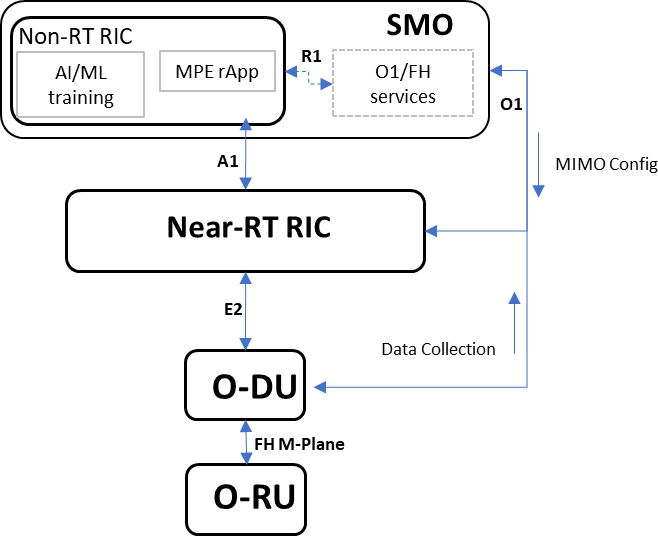

10

11 Figure 6.2.2.2-1. O-RAN Architecture Diagram for MIMO pairing use-case

12

1

2 Figure 6.2.2.2-2. Call Flow Diagram for MIMO pairing use-case

3

1. In the call in Figure 6.2.2.2-2, the rApp can request the current MIMO configuration listed in Table 6.2.2.2-12 (steps 2-
2. 5), as well as current network measurements and KPIs listed in Table 6.2.2.2-1 to Table 6.2.2.2-11 (steps 7-10). The R1
3. interface is used by the rApp to communicate these requests to SMO, which in turn coordinates the collection via O1
4. interface. The AI/ML model that is part of the rApp will use the measurements to evaluate the current capacity and UE
5. performance and if required, will generate a recommendation to update one or more of the identified configuration knobs
6. (step 16). This new recommendation is sent to SMO via R1 interface, and finally communicated to the O-DU via O1
7. interface (step 18).

11

###### Requirements

1. In order to achieve the value proposition described above, the key Massive MIMO KPIs or dials need to be monitored to
2. assess the state of the system. A proposed set is discussed in the following sections.
3. All the dials/measurements listed here are required at a configurable granularity in multiples of 1 minute, ranging from 1
4. to 15 minutes.

17

18

|  |  |  |  |  |  |  |
| --- | --- | --- | --- | --- | --- | --- |
| **Interfac e** | **Source**  ?  **Target** | **Description** | **Units** | **Measureme nt Period** | **Reference** | **New or existing measuremen t/reporting specification** |
| O1 | O-DU  -> Non-  RT RIC | Histogram of UEs with data in the buffer. If greater than "Threshold\_High," evaluate cell's MU-MIMO pairing history and set status of cell as AI/ML optimization  candidate. | Percen t | 1 .. 15 min. | [Dial01] | New measurement definition New measurement  reporting |
| O1 | O-DU  -> Non-  RT RIC | Angle of Arrival or Beam ID histogram. Only for GoB Feedback. | integer | 1 .. 15 min. | [Dial03] | New measurement definition New measurement  reporting |
| O1 | O-DU  -> Non-  RT RIC | # of scheduled MU-MIMO UEs per TTI (histogram of % UE=1, % UE=2  ,% UE = max limit (K)) | percen t | 1 .. 15 min. | [Dial04] | New measurement definition New measurement  reporting |
| O1 | O-DU  -> Non-  RT RIC | Percent of UE pairs evaluated for orthogonality by the scheduler (histogram, %=0, %=1, %=2, ....%= P) | percen t | 1 .. 15 min. | [Dial05] | New measurement definition New measurement  reporting |
| O1 | O-DU  -> Non-  RT RIC | iBLER (initial Block Error Rate, BLER) for the MU-MIMO UEs | percen t | 1 .. 15 min. | [Dial06] | New measurement definition New measurement  reporting |
| O1 | O-DU  -> Non-  RT RIC | UEs scheduled for Mu-MIMO pairing (histogram, %UE=0, %UE=1, ..., percent UE = K) | percen t | 1 .. 15 min. | [Dial07] | New measurement definition New  measurement reporting |
| O1 | O-DU  -> Non-  RT RIC | TTI of Evaluation vs. TTI of Scheduled pairing or the offset (histogram %TTI=1, %TTI=2,...,  %TTI = 100) | Count | 1 .. 15 min. | [Dial08] | New measurement definition New measurement  reporting |

1 Table 6.2.2.2-1. Scheduled UE dials

2

3

4

|  |  |  |  |  |  |  |
| --- | --- | --- | --- | --- | --- | --- |
| O1 | O-DU  -> Non-  RT RIC | Paired UE Orthogonality Factor (min UE pair Cross Correlation Coefficient [0,1] for each K number of parallel UEs ) histogram | dB (0,..,  -50)  for K  valu es | 1 .. 15 min. | [Dial09] | New measurement definition New measurement reporting |
| O1 | O-DU  -> Non-  RT RIC | Path Loss Delta distribution across all Mu-MIMO UEs (percent vs. < 1 dB, < 3 dB, < 5 dB, < 10 dB, < 15 dB, < 20 dB, < 30 dB, > 30 dB) | Perc ent | 1 .. 15 min. | [Dial10] | New measurement definition New measurement reporting |

1 Table 6.2.2.2-2. UE spatial separability dials

|  |  |  |  |  |  |  |
| --- | --- | --- | --- | --- | --- | --- |
| O1 | O-DU  -> Non-  RT RIC | Coherence Time averaged over all paired UEs (histogram of percent times < 1ms, < 10 ms, < 50 ms, < 100 ms, <500 ms) | Perc ent | 1 .. 15 min. | [Dial11] | New measurement definition New  measurement reporting |
| O1 | O-DU  -> Non-  RT RIC | Coherence Bandwidth averaged over all paired UEs (histogram of percent of BWs < 200 kHz, < 1 MHz, < 5 MHz,  < 10 MHz, < 50 MHz, < 100 MHz | Perc ent | 1 .. 15 min. | [Dial12] | New measurement definition New  measurement reporting |
| O1 | O-DU  -> Non-  RT RIC | Average of paired UE Coherence Block  = Coherence Time \* Coherence Bandwidth (histogram percent < 100, < 500, < 1000, <5000, < 10,000, >  10,000) | Perc ent | 1 .. 15 min. | [Dial13] | New measurement definition New  measurement reporting |
| O1 | O-DU  -> Non-  RT RIC | Histogram of SRS periods commanded (percent <2.5 ms, <5 ms, <10 ms, <20  ms, <40 ms, <100 ms, < 200 ms, < 400  ms) | Perc ent | 1 .. 15 min. | [Dial14] | New measurement definition New measurement reporting |

2 **Table 6.2.2.2-3. Coherence block dials**

3

4

|  |  |  |  |  |  |  |
| --- | --- | --- | --- | --- | --- | --- |
| O1 | O-DU  -> Non-  RT RIC | Downlink CQI Report histogram (one CQI histogram (percent use vs. CQI index) for each number of Mu-MIMO UEs in parallel (e.g., 1,2,3,..K). See section [0] (GoB) for other use cases. | Percen t | 1 .. 15 min. | [Dial18] | New measurement definition New measurement reporting |
| O1 | O-DU  -> Non-  RT RIC | ZP reference measurement value per beam (average value - dBm) | dBm | 1 .. 15 min. | [Dial20] | New measurement definition New measurement  reporting |
| O1 | O-DU  -> Non-  RT RIC | Para. 5.1.6 (ref[.5]) CSI signal-to-noise and interference ratio (CSI-SINR) histogram | Percen t | 1 .. 15 min. | [Dial21] | New measurement definition New measurement  reporting |

1 Table 6.2.2.2-4. Downlink MIMO quality dials

2

3

|  |  |  |  |  |  |  |
| --- | --- | --- | --- | --- | --- | --- |
| O1 | O-DU  -> Non- RT RIC | Minimum, Average (linear), and Maximum Uplink SINR or Co-UE interference, Noise and External Interference Level per UE (Mu-MIMO pair histogram (SINR range: -10 dB to  + 30 dB) for 1,2, 3,..., K UEs) | Percen t | 1 .. 15  min. | [Dial22] | New measurement definition New  measurement reporting |
| O1 | O-DU  -> Non- RT RIC | Percent time Mu-MIMO UEs are at maximum TX power and < 5 PRB | Percen t | 1 .. 15  min. | [Dial24] | New measurement definition New  measurement reporting |

4 Table 6.2.2.2-5. Uplink MIMO quality dials

5

|  |  |  |  |  |  |  |
| --- | --- | --- | --- | --- | --- | --- |
| O1 | O-DU  -> Non-  RT RIC | Histogram of re-used pilots (CSI-RS and SRS) from neighbor cells (reused pilots = 0, 1, 2,...,M) | perce nt | 1 .. 15 min. | [Dial25] | New measurement definition New measurement  reporting |

6 Table 6.2.2.2-6. Frequency Reuse factor for Pilots dials

7

8

|  |  |  |  |  |  |  |
| --- | --- | --- | --- | --- | --- | --- |
| O1 | O-DU  -> Non-  RT RIC | Post Pilot Removal Uplink Covariance (10 sec. average) per Mu- MIMO UE vs. Pairing size 1,...,K (Section 3.3 for other use cases) | Fixe d point | 1 .. 15 min. | [Dial26] | New measurement definition New measurement reporting |

1 Table 6.2.2.2-7. Uplink covariance dials

2

|  |  |  |  |  |  |  |
| --- | --- | --- | --- | --- | --- | --- |
| O1 | O-DU  -> Non- RT RIC | Histogram of Selected Pilot Sequence length (<12, <24, <48, <96, <192,  <384, etc.) and histogram of Selected Coherence Block (< 100, < 500, < 1000, < 5000, < 10,000, < 100,000, >  100,000 symbols) joint histogram | perce nt | 1 .. 15 min. | [Dial27] | New measurement definition New measurement  reporting |

3 Table 6.2.2.2-8. Pilot and Coherence Block Joint Distribution dials

4

5

|  |  |  |  |  |  |  |
| --- | --- | --- | --- | --- | --- | --- |
| O1 | O-DU  -> Non- RT RIC | MU-MIMO PRB Utilization Histogram | Perce nt | 1 .. 15  min. | [Dial30] | New measurement definition New measurement reporting |
| O1 | O-DU  -> Non- RT RIC | Total PRB % Used Supporting MU- MIMO histogram | Perce nt | 1 .. 15  min. | [Dial31] | New measurement definition New measurement  reporting |
| O1 | O-DU  -> Non- RT RIC | MU-MIMO PDCP Volume  histogram | Perce nt | 1 .. 15  min. | [Dial32] | New measurement definition New measurement  reporting |
| O1 | O-DU  -> Non- RT RIC | MU-MIMO DRB (DL and UL)  Throughput Histograms (min., ave., and max.) (100 kbps, 200, kbps, etc. 10 Gbps) vs. MU-MIMO layers (1,2,....,K) | Perce nt | 1 .. 15  min. | [Dial33] | New measurement definition New measurement  reporting |
| O1 | O-DU  -> Non- RT RIC | MU-MIMO Spectral Efficiency (8\*PDCP Volume/(BW\*PRB utilization), bits/sec./Hz histogram over measurement period, where BW = bandwidth, Hz). Note: All parallel/paired PRBs count as one  over a TTI | Perce nt | 1 .. 15  min. | [Dial34] | New measurement definition New measurement reporting |

6 Table 6.2.2.2-9. Spectral Efficiency dials

1

2

|  |  |  |  |  |  |  |
| --- | --- | --- | --- | --- | --- | --- |
| O1 | O-DU  -> Non-  RT RIC | SSB Wide-beam (by Beam index) selected during data transmission (histogram of percent usage vs. beam index (e.g., 0-7 for 3-6 GHz)) | Percen t | 1 .. 15  min. | [Dial39] | New measurement definition New measurement  reporting |
| O1 | O-DU  -> Non-  RT RIC | CRI-RSRP per Port (RSRP histogram from -130 to -70 dBm histogram in 2 dB steps | Percen t | 1 .. 15  min.  0.5 - 1 sec for Near- RT | [Dial40] | New measurement definition New measurement  reporting |
| O1 | O-DU  -> Non-  RT RIC | PMI index histogram for Type II feedback (percent usage per PMI index) | Percen t | 1 .. 15  min. | [Dial41] | New measurement definition New measurement  reporting |
| O1 | O-DU  -> Non-  RT RIC | Type 2 Port Selection Codebook 2nd stage PMI reporting - Wideband Amplitude co-efficient histogram used most (1,  1/2 ,  1/4 , 1/8, 1/16, 1/32, 1/64, 0) per beam | Percen t | 1 .. 15  min.  0.5 - 1 sec for Near- RT | [Dial42] | New measurement definition New measurement  reporting |
| O1 | O-DU  -> Non-  RT RIC | Type 2 Port Selection Codebook 2nd stage PMI reporting - Wideband Amplitude co-efficient histogram used least (1,  1/2 ,  1/4 , 1/8, 1/16, 1/32, 1/64, 0) per beam | Percen t | 1 .. 15  min.  0.5 - 1 sec for Near- RT | [Dial43] | New measurement definition New measurement  reporting |
| O1 | O-DU  -> Non-  RT RIC | Type 2 Port Selection Codebook 2nd stage PMI reporting - Sub-band co- phasing "phase shifts" maximum shift per beam histogram | Percen t | 1 .. 15  min.  0.5 - 1 sec for Near- RT | [Dial44] | New measurement definition New  measurement reporting |
| O1 | O-DU  -> Non-  RT RIC | Type 2 Port Selection Codebook 2nd stage PMI reporting - Sub-band co- phasing "phase shifts" minimum shift per beam histogram | Percen t | 1 .. 15  min.  0.5 - 1 sec for Near- RT | [Dial45] | New measurement definition New  measurement reporting |
| O1 | O-DU  -> Non-  RT RIC | Type 2 Port Selection Codebook 2nd stage PMI reporting - Sub-band co- phasing "phase shifts" most used quantized value per beam histogram | Percen t | 1 .. 15  min.  0.5 - 1 sec for Near- RT | [Dial46] | New measurement definition New measurement reporting |

3 Table 6.2.2.2-10. Beam Management Monitor dials

4

1

|  |  |  |  |  |  |  |
| --- | --- | --- | --- | --- | --- | --- |
| O1 | O-DU  -> Non-  RT RIC | Maximum Eigenvalue distribution of the uplink covariance matrix | Numb er | 1 .. 15 min. | [Dial47] | New measurement definition New  measurement reporting |

2 Table 6.2.2.2-11. TDD Channel Estimation dials

3

4

|  |  |  |  |  |  |  |
| --- | --- | --- | --- | --- | --- | --- |
| O1 | O-DU  -> Non- RT RIC | Total number of MU-MIMO paired users, counting by PRBs where pairing happened, across all TTIs during collection interval | Numb er | 1 .. 15  min. | [Dial48] | New measurement definition New  measurement reporting |
| O1 | O-DU  -> Non- RT RIC | Total number of PRBs supporting MU-MIMO mode, across all TTIs during collection interval | Numb er | 1 .. 15  min. | [Dial49] | New measurement definition New measurement  reporting |
| O1 | O-DU  -> Non- RT RIC | Avg. number of MU-MIMO layers assigned per TTI per PRB (PRBs with pairing) | Numb er | 1 .. 15  min. | [Dial50] | New measurement definition New measurement  reporting |
| O1 | O-DU  -> Non- RT RIC | Histogram of Number of UEs in MU- MIMO mode (2,3,4...N) vs Avg. Number of MU-MIMO layers supported. Information derived per PRB where multiplexing is occurring,  per TTI, over collection interval | Numb er | 1 .. 15  min. | [Dial51] | New measurement definition New measurement  reporting |
| O1 | O-DU  -> Non- RT RIC | Histogram of DL MCS for MU- MIMO usage (percentage for MCS = 1, 2, ...., max.) | % | 1 .. 15  min. | [Dial52] | New measurement definition New  measurement reporting |

5 Table 6.2.2.2-12. Links and layers dials

6

1. Similar to the measurement and monitoring objective of the "dials" section, the control of key parameters is the objective
2. of the "knobs" section. This allows the value proposition of allowing each operator to satisfy their respective unique
3. optimality criteria via emerging AI/ML technologies. 10

11

|  |  |  |  |  |  |  |
| --- | --- | --- | --- | --- | --- | --- |
| O1 | Non- RT RIC -> O-DU | Uplink SINR threshold (for MU- MIMO eligibility) | Intege r (dB) | 1 .. 15  min. | [Knob03] | New measurement definition New measurement reporting |
| O1 | Non- RT RIC -> O-DU | Downlink SINR threshold (for MU- MIMO eligibility) | Intege r (dB) | 1 .. 15  min. | [Knob04] | New measurement definition New measurement  reporting |
| O1 | Non- RT RIC -> O-DU | Minimum in-buffer PDU count (or traffic volume in Bytes) (buffer vol. selection requirement for scheduling, units = kbytes, FA = minute) | Intege r (kbyte s) | 1 .. 15  min. | [Knob05] | New measurement definition New measurement  reporting |
| O1 | Non- RT RIC -> O-DU | Minimum projected TTIs required for scheduling (equivalent buffer TTIs required for scheduling, units = # TTI, FA = minute) | Intege r, #  TTI | 1 min. | [Knob06] | New measurement definition New measurement  reporting |
| O1 | Non- RT RIC -> O-DU | Threshold for pairing candidates' SRS strength (units = dB relative to standard, standard is settable in dBm) | Intege r, dBm | 1 .. 15  min. | [Knob07] | New measurement definition New measurement  reporting |
| O1 | Non- RT RIC -> O-DU | Average number of paired candidates (units = 1,2,...,L) | Intege r | 1 .. 15  min. | [Knob08] | New measurement definition New measurement  reporting |
| O1 | Non- RT RIC -> O-DU | Maximum number of paired candidates (units = 1,2,...,L) | Intege r | 1 .. 15  min. | [Knob09] | New measurement definition New  measurement reporting |
| O1 | Non- RT RIC -> O-DU | UE pairing selection threshold based on 5QI threshold for pairing (units = 1,....,Q) | intege r | 1 .. 15  min. | [Knob10] | New measurement definition New  measurement reporting |
| O1 | Non- RT RIC -> O-DU | Quiescent Antenna Weight Application | Vecto r | 1 .. 15  min | [Knob21] | New measurement definition New measurement reporting |
| O1 | Non- RT | Settable Number of SSB Beams / CSI-RS Resources | Intege r | 1 .. 15  min | [Knob22] | New measurement  definition |

|  |  |  |  |  |  |  |
| --- | --- | --- | --- | --- | --- | --- |
|  | RIC -> O-DU |  |  |  |  | New measurement reporting |
| O1 | Non- RT RIC -> O-DU | Number of Refined/Narrow Beams per SSB | Intege r | 1 .. 15  min | [Knob23] | New measurement definition New  measurement reporting |
| O1 | Non- RT RIC -> O-DU | Settable Reference CSI-RS vs Neighbor CSI-RS mapping for SSB symbols | List Set | 1 .. 15  min | [Knob24] | New measurement definition New  measurement reporting |
| O1 | Non- RT RIC -> O-DU | CSI-RS Density | Value | 1 .. 15  min | [Knob25] | New measurement definition New  measurement reporting |
| O1 | Non- RT RIC -> O-DU | Minimum Downlink SINR Threshold for MU-MIMO UEs | Value | 1 .. 15  min | [Knob26] | New measurement definition New measurement reporting |
| O1 | Non- RT RIC -> O-DU | SRS Length | Numb er | 1 .. 15  min | [Knob27] | New measurement definition New measurement  reporting |
| O1 | Non- RT RIC -> O-DU | SRS Sequence Partition | Group ID | 1 .. 15  min | [Knob28] | New measurement definition New measurement  reporting |

1. Table 6.2.2.2-13. Output knobs (control) from MIMO pairing use-case
2. Note: It is FFS whether any of the listed measurements have any dependency on O-RU and if any information needs to
3. be exchanged over O-RAN FH m-plane interface from O-RU to O-DU. 4
4. O-RAN Entity roles:
5. 1) SMO & Non-RT RIC
6. a) Collect existing configuration and performance data from RAN
7. b) Trigger AI/ML Model training/update and deployment as necessary
8. c) Apply MIMO pairing control recommendations from rApp via R1 and O1 interface using config management
9. service.
10. 2) O-CU nodes
11. a) Report current configuration and performance data to non-RT RIC rApp via O1 interface if requested.
12. 3) O-DU nodes
    1. a) Report current configuration and performance data to non-RT RIC rApp via O1 interface.
    2. b) Apply MIMO pairing control related knobs based on rAPP recommendation. 3

####  Impact Analysis on O-RAN WGs

1. *Editor's note: This is an initial impact analysis as part of the WG1 UCTG work on mMIMO. The intention is to estimate*
2. *the expected standardization effort within the O-RAN working groups. It is up to the WGs to decide how the mMIMO*
3. *functionality should be specified in specifications of each WG, and whether it will be part of existing or new set of*
4. *specifications.*
5. WG1 (use cases, architecture) Impact
6. ? Update WG1 use case analysis report and use-case detailed specification with MU-MIMO pairing control use
7. case. No impact to existing architecture.
8. WG2 (Non-RT RIC, A1, R1) Impact
9. ? Assess impact to A1 and R1 interfaces and non-RT RIC architecture, including AI/ML training and deployment.
10. ? Add new use cases and corresponding requirements and specifications in case there is an impact to A1 or R1
11. interfaces.
12. WG5 (O-CU and O-DU) Impact
13. ? Assess impact on O-CU and O-DU support for dials and knobs described in the use-case.
14. WG10 (SMO, O1) Impact
15. ? Assess impact with PM coordination group and IM/DM coordination group on support of proposed dials
16. (measurements) and knobs (configuration IM/DM) and incorporation in existing O1 interface models, as well as
17. any required coordination with 3GPP.
18. Summary: A detailed analysis of the specification impact is to be completed. There is large specification impact to specify
19. new proposed measurement definitions and measurement reporting in 3GPP or in O-RAN. The impact of the required
20. measurements and configurations will be reduced if they are already part of ongoing/upcoming O-RAN specifications
21. (ffs) or are being considered for specification in other bodies such as 3GPP (ffs).

26

27

28

### 6.2.3 Solution 3: MIMO mode selection (Mu-MIMO vs Su-MIMO selection

1. optimization)
2. In this section the use case pertaining to optimal selection of Su-MIMO vs. Mu-MIMO is addressed. We shall
3. explicitly refer to various inputs (aka dials) that are recommended for input into the AI/ML analytics Apps in order to
4. optimally determine the outputs (aka knobs) of the Mu-MIMO and Su-MIMO selection control. 34

####  Problem Statement, Solution, and Value Proposition

1. A successful MU-MIMO operation involves the realization of as many orthogonal radio frequency channel links between
2. multiple spatially separated users as possibly as supported by the implementation software at the digital domain. Key to
3. such realization is the successful beamforming weight determination that enables not only the phase addition of multipath
4. signals at the user receiver, but also the choice of precoding algorithms which limit the residual interference between the
5. paired users. AI/ML driven solutions can optimize such selections, as captured also in Section 3.3. It can make sense for
6. the scheduler to prioritize the assignment of radio resources to a MU-MIMO mode of operation during periods of
7. congestion or when high latency requiring applications are supported (to free up other resources that can be assigned
8. sooner). However, doing so at the expense of undesirably lower spectral efficiency on these assigned radio resources will
9. reduce overall sector throughput levels and create poor user experience. It is important to find a means through the AI/ML
10. agent to distinguish users and identify sectors where optimal operation means a greater assignment of SU-MIMO modes
11. independently to users, especially those requiring higher throughput, using devices that are capable of supporting higher
12. layer SU-MIMO count, and operating in an environment that sustains a greater channel rank.
13. In this section, the use case pertaining to the optimal selection of SU-MIMO vs. MU-MIMO for assignment to users to
14. maximize the realized spectrum efficiency is addressed. We shall explicitly refer to various inputs (aka dials) that are
15. recommended for input into the AI/ML analytics Apps in order to optimally determine the outputs (aka knobs) for the
16. MU-MIMO and SU-MIMO mode selection control.
17. Indication of MIMO Type and Layers
18. 1. Percent TTIs SU-MIMO vs. MU-MIMO vs Hybrid (TTI with SU-MIMO and MU-MIMO) [Dial15]
19. a. AI/ML training will use this data to further optimize scheduler with the aim to increase overall cell
20. spectral efficiency, based on pairing opportunities, data in buffer, larger SU-MIMO layer assignments
21. etc.
22. 2. Joint Histogram of simultaneous MU-MIMO and SU-MIMO Layers assigned per PRB [Dial17]
23. a. This joint histogram allows the operator to assess the Mu-MIMO layer performance and also the Su-
24. MIMO performance conditioned on the Mu-MIMO layer example shown below: 23

|  |  |  |  |  |
| --- | --- | --- | --- | --- |
| Mu-MIMO/Su-MIMO | Su-MIMO Layer = 1 | Su-MIMO Layer = 2 | ... | Su-MIMO Layer = M |
| Mu-MIMO Layer = 1 | 10% | 20% | ... | 20% |
| Mu-MIMO Layer = 2 | % | % | ... | % |
| ... | ... | ... | ... | ... |
| Mu-MIMO Layer = N | % | % | ... | % |

24

Table 6.2.3.1-1.

25

1. Optimization based upon AI/ML training might result in a joint histogram output reflecting a cell's operation that has
2. now moved more to the lower right side of Table 6.2.3.1-1, relative to the pre optimization scenario belonging some place
3. to the left upper part of Table 6.2.3.1-1. AI/ML exercise might identify for various loading conditions and end user device
4. counts, how much optimization is possible to move performance from current position to one of a higher level, in
5. accordance with the dimensions of Table 6.2.3.1-1.
6. Downlink MIMO Quality
7. 1. Downlink CQI Report histogram (SU-MIMO) vs. chosen MCS/CQI index [Dial18]
8. a. Histogram indicating higher CQI bias would mean that there is scope for scheduler to favor higher layer
9. SU-MIMO assignment vs. MU-MIMO. Channel specific to cell, UE distribution favor and traffic
10. loading is used for AI/ML training with this CQI report.
11. 2. CSI signal-to-noise and interference ratio (CSI-SINR) histogram [Dial21]
12. a. This metric gives an implicit indication of channel estimation reliability used for AI/ML training for
13. GoB based MU-MIMO, using Type II feedback. If below a threshold, SU-MIMO can be prioritized
14. over MU-MIMO. CSI-SINR can be used for mobility cases by imparting intelligence into the channel
15. estimation confidence determination.
16. Uplink MIMO Quality
17. 1. Minimum, Average (linear), and Maximum Uplink SINR per UE histogram (SINR range: -10 to +30 dB) (SU-
18. MIMO) [Dial23] is required to check uplink quality for SU-MIMO vs. MU-MIMO selection.
19. Condition Number
20. 1. SU-MIMO Condition number in dB histogram (21 dB to 0 dB) [Dial28]
21. a. High Condition numbers reported at high percentage of times will discourage the AI/ML training to
22. recommend SU-MIMO assignment
23. 2. SU-MIMO Reported Rank distribution histogram (Rank = 1,....,Max Rank) [Dial29]
24. a. Used to estimate the feasibility of higher layer support
25. Spectral Efficiency is constantly monitored to allow optimization using the following KPIs:
26. 1. MU-MIMO vs. SU-MIMO PRB Utilization Histogram [Dial30] and [Dial35]
27. 2. MU-MIMO vs. SU-MIMO PDCP Volume histogram [Dial32] and [Dial36]
28. 3. MU-MIMO vs. SU-MIMO DRB (DL and UL) Throughput Histograms [Dial33] and [Dial37]
29. 4. MU-MIMO vs. SU-MIMO Spectral Efficiency [Dial34] and [Dial38] 17
30. The following will be the outputs or knobs for the optimization App:
31. MIMO Mode Setting
32. 1. Operator shall be able to set any UE to either SU-MIMO only or MU-MIMO only by QCI threshold [Knob13]
33. a. A shutout mechanism for UEs under adversarial conditions for either of the two MIMO modes, as
34. appropriately decided based upon AI/ML training output and inference.
35. 2. Set SU-MIMO Rank - The Condition Number target [Knob14]
36. a. If above an AI/ML (training outcome) determined threshold, and for UE buffer status, cell loading etc.
37. MU-MIMO if viable, will be prioritized over SU-MIMO.
38. Beam Commands
39. 1. CSI-RS Density [Knob20]
40. a. Can be increased or decreased based on CSI feedback reliability as assessed and set as a target by
41. AI/ML non-real time RIC.
42. The reader is referred to Section 3.3 for an invaluable use case for selecting the Massive MIMO mode in each user
43. environment. This use case can be expected to make feasible the ability to put priority upon MU-MIMO selection as a
44. means towards achieving optimisation. However here we limit the scope to giving additional examples of how the
45. subsequent list of dials and knobs can be exploited in various important use cases.
46. With increased loading Massive MIMO systems will incur rising levels of interference on the uplink from connected
47. users and on the downlink from the gNB. In addition to normal SINR measurements, the diagnosis of interference from
48. all spatial directions uniformly (white spatial noise) versus specific directions (spatially correlated noise) will be of
49. interest and will require MIMO modes (SU-MIMO vs MU-MIMO) to be properly selected for assignment on a user basis.
50. Such implementation will optimize the per user and per cell throughputs, taking into consideration channel orthogonality
51. conditions rank realizable, and per user effective bandwidth requirement. Optimization will also factor into consideration
52. the interaction and dependencies between multiple features or capabilities, such as carrier aggregation vs. beamforming
53. capability and carrier aggregation vs. MU-MIMO assignments, for example.
54. Dials that indicate the type of spatial interference are included in the Uplink Covariance "dial" which is also required in
55. the GoB handover use case in Section 3.3. Interference that could include inter-cell Pilot contamination must be
56. identified and mitigated. Mitigation can be improved with pilot sequence tracking and distribution, as presented in the
57. in the knobs section. 3

####  Architecture/deployment Options

1. The non-RT RIC trains and updates the specific MIMO Mode Selection AI/ML models. Figure 6.2.3.2-1 reflects the
2. functional dependencies of the AI/ML implementation framework. The MIMO Mode Selection (MMS) rAPP targets to
3. optimize user throughput vs cell throughput. As shown in Figure 6.2.3.2-1, the rApp uses O1 and FH m-plane
4. measurement data (via SMO exposed services). The MMS rApp running in the non-RT RIC uses O1data to optimize
5. cell MU-MIMO vs. SU-MIMO assignment by configuring O-DU over O1 interface parameters (via SMO exposed
6. services over R1 interface).

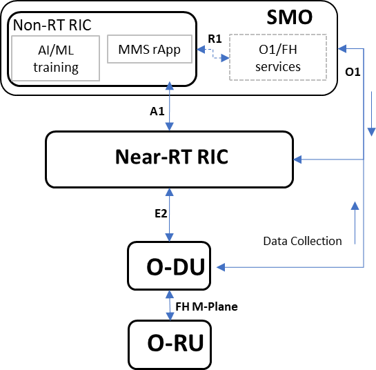

11

12 Figure 6.2.3.2-1. O-RAN Architecture Diagram for MIMO mode selection use case

13

1

2 Figure 6.2.3.2-2. Call Flow Diagram for MIMO mode selection use case

3

1. In the call in Figure 6.2.3.2-2, the rApp can request the current MIMO configuration listed in Table 6.2.3.2-6 (steps 2-5),
2. as well as current network measurements and KPIs listed in Table 6.2.3.2-1 to Table 6.2.3.2-5 (steps 7-10). The R1
3. interface is used by the rApp to communicate these requests to SMO, which in turn coordinates the collection via O1
4. interface. The AI/ML model that is part of the rApp will use the measurements to evaluate the current capacity and UE
5. performance and if required, will generate a recommendation to update one or more of the identified configuration knobs
6. (step 16). This new recommendation is sent to SMO via R1 interface, and finally communicated to the O-DU via O1
7. interface (step 18).

11

###### Requirements

1. In order to achieve the value proposition described above, the key Massive MIMO KPIs or dials need to be monitored to
2. assess the state of the system.
3. All the dials/measurements listed here are required at a configurable granularity in multiples of 1 minute, ranging from 1
4. to 15 minutes.

17

18

|  |  |  |  |  |  |  |  |
| --- | --- | --- | --- | --- | --- | --- | --- |
| O1 | O-DU  -> Non- RT RIC | Percent TTIs SU-MIMO vs. MU- MIMO vs Hybrid (TTi with SU- MIMO and MU-MIMO) | Perc ent | 1 .. 15 min. | | [Dial15] | New measurement definition New measurement reporting |
| O1 | O-DU  -> Non- RT RIC | Histogram of percent usage vs. # of MU-MIMO users (users = 2,...,K) | Perc ent | 1 .. 15 min. | | [Dial16] | New measurement definition New measurement  reporting |
| O1 | O-DU  -> Non- RT RIC | Joint Histogram of simultaneous MU-MIMO and SU-MIMO Layers assigned per PRB (MU-MIMO percentage vs. MU-MIMO (layers 1,...,N) and N SU-MIMO (layers 1,...,M) histograms each conditioned  on a given no. of MU-MIMO layers) | Perce nt | | 1 .. 15  min. | [Dial17] | New measurement definition New measurement reporting |

1 Table 6.2.3.2-1. Dials for indication of MIMO types and layers

2

|  |  |  |  |  |  |  |
| --- | --- | --- | --- | --- | --- | --- |
| O1 | O-DU  -> Non- RT RIC | Downlink CQI Report histogram (one CQI histogram (percent use vs. CQI index) for each number of MU- MIMO UEs in parallel (e.g., 1,2,3,..K) (see Section 3.3 for other  use cases) | Perce nt | 1 .. 15  min. | [Dial18] | New measurement definition New measurement  reporting |
| O1 | O-DU  -> Non- RT RIC | ZP reference measurement value per beam (average value - dBm) | dBm | 1 .. 15  min. | [Dial20] | New measurement definition New  measurement reporting |
| O1 | O-DU  -> Non- RT RIC | Para. 5.1.6 ([5]) CSI signal-to-noise and interference ratio (CSI-SINR) histogram | Perce nt | 1 .. 15  min. | [Dial21] | Existing specification [5]  New measurement reporting |

3 Table 6.2.3.2-2. Dials for downlink MIMO quality

4

5

|  |  |  |  |  |  |  |
| --- | --- | --- | --- | --- | --- | --- |
| O1 | O-DU  -> Non- RT RIC | Minimum, Average (linear), and Maximum Uplink SINR or Co-UE interference, Noise and External Interference Level per UE (MU- MIMO pair histogram (SINR range: -  10 dB to + 30 dB) for 1,2, 3,..., K UEs) | Perce nt | 1 .. 15  min. | [Dial22] | New measurement definition New measurement reporting |
| O1 | O-DU  -> Non- RT RIC | Percent time MU-MIMO UEs are at maximum TX power and < 5 PRB (Ref. [3]) | Perce nt | 1 .. 15  min. | [Dial24] | New measurement definition New measurement reporting |

1. Table 6.2.3.2-3. Dials for uplink MIMO quality

2

|  |  |  |  |  |  |  |
| --- | --- | --- | --- | --- | --- | --- |
| O1 | O-DU ->  Non-RT RIC | SU-MIMO Condition number in dB histogram (21 dB to 0 dB) | Perce nt | 1 .. 15  min. | [Dial28] | New measurement definition New measurement  reporting |
| O1 | O-DU ->  Non-RT RIC | SU-MIMO Reported Rank distribution histogram (Rank = 1,....,Max Rank) | Perce nt | 1 .. 15  min. | [Dial29] | New measurement definition New measurement  reporting |

3 Table 6.2.3.2-4. Dials for condition number

4

5

|  |  |  |  |  |  |  |
| --- | --- | --- | --- | --- | --- | --- |
| O1 | O-DU  -> Non- RT RIC | MU-MIMO PRB Utilization Histogram | Perce nt | 1 .. 15  min. | [Dial30] | New measurement definition New measurement reporting |
| O1 | O-DU  -> Non- RT RIC | Total PRB % Used Supporting MU- MIMO histogram | Perce nt | 1 .. 15  min. | [Dial31] | New measurement definition New measurement  reporting |
| O1 | O-DU  -> Non- RT RIC | MU-MIMO PDCP Volume  histogram | Perce nt | 1 .. 15  min. | [Dial32] | New measurement definition New measurement  reporting |
| O1 | O-DU  -> Non- RT RIC | MU-MIMO DRB (DL and UL)  Throughput Histograms (min., ave., and max.) (100 kbps, 200, kbps, etc. 10 Gbps) vs. Mu-MIMO layers (1,2,....,K) | Perce nt | 1 .. 15  min. | [Dial33] | New measurement definition New measurement  reporting |
| O1 | O-DU  -> Non- RT RIC | MU-MIMO Spectral Efficiency (8\*PDCP Volume/(BW\*PRB utilization), bits/sec./Hz histogram over measurement period, where BW  = bandwidth, Hz) note: all parallel/paired PRBs count as one  over a TTI | Perce nt | 1 .. 15  min. | [Dial34] | New measurement definition New measurement reporting |
| O1 | O-DU  -> Non- RT RIC | SU-MIMO PRB distribution histogram | Perce nt | 1 .. 15  min. | [Dial35] | New measurement definition New measurement  reporting |
| O1 | O-DU  -> Non- RT RIC | SU-MIMO PDCP Volume (Mbytes) histogram | Perce nt | 1 .. 15  min. | [Dial36] | New measurement definition New measurement  reporting |
| O1 | O-DU  -> Non- RT RIC | SU-MIMO DRB (DL and UL)  Throughput (Kbits/sec.) Histogram as a function of Mu----------------- MIMO layers (1,2,...,K) | Perce nt | 1 .. 15  min. | [Dial37] | New measurement definition New  measurement reporting |
| O1 | O-DU  -> Non- RT RIC | SU-MIMO Spectral Efficiency (8\*PDCP Volume/(BW\*PRB) utilization ratio (bits/sec./Hz) histogram over measurement period, where BW = bandwidth, Hz) | Perce nt | 1 .. 15  min. | [Dial38] | New measurement definition New  measurement reporting |

1. Table 6.2.3.2-5. Dials for spectral efficiency

1

1. Similar to the measurement and monitoring objective of the "dials" section, the control of key parameters is the objective
2. of the "knobs" section. This allows the value proposition of allowing each operator to satisfy their respective unique
3. optimality criteria via emerging AI/ML technologies.
4. Must have: Settable SU-MIMO only or MU-MIMO only mode per class of user (e.g., QCI)
5. Must have: Specifiable threshold on condition number and SINR that dictates the scheduled SU-MIMO rank of any given
6. user

8

|  |  |  |  |  |  |  |
| --- | --- | --- | --- | --- | --- | --- |
| O1 | Non-RT  RIC -> O-DU | Operator shall be able to set any UE  to either SU-MIMO only or MU- MIMO only by QCI threshold | integer | 1 .. 15  min. | [Knob13] | New |
| OI1 | Non-RT RIC -> O-DU | Set SU-MIMO Rank. The condition number (ratio of the max. eigenvalue to min. eigenvalue) shall be calculated internally in real time and allow the operator to set a threshold based on condition number that is used to take the UE reported SU-MIMO rank and convert to a gNB transmitted rank | integer | 1 .. 15  min. | [Knob14] | New |
| O1 | Non-RT  RIC -> O-DU | CSI-RS density (0.3, 1, 3, etc.) | Fixed point | 1 .. 15  min. | [Knob20] | New |

1. Table 6.2.3.2-6. Knobs for MIMO mode setting and beam commands
2. Note: It is FFS whether any of the listed measurements have any dependency on O-RU and if any information needs to
3. be exchanged over O-RAN FH m-plane interface from O-RU to O-DU. 12
4. O-RAN Entity roles:
5. 1) SMO & Non-RT RIC
6. a) Collect existing configuration and performance data from RAN
7. b) Trigger AI/ML Model training/update and deployment as necessary
8. c) Apply MIMO pairing control recommendations from rApp via R1 and O1 interface using config management
9. service.
10. 2) O-CU nodes
11. a) Report current configuration and performance data to non-RT RIC rApp via O1 interface if required.
12. 3) O-DU nodes
13. a) Report current configuration and performance data to non-RT RIC rApp via O1 interface.
14. b) Apply MIMO pairing control related knobs based on rAPP recommendation. 24

####  Impact Analysis on O-RAN WGs

1. *Editor's note: This is an initial impact analysis as part of the WG1 UCTG work on mMIMO. The intention is to estimate*
2. *the expected standardization effort within the O-RAN working groups. It is up to the WGs to decide how the mMIMO*
3. *functionality should be specified in specifications of each WG, and whether it will be part of existing or new set of*
4. *specifications.*
5. WG1 (use cases, architecture) Impact
6. ? Update WG1 use case analysis report and use-case detailed specification with MU-MIMO pairing control use
7. case. No impact to existing architecture.
8. WG2 (Non-RT RIC, A1, R1) Impact
9. ? Assess impact to A1 and R1 interfaces and non-RT RIC architecture, including AI/ML training and deployment.
10. ? Add new use cases and corresponding requirements and specifications in case there is an impact to A1 or R1
11. interfaces.
12. WG5 (O-CU and O-DU) Impact
13. ? Assess impact on O-CU and O-DU support for dials and knobs described in the use-case.
14. WG10 (SMO, O1) Impact
15. ? Assess impact with PM coordination group and IM/DM coordination group on support of proposed dials
16. (measurements) and knobs (configuration IM/DM) and incorporation in existing O1 interface models, as well as
17. any required coordination with 3GPP.
18. Summary: A detailed analysis of the specification impact is to be completed. There is large specification impact to
19. specify new proposed measurement definitions and measurement reporting. The impact of the required measurements
20. and configurations will be reduced if they are already part of ongoing/upcoming O-RAN specifications (ffs) or are being
21. considered for specification in other bodies such as 3GPP (ffs). 18

19

# 1 7 Comparison and Conclusions

1. This Technical Report presents the results of the pre-normative phase mMIMO work item. Multiple mMIMO optimization
2. algorithms have been analyzed, including beam-based Mobility Robustness Optimization, Grid of Beam Optimization,
3. Non-Grid of Beam Optimization, L1/L2 Beam Management Optimization, AI/ML assisted optimized SS Burst Set,
4. DMRS and CSI-RS configuration.
5. Beam-based Mobility Robustness Optimization (bMRO) is an autonomous self-optimizing algorithm that improves beam-
6. based inter-cell mobility performance by applying beam-specific Cell Individual Offsets (CIO) on the handover triggers
7. between neighbor cells, based on the analysis of beam-specific mobility-related counters. The bMRO algorithm might be
8. hosted in Non-RT RIC or Near-RT RIC. Based in mobility KPIs forwarded to the RIC from the O-CU, the RIC configures
9. the beam-based CIO in the O-DUs. Simulation based evaluation shows a significant reduction in too early and too late
10. handovers as well as a reduction of the total UE outage and mobility failure rate, as well as a reduced number of ping-
11. pong handovers. The gain was shown for a mixed mobility (UEs with 3 km/h and 30 km/h) scenario in an urban micro
12. deployment according to 3GPP TR38.901. The computational complexity and signaling overhead are a multiple of that
13. of the legacy cell-based MRO where the multiplier is the number of beams that are supported in a cell. Complexity and
14. signaling overhead can be reduced by enhanced proprietary implementations, e.g., forming virtual groups of beams with
15. similar characteristics. bMRO is suggested for normative standardization with the foreseen impact on O-RAN WGs as
16. outlined in Section 3.3.3. There is a dependency on completion of 3GPP Rel.17 for the completion of stage 3 in O-RAN.
17. Grid of Beam Optimization (GoB) provides an automated beam forming configuration tailored to the topology of the cell,
18. the physical environment, as well as the distribution of users and traffic in a cell (e.g. wide beams might cover low-density
19. areas while narrow beams might cover high-density areas). The output of the algorithm are the optimized GoB BF
20. configurations, that are, the number of beams and either i) the beam directions, horizontal & vertical beam widths, and
21. power allocation of beams, or ii) the beam weights, transferred via the Open Fronthaul interface. The GoB algorithm
22. might be hosted in Non-RT RIC or Near-RT RIC. First trial results show that the ML based beam pattern optimization
23. algorithm can adapt to the traffic distribution and hence provides a significant gain in terms of weighted downlink RSRP.
24. Uplink throughput enhancements are also expected since SSB beams are used for uplink receive beamforming. The gain
25. was shown for NR TDD at 3.5 GHz with 1 to 20 UEs either stationary or with drive tests in a shopping street scenario.
26. Different options for input parameters have been identified in the pre-normative phase, which are not supported by
27. existing O-RAN and 3GPP specifications. The output parameters are supported by the existing O-RAN Open Fronthaul
28. specification (i.e. O-FH M-Plane, O-FH CUS-Plane). GoB is suggested for normative standardization with the foreseen
29. impact on O-RAN WGs as outlined in Section 3.2.3, while the preferred option for input parameter still needs to be
30. analyzed and selected.
31. Non-GoB optimization makes use of AI/ML techniques to optimize the beamforming algorithm for each UE, depending
32. on UE and cell conditions. Multiple beamforming algorithm options exist, including both Grid of Beams and Non-Grid
33. of Beams, the latter typically involving beam weights being calculated based on SRS measurements. This itself comprises
34. multiple different algorithm options, which can have differing relative performance depending on UE conditions, cell
35. conditions, SRS configuration, etc. Therefore, it is important that the optimal choice of beamforming algorithm option is
36. applied for each UE. The non-GoB use case takes into account that such beamforming algorithms are generally proprietary
37. and vendor specific. Training is assumed to be cell-based, residing in non-RT RIC, making use of measurements reported
38. from O-DU as well as enrichment data obtained externally, for example related to location and mobility. Inferencing is
39. assuming to be hosted in an xApp in near-RT RIC, based on similar measurements as for training, the output of which is
40. the control of the beamforming modes that should be applied for a given UE. The control may be specified separately for
41. multiple MIMO options (e.g. SU and MU). The update rate is assumed to be 100s of ms, considerably slower than the
42. MAC scheduling update rate. Initial simulation results for a simple SU-MIMO case demonstrate the opportunity for
43. significant performance gains by tailoring beamforming mode to the UE conditions. Per-UE measurement reporting might
44. be specified in 3GPP specifications (e.g. 3GPP TS37.320) and referred to in O1/E2 specifications with limited or no
45. impact on O-RAN specifications. Or per-UE measurement reporting might be specified in O-RAN specifications with
46. small impact on WG3 and potentially moderate impact WG5. Non-GoB is suggested for normative standardization with
47. the foreseen impact on O-RAN WGs as outlined in 5.2.3.
48. In yet another optimization approach, AI/ML assisted network-wide (multi-gNB/TRP) optimizations framework
49. proactively and autonomously infers optimal configuration per gNB/TRP for SS Burst Set, DMRS and CSI-RS based on
50. available measurements, observations, and PIs at different nodes of the 3GPP NR and/or O-RAN access and core network
51. elements. One of the preferred options is to train the AI/ML model offline in the SMO/Non-Real Time RIC. Trained
52. model might be hosted in Non-Real Time RIC or Near-Real Time RIC depending on the selected optimization problem.
53. For SS Burst Set configuration optimization, offline trained AI/ML model can be deployed in Non-Real Time RIC as
54. rAPP. Based on the KPIs, observations and measurements from E2 nodes over O1 interface, inferred optimal SS Burst
55. Set configuration is applied to E2 nodes (O-CU and/or O-DU) over O1 interface. Numerical analysis-based data presented
56. as use case feasibility analysis shows that optimal configurations have potential to improve per-gNB/TRP spectral
57. efficiency through saving time-frequency resources for both FR1 and FR2 systems with multiple transceiver chains. One
58. of the design goals of the AI/ML optimizer is that it should target to limit the impacts on other system performances (e.g,
59. initial access latency, maximum mobility support etc.) through operator defined KPI constrained optimization technique.
60. Impacts on the R1 interface. For both DMRS and CSI-RS configuration optimization use cases, Near-Real Time RIC is
61. considered as one of the preferred model deployment options. Optimal configurations can be generation every few tens
62. of ms when needed by the E2 nodes. These configurations are UE specific. Trained model uses measurements,
63. observations and PI generated by E2 nodes to derive the inference and applies back to E2 nodes over E2 interface.
64. Numerical calculation-based analysis shows that optimal configurations can improve per-gNB/TRP spectral efficiency
65. noticeably through saving time-frequency resources for both FR1 and FR2 systems with multiple transceiver chains. One
66. important aspect of the optimizer is to limit the impacts on other system performances (e.g, maximum mobility support,
67. time-frequency tracking accuracy etc.) through KPI (operator specified) constrained optimization techniques.
68. Computational complexity for all three use cases described in this section depends on the size of training data set
69. (measurement, observations and KPI data set) and the type of algorithm used. AI/ML assisted optimized SS Burst Set,
70. DMRS and CSI-RS configuration is suggested for normative standardization with the foreseen impact on O-RAN WGs
71. as outlined in section 3.4.2.1.1 and section 3.4.2.2.1.
72. L1/L2 Beam Management Optimization will contribute to improved network performance in terms of throughput and
73. reliability by utilizing AI/ML techniques to enable RAN to make wiser decision on UE-specific beam management
74. operations. The beam management optimization algorithm could be used to estimate or predict the quality of beams based
75. on limited beam measurement reported from O-DU as well as enrichment information (e.g., UE position and velocity)
76. obtained externally, which allows beam selection with high accuracy and ensures reliable radio link against blockage,
77. especially in mmWave. The output of algorithm will be the optimized control/policy related to beam management
78. operations, which may potentially involve the configuration of beam measurement/reporting, beam indication and beam
79. failure recovery, could be further study in the normative phase. Initial simulation results which assumed high-mobility
80. urban street scenario show that the AI/ML-based solution can ensure beam tracking accuracy while significantly reducing
81. beam measurement overhead. Different deployment options were discussed and compared (e.g., the AI/ML model
82. training and inference can be hosted in the Non-RT RIC and Near-RT RIC respectively, or the AI/ML model training can
83. be hosted in Non/Near-RT RIC while the AI/ML inference can be hosted in the E2 Nodes), which demonstrate different
84. strengths and weaknesses. L1/L2 Beam Management Optimization is suggested for normative standardization with the
85. foreseen impact on O-RAN WGs as outlined in Section 4.2.3. 37

## 7.1 Summary of Evaluation

|  |  |  |  |  |  |
| --- | --- | --- | --- | --- | --- |
|  | **Solution** | **Means of evaluation** | **Summary of result** | **#of Input Parameters** | **#of Output Parameters** |
| 1 | GoB Optimization | Trial results with 1 to 20 UEs,  stationary or drive test, shopping street scenario | 8.2 dB gain of weighted RSRP | 1  (up to 3 options might be  defined) | 1 |
| 2 | bMRO Optimization | Detailed multi-cell system level simulation (incl. UE L3 mobility, detailed timers etc.) | Gain against legacy MRO  58% less too-late HO 23% less too-early HO | 5 | 1 |
| 3a | GoB RRM SSB Opt. | Numerical RS overhead analysis based on available numerologies in the 3GPP NR | Max. potential gain (best vs. worst) numerology neglecting other impact | 9 | 1 + 6  (6 initialization) |
| 3b | GoB RRM DMRS Opt. | Numerical RS overhead analysis based on available numerologies in the 3GPP NR | Max. potential gain (best vs. worst) numerology neglecting other impact | 8 | 1 + 2  (2 initialization) |
| 3c | GoB RRM CSI-RS Opt. | Numerical RS overhead analysis based on available numerologies in the 3GPP NR | Max. potential gain (best vs. worst) numerology neglecting other impact | 8 | 1 + 2  (2 initialization) |
| 4 | L1/2 Beam Management | Urban street with 1 gNB @28 GHz, simplified UE mobility (60km/h fixed), different beam  measurement periods | No loss of beam measurement accuracy even for reduced beam measurement  period | 7 | 1  (output options ffs) |
| 5 | Non-GoB Optimization | Simplified, single cell simulation, Single suboptimum SU-MIMO fixed 2 layers mode (GoB vs. non-GoB mode) for 1 km/h and 120 km/h | Max. potential gain against a fixed suboptimum MIMO mode  1km/h: 2% av. & 60% 5%tile TP 120km/h: 14% av. & 141% 5%tile TP | 7 | 1 + 3  (2 initialization + 1 training)  (training config. ffs) |
| 6 | DL Tx Power Opt. | Simple single cell urban scenario at 2 GHz with 8 UEs with no inter-cell interference | Different SINR received at UEs using MU- MIMO is shown. No results otherwise. | 5 | 1 |
| 7 | MU-MIMO User Pairing | No | No | 40 | 16 |
| 8 | SU-/MU-MIMO Switching | No | No | 19 | 3 |

1. **Table 7.1-1: Summary of Evaluation**

## 7.2 Impact on standardization

|  |  |  |  |  |  |  |  |  |  |  |  |  |  |
| --- | --- | --- | --- | --- | --- | --- | --- | --- | --- | --- | --- | --- | --- |
|  | **Solution** | | **# of new measurement definitions** | **# of new measurement reporting** | **# of new output parameter definition 1)** | | | **# of new output parameter configuration2)** | | | **O-RAN**  **impact analysis** | **3GPP**  **impact analysis** | **Suggested split between 3GPP / O-RAN** |
| 1 | GoB Optimization | | 1 or 2 | 1 or 2 | 0 | | | 0 | | | Yes | Detailed analysis. | O-RAN refers to 3GPP spec for measurements |
| 2 | bMRO  Optimization | | 5 (currently discussed in  3GPP Rel.17) | 5 (currently discussed in  3GPP Rel.17) | 1 (currently discussed in  3GPP Rel.17) | | | 1 (currently discussed in  3GPP Rel.17) | | | Yes | Detailed analysis. Rel.17 work  ongoing. | O-RAN refers to 3GPP spec for measurements |
| 3a | GoB RRM  Opt. | SSB | 4 | 6 | 0 | | | 1 + 1 (init.) | | | Yes | General analysis | O-RAN refers to 3GPP spec for measurements |
| 3b | GoB RRM DMRS  Opt. | | 2 | 5 | 0 | | | 1 + 2 (init.) | | | Yes | General analysis | O-RAN refers to 3GPP spec for measurements |
| 3c | GoB RRM  RS Opt. | CSI- | 3 | 6 | 0 | | | 1 + 2 (init.) | | | Yes | General analysis | O-RAN refers to 3GPP spec for measurements |
| 4 | L1/2 Beam Management | | 1 (optional) | 4 | 0 | | | 1 | | | Yes | General analysis | 2 Options |
| 5 | Non-GoB Optimization | | 0 | 5 | 1 + 3  training) | (init. | + | 1 +2  training) | (init. | + | Yes | General analysis | 2 Options |
| 6 | DL Tx Power Opt. | | 5 | 5 | 1 | | | 1 | | | ffs | ffs | ffs |
| 7 | MU-MIMO  Pairing | User | 40 | 40 | 16 | | | 16 | | | ffs | ffs | ffs |
| 8 | SU/MU-MIMO  Switching | | 19 | 19 | 3 | | | 3 | | | ffs | ffs | ffs |

1. Table 7.2-1: Impact on standardization
2. Note 1) An example for an output parameter definition is an Information Element as defined in the 3GPP RRC specification or any interface specification (e.g. Xn, NG).
3. Note 2) An example for an output parameter configuration is an Information Element for gNB configuration as defined in the 5G Network Resource Model in 3GPP TS28.541.

5

## 7.3 Synergies among new measurements (definition and/or reporting)

|  |  |  |  |  |  |  |  |  |
| --- | --- | --- | --- | --- | --- | --- | --- | --- |
| **Name** | **Measured at which entity** | **UE or cell specific reporting** | **GoB Opt.** | **L1/2 Beam Management** | **Non-GoB Opt.** | **SSB, CSI-RS, DM-RS Opt.** | **MIMO**  **Optimization** | **Measurement synergies** |
| CSI report (e.g CQI, PMI, RI, LI,  CRI) | UE report | per UE | x | x |  | x | x (histogram) | 3 + 1 |
| Channel Covariance Matrix | O-DU | per UE | x |  |  |  | x | 2 |
| L1-RSRP (SSB or  CSI based) | UE report | per UE |  | x | x | x |  | 3 |
| L1-SINR (SSB or  CSI based) | UE report | per UE |  | x | x |  | x (histogram) | 2 + 1 |
| UL SRS RSRP | O-DU | per UE |  |  | x | x |  | 2 |

1. Table 7.3-1: Synergies among new measurements
2. Note 1: Table 7.3-1 is limited to new input measurements mentioned in multiple proposals.
3. Note 2: The beam-based MRO proposal is not considered in Table 7.3-1, since it does not have commonalities in terms of input/output parameters with the other proposals.

# 1 Annex A Input and output data and its relation to 3GPP

2 specification

1. One of the objectives of the Massive MIMO pre-normative phase is to analyse and evaluate the set of input/output
2. parameters for each Massive MIMO use case. Once identified, the impact on O-RAN specification as well as
3. dependencies on 3GPP specifications should be analyzed. This annex provides some background information on how
4. input/output parameters might relate to 3GPP specifications.
5. 3GPP defines a very large number of measurements. Among others, these include:
6. ? Layer 1 (PHY) UE and gNB measurements
7. o Signal strength and signal quality measurements
8. o TS 38.215 NR; Physical layer measurements
9. ? Layer 2 (MAC) UE measurements
10. o Power headroom reporting and buffer status reporting
11. o TS 38.321 NR; Medium Access Control (MAC) protocol specification
12. ? Layer 2 (MAC) gNB measurements
13. o Load, delay and packet loss rate measurements
14. o TS 38.314 NR; Layer 2 measurements
15. ? Layer 3 (RRC) UE measurements
16. o Mobility measurements and measurement reporting
17. o TS 38.331 NR; Radio Resource Control (RRC); Protocol specification
18. There are many more well-defined measurements often exchanged via peer to peer signalling embedded in various
19. protocols. Over the generations 3GPP refined its specifications and extended the number of standardized measurements.
20. For instance, the L2 gNB measurements have been specified with the introduction of 3GPP LTE. It can be assumed that
21. most of the measurements as specified in 3GPP are implemented in the UE and at the network side. Besides the accurate
22. specification for implementation, there are also extensive test specifications defined for each measurement, at least for
23. UE measurement reporting.
24. Besides the measurements as such, also means for reporting measurements and other metrics towards the management
25. system are defined. Current 3GPP specifications define different types of metrics. Most relevant specifications in this
26. perspective are:
27. ? TS 28.552 specifies 5G Performance Measurements (PMs). These are counters aggregated, e.g., per DU, CU or
28. per core function, for example an AMF Function. An example is the "Number of Active UEs in the DL per cell"
29. which provides information about the mean number of active UEs in a cell.
30. ? TS 28.554 specifies 5G end to end Key Performance Indicators (KPIs). These specify further aggregation of the
31. counters defined in TS 28.552. One example is the "maximum registered subscribers of network slice through
32. AMF" (clause 6.2.6) where the subscribers in the AMF that are registered are aggregated per network slice.
33. ? TS 37.320 and TS 32.422 specify trace and minimization of drive test (MDT). Trace logs are messages per UE
34. and MDT reports are measurements per UE. The defined MDT measurements for RRC\_CONNECTED UEs are
35. for instance RSRP, RSRQ, SINR, Power Headroom, PDCP SDU Data Volume, Average UE throughput, Packet
36. Delay, Packet loss rate etc. Also logging of MDT measurements of RRC\_IDLE or RRC\_INACTIVE UEs are
37. specified.
38. O-RAN commonly uses 3GPP measurement definitions, measurement procedures, and data models as defined by the
39. respective 3GPP specifications and by reusing defined data models such as defined YANG models. Some examples are:
40. ? O-RAN.WG1.O1-Interface.0-v04.00
41. o Procedures for Performance Data File Reporting and for Performance Data Streaming are specified in

44 3GPP TS 28.532

1. o The Information Object Classes (IOC) for collection of management data including PM, KPI, Trace
2. and MDT are specified in 3GPP TS 28.622 (stage 2) and TS 28.623 (stage3).
   1. o Trace and MDT Management Services are specified in 3GPP TS 32.421, TS 32.422 and TS 32.423.
   2. The functions and procedures of Immediate and Logged MDT are described in 3GPP TS 37.320.
   3. ? O-RAN.WG3.E2SM-KPM-v02.00
   4. o Refers to measurement definitions provided in 3GPP TS 28.552 for NR and 3GPP TS 32.425 for LTE

5 ? O-RAN: O-RAN.WG5.MP.0-v02.00

1. o Performance data file reporting, data streaming and measurement job control as defined in O-
2. RAN.WG1.O1-Interface.0-v04.00

8 ? O RAN.WG5.O-CU-O1.0-v01.00

1. o Fault Supervision Management Services of O1 Interface contains Fault Supervision MnS as specified
2. in 3GPP TS28.545
3. o AlarmList IOC and AlarmRecord data type refer to 3GPP TS28.622. The corresponding solution sets
4. (stage 3) for YAML and YANG are specified in 3GPP TS 28.623
5. o O-CU-CP and O-CU-UP follow 3GPP SA5 data models and YANG modules as specified in 3GPP

14 TS28.541

15 Similar principles are applied for configuration / provisioning management, where services and data models from 3GPP

16 (e.g. as defined in 3GPP TS 28.532 or 3GPP TS 28.541) are commonly reused over O-RAN interfaces such as O1 and

17 E2. Some examples are:

18 ? O-RAN.WG3.E2SM-RC-v01.01.00

19 o RAN Parameters for Control Action refer to RAN parameters defined in 3GPP specifications such as

20 3GPP TS 28.541, TS 38.331, TS 38.423 TS 38.463, TS 38.473 etc.

21 ? O RAN.WG5.O-CU-O1.0-v01.00

22 o The SMO configuration of O-DU is based on 3GPP SA5 data models and YANG modules specified in

23 3GPP TS 28.541.

24 ? O-RAN.WG5.MP.0-v02.00

1. o The SMO configuration of O-CU-CP and O-CU-UP is based on 3GPP SA5 data models and YANG
2. modules specified in 3GPP TS 28.541. 27

28

# 1 Annex ZZZ: O-RAN Adopter License Agreement

1. BY DOWNLOADING, USING OR OTHERWISE ACCESSING ANY O-RAN SPECIFICATION, ADOPTER
2. AGREES TO THE TERMS OF THIS AGREEMENT.
3. This O-RAN Adopter License Agreement (the "Agreement") is made by and between the O-RAN Alliance and the entity
4. that downloads, uses or otherwise accesses any O-RAN Specification, including its Affiliates (the "Adopter").
5. This is a license agreement for entities who wish to adopt any O-RAN Specification.

## Section 1: DEFINITIONS

1. 1.1 "Affiliate" means an entity that directly or indirectly controls, is controlled by, or is under common control with
2. another entity, so long as such control exists. For the purpose of this Section, "Control" means beneficial ownership of
3. fifty (50%) percent or more of the voting stock or equity in an entity.
4. 1.2 "Compliant Implementation" means any system, device, method or operation (whether implemented in hardware,
5. software or combinations thereof) that fully conforms to a Final Specification.
6. 1.3 "Adopter(s)" means all entities, who are not Members, Contributors or Academic Contributors, including their
7. Affiliates, who wish to download, use or otherwise access O-RAN Specifications.
8. 1.4 "Minor Update" means an update or revision to an O-RAN Specification published by O-RAN Alliance that does not
9. add any significant new features or functionality and remains interoperable with the prior version of an O-RAN
10. Specification. The term "O-RAN Specifications" includes Minor Updates.
11. 1.5 "Necessary Claims" means those claims of all present and future patents and patent applications, other than design
12. patents and design registrations, throughout the world, which (i) are owned or otherwise licensable by a Member,
13. Contributor or Academic Contributor during the term of its Member, Contributor or Academic Contributorship; (ii) such
14. Member, Contributor or Academic Contributor has the right to grant a license without the payment of consideration to a
15. third party; and (iii) are necessarily infringed by a Compliant Implementation (without considering any Contributions not
16. included in the Final Specification). A claim is necessarily infringed only when it is not possible on technical (but not
17. commercial) grounds, taking into account normal technical practice and the state of the art generally available at the date
18. any Final Specification was published by the O-RAN Alliance or the date the patent claim first came into existence,
19. whichever last occurred, to make, sell, lease, otherwise dispose of, repair, use or operate a Compliant Implementation
20. without infringing that claim. For the avoidance of doubt in exceptional cases where a Final Specification can only be
21. implemented by technical solutions, all of which infringe patent claims, all such patent claims shall be considered
22. Necessary Claims.
23. 1.6 "Defensive Suspension" means for the purposes of any license grant pursuant to Section 3, Member, Contributor,
24. Academic Contributor, Adopter, or any of their Affiliates, may have the discretion to include in their license a term
25. allowing the licensor to suspend the license against a licensee who brings a patent infringement suit against the licensing
26. Member, Contributor, Academic Contributor, Adopter, or any of their Affiliates.

## Section 2: COPYRIGHT LICENSE

1. 2.1 Subject to the terms and conditions of this Agreement, O-RAN Alliance hereby grants to Adopter a nonexclusive,
2. nontransferable, irrevocable, non-sublicensable, worldwide copyright license to obtain, use and modify O-RAN
3. Specifications, but not to further distribute such O-RAN Specification in any modified or unmodified way, solely in
4. furtherance of implementations of an O-RAN
5. Specification.
6. 2.2 Adopter shall not use O-RAN Specifications except as expressly set forth in this Agreement or in a separate written
7. agreement with O-RAN Alliance.

## Section 3: FRAND LICENSE

1. 3.1 Members, Contributors and Academic Contributors and their Affiliates are prepared to grant based on a separate
2. Patent License Agreement to each Adopter under Fair Reasonable And Non- Discriminatory (FRAND) terms and
3. conditions with or without compensation (royalties) a nonexclusive, non-transferable, irrevocable (but subject to
4. Defensive Suspension), non-sublicensable, worldwide patent license under their Necessary Claims to make, have made,
5. use, import, offer to sell, lease, sell and otherwise distribute Compliant Implementations; provided, however, that such
6. license shall not extend: (a) to any part or function of a product in which a Compliant Implementation is incorporated that
7. is not itself part of the Compliant Implementation; or (b) to any Adopter if that Adopter is not making a reciprocal grant
8. to Members, Contributors and Academic Contributors, as set forth in Section 3.3. For the avoidance of doubt, the
9. foregoing licensing commitment includes the distribution by the Adopter's distributors and the use by the Adopter's
10. customers of such licensed Compliant Implementations.
11. 3.2 Notwithstanding the above, if any Member, Contributor or Academic Contributor, Adopter or their Affiliates has
12. reserved the right to charge a FRAND royalty or other fee for its license of Necessary Claims to Adopter, then Adopter
13. is entitled to charge a FRAND royalty or other fee to such Member, Contributor or Academic Contributor, Adopter and
14. its Affiliates for its license of Necessary Claims to its licensees.
15. 3.3 Adopter, on behalf of itself and its Affiliates, shall be prepared to grant based on a separate Patent License Agreement
16. to each Members, Contributors, Academic Contributors, Adopters and their Affiliates under Fair Reasonable And Non-
17. Discriminatory (FRAND) terms and conditions with or without compensation (royalties) a nonexclusive, non-
18. transferable, irrevocable (but subject to Defensive Suspension), non-sublicensable, worldwide patent license under their
19. Necessary Claims to make, have made, use, import, offer to sell, lease, sell and otherwise distribute Compliant
20. Implementations; provided, however, that such license will not extend: (a) to any part or function of a product in which a
21. Compliant Implementation is incorporated that is not itself part of the Compliant Implementation; or (b) to any Members,
22. Contributors, Academic Contributors, Adopters and their Affiliates that is not making a reciprocal grant to Adopter, as
23. set forth in Section 3.1. For the avoidance of doubt, the foregoing licensing commitment includes the distribution by the
24. Members', Contributors', Academic Contributors', Adopters' and their Affiliates' distributors and the use by the
25. Members', Contributors', Academic Contributors', Adopters' and their Affiliates' customers of such licensed Compliant
26. Implementations.

## Section 4: TERM AND TERMINATION

1. 4.1 This Agreement shall remain in force, unless early terminated according to this Section 4.
2. 4.2 O-RAN Alliance on behalf of its Members, Contributors and Academic Contributors may terminate this Agreement
3. if Adopter materially breaches this Agreement and does not cure or is not capable of curing such breach within thirty (30)
4. days after being given notice specifying the breach.
5. 4.3 Sections 1, 3, 5 - 11 of this Agreement shall survive any termination of this Agreement. Under surviving Section 3,
6. after termination of this Agreement, Adopter will continue to grant licenses (a) to entities who become Adopters after the
7. date of termination; and (b) for future versions of O-RAN Specifications that are backwards compatible with the version
8. that was current as of the date of termination.

## Section 5: CONFIDENTIALITY

1. Adopter will use the same care and discretion to avoid disclosure, publication, and dissemination of O-RAN
2. Specifications to third parties, as Adopter employs with its own confidential information, but no less than reasonable care.
3. Any disclosure by Adopter to its Affiliates, contractors and consultants should be subject to an obligation of
4. confidentiality at least as restrictive as those contained in this Section. The foregoing obligation shall not apply to any
5. information which is: (1) rightfully known by Adopter without any limitation on use or disclosure prior to disclosure; (2)
6. publicly available through no fault of Adopter; (3) rightfully received without a duty of confidentiality; (4) disclosed by
7. O-RAN Alliance or a Member, Contributor or Academic Contributor to a third party without a duty of confidentiality on
8. such third party; (5) independently developed by Adopter; (6) disclosed pursuant to the order of a court or other authorized
9. governmental body, or as required by law, provided that Adopter provides reasonable prior written notice to O-RAN
10. Alliance, and cooperates with O-RAN Alliance and/or the applicable Member, Contributor or Academic Contributor to
11. have the opportunity to oppose any such order; or (7) disclosed by Adopter with O-RAN Alliance's prior written approval.

## Section 6: INDEMNIFICATION

1. Adopter shall indemnify, defend, and hold harmless the O-RAN Alliance, its Members, Contributors or Academic
2. Contributors, and their employees, and agents and their respective successors, heirs and assigns (the "Indemnitees"),
3. against any liability, damage, loss, or expense (including reasonable attorneys' fees and expenses) incurred by or imposed
4. upon any of the Indemnitees in connection with any claims, suits, investigations, actions, demands or judgments arising
5. out of Adopter's use of the licensed O-RAN Specifications or Adopter's commercialization of products that comply with
6. O-RAN Specifications.

## Section 7: LIMITATIONS ON LIABILITY; NO WARRANTY

1. EXCEPT FOR BREACH OF CONFIDENTIALITY, ADOPTER'S BREACH OF SECTION 3, AND ADOPTER'S
2. INDEMNIFICATION OBLIGATIONS, IN NO EVENT SHALL ANY PARTY BE LIABLE TO ANY OTHER PARTY
3. OR THIRD PARTY FOR ANY INDIRECT, SPECIAL, INCIDENTAL, PUNITIVE OR CONSEQUENTIAL
4. DAMAGES RESULTING FROM ITS PERFORMANCE OR NON-PERFORMANCE UNDER THIS AGREEMENT,
5. IN EACH CASE WHETHER UNDER CONTRACT, TORT, WARRANTY, OR OTHERWISE, AND WHETHER OR
6. NOT SUCH PARTY HAD ADVANCE NOTICE OF THE POSSIBILITY OF SUCH DAMAGES. O-RAN
7. SPECIFICATIONS ARE PROVIDED "AS IS" WITH NO WARRANTIES OR CONDITIONS WHATSOEVER,
8. WHETHER EXPRESS, IMPLIED, STATUTORY, OR OTHERWISE. THE O-RAN ALLIANCE AND THE
9. MEMBERS, CONTRIBUTORS OR ACADEMIC CONTRIBUTORS EXPRESSLY DISCLAIM ANY WARRANTY
10. OR CONDITION OF MERCHANTABILITY, SECURITY, SATISFACTORY QUALITY, NONINFRINGEMENT,
11. FITNESS FOR ANY PARTICULAR PURPOSE, ERROR-FREE OPERATION, OR ANY WARRANTY OR
12. CONDITION FOR O-RAN SPECIFICATIONS.

## Section 8: ASSIGNMENT

1. Adopter may not assign the Agreement or any of its rights or obligations under this Agreement or make any grants or
2. other sublicenses to this Agreement, except as expressly authorized hereunder, without having first received the prior,
3. written consent of the O-RAN Alliance, which consent may be withheld in O-RAN Alliance's sole discretion. O-RAN
4. Alliance may freely assign this Agreement.

## Section 9: THIRD-PARTY BENEFICIARY RIGHTS

1. Adopter acknowledges and agrees that Members, Contributors and Academic Contributors (including future Members,
2. Contributors and Academic Contributors) are entitled to rights as a third-party beneficiary under this Agreement,
3. including as licensees under Section 3.

## Section 10: BINDING ON AFFILIATES

1. Execution of this Agreement by Adopter in its capacity as a legal entity or association constitutes that legal entity's or
2. association's agreement that its Affiliates are likewise bound to the obligations that are applicable to Adopter hereunder
3. and are also entitled to the benefits of the rights of Adopter hereunder.

## Section 11: GENERAL

1. This Agreement is governed by the laws of Germany without regard to its conflict or choice of law provisions.
2. This Agreement constitutes the entire agreement between the parties as to its express subject matter and expressly
3. supersedes and replaces any prior or contemporaneous agreements between the parties, whether written or oral, relating
4. to the subject matter of this Agreement.
5. Adopter, on behalf of itself and its Affiliates, agrees to comply at all times with all applicable laws, rules and regulations
6. with respect to its and its Affiliates' performance under this Agreement, including without limitation, export control and
7. antitrust laws. Without limiting the generality of the foregoing, Adopter acknowledges that this Agreement prohibits any
8. communication that would violate the antitrust laws.
9. By execution hereof, no form of any partnership, joint venture or other special relationship is created between Adopter,
10. or O-RAN Alliance or its Members, Contributors or Academic Contributors. Except as expressly set forth in this
11. Agreement, no party is authorized to make any commitment on behalf of Adopter, or O-RAN Alliance or its Members,
12. Contributors or Academic Contributors.
13. In the event that any provision of this Agreement conflicts with governing law or if any provision is held to be null, void
14. or otherwise ineffective or invalid by a court of competent jurisdiction, (i) such provisions will be deemed stricken from
15. the contract, and (ii) the remaining terms, provisions, covenants and restrictions of this Agreement will remain in full
16. force and effect.
17. Any failure by a party or third party beneficiary to insist upon or enforce performance by another party of any of the
18. provisions of this Agreement or to exercise any rights or remedies under this Agreement or otherwise by law shall not be
19. construed as a waiver or relinquishment to any extent of the other parties' or third party beneficiary's right to assert or
20. rely upon any such provision, right or remedy in that or any other instance; rather the same shall be and remain in full
21. force and effect.
---

- View in [Reader Mode](https://simewu.com/spec-reader/pages/12-WG1/O-RAN.WG1.mMIMO-Use-Cases-TR-v01.00.docx).
- Go back to [Table of Contents](../README.md).
- Download the [Original Document](https://github.com/Simewu/spec-reader/raw/refs/heads/main/documents/O-RAN.WG1.mMIMO-Use-Cases-TR-v01.00.docx).
