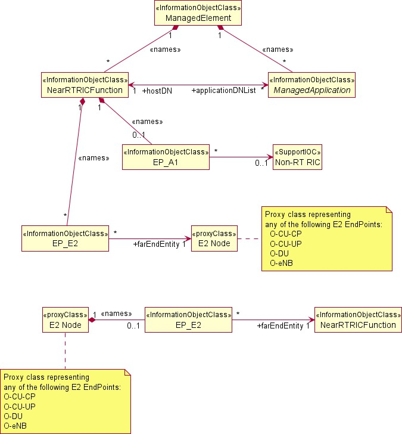
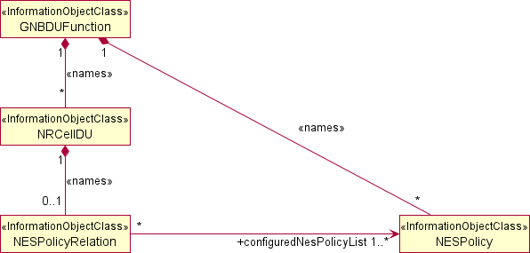
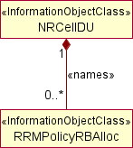
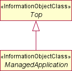
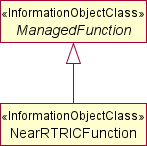
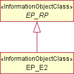
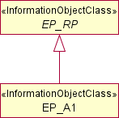
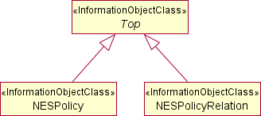
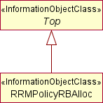

## O-RAN.WG10.TS.O1NRM.0-R004-v02.00.docx

- View in [Reader Mode](https://simewu.com/spec-reader/pages/03-WG10/O-RAN.WG10.TS.O1NRM.0-R004-v02.00.docx).
- Go back to [Table of Contents](../README.md).
- Download the [Original Document](https://github.com/Simewu/spec-reader/raw/refs/heads/main/documents/O-RAN.WG10.TS.O1NRM.0-R004-v02.00.docx).

---

O-RAN.WG10.TS.O1NRM-R004-v02.00

*Technical Specification*

**O-RAN Work Group 10 (OAM for O-RAN) O1 Network Resource Model**

Copyright (C) 2025 by the O-RAN ALLIANCE e.V.

The copying or incorporation into any other work of part or all of the material available in this specification in any form without the prior written permission of O-RAN ALLIANCE e.V. is prohibited, save that you may print or download extracts of the material of this specification for your personal use, or copy the material of this specification for the purpose of sending to individual third parties for their information provided that you acknowledge O-RAN ALLIANCE as the source of the material and that you inform the third party that these conditions apply to them and that they must comply with them.

O-RAN ALLIANCE e.V., Buschkauler Weg 27, 53347 Alfter, Germany Register of Associations, Bonn VR 11238, VAT ID DE321720189

# Contents

Foreword 3

Modal verbs terminology 3

1. Scope 3
2. References 3
   1. Normative references 3
   2. Informative references 4
3. Definition of terms, symbols and abbreviations 5
   1. Terms 5
   2. Symbols 5
   3. Abbreviations 5
4. Requirements 5
   1. General Requirements 5
5. Model 6
   1. Imported and associated information entities 6
      1. Imported information entities and local labels 6
      2. Associated information entities and local labels 6
   2. Class diagrams 6
      1. Relationships 6
      2. Inheritance 8
   3. Class definitions 10
      1. ManagedApplication 10
      2. NearRTRICFunction 11
      3. EP\_E2 11
      4. EP\_A1 12
      5. NESPolicy 12
      6. NESPolicyRelation 13
      7. RRMPolicyRBAlloc 14
   4. Attribute definitions 15
      1. Attribute properties 15
   5. Common notifications 19
      1. Alarm notifications 19
      2. Configuration notifications 19

Annex (informative): Change History 21

# Foreword

This Technical Specification (TS) has been produced by WG10 of the O-RAN Alliance.

The content of the present document is subject to continuing work within O-RAN and may change following formal O-RAN approval. Should the O-RAN Alliance modify the contents of the present document, it will be re-released by O-RAN with an identifying change of version date and an increase in version number as follows:

version xx.yy.zz where:

xx: the first digit-group is incremented for all changes of substance, i.e. technical enhancements, corrections, updates, etc. (the initial approved document will have xx=01). Always 2 digits with leading zero if needed.

yy: the second digit-group is incremented when editorial only changes have been incorporated in the document. Always 2 digits with leading zero if needed.

zz: the third digit-group included only in working versions of the document indicating incremental changes during the editing process. External versions never include the third digit-group. Always 2 digits with leading zero if needed.

# Modal verbs terminology

In the present document "**shall**", "**shall not**", "**should**", "**should not**", "**may**", "**need not**", "**will**", "**will not**", "**can**" and "**cannot**" are to be interpreted as described in clause 3.2 of the O-RAN Drafting Rules (Verbal forms for the expression of provisions).

"**must**" and "**must not**" are **NOT** allowed in O-RAN deliverables except when used in direct citation.

# Scope

The present document specifies the Information Model and the Data Model for Network Resource Model (NRM) that are foundational for functions carried out over the O-RAN O1 interface.

The O-RAN Information Model follows the methodology documented in 3GPP TS 32.160 [1] Clause 5.2.

# References

## Normative references

References are either specific (identified by date of publication and/or edition number or version number) or non-specific. For specific references, only the cited version applies. For non-specific references, the latest version of the referenced document (including any amendments) applies. In the case of a reference to a 3GPP document (including a GSM document), a non- specific reference implicitly refers to the latest version of that document in 3GPP Release 18.

NOTE: While any hyperlinks included in this clause were valid at the time of publication, O-RAN cannot guarantee their long-term validity.

The following referenced documents are necessary for the application of the present document.

1. 3GPP TS 32.160: "Management and orchestration; Management service template"
2. 3GPP TS 32.156: "Telecommunication management; Fixed Mobile Convergence (FMC); model repertoire"
3. 3GPP TS 28.622: "Telecommunication management; Generic Network Resource Model (NRM) Integration Reference Point (IRP); Information Service (IS)", 3GPP, v18.8.0, 2024-09
4. 3GPP TS 28.625: "Telecommunication management; State Management data definition Integration Reference Point (IRP); Information Service (IS)"
5. O-RAN.WG3.E2AP: "Near-Real-time RAN Intelligent Controller and E2 Interface -E2 Application Protocol (E2AP)"
6. O-RAN.WG3.RICARCH: "O-RAN Work Group 3 (Near-Real-time RAN Intelligent Controller and E2 Interface) Near-RT RIC Architecture"
7. 3GPP TS 28.658: "Telecommunication management; Evolved Universal Terrestrial Radio Access Network (E- UTRAN); Network Resource Model (NRM); Integration Reference Point (IRP); Information Service (IS)"
8. ITU-T Recommendation X.731: "Information technology - Open Systems Interconnection - Systems Management: State management function"
9. O-RAN.WG1.OAD: "O-RAN Architecture Description"
10. 3GPP TS 28.532: "Management and orchestration; Generic management services"
11. O-RAN TS: "O-RAN O1 Interface Specification"
12. 3GPP TS 28.541: "Management and orchestration; 5G Network Resource Model (NRM) ; Stage 2 and stage 3"
13. ORAN-WG4.CUS.0-v15.00 "Control, User and Synchronization Plane Specification", O-RAN Alliance, Working Group 4
14. 3GPP TS 38.211: NR; Physical channels and modulation
15. Semantic Versioning Specification 2.0.0: [https://semver.org](https://semver.org/)
16. 3GPP TS 28.111: "Management and orchestration; Fault Management (FM)"

## Informative references

References are either specific (identified by date of publication and/or edition number or version number) or non-specific. For specific references, only the cited version applies. For non-specific references, the latest version of the referenced document (including any amendments) applies. In the case of a reference to a 3GPP document (including a GSM document), a non- specific reference implicitly refers to the latest version of that document in 3GPP Release 18.

NOTE: While any hyperlinks included in this clause were valid at the time of publication, O-RAN cannot guarantee their long-term validity.

The following referenced documents are not necessary for the application of the present document, but they assist the user with regard to a particular subject area.

[i.1] 3GPP TR 21.905: Vocabulary for 3GPP Specifications

# Definition of terms, symbols and abbreviations

## Terms

For the purposes of the present document, the terms given in [i.1] and the following apply:

**Information Model:** a representation of concepts and the relationships, constraints, rules, and operations to specify data semantics for a chosen domain of discourse, it specifies relations between objects, can provide sharable, stable, and organized structure of information requirements or knowledge for the domain context.

**Data Model:** an abstract model that organizes elements of data and standardizes how they relate to one another and to the properties of real-world entities. The term data model may refer to two distinct but closely related concepts: (1) an abstract formalization of the objects and relationships found in a particular application domain; (2) the set of concepts used in defining such formalizations - for example concepts such as entities, attributes, relations, or tables.

## Symbols

For the purposes of the present document, the symbols given in [i.1] apply:

## Abbreviations

For the purposes of the present document, the abbreviations given in [i.1] and the following apply: BS Base Station

CRB Common Resource Block

DN Distinguished Name

IOC Information Object Class

MnS Management Service

MOI Managed Object Instance

NES Network Energy Saving

NRM Network Resource Model

O-DU O-RAN Distributed Unit

O-RAN Open Radio Access Network O-RU O-RAN Radio Unit

# Requirements

## General Requirements

The following general requirements apply:

**Table 4.1-1: General Requirements**

|  |  |  |
| --- | --- | --- |
| **Requirement**  **label** | **Description** | **Motivation** |
| **REQ-NRM-MC-1** | O1 NRM stage 2 shall follow the templates described in clause 5.2 of 3GPP TS 32.160 [1], using the applicable fonts defined in Table 5.1.1- 1 of 3GPP TS 32.160 [1]. | Identify the templates and fonts to be used for the definition of O1 network resource  model |
| **REQ-NRM-MC-2** | The O1 NRM stage 2 shall follow the model repertoire documented in 3GPP TS 32.156 [2] | Identify common set of UML notations to model  network resources |

# Model

## Imported and associated information entities

### Imported information entities and local labels

**Table 5.1.1-1: Imported information entities and local labels**

|  |  |
| --- | --- |
| **Label reference** | **Local label** |
| 3GPP TS 28.622 [3], IOC, *Top* | *Top* |
| 3GPP TS 28.625 [4], Archetype, StateManagementEntity | StateManagementEntity |
| 3GPP TS 28.622 [3], IOC, *ManagedFunction* | *ManagedFunction* |
| 3GPP TS 28.622 [3], IOC, *EP\_RP* | *EP\_RP* |
| 3GPP TS 28.658 [7], datatype, PLMNId | PLMNId |
| 3GPP TS 28.622 [3], dataType, TimeWindow | TimeWindow |
| 3GPP TS 28.541 [12], dataType, RRMPolicyMember | RRMPolicyMember |

### Associated information entities and local labels

**Table 5.1.2-1: Associated information entities and local labels**

|  |  |
| --- | --- |
| **Label reference** | **Local label** |
| 3GPP TS 28.622 [3], IOC, ManagedElement | ManagedElement |
| 3GPP TS 28.541 [12], IOC, GNBDUFunction | GNBDUFunction |
| 3GPP TS 28.541 [12], IOC, NRCellDU | NRCellDU |

## Class diagrams

### Relationships

This clause depicts the set of classes (e.g. IOCs) that encapsulates the information relevant for this MnS. This clause provides an overview of the relationships between relevant classes in UML. Subsequent clauses provide more detailed specification of various aspects of these classes.

**Figure 5.2.1-1: NRM for ManagedApplication and NearRTRICFunction related entities**

**Figure 5.2.1-2: Network energy saving NRM fragment.**

**Figure 5.2.1-3: RRM Policy RB Allocation containment**

### Inheritance

This subclause depicts the inheritance relationships.

**Figure 5.2.2-1: ManagedApplication inheritance**

**Figure 5.2.2-2: NearRTRICFunction inheritance**

**Figure 5.2.2-3: EP\_E2 inheritance**

**Figure 5.2.2-4: EP\_A1 inheritance**

**Figure 5.2.2-5: Network energy saving NRM inheritance.**

**Figure 5.2.2-6: RRM Policy RB Allocation inheritance**

## Class definitions

### ManagedApplication

#### Definition

The *ManagedApplication* IOC defines attribute(s) that are common to application IOCs. This IOC represents a deployed instance of software application that may be independently tested and separately deployed from the hosting entity.

#### Attributes

The *ManagedApplication* IOC includes the inherited from *Top* IOC (defined in 3GPP TS 28.622 [3], clause 4.3.29), attributes operationalState, usageState, administrativeState imported from StateManagementEntity Archetype (defined in 3GPP TS 28.625 [4], clause 4.3.1) and the following attributes:

**Table 5.3.1.2-1: ManagedApplication attributes**

|  |  |  |  |  |  |
| --- | --- | --- | --- | --- | --- |
| **Attribute name** | **S** | **isReadable** | **isWritable** | **isInvariant** | **isNotifyable** |
| applicationVersion | M | T | F | F | T |
| applicationName | M | T | F | T | T |
| userLabel | O | T | T | F | T |
| operationalState | M | T | F | F | T |
| usageState | M | T | F | F | T |
| administrativeState | M | T | T | F | T |
| **Attribute related to role** |  |  |  |  |  |
| hostDN | M | T | F | T | T |

#### Attribute constraints

None

#### Notifications

The common notifications defined in clause 5.5 are valid for this class, without exceptions or additions.

#### State diagram

None

### NearRTRICFunction

#### Definition

The NearRTRICFunction IOC represents the Management aspects of the aggregated functions making up the Near-RT RIC (defined in O-RAN Architecture Description [9], clause 5.3.2).

#### Attributes

The NearRTRICFunction IOC includes the attributes below and those attributes inherited through *ManagedFunction*

IOC (defined in 3GPP TS 28.622 [3]).

**Table 5.3.2.2-1: NearRTRIC attributes**

|  |  |  |  |  |  |
| --- | --- | --- | --- | --- | --- |
| **Attribute Name** | **S** | **isReadable** | **isWritable** | **isInvariant** | **isNotifyable** |
| pLMNIdentity | M | T | T | F | T |
| nearRTRICID | M | T | T | F | T |
| **Attribute related to role** |  |  |  |  |  |
| applicationDNList | M | T | F | F | T |

#### Attribute constraints

None

#### Notifications

The common notifications defined in clause 5.5 are valid for this class, without exceptions or additions.

#### State diagram

None

### EP\_E2

#### Definition

The EP\_E2 IOC represents the management aspects of the E2 Termination (defined in O-RAN Near-RT RIC Architecture [6] clause 6.2.7.1).

#### Attributes

The EP\_E2 IOC includes the attributes below and those attributes inherited through *EP\_RP* IOC (defined in 3GPP TS 28.622 [3]).

**Table 5.3.3.2-1: EP\_E2 attributes**

|  |  |  |  |  |  |
| --- | --- | --- | --- | --- | --- |
| **Attribute Name** | **S** | **isReadable** | **isWritable** | **isInvariant** | **isNotifyable** |
| tRICEventCreate | O | T | T | F | T |
| tRICEventDelete | O | T | T | F | T |
| tRICControl | O | T | T | F | T |
| tRICEventModify | O | T | T | F | T |
| tRICQuery | O | T | T | F | T |

#### Attribute constraints

None

#### Notifications

The common notifications defined in clause 5.5 are valid for this class, without exceptions or additions.

#### State diagram

None

### EP\_A1

#### Definition

The EP\_A1 IOC represents the management aspects of the A1 Termination (defined in O-RAN Near-RT RIC Architecture [6] clause 6.2.7.2).

#### Attributes

The EP\_A1 IOC includes the attributes inherited through *EP\_RP* IOC (defined in 3GPP TS 28.622 [3]).

#### Attribute constraints

None

#### Notifications

The common notifications defined in clause 5.5 are valid for this class, without exceptions or additions.

#### State diagram

None

### NESPolicy

#### Definition

The NESPolicy IOC represents the policy for network energy saving (NES) for the NR Cell(s) managed by the O-DU.

When the NES Policy is created or updated by receiving a NES policy file, the NESPolicy MOI shall be created by MnS producer (O-DU) when it successfully receives NES policy file. The attribute policyId represents the unique identifier of the policy, corresponding to the policy file. The NES policy is applicable for the energy saving in the downlink.

An NES policy can be associated with none, one or more NR Cell(s) (i.e., NRCellDU) of the O-DU. When an NES policy is associated to none of NR Cell(s) (i.e., the DN of the NESPolicy MOI is not referenced in attribute configuredNesPolicyList of any NESPolicyRelation MOIs), the O-DU shall not consider the policy for evaluation.

The NESPolicy MOI corresponding to NES policy related to TRx Control (RF Channel Reconfiguration) based energy saving contains attribute policyType with value TRX\_CONTROL. The attributes antennaMask and sleepMode provide the values from the NES policy file for the TRx control based energy saving.

The NESPolicy MOI corresponding to NES policy related to advanced sleep mode based energy saving contains attribute policyType with value ASM. The attribute sleepMode provides the value from the NES policy file for the advanced sleep mode based energy saving.

The MnS consumer shall be able to configure the time window(s) when this NES policy is applicable, using the attribute applicableTimeWindows of corresponding NESPolicy MOI. Multiple time windows can be configured for the policy using the attribute applicableTimeWindows. If the applicableTimeWindows is not present or if the startTime and endTime of any element of the list attribute applicableTimeWindows are configured with the same values, then O-DU shall not use the time condition for the policy, i.e., the policy is applicable without time condition. Setting overlapping time windows in the same NESPolicy MOI may cause undefined behavior.

#### Attributes

The NESPolicy IOC includes attributes inherited from *Top* IOC (defined in 3GPP TS 28.622 [3], clause 4.3.29) and the following attributes:

**Table 5.3.5.2-1: NESPolicy attributes**

|  |  |  |  |  |  |
| --- | --- | --- | --- | --- | --- |
| **Attribute name** | **S** | **isReadable** | **isWritable** | **isInvariant** | **isNotifyable** |
| policyId | M | T | F | T | F |
| policyType | M | T | F | T | F |
| applicableTimeWindows | O | T | T | F | T |
| sleepMode | O | T | F | T | F |
| antennaMask | O | T | F | T | F |

#### Attributes constraints

None

#### Notifications

The common notifications defined in clause 5.5 are valid for this class, without exceptions or additions.

#### State diagram

None

### NESPolicyRelation

#### Definition

The NESPolicyRelation IOC represents the NES policies configured for the NR Cell. NESPolicyRelation MOI with attribute configuredNesPolicyList with an empty list is invalid.

#### Attributes

The NESPolicyRelation IOC includes attributes inherited from *Top* IOC (defined in 3GPP TS 28.622 [3], clause 4.3.29) and the following attributes:

**Table 5.3.6.2-1: NESPolicyRelation attributes**

|  |  |  |  |  |  |
| --- | --- | --- | --- | --- | --- |
| **Attribute name** | **S** | **isReadable** | **isWritable** | **isInvariant** | **isNotifyable** |
| **Attribute related to role** |  |  |  |  |  |
| configuredNesPolicyList | M | T | T | F | T |

#### Attributes constraints

None

#### Notifications

The common notifications defined in clause 5.5 are valid for this class, without exceptions or additions.

#### State diagram

None

### RRMPolicyRBAlloc

#### Definition

The RRMPolicyRBAlloc IOC provides the necessary attributes to set the resource segment defined as the combination of starting position of common resource block (CRB) allocation and number of physical resource blocks within the available frequency resource for each cell.

#### Attributes

The RRMPolicyRBAlloc IOC includes attributes inherited from *Top* IOC (defined in 3GPP TS 28.622 [3], clause 4.3.29) and contains the following attributes:

**Table 5.3.7.2-1: RRMPolicyRBAlloc attributes**

|  |  |  |  |  |  |
| --- | --- | --- | --- | --- | --- |
| **Attribute name** | **S** | **isReadable** | **isWritable** | **isInvariant** | **isNotifyable** |
| direction | M | T | T | F | T |
| rRMPolicyMemberList | M | T | T | F | T |
| startCellRBAlloc | M | T | T | F | T |
| numberOfPRBs | O | T | T | F | T |

#### Attribute constraints

None

#### Notifications

The common notifications defined in clause 5.5 are valid for this class, without exceptions or additions.

#### State diagram

None

## Attribute definitions

### Attribute properties

The following table defines the properties of attributes that are specified in the present document.

**Table 5.4.1-1: Attribute definitions**

|  |  |  |
| --- | --- | --- |
| **Attribute Name** | **Documentation and Allowed Values** | **Properties** |
| applicationVersion | This attribute contains the application version numbers that shall consist of at least 3 fields, following a MAJOR.MINOR.PATCH pattern according to the  Semantic Versioning Specification [15].  allowedValues: Not applicable. | type: String multiplicity: 1 isOrdered: N/A isUnique: N/A defaultValue: None isNullable: False |
| applicationName | This attribute contains the name of the application. allowedValues: Not applicable. | type: String multiplicity: 0..1 isOrdered: N/A isUnique: N/A defaultValue: None isNullable: True |
| userLabel | This attribute contains user defined label for the application allowedValues: Not applicable. | type: String multiplicity: 0..1 isOrdered: N/A isUnique: N/A defaultValue: None  isNullable: True |
| operationalState | It indicates the operational state of the object instance. "It describes whether or not the resource is physically installed and working." This attribute is READ-ONLY. The meaning of these values is as defined in ITU-T Recommendation X.731 [8].  allowedValues: "ENABLED", "DISABLED" | type: ENUM multiplicity: 1 isOrdered: N/A isUnique: N/A defaultValue: None isNullable: False |
| usageState | It indicates the usage state of the object instance. "It describes whether or not the resource is actively in use at a specific instant, and if so, whether or not it has spare capacity for additional users at that instant." This attribute is READ-ONLY.  The meaning of these values is as defined in ITU-T Recommendation X.731 [8].  allowedValues: "IDLE", "ACTIVE", "BUSY" | type: ENUM multiplicity: 1 isOrdered: N/A isUnique: N/A defaultValue: None isNullable: False |
| administrativeState | It indicates the administrative state of the object instance. "It describes the permission to use or prohibition against using the resource, imposed through the management services." The meaning of these values is as defined in ITU-T Recommendation X.731 [8].  allowedValues: "LOCKED", "SHUTTINGDOWN", "UNLOCKED". | type: ENUM multiplicity: 1 isOrdered: N/A isUnique: N/A defaultValue: None isNullable: False |
| tRICEventCreate | Near-RT RIC attribute defined in O-RAN.WG3.E2AP [5], clause 9.5  Specifies the maximum time for the RIC Subscription Request event creation procedure in the Near-RT RIC.  allowedValues: [0..65535] ms | type: Integer multiplicity: 0..1 isOrdered: N/A isUnique: N/A defaultValue: None  isNullable: True |

|  |  |  |
| --- | --- | --- |
| **Attribute Name** | **Documentation and Allowed Values** | **Properties** |
| tRICEventDelete | Near-RT RIC attribute defined in O-RAN.WG3.E2AP [5], clause 9.5  Specifies the maximum time for the RIC Subscription Request event deletion procedure in the Near-RT RIC.  allowedValues: [0..65535] ms | type: Integer multiplicity: 0..1 isOrdered: N/A isUnique: N/A defaultValue: None isNullable: True |
| tRICControl | Near-RT RIC attribute defined in O-RAN.WG3.E2AP [5], clause 9.5  Specifies the maximum time for the RIC Control Request event request procedure in the Near-RT RIC.  allowedValues: [0..65535] ms | type: Integer multiplicity: 0..1 isOrdered: N/A isUnique: N/A defaultValue: None isNullable: True |
| tRICEventModify | Near-RT RIC attribute defined in O-RAN.WG3.E2AP [5], Clause 9.5  Specifies the maximum time for the RIC Subscription Modification procedure in the Near-RT RIC.  allowedValues: [0..65535] ms | type: Integer multiplicity: 0..1 isOrdered: N/A isUnique: N/A defaultValue: None isNullable: True |
| tRICQuery | Near-RT RIC attribute defined in O-RAN.WG3.E2AP [5], Clause 9.5  Specifies the maximum time for the RIC Query procedure in the Near-RT RIC.  allowedValues: [0..65535] ms | type: Integer multiplicity: 0..1 isOrdered: N/A isUnique: N/A defaultValue: None isNullable: True |
| nearRTRICID | Defined in O-RAN.WG3.E2AP [5], clause 9.2.4 allowedValues: Not applicable. | type: Integer multiplicity: 1 isOrdered: N/A isUnique: N/A defaultValue: None  isNullable: False |
| pLMNIdentity | Defined in 3GPP TS 28.658 [7], clause 4.3.26 allowedValues: Not applicable. | type: PLMNId multiplicity: 1 isOrdered: N/A isUnique: N/A defaultValue: None  isNullable: False |
| policyId | It defines the unique identifier of the policy, corresponding to the policy file.  allowedValues: Not applicable. | type: String multiplicity: 1 isOrdered: N/A isUnique: N/A defaultValue: N/A  isNullable: False |
| policyType | It indicates the type of energy saving corresponding to NES policy.  allowedValues:  "TRX\_CONTROL": the policy is for TRx Control (RF Channel Reconfiguration) based energy saving. "ASM": the policy is for advanced sleep mode based energy saving. | type: ENUM multiplicity: 1 isOrdered: N/A isUnique: N/A defaultValue: N/A isNullable: False |

|  |  |  |
| --- | --- | --- |
| **Attribute Name** | **Documentation and Allowed Values** | **Properties** |
| applicableTimeWindow s | It defines the list of time windows at which the NES policy is applicable.  allowedValues: Not applicable. | type: TimeWindow multiplicity: 1..\* isOrdered: False isUnique: True defaultValue: N/A  isNullable: False |
| sleepMode | It indicates the sleep mode (defined in ORAN-WG4.CUS specification [13], clause 7.5.3.52) corresponding to NES policy.  Allowed values are the sleep modes supported by the O- RU (defined in ORAN-WG4.CUS specification [13], clause 16.1).  allowedValues: 0, 1, 2, 3 | type: Integer multiplicity: 1 isOrdered: N/A isUnique: N/A defaultValue: N/A isNullable: False |
| antennaMask | It indicates or defines the antenna mask (defined in ORAN- WG4.CUS specification [13], clause 7.5.3.54) corresponding to NES policy.  allowedValues: Antenna mask values supported by the O- RU. | type: BitString multiplicity: 0..1 isOrdered: N/A isUnique: N/A defaultValue: None  isNullable: False |
| configuredNesPolicyL ist | It holds an ordered list of DNs of the NES policies that are configured for a given NRCellDU. The evaluation of the NES policy is performed by the O-DU in increasing order of their precedence in the list. The order represents the policy priorities, i.e., the policy whose DN appears first has higher priority than the policies that follow.  allowedValues: DNs of the NESPolicy MOI(s) that are name contained in the parent GNBDUFunction. | type: DN multiplicity: 1..\* isOrdered: True isUnique: True defaultValue: N/A isNullable: False |
| startCellRBAlloc | Specifies the starting position of common resource block (CRB) allocation within the available frequency resource for each cell.  This value is the offset in common resource blocks, defined in 3GPP TS 38.211[14] clause 4.4.4.3, to common resource block 0 for the applied subcarrier spacing for a cell.  allowedValues:  0 to N\_grid\_size - 1, where N\_grid\_size equals the number of common resource blocks for the BS channel bandwidth based on the subcarrier spacing applied to the cell. | type: integer multiplicity: 1 isOrdered: N/A isUnique: N/A defaultValue: 0 isNullable: False |
| direction | The direction of interest for a startCellRBAlloc.  allowedValues: BIDIRECTION, UL, DL | type: ENUM multiplicity: 1 isOrdered: N/A isUnique: N/A defaultValue: BIDIRECTION  isNullable: False |
| rRMPolicyMemberList | It represents the list of RRMPolicyMember (s) that the managed object is supporting, defined in 3GPP TS 28.541[12] clause 4.3.42.  A RRMPolicyMember <<dataType>> includes the PLMNId  <<dataType>> and S-NSSAI <<dataType>>. allowedValues: Not applicable. | type: RRMPolicyMember multiplicity: 1..\* isOrdered: False isUnique: True defaultValue: None isNullable: False |

|  |  |  |
| --- | --- | --- |
| **Attribute Name** | **Documentation and Allowed Values** | **Properties** |
| numberOfPRBs | Number of physical resource blocks, defined in 3GPP TS  38.211 [14] clause 4.4.4.4, for a RRMPolicyRBAlloc.  allowedValues:  1 to N\_grid\_size - startCellRBAlloc. See  startCellRBAlloc for definition of N\_grid\_size.  This applies only to single numerology use case. | type: Integer multiplicity: 1 isOrdered: N/A isUnique: N/A defaultValue: None isNullable: False |

|  |  |  |
| --- | --- | --- |
| **Attribute Name** | **Documentation and Allowed Values** | **Properties** |
| **Attribute related to role** |  |  |
| hostDN | This attribute contains the DN of the hosting entity (e.g.,  NearRTRICFunction). allowedValues: Not applicable. | type: DN multiplicity: 1 isOrdered: N/A isUnique: N/A defaultValue: None  isNullable: False |
| applicationDNList | This attribute contains the DNs of the hosted applications (MOIs of the concrete IOCs inheriting from *ManagedApplication*).  allowedValues: Not applicable. | type: DN multiplicity: 0..\* isOrdered: False isUnique: True defaultValue: None  isNullable: True |

## Common notifications

### Alarm notifications

This clause presents a list of notifications, defined in 3GPP TS 28.111 [16] and referenced in O-RAN O1 Interface Specification [11], that an MnS consumer may receive. The notification header attribute objectClass/objectInstance, defined in 3GPP TS 28.111 [16], shall capture the DN of an instance of a class defined in the present document.

**Table 5.5.1-1: Alarm notifications**

|  |  |  |
| --- | --- | --- |
| **Name** | **S** | **Notes** |
| notifyNewAlarm | M |  |
| notifyClearedAlarm | M |  |
| notifyAckStateChanged | O |  |
| notifyAlarmListRebuilt | M |  |
| notifyChangedAlarm | O |  |
| notifyChangedAlarmGeneral | O |  |

### Configuration notifications

This clause presents a list of notifications, defined in 3GPP TS 28.532 [10] and referenced in O-RAN O1 Interface Specification [11], that an MnS consumer may receive. The notification header attribute objectClass/objectInstance, defined in 3GPP TS 28.532 [10], shall capture the DN of an instance of a class defined in the present document.

**Table 5.5.2-1: Configuration notifications**

|  |  |  |
| --- | --- | --- |
| **Name** | **S** | **Notes** |
| notifyMOIChanges | O |  |
| notifyEvent | O |  |

# Annex (informative): Change History

|  |  |  |
| --- | --- | --- |
| **Date** | **Revision** | **Description** |
| 2024.07.26 | 01.00 | First Release Inclusion of CRs:   * O1NRM Requirements * Common Nofications * O1 NRM Models addtions including RIC * O1 NRM Scope addition * O1 NRM Terms addition * O1 NRM Short name change * O1 NRM Spec O-DU IM for NES * O1 Interface Enhancement for Inter-cell Interference Suppression Control * MA and RIC Model update * Bi-Directional EP\_E2 Model * O1 NRM addition WG3 Params * O1 NRM addition of EP\_A1 Editorial fixes and alignments. |
| 2024.12.06 | 02.00 | Inclusion of CRs:   * Add references to the Clause 5.5 "Common notifications" for applicable IOCs * Change the cardinality to allow a cell to exist without an instance of RRMPolicyRBAlloc * Various updates to references as needed * Various updates to fonts etc * Delete all import related notes * Adding requirements to follow 3GPP TS 32.160 clause 5.1 * Adding new attribte "numberOfPRBs" with its definition * Change 3GPP references boiler plate text to Rel 18. |
---

- View in [Reader Mode](https://simewu.com/spec-reader/pages/03-WG10/O-RAN.WG10.TS.O1NRM.0-R004-v02.00.docx).
- Go back to [Table of Contents](../README.md).
- Download the [Original Document](https://github.com/Simewu/spec-reader/raw/refs/heads/main/documents/O-RAN.WG10.TS.O1NRM.0-R004-v02.00.docx).
