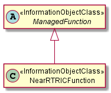
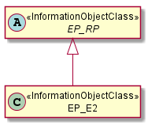
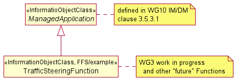

## O-RAN.WG3.O1-Interface-for-Near-RT-RIC-R003-v01.00.docx

- View in [Reader Mode](https://simewu.com/spec-reader/pages/10-WG3/O-RAN.WG3.O1-Interface-for-Near-RT-RIC-R003-v01.00.docx).
- Go back to [Table of Contents](../README.md).
- Download the [Original Document](https://github.com/Simewu/spec-reader/raw/refs/heads/main/documents/O-RAN.WG3.O1-Interface-for-Near-RT-RIC-R003-v01.00.docx).

---

|  |
| --- |
|  |

|  |
| --- |
| Technical Specification |
|  |

|  |
| --- |
| O-RAN Work Group 3  O1 Interface Specification for Near Real Time RAN Intelligent Controller |

|  |
| --- |
|  |
| Copyright (C) 2023 by the O-RAN ALLIANCE e.V.  The copying or incorporation into any other work of part or all of the material available in this specification in any form without the prior written permission of O-RAN ALLIANCE e.V. is prohibited, save that you may print or download extracts of the material of this specification for your personal use, or copy the material of this specification for the purpose of sending to individual third parties for their information provided that you acknowledge O-RAN ALLIANCE as the source of the material and that you inform the third party that these conditions apply to them and that they must comply with them.  O-RAN ALLIANCE e.V., Buschkauler Weg 27, 53347 Alfter, Germany  Register of Associations, Bonn VR 11238, VAT ID DE321720189 |

Contents

Foreword 3

Modal verbs terminology 3

1 Scope 4

2 References 4

2.1 Informative references 4

3 Definition of terms, symbols and abbreviations 5

3.1 Terms 5

3.2 Symbols 5

3.3 Abbreviations 5

4 Management Services 6

4.1 Provisioning Management Services 6

4.2 Fault Supervision Management Services 6

4.2.1 Requirements 6

4.3 Performance Assurance Management Services 6

4.4 Trace Management Services 6

Revision history 12

# Foreword

This Technical Specification (TS) has been produced by the O-RAN Alliance.

# Modal verbs terminology

In the present document "**shall**", "**shall not**", "**should**", "**should not**", "**may**", "**need not**", "**will**", "**will not**", "**can**" and "**cannot**" are to be interpreted as described in clause 3.2 of the O-RAN Drafting Rules (Verbal forms for the expression of provisions).

"**must**" and "**must not**" are **NOT** allowed in O-RAN deliverables except when used in direct citation.

# 1 Scope

The content of the present document is subject to continuing work within O-RAN and may change following formal O-RAN approval. Should the O-RAN Alliance modify the contents of the present document, it will be re-released by O-RAN with an identifying change of version date and an increase in version number as follows:

version xx.yy.zz

where:

xx: the first digit-group is incremented for all changes of substance, i.e. technical enhancements, corrections, updates, etc. (the initial approved document will have xx=01). Always 2 digits with leading zero if needed.

yy: the second digit-group is incremented when editorial only changes have been incorporated in the document. Always 2 digits with leading zero if needed.

zz: the third digit-group included only in working versions of the document indicating incremental changes during the editing process. External versions never include the third digit-group. Always 2 digits with leading zero if needed.

The present document defines O-RAN OAM interface functions and protocols for the O-RAN O1 interface for the Near RT RIC. The document studies the functions conveyed over the interface, including management functions, procedures, operations, and corresponding solutions, and identifies existing standards and industry work that can serve as a basis for O-RAN work.

This document will follow the requirements specification language defined in IETF RFC 2119 [33] updated by RFC 8174 [37]. For consistency requirements are specified using "SHALL" to indicate that the implementation is required.

# 2 References

## 2.1 Informative references

References are either specific (identified by date of publication and/or edition number or version number) or non-specific. For specific references, only the cited version applies. For non-specific references, the latest version of the referenced document (including any amendments) applies.

NOTE: While any hyperlinks included in this clause were valid at the time of publication, O-RAN cannot guarantee their long-term validity.

The following referenced documents are not necessary for the application of the present document, but they assist the user with regard to a particular subject area.

[1] 3GPP TR 21.905: "Vocabulary for 3GPP Specifications"

[2] O-RAN-WG3.E2GAP, "O-RAN Working Group 3, Near-Real-time RAN Intelligent Controller, E2 General Aspects and Principles".

[3] O-RAN-WG3.E2AP, "O-RAN Working Group 3, Near-Real-time RAN Intelligent Controller, E2 Application Protocol (E2AP)".

[4] O-RAN-WG1.OAM Architecture, "O-RAN Operations and Maintenance Architecture".

[5] O-RAN-WG1.O1-Interface, "O-RAN Operations and Maintenance Interface Specification".

[6] 3GPP TS 33.401: "3GPP System Architecture Evolution (SAE); Security architecture".

[7] 3GPP TS 33.501: "Security architecture and procedures for 5G System".

[8] O-RAN-WG2.A1.GA&P, "O-RAN Working Group 2, A1 interface: General Aspects and Principles".

[9] O-RAN-WG2.A1AP, "O-RAN Working Group 2, A1 Interface: Application Protocol".

[10] O-RAN-WG1.O-RAN Architecture, "O-RAN Working Group 1, O-RAN Architecture Description".

[11] 3GPP TS 36.401: "Evolved Universal Terrestrial Radio Access Network (E-UTRAN); Architecture Description".

[12] 3GPP TS 38.300: "NR; NR and NG-RAN Overall Description; Stage 2".

[13] 3GPP TS 37.324: "Evolved Universal Terrestrial Radio Access (E-UTRA) and NR; Service Data Adaptation Protocol (SDAP) specification".

[14] 3GPP TS 38.331: "NR; Radio Resource Control (RRC); Protocol specification".

[15] 3GPP TS 38.323: "NR; Packet Data Convergence Protocol (PDCP) specification".

[16] 3GPP TS 38.322: "NR; Radio Link Control (RLC) protocol specification".

[17] 3GPP TS 38.321: "NR; Medium Access Control (MAC) protocol specification".

[18] 3GPP TS 38.201: "NR; Physical layer; General description".

[19] O-RAN WG10: O-RAN Information Model and Data Models Specification,

[20] O-RAN WG3.RICARCH-v02.00

[21] 3GPP TS 28.622: "Generic Network Resource Mode (NRM) "

[22] O-RAN WG1.Information Model and Data Models-v01.00

[23] AlarmDictionaryModel-2021-07.11-13645

[24] 3GPP TS 28.541: "Management and orchestration; 5G Network Resource Model (NRM)"

# 3 Definition of terms, symbols and abbreviations

## 3.1 Terms

For the purposes of the present document, the terms [given in [i.1] and the following] apply:

N/A

## 3.2 Symbols

For the purposes of the present document, the symbols [given in [i.1] and the following] apply:

N/A

## 3.3 Abbreviations

For the purposes of the present document, the abbreviations [given in [i.1] and the following] apply:

FCAPS Fault, Configuration, Accounting, Performance, Security

FM Fault Management

IOC Information Object Class

ME Managed Element

MF Managed Function

MnS Management Service

MO Managed Object

MOI Managed Object Instance

Near-RT RIC O-RAN Near Real Time RAN Intelligent Controller

NETCONF NETwork CONFiguration protocol

NF Network Function

Non-RT RIC O-RAN Non-Real Time RAN Intelligent Controller

PM Performance Management or Performance Measurements

SMO Service Management and Orchestration

TR Technical Report

# 4 Management Services

## 4.1 Provisioning Management Services

Provisioning Management Services MnS for Near RT RIC platform shall be aligned with [5], Chapter 2.1

## 4.2 Fault Supervision Management Services

Fault Supervision MnS for Near RT RIC platform shall be aligned with [5], Chapter 2.2

### 4.2.1 Requirements

Fault Management for the Near-RT RIC Platform is based on the O-RAN-WG1.O1-Interface, "O-RAN Operations and Maintenance Interface Specification [5]
The relevant sections are:

* 4.1.10 Subscription Control
* 4.2.1 Fault Notification
* 4.2.2 Fault Supervision Control

## 4.3 Performance Assurance Management Services

Performance Assurance Management Services MnS for Near RT RIC platform shall be aligned with [5], Chapter 2.3

## 4.4 Trace Management Services

5 Model

5.1 Imported and associated information entities

5.1.1 Imported information entities and local labels

|  |  |
| --- | --- |
| **Label reference** | **Local label** |
| TS 28.622 [21], IOC, ManagedFunction | ManagedFunction |
| TS 28.622 [21], IOC, EP\_RP | EP\_RP |
| O-RAN.WG10.Information Model and Data Models | ManagedApplication |

5.1.2 Associated information entities and local labels

|  |  |
| --- | --- |
| **Label reference** | **Local label** |
| TS 28.622 [21], IOC, ManagedElement | ManagedElement |

5.2 Class Diagrams

5.2.1 Relationships

@startuml

skinparam ClassStereotypeFontStyle normal

hide empty members

class ManagedElement <<InformationObjectClass>>

class "NearRTRICFunction" as ric <<InformationObjectClass>>

class "EP\_E2" as E2 <<InformationObjectClass>>

class "E2 Node" as bts <<proxyClass>>

ric "\*" -d-\* "1" ManagedElement : <<names>>

ric "1" \***-right-"**\*" E2 : <<names>>

E2 "\*" -right-> " 0..1" bts : " "

note top of bts
Proxy class representing
any of the following E2 EndPoints:

O-CU-CP

O-CU-UP

O-DU

O-eNB

end note

@enduml

**Figure 5.2.1-1: Near RT RIC Containment**

Further disaggregation of the internal NearRTRICFunction management is FFS.

5.2.2 Inheritance

@startuml

hide empty members

skinparam ClassStereotypeFontStyle normal

class NearRTRICFunction <<InformationObjectClass>>

Abstract ManagedFunction <<InformationObjectClass>>

ManagedFunction <|-- NearRTRICFunction

@enduml

**Figure 5.2.2-1: Near-RT RIC Function inheritance**

@startuml

hide empty members

skinparam ClassStereotypeFontStyle normal

abstract class EP\_RP <<InformationObjectClass>>

class EP\_E2 <<InformationObjectClass>>

EP\_RP <|-- EP\_E2

@enduml

****

**Figure 5.2.2-2: EP\_E2 Inheritance**

@startuml xApp inheritance (2022-11-04)

skin rose

skinparam ClassStereotypeFontStyle normal

skinparam style strictuml

hide empty members

abstract class ManagedApplication <<InformatioObjectClass>>

class TrafficSteeringFunction <<InformationObjectClass, FFS/example>>

ManagedApplication <|-d- TrafficSteeringFunction

note right of ManagedApplication

defined in WG10 IM/DM

clause 3.5.3.1

end note

note right of TrafficSteeringFunction

WG3 work in progress

and other "future" Functions

end note

@enduml

NOTE: This figure will be removed in the next version of the current document and replaced by one or more concrete xApp Use Cases

**Figure 5.2.2-2: Example of inheritance from *ManagedApplication***

5.3 Class Definitions

5.3.1 NearRTRICFunction

5.3.1.1 Definition

The NearRTRICFunction IOC represents the Management aspects of the aggregated functions making up the Near-Rt RIC defined in clause 4.3.2 of O-RAN.WG1.O-RAN-Architecture-Description.

5.3.1.2 Attributes

The NearRTRICFunction IOC includes the attributes below and those attributes inherited through *ManagedFunction* IOC (defined in TS 28.622 [21]).

|  |  |  |  |  |  |
| --- | --- | --- | --- | --- | --- |
| **Attribute Name** | **S** | **isReadable** | **isWritable** | **isInvariant** | **isNotifyable** |
| PLMN Identity (3GPP 38.423 Clause 9.2.2.4) | M | T | T | F | T |
| Near-RT RIC ID | M | T | T | F | T |
| **Attribute related to role** |  |  |  |  |  |
| applicationDNList | M | T | T | F | T |

5.3.1.3 Attribute constraints

None

5.3.1.4 Notifications

None

5.3.2 EP\_E2

The common notifications defined in clause 4.5 in TS 28.622 [21] are valid for this IOC

5.3.2.1 Definition

The EP-E2 IOC represents the Management aspects of the E2T defined in RICArch [4] section 6.2.

5.3.2.2 Attributes

The EP\_E2 IOC includes the attributes below and those attributes inherited through EP\_RP IOC (defined in TS 28.622 [21])

|  |  |  |  |  |  |
| --- | --- | --- | --- | --- | --- |
| **Attribute Name** | **S** | **isReadable** | **isWritable** | **isInvariant** | **isNotifyable** |
| tRICEventCreate | O | T | T | F | T |
| tRICEventDelete | O | T | T | F | T |
| tRICControl | O | T | T | F | T |
|  |  |  |  |  |  |

5.3.2.3 Attribute constraints

None

5.3.2.4 Notifications

None

5.5 Attribute definitions

5.5.1 Attribute properties

| **Attribute Name** | **Documentation and Allowed Values** | **Properties** |
| --- | --- | --- |
| tRICEventCreate | Defined in O-RAN.WG3.E2AP Clause 9.5  Specifies the maximum time for the RIC Subscription Request event creation procedure in the E2 Node.  allowedValues: [0..4095] ms | type: Integer  multiplicity: 1  isOrdered: N/A  isUnique: N/A  defaultValue: Null  isNullable: True |
| tRICEventelete | Defined in O-RAN.WG3.E2AP Clause 9.5  Specifies the maximum time for the RIC Subscription Request event deletion procedure in the E2 Node.  allowedValues: [0..4095] ms | type: Integer  multiplicity: 1  isOrdered: N/A  isUnique: N/A  defaultValue: Null  isNullable: True |
| tRICControl | Defined in O-RAN.WG3.E2AP Clause 9.5  Specifies the maximum time for the RIC Control Request event request procedure in the E2 Node.  allowedValues: [0..4095] ms | type: Integer  multiplicity: 1  isOrdered: N/A  isUnique: N/A  defaultValue: Null  isNullable: True |
| applicationDNList | This attribute contains the DNs of the hosted applications (MOIs of the concrete IOCs inheriting from ManagedApplication).  allowedValues: Not applicable. | type: DN  multiplicity: 0..\*  isOrdered: False  isUnique: True defaultValue: None isNullable: False |
| nearRTRICID | Defined in O-RAN.WG3.E2AP-v02.01 Clause 9.2.4 |  |
| pLMNIdentity | Defined in 3GPP 38.423 Clause 9.2.2.4 |  |

# Revision history

|  |  |  |
| --- | --- | --- |
| Date | Revision | Description |
| 2021.09.27 | 00.00.01 | First draft of O-RAN OAM Interface Specification for Near RT RIC |
| 2021.11.05 | 00.00.02 | Incorporating CRs NOK0001 and NOK0002 |
| 2022.01.08 | 00.00.03 | Document updated to incorporate CRs NOK0003 and CR NOK0007 rev8 |
| 2022.07.20 | 00.00.04 | New Baseline |
| 2022.11.09 | 00.00.05 | Baseline for November train |
| 2022.11.17 | 00.00.06 | Addressing review comments |
| 2022.11.18 | 01.00 | Candidate for November train |
---

- View in [Reader Mode](https://simewu.com/spec-reader/pages/10-WG3/O-RAN.WG3.O1-Interface-for-Near-RT-RIC-R003-v01.00.docx).
- Go back to [Table of Contents](../README.md).
- Download the [Original Document](https://github.com/Simewu/spec-reader/raw/refs/heads/main/documents/O-RAN.WG3.O1-Interface-for-Near-RT-RIC-R003-v01.00.docx).
