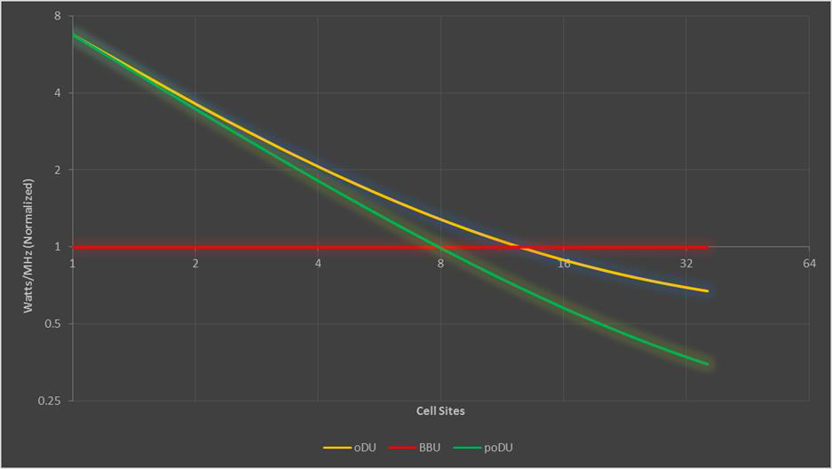
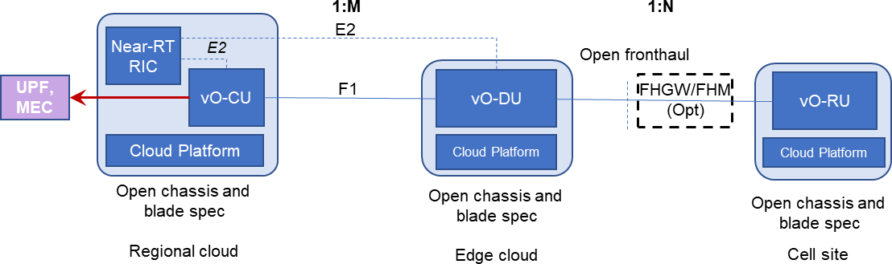

## O-RAN.WG6.CADS-v08.01.docx

- View in [Reader Mode](https://simewu.com/spec-reader/pages/07-WG6/O-RAN.WG6.CADS-v08.01.docx).
- Go back to [Table of Contents](../README.md).
- Download the [Original Document](https://github.com/Simewu/spec-reader/raw/refs/heads/main/documents/O-RAN.WG6.CADS-v08.01.docx).

---

|  |
| --- |
| O-RAN.WG6.CADS-v08.01 |
| *Technical Report* |
| **O-RAN Working Group 6 Cloud Architecture and Deployment Scenarios**  **for O-RAN Virtualized RAN** |
| Copyright (C) 2025 by the O-RAN ALLIANCE e.V.  The copying or incorporation into any other work of part or all of the material available in this document in any form without the prior written permission of O-RAN ALLIANCE e.V. is prohibited, save that you may print or download extracts of the material of this document for your personal use, or copy the material of this document for the purpose of sending to individual third parties for their information provided that you acknowledge O-RAN ALLIANCE as the source of the material and that you inform the third party that these conditions apply to them and that they must comply with them.  O-RAN ALLIANCE e.V., Buschkauler Weg 27, 53347 Alfter, Germany Register of Associations, Bonn VR 11238, VAT ID DE321720189 |

1

2

# 3 Table of Contents

###### Table of Contents 2

###### Table of Figures 3

###### Table of Tables 4

|  |  |  |  |
| --- | --- | --- | --- |
| 7 | 1 |  | Scope 5 |
| 8 |  | 1.1 | Context; Relationship to Other O-RAN Work 5 |
| 9 |  | 1.2 | Objectives 5 |
| 10 | 2 |  | References 7 |
| 11 | 3 |  | Definitions and Abbreviations 8 |
| 12 |  | 3.1 | Definitions 8 |
| 13 |  | 3.2 | Abbreviations 10 |
| 14 | 4 |  | Overall Architecture 12 |
| 15 |  | 4.1 | O-RAN Functions Definitions 12 |
| 16 |  | 4.2 | Degree of Openness 13 |
| 17 |  | 4.3 | Decoupling of Hardware and Software 13 |
| 18 |  |  | The O-Cloud 14  |
| 19 |  |  | Key O-Cloud Concepts 15  |
| 20 |  |  | O-Cloud Platform Management Functionalities 20  |
| 21 |  | 4.4 | O-Cloud Multi-Site Networking 20 |
| 22 |  |  | O-Cloud and Transport Network Shared Connectivity Information 21  |
| 23 | 5 |  | Deployment Scenarios: Common Considerations 21 |
| 24 |  | 5.1 | Mapping Logical Functionality to Physical Implementations 22 |
| 25 |  |  | Technical Constraints that Affect Hardware Implementations 22  |
| 26 |  |  | Service Requirements that Affect Implementation Design 22  |
| 27 |  |  | Rationalization of Centralizing O-DU Functionality 23  |
| 28 |  | 5.2 | Performance Aspects 25 |
| 29 |  |  | User Plane Delay 25  |
| 30 |  | 5.3 | Hardware Acceleration and Acceleration Abstraction Layer (AAL) 28 |
| 31 |  |  | Accelerator Deployment Model 29  |
| 32 |  |  | Acceleration Abstraction Layer (AAL) Interface 29  |
| 33 |  |  | Accelerator Management and Orchestration Considerations 30  |
| 34 |  | 5.4 | Cloud Considerations 30 |
| 35 |  |  | Networking requirements 30  |
| 36 |  |  | 5.4.1.1 Support for Multiple Networking Interfaces 30 |
| 37 |  |  | 5.4.1.2 Support for High Performance N-S Data Plane 30 |
| 38 |  |  | 5.4.1.3 Support for High-Performance E-W Data Plane 31 |
| 39 |  |  | 5.4.1.4 Support for Service Function Chaining 32 |
| 40 |  |  | 5.4.1.5 Support for VLAN based networking 32 |
| 41 |  |  | 5.4.1.6 Support for O-Cloud Gateways to connect O-Cloud Sites with external Transport Networks 32 |
| 42 |  |  | Assignment of Acceleration Resources 33  |
| 43 |  |  | Real-time / General Performance Feature Requirements 33  |
| 44 |  |  | 5.4.3.1 Host Linux OS 33 |
| 45 |  |  | 5.4.3.1.1 Support for Pre-emptive Scheduling 33 |
| 46 |  |  | 5.4.3.2 Support for Node Feature Discovery 33 |
| 47 |  |  | 5.4.3.3 Support for CPU Affinity and Isolation 33 |
| 48 |  |  | 5.4.3.4 Support for Dynamic HugePages Allocation 34 |
| 49 |  |  | 5.4.3.5 Support for Topology Manager 34 |
| 50 |  |  | 5.4.3.6 Support for Scale In/Out 34 |
| 51 |  |  | 5.4.3.7 Support for Device Plugin 35 |
| 52 |  |  | 5.4.3.8 Support for Direct IRQ Assignment 35 |
| 53 |  |  | 5.4.3.9 Support for No Over Commit CPU 35 |
| 54 |  |  | 5.4.3.10 Support for Specifying CPU Model 35 |
| 55 |  |  | Storage Requirements 36  |

|  |  |  |  |  |
| --- | --- | --- | --- | --- |
| 56 |  | | | Notification Subscription Framework 36 |
| 57 |  | | | 5.4.5.1 O-Cloud Notification Subscription Requirements 36 |
| 58 | 5.5 | | | Sync Architecture 37 |
| 59 |  | | | Cloud Platform Time Synchronization Architecture 37 |
| 60 |  | | | 5.5.1.1 Edge Cloud Site Level - LLS-C3 Synchronization Topology 38 |
| 61 |  | | | 5.5.1.1.1 LLS-C3 Synchronization Topology Edge Site Time Synchronization Architecture 38 |
| 62 |  | | | 5.5.1.1.2 LLS-C3 Synchronization Topology Edge Site Requirements 39 |
| 63 | 5.5.1.1.2.1 | | | Software 39 |
| 64 | 5.5.1.1.2.2 | | | Hardware 39 |
| 65 |  | | | 5.5.1.2 Edge Cloud Site Level - LLS-C1 Synchronization Topology 39 |
| 66 |  | | | 5.5.1.2.1 LLS-C1 Synchronization Topology Edge Site Time Synchronization Architecture 39 |
| 67 |  | | | 5.5.1.2.2 LLS-C1 Synchronization Topology Edge Site Requirements 41 |
| 68 | 5.5.1.2.2.1 | | | Software 41 |
| 69 | 5.5.1.2.2.2 | | | Hardware 41 |
| 70 |  | | | Loss of Synchronization Notification 41 |
| 71 |  | 5.6 | Operations and Maintenance Considerations 42 | |
| 72 |  | 5.7 | Transport Network Architecture 43 | |
| 73 |  |  | Fronthaul Gateways/Fronthaul Multiplexers 43  | |
| 74 |  | 5.8 | Overview of Deployment Scenarios 44 | |
| 75 | 6 |  | Deployment Scenarios and Implementation Considerations 45 | |
| 76 |  | 6.1 | Scenario A 45 | |
| 77 |  |  | Key Use Cases and Drivers 46  | |
| 78 |  | 6.2 | Scenario B 46 | |
| 79 |  |  | Key Use Cases and Drivers 47  | |
| 80 |  | 6.3 | Scenario C 47 | |
| 81 |  |  | Key Use Cases and Drivers 48  | |
| 82 |  |  | Scenario C.1, and Use Case and Drivers 48  | |
| 83 |  |  | Scenario C.2, and Use Case and Drivers 49  | |
| 84 |  | 6.4 | Scenario D 51 | |
| 85 |  | 6.5 | Scenario E 51 | |
| 86 |  |  | Key Use Cases and Drivers 52  | |
| 87 |  |  | Scenario E.1 vO-DU with O-RU 52  | |
| 88 |  | 6.6 | Scenario F 52 | |
| 89 |  |  | Key Use Cases and Drivers 53  | |
| 90 |  | 6.7 | Scenarios of Initial Interest 53 | |
| 91 | 7 |  | Appendix A (informative): Extensions to Current Deployment Scenarios to Include NSA 53 | |
| 92 |  | 7.1 | Scenario A 54 | |
| 93 |  | 7.2 | Scenario B 54 | |
| 94 |  | 7.3 | Scenario C 54 | |
| 95 |  | 7.4 | Scenario C.2 54 | |
| 96 |  | 7.5 | Scenario D 55 | |

###### 97 Annex (Informative): Change History 55

98

# 99 Table of Figures

1. Figure 1: Relationship of this Document to Scenario Documents and O-RAN Management Documents 5
2. Figure 2: Major Components Related to the Orchestration and Cloudification Effort 6
3. Figure 3: Example of Tiered Clouds/mapped to O-Clouds and Sites 7
4. Figure 4: High Level Architecture of O-RAN 12
5. Figure 5: Logical Architecture of O-RAN 13
6. Figure 6: Decoupling, and Illustration of the O-Cloud Concept 14
7. Figure 7: Relationship between RAN Functions and Demands on Cloud Infrastructure and Hardware 15
8. Figure 8: Key Components Involved in/with an O-Cloud 16
9. Figure 9: Example of O-Cloud Resources mapped to O-Cloud Nodes and O-Cloud Networks in an O-Cloud Node
10. Cluster 18
11. Figure 10: Edge O-Cloud Site deployment example with an O-Cloud Site Network Fabric (Hub) 19
12. Figure 11: Edge O-Cloud Site deployment example without an O-Cloud Site Network Fabric (Single servers) 19
13. Figure 12: Simple Centralization of O-DU Resources 23
14. Figure 13: Pooling of Centralized O-DU Resources 24
15. Figure 14: Comparison of Merit of Centralization Options vs. Number of Cell Sites in a Pool 24
16. Figure 15: Major User Plane Latency Components, by 5G Service Slice and Function Placement 26
17. Figure 16: Hardware Abstraction Considerations 29
18. Figure 17: Accelerator APIs/Libraries in Container and Virtual Machine Implementations 29
19. Figure 18: Illustration of the Network Interfaces Attached to a Pod, as Provisioned by Multus CNI 30
20. Figure 19: Illustration of the Userspace CNI Plugin 31
21. Figure 20: Example Illustration of Two NUMA Regions 34
22. Figure 21: O-Cloud Notification Framework Architecture 37
23. Figure 22: Edge Cloud Site Time Sync Architecture for LLS-C3 38
24. Figure 23: Hyperconverged Edge Cloud Time Sync Architecture for LLS-C3 39
25. Figure 24: Edge Cloud Site Time Sync Architecture for LLS-C1 40
26. Figure 25: Hyperconverged Edge Cloud Time Sync Architecture for LLS-C1 41
27. Figure 26: vO-DU Subscribes to PTP Notification 42
28. Figure 27: High-Level Comparison of Scenarios 44
29. Figure 28: Scenario A 45
30. Figure 29: Scenario B - NR Stand-alone 46
31. Figure 30: Scenario B - MR-DC (inter-RAT NR and E-UTRA) regardless of the Core Network type (either EPC or
32. 5GC) 46
33. Figure 31: Scenario C 48
34. Figure 32: Treatment of Network Slices: MEC for URLLC at Edge Cloud, Centralized Control, Single vO-DU 49
35. Figure 33: Scenario C.1 49
36. Figure 34: Treatment of Network Slice: MEC for URLLC at Edge Cloud, Separate vO-DUs 50
37. Figure 35: Single O-RU Being Shared by More than One Operator 50
38. Figure 36: Scenario C.2 51
39. Figure 37: Scenario D 51
40. Figure 38: Scenario E 52
41. Figure 39: Scenario E.1 52
42. Figure 40: Scenario F 53
43. Figure 41: Scenario A, Including NSA 54
44. Figure 42: Scenario C, Including NSA 54
45. Figure 43: Scenario C.2, Including NSA 55
46. Figure 44: Scenario D, Including NSA 55

146 **Table of Tables**

1. Table 1: Service Delay Constraints and Major Delay Contributors 26
2. Table 2: Cardinality and Delay Performance for Scenario B 47
3. Table 3: Cardinality and Delay Performance for Scenario C 48
4. Table 4: Cardinality and Delay Performance for Scenario C.1 49

151

152

153 1 Scope

1. This Technical Report has been produced by the O-RAN Alliance.
2. The contents of the present document are subject to continuing work within O-RAN and may change following formal
3. O-RAN approval. Should O-RAN modify the contents of the present document, it will be re-released by O-RAN with an
4. identifying change of release date and an increase in version number as follows:
5. Version x.y.z
6. where:
7. x the first digit is incremented for all changes of substance, i.e. technical enhancements, corrections, updates,
8. etc. (the initial approved document will have x=01).
9. y the second digit is incremented when editorial only changes have been incorporated in the document.
10. z the third digit included only in working versions of the document indicating incremental changes during the
11. editing process.

### 1.1 Context; Relationship to Other O-RAN Work

1. This document introduces and examines different scenarios and use cases for O-RAN deployments of Network
2. Functionality into Cloud Platforms, O-RAN Cloudified NFs and O-RAN Physical NFs. Deployment scenarios are
3. associated with meeting customer and service requirements, while considering technological constraints and the need to
4. create cost-effective solutions. It will also reference management considerations covered in more depth elsewhere.
5. The following O-RAN documents will be referenced (see Section 5.6):
6. ? OAM architecture specification [8]
7. ? OAM interface specification (O1) [9]
8. ? O-RAN Architecture Description [10]
9. The details of implementing each identified scenario will be covered in separate Scenario documents, shown in green in
10. Figure 1.

Management documents

OAM

Architecture

OAM Interface Specification

Cloud Architecture and Deployment Scenarios

Architecture documents

O-RAN

Architecture Description

176

...

Scenario Reference Design

Scenario Reference Design

Scenario Reference Design

1. Figure 1: Relationship of this Document to Scenario Documents and O-RAN Management Documents
2. This document also draws on some other work from other O-RAN working groups, as well as sources from other industry
3. bodies.

### 1.2 Objectives

1. The O-RAN Alliance seeks to improve RAN flexibility and deployment velocity, while at the same time reducing the
2. capital and operating costs through the adoption of cloud architectures. The structure of the Orchestration and
3. Cloudification work is shown graphically below. This document focuses on the Cloudification deployment aspects as
4. indicated.
5. *Editor's note: O-RU cloudification and O-RU AAL are future study items.*

Orchestration

Cloudification

O-CU

AAL

O-DU

AAL

O-RU

AAL

All RAN modules

Support 10,000s

Cloud stack ( Containers/VMs, OS, Cloud Mgmt. ) of distributed

cloud sites

Common LCM mechanisms across VNF & PNFs

**ASIC**

Multitude of silicon accelerators

Centralized CU/DU (C-RAN)

CU/DU split

Distributed CU/DU

(D-RAN)

Multitude of deployment models: CloudRAN,

CU-DU split,

dRAN on whitebox or DC

Flexible Orch.

Inventory, Discovery, Registration Policy, Metrics

H/W

S/W

Blackbox BBU

186

187

Figure 2: Major Components Related to the Orchestration and Cloudification Effort

1. A key principle is the decoupling of RAN hardware and software for all components including near-RT RIC, O-CU (O-
2. CU-CP and O-CU-UP), O-DU, and O-RU, and the deployment of software components on commodity server
3. architectures supplemented with programmable accelerators where necessary.
4. Key characteristics of cloud architectures which we will reference in this document are:
5. a) Decoupling of hardware from software. This aims to improve flexibility and choice for operators by decoupling
6. selection and deployment of hardware infrastructure from software selection,
7. b) Standardization of hardware specifications across software implementations, to simplify physical deployment
8. and maintenance. This aims to promote the availability of a multitude of *software* implementation choices for a
9. given hardware configuration.
10. c) Sharing of hardware. This aims to promote the availability of a multitude of *hardware* implementation choices
11. for a given software implementation.
12. d) Flexible instantiation and lifecycle management through orchestration automation. This aims to reduce
13. deployment and ongoing maintenance costs by promoting simplification and automation throughout the
14. hardware and software lifecycle through common chassis specifications and standardized orchestration
15. interfaces.
16. This document will define various deployment scenarios that can be supported by the O-RAN specifications and are of
17. either current or relatively near-term interest. Each scenario is identified by a specific grouping of functionality (Tiered
18. Clouds) at different key locations (Cell Site, Edge Cloud, Regional Cloud and Central Cloud, which will be defined
19. shortly), and an identification of whether functionality at a given location is provided by an O-RAN Physical NF based
20. solution where software and hardware are tightly integrated and sharing a single identity, or by an O-RAN cloud
21. infrastructure architecture (O-Cloud) that meets the above requirements.
22. The scope of this work clearly includes supporting all 5G technologies, i.e. E-UTRA and NR with both EPC-based Non-
23. Standalone (NSA) and 5GC architectures. This implies that cloud/orchestration aspects of NSA (E-UTRA) are also
24. supported. However, this version primarily addresses 5G SA deployments.
25. This technical report examines the constraints that drive a specific solution, and discuss the hierarchical properties of each
26. solution, including a rough scale of the size of each Tiered Cloud and a sense of the number of sub clouds expected to be
27. served by a higher tiered cloud. Figure 3 shows as example of how multiple Cell Sites feed into a smaller number of
28. Edge Clouds, and how in turn multiple Edge Clouds feed into a Regional Cloud that can feed into a Central Cloud. For
29. a given scenario, the Logical Functions are distributed in a certain way among each type of Tiered Cloud, and the
30. "cardinality" of the different functions will be discussed.
31. The present document describes that the Cloud Infrastructure is deployed as managed O-Cloud(s). Tiered Cloud is a
32. conceptual construct of grouped functions in an O-RAN. Their physical manifestation is realized in O-Clouds on Cloud
33. Sites. Cell Sites connect into the Cloud Site O-Cloud Resources through the Fronthaul network. Cloud Sites and Cell
34. Sites could be collocated at the same site location or separately on their own individual site locations. The document also

6

1. describes how the O-Cloud Resources are used in O-Cloud Node Clusters that execute the Network Function
2. Deployments. All of these are orchestrated from the Service Management and Orchestration framework (SMO).
3. This has implications on the processing power needed in each type of cloud, as well as implications on the environmental
4. requirements. This document will also discuss considerations of hardware chassis and components that are reasonable in
5. each scenario, and the implications of managing such a cloud. 227

228

|  |  |
| --- | --- |
| 229 |  |
| 230 | **Figure 3: Example of Tiered Clouds/mapped to O-Clouds and Sites** |
| 231 | Additional major areas for this document are listed below: |
| 232 | * Mapping of logical functions to physical elements and locations, and implications of that mapping. |
| 233 | * High-level assessment of critical performance requirements, and how that influences architecture. |
| 234 | * Processor and accelerator options (e.g., x86, FPGA, GPU). In order to determine whether a Network Function |
| 235 | is a candidate for openness, there needs to be the possibility to have multiple suppliers of software for given |
| 236 | hardware, and multiple sources of required chip/accelerators. |
| 237 | * The Hardware Abstraction Layer, aka "Acceleration Abstraction Layer" needs to be addressed in light of |
| 238 | various hardware options that could be used. |
| 239 | * Cloud infrastructure makeup. This includes considerations such as: |
| 240 | * Deployments are allowed to use VMs, Containers in VMs, or just Containers. |
| 241 | * Multiple Operating Systems are expected to be supported, e.g., open-source Ubuntu, CentOS Linux, or |
| 242 | Yocto Linux-based distributions, or selected proprietary OSs. |
| 243 | * Management of a cloudified RAN introduces some new management considerations because the mapping |
| 244 | between Network Functionality and cloud platforms can be done in multiple ways, depending on the scenario |
| 245 | that is chosen. Thus, management of aspects that are related to platform aspects rather than RAN functional |
| 246 | aspects need to be designed with flexibility in mind from the start. For example, logging of physical functions, |
| 247 | scale out actions, and survivability considerations are affected. |
| 248 | * These management considerations are introduced in this document, but management documents will |
| 249 | address the solutions. |
| 250 | * The transport layer will be discussed, but only to the extent that it affects the architecture and design of the |
| 251 | network. For example, the chosen L1 technology may affect the performance of transport. As another example, |
| 252 | the use of a Fronthaul Gateway/Fronthaul Multiplexer will affect economics as well as the placement options of |
| 253 | certain Network Functions. And of course, the existence of L2 switches in a cloud platform deployment will be |
| 254 | required for efficient use of server resources. |
| 255 | Additional areas could be considered in the future. |
| 256 | 2 References |
| 257 | The following documents contain provisions which, through reference in this text, constitute provisions of this report. |

|  |  |  |
| --- | --- | --- |
| 258 | [1] | 3GPP TS 38.470, *NG-RAN; F1 general aspects and principles.* |
| 259 | [2] | 3GPP TR 21.905, *Vocabulary for 3GPP Specifications*. |
| 260 | [3] | eCPRI Interface Specification V1.2, *Common Public Radio Interface: eCPRI Interface Specification.* |
| 261 | [4] | eCPRI Transport Network V1.2, Requirements Specification, *Common Public Radio Interface:* |
| 262 |  | *Requirements for the eCPRI Transport Network*. |
| 263 | [5] | IEEE Std 802.1CM-2018, *Time-Sensitive Networking for Fronthaul.* |
| 264 | [6] | ITU-T Technical Report, *GSTR-TN5G - Transport network support of IMT-2020/5G*. |
| 265 | [7] | O-RAN WG4, *Control, User and Synchronization Plane Specification*, Technical Specification. See |
| 266 |  | [https://www.o-ran.org/specifications.](https://www.o-ran.org/specifications) |
| 267 | [8] | O-RAN WG1, *Operations and Maintenance Architecture*, Technical Specification. See [https://www.o-](https://www.o-ran.org/specifications) |
| 268 |  | [ran.org/specifications.](https://www.o-ran.org/specifications) |
| 269 | [9] | O-RAN WG1, *Operations and Maintenance Interface Specification*, Technical Specification. See |
| 270 |  | [https://www.o-ran.org/specifications.](https://www.o-ran.org/specifications) |
| 271 | [10] | O-RAN WG1, *O-RAN Architecture Description,* Technical Specification. See [https://www.o-](https://www.o-ran.org/specifications) |
| 272 |  | [ran.org/specifications.](https://www.o-ran.org/specifications) |
| 273 | [11] | 3GPP TS 28.622, *Telecommunication management; Generic Network Resource Model (NRM) Integration* |
| 274 |  | *Reference Point (IRP); Information Service (IS)*. |
| 275 | [12] | O-RAN WG6, *Cloud Platform Reference Design for Deployment Scenario B,* Technical Specification. See |
| 276 |  | [https://www.o-ran.org/specifications.](https://www.o-ran.org/specifications) |
| 277 | [13] | O-RAN WG7 OMAC HAR 0-v01.00 O-RAN White Box Hardware Working Group Outdoor Macrocell |
| 278 |  | Hardware Architecture and Requirements (FR1) Specification. |
| 279 | [14] | O-RAN WG1, Use Cases Detailed Specifications - v05.00, Technical Specification. See [https://www.o-](https://www.o-ran.org/specifications) |
| 280 |  | [ran.org/specifications.](https://www.o-ran.org/specifications) |
| 281 | [15] | O-RAN.WG7.DSC.0-v04.00 O-RAN White Box Hardware Working Group Deployment Scenarios and Base |
| 282 |  | Station Classes. |

## 283 3 Definitions and Abbreviations

### 3.1 Definitions

1. For the purposes of the present document, the terms and definitions given in 3GPP TR 21.905 [2] and the following apply.
2. A term defined in the present document takes precedence over the definition of the same term, if any, in 3GPP
3. TR 21.905 [2].

|  |  |  |
| --- | --- | --- |
| 288 | Cell Site | This refers to the location of Radio Units (RUs); e.g., placed on same structure as the Radio |
| 289 |  | Unit or at the base. The Cell Site in general will support multiple sectors and hence multiple |
| 290 |  | O-RUs. |

1. Cloud Infrastructure (CInf) This refers to a set of computation, storage and networking equipment with related software
2. that offers physical and/or virtual cloud resources and services into the O-Cloud as an under-
3. cloud from the Cloud Infrastructure provider organization that could be operator internal or
4. external. The Cloud Infrastructure resources are not addressed by the present document and
5. not specified as part of O2ims and O2dms.

|  |  |  |
| --- | --- | --- |
| 296 | CInf Management | This is a vendor or operator software operated by the Cloud Infrastructure provider |
| 297 |  | organization. It handles discovery, health and maintenance of the Cloud Infrastructure |
| 298 |  | included equipment and its offered physical and logical services that can be distributed over |
| 299 |  | multiple Cloud Sites. The Cloud Infrastructure Management are not addressed by the present |
| 300 |  | document and not specified as part of O2ims and O2dms. |

1. Central Cloud This is the highest location tier, that supports virtualized RAN and other functions, and
2. provides the centralization of functionality that has the least strict network latency
3. requirements.
4. Cloud Site This refers to a physical place that has Cloud Infrastructure resources that can be used for O-
5. Clouds and potentially other non-O-Cloud resources.
6. CIDR Classless Inter-Domain Routing (also known as Subnet Mask)
7. Edge Cloud This is a location that supports virtualized RAN functions for multiple Cell Sites and provides
8. centralization of functions for those sites and associated economies of scale. An Edge Cloud
9. might serve a large physical area or a relatively small one close to its cell sites, depending on
10. the Operator's use case. However, the sites served by the Edge Cloud must be near enough to
11. the O-RUs to meet the network latency requirements of the O-DU functions.
12. F1 Interface The open interface between O-CU and O-DU in this document is the same as that defined by
13. the CU and DU split in 3GPP TS 38.473. It consists of an F1-u part and an F1-c part.
14. Managed Element [11]Refer to the 3GPP TS 28.622 [11] .
15. Managed Function Refer to the 3GPP TS 28.622 [11]
16. Network Function The O-RAN Network Functions (O-RAN NFs) are defined in the O-RAN Architecture
17. Description [10].
18. Regional Cloud This is a location that supports virtualized RAN functions for many Cell Sites in multiple Edge
19. Clouds and provides high centralization of functionality. The sites served by the Regional
20. Cloud must be near enough to the O-DUs to meet the network latency requirements of the O-
21. CU and near-RT RIC.
22. O-Cloud This refers to a collection of O-Cloud Resource Pools at one or more location and the software
23. to manage Nodes and Deployments hosted on them. An O-Cloud will include functionality to
24. support both Deployment-plane and Management services. The O-Cloud provides a single
25. logical reference point for all O-Cloud Resource Pools within the O-Cloud boundary.
26. O-Cloud Capability One or more features provided by the O-Cloud Platform and exposed to consumers for
27. performing certain tasks.
28. NOTE 1: Consumers include software deployments, such as NF Deployments, and management services (e.g. NFO
29. and FOCOM) interacting with the O-Cloud.
30. NOTE 2: An O-Cloud Capability can be associated with certain capacity.
31. EXAMPLE: Examples of O-Cloud Capabilities are computing processing, acceleration, storage, etc.
32. O-RAN Physical NF A RAN NF software deployed on tightly integrated hardware sharing a single Managed
33. Element identity.
34. Cloudified NF A RAN Network Function software that is deployed in the O-Cloud via one or more NF
35. Deployments.
36. NF Deployment A software deployment on O-Cloud resources that realizes, all or part of, a Cloudified NF.
37. PE Provider Edge
38. Tiered Cloud The definition of Tiered Clouds is a grouping of O-RAN related functionality called Cell Site,
39. Edge Cloud, Regional Cloud and Central Cloud where each tier has increasing latency and
40. increasing maximum area covered per tier.
41. NOTE: The Tiered Cloud and its different locations are conceptual and intended to enable discussions around
42. functional placement and its requirements in O-RAN. It is not an exact definition, and it doesn't have a
43. direct mapping to the realization of the functionality. 344

### 3.2 Abbreviations

1. For the purposes of this document, the abbreviations given in 3GPP TR 21.905 [2] and the following apply.
2. An abbreviation defined in the present document takes precedence over the definition of the same abbreviation, if any, in
3. 3GPP TR 21.905 [2].

|  |  |  |
| --- | --- | --- |
| 349 | 3GPP | Third Generation Partnership Project |
| 350 | 5G | Fifth-Generation Mobile Communications |
| 351 | AAL | Acceleration Abstraction Layer |
| 352 | API | Application Programming Interface |
| 353 | ASIC | Application-Specific Integrated Circuit |
| 354 | BBU | BaseBand Unit |
| 355 | BS | Base Station |
| 356 | CI | Cloud Infrastructure |
| 357 | CoMP | Co-Ordinated Multi-Point transmission/reception |
| 358 | CNF | Cloud-Native Network Function |
| 359 | CNI | Container Networking Interface |
| 360 | CPU | Central Processing Unit |
| 361 | CR | Cell Radius |
| 362 | CU | Centralized Unit as defined by 3GPP |
| 363 | DFT | Discrete Fourier Transform |
| 364 | DL | Downlink |
| 365 | DPDK | Data Plan Development Kit |
| 366 | DMS | Deployment Management Services |
| 367 | DU | Distributed Unit as defined by 3GPP |
| 368 | eMBB | enhanced Mobile BroadBand |
| 369 | EPC | Evolved Packet Core |
| 370 | E-UTRA | Evolved UMTS Terrestrial Radio Access |
| 371 | FCAPS | Fault Configuration Accounting Performance Security |
| 372 | FEC | Forward Error Correction |
| 373 | FFT | Fast Fourier Transform |
| 374 | FH | Fronthaul |
| 375 | FHGW | Fronthaul Gateway |
| 376 | FHM | Fronthaul Multiplexer |
| 377 | FPGA | Field Programmable Gate Array |
| 378 | GNSS | Global Navigation Satellite System |
| 379 | GPP | General Purpose Processor |
| 380 | GPS | Global Positioning System |
| 381 | GPU | Graphics Processing Unit |
| 382 | HARQ | Hybrid Automatic Repeat ReQuest |
| 383 | HW | Hardware |
| 384 | IEEE | Institute of Electrical and Electronics Engineers |
| 385 | IM | Information Modelling, or Information Model |
| 386 | IMS | Infrastructure Management Services |
| 387 | IRQ | Interrupt ReQuest |
| 388 | ISA | Instruction Set Architecture |
| 389 | ISD | Inter-Site Distance |
| 390 | ITU | International Telecommunications Union |
| 391 | KPI | Key Performance Indicator |
| 392 | LCM | Life Cycle Management |
| 393 | LDPC | Low-Density Parity-Check |
| 394 | LLS | Lower Layer Split |
| 395 | LTE | Long Term Evolution |
| 396 | LVM | Logic Volume Manager |
| 397 | MEC | Mobile Edge Computing |
| 398 | mMTC | massive Machine Type Communications |
| 399 | MNO | Mobile Network Operator |
| 400 | NF | Network Function |
| 401 | NFD | Node Feature Discovery |
| 402 | NFVI | Network Function Virtualization Infrastructure |
| 403 | NIC | Network Interface Card |

|  |  |  |
| --- | --- | --- |
| 404 | NMS | Network Management System |
| 405 | NR | New Radio |
| 406 | NSA | Non-Standalone |
| 407 | NTP | Network Time Protocol |
| 408 | NUMA | Non-Uniform Memory Access |
| 409 | NVMe | Non-Volatile Memory Express |
| 410 | O-Cloud | O-RAN Cloud Platform |
| 411 | OCP | Open Compute Project |
| 412 | O-CU | O-RAN Central Unit |
| 413 | O-CU-CP | O-CU Control Plane |
| 414 | O-CU-UP | O-CU User Plane |
| 415 | O-DU | O-RAN Distributed Unit (uses Lower-level Split) |
| 416 | O-RU | O-RAN Radio Unit |
| 417 | OTII | Open Telecom IT Infrastructure |
| 418 | OWD | One-Way Delay |
| 419 | PCI | Peripheral Component Interconnect |
| 420 | PNF | Physical Network Function |
| 421 | PoE | Power over Ethernet |
| 422 | PoP | Point of Presence |
| 423 | PRTC | Primary Reference Time Clock |
| 424 | PTP | Precision Time Protocol |
| 425 | QoS | Quality of Service |
| 426 | RAN | Radio Access Network |
| 427 | RAT | Radio Access Technology |
| 428 | RIC | RAN Intelligent Controller |
| 429 | RT | Real Time |
| 430 | RTT | Round Trip Time |
| 431 | RU | Radio Unit |
| 432 | SA | Standalone |
| 433 | SFC | Service Function Chaining |
| 434 | SMO | Service Management and Orchestration |
| 435 | SMP | Symmetric MultiProcessing |
| 436 | SoC | System on Chip |
| 437 | SR-IOV | Single Root Input/ Output Virtualization |
| 438 | SW | Software |
| 439 | TCO | Total Cost of Ownership |
| 440 | TNE | Transport Network Element |
| 441 | TR | Technical Report |
| 442 | TRP | Transmission Reception Point |
| 443 | TS | Technical Specification |
| 444 | TSC (T-TSC) | Telecom Slave Clock |
| 445 | Tx | Transmitter |
| 446 | UE | User Equipment |
| 447 | UL | Uplink |
| 448 | UMTS | Universal Mobile Telecommunications System |
| 449 | UP | User Plane |
| 450 | UPF | User Plane Function |
| 451 | URLLC | Ultra-Reliable Low-Latency Communications |
| 452 | vCPU | virtual CPU |
| 453 | VIM | Virtualized Infrastructure Manager |
| 454 | VM | Virtual Machine |
| 455 | VNF | Virtualized Network Function |
| 456 | vO-CU | Virtualized O-RAN Central Unit |
| 457 | vO-CU-CP | Virtualized O-CU Control Plane |
| 458 | vO-CU-UP | Virtualized O-CU User Plane |
| 459 | vO-DU | Virtualized O-RAN Distributed Unit |

## 460 4 Overall Architecture

461 This section addresses the overall architecture in terms of the Network Functions and infrastructure (O-RAN Physical

462 NFs, servers, and clouds) that are in scope. Figure 4 provides a high-level view of the O-RAN architecture as depicted in

463 [10].

464

465

1. **Figure 4: High Level Architecture of O-RAN**

### 4.1 O-RAN Functions Definitions

1. This section reviews key O-RAN functions definitions in O-RAN.
2. ? The O-DU/ O-RU split is defined as using Option 7-2x. See [7].
3. ? The O-CU/ O-DU split is defined as using the CU/ DU split F1 as defined in 3GPP TS 38.470 [1].
4. This document assumes these two splits.
5. Figure 5 shows the logical architecture of O-RAN (as depicted in [10]) with O-Cloud platform at the bottom, where any
6. given O-RAN function could be supported by O-Cloud, depending on the deployment scenario. For example, the figure
7. here illustrates a case where the O-RU is implemented as an O-RAN Physical NF, and the other functions within the
8. dashed line are supported by O-Cloud.

**X2-u**

**Service Management and Orchestration Framework**

**Non-Real Time RIC**

**O1**

**O2**

**O1**

**A1**

**E2**

**X2-c**

O-eNB

**NG-u**

**Open**

**Fronthaul**

**M-Plane**

**Xn-c**

**NG-c**

**OFH CUS-Plane**

**OFH M-Plane**

**O-RU**

**Near-Real Time RAN**

**Intelligent Controller (RIC) E2**

**O-CU-CP**

**E1**

**E2 O-CU-UP**

**E2**

**F1-c**

**F1-u**

**O-DU**

**Xn-u**

|  |  |
| --- | --- |
| 476 | **O-Cloud** |
| 477 | **Figure 5: Logical Architecture of O-RAN** |
| 478 | 4.2 Degree of Openness |
| 479 | In theory, every architecture component could be open in every sense imaginable, but in practice it is likely that different |
| 480 | components will have varying degrees of openness due to economic and other implementation considerations. Some |
| 481 | factors are significantly affected by the deployment scenario; for example, what might be viable in an indoor deployment |
| 482 | might not be viable in an outdoor deployment. |
| 483 | Increasing degrees of openness for an O-RAN Physical Network Function or O-RAN Cloudified Network Function(s) |
| 484 | are: |
| 485 | A. Interfaces among Network Functions are open, e.g., E2, F1, and Open Fronthaul are used. Therefore, Network |
| 486 | Functions in different O-RAN Physical NFs/clouds from different vendors can interconnect. |
| 487 | B. In addition to having open connections as described above, the chassis of servers in a cloud are open and can |
| 488 | accept blades/sleds from multiple vendors. However, the blades/sleds have RAN software that *is not* decoupled |
| 489 | from the hardware. |
| 490 | C. In addition to having open connections and an open chassis, a specific blade/sled uses software that *is* decoupled |
| 491 | from the hardware. In this scenario, the software could be from one supplier, the blade/sled could be from another, |
| 492 | and the chassis could be from another. |
| 493 | Categories A and B have O-RAN Physical NFs/clouds, while Category C is an open solution that we are calling an O- |
| 494 | Cloud and is subject to the cloudification discussion and requirements. |
| 495 | In this document, the degree of openness for each O-RAN Physical NF/cloud can vary by scenario. The question of which |
| 496 | Network Functions should be split vs. combined, and the degree of openness in each one, is addressed in the discussion |
| 497 | of scenarios. |

### 4.3 Decoupling of Hardware and Software

1. *Editor's note: O-RU AAL is a future study item.*
2. There are three layers that we must consider when we discuss decoupling of hardware and software:
3. ? The hardware layer, shown at the bottom in Figure 6. (In the case of a VM deployment, this maps basically to
4. the ETSI NFVI hardware sub-layer.)
5. ? A middle layer that includes Cloud Stack functions as well as Acceleration Abstraction Layer functions. (In the
6. case of a VM deployment, these map to the ETSI NFVI virtualization sub-layer + VIM.)
7. ? A top layer that supports the virtual RAN functions.
8. Each layer can come from a different supplier. The first aspect of decoupling has to do with ensuring that a Cloud Stack
9. can work on multiple suppliers' hardware, i.e., it does not require vendor-specific hardware.
10. The second aspect of decoupling has to do with ensuring that a Cloud Platform can support RAN virtualized functions
11. from multiple RAN software suppliers. If this is possible, then we say that the Cloud Platform (which includes the
12. hardware that it runs on) is an O-RAN Cloud Platform, or "O-Cloud". See Figure 6 below.

Cloud stack ( Containers/VMs, OS, Cloud Mgmt. )

AAL

AAL

AAL

O-RU

O-DU

O-CU

##### O-Cloud

##### Hardware

**ASIC**

|  |  |
| --- | --- |
| 511 |  |
| 512 | **Figure 6: Decoupling, and Illustration of the O-Cloud Concept** |
| 513 |  The O-Cloud |
| 514 | The general definition of the O-Cloud Platform includes the following characteristics: |
| 515 | - The O-Cloud Platform is a set of hardware and software components that provide O-Cloud Capabilities and |
| 516 | services to execute RAN network functions. |
| 517 | - The O-Cloud Platform hardware includes compute, networking and storage components, and can also |
| 518 | include various acceleration technologies required by the RAN network functions to meet their performance |
| 519 | objectives. |
| 520 | - The O-Cloud Platform software exposes open and well-defined APIs that enable the orchestration and |
| 521 | management of the NF Deployment's life cycle. |
| 522 | - The O-Cloud Platform software exposes open and well-defined APIs that enable the orchestration and |
| 523 | management of the O-Cloud. |
| 524 | - The O-Cloud Platform software is decoupled from the O-Cloud Platform hardware (i.e., it can typically be |
| 525 | sourced from different vendors). |
| 526 | The management aspects of the O-Cloud Platform are discussed in 5.6. The scope of the present document includes listing |
| 527 | specific requirements of the O-Cloud Platform to support orchestration and execution of the various O-RAN Network |
| 528 | Functions. |
| 529 | An example of an O-Cloud Platform is an OpenStack and/or a Kubernetes Cluster deployment on a set of COTS servers |
| 530 | (including FPGA and GPU cards), interconnected by a spine/leaf networking fabric. |
| 531 | There is an important interplay between specific virtualized RAN functions and the hardware that is needed to meet |
| 532 | performance requirements and to support the functionality *economically*. Therefore, a hardware/ cloud platform |
| 533 | combination that can support, say, a vO-CU function might not be appropriate to adequately support a vO-DU function. |
| 534 | When RAN functions are combined in different ways in each specific deployment scenario, these aspects must be |
| 535 | considered. |
| 536 | Such infrastructure requirements of the Cloudified NFs and/or their constituent NF Deployments are among the Service |
| 537 | Management and Orchestration (SMO) considerations for the homing decision. The SMO is responsible to make the |
| 538 | homing decision, which results in the SMO selection of the appropriate O-Cloud Node Cluster(s) matching the |
| 539 | requested capabilities for the NF Deployment(s) and makes the determination of the specific Deployment Management |
| 540 | Service (DMS) that the SMO deems adequate for an NF Deployment. |

1. The O-Cloud DMS(s) is responsible to decide on the placement of the workloads for an NF Deployment, internally
2. inside the O-Cloud Node Cluster(s) based on the SMO's homing decision and using other NF Deployment requirements
3. that it receives through the O2dms.
4. Below is a high-level conceptual example of how different accelerators, along with their associated O-Cloud Capabilities,
5. can be required for different RAN functions. Although the present document does not specify any particular hardware
6. requirement or O-Cloud Capability, some specific examples can be devised. For example, any RAN function that involves
7. real-time movement of user traffic might require the O-Cloud Platform to control for delay and jitter, which can in turn
8. require features such as real-time OSs, avoidance of frequent interrupts, CPU pinning, etc.

549

550 Figure 7: Relationship between RAN Functions and Demands on Cloud Infrastructure and Hardware

551 Finally, it is to be highlighted, that any cloud that has features required for a given function (e.g., for O-DU) can also

552 support functions that do not require such features. For example, an O-Cloud that can support O-DU can also support

553 functions such as O-CU-CP. 554

555

#### 556  Key O-Cloud Concepts

557 Figure 8 illustrates key components of an O-Cloud and its management.

558

559

560

|  |  |
| --- | --- |
| 561 |  |
| 562 | **Figure 8: Key Components Involved in/with an O-Cloud** |
| 563 | Key terms in this figure are defined below: |
| 564 | * The SMO is defined in [10]. |
| 565 | * An **O-Cloud** refers to a collection of O-Cloud Resources, Resource Pools and O-Cloud Services at one or more |
| 566 | O-Cloud Sites including the software to manage O-Cloud Resource provisioning, Nodes, Clusters and |
| 567 | Deployments hosted on them. An O-Cloud will include functionality to support both Deployment-plane (aka. |
| 568 | user-plane) and Management services. The O-Cloud provides a single logical reference point for all O-Cloud |
| 569 | Resources, Resource Pools and Services within the O-Cloud boundary, i.e. for the distributed O-Cloud. |
| 570 | * An **O-Cloud Site** refers to a set of O-Cloud Resources at a Cloud Site with a geographical location. The size of |
| 571 | the O-Cloud Site can be from a single to thousands of O-Cloud Resources. O-Cloud Resources are generally |
| 572 | interconnected through one or more O-Cloud Site Network Fabrics that are the demarcation for direct O-Cloud |
| 573 | Site internal L2 switching. Multiple O-Cloud Sites can be interconnected into a distributed O-Cloud which |
| 574 | generally would require bridging, routing or stitching on any other networking layer in between each O-Cloud |
| 575 | Site and its respective external transport network attachment point. |
| 576 | * NOTE: Very small O-Cloud Sites with just a few O-Cloud Resources can be directly connected to |
| 577 | networks outside of the O-Cloud Site, supporting e.g. fronthaul and backhaul networks, without an O- |
| 578 | Cloud Site Network Fabric. |
| 579 | * The **O2 Interfaces** are the interfaces associated with a collection of O-Cloud Services that are provided by the |
| 580 | O-Cloud platform to the SMO. The services are categorized into two logical groups: (i) **Infrastructure** |
| 581 | **Management Services (IMS)**, which include the subset of O2 functions that are responsible for deploying and |
| 582 | managing cloud infrastructure. (ii) **Deployment Management Services (DMS)**, which include the subset of O2 |
| 583 | functions that are responsible for managing the lifecycle of virtualized/containerized deployments on the cloud |
| 584 | infrastructure. The O2 interfaces associated with the O-Cloud Infrastructure and Deployment Management |
| 585 | Services will be specified in the upcoming O2 specification. Any definitions of SMO functional elements needed |
| 586 | to consume these services shall be described in OAM architecture. Further details of these key concepts and how |
| 587 | they relate to each other can be found in the O-RAN O2 Interface General Aspects and Principles (GAnP). |
| 588 | * O-Cloud IMS related concepts and views of the Cloud Infrastructure |
| 589 | * An **O-Cloud Resource** represent a unit of defined capabilities and characteristics within an O-Cloud |
| 590 | Cloud Site that can be provisioned and used for the O-Cloud Deployment Plane. There are some |

|  |  |
| --- | --- |
| 591 | different sorts of O-Cloud Resources e.g. Compute, HW-Accelerator, Storage, Gateway and Site |
| 592 | Network Fabric. Note: Exact classes of O-Cloud Resources are FFS and needs alignment to existing |
| 593 | other specifications e.g. GAnP and IMS Interface Specification. |
| 594 | * An **O-Cloud Resource Pool** is a collection of O-Cloud Resources with homogeneous capabilities and |
| 595 | characteristics as defined by the operator within an O-Cloud Site. |
| 596 | * The **Unspecified O-Cloud Resource Pool** is the collection of O-Cloud Resources that are exposed in |
| 597 | the O-Cloud IMS inventory without a classification or being placed in any O-Cloud Resource Pool. |
| 598 | Note: Exact classes of O-Cloud Resources are FFS. |
| 599 | * An **O-Cloud Site Network Fabric** is an O-Cloud Resource that connects the O-Cloud Resources that |
| 600 | can connect to other O-Cloud Resources in an O-Cloud Site. |
| 601 | * An **O-Cloud Site Network** is a provisioned Network Resource with its configured defined capabilities |
| 602 | and characteristics out of an O-Cloud Site Network Fabric. |
| 603 | * O-Cloud DMS related concepts and views of the O-Cloud Resources that are created/updated through IMS |
| 604 | provisioning |
| 605 | * **O-Cloud Deployment Plane** is a logical construct representing the O-Cloud Nodes, O-Cloud Networks |
| 606 | and O-Cloud Node Clusters which are used to create NF Deployments. The O-Cloud Deployment Plane |
| 607 | is created using IMS provisioned O-Cloud Resources from O-Cloud Resource Pools and O-Cloud Site |
| 608 | Network Fabrics. |
| 609 | * **NF Deployment**, see term definition in 3.1. |
| 610 | * An **O-Cloud Node** is a network connected (physical and/or logical) computer or a network connection |
| 611 | terminating function. An O-Cloud Node can be provisioned by the IMS into the O-Cloud Node Cluster. |
| 612 | O-Cloud Nodes are typically comprised of physical and/or logical CPUs, Memories, Storages, NICs, |
| 613 | HW Accelerators, etc. and a loaded Operating System with relevant Cluster SW. The O-Cloud Node |
| 614 | software discovers, abstracts and exposes the IMS-assigned O-Cloud Resources or partitions of them |
| 615 | as O-Cloud Deployment Plane constructs. Note that an O-Cloud Node could also exist as a stand-alone |
| 616 | O-Cloud Node. |
| 617 | * An **O-Cloud Node Cluster** is a collection of O-Cloud Nodes that work in concert with each other, |
| 618 | through a set of interconnecting O-Cloud Node Cluster Site Networks. The O-Cloud Nodes Operating |
| 619 | System and Cluster SW discover its capabilities, characteristics and initial parameters with additional |
| 620 | configuration done through the IMS. The cluster concepts will be further specified in the GAnP |
| 621 | document. |
| 622 | * An **O-Cloud Node Cluster Site Network** is an O-Cloud Site Network assigned to an O-Cloud Node |
| 623 | Cluster. |
| 624 | * An **O-Cloud Node Group** is a set of O-Cloud Nodes within an O-Cloud Node Cluster that are to be |
| 625 | treated as equal by some aspects e.g., the O-Cloud Node Cluster scheduler. These O-Cloud Nodes are |
| 626 | interconnected through the set of O-Cloud Node Cluster Site Networks and an optional set of O-Cloud |
| 627 | Node Group Site Networks. These O-Cloud Nodes would commonly have similar capabilities and |
| 628 | characteristics exposed from their set of used computational, storage and networking Resources. |
| 629 | * An **O-Cloud Node Group Site Network** is an O-Cloud Site Network assigned to an O-Cloud Node |
| 630 | Group in a O-Cloud Node Cluster. |
| 631 | * An **O-Cloud Distributed Node Cluster Network** is a logical network that spans across multiple O- |
| 632 | Cloud Sites. It is realized by connecting multiple O-Cloud Node Cluster Site Networks in O-Cloud |
| 633 | Sites through transport network(s). |
| 634 |  |
| 635 | Figure 9 illustrates an example of how O-Cloud Resources and parts of O-Cloud Resources are mapped into O-Cloud |
| 636 | Nodes and O-Cloud Node Clusters which is done through the O-Cloud IMS Provisioning services. The depicted O-Cloud |
| 637 | Node Groups and their related O-Cloud Node Group Site Networks are dashed to indicate that this grouping level is |
| 638 | optional. |

639

640

641

|  |  |  |  |  |
| --- | --- | --- | --- | --- |
|  | | | | |
|  |  |  |  |  |

642

1. Figure 9: Example of O-Cloud Resources mapped to O-Cloud Nodes and O-Cloud Networks in an O-Cloud
2. **Node Cluster**
3. An O-Cloud Resource Pool comprises one or more O-Cloud Resources, each with one or more network connections and
4. optionally, one or more internal HW accelerators and storage devices. The O-Cloud Site Network Fabric Resources may
5. provide connectivity between the pooled O-Cloud Resources of O-Cloud Compute, O-Cloud HW-Accelerator, O-Cloud
6. Storage and O-Cloud Gateway Resources. and to the O-RU through an O-RAN 7.2x compliant Fronthaul transport. The
7. O-Cloud Gateways may bridge or stitch O-Cloud Site Networks across multiple O-Cloud Resource Pools in different
8. Cloud Sites inside a distributed O-Cloud. The O-Cloud Site Network Fabrics are managed by the Infrastructure
9. Management Services (IMS) described earlier. Interconnection of the different O-Cloud Sites in a distributed O-Cloud is
10. typically done through an externally provisioned and managed WAN Transport but could also be done through Cloud
11. Infrastructure internally managed WAN Transport. Figure 10 shows an example of the architecture and usage of one or
12. more O-Cloud Compute Resource Pools, comprising multiple servers interconnected over an O-Cloud Site Network
13. Fabric.

656

657

658

659

660

661

Figure 10: Edge O-Cloud Site deployment example with an O-Cloud Site Network Fabric (Hub)

1. An O-Cloud Resource Pool may also comprise one or a set of single servers without any associated O-Cloud Site
2. Network Fabric, e.g., infrastructure deployed at a cell site. In such a scenario where an O-Cloud Site Network Fabric is
3. not present, the O-Cloud Compute Resources may be directly connected to the O-RU through an O-RAN compliant
4. front haul connection and to an externally provisioned backhaul or midhaul Transport. Figure 11 shows an example of
5. the architecture and usage of an O-Cloud Compute Resource Pool in such a configuration without the O-Cloud Site
6. Network Fabric.

668

669

1. Figure 11: Edge O-Cloud Site deployment example without an O-Cloud Site Network Fabric (Single servers)
2. The requirements on the O-Cloud Site Network Fabric such as clock/sync requirements, latency and jitter
3. recommendations shall be described in a future version of this document. We note that the architecture of a regional cloud
4. may be similar to that of an edge cloud but may not include some requirements such as time source.

####  O-Cloud Platform Management Functionalities

1. An O-Cloud Platform can provide a degree of automation and autonomous handling of its functionalities (including DMS
2. and IMS). In such cases, the O-Cloud Platform can detect, trigger and handle autonomously and without any SMO
3. intervention, tasks with a certain level of complexity. An example is an O-Cloud Platform based on Kubernetes(R) (as
4. specified by the CNCF(R)), where this O-Cloud Platform is capable of placing the workloads (for NF Deployments) on
5. suitable O-Cloud Nodes based on deployment artifacts and orchestration policies, as well as detect, trigger and execute
6. O-Cloud Node self-repair, or to execute autonomously a horizontal auto-scaling of running workloads for the NF
7. Deployments based on the scaling data made available in the deployment artifacts.

682

1. Examples of the main tasks that the DMS handles based on the information received over O2dms, includes (non-
2. exhaustive list):
3. - The placement of the workloads for O-RAN NF Deployments, internally within the O-Cloud Node Cluster(s);
4. - The LCM of the respective workloads, including:
5. o The allocation of resources inside the O-Cloud Node Clusters that the workloads will run on,
6. o the configuration of the allocated resources as needed for the deployment (e.g., IP addresses, connection
7. points, etc).
8. o The execution, either autonomously/automatically or on-demand, of any necessary workload LCM
9. operations within the allocated O-Cloud Node Cluster, such as scaling out/in, or self-healing.
10. o The move of NF Deployment workloads in different O-Cloud Nodes within the same O-Cloud Node
11. Cluster when errors in the allocated resources fail to meet the expected service levels previously
12. indicated over O2dms,
13. o The termination of the deployment of NF Deployments when requested by SMO over O2dms,
14. - The updates to the O-Cloud inventory with latest status information about O-Cloud resources used for NF
15. Deployment workloads that it lifecycle manages. 698
16. Example of main tasks (non-exhaustive list) that the IMS handles based on the information received over O2ims:
17. - Provisioning requests for the O-Cloud Node Clusters, with an allocation of resources and their configuration.
18. The main task is to keep track of available resources, their capabilities, their capacities and to allocate them into
19. the SMO requested Node Clusters with appropriate configuration that makes the Node Clusters usable for the
20. NF Deployments.
21. o The Node Cluster and Resource capabilities and capacities, along with the resulting mapping of Node
22. Clusters to Resources, are exposed over the O2ims inventory service.
23. - Fault management of the O-Cloud Node Clusters and O-Cloud Resources that will limit the O-Cloud total
24. capabilities and capacities. Alarms are available for SMO consumption over the O2ims interface with relevant
25. information about the faults.
26. - Performance management and reporting of the O-Cloud Node Clusters and O-Cloud Resources. The
27. measurements are available for SMO consumption over the O2ims interface with relevant information about the
28. measurements.
29. - O-Cloud inventory reporting, exposed via O2ims inventory services, of the O-Cloud Sites, Deployment
30. Management Services, Node Clusters and Resources including their capabilities, capacities, allocations, and
31. availabilities that enables the SMO to understand how requested allocations have been met by the O-Cloud and
32. what the O-Cloud available capabilities and capacities are. O-Cloud life cycle management, where the O-Cloud
33. infrastructure management Services, Sites, Deployment Manager Services and Resources are registered,
34. structured and configured to have agreed settings and API versions for O2ims communication with SMO.
35. - Performing maintenance operations in the O-Cloud Platform, either autonomously/automatically or on demand,
36. e.g., switching the operational mode of O-Cloud Node(s) into the maintenance mode when an O-Cloud Node
37. within an O-Cloud Node Cluster requires maintenance or is scheduled for decommissioning. 721

### 722 4.4 O-Cloud Multi-Site Networking

723 For disaggregated O-RAN deployments, the Network Functions (VNFs/ CNFS) may be deployed in multiple O-

724 Clouds or O-Cloud sites. These sites or O-Clouds are generally interconnected via Transport Networks.

725

1. For these disaggregated NFs to communicate with each other, end-to-end connectivity needs to be established, which
2. includes networking within O-Cloud site and as well Transport Network as shown in the figure below.

O-Cloud Site

O-Cloud Site

**NF(S) O-CLOUD**

**GW**

Site Fabric

TNE

**Transport Network**

TNE

**O-CLOUD GW**

**NF(S)**

O-Cloud Site

Network

Transport Network

O-Cloud Site Network

1. Figure 4.4-1: Logical view of multi-site connectivity through Transport Network
2. O-Cloud Site Network connects the NFs to the O-Cloud Gateway. If an O-Cloud site has a site fabric, this connectivity
3. is achieved through the fabric. This connectivity is local within O-Cloud site. However, the connectivity between the O-
4. Cloud Gateway and Transport Network Element (TNE) (a.k.a. Transport Endpoint) needs to be established to achieve
5. end-to-end connectivity.

####  O-Cloud and Transport Network Shared Connectivity Information

1. O-Cloud and Transport Networks generally belong to different administrative domains and are orchestrated
2. independently; hence a mechanism is needed to orchestrate the connectivity between the O-Cloud Gateway and the
3. Transport Network Element. 737

738 The subnet between the O-Cloud gateway and the TNE needs to be configured with appropriate Identifiers (such as VLAN

739 ID, subnet CIDR, Getaway IP). These identifiers must match on both sides of the administrative domains to achieve

740 successful configuration of the subnet. Hence, an appropriate mechanism is needed so that these identifiers can be

741 exchanged to allow each side independently to configure their side of the subnet. 742

1. Depending upon the deployment scenarios, the operators may make the choice as to which domain will manage the
2. selection and allocation of these identifiers. For instance, if O-Cloud is the manager for the allocation of these identifiers,
3. it will first configure the O-Cloud gateway port connecting to the TNE. These identifiers are then passed to the Transport
4. Network domain to configure the TNE port that connects to the O-Cloud gateway.
5. Conversely, if Transport Network Domain is the manager for allocation of these identifiers, the TNE is configured first
6. and then the identifiers are passed to the O-Cloud.

## 749 5 Deployment Scenarios: Common Considerations

1. In any implementation of logical network functionality, decisions need to be made regarding which logical functions are
2. mapped to which Cloud Platforms, and therefore which functions are to be co-located with other logical functions. In
3. this document we do not prescribe one specific implementation, but we do understand that in order to establish agreements
4. and requirements, the manner in which the Network Functions are mapped to the same or different Cloud Platforms must
5. be considered.
6. We refer to each specific mapping as a "deployment scenario". In this section, we examine the deployment scenarios that
7. are receiving the most consideration. Then we will select the one or ones that should be the focus of initial scenario
8. reference design efforts.

### 5.1 Mapping Logical Functionality to Physical Implementations

1. There are many aspects that need to be considered when deciding to implement logical functions in distinct O-Clouds.
2. Some aspects have to do with fundamental technical constraints and economic considerations, while others have to do
3. with the nature of the services that are being offered.

####  Technical Constraints that Affect Hardware Implementations

1. Below are some factors that will affect the cost of implementations and can drive a carrier to require separation of or
2. combining of different logical functions.
3. ? **Environment:** Equipment may be deployed in indoor controlled environments (e.g., Central Offices), semi-
4. controlled environments (e.g., cabinets with fans and heaters), and exposed environments (e.g., Radio Units on
5. a tower). In general, the less controlled the environment, the more difficult and expensive the equipment will
6. be. The required temperature range is a key design factor and can drive higher power requirements.
7. ? **Dimensions:** The physical dimensions can also drive deployment constraints - e.g., the need to fit into a tight
8. cabinet, or to be placed safely on a tower or pole.
9. ? **Transport technology:** The transport technology used for Fronthaul, Midhaul, and Backhaul is often fiber,
10. which has an extremely low and acceptable loss rate. However, there are options other than fiber, in particular
11. wireless/ microwave, where the potential for data loss must be considered. This will be discussed further in the
12. next section.
13. ? **Acceleration Hardware:** The need for acceleration hardware can be driven by the need to meet basic
14. performance requirements but can also be tied to some of the above considerations. For example, a hardware
15. acceleration chip (COTS or proprietary) can result in lower power use, less generated heat, and smaller physical
16. dimensions than if acceleration is not used. On the other hand, some types of hardware acceleration chips might
17. not be "hardened" (i.e., they might only operate properly in a restricted environment) and could require a more
18. controlled environment such as in a central office.
19. The acceleration hardware most often referred to includes:
20. ? Field Programmable Gate Arrays (FPGAs)
21. ? Graphical Processing Units (GPUs)
22. ? System on Chip (SoC)
23. ? **Standardized Hardware:** Use of standardized hardware designs and standardized form factors can have
24. advantages such as helping to reduce operations complexity, e.g., when an operator makes periodic technology
25. upgrades of selected components. An example would be to use an Open Compute Project (OCP) or Open
26. Telecom IT Infrastructure (OTII) -based design.

####  Service Requirements that Affect Implementation Design

1. RANs can serve a wide range of services and customer requirements, and each market can drive some unique
2. requirements. Some examples are below.
3. ? **Indoor or outdoor deployment:** Indoor deployments (e.g., in a public venue like a sports stadium, train station,
4. shopping mall, etc.) often enjoy a controlled environment for all elements, including the Radio Units. This can
5. improve the economics of some indoor deployment scenarios. The distance between Network Functions tends
6. to be much lower, and the devices that support O-RU functionality may be much easier and cheaper to install
7. and maintain. This can affect the density of certain deployments, and the frequency that certain scenarios are
8. deployed.
9. ? **Bands supported, and Macro cell vs. Small cell:** The choice of bands (e.g., Sub-6 GHz vs. mmWave) might
10. be driven by whether the target customers are mobile vs. fixed, and whether a clear line of sight to the customer
11. is available or is needed. The bands to be supported will of course affect O-RU design. In addition, because
12. mmWave carriers can support much higher channel width (e.g., 400 MHz vs. 20 MHz), mmWave deployments
13. can require a great deal more O-DU and O-CU processing power. And of course, the operations costs of
14. deploying Macro cells vs. Small cells differ in other ways.
15. ? **Performance requirements of the Application / Network Slice:** Ultimately, user applications drive
16. performance requirements, and RANs are expected to support a very wide range of applications. For example,
17. the delay requirements to support a Connected Car application using Ultra Reliable Low Latency

22

1. Communications (URLLC) will be more demanding than the delay requirements for other types of applications.
2. In our discussion of 5G, we can start by considering requirements separately for URLLC, enhanced Mobile
3. Broadband (eMBB), and massive Machine Type Communications (mMTC).
4. The consideration of performance requirements is a primary one and is the subject of Section 5.2.

####  Rationalization of Centralizing O-DU Functionality

1. Almost all Scenarios to be discussed in this document involve a degree of centralization of O-DU. In this section it is
2. assumed that O-DU resources for a set of O-RUs are centralized at the same location.
3. *Editor's Note: While most Scenarios also centralize O-CU-CP, O-CU-UP, and near-RT RIC in one form or*
4. *another, the benefits of centralizing them are not discussed in this section.*
5. Managing O-DU in equipment at individual cell sites (via on-site BBUs today) has multiple challenges, including:
6. ? If changes are needed at a site (e.g., adding radio carriers), then adding equipment is a coarse-grained activity -
7. i.e., one cannot generally just add "another 1/5 of a box", if that is all that is needed. Adding the minimum
8. increment of additional capacity might result in poor utilization and thereby prevent expansion at that site.
9. ? Cell sites are in many separate locations, and each requires establishment and maintenance of an acceptable
10. environment for the equipment. In turn this requires separate visits for any physical operations.
11. ? Micro sites tend to have much lower average utilization than macro sites, but each can experience considerable
12. peaks.
13. ? "Planned obsolescence" occurs, due to ongoing evolution of smartphone capabilities and throughput
14. improvements, as well as introduction of new features and services. It is common practice today to upgrade
15. ("forklift replace") BBUs every 36-60 months.
16. These factors motivate the centralization of resources where possible. For the O-DU function, we can think of two types
17. of centralization: *simple* centralization and *pooled* centralization.
18. If the equipment uses O-DU centralization in an Edge Cloud, at any given hour an O-RU will be using a single specific
19. O-DU resource that is assigned to it (e.g., via Kubernetes). On a broad time scale, traffic from any cell site can be
20. rehomed, without any physical work, to use other/additional resources that are available at that Edge Cloud location. This
21. would likely be done infrequently, e.g., about as often as cell sites are expanded.
22. Centralization can have some additional benefits, such as only having to maintain a single large controlled environment
23. for many cell sites rather than creating and maintaining many distributed locations that might be less controlled (e.g.,
24. outside cabinets or huts). Capacity can be added at the central site and assigned to cell sites as needed. Note that *simple*
25. centralization still assigns each O-RU to a single O-DU resource[**1**], as shown below, and that traffic from one O-RU is not
26. split into subsets that could be assigned to different O-DUs. Also note that a Fronthaul Gateway (FHGW)/Fronthaul
27. Multiplexer (FHM) may exist between the cell site and the centralized resources, not only to improve economics but also
28. to enable traffic re-routing when desired.

840

1. Figure 12: Simple Centralization of O-DU Resources

**1** In this figure, each O-DU block can be thought of as a unit of server resources that includes a hardware accelerator, a GPP, memory and any other associated hardware.

1. By comparison, with *pooled* centralization, traffic from an O-RU (or subsets of the O-RU's traffic) can be assigned more
2. dynamically to any of several shared O-DU resources. So, if one cell site is mostly idle and another experiences high
3. traffic demand, the traffic can be routed to the appropriate O-DU resources in the shared pool. The total resources of this
4. shared pool can be smaller than resources of distributed locations, because the peak of the sum of the traffic will be
5. markedly lower than the sum of the individual cell site traffic peaks.

847

1. Figure 13: Pooling of Centralized O-DU Resources
2. We note that being able to share/ O-DU resources somewhat dynamically is expected to be a solvable problem, although
3. we understand that it is by no means a trivial problem. There are management considerations, among others. There may
4. be incremental steps toward true shared pooling, where rehoming of O-RUs to different O-DUs can be performed more
5. dynamically, based on traffic conditions.
6. It is noted that O-DU centralization benefits the densest networks where several cell sites are within the O-RU to O-DU
7. latency limits. Sparsely populated areas most probably will be addressed by vO-CU centralization only.
8. Figure 14 shows the results of an analysis of a simulated greenfield deployment as an attempt to visualize the relative
9. merit of simple centralization of O-DU ("oDU") vs. pooled centralization of O-DU ("poDU") vs. legacy DU ("BBU"),
10. plotted against the realizable Cell Site pool size.
11. 
12. Figure 14: Comparison of Merit of Centralization Options vs. Number of Cell Sites in a Pool
13. An often-used measure is related to the power required to support a given number of carrier MHz. The lower the power
14. used per carrier, the more efficient is the implementation. In Figure 14, the values of each curve are normalized to the
15. metric of Watts/MHz for distributed legacy BBUs, normalized to equal 1. Please note that in this diagram, a lower value
16. is better. The following assumptions apply to the figure:
17. ? A legacy BBU processes X MHz (for carriers) and consumes Y watts. For example, a specific BBU might
18. process 1600 MHz and consume 160 watts.
19. ? N legacy BBUs will process N x X MHz and consume N x Y watts and have a merit figure of 1, per
20. normalization. If a given site requires less than X MHz, it will still be necessary to deploy an X MHz BBU. For
21. example, we may need only 480 MHz but still deploy a 1600 MHz BBU.
22. ? Simple Centralization (the "oDU" line): In this case, active TRPs are statically mapped to specific VMs and
23. vO-DU tiles**2**. Fewer vO-DU tiles are required to support the same number of TRPs, because MHz per site is
24. not a constant.
25. ? Independent of resources to support active user traffic, a fixed power level is required to power Ethernet
26. "frontplane" switches and hardware to support management and orchestration processes.
27. ? In a pool, processing capacity will be added over time as required.
28. ? Due to mobility traffic behavior, tiles will not be fully utilized, although centralization of resources will
29. improve utilization when compared with a legacy BBU approach.
30. ? Centralization with more dynamic pooling (the "poDU" line): In addition to active load balancing, individual
31. traffic flows (which can last from a few hundreds of msecs to several seconds) will be routed to the least used
32. tile, further optimizing (reducing) vO-DU tile requirements.
33. ? As in the simple centralization approach above, there is a fixed power level required for hardware that
34. supports switching, management and orchestration processes.
35. As a final note, any form of centralization requires efficient transport between the O-RU and the O-DU resources. When
36. O-RU functionality is distributed over a relatively large area (e.g., not concentrated in a single large building), the
37. existence of a Fronthaul Gateway/Fronthaul Multiplexer is a key enabler.

### 5.2 Performance Aspects

1. Performance requirements drive architectural and design considerations. Performance can include attributes such as
2. delay, packet loss, transmission loss, and delay variation (aka "jitter").
3. *Editor's Note: While all aspects are of interest, delay has the largest impact on network design and will*
4. *be the focus of this version. Future versions can address other performance aspects if desired and is*
5. *FFS.*

####  User Plane Delay

1. This section discusses the framework for discussing delay of user-plane packets[**3**], and also general delay numbers that it
2. can be agreed that apply across all scenarios. Details relevant to a specific Scenario will be discussed in each Scenario's
3. subsection, as applicable. The purpose of these high-level targets is to act as a baseline for allocating the total latency
4. budget to subsystems that are on the path of each constraint, as required for system engineering and dimensioning
5. calculations, and to assess the impact on the function placement within the specific network site tiers.
6. The goal is to establish reasonable maximum delay targets, as well as to identify and document the major infrastructure
7. as well as O-RAN NF-specific delay contributing components. For each service or element, minimum delay should be
8. considered to be zero. The implication of this is that any of the elements can be moved towards the Cell Site (e.g., in a
9. fully distributed Cloud RAN configuration, all of O-CU-UP, O-DU and O-RU would be distributed to Cell Site).
10. In real network deployments, the expectation is that, depending on the operator-specific implementation constraints such
11. as location and fiber availability, deployment area density, etc., deployments result in anything between the fully
12. distributed and maximally centralized configuration. Even on one operator's network, it is common that there are many
13. different sizes of Edge Cloud instances, and combinations of Centralized and Distributed architectures in same network
14. are also common (e.g. network operator may choose to centralize the deployments on dense Metro areas to the extent
15. possible and distribute the configurations on suburban/rural areas with larger cell sizes / cell density that do not translate
16. to pooling benefits from more centralized architecture). However, the maximum centralization within the constraints of
    1. A "vO-DU tile" refers to a chip or System on Chip (SoC) that provides hardware acceleration for math-intensive functionality such as that required for Digital Signal Processing. With the Option 7.2x split, acceleration of Forward Error Correction (FEC) functionality is required (FEC is optional for e.g. low band.), and other functionality could be considered for acceleration if desired.
    2. Delay of control plane or OAM traffic is not considered in this section.
17. latencies that can be tolerable is useful for establishing the basis for dimensioning of the maximum sizes, especially for
18. the Edge and Regional Cloud PoPs. Figure 15 below illustrates the relationship among some key delay parameters.

|  |  |
| --- | --- |
| 910 |  |
| 911 | **Figure 15: Major User Plane Latency Components, by 5G Service Slice and Function Placement** |
| 912 | Please note the following: |
| 913 | * NOTE 1: If the T2 or/and T3 transport network(s) is/are Packet Transport Network(s), then time allocation for |
| 914 | the transport network elements processing and queuing delays will require some portion of maximum latency |
| 915 | allocation and will require reduction of the maximum area accordingly. |
| 916 | * NOTE 2: Site Internal / fabric networks are not shown for clarity but need some latency allocation (effectively |
| 917 | extensions or part of transport delays; per PoP tier designations TE1, TE2, TE3 and TC). |
| 918 | * NOTE 3: To maximize the potential for resource pooling benefits, minimize network function redundancy cost, |
| 919 | and minimize the amount of hardware / power in progressively more distributed sites (towards UEs), target |
| 920 | design should attempt to maximize the distances and therefore latencies available for transport networks within |
| 921 | the service- and RAN-specific time constraints, especially for TT1. |
| 922 | * NOTE 4: UPF, like EC/MEC, is outside of the scope of O-RAN, so UPF shown as a "black box" to illustrate |
| 923 | where it needs to be placed in context of specific services to be able to take advantage of the RAN service- |
| 924 | specific latency improvements. |
| 925 | Figure 15 represents User Equipment locations on the right, and network tiers towards the left, with increasing latency |
| 926 | and increasing maximum area covered per tier towards the left. These Mobile Network Operator's (MNO's) Edge tiers |
| 927 | are nominated as Cell Site, Edge Cloud, and Regional Cloud, with one additional tier nominated as Central Cloud in the |
| 928 | figure. |
| 929 | The summary of the associated latency constraints as well as major latency contributing components as depicted in Figure |
| 930 | [15] above is given in Table 1, below. |
| 931 | **Table 1: Service Delay Constraints and Major Delay Contributors** |

|  |  |  |  |
| --- | --- | --- | --- |
| **RAN Service-Specific User Plane Delay Constraints** | | | |
|  |  | **Max. OWD** | **Max. RTT** |
| **Identifier** | **Brief Description** | **(ms)** | **(ms)** |
| URLLC | Ultra-Reliable Low Latency Communications (3GPP) | 0.5 | 1 |
| URLLC | Ultra-Reliable Low Latency Communications (ITU) | 1 | 2 |
| eMBB | enhanced Mobile Broadband | 4 | 8 |
| mMTC | massive Machine Type Communications | 15 | 30 |
| **Transport Specific Delay Components** | | | |

|  |  |  |  |
| --- | --- | --- | --- |
| TAIR | Transport propagation delay over air interface |  |  |
| TE1 | Cell Site Switch/Router delay |  |  |
| TT1 | Transport delay between Cell Site and Edge Cloud | 0.1 | 0.2 |
| TE2 | Edge Cloud Site Fabric delay |  |  |
| TT2 | Transport delay between Edge and Regional Cloud | 1 | 2 |
| TE3 | Regional Cloud Site Fabric delay |  |  |
| TT3 | Transport delay between Regional and Central Cloud | 10 | 20 |
| TC | Central Cloud Site Fabric delay |  |  |
| **Network Function Specific Delay Components** | | | |
| TUE | Delay Through the UE SW and HW stack |  |  |
| TRU | Delay Through the O-RU User Plane |  |  |
| TDU | Delay Through the O-DU User Plane |  |  |
| TCU-UP | Delay Through the O-CU User Plane |  |  |

932

1. The transport network delays are specified as maximums, and link speeds are considered to be symmetric for all
2. components with exception of the air interface (TAIR). For the S-Plane services utilizing PTP protocol, it is a requirement
3. that the link lengths, link speeds and forward-reverse path routing for PTP are all symmetric.
4. Radios (O-RUs) are always located in the Cell Site tier, while O-DU can be located "up to" Edge Cloud tier. It is possible
5. to move any of the user plane NF instances closer towards the cell site, as implicitly they would be inside the target
6. maximum delay, but it is not necessarily possible to move them further away from the Cell Sites while remaining within
7. the RAN internal and/or RAN service-specific timing constraints. A common expected deployment case is one where O-
8. DU instances are moved towards or even to the Cell Site and O-RUs (e.g. in Distributed Cloud-RAN configurations), or
9. in situations where the Edge Cloud needs to be located closer to the Cell Site due to fiber and/or location availability, or
10. other constraints. While this is expected to work well from the delay constraints perspective, the centralization and
11. pooling-related benefits will be potentially reduced or even eliminated in the context of such deployment scenarios.
12. The maximum transport network latency between the site hosting O-DU(s) and sites hosting associated O-RU(s) is
13. primarily determined by the RAN internal processes time constraints (such as HARQ loop, scheduling, etc., time-sensitive
14. operations). For the purposes of this document, we use 100us latency, which is commonly used as a target maximum
15. latency for this transport segment in related industry specifications for user-plane, specifically "High100" on E-CPRI
16. transport requirements [4] section 4.1.1, as well as "Fronthaul" latency requirement in ITU technical report GSTR-TN5G
17. [6], section 7-2, and IEEE Std 802.1CM-2018 [5], section 6.3.3.1. Based on the 5us/km fiber propagation delay, this
18. implies that in a 2D Manhattan tessellation model, which is a common simple topology model for dense urban area fiber
19. routing, the maximum area that can be covered from a single Edge Cloud tier site hosting O-DUs is up to a 400km*2* area
20. of Cell Sites and associated RUs. Based on the radio inter-site distances, number of bands and other radio network
21. dimensioning specific parameters, this can be used to estimate the maximum number of Cell Sites and cell sectors that
22. can be covered from single Edge Cloud tier location, as well as maximum number of UEs in this coverage area.
23. The maximum transport network latencies towards the entities located at higher tiers are constrained by the lower of F1
24. interface latency (max 10 ms as per GSTR-TN5G [6], section 7.2), or alternatively service-specific latency constraints,
25. for the edge-located services that are positioned to take advantage of improved latencies. For eMBB, UE-CU latency
26. target is 4ms one-way delay, while for the URLLC it is 0.5ms as per 3GPP (or 1ms as per ITU requirements). The
27. placement of the O-CU-UP as well as associated UPF, to be able to provide URLLC services would have to be at most at
28. the Edge Cloud tier to satisfy the service latency constraint. For the eMBB services with 4ms OWD target, it is possible
29. to locate O-CU-UP and UPF on next higher latency location tier, i.e. Regional Cloud tier. Note that while not shown in
30. the picture, Edge compute / Multi-Access Edge Compute (MEC) services for a given RAN service type are expected to
31. be collocated with the associated UPF function to take advantage of the associated service latency reduction potential.
32. For the services that do not have specific low-latency targets, the associated O-CU-UP and UPF can be located on higher
33. tier, similar to deployments in typical LTE network designs. This is designated as Central Cloud tier in the example in
34. Figure 15 above. For eMBB services, if there are no local service instances in the Edge or Regional clouds to take
35. advantage of the 4ms OWD enabled by eMBB service definition, but the associated services are provided from either
36. Central Clouds, transport networks or from other Edge Cloud / RAN instances (in case of user-to-user traffic), the
37. associated non-constrained (i.e. over 4ms from subscriber) eMBB O-CU-UP and UPF instances can be located in Central

|  |  |
| --- | --- |
| 970 | Cloud sites without perceivable impact to the service user, as in such cases the transport and/or service-specific latencies |
| 971 | are dominant latency components. |
| 972 | The intent of this section is not to micromanage the latency budget, but to rather establish a reasonable baseline for |
| 973 | dimensioning purposes, particularly to provide basic assessment to enable sizing of the cloud tiers within the context of |
| 974 | the service-specific constraints and transport allocations. As such, we get the following "allowances" for the aggregate |
| 975 | unspecified elements: |
| 976 | * URLLC3GPP: 0.5ms - 0.1ms (TT1) = 0.4ms >= TUE + TAIR + TE1 + TRU + 2(TE2) + TDU + TCU-UP |
| 977 | * URLLCITU: 1ms - 0.1ms (TT1) = 0.9ms >= TUE + TAIR + TE1 + TRU + 2(TE2) + TDU + TCU-UP |
| 978 | * eMBB: 4ms - 0.1ms (TT1) - 1ms (TT2) = 2.9ms >= TUE + TAIR + TE1 + TRU + 2(TE2) + TDU + TE3 + TCU-UP |
| 979 | * mMTC15: 15ms - 0.1ms (TT1) - 1ms (TT2) - 10ms (TT3) = 3.9ms >= TUE + TAIR + TE1 + TRU + 2(TE2) + TDU + TE3 + |
| 980 | TCU-UP + TC |
| 981 |  |
| 982 | If required, we may provide more specific allocations in later versions of the document, as we gain more implementation |
| 983 | experience and associated test data, but at this stage it is considered to be premature to do so. It should also be noted that |
| 984 | the URLLC specification is still work in progress at this stage in 3GPP, so likely first implementations will focus on |
| 985 | eMBB service, which leaves 2.9ms for combined O-RAN NFs, air interface, UE and cloud fabric latencies. |
| 986 | It is possible that network queuing delays may be the dominant delay contributor for some service classes. However, these |
| 987 | delay components should be understood to be in context of the most latency-sensitive services, particularly on RU-DU |
| 988 | interfaces, and relevant to the system level dimensioning. It is expected that if we will have multiple QoS classes, then |
| 989 | the delay and loss parameters are specified on per-class basis, but such specification is outside of scope of this section. |
| 990 | The delay components in this section are based on presently supported O-RAN splits, i.e., 3GPP reference split |
| 991 | configurations 7-2 & 8 for the RU-DU split (as defined in O-RAN), and 3GPP split 2 for F1 (as defined in O-RAN) and |
| 992 | associated transport allocations, and constraints are based on the 5G service requirements from ITU & 3GPP. |
| 993 | Other extensions have been approved and included in version 2.0 of the O-RAN Fronthaul specification [7], which allow |
| 994 | for so called "non-ideal" Fronthaul. It should be noted that while they allow substantially larger delays (e.g., 10 ms FH |
| 995 | splits have been described and implemented outside of O-RAN), they cannot be considered for all possible 5G use cases, |
| 996 | as for example it is clearly impossible to meet the 5G service-specification requirements over such large delay values |
| 997 | over the FH for URLLC or even 4 ms eMBB services. In addition, in specific scenarios (e.g., high-speed users), adding |
| 998 | latency to the fronthaul interface can result in reduced performance, and lower potential benefits, e.g. in Co-Ordinated |
| 999 | Multi-Point (CoMP) mechanisms. |
| 1000 | 5.3 Hardware Acceleration and Acceleration Abstraction Layer |
| 1001 | (AAL) |
| 1002 | As stated in Section 4.3.2, an O-Cloud Node is a collection of CPUs, Memory, Storage, NICs, BIOSes, BMCs, etc., and |
| 1003 | may include hardware accelerators to offload computational-intense functions with the aim of optimizing the performance |
| 1004 | of the O-RAN Cloudified NF (e.g., O-RU, O-DU, O-CU-CP, O-CU-UP, near-RT RIC). There are many different types |
| 1005 | of hardware accelerators, such as FPGA, ASIC, DSP, GPU, and many different types of acceleration functions, such as |
| 1006 | Low-Density Parity-Check (LDPC), Forward Error Correction (FEC), end-to-end high-PHY for O-DU, security |
| 1007 | algorithms for O-CU, and Artificial Intelligence for RIC. The combination of hardware accelerator and acceleration |
| 1008 | function, and indeed the option to use hardware acceleration, is the vendor's choice; however, all types of hardware |
| 1009 | acceleration on the cloud platform should ensure the decoupling of software from hardware. This decoupling implies the |
| 1010 | following key objectives: |
| 1011 | * Multiple vendors of hardware GPP CPUs and accelerators (e.g., FGPA, ASIC, DSP, or GPU) can be used in O- |
| 1012 | Cloud platforms (including agreed-upon Acceleration Abstraction Layer as defined in an upcoming |
| 1013 | specification) from multiple vendors, which in turn can support the software providing RAN functionality. |
| 1014 | * A given hardware and cloud platform shall support RAN software (including near-RT RIC, O-CU-CP, O-CU- |
| 1015 | UP, O-DU, and possibly O-RU functionality in the future) from multiple vendors. |
| 1016 | There are different concepts that should be considered for the hardware acceleration abstraction layer on the cloud |
| 1017 | platform; these are usually the following: |
| 1018 | * Accelerator Deployment Model |
| 1019 | * Acceleration Abstraction Layer (AAL) Interface (i.e., the APIs used by the NFs) |

1020

1021

1022

1023

1024

1025

1026

1027

1028

1029

1030

1031

1032

1033

1034

1035

1036

1037

1038

1039

1040

**Figure 16: Hardware Abstraction Considerations**

####  Accelerator Deployment Model

Figure 16 above presents two common hardware accelerator deployment models as examples: an abstracted implementation utilizing a vhost\_user and virtIO type deployment, and a pass-through model using SR-IOV. While the abstracted model allows a full decoupling of the Network Function (NF) from the hardware accelerator, this model may not suit real-time latency sensitive NFs such as the O-DU. For better acceleration capabilities, SR-IOV pass through may be required, as it is supported in both VM and container environments.

####  Acceleration Abstraction Layer (AAL) Interface

To allow multiple NF vendors to utilize a given accelerator through its Acceleration Abstraction Layer (AAL) interface, the accelerators must provide an open-sourced API. Likewise, this API shall allow NFs applications to discover, configure, select and use (one or more) acceleration functions provided by a given accelerator on the cloud platform. Moreover, this API shall also support different offload architectures including look aside, inline and any combination of both. Examples of open APIs include DPDK's CryptoDev, EthDev, EventDev, and Base Band Device (BBDEV).

When delivering an NF to an Operator, it is assumed that the supplier of that Network Function will provide not only the Network Function, but it will also package the appropriate Accelerator Driver (possibly provided by a 3rd party) and will indicate the corresponding AAL profile needed in the Operator's O-Cloud. Figure 17 illustrates this for both Container and Virtual Machine (VM) deployments.

Figure 17: Accelerator APIs/Libraries in Container and Virtual Machine Implementations

|  |  |
| --- | --- |
| 1041 |  Accelerator Management and Orchestration Considerations |
| 1042 | Note that Figure 17 shows the APIs/Libraries as used by the NF application running in a Container or a VM, but there are |
| 1043 | several entities that require management. Accordingly, the figure also shows the Accelerator Management and |
| 1044 | Accelerator Driver in the O-Cloud. As will be discussed in Section 5.6, these entities (in addition to any hardware |
| 1045 | accelerator considerations) will be managed via O2, specifically the Infrastructure Management Services. Figure 17 also |
| 1046 | shows that the Accelerator Driver (e.g., the PMD driver) needs to be supported both by the O-Cloud Platform, by the |
| 1047 | Guest OS in case of VMs, and by the NF packaged into a container. |
| 1048 | In general, the hardware accelerators shall be capable of being managed and orchestrated. In particular, hardware |
| 1049 | accelerators shall support feature discovery and life cycle management. Existing Open-Source solutions may be leveraged |
| 1050 | for both VMs and containers as defined in an upcomingO2 specification. Examples include OpenStack Nova and Cyborg, |
| 1051 | while in Kubernetes we can leverage the device plugin framework for vendors to advertise their device and associated |
| 1052 | resources for the accelerator management. |
| 1053 | 5.4 Cloud Considerations |
| 1054 | In this section we talk about the list of cloud platform capabilities which is expected to be provided by the cloud platform |
| 1055 | to be able to support the deployment of the scenarios which are covered by this document. |
| 1056 | It is assumed that some or all deployment scenarios may be using VM orchestrated/managed by OpenStack and / or |
| 1057 | Container managed/orchestrated by Kubernetes, and therefore this section will cover both options. |
| 1058 | The discussion in most sub-sections of this section is structured into (up to) three parts: (1) Common, (2) Container |
| 1059 | only, and (3) VM only. |
| 1060 |  Networking requirements |
| 1061 | A Cloud Platform should have the ability to support high performance N - S and E - W networking, with high throughput |
| 1062 | and low latency. |
| 1063 | 5.4.1.1 Support for Multiple Networking Interfaces |
| 1064 | **Common:** In the different scenarios, near-RT RIC, vO-CU, and vO-DU all depend on having support for multiple |
| 1065 | network interfaces. The Cloud Platform is required to support the ability to assign multiple networking interfaces to a |
| 1066 | single container or VM instance, so that the cloud platform could support successful deployment for the different |
| 1067 | scenarios. |
| 1068 | **Container-only:** For example, the cloud platform can achieve this by supporting the implementation of Multus Container |
| 1069 | Networking Interface (CNI) Plugin. For more details, please see [https://github.com/intel/multus-cni.](https://github.com/intel/multus-cni) |

|  |  |
| --- | --- |
| 1070 |  |
| 1071 | **Figure 18: Illustration of the Network Interfaces Attached to a Pod, as Provisioned by Multus CNI** |
| 1072 | **VM-only:** OpenStack provides the Neutron component for networking. For more details, please see |
| 1073 | <https://docs.openstack.org/neutron/stein/> |
| 1074 | 5.4.1.2 Support for High Performance N-S Data Plane |
| 1075 | **Common:** The Fronthaul connection between the O-RU/RU and vO-DU requires high performance and low latency. |
| 1076 | This means handling packets at high speed and low latency. As per the different scenarios covered in this document, |
|  | 30 |

|  |  |
| --- | --- |
| 1077 | multiple vO-DUs may be running on the same physical cloud platform, which will result in the need for sharing the same |
| 1078 | physical networking interface with multiple functions. Typically, the SR-IOV networking interface is used for this. |
| 1079 | The cloud platform will need to provide support for assigning SR-IOV networking interfaces to a container or VM |
| 1080 | instance, so the instance can use the network interface (physical function or virtual function) directly without using a |
| 1081 | virtual switch. |
| 1082 | If only one container needs to use the networking interface, the PCI pass-through network interface can provide high |
| 1083 | performance and low latency without using a virtual switch. |
| 1084 | In general, the following two items are needed for high performance N-S data throughput: |
| 1085 | * Support for SR-IOV, i.e., the ability to assign SR-IOV NIC interfaces to the containers/ VMs |
| 1086 | * Support for PCI pass-through for direct access to the NIC by the container/ VM |
| 1087 | **Container-only:** When containers are used, the cloud platform can achieve this by supporting the implementation of SR- |
| 1088 | IOV Network device plugin for Kubernetes. For more details, please refer to [https://github.com/intel/sriov-network-](https://github.com/intel/sriov-network-device-plugin) |
| 1089 | [device-plugin](https://github.com/intel/sriov-network-device-plugin) |
| 1090 | **VM-only:** OpenStack provides the Neutron component for networking. For more details, please see |
| 1091 | <https://docs.openstack.org/neutron/stein/admin/config-sriov.html> . |
| 1092 | 5.4.1.3 Support for High-Performance E-W Data Plane |
| 1093 | **Common:** High-performance E-W data plane throughput is a requirement for the implementation of the different near- |
| 1094 | RT RIC, vO-CU, and vO-DU scenarios which are covered in this document. |
| 1095 | One of commonly used options for E-W high-performance data plane is the use of a virtual switch which provides basic |
| 1096 | communication capability for instances deployed at either the same machine or different machines. It provides L2 and L3 |
| 1097 | network functions. |
| 1098 | To get the high performance required, one of the options is to use a Data Plan Development Kit (DPDK)-based virtual |
| 1099 | switch. Using this method, the packets will not go into Linux kernel space networking, and instead will implement |
| 1100 | userspace networking which will improve the throughput and latency. To support this, the container or VM instance will |
| 1101 | need to use DPDK to accelerate packet handling. |
| 1102 | The cloud platform will need to provide the mechanism to support the implementation of userspace networking for |
| 1103 | container(s) / VM(s). |
| 1104 | **Container-only:** As an example, the cloud platform can achieve this by supporting implementation of Userspace CNI |
| 1105 | Plugin. For more details, please refer to [https://github.com/intel/userspace-cni-network-plugin.](https://github.com/intel/userspace-cni-network-plugin) |

1106

1107

Figure 19: Illustration of the Userspace CNI Plugin

1108

1109

**VM-only:** OVS DPDK is an example of a Host userspace virtual switch and could provide high performance L2/L3 packet receive and transmit.

1110

1111

1112

1113

1114

1115

1116

1117

1118

1119

1120

1121

1122

1123

1124

1125

1126

1127

1128

1129

1130

1131

1132

1133

1134

1135

1136

1137

1138

1139

1140

1141

1142

1143

1144

1145

1146

1147

1148

1149

1150

1151

1152

1153

1154

1155

1156

1157

1158

##### Support for Service Function Chaining

**Common:** Support for a Service Function Chaining (SFC) capability requires the ability to create a service function chain between multiple VMs or containers. In the virtualization environment, multiple instances will usually be deployed, and being able to efficiently connect the instances to provide service will be a fundamental requirement.

The ability to dynamically configure traffic flow will provide flexibility to Operators. When the service requirement or flow direction needs to be changed, the Service Function Chaining capability can be used to easily implement it instead of having to restart and reconfigure the services, networking configuration and Containers/VMs.

**Container-only:** An example of SFC functionality is found at: <https://networkservicemesh.io/>

**VM only:** The OpenStack Neutron SFC and OpenFlow-based SFC are examples of solutions that can implement the Service Function Chaining capability.

##### Support for VLAN based networking

**Common:** VLAN based networking is the most common and fundamental form of networking. VLANs are typically used to provide the isolation of various types of traffic in cloud environments. Cloud platforms must support the traffic isolation requirements of the application.

The O-RAN slicing use cases specified in [14] require the use of VLANs by O-RAN NFs to distinguish traffic belonging to different slices. To support this requirement, the O-Cloud platform must provide support for trunked VLAN network interfaces to be made available to Cloudified NFs (VMs and Containers) so that packets tagged with different VLANs can be transported on the same virtual network interface.

VLANs may also be used to differentiate slices in the transport network once the appropriate VLAN tags are applied by Cloudified NFs in the Data Center as specified in [14]. Therefore, the O-Cloud must also ensure that any VLAN tags applied by the O-RAN NFs are carried over to the transport network.

**Container-only:** For example, the cloud platform can achieve this by supporting the implementation of Multus Container Networking Interface (CNI) Plugin. For more details, please see https://github.com/k8snetworkplumbingwg/multus-cni

**VM only:** OpenStack provides the Neutron component for networking. For more details, please see <https://docs.openstack.org/neutron/stein/>

##### Support for O-Cloud Gateways to connect O-Cloud Sites with Transport Networks

In disaggregated O-RAN deployments, the Network Functions (NFs) may be deployed in multiple O-Clouds or different locations within a given distributed O-Cloud. As an example, O-DU and O-CU-CP may be deployed in two different O- Clouds or different distributed O-Cloud sites. For O-CU-CP to communicate with O-DU, the networking needs to span across the O-Clouds or distributed O-Cloud sites via external transport networks.

For a transport network to interconnect different O-Cloud Site Networks, it needs an endpoint, herein referred to as an O-Cloud Attachment Circuit (OCAC), in each of the O-Cloud Sites. For the sake of this architecture, an OCAC is a logical connection enabling connectivity of O-Cloud Site Networks deployed within the O-Cloud Site to the outside of the O-Cloud Site. An O-Cloud Bearer is a physical or logical link that establishes connectivity between the O-Cloud Site and transport networks. It's possible to carry one or more OCAC over the same O-Cloud Bearer. An O-Cloud Gateway can encapsulate, bridge, or stitch the O-Cloud Site Networks in different O-Cloud Sites e.g., for distributed O-Cloud Node Cluster Networks. In the deployment scenario where an O-Cloud Site includes the gateway functionality, one or more OCACs can exist on the O-Cloud Gateway.

Beside the interconnection of O-Clouds and distributed O-Cloud sites, there are other external connections that also need to terminate the O-Clouds and O-Cloud sites domains in an O-Cloud Gateway function to ensure a clear demarcation of the different network domains. It is FFS which other gateway functions are needed as how they are to be named and how they are to be managed for example seeking inspiration in the ETSI GS NVF-SOL.005.

O-Cloud shall provide support for one or more O-Cloud Gateway instances to provide connectivity to one or more transport networks. This does not restrict or impose any networking models within the O-Cloud as long as the O-Cloud

|  |  |
| --- | --- |
| 1159 | provides a mechanism to connect the NFs to the O-Cloud Gateway so that the deployed NFs could reach other NFs |
| 1160 | deployed in other O-Clouds or O-Cloud sites, while maintaining the segmentation of the traffic between the NFs. It shall |
| 1161 | also be noted that each network domain can have its own networking model and segmentation scheme. |
| 1162 |  |
| 1163 | O-Cloud Gateway augments the O-Cloud architecture model depicted by figure 10 and 11 in section 4.3.2. |
| 1164 |  Assignment of Acceleration Resources |
| 1165 | **Common:** For both container and VM solutions, specific devices such as accelerator (e.g., FPGA, GPU) may be needed. |
| 1166 | In this case, the cloud platform needs to be able to assign the specified device to container instance or VM instance. |
| 1167 | For example, some L1 protocols require an FFT algorithm (to compute the DFT) that could be implemented in an FPGA |
| 1168 | or GPU, and the vO-DU would need the PCI Pass-Through to assign the accelerator device to the vO-DU for access and |
| 1169 | use. |

1170

1171

1172

####  Real-time / General Performance Feature Requirements

##### Host Linux OS

###### Support for Pre-emptive Scheduling

|  |  |
| --- | --- |
| 1173 | Support may be required to support Pre-emptive Scheduling (real time Linux uses the preempt\_rt patch). Generally, |
| 1174 | without real time features, it is very difficult for an application to get deterministic response times for events, interrupts |
| 1175 | and other reasons**4**. In addition, during the housekeeping processes in Linux system, the application also cannot guarantee |
| 1176 | the running time (CPU cycle), so from the wireless application design perspective, it needs the real time feature. In |
| 1177 | addition, to support the requirements of high throughput, multiple accesses and low latency, some wireless applications |
| 1178 | need the priority-based OS environment. |
| 1179 | 5.4.3.2 Support for Node Feature Discovery |
| 1180 | **Common:** Automated and dynamic placement of Cloud-Native Network Functions (CNFs) / microservices and VMs is |
| 1181 | needed, based on the hardware requirements imposed on the vO-DU, vO-CU and near-RT RIC functions. This requires |
| 1182 | the cloud platform to support the ability to discover the hardware capabilities on each node and advertise it via labels vs. |
| 1183 | nodes, and allows O-RAN Cloudified NFs' descriptions to have hardware requirements via labels. This mechanism is |
| 1184 | also known as Node Feature Discovery (NFD). |
| 1185 | **Container-only:** For example, the cloud platform can achieve this by supporting implementation of NFD for Kubernetes. |
| 1186 | For more details, please see [https://github.com/kubernetes-sigs/node-feature-discovery.](https://github.com/kubernetes-sigs/node-feature-discovery) |
| 1187 | **VM-only:** VMs can use OpenStack mechanisms. For example, the OpenStack Nova filter, host aggregates and |
| 1188 | availability zones can be used to implement the same function. |
| 1189 | 5.4.3.3 Support for CPU Affinity and Isolation |
| 1190 | **Common:** The vO-DU, vO-CU and even the near-RT RIC are performance sensitive and require the ability to consume |
| 1191 | a large amount of CPU cycles to work correctly. They depend on the ability of the cloud platform to provide a mechanism |
| 1192 | to guarantee performance determinism even when there are noisy neighbors. |
| 1193 | **Container-only:** This requires the cloud platform to support using affinity and isolation of cores, so high performance |
| 1194 | Kubernetes Pod cores also can be dedicated to specified tasks. For example, the cloud platform can achieve this by |
| 1195 | implementing CPU Manager for Kubernetes. For more details, please refer to [https://github.com/intel/CPU-Manager-for-](https://github.com/intel/CPU-Manager-for-Kubernetes) |
| 1196 | [Kubernetes](https://github.com/intel/CPU-Manager-for-Kubernetes) . |
| 1197 | **VM-only:** For example the modern Linux operating system uses the Symmetric MultiProcessing (SMP) mode, so the |
| 1198 | system process and application will be located at different CPU cores. To run the VM and guarantee the VM performance, |
| 1199 | the capability to assign the specific CPU cores to a VM is the way to do that. And at the same time, CPU isolation will |
| 1200 | reduce the inter-core affinity. Please refer to <https://docs.openstack.org/senlin/pike/scenarios/affinity.html> |

Other options include things such as Linux signal, softwareirq, and perhaps using a common process. Because the pre-emptive kernel could interrupt the low priority process and occupy the CPU, it will get more chance to run the high priority process. Then through proper application design, it will have guaranteed time/resource and can have deterministic performance.

33

|  |  |
| --- | --- |
| 1201 | 5.4.3.4 Support for Dynamic HugePages Allocation |
| 1202 | **Common:** When an application requires high performance and performance determinism, the reduction of paging is very |
| 1203 | helpful. vO-DU, vO-CU and even near-RT RIC can require performance determinism. The cloud platform needs to be |
| 1204 | able to support the ability to provide this mechanism to applications that require it. |
| 1205 | This requires the cloud platform to support ability to dynamically allocate the necessary amount of the faster memory |
| 1206 | (a.k.a. HugePages) to the container or VM as necessary, and also to relinquish this memory allocation in the event of |
| 1207 | unexpected termination. |
| 1208 | **Container-only:** For example, the cloud platform can achieve this by supporting implementation of Manage HugePages |
| 1209 | in Kubernetes. For more details please refer to [https://kubernetes.io/docs/tasks/manage-hugepages/scheduling-](https://kubernetes.io/docs/tasks/manage-hugepages/scheduling-hugepages/) |
| 1210 | [hugepages/](https://kubernetes.io/docs/tasks/manage-hugepages/scheduling-hugepages/) . |
| 1211 | **VM-only:** For example, the OpenStack Nova flavor setting can be used to configure the HugePage size for a VM instance. |
| 1212 | See <https://docs.openstack.org/nova/pike/admin/huge-pages.html> |
| 1213 | 5.4.3.5 Support for Topology Manager |
| 1214 | **Common:** Some of the cloud infrastructure which is targeted in the scenarios in this document may have servers which |
| 1215 | utilize a multiple-socket configuration which comes with multiple memory regions. Each core[**5**]is connected to a memory |
| 1216 | region. While each CPU on one socket can access the memory region of the CPUs on another socket of the same board, |
| 1217 | the access time is significantly slower when crossing socket boundaries, and this will affect performance significantly. |
| 1218 | The configuration of hardware with multiple memory regions is also known as Non-Uniform Memory Access (NUMA) |
| 1219 | regions. To support automated and dynamic placement of CNFs/microservices or VMs based on cloud infrastructure that |
| 1220 | has multiple NUMA regions and guarantee the response time of the application (especially for vO-DU), it is critical to be |
| 1221 | able to ensure that all the containers/VMs are associated with core(s) which are connected to the same NUMA region. In |
| 1222 | addition, if the application relies on access to hardware accelerators and/or I/O which uses memory as a way to interact |
| 1223 | with the application, it is also critical that those also use the same NUMA region that the application uses. |
| 1224 | The cloud platform will need to provide the mechanism to enable managing the NUMA topology to ensure the placement |
| 1225 | of specified containers/VMs on cores which are on the same NUMA region, as well as making sure that the devices which |
| 1226 | the application uses are also connected to the same NUMA region. |

|  |  |
| --- | --- |
| 1227 |  |
| 1228 | **Figure 20: Example Illustration of Two NUMA Regions** |
| 1229 | 5.4.3.6 Support for Scale In/Out |
| 1230 | **Common:** The act of scaling in/out of containers/ VMs can be based on triggers such as CPU load, network load, and |
| 1231 | storage consumption. The network service usually is not just a single container or VM, and in order to leverage the |
| 1232 | container/ VM benefit, the network service usually will have multiple containers/ VMs. But if demand is changing |

In this document, we use the terms core and socket in the following way. A socket, or more precisely the multichip platform that fits into a server socket, contains multiple cores, each of which is a separate CPU. Each core in a socket has some dedicated memory, and also some shared memory among other cores of the same socket, which are within the same NUMA zone.

|  |  |
| --- | --- |
| 1233 | dynamically, especially for the O-CU, the service needs to be scaled in/out according to service requirements such as |
| 1234 | subscriber quantity. |
| 1235 | For example, when the number of subscribers increases, the system needs to start more container/ VM instances to ensure |
| 1236 | the service quality. From the cloud platform perspective, it could monitor the CPU load; if the load reaches a level such |
| 1237 | as 80%, it needs to scale out. If the CPU load drops 40%, it could then scale in. |
| 1238 | Different services can scale in/out depending on different criteria, such as the CPU load, network load and storage |
| 1239 | consumption. Support for scale in/out can be helpful in implementing on-demand services. |
| 1240 | *Editor's Note: Support for scale up/down is not discussed at this time but may be revisited in the* |
| 1241 | *future.* |
| 1242 | 5.4.3.7 Support for Device Plugin |
| 1243 | **Common:** For vO-DU, vO-CU and near-RT RIC applications, hardware accelerators such as SmartNICs, FPGAs and |
| 1244 | GPUs may be required to meet performance objectives that can't be met by using software only implementations. In |
| 1245 | other cases, such accelerators can be useful as an option to reduce the consumption of CPU cycles to achieve better cost |
| 1246 | efficiency. |
| 1247 | The cloud platform will need to provide the mechanism to support those accelerators. This in turn requires support the |
| 1248 | ability to discover, advertise, schedule and manage devices such as SR-IOV, GPU, and FPGA. |
| 1249 | **Container-only:** For example, the cloud platform can achieve this by supporting implementation of Device Plugins in |
| 1250 | Kubernetes. For more details please check: [https://kubernetes.io/docs/concepts/extend-kubernetes/compute-storage-](https://kubernetes.io/docs/concepts/extend-kubernetes/compute-storage-net/device-plugins/) |
| 1251 | [net/device-plugins/.](https://kubernetes.io/docs/concepts/extend-kubernetes/compute-storage-net/device-plugins/) |
| 1252 | **VM-only:** The PCI passthrough feature in OpenStack allows full access and direct control of a physical PCI device in |
| 1253 | guests. This mechanism is generic for any kind of PCI device, and runs with a Network Interface Card (NIC), Graphics |
| 1254 | Processing Unit (GPU), or any other devices that can be attached to a PCI bus. Correct driver installation is the only |
| 1255 | requirement for the guest to properly use the devices. |
| 1256 | Some PCI devices provide Single Root I/O Virtualization and Sharing (SR-IOV) capabilities. When SR-IOV is used, a |
| 1257 | physical device is virtualized and appears as multiple PCI devices. Virtual PCI devices are assigned to the same or |
| 1258 | different guests. In the case of PCI passthrough, the full physical device is assigned to only one guest and cannot be shared. |
| 1259 | See <https://wiki.openstack.org/wiki/Cyborg> |
| 1260 | 5.4.3.8 Support for Direct IRQ Assignment |
| 1261 | **VM-only:** The general-purpose platform has many devices that will generate the IRQ to the system. To develop a |
| 1262 | performance-sensitive application, inclusion of low-latency and deterministic timing features, and assigning the IRQ to a |
| 1263 | specific CPU core, will reduce the impact of housekeeping processes and decrease the response time to desired IRQs. |
| 1264 | 5.4.3.9 Support for No Over Commit CPU |
| 1265 | **VM-only:** The "No Over Commit CPU" VM creation option is able to guarantee VM performance with a "dedicated |
| 1266 | CPU" model. |
| 1267 | In traditional telecom equipment design, this will maintain the level of CPU utilization to avoid burst and congestion |
| 1268 | situations. In a virtualization environment, performance-sensitive applications such as vO-DU, vO-CU, and near-RT RIC |
| 1269 | will need the platform to provide a mechanism to secure the CPU resource. |
| 1270 | 5.4.3.10 Support for Specifying CPU Model |
| 1271 | **VM-only:** OpenStack can use the CPU model setting to configure the vCPU for a VM. For example, QEMU allows the |
| 1272 | CPU options to be "Nehalem", "Westmere", "SandyBridge" or "IvyBridge", or alternatively it could be configured as |
| 1273 | "host-passthrough". This allows VMs to leverage advanced features of selected CPU architectures. For the vO-CU and |
| 1274 | vO-DU design and implementation, there will be some algorithm and computing functions that can leverage host CPU |
| 1275 | instructions to realize some benefits such as performance. The cloud platform needs to provide this capability to VMs. |

|  |  |
| --- | --- |
| 1276 |  Storage Requirements |
| 1277 | The storage requirements are the same for both VM and Container based implementations. |
| 1278 | For O-RAN components, the O-RAN Cloudified NF needs storage for the image and for the O-RAN Cloudified NF itself. |
| 1279 | It should support different scale, e.g., for a Regional Cloud vs. an Edge Cloud. The cloud platform needs to support a |
| 1280 | large-scale storage solution with redundancy, medium and small-scale storage solutions for two or more servers, and a |
| 1281 | very small-scale solution for a single server. |
| 1282 |  Notification Subscription Framework |
| 1283 | Applications should have the ability to retrieve notifications that are necessary for their functionality. For example, vO- |
| 1284 | DU needs to know that the node that it starts on has a PTP clock in sync with the master clock. |
| 1285 | Rationale - Application functionality often relies on but is not limited to O-Cloud platform HW resources such as FPGA, |
| 1286 | GPU, PHC. Hence, these application(s) should have the ability to select the resources that will provide them notifications |
| 1287 | about the status of these resources, initial state and changing state. This requires the applications to use a privilege mode |
| 1288 | in order to access the O-Cloud platform drivers and retrieve the status. However, in a Cloud Native environment, |
| 1289 | applications should not have a privilege mode for accessing the O-Cloud resources. This framework allows applications |
| 1290 | to subscribe for their necessary notifications without claiming a privilege mode and comply with O-Cloud Native |
| 1291 | requirements. |
| 1292 | 5.4.5.1 O-Cloud Notification Subscription Requirements |
| 1293 | **Tracking function:** |
| 1294 | * tracks for resource(s) state of relevant data (for example, change in class of a master clock) |
| 1295 | * tracking function can be configured with tracking frequency per the resource being tracked (default value will |
| 1296 | be defined) |
| 1297 | **Registration function:** |
| 1298 | * allows application(s) and/or SMO (or other entities) to query for the resources that provide notifications |
| 1299 | * allows application(s) and/or SMO (or other entities) to subscribe to receiving notifications from the selected |
| 1300 | resource(s) |
| 1301 | * allows application(s) and/or SMO (or other entities) to subscribe to pulling notifications/data from the selected |
| 1302 | resource(s) |
| 1303 | * allows application(s) and/or SMO (or other entities) to unsubscribe to notification(s) which were previously |
| 1304 | subscribed to for either receiving or pulling notifications |
| 1305 | * The registration function updates the notification function about the state of the subscription and its request type |
| 1306 | (receiving or pulling notifications) |
| 1307 | **Notification function:** |
| 1308 | * used by the tracking function to message registered listeners of the resource state and/or its relevant data |
| 1309 | * pulls the tracking function per the application and/or SMO request |
| 1310 | * as soon as an application and/or SMO registers it receives a notification of the resource(s) status it is subscribed |
| 1311 | to |

|  |  |
| --- | --- |
| 1312 | Figure 21 illustrates the architecture for implementing a framework for notification subscription. This diagram shows the |
| 1313 | functionally and interaction **from a logical perspective**, however, where these functions reside or how they are |
| 1314 | implemented is not in scope of this document and will be described by Cloud Platform Reference Design [12]. |

1315

1316

1317

1318

1319

1320

1321

1322

1323

1324

1325

1326

1327

1328

1329

1330

1331

1332

1333

1334

1335

1336

1337

1338

1339

**Figure 21: O-Cloud Notification Framework Architecture**

### Sync Architecture

Synchronization mechanisms and options are receiving significant attention in the industry.

*Editor's Note: O-RAN Working Groups 4 and 5 are addressing some aspects of synchronization, and more discussion of Sync is expected in future versions of this document.*

Version 2 of the Control, User and Synchronization (CUS) Plane Specification [7] discusses, in chapter 9.2.2, "Clock Model and Synchronization Topology", four topology configuration options Lower Layer Split Control Plane 1 - 4 (LLS- C1 - LLS-C4) that are required to support different O-RAN deployment scenarios. Configuration LLS-C3 is seen as the most likely initial option for deployment and is discussed below. This section will provide a summary of what is required to support the LLS-C1 and LLS-C3 synchronization topology from the cloud platform perspective.

Note that in chapter 6 "Deployment Scenarios and Implementation Considerations" of this document, we call the site which runs the vO-DU the "Edge Cloud", while the Control, User and Synchronization (CUS) Plane Specification [7] calls it the "Central Site". However, the meaning is the same.

####  Cloud Platform Time Synchronization Architecture

The Time Sync deployment architecture which is described below relies on usage of Precision Time Protocol (PTP) IEEE 1588-2008 (a.k.a. IEEE 1588 Version 2) to synchronize clocks throughout the Edge Cloud site.

For LLS-C3 in the CUS specification [7], vO-DU may act as a Telecom Slave Clock (T-TSC) and select the time source the same SyncE and PTP distribution from fronthaul as O-RU. Please note that the following synchronization topology for LLS-C3 will address only the case where O-DU and O-RU are synchronized from the same time source connected to the fronthaul network, other cases are for Further Study.

For LLS-C1, the O-Cloud running the vO-DU acts as synchronization master towards the fronthaul interface to synchronize the O-RU. Please note that the following synchronization topology for LLS-C1 will address only the case where O-DU synchronization source is from a local PRTC (GNSS receiver), other cases are for Further Study.

1340

1341

1342

1343

1344

1345

1346

1347

1348

1349

1350

1351

1352

1353

1354

1355

1356

1357

1358

##### Edge Cloud Site Level - LLS-C3 Synchronization Topology

This section outlines what the time synchronization architecture should be from the cloud platform perspective and identifies requirements that the Cloud Platform and Edge Site need to support in order to support the O-RAN deployment scenarios that use the LLS-C3 synchronization topology described in CUS specification [7].

###### LLS-C3 Synchronization Topology Edge Site Time Synchronization Architecture

The deployment architecture at the Edge Cloud site level includes:

* Primary Reference Time Clock (PRTC)-traceable time source (i.e., Grandmaster Clocks):
  + External precision time source for the PTP networks, usually based on Global Navigation Satellite System/Global Positioning System (GNSS/GPS)
* Compute Nodes:
  + Compute Nodes synchronize their clocks to a Grandmaster Clock via the Fronthaul Network
* Controller Nodes:
  + Controller Nodes synchronize their clocks to the Network Time Protocol (NTP) via the Management Network

Figure 22 illustrates the relationship of these entities where the Controller functions are hosted on separate nodes from the Compute nodes. Figure 23 illustrates the relationships where each Compute node also includes the Controller functions (i.e., the hyperconverged case).

Master Slave

Management Network

NTP

O-Cloud

Management (OCM)

controller-0

**...**

controller-N

Management Network

Grandmaster

Clock(s)

O-Cloud

Compute Node

compute-0

S

compute-1

S

**...**

compute-N

S

Clock Source

M

Data Network

Fronthaul Network

PTP

T-BC

PTP Switch

S

Cell Site (O-RU)

S

Cell Site(O-RU)

**...**

S

Cell Site (O-RU)

M

S

1359

1360

Figure 22: Edge Cloud Site Time Sync Architecture for LLS-C3

Master Slave

Management Network

Grandmaster

Clock(s)

O-Cloud

Hyperconverged

controller-0

Controller-1

compute-0 compute-1

S S

Clock Source

M

Data Network

Fronthaul Network

PTP

T-BC

PTP Switch

S

Cell Site (O-RU)

S

Cell Site (O-RU)

**...**

S

Cell Site (O-RU)

M

S

1361

1362

1363

1364

1365

1366

1367

**Figure 23: Hyperconverged Edge Cloud Time Sync Architecture for LLS-C3**

###### LLS-C3 Synchronization Topology Edge Site Requirements

To support time synchronization at the Edge site, the cloud platform (O-Cloud) used at the Edge site needs to support implementation of the PTP IEEE 1588-2008 (a.k.a. IEEE 1588 Version 2) standard. The compute nodes should meet the "Time and Frequency Synchronization Requirements" described in CUS specification [7]. The following software and hardware capabilities are required:

1368

1369

1370

1371

1372

1373

1374

1375

1376

1377

1378

1379

1380

Software

Support for PTP will be needed in all the Edge Site O-Cloud nodes that support compute roles and will run vO-DU service operating as a Slave Clock. The following PTP configuration options should be provided:

Network Transport - L2, UDPv4, UDPv6

Delay Measurement Mechanism - utilize E2E to measure the delay

Time Stamping - support for hardware time stamping

For example: in the case when an O-Cloud is based on the Linux OS, this will require support for Linux PTP (see [http://linuxptp.sourceforge.net](http://linuxptp.sourceforge.net/)) with the following:

ptp4l - implementation of PTP (Ordinary Clock, Boundary Clock), HW timestamping, E2E delay measurement mechanism.

phc2sys - Synchronization of two clocks, PHC and system clock (Linux clock) when using HW timestamping

1381

1382

1383

1384

1385

1386

1387

1388

1389

1390

1391

1392

1393

Hardware

Use of High speed, low latency Network Interface Card (NIC) with support for PTP Hardware Clock (PHC) subsystem for the data interface (fronthaul) on all the compute node(s) that will run the vO-DU function. When vO-DU requires SyncE, the NIC must support it.

##### Edge Cloud Site Level - LLS-C1 Synchronization Topology

This section outlines what the time synchronization architecture should be from the cloud platform perspective and identifies requirements that the Cloud Platform and Edge Site need to support in order to support the O-RAN deployment scenarios that use the LLS-C1 synchronization topology described in CUS specification [7].

###### LLS-C1 Synchronization Topology Edge Site Time Synchronization Architecture

The deployment architecture at the Edge Cloud site level includes:

* Primary Reference Time Clock (PRTC)-traceable time source (i.e., Grandmaster Clocks):
  + External precision time source for the PTP networks, usually based on Global Navigation Satellite System/Global Positioning System (GNSS/GPS)

|  |  |
| --- | --- |
| 1394 | * Compute Nodes: |
| 1395 | * Compute Node as acts synchronization master towards the fronthaul interface |
| 1396 | * Controller Nodes: |
| 1397 | * Controller Nodes synchronize their clocks to the Network Time Protocol (NTP) via the |
| 1398 | Management Network |
| 1399 |  |
| 1400 | Figure 24 illustrates the relationship of these entities where the Controller functions are hosted on separate |
| 1401 | nodes from the Compute nodes. Figure 25 illustrates the relationships where each Compute node also includes |
| 1402 | the Controller functions (i.e., the hyperconverged case). |

1403

1404

Figure 24: Edge Cloud Site Time Sync Architecture for LLS-C1

1405

1406

1407

1408

1409

1410

1411

1412

1413

1414

1415

1416

1417

1418

1419

1420

1421

1422

1423

1424

1425

1426

1427

1428

1429

1430

1431

**Figure 25: Hyperconverged Edge Cloud Time Sync Architecture for LLS-C1**

###### LLS-C1 Synchronization Topology Edge Site Requirements

To support time synchronization at the Edge site, the cloud platform (O-Cloud) used at the Edge site needs to support implementation of the PTP IEEE 1588-2008 (a.k.a. IEEE 1588 Version 2) standard. The compute nodes should meet the "Time and Frequency Synchronization Requirements" described in CUS specification [7]. The following software and hardware capabilities are required:

Software

Support for PTP will be needed in all the Edge Site O-Cloud node that supports compute role and will run vO-DU service operating as a Master Clock. The following PTP configuration options should be provided:

Network Transport - L2, UDPv4, UDPv6

Delay Measurement Mechanism - utilize E2E to measure the delay

Time Stamping - support for hardware time stamping

Hardware

Use of High speed, low latency Network Interface Card (NIC) with support for PTP Hardware Clock (PHC) subsystem for the data interface (fronthaul) on all the compute node(s) that will run the vO-DU function.

When vO-DU requires SyncE, the NIC must support it.

####  Loss of Synchronization Notification

Applications that rely on a Precision Time Protocol for synchronization (such as vO-DU but not limited to) should have the ability to retrieve the relevant data that can indicate the status of the PHC clock related to the worker node that the application is running on (for example a source clock class). Once an application subscribes to PTP notifications it receives the initial data which shows the PHC synchronization state and it will receive notifications when there is a state change to the sync status and/or per request for notification (pull), please refer to the notification subscription framework (section 5.4.5) how to subscribe for a PTP Notification.

Rationale - The CUS specification [7] section 9.4.2, specifies various behaviours related to the state of the vO-DU and O-RU time synchronization.

|  |  |
| --- | --- |
| 1432 | * For example, if an vO-DU transits to the FREERUN state, because the synchronizing network delivers |
| 1433 | unacceptable synchronization quality, the vO-DU shall disable RF transmission on all connected O-RUs, and |
| 1434 | keep it turned off until synchronization is reacquired again. |
| 1435 | It should be noted that since vO-DU may need to take an action upon the synchronization notification (see example above) |
| 1436 | it is required to handle these notifications at the scope of the edge cloud (at the site location where the vO-DU is running) |
| 1437 | for two main reasons: ensuring that the vO-DU receives the notifications regardless of the communication state of its |
| 1438 | backhaul link and reducing the round trip delay for notifying the vO-DU. |
| 1439 | Figure 26 illustrates an vO-DU subscribes to retrieve PTP Notification based on the subscription framework described at |
| 1440 | section 5.4.5. |

1441

1442

1443

1444

1445

1446

1447

1448

1449

1450

1451

1452

1453

1454

1455

1456

1457

1458

1459

1460

**Figure 26: vO-DU Subscribes to PTP Notification**

### Operations and Maintenance Considerations

Management of cloudified RAN Network Functions introduces some new management considerations, because the mapping between Network Functionality and physical hardware can be done in multiple ways, depending on the Scenario that is chosen. Thus, management of aspects that are related to physical aspects rather than logical aspects need to be designed with flexibility in mind from the start. For example, logging of physical functions, scale out actions, and survivability considerations are affected.

The O-RAN Alliance has defined key fundamentals of the OAM framework (see [8] and [9], and refer to Figure 1). Given the number of deployment scenario options and possible variations of O-RAN Managed Functions (MFs) being mapped into Managed Elements (MEs) in different ways, it is important for all MEs to support a consistent level of visibility and control of their contained Managed Functions to the Service Management & Orchestration Framework. This consistency will be enabled by support of the common OAM Interface Specification [9] for Fault Configuration Accounting Performance Security (FCAPS) and Life Cycle Management (LCM) functionality, and a common Information Modelling Framework that will provide underlying information models used for the MEs and MFs in a particular deployment.

####  The O1 Interface

As described in [8], the O1 is an interface between management entities in Service Management and Orchestration Framework and O-RAN managed elements, for operation and management, by which FCAPS management, Software management, File management shall be achieved.

|  |  |
| --- | --- |
| 1461 |  The O2 Interface |
| 1462 | The O2 Interface is a collection of services and their associated interfaces that are provided by the O-Cloud platform to |
| 1463 | the SMO. The services are categorized into two logical groups: |
| 1464 | * **Infrastructure Management Services**: which include the subset of O2 functions that are responsible for |
| 1465 | deploying and managing cloud infrastructure. |
| 1466 | * **Deployment Management Services:** which include the subset of O2 functions that are responsible for |
| 1467 | managing the lifecycle of virtualized/containerized deployments on the cloud infrastructure. |
| 1468 | The O2 services and their associated interfaces shall be specified in the upcoming O2 specification. Any definitions of |
| 1469 | SMO functional elements needed to consume these services shall be described in OAM architecture. O2 interface would |
| 1470 | also address the management of hardware acceleration and supporting software in the O-Cloud platform. |
| 1471 | 5.7 Transport Network Architecture |
| 1472 | While a Transport Network is a necessary foundation upon which to build any O-RAN deployment, a great many of the |
| 1473 | aspects of transport do not have to be addressed or specified in O-RAN Alliance documents. For example, any location |
| 1474 | with cloud servers will be connected by layer 2 or layer 3 switches, but we do not need to specify much if anything about |
| 1475 | them in this document. |
| 1476 | The transport media used, particularly for fronthaul, can have an effect on aspects such as performance. However, in the |
| 1477 | current version of this document we have been assuming that fiber transport is used. |
| 1478 | *Editor's Note: Other transport technologies (e.g., microwave) are also possible, and could be addressed* |
| 1479 | *at a later date.* |
| 1480 | That said, the use of an (optional) Fronthaul Gateway (FHGW)/Fronthaul Multiplexer (FHM) will have noteworthy |
| 1481 | effects on any O-RAN deployment that uses it. |
| 1482 | The use of a FHGW or FHM depends on whether protocol translation between O-DU and O-RU is necessary [15]. |
| 1483 | Fronthaul Gateway translates fronthaul protocol from an O-DUx with split option x to an O-RUy with split option y, |
| 1484 | wherein currently the translation between option 7-2->8 is available. A Fronthaul Multiplexer does not translate between |
| 1485 | fronthaul split options, i.e., both O-DUx and O-RUx necessarily support the same split option x; currently options 6->6, |
| 1486 | 7-2->7-2 and 8->8 are available. |
| 1487 |  Fronthaul Gateways/Fronthaul Multiplexers |
| 1488 | In the deployment scenarios that follow, when the O-DU and O-RU functions are not implemented in the same physical |
| 1489 | node, a Fronthaul Gateway/Fronthaul Multiplexer is shown as an *optional* element between them. A Fronthaul |
| 1490 | Gateway/Fronthaul Multiplexer can be motivated by different factors depending on a carrier's deployment and may |
| 1491 | perform different functions. |
| 1492 | The O-RAN Alliance does not currently have a single definition of a Fronthaul Gateway, and this document does not |
| 1493 | attempt to define one. However, the Fronthaul Gateway/Fronthaul Multiplexer is included in the diagrams as an optional |
| 1494 | implementation to acknowledge the fact that carriers are considering Fronthaul Gateways/Fronthaul Multiplexer in their |
| 1495 | plans. Below are some examples of the functionality that could be provided: |
| 1496 | * A FHGW can convert CPRI connections to the node supporting the O-RU function to eCPRI connections to the |
| 1497 | node that provides O-DU functionality. |
| 1498 | * Note that when there is no FHGW, it is assumed that the Open Fronthaul interface between the O-RU and |
| 1499 | O-DU uses Option 7-2, as mentioned earlier in Section 4.1. When there is a FHGW, it may have an Option |
| 1500 | 7-2 interface to both the O-DU and the O-RU, but it is also possible for the FHGW to have a different |
| 1501 | interface to the O-RU/RU; for example, where CPRI is supported. |
| 1502 | * A FHGW/FHM can support the aggregation of fiber pairs. |
| 1503 | * A FHGW/FHM must support the following forwarding functions: |
| 1504 | * Downlink: Transport the traffic from O-DU to each O-RU (and cascading FHGW/FHM, if present) |

|  |  |
| --- | --- |
| 1505 | * Uplink: Summation of traffic from O-RUs |
| 1506 | * A FHGW/FHM can provide power to the NEs supporting the O-RU function, e.g. via Power over Ethernet (PoE) |
| 1507 | or hybrid cable/fibers |

1508

### 5.8 Overview of Deployment Scenarios

|  |  |
| --- | --- |
| 1509 | The description of logical functionality in O-RAN includes the definition of key interfaces E2, F1, and Open Fronthaul. |
| 1510 | However, as noted earlier, this does not mean that each Network Function block must be implemented in a separate O- |
| 1511 | RAN Physical NF/O-RAN Cloudified NF. Multiple logical functions can be implemented in a single O-RAN Physical |
| 1512 | NF/O-RAN Cloudified NF (for example O-DU and O-RU may be packaged as a single appliance). |
| 1513 | We assume that when Network Functions are implemented as different O-RAN Physical NFs/O-RAN Cloudified NFs, |
| 1514 | the interfaces between them must conform to the O-RAN specifications. However, when multiple Network Functions |
| 1515 | are implemented by a single O-RAN Physical NF/O-RAN Cloudified NF, it is up to the operator to decide whether to |
| 1516 | enforce the O-RAN interfaces between the embedded Network Functions. However, note that the OAM requirements |
| 1517 | for each separate Network Function will still need to be met. |
| 1518 | The current deployment scenarios for discussion are summarized in the figure below. This includes options that are |
| 1519 | deployable in both the short and long term. Each will be discussed in some detail in the following sections, followed by |
| 1520 | a summary of which one or ones are candidates for initial focus. Please note that, to help ease the high-level depiction of |
| 1521 | functionality, a single O-CU box is shown with an F1 interface, but in detailed discussions of specific scenarios, this will |
| 1522 | need to be discussed properly as composed of an O-CU-CP function with an F1-c interface and an O-CU-UP function |
| 1523 | with an F1-u interface. Furthermore, there would in general be an unequal number of O-CU-CP and O-CU-UP instances. |
| 1524 | Figure 27 below shows the Network Functions at the top, and each identified scenario shows how these Network |
| 1525 | Functions are deployed as O-RAN Physical NFs or as O-RAN Cloudified NFs running on an O-RAN compliant O-Cloud. |
| 1526 | The term O-Cloud is defined in Section 4. Please note that the requirements for an O-Cloud are driven by the Network |
| 1527 | Functions that need to be supported by the hardware, so for instance an O-Cloud that supports an O-RU function would |
| 1528 | be different from an O-Cloud that supports O-CU functionality. |
| 1529 | Finally, note that in the high-level figure below, the User Plane (UP) traffic is shown being delivered to the UPF. As will |
| 1530 | be discussed, in specific scenarios it is sometimes possible for UP traffic to be delivered to edge applications that are |
| 1531 | supported by Mobile Edge Computing (MEC). However, note that the specification of MEC itself is out of scope of this |
| 1532 | document. |
| 1533 | Note that vendors are not required to support all scenarios - it is a business decision to be made by each vendor. Similarly, |
| 1534 | each operator will decide which scenarios it wishes to deploy. |

**UPF**

Near-RT RIC

E2

E2

F1

Open fronthaul

O-CU O-DU O-RU

Scenario A

Scenario B

Scenario C

E2

**O-Cloud**

Regional Cloud

Edge Cloud

**O-Cloud**

**O-Cloud**

Edge Cloud

F1, E2

**O-Cloud**

**O-Cloud**

Open FH

Cell Site

Key

"O-Cloud" indicates that an O-RAN Cloud Platform is used to support the RAN functions. This will optionally use hardware accelerator add-ons as required by each RAN function, and the software stack is decoupled from the hardware. Each O-Cloud uses open interfaces.

**O-Cloud**

Could be 100% O-RAN Physical NF (potentially in an open chassis, open HW design). Uses Open interfaces.

O-RAN Physical NF

Network Functions (e.g., O-CU + O-DU)

O-RAN

Physical NF

O-RAN

Physical NF

Cell Site

O-RAN

Physical NF

Scenario C.1 & C.2

Scenario D

Scenario E & E.1

Regional Cloud

Regional Cloud

**O-Cloud**

**O-Cloud**

Regional Cloud

**O-Cloud**

Regional Cloud

**O-Cloud**

Edge Cloud

Edge Cloud

O-RAN

Physical NF

**O-Cloud**

Edge Location

**O-Cloud & optional O-RAN Physical NF**

Cell Site

**O-Cloud**

Cell Site

Cell Site

O-RAN

Physical NF

O-RAN

Physical NF

Cell Site

1535

Scenario F

Regional Cloud

Edge Cloud  Cell Site

**O-Cloud**

1536 Figure 27: High-Level Comparison of Scenarios

1537

1538

1539

1540

1541

1542

1543

1544

1545

1546

1547

1548

1549

1550

1551

1552

1553

1554

1555

1556

1557

1558

1559

1560

1561

1562

Each scenario is discussed in the next section.

## Deployment Scenarios and Implementation Considerations

This section reviews each of the deployment scenarios in turn. For a given scenario, the requirements that apply to the O-RAN Physical NFs, O-RAN Cloudified NFs or O-Cloud platforms may become more specific and unique, while many of the logical Network Function requirements will remain the same.

Please note that in all of the scenario figures of this section, the interfaces are logical interfaces (e.g., F1, E2, etc.). This has a couple of implications. First, the two functions on each side of an interface could be on different devices separated by physical transport connections (e.g., fiber or Ethernet transport connections), could be on different devices within the same cloud platform, or could even exist within the same server. Second, the functions on each side of an interface could be from the same vendor or different vendors.

In addition, please note that all User Plane interfaces are shown with a solid lines, and all Control Plane interfaces use dashed lines.

*Editor's note: The terms vO-CU and vO-DU represent virtualized or containerized O-CU and O-DU, and are used interchangeably with O-CU and O-DU in the* *scenarios (with the exception when the O-DU is explicitly stated as a non-virtualized O-DU).*

### Scenario A

In this scenario, the near-RT RIC, O-CU, and O-DU functions are all virtualized on the same cloud platform, and interfaces between those functions are within the same cloud platform.

This scenario supports deployments in dense urban areas with an abundance of fronthaul capacity that allows BBU functionality to be pooled in a central location with sufficiently low latency to meet the O-DU latency requirements. Therefore, it does not attempt to centralize the near-RT RIC more than the limit that O-DU functionality can be centralized.

|  |  |
| --- | --- |
| 1563 |  |
| 1564 | **Figure 28: Scenario A** |
| 1565 | The choice between FHGW and FHM, as represented in Figure 28, depends on whether protocol translation between O- |
| 1566 | DU and O-RU/RU is necessary. |
| 1567 | Also please note that if the optional FHGW is present, the interface between it and the Radio Unit might not meet the O- |
| 1568 | RAN Fronthaul requirements (e.g., it might be an Option 8 interface), in which case the Radio Unit could be referred to |
| 1569 | as an "RU", not an "O-RU". However, if FHGWs are defined to support an interface such as Option 8, it could be argued |
| 1570 | that the O-RU definition at that time will support Option 8. |

1571

1572

####  Key Use Cases and Drivers

*Editor's Note: This section is FFS.*

|  |  |
| --- | --- |
| 1573 | 6.2 Scenario B |
| 1574 | In this scenario, the near-RT RIC Network Function is virtualized on a Regional Cloud Platform, and the O-CU and O- |
| 1575 | DU functions are virtualized on an Edge Cloud hardware platform that in general will be at a different location. The |
| 1576 | interface between the Near-RT RIC network function and the O-CU/O-DU network functions is E2. Interfaces between |
| 1577 | the O-CU and O-DU Network Functions are within the same Cloud Platform. |
| 1578 |  |

1579

1580

Figure 29: Scenario B - NR Stand-alone

1581

1582

1583

1584

1585

1586

1587

1588

1589

1590

This scenario addresses deployments in locations with limited remote fronthaul capacity and O-RUs spread out in an area that limits the number of O-RUs that can be supported by pooled vO-CU/vO-DU functionality while still meeting the O- DU latency requirements. The use of a FHGW in the architecture allows significant savings in providing transport between the O-RU and vO-DU functionality.

The choice between FHGW and FHM, as represented in Figure 29, depends on whether protocol translation between O- DU and O-RU/RU is necessary.

Figure 30: Scenario B - MR-DC (inter-RAT NR and E-UTRA) regardless of the Core Network type (either EPC or 5GC)

|  |  |
| --- | --- |
| 1591 | An Alternative to NR Standalone scenario B is given by the MR-DC (inter-RAT NR/E-UTRA) scenarios which extend |
| 1592 | requirements on the cloud platform to additionally support E-UTRA network functions (subscript E) and required |
| 1593 | interfaces Xn, open fronthaul and W1. The W1 interface, defined in 3GPP TS 37.470, only applies to E-UTRA nodes |
| 1594 | connected to 5G Core Network, i.e., ng-eNB as defined in 3GPP TS 38.300 and TS 38.401. Moreover, the foreseen MR- |
| 1595 | DC (inter-RAT NR/E-UTRA) scenarios also include the EPC-connected E-UTRA-NR Dual Connectivity (EN-DC) by |
| 1596 | properly replacing the Xn interface with the X2 interface interconnecting E-UTRA nodes (eNBs) and NR ones (en-gNBs), |
| 1597 | with the possibility to exploit vO-CU/vO-DU functional split only for the en-gNBs**6**. |
| 1598 | As discussed earlier in Section 5.1.3, the O-CU and O-DU functions can be virtualized using either simple centralization |
| 1599 | or pooled centralization. The desire is to have support for pooled centralization, although we need to understand what |
| 1600 | needs to be developed to enable such sharing. Perhaps pooling will be a later feature, but any initial solution should not |
| 1601 | preclude a future path to a pooled solution. |
| 1602 | The choice between FHGW and FHM, as represented in Figure 30, depends on whether protocol translation between O- |
| 1603 | DU and O-RU/RU is necessary. |
| 1604 |  Key Use Cases and Drivers |
| 1605 | In this case, there are multiple O-RUs distributed in an area served by a centralized vO-DU functionality that can meet |
| 1606 | the latency requirements. Depending on the concentration of the O-RUs, N could vary, but in general is expected to be |
| 1607 | engineered to support < 64 TRPs per O-DU.**7**The near-RT RIC is centralized further to allow for optimization based on |
| 1608 | a more global view (e.g., a single large metropolitan area), and to reduce the number of separate near-RT RIC instances |
| 1609 | that need to be managed. |
| 1610 | The driving use case for this is to support an outdoor deployment of a mix of Small Cells and Macro cells in a relatively |
| 1611 | dense urban setting. This can support mmWave as well as Sub-6 deployments. |
| 1612 | In this scenario, a given "virtual BBU" supports both vO-CU and vO-DU functions and can connect many O-RUs. |
| 1613 | Current studies show that savings from pooling are significant but level off once more than 64 Transmission Reception |
| 1614 | Points (TRPs) are pooled. This would imply N would be around 32-64. This deployment should support tens of thousands |
| 1615 | of O-RUs per near-RT RIC, so L could easily exceed 100. |
| 1616 | Below is a summary of the cardinality requirements assumed for this scenario. |
| 1617 | **Table 2: Cardinality and Delay Performance for Scenario B** |

|  |  |  |  |  |
| --- | --- | --- | --- | --- |
|  | **Attribute** | **RIC - O-CU** | **O-CU - O-DU** | **O-DU - O-RU/RU** |
|  | Example Cardinality | L = 100+ | M=1 | N = 1-64 |

|  |  |
| --- | --- |
| 1618 | 6.3 Scenario C |
| 1619 | In this scenario, the near-RT RIC and O-CU Network Functions are virtualized on a Regional Cloud Platform with a |
| 1620 | general server hardware platform, and the O-DU Network Functions are virtualized on an Edge Cloud hardware platform |
| 1621 | that is expected to include significant hardware accelerator capabilities. Interfaces between the near-RT RIC and the O- |
| 1622 | CU network functions are within the same Cloud Platform. The interface between the Regional Cloud and the Edge cloud |
| 1623 | is F1, and an E2 interface from the near-RT RIC to the O-DU must also be supported. |

O-eNB vO-CUE/vO-DUE split (foreseen in 3GPP), is pending O-RAN architecture alignment in wg1.

It is assumed that one O-RU is associated with one TRP. For example, if a cell site has three sectors, then each sector would have at least one TRP and hence at least three O-RUs.

1624

|  |  |
| --- | --- |
| 1625 |  |
| 1626 | **Figure 31: Scenario C** |
| 1627 | This scenario is to support deployments in locations with limited remote Fronthaul capacity and O-RUs spread out in an |
| 1628 | area that limits the number of O-RUs that can be pooled while still meeting the O-DU latency requirements. It also applies |
| 1629 | to some whitebox macrocell deployments. The O-CU Network Function is further pooled to increase the efficiency of the |
| 1630 | hardware platform which it shares with the near-RT RIC Network Function. |
| 1631 | However, note that if a service type has tighter O-CU delay requirements than other services, then that may either severely |
| 1632 | limit the number of O-RUs supported by the Regional cloud, or a method will be needed to separate the processing of |
| 1633 | such services. This will be discussed further in the following C.1 and C.2 Scenarios. |
| 1634 | The use of a FH GW in the architecture allows significant savings in providing transport between the O-RU and vO-DU |
| 1635 | functionality. |
| 1636 | The choice between FHGW and FHM, as represented in Figure 31, depends on whether protocol translation between O- |
| 1637 | DU and O-RU/RU is necessary. |
| 1638 |  Key Use Cases and Drivers |
| 1639 | In this case, there are multiple O-RUs distributed in an area where each O-RU can meet the latency requirement for the |
| 1640 | pooled vO-DU function. The near-RT RIC and O-CU Network Functions are further centralized to realize additional |
| 1641 | efficiencies. |
| 1642 | A use case for this is to support an outdoor deployment of a mix of Small Cells and Macro cells in a relatively dense |
| 1643 | urban setting. This can support mmWave as well as Sub-6 deployments. |
| 1644 | In this scenario, as in Scenario B, the Edge Cloud is expected to support roughly 32-64 O-RUs. This deployment should |
| 1645 | support tens of thousands of O-RUs per near-RT RIC. |
| 1646 | Below is a summary of the cardinality and the distance/delay requirements assumed for this scenario. |
| 1647 | **Table 3: Cardinality and Delay Performance for Scenario C** |

|  |  |  |  |  |
| --- | --- | --- | --- | --- |
|  | **Attribute** | **RIC - O-CU** | **O-CU - O-DU** | **O-DU - O-RU/RU** |
|  | Example Cardinality | L= 1 | M=100+ | N=Roughly 32-64 |

|  |  |
| --- | --- |
| 1648 |  Scenario C.1, and Use Case and Drivers |
| 1649 | This is a variation of Scenario C, driven by the fact that different types of traffic (network slices) have different latency |
| 1650 | requirements. In particular, URLLC has more demanding user-plane latency requirements, and Figure 32 below shows |
| 1651 | how the vO-CU User Part (vO-CU-UP) could be terminated in different places for different network slices. Below, |
| 1652 | network slice 3 is terminated in the Edge Cloud. This scenario is also suitable in case there isn't enough space or power |
| 1653 | supply to install all vO-CUs and vO-DUs in one Edge Cloud site. |

1654

1655

Figure 32: Treatment of Network Slices: MEC for URLLC at Edge Cloud, Centralized Control, Single vO-DU

1656

1657

1658

1659

In Scenario C.1, all O-CU control is placed in the Regional Cloud, and there is a single vO-DU for all Network Slices. Only the placement of the vO-CU-CP differs, depending on the network slice. Below is the diagram of this scenario, using the common diagram conventions of all scenarios.

|  |  |  |  |  |
| --- | --- | --- | --- | --- |
|  | **Attribute** | **RIC - O-CU** | **O-CU - O-DU** | **O-DU - O-RU/RU** |
|  | Example Cardinality | L= 1 | M=320 | N=100 |
| *Delay* Max  1-way (distance) | *mMTC* | NA | 625 u (125 km) | 100 u (20 km) |
| *eMBB* | NA | 625 u (125 km) | 100 u (20 km) |
| *URLLC (****user****/control)* | NA | **100 u (20 km)/**625 u (125 km) | 100 u (20 km) |

|  |  |
| --- | --- |
| 1660 |  |
| 1661 | **Figure 33: Scenario C.1** |
| 1662 | Below is a summary of the cardinality and the distance/delay requirements assumed for this scenario. The URLLC user |
| 1663 | plane requirements are what drive the placement of the vO-CU-UP function to be in the Edge cloud. |
| 1664 | **Table 4: Cardinality and Delay Performance for Scenario C.1** |

|  |  |
| --- | --- |
| 1665 | The choice between FHGW and FHM, as represented in Figure 33, depends on whether protocol translation between O- |
| 1666 | DU and O-RU/RU is necessary. |
| 1667 |  Scenario C.2, and Use Case and Drivers |
| 1668 | This is a second variation of Scenario C, which utilizes the same method of placing some vO-CU user plane functionality |
| 1669 | in the Edge Cloud, and some in the Regional Cloud. However, instead of having one vO-DU for all network slices, there |
| 1670 | are different vO-DU instances in the Edge Cloud. |
| 1671 | It is driven by factors including the following two use cases: |

|  |  |
| --- | --- |
| 1672 | * One driver is RAN (O-RU) sharing among operators. In this use case, any operator can flexibly launch vO-CU |
| 1673 | and vO-DU instances at Edge or Regional Cloud site. For example, as shown in Figure 34, Operator #1 wants |
| 1674 | to launch the vO-CU1 instance in the Regional Cloud, and the vO-DU1 instance at subtending Edge Cloud sites. |
| 1675 | On the other hand, Operator #2 wants to install both the vO-CU2 and vO-DU2 instances at the same Regional |
| 1676 | Cloud site. Note that both operators will share the O-RU). |
| 1677 | * Another driver is that, even within a single operator, that operator can customize scheduler functions depending |
| 1678 | on the network slice types and can place the vO-CU and vO-DU instances depending on the network slice types. |
| 1679 | For example, an operator may launch both vO-CU and vO-DU at the edge cloud site (see Operator #2 below) to |
| 1680 | provide a URLLC service. |

|  |  |
| --- | --- |
| 1681 |  |
| 1682 | **Figure 34: Treatment of Network Slice: MEC for URLLC at Edge Cloud, Separate vO-DUs** |
| 1683 | The multi-Operator use case has the following pros and cons: |
| 1684 | Pros: |
| 1685 | * O-RU sharing can reduce TCO |
| 1686 | * Flexible CU/DU location allows deployments to consider not only service requirements but also limitations of |
| 1687 | space or power in each site |
| 1688 | Cons: |
| 1689 | * Allowing multiple operators to share O-RU resources is expected to require changes to the Open Fronthaul |
| 1690 | interface (especially the handshake among more than one vO-DU and a given O-RU). |
| 1691 | * This change seems likely to have M-plane specification impact. Therefore, this approach would need O-RAN |
| 1692 | buy-in and approval. |
| 1693 | Figure 35 below illustrates how different Component Carriers can be allocated to different operators, at the same O-RU |
| 1694 | *at the same time*. Note that some updates of not only M-plane but also CUS-plane specifications will be required when |
| 1695 | considering frequency resource sharing among DUs. |

|  |  |
| --- | --- |
| 1696 |  |
| 1697 | **Figure 35: Single O-RU Being Shared by More than One Operator** |
| 1698 | The diagram of how Network Functions map to Networks Elements for Scenario C.2 is shown below. |

1699

1700

1701

Figure 36: Scenario C.2

1702

1703

1704

1705

1706

1707

1708

1709

1710

1711

1712

The performance requirements are the same as those discussed earlier for Scenario C.1 in Section 6.3.2.

The choice between FHGW and FHM, as represented in Figure 36, depends on whether protocol translation between O- DU and O-RU/RU is necessary.

### 6.4 Scenario D

This scenario is a variation on Scenario C, but in this case the O-DU functionality is supported by an O-RAN Physical NF rather than an O-Cloud.

The general assumption is that Scenario D has the same use cases and performance requirements as Scenario C, and the primary difference is in the business decision of how the O-RAN Physical NF based solution compares with the O-RAN compliant O-Cloud solution. Implementation considerations (discussed in Section 5.1) could lead a carrier to decide that an acceptable O-Cloud solution is not available in a deployment's timeframe.

|  |  |
| --- | --- |
| 1713 |  |
| 1714 | **Figure 37: Scenario D** |
| 1715 | The choice between FHGW and FHM, as represented in Figure 37, depends on whether protocol translation between O- |
| 1716 | DU and O-RU/RU is necessary. |
| 1717 | 6.5 Scenario E |
| 1718 | In contrast to Scenario D, this scenario assumes that not only can the O-DU be virtualized as in Scenario C, but that the |
| 1719 | O-RU can also be successfully virtualized. Furthermore, the O-RU and O-DU would be implemented in the same O- |
| 1720 | Cloud, which has acceleration hardware if required by either or both the O-RU and O-DU. |
| 1721 | Note, this seems to be a future scenario, and is not part of our initial focus. |

1722

1723

1724

1725

1726

1727

1728

1729

1730

1731

1732

1733

1734

1735

**Figure 38: Scenario E**

####  Key Use Cases and Drivers

Because the O-DU and O-RU are implemented in the same O-Cloud in this Scenario, it seems that the O-DU implementation must meet the environmental and accessibility requirements typically associated with an O-RU. Therefore, an indoor use case seems most appropriate.

####  Scenario E.1 vO-DU with O-RU

For Macrocell deployment with the Open Hardware approach that is used in WG7, the O-DU 7-2 of O-RAN WG7 OMAC HAR 0-v01.00 [**13]**can be a virtual function. In this small-scale scenario, HW acceleration is optional. The Cloud platform could be physically located near or at the bottom of the tower and be associated with a number of O- RUs implemented with the Open HW design, possibly but not necessarily in the same chassis.

Figure 39: Scenario E.1

1736

1737

1738

1739

1740

1741

1742

1743

1744

1745

The choice between FHGW and FHM, as represented in Figure 39, depends on whether protocol translation between O- DU and O-RU/RU is necessary.

### 6.6 Scenario F

This is a variation on Scenario E in which the O-DU and O-RU are both virtualized, but in different O-Clouds. This means that:

* The O-DU function can be placed in a more convenient location in terms of accessibility for maintenance and upgrades.
* The O-DU function can be placed in an environment that is semi-controlled or controlled, which reduces some of the implementation complexity.

1746

1747

1748

1749

1750

1751

1752

1753

1754

1755

1756

1757

1758

1759

1760

1761

1762

1763

1764

1765

1766

**Figure 40: Scenario F**

####  Key Use Cases and Drivers

Because this assumes that the O-RU is virtualized, this is a future use case.

This use case seems to be better suited for outdoor deployments (e.g., pole mounted) than Scenario E.

The choice between FHGW and FHM, as represented in Figure 40, depends on whether protocol translation between O- DU and O-RU is necessary.

### 6.7 Scenarios of Initial Interest

More scenarios have been identified than can be addressed in the initial release of this document. Scenario B has been selected as the one to address initially, and to be the subject of detailed treatment in a Scenario document (refer back to Figure 1). Other scenarios are expected to be addressed in later work.

## Appendix A (informative): Extensions to Current Deployment Scenarios to Include NSA

In this appendix, some extensions to (some of) the current deployment scenarios are proposed with the aim of introducing Non-Standalone (NSA) in the pictures, consistently with the scope O-RAN cloud architecture. These extensions will be the basis of the discussion for next version of the present document. In the following charts the subscript 'N' is indicating blocks related to NR, while the subscript 'E' is indicating blocks related to E-UTRA.[**8**]For E-UTRA, the W1 interface is indicated. Its definition is ongoing in a 3GPP work item.

No UPF or MEC blocks are explicitly indicated in the figures of this appendix, as the focus of this appendix is on the radio part.

1767

1768

### Scenario A

1769

1770

1771

### Scenario B

Figure 41: Scenario A, Including NSA

1772

1773

1774

*Editor's Note: Scenario B, Including NSA has been incorporated into* *6.2**.*

### Scenario C

1775

1776

1777

### Scenario C.2

Figure 42: Scenario C, Including NSA

1778

1779

The scenario addresses both the single and multi-operator cases. To reduce the complexity in the figure the multi operator case is considered, so no X2/Xn interface is present between CUN1 and CUE2 or between CUE1 and CUN2.

1780

|  |  |  |
| --- | --- | --- |
| 1781 |  | |
| 1782 |  | **Figure 43: Scenario C.2, Including NSA** |
| 1783 | 7.5 Scenario D |  |
| 1784 |  |  |

1785

1786

Figure 44: Scenario D, Including NSA

1787

# Annex (Informative): Change History

|  |  |  |
| --- | --- | --- |
| **Date** | **Revision** | **Description** |
| 2019.01.18 | V0000 | Template with initial scenarios. |
| 2019.01.29 | V00.00 | Updates to terminology, miscellaneous other updates |
| 2019.02.07 | V00.00 | More definitions in 2.1, New Sec 4 on Overall Architecture, expansion/ updates of sec 5 Profiles, added Sec 6 OAM placeholder. |
| 2019.03.18 | V00.00 | Many additions in content and section structure. |
| 2019.04.01 | V00.00 | Some restructuring and combining of early sections, and more discussion on scope and context. Addition of implementation consideration section, including performance. Added optional Fronthaul GW. Provided framework discussion in each scenario's subsection. Other updates. |

|  |  |  |
| --- | --- | --- |
| 2019.04.10 | V00.00 | Updates to include comments before April 11 review. Comments from RaviKanth (Aricent), Pasi (Red Hat), Shinobu (KDDI), and Lyndon (Ciena). |
| 2019.04.15 | V00.00 | Updates to include some updates from comments from April 11 review. |
| 2019.04.24 | V00.00 | Updates of diagrams to address comments, additional figures on scope, and other changes to address April 11 review comments. |
| 2019.05.01 | V00.00 | Updates to diagrams for Scenarios A and B. Modifications per KDDI regarding C.2. |
| 2019.05.12 | V00.00 | Updates based on meeting discussions, subsection additions based on proposals. |
| 2019.05.15 | V00.00 | Clean-up in preparation of creating a baseline document - marking of many comments as done, adding editor notes where needed, and other clarifications. |
| 2019.05.20 | V00.00 | Continued clean-up in preparation of a baseline. |
| 2019.05.29 | V00.00 | Continued clean-up in preparation of a baseline. |
| 2019.06.04 | V00.00 | Major additions to the Cloud requirements in section 5.4 and Appendix B by Wind River, plus updates to the Fronthaul section from China Mobile. Various additional minor updates. |
| 2019.06.13 | V00.01 | This is the same as V00.00.13, but with renumbering to indicate this is the initial baseline for comment, V00.01.00 |
| 2019.06.14 | V00.01 | This includes updates from CRs discussed and agreed to on the June 13 call:   * Wind River contributions on adding a figure for NUMA illustration and a major enhancement of Sec 9.1 on cache * AT&T contribution to add material on centralization of O- DU/O-CU resources, to Sections 5.1 and 6.2 * Update of figures to address Open Fronthaul comments (discussed June 6) |
| 2019.07.05 | V00.01 | Updates to address several CRs:   * Multiple editorial items:   + Draft text to address 5G/4G scope in Sec 1.2 - further discussion via separate CR   + Statement in 5.2 about performance to focus on delay   + Statement in 5.7 about transport   + 5.8; update of Figure 13 to indicate cloud locations. Added MEC text that to address MEC comment during call.   + Delay and loss table updates in 6, and statement in 5.2 * Former 9.1 and 9.3 sections of Appendix B (on cache and storage details) will be transferred to Tong's document (Reference Design). * Update the O-DU pooling analysis in Section 5.1.3. |
| 2019.07.18 | V00.01 | Updates to address multiple CRs, through July 18:   * Address NSA aspects in scope * Addition of 5.3 (Acceleration) * Removal of Scale up/down appendix, and note for future study * Update of delay figure in 5.2. * Update of Figure 4 |

|  |  |  |
| --- | --- | --- |
|  |  | * Replacement of Zbox concept with O-Cloud, and all related updates. |
| 2019.08.02 | V00.01 | Updates to address multiple CRs, discussed on Aug 1:   * Update Section 5.6, merge in sec 7, explain some fundamental operations concepts. * Update the sync section to point to work in other WGs, and say that text will wait until CAD version 2. * Update the delay section (5.2.1) * Remove notes that refer to items that will not receive contributions in version 1. Remove comments that are no longer relevant. * Remove Appendix A |
| 2019.08.09 | V00.01 | Updates to address multiple CRs and DT review comments, discussed on Aug 8.   * Update 5.2.1 to address non-optimal fronthaul, and to correct some equations * Update 5.6 to add a figure showing the O1\* interface * Addressed a range of comments by DT, some editorial, some more involved. |
| 2019.08.16 | V00.01 | Updates to address multiple CRs and DT review comments, discussed on Aug 15.   * Updates to address Ericsson's comments * Update to address DT's request to define vO-DU tile * Update of the Cloud Considerations section (5.4), mostly for restructuring to remove duplication, but to also add material for VMs or Containers where necessary to provide balanced coverage. * Additional updates: Many resolved and obsolete Word comments have been removed in anticipation of finalization. * References to documents that are not finalized have been removed. |
| 2019.08.23 | V00.01 | Updates to reflect:   * Updates of the O-DU pooling section based on Aug 20 discussion * Management section updates are to address comments made on Aug 15 discussion, particularly regarding the use of the term domain manager and its role in an ME, and the location of O1 terminations * Edits to remove references to O-RAN WGs, and make updates of the revision history. * Addition of standard O-RAN Annex ZZZ |
| 2019.08.26 | V00.01 | * Clean up of references and cross references to them * Removed Word comments * Removed cardinality questions in Scenarios A (removed 6.1.1) and Scenario B |
| 2019.08.26 | V00.01 | Final minor comments during Aug 27 WG6 call, in preparation for vote. |
| 2019.10.01 | V01.00 | Update of Annex ZZZ, page footers, and addition of title page disclaimer. |
| 2020.01.17 | V01.00 | Merged the following CRs, but with   * ATT-2019-11-19 CADS-C CR ATT-CAD-010   acceleration 01.00.00   * WRS 2019-12-04 CAD-C 01.00.00 rev 1 |
| 2020.02.09 | V01.00 | Simplified 5.6.   * Removed 5.6.1, 5.6.2 - replaced it with pointers to O1, and O2 specification. * Incorporated NVD comments on 5.3 and 5.4 addressing inline acceleration as an option |

|  |  |  |
| --- | --- | --- |
| 2020.03.03 | V01.00 | * Updated 4, 4.1 to reflect the latest O-RAN architecture * Incorporated comments on 5.6 to include O1, O2 references. * Updated 4.3 with O-Cloud description and definitions of key components of O-Cloud * Updated 5.3, Figure 15 to reflect O-Cloud reference figure in 4.3 |
| 2020.03.09 | V01.00 | * Various minor editorial modifications, take them as suggestions for better readability... |
| 2020.03.10 | V01.05 | * Incorporated Ericsson comments provided on v01.00.02 * Updated 1.1 to include O-RAN Architecture description * Added definitions for O-RAN Physical NF, O-RAN Cloudified NF |
| 2020.03.14 | V01.06 | Minor editorial modifications, make this version ready for WG6 internal review and voting |
| 2020.03.20 | V02.00 | Minor editorial, make this version ready for TSC review and voting |
| 2020.07.04 | V02.01 | Incorporated the following CRs:   * TIM.AO-2020.05.18-WG6-CR-0001-CADS Scenario B   Extension-v05   * WRS-2020-04-24 CAD-v02.00 CR for PTP   Notifications v05 |
| 2020.07.06 | V02.01 | Added architecture of O-Cloud Resource Pool |
| 2020.07.14 | V02.01 | Addressed minor editorial comments received, making it ready for TSC review and voting |
| 2021.07.01 | V02.02 | Incorporated the following CRS:   * DIS-2020-08-03 CAD-v02.01 CR for OMAC v02 * WRS-2020-09-15 CAD 2.01 CR for LLS-C1 Time   Sync Requirements   * JNPR-2021.05.13-WG6-CR-0001-   VLAN\_Based\_Networking-v04 Editorial changes:   * Rename references to O-vDU as vO-DU |
| 2021.07.15 | V02.02 | Fixed broken reference for O-RAN WG4, *Control, User and Synchronization Plane Specification.* |
| 2022.03.31 | V03.00 | Merged three CRs   1. [Clarification about synchronization](https://oranalliance.atlassian.net/wiki/download/attachments/2211217417/DCM-2022.01.11-WG6-CR-0002-CAD-Clarification%20about%20synchronization%20requirements%20of%20CAD%20scenarios-v01.docx?api=v2) [requirements of CAD scenarios](https://oranalliance.atlassian.net/wiki/download/attachments/2211217417/DCM-2022.01.11-WG6-CR-0002-CAD-Clarification%20about%20synchronization%20requirements%20of%20CAD%20scenarios-v01.docx?api=v2) 2. [O-Cloud Gateway](https://oranalliance.atlassian.net/wiki/download/attachments/2211217417/JNPR.AO-2022.01.31-WG6-CR-0001-Support_for_Gateway-v03.zip?api=v2) 3. [Terminology Update](https://oranalliance.atlassian.net/wiki/download/attachments/2211217417/DCM-2022.03.08-C-WG6-CAD-Terminology%20Update-v01.docx?api=v2) |
| 2022.03.31 | V03.01 | Corrections from comment wiki |
| 2022.04.05 | V3.02 | Merged CR [O-Cloud API](https://oranalliance.atlassian.net/wiki/download/attachments/2211217417/WRS-2021-12-09-WG6-CR-0001-CADs%20O-Cloud_Notification_API-v01.docx?api=v2) |
| 2022.04.05 | V3.03 | Per discussion on approval call, removed version numbers for references to O-RAN's own documents. References are just to whatever the latest version is. |
| 2022.07.25 | V4.00 | Merged two CRs   1. [PTP Support over UDP](https://oranalliance.atlassian.net/wiki/download/attachments/2211217417/COM-WRS-2022-06-01%20CAD-v03.01%20CR%20for%20PTP%20Support%20over%20UDP_v01.docx) 2. [IMS Provisioning CADS Concepts update](https://oranalliance.atlassian.net/wiki/download/attachments/2211217417/ERI.AO-2022.06.01-WG6-CR-0002-IMS%20Provisioning%20Updates%20to%20CADS-v04.zip) |
| 2023.07.14 | V05.00.01 | Merged four CRs   1. Tiered Clouds Clarification 2. Change "Core Cloud" to "Central Cloud" 3. Terminology Alignment 4. Clarification of SMO and O-Cloud responsibilities |

|  |  |  |
| --- | --- | --- |
| 2023.11.10 | V05.00.02 | Merged one CR  1. Networking concepts related updates to CADS Accepted Microsoft Word grammar recommendations on use or non-use of commas, semicolons and hyphens where the  appeared to be correct |
| 2024.03.18 | V6.00.01 | Merged one CR   1. CADS O-Cloud capabilities definition |
| 2024.07.01 | V08.00 | Merged one CR   1. O-Cloud Networking Terminology Alignment 2. Clarification of descriptions of Fronthaul Gateway and Fronthaul Multiplexer |
| 2024.11.20 | V08.01 | Merged one CR   1. Clarify the network to which O-Cloud connects |

1788
---

- View in [Reader Mode](https://simewu.com/spec-reader/pages/07-WG6/O-RAN.WG6.CADS-v08.01.docx).
- Go back to [Table of Contents](../README.md).
- Download the [Original Document](https://github.com/Simewu/spec-reader/raw/refs/heads/main/documents/O-RAN.WG6.CADS-v08.01.docx).
