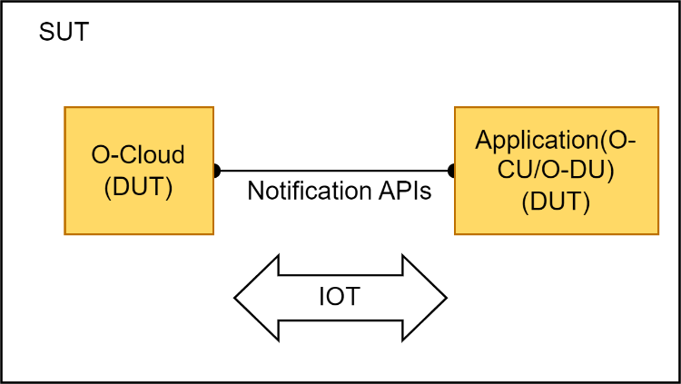
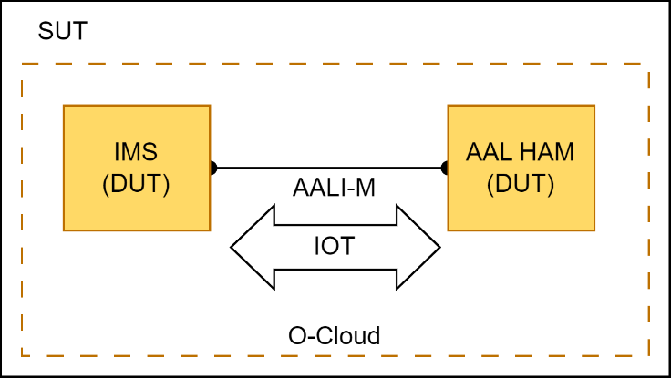
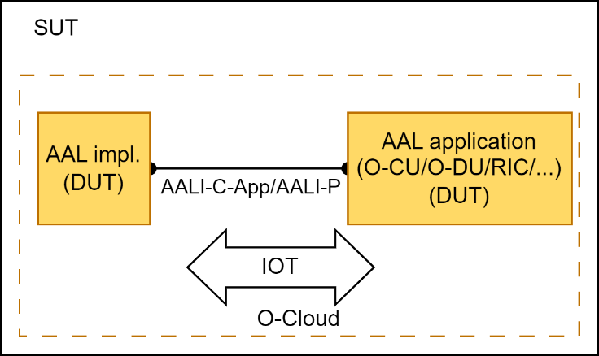
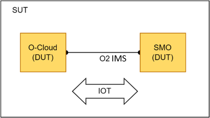
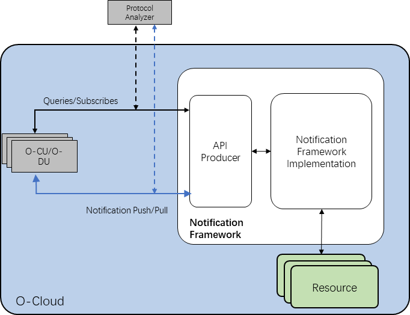

## O-RAN.WG6.O-CLOUD-IOT-R004-v02.00.docx

- View in [Reader Mode](https://simewu.com/spec-reader/pages/06-WG6/O-RAN.WG6.O-CLOUD-IOT-R004-v02.00.docx).
- Go back to [Table of Contents](../README.md).
- Download the [Original Document](https://github.com/Simewu/spec-reader/raw/refs/heads/main/documents/O-RAN.WG6.O-CLOUD-IOT-R004-v02.00.docx).

---

O-RAN.WG6.O-CLOUD-IOT-R004-v02.00

*Technical Specification*

**O-RAN Work Group 6**

**O-Cloud Interoperability Test (IOT) Specification**

Copyright (C) 2025 by the O-RAN ALLIANCE e.V.

The copying or incorporation into any other work of part or all of the material available in this specification in any form without the prior written permission of O-RAN ALLIANCE e.V. is prohibited, save that you may print or download extracts of the material of this specification for your personal use, or copy the material of this specification for the purpose of sending to individual third parties for their information provided that you acknowledge O-RAN ALLIANCE as the source of the material and that you inform the third party that these conditions apply to them and that they must comply with them.

O-RAN ALLIANCE e.V., Buschkauler Weg 27, 53347 Alfter, Germany Register of Associations, Bonn VR 11238, VAT ID DE321720189

Contents

List of Figures 4

List of tables 4

Foreword 5

Modal verbs terminology 5

Introduction 5

1. Scope 6
2. References 6
   1. Normative references 6
   2. Informative references 6
3. Definition of terms, symbols and abbreviations 7
   1. Terms 7
   2. Abbreviations 7
4. Testing methodology 8
   1. System under test 8
   2. Test method 11
      1. Objective 11
      2. Testing Tools and set-up 11
      3. Testing procedure 11
      4. Statistics and analysis of key indicators 11
5. Notification API IOT 12
   1. General 12
   2. Test Configuration 12
      1. System Under Test requirements 12
      2. Test Tools and Simulators capabilities 13
   3. Test Cases 13
      1. Push mode event notification 13
      2. Pull mode event notification 14
6. AAL Interface IOT 15
   1. General 15
   2. Test Configuration 15
      1. System Under Test requirements 15
      2. Test Tools and Simulators capabilities 15
   3. Test Cases 15
7. O2 Interface IOT 16
   1. General 16
   2. Test Configuration 16
      1. System Under Test requirements 16
      2. Test Tools and Simulators capabilities 16
   3. O2 IMS Test 16
      1. General 16
      2. Case 1 16
   4. O2 DMS Test 16
      1. General 16
      2. O2 DMS ETSI NFV Profile Test 16
      3. O2 DMS Kubernetes Profile Test 16

Annex A (normative): Checklist for Cases applies to O-Cloud technologies 18

* 1. O-Cloud technologies 18
  2. Cloud Technology Applicability of test cases 18
  3. Case Traceability 18

# List of figures

Figure 4.1-1: SUT configuration for Notification APIs IOT 9

Figure 4.1-2: SUT configuration for AAL interface IOT (AALI-C-Mgmt Interface) 9

Figure 4.1-3: SUT configurations for AALI IOT(AALI-C-App/AALI-P) 10

Figure 4.1-4: SUT configurations for O2 IMS IOT 10

Figure 4.1-5: SUT configurations for O2 DMS IOT 10

# List of tables

Table 4.1-1: O-Cloud IOT and corresponding Interfaces/APIs, DUTs and SUTs 8

Table A.2-1: O-Cloud Technology Applicability of Test Cases 18

Table A.3-1: Case Traceability 18

# Foreword

##### This Technical Specification (TS) has been produced by O-RAN Alliance.

The content of the present document is subject to continuing work within O-RAN and may change following formal O- RAN approval. Should the O-RAN Alliance modify the contents of the present document, it will be re-released by O- RAN with an identifying change of version date and an increase in version number as follows:

version xx.yy.zz where:

xx: the first digit-group is incremented for all changes of substance, i.e. technical enhancements, corrections, updates, etc. (the initial approved document will have xx=01). Always 2 digits with leading zero if needed.

yy: the second digit-group is incremented when editorial only changes have been incorporated in the document.

Always 2 digits with leading zero if needed.

zz: the third digit-group included only in working versions of the document indicating incremental changes during the editing process. External versions never include the third digit-group. Always 2 digits with leading zero if needed.

# Modal verbs terminology

In the present document "**shall**", "**shall not**", "**should**", "**should not**", "**may**", "**need not**", "**will**", "**will not**", "**can**" and "**cannot**" are to be interpreted as described in clause 3.2 of the O-RAN Drafting Rules (Verbal forms for the expression of provisions).

##### "**must**" and "**must not**" are **NOT** allowed in O-RAN deliverables except when used in direct citation.

# Introduction

##### This document specifies O-Cloud Interoperability testing(IOT) in accordance with O-RAN specified interfaces as defined in[1],[3],[4] and [5] which includes O-Cloud Notification API, AAL and O2.

# Scope

The present document specifies IOT testing for O-Cloud and peer device(s) or system(s) from different vendors connected by O-Cloud Interfaces/APIs. This document will specify the SUTs, testing methodology and the IOT test cases over O-Cloud Notification API, AAL O2 IMS and DMS interface.

# References

## Normative references

References are either specific (identified by date of publication and/or edition number or version number) or

non-specific. For specific references, only the cited version applies. For non-specific references, the latest version of the referenced document (including any amendments) applies.

NOTE: While any hyperlinks included in this clause were valid at the time of publication, O-RAN cannot guarantee their long-term validity.

The following referenced documents are necessary for the application of the present document.

1. O-RAN WG1.O-RAN Architecture Description-v06.00, Technical Specification.
2. O-RAN.WG6.Cloud Architecture and Deployment Scenarios for O-RAN Virtualized RAN-v03, Technical Report.
3. O-RAN.WG6.O-Cloud Notification API-v03: "O-Cloud Notification API Specification for Event Consumers".
4. O-RAN.WG6.AAL-Common-API-R003-v05.00: "[AAL Common API TS](https://oranalliance.atlassian.net/wiki/download/attachments/2401107974/O-RAN.WG6.AAL-Common-API-R003-v08.00.pdf?api=v2)"
5. O-RAN.WG6.AAL-GAnP-R003-v07.00: "[AAL General Aspects and Principles TS](https://oranalliance.atlassian.net/wiki/download/attachments/2210398415/O-RAN.WG6.AAL-GAnP-R004-v10.00.docx?api=v2)"
6. O-RAN.WG6.CADS-v05.00: "[Cloud Architecture and Deployment Scenarios TR](https://oranalliance.atlassian.net/wiki/download/attachments/2211217417/O-RAN.WG6.CADS-v08.00.pdf?api=v2)"
7. O-RAN.WG4.CUS.0-R003-v12.00: 'Control, User and Synchronization Plane Specification"
8. O-RAN.WG6.O2-GA&P-R004-v08.00: "O2 Interface General Aspects and Principles"

## Informative references

References are either specific (identified by date of publication and/or edition number or version number) or

non-specific. For specific references, only the cited version applies. For non-specific references, the latest version of the referenced document (including any amendments) applies.

NOTE: While any hyperlinks included in this clause were valid at the time of publication, O-RAN cannot guarantee their long-term validity.

The following referenced documents are not necessary for the application of the present document, but they assist the user with regard to a particular subject area.

[i.1] 3GPP TR 21.905.

# Definition of terms, symbols and abbreviations

## Terms

For the purposes of the present document, the terms and definitions given in 3GPP TR 21.905 [i.1] and the following apply. A term defined in the present document takes precedence over the definition of the same term, if any, in 3GPP TR 21.905 [i.1].

**O-Cloud** This refers to a collection of O-Cloud Resource Pools at one or more location and the software to manage Nodes and Deployments hosted on them. An O-Cloud will include functionality to support both Deployment-plane and Management services. The O-Cloud provides a single logical reference point for all O-Cloud Resource Pools within the O-Cloud boundary.

**O-CU** O-RAN Centralized Unit - a logical node hosting PDCP, RRC, SDAP and other control functions.

**O-DU** O-RAN Distributed Unit-a logical node hosting RLC/MAC/High-PHY layers based on a lower layer functional split.

**O-RU** O-RAN Radio Unit-a logical node hosting Low-PHY layer and RF processing based on a lower layer functional split. This is similar to 3GPP's "TRP" or "RRH", but more specific in including the Low-PHY layer (FFT/iFFT, PRACH extraction).

## Abbreviations

For the purposes of this document, the abbreviations given in 3GPP TR 21.905 [i.1] and the following apply.

An abbreviation defined in the present document takes precedence over the definition of the same abbreviation, if any, in 3GPP TR 21.905 [i.1].

3GPP Third Generation Partnership Project

AAL Acceleration Abstraction Layer

AALI-C Acceleration Abstraction Layer Interface-Common

AALI-C-Mgmt Acceleration Abstraction Layer Interface-Common-Management AALI-C-App Acceleration Abstraction Layer Interface-Common-Application AALI-P Acceleration Abstraction Layer Interface-Profile

API Application Programming Interface

CPU Central Processing Unit

CU Centralized Unit as defined by 3GPP

DU Distributed Unit as defined by 3GPP

DUT Device Under Test

EC Event Producer

EP Event Consumer

HAM Hardware Acceleration Manager

IMS Infrastructure Management Services

IOT Interoperability Test

O-Cloud O-RAN Cloud Platform

O-CU O-RAN Centralized Unit

O-DU O-RAN Distributed Unit

O-RU O-RAN Radio Unit

OS Operating System

PTP Precision Time Protocol

RAN Radio Access Network

RIC RAN Intelligent Controller

SMO Service Management and Orchestration

SUT System Under Test

TS Technical Specification

vCPU Virtual CPU

VM Virtual Machine

WG Working Group

# Testing methodology

## System under test

Interoperability testing is performed to validate the end-to-end functionality between the O-Cloud and peer devices or systems from different vendors connected by interfaces as defined in [1],[3],[4] and [5]. This document primarily focuses on scenarios where the System Under Test (SUT) for interoperability testing is comprised of different Device Under Test (DUTs) and its interconnecting IOT interface. SUT for O-Cloud IOT refers to the O-Cloud platform, peer devices, and interfaces provided by O-Cloud, as illustrated in Figure 5.1-1 of O-RAN WG1 O-RAN Architecture Description, Clause 5.1[1] and Architecture Diagram in Figure 4.2-1 of O-RAN WG6 AAL GAnP, Clause 4.2 [5]

O-Cloud provides following APIs and Interfaces:

* O2 interface, including both O2ims interface (for infrastructure management) and O2dms Interface (for application deployment) as described in O-RAN.WG6.O2-GA&P [8]
* O-Cloud Notification API, as described in O-RAN.WG6.O-Cloud Notification API[.1].
* AAL interface, as described in O-RAN.WG6.AAL-Common-API [4] and O-RAN.WG6.AAL-GAnP [5].

Test scenarios encompass O-Cloud Notification API IOT, AAL interface IOT and O2 interface IOT as shown in Table 4.1-1, which summarizes the scope of O-Cloud IOT, and corresponding SUTs and DUTs for different test cases which can include Security, Synchronization, Error Handling, Rest Resource verification etc over the interfaces mentioned in the table below.

###### Table 4.1-1: O-Cloud IOT and corresponding Interfaces/APIs, DUTs and SUTs

|  |  |  |  |
| --- | --- | --- | --- |
| **Test** | **Interface/API** | **DUTs** | **SUT** |

|  |  |  |  |  |
| --- | --- | --- | --- | --- |
|  |  | **Device1** | **Device2** | **Device1, Device2 and**  **interconnecting IOT Interface** |
| Notification APIs IOT | Notification APIs | O-Cloud | O-CU/O-DU | O-Cloud, O-CU/O-DU,  Notification APIs |
| AAL Interface IOT | AAL Interface (AALI-C- App/AALI-P) | AAL  implementation (O-Cloud) | AAL Application (O-CU/O-DU/...) | AAL implementation(O-Cloud), AAL Application, AAL Interface (AALI-C-App/AALI-P) |
| AAL Interface (AALI-M) | O-Cloud (IMS) | AAL HAM | O-Cloud (IMS), AAL HAM, AAL  Interface (AALI-M) |
| O2 Interface IOT | O2IMS Interface | O-Cloud (IMS) | SMO | O-Cloud, SMO, O2IMS |
| O2DMS Interface | O-Cloud (DMS) | SMO | O-Cloud, SMO, O2DMS |

The test configurations will involve defining the device pair and interface/API as part of the test scenario. The following figures show the high level SUT configurations for those IOT respectively.

###### Figure 4.1-1: SUT configuration for Notification APIs IOT

###### Figure 4.1-2: SUT configuration for AAL interface IOT (AALI-C-Mgmt Interface)

###### Figure 4.1-3: SUT configurations for AALI IOT(AALI-C-App/AALI-P)

###### Figure 4.1-4: SUT configurations for O2 IMS IOT

###### Figure 4.1-5: SUT configurations for O2 DMS IOT

The test configurations for each specific test scenario will be detailed in their corresponding test clauses.

## Test method

### Objective

O-Cloud IOT test focus on verifying the functional correctness between device peers. Performance test and security test are not in the scope.

To validate the functionality of production grade DUTs, it is important that the DUTs are not negatively impacted with the utilization of internal functions, so the Device in production environment should not be used for test.

The DUTs are used as black boxes for positive testing, negative testing, abnormal testing, etc.

### Testing Tools and set-up

Interoperability tests are performed with a set of testing tools which are used to both apply active stimulus and as well as monitoring and measurements of the DUTs. Non-DUT devices or corresponding emulation tools can be used as active stimulus during the test. Passive monitoring and measurement tools can be used to watch the status of DUTs, collect the information exchanges, and capture the logs during the test.

There is no constrain on the number of DUTs, but there shall be at least one for each DUT. DUTs shall be connected by corresponding interface before the test.

For each test is differ from others, the suggested tools and the set-up are be detailed in the corresponding configuration section of each test.

### Testing procedure

In adherence to the specifications, the System Under Test (SUT) and the test tool are meticulously configured and connected to the device, strictly following the predefined conditions for each test case.

The test steps outlined in the test case are executed sequentially.

The tester is responsible for diligently documenting crucial test information during and after the testing process, enabling detailed comparisons and analyses against the expected outcomes.

It is crucial to note that each test case remains independent of one another.

### Statistics and analysis of key indicators

The test execution adheres to the predefined conditions and procedures specified in the test case.

During the testing process, the tester may capture and record test result, including success or failure, along with corresponding metric data, such as throughput, latency, and device volume.

The expected test results serve as the benchmark for evaluating the test success. If the actual test results align with the expected outcomes, the test is considered successful.

# Notification API IOT

## General

The main objective is to test the interoperability of different vendors' O-CU/O-DU with O-Cloud using notification- related APIs. This includes both push and pull modes for event notifications.

As stated in Section 4.1, the SUT (System Under Test) for the Notification IOT test includes components such as O- Cloud and O-CU/O-DU/SMO.

Each IOT test case offers a test purpose, test entrance criteria, initialization conditions, test procedure, and expected results.

The main test scenarios covered are as follows:

1. Functional test of O-Cloud and O-CU/O-DU using notification subscription, query, deletion and event notification API.
2. Functional test of O-Cloud and O-CU/O-DU using notification pull API.

## Test Configuration

### System Under Test requirements

As shown in 5.2-1, the System Under Test (SUT) for the O-Cloud Notification IOT test consists of individual O-CU or O-DU components, along with the O-Cloud, which provides the notification framework. The notification framework includes an API producer; O-CU/O-DU act as consumers. O-Cloud, serving as an event generator, provides APIs to consumers for utilizing these events. These APIs can be used for subscribing to events, unsubscribing, querying subscriptions, and communicating with consumers using pull/push modes.

At least one O-CU/O-DU and one O-Cloud is required for this test. O-CU/O-DU and O-Cloud are connected through network, and O-CU/O-DU is configured with the endpoint of notification API for the communication.

Additionally, O-Cloud may need to support traffic mirroring for Protocol Analyzer to capture the requests and responses for analysing.

###### Figure 5.2-1: Configuration of O-Cloud Notification API IOT

### Test Tools and Simulators capabilities

A summary of the recommended testing tools for functional testing is shown as following:

Protocol Analyzer is required for recording and validating Notification API functionary message sequences and contents and issuing of verdicts related to the procedures in the test cases and thereby enabling determination of the DUTs level of interoperability.

## Test Cases

### Push mode event notification

#### Test Purpose

The purpose of this test case is to confirm that O-CU/O-DU, irrespective of the vendor, can manage the subscription resource and receive event notifications from O-Cloud.

This test is conditional mandatory; for push mode, this case applies.

#### Test Entrance Criteria

1. DUTs: O-CU/O-DU and O-Cloud.
2. CU/O-DU supports push mode Event Notification.
3. O-Cloud supports push mode Event Notification.

#### Initial conditions

1. Protocol Analyzer has started.
2. Configure the O-Cloud or the network between the O-CU/O-DU and O-Cloud so that Protocol Analyzer can capture the messages between DUTs, as needed.
3. Activate the Protocol Analyzer to capture and decode Notification API message flows between the DUTs.

#### Procedure

Step 1. Initiate a subscription procedure of the event notifications from O-CU/O-DU.

Step 2. Initiate a query procedure from O-CU/O-DU, to get the list of subscription resources, check the output. Step 3. Initiate a query procedure from O-CU/O-DU, to get a specific subscription resource, check the output. Step 4. Trig a subscribed event.

Step 5. Initiate a delete procedure from O-CU/O-DU, to delete a specific subscription resource, check the output.

Step 6. Check the message flow recorded by Protocol Analyzer for interoperability verification.

Example of how those procedures can be performed (or triggered) are listed below. The exact method to perform (or trigger) this procedure is out of scope of this specification and is left up to the implementation of the DUTs:

* + - * 1. O&M command in O-CU/O-DU to enable the subscription, query and deletion, for Step 1, 2, 3, 5, or to trig an event for Step 4.
        2. Reboot/restart O-CU/O-DU if O-CU/O-DU subscribes the notification automatically, for Step 1.
        3. Change the Synchronization status of the compute node if O-CU/O-DU subscribes the Synchronization Event, for Step 4.

#### Expected Results

Successful completion of the test steps with interoperable communication between O-CU/O-DU and O-Cloud with the output as expected.

Examine the message flow specified in O-RAN.O-Cloud Notification API [3] Section 4 and 5:

In Step 1, a POST request from O-CU/O-DU to O-Cloud and a response from O-Cloud to O-CU/O-DU shall present, and followed with a sanity check of the notification endpoint if communication to the notification endpoint is successful.

In Step 2, 3 and 5, a Get request and a response shall present.

In Step 4, a notification of the event to O-CU/O-DU from O-Cloud shall present.

### Pull mode event notification

#### Test Purpose

The purpose of this test case is to verify O-CU/O-DU from a vendor different from O-Cloud can pull the event from Notification API Producer as specified in O-RAN.WG6.O-Cloud Notification API [3] clause 6.

This test is conditional mandatory; for pull mode, this case applies.

#### Test Entrance Criteria

1. DUTs: O-CU/O-DU and O-Cloud.
2. CU/O-DU has the capability to initiate an Event query, and the O-Cloud supports to response to the query requests.
3. O-Cloud supports pull mode Event Notification.

#### Initial conditions

1. Protocol Analyzer has started.
2. Configure the O-Cloud or the network between the O-CU/O-DU and O-Cloud so that the Protocol Analyzer can capture the messages between DUTs.
3. Activate the Protocol Analyzer to capture and decode Notification API message flows between the DUTs.

#### Procedure

Step 1. Initiate an event pull procedure from O-CU/O-DU.

Step 2. Check the message flow recorded by Protocol Analyzer.

Example of how those procedures can be performed (or triggered) are listed below. The exact method to perform (or trigger) this procedure is out of scope of this specification and is left up to the implementation of the DUTs:

* + - * 1. O&M command in O-CU/O-DU to initiate the pulling.
        2. O-CU/O-DU pulls events periodically, without human intervention.

#### Expected Results

The procedures are successfully completed during the test.

Examine the message flow specified in O-RAN.WG6.O-Cloud Notification API [3] clause 6: a GET request from O- CU/O-DU to O-Cloud and a response from O-Cloud to O-CU/O-DU shall present.

# AAL Interface IOT

## General

##### NOTE: The interoperability tests for the AAL interface have not been specified in this present document version. Future versions of the present document are expected to specify these interoperability tests.

## Test Configuration

### System Under Test requirements

### Test Tools and Simulators capabilities

## Test Cases

# O2 Interface IOT

## General

##### NOTE: The interoperability tests for the O2 interface have not been specified in this present document version. Future versions of the present document are expected to specify these interoperability tests.

## Test Configuration

### System Under Test requirements

### Test Tools and Simulators capabilities

## O2 IMS Test

### General

### Case 1

## O2 DMS Test

### General

### O2 DMS ETSI NFV Profile Test

#### Test configuration

#### Test case 1

### O2 DMS Kubernetes Profile Test

#### Test configuration

#### Test case 1

Annex A (normative):

Checklist for Cases applies to O-Cloud technologies

Here give lists of cases applied to each O-Cloud technology.

## O-Cloud technologies

This specification covers following O-Cloud technologies:

* + - VMs only
    - Containers only
    - Containers in VMs

## Cloud Technology Applicability of test cases

Cases marked with Y apply to the corresponding cloud technologies should be executed.

**Table 0-2: O-Cloud Technology Applicability of Test Cases**

|  |  |  |  |  |
| --- | --- | --- | --- | --- |
| **Test** | **Case Title** | **VMs only** | **Containers only** | **Containers in VMs** |
| O-Cloud Notification API Test | Push mode notification | Y | Y | Y |
| Pull mode notification | Y | Y | Y |

## Case Traceability

###### Table 0-3: Case Traceability

|  |  |  |  |
| --- | --- | --- | --- |
| **Test** | **Test case** | **Reference** | **Requirement** |
| O-Cloud Notification API | Push mode notification | [3] O-RAN.WG6.O-Cloud | 4.1.2.1 |
| Test |  | Notification API-v03.00 | 4.1.2.2 |
|  |  |  | 4.1.3.1 |
|  |  |  | 4.1.3.2 |
|  |  |  | 5.1.1 |
|  | Pull mode notification | [3] O-RAN.WG6.O-Cloud | 6.1.1 |
|  |  | Notification API-v03.00 |  |

Annex (informative): Change History

|  |  |  |
| --- | --- | --- |
| **Date** | **Revision** | **Description** |
| 2023.07.10 | 00.00.01 | Create initial version of O-Cloud IOT spec, with skeleton. |
| 2023.09.24 | 00.00.02 | Resolve comment, updated for WG6 review. |
| 2023.11.2 | 00.00.03 | Implemented CRs LNV-001 and LNV-002, baseline for review. |
| 2023.11.14 | 00.00.04 | Resolve comments, update Notification API test cases descriptions by merging cases into pull mode notification and push mode notification, and annex A |
| 2023.11.17 | 00.00.05 | Resolve comments, Baseline for WG voting 00.00.05 |
---

- View in [Reader Mode](https://simewu.com/spec-reader/pages/06-WG6/O-RAN.WG6.O-CLOUD-IOT-R004-v02.00.docx).
- Go back to [Table of Contents](../README.md).
- Download the [Original Document](https://github.com/Simewu/spec-reader/raw/refs/heads/main/documents/O-RAN.WG6.O-CLOUD-IOT-R004-v02.00.docx).
