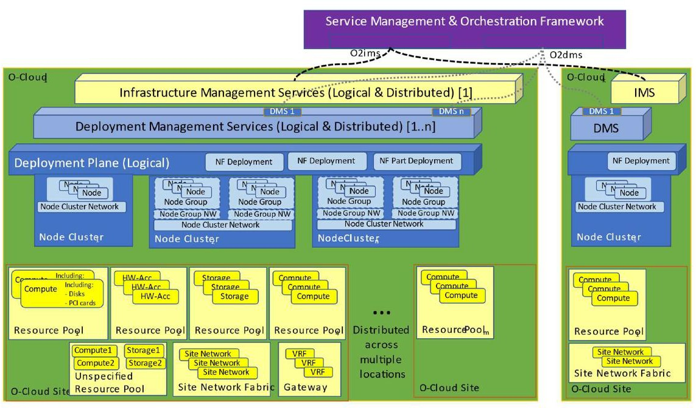

## O-RAN.WG6.O-Cloud-ES-v02.00.docx

- View in [Reader Mode](https://simewu.com/spec-reader/pages/07-WG6/O-RAN.WG6.O-Cloud-ES-v02.00.docx).
- Go back to [Table of Contents](../README.md).
- Download the [Original Document](https://github.com/Simewu/spec-reader/raw/refs/heads/main/documents/O-RAN.WG6.O-Cloud-ES-v02.00.docx).

---

O-RAN.WG6.O-Cloud-ES.v02.00

*Technical Report*

**O-RAN Working Group 6 (Cloudification and Orchestration Workgroup)**

**Study on O-Cloud Energy Savings**

Copyright (C) 2024 by the O-RAN ALLIANCE e.V.

The copying or incorporation into any other work of part or all of the material available in this document in any form without the prior written permission of O-RAN ALLIANCE e.V. is prohibited, save that you may print or download extracts of the material of this document for your personal use, or copy the material of this document for the purpose of sending to individual third parties for their information provided that you acknowledge O-RAN ALLIANCE as the source of the material and that you inform the third party that these conditions apply to them and that they must comply with them.

# Contents

Contents 2

List of figures 4

List of tables 4

Foreword 5

Modal verbs terminology 5

Executive summary 5

Introduction 5

1. Scope 6
2. References 6
   1. Informative references 6
3. Definition of terms, symbols and abbreviations 7
   1. Terms 7
   2. Symbols 7
   3. Abbreviations 7
4. O-Cloud Energy Savings background, concepts, and assumptions 7
   1. O-Cloud Energy Savings Objectives 7
   2. O-Cloud Energy Savings concept and assumptions 8
      1. Overview 8
      2. O-Cloud Resource Energy Management 8
   3. Architecture options to achieve energy savings optimisation 11
      1. Overview 11
      2. Energy Saving Policy applied via Kubernetes API 11
      3. Energy Saving Policy applied by NF Deployment 12
5. Energy Savings Use Cases 13
   1. Use Case 1: O-Cloud Node Shutdown in Idle Mode 13
      1. Overview 13
      2. Description and UML Diagrams 14
      3. Potential Requirements 15
   2. Use Case 2: CPU core frequency and pinning configuration change by SMO 15
      1. Overview 15
      2. Description and UML Diagrams 17
      3. Potential Requirements 18
   3. Use Case 3: C-state usage for NF Deployment 19
      1. Overview 19
      2. C-state Configuration for NF Deployments 19
      3. Potential Requirements 20
   4. Use Case 4: O-Cloud Node Cluster Mode Selection 20
      1. Overview 20
      2. Description and UML Diagrams 21
      3. Potential Requirements 22
6. Power Consumption, Energy Consumption and Efficiency Measurement and KPIs 22
   1. Overview 22
   2. Power, energy consumption metrics of Infrastructure 22
      1. Overview 23
      2. Measurement and KPI Definition 23
   3. Power, Energy Consumption Metrics of Containers 24
      1. Overview 24
      2. Measurement and KPI Definition 24
   4. Power, energy consumption metrics of NF deployment and Cloudified NF 25
      1. Overview 25
      2. Measurement and KPI Definition 25
   5. Energy efficiency of Cloudified NF 26
      1. Overview 27
      2. Measurement and KPI Definition 27
7. Recommendations 27
8. Conclusions 27

Annex A (Informative) 28

* 1. Power Modeling Example 28

Revision history 30

History 322

# List of figures

##### Figure 4.2-1 : Key Components Involved in/with an O-Cloud 9

##### Figure 4.2-2 : C-State example 10

##### Figure 4.3-1 : Energy Saving Policy applied via Kubernetes(R) API 12

##### Figure 4.3-2 : Energy Saving Policy applied by NF Deployment 13

##### Figure 5.1-1 : O-Cloud Node Shutdown in Idle Mode 15

##### Figure 5.2-1 : CPU core frequency and pinning configuration change by SMO 18

##### Figure 5.3-1 : C-state usage for NF Deployment 20

##### Figure 5.4-1 : O-Cloud Node Cluster Mode selection 22

# List of tables

##### Table 5.1-1 : O-Cloud Node Shutdown in Idle Mode Sequence Description 14

##### Table 5.2-1 : CPU core frequency and pinning configuration Sequence Description 17

##### Table 5.4-1 : Examples of Modes and their Description 21

##### Table 5.4-2 : O-Cloud Node Cluster Mode selection Sequence Description 21

##### Table 6.2-1 : O-Cloud Resource Infrastructure Power Consumption Metrics 23

##### Table 6.2-2 : O-Cloud Node Resource Energy Consumption 24

##### Table 6.3-1 : Container Energy Consumption 24

##### Table 6.3-2 : Container Resource Utilization 25

##### Table 6.4-1 : Estimated NF Deployment Power Consumption 26

##### Table 6.4-2 : Estimated NF Deployment Energy Consumption 26

##### Table 6.4-3 Estimated Cloudified NF Power Consumption 26

##### Table 6.4-4 Estimated Cloudified NF Energy Consumption 26

##### Table 6.5-1 Types of Energy Efficiency Measures 27

# Foreword

This Technical Report (TR) has been produced by O-RAN Alliance.

# Modal verbs terminology

In the present document "**shall**", "**shall not**", "**should**", "**should not**", "**may**", "**need not**", "**will**", "**will not**", "**can**" and "**cannot**" are to be interpreted as described in clause 3.2 of the O-RAN Drafting Rules (Verbal forms for the expression of provisions).

"**must**" and "**must not**" are **NOT** allowed in O-RAN deliverables except when used in direct citation.

# Executive summary

Open RAN energy management is a key sustainability objective for all mobile operators around the world. This could help Open RAN technology to scale for commercial deployments and speed up O-RAN technology development.

Telecoms industry requires a standardized approach not only for achieving energy saving, but also for evaluating, testing, measuring, and monitoring energy consumption of Open RAN Cloud deployments. This Technical Report (TR) analyses some energy techniques that can be utilized within the O-Cloud to achieve promising reduction in Open RAN Cloud deployment power consumption.

# Introduction

Energy consumption of RAN has become a key part of the operators' OPEX. The energy cost on RAN is expected to continue to grow with increased adoption of 5G technology enablers such as Massive MIMO and B5G/6G. Energy efficiency is therefore essential and crucial for Open RAN technology to scale for commercial deployments. Telecoms industry requires a standardized approach not only for achieving energy saving, but also for evaluating, testing, measuring, and monitoring energy consumption of dis-aggregated Multi-vendor Open RAN Cloud deployments.

This technical report focuses on the power management techniques that could be implemented within the O-Cloud to reduce energy consumption. O-RAN relies on the O-Cloud to deploy RAN Network functions. Therefore, energy savings using power management techniques within the O-Cloud could enable significant reduction of Open RAN power consumption. This TR further aims to provide potential concepts, requirements, user stories and use cases optimizing the O-Cloud resources used by the RAN application, and thus accelerating innovation to introduce energy efficiency in OpenRAN deployments.

In O-RAN architecture., the SMO collects data from the deployed applications (O1) along with O-Cloud data related to the Cloud infrastructure and NF Deployments (O2 IMS and DMS). These data can be used to create policies for energy savings and trigger the energy saving activities. In the following sections different power management techniques are reviewed, which can be used to reduce the O-Cloud energy consumption and derive recommendations.

# Scope

The contents of the present document are subject to continuing work within O-RAN and may change following formal O-RAN approval. Should the O-RAN Alliance modify the contents of the present document, it will be re-released by O- RAN with an identifying change of version date and an increase in version number as follows:

version xx.yy.zz where:

xx: the first digit-group is incremented for all changes of substance, i.e. technical enhancements, corrections, updates, etc. (the initial approved document will have xx=01). Always 2 digits with leading zero if needed.

yy: the second digit-group is incremented when editorial only changes have been incorporated in the document.

Always 2 digits with leading zero if needed.

zz: the third digit-group included only in working versions of the document indicating incremental changes during the editing process. External versions never include the third digit-group. Always 2 digits with leading zero if needed.

The present document reports about power management techniques that could be implemented within the O-Cloud to reduce energy consumption and achieve energy savings.

# References

## Informative references

The following referenced documents are not necessary for the application of the present document, but they assist the user with regard to a particular subject area.

1. O-RAN WG6, Cloud Architecture and Deployment Scenarios for O-RAN Virtualized RAN - v06.00, Technical Report. See https://[www.o-ran.org/specifications.](http://www.o-ran.org/specifications)
2. 3GPP TS 28.554: "Technical Specification Group Services and System Aspects; Management and orchestration; 5G end to end Key Performance Indicators (KPI)", Release 17, March 2023
3. Intel(R) Technology Guide: "Power Management - Technology Overview". See https://networkbuilders.intel.com/solutionslibrary/power-management-technology-overview-technology-guide
4. O-RAN WG1, Decoupled SMO Architecture - v02.00, Technical Report. See https://www.o- ran.org/specifications.
5. Intel(R) Technology Guide: "Power Management - User Wait Instructions Power Saving for DPDK PMD Polling Workloads". See https://networkbuilders.intel.com/solutionslibrary/power-management-user-wait- instructions-power-saving-for-dpdk-pmd-polling-workloads-technology-guide
6. O-RAN WG6, O2 Interface General Aspects and Principles - v06.00, Technical Specification. See https://[www.o-ran.org/specifications](http://www.o-ran.org/specifications)
7. O-RAN WG6, O2IMS Interface Specification - v04.00, Technical Specification. See [https://www.o-](https://www.o-ran.org/specifications) ran.org/specifications.
8. Redfish Resource and Schema Guide. DMTF Redfish DSP2046 (2022.2): "Redfish Resource and Schema Guide," published 2022-09-15.
9. DMTF Redfish DSP2051: " Redfish Telemetry White Paper, "published 2020-03-27.
10. ETSI GR NFV-EVE 021 (V5.1.1): "Network Functions Virtualisation (NFV) Release 5; Evolution and Ecosystem; Report on energy efficiency aspects for NFV".
11. 3GPP TS 28.554: "Technical Specification Group Services and System Aspects; Management and orchestration; 5G end to end Key Performance Indicators (KPI)", Release 17, March 2023
12. ETSI ES 203 228: "Environmental Engineering (EE); Assessment of mobile network energy efficiency", v1.3.1
13. 3GPP TS 28.552: "Technical Specification Group Services and System Aspects; Management and orchestration; 5G performance measurements", Release 18, March 2023
14. O-RAN WG6, O2dms Interface Specification: Profile based on ETSI NFV Protocol and Data Models - v06.00, Technical Specification. See [https://www.o-ran.org/specifications.](https://www.o-ran.org/specifications)
15. O-RAN WG6, O2dms Interface Specification: Kubernetes Native API Profile for Containerized NFs v04.00, Technical Specification. See [https://www.o-ran.org/specifications.](https://www.o-ran.org/specifications)
16. Kubernetes Efficient Power Level Exporter (Kepler): https://sustainable-computing.io/
17. Kepler Github Repo: https://github.com/sustainable-computing-io/kepler
18. Kepler Power Model: https://sustainable-computing.io/design/power\_model/
19. O-RAN WG1, Network Energy Saving Use Cases Technical Report-v02.00, Technical Report, See https://[www.o-ran.org/specifications.](http://www.o-ran.org/specifications)

# Definition of terms, symbols and abbreviations

## Terms

For the purposes of the present document, the terms and definitions given in O-RAN.WG6.CADS [1] and the following apply. A term defined in the present document takes precedence over the definition of the same term, if any, in O- RAN.WG6.CADS [1].

## Symbols

For the purposes of the present document, the following symbols apply:

PNF Deployment, estimated Estimated power consumption of a NF Deployment running in the O-Cloud ECNF Deployment, estimated Estimated energy consumption of a NF Deployment running in the O-Cloud PcloudifiedNF, estimated Estimated power consumption of a Cloudified NF

ECcloudifiedNF, estimated Estimated energy consumption of a Cloudified NF EEcloudifiedNF Energy efficiency of a Cloudified NF

## Abbreviations

For the purposes of the present document, the abbreviations given in O-RAN.WG6.CADS [1], 3GPP TS 28.554 [2], and O-RAN.WG1.NESUC [19] apply.

# O-Cloud Energy Savings background, concepts, and assumptions

## O-Cloud Energy Savings Objectives

The present Technical Report is part of the WG6 UCTG Network Energy Saving pre-normative phase. The objectives of the pre-normative phase are as follows:

* Study O-Cloud Energy savings Use cases including potential requirements, key issues, and benefits of proposed solutions.
* Study KPIs and focus on specifying O-Cloud hardware and/or software measurement and telemetry for O- Cloud energy saving, including:

- Study if new measurements and telemetry data for O-Cloud energy saving would be collected from the O-Cloud and describe corresponding measurements and telemetry data in appropriate specifications.

- Study potential energy saving relevant measurements and telemetry for O-Cloud resources, resource pools, O-Cloud node groups and O-Cloud nodes.

* Study potential impact and enhancements to O-RAN interfaces such as O2 IMS/DMS, O1, and R1.

Algorithms discussed and analysed as part of the O-Cloud Energy Savings pre-normative phase will be examples only and will not be part of any specification as outcome of this pre-normative phase or subsequent work items.

For each use case solution proposal, the detailed objectives are:

* Review, evaluate applicability of, and select from existing deployment alternatives and AI/ML deployment scenarios and document respective findings:

- Evaluate energy savings gains based on a O-Cloud energy consumption model.

- Study on a per sub-use case basis potential impact and enhancements on O-RAN interfaces (e.g. O1, O2, R) in terms of required input data and output configuration data.

- Review existing counters, KPIs, and data models as specified/studied in other organizations, such as 3GPP.

- Study potential enhancements on existing counters, KPIs, and data models or define new counters, KPIs, and data models of all involved O-RAN entities.

## O-Cloud Energy Savings concept and assumptions

### Overview

With the move towards commercial off-the-shelf (COTS) servers for O-Cloud implementations, O-RAN vendors are free to leverage the many existing technologies in COTS servers and clouds for energy savings. It is assumed that some of these technologies may be used in O-Clouds. This section will give a brief background on the different technologies available in modern General-Purpose servers see [3].

### O-Cloud Resource Energy Management

#### Overview

An O-Cloud Resource is defined in an O-Cloud infrastructure as one that may be provisioned and managed through an abstraction [1]. O-Cloud infrastructure has two kinds of resources: physical and logical resources. A physical resource is defined as a kind of resource that has a manifestation in the real world. A logical resource is defined as a kind of resource that uses several physical resources, or a portion of physical resources, or several software entities.

For example, some kinds of physical resources could be servers, switches, and storage units. For example, some kinds of logical resources are OpenStack and K8s clusters.

Various Energy Management methods can be applied on O-Cloud Resources to reduce the power consumption in O- Cloud. Some of the examples are given below.

CPU Energy Management - Applying various methods to adjust the CPU frequency and Voltage to reduce the CPU energy consumption.

Clock Gating - Disabling a portion of a circuit in CPU that results in lower power consumption.

Adaptive Link Rate - With this technology, the data rate for a network link can be adjusted during the period of low network traffic.

Idle States and Performance states - O-Cloud Resources can have certain idle states/performance states enabled during the period of low utilization.

###### Figure 4.2-1: Key Components Involved in/with an O-Cloud

#### CPU Energy Management

##### Overview

Energy efficiency and management in O-Cloud can be accomplished by CPU Energy Management. CPU energy consumption can be managed by introducing different levels of energy consumption with CPU frequency and voltage scaling. CPU energy savings can be achieved by modifying the power states of CPU or other configurable methods for CPU energy management.

##### Direct Method

The predictable and linear method to scale the CPU frequency and voltage:

Sleep states (C-States) - These states are used to alter energy usage from CPU systems in a power management strategy employed independently or together with P-State.

Performance States (P-States) - These states are used to alter energy usage from CPU systems in a power management strategy employed together with C-State.

Thermal States (T-States) - These states are used for thermal management to reduce the heat and power of a CPU by frequency and voltage scaling.

C-states are power states that a CPU can use to reduce power consumption on a per-core level, or on a CPU package level, by powering down portions of the core, package, or both. Disabling portions of the core allows for large power savings but prevents the core from executing instructions. C-states can be used to move individual cores or the full CPU Package to an idle state, reducing the power consumption of the server. Figure 4.2-2 below shows an example of some of the different C-state supported. Note that other C-states may be supported and have different characteristics.

###### Figure 4.2-2: C-State example

C-states can be managed or controlled in several different methods

Hardware: In certain configurations, the Power Control Unit (PCU) in the CPU is responsible for autonomously coordinating core and package C-states while BIOS configuration allows you to limit the C- states available to the platform, ensuring it never goes below your required C-state. Alternatively, Linux Kernel drivers (such as acpi\_idle or intel\_idle) and the Linux Kernel scheduler govern C-states.

Operating System: Core C-states are controlled by the OS as defined by the ACPI Specification. The OS can tell the threads in a core to go to a particular C-state using the MWAIT and MONITOR instruction for example. In supported CPUs, application software can use the waitpkg instructions to request power-optimised states C0.1 and C0.2 for example.

Application: Software techniques can be used to influence kernel control of C-states for example a SW thread that sleeps using standard Linux system, such as usleep() can help the Linux Kernel to sleep the core if there is no other work to be scheduled on that core. In supported CPUs, application software can use the user mode waitpkg instructions to directly request power-optimised states C0.1 and C0.2 for example [5].

A Performance State (P-state) is an operating point where a CPU core is operating at a specific frequency and voltage while executing instructions. As the core moves to lower P-states, the frequency and associated voltage drops resulting in reduced power consumption and performance. The Advanced Configuration and Power Interface (ACPI) defines the performance states that are exposed to system software. Software interfaces allow P-states to be controlled per core. P- states can be used to dynamically reduce frequency per core, reducing the power consumption of the server.

P-states may be managed or controlled in several different methods

Hardware: Hardware-Controlled Performance States (HWP) give the option to pass P-state control to the hardware, allowing it to make much faster and finer adjustments to the frequency and voltage, based on each core's load and OS hints. Without HWP, the OS can directly request P-states through the Linux Kernel drivers (such as acpi\_cpufreq driver, intel\_pstate driver).

Operating System: P-states can be managed from user space via the Linux Kernel system file system, such as "sysfs". By default, the P-states have a management routine known as a governor that decides how to control the frequency in response to the workload.

Application: As demonstrated by the DPDK Power Management library a user space application can save power by dynamically adjusting CPU frequency. The user space application can request a specific P-state configuration from the kernel.

NOTE: Linux(R) is the registered trademark of Linux Torvalds in the U.S. and other countries.

##### Indirect Method

These are the methods which are complex, have dependencies and do not follow the cause-and-effect pattern. By applying these methods, the energy consumption of the CPU can be reduced.

CPU affinity - Assigning specific processes or threads to a core can help improve NF performance which can reduce the CPU energy consumption.

Consuming least number of cores with technology such as simultaneous multithreading allows other cores to remain in low power or idle state which can reduce energy consumption.

Scheduling - Scheduling of threads and processes in an energy efficient manner

#### Modes and Policies for Energy Savings in O-Cloud

A Mode refers to a setting which can contain a set of different policies and/or configurations, that aims to improve certain characteristics of a system, e.g., for energy efficiency or performance. Some of the Modes can be used to save the energy of an O-Cloud by representing different levels of energy consumption.

As defined in WG1.Decoupled-SMO-Architecture [4], section 5.13.1, a Policy refers to a set of rules, guidelines, or conditions that govern the behavior and actions of O-RAN resources and services. These policies can be used for energy savings in O-Cloud.

## Architecture options to achieve energy savings optimisation

### Overview

O-Cloud Node resources (for example compute, network, storage) used by an NF Deployment can be optimised to reduce power consumption based on current or predicted resource usage. The following sections examine how energy savings optimisations can be applied to the O-Cloud using the O-RAN architecture and interfaces and identify any potential changes.

NOTE: There can be other possible alternatives to achieve Energy Savings and Optimisation that are not presented in the present document version.

### Energy Saving Policy applied via Kubernetes API

Description:

* NF Deployments can be deployed with Kubernetes Extended Resources that are associated with a specific power management configuration of the node resources.
* For example, CPU cores on a particular node are set to a certain idling mode (e.g., c1), when NF Deployment is created the container(s) that requested these cores via the Extended Resource will use them.
* Please note that Extended Resources can also be associated with a setup that is more dynamic, it depends on the operator/controller features, for example, changing configuration of resources used by the NF Deployments during a certain time of a day.
* SMO via rApp can learn traffic patterns and modify the Extended Resources configuration. For example, changing the hours that application is using a high performance cores and low performance cores due a change in traffic consumption.

NOTE 1: The realization of this option is done with Kubernetes's operators - Custom Resources define the energy saving capabilities and expose it to the NF Deployments via Extended Resources which are declared as part of NF Deployment manifests (e.g., helm charts).

NOTE 2: SMO/rApp communicates changes to the Custom Resources.

NOTE 3: Kubernetes(R) and K8s(R) are registered trademarks of the Linux Foundation, in the United States and other countries.

###### Figure 4.3-1: Energy Saving Policy applied via Kubernetes(R) API

### Energy Saving Policy applied by NF Deployment

Description:

* In this option the energy saving policy can be applied by the SMO and can be adjusted by the NF Deployment or available directly from the NF Deployment, meaning that that NF Deployment applies its energy saving policy without the need of the SMO, if it has the capability of doing so.
* For example, initial policy was requested for low power consumption between 2AM and 5AM, however, due to traffic increase the application adjusts its assigned resources to accommodate the new traffic demand.
* NF Deployment uses O-Cloud resource interface to adjust power management of its assigned resources (potential new interface between the NF Deployment and O-Cloud).

NOTE 1: This option requires a new interface between the NF Deployment and O-Cloud (cloud platform) to adjust the power consumption of its assigned resources but applies only for the cases where Node Cluster resources are exclusively assigned to the NF Deployment, not being shared with other entities and other Deployment in the Node Cluster, for example, vfio.

NOTE 2: It is the responsibility of the cloud platform to determine if the resources that are assigned to the NF Deployment are shared or not. Requests for shared resources will not be granted and will be denied.

NOTE 3: To implement such interface, the O-Cloud (cloud platform) exposes an endpoint to the NF Deployment, for example, this exposure can be done via the Pod environment variables, exposing a certain port on the Pod's localhost.

NOTE 4: This architecture option is allowing NF Deployment to adjust its own allocated/assigned resources directly and fast (low latency) when traffic suddenly changes, however, this option could potentially face conflicting requests and/or race conditions especially if also controlled by SMO, which need to be taken into account when considering this option and creating requirements accordingly.

###### Figure 4.3-2: Energy Saving Policy applied by NF Deployment

# Energy Savings Use Cases

## Use Case 1: O-Cloud Node Shutdown in Idle Mode

### Overview

This use case describes a method to perform O-Cloud Energy Saving by shutting down O-Cloud Node(s) in idle times through Non-RT RIC provided guidance.

Typically, Virtual Network Functions (VNFs) can be represented as single or chains of cloud resources (Virtual Machines (VMs) or containers) which are deployed inside data centers on a O-Cloud site. . In order to achieve cost efficiency, network operators aim at minimizing the power consumption of their NFV infrastructure. This can be achieved by using the minimum set of physical servers required by the virtual functions in terms of computing, memory, disk related parameters.

A O-Cloud Node as defined in O-RAN.WG6.CADS [1] is the basic computational resource designator and can be commonly thought of as a server. Programs running on Nodes are packaged as workloads. A cloud resource might comprise functionalities supporting one or multiple NF(s) or parts of one or multiple NF(s). In such a O-Cloud environment, some nodes may become idle as workloads shift and change. By identifying and shutting down these idle nodes, energy consumption can be reduced, leading to cost savings and increased efficiency in resource utilization.

Non-RT RIC can collect O1 and O2 related data, store data patterns and resource usage (CPU, memory, network, etc.) of O-Cloud Nodes. This data is utilized to train a predictive model that can identify idle times when the resources are not being utilized.

Based on the predictions, non-RT RIC can recommend the shutting down of idle O-Cloud Nodes to reduce costs and improve efficiency. It is imperative to note that the non-RT RIC takes into consideration the potential impact of shutting down an idle node on future system performance. Therefore, the Non-RT RIC will only recommend shutting down a node if it predicts a prolonged period of idleness, in order to avoid unnecessary and frequent shutdowns and startups of nodes.

NOTE: This use-case takes into consideration the assumption that the Nodes are idle, and SMO have relocated the workloads that are not autonomously relocated by the DMS.

### Description and UML Diagrams

###### Table 5.1-1: O-Cloud Node Shutdown in Idle Mode Sequence Description

|  |  |
| --- | --- |
| **Use Case Stage** | **Evolution / Specification** |
| Goal | Shutting down of O-Cloud Node(s) in idle times for energy saving purpose. |
| Actors and Roles | Cloud Maintainer: Recommend O-Cloud Node Shutdown SMO (FOCOM~~/NFO~~) : Actions to implement goal  Non-RT RIC Including rAPP : O1 & O2 related data analysis, recommendation to trigger O-Cloud Node shutdown  NF - Network Function (Application) |
| Assumptions | * The "Service Request" to the FOCOM includes the identifiers of the O-CloudNode(s) to be shut down. * The trigger can be given from the Cloud Install Project Manager or rApps (via Non-RT RIC). * The Cloud Maintainer or rApp has subscribed to receive notifications from the SMO. * SMO (FOCOM/NFO) can get reccomendation from rApps via Non-RT RIC, where rApps has its own algorithm that decides when to shut down O-Cloud HW nodes. |
| Pre- conditions | * SMO is available * O-Cloud is available * O2-IMS alarm events have been subscribed by Cloud Maintainer and or Non-RT RIC. * Non-RT RIC/rApp can receive O-Cloud telemetry data from FOCOM. * SMO has relocated the workloads that are not autonomously relocated by the DMS * The Non-RT RIC has processed a recommendation for shutting down a O-Cloud HW   Node(s), based on the prediction of an extended period of idleness for the involved O-Cloud Node(s). |
| Begins when | The recommendation for shutting down existing O-Cloud Node(s) has been completed Cloud Maintainer or by rApps via Non-RT RIC. |
| Step 1,2 (M) | Cloud Maintainer or rApps via Non-RT RIC recommends FOCOM to shut down the O-Cloud HW node(s) |
| Step 3 (M) | FOCOM requests to IMS to shutdown down one or more O-Cloud HW Nodes. |
| Step 4 (M) | IMS shutdown the requested O-Cloud nodes. |
| Step 5 (M) | IMS informs SMO that the O-Cloud HW Node(s) Shutdown is completed. |
| Step 6 (M) | FOCOM informs Non-RT RIC (rApp) through SMO that the O-Cloud HW Node(s) Shutdown is completed. |
| Ends when | O-Cloud HW node(s) have been shut down. |
| Post-conditions | O-Cloud HW Node(s) have been Shut down for energy saving.  SMO/Non-RT RIC continues to monitor the load on the O-Cloud by collecting and monitoring the relevant performance and matrices using O1 and O2. |
| Traceability | Traceability has not been specified in the present document. |

###### Figure 5.1-1: O-Cloud Node Shutdown in Idle Mode

### Potential Requirements

NOTE: Potential requirements for WG6, as well as high level requirements for other O-RAN WGs have not been specified in the present document.

## Use Case 2: CPU core frequency and pinning configuration change by SMO

### Overview

This Use Case describes CPU core frequency and pinning changes for O-Cloud platform based on energy saving policy which is generated by non-RT RIC or Cloud Operator, especially for the CPU allocated to VNF/CNF in idle or low CPU utilization/load to save energy. This can be one of the possible deployment scenarios, for instance, small site deployment scenarios.

When the service throughput or UE numbers are low, as well as CPU utilization or load of VNF/CNF is low, the CPU frequency mode allocated to dedicated VNF/CNF can be changed to energy saving mode, or some of the CPU cores for dedicated VNF/CNF can be closed based on the CPU core pinning, or the CPU states for dedicated VNF/CNF can be changed to save O-Cloud energy.

For Example: O-Cloud telemetry data, such as CPU Frequency, CPU Utilization, CPU Temperature, CPU State etc., can be collected through O2ims and O2dms and reported to SMO. Furthermore, configuration data of the CPU, such as CPU core pinning information, vCPU number etc., can be collected by SMO as well as sent by O-Cloud to SMO through O2 interface. Then the O-Cloud energy saving policy based on SMO pre-configured or generated by Cloud Operator or Non-RT RIC/rApp, such as CPU frequency mode or CPU cores configuration for dedicated VNF/CNF, will

be generated and provided through O2ims/O2dms to help update VNF/CNF deployment for energy saving. Furthermore, the O-Cloud energy saving policy generation could be further combined with O1 telemetry data for VNF/CNF to ensure VNF/CNF performance.

NOTE 1: In this use case, O-Cloud energy saving policy can be pre-configured by SMO, given from Cloud Operator to NFO/FOCOM or it can be automatically triggered from Non-RT RIC/rApp.

NOTE 2: In this use case, O1 telemetry data integration with O-Cloud energy saving policy generation is out of the scope of the present document.

NOTE 3: This use case may be applicable for scenarios where the dedicated/isolated cores are allocated for an application.

NOTE 4: The scenarios for shared cores between different applications has not been specified in the present document.

NOTE 5: At the time of developing this use case, the overall energy saving policy concept has not yet fully developed. Also, the roles and responsibility of NFO, FOCOM, DMS, IMS and non-RT/rApp needs to be further aligned. It is expected that the potential requirements which are described in clause 5.2.3 will be refined as energy saving policy concept and architecture evolve.

### Description and UML Diagrams

###### Table 5.2-1: CPU core frequency and pinning configuration Sequence Description

|  |  |
| --- | --- |
| **Use Case Stage** | **Evolution / Specification** |
| Goal | CPU core frequency and pinning configuration for O-Cloud platform, especially for the CPU allocated to VNF/CNF in idle or low CPU utilization/load to save energy. |
| Actors and Roles | Cloud Operator SMO:  NFO, FOCOM  Non-RT RIC/rApp  O-Cloud Platform: DMS, IMS |
| Assumptions | * The "Service Request" for data collection and deploy management includes the identifiers of the target VNF/CNF instances and the O-Cloud node where the VNF/CNF is located. * The O-Cloud energy saving policy can be pre-configured by SMO internally, or given from the Cloud Operator or Non-RT RIC/rApps. * NFO can get trigger from Non-RT RIC/rApp, where rApps has its own algorithm which decides what CPU configuration for VNF/CNF, and when to update it. |
| Pre- conditions | * SMO is available * O-Cloud is available * VNF/CNF has been successfully deployed. * VNF/CNF monitoring is in place and active. * Non-RT RIC/rApp can receive O-Cloud telemetry data from O2 interface. |
| Begins when | The energy saving related data is to be collected and CPU configuration, such as CPU frequency mode or CPU cores for dedicated VNF/CNF is to be determined. |
| Step 1 (M) | The O-Cloud telemetry data is received by SMO through O2 interface, for example FOCOM receives O-Cloud IMS telemetry data through O2ims, and NFO receives O-Cloud DMS telemetry data through O2dms.  Alternatively, the O-Cloud telemetry data, including IMS and DMS telemetry data can be further reported to Non-RT RIC/rApp or Cloud Operator.  The O-Cloud telemetry data may includes CPU Frequency, CPU Utilization, CPU Temperature, CPU power State, etc to help generate O-Cloud CPU configuration. |
| Step 2 (O) | Non-RT RIC/rApp or Cloud Operator monitors O-Cloud performance based on the received O- Cloud telemetry data, and based on such telemetry data, it generates an O-Cloud energy saving policy. |
| Step 3 (O) | Non-RT RIC/rApp or Cloud Operator send the O-Cloud energy saving policy to NFO or FOCOM. |
| Step 4 (M) | SMO(NFO/FOCOM) sends CPU configuration request to O-Cloud through O2dms or O2ims such as CPU frequency mode, CPU core pinning configuration for dedicated VNF/CNF, vCPU number, which indicates the CPU configuration for O-Cloud network functions, based on the  received O-Cloud telemetry data as well as the energy saving policy pre-configured by SMO internally, or generated by Cloud Operator or Non-RT RIC/rApp(see note). |
| Step 5 (M) | O-Cloud IMS or DMS updates the VNF/CNF deployment based on the CPU configuration from NFO or FOCOM, such as configuring CPU frequency mode or configuring CPU core pinning. |
| Step 6 (M) | O-Cloud DMS or IMS informs SMO that the CPU configuration for VNF/CNF is completed. |
| Step 7 (O) | SMO informs Non-RT RIC/rApp or Cloud Operator the change of CPU configuration. |
| Ends when | The CPU configuration action for VNF/CNF is completed successfully. |
| Exceptions | The CPU configuration action for VNF/CNF is failed during the execution of the configuration change, such as the VNF/CNF have been terminated or corresponding O-Cloud HW node have  been shut down. |
| Post-conditions | SMO continues to monitor the performance on the O-Cloud by collecting and monitoring the relevant matrices through O2 interface. |
| Traceability | [5.2.3.1] [5.2.3.2] [5.2.3.4] [5.2.3.5] |
| NOTE: The application downtime while change the CPU configuration will depend on the implementation, such as the running applications as well as the applications that accept downtime within a certain range. | |

###### Figure 5.2-1: CPU core frequency and pinning configuration change by SMO

### Potential Requirements

#### General

O2 supports O-Cloud information to identify the cluster and the network function instance.

#### Measurement and Configuration data

O-Cloud resource consumption and configuration are made available to SMO through O2 interface.

#### Security

NOTE: Potential requirements for security have not been specified in the present document.

#### O-Cloud Support

This use case has multiple dependencies of O-Cloud capabilities:

* O-Cloud has a capability to collect the O-Cloud hardware resource information and telemetry such as CPU Frequency, CPU Utilization, CPU core Pinning, vCPU number, CPU Temperature, CPU State.
* O-Cloud has a capability to expose or share O-Cloud hardware resource data to SMO through O2 interface.
* O-Cloud has a capability to receive specific CPU configuration of specific NF deployment instance, where CPU configuration data can be CPU Frequency, CPU core Pinning.

#### High Level Requirements for other O-RAN WGs

Different options for O-Cloud energy saving policy generated in this use case calls for jointly collaboration with different working WGs with a scope describing energy saving policy, architectures, and OAM, such topics are the following:

* O-Cloud energy saving policy is made available by Cloud Operator, Non-RT RIC/rApp, or others.
* O-Cloud energy saving telemetry data (from O2) could be further combined with O1 telemetry data for VNF/CNF to ensure VNF/CNF performance. O1 integration is out the scope of the present document.
* SMO is capable to receive and process the energy saving policy.
* SMO has a capability to request the information once O-Cloud hardware resource changes.

## Use Case 3: C-state usage for NF Deployment

### Overview

This Use Case describes a scenario where a NF Deployment may request deployment with a specific energy savings configuration (C-state configuration) of a CPU during NF Deployment instantiation. The O-Cloud may change the energy saving configuration to support such a request.

### C-state Configuration for NF Deployments

The O-Cloud may need to support NF Deployments that have different deployment requirements for C-state configuration. In the figure below an example scenario is depicted where one NF Deployment (NF Deployment 1) supports up to C6 state while another NF Deployment (NF Deployment 2) only supports up to C1 state. In addition there can be scenarios that within a NF Deployment there may be different requirements for C-state control on a per core basis. In the same figure NF Deployment 2 has such a scenario where it requires several cores with C1-state enabled and one core (Core N) with C-states disabled (or only C0 enabled).

The O-Cloud should also be capable of configuring the un-used cores into C6-state when there is no workload deployed on them, seen in the below figure in Core 2.

###### Figure 5.3-1: C-state usage for NF Deployment

The main change for this use case is to support energy savings C-state configuration in the definition of the Deployment Artifact(s), which should be updated to include O-Cloud energy savings C-state. Placement of the application on a node supporting the requirements expressed in the artifact, C-state configuration, is the responsibility of the O-Cloud.

### Potential Requirements

#### General

The deployment artifacts for the NF Deployment should allow the application vendors to specify their C-state requirements in a standardized way.

#### Measurement and Configuration data

No measurement data required.

#### Security

NOTE: Potential requirements for security have not been specified in the present document.

#### O-Cloud Support

The O-Cloud should understand the C-state(s) requested for the NF Deployments and support the C-state configuration in the O-Cloud.

#### High Level Requirements for other ORAN WGs

NOTE: Potential requirements for other O-RAN WGs have not been specified in the present document.

## Use Case 4: O-Cloud Node Cluster Mode Selection

### Overview

This use case describes the processing of a request to select a specific Mode, as defined in section 4.2.2.3 on an O- Cloud Node Cluster, from the FOCOM towards the IMS over the O2ims interface. The use case aims to select a specific Mode, for instance, Eco Mode, to achieve energy savings on an O-Cloud Node Cluster. Before this use case is started, it is expected that the SMO has concluded that a specific Mode needs to be activated on an O-Cloud Node Cluster. When the use case is concluded, any modified O-Cloud (exposed) resources are updated by the IMS.

The targeted Mode is expressed in the Cluster Template, defining the capabilities and capacities at the SMO level, whereas the configurations or policies are defined in the Cluster Template artifacts at the O-Cloud level. An O-Cloud Node Cluster supports different modes, and each individual mode has runtime settings. Furthermore, a Mode setting aims to operate the O-Cloud Node Cluster with a specific set of configurations or policies.

Table 5.4-1 exemplifies the three types of Modes that can achieve varying level of energy savings in an O-Cloud Node Cluster. The examples are only provided for illustrative purposes in the context of the present use case.

###### Table 5.4-1: Examples of Modes and their Description

|  |  |
| --- | --- |
| **Modes** | **Description** |
| Eco Mode | High Energy Savings for the O-Cloud resources |
| Balanced Mode | Strike a balance between Energy savings and Performance during varying  levels of system utilization |
| Performance Mode | High performance and resource availability in O-Cloud without energy  savings |

### Description and UML Diagrams

###### Table 5.4-2: O-Cloud Node Cluster Mode selection Sequence Description

|  |  |
| --- | --- |
| **Use Case Stage** | **Evolution / Specification** |
| Goal | To achieve energy savings by selecting a specific Mode on an O-Cloud Node Cluster |
| Actors and Roles | SMO: FOCOM  O-Cloud: IMS |
| Pre- conditions | - SMO and O-Cloud are available and have connectivity.  - The Cluster Template for the O-Cloud Node Cluster is available, and it defines  cluster available/supported Modes. |
| Assumptions | - There is always a single mode activated on an O-Cloud Node Cluster.  - The SMO has concluded which specific Mode that needs to be activated on an O-Cloud Node Cluster, as known, e.g., based on the expected energy savings or  performance gains, and the compatibility with the already deployed NF Deployments (if any).  - The creation and updates of the O-Cloud Node Cluster (e.g., K8s Cluster) are  performed according to the Cluster Template. |
| Begins when | A specific Mode needs to be activated on an O-Cloud Node Cluster to achieve energy savings. |
| Step 1(M) | A Request to activate a particular Mode, e.g. "Eco" referenced in Cluster Template on O-Cloud Node Cluster (ClusterID) is sent from FOCOM to IMS. |
| Step 2(M) | IMS performs Mode activation on O-Cloud Node Cluster as per Cluster Template artifact defined in O-Cloud. |
| Step 3(ALT) | SUCCESS: IMS sends a success response to FOCOM for the activation of a particular Mode on the O-Cloud Node Cluster |
| Step 4 (ALT) | EXCEPTION: O-Cloud Node Cluster is unavailable |
| Step 5(ALT) | EXCEPTION: Insufficient O-Cloud Resources to activate a particular Mode on the O- Cloud Node Cluster |
| Step 6 (ALT) | EXCEPTION: IMS encountered an unexpected condition processing the request |
| Ends when | This use case ends when the activation request of Mode is successful, or an exception has been encountered. |
| Exceptions | - CLUSTER UNAVAILABLE - The O-Cloud Node Cluster is Unavailable to activate a particular Mode  - INSUFFICIENT RESOURCES - There are no sufficient O-Cloud Resources to activate a particular Mode on the O-Cloud Node Cluster  - UNEXPECTED CONDITION - The IMS might not be able to activate requested Mode on an O-Cloud Node Cluster perhaps due to a software fault. In this case,  the unexpected condition exception is encountered. |
| Post-conditions | Upon successful activation, the O-Cloud Node Cluster is operating in the specified Mode with its mode-specific run-time settings.  Upon Failure, the O-Cloud Node Cluster remains in its previous operational state without any changes to the Mode. |
| Traceability | [5.4.3.1], [5.4.3.2] |

###### Figure 5.4-1: O-Cloud Node Cluster Mode selection

### Potential Requirements

#### General

Mode activation requests of Modes are made over O2ims interface.

#### O-Cloud Support

1. The O-Cloud supports Mode activation requests from SMO, and the Mode is activated by the IMS.
2. The Cluster Template artifacts will include the realization definition of the Modes.

# Power Consumption, Energy Consumption and Efficiency Measurement and KPIs

## Overview

In this section, measurements and KPIs related to power consumption, energy consumption and energy efficiency are described. Power, measured in watt (W), refers to the rate of using energy at any given moment, while energy, measured in watt-hours (Wh), kilowatt-hours (kWh) or joules (J), refers to the total amount of energy consumed over a period of time. Energy efficiency, measured in capacity/joule (J), is the relationship between the useful output and energy consumption. Energy efficiency can be achieved by reducing the power consumption to deliver the same output or by improving output delivered for the same energy consumption.

## Power, energy consumption metrics of Infrastructure

### Overview

Measuring the energy consumption of O-Cloud Resources could potentially help in understanding the impact of potential energy saving optimisations on the O-Cloud resources. Such measurements also help determining whether the energy efficiency policies are having a desired effect, and helps to set new policies or update existing policies.

NOTE 1: O-Cloud Resources can be physical or logical in nature. The listed measurements apply to both types, but logical resources require some level of computation and estimation. For example, VM-based O-Cloud Nodes might need computation, while physical O-Cloud Resources might gather the measurements from physical sensors.

NOTE 2: The potential mapping between the existing energy savings use cases (in Clause 5) and power/energy consumption metrics of infrastructure is not specified in the present document version.

### Measurement and KPI Definition

#### O-Cloud Resource Power Consumption

Table 6.2-1 lists the power consumption measurements at the O-Cloud Resource level. The metrics can be reported per O-Cloud Resource at a configurable interval, typically measured in minutes.

###### Table 6.2-1: O-Cloud Resource Infrastructure Power Consumption Metrics

|  |  |  |
| --- | --- | --- |
| **Measurement Data** | | |
| **Name** | **Description** | **Unit** |
| PowerCapacity | The total amount of power that can be allocated to the O-Cloud Resource (Instantaneous), | W |
| PowerConsumed | The actual power the O-Cloud Resource consumes (Instantaneous) | W |
| AveragePowerConsumed | The average power consumed by the O-Cloud Resource over a measurement window. | W |
| MaxPowerConsumed | Maximum power consumed by the O-Cloud Resource over a measurement window. | W |
| MinPowerConsumed | Minimum power consumed by the O-Cloud Resource over a measurement window. | W |

The measurements in table 6.2-1 may apply to relevant O-Cloud Resources that consumes power and defined as a resource by the O-Cloud Operator. Please refer to the definitions and attributes of the O-Cloud Resource as specified in the O2 GA&P [6] and O-Cloud Infrastructure Inventory [7] respectively.

As per section 3.9.8 of O2 GA&P [9], the PM dictionary is provided by the O-Cloud Resource type vendor, and it is expected that power and energy consumption metrics and KPIs can be made part of such a PM dictionary.

NOTE: As per Section 3.9.10 of O2 GA&P [9], the O-Cloud Resource might directly provide the maximum, minimum, and average values, or the PM job might perform a semantic transformation on the primitive or raw measurements available in the PM dictionary.

Relevant information on the measurements for the O-Cloud Resources, which are physical, is available in the DMTF Redfish specifications [8][9].

Energy consumption per O-Cloud Resource can be derived from the average power consumption metric, i.e., AveragePowerConsumed, over a period of time. The entity responsible for energy consumption measurement is out of scope of the present document.

#### O-Cloud Node Energy Consumption

Table 6.2-2 lists the energy consumption measurements at the O-Cloud node resource level. The metrics can be reported per node at a configurable interval, typically measured in minutes.

###### Table 6.2-2: O-Cloud Node Resource Energy Consumption

|  |  |  |
| --- | --- | --- |
| **Measurement Data** | | |
| **Name** | **Description** | **Unit** |
| ECnode,core | Represents the total energy consumption of all CPU cores on the node. | J |
| ECnode,uncore | Represents the total energy consumption of uncore components (e.g., caches, memory controllers) on the node. | J |
| ECnode,dram | Represents the total energy consumption of DRAM on the node. | J |
| ECnode,package | Represents the total energy consumption of the CPU package on the node. | J |
| ECnode,other | Represents the total energy consumption of other host components (e.g., network interfaces, storage devices) on the node. | J |
| ECnode,acc | Represents the total energy consumption of hardware accelerators on the node. | J |
| ECnode,platform | Represents the overall energy consumption of the entire host. | J |

NOTE: Not all measurement data listed above is mandatory to be reported. The scope of this document doesn't address exposing the above metrics and KPIs over the O2 interface or collecting them for internal purposes by the O-Cloud. The future granularity of the metrics selected for standardization will take into account the impact on performance. The exact metric(s) to be used for power management is/are determined by various factors which include:

* The nature of the workload of the NF deployment to be managed on the node. For example, if the workload is CPU bound, ECnode,core may be used to assess its energy consumption. If the workload is memory bound or hardware accelerator bound, ECnode,dram or ECnode,acc may be be used instead.
* The availability of counters from the hardware and O-Cloud vendors.
* The power measurement or estimation tool used.

## Power, Energy Consumption Metrics of Containers

### Overview

Assessing container level power and energy consumption is crucial for determining the peak performance of the NF deployed on the O-Cloud, considering the energy usage during operation. These evaluations are also instrumental in measuring the efficacy of energy efficiency strategies, facilitating modifications to current policies, or the introduction of new ones, based on the results observed. For the execution of this function with Kubernetes, we suggest the incorporation of energy-related system statistics to be exported as metrics.

### Measurement and KPI Definition

#### Container Energy Consumption

Table 6.3-1 lists the KPIs related to estimated container level energy consumption.

###### Table 6.3-1: Container Energy Consumption

|  |  |  |
| --- | --- | --- |
| **Measurement Data** | | |
| **Name** | **Description** | **Unit** |
| ECcontainer,total | Represents the total energy consumption across hardware components within a specified container. | **J** |
| ECcontainer, core | Tracks the total energy used by a container's CPU cores, it can be measured or estimated. | **J** |
| ECcontainer, dram | Indicates the cumulative energy draw of a container in DRAM, providing insight into its memory-related energy footprint. | **J** |
| ECcontainer, uncore | Provides the accumulated energy consumption of specific uncore elements including the last- level cache, integrated hardware accelerator(s), and memory controller. | **J** |

|  |  |  |
| --- | --- | --- |
| ECcontainer, package | Provides a cumulative measurement of the energy consumed by the entire CPU socket, encompassing all cores and uncore components including the last-level cache, integrated hardware accelerator, and memory controller. It is generally expected that Package Energy is  equivalent to the sum of CPU cores and hardware accelerator energy counters. | **J** |
| ECcontainer, other | Represents energy consumption for non-CPU and non-DRAM components. To calculate individual component usage, this total is typically reduced by measured CPU and DRAM  power. | **J** |
| ECcontainer, acc | Measures the total hardware accelerator power consumption allocated to a particular container. | **J** |

NOTE: The KPIs listed above are expected to undergo further analysis and possibly not all of them will become mandatory to be reported. The scope of this document doesn't address exposing the above metrics and KPIs over the O2 interface or collecting them for internal purposes by the O-Cloud. The future granularity of the metrics selected for standardization will take into account the impact on performance. The exact KPIs to be used for power management are determined by various factors which include:

* The nature of the container workload to be monitored. For example, if the workload is CPU bound, ECcontainer,core may be used to assess its energy consumption. If the workload is memory bound or hardware accelerator bound, ECcontainer,dram or ECcontainer,acc maybe be used instead.
* The availability of the counters from the hardware and O-Cloud vendors.
* The power measurement or estimation tool used.

#### Container resource utilization

Table 6.3-2 lists the measurement data related to container level resource utilization.

###### Table 6.3-2: Container Resource Utilization

|  |  |  |
| --- | --- | --- |
| **Measurement Data** | | |
| **Name** | **Description** | **Unit** |
| CPU Time | This metric captures the container's total CPU usage, measured through CPU time, that is reported by the tracing technology. It is used as an input for power estimation models. | **us** |

For details on a power modeling example, please refer to Annex A, Section A.1

## Power, energy consumption metrics of NF deployment and Cloudified NF

### Overview

Measuring the power and energy consumption of O-Cloud Resources associated with an NF Deployment and Cloudified NF could help monitor and analyze energy consumption per NF Deployment and Cloudified NF on an O- Cloud. Such measurements also help determining whether the energy efficiency policies are having a desired effect, and helps to set new policies or update existing policies.

NOTE: The potential mapping between the existing energy savings use cases (in Clause 5) and power/energy consumption metrics of NF deployment/Cloudified NF is not specified in the current O-Cloud Energy Savings TR document.

### Measurement and KPI Definition

#### NF Deployment power and energy consumption

As been studied in ETSI GR NFV-EVE 021 [10], clause 7.2.20, the power/energy consumption of NF Deployment can be either estimated based on the relative resource usage of the monitored object with respect to other monitored objects placed on the same compute resource or obtained through "real" measurement by an entity (e.g., an OS tool) which can measure the power consumption of the monitored object.

For estimated NF Deployment energy consumption, clause 6.7.3.1.4 of 3GPP TS 28.554 [11] specifies the "estimated virtual compute resource instance energy consumption based on mean vCPU usage". In this case, the energy consumption of a virtual compute resource instance is estimated as a proportion of the energy consumption of the O- Cloud Node on which the resource instance runs. The proportion is obtained by dividing the vCPU mean usage of the virtual compute resource instance by the sum of the vCPU mean usage of all virtual compute resource instances running on the same O-Cloud Node. Table 6.4-1 and Table 6.4-2 list the KPIs related to estimated NF Deployment power and energy consumptions.

###### Table 6.4-1: Estimated NF Deployment Power Consumption

|  |  |  |
| --- | --- | --- |
| **KPI** | | |
| **Name** | **Description** | **Unit** |
| PNF  Deployment, estimated | A KPI that gives an estimation of the power consumption of a NF deployment running in the O- Cloud. This KPI is derived from the power consumption of O-Cloud Resources allocated to that NF Deployment based on the mean usage of the resource (e.g. vCPU mean usage). | W |

###### Table 6.4-2: Estimated NF Deployment Energy Consumption

|  |  |  |
| --- | --- | --- |
| **KPI** | | |
| **Name** | **Description** | **Unit** |
| ECNF  Deployment, estimated | A KPI that gives an estimation of the energy consumption of a NF deployment running in the O- Cloud. This KPI is derived from the energy consumption of O-Cloud resources allocated to that NF Deployment based on the mean usage of the resource (e.g. vCPU mean usage). | J |

As being an estimation above, its value might not be accurate enough. Therefore, other forms to measuring the power/energy consumption of NF Deployment is still an open issue. An example solution for obtaining more granular and refined estimation - "real" measured value of the monitored object has been studied and introduced in ETSI GR NFV-EVE 021 [10]. The exact mechanism for computing the "real" measured power consumption of NF Deployment might be left to vendor specific implementation and left outside the standardization scope. This computation can leverage standardized metrics regarding the "real" measured power consumption of individual components conforming the NF Deployment.

NF Deployment level power and energy consumption estimation require inventory knowledge of the NF Deployment deployed on the O-Cloud Nodes and their resources usage (e.g., CPU usage).

#### Cloudified NF power and energy consumption

Table 6.4-3 and Table 6.4-4 list the KPIs related to estimated Cloudified NF power and energy consumption.

###### Table 6.4-3 Estimated Cloudified NF Power Consumption

|  |  |  |
| --- | --- | --- |
| **KPI** | | |
| **Name** | **Description** | **Unit** |
| PcloudifiedNF,  estimated | A KPI that gives an estimation of the power consumption of a Cloudified NF. This KPI is obtained by summing up the estimated power consumption of its constituent NF deployment(s). | W |

###### Table 6.4-4 Estimated Cloudified NF Energy Consumption

|  |  |  |
| --- | --- | --- |
| **KPI** | | |
| **Name** | **Description** | **Unit** |
| ECcloudifiedNF,  estimated | A KPI that gives an estimation of the energy consumption of a Cloudified NF. This KPI is obtained by summing up the estimated energy consumption of its constituent NF deployment(s). | J |

## Energy efficiency of Cloudified NF

### Overview

Assessing energy efficiency KPI of a Cloudified NF, is crucial for understanding whether the Cloudified NF deployed on the O-Cloud is performing optimally considering the energy consumed for its operation. Such measurements also help determining whether the energy efficiency policies are having a desired effect and helps to set new policies or update existing policies.

NOTE: The potential mapping between the existing energy savings use cases (in Clause 5) and the energy efficiency of Cloudified NF is not specified in the present document version.

### Measurement and KPI Definition

The approach for assessing energy efficiency of Cloudified NF strongly depends on the functionality and purpose of the Cloudified NF. In general, the energy efficiency of a Cloudified NF can be determined by assessing its delivered performance versus its energy consumption over a defined time interval following formula:

cloo N

= cloo N

cloo N

Wherein cloo N corresponds to the service performance of the Cloudified NF and Cloudified NF is the energy consumption associated to the Cloudified NF over a defined time interval as measured or estimated according to clause 6.4.

The delivered performance can be based on different types of measures that are listed below depending on the exact service the Cloudified NF provides.

###### Table 6.5-1 Types of Energy Efficiency Measures

|  |  |  |
| --- | --- | --- |
| **Measurement Approach** | **Description** | **Unit** |
| Energy efficiency assessment based on PDCP SDU data volume | 3GPP TS 28.554 [11], clause 6.7.1 and ETSI ES  203 228 [12], clause 5.3 | bit/J |
| Energy efficiency assessment based on coverage | ETSI ES 203 228 [12], clause 5.3 | m2/J |
| Energy efficiency assessment based on latency (used for URLLC slice) | 3GPP TS 28.554 [11], clause 6.7.2.3.2 and ETSI  ES 203 228 [7], clause 5.3 | (0.1ms \* J)-1 |
| Energy efficiency assessment based on both latency and data volume  (used for URLLC slice) | 3GPP TS 28.554 [11], clause 6.7.2.2 and 6.7.2.2a | bit/(0.1ms\*J) |
| Energy efficiency of registered subscribers (used for MIoT slice) | 3GPP TS 28.554 [11], clause 6.7.2.4.1 | user/J |
| Energy efficiency of number of active UEs (used for MIoT slice) | 3GPP TS 28.554 [11], clause 6.7.2.4.2 | user/J |

NOTE: Further information on how these KPIs are calculated are available in the relevant 3GPP and ETSI specifications. Selection of a particular way of measuring the energy efficiency depends on the requirements, type of deployments and use-cases. It is expected that the SMO can compute the Energy consumption and efficiency of a Cloudified NF based on measurements from the O-Cloud. Energy efficiency calculations may involve collaboration with other working groups, such as WG10.

In ETSI ES 203 228 [12], the time duration of the energy efficiency measurement is weekly, monthly, or yearly.

# Recommendations

NOTE: There is no recommendation documented in the present document version.

# Conclusions

NOTE: There is no conclusions documented in the present document version.

# Annex A (Informative):

## Power Modeling Example

NOTE: This section includes informative references to industry implementations

Kepler is a CNCF open source project that addresses the need to measure energy consumption in an O-Cloud. It provides pod-level power measurements based on two power modeling approaches. The modeling approach that is used depends on the constraints presented by the specific usage scenario. The usage scenarios may be broken down into two categories:

* + 1. Bare-Metal
       1. Bare-metal with direct access to real-time node power metrics via host OS APIs
       2. Bare-metal with no direct access to real-time node power metrics via host OS APIs, either due to security, performance, or configuration issues
    2. VMs that do not support native access to real-time node power metrics

Kepler uses a ratio method (Power Ratio Model) to attribute power consumption based on resource (cpu/dram/gpu) consumption. If a container uses x% of the resource, and the resource consumes y joules over the observation window, then the container is attributed x%\*y joules.

For each resource, Kepler uses different ways to measure consumption. For CPU/DRAM, Kepler tracks how many CPU instructions (on bare metal servers) or CPU time (on VMs, if CPU instructions are not available) the processes within the container use. For DRAM consumption, Kepler uses cache misses (on bare metal servers) or a dirty page function call counter in the Linux kernel (on a VM, if cache misses are not readable).

While the Power Ratio Model is always used, when direct access to real-time node power metrics is not available Power Estimation Modeling is used to calculate these inputs using Pre-trained Models.

The resulting modeling approaches are as follows:

* **Power Ratio Modeling:** Calculates granular power values. It determines detailed power consumption figures by dividing individual usage ratios by the overall power consumption. This approach is automatically employed when the total power consumption is readily available (default).
* **Power Estimation Modeling:** Power estimation is done by a trained model that leverages usage metrics as input features. This approach facilitates power estimation even in scenarios where direct power measurement is not feasible. The model supports estimation at three granularity levels:

- Node-level: encompassing total power consumption of a node, including fans, power supplies, and other ancillary components.

- Component-level: targeting power consumption of individual node components, such as CPUs and memory modules.

- Pod-level: targeting power consumption at the Kubernetes Pod level.

(Also see [Get started with Kepler Model Server](../kepler\_model\_server/get\_started.md))

In scenarios where access to actual node power measurements is not available, such as for pods running on VMs in a public cloud, Pre-trained Power Models are used to calculate overall power consumption.

Pre-trained Power Models (examples: ) can be leveraged for diverse deployment scenarios. These models support both power ratio and power estimation modeling for both RAPL (Runtime Average Power Limit) and ACPI (Advanced Configuration and Power Interface) power sources. Key features of the available models include:

* **AbsPower models:** These estimate both idle and dynamic power consumption.
* **IdlePower models:** These focus solely on the idle power estimation that claims, but does not use, the resources.
* **DynPower models:** These focus solely on dynamic power estimation.

To ensure model accuracy and transparency, the MAE (mean absolute error) for each model is also published.

Example usage and application scenarios of different types of power modeling related to the metrics and KPIs described previously can be referenced from the table in https://sustainable-computing.io/design/power\_model/.

# Revision history

|  |  |  |
| --- | --- | --- |
| **Date** | **Revision** | **Description** |
| 2022.08.03 | Skeleton 01.00 | Draft version 01.00 |
| 2022.10.07 | Skeleton  01.00 V13 | Skeleton approved |
| 2023.06.07 | Skeleton  01.00 v14 | Update Skeleton, add sections:   * 1. Architecture options to achieve CPU optimisation,   2. 6 Energy Consumption and Efficiency - Measurements and Description |
| 2023.06.13 | TR 00.00.01 | Merge the approved CRs, including:  2022.11.16-WG6-CR-0001-O-RAN-O-Cloud-Energy-Saving-Introduction-v04,  2022.11.23-WG6-CR-0001-O-RAN-O-Cloud-Energy-Saving-background concepts assumptions- v05,  RMI-2022.11.30-WG6-CR-0003-O-RAN-O-Cloud-Energy-Saving-TR-Node-Shutdown-v07, CMCC.AO-2022.10.12-WG6-CR-0001-O-RAN-O-Cloud-Energy-Saving-CPU core frequency and  pining configuration-v17 |
| 2023.10.18 | TR 00.00.02 | Merge the approved CR:  INT-2023.02.12-WG6-CR-0001-O-RAN-O-Cloud-Energy-Saving-Cstate-deployment v7 |
| 2023.10.27 | TR 00.00.03 | Merge the approved CR:  DELL.AO-2023.06.12-WG6-CR-0004-O-Cloud-Energy-Consumption-and-Efficiency- Measurements-v12 |
| 2024.03.11 | TR 00.00.04 | Merge the editoral CRs for TR:  NOK-2024.02.20-WG6-CR0108-Clause 6\_x Editor's Notes propose change v3 VDF.AO-2024.02.24-WG6-CR-002-Incorporate Editor Notes-v04  CMCC.AO-2024.02.23-WG6-CR-0001-O-Cloud Energy Savings TR editoral changes-v04  Merge the technical CRs for TR:  WRS-AO\_O-RAN.WG6.Architectures options for resource optimisation v10 NOK-2023.03-06-WG6-CR-068-Energy Savings in O-Cloud using modes-v11  NOK-2023.03.03-WG6-CR-0069- O-Cloud energy savings concepts and assumptions-v08.docx  Other editoral changes including references, styles and contents. |
| 2024.03.14 | TR 00.00.05 | Editoral changes including:  Remove the section 4.2.2 and 4.2.3 and move the contents to 4.2.1.1.  Update the wording in "Energy Saving Mode" to "Mode" and describe "for energy saving" in section 5.4.2 and 5.4.3.  Update the copyright to 2024 |
| 2024.03.21 | TR 00.00.06 | Editoral changes based on the comments received before Mar 21: Update the wording in Introduction clause and 4.2.1.1  Update the typo, "TBD", title of table and style for the TR. |
| 2024.03.22 | TR 00.00.07 | Editoral changes based on the comments received on Mar 21: Update the wording for the TR.  Add 2 NOTES for "Linux" and "Kubernetes and K8s" trademarks.  Re-organized some sub-sections to solve "hanging paragraphs". |
| 2024.07.11 | TR 01.00.01 | Editoral changes based on the received comments so far.  Merge the technical CRs for TR:  WRS-AO\_O-RAN.WG6.Addtional Architectures options for resource optimization v05 ERI.AO-2024.04.19-WG6-CR-0030-O-Cloud\_Node\_Cluster\_Mode\_Selection-v07  RHT.AO-2023.11.24-WG6-CR-0001-O-Cloud-Energy-Efficiency-Measurements-v0.17 |
| 2024.07.19 | TR  01.00.02 | Editoral changes based on the received comments so far. |
| 2024.07.21 | TR 01.00.03 | Editoral changes based on the received comments so far. |
| 2024.07.22 | TR | replacing the sentence "Not all KPIs listed above are mandatory to be reported" with "The KPIs listed above are expected to undergo further analysis and possibly not all of them will |

|  |  |  |
| --- | --- | --- |
|  | 01.00.04 | become mandatory to be reported" in the clause 6.3.2. |

# History

|  |  |  |
| --- | --- | --- |
| **Date** | **Revision** | **Description** |
| 2024.03.25 | 00.00.07 | Published as Final version 01.00 |
| 2024.07.22 | 01.00.04 | Published as Final version 02.00 |
|  |  |  |
|  |  |  |
---

- View in [Reader Mode](https://simewu.com/spec-reader/pages/07-WG6/O-RAN.WG6.O-Cloud-ES-v02.00.docx).
- Go back to [Table of Contents](../README.md).
- Download the [Original Document](https://github.com/Simewu/spec-reader/raw/refs/heads/main/documents/O-RAN.WG6.O-Cloud-ES-v02.00.docx).
