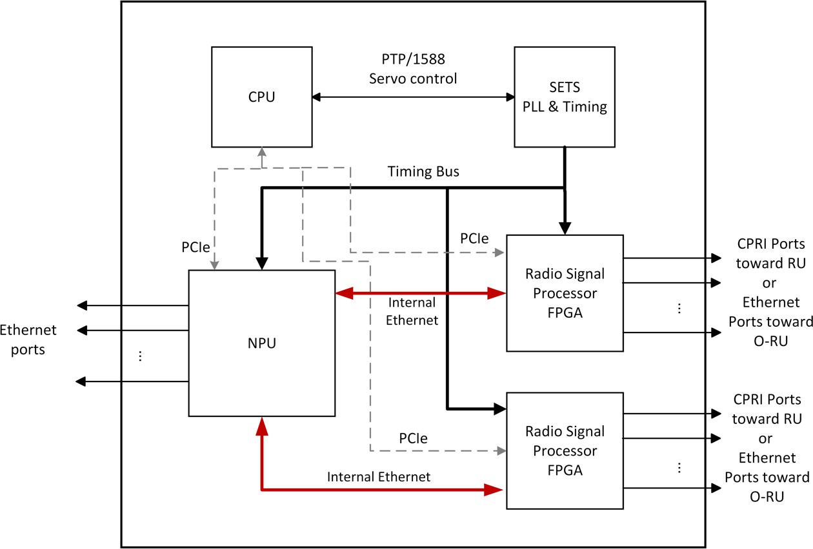

## O-RAN.WG7.FHGW-HRD.0-v02.00.docx

- View in [Reader Mode](https://simewu.com/spec-reader/pages/06-WG7/O-RAN.WG7.FHGW-HRD.0-v02.00.docx).
- Go back to [Table of Contents](../README.md).
- Download the [Original Document](https://github.com/Simewu/spec-reader/raw/refs/heads/main/documents/O-RAN.WG7.FHGW-HRD.0-v02.00.docx).

---

**O-RAN White Box Hardware Working Group Hardware Reference Design Specification for Fronthaul Gateway**

#### This is a re-published version of the attached final specification.

For this re-published version, the prior versions of the IPR Policy will apply, except that the previous requirement for Adopters (as defined in the earlier IPR Policy) to agree to an O-RAN Adopter License Agreement to access and use Final Specifications shall no longer apply or be required for these Final Specifications after 1st July 2022.

The copying or incorporation into any other work of part or all of the material available in this specification in any form without the prior written permission of O-RAN ALLIANCE e.V. is prohibited, save that you may print or download extracts of the material on this site for your personal use, or copy the material on this site for the purpose of sending to individual third parties for their information provided that you acknowledge O-RAN ALLIANCE as the source of the material and that you inform the third party that these conditions apply to them and that they must comply with them.

**O-RAN White Box Hardware Working Group Hardware Reference Design Specification for Fronthaul Gateway**

Copyright (C) 2021 by O-RAN ALLIANCE e.V.

By using, accessing or downloading any part of this O-RAN specification document, including by copying, saving, distributing, displaying or preparing derivatives of, you agree to be and are bound to the terms of the O-RAN Adopter License Agreement contained in the Annex ZZZ of this specification. All other rights reserved.

O-RAN ALLIANCE e.V.

Buschkauler Weg 27, 53347 Alfter, Germany Register of Associations, Bonn VR 11238 VAT ID DE321720189

(C) 2021 O-RAN ALLIANCE e.V. All Rights Reserved 1

# Revision History

|  |  |  |  |
| --- | --- | --- | --- |
| Date | Revision | Author | Description |
| 2021.07.20 | 02.00 | WG7 | Final version for publication |
| 2021.02.16 | 01.00 | WG7 | Final version for publication |

2

(C) 2021 O-RAN Alliance e.V. Your use is subject to the terms of the O-RAN Adopter License Agreement in Annex ZZZ 2

# Contents

1. Revision History 2
2. Chapter 1 Introductory Material 6
3. 1.1 Scope 6
4. 1.2 References 6
5. 1.3 Definitions and Abbreviations 7
6. 1.3.1 Definitions 7
7. 1.3.2 Abbreviations 7
8. Chapter 2 Deployment Scenarios 9
9. 2.1.1 Deployment Scenario -1 9
10. 2.1.2 Low PHY 11
11. 2.1.3 Timing 11
12. 2.1.4 Attributes of FHGW7-2->8 12
13. Chapter 3 Hardware Architecture and Requirements 13
14. 3.1 FHGW7-2->8 Hardware Architecture 13
15. 3.1.1 FHGW7-2->8 Hardware Architecture Diagram 13
16. 3.1.2 FHGW7-2->8 Functional Module Description 14
17. 3.1.3 FHGW7-2->8 Interfaces 15
18. 3.2 Disaggregation and Modularity Requirements 15
19. 3.2.1 Internal Interfaces 16
20. 3.3 FHGW7-2->8 Hardware/Performance Requirements 17
21. 3.3.1 FHGW7-2->8 Interface Requirements 17
22. 3.3.2 FHGW7-2->8 : Mechanical, Thermal and Power Requirements 18
23. 3.4 Timing Requirements 18
24. 3.5 Security Requirements 18
25. Chapter 4 Hardware Reference Design 20
26. 4.1 FHGW7-2->8 Hardware Reference Design 20
27. 4.2 FHGW7-2->8 High Level Functional Block Diagram 20
28. 4.3 FHGW7-2->8 Hardware Components 21
29. 4.3.1 CPU 21
30. 4.3.2 Memory and Storage for CPU 21
31. 4.3.3 Network Processing Unit (NPU) 21
32. 4.3.4 Radio Signal Processor - FPGA 22
33. 4.4 Interfaces on Radio Signal Processor 26
34. 4.4.1 Interface towards the NPU 26
35. 4.4.2 Timing and Synchronization 27
36. 4.4.3 Security 27
37. 4.4.4 PCIe Interface 28
38. 4.4.5 Example Pinout of a Radio Signal Processor FPGA 28
39. 4.5 Scalability and flexibility of Radio Signal Processor 29
40. 4.6 External Interface Ports on the FHGW7-2->8 29
41. Annex 1: Reference to Open CPRI specification 31
42. Annex ZZZ : O-RAN Adopter License Agreement 31
43. Section 1: DEFINITIONS 31
44. Section 2: COPYRIGHT LICENSE 32
45. Section 3: FRAND LICENSE 32
46. Section 4: TERM AND TERMINATION 33
47. Section 5: CONFIDENTIALITY 33
48. Section 6: INDEMNIFICATION 33
49. Section 7: LIMITATIONS ON LIABILITY; NO WARRANTY 33
50. Section 8: ASSIGNMENT 34
51. Section 9: THIRD-PARTY BENEFICIARY RIGHTS 34
52. Section 10: BINDING ON AFFILIATES 34
53. Section 11: GENERAL 34

14

# Tables

1. Table 1: Attributes of FHGW7-2->8 12
2. Table 2: FHGW7-2->8 Performance Requirements 17
3. Table 3: FHGW7-2->8 Interface Requirements 17
4. Table 4: FHGW7-2->8: Mechanical, Thermal and Power Requirements 18
5. Table 5: CPU Features 21
6. Table 6: Memory and Storage Requirements 21
7. Table 7: NPU Features 22
8. Table 8: Estimated FPGA Resource Allocation for the Designated Functions - 1 23
9. Table 9: CPRI Rate Options and the Number of Supported LTE 20MHz Carriers (AxC) 24
10. Table 10: Estimated FPGA Resource Allocation for the Designated Functions - 2 25
11. Table 11: Example Pinout of the FPGA 28
12. Table 12: External Legacy Port List 30
13. Table 13: External Ethernet Port List 30

29

1. **Figures**
2. Figure 1: Base Station with Split Architecture 9
3. Figure 2: Deployment of O-DU and RU using FHGW 10
4. Figure 3: Point to point topology for Fronthaul Gateway 10
5. Figure 4: Ring topology for Fronthaul Gateway 11
6. Figure 5: Fronthaul Gateway Hardware Architecture Diagram 13
7. Figure 6: Fronthaul Gateway Architecture with Internal Open interfaces 16
8. Figure 7: FHGW7-2->8 Interface requirements 18
9. Figure 8: High-level Functional Block Diagram of the FHGW 20
10. Figure 9: Radio Signal Processing Block Diagram - FPGA Model-1 22
11. Figure 10: Radio Signal Processing Block Diagram - FPGA Model-2 25
12. Figure 11: Internal Ethernet Links between NPU and FPGA 27
13. Figure 12: Timing Circuitry 27
14. Figure 13: PCIe Interface to FPGA 28
15. Figure 14: Multi-FPGA Architecture 29

3

# Chapter 1 Introductory Material

## 1.1 Scope

1. This Technical Specification has been produced by the O-RAN.org.
2. The contents of the present document are subject to continuing work within O-RAN WG7 and may
3. change following formal O-RAN approval. Should the O-RAN.org modify the contents of the present
4. document, it will be re-released by O-RAN Alliance with an identifying change of release date and
5. an increase in version number as follows:
6. Release x.y.z
7. where:
8. x the first digit is incremented for all changes of substance, i.e., technical enhancements, corrections, updates,
9. etc. (the initial approved document will have x=01).
10. y the second digit is incremented when editorial only changes have been incorporated in the document.
11. z the third digit included only in working versions of the document indicating incremental changes during the
12. editing process. This variable is for internal WG7 use only.

15

1. The present document specifies a hardware reference design for the fronthaul gateway. The fronthaul
2. gateway can be used to terminate O-RAN fronthaul user, control, synchronization, and management planes
3. for option 7-2x and to translate the signals to and from a number of CPRI interfaces (option 8). It can further
4. multiplex or demultiplex option 7-2x fronthaul signals to or from a number of O-RUs. This version of the
5. specification only supports option 7-2x to option 8 conversion and vice versa in addition to the transport of
6. other traffic streams.

22

1. In the main body of this specification (in any "chapter") the information contained therein is informative,
2. unless explicitly described as normative. Information contained in an "Annex" to this specification is always
3. informative unless otherwise marked as normative.

26

## 1.2 References

1. [1] ORAN-WG7.DSC.0-V02.00 Technical Specification, 'Deployment Scenarios and Base Station
2. Classes for White Box Hardware'.
3. [2] ORAN-WG4.CUS.0-v04.00 Technical Specification, 'O-RAN Fronthaul Working Group Control,
4. User and Synchronization Plane Specification'.
5. [3] O-RAN Architecture Description, O-RAN-WG1-O-RAN Architecture Description - v01.00.00
6. [4] CPRI interface specification V 7.0. <http://cpri.info/spec.html>
7. [5] O-RAN Hardware Reference Design Specification for Indoor Picocell FR1 with Split Architecture
8. Option 8 v1.0

## 1.3 Definitions and Abbreviations

### 1.3.1 Definitions

* 1. 1.3.2 Abbreviations
  2. For the purposes of the present document, the abbreviations given in [2] and the following apply.
  3. An abbreviation defined in the present document takes precedence over the definition of the same
  4. abbreviation, if any, as in [2].

|  |  |  |
| --- | --- | --- |
| 7 | 7-2 | Fronthaul interface split option as defined by O-RAN WG4, also referred to as 7-2x |
| 8 | 5G | Fifth-Generation Mobile Communications |
| 9 | ASIC | Application Specific Integrated Circuit |
| 10 | BS | Base Station |
| 11 | CU | Centralized Unit as defined by 3GPP |
| 12 | DL | Downlink |
| 13 | DPLL | Digital Phase Lock Loop |
| 14 | DSP | Digital Signal Processor |
| 15 | DU | Distributed Unit as defined by 3GPP |
| 16 | FFT | Fast Fourier Transform |
| 17 | FH | Fronthaul |
| 18 | FHGW | Fronthaul Gateway |
| 19 | FHGWx?y | Fronthaul Gateway that can translate FH protocol from an O-DU with split option x to an |
| 20 |  | O-RU with split option y, with currently available option 7-2?8. |
| 21 | FPGA | Field Programmable Gate Array |
| 22 | GbE | Gigabit Ethernet |
| 23 | GNSS | Global Navigation Satellite System |
| 24 | IEEE | Institute of Electrical and Electronics Engineers |
| 25 | I/O | Input/Output |
| 26 | LTE | Long Term Evolution |
| 27 | MAC | Media Access Control |
| 28 | O-CU | O-RAN Centralized Unit as defined by O-RAN |
| 29 | OCXO | Oven Controlled Crystal Oscillator |
| 30 | O-DUx | A specific O-RAN Distributed Unit having fronthaul split option x where x may be 6, 7-2 |
| 31 |  | (as defined by WG4) or 8 |
| 32 | O-RUx | A specific O-RAN Radio Unit having fronthaul split option x, where x is 6, 7-2 (as |
| 33 |  | defined by WG4) or 8, and which is used in a configuration where the fronthaul interface |
| 34 |  | is the same at the O-DUx |
| 35 | PCIe | Peripheral Component Interface Express |
| 36 | POE | Power over Ethernet |
| 37 | RAN | Radio Access Network |
| 38 | RF | Radio Frequency |
| 39 | RU | Radio Unit as defined by 3GPP |
| 40 | RX | Receiver |

|  |  |  |
| --- | --- | --- |
| 1 | SFP | Small Form-factor Pluggable |
| 2 | SFP+ | Small Form-factor Pluggable Transceiver |
| 3 | SoC | System On Chip |
| 4 | TX | Transmitter |
| 5 | UL | Uplink |
| 6 | USB | Universal Serial Bus |
| 7 | WG | Working Group |
| 8 |  |  |

# Chapter 2 Deployment Scenarios

1. O-RAN Working Group 7's deployment scenario specification [1] shows the split architecture as below. The
2. Fronthaul Gateway (FHGW) in this case aggregates multiple O-RUs to a single location consisting of O-
3. DUs. The fronthaul gateway provides protocol translation, packet switching and aggregation capabilities.

5

6

* 1. **Figure 1: Base Station with Split Architecture**
  2. This document describes scenarios where the FHGW provides protocol translation in addition to the
  3. switching and aggregation capabilities.

### 2.1.1 Deployment Scenario -1

* 1. The FHGW (Fronthaul Gateway) may be placed between the O-DU and RU (Radio Unit) with the following
  2. O-RAN specified interfaces:
  3. ? The interface between O-DU and FHGW is Open Fronthaul (Option 7-2x).
  4. ? The interface between FHGW and RU is an LLS option specified by O-RAN.
  5. ? The interface between FHGW and RU may not support Open Fronthaul (Option 7-2x).

16

1. Figure 2 below depicts the deployment of the FHGW using O-RAN specified interfaces.

1

1. **Figure 2: Deployment of O-DU and RU using FHGW**
2. The Low PHY function in the fronthaul gateway converts the CPRI/low level split interface between the RU
3. and Open Fronthaul (Option 7-2x). The fronthaul gateway is deployed near the RU physically and gets
4. connected to the DU using a packet-based network.

6

1. The FHGW gateway has radio processing capabilities to do the protocol translation between CPRI/low level
2. split interface and Open Fronthaul (Option 7-2x) and does the translation for the management plane also.
3. The non-O-RAN-RU along with FHGW appears as a single/multiple O-RU(s) to the O-DU.

10

1. The RUs and O-RUs are directly connected to the FHGW. The O-DUs are connected to FHGW over a
2. network. The network between FHGW and O-DU could be a point-to-point, mesh or a ring topology. In
3. some cases, the FHGWs provide transport to non-fronthaul traffic also, namely, midhaul, backhaul or other
4. traffic. So FHGW may have non-fronthaul ethernet interfaces also.

15

16 2.1.1.1 Point to point network

17

1. **Figure 3: Point to point topology for Fronthaul Gateway**
   1. Each fronthaul gateway gets connected to the O-DUs directly. These connections might be direct physical
   2. connections or through a packet network. When FHGWs connect through other network elements to the O-
   3. DUs, they form a mesh network.
   4. 2.1.1.2 Ring network

5

1. **Figure 4: Ring topology for Fronthaul Gateway**
2. FHGWs form a ring topology and get connected to the O-DUs. In this case, the Fronthaul Gateways need
3. two interfaces for connectivity towards the O-DUs

### 2.1.2 Low PHY

1. The Low PHY module in fronthaul gateway implements the below functionalities.
2. 1) FFT/IFFT (Lower-PHY DL/UL)
3. 2) PRACH detection (Lower-PHY UL)
4. 3) Handling of C-Plane/M-plane messages
5. 4) Timing and synchronization of RU
6. 5) eCPRI framing/de-framing and switching
7. 6) CPRI framing/de-framing and switching
8. 7) CPRI to eCPRI conversion
9. 8) I/Q compression on eCPRI and CPRI links

19

1. Doing LowPHY functionality on the FHGWs and converting the low-level split interface to O-RAN
2. fronthaul interface enables connecting legacy RUs to O-DUs. This enables brownfield deployments to
3. leverage the benefits of O-RAN based disaggregated and open networks.

### 2.1.3 Timing

1. The packet based fronthaul network is compliant with the timing requirements described by WG4 CUS
2. specification [2]. The packet-based network uses SyncE and PTP to provide frequency, phase and Time-of-
3. Day to necessary endpoints. It can derive these parameters from satellite-based sources also. The legacy RUs
4. derive frequency and phase through the CPRI/low level split interface connected to the fronthaul gateway.
5. CPRI/low level split interface transports frequency and phase through mechanisms difference from SyncE
6. and PTP. The scheme is specified in the CPRI v7.0 [4] specification and is not vendor specific.

### 2.1.4 Attributes of FHGW7-2->8

1. **Table 1: Attributes of FHGW7-2->8**

|  |  |
| --- | --- |
| **Attributes** | **Values or Assumptions** |
| Functionalities | Packet switching, Radio interface translation |
| Timing Capabilities | Compliant to S-Plane protocol specification in O- RAN-WG4-CUS.0-v04.00 specification |
| Deployment | Outdoor, near Outdoor Macrocell |
| Interfaces | Low level split Interfaces to connect to legacy RU Ethernet interfaces to connect to O-DU  Ethernet interfaces to connect to O-RU  Timing interfaces |

3

# Chapter 3 Hardware Architecture and Requirements

1. Fronthaul gateways are deployed near the Radio units where it aggregates multiple Radio Units. In case of
2. brownfield RUs, fronthaul gateway converts the split 8 signals to split-7-2x specified by O-RAN. In
3. macrocell deployment scenarios, the FHGW will cater to xHaul needs as well. So, it will handle diverse
4. traffic streams.

6

1. In this case the fronthaul gateway has digital signal processing capabilities as well as packet switching
2. capabilities. In case of a FHGW, the combination of RU and FHGW acts as an O-RU.

## 3.1 FHGW7-2->8 Hardware Architecture

1. This section describes the hardware architecture of a fronthaul gateway which supports legacy interfaces
2. towards RUs and provides protocol translation to enable them to connect to O-DUs. In addition to that
3. Fronthaul Gateway provides transportation capabilities for O-RAN fronthaul traffic as well as other types of
4. traffic.

### 3.1.1 FHGW7-2->8 Hardware Architecture Diagram

15

* 1. **Figure 5: Fronthaul Gateway Hardware Architecture Diagram**

### 3.1.2 FHGW7-2->8 Functional Module Description

* + 1. This section describes the functional components of a fronthaul gateway which does protocol translation
    2. from non-O-RAN fronthaul interface towards RUs to O-RAN fronthaul interface (split 7-2) towards O-DUs.
    3. This fronthaul gateway supports O-RAN fronthaul interface (split 7-2) towards O-RUs and provides
    4. transportation for that traffic towards O-DUs. Fronthaul gateway can handle non-Fronthaul traffic also.
    5. The selection of specific hardware components for these modules is a product design task. The descriptions
    6. and requirements are given below.

#### Network Processing Unit

* + 1. The network processing unit provides the packet transport functions of the FHGW.

#### Radio Signal Processor/Accelerator

* + 1. Radio Signal processor/Accelerator does the protocol translation capabilities required to translate from the
    2. low-level split-8 to O-RAN fronthaul interface (Split 7-2). The low-level split interfaces to connect to
    3. legacy RUs are connected to Radio Signal Processer/Accelerator. This module implements the Low PHY
    4. capabilities mentioned in section 2.1.2.

15

1. The Radio signal processor can be implemented using a FPGA, DSP engine or ASICs.

#### CPU

1. CPU hosts the network operating system (NOS) which controls the transport capabilities and the Radio
2. software which controls the radio signal processor.

#### Memory

1. DDR4 Memory is used to store the runtime data and software for the NOS and Radio software.

#### Storage

1. Non-volatile storage to store operating system, application software, firmware, operational status of
2. Fronthaul Gateway. This could be implemented using Flash or SSD.

#### Timing Components

1. The timing module in the FHGW board is used to implement IEEE 1588 PTP and Synchronous Ethernet
2. functionalities. This module recovers timing and provides synchronization to other modules. The module
3. consists of below key components
4. 1. GNSS
5. 2. OCXO
6. 3. DPLL
7. 4. Servo

33

1. *GNSS* - Global Navigation Satellite System provides Time of the Day and Synchronization pulse (PPS) to
2. the timing module to recover the clock and phase. This will be the primary reference clock (PRC) when
3. selected as source of timing to the timing module

37

1. *OCXO* - Oven controlled crystal oscillator provides the stable reference clock to the timing module with
2. reference to which the PTP clock is generated. This clock also is used to validate the other recovered clocks
3. are within the required PPM offset or not

41

1. *DPLL* - Digital Phase lock loop circuit is used to generate the PTP clock steered by the servo algorithm. This
2. ensures that the generated clock meets the required specifications in terms of Jitter, Phase alignment and
3. meet the necessary masks of the ITU-T specs. This component also regenerates the required local clocks
4. from the SyncE recovered clocks from the Phys or from the generated PTP clock or GNSS clock

3

1. *Servo* - This is a SW component running in the CPU or any programmable engine which analyses the
2. timestamps from the ethernet packets, performs appropriate filtering and steers the DPLL to generate the
3. PTP clock and Phase alignment of the clock to the primary clock source.

7

#### Ethernet PHY

1. This is an optional component to provide physical level ethernet connectivity. In some cases, the Network
2. processing unit itself provides this capability and discrete ethernet PHYs are not required.
3. 3.1.3 FHGW7-2->8 Interfaces

#### Legacy Low-Level Split Interfaces

1. These interfaces are used to connect to legacy/brownfield RUs. They use protocols other than O-RAN
2. fronthaul (Split 7-2) interface. They carry time domain Radio signals. CPRI is a typical split-8 protocol used
3. by legacy RUs.

#### PCIe Interface

1. Support for PCIe v3 and later interface. The bandwidth depends on the use cases. It is as the control plane
2. interface for NPUs and Radio signal processors through which the CPU controls and maintains them.

#### Timing Interfaces

1. As mentioned earlier, the timing modules provide reference timing signals to various components of the
2. Fronthaul Gateway system. The interfaces used to provide the signals to NPU, and Radio signal processor
3. should be specified

#### Ethernet Interfaces

1. Ethernet interfaces are used to connect to O-RUs, O-DUs and other elements in the transport network. Apart
2. from the external interfaces, ethernet is used between the NPU and Radio signal processing unit. The
3. bandwidth of these interfaces depends on specific use cases.

## 3.2 Disaggregation and Modularity Requirements

1. The Fronthaul gateway is implemented by combining transport and radio functions to provide both
2. capabilities. The FHGW shall be modular enough for these two functions to be implemented separately -
3. potentially by different vendors. This enables experts in transport and radio areas to come together and create
4. FHGWs with flexible and programmable radio plane. In order to enable that the interfaces between transport
5. and radio functions should be clearly defined. Below is the list of such internal interfaces.

33

1. This modularity enables multiple instances of those radio functions to be present in the FHGW. This enables
2. increasing the scale of radio processing in the FHGW as well as integrating different Radio processing
3. capabilities from the same different implementors.

### 1 3.2.1 Internal Interfaces

2

1. **Figure 6: Fronthaul Gateway Architecture with Internal Open interfaces**
2. Open hardware interfaces to enable a modular fronthaul gateway are given below. They are marked with
3. dotted oval in Figure 6.
4. 1. Datapath interface between the Radio signal processor and Network processing unit
5. 2. Timing interface for Radio signal processor
6. 3. Interrupt interfaces of the radio signal processor
7. 4. Control plane access to the radio signal processor for control, maintenance and firmware management

## 3.3 FHGW7-2->8 Hardware/Performance Requirements

1. **Table 2: FHGW7-2->8 Performance Requirements**

|  |  |  |  |
| --- | --- | --- | --- |
| **Parameter** | **Requirement** | **Description** | **Priority** |
| Transport capacity | FHGW shall support 300Gbps of switching | Transport capacity | High |
| Timing requirements | Class C compliance | Timing Requirements | High |
| Radio protocol translation  capabilities | The FHGW shall support 240MHz of translation between O-RAN 7-2x and Split 8. | Radio BW capacity | High |
| Antenna Carriers | The FHGW shall support translation of 12 Antenna carriers (AxCs) | Radio Antenna capacity | High |

### 3.3.1 FHGW7-2->8 Interface Requirements

1. **Table 3: FHGW7-2->8 Interface Requirements**

|  |  |  |  |
| --- | --- | --- | --- |
| **Parameter** | **Requirement** | **Description** | **Priority** |
| O-RAN  Fronthaul interfaces | FHGW shall support Ethernet interfaces with speeds from 10G to 25G. These interfaces will support transport of Fronthaul haul traffic compliant to O- RAN 7-2x spec: Control, User, and Synchronization Plane Technical Specification of O-RAN: O-RAN- WG4.CUS.0 [2]  Below are the requirements:  6x 10G eCPRI interfaces (each port shall support 2 carriers of 20MHz i.e. total of 40MHz)  3x 25/10G eCPRI interfaces (each port shall support 1 carrier of 100MHz) | O-RAN FH  Interfaces | High |
| Transport interfaces | FHGW shall support ethernet interfaces with speeds from 10G to 100G. These could act as O-RAN fronthaul interfaces as well.  Below are the requirements: 4x25G/10G interfaces 2x10G interfaces  2x1G interfaces | Transport interfaces | High |
| Timing Interfaces | IEEE 1588v2 and SyncE on all ethernet interfaces. In addition, it shall/may support GNSS connectivity. | Timing Interfaces | High |
| Low Level Split interfaces | FHGW shall support interfaces to connect to legacy/brownfield RUs.  6x 10G legacy and non-legacy CPRI interfaces to support 1 carrier of 20MHz (capability to re-configure legacy and non-legacy CPRI interfaces to eCPRI interfaces)  3x 10G legacy and non-legacy CPRI interfaces to support 2 carriers of 20MHz i.e. total 40MHz (capability to re-configure legacy and non-legacy  CPRI interfaces to eCPRI interfaces) | CPRI interfaces with rates from 2 to 8 | High |

|  |  |  |  |
| --- | --- | --- | --- |
| Programmable Radio processor | Radio processor's parameters shall be able to be changed. FHGW shall be able to re-program radio  processing function logic. | Programmability | High |
| Adaptability of Radio processor | The Radio processor's firmware shall be reprogrammable in the field. | Adaptability | High |

1

2

3 Below diagram summarises the requirement given above

4

1. **Figure 7: FHGW7-2->8 Interface requirements**

### 3.3.2 FHGW7-2->8 : Mechanical, Thermal and Power Requirements

1. **Table 4: FHGW7-2->8: Mechanical, Thermal and Power Requirements**

|  |  |  |  |
| --- | --- | --- | --- |
| **Parameter** | **Requirement** | **Description** | **Priority** |
| Power Supply | -48V DC |  | High |
| Temperature | -20?C to +55?C |  | High |

## 3.4 Timing Requirements

1. CPRI/Low Level Interface carries Radio data using a constant stream of data. Frequency and Phase are
2. carried from the Fronthaul Gateway to the RUs using the delimiters/control characters on this bit stream. The
3. interval of these control characters depicts the frequency, and the exact positioning of these characters carry
4. phase information. Please refer to the CPRI specification [4] for more details.

13

1. The Fronthaul Gateway should derive these parameters from the O-DUs using IEEE 1588 PTP and SyncE or
2. should be in sync with the O-DUs using IEEE 1588 PTP and SyncE. Then, Fronthaul Gateway should
3. translate the above to the frequency and placement of control characters on the CPRI/Low level split
4. interface. This way, RUs can be synchronised to the rest of the network.

18

## 3.5 Security Requirements

1. Fronthaul gateway merges the transport and radio functions to provide protocol translation
2. capabilities and network capabilities. The software and firmware for transport and radio capabilities

22 may be implemented by different vendors. So, it is important to the verify authenticity of the

23 software and firmware used in this fronthaul gateway. 24

1. The Fronthaul gateway shall support secure storage of keys and certificates in a hardware chip and
2. will create a secure boot and operating environment where the software and firmware loaded in it
3. are securely signed.

4

# Chapter 4 Hardware Reference Design

1. This chapter describes one example of white box hardware reference design for the fronthaul gateway when
2. translating split option 7-2x->8 and vice versa.

## 4.1 FHGW7-2->8 Hardware Reference Design

1. This section describes the design of a fronthaul gateway which supports both legacy interfaces (i.e., CPRI)
2. towards RUs and NR eCPRI interfaces toward O-RUs. When connecting to legacy RUs, it provides protocol
3. translation to enable them to be operating with O-DUs. In addition, the FHGW provides transport
4. capabilities for O-RAN fronthaul traffic as well as other types of traffic.

## 4.2 FHGW7-2->8 High Level Functional Block Diagram

1. The high-level architecture of a generic FHGW with Lx Ethernet/eCPRI connections toward the O-DU, Nx
2. CPRI links toward legacy RU/RRHs, Mx Ethernet/eCPRI connections toward O-RUs is shown in Figure 8.
3. It's worth mentioning that some or all of the NxCPRI interfaces are capable of supporting O-
4. RAN/eCPRI fronthaul interfaces through dynamic reconfiguration. Note that depending on the number
5. of the links, the specs and number of the CPU, NPU and FPGAs used in this hardware reference design may
6. change.

16

17

1. **Figure 8: High-level Functional Block Diagram of the FHGW**

## 4.3 FHGW7-2->8 Hardware Components

### 4.3.1 CPU

* 1. The CPU runs the network operating system (NOS) for the transport functions of the FHGW and handles the
  2. control and management functions of the radio signal processor which in this example is an FPGA (including
  3. the FPGA driver). A general-purpose CPU (x86 or ARM based) with at least 8 cores can handle these
  4. functions. The requirements for the CPU are listed in the following table.
  5. **Table 5: CPU Features**

|  |  |
| --- | --- |
| **Item Name** | **Description** |
| Minimum number of Cores | 4-8 |
| Minimum number of Threads | 8 |
| Base Clock Frequency | 1.60-1.70 GHZ |
| Max Turbo Frequency | 1.70-2.20 GHz |
| Minimum L2 Cache | 6-16 MB |
| Total Power Dissipation | 17 - 25 W |
| Memory Types | DDR4-2666 (PC4-21300) |
| Maximum number of Memory Channels | 2 |

8

### 9 4.3.2 Memory and Storage for CPU

1. **Table 6: Memory and Storage Requirements**

|  |  |
| --- | --- |
| **Item Name** | **Description** |
| Memory | 8 GB DDR4 memory |
| Storage | 32 GB eMMC/SSD storage |

### 4.3.3 Network Processing Unit (NPU)

1. The network processing unit in the FHGW handles different types of traffic, terminates Ethernet
2. connections, and interfaces with the radio signal processing unit in order to transport data between the O-DU
3. and legacy RUs following protocol translation in radio signal processor. The example reference design uses
4. an NPU with the following capabilities.

16

17

18

19

20

21

22

23

24

25

* 1. **Table 7: NPU Features**

|  |  |
| --- | --- |
| **Item Name** | **Description** |
| Switching capacity | 300-410 Gbps |
| Network interfaces | 1G, 10G, 25G, 40G, 100G |
| 48x10G/16x40G/4x100G |
| External Packet buffer (Optional) | Deep buffering, DDR4, GDDR5 |
| OAM | Hardware based OAM |
| Other Features | Layer2 through Layer4 processing with integrated deep-buffer traffic management, Large on-chip  forwarding tables |

### 4.3.4 Radio Signal Processor - FPGA

* 1. Radio signal processor implements the protocol conversion between the split option 8 (CPRI) protocols used
  2. by legacy RUs and Open Fronthaul O-RAN7-2x interface (eCPRI). The functions are hosted and processed
  3. in the radio signal processor, which in this example design is an FPGA:
  4. 1) FFT/IFFT (Lower-PHY DL/UL)
  5. 2) PRACH detection (Lower-PHY UL)
  6. 3) Handling of C-Plane/M-plane messages
  7. 4) Timing and synchronization of RU
  8. 5) eCPRI framing/de-framing and switching
  9. 6) CPRI framing/de-framing and switching
  10. 7) CPRI to eCPRI conversion
  11. 8) I/Q compression on eCPRI and CPRI links

14

1. 4.3.4.1 Radio signal processor - FPGA reference model 1
2. The physical resources (LUT, BRAM, URAM, DSP48, etc.) required on the FPGA depends on the number,
3. speed and type of the legacy interfaces for which protocol conversion are performed. Figure 8 shows the
4. functional block diagram of the FHGW reference design.

19

20

Downlink

Buffer (1)

Downlink

Buffer (2)

Nx CPRI Output

eCPRI De-

Framer/ Interface

AXI Stream

FIFOs

Delay with

AxC Mapping

I/Q De-

Compression

IFFT

CP Insertion

AxC

Distribution

I/Q

Compression

CPRI

Framer/ Interface

eCPRI Input/

Output

eCPRI

Framer/ Interface

AXI Stream

FIFOs

Delay with

AxC Mapping

I/Q

Compression

FFT

CP Removal

PRACH

Filtering

AxC

Aggregation

I/Q De-

Compression

CPRI De-

Framer/ Interface

Nx CPRI Input

Uplink

Buffer (1)

Uplink

Buffer (2)

**FPGA (Radio Signal Processor)**

21 **Figure 9: Radio Signal Processing Block Diagram - FPGA Model-1**

1. 4.3.4.1.1 FPGA Resource Estimation
2. Based on the operator requirements, we define the external connections/ports and interfaces to FHGW as
3. shown in Figure 7.

4

1. The required number of CPRI or eCPRI [mutually exclusive] connections between the FHGW and RUs or
2. O-RUs, respectively, would be fulfilled with 12AxC each carrier with 20MHz bandwidth for the legacy RU
3. operation and 2x20MHz or 100MHz for the O-RU operation, which will be used in the following to calculate
4. the FPGA resources. In this specification*,* we focus only on legacy RU support, thus only taking into
5. consideration the gateway functionality of the FHGW and not the multiplexing functionality. Considering
6. the functions that are shown in Figure 9 and the external interfaces shown in Figure 7, the reference
7. implementation on FPGA would require hardware resources (SERDES, Flip Flops, Lookup Tables, DSPs,
8. Block RAM, etc.) as shown in Table 8. As an example, we are assuming one LTE carrier with 20MHz of
9. bandwidth and 1TRX antenna configuration is processed in FPGA. In time-domain, the fronthaul bandwidth
10. of each LTE 20MHz carrier is 30.72Msps x 1 Antennas x 32bits/sample x 66/64 coding = 1.014Gbps, thus
11. without I/Q compression, one 25Gbps fronthaul link can accommodate 24AxC. If a 2:1 ratio time-domain
12. I/Q compression is used, 48AxC can be accommodated. Note that increasing the number of transceivers
13. and/or the number of 20MHz LTE carriers would scale the number of required AxC.
14. The buffering requirements in block diagram of Figure 9 for 12AxC is 4.54Mbit and will be scaled with the
15. number of AxC.

20

21 **Table 8: Estimated FPGA Resource Allocation for the Designated Functions - 1**

|  |  |  |  |  |  |  |  |  |  |  |  |  |
| --- | --- | --- | --- | --- | --- | --- | --- | --- | --- | --- | --- | --- |
|  | **Number of Instances** | **FF** | **LUT** | **DSP48** | **BRAM**  **18kb** | **URAM**  **288kb** | **Total FF** | **Total LUT** | **Total**  **DSP48** | **Total BRAM**  **18kb** | **Total URAM**  **288kb** | **Notes** |
| Sample-Rate Conversion (SRC) Filter | 4 | 5000 | 3000 | 24 | 0 | 0 | 20000 | 12000 | 96 | 0 | 0 | Each instance supports 3 carriers of 2T2R 20MHz at 368.72MHz  clock (6 AxC); thus we need 2 instances for downlink and uplink, respectively |
| Block-wise Quant | 2 | 4000 | 3000 | 12 | 16 | 0 | 8000 | 6000 | 24 | 32 | 0 | Running at 368MHz. One instance for 6  I/Q streams (6 AxC) |
| Block-wise deQuant | 2 | 3000 | 2000 | 8 | 10 | 0 | 6000 | 4000 | 16 | 20 | 0 | Running at 368MHz. One instance for 6  I/Q streams (6 AxC) |
| CPRI  Framing/De- framing | 12 | 8000 | 3000 | 0 | 12 | 0 | 96000 | 36000 | 0 | 144 | 0 | Each instance  supports one 10G CPRI |
| **Time-domain Compression/Decompression Sub-total** | | | | | | | **130000** | **58000** | **136** | **196** | **0** |  |
| IFFT | 1 | 5763 | 3723 | 15 | 11 | 0 | 5763 | 3723 | 15 | 11 | 0 | Each instance supports 6 carriers of 2T2R 20MHz at 368.72MHz  clock |
| Add CP | 1 | 2000 | 1000 | 0 | 2 | 6 | 2000 | 1000 | 0 | 2 | 6 | 12 OFDM  symbols x 2048  samples x 32 bits x 2 dual-  port memory |

|  |  |  |  |  |  |  |  |  |  |  |  |  |
| --- | --- | --- | --- | --- | --- | --- | --- | --- | --- | --- | --- | --- |
|  |  |  |  |  |  |  |  |  |  |  |  | read/write = 1.536Mb |
| FFT | 1 | 5763 | 3723 | 15 | 11 | 0 | 5763 | 3723 | 15 | 11 | 0 | Each instance supports 6 carriers of 2T2R 20MHz at 368.72MHz  clock |
| CP Removal | 1 | 2000 | 1000 | 0 | 2 | 6 | 2000 | 1000 | 0 | 2 | 6 | 12 OFDM  symbols x 2048  samples x 32 bits x 2 dual- port memory  read/write = 1.536Mb |
| Mu-law Compression | 2 | 3000 | 2000 | 4 | 4 | 0 | 6000 | 4000 | 8 | 8 | 0 | Mu-law compression is mainly based on look-up tables |
| Mu-law Decompression | 2 | 2000 | 1500 | 4 | 4 | 0 | 4000 | 3000 | 8 | 8 | 0 | Mu-law decompression is mainly based on look-up tables |
| PRACH  Filtering | 2 | 5000 | 4000 | 50 | 12 | 0 | 10000 | 8000 | 100 | 24 | 0 | Decimate Rx signal by 16 and send to O-DU for further  processing |
| **Low-PHY Sub-total** | | | | | | | **35526** | **24446** | **146** | **66** | **12** |  |

1. Depending on the selected CPRI line rate, the number of LTE 20MHz carriers that can be supported may
2. vary. Table 9 shows the correspondence between the number of LTE 20MHz carriers and the CPRI line rate.
3. **Table 9: CPRI Rate Options and the Number of Supported LTE 20MHz Carriers (AxC)**

|  |  |  |  |  |
| --- | --- | --- | --- | --- |
| **CPRI Line Rate** | **Line Bit Rate** | **Line Coding** | **Bits per Word** | **Transport Capacity**  **(Number of 20 MHz LTE AxC Streams)** |
| Rate-1 | 0.6144 Gbps | 8B/10B | 8 | - |
| Rate-2 | 1.2288 Gbps | 8B/10B | 16 | 1 |
| Rate-3 | 2.4576 Gbps | 8B/10B | 32 | 2 |
| Rate-4 | 3.0720 Gbps | 8B/10B | 40 | 2 |
| Rate-5 | 4.9152 Gbps | 8B/10B | 64 | 4 |
| Rate-6 | 6.1440 Gbps | 8B/10B | 80 | 5 |
| Rate-7 | 9.8304 Gbps | 8B/10B | 128 | 8 |
| Rate-8 | 10.1376 Gbps | 64B/66B | 160 | 10 |
| Rate-9 | 12.1651 Gbps | 64B/66B | 192 | 12 |
| Rate-10 | 24.3302 Gbps | 64B/66B | 384 | 24 |

4

1. 4.3.4.2 Radio signal processor - FPGA reference model 2
2. Figure 10 shows the top-level architecture for a reference radio signal processor. A brief description of each
3. block is also included below.

8

\*HSC shift: half sub-carrier shift, only used for LTE system

PRACH

PRACH

buffer

Uplink Arbiter

AxC Channelizer

Ethernet link

PRACH IP Wrapper HSC shift\* +

CP removal

UL buffer

+FFT

FFT

scheduler

Basic Frame de-MUX

Nx

CPRI IQ

CPRI IQ

deMapper

CPRI

interface IP

deMapper

CPRI

interface IP

to NPU

Radio frame sync

Nx CPRI to RU

FDV buffer

iFFT

scheduler

iFFT + CP

insertion

Basic Frame MUX

CPRI IQ

Mapper

Nx

CPRI IQ

Mapper

O-RAN IP

eCPRI IP

Ethernet (MAC+PHY

Radio signal processing datapath

1

1. **Figure 10: Radio Signal Processing Block Diagram - FPGA Model-2**
2. 4.3.4.2.1 FPGA Resource Estimation
3. Based on the operator requirements, we define the external connections/ports and interfaces to FHGW as
4. shown in Figure 10. It is based on a reference implementation of a radio signal processor using different
5. number of AxC processing capability.

7

1. The resource estimation below only considers the functionality required to provide legacy RU, or CPRI radio
2. support. The implementation is based on the architecture depicted in Figure 10.
3. Considering the requirements summarized in Table 2, the number of AxCs is 12 of 20MHz LTE signals.
4. Therefore, the O-RAN fronthaul traffic by assuming split 7.2, can be calculated as follows

12

1. *ORAN traffic = [12 (AxCs) x 14 (symbols) x 1200 (REs) x 32 (bisIQ) ] / 1 ms + C/S/M-plane + Pkt\_header*
2. *overhead ~ 6.5 Gbps*

15

1. On the Ethernet link connecting to NPU or O-DU direction, one 10GE link is sufficient to accommodate the
2. traffic. However, in our example implementation, one 25GE link is still used for scalability when more AxCs
3. are required. Using the same calculation, one 25G link can accommodate 36 AxCs or 20MHz LTE signal
4. using split 7.2.
5. Table 10 shows the estimated resource utilization (logic ALMs, DSP blocks, RAM blocks, ALUTs) for the
6. implementation architecture from Figure 3 with respect to 12 AxCs of 20MHz signal.
7. **Table 10: Estimated FPGA Resource Allocation for the Designated Functions - 2**

|  |  |  |  |  |  |  |
| --- | --- | --- | --- | --- | --- | --- |
|  | **Logic (ALMs)** | **DSP**  **Blocks** | **Registers** | **RAM**  **Blocks (M20 K)** | **ALUTs** | **comments** |
| **25GE (soft MAC)** | 7,306 | 1 | 17,021 | 24 | 9,732 | some FPGA devices implement the MAC in hard logic, therefore  eliminating the usage for soft MAC |
| **eCPRI IP** | 4,511 | 0 | 10,184 | 25 | 5,918 | The eCPRI and O-RAN IP implement the eCPRI (de)framer and O-RAN (de)mapper separately.  The eCPRI and O-RAN IP are dimensioned for 25GE link. More instances are needed only if more 25GE links are required. Please refer  to the throughput calculation above in this subsection |
| **O-RAN IP with (De)compression** | 35,352 | 0 | 78,411 | 15 | 36,527 |

|  |  |  |  |  |  |  |
| --- | --- | --- | --- | --- | --- | --- |
| **DL iFFT/CP** | 3,287 | 21 | 9,540 | 24 | 3,625 | This group of blocks implement the Low PHY signal processing in DL direction. An FDV buffer is included to compensate the delay variations between FHGW and O- DU.  Scale in general by the number of AxCs. The reference implementation consists of  processing engines where each engine can process multiple AxCs |
| **DL FDV**  **buffering** | 6,518 | 0 | 23,550 | 144 | 2,616 |
| **iFFT scheduler** | 68 | 0 | 237 | 0 | 32 |
| **Basic Frame Mux** | 1,338 | 0 | 4,358 | 90 | 2,118 |
| **CPRI IP**  **wrapper (9 instances)** | 21,631 | 0 | 46,717 | 108 | 26,991 | Scale by the number of CPRI interfaces |
| **Basic frame de- mux** | 2,025 | 0 | 6,177 | 90 | 2,160 | This group of blocks implement the low PHY signal processing in uplink including PRACH.  Scale in general by the number of AxCs. The reference implementation consists of processing engines where  each engine can process multiple AxCs |
| **UL FFT/CP** | 3,910 | 27 | 10,723 | 11 | 4,507 |
| **Uplink arbiter** | 649 | 0 | 2,102 | 40 | 452 |
| **FFT scheduler** | 87 | 0 | 251 | 0 | 219 |
| **PRACH IP**  **wrapper** | 11,667 | 53 | 25,000 | 208 | 16,667 |
| **Total** | 98,347 | 102 | 234,271 | 779 | 111,563 | 1x 25GE link, 9x CPRI links, 12 AxCs of 20MHz |

## 4.4 Interfaces on Radio Signal Processor

### 4.4.1 Interface towards the NPU

* 1. The radio signal processing FPGA and the network processing unit are connected via Ethernet interfaces.
  2. The FPGA sends O-RAN 7-2x fronthaul packets to the NPU so that they can be transported to the O-DU7-2
  3. and the NPU sends O-RAN 7-2x fronthaul packets coming from O-DU7-2 to the FPGA via Ethernet
  4. connection. The number and the bandwidth of these Ethernet links depends on the following conditions:
  5. 1. The number and speed (rate) of legacy CPRI interfaces toward RUs
  6. 2. The number of antenna carriers (AxC) and their respective bandwidth
  7. 3. Compression parameters on the FPGA's protocol conversion logic
  8. 4. The stream identification scheme used between FPGA and NPU
  9. a. All converted streams from an RU/RRH can be sent on a separate ethernet link. Simple, but uses
  10. more resources than needed.
  11. b. Each converted stream can be sent on a soft channel (VLAN based) on any of the Ethernet links. This
  12. requires some multiplexing and load balancing logic in both FPGA and NPU.
  13. 5. If the front panel interfaces on the FPGA needs to act as Ethernet interfaces, they need to have one to one
  14. internal interface toward the NPU. The internal interface should match the speed of front panel interface.

17

1. Depending on the above factors, there could be nx10/25G Ethernet links between the NPU and
2. FPGA.

1

1. **Figure 11: Internal Ethernet Links between NPU and FPGA**
2. The management-plane traffic from the FPGA towards the radio control and management software running
3. on the CPU also traverses through these Ethernet interfaces. The NPU will switch/route these packets
4. towards the radio control and management software.

### 4.4.2 Timing and Synchronization

1. The timing and synchronization architecture of FHGW7-2->8 looks like below.

8

9 **Figure 12: Timing Circuitry**

1. The timing bus provides the following signals to the NPU and the FPGA
2. 1. A reference clock signal to the NPU and FPGA at predetermined frequency from PTP domain.
3. 2. A One-Pulse per Second (PPS) reference signal where the transition from low to high as sampled by the clock
4. is the second's marker
5. 3. A lower speed bus carrying the seconds value of Time of Day. The 48 bits of seconds value is provided
6. serially on this signal.

16

### 4.4.3 Security

* 1. Fronthaul gateway shall include latest Trusted Platform Module (TPM) - 2.0 or greater - to store keys and
  2. certificates and to authenticate digitally signed software and firmware modules. This enables creating a
  3. secure environment where non-secure software or firmware cannot be loaded on the fronthaul gateway.

### 4.4.4 PCIe Interface

1. The FPGA is connected to the CPU via a PCIe interface for control and configuration access. During the
2. initialization stage, the CPU detects and enumerates the FPGA as a PCIe device and sets up the access for
3. software drivers and applications to configure, control and manage the device.

5

6

1. **Figure 13: PCIe Interface to FPGA**

### 4.4.5 Example Pinout of a Radio Signal Processor FPGA

1. **Table 11: Example Pinout of the FPGA**

|  |  |  |
| --- | --- | --- |
| **Port** | **Direction** | **Description** |
| DEV\_TYP[1:0] | input | Device type |
| DEV\_INST[1:0] | input | Device instance |
| CLK\_100M\_FPGA\_P CLK\_100M\_FPGA\_N | input | Free running 100MHz FPGA clock |
| FPGA\_RST\_L | input | Main Hard Reset (active low) |
| INTERRUPT\_L | input | Main Interrupt (active low) |
| ETH\_NPU\_TX[11:0]\_P ETH\_NPU\_TX[11:0]\_N | output | Ethernet Transmit towards the NPU |
| ETH\_NPU\_RX[11:0]\_P ETH\_NPU\_RX[11:0]\_N | input | Ethernet Receive from the NPU |
| SFP\_TX[11:0]\_P SFP\_TX[11:0]\_N | output | CPRI 3-8 Transmit |
| SFP\_RX[11:0]\_P SFP\_RX[11:0]\_N | input | CPRI 3-8 Receive |
| ETH\_REF\_[3:1]\_156P25M\_CLK\_P ETH\_REF\_[3:1]\_156P25M\_CLK\_N | input | Ethernet reference clocks (156.25MHz) |
| CPRI\_REF[4:1]\_245P76M\_CLK\_P CPRI\_REF[4:1]\_245P76M\_CLK\_N CPRI\_REF4\_DUP\_245P76M\_CLK\_P  CPRI\_REF4\_DUP\_245P76M\_CLK\_N | input | CPRI reference clocks (245.76MHz) |
| SFP[13:0]\_LOS | input | SFP Loss of signal indication |
| PCIE\_TX0\_P PCIE\_TX0\_N | output | PCIe x1 Gen 2.0 Transmit |
| PCIE\_RX0\_P PCIE\_RX0\_N | input | PCIe x1 Gen 2.0 Receive |

|  |  |  |
| --- | --- | --- |
| PCIE\_REF\_100M\_CLK\_P PCIE\_REF\_100M\_CLK\_N | input | PCIe FT Reference clock (100MHz) |
| DFPGA\_PCIE\_RST\_L | input | PCIe reset (active high) |
| TOD\_DFPGA\_1PPS | input | One pulse per second signal |
| TOD\_250M\_CLK\_P TOD\_250M\_CLK\_N | input | 1588 clock (250MHz) |
| TOD\_IN | input | Time Of Day (seconds) value |
| TOD\_CLKI | input | 100Hz clock input used to qualify the Time-of-Day value (TOD\_IN) |

## 4.5 Scalability and flexibility of Radio Signal Processor

1. If multiple instances of FPGA radio signal processing functions are required to meet the requirements of a
2. certain deployment scenario for which a single FPGA would not suffice, the modified hardware architecture
3. shown in Figure 12 can be used. This enables scaling of radio signal processing in the FHGW as well as
4. integrating different radio processing capabilities from the same or different implementors.
5. Figure 14 shows how the model can be replicated to instantiate multiple FPGAs in a fronthaul gateway to
6. achieve higher processing capability or diverse type of processing. The FPGA instances have the same type
7. of interfaces toward the NPU, CPU and the timing modules.

9

10

1. **Figure 14: Multi-FPGA Architecture**

## 4.6 External Interface Ports on the FHGW7-2->8

1. This section describes the external interface ports that are used for the operation of the FHGW7-2->8.
2. ***a. Hardware Requirements***
   1. The following table shows the external ports towards the RU/RRHs provided by FHGW7-2->8 from the
   2. radio signal processor

3

1. **Table 12: External Legacy Port List**

|  |  |
| --- | --- |
| **Port Name** | **Feature Description** |
| CPRI Fronthaul interface | m x 10 Gbps SFP+ transceiver interfaces |

1. The ports on connected to NPU directly or through Ethernet PHY device(s)
2. **Table 13: External Ethernet Port List**

|  |  |
| --- | --- |
| **Port Name** | **Feature Description** |
| Ethernet interfaces | n x 1 Gbps SFP+ transceiver interfaces |
| p x 10 Gbps SFP+ transceiver interfaces |
| q x 25 Gbps SFP+ transceiver interfaces |
| r x 100 Gbps QSP28 transceiver interfaces |

|  |  |  |
| --- | --- | --- |
| 7 | ***b.*** | ***Hardware Design*** |
| 8 |  |  |
| 9 | ? | QSFP28 case and connector: The QSFP28 case and connector are standard and off-the-shelf |
| 10 |  | components |
| 11 | ? | SFP+ case and connector: The SFP+ case and connector are standard and off-the-shelf components |
| 12 |  |  |

1

# Annex 1: Reference to Open CPRI specification

1. 1. A reference is made to Annex 2 to Annex 7 of ORAN.WG7.IPC-HRD-Opt8.0-v02.00 [3]or succeeding
2. revisions thereof for the example CPRI reference design in this document.
3. 2. Note: This reference design and example implementation is solely provided as an example configuration
4. and has no implication or bearing on the FHGW implementations and products from other vendors.

# Annex ZZZ : O-RAN Adopter License Agreement

1. BY DOWNLOADING, USING OR OTHERWISE ACCESSING ANY O-RAN SPECIFICATION,
2. ADOPTER AGREES TO THE TERMS OF THIS AGREEMENT.
3. This O-RAN Adopter License Agreement (the "Agreement") is made by and between the O-RAN
4. ALLIANCE and the entity that downloads, uses or otherwise accesses any O-RAN Specification, including
5. its Affiliates (the "Adopter").
6. This is a license agreement for entities who wish to adopt any O-RAN Specification.

## Section 1: DEFINITIONS

1. 1.1 "Affiliate" means an entity that directly or indirectly controls, is controlled by, or is under common
2. control with another entity, so long as such control exists. For the purpose of this Section, "Control" means
3. beneficial ownership of fifty (50%) percent or more of the voting stock or equity in an entity.
4. 1.2 "Compliant Implementation" means any system, device, method or operation (whether implemented in
5. hardware, software or combinations thereof) that fully conforms to a Final Specification.
6. 1.3 "Adopter(s)" means all entities, who are not Members, Contributors or Academic Contributors, including
7. their Affiliates, who wish to download, use or otherwise access O-RAN Specifications.
8. 1.4 "Minor Update" means an update or revision to an O-RAN Specification published by O-RAN
9. ALLIANCE that does not add any significant new features or functionality and remains interoperable with
10. the prior version of an O-RAN Specification. The term "O-RAN Specifications" includes Minor Updates.
11. 1.5 "Necessary Claims" means those claims of all present and future patents and patent applications, other
12. than design patents and design registrations, throughout the world, which (i) are owned or otherwise
13. licensable by a Member, Contributor or Academic Contributor during the term of its Member, Contributor or
14. Academic Contributorship; (ii) such Member, Contributor or Academic Contributor has the right to grant a
15. license without the payment of consideration to a third party; and (iii) are necessarily infringed by a
16. Compliant Implementation (without considering any Contributions not included in the Final Specification).
17. A claim is necessarily infringed only when it is not possible on technical (but not commercial) grounds,
18. taking into account normal technical practice and the state of the art generally available at the date any Final
19. Specification was published by the O-RAN ALLIANCE or the date the patent claim first came into
20. existence, whichever last occurred, to make, sell, lease, otherwise dispose of, repair, use or operate a
21. Compliant Implementation without infringing that claim. For the avoidance of doubt in exceptional cases
22. where a Final Specification can only be implemented by technical solutions, all of which infringe patent
23. claims, all such patent claims shall be considered Necessary Claims.
24. 1.6 "Defensive Suspension" means for the purposes of any license grant pursuant to Section 3, Member,
25. Contributor, Academic Contributor, Adopter, or any of their Affiliates, may have the discretion to include in
26. their license a term allowing the licensor to suspend the license against a licensee who brings a patent
27. infringement suit against the licensing Member, Contributor, Academic Contributor, Adopter, or any of their
28. Affiliates.

## Section 2: COPYRIGHT LICENSE

1. 2.1 Subject to the terms and conditions of this Agreement, O-RAN ALLIANCE hereby grants to Adopter a
2. nonexclusive, nontransferable, irrevocable, non-sublicensable, worldwide copyright license to obtain, use
3. and modify O-RAN Specifications, but not to further distribute such O-RAN Specification in any modified
4. or unmodified way, solely in furtherance of implementations of an O-RAN Specification.
5. 2.2 Adopter shall not use O-RAN Specifications except as expressly set forth in this Agreement or in a
6. separate written agreement with O-RAN ALLIANCE.

## Section 3: FRAND LICENSE

1. 3.1 Members, Contributors and Academic Contributors and their Affiliates are prepared to grant based on a
2. separate Patent License Agreement to each Adopter under Fair Reasonable And Non- Discriminatory
3. (FRAND) terms and conditions with or without compensation (royalties) a nonexclusive, non-transferable,
4. irrevocable (but subject to Defensive Suspension), non-sublicensable, worldwide patent license under their
5. Necessary Claims to make, have made, use, import, offer to sell, lease, sell and otherwise distribute
6. Compliant Implementations; provided, however, that such license shall not extend: (a) to any part or function
7. of a product in which a Compliant Implementation is incorporated that is not itself part of the Compliant
8. Implementation; or (b) to any Adopter if that Adopter is not making a reciprocal grant to Members,
9. Contributors and Academic Contributors, as set forth in Section 3.3. For the avoidance of doubt, the
10. foregoing licensing commitment includes the distribution by the Adopter's distributors and the use by the
11. Adopter's customers of such licensed Compliant Implementations.
12. 3.2 Notwithstanding the above, if any Member, Contributor or Academic Contributor, Adopter or their
13. Affiliates has reserved the right to charge a FRAND royalty or other fee for its license of Necessary Claims
14. to Adopter, then Adopter is entitled to charge a FRAND royalty or other fee to such Member, Contributor or
15. Academic Contributor, Adopter and its Affiliates for its license of Necessary Claims to its licensees.
16. 3.3 Adopter, on behalf of itself and its Affiliates, shall be prepared to grant based on a separate Patent
17. License Agreement to each Members, Contributors, Academic Contributors, Adopters and their Affiliates
18. under Fair Reasonable And Non-Discriminatory (FRAND) terms and conditions with or without
19. compensation (royalties) a nonexclusive, non-transferable, irrevocable (but subject to Defensive
20. Suspension), non-sublicensable, worldwide patent license under their Necessary Claims to make, have made,
21. use, import, offer to sell, lease, sell and otherwise distribute Compliant Implementations; provided, however,
22. that such license will not extend: (a) to any part or function of a product in which a Compliant
23. Implementation is incorporated that is not itself part of the Compliant Implementation; or (b) to any
24. Members, Contributors, Academic Contributors, Adopters and their Affiliates that is not making a reciprocal
25. grant to Adopter, as set forth in Section 3.1. For the avoidance of doubt, the foregoing licensing commitment
26. includes the distribution by the Members', Contributors', Academic Contributors', Adopters' and their
27. Affiliates' distributors and the use by the Members', Contributors', Academic Contributors', Adopters' and
28. their Affiliates' customers of such licensed Compliant Implementations.

## Section 4: TERM AND TERMINATION

1. 4.1 This Agreement shall remain in force, unless early terminated according to this Section 4.
2. 4.2 O-RAN ALLIANCE on behalf of its Members, Contributors and Academic Contributors may terminate
3. this Agreement if Adopter materially breaches this Agreement and does not cure or is not capable of curing
4. such breach within thirty (30) days after being given notice specifying the breach.
5. 4.3 Sections 1, 3, 5 - 11 of this Agreement shall survive any termination of this Agreement. Under surviving
6. Section 3, after termination of this Agreement, Adopter will continue to grant licenses (a) to entities who
7. become Adopters after the date of termination; and (b) for future versions of O-RAN Specifications that are
8. backwards compatible with the version that was current as of the date of termination.

## Section 5: CONFIDENTIALITY

1. Adopter will use the same care and discretion to avoid disclosure, publication, and dissemination of O-RAN
2. Specifications to third parties, as Adopter employs with its own confidential information, but no less than
3. reasonable care. Any disclosure by Adopter to its Affiliates, contractors and consultants should be subject to
4. an obligation of confidentiality at least as restrictive as those contained in this Section. The foregoing
5. obligation shall not apply to any information which is: (1) rightfully known by Adopter without any
6. limitation on use or disclosure prior to disclosure; (2) publicly available through no fault of Adopter; (3)
7. rightfully received without a duty of confidentiality; (4) disclosed by O-RAN ALLIANCE or a Member,
8. Contributor or Academic Contributor to a third party without a duty of confidentiality on such third party;
9. (5) independently developed by Adopter; (6) disclosed pursuant to the order of a court or other authorized
10. governmental body, or as required by law, provided that Adopter provides reasonable prior written notice to
11. O-RAN ALLIANCE, and cooperates with O-RAN ALLIANCE and/or the applicable Member, Contributor
12. or Academic Contributor to have the opportunity to oppose any such order; or (7) disclosed by Adopter with
13. O-RAN ALLIANCE's prior written approval.

## Section 6: INDEMNIFICATION

1. Adopter shall indemnify, defend, and hold harmless the O-RAN ALLIANCE, its Members, Contributors or
2. Academic Contributors, and their employees, and agents and their respective successors, heirs and assigns
3. (the "Indemnitees"), against any liability, damage, loss, or expense (including reasonable attorneys' fees and
4. expenses) incurred by or imposed upon any of the Indemnitees in connection with any claims, suits,
5. investigations, actions, demands or judgments arising out of Adopter's use of the licensed O-RAN
6. Specifications or Adopter's commercialization of products that comply with O-RAN Specifications.

## Section 7: LIMITATIONS ON LIABILITY; NO WARRANTY

1. EXCEPT FOR BREACH OF CONFIDENTIALITY, ADOPTER'S BREACH OF SECTION 3, AND
2. ADOPTER'S INDEMNIFICATION OBLIGATIONS, IN NO EVENT SHALL ANY PARTY BE LIABLE
3. TO ANY OTHER PARTY OR THIRD PARTY FOR ANY INDIRECT, SPECIAL, INCIDENTAL,
4. PUNITIVE OR CONSEQUENTIAL DAMAGES RESULTING FROM ITS PERFORMANCE OR NON-
5. PERFORMANCE UNDER THIS AGREEMENT, IN EACH CASE WHETHER UNDER CONTRACT,
6. TORT, WARRANTY, OR OTHERWISE, AND WHETHER OR NOT SUCH PARTY HAD ADVANCE
7. NOTICE OF THE POSSIBILITY OF SUCH DAMAGES. O-RAN SPECIFICATIONS ARE PROVIDED
8. "AS IS" WITH NO WARRANTIES OR CONDITIONS WHATSOEVER, WHETHER EXPRESS,
9. IMPLIED, STATUTORY, OR OTHERWISE. THE O-RAN ALLIANCE AND THE MEMBERS,
10. CONTRIBUTORS OR ACADEMIC CONTRIBUTORS EXPRESSLY DISCLAIM ANY WARRANTY
11. OR CONDITION OF MERCHANTABILITY, SECURITY, SATISFACTORY QUALITY,
12. NONINFRINGEMENT, FITNESS FOR ANY PARTICULAR PURPOSE, ERROR-FREE OPERATION,
13. OR ANY WARRANTY OR CONDITION FOR O-RAN SPECIFICATIONS.

## Section 8: ASSIGNMENT

1. Adopter may not assign the Agreement or any of its rights or obligations under this Agreement or make any
2. grants or other sublicenses to this Agreement, except as expressly authorized hereunder, without having first
3. received the prior, written consent of the O-RAN ALLIANCE, which consent may be withheld in O-RAN
4. ALLIANCE's sole discretion. O-RAN ALLIANCE may freely assign this Agreement.

## Section 9: THIRD-PARTY BENEFICIARY RIGHTS

1. Adopter acknowledges and agrees that Members, Contributors and Academic Contributors (including future
2. Members, Contributors and Academic Contributors) are entitled to rights as a third-party beneficiary under
3. this Agreement, including as licensees under Section 3.

## Section 10: BINDING ON AFFILIATES

1. Execution of this Agreement by Adopter in its capacity as a legal entity or association constitutes that legal
2. entity's or association's agreement that its Affiliates are likewise bound to the obligations that are applicable
3. to Adopter hereunder and are also entitled to the benefits of the rights of Adopter hereunder.

## Section 11: GENERAL

1. This Agreement is governed by the laws of Germany without regard to its conflict or choice of law
2. provisions.
3. This Agreement constitutes the entire agreement between the parties as to its express subject matter and
4. expressly supersedes and replaces any prior or contemporaneous agreements between the parties, whether
5. written or oral, relating to the subject matter of this Agreement.
6. Adopter, on behalf of itself and its Affiliates, agrees to comply at all times with all applicable laws, rules and
7. regulations with respect to its and its Affiliates' performance under this Agreement, including without
8. limitation, export control and antitrust laws. Without limiting the generality of the foregoing, Adopter
9. acknowledges that this Agreement prohibits any communication that would violate the antitrust laws.
10. By execution hereof, no form of any partnership, joint venture or other special relationship is created
11. between Adopter, or O-RAN ALLIANCE or its Members, Contributors or Academic Contributors. Except as
12. expressly set forth in this Agreement, no party is authorized to make any commitment on behalf of Adopter,
13. or O-RAN ALLIANCE or its Members, Contributors or Academic Contributors.
14. In the event that any provision of this Agreement conflicts with governing law or if any provision is held to
15. be null, void or otherwise ineffective or invalid by a court of competent jurisdiction, (i) such provisions will
16. be deemed stricken from the contract, and (ii) the remaining terms, provisions, covenants and restrictions of
17. this Agreement will remain in full force and effect.
18. Any failure by a party or third party beneficiary to insist upon or enforce performance by another party of
19. any of the provisions of this Agreement or to exercise any rights or remedies under this Agreement or
20. otherwise by law shall not be construed as a waiver or relinquishment to any extent of the other parties' or
21. third party beneficiary's right to assert or rely upon any such provision, right or remedy in that or any other
22. instance; rather the same shall be and remain in full force and effect.

10
---

- View in [Reader Mode](https://simewu.com/spec-reader/pages/06-WG7/O-RAN.WG7.FHGW-HRD.0-v02.00.docx).
- Go back to [Table of Contents](../README.md).
- Download the [Original Document](https://github.com/Simewu/spec-reader/raw/refs/heads/main/documents/O-RAN.WG7.FHGW-HRD.0-v02.00.docx).
