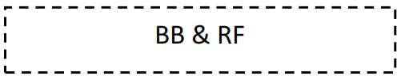
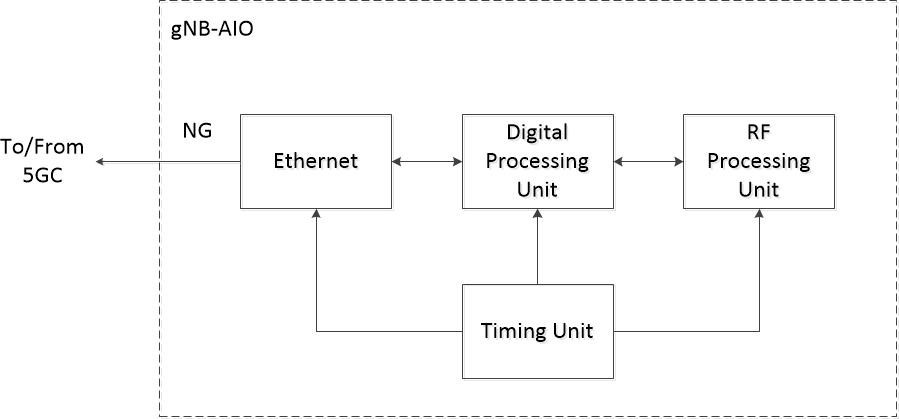

## O-RAN.WG7.IPC-HAR.0-v03.00.docx

- View in [Reader Mode](https://simewu.com/spec-reader/pages/06-WG7/O-RAN.WG7.IPC-HAR.0-v03.00.docx).
- Go back to [Table of Contents](../README.md).
- Download the [Original Document](https://github.com/Simewu/spec-reader/raw/refs/heads/main/documents/O-RAN.WG7.IPC-HAR.0-v03.00.docx).

---

#### O-RAN.WG7.IPC-HAR.0-v03.00

*Technical Specification*

**O-RAN White Box Hardware Working Group Indoor Picocell Hardware Architecture and Requirement (FR1 Only)**

**Specification**

Copyright (C) 2024 by the O-RAN ALLIANCE e.V.

The copying or incorporation into any other work of part or all of the material available in this specification in any form without the prior written permission of O-RAN ALLIANCE e.V. is prohibited, save that you may print or download extracts of the material of this specification for your personal use, or copy the material of this specification for the purpose of sending to individual third parties for their information provided that you acknowledge O-RAN ALLIANCE as the source of the material and that you inform the third party that these conditions apply to them and that they must comply with them.

O-RAN ALLIANCE e.V., Buschkauler Weg 27, 53347 Alfter, Germany Register of Associations, Bonn VR 11238, VAT ID DE321720189

# Revision History

|  |  |  |  |
| --- | --- | --- | --- |
| Date | Revision | Author | Description |
| 02/20/2020 | V01.00 | WG7 | First Published Version |
| 10/18/2023 | V02.00 | WG7 | Second Version |
| 07/16/2024 | V03.00 | WG7 | Third Version |

2

# Contents

1. Revision History 2
2. Chapter 1 Introductory Material 7
3. 1.1 Scope 7
4. 1.2 References 7
5. 1.3 Definitions and Abbreviations 8
6. 1.3.1 Definitions 8
7. 1.3.2 Abbreviations 8
8. Chapter 2 Deployment Scenarios and White Box Base Station Architecture 11
9. 2.1 Deployment Scenarios 11
10. 2.2 White Box Base Station Architecture 11
11. 2.2.1 Split RAN Architecture 12
12. 2.2.2 Integrated gNB-DU Architecture 14
13. 2.2.3 All-In-One Base Station Architecture 14
14. Chapter 3 White Box Hardware Architecture 15
15. 3.1 O-CU Hardware Architecture 15
16. 3.1.1 O-CU Architecture Diagram 15
17. 3.1.2 O-CU Functional Module Description 15
18. 3.1.3 O-CU Interfaces 15
19. 3.2 O-DU7-2 Hardware Architecture 15
20. 3.2.1 O-DU7-2 Architecture Diagram 16
21. 3.2.2 O-DU7-2 Functional Module Description 16
22. 3.2.3 O-DU7-2 Interfaces 17
23. 3.3 O-DU6 Hardware Architecture 18
24. 3.3.1 O-DU6 Architecture Diagram 18
25. 3.3.2 O-DU6 Functional Module Description 18
26. 3.3.3 O-DU6 Interfaces 18
27. 3.4 O-DU8 Hardware Architecture 18
28. 3.4.1 O-DU8 Architecture Diagram 19
29. 3.4.2 O-DU8 Functional Module Description 19
30. 3.4.3 O-DU8 Interfaces 20
31. 3.5 FHGW7-2 - Option 7-2 to Option 7-2 Hardware Architecture 20
32. 3.5.1 FHGW7-2 Architecture Diagram 20
33. 3.5.2 FHGW7-2 Functional Module Description 20
34. 3.6 FHGW6 - Option 6 to Option 6 Hardware Architecture 21
35. 3.7 FHGW7-2->8 - Option 7-2 to Option 8 Hardware Architecture 21
36. 3.7.1 FHGW7-2->8 Architecture Diagram 21
37. 3.7.2 FHGW7-2?8 Functional Module Description 22
38. 3.8 FHGW8 - Option 8 to Option 8 Hardware Architecture 22
39. 3.8.1 FHGW8 Architecture Diagram 22
40. 3.8.2 FHGW8 Functional Module Description 23
41. 3.9 O-RU7-2 Hardware Architecture 24
42. 3.9.1 O-RU7-2 Architecture Diagram 24
43. 3.9.2 O-RU7-2 Functional Module Description 24
44. 3.10 O-RU6 Hardware Architecture 25
45. 3.10.1 O-RU6 Architecture Diagram 25
46. 3.10.2 O-RU6 Functional Module Description 25
47. 3.11 O-RU8 Hardware Architecture 26
48. 3.11.1 O-RU8 Architecture Diagram 26
49. 3.11.2 O-RU8 Functional Module Description 27
50. 3.12 Integrated gNB-DU Hardware Architecture 27
51. 3.12.1 Integrated gNB-DU Architecture Diagram 28
52. 3.12.2 Integrated gNB-DU Function Module Description 28
53. 3.13 AIO White Box Hardware Architecture 29
54. 3.13.1 AIO Architecture Diagram 29
55. 3.13.2 AIO Functional Module Description 29
56. 3.13.3 AIO Interfaces 30
57. Chapter 4 White Box Hardware Requirements 31
58. 4.1 O-CU Requirements 31
59. 4.1.1 O-CU Performance 31
60. 4.1.2 O-CU Interfaces 32
61. 4.1.3 O-CU Environmental and EMC 32
62. 4.1.4 O-CU Mechanical, Thermal and Power 32
63. 4.2 O-DUx Common Requirements 33
64. 4.2.1 O-DUx Performance 34
65. 4.2.2 O-DUx Interfaces 35
66. 4.2.3 O-DUx Environmental and EMC 35
67. 4.2.4 O-DUx Mechanical, Thermal and Power 35
68. 4.3 O-DUx Split Option Specific Requirements 36
69. 4.3.1 O-DU7-2 Specific Requirements 36
70. 4.3.2 O-DU6 Specific Requirements 37
71. 4.3.3 O-DU8 Specific Requirements 37
72. 4.4 O-RUx Common Requirements 37
73. 4.4.1 O-RUx Performance 37
74. 4.4.2 O-RUx Interfaces 39
75. 4.4.3 O-RUx Environmental and EMC 39
76. 4.4.4 O-RUx Mechanical, Thermal and Power 39
77. 4.5 O-RUx Split Option Specific Requirements 40
78. 4.5.1 O-RU7-2 Specific Requirements 40
79. 4.5.2 O-RU6 Specific Requirements 40
80. 4.5.3 O-RU8 Specific Requirements 41
81. 4.6 FHGWx - Common Requirements 41
82. 4.6.1 FHGWx Performance 41
83. 4.6.2 FHGWx Interfaces 41
84. 4.6.3 FHGWx Environmental, EMCs 42
85. 4.6.4 FHGWx Mechanical, Thermal and Power 42
86. 4.7 FHGWx - Split Option Specific Requirements 43
87. 4.7.1 FHGW7-2 Specific Requirements 43
88. 4.7.2 FHGW7-2->8 Specific Requirements 43
89. 4.7.3 FHGW8 Specific Requirements 43
90. 4.8 Integrated gNB-DU Requirements 43
91. 4.8.1 Integrated gNB-DU Performance 44
92. 4.8.2 Integrated gNB-DU Interfaces 45
93. 4.8.3 Integrated gNB-DU Environmental, EMC 45
94. 4.8.4 Integrated gNB-DU Mechanical, Thermal and Power 46
95. 4.9 AIO White Box Hardware Requirements 47
96. 4.9.1 AIO Performance 47
97. 4.9.2 AIO Interfaces 48
98. 4.9.3 AlO Environmental and EMC 49
99. 4.9.4 AlO Mechanical, Thermal and Power 49

2

# Tables

1. Table 4-1 :O-CU Performance Requirements 31
2. Table 4-2: O-CU Interface Requirements 32
3. Table 4-3: O-CU EMC Requirements 32
4. Table 4-4: O-CU Mechanical Requirements 32
5. Table 4-5: O-CU Thermal Requirements 33
6. Table 4-6: O-CU Power Requirements 33
7. Table 4-7: O-DUx Performance Requirements 34
8. Table 4-8: O-DUx Interface Requirements 35
9. Table 4-9: O-DUx EMC Requirements 35
10. Table 4-10: O-DUx Mechanical Requirements 35
11. Table 4-11: O-DUx Thermal Requirements 36
12. Table 4-12: O-DUx Power Requirements 36
13. Table 4-13: O-DU7-2 Specific Requirements 36
14. Table 4-14: O-DU6 Specific Requirements 37
15. Table 4-15: O-DU8 Specific Requirements 37
16. Table 4-16: O-RUx Performance Requirements 38
17. Table 4-17: O-RUx Interface Requirements 39
18. Table 4-18: O-RUx Environmental and EMC Requirements 39
19. Table 4-19: O-RUx Mechanical, Thermal and Power Requirements 39
20. Table 4-20: FHGWx Performance Requirements 41
21. Table 4-21: FHGWx Interface Requirements 41
22. Table 4-22: FHGWx EMC Requirements 42
23. Table 4-23: FHGWx Mechanical, Thermal and Power Requirements 42
24. Table 4-24: Integrated gNB-DU Performance Requirements 44
25. Table 4-25: Integrated gNB-DU Interface Requirements 45
26. Table 4-26: Integrated gNB-DU Environmental and EMC Requirements 45
27. Table 4-27: Integrated gNB-DU Mechanical, Thermal and Power Requirements 46
28. Table 4-28: AIO Whitebox Performance Requirements 47
29. Table 4-29: AIO Whitebox Interface Requirements 48
30. Table 4-30: AIO EMC Requirements 49
31. Table 4-31: AIO Mechanical Requirements 49
32. Table 4-32: Thermal Requirements 49
33. Table 4-33: AIO Whitebox Power Requirements 50

37

1. Figures
2. Figure 2-1: Indoor Split Architecture 11
3. Figure 2-2: Indoor Integrated Architecture 12
4. Figure 2-3: Indoor All-In-One Architecture 12
5. Figure 2-4: Option 6 to Option 6 Split Architecture 12
6. Figure 2-5: Option 7-2 to Option 7-2 Split Architecture 13
7. Figure 2-6: Option 7-2 to Option 8 Split Architecture 13
8. Figure 2-7: Option 8 to Option 8 Split Architecture 14
9. Figure 2-8: Integrated gNB-DU Architecture 14
10. Figure 2-9: All-In-One Base Station Architecture 14
11. Figure 3-1: O-CU White Box Hardware Block Diagram 15
12. Figure 3-2: O-DU7-2 with Split Physical Function 16
13. Figure 3-3: O-DU7-2 Functional Block and Interface Diagram 17
14. Figure 3-4: O-DU6 Architecture Diagram 18
15. Figure 3-5: O-DU8 Architecture Diagram 19
16. Figure 3-6: O-DU8 Functional Block and Interface Diagram 19
17. Figure 3-7: FHGW7-2 Architecture Diagram 20
18. Figure 3-8: FHGW7-2 Functional Module Diagram 21
19. Figure 3-9: FHGW7-2->8 Architecture Diagram 21
20. Figure 3-10: FHGW7-2->8 Functional Module Diagram 22
21. Figure 3-11: FHGW8 Architecture Diagram 23
22. Figure 3-12: FHGW8 Functional Module Diagram 23
23. Figure 3-13: O-RU7-2 Architecture Diagram 24
24. Figure 3-14: O-RU7-2 Functional Module Diagram 25
25. Figure 3-15: O-RU6 Architecture Diagram 25
26. Figure 3-16: O-RU6 Functional Module Diagram 26
27. Figure 3-17: O-RU8 Architecture Diagram 27
28. Figure 3-18: O-RU8 Functional Module Diagram 27
29. Figure 3-19: Integrated gNB-DU Architecture Diagram 28
30. Figure 3-20: Integrated gNB-DU Functional Module Diagram 28
31. Figure 3-21: AIO White box Architecture Diagram 29

26

27

# Chapter 1 Introductory Material

## 1.1 Scope

1. This Technical Specification has been produced by the O-RAN.org.
2. The contents of the present document are subject to continuing work within O-RAN WG7 and may change
3. following formal O-RAN approval. Should the O-RAN.org modify the contents of the present document, it
4. will be re-released by O-RAN Alliance with an identifying change of release date and an increase in version
5. number as follows:
6. Release x.y.z
7. where:
8. x the first digit is incremented for all changes of substance, i.e. technical enhancements, corrections, updates,
9. etc. (the initial approved document will have x=01).
10. y the second digit is incremented when editorial only changes have been incorporated in the document.
11. z the third digit included only in working versions of the document indicating incremental changes during the
12. editing process. This variable is for internal WG7 use only.
13. The present document specifies system requirements and high-level architecture for the Indoor Picocell
14. deployment scenario case as specified in the Deployment Scenarios and Base Station Classes document [1]. 17

## 1.2 References

1. The following documents contain provisions which, through reference in this text, constitute provisions of
2. the present document.
3. [1] ORAN.WG7.DSC.0-v05.00 Technical Specification, 'Deployment Scenarios and Base Station Classes
4. for White Box Hardware'.
5. [2] 3GPP TR 21.905: "Vocabulary for 3GPP Specifications".
6. [3] 3GPP TR 38.104: "NR; Base Station (BS) radio transmission and reception".
7. [4] ORAN-WG4.CUS.0-v01.00 Technical Specification, 'O-RAN Fronthaul Working Group Control,
8. User and Synchronization Plane Specification'.
9. [5] CPRI Specification V7.0 (2015-10-09) Interface Specification, 'Common Public Radio Interface
10. (CPRI).
11. [6] Small Cell Forum nFAPI Specification (Not yet publicly available, however it will be available as part
12. of an O-RAN approved WG7 reference design specification)
13. [7] 3GPP TS 38.113: "NR: Base Station (BS) Electromagnetic Compatibility (EMC)
14. [8] O-RAN.SuFG.CE-v01.00, O-RAN SuFG, "Circular economy guidelines on network equipment -
15. Technical Report", - v01.00. 34

## 1.3 Definitions and Abbreviations

### 1.3.1 Definitions

* 1. For the purposes of the present document, the terms and definitions given in 3GPP TR 21.905 [2] and the
  2. following apply. A term defined in the present document takes precedence over the definition of the same
  3. term, if any, in [2]. For the base station classes of Pico, Micro and Macro, the definitions are given in 3GPP
  4. TR 38.104 [3].
  5. **All-In-One architecture:** In the all-in-one architecture, the O-RU, O-DU and O-CU are implemented on
  6. one platform. There is no need for neither fronthaul interface between O-RU and O-DU nor F1 interface
  7. between O-DU and O-CU.
  8. **Carrier Frequency:** Center frequency of the cell.
  9. **F1 interface:** The open interface between O-CU and O-DUx.
  10. **Integrated architecture:** In the integrated architecture, the O-RUx and O-DUx are implemented on one
  11. platform. Each O-RUx and RF front end is associated with one O-DUx. They are then aggregated to O-CU
  12. and connected by F1 interface.
  13. **Split architecture:** The O-RUx and O-DUx are physically separated from one another in this architecture. A
  14. switch may aggregate multiple O-RUx (s) to one O-DUx. O-DUx, switch and O-RUx (s) are connected by the
  15. fronthaul interface as defined in WG4.
  16. **Transmission Reception Point (TRxP**): Antenna array with one or more antenna elements available to the
  17. network located at a specific geographical location for a specific area.

### 1.3.2 Abbreviations

* 1. For the purposes of the present document, the abbreviations given in [2] and the following apply. An
  2. abbreviation defined in the present document takes precedence over the definition of the same abbreviation,
  3. if any, as in [2].
  4. 7-2 Fronthaul interface split option as defined by O-RAN WG4, also referred to as 7-2x
  5. 3GPP Third Generation Partnership Project
  6. 5G Fifth-Generation Mobile Communications
  7. 5GC 5G Core
  8. ACS Adjacent Channel Selectivity
  9. ADC Analog to Digital Converter
  10. AIO All-In-One
  11. ASIC Application Specific Integrated Circuit
  12. ATA Advanced Technology Attachment
  13. BB Baseband
  14. BPSK Binary Phase Shift Keying
  15. BS Base Station
  16. CFR Crest Factor Reduction
  17. CU Centralized Unit as defined by 3GPP
  18. DAC Digital to Analog Converter
  19. DDC Digital Down Conversion
  20. DDR Double Data Rate
  21. DL Downlink

|  |  |  |
| --- | --- | --- |
| 1 | DPD | Digital Pre-Distortion |
| 2 | DSP | Digital Signal Processor |
| 3 | DU | Distributed Unit as defined by 3GPP |
| 4 | DUC | Digital Up Conversion |
| 5 | EMC | ElectroMagnetic Compatibility |
| 6 | EVM | Error Vector Magnitude |
| 7 | FFT | Fast Fourier Transform |
| 8 | FH | Fronthaul |
| 9 | FHGW | Fronthaul Gateway |
| 10 | FHGWx | Fronthaul gateway with no FH protocol translation, supporting an O-DUx with split |
| 11 |  | option x and an O-RUx with split option x, with currently available options 6?6, 7-2?7- |
| 12 |  | 2 and 8?8 |
| 13 | FHGWx?y | Fronthaul Gateway that can translate FH protocol from an O-DUx with split option x to |
| 14 |  | an O-RUy with split option y, with currently available option 7-2?8. |
| 15 | FPGA | Field Programmable Gate Array |
| 16 | GbE | Gigabit Ethernet |
| 17 | GPP | General Purpose Processor |
| 18 | IEEE | Institute of Electrical and Electronics Engineers |
| 19 | IMD | InterModulation Distortion |
| 20 | I/O | Input/Output |
| 21 | JTAG | Joint Test Action Group |
| 22 | L1 | Layer 1, also referred as PHY, also known as Physical Layer of Open System |
| 23 |  | Interconnection (OSI) model |
| 24 | L2 | Layer 2, also referred to as Data Link layer in OSI model |
| 25 | L3 | Layer 3, also referred to as Network Layer in OSI model |
| 26 | LED | Light Emitting Diode |
| 27 | LTE | Long Term Evolution |
| 28 | MAC | Media Access Control |
| 29 | MIMO | Multiple Input Multiple Output |
| 30 | MCP | Multi-Chip Package |
| 31 | MU-MIMO | Multiple User MIMO |
| 32 | NG | Next Generation |
| 33 | NR | New Radio |
| 34 | OAM | Operations, Administrations and Maintenance |
| 35 | O-CU | O-RAN Centralized Unit as defined by O-RAN |
| 36 | O-DUx | A specific O-RAN Distributed Unit having fronthaul split option x where x may be 6, 7-2 |
| 37 |  | (as defined by WG4) or 8 |
| 38 | O-RUx | A specific O-RAN Radio Unit having fronthaul split option x, where x is 6, 7-2 (as |
| 39 |  | defined by WG4) or 8, and which is used in a configuration where the fronthaul interface |
| 40 |  | is the same at the O-DUx |
| 41 | PCIe | Peripheral Component Interface Express |
| 42 | PDCP | Packet Data Convergence Protocol |
| 43 | PHY | Physical Layer, also referred as L1 |
| 44 | PLL | Phase Locked Loop |
| 45 | POE | Power over Ethernet |
| 46 | QAM | Quadrature Amplitude Modulation |
| 47 | QPSK | Quadrature Phase Shift Keying |
| 48 | RAN | Radio Access Network |

|  |  |  |
| --- | --- | --- |
| 1 | RF | Radio Frequency |
| 2 | RLC | Radio Link Controller |
| 3 | RRC | Radio Resource Controller |
| 4 | RU | Radio Unit as defined by 3GPP |
| 5 | RX | Receiver |
| 6 | SDU | Service Data Unit |
| 7 | SFP | Small Form-factor Pluggable |
| 8 | SFP+ | Small Form-factor Pluggable Transceiver |
| 9 | SoC | System on Chip |
| 10 | SPI | Serial Peripheral Interface |
| 11 | TR | Technical Report |
| 12 | TS | Technical Specification |
| 13 | TX | Transmitter |
| 14 | UL | Uplink |
| 15 | USB | Universal Serial Bus |
| 16 | WG | Working Group |
| 17 |  |  |
| 18 |  |  |

# Chapter 2 Deployment Scenarios and White Box Base

1. Station Architecture
2. This chapter consists of two parts: the deployment scenario and the white box architecture. The deployment
3. scenarios outline more specific functional requirements of the base station. All the reference designs shall
4. meet these requirements in order to comply with O-RAN white box standard. In the white box hardware
5. architecture section, it describes the overall gNB hardware architecture and function partition that meet the
6. design requirements. The details on each of these topics are described in the following sections.

## 2.1 Deployment Scenarios

1. The indoor picocell is the targeted deployment scenario of this specification. The requirements of the indoor
2. picocell base station are listed in the white box Deployment Scenarios and Base Station Classes document
3. [1]. Some of the key requirements described in that document are highlighted here.
4. ? Cell type: Indoor
5. ? Carrier Frequency Band: FR1
6. ? Frequency Bandwidth: Up to 100 MHz
7. ? Inter site distance: 20 meters
8. ? Antennas: 2Tx2Rx; 4Tx4Rx
9. ? Fronthaul Type: O-RAN FH (WG4), 3GPP Option 6 and 3GPP Option 8

## 2.2 White Box Base Station Architecture

1. In general, the base station hardware architecture can be classified by using different criteria. The physical
2. partition method is adopted by O-RAN; hence, the base station architecture is divided into three categories
3. namely split, integrated, and all-in-one. In split architecture, the fronthaul interface determines the gNB
4. functions location. Here we refer to the two partitions as O-DUx and O-RUx; where the "x" is split option
5. number. In case the O-RAN WG4 defined fronthaul interface is used, these two partitions are called O-DU7-2
6. and O-RU7-2. For a more complete description of the terminology used, refer to the Deployment Scenarios and
7. Base Station Classes Document [1].
8. The split architecture is shown in Figure 2-1. A Fronthaul Gateway (FHGW) is an optional device between the
9. O-DUx and O-RUx to aggregate multiple radio units together. Within this specification, a Back End fronthaul
10. interface is defined as the connection between the FHGWx and the O-DUx, while the Font End fronthaul
11. interface is defined as the connection between the FHGWx and the O-RUx. With split architectures, one may
12. choose to have O-CU and O-DUx as either co-located or shared configuration with respect to hardware.

31

Front Haul

Interface

O-CU

O-DUx

O-RUx

O-CU & O-DU may be integrated into one Whitebox

32 **Figure 2-1: Indoor Split Architecture**

1. For integrated base station architecture, the O-DU is integrated with the O-RU into one box. Figure 2-2
2. shows the integrated architecture.

3

F1

Interface

F1

Interface

O-DU&O-RU

O-DU&O-RU

Switch/ Router

O-CU

O-DU&O-RU

1. **Figure 2-2: Indoor Integrated Architecture**
2. The all-in-one architecture is shown in Figure 2-3. This architecture is defined as where O-CU, O-DUx and
3. O-RUx are physically located in one hardware box.

7

1. **Figure 2-3: Indoor All-In-One Architecture**

### 2.2.1 Split RAN Architecture

1. For medium and large coverage indoor deployment scenarios, the base station with split RAN architecture is
2. more cost effective. This type of architecture is widely deployed in 4G networks. The main idea of this
3. architecture is "shared cell". By using the fronthaul gateway, a large number of radio units can then share the
4. same radio spectrum resource in one cell. This configuration is very useful in both low and high capacity
5. scenarios. Therefore, when an O-DUx and FHGWx are capable of handling cell splits, multiple O-RUx(s) can
6. be grouped together to share the radio resources. Accordingly, the choice of fronthaul split option changes
7. the architecture of the base station. WG7 has recognized the following four split option architectures per
8. service providers' deployment needs which are shown in Figure 2-4 through Figure 2-7.
9. 1) Option 6 to option 6 split architecture
10. In split option 6, the L1 functions are within O-RU6 while the O-DU6 contains functions of MAC
11. and above. Figure 2-4 shows the block diagram of base station having an option 6 split architecture. 21

22

FH

Option6

O-RU6

O-DU6

FH

Option6

O-RU6

O-CU & O-DU may/may not be integrated into one Whitebox

O-RU6

O-CU

Switch/Router Or

Fronthaul Gateway

23 **Figure 2-4: Option 6 to Option 6 Split Architecture**

24

1. 2) Option 7-2 to option 7-2 split architecture:
2. In split option 7-2, low PHY functions reside in the O-RU7-2, while the high PHY functions reside
3. in the O-DU7-2. O-RAN WG4 CUS-plane spec [4] outlines the details of this split option under
4. different usage scenarios. 5

6

O-RU

FH

Option7-2

FH

Option7-2

O-DU O-RU

O-CU & O-DU may/may not be integrated into one Whitebox

O-RU

Switch/Router Or

Fronthaul Gateway

O-CU

1. **Figure 2-5: Option 7-2 to Option 7-2 Split Architecture**
2. 3) Option 7-2 to option 8 split:
3. This configuration is selected when a deployment scenario requires a radio unit which only
4. supports split option 8 architecture. Since this is currently not part of overall O-RAN architecture,
5. CPRI based option 8 fronthaul and FHGW7-2?8 will be included in the reference design
6. specification. Figure 2-6 depicts the option 7-2 to option 8 based split architecture. There is no
7. change for the definition of O-DU7-2, However, O-RU8 supports option 8 fronthaul interface while
8. the FHGW7-2?8 translates the fronthaul protocol between option 7-2 and CPRI.

15

O-RU8

FH

Option7-2

FH

Option8

O-DU7-2

O-RU8

O-CU & O-DU may/may not be integrated into one Whitebox

O-RU8

O-CU

Fronthaul Gateway with Option Translator

16 **Figure 2-6: Option 7-2 to Option 8 Split Architecture**

17

1. 4) Option 8 to option 8 split architecture:
2. Currently, Option 8 is a non-O-RAN defined split option where the CPRI fronthaul interface is
3. needed in order to make the interoperability work with O-DU8 and O-RU8 from different
4. vendors. The option 8 fronthaul interface definition and the requirements shall be part of the
5. white box reference design, if adopted. In this case, the O-DU8 consists of L1 and L2 processing
6. functions. Figure 2-7 shows an option 8 based split architecture. Note that O-CU and O-DU8
7. hardware may be integrated into one Whitebox this is also shown in Figure 2-7.

8

FH

Option8

FH

Option8

O-RU8

O-CU

O-DU8

O-RU8

O-CU & O-DU may/may not be integrated into one Whitebox

O-RU8

Fronthaul Gateway

9 **Figure 2-7: Option 8 to Option 8 Split Architecture**

### 2.2.2 Integrated gNB-DU Architecture

1. For integrated gNB-DU, the complete L1/L2 and radio functions are integrated into a single box which
2. includes all logical functions of O-DU and O-RU. ??**!**??????? shows the block diagram of
3. integrated gNB-DU. The gNB-DU connects with the O-CU through an F1 interface as defined by 3GPP.

14

gNB-DU

F1

O-CU

O-RU

O-DU

1. **Figure 2-8: Integrated gNB-DU Architecture**

### 2.2.3 All-In-One Base Station Architecture

1. For all-in-one base station, the functions of O-CU, O-DUx and O-RUx are included in one box which is
2. composed of baseband unit and RF processing unit, as such no FH interface and F1 interface are required to
3. connect them.

20

21 **Figure 2-9: All-In-One Base Station Architecture**

22

23

# Chapter 3 White Box Hardware Architecture

1. Based on the gNB physical implementation architectures discussed earlier, this chapter provides the
2. architecture, major building blocks and all external/internal interfaces for each Whitebox.

## 3.1 O-CU Hardware Architecture

1. In 3GPP system architecture, the gNB Central Unit (CU) communicates to the Distribution Unit (DU) via an
2. F1 interface. This interface has been adopted by O-RAN Alliance as well. F1 is an IP based protocol
3. interface, which offers more flexibility on O-CU platform design.

### 3.1.1 O-CU Architecture Diagram

1. The O-CU can be implemented with any General-Purpose Processor (GPP) based platform having an
2. optional accelerator block. The O-CU functions can be implemented in either a separated hardware platform
3. or share the same hardware platform with O-DUx functions (Integrated). In both cases, the O-CU should be
4. able to leverage the O-DUx reference design with relaxed requirements on I/O and network bandwidth
5. capacity. Figure 3-1 shows the hardware blocks and interfaces within the O-CU white box. Refers to the O-
6. DUx section for the details of O-CU components and interfaces.

Back Haul

O-CU

Ethernet Interface

Accelerator

Ethernet Interface

Digital Processing Unit

F1

Interface

15

1. **Figure 3-1: O-CU White Box Hardware Block Diagram**

### 3.1.2 O-CU Functional Module Description

1. The O-CU functional module description is the same as for the O-DU7-2 and it is described in Section 3.2.2.

### 3.1.3 O-CU Interfaces

1. The O-CU interfaces are the same as for the O-DU7-2 and it is described in Section 3.2.3.

## 3.2 O-DU7-2 Hardware Architecture

1. For split RAN architecture, the functional blocks of RAN physical layer are divided into two parts - high
2. PHY and low PHY. The O-RAN lower layer split is defined in O-RAN WG4 fronthaul interface
3. specification [4]. It also provides the details of the interface protocol as well as function partitions.

### 3.2.1 O-DU7-2 Architecture Diagram

1. Depending on the 3GPP standards and category of the radio unit, the split function blocks within O-DU7-2
2. and O-RU7-2 may vary accordingly. The O-RAN fronthaul C/U/S-plane specification [4] offers
3. comprehensive information on this topic. The hardware functional partition architecture is shown in Figure
4. 3-2.

6

O-RAN FH

Interface

O-DU7-2

O-RU7-2

Low Phy

Ethernet Interface (IEEE1588)

Ethernet Interface (IEEE1588)

Digital Processing Unit

Accelerator

High Phy

1. **Figure 3-2: O-DU7-2 with Split Physical Function**

### 3.2.2 O-DU7-2 Functional Module Description

1. O-DU7-2 or O-CU hardware components selection is a product design specific task. Figure 3-3 shows the
2. required components of O-DU7-2. Their descriptions and requirements are as follows:

##### Digital Processing Unit

1. The processing unit can be any GPP or digital signal processor (DSP), with I/O chipset. It may also be in the
2. form of System-On-Chip (SOC), or Multi-Chip Package (MCP).

##### Memory

1. DDR memory devices are used to store the runtime data and software for the processing unit.

##### Flash Memory

1. On board non-volatile storage device is used to store the firmware and non-volatile data, such as log data.

##### Board Management Controller

1. The controller is used to manage/control the power and monitors the operational status of the board.

##### Storage Device

1. The storage device such as hard drive is used to store OS, driver and applications software.

##### Ethernet Controller

1. The Ethernet ports transport the fronthaul or backhaul traffic according to the gNB hardware node
2. requirements. The Ethernet device shall support IEEE1588 based timing synchronization.

##### Accelerator

1. The accelerator is an optional device. For performance improvement, hardware accelerator can be used for
2. any process function (e.g. Forward Error Correction (FEC).

6

PCIe

USB

Memory

Channel

VGA

SPI

PCIe

Digital Processing Unit

SMbus

RS232

SATA

Timing Signal

Ethernet

Ethernet Ports

Timing

Storage Drives

Serial Ports

SMBus Port

PCIe Slots

Flash Memory

Video Port

DDR RAM

USB Ports

Accelerator

1. **Figure 3-3: O-DU7-2 Functional Block and Interface Diagram.**

### 3.2.3 O-DU7-2 Interfaces

1. The O-DU7-2 supported interfaces described below are also shown in Figure 3-3.

##### Memory Channel Interface

1. Support DDR4 and later memory interface.

##### PCIe Interface

1. Support for PCIe v3 and later interface; the bandwidth depends on the use cases, and it can be used to
2. connect an accelerator device or network card.

##### Ethernet Interfaces

1. Supports any one or combination of GbE/10GbE/25GbE/40GbE links.

##### Serial ATA Interface

1. SATA3 shall be supported in case of software storage, such as hard drive.

##### SPI Interface

1. The SPI interface connects the processor with flash type of device for firmware.

##### Video Interface

1. Video interface is optional.

##### USB Interface

1. Used to connect with local device for debug or on-board firmware update.

##### Miscellaneous Interface

1. Other interfaces that may be needed such as serial port, JTAG, etc.

## 3.3 O-DU6 Hardware Architecture

1. Hardware architecture for base stations deploying architecture with split option 6 are described in the
2. following sections.

### 3.3.1 O-DU6 Architecture Diagram

1. O-DU6 and O-RU6 are connected via Ethernet based nFAPI interface[6]. O-RU6 includes complete physical
2. layer processing functions, thus the O-DU6 handles L2 and L3 processing functions. The O-DU6 hardware
3. architecture is shown in Figure 3-4.

12

nFAPI FH

Interface

Ethernet

Interface (IEEE1588)

O-DU6

O-RU6

(IEEE1588)

Interface

Ethernet

Hi+Low Phy

Ethernet Interface (IEEE1588)

Digital Processing Unit

1. **Figure 3-4: O-DU6 Architecture Diagram**

### 3.3.2 O-DU6 Functional Module Description

1. O-DU6 hardware functional blocks are the same as the modules used by O-DU7-2. A detailed description of
2. O-DU7-2 modules is given in Section 3.2.2. However, note that O-DU6, does not require an accelerator
3. module since all physical layer functions are handled by O-RU6.

### 3.3.3 O-DU6 Interfaces

1. The O-DU6 interfaces are the same as O-DU7-2 interfaces which are described in section 3.2.3.

## 3.4 O-DU8 Hardware Architecture

1. Base stations deploying split architecture option 8 have their baseband processing and radio processing units
2. physically separated from one another. For this type of functional partition, CPRI must be used as fronthaul
3. interface between O-DU8 and O-RU8. The architecture for O-DU8 is described in the following sections

### 3.4.1 O-DU8 Architecture Diagram

1. O-DU8 shall contain complete physical layer processing operation. The details of CPRI interface will be
2. provided as part of the reference design if this option is selected by the system designer. The hardware
3. functional partition architecture is shown in Figure 3-5.

5

CPRI

Interface

O-RU8

O-DU8

CPRI

Ethernet Interface (IEEE1588)

CPRI

Digital Processing Unit

Accelerator

Hi + Low Phy

1. **Figure 3-5: O-DU8 Architecture Diagram**

### 3.4.2 O-DU8 Functional Module Description

1. Most of hardware modules in O-DU8 are the same as the modules used by O-DU7-2. Section 3.2.2 has the
2. detailed description of those components. The differences between O-DU8 and O-DU7-2 are the fronthaul
3. interface and the physical layer functions that are performed within O-DU8 (i.e., O-DU8 performs all PHY
4. functions vs O-DU7-2 only performs High PHY functions). In O-DU8, CPRI interface is used for fronthaul.
5. Figure 3-6 shows the various components used in O-DU8, and additional functional modules are elaborated
6. in the following:

##### CPRI Interface Device

1. This device provides the CPRI protocol used for the fronthaul interface.

16

PCIe

PCIe

USB

Memory

Channel

VGA

SPI

PCIe

Digital Processing Unit

SMbus

RS232

SATA

Timing Signal

Ethernet

Ethernet Ports

Timing

Storage Drives

Serial Ports

SMBus Port

PCIe Slots

Flash Memory

Video Port

DDR RAM

USB Ports

CPRI Interface Device

Accelerator

17 **Figure 3-6: O-DU8 Functional Block and Interface Diagram**

### 3.4.3 O-DU8 Interfaces

1. Among the O-DU8 interfaces, CPRI is the fronthaul interface that is different from the O-DU7-2 and is
2. described below. The rest of the interfaces are the same as O-DU7-2 interfaces which are described in section
3. 3.2.3.

##### CPRI Interface

1. The CPRI interface shall comply with CPRI specification [5].

## 3.5 FHGW7-2 - Option 7-2 to Option 7-2 Hardware Architecture

1. For the indoor picocell system, FHGW7-2 performs the aggregation/distribution function for the
2. uplink/downlink traffic to all the radio units. FHGW7-2 has an upper interface which connects with O-DU7-2,
3. and a lower interface connected with O-RU7-2. Here, both interfaces are based on the O-RAN WG4 defined
4. fronthaul interface. FHGW7-2 supports NR by default but LTE is not precluded.

### 3.5.1 FHGW7-2 Architecture Diagram

1. Figure 3-7 depicts a FHGW7-2 architecture diagram. The signal processing unit is the key component of the
2. FHGW7-2 which handles all the uplink and downlink traffic combining and distribution. The signal
3. processing block can be either an FPGA or another digital processing unit. The back end and front end
4. fronthaul interfaces are both Ethernet. In the front end direction, there is a broadcast function for connecting
5. O-RU7-2(s) and cascaded FHGW7-2 with the same cell ID, and a demultiplex function for connecting O-RU7-
6. 2(s) and FHGW7-2 with different cell IDs. In the back end direction, all signals from connected O-RU7-2(s)
7. and FHGW7-2 with same cell ID could be combined. See Figure below.

To/From O-DU7-2

FHGW7-2

Digital Processing Unit

O-RAN FH

Back End Interface

O-RAN FH

Front End

Interfaces

To/From O-RU7-2

20

1. **Figure 3-7: FHGW7-2 Architecture Diagram**

### 3.5.2 FHGW7-2 Functional Module Description

1. The FHGW7-2 functional module diagram is shown in Figure 3-8. The components include:
2. ? Digital processing Unit: handles all the computation and signal processing functions.
3. ? POE++: provides power over Ethernet.
4. ? DC/DC: performs DC to DC conversion.
5. ? CLK: provides the clock signals to the FHGW7-2
6. ? Memory: on board memory for data storage
7. ? SPI: interface to connect with flash device for software and configuration data
8. ? Debug Interface: interface is used for debugging purposes
9. ? Ethernet: interfaces to connect with O-RU7-2 And O-DU7-2

5

Ethernets

Debug Interface

CLK

SPI

DC/DC

Memory

POE++

Digital Processing Unit

1. **Figure 3-8: FHGW7-2 Functional Module Diagram**

## 3.6 FHGW6 - Option 6 to Option 6 Hardware Architecture

1. No FHGW is needed for this indoor deployment scenario when adopting split option 6.

## 3.7 FHGW7-2->8 - Option 7-2 to Option 8 Hardware Architecture

1. FHGW7-2->8 performs both radio traffic multiplexing and fronthaul protocol translation tasks.

### 3.7.1 FHGW7-2->8 Architecture Diagram

1. Figure 3-9 illustrates the FHGW7-2->8 architecture. For FHGW7-2->8, the digital processing unit can be the
2. same as described in Section 3.5.1. With FHGW7-2->8, the back end interface is Ethernet, while the front end
3. interfaces are CPRI. The digital processing unit block shall conduct the protocol translation between the
4. front end and back end interfaces.

To/From O-DU7-2

To/From O-RU8

FHGW7-2->8

Digital Processing Unit

O-RAN FH

Back End Interface

Option 8 Front End

Interfaces

16

17 **Figure 3-9: FHGW7-2->8 Architecture Diagram**

### 3.7.2 FHGW7-2?8 Functional Module Description

1. Figure 3-10 is the FHGW7-2->8 functional module diagram. There is one 25G SFP+ port for back end link,
2. one 25G SFP+ port for cascade link, and eight 10G CPRI ports for front end links. The front end ports also
3. support remote power supply for O-RU8(s) via POE++. In the forward direction, FHGW7-2?8 may connect an
4. O-DU7-2 to other O-RU8(s) via a cascaded FHGW8 supporting both the same and different cell IDs.
5. However, it can also support demultiplexing functions for connecting O-RU8(s) with different cell IDs. In
6. the back end direction, all signals from connected O-RU8(s) with the same cell IDs are combined via
7. FHGW7-2->8 towards O-DU7-2.
8. As different fronthaul interfaces are used by FHGW7-2->8, it will translate the fronthaul protocol between front
9. end and back end. FHGW7-2->8 shall also provide the low physical layer function.

11

CPRI

Ethernet

Debug Interface

CLK

SPI

DC/DC

Memory

POE++

Digital Processing Unit

1. **Figure 3-10: FHGW7-2->8 Functional Module Diagram**
2. The FHGW7-2->8 functional module diagram is shown in Figure 3-10. The components include:
3. ? Digital processing Unit: handles all the computation and signal processing functions.
4. ? POE++: provides power over Ethernet.
5. ? DC/DC: performs DC to DC conversion.
6. ? CLK: provides the clock signals to the FHGW7-2
7. ? Memory: on board memory for data storage.
8. ? SPI: interface to connect with flash device for software and configuration data.
9. ? Debug Interface: The interface is used for debugging purposes.
10. ? Ethernet: provides connection from O-DU7-2 to FHGW7-2->8
11. ? CPRI: provides fronthaul connection from FHGW7-2->8 to O-RU8

## 3.8 FHGW8 - Option 8 to Option 8 Hardware Architecture

1. For option 8 to option 8 fronthaul gateway, both the front end and back end interfaces of FHGW8 are based
2. on CPRI.

### 3.8.1 FHGW8 Architecture Diagram

1. Figure 3-11 illustrates the HW architecture FHGW8. Note that the front end and the back end interfaces are
2. both CPRI. The digital processing unit handles I/Q samples and all interface processing. FHGW8 shall also
3. provide remote power supply functionality to the O-RU8 and may be optionally cascaded with other(s)
4. FHGW8.

To/From O-DU8

Option8 Back End Interface

To O-RU8

#### FHGW8

Digital Processing Unit

Option 8 Front End

Interfaces

3

1. **Figure 3-11: FHGW8 Architecture Diagram**

### 3.8.2 FHGW8 Functional Module Description

1. Figure 3-12 illustrates FHGW8 functional module diagram for an Option 8 CPRI switch. As shown in the
2. FHGW8 diagram, there is one 25G SFP+ port for back end link to O-DU8, one 25G SFP+ port for cascade
3. link, and eight 10G ports for front end links. All these ports support CPRI, while the front end ports further
4. support remote power supply for O-RU8 connection. In the front end direction, there is a broadcast function
5. for connecting O-RU8(s) and cascaded FHGW8 with the same cell ID, and a demultiplex function for
6. connecting O-RU8(s) and FHGW8 with different cell IDs. In the back end direction, all signals from
7. connected O-RU8(s) with the same cell ID could be combined to O-DU8.

13

CPRI

Debug Interface

CLK

SPI

DC/DC

Memory

Digital Processing Unit

POE++

1. **Figure 3-12: FHGW8 Functional Module Diagram**
2. The FHGW8 functional module diagram is shown in Figure 3-12. The components include:
3. ? Digital processing Unit: handles all the computation and signal processing functions.
4. ? POE++: provides power over Ethernet
5. ? DC/DC: performs DC to DC conversion.
6. ? CLK: provides the clock signals to the FHGW7-2
7. ? Memory: on board memory for data storage.
8. ? SPI: interface to connect with flash device for software and configuration data.
9. ? Debug Interface: interface used for debug.
10. ? CPRI: provides connection from O-DU8 to FHGW8 and from FHGW8 to O-RU8.

## 3.9 O-RU7-2 Hardware Architecture

##### O-RU7-2 consists of three major units, namely digital processing unit, RF processing unit and a timing

1. **unit as shown in** Figure 3-13.The Ethernet interface complies with O-RAN WG4 open fronthaul interface. O-
2. RU7-2 can directly connect with O-DU7-2 or connect through a FHGW7-2. While O-RU7-2 HW supports
3. NR by default, LTE is not precluded.

### 3.9.1 O-RU7-2 Architecture Diagram

1. O-RU7-2 HW architecture consists of digital processing unit which handles all digital signal and interface
2. processing and a RF processing unit handling all analog. There will be a transceiver right after digital
3. processing block which converts between digital signals and analog signals, as well as frequency mixing.
4. Then the PA/LNA amplifies the RF signal, and the antenna will be used to transmit and receive signal over
5. the air. There is at least one Ethernet port available which is used as the O-RAN fronthaul interface.

#### To/From O-DU7-2

O-RU7-2

O-RAN

FH

Timing Unit

RF

Processing Unit

Digital Processing Unit

Ethernet

13

1. **Figure 3-13: O-RU7-2 Architecture Diagram**

15

### 3.9.2 O-RU7-2 Functional Module Description

1. Figure 3-14 illustrates the O-RU7-2 functional module blocks that support O-RAN fronthaul with split option
2. 7-2. There is at least one interface port which supports all fronthaul interface and PoE functionalities. The
3. digital processing unit block of O-RU7-2 is mainly responsible for low PHY functions such as FFT/iFFT, CP
4. addition/removal, and PRACH filtering. Digital Down Converter (DDC), Digital Up Converter (DUC), Crest
5. Factor Reduction (CFR) and Digital Pre-Distortion (DPD) are used for digital data processing. For
6. bandwidth reduction, O-RU7-2 architecture also supports the optional compression and decompression
7. functions of FH interface. RF Processing Unit consists of the following blocks: Transceiver, Power
8. Amplifier (PA)/ Low Noise Amplifier (LNA) and antenna. Transceiver is used for function of Analog to
9. Digital Converter (ADC), Digital to Analog Converter (DAC) and mixer. The Timing unit may include
10. Phase Locked Loop (PLL), local oscillator and other timing synchronization circuities.

To/From FHGW

O-RU7-2

Digital Processing Unit

RF Processing Unit

O-RAN

FH/1588

(de)com

pression/ Low L1

DDC/

DUC

CFR/

DPD

Transceiver

ADC/DAC And MIXER

PA/

LNA

ANT

Timing Unit

Ethernet

Interface

7-2

1

* 1. **Figure 3-14: O-RU7-2 Functional Module Diagram**

## 3.10 O-RU6 Hardware Architecture

* 1. O-RU6 may be deployed in an integrated or split architecture, using the MAC/PHY split defined by the
  2. Small Cell Forum's FAPI or nFAPI interface [5].

### 3.10.1 O-RU6 Architecture Diagram

* 1. O-RU6 consists of three major Units, namely digital processing unit, RF processing unit and a timing unit as
  2. shown in Figure 3-15. Option 6 is referred to as interface between PHY and MAC as defined by the Small
  3. Cell Forum [6] and is carried by the fronthaul interface over Ethernet as shown in Figure 3-15. In the next
  4. section there is a brief functional description of modules within these major blocks of O-RU6.

11

O-RU6

nFAPI

RF Processing

Unit

Timing Unit

Ethernet

Digital Processing Unit

O-CU/O-DU6/ FHGW6

1. **Figure 3-15: O-RU6 Architecture Diagram**

### 3.10.2 O-RU6 Functional Module Description

1. Figure 3-16 shows the major components used in O-RU6.
2. The digital processing unit handles transport/interface processing, complete PHY (low and high PHY
3. functions) modem processing, Digital Down Converter (DDC), Digital Up Converter (DUC), Crest Factor
4. Reduction (CFR) and Digital Pre-Distortion (DPD).
5. The RF processing unit is comprised of the transceiver block which is responsible for functions such as
6. Analog to Digital Converter (ADC), Digital to Analog Converter (DAC) and mixer, an amplification block
7. which contains Power Amplifier (PA)/ Low Noise Amplifier (LNA), etc and antenna subsystem that
8. captures and/or transmits radio electromagnetic waves. O-RU6 may use Power over Ethernet (PoE) to
9. simplify deployment complexity.
10. The Timing Unit may include Phase Locked Loop (PLL), local oscillator and timing synchronization
11. circuitry.

To/From O-DU6

O-RU6

Digital Processing Unit

RF Processing Unit

nFAPI

Handler

Hi +Lo

PHY

DDC/

DUC

Transceiver

ADC/DAC

and MIXER

PA/

LNA

ANT

Timing Unit

Ethernet

Interface

CFR/ DPD

6

1. **Figure 3-16: O-RU6 Functional Module Diagram**

## 3.11 O-RU8 Hardware Architecture

1. O-RU8 hardware architecture is similar to O-RU7-2 as described in the previous section. The major functional
2. differences reside in the fronthaul interface functions and Physical layer functions. Note that in split option 8
3. architecture, all PHY functions are performed in the O-DU8. The digital signal processing block will
4. comprehend the functional differences and make adjustment accordingly. The RF processing blocks are the
5. same in this case. 14

### 3.11.1 O-RU8 Architecture Diagram

1. Figure 3-17 shows a complete O-RU8 architecture diagram. CPRI is adopted as the fronthaul interface in O-
2. RU8. The CPRI interface shall be included as part of the white box reference design document. The
3. programmable digital signal processing block handles all I/Q data samples processing, management and
4. control functions. The transceiver block does the radio signal conversion from analog to digital and vice
5. versa.

1

O-RU8

CPRI

Digital

Processing Unit

RF Processing

Unit

Timing Unit

O-DU8/FHGW8

CPRI

* 1. **Figure 3-17: O-RU8 Architecture Diagram.**

### 3.11.2 O-RU8 Functional Module Description

* 1. Figure 3-18 depicts functional block diagram of one example of O-RU8 which supports split architecture
  2. with Option 8. The CPRI interface shall be included as part of the Whitebox reference design document. The
  3. programmable digital signal processing block handles all I/Q data samples processing, management and
  4. control functions. Therefore, within O-RU8, there shall be at least copper or fiber interface to support
  5. transmission of CPRI protocol. The digital processing unit of O-RU8 is responsible for CPRI protocol
  6. processing, Digital Down Converter (DDC), Digital Up Converter (DUC), Crest Factor Reduction (CFR)
  7. and Digital Pre-Distortion (DPD). The RF processing unit is the same as O-RU7-2, and O-RU6. The
  8. Transceiver block comprises of Analog to Digital Converter (ADC), Digital to Analog Converter (DAC) and
  9. mixer. The analog blocks include: Power Amplifier (PA)/ Low Noise Amplifier (LNA), etc. The Timing
  10. Unit may include Phase Locked Loop (PLL), local oscillator and other timing synchronization circuities.

To/From FHGW8

O-RU8

Digital Processing Unit

RF Processing Unit

CPRI

Proc

Timing Unit

CPRI

Interface

ANT

PA/ LNA

Transceiver (ADC/DAC

and MIXER

CFR/ DPD

DDC/ DUC

14

1. **Figure 3-18: O-RU8 Functional Module Diagram**

## 3.12 Integrated gNB-DU Hardware Architecture

1. Integrated gNB-DU is a platform that where all functionalities of an O-DU and an O-RU are performed in
2. the same Whitebox. The gNB-DU's hardware will support all Layer 1 and Layer 2 functionalities of the base
3. station.

### 3.12.1 Integrated gNB-DU Architecture Diagram

1. Figure 3-19 shows the gNB-DU architecture block diagram. The integrated gNB-DU consists of a digital
2. processing unit, a RF processing unit, and a timing unit. The gNB-DU connects to O-CU through an F1
3. interface. The contents of the processing units are described next.

To/From O-CU

gNB-DU

F1

Timing Unit

RF

Processing Unit

Digital Processing Unit

Ethernet

5

1. **Figure 3-19: Integrated gNB-DU Architecture Diagram**

### 3.12.2 Integrated gNB-DU Function Module Description

1. Figure 3-20 illustrates the gNB-DU function modules diagram. The Ethernet port is used as the interface to
2. the O-CU via an F1 interface. The digital processing unit consists of RLC/MAC processing, physical layer
3. processing, ADC/DAC blocks and CFR/DPD blocks. The RF processing unit includes the transceiver block,
4. ADC/DAC, mixers, PA/LNA/RF filters and Antennas. The timing unit includes PLL, local oscillators, and
5. other timing and synchronization circuitry. Hardware interfaces that are used internally may include PCIe,
6. SPI, JESD, etc.

To/From O-CU

gNB-DU

Digital Processing Unit

RF Processing Unit

F1

Ethernet

Interface

RLC/

MAC

PHY

DDC/

DUC

Timing Unit

ANT

PA/ LNA

Transceiver ADC/DAC

and MIXER

CFR/ DPD

14

15 **Figure 3-20: Integrated gNB-DU Functional Module Diagram**

16

## 3.13 AIO White Box Hardware Architecture

1. Based on the gNB physical implementation architectures discussed earlier, this section provides the
2. architecture, major building blocks and all external interfaces for the AIO Whitebox.
3. 3.13.1 AIO Architecture Diagram
4. The AIO whitebox hosts L1/L2/L3 functions and radio frequency functions, and all the functions are
5. implemented on the same hardware platforms. Figure 3-21 shows the hardware blocks and external interfaces
6. of AIO Whitebox.

8

9 **Figure 3-21: AIO White box Architecture Diagram**

### 3.13.2 AIO Functional Module Description

1. The AIO whitebox functional architecture comprises Digital Signal Processing, Connectivity (GbE) units,
2. RF processing unit and Timing unit, as well as a timing unit as shown in Figure 3.13. The descriptions and
3. requirements of functional module are as follows:

##### Digital Processing Unit

1. The digital Processing unit can be any GPP, FPGA or digital signal processor (DSP), with I/O chipset. It

16 may also be in the form of System-On-Chip (SOC), or Multi-Chip Package (MCP).

1. The digital Processing unit hosts L1/L2/L3 processing, ADC/DAC blocks and CFR/DPD blocks. The ADC
2. and DAC are mixed signal devices responsible for conversion of data between the digital and analog
3. domains. As such, this block can be included as part of the either the digital processing unit or the RF
4. processing unit.

##### RF Processing Unit

1. The RF Processing Unit consists of an optional frequency converter (mixer), Power Amplifier (PA)/ Low
2. Noise Amplifier (LNA) and TX/RX filters.

##### Timing Unit

1. The timing unit includes any clock and frequency synthesis required as well as other timing and
2. synchronization circuits.

##### Ethernet Controller

1. The Ethernet ports transport the backhaul traffic according to the gNB hardware node requirements. The
2. Ethernet device shall support GNSS/BDS based timing synchronization.

### 3.13.3 AIO Interfaces

1. The AIO whitebox interfaces through backhaul with the 5GC core network. The backhaul interfaces are
2. typically implemented with GbE transport/connections.

1

# Chapter 4 White Box Hardware Requirements

1. This chapter provides the requirements for various white boxes used within the indoor picocell base station.
2. These white boxes are O-CU, O-DUx, O-RUx and FHGWx. The O-CU and O-DUx can be implemented in an
3. integrated fashion into one white box hardware or they can be separated. The reference design based on
4. specification shall meet all these requirements.

## 4.1 O-CU Requirements

1. O-CU requirements are described in the following sections, which include the performance, interface,
2. environmental. EMC, mechanical, thermal and power requirements.

### 4.1.1 O-CU Performance

1. The performance requirements of the O-CU are listed in Table 4-1.
2. **Table 4-1 :O-CU Performance Requirements**

|  |  |  |  |
| --- | --- | --- | --- |
| **Parameter** | **Requirement** | **Description** | **Priority** |
| Synchronization | Support GPS Synchronization; Support 1588V2 Synchronization Support BeiDou Synchronization Support BeiDou and GPS switching | Timing synchronization method | High |
| Supported DU Number | For O-CU/O-DUx integrated architecture: 1 | Number of O-DUx(s) connected to a single O-CU | High |
| For O-CU/O-DUx non-integrated architecture: at least 8 | High |
| Supported Cell Number | For O-CU/O-DUx integrated architecture: at least 4 | Cells supported by an O-CU | High |
| For O-CU/O-DUx non-integrated architecture: at least 32 | High |
| Supported RRC link number | For O-CU/O-DUx integrated architecture: at least 4800 | RLC links supported by O-CU | High |
| For O-CU/O-DUx non-integrated architecture: at least 1280 | High |
| Throughput between O-DUx | For O-CU/O-DUx integrated architecture: at least 6.5Gbps | Throughput between O- CU and O-DUx link | High |
| For O-CU/O-DUx non-integrated architecture: at least 16Gbps | High |
| Latency | TBD | O-CU latency | High |

### 4.1.2 O-CU Interfaces

* 1. The interface requirements of the O-CU are listed in Table 4-2: O-CU Interface Requirements.
  2. **Table 4-2: O-CU Interface Requirements**

|  |  |  |  |
| --- | --- | --- | --- |
| **Parameter** | **Requirement** | **Description** | **Priority** |
| Transport Interface | At least 25 GbE F1 Interface to connect with O-DUx(a) | O-CU transport links to O-DUx and 5GC | High |
| At least 10 GbE NG interface to connect with 5G core(b) | High |
| At least 25 GbE NG interface to connect with 5G core(a) | High |

* 1. Note:
  2. (a) This requirement is for separated architecture.
  3. (b) This requirement is for integrated architecture. For O-CU and O-DUx integrated solution, the F1 interface is an
  4. internal logic interface.

8

### 4.1.3 O-CU Environmental and EMC

1. The EMC requirements of the O-CU are listed in Table 4-3.
2. **Table 4-3: O-CU EMC Requirements**

|  |  |  |  |
| --- | --- | --- | --- |
| **Parameter** | **Requirement** | **Description** | **Priority** |
| EMC | Complying with the requirements of 3GPP TS 38.113 (2017-12R15) [7] for equipment used in telecommunication room | Electromagnetic Compatibility requirement | High |
| Environment | The solution should comply with the requirements of O- RAN SuFG Circular economy guidelines on network equipment O-RAN.SuFG.CE [8] | Sustainability requirement | High |

1. Note: For O-CU and O-DUx integrated solution, this requirement for O-CU portion is captured in the following O-DUx
2. section.

### 4.1.4 O-CU Mechanical, Thermal and Power

1. The mechanical, thermal and power requirements of the O-CU are listed in the following tables.
2. **Table 4-4: O-CU Mechanical Requirements**

|  |  |  |  |
| --- | --- | --- | --- |
| **Parameter** | **Requirement** | **Description** | **Priority** |
| Dimension | Built in any 19" standard rack, or stand alone, with overall height of no more than 5U(a), the depth (including the connector) must be less than 750mm. | Measurement in three dimensions | High |

|  |  |  |  |
| --- | --- | --- | --- |
| Status Indicator LED | At least include the following status indicators: 1 indicating on/off status of the power supply  1 indicating on/off status of the transmission link | Indicator light | High |

* 1. Note:
  2. (a) Note that this dimension is application dependant and its value may change accordingly.

3

1. **Table 4-5: O-CU Thermal Requirements**

|  |  |  |  |
| --- | --- | --- | --- |
| **Parameter** | **Requirement** | **Description** | **Priority** |
| Reliability | Work steadily and reliably over a long period of time under the following environmental conditions:  Operating Temperature: - 5 ? ~ + 55 ? Relative humidity: 15% ~ 85% | Environmental requirements for reliability | High |

1. Note: For O-CU and O-DUx integrated solution, this requirement for O-CU portion is captured in the following O-DUx
2. section.
3. **Table 4-6: O-CU Power Requirements**

|  |  |  |  |
| --- | --- | --- | --- |
| **Parameter** | **Requirement** | **Description** | **Priority** |
| Power Supply | DC -48 VDC (-40v ~ -57v) (can be connected to AC/DC converter) or AC 220V power supply, voltage range of 140V~ 300v, frequency range of 45Hz ~ 65Hz. | Power supply for O-CU | High |
| Power dissipation | < 300W full load operation | O-CU Power Requirement | High |

1. Note: For O-CU and O-DUx integrated solution, this requirement for O-CU portion is captured in the following O-DUx
2. section.

10

11

|  |  |  |  |
| --- | --- | --- | --- |
| 12 |  | | |
| 13 |  |  |  |
| 14 |  |  |  |
| 15 |  |  |  |
| 16 |  |  |  |
| 17 | 4.2 | O-DUx | Common Requirements |

1. The O-DUx here takes the function of high PHY or whole PHY, OAM function and layer 2. Usually the
2. hardware is placed in the machine room, which can be collocated in the coverage building or in the central
3. machine room far away from the coverage building.

### 4.2.1 O-DUx Performance

1. The performance requirements of the O-DUx are listed in Table 4-7.
2. **Table 4-7: O-DUx Performance Requirements**

|  |  |  |  |
| --- | --- | --- | --- |
| **Parameter** | **Requirement** | **Description** | **Priority** |
| Channel Bandwidth | Up to 100MHz (DL+UL) | RF Bandwidth | High |
| Antenna Number | 2T2R | Tx/Rx antenna number | High |
| 4T4R | High |
| Transmission distance | Directly connected with Fronthaul Gateway  >=10Km | Distance between DU and FHGWx /RU | High |
| Connect Topology | Support at least two Fronthaul Gateways of chain topology connections | Fronthaul Gateway connection topology | High |
| Synchronization | Support GPS Synchronization; Sync. between BS <+-1.5us;  Carrier freq. error within one subframe <+-0.1 PPM  Support 1588V2 Synchronization Support BeiDou Synchronization Support BeiDou and GPS switching | Timing synchronization method | High |
| Capacity MIMO | Support at least 4 100MHz bandwidth 2T2R cells | MIMO related capability | High |
| Support at least 2 100MHz bandwidth 4T4R cells | Low |
| Support at least 8 100MHz bandwidth 2T2R cells | Medium |
| Support at least 4 100MHz bandwidth 4T4R cells | High |
| DL:2\*2MIMO UL:2\*2MIMO | High |
| DL:4\*4MIMO UL:2\*2MIMO | High |
| Peak Rate | With 100MHz bandwidth and 74% for DL, the DL peak throughput of one cell shall not be lower than 850Mbps for 2\*2 or 1700Mbps for 4\*4, and the UL peak throughput of one cell shall not be lower than 190Mbps.2T2R) | Peak data rate | High |
| Modulation | DL: QPSK,16QAM,64QAM,256QAM UL: ?/2-bpsk, QPSK, 16QAM, 64QAM, 256QAM | Modulation schemes | High |

|  |  |  |  |
| --- | --- | --- | --- |
| Latency | Control Plane<20ms, (def: message 1 to message 5)  User Plane DL <4ms, UL<6ms (def: PDCP SDU-> PDCP SDU) | Control/user plane Latency | High |

### 4.2.2 O-DUx Interfaces

1. The interface requirements of the O-DUx are listed in Table 4-8.
2. **Table 4-8: O-DUx Interface Requirements**

|  |  |  |  |
| --- | --- | --- | --- |
| **Parameter** | **Requirement** | **Description** | **Priority** |
| Transport Interface | Fronthaul interfaces connected with either radio unit or Fronthaul Gateway | O-DUx  transport links | High |
| At least one NG interface to 5GC | High |
| At least 10 GbE F1 interface to connect with O-CU(a) | High |

1. Notes:
2. (a) For O-CU and O-DUx that are separated physically

### 4.2.3 O-DUx Environmental and EMC

1. The EMC requirements of the O-DUx are listed in Table 4-9.
2. **Table 4-9: O-DUx EMC Requirements**

|  |  |  |  |
| --- | --- | --- | --- |
| **Parameter** | **Requirement** | **Description** | **Priority** |
| EMC | Complying with the requirements of 3GPP TS 38.113 (2017- 12R15) [7] for equipment used in telecommunication room | Electromagnetic Compatibility requirement | High |
| Environment | The solution should comply with the requirements of O-RAN SuFG Circular economy guidelines on network equipment O- RAN.SuFG.CE [8] | Sustainability requirement | High |

9

### 4.2.4 O-DUx Mechanical, Thermal and Power

1. The mechanical requirements of the O-DUx are listed in Table 4-10.
2. **Table 4-10: O-DUx Mechanical Requirements**

|  |  |  |  |
| --- | --- | --- | --- |
| **Parameter** | **Requirement** | **Description** | **Priority** |
| Dimension | Built in any 19" standard rack, or stand alone, and the height does not exceed 2U(a), the depth (including the connector) must be less than 450mm. | Measurement in three dimensions | High |

|  |  |  |  |
| --- | --- | --- | --- |
| Status Indicator LED | At least includes the following status indicators:  1 indicating the on/off status of optical fiber interface 1 indicating off status of the power supply  1 indicating on/off status of the transmission link | Indicator light | High |

* 1. Note:
  2. (a) Note that this dimension is application dependant and its value may change accordingly.

3

1. The thermal requirements of the O-DUx are listed in Table 4-11.
2. **Table 4-11: O-DUx Thermal Requirements**

|  |  |  |  |
| --- | --- | --- | --- |
| **Parameter** | **Requirement** | **Description** | **Priority** |
| Reliability | Work steadily and reliably over a long period of time under the following environmental conditions:  Operating Temperature: - 5 ? ~ + 55 ? Relative humidity: 15% ~ 85% | Environmental requirements for reliability | High |

6

1. The power requirements of the O-DUx are listed in Table 4-12.
2. **Table 4-12: O-DUx Power Requirements**

|  |  |  |  |
| --- | --- | --- | --- |
| **Parameter** | **Requirement** | **Description** | **Priority** |
| Power Supply | DC -48 VDC (-40v ~ -57v) (can be connected to AC/DC converter) or AC 220V power supply, voltage range of 140V~ 300v, frequency range of 45Hz ~ 65Hz. | Power supply for O-DUx | High |
| Power Dissipation | ~~< 500W, with 4 cells full load operation~~ | O-DUx Power Requirement | ~~High~~ |
| < 350W, with 4 cells full load operation | High |
| < 800W, with 8 cells full load operation | Medium |

9

## 4.3 O-DUx Split Option Specific Requirements

1. In addition to the common O-DUx requirements, there may be some specific requirements that apply to O-
2. DUx due to the split option. These requirements are listed in the following sections.

### 4.3.1 O-DU7-2 Specific Requirements

1. The specific requirements of O-DU7-2 are listed in Table 4-13.
2. **Table 4-13: O-DU7-2 Specific Requirements**

|  |  |  |  |
| --- | --- | --- | --- |
| **Parameter** | **Requirement** | **Description** | **Priority** |

|  |  |  |  |
| --- | --- | --- | --- |
| Transport Interface | At least 4 Ethernet interfaces connected with Fronthaul Gateway | O-DU7-2  fronthaul transport links | High |

1

2

3

4

### 4.3.2 O-DU6 Specific Requirements

1. The specific requirements of O-DU6 are listed in Table 4-14.
2. **Table 4-14: O-DU6 Specific Requirements**

|  |  |  |  |
| --- | --- | --- | --- |
| **Parameter** | **Requirement** | **Description** | **Priority** |
| Transport Interface | At least one Ethernet interfaces for fronthaul | O-DU6  fronthaul transport links | High |

8

### 4.3.3 O-DU8 Specific Requirements

1. The specific requirements of the O-DU8 are listed in Table 4-15.
2. **Table 4-15: O-DU8 Specific Requirements**

|  |  |  |  |
| --- | --- | --- | --- |
| **Parameter** | **Requirement** | **Description** | **Priority** |
| Transport Interface | At least 4 CPRI (option 8) interfaces connected with Fronthaul Gateway | O-DU8  fronthaul transport links | High |

12

## 4.4 O-RUx Common Requirements

1. The O-RUx common requirements apply to all the radio units regardless of the split option. In the indoor
2. environment, O-RUx hardware is placed on the cell or wall of the coverage building; it converts the base
3. band signal into RF signal or vice versa to supply the coverage.

### 4.4.1 O-RUx Performance

1. The O-RUx performance requirements cover all the aspects of radio unit including frequency bands, antenna
2. configurations, power efficiency, etc. Table 4-16 lists the performance parameters related to O-RUx.
   1. **Table 4-16: O-RUx Performance Requirements**

|  |  |  |  |
| --- | --- | --- | --- |
| **Parameter** | **Requirement** | **Description** | **Priority** |
| Operating band | n2, n4, n5, n13, n41, n48, n66, n77, n78, n79 | Radio frequency band | High |
| Channel bandwidth | Up to 100MHz (DL+UL) | Frequency bandwidth | High |
| Transmitter and receiver number | 2T2R | Tx/Rx Antenna numbers | High |
| 4T4R | High |
| Output Power Accuracy | Under normal condition: +-2dB | Power accuracy | High |
| Tx off Power Level | less than -89dBm/MHz | Tx power level | High |
| EVM at maximum output power | 64QAM: EVM smaller than 5%  256QAM: EVM smaller than 3.5% | Max output power | High |
| Operating band unwanted emissions | The Operating band unwanted emissions must satisfy the Category B limit defined by the section 6.6.4.2.4 in 3GPP TS 38.104 [3]. | RF operation band unwanted emissions requirement | High |
| Transmitter spurious emissions | The Operating band unwanted emissions must satisfy the Category B limit defined by the section 6.6.4.2.4 in [3]. | Deliberately generated RF signal by transmitter | High |
| receiver sensitivity | The throughput shall be >= 95% of the maximum throughput of the reference measurement channel of G-FR1-A1-5, the reference sensitivity levels should not higher than -94dBm. | The weakest signal receiver is able to identify and process | High |
| Blocking | In Channel selection, ACS, In-band blocking, out-band blocking, IMD and other receiver specification must follow the 3GPP guidelines in [3], the reference sensitivity is allowed to degrade at most 6dB under all kinds of interference signal and corresponding level. | Channel selection related requirement | High |
| Other specifications | Except for all the RF specifications listed above, other RF specifications must follow the requirement in [3]. | Addition standard to comply | High |
| Downlink modulation Mode | QPSK?16-QAM?64-QAM?256-QAM | DL Modulation schemes | High |
| Uplink modulation mode | ?/2-BPSK?QPSK?16-QAM?64-QAM? 256-QAM | UL Modulation schemes | High |
| ~~256QAM~~ | ~~medium~~ |

|  |  |  |  |
| --- | --- | --- | --- |
| Output power | The rated output power of the O-RUx is 0.5  W. 2T2R | RF radiation power | High |
| The rated output power of the O-RUx is 1W. 2T2R | High |
| The rated output power of the O-RUx is 1W. 4T4R | High |

### 4.4.2 O-RUx Interfaces

1. The interface related requirements of the O-RUx are listed in Table 4-17.
2. **Table 4-17: O-RUx Interface Requirements**

|  |  |  |  |
| --- | --- | --- | --- |
| **Parameter** | **Requirement** | **Description** | **Priority** |
| Interfaces Number | The O-RUx must have at least one fronthaul interface based on the split option supported | Number of fronthaul links | High |

4

### 4.4.3 O-RUx Environmental and EMC

1. The environmental and EMC requirements of the O-RUx are listed in Table 4-18.
2. **Table 4-18: O-RUx Environmental and EMC Requirements**

|  |  |  |  |
| --- | --- | --- | --- |
| **Parameter** | **Requirement** | **Description** | **Priority** |
| Mounting method | Wall and ceiling mounting. | Mounting requirement | High |
| Grounding | The O-RUx must support Joint Grounding Method and can working normally when the grounding resistor is less than 10?. | Grounding requirement | High |
| EMC | Complying with the requirements of 3GPP TS  38.113 [7] | Electromagnetic Compatibility requirement | High |
| Environment | The solution should comply with the requirements of O-RAN SuFG Circular economy guidelines on network equipment O- RAN.SuFG.CE [8] | Sustainability requirement | High |

8

### 4.4.4 O-RUx Mechanical, Thermal and Power

1. The mechanical, thermal and power requirements of the O-RUx are listed in Table 4-19.
2. **Table 4-19: O-RUx Mechanical, Thermal and Power Requirements**

|  |  |  |  |
| --- | --- | --- | --- |
| **Parameter** | **Requirement** | **Description** | **Priority** |
| Weight | The gross weight of the O-RUx must smaller than 3kg. | Weight requirement | High |
| Dimension | The dimension of the O-RUx must smaller than 3L. | Measurement in dimension | High |
| Stability | The failure rate of O-RUx must not exceed 2% | Stability requirement | High |
| Power Consumption | At full load, the power consumption must not exceed 40W. 2T2R | Power requirement | High |
| At full load, the power consumption must not exceed 50W. 4T4R | High |
| Power supply | O-RUx must support either an isolated POE or isolated optical fiber with integrated power cable as the power supply source | Power Support Requirement | High |
| Level of protection | The protection level of O-RUx is equivalent to the IP31 standard. | Protection level | High |
| Temperature and moisture | The O-RUx must be operated and stored under those conditions:  Temperature:-5?~+55? moisture:5%~95% | Ambient temperature and moisture requirement | High |
| Atmospheric pressure | The O-RUx must operate normally under the atmospheric pressure between 70 to 106Kpa. | Operation atmospheric pressure requirement | High |
| Cooling mode | Natural heat dissipation. | System cooling requirement | High |

1

## 4.5 O-RUx Split Option Specific Requirements

* 1. Besides the common requirements which shall apply to all the radio unit types. The following sections list all
  2. the specific requirements that only apply to the designated split option.

### 4.5.1 O-RU7-2 Specific Requirements

* 1. The O-RU7-2 must have one RJ45 or SFP 10G Ethernet interface used as fronthaul interface. The O-RU7-2
  2. must support the lower physical layer functions and comply with [4].

### 4.5.2 O-RU6 Specific Requirements

* 1. The O-RU6 must have at least one RJ45 10 gigabit per second (Gbps) Ethernet interface or at least one 10
  2. Gbps optical interface. In some cases, depending on the fronthaul throughput associated with smaller air

1. interface bandwidths, a 1 or 2.5 Gbps Ethernet or optical interface may be sufficient, depending on system
2. operator requirements. SCF 5G nFAPI should be supported.
3. At full load, the power consumption must not exceed the limit allowed by IEEE802.3at/PoE+, which is
4. 25.5W.

### 4.5.3 O-RU8 Specific Requirements

1. The O-RU8 must have at least one SFP 10Gbps optical interface for CPRI interface. The O-RU8 fronthaul
2. interface shall comply with [5].

## 4.6 FHGWx - Common Requirements

1. A Fronthaul gateway is used in many scenarios as the aggregation point of radio units, as well as to provide
2. power to the O-RUs. The FHGWx usually is deployed close to O-RUs (e.g. indoor coverage: deployed on the
3. same floor or in the same building with multiple radios less than 100 meters). FHGWx distributes traffic
4. from the O-DUx to each O-RUx, and it combines the uplink traffic from all radios before sending it to the O-
5. DUx. The benefit of using the FHGWx includes radio traffic aggregation and centralized power supplied to
6. radio units. When different fronthaul interfaces are used by the O-DUx and O-RUx, the FHGWx can act as a
7. fronthaul protocol converter, e.g. from eCPRI to CPRI.

### 4.6.1 FHGWx Performance

1. The performance requirements of the FHGWx are listed in Table 4-20.
2. **Table 4-20: FHGWx Performance Requirements**

|  |  |  |  |
| --- | --- | --- | --- |
| **Parameter** | **Requirement** | **Description** | **Priority** |
| Transmission distance | The transmission distance must not less than 100m when using POE.  The transmission distance must not less than 200m when using optical fiber with power cable | Wired line distance limit | High |

19

### 4.6.2 FHGWx Interfaces

1. The interface requirements of the FHGWx are listed in Table 4-21.
2. **Table 4-21: FHGWx Interface Requirements**

|  |  |  |  |
| --- | --- | --- | --- |
| **Parameter** | **Requirement** | **Description** | **Priority** |
| Interface | FHGWx must have at least 2 fronthaul interfaces, one for the connection with O-DUx, the other one for the connection with the second FHGWx. | Number of Fronthaul links | High |

|  |  |  |  |
| --- | --- | --- | --- |
|  | FHGWx must support fronthaul connections for 8 O-RUx and must supply the power to the O-RUx through POE or optical fiber with power cable. |  | High |
| Cascade | Each FHGWx must support a cascade connection with another fronthaul gateway. | Topology between FHGWx (s) | High |

1

### 4.6.3 FHGWx Environmental, EMCs

1. The EMC requirements of the FHGWx are listed in Table 4-22.
2. **Table 4-22: FHGWx EMC Requirements**

|  |  |  |  |
| --- | --- | --- | --- |
| **Parameter** | **Requirement** | **Description** | **Priority** |
| Mounting method | Wall and ceiling mountable. | Mounting method | High |
| Grounding | The FHGWx must support Joint Grounding Method and can work normally when the grounding resistor is less than 10?. | FHGWx  grounding requirement | High |
| EMC | Complying with the requirements in [7] for equipment used in telecommunication room | Electromagnetic Compatibility requirement | High |
| Environment | The solution should comply with the requirements of O- RAN SuFG Circular economy guidelines on network equipment O-RAN.SuFG.CE [8] | Sustainability requirement | High |

5

### 4.6.4 FHGWx Mechanical, Thermal and Power

1. The mechanical, thermal and power requirement of the FHGWx are listed in Table 4-23.
2. **Table 4-23: FHGWx Mechanical, Thermal and Power Requirements**

|  |  |  |  |
| --- | --- | --- | --- |
| **Parameter** | **Requirement** | **Description** | **Priority** |
| Power Consumption | The static power consumption (not supplying power to another FHGWx) of each fronthaul gateway must not exceed 55W. | Power requirement | High |
| Dimension | Each FHGWx can be mounted on the 19-inch rack. The height must not exceed 1U. | Measurement in dimensions | High |
| Noise | Under Normal temperature (25?) condition, the noise level must smaller than 40dBA. Under extreme condition (40?), the noise level must smaller than 45dBA. | Noise level requirement | High |

|  |  |  |  |
| --- | --- | --- | --- |
| Temperature and moisture | The FHGWx must be operated and stored under these conditions:  Temperature:-5?~+55? moisture:15%~85% | Ambient temperature and moisture | High |
| Atmospheric pressure | The FHGWx must operate normally under the atmospheric pressure between 70 to 106Kpa. | Operational atmospheric pressure requirement | High |

1

## 4.7 FHGWx - Split Option Specific Requirements

1. For architecture with different split options, FHGWx may have specific hardware requirements that only
2. apply to a designated type of fronthaul protocol. Those requirements are listed in the following sections.
3. Note that Split option 6 does not require any FHGW.

### 4.7.1 FHGW7-2 Specific Requirements

1. FHGW7-2 must have at least two 10 Gbps optical or RJ45 Ethernet interfaces, one for the connection with O-
2. DU7-2, the other for the connection with another FHGW7-2.
3. Each FHGW7-2 must support the connection to 8 O-RU7-2 and supply the power to the O-RU7-2 through POE
4. or optical fiber with power cable.

### 4.7.2 FHGW7-2->8 Specific Requirements

1. FHGW7-2->8 must have at least two 10 Gbps optical or RJ45 Ethernet interfaces, one for the connection with
2. O-DU7-2, the other for the connection with another FHGW7-2->8.
3. Each FHGW7-2->8 must support 8 connection links O-RU8 and supply the power to the O-RU8 through optical
4. fiber with power cable.

### 4.7.3 FHGW8 Specific Requirements

1. FHGW8 must have at least 2 optical interfaces, one for the connection between O-DU8, the other for the
2. connection with another FHGW8.
3. Each FHGW8 must support the 8 CPRI links for O-RU8 and supply the power to O-RU8 via optical fiber with
4. power cable.

## 4.8 Integrated gNB-DU Requirements

1. The following sections list the requirements for the integrated gNB-DU which includes performance,
2. interfaces, mechanical, thermal, etc. 24

25

1

2

### 4.8.1 Integrated gNB-DU Performance

1. Table 4-24 lists the performance requirements for gNB-DU.
2. **Table 4-24: Integrated gNB-DU Performance Requirements**

|  |  |  |  |
| --- | --- | --- | --- |
| **Parameter** | **Requirement** | **Description** | **Priority** |
| Operating band | n2, n4, n5, n13, n41, n48, n66, n77, n78, n79, | Radio frequency band | High |
| Channel bandwidth | Up to 100MHz (DL+UL) | Frequency bandwidth | High |
| Transmitter and receiver number | 2T2R | Tx/Rx Antenna numbers | High |
| 4T4R | High |
| Output Power Accuracy | Under normal condition: +-2dB | Power accuracy | High |
| Tx off Power Level | Less than -89dBm/MHz | Tx power level | High |
| EVM at maximum output power | 64QAM: EVM smaller than 5%  256QAM: EVM smaller than 3.5% | Max output power | High |
| Operating band unwanted emissions | The Operating band unwanted emissions must satisfy the Category B limit defined by the section 6.6.4.2.4 in [3]. | RF operation band unwanted emissions requirement | High |
| Transmitter spurious emissions | The Operating band unwanted emissions must satisfy the Category B limit defined by the section 6.6.4.2.4 in [3]. | Deliberately generated RF signal by transmitter | High |
| receiver sensitivity | The throughput shall be >= 95% of the maximum throughput of the reference measurement channel of G-FR1-A1-5, the reference sensitivity levels should not higher than - 94dBm. | The weakest signal receiver is able to identify and process | High |
| Blocking | In Channel selection, adjacent channel selectivity (ACS), In-band blocking, out-band blocking, Intermodulation Distortion (IMD) and other receiver specification must follow [3]; the reference sensitivity is allowed to degrade at most 6dB under all kinds of interference signal and corresponding level. | Channel selection related requirement | High |

|  |  |  |  |
| --- | --- | --- | --- |
| Other specifications | Except for all the RF specifications listed above, other RF specifications must follow the requirement in [3]. | Addition standard to comply | High |
| Downlink modulation Mode | QPSK?16-QAM?64-QAM?256-QAM | DL Modulation schemes | High |
| Uplink modulation mode | ?/2-BPSK?QPSK?16-QAM?64-QAM | UL Modulation schemes | High |
| 256QAM | Medium |
| Output power | The rated output power of the O-RUx is 0.5W. 2T2R | RF radiation power | High |
| The rated output power of the O-RUx is 1W. 2T2R | High |
| The rated output power of the O-RUx is 1W. 4T4R | Low |
| Synchronization | Sync. between BS <+-1.5us;  Carrier freq. error within one subframe <+-0.1 PPM  Support 1588V2 Synchronization Support BeiDou Synchronization Support GPS Synchronization;  Support BeiDou and GPS switching | Timing synchronization method | High |

1

### 4.8.2 Integrated gNB-DU Interfaces

1. Table 4-25 lists the Interface Requirement for integrated gNB-DU.
2. **Table 4-25: Integrated gNB-DU Interface Requirements**

|  |  |  |  |
| --- | --- | --- | --- |
| **Parameter** | **Requirement** | **Description** | **Priority** |
| Interfaces Number | The gNB-DU must have at least one Ethernet interface for F1 interface | Number of backhaul links | High |

5

### 4.8.3 Integrated gNB-DU Environmental, EMC

1. Table 4-26 lists the Environmental and electromagnetic compatibility (EMC) related requirements for
2. integrated gNB-DU.
3. **Table 4-26: Integrated gNB-DU Environmental and EMC Requirements**

|  |  |  |  |
| --- | --- | --- | --- |
| **Parameter** | **Requirement** | **Description** | **Priority** |
| Mounting method | Wall and ceiling mounting. | Mounting requirement | High |
| Grounding | The gNB-DU must support Joint Grounding Method and can operate normally when the grounding resistor is less than 10?. | Grounding requirement | High |
| EMC | Complying with the requirements of 3GPP TS  38.113 [7]. | Electromagnetic Compatibility requirement | High |
| Environment | The solution should comply with the requirements of O-RAN SuFG Circular economy guidelines on network equipment O- RAN.SuFG.CE [8] | Sustainability requirement | High |

1

### 4.8.4 Integrated gNB-DU Mechanical, Thermal and Power

1. Table 4-27 lists the mechanical, thermal and power requirements for integrated gNB-DU.
2. **Table 4-27: Integrated gNB-DU Mechanical, Thermal and Power Requirements**

|  |  |  |  |
| --- | --- | --- | --- |
| **Parameter** | **Requirement** | **Description** | **Priority** |
| Weight | The gross weight of the gNB-DU must be smaller than 3kg. | Weight requirement | High |
| Dimension | The dimension of the gNB-DU must be smaller than 3L. | Measurement in dimension | High |
| Stability | The failure rate of gNB-DU must not exceed 2% | Stability requirement | High |
| Power Consumption | At full load, the power consumption must not exceed 40W for 2T2R | Power requirement | High |
| At full load, the power consumption must not exceed 50W for 4T4R | High |
| Level of protection | The protection level of gNB-DU is equivalent to the IP31 standard. | Protection level | High |
| Temperature and moisture | The gNB-DU must be operated and stored under those conditions:  Temperature:-5?~+55? moisture:5%~95% | Ambient temperature and moisture | High |
| Atmospheric pressure | The gNB-DU must operate normally under the atmospheric pressure between 70 to 106Kpa. | Operational atmospheric | High |

|  |  |  |  |
| --- | --- | --- | --- |
|  |  | pressure requirement |  |
| Cooling mode | Natural heat dissipation. | Cooling method | High |

1

2

3

## 4.9 AIO White Box Hardware Requirements

1. This chapter provides the requirements of performance, interface, environmental, EMC, mechanical, thermal
2. and power for AIO white box used within the Indoor Picocell base station. The reference design based on
3. specification shall meet all these requirements based on their priority as specified by operators.

### 4.9.1 AIO Performance

1. The performance requirements of the AIO whitebox are listed in Table 4-28.
2. **Table 4-28: AIO Whitebox Performance Requirements**

|  |  |  |  |
| --- | --- | --- | --- |
| **Parameter** | **Requirement** | **Description** | **Priority** |
| Synchronization | Support 1588v2 Synchronization | Timing synchronization method | Low |
| Support GNSS Synchronization;  Synchronization Between BS <= 1.5us; Carrier frequency error within one subframe <+-0.1 PPM | High |
| Support BeiDou Synchronization | High |
| Sniffer Synchronization | High |
| Peak Data Rate | DL: up to 750Mbps UL: up to 340Mbps | Highest theoretical data rate in error free conditions. | High |
| Channel Bandwidth | <=300 MHz OBW | RF Bandwidth | High |
| Antenna Configuration (Number of Transceivers) | 2T2R | Tx/Rx antenna number | High |
| Conducted Power | up to 27dBm per port | RF power | High |

|  |  |  |  |
| --- | --- | --- | --- |
| Modulation | DL: QPSK,16QAM,64QAM,256QAM UL: ?/2-BPSK, QPSK, 16QAM, 64QAM, 256QAM | Modulation schemes | High |
| Operating band | n41/n78/n79 | Radio frequency band | High |
| Output Power Accuracy | The Output power accuracy shall satisfy the Category B limit defined by the section 6.2.2 in 3GPP TS 38.104 [3]. | Power accuracy | High |
| Tx off Power Level | less than -85dBm/MHz; See section 6.4.1.2 in 3GPP TS 38.104 [3]. | Tx power level during an off period | High |
| EVM at maximum output power | 64QAM: EVM smaller than 8% 256QAM: EVM smaller than 3.5% | Max output power | High |
| Operating band unwanted emissions | The Operating band unwanted emissions shall satisfy the limit defined by the section 6.6.4.2.4 in 3GPP TS 38.104 [3]. | RF operation band unwanted emissions requirement | High |
| Transmitter spurious emissions | The Operating band unwanted emissions shall satisfy the Category B limit defined by the section  6.6.5.2.1 and section 6.6.5.2.4 in [3]. | Deliberately generated RF signal by transmitter | High |
| Receiver Sensitivity | The throughput shall be >= 95% of the maximum throughput of the reference measurement channel of G-FR1-A1-5; the reference sensitivity levels shall be better than -87.6dBm. | The weakest signal the receiver can identify and process | High |
| Blocking | In Channel selection, ACS, In-band blocking, out- band blocking, IMD and other receiver specification shall follow the 3GPP guidelines in [3], the reference sensitivity is allowed to degrade at most 6dB under all kinds of interference signal and corresponding level. | Channel selection related requirement | High |
| Other specifications | Except for all the RF specifications listed above, other RF specifications shall follow the requirement in [3]. | Additional standard to comply | High |

### 4.9.2 AIO Interfaces

* 1. The interface requirements of the AIO whitebox are listed in Table 4-29.
  2. **Table 4-29: AIO Whitebox Interface Requirements**

|  |  |  |  |
| --- | --- | --- | --- |
| **Parameter** | **Requirement** | **Description** | **Priority** |
| Transport Interface | 1 GbE NG interface to connect with 5G core or 10 GbE NG interface to connect with 5G core | AIO whitebox transport links to 5GC | High |

### 4.9.3 AlO Environmental and EMC

1. **Table 4-30: AIO EMC Requirements**

|  |  |  |  |
| --- | --- | --- | --- |
| **Parameter** | **Requirement** | **Description** | **Priority** |
| EMC | Shall comply with the requirements of 3GPP TS 38.113 (2017-12 Rel-15) [7] for equipment used in telecommunication room | Electromagnetic Compatibility requirement | High |
| Mounting method | Ceiling, wall, desktop | Mounting requirement | High |
| Grounding | The AIO whitebox shall support Joint Grounding Method and shall work normally when the grounding resistor is less than 10?. | Grounding requirement | High |
| Environment | The solution should comply with the requirements of O- RAN SuFG Circular economy guidelines on network equipment O-RAN.SuFG.CE [8] | Sustainability requirement | High |

3

### 4.9.4 AlO Mechanical, Thermal and Power

* 1. The mechanical, thermal and power requirements of the AIO whitebox are listed in the following tables.
  2. **Table 4-31: AIO Mechanical Requirements**

|  |  |  |  |
| --- | --- | --- | --- |
| **Parameter** | **Requirement** | **Description** | **Priority** |
| Dimensions | <=2.5L | Measureme nt in three dimensions | Low |
| Weight | <=2kg | Weight requirement | Low |
| Status Indicator LED | Shall include as a minimum the following status indicators:  ---1 indicating on/off status of the power supply  ---1 indicating on/off status of the transmission link | Indicator light | High |
| Reliability | The MTBF shall be >150000 hours | Mean Time Between Failures | High |

7

8 **Table 4-32: Thermal Requirements**

|  |  |  |  |
| --- | --- | --- | --- |
| **Parameter** | **Requirement** | **Description** | **Priority** |

|  |  |  |  |
| --- | --- | --- | --- |
| Temperature and Humidity | The solution should support temperature range  ( -5? ~ 45?) and humidity (15%-85%) if implemented indoors. | Environmental requirements for reliability | High |
| Atmospheric pressure | The whitebox shall operate normally under atmospheric pressure between 70 to 106Kpa. | Operational atmospheric pressure requirement | High |
| Cooling mode | Passive cooling | System cooling requirement | High |
| Ingress protection | IP30 | Environmental requirements for protection | High |

1

2

1. **Table 4-33: AIO Whitebox Power Requirements**

|  |  |  |  |
| --- | --- | --- | --- |
| **Parameter** | **Requirement** | **Description** | **Priority** |
| Power Supply | DC 12V with AC adaptor | Power supply Requirement | High |
| PoE++ | Power supply Requirement | High |
| Power consumption | Up to 30W | Power consumption Requirement | High |

4
---

- View in [Reader Mode](https://simewu.com/spec-reader/pages/06-WG7/O-RAN.WG7.IPC-HAR.0-v03.00.docx).
- Go back to [Table of Contents](../README.md).
- Download the [Original Document](https://github.com/Simewu/spec-reader/raw/refs/heads/main/documents/O-RAN.WG7.IPC-HAR.0-v03.00.docx).
