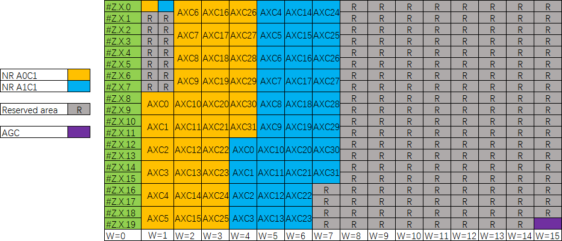
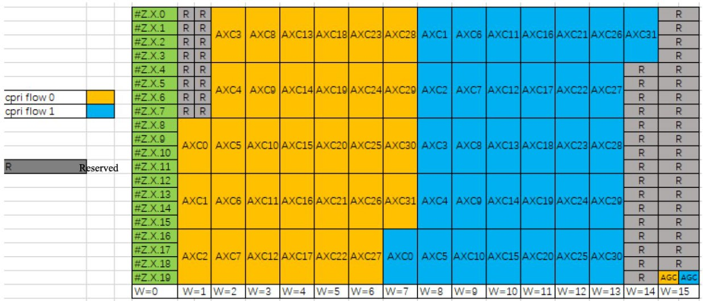

## O-RAN.WG7.IPC-HRD-Opt8.0-v03.00.docx

- View in [Reader Mode](https://simewu.com/spec-reader/pages/05-WG7/O-RAN.WG7.IPC-HRD-Opt8.0-v03.00.docx).
- Go back to [Table of Contents](../README.md).
- Download the [Original Document](https://github.com/Simewu/spec-reader/raw/refs/heads/main/documents/O-RAN.WG7.IPC-HRD-Opt8.0-v03.00.docx).

---

**O-RAN WG7**

**Hardware Reference Design Specification for Indoor Picocell**

**(FR1) with Split Architecture Option 8**

##### This is a re-published version of the attached final specification.

###### For this re-published version, the prior versions of the IPR Policy will apply, except that the previous requirement for Adopters (as defined in the earlier IPR Policy) to agree to an O-RAN Adopter License Agreement to access and use Final Specifications shall no longer apply or be required for these Final Specifications after 1st July 2022.

The copying or incorporation into any other work of part or all of the material available in this specification in any form without the prior written permission of O-RAN ALLIANCE e.V. is prohibited, save that you may print or download extracts of the material on this site for your personal use, or copy the material on this site for the purpose of sending to individual third parties for their information provided that you acknowledge O-RAN ALLIANCE as the source of the material and that you inform the third party that these conditions apply to them and that they must comply with them.

**O-RAN WG7**

**Hardware Reference Design Specification for Indoor Picocell**

**(FR1) with Split Architecture Option 8**

Copyright (C) 2021 by O-RAN ALLIANCE e.V.

By using, accessing or downloading any part of this O-RAN specification document, including by copying, saving, distributing, displaying or preparing derivatives of, you agree to be and are bound to the terms of the O-RAN Adopter License Agreement contained in the Annex ZZZ of this specification. All other rights reserved.

O-RAN ALLIANCE e.V.

Buschkauler Weg 27, 53347 Alfter, Germany Register of Associations, Bonn VR 11238 VAT ID DE321720189

Coyright (C) 2021 O-RAN ALLIANCE e.V. All Rights Reserved 1

# 1 Revision History

|  |  |  |  |
| --- | --- | --- | --- |
| **Date** | **Revision** | **Author** | **Description** |
| 07/12/2021 | v03.00 | WG7 | Final Published Version |

2

# 1 Contents

1. Revision History 2
2. Chapter 1 Introductory Material 8
3. 1.1 Scope 8
4. 1.2 References 8
5. 1.3 Definitions and Abbreviations 9
6. 1.3.1 Definitions 9
7. 1.3.2 Abbreviations 9
8. Chapter 2 Hardware Reference Design 1 13
9. 2.1 O-CU Hardware Reference Design 13
10. 2.2 O-DU8 Hardware Reference Design 13
11. 2.2.1 O-DU8 High-Level Functional Block Diagram 13
12. 2.2.2 O-DU8 Hardware Design Description 14
13. 2.2.3 O-DU8 Hardware Components 15
14. 2.2.3.1 Digital Processing Unit 15
15. 2.2.3.2 Hardware Accelerator 16
16. 2.2.3.2.1 Accelerator Design Solution 1 16
17. 2.2.3.2.2 Accelerator Design Solution 2 20
18. 2.2.3.2.3 Accelerator Design Solution 3 23
19. 2.2.3.2.4 Accelerator Design Solution 4 26
20. 2.2.3.3 Baseboard Management Controller 27
21. 2.2.4 Synchronization and Timing 27
22. 2.2.4.1 Synchronization and Timing Design 1 27
23. 2.2.4.2 Synchronization and Timing Design 2 28
24. 2.2.5 External Interface Ports 29
25. 2.2.6 O-DU8 Firmware 30
26. 2.2.7 Mechanical 31
27. 2.2.8 Power Unit 32
28. 2.2.9 Thermal 34
29. 2.2.10 Environmental and Regulations 34
30. 2.3 O-RU8 Hardware Reference Design 35
31. 2.3.1 O-RU8 High-Level Functional Block Diagram 35
32. 2.3.2 O-RU8 Hardware Components 35
33. 2.3.2.1 Digital Processing Unit 37
34. 2.3.2.2 RF Processing Unit 40
35. 2.3.2.2.1 Transceiver Reference Design 40
36. 2.3.2.2.2 Power Amplifier (PA) Reference Design 46
37. 2.3.2.2.3 Low Noise Amplifier (LNA) Reference Design 48
38. 2.3.2.2.4 RF Switch Reference Design 50
39. 2.3.2.2.5 Antenna Reference Design 53
40. 2.3.3 Synchronization and Timing 53
41. 2.3.4 External Interface Ports 58
42. 2.3.5 Mechanical 59
43. 2.3.6 Power Unit 60
44. 2.3.7 Thermal 61
45. 2.3.7.1 Environmental and Regulations 61
46. 2.4 FHGW8 Hardware Reference Design 62
47. 2.5 FHGW8 High-Level Functional Block Diagram 62
48. 2.6 FHGW8 Hardware Components 63
49. 2.6.1 Digital Processing Unit 63
50. 2.6.2 Synchronization and Timing 65
51. 2.6.3 External Interface Ports 66
52. 2.6.4 Mechanical 68

1 2.6.5 Power 68

1. 2.6.6 Thermal 69
2. 2.6.7 Environmental and Regulations 69
3. Annex 1 Parts Reference List 70
4. Annex 2 CPRI specification reference design Error! Bookmark not defined.
5. Annex 3 Option 8 CPRI spec reference design - Management plane 86
6. Annex ZZZ O-RAN Adopter License Agreement 179
7. Section 1: DEFINITIONS 179
8. Section 2: COPYRIGHT LICENSE 180
9. Section 3: FRAND LICENSE 180
10. Section 4: TERM AND TERMINATION 181
11. Section 5: CONFIDENTIALITY 181
12. Section 6: INDEMNIFICATION 181
13. Section 7: LIMITATIONS ON LIABILITY; NO WARRANTY 181
14. Section 8: ASSIGNMENT 182
15. Section 9: THIRD-PARTY BENEFICIARY RIGHTS 182
16. Section 10: BINDING ON AFFILIATES 182
17. Section 11: GENERAL 182

19

20 Tables

1. Table 2-1: The Processor Feature List 15
2. Table 2-2: The Memory Channel Feature List 15
3. Table 2-3: Accelerator Hardware Component List 17
4. Table 2-4: Accelerator Hardware Feature List 23
5. Table 2-5: Accelerator Firmware Feature List 24
6. Table 2-6: Accelerator Hardware Feature List 26
7. Table 2-7: Accelerator Firmware Feature List 26
8. Table 2-8: External Port List 29
9. Table 2-9: Power supply unit feature list 34
10. Table 2-10: Environmental Features 34
11. Table 2-11: Resource requirement for 2T2R O-RU8 37
12. Table 2-12: Resource requirement for 4T4R O-RU8 37
13. Table 2-13: Interface requirements of the Transceiver 40
14. Table 2-14: Payload with DPD in Digital Device (GBPS Rx/Tx) 41
15. Table 2-15: Payload with DPD in Transceiver (GBPS Rx/Tx) 41
16. Table 2-16: RF specifications in Transceiver 42
17. Table 2-17: PA Requirements 46
18. Table 2-18: Interface requirements of the transmit PA 47
19. Table 2-19: One stage LNA Requirements 48
20. Table 2-20: Two stage LNA Requirements 48
21. Table 2-21: Interface requirements of the RF switch 50
22. Table 2-22: RF Switch Requirements 51
23. Table 2-23: Antenna Requirements 53
24. Table 2-24: Interface requirements of the clocking 55
25. Table 2-25: Clocking RF requirements 55
26. Table 2-26: External Port List 58
27. Table 2-27: Power unit requirement for 2T2R and 4T4R O-RU8 60
28. Table 2-28: Power unit function 60
29. Table 2-29: Environmental Features 61
30. Table 2-30: Interface requirements of the FPGA 63
31. Table 2-31: FPGA Resource usage for FHGW8 64
32. Table 2-32: Requirements of the PLL device 65
33. Table 2-33: External Port List 66
34. Table 2-34: Requirements of the power unit 68

26

27 **Figures**

1. Figure 2-1: O-DU8 Functional Block Diagram 14
2. Figure 2-2: O-DU8 Hardware Block Diagram 15
3. Figure 2-3: Example 2-chip FPGA-based Hardware Acceleration in O-DU8 19
4. Figure 2-4: Example of 1-chip FPGA-based Hardware Acceleration in O-DU8 20
5. Figure 2-5: Example of Accelerator Design 22
6. Figure 2-6: Accelerator Design 1 without optional NIC Device 25
7. Figure 2-7: Accelerator Design 1 with optional NIC Device 25
8. Figure 2-8: Structured ASIC Accelerator Design 26
9. Figure 2-9: Structured ASIC Accelerator Design 27
10. Figure 2-10: O-DU8 Timing Synchronization 28
11. Figure 2-11: HW Acceleration Board Timing and Synchronization 29
12. Figure 2-12: External interfaces reference design 30
13. Figure 2-13: Mother Board Layout Diagram 31
14. Figure 2-14: Chassis Mechanical Diagram 32
15. Figure 2-15: High-Level Functional Block Diagram 35
16. Figure 2-16: 2T2R General Block Diagram with TR switch 36
17. Figure 2-17: 4T4R General Block Diagram with TR switch 36
18. Figure 2-18: Power estimation for 2T2R O-RU8 38
19. Figure 2-19: Power estimation for 4T4R O-RU8 38
20. Figure 2-20: FPGA Reference Design Diagram 39
21. Figure 2-21: Transceiver Reference Design Diagram (Optional elements are highlighted in Grey) 45
22. Figure 2-22: PA Reference Design Diagram 47
23. Figure 2-23: One Stage LNA Diagram 49
24. Figure 2-24: Two-Stage LNA Diagram 50
25. Figure 2-25: RF Switch Reference Design Diagram 52
26. Figure 2-26: Whip Antenna 53
27. Figure 2-27: PLL Reference Design Diagram 57
28. Figure 2-28: SFP+ case and connector 58
29. Figure 2-29: RJ45 interface 59
30. Figure 2-30: O-RU8 Shell Mechanical Diagram 59
31. Figure 2-31: POE Reference Design Diagram 61
32. Figure 2-32: FHM8 General Block Diagram 62
33. Figure 2-33: FHM8 Digital Processing Block Diagram 64
34. Figure 2-34: CLK reference design for FHM8 65
35. Figure 2-35: SFP+ case and connector 66
36. Figure 2-36: RJ45 interface 67
37. Figure 2-37: AC power interface 67
38. Figure 2-38: Shell Mechanical Diagram 68

27

# 1 Chapter 1 Introductory Material

## 1.1 Scope

1. This Technical Specification has been produced by the O-RAN.org.
2. The contents of the present document are subject to continuing work within O-RAN WG7 and may change following
3. formal O-RAN approval. Should the O-RAN.org modify the contents of the present document, it will be re-released by
4. O-RAN Alliance with an identifying change of release date and an increase in version number as follows:
5. Release x.y.z
6. where:
7. x the first digit is incremented for all changes of substance, i.e. technical enhancements,
8. corrections, updates, etc. (the initial approved document will have x=01).
9. y the second digit is incremented when editorial only changes have been incorporated in the
10. document.
11. z the third digit included only in working versions of the document indicating incremental
12. changes during the editing process. This variable is for internal WG7 use only.
13. The present document specifies system requirements and high-level architecture for the FR1 Picocell Indoor
14. deployment scenario as specified in the Deployment Scenarios and Base Station Classes document [1].
15. In the main body of this specification (in any "chapter") the information contained therein is informative, unless
16. explicitly described as normative. Information contained in an "Annex" to this specification is always informative
17. unless otherwise marked as normative.

## 1.2 References

1. The following documents contain provisions which, through reference in this text, constitute provisions of the present
2. document.
3. [1] ORAN-WG7.DSC.0-V01.00 Technical Specification, 'Deployment Scenarios and Base Station Classes for White
4. Box Hardware'. <https://www.o-ran.org/specifications>
5. [2] 3GPP TR 21.905: "Vocabulary for 3GPP Specifications".
6. [3] 3GPP TR 38.104: "NR; Base Station (BS) radio transmission and reception".
7. [http://www.3gpp.org/ftp//Specs/archive/38\_series/38.104/38104-g10.zip](http://www.3gpp.org/ftp/Specs/archive/38_series/38.104/38104-g10.zip)
8. [4] ORAN-WG4.CUS.0-v03.00 Technical Specification, 'O-RAN Fronthaul Working Group Control, User and
9. Synchronization Plane Specification'. <https://www.o-ran.org/specifications>
10. [5] 3GPP TS 38.113:"NR: Base Station (BS) Electromagnetic Compatibility (EMC)".
11. [http://www.3gpp.org/ftp//Specs/archive/38\_series/38.113/38113-f80.zip](http://www.3gpp.org/ftp/Specs/archive/38_series/38.113/38113-f80.zip)
12. [6] ORAN-WG7. IPC. HAR-v01.00 Technical Specification, 'Indoor Pico Cell Hardware Architecture and
13. Requirement Specification'. [https://www.o-ran.org/specifications.](https://www.o-ran.org/specifications)
    1. [7] ORAN.WG7. IPC-HRD-Opt7-2.0-v03.00 Technical Specification, 'Indoor Pico Cell BS Hardware Reference
    2. Design Specifications with Fronthaul Split Option 7-2 and FR1'. <https://www.o-ran.org/specifications> 3

## 1.3 Definitions and Abbreviations

### 1.3.1 Definitions

1. For the purposes of the present document, the terms and definitions given in 3GPP TR 21.905 [1] and the following
2. apply. A term defined in the present document takes precedence over the definition of the same term, if any, in 3GPP
3. TR 21.905 [2]. For the base station classes of Pico, Micro and Macro, the definitions are given in 3GPP TR 38.104 [3].
4. **Carrier Frequency:** Center frequency of the cell.
5. **F1 interface:** The open interface between O-CU and O-DU8 as defined by 3GPP TS 38.473 between CU and DU.
6. **Integrated architecture:** In the integrated architecture, the O-RU and O-DUx are implemented on one platform. Each
7. O-RU and RF front end is associated with one O-DU8. They are then aggregated to O-CU and connected by F1
8. interface.
9. **Split architecture:** The O-RUx and O-DUx are physically separated from one another in this architecture. A switch

15 may aggregate multiple O-RUxs to one O-DUx. O-DUx switch and O-RUxs are connected by the fronthaul interface as

1. defined in WG4.
2. **Transmission Reception Point (TRxP**): Antenna array with one or more antenna elements available to the network
3. located at a specific geographical location for a specific area.

### 1.3.2 Abbreviations

1. For the purposes of the present document, the abbreviations given in [2] and the following apply. An abbreviation
2. defined in the present document takes precedence over the definition of the same abbreviation, if any, as in [2].
3. 7-2 Fronthaul interface split option as defined by O-RAN WG4, also referred to as 7-2x
4. 3GPP Third Generation Partnership Project
5. 5G Fifth-Generation Mobile Communications
6. 5GC 5G Core
7. ACS Adjacent Channel Selectivity
8. ADC Analog to Digital Converter
9. ASIC Application Specific Integrated Circuit
10. ATA Advanced Technology Attachment
11. BBDEV Baseband Device
12. BH Backhaul
13. BMC Baseboard Management Controller
14. BPSK Binary Phase Shift Keying
15. BS Base Station

|  |  |  |
| --- | --- | --- |
| 1 | CISPR | International Special Committee on Radio Interference |
| 2 | CFR | Crest Factor Reduction |
| 3 | CU | Centralized Unit as defined by 3GPP |
| 4 | COM | Cluster Communication |
| 5 | CPRI | Common Public Radio Interface |
| 6 | CPU | Central Processing Unit |
| 7 | CRC | Cyclic Redundancy Check |
| 8 | DAC | Digital to Analog Converter |
| 9 | DDC | Digital Down Conversion |
| 10 | DDR | Double Data Rate |
| 11 | DIMM | Dual-Inline-Memory-Modules |
| 12 | DL | Downlink |
| 13 | DPD | Digital Pre-Distortion |
| 14 | DPDK | Data Plane Development Kit |
| 15 | DSP | Digital Signal Processor |
| 16 | DU | Distributed Unit as defined by 3GPP |
| 17 | DUC | Digital Up Conversion |
| 18 | ECC | Error Correcting Code |
| 19 | eCPRI | evolved Common Public Radio Interface |
| 20 | EMC | Electro Magnetic Compatibility |
| 21 | EVM | Error Vector Magnitude |
| 22 | FCC | Federal Communications Commission |
| 23 | FEC | Forward Error Correction |
| 24 | FFT | Fast Fourier Transform |
| 25 | FH | Fronthaul |
| 26 | FHGW | Fronthaul Gateway |
| 27 | FHMx | Fronthaul Multiplexer with no FH protocol translation, supporting an O-DUx with split option x |
| 28 |  | and an O-RUx with split option x, with currently available options 6?6, 7-2?7-2 and 8?8 |
| 29 | FHGWx?y | Fronthaul Gateway that can translate fronthaul protocol from an O-DUx with split option x to an |
| 30 |  | O-RUy with split option y, with currently available option 7-2?8. |
| 31 | FHHL | Full Height Half Length |
| 32 | FPGA | Field Programmable Gate Array |
| 33 | GbE | Gigabit Ethernet |
| 34 | GNSS | Global Navigation Satellite System |
| 35 | GPP | General Purpose Processor |
| 36 | GPS | Global Positioning System |
| 37 | HARQ | Hybrid Automatic Repeat request |
| 38 | HHHL | Half Height Half Length |
| 39 | IEEE | Institute of Electrical and Electronics Engineers |
| 40 | IFFT | Inverse Fast Fourier Transform |
| 41 | IMD | Inter Modulation Distortion |

|  |  |  |
| --- | --- | --- |
| 1 | I/O | Input/Output |
| 2 | JTAG | Joint Test Action Group |
| 3 | L1 | Layer 1 |
| 4 | LDPC | Low-Density Parity Codes |
| 5 | LRDIMM | Load-Reduced Dual In-line Memory Module |
| 6 | LTE | Long Term Evolution |
| 7 | LVDS | Low-Voltage Differential Signaling |
| 8 | MAC | Media Access Control |
| 9 | MCP | Multi-Chip Package |
| 10 | MH | Midhaul |
| 11 | MIG | Memory Interface Generator |
| 12 | MII | Media-Independent interface |
| 13 | MIMO | Multiple Input Multiple Output |
| 14 | MU-MIMO | Multiple User MIMO |
| 15 | NEBS | Network Equipment-Building System |
| 16 | NetConf | Network Configuration Protocol |
| 17 | NFV | Network Functions Virtualization |
| 18 | NIC | Network Interface Controller |
| 19 | NR | New Radio |
| 20 | O-CU | O-RAN Centralized Unit as defined by O-RAN |
| 21 | O-DUx | A specific O-RAN Distributed Unit having fronthaul split option x where x may be 6, 7-2 (as |
| 22 |  | defined by WG4) or 8 |
| 23 | O-RUx | A specific O-RAN Radio Unit having fronthaul split option x, where x is 6, 7-2 (as defined by |
| 24 |  | WG4) or 8, and which is used in a configuration where the fronthaul interface is the same at the O- |
| 25 |  | DUx |
| 26 | OCXO | Oven Controlled Crystal Oscillator |
| 27 | PCIe | Peripheral Component Interface Express |
| 28 | PDCP | Packet Data Convergence Protocol |
| 29 | PHY | Physical Layer |
| 30 | PMBus | Power Management Bus |
| 31 | POE | Power over Ethernet |
| 32 | PPS | Pulse Per Second |
| 33 | PRACH | Physical Random Access Channel |
| 34 | QAM | Quadrature Amplitude Modulation |
| 35 | QPSK | Quadrature Phase Shift Keying |
| 36 | QSFP | Quad Small Form-factor Pluggable |
| 37 | RAN | Radio Access Network |
| 38 | RDIMM | Registered Dual In-line Memory Module |
| 39 | RF | Radio Frequency |
| 40 | RoE | Radio over Ethernet |
| 41 | RU | Radio Unit as defined by 3GPP |

|  |  |  |
| --- | --- | --- |
| 1 | RX | Receiver |
| 2 | SATA | Serial ATA |
| 3 | SDU | Service Data Unit |
| 4 | SFP | Small Form-factor Pluggable |
| 5 | SFP+ | Small Form-factor Pluggable plus |
| 6 | SOC | System On Chip |
| 7 | SPI | Serial Peripheral Interface |
| 8 | SSD | Solid State Drive |
| 9 | TCXO | Temperature Compensate Crystal Oscillator |
| 10 | TDP | Thermal Design Power |
| 11 | TR | Technical Report |
| 12 | TS | Technical Specification |
| 13 | TX | Transmitter |
| 14 | UL | Uplink |
| 15 | USB | Universal Serial Bus |
| 16 | WG | Working Group |

# 1 Chapter 2 Hardware Reference Design 1

1. This chapter describes a white box hardware reference design example for indoor Picocell deployment scenario. It
2. includes O-CU, O-DU8 O-RU8, and FHM8 for IPC deployment scenario.

## 2.1 O-CU Hardware Reference Design

1. The O-CU white box hardware is the platform that perform the O-CU function of upper l2 and l3. The hardware
2. systems specified in this document meet the computing, power and environmental requirements of use cases
3. configurations and feature sets of RAN physical node. These requirements are described in the hardware architecture
4. and requirement specification [6] as well as in the use cases document [1]. The O-CU hardware includes the chassis
5. platform, mother board, peripheral devices and cooling devices. The mother board contains processing unit, memory,
6. the internal I/O interfaces, and external connection ports. The midhaul (MH) and backhaul (BH) interface are used to
7. carry the traffic between O-CU and O-DU8 as well as O-CU and core network. The other hardware functional
8. components include: the storage for software, hardware and system debugging interfaces, board management controller,
9. just to name a few; the O-CU designer will make decision based on the specific needs of the implementation.
10. The HW reference design of O-CU is the same as o-du8 except for the need of HW accelerator, thus detail design will
11. be described in o-du8 section 2.2.

## 2.2 O-DU8 Hardware Reference Design

1. The O-DU8 white box hardware is the platform that performs the DU function of L1 and lower L2. The hardware
2. systems specified in this document meet the computing, power and environmental requirements of use cases
3. configurations and feature sets of RAN physical node. These requirements are described in the early hardware
4. requirement specification as well as in the use cases document. The O-DU8 hardware includes the chassis platform,
5. mother board, peripheral devices and cooling devices. The mother board contains processing unit, memory, the internal
6. I/O interfaces, and external connection ports. The fronthaul and backhaul interface are used to carry the traffic between
7. O-RU8/FHM8 and O-DU8 as well as O-CU and O-DU8. The O-DU8 design may also provide an interface for hardware
8. accelerator if that option is preferred. The other hardware functional components include: the storage for software,
9. hardware and system debugging interfaces, board management controller, just to name a few; the O-DU8 designer will
10. make decision based on the specific needs of the implementation.
11. Note that the O-DU8 HW reference design is also feasible for O-CU and integrated O-CU/ O-DU8.

### 2.2.1 O-DU8 High-Level Functional Block Diagram

1. Figure 2-1 shows the major functional blocks of O-DU8. The digital processing unit handles the baseband processing
2. workload. To make the processing more efficient, an accelerator can be used to assist with the baseband workload
3. processing. The memory devices include the random-access memory (RAM) for temporary storage of data while flash
4. memory is used for codes and logs. The storage device is for persistent storage. The external network cards can be used
5. for fronthaul or backhaul connection. The baseboard management controller (BMC) is a microcontroller which
6. monitors hardware operation on motherboard. The clock circuits provide digital processing unit with required clock
7. signals.

Clock

Ethernet Card

Storage Drives

Baseboard Management Controller

Flash Memory

DDR RAM

Accelerator

Digital Processing Unit

4

1. **Figure 2-1: O-DU8 Functional Block Diagram.**

### 2.2.2 O-DU8 Hardware Design Description

1. Figure 2-2 describes the components and connections inside the O-DU8 white box.

8

1. Figure 2-2: O-DU8 Hardware Block Diagram
2. As described in the previous section, the O-DU8 hardware can be implemented with difference design choices. Here, a
3. system-on-a-chip (SoC) based design is presented as an example which processes most of the O-DU8 workload. The
4. accelerator can be used to perform some O-DU8 workload functions based on the overall performance requirement.
5. Several Ethernet controllers are used for front haul link, back haul link and remote console control connection. The
6. other parts include: RAM, flash memory, and hard drive storage. The JTAG and USB ports are provided for hardware
7. debug and local connection if needed. Figure 2-2 describes the components and connections of O-DU8 hardware.
8. Finally, BMC block is mainly responsible for monitoring the hardware status.

### 2.2.3 O-DU8 Hardware Components

1. In this section, the details of the O-DU8 hardware component's requirements, features and parameters are described.
2. The components selection is based on the use case requirements which are listed in the hardware architecture and
3. requirements document [6].
4. 2.2.3.1 Digital Processing Unit
5. This example of the digital processing unit in O-DU8 is based on the General Purpose Processor (GPP).
6. ***a. Digital Processing Unit Requirement***
7. The GPP requirements are listed in the following table.
8. Table 2-1: The Processor Feature List

|  |  |
| --- | --- |
| **Item Name** | **Description** |
| # of Cores | 16 |
| # of Threads | 32 |
| Base Frequency | 2.20 GHz |
| Max Turbo Frequency | 3.00 GHz |
| Cache | 22 MB |
| Thermal Design Power (TDP) | 100W |
| Max Memory Size (dependent on memory type) | 512 GB |
| Memory Types | DDR4 |
| Max # of Memory Channels | 4 |

18

1. The interface specifications on the main board are as follows:
2. **Memory Channel Interfaces:** The system memory capacity, type and related information are described in the
3. following table.

22

23 Table 2-2: The Memory Channel Feature List

|  |  |
| --- | --- |
| **Item Name** | **Description** |
| Memory Types | DDR4 |
| # of Memory Channels | 4 |
| ECC LRDIMM | Up to 512GB |
| ECC RDIMM | Up to 256GB |
| Memory Speed | 2666/2400/2133MHz |

|  |  |
| --- | --- |
| DIMM Sizes | 128GB, 64GB, 32GB, 16GB |
| Memory Voltage | 1.2 V |

1

1. **PCIe:** PCIe Gen 3 should be supported by the processor. There are total of 32 PCIe lanes with 128 Gb/s
2. bandwidth. The 32 PCIe lanes can be divided into two x16 slots by using a riser card.
3. **Ethernet:** The system should be capable to offer aggregated 48 Gb/s Ethernet bandwidth. The breakout the
4. ports are discussed in later section. When higher Ethernet bandwidth required, an Ethernet card can be
5. installed in one of the PCIe slot.
6. ***b. Digital Processing Unit Design***
7. The digital processing unit is a SoC device which is a 64-bit multi-core server class processor. This SoC
8. includes an integrated Platform Controller Hub (PCH), integrated high-speed I/O, Integrated Memory
9. Controllers (IMC), and four integrated 10 Gigabit Ethernet ports.
10. The SOC supports 512-bit wide vector processing instruction set. It also supports hardware virtualization to
11. enable dynamic provisioning of services as communication service providers extend network functions
12. virtualization (NFV). Figure 2-2 shows the major functional blocks of the digital processing unit.
13. 2.2.3.2 Hardware Accelerator
14. Hardware accelerators can be used in O-DU8 to offload computationally intensive functions and to optimize the
15. performance under varying traffic and loading conditions. The acceleration functional requirements and implementation
16. are system designer's choice; however, the O-DU8 shall meet the minimum system performance requirements under
17. various loading and deployment conditions. In most cases, a Field Programmable Gate Array (FPGA) or Application
18. Specific Integrated Circuit (ASIC) based PCIe card can be used to optimize the system performance. The FPGA(s) are
19. part of a Network Interface Controller (NIC) that further provides connectivity services.

###### 2.2.3.2.1 Accelerator Design Solution 1

1. The O-DU8 system is typically implemented using a multi-core processor and one or more hardware accelerators. Parts
2. of O-DU8 protocol stack can be implemented in software running on the multi-core processors, some of the
3. computationally intensive L1 and L2 functions are offloaded to FPGA-based or similar hardware accelerators. This is a
4. programmable hardware, which provides both flexibility and high computing capabilities.
5. *a. Accelerator Requirements*
6. The accelerator unit comprises one or more FPGAs (e.g., two FPGAs), sufficient amount of DDR4 memory,
7. and synchronization circuitry where one of FPGAs is used for L1 functional offload and the other one is used
8. to perform fronthaul connectivity functions/protocols. The FPGA for L1 offload uses dedicated cores for
9. channel encoding/decoding as well as FPGA and processing resources for running L1 functions such as but not
10. limited to rate matching and de-matching, interleaving and scrambling, demodulation and HARQ buffer
11. management as well as OFDM modulation/demodulation and channel estimation.
12. Key features of the FPGA-based accelerator include:
13. ? 2X10/25G CPRI or RoE fronthaul interface
14. ? Built-in SyncE/IEEE1588v2 synchronization + external reference timing
15. ? L1 offloading options
16. - LDPC encoding and decoding
17. - Polar encoding and decoding
18. - HARQ management with on board DDR memory (including DDR controller and interfaces)
19. - Other L1 offloading candidates include PRACH detection, MIMO encoding and decoding,
20. channel estimation
21. - Partial or full L1 functions can be offloaded. It is recommended to offload the user-plane
22. channel coding chain and part of or the entire control-plane channel coding chain to the
23. hardware accelerator.
24. ? PCIe Gen3 x16, two Gen4 x8, or PCIe Gen3 x16 bifurcated to two Gen3 x8
25. ? GPP supported
26. ? Standard PCIe FHHL card (It is assumed that the hardware accelerators further perform NIC functions).
27. ? 8GB DDR4 memory for buffering
28. ? Power consumption not to exceed 75W
29. The accelerator requirements in hardware have been summarized inTable 2-3.
30. Table 2-3: Accelerator Hardware Component List

|  |  |  |
| --- | --- | --- |
| **Item Name** | **Description for FPGA 1** | **Description for FPGA 2** |
| SoC Resources | System Logic cells - 930K CLB LUT - 425K  SDFEC -8  DSP Slices - 4,272 BRAM - 38.0Mb URAM - 22.5Mb | System Logic cells - 1,143K CLB LUT - 523K  CLB Flip-Flops -1,045K DSP Slices - 1,968 BRAM - 34.6Mb  URAM - 36.0Mb |
| Form Factor | FHHL PCIe Form Factor | |
| PCIe Interface | x8 Gen1, Gen2, Gen3 interface to FPGA2 and  x8 Gen1, Gen2, Gen3 interface to FPGA1 have x16 to two x8 bifurcation | |
| On Board Memory | FPGA1 | FPGA2 |
| Total Capacity 4 GB in PL, upgradeable to 8GB Total Capacity 2 GB in PS, upgradeable to 4GB | Total Capacity 4 GB in PL, upgradeable to 8GB Total Capacity 2 GB in PS, upgradeable to 4GB |
| Network Interface(s) | N/A | 2xSFP28 optical interfaces to FPGA2  (User Configurable, includes 10/25 Ethernet) |
| Other External Interface(s) | Micro USB for JTAG support (FPGA programming and debug) and access to BMC | |
| Graphical User interface | GUI for monitoring the basic board parameters, monitoring temperature alerts, firmware upgrades for BMC | |

|  |  |
| --- | --- |
| Board Management Controller | * Power sequencing and reset * Field upgrades * FPGA configuration and control * Clock configuration * I2C bus access * USB 2.0 |
| Operating Temperature | -5?C - 55?C |
| Power | < 75 W |
| Clocking Options | Low-Jitter, configurable clock ranging from10MHz to 750MHz  1 PPS input and output with assembly option for OCXO and TCXO |

1

* 1. The following are the accelerator requirements in function and interface.
  2. **Functional offload requirements**
  3. One of the candidate functions for offloading is the LDPC encoder and decoder, which typically consists of
  4. computationally intensive and relatively highly power-consuming functions. It must be noted that neither
  5. software implementation in CPU nor soft FPGA logic implementation would provide a highly power-efficient
  6. solution while meeting/exceeding 3GPP NR user-plane encoder/decoder throughput and latency requirements,
  7. rather a hardened implementation of the FEC functions would be very power efficient. Downlink and uplink
  8. throughputs of up to 40Gbps and 18Gbps, respectively, are shown feasible with this architecture. Other
  9. candidate L1 functions for acceleration include CRC generation, segmentation, bit-level/sub-block interleaving
  10. and scrambling as well as FFT/IFFT processing, for which an FPGA can be used.
  11. For other symbol processing L1 functions, which require heavy multiply and accumulation operations, FPGAs
  12. 1 and 2 have DSP blocks that can efficiently perform these operations. Polar encoding and/or decoding on the
  13. control-plane can also be offloaded to FPGA1 resulting in high throughputs and low latencies.
  14. **Interface requirements**
  15. **- PCIe:** PCIe interface is widely used to provide interface between the GPP and hardware accelerators. FPGA
  16. devices have dedicated PCIe hard IP which facilitate implementation and quick setup of PCIe interface. They
  17. support both PCIe Gen3 x16 or PCIe Gen4 x8, which allow the FPGA device to interface with any GPP
  18. supporting either PCIe Gen3 x16 or PCIe Gen4 x8 interface.
  19. **- Fronthaul:** FPGA devices can support various speed grades and any fronthaul protocols, customers can use
  20. off-the-shelf CPRI or RoE IPs to quickly implement and configure any fronthaul interface protocol.
  21. **- Serial transceivers:** FPGA devices have SerDes resources to implement various connectivity speeds (e.g.,
  22. 33 Gb/s) per SerDes, 10G/25G CPRI, 10G/25G/50G/100G Ethernet connections can use these SerDes
  23. resources.
  24. **- Ethernet MAC speed:** FPGA devices have hardened implementations of Ethernet MAC that support speeds
  25. of 100 Gb/s and above. The Ethernet MAC IP allows power-efficient implementation of high speed Ethernet
  26. connectivity. In the example shown in Figure 2-3, FPGA 1 and FPGA 2 can use the hard 100Gbps MAC IPs to
  27. connect each other, allowing the L1 and fronthaul functions to be distributed across these two FPGAs with less

1. connectivity overhead. For other Ethernet MACs such as 10G/25G Ethernet, they provide soft Ethernet MAC
2. IPs, so when implementing CPRI or RoE fronthaul functions, 10G/25G Ethernet MAC can be used.
3. *b. Accelerator Design*
4. The hardware accelerator supports GPP. Figure 2-3 illustrates a two-chip acceleration architecture comprising
5. two FPGAs with multi-lane PCIe interfaces toward the CPU and external connectivity toward O-RU8(s) via
6. CPRI/RoE and O-CU(s) through GbE connectivity. The example architecture further depicts multi-lane Gen3
7. or Gen4 PCIe interfaces between each FPGA and the CPU. The FPGAs communicate through high-bandwidth
8. Ethernet (GbE) transport.

**CPU**

**(L2 and L1)**

t

F1 Interface

GbE (10/25G)

|  |  |
| --- | --- |
| **FPGA1**  **(L1 Offload)** | |
|  | Inter-Chip Interface 100G Etherne |
| **FPGA2**  **(Connectivity)** | |

PCIe Interface PCIe Gen3x16 (Gen4x8)

9 100G

Fronthaul Interface 10/25G CPRI/RoE

10 **Figure 2-3: Example 2-chip FPGA-based Hardware Acceleration in O-DU8**

###### 2.2.3.2.2 Accelerator Design Solution 2

1. This section illustrates a one-chip acceleration architecture comprising one FPGA with PCIe interfaces toward the CPU
2. and external connectivity toward O-RU8(s). The example architecture further depicts Gen3 PCIe interfaces (for
3. example, or Gen4) between FPGA and the CPU.
4. An example one-chip FPGA-based hardware acceleration architecture is shown in Figure 2-4.

O-DU

CPU

FPGA

PCIe Interface

Gen3x16

Fronthaul Interface

CPRI(25G/10G)

Backhaul Interface

10G

Accelerator

extra power supply

12V (possible)

GNSS

1588+syncE

POWER UNIT

6

1. Figure 2-4: Example of 1-chip FPGA-based Hardware Acceleration in O-DU8
2. *a. Accelerator Requirement*
3. The accelerator unit comprises one or more FPGAs (e.g., two FPGAs), sufficient amount of DDR4 memory,
4. and synchronization circuitry where one of FPGAs is used for L1 functional offload and the other one is used
5. to perform fronthaul connectivity functions/protocols. The FPGA for L1 offload uses dedicated cores for
6. channel encoding/decoding as well as FPGA and processing resources for running L1 functions such as but not
7. limited to rate matching and de-matching, interleaving and scrambling, demodulation and HARQ buffer
8. management as well as OFDM modulation/demodulation and channel estimation.
9. Key features of the FPGA-based accelerator include:
10. ? 4X25G/10G CPRI optical interface
11. ? 1x10G Ethernet optical interface
12. ? Support GNSS/IEEE1588v2+syncE reference timing
13. ? L1 offloading options
14. - LDPC encoding and decoding
15. - HARQ management
16. - Other optional L1 offloading such as FFT/IFFT, CP, CRC, rate matching, PRACH detection.
17. ? PCIe Gen3X16, 4 hard IP blocks
18. ? FHHL form factor and operation temperature from -5? to +55?
19. ? 2GB DDR4 memory for Buffering
20. ? Specific power supply design is required with 1-chip FPGA, since the maximum power consumption of
21. PCIe specification (75w) could be exceeded, additional external auxiliary power may be required.
22. **Functional offload requirements**
23. **- L1 offloading:** One of the functions for L1 offloading is the LDPC encoder and decoder, which typically
24. consists of computationally-intensive and relatively highly power-consuming functions. Other L1 functions for
25. acceleration include CRC generation, CP, PRACH detection and rate matching as well as FFT/IFFT
26. processing.
27. **- Fronthaul:** The data transmission and protocol processing of fronthaul interface is completed on the FPGA
28. device.
29. **Interface requirements**
30. **- PCIe:** PCIe interface is widely used to provide interface between the CPU and hardware accelerators. FPGA
31. device has dedicated PCIe hard IP which facilitate implementation and quick setup of PCIe interface. FPGA
32. support PCIe Gen3 x16, which allow the FPGA device to interface with any CPU supporting either PCIe Gen3
33. x16 interface.
34. **- Fronthaul:** FPGA device can support various speed grades and CPRI protocol for fronthaul interface
35. between O-DU8 and O-RU8.
36. **- Backhaul:** FPGA device can support backhaul interface between O-DU8 and core network function with an
37. 10G optical interface.
38. **- Synchronization:** Accelerator has external interfaces to support synchronization, including GNSS,
39. IEEE1588v2 and SyncE reference timing.
    1. *b. Accelerator Design*

2

1588/GPS

1PPS

PCIE

PCIe

AUX\_POWER

12V

12V

DC/DC

Positive hot swap controller

EN

GNSS ANT

SMA

OSC

JTAG

Mixer

QSPI\_Flash

Clock Chip

DDR4

FPGA

1PPS

Power Supply Sequencer and Monitor

MCU

RJ45

LED

4\*25G

Fronthaul

10G

Backhaul

**O-DU server**

3 Figure 2-5: Example of Accelerator Design

1. Figure 2-5 shows the accelerator design, description of block diagram of board card:
2. **12V power:** The maximum power consumption of the whole card is estimated to exceed 75W. The PCIe
3. cannot meet the power consumption demand, so it needs an external 12V auxiliary power supply. The extra
4. power consumption can be included by the power unit of O-DU8. Only power cord is needed, and it has no
5. effect on the whole machine design. This part is not necessary if there are future optimizations.
6. **DC/DC:** The module contains all the power sources used in the system.
7. **Power Supply Sequencer and Monitor:** Since the system has the power on timing requirement, this module
8. controls the output of each DC/DC to realize the normal power on/off of the system.
9. **Mixer and GNSS antenna:** The system uses an external antenna, which can be placed outdoors to improve
10. the receiving sensitivity of synchronizing signal. After mixer's processing of the received signal, the signal
11. source of 1pps is output to clock chip for system input synchronous clock signal.
12. **MCU (micro control unit):** As the auxiliary processor of the board card, MCU realizes the temperature
13. detection of the board card, the operation state indication and the configuration of power monitor and clock
14. chip in the initialization process, and real-time monitoring of the working state of each module, exception
15. handling and other functions.
16. **Clock chip:** The chip realizes system-level clock input, which can synchronously output all kinds of clocks for
17. clock synchronization of subordinate modules.
18. **FPGA:** As the core chip of the board card, FPGA forwards the data of the downlink of the core network and
19. the uplink data gathered at the O-RU8(s), and interacts with the O-DU8 server through PCIe x16 to complete
20. the calculation of 5G NR data.

###### 2.2.3.2.3 Accelerator Design Solution 3

1. Channel coding for LDPC and fronthaul compression requires a significant amount of bit level processing and is well
2. suited to a fine-grained FPGA architecture and/or low cost/power structured ASIC. Options include:
3. ? Look-aside FEC: LDPC (de)coding, Polar (de)coding, Rate (De)Matcher, (De) Interleaver, CRC, HARQ
4. ? L1 Processing: (i)FFT & CP+/-, PRACH, channel estimation & beamforming
5. ? Bump-in-wire Fronthaul: compression / decompression for latency and bandwidth reduction
6. *a. Accelerator Requirement*
7. Hardware requirements are listed in Table 2-4.
8. Table 2-4: Accelerator Hardware Feature List

|  |  |
| --- | --- |
| **Item Name** | **Description** |
| PCIe (Interface with digital processing unit) | Gen4 x16 (and lower) |
| Form factor | FHHL |
| Connectivity | 2x QSFP28/56 |
| FPGA | Logic Elements: 1437K  M20K Memory: 139Mb |

|  |  |
| --- | --- |
|  | Quad-core GPP Hard Processor Sub-system |
| NIC Device | 100Gb xHAUL for FH, BH & MH traffic shaping. Optional FPGA co-processing. |
| DDR Main | 8+8+1GB DDR4 |
| Flash (FPGA images) | >=1 Gbit |
| BMC | Telemetry, Security, remote upgrade |
| Clocking | For O-RAN C1, C2, C3 & C4 |
| Fronthaul | CPRI |
| GPS | SMA for 1PPS & 10MHz (in/out) |
| Operating Temperature (ambient) | NEBS Compliant |
| Power | <75W (without optional NIC device) |
| Clock Accuracy | Low-Jitter, configurable clock ranging from 10MHz to 750MHz. Option for OCXO (TCXO as standard) |

1

* 1. Firmware Requirements are listed in Table 2-5.
  2. Table 2-5: Accelerator Firmware Feature List

|  |  |
| --- | --- |
| **Item Name** | **Description** |
| Remote system upgrade | Securely upgradable FPGA flash image |
| Queuing | 64 Queues supported equally split between UL & DL. |
| LDPC Acceleration | NR LDPC Encoding with, interleaving and rate-matching.  NR LDPC Decoding with sub-block de-interleaving function of reverse rate matching.  Early Termination, CRC attachment and HARQ buffering. 5G Throughput: DL 14.8Gbps, UL 3.2Gbps |
| Load Balancing (channel coding) | Load balancer distributes the pending encoder/decoder requests to encoder/decoders |
| Descriptor Format (channel coding) | Code block based interface.  Software enablement by BBDEV API (DPDK) <https://www.dpdk.org/> <https://doc.dpdk.org/guides/prog_guide/bbdev.html> |
| Fronthaul Compression | In-line compression/decompression for Mu-Law, block-floating point and quantization according to the O-RAN WG4 specification. |
| Open programmable acceleration | Support for: |

|  |  |
| --- | --- |
| environment | * FPGA Flashing upgrade * Firmware version reporting * PCIe diagnostics * Ethernet diagnostics * Temperature and voltage telemetry information |

1

1. *b. Accelerator Design*
2. Accelerator design solution 3 has 2 options as shown in the figures below.

PCIe Gen 4x16 Or lower (200G)

**FPGA**

Connectivity & L1 Processing.

C1,2,3,4 Sync

**Digital Processing Unit**

L3,L2,L1(part)

FH 2x2x56Gbps Or lower

1PPS & 10MHz SMA

4

5 Figure 2-6: Accelerator Design 1 without optional NIC Device

6

1. The accelerator with optional NIC device.

FH 2x2x56Gbps Or lower

**FPGA**

PCIe

Gen4x16

PCIe Gen 4x8

Or lower (100G)

Connectivity & L1 Processing.

C1,2,3,4 Sync

1PPS & 10MHz

SMA

100Gb

**NIC**

**Digital Processing Unit**

L3,L2,L1(part)

PCIe Gen 4x8 Or lower (100G)

8

1. Figure 2-7: Accelerator Design 1 with optional NIC Device

1

PCIe Gen 3x16 Or lower (100G)

**Structured ASIC**

LDPC

Code/Transport Block

**Digital Processing Unit**

L3,L2,L1(part)

2

1. **Figure 2-8: Structured ASIC Accelerator Design**

###### 2.2.3.2.4 Accelerator Design Solution 4

1. Channel coding for LDPC and fronthaul compression requires a significant amount of bit level processing and is well
2. suited to a fine-grained structured ASIC. Features include:
3. ? Look-aside FEC: Turbo (de)coding, LDPC (de)coding, Rate (De)Matcher, (De) Interleaver, CRC, HARQ
4. retransmission & (de)interleaver.
5. *a. Accelerator Requirement*
6. Hardware features are listed in Table 2-6.
7. Table 2-6: Accelerator Hardware Feature List

|  |  |
| --- | --- |
| **Item Name** | **Description** |
| PCIe | Gen3 x16 |
| Form factor | HHHL |
| DDR | DDR4 (64-bit +ECC), 2667Mbps Interface for HARQ buffering |
| Board Management Controller | Telemetry, Security. |
| Power | <35W |

12

1. Firmware Requirements are listed in Table 2-7.
2. Table 2-7: Accelerator Firmware Feature List

|  |  |
| --- | --- |
| **Item Name** | **Description** |
| Queuing | 64 Queues supported equally split between UL & DL. |
| LDPC Acceleration | NR LDPC Encoding with, interleaving and rate-matching.  NR LDPC Decoding with sub-block de-interleaving function of reverse rate matching. |

|  |  |
| --- | --- |
|  | Early Termination, CRC attachment and HARQ buffering.  5G Throughput: DL 23Gbps, UL 8Gbps |
| Load Balancing (channel coding) | Load balancer distributes the pending encoder/decoder requests to encoder/decoders |
| Descriptor Format (channel coding) | Code block and transport block based interface. Software enablement by BBDEV API (DPDK) <https://www.dpdk.org/>  <https://doc.dpdk.org/guides/prog_guide/bbdev.html> |

1

* 1. *b. Accelerator Design*
  2. The following diagram shows the structured ASIC based accelerator design. 4

PCIe Gen 3x16 Or lower (100G)

**Structured ASIC**

LDPC

Code/Transport Block

**Digital Processing Unit**

L3,L2,L1(part)

5

6 Figure 2-9: Structured ASIC Accelerator Design

7

1. 2.2.3.3 Baseboard Management Controller
2. BMC is used to perform hardware power control (power on, power off and power cycle), monitor hardware status
3. (temperatures, voltages, etc.), monitor Basic I/O System (BIOS)/ Unified Extensible Firmware Interface (UEFI)
4. firmware status, and log system events. It provides remote access via shared or dedicated NIC. System user can do
5. console access via serial or physical/Kernel-based Virtual Machine (KVM). The BMC has dedicated RAM and flash
6. memory. It provides access via serial port or Ethernet port. Figure 2-2 describes the BMC connections with related
7. components.

15

### 2.2.4 Synchronization and Timing

1. 2.2.4.1 Synchronization and Timing Design 1
2. This section describes the synchronization and timing mechanism that is used in the O-DU8.
   1. *a. Hardware Requirements*
   2. The O-DU8 shall support following timing synchronization methods:
   3. 1. GPS Synchronization
   4. 2. Ethernet based IEEE1588v2 Synchronization
   5. 3. BeiDou Synchronization
   6. 4. BeiDou and GPS switching
   7. **b. *Hardware Design***
   8. Depending on the timing distribution topologies used, the O-DU8 system clock is able to synchronize with the
   9. Grand Master Clock (GMC) using IEEE1588 via either the front haul NIC or backhaul NIC. O-DU8 can also
   10. synchronize timing using Global Navigation Satellite System (GNSS). In the case of IEEE1588, the Physical
   11. Hardware Clock (PHC) within the NIC is synchronized with the GMC first, then the O-DU8 system clock is
   12. synchronized with the PHC. The O-DU8 is also capable to provide clock to the O-RU8 via front haul if needed.
   13. When GNSS becomes available to O-DU8, it will be able to synchronize the system clock to Coordinated
   14. Universal Time (UTC). Figure 2-10 outlines the O-DU8 timing synchronization mechanisms.

1pps

PHC

System

Clock

PHC

NIC NIC

Backhaul

Fro nthaul

GNSS

15

16 Figure 2-10: O-DU8 Timing Synchronization

17

1. 2.2.4.2 Synchronization and Timing Design 2
2. This section describes the synchronization and timing mechanism that is used in the hardware accelerator board.
3. *a. Hardware Requirements*
4. Each hardware accelerator board that supports connectivity functions in O-DU8 must be able to support
5. external synchronization I/O and to receive or transmit 1 PPS reference clock source in order to ensure
6. synchronization across network.
7. *b. Hardware Design*
8. The accelerator board can operate in the master or slave mode when supporting IEEE 1588v2
9. timing/synchronization. It can generate 1 PPS reference clock for synchronization in the master mode and can
10. receive the 1 PPS reference clock in the slave mode for internal synchronization. The timing circuitry of the
11. accelerator board is shown in Figure 2-11. Two FPGA SerDes transceivers are used to receive and transmit
12. SyncE TX and RX clocks. 30

1

SyncE RX Clock TCXO/OCXO Reference

SerDes

SerDes FPGA (IEEE 1588v2

Stack)

|  |  |
| --- | --- |
| PLL | SyncE TX Clock  1 PPS |
| Other Clocks |
|  |

GPS (1 PPS)

2

* 1. **Figure 2-11: HW Acceleration Board Timing and Synchronization**

### 2.2.5 External Interface Ports

* 1. The external interfaces of O-DU8 are described below.
  2. *a. Hardware Requirements*
  3. The following table shows the external ports or slots that the system provided.
  4. Table 2-8: External Port List

|  |  |
| --- | --- |
| **Item Name** | **Description** |
| Ethernet | Octave Gigabit Ethernet LAN connectors |
| Dual 10GbE Base-T Ethernet connectors |
| Dual 10GbE SFP+ Faber Ethernet connectors |
| 2x100G QSFP28 or 2x25G SFP28 |
| USB | 2 USB 3.0 ports |
| Serial Port | 1 COM port via RJ45 |
| Antenna port | 1 SMA connector for GNSS |

9

1. *b.* Hardware Design
2. The digital processing unit is a SoC device which provides the external ports described in the hardware
3. requirement section. The system includes 2 USB 3.0 ports, and the serial RS232 port that can be used for
4. Console Redirection, e.g. Out-of-Band Management. The system provides eight 1Gbps and four 10Gbps
5. Ethernet ports. There are two or four 25G CPRI ports in system depends on the accelerator card used. The
6. system also provides a RF interface to connect GNSS antenna. The following diagram outlines the external
7. interfaces that supported.

1

Ethernet Ports

Serial Port

2 or 4

25G CRPI

Ports

2 USB 3.0

Ports

GNSS

Antenna Port

O-DU8

* 1. **Figure 2-12: External interfaces reference design**

### 2.2.6 O-DU8 Firmware

* 1. BIOS and BMC firmware are needed in the system and shall be installed.

5

### 2.2.7 Mechanical

1. The mechanical design for mother board, chassis, and cooling are listed in this section.

##### ? Mother Board

1. The mechanical layout of the mother board shows the location of major components and interface ports. The
2. following diagram also provides the dimension of the board.

6

7

8

* 1. Figure 2-13: Mother Board Layout Diagram

1. ? **Chassis**
2. The 1U rack mount chassis contains the layout of the power supply, Solid State Drive (SSD) and fans. The
3. chassis dimension is showed in following figure.

4

5

1. ? **Cooling**

Figure 2-14: Chassis Mechanical Diagram

1. The system installs 4x 40x28mm PWM fans for the cooling. Up to 6 fans can be installed if needed.

### 2.2.8 Power Unit

1. In a fully loaded system with two PCIe slots populated with 75W each, the system power consumption should be less
2. than 400W. The total system power requirement shall be kept less than 80% of the power supply capacity.
3. *a. Hardware Requirements*
4. The power is provided by 500W High-Efficiency power supply with Power Management Bus (PMBus) 1.2.
5. The power support input and output power rails are listed below.

|  |  |  |
| --- | --- | --- |
| 14 | AC Input: | 100-240V, 50-60Hz, 6.6A max |
| 15 | DC Output: | +3.3V: 12A |
| 16 |  | +5V: 15A |
| 17 |  | +5V standby: 3A |
| 18 |  | +12V: 41A |
| 19 |  | -12V: 0.2A |

1

* 1. *b. Hardware Requirements*
  2. The O-DU8 chassis includes one 500W power supply unit. The power supply unit is auto-switching capable,
  3. which enables it to automatically sense and operate at a 100v to 240v input voltage. The power supply unit
  4. features are listed in the following table.
  5. **Table 2-9: Power supply unit feature list**

|  |  |
| --- | --- |
| **Item Name** | **Description** |
| Output connectors | 24pin/8pin/4+4pin/HDD/I2C |
| Dimension (W x D x H) | 3.9 x 7.1 x 1.6 inch |
| Maximum Output Power | +3.3V: 12A  +5V: 15A  +12V: 41A  -12V: 0.2A  +5Vsb: 3A |
| Rated Input Voltage/Current | 100-240Vac / 6.6A max |
| Rated Input Frequency | 50-60HZ |
| Inrush current | Less than 30A |

### 2.2.9 Thermal

* 1. Active cooling with up to 6 fans is integrated in the chassis.
  2. The hardware acceleration cards described in Section 2.2.3.2 use passive cooling and a custom heatsink and is equipped
  3. with temperature sensors. It is designed to operate in temperatures ranging from -5?C to +55?C.

### 2.2.10 Environmental and Regulations

* 1. The O-DU8 hardware system is RoHS Compliant. The power supply unit is EMC FCC/CISPR Class B compliant. Table
  2. 2-10 lists the environmental related features and parameters.
  3. Table 2-10: Environmental Features

|  |  |
| --- | --- |
| **Item Name** | **Description** |
| Operating Temperature | -5?C to +55?C |
| Non-operating Temperature | -40?C to 70?C |
| Operating Relative Humidity | 8% to 90% (non-condensing) |
| Non-operating Relative Humidity | 5% to 95% (non-condensing) |

* + 1. The hardware accelerator described in Section 2.2.3.2 is designed to operate in indoor environments and in
    2. temperatures ranging from -5?C to +55?C.

## 2.3 O-RU8 Hardware Reference Design

* + 1. In this section we describe, the HW reference design of all O-RU8 components including block diagram, HW
    2. components, synchronization and timing, mechanical design, power supply, thermal, and environment requirements.

### 2.3.1 O-RU8 High-Level Functional Block Diagram

* + 1. Figure 2-15 provides a high-level functional block diagram depicting the major HW/SW components. It also highlights
    2. the internal/external interfaces that are required. This document shows how to implement the system defined by the
    3. IPC-HAR [6] document.

To/From O-DU8

O-RU8

O-RAN

FH

CPRI

Digital

Processing Unit

Local timing

from CDR

GNSS

(optional)

Local timing from GNSS or equivalent

Timing Unit

Power Unit

RF

Processing Unit

10

1. **Figure 2-15: High-Level Functional Block Diagram**

### 2.3.2 O-RU8 Hardware Components

1. General block diagrams for 2T2R and 4T4R O-RU8 examples are shown.
2. Figure 2-16 shows a 2T2R implementation and Figure 2-17 shows an 4T4R implementation. In each of
3. these diagrams, the Digital Processing Unit is further detailed in 2.3.2.1. Items under the umbrella of RF

1 Processing Unit, including the Transceiver, RFFE and other RF items are reviewed in additional detail in

2 2.3.2.2. Clock and Synchronization are reviewed in 2.3.3. The Power Unit is detailed in 2.3.6.

Port A

**TR**

**control**

**Tx Rx**

**enable enable**

**bypas s**

**enable**

**Rx0**

RFFE

**Tx0**

**enable**

**PA**

**SERDES**

Digital Processing Unit

**ORx0**

**ORx1**

**SPI**

**Tx1**

**enable**

**PA**

RFFE

**Rx1**

**Network**

**Clock**

**SPI**

**bypas s**

**enable**

Clock

Transceiver

Synchronizer

Power Unit

**Clean Clock**

3

**TRx**

**Reference**

4 Figure 2-16: 2T2R General Block Diagram with TR switch

5

**TRx**

**Reference**

**TR Tx Rx**

**control enable enable**

**bypas s**

**enable**

**Rx0**

RFFE

**enable**

**Tx0**

**PA**

**SERDES**

Digital Processing Unit

**ORx0**

**ORx1**

**SPI**

**Tx1**

**enable**

**PA**

RFFE

**Rx1**

**Network**

**Clock**

**SPI**

**bypas s**

**enable**

Clock

Transceiver

Port A

**bypas s**

**enable**

**Rx0**

RFFE

**Tx0**

**PA**

**enable**

**ORx0**

Synchronizer

**ORx1**

**enable**

**Tx1**

**PA**

RFFE

**bypas s**

**enable**

Power Unit

**Rx1**

**Clean Clock**

6 Figure 2-17: 4T4R General Block Diagram with TR switch

1. In following section, we describe their functionality, interfaces and performance of every block in the RF Processing
2. Unit. Since device integration is an ongoing activity, chip boundaries may be fluid and some functionalities may move
3. from one block to another or entire functionalities may be absorbed into other blocks. The sections below describe the
4. functional blocks independent of which physical device they may reside in.
5. 2.3.2.1 Digital Processing Unit
6. The digital processing unit of O-RU8 is mainly for performing tasks related to FH interface, RF interface, and OAM.
7. *i. FPGA Solution Design 1*
8. The digital processing unit of O-RU8 is mainly for performing FH interface, RF interface, and OAM functions.
9. *a. FPGA Requirement*
10. The following items are the main requirement for the O-RU8:
11. ? Interface requirement: One lane of bi-direction SerDes targeting CPRI will be @10Gbps for FH split
12. option 8. Four lanes of bi-direction JESD204B SerDes will be used for 2T2R. Eight lanes of bi-direction
13. JESD204B SerDes will be used for 4T4R
14. ? Resource requirement: FPGA resource requirements for 2T2R and 4T4R are shown in Table 2-11 and
15. Table 2-12.
16. Table 2-11: Resource requirement for 2T2R O-RU8

|  |  |  |  |  |
| --- | --- | --- | --- | --- |
| Module | FF | LUT | BRAM18 | DSP |
| DUC | 4820 | 4346 | 0 | 108 |
| DDC | 4820 | 4346 | 0 | 108 |
| CFR | 11470 | 6136 | 22 | 36 |
| DPD | 34269 | 13250 | 188 | 87 |
| JESD204B | 4314 | 4285 | 0 | 0 |
| Fronthaul(CPRI) | 4210 | 2756 | 1 | 0 |
| Other | 8000 | 5000 | 100 | 12 |
| Total | 71903 | 40119 | 311 | 351 |

17

18 Table 2-12: Resource requirement for 4T4R O-RU8

|  |  |  |  |  |
| --- | --- | --- | --- | --- |
| Module | FF | LUT | BRAM18 | DSP |
| ChFIR | 2832 | 2686 | 0 | 84 |
| DUC | 5148 | 3756 | 0 | 36 |
| CFR | 25676 | 12372 | 48 | 96 |
| DPD | 45770 | 17643 | 217 | 105 |

|  |  |  |  |  |
| --- | --- | --- | --- | --- |
| AGC | 1000 | 600 | 4 | 8 |
| DDC | 1716 | 1252 | 0 | 12 |
| UL\_ChFIR | 2832 | 2686 | 0 | 84 |
| JESD2048 | 9900 | 11127 | 0 | 0 |
| CPRI | 10080 | 8960 | 32 | 0 |
| Total | 104954 | 61082 | 301 | 425 |

1

1. ? Processor requirement: For device model A, the processor will be used, one is used for device control
2. and management plane functions, the other one is for Digital Pre-Distortion (DPD) feedback path. For
3. device model C, dual-core ARM cortex-A53 will be used, similarly one is used for device control and
4. management plane functions, the other one is for DPD feedback path.
5. ? Power requirement: Power estimations for 2T2R and 4T4R are shown in Figure 2-18 and Figure 2-19.

7

8 Figure 2-18: Power estimation for 2T2R O-RU8

9

* + 1. Figure 2-19: Power estimation for 4T4R O-RU8
       1. ? Speed grade, environmental requirement: -2L, 0? to 110?
       2. *b. FPGA Design*
       3. This solution of the digital processing unit incorporates FPGA and a processor. The FPGA handles high
       4. speed digital processing such as FH, DDC, DUC, CFR and so on. All functions are listed in the previous
       5. section. The processor is used for hardware device configuration and the OAM function. The FPGA and the
       6. processor core can be integrated into one SoC or implemented into two devices. Here the FPGA and the
       7. processor core are integrated into one SoC device.

8

MIG

JESD204B

Transceiver

Flash

SPI

SPI

FPGA

Debug

245.76MHz

1.92MHz

122.88MHz

PLL

IIC

SFP+

Power:3.3V 2.5V 1.8V 1.35V 1.2V 0.9V

Processor

DDR

1. Figure 2-20: FPGA Reference Design Diagram
2. For the processor portion, the internal RAM resource may not be enough. So the external DDR is needed to
3. let the processor handle more RAM consuming functions such as operation system or stack protocols like
4. Network Configuration Protocol (NetConf) Client. For the O-RU8 design, the DDR3 with 256Mb\*16bit
5. memory capacity is enough. The interface between the DDR and processor can be memory interface
6. generator (MIG).The external Flash is used to store operation system related files, calibration information
7. of the RF portion, NetConf related files, FPGA firmware and so on. For this O-RU8 design, the flash with
8. 2Gb memory capacity is enough. The online debug function is performed by external Ethernet PHY with
9. an RJ45 connector. This allows the administrator to visit the internal function of the O-RU8 and control it.
10. The interface between the DDR and processor can be Media-Independent interface (MII). The Ethernet
11. PHY device can be very general 100M Ethernet Transceiver. The FPGA has one SerDes lane connected to
12. optical module to perform the fronthaul link between O-RU8 and O-DU8 /FHM8. Another 4 SerDes lanes of
13. the FPGA are needed to connect one transceiver of the O-RU8 to transmit or receive IQ sample by the
14. interface of JESD204B while the FPGA needs synchronized clock signals to work well. The interface
15. between PLL and FPGA should be Low-Voltage Differential Signaling (LVDS).
    1. 2.3.2.2 RF Processing Unit
    2. For the RF processing unit of O-RU8, it will perform functionalities of ADC, DAC, LO, down converter, up converter
    3. and etc.

###### 2.3.2.2.1 Transceiver Reference Design

* 1. For the O-RU8 the sampling function and frequency conversion function can be performed by transceiver. The purpose
  2. of using the transceiver is to saving power and size of the PCB. The Transceiver is to convert between high speed
  3. baseband data and a low-level RF for both transmit and receive signal chain. In addition, the transceiver is responsible
  4. for orchestration of control signals not limited to the PA enable, LNA enable, LNA bypass as well as other required
  5. system level signals.
  6. *a. Hardware Requirements*
  7. Include the requirements for this component.
  8. ? Interface Requirements: The interface requirements for the Transceivers are list in Table 2-13.
  9. Table 2-13: Interface requirements of the Transceiver

|  |  |
| --- | --- |
| **Item Name** | **Description** |
| High Speed Data | High speed data represents the baseband information being transmitted or received. Depending on the configuration of the O-RAN device, various bandwidths may be supported leading to a range of payload rates. Options for data include parallel data paths, JESD204B and JESD204C. Up to 8 lanes in each direction may be supported although fewer is preferred. Options such as DPD and numeric precision will impact the payload rate. Several options are shown in the following table. All data represents IQ 16-bit (N=16) precision. Some devices support IQ 12 bit (N'=12) which may reduce the required data rates accordingly. The tables below assume 1 ORx for 2 TRx. From Table 2-14 and Table 2-15, the number of lanes required may be determined by dividing the total bit rates shown by the capacity of a lane, typically 12.5 GBPS for JESD204B and 25 GBPS for JESD204C. |
| Reference Clock (Device Clock) | The transceiver should receive a reference for internal clock and LO synthesis needs. This reference clock can function as the JESD204 Device Clock where the interface is by SERDES. The specific clock frequency is determined by the operation mode of the transceiver and may range from 1Hz upward. |
| SYSREF | If the transceiver supports SERDES, then it should accept a SYSREF signal from the clock or data source as appropriate. The number and configuration for the SYSREF is dependent on the operating mode of the transceiver. |
| SYNCB | If the transceiver supports SERDES, then it should also support a SYNCB for each link as appropriate. |
| Control | Control of the transceiver is by way of 3 or 4 wire SPI or IIC functioning as a slave. Support for 1.8V control is required and tolerance of 3.3V is preferred. The transceiver may optionally include a separate SPI master for control of peripheral devices as required. |
| GPIO | The transceiver may optionally include GPIO for controlling peripherals including but not limited to PAs, LNAs and other devices. These GPIOs should at a minimum support 1.8V outputs but the specifics will be determined by the connected devices. The GPIO should |

|  |  |
| --- | --- |
|  | also support input from peripheral devices. Input should at a minimum support 1.8V logic with tolerance of 3.3V preferred. |
| Tx Enable | The transceiver should provide an output to support enabling and disabling the external devices in the transmit chain such as a TxVGA (optional) and PA. |
| Rx Enable | The transceiver should provide an output to support enabling and disabling the external devices in the transmit chain such as a RF Front End Module or LNA. |
| LNA Bypass | The transceiver should provide an output to support bypassing the LNA appropriately in the condition of a large blocker if so required. |
| RF Outputs | RF outputs including the main Tx signal should support 50 ohm or 100 ohms signalling. These outputs can be either single ended or differential. |
| RF Inputs | RF inputs including the main Rx and the Observation Rx (ORx) (for DPD) should support 50 ohm or 100 ohms signalling. These inputs can be either single ended or differential. The device should support at least 1 ORx. |

1

2 Table 2-14: Payload with DPD in Digital Device (GBPS Rx/Tx)

|  |  |  |  |  |  |  |
| --- | --- | --- | --- | --- | --- | --- |
| **Bandwidth (MHz)** | **Parallel** | **JESD204B** | **JESD204C** | **Parallel** | **JESD204B** | **JESD204C** |
|  | 2T2R | | | 4T4R | | |
| **20** | 2.95/5.9 | 3.69/7.37 | 3.04/6.08 | 5.9/11.8 | 7.37/14.75 | 6.08/12.17 |
| **50** | 5.9/11.8 | 7.37/14.75 | 6.08/12.17 | 11.8/23.59 | 14.75/29.49 | 12.17/24.33 |
| **100** | 11.8/23.59 | 14.75/29.49 | 12.17/24.33 | 23.59/47.19 | 29.49/58.98 | 24.33/48.66 |

3

1. Table 2-15: Payload with DPD in Transceiver (GBPS Rx/Tx)

|  |  |  |  |  |  |  |
| --- | --- | --- | --- | --- | --- | --- |
| **Bandwidth (MHz)** | **Parallel** | **JESD204B** | **JESD204C** | **Parallel** | **JESD204B** | **JESD204C** |
|  | 2T2R | | | 4T4R | | |
| **20** | 1.97/1.97 | 2.46/2.46 | 2.03/2.03 | 3.93/3.93 | 4.92/4.92 | 4.06/4.06 |
| **50** | 3.93/3.93 | 4.92/4.92 | 4.06/4.06 | 7.86/7.86 | 9.83/9.83 | 8.11/8.11 |
| **100** | 7.86/7.86 | 9.83/9.83 | 8.11/8.11 | 15.73/15.73 | 19.66/19.66 | 16.22/16.22 |

1. ? Algorithm Requirements: The transceiver is required to provide appropriate algorithms to sustain RF
2. operation including but not limited to Rx AGC, Tx Power control. DPD and CFR may be included
3. either in the transceiver or in the digital baseband device making the trade-offs in Payload shown in
4. Table 2-11 and Table 2-12.
5. ? Device Configuration: The transceiver should support either 2T2R or 4T4R. In addition, at least one
6. ORx path should be supported. Additional ORx paths are allowed as required for the application.
   1. ? Power Dissipation: Total dissipation of the TRx should be less than 6W for 4T4R.
   2. ? RF Specifications are given in Table 2-16 3

4 Table 2-16: RF specifications in Transceiver

|  |  |  |  |  |  |  |
| --- | --- | --- | --- | --- | --- | --- |
| **Parameter** | **Symbol** | **Min** | **Typ** | **Max** | **Unit** | **Test Conditions/Comments** |
| TRANSMITTERS |  |  |  |  |  |  |
| Center Frequency | 650 |  | 6000 | MHz |
| Transmitter Synthesis Bandwidth |  |  | 450 | MHz |
| Transmitter Large Signal Bandwidth |  | 200 | | | MHz |  |
| Transmitter Attenuation Power Control Range |  | 0 |  | 32 | dB | Signal-to-noise ratio (SNR)  maintained for attenuation between 0 dB and 20 dB |
| Transmitter Attenuation  Power Control Resolution |  | 0.05 |  | dB |  |
| Adjacent Channel  Leakage Ratio (ACLR) |  |  |  |  | 20 MHz LTE at -12 dBFS |
|  | -66 |  | dB | 75 MHz < f <= 2800 MHz |
| In Band Noise Floor | OIP3 |  |  |  |  | 0 dB attenuation; in band noise falls 1 dB for each dB of attenuation for attenuation between 0 dB and 20 dB |
|  |  | -154.5 |  | dBm/Hz | 600 MHz < f <= 3000 MHz |
| Out of Band Noise Floor |  |  |  |  | 0 dB attenuation; 3 x bandwidth/2 offset |
|  |  | -153 |  | dBm/Hz | 600 MHz < f <= 3000 MHz |
| Maximum Output Power |  |  |  |  | 0 dBFS, continuous wave tone  into 50 ? load, 0 dB transmitter attenuation |
|  |  | 6 |  | dBm | 600 MHz < f <= 3000 MHz |
| Third Order Output Intermodulation Intercept Point |  |  |  |  | 0 dB transmitter attenuation |
|  | 27 |  | dBm | 600 MHz < f <= 5700 MHz |
| Error Vector Magnitude (Third Generation Partnership Project (3GPP) Test Signals) | EVM |  |  |  |  |  |
| 1900 MHz LO |  | 0.6 |  | % | 50 kHz RF PLL loop bandwidth |
| 3800 MHz LO |  | 0.53 |  | % | 300 kHz RF PLL loop bandwidth |
| OBSERVATION RECEIVER | ORx |  |  |  |  | IIP3 improves decibel for decibel for the first 18 dB of gain attenuation; QEC performance optimized for 0 dB to 6 dB of |
| Center Frequency | 450 |  | 6000 | MHz |
| Gain Range |  | 30 |  | dB |

|  |  |  |  |  |  |  |
| --- | --- | --- | --- | --- | --- | --- |
| **Parameter** | **Symbol** | **Min** | **Typ** | **Max** | **Unit** | **Test Conditions/Comments** |
|  | PHIGH |  |  |  |  | attenuation only |
| Analog Gain Step |  | 0.5 |  | dB | For attenuator steps from 0 dB to 6 dB |
| Receiver Bandwidth |  |  | 450 | MHz |  |
| Maximum Useable Input Level |  |  |  |  | 0 dB attenuation; increases decibel  for decibel with attenuation; continuous wave corresponds to  -1 dBFS at ADC |
|  |  | -11 |  | dBm | 75 MHz < f <= 3000 MHz |
| Integrated Noise |  | -58.5 |  | dBFS | 450 MHz integration bandwidth |
|  |  | -57.5 |  | dBFS | 491.52 MHz integration bandwidth |
| Third-Order Input  Intermodulation Intercept Point | IIP3 | 15  16.5  18 | | | dBm dBm dBm | Maximum observation receiver gain; test condition: PHigh - 11 dB/tone |
| Narrow Band  1900 MHz  2600 MHz  3800 MHz |
| Wide Band |  |  |  |  |  | IM3 products>130 MHz at baseband; test condition: PHigh - 11 dB/tone ; 491.52 MSPS |
| 1900 MHz  2600 MHz  38000 MHz |  |  | 13  11  13 |  | dBm dBm  dBm |
| Third-Order Intermodulation Product | IM3 |  | -70 |  | dBc | 600 MHz < f <= 3000 MHz |
| Spurious-Free Dynamic Range | SFDR |  | 64 |  | dB | Non IMx related spurs, does not include HDx; (PHIGH - 11) dB input  signal |
| Harmonic Distortion |  |  |  |  |  | (PHIGH - 11) dB input signal |
| Second Order Harmonic Distortion Product | HD2 |  | -80 |  | dBc | In band HD falls within +-100 MHz |
|  |  |  | -73 |  | dBc | Out of band HD falls within +-225 MHz |
| Third-Order Harmonic Distortion Product | HD3 |  | -70 |  | dBc | In band HD falls within +-100 MHz |
|  |  |  | -65 |  | dBc | Out of band HD falls within +-225 MHz |
| RECEIVERS |  |  |  |  |  | Attenuator steps from 0 dB to 6 |
| Center Frequency |  |  | 6000 | MHz |
| Gain Range |  | 30 |  | dB |
| Analog Gain Step |  | 0.5 |  | dB |

|  |  |  |  |  |  |  |
| --- | --- | --- | --- | --- | --- | --- |
| **Parameter** | **Symbol** | **Min** | **Typ** | **Max** | **Unit** | **Test Conditions/Comments** |
|  | PHIGH |  |  |  |  | dB |
|  |  | 1 |  | dB | Attenuator steps from 6 dB to 30 dB |
| Receiver Bandwidth |  |  | 200 | MHz |  |
| Maximum Useable Input Level |  |  |  |  | 0 dB attenuation, increases decibel  for decibel with attenuation; continuous wave = 1800 MHz;  corresponds to -1 dBFS at ADC |
|  |  | -11 |  | dBm | 75 MHz < f <= 3000 MHz |
| Noise Figure | NF | 12 | | | dB | 0 dB attenuation, at receiver port |
| Input Third-Order Intercept Point | IIP3 | 600 MHz < f <= 3000 MHz |
| Difference Product, 2600 MHz (Wideband)  2600 MHz (Midband) | IIP3, d | 17  21 | | | dBm dBm | Two (PHIGH - 9) dB tones near band  edge |
| Sum Product,  2600 MHz (Wideband\_ | IIP3, s |  | 20 |  | dBm | Two (PHIGH - 9) dB tones, at  bandwidth/6 offset from the LO |
| HD3 | HD3 |  |  |  |  | (PHIGH - 6) dB continuous wave  tone at bandwidth/6 offset from the LO |
|  |  |  | -66 |  | dBc | 600 MHz < f <= 4800 MHz |

1

2

1

1. *b. Hardware Design*
2. For the O-RU8 the sampling function and frequency conversion function can be performed by transceiver.
3. Usually the transceiver is integrated by ADC, DAC, LO, down converter, up converter and so on. The block
4. diagram of transceiver design is shown in Figure 2-21.

REF Clock In SYSREF

SPI Port

SCLK

CSB

SDO SDIO

Clock,

Synchronization & Synthesis

Con trol

Interface

CPIO1

GPIO2

GPIO3 GPIO#

Receiver Block 4

Receiver Block 3 Receiver Block 2

Receiver Block 1

Rx3

Rx2

Rx1

ADC

Decimation

pFIR AGC

Tuning RSSI

Overload Device Management

Transmit Block 4

Transmit Block 3

Transmit Block 2

Transmit Block 1

SYNCIN

SERDES Out

JESD204B/C

Serial Interface

SERDES In

Tx3

Tx2

Interpolation

pFIR

Tuning

Device Management

SYNC OUT

Tx1

DAC

DPD Engine

Obs ervation

Receiver

ADC

Decimation

pFIR AGC

Tuning RSSI

Overload Device Management

Optional Features

Ext LO/Clock In

Rx4

Decimation

pFIR AGC

Tuning RSSI

Overload Device Management

ADC

Decimation

pFIR AGC

Tuning RSSI

Overload Device Management

ADC

Decimation

pFIR AGC

Tuning RSSI

Overload Device Management

ADC

Tx4

Interpolation

pFIR

Tuning

Device Management

DAC

Interpolation

pFIR

Tuning

Device Management

DAC

Interpolation

pFIR

Tuning

Device Management

DAC

ORx1 ORx2

ORx3 ORx4

6

1. Figure 2-21: Transceiver Reference Design Diagram (Optional elements are highlighted in Grey)
2. The definition of the input/output lines are as follows:
3. ? REF Clock In is the differential reference input to the on-chip synthesizer. This may also function as the
4. SerDes Device Clock.
5. ? SYSREF is a JESD204B/C differential synchronization signal.
6. ? Ext LO/Clock Input is an optional input that can be used as an alternate LO or clocking signal.
7. ? Rx1 through Rx4 are differential receiver inputs to their respective cores.
8. ? Tx1 through Tx4 are differential transmitter output from their respective cores.
9. ? ORx1 through ORx4 are differential observation receiver inputs.
10. ? SCLK is the serial control clock input.
11. ? CSB is the active low device select for the control interface.
12. ? SDO is the serial data output for the control interface. This pin may be omitted for 3-pin control
13. implementations.
14. ? SDIO is a bidirectional serial data interface. In 4-pin mode, this pin functions as the serial data input.
15. ? GPIO1 - GPIO# are general purpose IO signals used for interrupts, enables, test mode and resets. These
16. are used as interface and control for peripheral devices including controllers, TxVGAs, PA, LNA and
17. similar devices where SPI control is too slow.
18. ? SYNCIN are differential pins associated with the receiver channels of the JESD204 interface. In not
19. used, they are typically grounded. Up to 4 pair may be supported.
20. ? SerDes Out are differential JESD204B/C data output interfaces. Up to 8 lanes may be active.
21. ? SerDes In are differential JESD204B/C data input interfaces. Up to 8 lanes may be active.
22. ? SYNCOUT are differential pins associated with the transmitter channels of the JESD204 interface. If
23. not used, do not connect. Up to 4 pair may be supported.

###### 2.3.2.2.2 Power Amplifier (PA) Reference Design

1. The Power Amplifier boosts the RF output to the level required for the base station class.
2. *a. Hardware Requirements*
3. The PA should have large enough gain to reduce the need for an additional driver. This will reduce cost and
4. PCB space. The output power should be at least 27dBm (30dBm for 500mW/port to compensate for the loss of
5. switch and antenna filter). The ACLR should be greater than 47dBc according to the related 3GPP test mode.
6. DPD is needed to reduce the power consumption. The P1 dB requirement is closely related to the DPD
7. algorithm.
8. Table 2-17: PA Requirements

|  |  |  |  |
| --- | --- | --- | --- |
| **Frequency band** | **Band41** | **Band78** | **Additional Information** |
| Gain | >33dB | >33dB |  |
| P3dB | >34dBm | >34dBm  >37dBm(500mW/port) | ACLR>=47dBc with DPD@100MHz NR 27dBm  (30dBm for 500mW/port) |
| Input return loss | <-15dB | <-15dB |  |
| Output return loss | <-15dB | <-15dB |  |
| Switching Speed | <1us | <1us |  |
| HD2 | >28dBc | >28dBc | CW 27dBM |
| HD3 | >30dBc | >30dBc | CW 27dBm |

19

20

1

2 ? Interface Requirements:

3 The interface requirements of the transmit PA are listed in Table 2-18. 4

5 Table 2-18: Interface requirements of the transmit PA

|  |  |
| --- | --- |
| Item Name | Description |
| Enable | The enable input should be compatible with 1.8V logic and tolerate 3.3V as required. A logic high enables the PA. A logic low disables the device and places it in a minimum dissipation mode. |
| RF Outputs | RF outputs support 50-ohm single ended to properly interface to a directional coupler, isolator, switch or antenna. |
| RF Inputs | RF inputs should support 50 ohm, single ended match to the transceiver output or preamp. |
| RF power detector | Power detector (optional) |

6

7 ? Power Dissipation: Dissipation while enabled should not exceed ~3W.

8

1. *b. Hardware Design*
2. RFin is the input to the PA, RFout is the output of the PA. Vcc and Vbias are the power inputs of the PA. PAEN is
3. the control pin to disable or enable the PA. The input and output should match to 50 ohm as much as possible
4. to reduce the reflection. Vcc and Vbias need capacitors to reduce the DC power ripples and give a short route to
5. reduce the RF energy leakage. Figure 2-22 shows the details.

RFEN

RFin

RFout

Vcc

14

15 **Figure 2-22: PA Reference Design Diagram**

###### 2.3.2.2.3 Low Noise Amplifier (LNA) Reference Design

1. The purpose of the LNA is to boost the Rx signal to a level that can nominally interface directly to the transceiver. This
2. block will typically be a 2-stage amplifier with a 2nd stage bypass. The frontend will also include a TR switch to shunt
3. any Tx signal to a termination away from the amplifier.

5

1. *a. Hardware Requirements*
2. The requirements of the LNA are listed here.
3. ? Interface Requirements: The interface requirements of the transmit LNA are listed in Table 2-19.
4. Table 2-19: One stage LNA Requirements

|  |  |  |  |
| --- | --- | --- | --- |
| **Parameter** | **Band 41** | **Band 78** | **Additional Information** |
| NF | <1dB | <1dB |  |
| Gain | >15dB | >15dB |  |
| P1dB | >18dBm | >18dBm |  |
| Input return loss | <-12dB | <-12dB |  |
| Output return loss | <-15dB | <-15dB |  |
| Switching Speed | <1us | <1us |  |
| IP3 | >30dBm | >30dBm | 2 Tone CW -15dBm |
| K | >1 | >1 | up to f = 12.5 GHz |
| Max input power | >15dBm | >15dBm |  |

10

1. ? Device Configuration: Single or dual device.
2. ? Power Dissipation: Less than 500 mW for a dual when device is fully enabled in receive mode.
3. ? RF Specifications: For LNA unit, it should have larger enough gain to reduce extra driver amplifier for
4. cost and PCB space. The NF figure of LNA should small enough to overcome the loss of switch and
5. filter.
6. Table 2-20: Two stage LNA Requirements

|  |  |  |  |
| --- | --- | --- | --- |
| **Frequency band** | **Band41** | **Band78** | **Additional Information** |

|  |  |  |  |
| --- | --- | --- | --- |
| NF | <1 dB | <1.5 dB |  |
| Gain | High gain >=32 dB  Low gain >=16 dB | High gain >=32 dB  Low gain >=16 dB |  |
| P1dB | >18dBm | >18dBm |  |
| Input return loss | <-12dB | <-12dB |  |
| Output return loss | <-15dB | <-15dB |  |
| Switching Speed | <1us | <1us |  |
| IP3 | >30dBm | >30dBm | 2 Tone CW -15dBm |
| K | >1 | >1 | up to f = 12.5 GHz |
| Max input power | >15dBm | >15dBm |  |

1

1. *b. Hardware Design*
2. The reference designs for one stage LNA and two-stage LNA are given.
3. ? One stage LNA
4. RFin is the input port of the LNA. RFout is the output of the LNA. Vcc is the power input of the LNA. LNA
5. EN is the control pin to disable or enable the LNA. The input match to 50 ohm as much as possible to
6. reduce the reflection. But for output of the LNA, it is hard to get best Noise figure and the output return loss.
7. Compromise is needed between NF and return loss. Usually the return loss should be around -10dB or -
8. 12dB. Also is should be very careful to assure the stability of the LNA in a large bandwidth. Vcc needs
9. capacitors to reduce the DC power ripples and give a short route to reduce the RF energy leakage. Figure
10. 2-23 shows the details.

LNAEN

RFin

RFout

Vcc

12

13 Figure 2-23: One Stage LNA Diagram

1

1. ? Two stage LNA
2. RFin is the input port of the LNA. RFout is the output of the LNA. Vcc is the power input of the LNA. LNA
3. EN is the control pin to disable or enable the LNA. The input matches to 50 ohm as much as possible to
4. reduce the reflection. But for output of the LNA, it is hard to get best Noise figure and the output return loss.
5. Compromise is needed between NF and return loss. Usually the return loss should be around -10dB or -
6. 12dB. Also is should be very careful to assure the stability of the LNA in a large bandwidth. Vcc needs
7. capacitors to reduce the DC power ripples and give a short route to reduce the RF energy leakage. Figure
8. 2-24 shows the details.

LNAbypass

LNAEN

RFin

RFout

Vcc

Vcc

10

1. **Figure 2-24: Two-Stage LNA Diagram**

###### 2.3.2.2.4 RF Switch Reference Design

1. For TDD use, the TX and RX links work spiritedly by time duplex. The switch is used to change the RF link according
2. to the TDD duplex. In the TDD TX mode, the switch is switched to connect PA and antenna. In TDD RX mode, the
3. switch is switched to LNA and antenna.
4. *a. Hardware Requirements*
5. The requirements of the RF switch are listed here.
6. ? Interface Requirements
7. The interface requirements of the switch are listed in Table 2-21.
8. Table 2-21: Interface requirements of the RF switch

|  |  |
| --- | --- |
| **Item Name** | **Description** |
| Control | Control the switch working mode |
| RF COM | The port connected to the antenna  RF inputs should support 50 ohm, single ended to match the antenna. |

|  |  |
| --- | --- |
| RF Outputs | The port connected to the LNA.  RF inputs should support 50 ohm, single ended to match the LNA. |
| RF Inputs | The port connected to the PA.  RF inputs should support 50 ohm, single ended to match the PA output. |

1

* 1. ? RF Specifications
  2. For switch, it should have larger P1dB to not degrade the ACLR or damage the switch itself. The output
  3. power should be at least 26dBm (29dBm for 500mW/port) count on the loss of antenna filter so it must
  4. have low loss. Also the isolation needs to be high to protect the LNA. Higher HD2 and HD3 are needed to
  5. reduce the out of band emissions.

7

8 Table 2-22: RF Switch Requirements

|  |  |  |  |
| --- | --- | --- | --- |
| Frequency band | Band 41 | Band 78 | **Additional Information** |
| Loss | <0.8dB | <0.8dB |  |
| P1dB | >36dBm | >36dBm  >39dBm(500mW/port) |  |
| Input return loss | <-15dB | <-15dB |  |
| Output return loss | <-15dB | <-15dB |  |
| Switching Speed | <1us | <1us |  |
| Isolation | >30dB | >30dB |  |
| HD2 | >70dBc | >70dBc | CW 27dBm |
| HD3 | >70dBc | >70dBc | CW 27dBm |

9

1. *b. Hardware Design*
2. RF Com is the input port of the switch, also can be the output of the switch. RF in is the input of the switch.
3. RF out is the output of the switch. Control 1 and control 2 are the control pin to switch the RFin to RF Com or
4. from RF Com to RF out. Figure 2-25 shows the details.

Control1

1

Control2

RFout

RF com

RFin

2 Figure 2-25: RF Switch Reference Design Diagram

3

###### 2.3.2.2.5 Antenna Reference Design

1. The antenna is used to radiate the TX power on to the air and receive the RX power from the air. For indoor Picocell
2. scenario, the isotropic antenna is the first choice.
3. *a. Hardware Requirements*
4. The following table shows the antenna requirement for the O-RU8. 6

7 Table 2-23: Antenna Requirements

|  |  |  |
| --- | --- | --- |
| Frequency band | Band 41 | Band 78 |
| VSWR | <=1.8 | <=1.8 |
| Power capacity | >=1 W | >=2 W |
| Gain | >=2 dBi | >=2.5 dBi |
| Beam width on vertical direction | >=35? | >=35? |
| pattern roundness on horizontal direction | +-3 dB | +-3 dB |

8

1. *b. Hardware Design*
2. One possible choice of the isotropic antenna is the whip antenna. Following figure shows a design of one kind
3. of whip antenna. 12
4. **Figure 2-26: Whip Antenna**

### 2.3.3 Synchronization and Timing

1. The purpose of the Clocking device is to accept the network reference clock, typically 1 PPS, and generate a jitter free
2. reference clock(s) for other devices in the system including the RF transceiver and digital block. The clock is typically
3. part of an IEEE 1588 implementation either controlled by an external stack or implemented in the clock device itself
4. which could be part of the baseband implementation.
5. *a. Hardware Requirements*
6. Hardware requirements are:
7. ? Interface Requirements: The interface requirements of the transmit Clocking are listed in
8. Table 2-24.
9. Table 2-24: Interface requirements of the clocking

|  |  |
| --- | --- |
| **Item Name** | **Description** |
| Reference Clock Input | The clock device should receive a network reference clock from the FPGA/ASIC. This typically could be a 1pps, 10 MHz or other standard reference as determined by the specific implementation. More than one input is allowed that may be selected between when the reliability of one reference is compromised. Standard differential clocking should be used to preserve signal integrity. |
| Control | Control of the transceiver is by way of 3 or 4 wire SPI or IIC functioning as a slave. Support for 1.8V control is required and tolerance of 3.3V is preferred. Typically, the clock devices will be part of an IEEE1588v2 protocol loop controlled by way of this control interface or other GPIO lines as required by the hardware implementation. |
| Clock Outputs | One or more clock outputs are required to drive the digital device and transceiver clock inputs. Each output should be independently programmable in frequency to suit the application. The outputs should nominally be differential to preserve clocking edge and to maximize tolerance of high common mode signals. |
| RF Inputs | RF inputs should support 50 ohm or 100 ohms, single ended or differential signalling to match the transceiver output. |

6

1. ? Power Dissipation: Total dissipation should be about less than 2W.
2. ? RF Specifications: Clocking RF requirements are given in the following table.
3. Table 2-25: Clocking RF requirements

|  |  |  |
| --- | --- | --- |
| **Absolution Phase Noise, Dual Loop Mode - LVDS OUTPUT** | **Typical** | **Additional Information** |
| fOUT = 122.88 MHz |  | Example is using an external 122.88 MHz VCXO (Crystek CVHD-950); reference =  122.88 MHz; channel divider = 10 or 1; PLL2 loop bandwidth (LBW) = 450 kHz. |
| 10 Hz Offset | -86 dBc/Hz |  |
| 100 Hz Offset | -106 dBc/Hz |  |
| 1 kHz Offset | -126 dBc/Hz |  |
| 10 kHz Offset | -135 dBc/Hz |  |
| 100 kHz Offset | -139 dBc/Hz |  |
| 800 kHz Offset | -147 dBc/Hz |  |

|  |  |  |
| --- | --- | --- |
| 1 MHz Offset | -148 dBc/Hz |  |
| 10 MHz Offset | -157 dBc/Hz |  |
| 40 MHz Offset | -158 dBc/Hz |  |
| Absolute Phase Noise, Single Loop Mode - LVDS OUTPUT | Typical |  |
| LVDS OUTPUT |  |  |
| fOUT = 122.88 MHz |  | Example is using an external 122.88 MHz reference (SMA100A generator); reference  = 122.88 MHz; channel divider = 10; PLL2 LBW = 450 kHz. |
| 10 Hz Offset | -111 dBc/Hz |  |
| 100 Hz Offset | -113 dBc/Hz |  |
| 1 kHz Offset | -123 dBc/Hz |  |
| 10 kHz Offset | -135 dBc/Hz |  |
| 100 kHz Offset | -140 dBc/Hz |  |
| 800 kHz Offset | -147 dBc/Hz |  |
| 1 MHz Offset | -148 dBc/Hz |  |
| 10 MHz Offset | -157 dBc/Hz |  |
| 40 MHz Offset | -157 dBc/Hz |  |
| CLOCK OUTPUT ADDITIVE TIME JITTER (BUFFER MODE) | Typical | Example is using an external 122.88 MHz source driving VCXO inputs (distribution section only, does not include PLL and VCO) |
| fOUT = 122.88 MHz | 79 fS | Integrated BW = 200 kHz to 5 MHz |
|  | 101 fS | Integrated BW = 200 kHz to 10 MHz |
|  | 140 fS | Integrated BW = 12 kHz to 20 MHz |
|  | 187 fS | Integrated BW = 10 kHz to 40 MHz |
|  | 189 fS | Integrated BW = 1 kHz to 40 MHz |
|  | 176 fS | Integrated BW = 1 MHz to 40 MHz |

1

2

1. *b. Hardware Design*
2. For the clocking function, it is usually performed by a synchronization IC which may include one or more
3. PLLs. And it also can supply numbers of output port to support different frequency clocking.

REFA

REF\_SEL

REFB

SYSREF

OUT0

OUT1

**VCX O**

LF2\_EXT\_CAP LDO\_VCO

LF1

VCXO VT

VCXO

VCXO

PLL 1

D Q

Fine delay

10-bit Divider

8-bit Divider w/ Coarse Delay

SYNC

D Q

Fine delay

Switch-

over Lock

control Det

Loop filter

PLL 2

8-bit Divider w/ Coarse

Delay

SYNC

10-bit Divider

P F D

Charge Pump

5-bit Divider

PFD Charge Loop Divider

Pump filter VCO /3, /4, /5

x2

10-bit Divider

8-bit Divider

SYNC

D Q

8-bit Divider w/ Coarse

Delay

SYNC

Fine delay

D Q

8-bit Divider w/ Coarse

Delay

SYNC

Fine delay

D Q D Q

Lock Detect

Control Interface (SPI & I2C)

SYS\_REF

Generation Trigger

D Q

SPI\_SYS\_REF

Request

OUT2 to OUT 11

...

...

...

OUT12

OUT13

SDIO SDO SCLK

CS RESET

Status\_0,1

Status Monitor Lock Detect/ Serial Port Address

/SP0,1

SY SREF

REQUEST (CMO S)

4

5

Figure 2-27: PLL Reference Design Diagram

1. REFA and REFB are differential reference clock inputs from the source to be cleaned up and used as the
2. system reference. REF\_SEL is the control pin used to select between REFA and REFB signals. LF1 is PLL1
3. external loop filter. VCXO\_VT is the VCXO control voltage. This pin is connected to the voltage control pin
4. of the external VCXO. VCXO\_IN are differential signals from the external VCXO. These typically can be
5. configured for single ended operation as well. LF2\_CAP is the external loop filter capacitor for loop 2. This
6. cap is connected between this pin and LDO\_VCO pin. LDO\_VCO is the on-chip LDO regular decoupling for
7. the VCO. RESET(bar) is an active low pin to reset the internal logic to their default states. CS(bar) is an
8. active low chip select for serial control. SCLK/SCL is a serial control port clock for both SPI and I2C.
9. SDIO/SDA is a bidirectional serial data pin for both SPI and I2C. SDO is the serial data out pin for 4-wire
10. mode. OUT0 through OUT13 are differential programmable output clock signals. These are the primary
11. outputs of this device and provide high performance clock signals to the transceiver, baseband device and
12. other key elements. This device is also responsible for providing SYSREF to various devices in the system if
13. required. It may also use an external SYSREF as a source that may be retimed for local timing if necessary.
14. STATUS0/SP0 is a lock detect and other status signal. STATIS1/SP1 is a lock detect and other status signal.
15. SYSREF\_IN is an external SYSREF input clock is a differential input representing the JESD204
16. synchronization from the external source.

22

### 2.3.4 External Interface Ports

* 1. *a. Hardware Requirements*
  2. The following table shows the external ports or slots provided by O-RU8.
  3. Table 2-26: External Port List

|  |  |
| --- | --- |
| **Port Name** | **Feature Description** |
| Fronthaul interface | One 10Gbps SFP+ transceiver interface |
| Or one RJ45 Ethernet interface |
| Debug interface | RJ45 for debug usage |
| Power interface | Two-pin male plug for power cable |

5

1. *b. Hardware Design*
2. ? SFP+ case and connector: The SFP+ case and connector are standardized component on the market;
3. following figure describe the form factor of one SFP case which is integrated with connector.

9

1. Figure 2-28: SFP+ case and connector

11

12

* 1. ? RJ45 Ethernet interface: The RJ45 Ethernet interface is standardized component on the market; following
  2. figure describe the form factor of one RJ45 interface.

3

4

### 2.3.5 Mechanical

Figure 2-29: RJ45 interface

* 1. The shell of O-RU8 is showing in the following figure. The O-RU8 should be quiet, so it depends on the natural heat
  2. dissipation method. Usually the bottom of the shell is built by metal. All hot component should make its surfaces
  3. contact to metal shell through thermal pad.

9

10 Figure 2-30: O-RU8 Shell Mechanical Diagram

11

### 2.3.6 Power Unit

1. For Picocell, for the power solution of the O-RU8 can be over Ethernet cable (cat5E, cat6A) by POE (POE+, POE++) or
2. directly power cable with fibre. And for the board power solution, LDO and DCDC can be used.
3. *a. Hardware Requirements*
4. For PA unit, it should have larger enough gain to reduce extra driver amplifier for cost and PCB space. The
5. output power should be at least 27dBm count on the loss of switch and antenna filter. The ACLR should larger
6. than 47dBc according to the related 3GPP test mode. To reduce the power consumption, DPD is needed. And
7. the P1 dB requirement is closely related to the DPD algorithm.
8. Table 2-27: Power unit requirement for 2T2R and 4T4R O-RU8

|  |  |  |  |  |
| --- | --- | --- | --- | --- |
| Module | Power consumption | | |  |
| 2T2R | 4T4R | Unit |
| FPGA | 8 | 9 | W |  |
| Transceiver | 5.74 | 11.48 | W |  |
| PLL | 1.78 | 1.78 | W |  |
| PA | 5 | 10 | W | 0.75 TDD ratio |
| LAN | 0.15 | 0.3 | W | 0.25 TDD ratio |
| Ethernet PHY | 1 | 1 | W |  |
| DDR | 0.9 | 0.9 | W |  |
| Flash | 0.1 | 0.1 | W |  |
| others | 1.65 | 1.65 | W |  |
| component total power consumption | 24.3 | 36.2 | W |  |
| O-RU8 power consumption | 28.6 | 42.6 | W | on board power efficiency 0.85 |

10

11 Table 2-28: Power unit function

|  |  |  |
| --- | --- | --- |
| Function | Priority |  |
| Enable/Disable | Mandatory |  |
| Power good | Optional |  |
| Input voltage | Mandatory | 48V |
| Output voltage | Mandatory | 0.85V 1.2V 1.3V 1.5V 1.8V  2.5V 3.3V 5V 12V etc. |

1. *b. Hardware Design*
2. The block diagram of POE reference design is shown in Figure 2-31. Data Pair and Spare Pair are the POE
3. connections on the data transformers used to source the power over Ethernet. VAUX is a local backup power
4. source if desired. Isolated Output is the isolated raw output from the POE sub-circuit. 5

VAUX (9V to 60Vi

CPORT

DATA

PAIR

V

issu

CPD

0.1lay

3.3k

ppi

VIN

47nF

U8

PAIR

~

~

+

-

Isolated

Power Supply

Isolated

Output

VPORT HSGATE

HSSRC

AUX

PWRGD

Run

Power over Ethernet

Controller

GND

+

-

~

ma

6

7 Figure 2-31: POE Reference Design Diagram

8

### 2.3.7 Thermal

* 1. O-RU8 will use passive cooling.
  2. 2.3.7.1 Environmental and Regulations
  3. The O-RU8 hardware system is RoHS Compliant. The power supply unit is EMC FCC/CISPR Class B compliant. Table
  4. 2-29 lists the environmental related features and parameters.
  5. Table 2-29: Environmental Features

|  |  |
| --- | --- |
| **Item Name** | **Description** |
| Operating Temperature | -5?C to +55?C |
| Non-operating Temperature | -40?C to 70?C |
| Operating Relative Humidity | 8% to 90% (non-condensing) |
| Non-operating Relative Humidity | 5% to 95% (non-condensing) |

1

## 2.4 FHM8 Hardware Reference Design

* + 1. The FHM8 is used to bridge the connation between O-DU8 and O-RU8. It needs to power the O-RU8 and reduces the
    2. front haul bandwidth.

## 2.5 FHM8 High-Level Functional Block Diagram

* + 1. Figure 2-32 shows the FHM8 block diagram for this reference design. Following sections below describe the
    2. functionality, interface and performance for each respective block of the Digital Processing Unit. As device integration
    3. is an ongoing activity, chip boundaries may be fluid and some functionality may move from one block to another or
    4. entire functionalities may be absorbed into other blocks. The sections below describe the functional blocks independent
    5. of which physical device they may reside in.

11

RS232

FPGA+ARM

CLK

Serdes

10G

SFP+.1

...

Serdes

Flash

RJ45

10G SFP+.8

FAN

DDR

25G

SFP+

25G

SFP+

Uplink

Cascade

220V

AC

Power

12

...

Power interface8

48V

Power

interface1

13 Figure 2-32: FHM8 General Block Diagram

14

## 2.6 FHM8 Hardware Components

### 2.6.1 Digital Processing Unit

1. The FHM8 need a lot of high speed interface. And for the shared cell application, the uplink need combining function.
2. *i. FPGA Solution Design 1*
3. In this section, the requirement and reference design based on FPGA are described.
4. *a. FPGA Requirement*
5. The requirements are as follows:
6. ? Interface requirement
7. Table 2-30: Interface requirements of the FPGA

|  |  |
| --- | --- |
| **Item Name** | **Description** |
| SerDes lane | At least 8 lanes of bi-direction10Gb SerDes |
| At least 2 lanes of bi-direction25Gb SerDes |

10

* + 1. *b. FPGA Design*
    2. This unit handles multiple high speed interfaces and the digital signal processing. The main chipset is based on
    3. FPGA with ARM multi-core processor while FPGA is responsible for high speed data processing and ARM cores
    4. are mainly for configuration and management.
    5. The FPGA function is shown below:
    6. For the uplink processing, the CPRI interface module is used to receiver CPRI link form O-RU8 and generate the
    7. reference frequency and time slot for time and frequency synchronization. Then the CPRI de-frame module get the
    8. uplink IQ bit stream of the time domain the carrier from O-RU8. If the uplink IQ stream is compressed, then it
    9. needs the de-compression module to translate them into original bit width.
    10. After that all the O-RU8 uplink IQ streams are combined together and the precondition for the combine function is
    11. that each stream from different O-RU8 are aligned in time domain.
    12. If the FHM8 can support two separate cells then the two cell uplink signal should be aggregated or interleaved
    13. together. Then capture the IQ streams in the CPRI frame and transmitted by CPRI interface to the O-DU8.
    14. For the downlink processing, the procedure is much the same with uplink but with an inverse sequence. The
    15. difference is that the downlink signal is duplicated with 8 copies and sends to different O-RU8.
    16. There is also a CPRI OAM module; actually this module will work with the processor (Arm) to accommodate the
    17. OAM of different O-RU8 and the FHM8 itself.

CPRI

interface

1

CPRI

frame

CPRI

frame

CPRI

frame

I/Q mux

Other cell aggregati on

Buffer

Buffer

CPRI

interface

Buffer

CPRI de-

frame

Ethernet OAM

CPRI

de-frame

De- compress

Buffer

CPRI

de-frame

CPRI

interface

Buffer

CPRI

interface

De- compress

Buffer

I/Q combiniti on

Other cell aggregati on

CPRI

interface

CPRI

interface

Compress ion

CPRI

frame

CPRI

interface

De- compress

Other cell

CPRI

de-frame

CPRI

interface

* + - 1. Figure 2-33: FHM8 Digital Processing Block Diagram
      2. The resource needed for the FPGA is listed below:
      3. **Table 2-31: FPGA Resource usage for FHM8**

|  |  |  |  |  |  |
| --- | --- | --- | --- | --- | --- |
| **Device** | **FF** | **LUT** | **URAM** | **BRAM** | **DSP** |
| IQ MUX | 1000 | 1000 | 0 | 0 | 0 |
| Cascade | 2000 | 2000 | 0 | 0 | 0 |
| IQ combine | 2000 | 2000 | 0 | 32 | 0 |
| CPRI deframe\*9 | 45000 | 45000 | 0 | 0 | 0 |
| CPRI frame\*9 | 45000 | 45000 | 0 | 0 | 0 |
| Fronthaul(CPRI)x1  0 | 47500 | 31000 | 0 | 10 | 0 |
| compress\*1 | 3000 | 3000 | 0 | 24 | 32 |
| de\_compress\*8 | 24000 | 24000 | 0 | 192 | 208 |
| ethernet\_cm | 3000 | 3000 | 0 | 15 | 0 |
| Other | 20000 | 15000 | 0 | 200 | 0 |

### 2.6.2 Synchronization and Timing

###### In this section we describe the internal and external timing and synchronization that are managed by this

1. entity.

|  |  |  |
| --- | --- | --- |
| 4 | ***a.*** | ***Hardware Requirements*** |
| 5 |  | * CLK requirement |
| 6 |  | The FHM8 may support some kinds of synchronization method: |
| 7 |  | 1) Support GPS/GLONASS/GALILEO/BEIDOU |
| 8 |  | So the PLL must support 1pps or CPRI CDR as the reference frequency. |
| 9 |  | **Table 2-32: Requirements of the PLL device** |

|  |  |
| --- | --- |
| **Device** | **Description** |
| 1PPS | Supported |
| Synchronizer number | at least 1 |
| Output channel | At least 5 |
| VCO  integrated | Supported |

10

1. *b. Hardware Design*
2. This unit is to recover clock from external source and generate the synchronized clock to other devices. Upon
3. scenarios, there will be external sync source via CPRI.

Reference clock from FPGA 122.88MHz

125MHz

CLK

122.88MHz

122.88MHz

122.88MHz

250MHz

To FPGA 25G Serdes To FPGA 10 Serdes0 To FPGA 10G Serdes1

For FPGA sys For DDR function

14

1. Figure 2-34: CLK reference design for FHM8
2. For general FPGA device, each bank may have four SerDes channels. It is better to have separated CLK signal to each
3. bank. Three CLK signals of 122.88MHz are needed for the FHM8. One CLK signal of 125MHz is used for FPGA
4. system, while one CLK signal of 250MHz is used for DDR device function. The input of the CLK module comes from
5. FPGA CDR function which can get reference CLK from the CPRI line rate. Usually, one PLL device integrated with
6. VCO is needed.

### 2.6.3 External Interface Ports

1. List and provide description of all external interfaces.
2. *a. Hardware Requirements*
3. The following table shows the external ports or slots provided by FHM8. 5
4. Table 2-33: External Port List

|  |  |
| --- | --- |
| **Port Name** | **Feature Description** |
| Fronthaul interface | Eight 10Gbps SFP+ transceiver interfaces |
| Two 25Gbps SFP+ transceiver interfaces |
| Debug interface | RJ45 for debug usage |
| Power interface | PLUG AC FEMALE for power cable |

7

1. *b. Hardware Design*
2. ? SFP+ case and connector
3. The SFP+ case and connector are standardized component on the market; following figure describes the form
4. factor of one SFP case which is integrated with connector. 12

13

1. Figure 2-35: SFP+ case and connector

15

* 1. ? RJ45 Ethernet interface
  2. The RJ45 Ethernet interface is standardized component on the market; following figure describes the form
  3. factor of one RJ45 interface. 4

5

6

1. ? Power interface

Figure 2-36: RJ45 interface

1. The 220V AC power connector is standardized component on the market; following figure describes the form
2. factor of one 220V AC power connector. 10

11

1. Figure 2-37: AC power interface

13

1

### 2.6.4 Mechanical

* 1. The 1U rack mount chassis can contains the layout of the power unit and processing unit. The shell of FHM8 is
  2. showing in the following figure. The power consumption of FHM8 is huge, so it may need a fan to accelerate the heat

###### dissipation.

* 1. **Figure 2-38: Shell Mechanical Diagram**

### 2.6.5 Power

* 1. At minimum, fully describe the power consumptions for this white box. Include all AC/DC input or outputs and their
  2. ratings. Not mandatory but if you like you can add summary of all component's power requirement and overall white
  3. box.
  4. *a. Hardware Requirements*
  5. ? Power requirement: The power solution is divided into two parts.
  6. 1. Input power module: This power module must support AC to DC conversion. Usually it
  7. converts 220V AC to 48V DC.
  8. 2. Output power module: It will supply power to the O-RU8 connected to the FHM8 and also the
  9. device on the FHM8 itself.

17

18 Table 2-34: Requirements of the power unit

|  |  |
| --- | --- |
| **Item** | **Description** |
| Input voltage | AC:100V~264V |
| Output voltage | DC: 48V |
| Output power | At least 600W |

19

1. ***b. Hardware Design***
2. Describe hardware reference design for this power unit.
3. This unit has two main functions which are internal power supply and external/remote power supply. The input
4. power is normally AC (100V to 250V) but DC input could be optional. For remote power supply, it will support
5. -48V DC via either standalone cable or cat-6A cable.
6. Usually a separated AC-DC power supply is used for the 220V to 48V conversion. It is very common power
7. supply on the market.
8. It should have fan to cool itself and handle for easy plug in and out.
9. Then the output power is divided into two portions. One for O-RU8 power supply, the other is for the device on
10. the FHM8 board.
11. For the on-board power solution, 48V to 12V converter is needed as standard 1/8 brick module. Then the power
12. voltage is further changer to lower level such as 5V, 3.3V, 1.1V, 1.0V and so on by DC/DC or LDO devices.

### 2.6.6 Thermal

1. Active cooling.

### 2.6.7 Environmental and Regulations

1. The FHM8 will fulfil the requirement in 4.6.3 of [6].

17

# 1 Annex 1 Parts Reference List

1. According to WG7 scope and charter, component selection for example implementation of white box hardware is
2. allowed for WG7 but would not be mandatory in any Specification.
3. Recommended O-DU8 parts reference is given in table below:

|  |  |  |
| --- | --- | --- |
| **No.** | **Part Number** | **Descriptions** |
| 1 | Intel(R) Xeon(R) Processor D-2183IT | Intel(R) Xeon(R) Skylake D D-2100 SoC processor |
| 2 | Intel(R) I350 | Intel(R) 1GbE x4 Ethernet controller |
| 3 | Intel(R) X557-AT2 | Intel(R) 10GbE x2 Ethernet controller |
| 4 | Intel(R) I210 | Intel(R) 1GbE Ethernet controller |
| 5 | ASPEED(R) AST-2500 | ASPEED(R) BMC controller |
| 6 | UniIC(R) SCQ08GU03H1F1C-26V | UniIC(R) DDR4 8GB |
| 7 | Powerleader(R) MTFDDAK480TDC- 1AT1ZABYY | Powerleader(R) SSD 480GB |
| 8 | Accelink(R) RTXM228-551 | Accelink(R) 10Gbps Optical module |

5

6

|  |  |  |
| --- | --- | --- |
| 1 |  | |
| 2 | Annex 2 | CPRI specification reference design |
| 3 |  |  |
| 4 | A2.1Scope |  |

1. The present document specifies the CPRI Control Plane, User Plane and Synchronization Plane management plane
2. protocols used over the fronthaul interface in 5G-NR.

## A2.2Reference

1. The following documents contain provisions which, through reference in this text, constitute provisions of the
2. present document.
3. - References are either specific (identified by date of publication, edition number, version number, etc.) or
4. non-specific.
5. - For a specific reference, subsequent revisions do not apply.
6. - For a non-specific reference, the latest version applies. In the case of a reference to a 3GPP document (including
7. a GSM document), a non-specific reference implicitly refers to the latest version of that document in Release 15.
8. [1] 3GPP TR 21.905: "Vocabulary for 3GPP Specifications"
9. [2] Interface Specification: "CPRI Specification Common Public Radio Interface (CPRI)", V7.0, October 2015.

## A2.3Definitions and Abbreviations

1. For the purposes of the present document, the terms and definitions given in 3GPP TR 21.905 [1] and the
2. following apply. A term defined in the present document takes precedence over the definition of the same term, if any,
3. in 3GPP TR 21.905 [1].

|  |  |
| --- | --- |
| Abbreviations | Full name |
| C&M | Control and Management |
| CPRI | Common Public Radio Interface |
| LOF | Lost of Frame |
| LOS | Lost of Signal |
| LSB | Least Significant Bit |

|  |  |
| --- | --- |
| M-Plane | Management Plane |
| MSB | Most Significant Bit |
| O-DU8 | O-RAN Distributed Unit |
| FHM8 | Fronthaul Multiplexer |
| O-RU8 | O-RAN Radio Unit |
| RAI | Remote Alarm Indication |
| S-Plane | Synchronization Plane |
| SAP | Service Access Point |
| SDI | SAP Defect Indication |
| U-Plane | User Plane |

## A2.4High Level Description

### A2.4.1 System Architecture

1. This specification defines the protocol of the fronthaul interface for 5G indoor picocell system.
2. 5G digital indoor distribution system is composed of O-DU8, FHM8 and O-RU8, providing wireless network access
3. function for users. Optical fiber is used to carry signals between O-DU8 and FHM8, and photoelectric composite cable
4. or network cable can be used to carry signals between FHM8 and O-RU8. Due to upgrade evolution, cost and other
5. considerations, optoelectronic composite cable connection is preferred between FHM8 and O-RU8.
6. Each functional entity in the system architecture is defined as follows:
7. O-RAN Distributed Unit (O-DU8): A O-DU8 logical node that includes the eNB/gNB functional subset with
8. Split-8x listed in Section 4.2. Mainly realize the modulation and demodulation of baseband signals.
9. O-RAN Radio Unit (O-RU8): A O-RU8 logical node that includes the eNB/gNB functional subset with Split-8x
10. listed in Section 4.2. Realize the transmission and reception of radio frequency signals. Receive the downlink signal
11. from the FHM8, modulate it into a radio frequency signal and then transmit it through the antenna; receive the radio
12. frequency signal from the antenna, perform corresponding signal processing, and send it to the O-DU8 through the
13. FHM8 for processing.
14. O-RAN FHM8: Work with O-DU8 and O-RU8. Receive downlink data sent by O-DU8 and transmit to O-RU8 after
15. shunt processing; the uplink data sent by O-RU8 is sent to O-DU8 after a certain junction processing to realize
16. communication with O-DU8.
    1. This specification is based on option 8 CPRI fronthual interface, which can be applied to the interface between O-
    2. DU8 and FHM8, as well as the interface between FHM8 and O-RU8. The system architecture is shown in following
    3. figure.

CPRI CPRI

.

.

.

.

.

.

.

.

.

.

.

.

CPRI

.

.

.

.

.

.

O-RU8

O-RU8

FHM8

O-RU8

8

O-RU

U8

U8

O-RU8

O-DU8

O-RU8

FHM8

**optical fiber**

4

**photoelectric composite cable or network cable**

5

### A2.4.2 Functional Split

Figure Annex2-1: system architecture

1. There are many ways to split the function between O-DU8 and O-RU8. This specification adopts the Option 8 of O-
2. RAN functional split option.
3. Following figure shows the functional split of the Option 8. In order to show the split point more intuitively, the
4. FHM8 and O-RU8 are regarded as a whole, which is represented by O-RU8 in the figure.

O-D

Precoding

Beamforming

Compression /

Decompression

Add /Remove CP

Resource mapping

Layer

Modulation

Interweave

Option 8

O-R

DA/AD conversion

Filter

Dec ompression / Compression

3

4

### A2.4.3 Data Flow

Figure Annex2- 2: option 8 functional split

1. In order to exchange information between O-DU8 and O-RU8, the data flows required by the fronthaul interface
2. based on the split option 8 can be categorized as follows. Moreover, Table 1 shows the content mapping of the data
3. flow. ID in the table below is just for ease of description.
4. ? User Plane
5. - Data flow 1a:IQ data flow in DL time domain;
6. - Data flow 1b:IQ data flow in UL time domain.
7. ? Control Plane
8. - Data flow 2a:Real-time control command issuance;
9. - Data flow 2b:Real-time information reporting from lower layers.
10. ? Synchronization Plane
11. - Data flow S:Synchronization information.
12. ? Management Plane
    1. - Data flow M:Management information. 2

3

O-RU8

|  |  |
| --- | --- |
| O-D | 1a: IQ data flow in DL time domain |
| 1b: IQ data flow in UL time domain  2a: Real-time control command |
| 2b: Real-time information reporting from lower  S: Synchronization information |
| M: Management |

4

5 Figure Annex2- 3: Fronthual data flow

6

1. **Table Annex2- 1 Data flow information mapping**

|  |  |  |  |
| --- | --- | --- | --- |
| Plane | ID | Name | Content |
| User Plane | 1a | IQ data flow in DL time domain | IQ data flow in DL time domain |
| 1b | IQ data flow in UL time domain | IQ data flow in UL time domain |
| Control Plane | 2a | Real-time control information | Ethernet speed configuration, RESET command, etc |
| 2b | Real-time information reporting | Power failure alarm, LOS, LOF, etc |
| Synchronization Plane | S | Synchronization information | Super frame start indicator, HFN,BFN |
| Management Plane | M | Management information | Parameter configuration, file management, fault management, etc |

## A2.5Interface Protocol Overview

1. Based on the CPRI protocol, refer to section 4.1 of the CPRI v7.0 specification, which is divided into user plane,
2. control plane, synchronization plane and management plane.
3. The user plane is carried by IQ data. The control plane transmits real-time control information, which is mainly
4. carried by the vendor's specific control words and the L1 inband protocol. The synchronization plane ensures the
5. stability of clock recovery through the assistance of line coding, and at the same time transmits time information
6. through the control word. The management plane is carried by Ethernet.

7

8 .

1. **Figure Annex2- 4 : Interface protocol architecture**

## A2.6 Functional Requirements

### A2.6.1 Supported Scenarios

1. This specification supports CPRI interface to carry 5G NR single-mode transmission. The specific scenarios
2. supported include but are not limited to:
3. 1. The CPRI interface carries a single or two 5G NR cells with a 50MHz bandwidth of 2T2R.
4. 2. The CPRI interface carries a single or two 5G NR cells with a bandwidth of 50MHz and 4T4R.
5. 3. The CPRI interface carries a single or two 5G NR cells with a bandwidth of 100MHz (or 80MHz) and

17 2T2R.

18 4. The CPRI interface carries a single or two 5G NR cells with a bandwidth of 100MHz (or 80MHz) and

19 4T4R.

1. 5. The CPRI interface carries four 5G NR cells with a bandwidth of 100MHz (or 80MHz) and 2T2R.
2. This specification also supports CPRI interface to carry 5G NR and 4G LTE dual-mode transmission. The specific
3. scenarios supported include but are not limited to:
4. 1. The CPRI interface carries a single 5G NR cell with 100MHz (or 80MHz) bandwidth and 4T4R and a
   1. single 4G LTE cell with 20MHz bandwidth and 2T2R.
   2. 2. The CPRI interface carries a single 5G NR cell with 100MHz (or 80MHz) bandwidth and 4T4R and two
   3. 4G LTE cell with 20MHz bandwidth and 2T2R.
   4. 3. The CPRI interface carries two 5G NR cell with 100MHz (or 80MHz) bandwidth and 4T4R and two 4G
   5. LTE cell with 20MHz bandwidth and 2T2R.

### A2.6.2 Line Bit Rate

* 1. This specification only selects part of the line bit rates and line coding method from the CPRI specification. This
  2. specification focuses on the scenario with the maximum capacity that a line rate can carry, that is, only the upper limit
  3. is specified.
  4. 1. CPRI line bit rate option 10: 24330.24Mbps, 64B/66B line coding (48 x 491.52 x 66/64 Mbit/s).
  5. Optical fiber is used for transmission, and the optical interface rate used should not be lower than 25G.
  6. This rate is applicable to the following scenarios and other scenarios with lower rate requirements:
  7. 1) Upper limit of dual-mode: The CPRI interface carries two 5G NR cell with 100MHz bandwidth and 4T4R
  8. and two 4G LTE cell with 20MHz bandwidth and 2T2R.
  9. 2) Upper limit of single-mode: The CPRI interface carries two 5G NR cell with 100MHz bandwidth and

16 4T4R.

1. 2. CPRI line bit rate option 9: 12165.12Mbps, 64B/66B line coding (24 x 491.52 x 66/64 Mbit/s).
2. Optical fiber is used for transmission, and the optical interface rate used should not be lower than 12.5G.
3. This rate is applicable to the following scenarios and other scenarios with lower rate requirements:
4. 1) Upper limit of dual-mode: The CPRI interface carries a single 5G NR cell with 100MHz bandwidth and
5. 4T4R and two 4G LTE cell with 20MHz bandwidth and 2T2R.
6. 2) Upper limit of single-mode: The CPRI interface carries a single 5G NR cell with 100MHz bandwidth and

23 4T4R.

1. 3. CPRI line bit rate option 8: 10137.6Mbps, 64B/66B line coding (20 x 491.52 x 66/64 Mbit/s).
2. If optical fiber and photoelectric composite cable are used for transmission, the optical interface rate should not be
3. lower than 10G. If a network cable is used for transmission, the electrical interface should support a rate of 10GE or
4. above. (This specification temporarily does not make mandatory requirements for electrical interface transmission and
5. its transmission format.)
6. This rate is applicable to the following scenarios and other scenarios with lower rate requirements:
7. 1) Upper limit of dual-mode: The CPRI interface carries a single 5G NR cell with 100MHz bandwidth and
8. 4T4R and a single 4G LTE cell with 20MHz bandwidth and 2T2R.
9. 2) Upper limit of single-mode: The CPRI interface carries a single 5G NR cell with 100MHz bandwidth and

1 4T4R.

### A2.6.3 Network Form

* 1. This specification supports two topologies: star topology and chain topology.
  2. Star topology means that one O-DU8 can connect to multiple FHM8s, and one FHM8 can connect to multiple O-
  3. RU8s.
  4. Chain topology means that FHM8 can be cascaded.

7

8

9

### A2.6.4 Frame Synchronization

1. Interface synchronization includes providing accurate frame information, and the FHM8 also needs to provide
2. frame information to subordinate FHM8 and O-RU8. The frame timing information is calibrated by O-DU8 at regular
3. intervals to ensure the normal operation of the entire system.

### A2.6.5 IQ Bit Width of User Plane

1. User plane data is transmitted in the form of IQ data with a width of 16 bits. However, due to the actual bandwidth
2. requirements, IQ data compression technology is required. The compression algorithm and compression ratio are shown
3. in Chapter 8.2.

### A2.6.6 Link Maintenance

1. Four link-related alarms are defined in the CPRI Specification: LOS, LOF, RAI and SDI. For details, please refer
2. to the CPRI v7.0 specification, section 4.2.10.

### A2.6.7 Hot Plug Function

1. Support hot plug function, that is, during O-DU8 operation, the CPRI interface can still resume normal
2. communication after the FHM8 is unplugged and plugged. During the operation of the FHM8, after the O-RU8
3. connected to it is unplugged and plugged, the CPRI interface between of them can still resume normal communication.

### A2.6.8 Working Mode

1. In this specification, the CPRI interfaces can be applied to interfaces in the following connection modes:
2. 1. O-RU8 connected to FHM8
3. 2. FHM8 connected to O-DU8
4. 3. FHM8 cascaded to FHM8

## A2.7Performance Requirement

### A2.7.1 Synchronization

1. Refer to CPRI V7.0 specification, section 4.2.8.

### A2.7.2 Link Delay Accuracy

1. Refer to CPRI V7.0 specification, section 4.2.9.

9

10

### A2.7.3 Bit Error

1. Refer to CPRI V7.0 specification, section 4.2.6.

### A2.7.4 Layer 1 Start-up Timer

1. Refer to CPRI V7.0 specification, section 4.5.2.

## A2.8Interface physical layer

### A2.8.1 Frame structure

1. The frame structure refers to cpriv 7.0 specification, section 4.2.7. As shown in the figure below.

1

1. Figure Annex2- 5 : CPRI frame structure
2. The length of a basic frame is 1 TC = 1 / FC = 1 / 3.84 MHz = 260.416667ns. A basic frame contains 16 words,
3. and the corresponding index is w = 0...15? The length t of each word is related to the corresponding line rate. Each
4. bit in each word has an index B, B = 0 is LSB, B = T-1 is MSB. Every byte in a word is indexed by Y, B = 0 is the
5. LSB of y = 0, B = 7 is the MSB of y = 0, B = 8 is the LSB of y = 1, and so on.
6. When the line rate is 10137.6Mbps, the range of Y is 0 ~ 19. When the line speed is 12165.12Mbps, the range
7. of Y is 0 ~ 23. When the line rate is 24330.24Mbps, the range of Y is 0 ~ 47.

9

1. Table Annex2- 2 Control Word Length

|  |  |  |  |
| --- | --- | --- | --- |
| CPRI[M  bit/s] | [bit] | Control word length[bit] | BYTES# Control word contains BYTES |
| 10137.6 | T=160 | TCW=128 | #Z.X.0,#Z.X.1,#Z.X.2,#Z.X.3,  #Z.X.4,#Z.X.5,#Z.X.6,#Z.X.7,#Z.X.  8,#Z.X.9,#Z.X.10,#Z.X.11,#Z.X.12, #Z.X.13,#Z.X.14,#Z.X.15 |
| 12165.12 | T=192 |
| 24330.24 | T=384 |

* 1. According to CPRI protocol, the first Tcw bits of the first word (w = 0) in each basic frame are used as control
  2. words. If Tcw is less than t, the remaining T-Tcw bits in the word w = 0 can be used to transmit real-time control
  3. information.

### A2.8.2 IQ data compression

* 1. In the specification, we stipulate that IQ data compression is implemented by block floating point compression
  2. algorithm, the specific algorithm is listed in the appendix A.1, after compression the bit width of IQ data is eight bits.
  3. The unit of IQ compression is called a compression block. The corresponding compression information bit
  4. width (shared exponent of compression block) is four bits in each compression block.
  5. In the specification, all samples of same antenna-carrier in a basic frame are treated as a compression block.
  6. Take an antenna-carrier of one NR cell of 100MHz bandwidth for example, compression block contains 32
  7. samples of IQ data. If CPRI is carrying four antennas of an NR cell, there are four compression blocks in a basic
  8. frame.
  9. Take an antenna-carrier of one LTE cell of 20MHz bandwidth for example, compression block contains 8
  10. samples of IQ data. If CPRI is carrying two antennas of an LTE cell, there are two compression blocks in a basic
  11. frame.

### A2.8.3 IQ data mapping

* 1. The unit of IQ data mapping is a basic frame, the total area starts form W=1,Y=0,which contains compression
  2. information (shared exponent of compression block), IQ data and automatic gain control(AGC) in basic frame.
  3. In this specification there are default mapping modes of IQ data in different scenarios, which are listed in the
  4. appendix B. Start position and end position for IQ data and compression information data for each antenna are
  5. configured by M plane parameters.
  6. Samples of each antenna-carrier, compression information data of each compression block and arrangement of
  7. bits of AGC should follow the rules below.
  8. 1. IQ data. In one sample of antenna-carrier, the bits of I data and the bits of Q data arrange alternately. As
  9. shown in the figure 6, I0 is LSB, I7 is MSB.
  10. 2. Compression information data. The arrangement of bits in compression information data is shown in the
  11. figure 7. E0 is LSB, E3 is MSB in this.
      1. 3. Automatic gain control (AGC) data. We use four bits of binary data to describe the link gain of each antenna,
      2. Zero corresponds to the maximal link gain. Every time the receiving link gain go down by 2db, the AGC value go up
      3. by 1. The field should be filled with default value 0 if it's not used. The internal bit sequence is the same as bit
      4. sequence of compression information, as shown in the figure 7, in which E0 is LSB,E3 is MSB.

5

6 Figure Annex2- 6: IQ arrangement in one sample

7

1. **Figure Annex2- 7: Bit Arrangement in Compression Information**

### A2.8.4 Superframe Structure

1. Refer to section 4.2.7.3 of CPRI v7.0 specification.

11

12

### A2.8.5 Subchannel Definition

1. Refer to section 4.2.7.4 of CPRI v7.0 specification

### A2.8.6 Synchronize Data

1. Refer to section 4.2.7.5 of CPRI v7.0 specification

### A2.8.7 L1 inband protocol

1. Refer to section 4.2.7.6 of CPRI v7.0 specification.

### A2.8.8 C&M data channel

1. This specification support C&M channel option 2 in CPRI protocol: Fast C&M channel that is based on
2. Ethernet. The initial position of Ethernet channel is indicated by pointer p in the hyperframe. Pointer p is carried by
3. #Z.194.0. Refer to section 4.2.7.6 of CPRI v7.0 specification about the definition of pointer p.
4. In this specification, the value of pointer p is fixed value 20.

### A2.8.9 Reserved control word

1. In order to ensure the extensibility of future protocols, some control words need to be retained. Refer to section
2. 4.2.7.8 of CPRI v7.0 specification.

## A2.9Data link layer

1. The data link layer supports fast C&M channel. For the definition of fast C&M channel, please refer to section
2. 4.2.7.7.2 of CPRI v 7.0 specification.
3. The data rate of fast C&M channel (i.e. Ethernet rate) is shown in the table below.

16

17

18

19

20

21

22 Table Annex2- 3 Fast C&M Channel Rate

|  |  |  |  |
| --- | --- | --- | --- |
| CPRI  [Mbit/s] | [bit] Control word length | Control word contains BYTES# | [Mbit/s]  Ethernet  bit rate |

|  |  |  |  |
| --- | --- | --- | --- |
|  |  |  | [Mbit/s]  (#Z.194.0  =rr010100) |
| 10137.6,  12165.12,  24330.24 | 128 | #Z.X.0,#Z.X.1,#Z.X.2,#Z.X.3,#Z.X.4,#  Z.X.5,#Z.X.6,#Z.X.7,#Z.X.8,#Z.X.9,#Z.X.10  ,#Z.X.11,#Z.X.12,#Z.X.13,#Z.X.14,#Z.X.15 | 337.92 |

1

## A2.10 Appendix - Compression Methods

### A2.10.1 Block floating point compression

1. The following is the representation of block floating point compression. I sample data of each compression unit
2. and Q sample data of each compression unit are converted to floating point data. A original compression unit
3. contains several (for example 32) sample data that are represented by fixed bit width and signed integers. Each IQ
4. sample is represented by sign and mantissa (for example 8 bits) and a shared exponent (see figure 8) in compressed
5. compression unit.

9

10

11

12

13

14

15

16

Figure Annex2- 8 : Representation of block floating point compression

17

Signed integer representation of IQ data value

Find the maximum amplitude value of IQ data

Use the shared exponent to calculate the mantissa

Output the compressed IQ data

18

19 Figure Annex2- 9 Process of block floating point compression

1

### A2.10.2 Block floating point compression algorithm

1. The following is the pseudocode for a reference implementation of the compression algorithm.
2. Input
3. ? fBlock - Original data block that is of the size of a compression block, for example,32 samples with the
4. original word length, each sample contains a 16 bits I sample data and a 16 bits Q sample data.
5. ? iqWidth - Compressed word length (contains signed bit), for example, compressed I and Q are
6. respectively represented by 8 bits.
7. Output:
8. ? cBlock - Compressed data block. The size is a compression block, for example, 32 samples with the
9. original word length
10. ? exponent - shared exponent of compression block. I and Q samples use the same exponent which contains
11. expWidth bits. For example, expWidth = 1+log2(16-8) = 4; 14

//

Find

max

and

min

*maxV* = max(Re(fBlock), Im(fBlock)), *minV* = min(Re(fBlock), Im(fBlock))

// Determine max absolute value

*maxValue* = max(*maxV*, |*minV*|-1) (msb of negative value can be one higher)

// Calculate exponent

*raw\_exp* = [floor(log2(*maxValue*) +1)] (msb of *maxValue*)

// Calculate shift value and limit to positive

*exponent* = max(*raw\_exp* - iqWidth + 1, 0)

//

*scaler* = 2-exponent

Determine

right

shift

value

For iSample = 1:length(fBlock)

//Scale and round:

*Re(*cBlock(iSample)) = Quantize (*scaler* x Re(fBlock(iSample))) /\* mult. could be bit- shift, Quantize could be or-round \*/

*Im(*cBlock(iSample)) = Quantize (*scaler* x Im(fBlock(iSample))) /\* mult. could be bit-shift, Quantize could be or-round \*/

End

15

### A2.10.3 Block floating point decompression algorithm

* 1. The following is the pseudocode for a reference implementation of the decompression algorithm.
  2. Input:
  3. ? cBlock - Compressed data block, which contains, for example, 32 samples with word width iqWidth.
  4. ? exponent - Compressed data block 's shared exponent.
  5. Output:
  6. ? fBlock - Decompressed data block, for example, 32 samples with the original word length, each sample
  7. contains a 16bits I sample data and a 16bits Q sample data. 8

//Determine

*scaler* = 2exponent

For iSample = 1:length(cBlock)

//Scale

scaler

*Re*(fBlock(iSample)) = *scaler* x Re(cBlock(iSample)) /\* this could be replaced with a bit-shift operation \*/

*Im*(fBlock(iSample)) = *scaler* x Im(cBlock(iSample)) /\* this could be replaced with a bit-shift operation \*/

End

9

## A2.11 Appendix - Typical mode of IQ mapping

### A2.11.1 IQ mapping mode( line bit rate of 10137.6Mbps)

1. This article presents the IQ mappings modes at a line bit rate of 10137.6Mbps for different scenarios.
2. Scenario 1: One 5G cell with 4T4R antennas and 100M/80M bandwidth at line bit rate of 10137.6Mbps and one
3. 4G cell with 2T2R antennas and 20M bandwidth at line bit rate of 10137.6Mbps, whose IQ data mapping mode is
4. shown in the figure below. The W=1, #Z.X.0-2 area is compression information data(compression block 's shared
5. exponent) area, The W=15, #Z.X.17-19 area is AGC area. The order of data for antennas in each of these two areas is
6. the same as the order in IQ data area.

1

2 Figure Annex2- 10: Dual mode IQ data compression at a line rate of 10137.6Mbps

3

1. Situation 2 : IQ data compression of two neighborhoods by 2T2R with 100M/80M bandwidth at a line rate of
2. 10137.6Mbps is shown in the figure below. The W=1, #Z.X.0-1 area is compression information data(compression
3. block 's public index) area, The W=15, #Z.X.18-19 area is AGC area. The marshalling sequence of the internal antennas
4. of each of the two areas is the same as marshalling sequence of antennas of IQ data area.

8

9

10

1. Figure Annex2- 11 : IQ data compression of two neighborhoods by 2T2R with 100M bandwidth at a line rate of

12 **10137.6Mbps**

1. Situation 3: IQ data compression of one neighborhood by 4T4R with 100M/80M bandwidth at a line rate of
2. 10137.6Mbps is shown in the figure below. The W=1, #Z.X.0-1 area is compression information data (compression
3. block's public index) area, The W=15, #Z.X.18-19 area is AGC area. The marshalling sequence of the internal antennas
4. of each of the two areas is the same as marshalling sequence of antennas of IQ data area.

3

1. Figure Annex2- 12 : IQ data compression of one neighborhood by 4T4R with 100M bandwidth at a line rate of

5 **10137.6Mbps**

1. Situation 4: IQ data compression of one neighborhood by 2T2R with 100M/80M bandwidth at a line rate of
2. 10137.6Mbps is shown in the figure below. The W=1, #Z.X.0 area is compression information data (compression block
3. 's public index) area, The W=15, #Z.X.19 area is AGC area. The marshalling sequence of the internal antennas of each
4. of the two areas is the same as marshalling sequence of antennas of IQ data area.

10

11

1. Figure Annex2- 13 : IQ data compression of one neighborhood by 2T2R with 100M bandwidth at a line rate of

13 **10137.6Mbps**

### A2.11.2 IQ mapping mode( a line rate of 12165.12Mbps)

* 1. Situation 1: One NR neighborhood by 4T4R with 100M bandwidth at a line rate of 12165.12Mbps and two LTE
  2. neighborhoods by 2T2R with 20M bandwidth at a line rate of 12165.12Mbps, who's the IQ data mapping mode is
  3. shown in the figure below in the situation. The W=1, #Z.X.0-3 area is compression information data (compression
  4. block's public index) area, The W=15, #Z.X.20-23 area is AGC area. The marshalling sequence of the internal
  5. antennas of each of the two areas is the same as marshalling sequence of antennas of IQ data area.

|  |  |  |
| --- | --- | --- |
| 6 |  | |
| 7 |  | **Figure Annex2- 14 : Dual mode IQ data compression at a line rate of 12165.12Mbps** |
| 8 |  |  |
| 9 | A2.11.3 | IQ mapping mode( a line rate of 24330.24Mbps) |

1. This article presents the IQ mappings modes at a line rate of 24330.24Mbps for different situation.
2. Situation 1: Two NR neighborhoods by 4T4R with 100M/80M bandwidth at a line rate of 24330.24Mbps and
3. two LTE neighborhoods by 2T2R with 20M bandwidth at a line rate of 24330.24Mbps, whose IQ data mapping
4. mode is shown in the figure below in the situation. The W=1, #Z.X.0-5 area is compression information data
5. (compression block's public index) area, The W=15, #Z.X.42-47 area is AGC area. The marshalling sequence of the
6. internal antennas of each of the two areas is the same as marshalling sequence of antennas of IQ data area.

1

2 Figure Annex2- 15 : Dual mode IQ data compression at a line rate of 24330.24Mbps

3

1. Situation 2: IQ data compression of two neighborhoods by 4T4R with 100M/80M bandwidth at a line rate of
2. 24330.24Mbps is shown in the figure below. The W=1, #Z.X.0-3 area is compression information data (compression
3. block's public index) area, The W=15, #Z.X.44-47 area is AGC area. The marshalling sequence of the internal antennas
4. of each of the two areas is the same as marshalling sequence of antennas of IQ data area.

8

1

1. Figure Annex2- 16 : IQ data compression of two neighborhoods by 4T4R with 100M/80M bandwidth at a line
2. **rate of 24330.24Mbps**

4

5

6

7

8

9

10

11

12

1

2

# 3 Annex 3 Option 8 CPRI spec reference design -

4 Management plane

## A3.1Scope

1. This chapter includes management of O-RU8 based on Option8 CPRI protocol connection.

## A3.2References

1. [1] 3GPP TR 21.905: "Vocabulary for 3GPP Specifications"
2. [2] ORAN-WG4.MP.0-v03.00.00
3. [3] ORAN-WG4.CUS.0-v03.00
4. [4] RFC 6241, "Network Configuration Protocol (NETCONF)", IETF, June 2011
5. [5] SFF-8472v11, "Diagnostic Monitoring Interface for Optical Transceivers", SFF Committee,

13 September 2010

1. [6] SFF-8636v2.9.3, "Specification for Management Interface for Cabled Environment", SFF
2. Committee, April 2019
3. [7] IEEE 802.1ag, "IEEE Standard for Local and Metropolitan Area Networks Virtual Bridged
4. Local Area Networks Amendment 5: Connectivity Fault Management", IEEE, 2007
5. [8] MEF.38, "Service OAM Fault management YANG Modules", Metro Ethernet Forum, April
6. 2012
7. [9] G.8275.1 Precision time protocol telecom profile for phase/time synchronization with full
8. timing support from the network ITU June 2016.
9. [10] G.810 Definitions and terminology for synchronization networks ITU August 1996.[11]
10. 1588v2-2008 IEEE Standard for a Precision Clock Synchronization Protocol for Networked
11. Measurement and Control Systems IEEE 2008

25

## 26 A3.3 Overview of NETCONF Configuration Management

### 1 A3.3.1 NETCONF RPC Basic Operation

2 NETCONF operation layer RPC is shown as following table.

3

4 **Table Annex3- 1** NETCOF basic operation

|  |  |  |
| --- | --- | --- |
| **Operation** | **Mandatory**  **/Optional** | **Description** |
| <get> | mandatory | for querying the status data, you can use the filter for conditional queries |
| <get-config> | mandatory | for querying configuration data |
| <edit-config> | mandatory | for modifying the contents of a specified configuration database, supported operations:  merge: a merging operation, which is a default operation  replace: a replacing operation, which replaces the object if it already exists, and creates one if it doesn't exist  create: a creating operation, an error "data-exists" is reported if the object already exists  delete: a deleting operation, which deletes the object if it exists, or an error "data-missing" is reported if it doesn't exist  remove: a removing operation, which removes the object if it exists, and the operation is ignored if it doesn't exist |
| <copy-config> | optional | for replicating a source database to a target database |
| <delete-config> | optional | for deleting a database, wherein a running database cannot be deleted |
| <lock> | optional | for getting a lock for a specified database, which is optional |

|  |  |  |
| --- | --- | --- |
| <unlock> | optional | for releasing a lock for a specified database, which is optional |
| <close-session> | mandatory | for closing gracefully a NETCONF connection |
| <kill-session> | mandatory | for closing compulsively a NETCONF connection |

### A3.3.2 O-RAN Self-defining RPC Operation

1. Self-defined RPC of O-RAN is in a content layer, as shown in following table:
2. **Table Annex3- 2** Self-defined RPC of O-RAN

|  |  |  |  |
| --- | --- | --- | --- |
| **RPC** | **Mandatory**  **/Optional** | **Description** | **YANG Model** |
| activate-beamforming- config | optional | activating a beamforming configuration | o-ran- beamforming.yang |
| file-upload | mandatory | uploading files to O-DU8 | o-ran-file- management.yang |
| retrieve-file-list | mandatory | obtaining a file list via O-DU8 | o-ran-file- management.yang |
| file-download | mandatory | instructing O-RU8 to download files via O-DU8 | o-ran-file- management.yang |
| reset-interface-counters | optional | indicating O-RU8 to reset an interface counter via O-DU8 | o-ran- interfaces.yang |
| start-measurements | optional | indicating O-RU8 to start a measurement via O-DU8 | o-ran-laa- operations.yang |
| reset | mandatory | indicating O-RU8 to restart via O- DU8 | o-ran- operations.yang |
| software-download | mandatory | indicating O-RU8 to download a | o-ran-software- |

|  |  |  |  |
| --- | --- | --- | --- |
|  |  | specified  software via O- DU8 | management.yang |
| software-install | mandatory | indicating O-RU8 to install a specified  software via O- DU8 | o-ran-software- management.yang |
| software-activate | mandatory | indicating O-RU8 to activate a specified  software via O- DU8 | o-ran-software- management.yang |
| supervision-watchdog- reset | mandatory | resetting a "watchdog" timer of O-RU8 by O- DU8 | o-ran- supervision.yang |
| start-trace-logs | mandatory | triggering O-RU8 to start to collect trace files | o-ran-trace.yang |
| stop-trace-logs | mandatory | Triggering O-RU8 to stop collecting trace files | o-ran-trace.yang |
| start-troubleshooting- logs | mandatory | indicating O-RU8 to start to collect fault location log via O-DU8 | o-ran- troubleshooting.yang |
| stop-troubleshooting- logs | mandatory | indicating O-RU8 to stop collecting fault location log via O-DU8 | o-ran- troubleshooting.yang |
| chg-password | mandatory | resetting account passwords | o-ran- usermgmt.yang |

1

## 2 A3.4M-Plane Connection Establishment

1. A process of establishing M-plane connections is described in this chapter, including: a network
2. layer connection, a secure transport layer SSH connection, and a NETCONF connection.

### A3.4.1 Specific Conventions

1. DHCP related requirements refer to RFC2131,RFC2132
2. SSHv2 related requirements mainly refer to RFC4252,RFC4253
3. NETCONF connection related requirments refer to RFC8071,RFC6242,RFC8341
4. A comparison of the differences between this chapter and the O-RAN M-plane Specification [1] is
5. shown in the following table.
6. **Table Annex3- 3**

|  |  |  |  |
| --- | --- | --- | --- |
|  | O-RAN M-plane Specification | This Specification | |
| O-RU8  identification in DHCP | DHCPv4 Option 60; DHCPv4 Option 124; DHCPv6 Option 16 | only DHCPv4 60 is supported | Option |
| Detection | DHCPv4 | only DHCPv4 | Option |
| discovery of | OPTION\_V4\_ZEROTOUCH\_REDI | 43 is supported |  |
| M-plane client | RECT |  |  |
|  | DHCPv6 |  |  |
|  | OPTION\_V6\_ZEROTOUCH\_REDI |  |  |
|  | RECT; |  |  |
|  | DHCPv4 Option 43; |  |  |
|  | DHCPv6 Option 17 |  |  |
| Prefix of vendor-class of O-RU8 | o-ran-ru o-ran-ru2 | o-ran-ru | |
| TCP port  number for establishing SSH  connection | Port 830 | supported | |

|  |  |  |
| --- | --- | --- |
| Authentication way | password authentication  X.509 certificate | only password authentication is supported  default username: oranuser  default password: o-ran-password |
| User access privilege | sudo nms fm-pm  swm | only sudo is supported |
| NETCONF  capability | Writable-running configuration capability  Candidate configuration capability and associated commit operation  Activation configuration capability Discard change operation  Lock and un-lock operations Confirmed commit capability Cancel commit operation Rollback on error capability Validate capability  URL capability XPATH capacity Notifications  NETCONF session reuse capability | Writable-running configuration capability  XPATH capability  Notifications  NETCONF session reuse capability |

### A3.4.2 Pre-conditions of M-plane Connection

1. Both ends of a CPRI link can be negotiated to a state F according to a specified configuration (see
2. 4.3.1.CPRI Interface Management for details); Ethernet over CPRI is connected and can begin to
3. establish a secure connection to an O-RU8 M-plane.

### A3.4.3 Network Layer Connection

1. A3.4.3.1 O-RU8 identification in DHCP
2. When an IP address is assigned to the O-RU8 or when O-RU8 controller (O-DU8) information of an
3. M-plane is configured in the O-RU8, a DHCP server uses this information.
4. The DHCPv4 Option 60 Vendor Class Identifier as defined in RFC2132 can be used as
5. identification of O-RU8 in DHCPv4, as shown in following table:

7

8

9

1. **Table Annex3- 4** DHCPv4 Vendor identifier

|  |  |
| --- | --- |
| DHCPv4 | |
| Option | Vendor Class Option |
| 60 |
| Vendor Class String | "o-ran-ru/<vendor>", such as "o-ran- ru/vendor"  "o-ran-ru/<vendor>/<product-code>", such as "o-ran-ru/vendorA/ORUAA100"  "o-ran-ru/<vendor>/<product-code>/<serial- number>", such as "o-ran-17 ru2/vendorA/ORUAA100/FR1918010111" |

### A3.4.3.2 VLAN detection and discovery

1. In the current version of this specification, an untagged interface is used for sending and receiving
2. messages of the M-plane by the M-plane.

### A3.4.3.3 IP address assignment

1. Please refer to RFC2131 and RFC4361 for a DHCP discovery process which is involved in
2. obtaining IP addresses of O-RU8 M-plane.
3. The IP address of O-RU8 M-plane is assigned automatically, and the DHCP server should perform
4. static binding operation, i.e., ensure that the same IP address of M-plane are always assigned to O-
5. RU8s identified by the same client hardware address, e.g., the IP address of M-plane assigned
6. remains unchanged after an O-RU8 reboot.

### A3.4.3.4 M-plane client detection and discovery

1. The DHCP server uses Vendor Specific Option 43 of DHCPv4 to send NETCONF client
2. information to O-RU8.
3. Following table defines the encoding format for NETCONF client information when the prefix type
4. of DHCPv4 Option 43 at the Vendor Class is o-ran-ru.

8

9

10

11

12

1. **Table Annex3- 5 TLV format of NETCONF client information**

|  |  |  |  |
| --- | --- | --- | --- |
| O-RU8 uses an **o-ran-ru** prefix to report  vendor-class | **DHCPv4 Option 43** | | |
| **Type** | **Length** | **Value** |
| Type: 0x01-O-RU8  controller IP address | Hexadecimal encoding of a length value in bytes | Hexadecimal IP address |

### A3.4.4 Secure Transport Layer SSH Connection

1. A3.4.4.1 Establishing NETCONF Call Home M-plane TCP connection
2. O-RU8 initiates a NETCONF session to O-DU8 after it obtains address information of M-plane and
3. O-DU8 (NETCONF client) information. If it fails to establish the session, the O-RU8 will perform a
4. Call Home process to O-DU8 repeatedly and periodically according to a timer "recall-home-to-ssh-
5. timer", until the session is established successfully.
6. Using port 4334 of NETCONF Call Home client O-DU8 receives the Call Home TCP connection
7. initiated by O-RU8, please refer to RFC8071 for the process.
8. M-plane of a fronthual interface is established by using a method of SSHv2 password
9. authentication.

### A3.4.4.2 Establishing M-plane SSH connection

1. The O-RU8 serves as the SSHv2 server, and the O-DU8 serves as the client. Before the O-RU8 sends
2. or receives password authentication-based data or any configuration/status data, the O-DU8 (which
3. is also a NETCONF client) should verify and authenticate O-RU8's ID.
4. The O-DU8 authenticates the O-RU8 by using public key-based host authentication. Refer to
5. RFC4253 for the main process.
6. The O-RU8 shall verify and authenticate the O-DU8's ID before it can receive any configuration or
7. reporting status data sent by the O-DU8. Refer to RFC4253 for the main process.
8. After the initialization of the starting system, the O-RU8 is configured as a default account, e.g., the
9. default user account is named "oranuser".
10. It needs to define a default password for the default account and configure the default password in
11. the O-RU8, for example, as "o-ran-password".

15

16

### A3.4.5 NETCONF Connection

1. A3.4.5.1 M-plane interchange capability set
2. The O-RU8 notifies its NETCONF capability in the NETCONF Hello message. The Hello message
3. indicates standard features defined in the supported NETCONF RFC6241, as well as the specific
4. namespace.
5. The NETCONF capability for interaction between the O-RU8 and the NETCONF client is shown in
6. following table:
7. **Table Annex3- 6** NETCONF capability support

|  |  |
| --- | --- |
| **Capacity** | **Description** |
| writable-running configuration capability | support |
| candidate configuration capability and associated commit operation | optional |

|  |  |
| --- | --- |
| activation configuration capability | optional |
| discard change operation | optional |
| lock and un-lock operations | optional |
| confirmed commit capability | optional(support if the candidate configuration capability and associated commit operation is supported) |
| Cancel commit operation | optional(support if the candidate configuration capability and associated commit operation is supported) |
| rollback on error capability | optional |
| validate capability | optional |
| URL capability | optional |
| XPATH capability | support |
| notifications | support |
| NETCONF session reuse capability | support |

### A3.4.5.2 Basic information query

* 1. During the startup phase, after the NETCONF connection is established, by the NETCONF
  2. configuration query process, the O-DU8 obtains the basic information of the O-RU8 as follows:
  3. hw/hardware/component
  4. **mfg-name:** name of O-RU8 manufacturer;
  5. **serial-num:** serial number of O-RU8;
  6. **software-rev:** O-RU8 software component.
  7. o-ran-hardware/hardware/component/
  8. **product-code:** product code defined by O-RAN;
  9. o-ran-operations/operational-info/declarations
  10. **supported-mplane-version:** version of O-RAN M-plane interface;
  11. **supported-cusplane-version:** version of O-RAN CUS-plane interface;

1. **supported-header-mechanism:** type of CU-plane message header supported by O-RU8;
2. o-ran-operations/operational-state
3. **restart-cause:** reasons for the most recent reboot;
4. o-ran-sync/sync
5. **sync-state:** synch state of O-RU8.

### A3.4.5.3 Access privilege of M-plane

1. In order to support interoperability of management control of the fronthual interface, the O-RU8,
2. which serves as an NETCONF server, should use the IETF NETCONF Access 34 Control Model
3. defined by RFC8341.
4. The O-DU8 accesses the O-RU8 as a NETCONF Client [A1], and uses "sudo" privilege.
5. Following table defines model operation privilege for the sudo user.
6. **Table Annex3- 7** NETCONF capability support

|  |  |
| --- | --- |
| **Model rules** | **Sudo user** |
| "urn:o-ran:supervision:x.y" | --X |
| "urn:o-ran:hardware:x.y" | R-X |
| "urn:ietf:params:xml:ns:yang:ietf-hardware" | RWX |
| "urn:ietf:params:xml:ns:yang:iana-hardware" | RWX |
| "urn:o-ran:user-mgmt:x.y" | RW- note 1 |
| "urn:o-ran:fm: x.y" | R-X |
| "urn:o-ran:fan: x.y " | R-- |
| "urn:o-ran:sync: x.y " | RW- |
| "urn:o-ran:delay: x.y" | RW- |
| "urn:o-ran:module-cap: x.y " | R-- |
| "urn:o-ran:udpecho: x.y " | RW- |
| "urn:o-ran:operations: x.y " | R-X |
| "urn:o-ran:uplane-conf: x.y " | RWX |
| "urn:o-ran:beamforming: x.y" | RWX |

|  |  |
| --- | --- |
| "urn:o-ran:lbm: x.y" | RWX |
| "urn:o-ran:software-management: x.y" | RWX |
| "urn:o-ran:file-management: x.y" | --X |
| " urn:o-ran:message5: x.y " | RW- |
| "urn:o-ran:performance-management: x.y " | RWX |
| "urn:o-ran:transceiver: x.y " | RW- |
| "urn:o-ran:externalio: x.y " | RWX |
| "urn:o-ran:ald-port: x.y " | RWX |
| "urn:o-ran:interfaces: x.y " | RWX |
| "urn:ietf:params:xml:ns:yang:ietf-ip" | RW- |
| "urn:ietf:params:xml:ns:yang:ietf-interfaces" | RW- |
| "urn:ietf:params:xml:ns:yang:iana-if-type" | R-- |
| "urn:ietf:params:xml:ns:yang:ietf-inet-types" | R-- |
| "urn:o-ran:processing-elements: x.y" | RW- |
| " urn:o-ran:mplane-interfaces: x.y" | RW- |
| "urn:o-ran:dhcp: x.y " | R-- |
| "urn:ietf:params:xml:ns:yang:ietf-dhcpv6-types" | RW- |
| "urn:o-ran:ald: x.y" | --X |
| "urn:o-ran:troubleshooting: x.y" | --X |
| "urn:o-ran:trace: x.y" | --X |
| "urn:o-ran:laa: x.y" | RW- |
| "urn:o-ran:laa-operations: x.y" | --X |
| "urn:o-ran:antcal: x.y" | RWX |
| "urn:ietf:params:xml:ns:yang:ietf-netconf-acm" | RWX |
| "urn:ietf:params:xml:ns:yang:ietf-yang-library" | RWX |
| "urn:ietf:params:xml:ns:yang:ietf-netconf- monitoring" | RWX |
| Note 1: the rule list for "urn:o-ran:usermgmt:1.0" denies any NETCONF | |

client to read the password leaf node.

### A3.4.5.4 Configuring user account

* 1. The accounts are all sudo privileges.
  2. Username: a string of 3-32 characters, the first character must be a lowercase letter, and the rest can
  3. be lowercase letters or numbers.
  4. Password: a string of 8-128 characters. Characters allowed in the password field include upper and
  5. lower case letters, numbers, and special characters: ! $ % ^ ( ) \_ + ~ { } [ ] . -.
  6. The O-RU8 configures a default account, for example, the account name of the default user is
  7. "oranuser".
  8. The default account has an account type PASSWORD, in which case the default password needs to
  9. be defined and configured in O-RU8, e.g., "o-ran-password".

### A3.4.5.5 Keeping M-plane connection alive

* 1. When performing a session with an O-DU8 (NETCONF Client) with "sudo" access privileges, the
  2. O-RU8 operates a "watchdog" timer to monitor durability of the session with the O-DU8
  3. (NETCONF Client). The O-RU8 indicates the O-DU8 (NETCONF Client) that its management
  4. system is running via NETCONF notifications.
  5. Whenever the O-RU8 establishes a NETCONF session with an O-DU8 with "sudo" privileges, the
  6. O-DU8 shall enable the "watchdog" timer by creating a <supervision-notification> subscription
  7. operation.
  8. After monitoring the subscription, the O-RU8 should send monitoring notifications repeatedly. The
  9. O-DU8 is responsible for sending the <supervision-watchdog-reset>RPC, and the O-RU8 should
  10. reply with a timestamp for sending the next notification.
  11. When reset the "watchdog" timer, O-DU8 (NETCONF Client) can set a new value for the
  12. "watchdog" timer, without receiving a <supervision-notification> from O-RU8. The new value will
  13. take effect immediately based on the contents of the <supervision-watchdog-reset> RPC, and the
  14. next <supervision-notification> should be no later than the timestamp provided in the RPC reply.
  15. The O-RU8 will enter a "monitoring failure" state when the O-RU8 fails to receive the <supervision-
  16. watchdog-reset>RPC after the "watchdog" timer times out. The O-RU8 should close the
  17. "watchdog" timer immediately when all NETCONF sessions between O-RU8 and O-DU8
  18. (NETCONF Client) with "sudo" privileges have been closed.

#### Basic procedure:

1. Figure 4-x shows the monitoring subscription and notification process for the NETCONF
2. connection between O-RU8 and O-DU8.

3

1. **Figure Annex3- 1**
2. 1) The DU subscribes to the O-RU8 for monitoring supervision-subscription by rpc: create-
3. subscription
4. 2) After the RU receives the O-DU8 monitoring subscription, rpc-reply replies with successful 200
5. or corresponding error code
6. 3) The DU resets the "watchdog" timer by rpc: supervision-watchdog-reset
7. 4) The RU updates reporting time by rpc:next-update-at
8. 5) The RU reports supervision-notification to the O-DU8 (the default time is 60s)
9. 6) The DU resets the "watchdog" timer by rpc:supervision-watchdog-rese after the supervision-
10. notification is received from the O-RU8
11. 7) The RU updates reporting time by rpc: next-update-at

10

#### Notes:

1. ? Steps 3-4 may be performed after O-RU8 activation or Step 1.
2. ? Steps 5-7 are repeated.
3. ? The O-RU8 will enter a "monitoring failure" state when the O-RU8 fails to receive the
4. supervision-watchdog-reset after the "watchdog" timer times out.

### A3.4.5.6 Disconnecting M-plane

1. The O-DU8 closes an existing NETCONF session by executing a RPC<close-session> command.
2. The O-RU8 responds to the command and closes an SSHv2 session. The O-RU8 then restarts the call
3. home procedure.

### A3.4.5.7 System Time Synchronization

1. Since the clock in o-ran-operations.yang only synchronizes time zone, it cannot synchronize system
2. time information, o-ran-system-time.yang is added to set the time of FHM8 and O-RU8, which can
3. be used for clock configuration of information such as log.
4. Basic procedure:
5. 1. Time synchronization is mandatory when a NETCONF session is established. Time
6. synchronization also needs to be triggered when the O-DU8's system time changes.
7. 2. In order to avoid the time difference between O-DU8 and FHM8 and O-RU8 caused by
8. transmission delay, O-DU8 needs to determine time interval with RPC message when it
9. receives RPC Reply, if the interval is more than 1 second, re-synchronization is required.

## A3.5 Interface Management

### A3.5.1 CPRI Interface Management

1. Content of CPRI interface management mainly includes configurating CPRI basic attribute
2. parameters, as well as establishing CPRI U-plane data flow model, and transceiver parameter
3. acquisition and the like.

### A3.5.1.1 YANG model

1. Please refer to o-ran-interface-cpri.yang for CPRI basic attribute parameters configuration.
2. Please refer to o-ran-processing-element-cpri.yang for CPRI U-plane data flow configurartion.
3. Please refer to o-ran-tranceiver.yang for transceiver parameter acquisition.

### A3.5.1.2 Dataflow model of CPRI U-plane

1. Dataflow model of CPRI U-plane, o-ran-processing-elements-cpri.yang, which is formed based on
2. extension and definition of the existing O-RAN data flow model, o-ran-processing-elements.yang,
3. specifically includes:
4. - creating a new type of transport session, and the new transport-session-type is CPRI interface
5. type, CPRI-INTERFACE;
6. - abstracting an IQ datablock portion in a CPRI frame structure into multiple CPRI dataflows,
7. cpri-flow, depending on the logical function carried;
8. - specifying a physical CPRI interface corresponding to each CPRI dataflow via interface-name
9. parameters;
10. - distinguishing different dataflows transported over the physical CPRI interface by different
11. string name parameters; and
12. - indicating finally that each device can support one or more physical CPRI interfaces, and each
13. physical CPRI interface can carry multiple CPRI dataflows.

22

1. Each CPRI dataflow cpri-flow includes the following parameters:
2. Iq-data-start-bit: identifying a start bit of IQ data for this cpri-flow;
3. iq-data-end-bit: identifying an end bit of IQ data for this cpri-flow.
4. Moreover, one additional parameter is required:
5. compression-flag: for describing whether compression is performed on the IQ data. No if the bit
6. is false, and yes if the bit is true.
7. If this parameter is set as false, the inband-compression-start-bit and inband-compression-end-
8. bit no longer take effect.
9. inband-compression-start-bit: for describing a start bit of compression information for this cpri-
10. flow. It is recommended to arrange from the initial position of the CPRI to avoid fragmentation.
11. inband-compression-end-bit: for describing an end bit of the compression information of this
12. cpri-flow. It is recommended to arrange from the initial position of the CPRI to avoid
13. fragmentation.
14. agc-start-bit: for describing an agc start bit of this cpri-flow. To avoid fragmentation, it is
15. recommended that the AGC be arranged near the end position of the CPRI to avoid
16. fragmentation. This parameter is ignored when AGC is not used.
17. agc-end-bit: for describing an agc end bit of this cpri-flow. It is recommended that the AGC be
18. arranged near the end position of the CPRI to avoid fragmentation. This parameter is ignored
19. when AGC is not used.

12

13

14 **Figure Annex3- 2 Bit position under 10.1376Gbps line rate**

15

1. The following example 1 is a configuration example with IQ data compressed, where cpri flow 0
2. corresponding to 100 MHz NR cell's antenna 0 and cpri flow 1 corresponding to 100 MHz NR
3. cell's antenna 1:

|  |  |  |
| --- | --- | --- |
| 1 |  | |
| 2 |  | **Figure Annex3- 3 10.1376Gbps line rate 100MHz 2T2R mapping relationship** |
| 3 |  |  |
| 4 |  | **Table Annex3- 8** |
| 5 |  |  |
| 6 | The |  |
|  |  |  |
|  |  |  |

1. following example 2 is a configuration example with IQ data uncompressed, where cpri flow 0

|  |  |  |  |  |  |  |  |
| --- | --- | --- | --- | --- | --- | --- | --- |
|  | compressio n-flag | iq-start- bit | iq-end- bit | inband- compression- start-bit | inband- compression- end-bit | agc- start-bit | agc- end-bit |
| Cpri flow 0 | true | 64 | 575 | 0 | 3 | 2392 | 2395 |
| Cpri flow 1 | true | 576 | 1087 | 4 | 7 | 2396 | 2399 |

1. corresponding to 100 MHz NR cell's antenna 0 and cpri flow 1 corresponding to 100 MHz NR
2. cell's antenna 1:

10

11 **Figure Annex3- 4 Two uncompressed cpri-flows under 10.1376Gbps line rate of example 2**

1

#### Table Annex3- 9 Parameter configuration of two uncompressed cpri-flows under 10.1376Gbps

1. **line rate**

4

|  |  |  |  |  |  |  |  |
| --- | --- | --- | --- | --- | --- | --- | --- |
|  | compressio n-flag | iq-start- bit | iq-end- bit | inband- compression- start-bit | inband- compression- end-bit | agc- start-bit | agc- end-bit |
| Cpri flow 0 | false | 0 | 1087 | 0 | 0 | 2392 | 2395 |
| Cpri flow 1 | false | 1088 | 2111 | 0 | 0 | 2396 | 2399 |

### A3.5.1.3 Transceiver parameter acquisition

1. The eCPRI transceiver parameter acquisition defined by O-RAN specification can be used in the
2. CPRI transceiver parameter acquisition.
3. O-ran-interface-cpri.yang and o-ran-tranceiver.yang are associated via a port-number under cpri-
4. interface, to represent corresponding receiver parameters on the port-number interface.

### A3.5.1.3.1 Procedure

1. A3.5.1.3.2 Transceiver Procedure

#### Pre-condition:

1. M-plane connection between the NETCONF client and the O-RU8 is established.

#### Post-condition:

1. At the end of this procedure, the NETCONF client obtains the O-RU8 transceiver module
2. information.

#### Basic procedure:

1. 1) During a start-up phase, the O-RU8 detects the transceiver module and stores data information
2. from a transceiver module in a file;
3. 2) The NETCONF client obtains the file according to an upload process of netconf-yang file.
4. 3) Exception:
5. ? If the transceiver module is inserted during the file upload process, then the process will
6. provide a file with previous content, or fails.
7. ? If the FHM8 is unable to extract data from the transceiver module, or the file does not
   1. exist, then the FHM8 will not create file or delete the file previously created (note: the file
   2. upload will fails because the upload process requests a file that does not exist).

### A3.5.1.3.3 M-plane configuration procedure of CPRI interface

#### Pre-condition:

* 1. M-plane connection between the NETCONF client and the O-RU8 is established.

#### Post-condition:

* 1. At the end of this procedure, the O-RU8 CPRI U-plane configuration is completed.

#### Basic procedure:

* 1. CPRI link U-plane information is configured according to newly defined o-ran-processing-element-
  2. cpri model. The configuration information includes whether to compress IQ data, start bit position
  3. of IQ data, end bit position of IQ data, start bit position of compression information, end bit
  4. position of compression information, AGC start bit position, AGC end bit position and the like.
  5. After completing IQ configuration process for the CPRI interface, CPRI mapping relationship on a
  6. southbound CPRI interface is determined. Different IQ configurations are required on the CPRI
  7. interfaces for different cell bandwidth and antenna configurations.

16

17

## A3.6Software Management

1. The Software Management function provides a set of operations allowing the desired software build
2. to be downloaded, installed and activated at the O-RU8. Successful software activation operation
3. does not mean an O-RU8 is running the just activated software build. An RPC<reset> operation is
4. required to trigger the O-RU8 to take the activated software build into operational use.A single
5. software build may be considered as set of internally consistent files compliant within such a build.
6. Software build is a subject of versioning and maintenance and as such cannot be broken.
7. Replacement of files within a build is prohibited, as this will cause software version
8. incompatibility. The use of compression and ciphering for the content of the software build is left to
9. vendor implementation. The only file which shall never be ciphered is the manifest.xml file.It is
10. also Vendor's responsibility to handle software build/ package/ file integrity check.The O-RU8
11. provides a set of so called "software slot" or "slot". Each slot provides an independent storage
12. location for a single software build. The number of slots offered by O-RU8 depends on the devices'
13. capabilities. At least two writable slots shall be available at the O-RU8 for failsafe update operation.
14. Presence of read only software slot is optional. The software slots are resources provided by the O-
15. RU8 and as such are not the subject of creation and deletion. The size of individual software slot is
16. fixed and determined by the O-RU8's vendor and sufficient to accommodate the full software build.

### A3.6.1 Specific Conventions

1. A3.6.1.1 Comparison of specification requirements
2. A comparison of differences between this chapter and the O-RAN M-plane Specification [1] is
3. shown in the table below:
4. **Table Annex3- 10 Comparison of differences with software management related specification**

|  |  |  |
| --- | --- | --- |
|  | specification of O-RAN M- plane | Requirements of the present specification |
| software slot | at least two writable software slots are supported, and read only software slot is optionally supported | the same as the O-RAN specification |
| sFTP  transport certification | password-based O-RU8 certification and public key(DSA/RSA) list-based sFTP server certification;  certificate based O-RU8 and sFTP server certification | password-based O-RU8 certification and public key(DSA/RSA) list- based sFTP server certification |

### A3.6.1.2 YANG model

1. Please refer to o-ran-software-management.yang model for relative detailed definitions of
2. NETCONF.

### A3.6.1.3 Conception and terms

1. Translation of basic concepts in this chapter:
2. **Package--software package:** a package contains one or more builds.
3. **Build--software compilation package:** a build can be considered as set of internally consistent
4. files, and a specific hardware type corresponds to the corresponding build.
5. **Software-slot--software storage area:** Each software-slot is an independent storage space, and
6. each software build is stored in a different software-slot. The number of software-slots offered by
7. O-RU8 depends on the device's storage capacity.
8. **Files -- software files**.

### A3.6.2 Package

1. The package is delivered by the O-RU8 vendor.
2. Each package includes:
3. ? manifest.xml
4. ? software files to be installed on O-RU8
5. The name of package should follow the following format:
6. "<Vendor Code><Vendor Specific Filed>[#NUMBER].EXT"
7. Where:
8. ? *Vendor Code* is a mandatory part which has two capital characters,
9. ? *Vendor Specific Field* is a mandatory part and consists of characters used to define a filename.
10. The value must not include character "\_" (underscore) or "#" (hash). The value can be defined
11. per vendor for the human readable information. Version information is necessary in the Vendor
12. Specific Field which defines load version,
13. ? *NUMBER* is optional and used when the original file is split into smaller pieces - number after
14. "#" indicates the number of a piece. Numbering starts from 1 and must be continuous;
15. ? *EXT* is a mandatory part which defines the extension of filename. A vendor provides one or
16. more software packages. Each software package shall be compressed by zip.
17. Note: the name of package needs a <Vendor Code> prefix to avoid issue if two vendors provide
18. files with same name.
19. Note: the NETCONF client shall support ZIP functionality to enable support of compressed files
20. types.
21. Note: the operator needs to manage and control which O-RU8 files will be stored and used in the
22. file server, e.g., based on O-RU8 files provided by O-RU8 vendors and network configurations. The
23. operator needs to make sure that only the expected version of O-RU8 files will be transferred from
24. the file server to the O-RU8. Different versions of files for O-RU8 with the same vendor and same
25. product code should be avoided.
26. The content of the manifest.xml file allows to maintain software update process correctly in terms
27. of compatibility between O-RU8 hardware and software build to be downloaded. The content of the
28. Manifest file prohibits the O-RU8 from installing software builds designed for device based on
29. different hardware. The format of the manifest.xml file is:

**<xml>**

**<manifest version**="1.0"> ///

@version describes version of file format (not the content)

**<products>**

**<product vendor**="XX" **code**="0818820\.x11" name="RUXX.x11" **build-Id**="1"/>

**<product vendor**="XX" **code**="0818820\.x12" name="RUXX.x12" **build-Id**="1"/>

**<product vendor**="XX" **code**="0818818\..." name="RUYY" **build-Id**="2"/>

/// @vendor is as reported by O-RU8

/// @code is a regular

expression that is checked against productCode reported by O-RU8

/// @name is optional and

used for human reading - MUST NOT be used for other purposes!

/// @buildId is value of build@id (see below)

**</products>**

**<builds>**

**<build id**="1" **bldName**="xyz" **bldVersion**="1.0">

/// @id is index of available builds.

/// @bldName and @bldVersion

are used in YANG (build-name, build-version)

**<file fileName**="xxxx" **fileVersion**="1.0"

**path**="full-file\_name-with-path-relative-to-package-root-folder" **checksum**="FAA898"/>

**<file fileName**="yyyy" **fileVersion**="2.0"

**path**="full-file\_name-with-path-relative-to-package-root-folder" **checksum**="AEE00C"/ >

/// @fileName and

@fileVersion are used in YANG (name, version)

/// @path is full path (with

name and extension) of a physical file, relative to package

root folder,used in YANG (local-path)

/// @checksum is used to

chech file integrity on O-RU8 side

**</build>**

**<build id**="2" **bldName**="xyz" **bldVersion**="1.0">

**<file fileName**="xxxx" **fileVersion**="1.0"

**path**="full-file\_name-with-path-relative-to-package-root-folder" **checksum**="FAA898"/>

**<file fileName**="yyyy" **fileVersion**="2.0"

**path**="full-file\_name-with-path-relative-to-package-root-folder" **checksum**="AEE00C"/>

**<file fileName**="zzzz" **fileVersion**="1.5"

**path**="full-file\_name-with-path-relative-to-package-root-folder" **checksum**="ABCDEF"/>

**</build>**

**</builds>**

**</manifest>**

**</xml>**

1. Note: Keywords in manifest.xml example are in bold, the keywords must be strictly followed
2. considering of cross-vendor cases.
3. Note: Correspondency between content of manifest.xml tags and content of o-ran-software-
4. management.yang is:
5. - XML tag "product vendor" corresponds to content of leaf "vendor-code",
6. - XML tag "code" corresponds to content of leaf "product-code",
7. - XML tag "build-Id" corresponds to content of leaf "build-id",
8. - XML tag "bldName" corresponds to content of leaf "build-name",
9. - XML tag "bldVersion" corresponds to content of leaf "build-version",
10. - XML tag "fileName" corresponds to content of leaf "name" in list "files",
11. -XML tag "fileVersion" corresponds to content of leaf "version" in list "files".

### A3.6.3 Software Inventory Query Procedure

#### Pre-condition:

1. When M-plane NETCONF session is established, this procedure can be started.

#### Post-condition:

1. NETCONF client successfully collected the software inventory information from NETCONF server
2. at the end of this procedure.

#### Basic procedure:

1. The figure below shows an example of the software inventory query procedure.

5

1. **Figure Annex3- 5 Example of software inventory query procedure**

7

1. 1) NETCONF client sends rpc get operation to NETCONF server to query software-slot.
2. 2) The NETCONF server sends rpc-reply to the NETCONF client to return detailed information
3. about the software-slot.

#### Notes:

1. ? Please refer too-ran-software-management.yang model for detailed information about software-
2. slot.
3. ? If a slot contains a file with integrity NOK, the O-RU8 shall mark the whole slot with status as
4. INVALID.
5. ? The content of a software-slot is fully under O-RU8's management - including removal of the
6. content occupying the slot (in case the slot is subject of software update procedure), control of
7. file system consistency and so on. The slot content shall not be removed until there is a need
8. for new software to be installed.
9. ? The empty slot parameters shall be set by NETCONF server as follows:
10. name: up to vendor, not empty;
11. status: INVALID;
12. active: False;
13. running: False;
14. access: READ\_WRITE;
15. product-code: up to vendor;
16. vendor code: up to vendor;
17. build-name: null;
18. build-version: null;
19. files: empty.

### A3.6.4 Software Download Procedure

#### Pre-condition:

1. When M-plane connection is established, software download procedure can be started.

#### Post-condition:

1. O-RU8 downloads all files specified and successfully stores the downloaded files in the O-RU8's
2. file system at the end of this procedure.

#### Basic procedure:

1. The figure below shows an example of the software download procedure.

1

2 **Figure Annex3- 6 Example of software download procedure**

3

1. 1) NETCONF client send software-download operation to NETCONF server.
2. 2) The NETCONF server replies to the NETCONF client with software-download state.
3. 3) O-RU8 transports software files by using sFTP protocol.
4. 4) The NETCONF server sends a download-event notification to the NETCONF client.
5. 5) If there are multiple software files to be downloaded, the above will be repeated until all of files
6. have been downloaded.

#### Notes:

1. ? The NETCONF client determines the software file to be downloaded according to hardware
2. information of the O-RU8 (vendor number, product number, product name, etc.) and the
3. manifest.xml file of the software package.
4. ? The software download sFTP transmission supports the following types of authentication:
5. password-based O-RU8 authentication and public key (DSA/RSA) list-based sFTP server
6. authentication.

### A3.6.5 Software Installation Procedure

#### Pre-conditions:

1. ? M-plane NETCONF session established.
2. ? At least one software slot with a status of active::False and running::False in O-RU8.
3. ? Software Download has been completed successfully and files are available in O-RU8.

#### Post-condition:

* 1. ? O-RU8 software is installed in the specified target software-slot.

#### Basic procedure:

* 1. The software installation procedure is shown in FIG. 32.

4

1. Figure Annex3- 7

6

1. NETCONF **software-install rpc** is used to install the previously downloaded software (all files
2. provided in the package) to the specified target **software-slot** on O-RU8. This slot must have status
3. active::False and running::False.
4. The O-RU8 shall send an immediate rpc-reply message with one of following statuses:
5. ? STARTED: software install operation has been started;
6. ? FAILED: software install operation could not be proceeded, reason for failure in error-
7. message.
8. When O-RU8 completes the software install or software install procedure fails, the O-RU8 will send
9. NETCONF **install-event** notification with one of the following statuses:
   1. ? COMPLETED;
   2. ? FILE\_ERROR: operation on the file resulted in in error, disk failure, not enough disk
   3. space, incompatible file format;
   4. ? INTEGRITY\_ERROR: file is corrupted;
   5. ? APPLICATION\_ERROR: operation failed due to internal reason.
   6. When the software install commences, the O-RU8 shall set the slot status to INVALID. After the
   7. install procedure finishes, the O-RU8 shall change the slot status to its appropriate status. This
   8. operation avoids reporting of inaccurate status when the install procedure is in operation or when it
   9. is interrupted (e.g., by spurious reset operation).

### A3.6.6 Software Activation Procedure

#### Precondition:

* 1. ? M-Plane NETCONF session established.
  2. ? Software slot to be activated has status VALID.

#### Post-conditions:

* 1. ? O-RU8 software activates to the version of software slot.

#### Basic procedure:

* 1. The software activation procedure is shown in FIG. 33.

1

2 Figure Annex3- 8

3

* 1. NETCONF **software-activate** rpc is used to activate the software. The name of the software-slot is
  2. specified in the activate request.
  3. The O-RU8 shall send an immediate rpc-reply message with one of following statuses:
  4. ? STARTED: software activation operation has been started;
  5. ? FAILED: software activation operation could not be proceeded, reason for failure in

#### error-message.

1. When the activation is completed, the O-RU8 shall send the NETCONF **activation-event**
2. notification with the status of activation. The following status is returned in the NETCONF
3. **activation-event** notifications:
4. ? COMPLETED: activation procedure is successfully completed. O-RU8 must be restarted
5. via NETCONF reset rpc for the new software activated.
6. ? APPLICATION\_ERROR: operation fails due to internal reason.
7. Only one software slot can be active at one time. Thus, **software-activate** command will set
8. active::True to the slot that was provided in the rpc and automatically set active::False to the
9. previously activated slot.
10. NETCONF **reset** rpc shall be sent to O-RU8 to activate the version of the software slot. O-RU8
11. restarts and performs startup procedure as described in Chapter 3 as regular startup with new
12. software version running.

### A3.6.7 Software Update Procedure

1. Basic Software Update Procedure is as following:

15

16 **Figure Annex3- 9 Basic procedure of software update**

17

18 1. NETCONF client performs a software inventory operation and determines that a new software

1. package is available and can be installed on the O-RU8.
2. 2. NETCONF client using the **software-download** rpc requests the O-RU8 to download a
3. software package (if the software package contains several files, steps 2-4 need to be performed
4. repeatedly until all files have been downloaded).
5. 3. O-RU8 sends rpc response that download was started.
6. 4. O-RU8 finishes downloading the file(s) and reports this by sending the **download-event**
7. notification.
8. 5. NETCONF client requests installation of the software using **software-install** rpc, and provides
9. the slot name where the software needs to be installed along with a list of filenames to be
10. installed (if the software package contains only one file, the list will contain only one entry).
11. 6. O-RU8 sends rpc response that installation was started.
12. 7. O-RU8 sets installation slot status to INVALID.
13. 8. O-RU8 installs the software and after successful installation (with checksum control) changes
14. status of the slot to VALID.
15. 9. O-RU8 notifies the NETCONF client that the installation is finished using **install-event**
16. notification.
17. 10. NETCONF client requests the O-RU8 to activate the newly installed software using the

#### software-activate rpc.

1. 11. O-RU8 sends rpc response that activation was started.
2. 12. For requested slot, O-RU8 changes active::True and at the same time sets active::False on
3. previously active slot.
4. 13. O-RU8 notifies NETCONF client about activation finished using the **activation-event**
5. notification.
6. 14. NETCONF client restarts the O-RU8 forcing it to use the newly installed and activated
7. software. The O-RU8 restarts as regular startup with new software version running.

### A3.6.8 Factory Reset

1. O-RU8 can be reset to the factory default software by activating the software-slot containing the
2. factory default software and initiating NETCONF reset rpc. O-RU8 may clear persistent memory
3. data during factory reset as vendor implementation option. This function is optional.

## A3.7Fault Management

### A3.7.1 Specific Conventions

1. This chapter refers to Chapter 8 and Appendix A of the O-RAN M Plane Specification [3]. Because
2. of the general nature of alarm management, this chapter basically follows the original specification
3. in terms of functions, procedures and options.
4. In order to improve the readability of the Chinese version, the content of the original text has been
5. modified and the fault levels described in Appendix A have been moved to Section 4.5.2.6. In
6. addition, in order to maintain the consistency of the revised text, some notes have been added to
7. help reader to understand.

### A3.7.2 Overview of Fault

1. A3.7.2.1 Overall situation
2. The O-RAN fault management mechanism is based on O-RAN NETCONF management
3. framework and the specification covers alarm management of O-RU8. The mechanism includes two
4. types of operation body, an alarm server and an alarm client which are simplified as Server and
5. Client below in this section.

#### Operation body:

1. **1) Server:** NETCONF server, as defined in Basic Conventions of Chapter 1.
2. **2) Client:** NETCONF client, as defined in Basic Conventions of Chapter 1.
3. The server is the main body for maintaining fault information. It maintains an "active-alarm-list"
4. (including Critical, Major and Minor levels, and excluding WARNING level) and sends "alarm
5. notification" to the subscribing body when the alarms change. The alarm notification contains only
6. changed portion of alarms, not all alarms.

#### Main operation:

1. The main functions provided by the server are "Reading active-alarm-list", "Notifying",
2. "Subscribing" and "cancel subscription".
3. **Reading active-alarm-list:** the client can use this feature to get all current activity alarm
4. information.
5. **Subscribe/cancel subscription:** the client initiates to the server with subscription notification or
6. cancel subscription notification.
7. **Notification:**the server sends an alarm notification to the client when the alarm information
8. changes.

### A3.7.2.2 Key definition and Description

1. A3.7.2.3 Granularity and identification of alarm message
2. The alarm messages are presented at the level of a single alarm.
3. Each alarm message is identified by the following three tuples: fault-id, fault-source and fault-
4. severity. If the three tuples are the same, it identifies the same alarm; if there is any different tuple,
5. it represents a different alarm.

### A3.7.2.4 Fault-id

1. Fault numbers are divided into two categories: "public" and "manufacturer defined". Appendix A
2. defines common fault numbers and reserves more numbers for future expansion (Note: Common
3. fault numbers range from 0 to 999). Vendor defined fault number range is [1000 ... 65535].

### A3.7.2.5 Fault-source

1. Alarm notifications reported by NETCONF Server contain element "fault-source" which indicates
2. the origin of an alarm. In general values of "fault-source" are based on names defined as YANG
3. leafs:

#### - Source (in O-RU8, Examples: fan, module, PA, port)

1. indicates that fault sources within the O-RU8. Value of "fault-source" is set as name of YANG
2. leafs.
3. \*Note: In case the NETCONF Server reports an "unknown" fault-source, the NETCONF Client can
4. discard the alarm notification.

#### - Source (outside O-RU8)

1. Value of fault-source may be empty or may identify the most likely external candidate; for
2. example, antenna.

### A3.7.2.6 Fault-severity

1. Fault levels are defined as three types: critical, major, and minor, without warning, with the
2. following meaning:
3. Severe: the scope specified in the alarm is no longer available.
4. Significant: the scope specified in the alarm is available but performance is degraded.
5. Normal: there are alarms, but no performance is impacted.

### A3.7.2.7 Failure source and affected object

1. Both are concepts of functional body in the context of alarm. The former emphasizes the "source"
2. and the latter (affected-objects) emphasizes the affected object. For example, if failure source is a
3. quartz crystal oscillator (OCXO), the affected objects may be many of the components defined in
4. the O-RU8.
5. The English version of the O-RAN specification emphasizes that when the failure source is in the
6. O-RU8, the failure source should not be placed in the affected-objects.

### A3.7.3 Reading Alarm Procedure

1. The server is responsible for maintaining an active-alarm-list. This list does not contain any
2. "warning" level information. When an alarm is detected, it is added into the list; when the cause of
3. the alarm disappears, the alarm will be cleared, i.e., removed from the active-alarm list. Further, if
4. this alarm source is the fault-source of an existing alarm, then all associated alarms are removed
5. from the current fault list.
6. Operation mode:
7. The client operates "get" to read the active alarms list by NETCONF rpc, see FIG. 11-1 for
8. procedure.
9. Reading NETCONF rpc operation is an operation for the full table, it has a strong initialization
10. nature, and it is mainly used in an establishment phase of the alarm management relationship to get
11. the initial situation of the alarms. During the operation, this mode can also be used periodically in
12. low-frequency, to realize periodical synchronization of full tables of alarm management
13. information for both parties, in case of long time step out of the alarm information due to
14. unexpected situation.
15. For specific use of this method, this specification does not stipulate.

1

2 **Figure Annex3- 10** Procedure of reading active alarm list

3

1. In the O-RAN alarm management system, NETCONF server provides alarm initial information in
2. the form of full table by "obtaining active-alarm-list" operation, which is the "static" part. The
3. client subscribes alarm notifications (with filtering conditions) to the server, the server (based on
4. conditional filtering) finds the alarm changes and updates the local active-alarm-list, and then
5. notifies the client of the alarm changes in form of alarm notifications. A complete alarm notification
6. system is formed by a static part and a dynamic part.
7. The alarm notification subscription is initiated by the client and responded by the server, which
8. includes two cases, with or without filtering conditions. Definitions of message formats of
9. subscription with and without filtering conditions are given in chapter 4.5.3.2 and chapter 4.5.3.3,
10. respectively. In high-level view, the NETCONF alarm subscription has a brief process shown in
11. FIG. 19.

15

### A3.7.3.1 Subscription message format

1. The NETCONF Client can "subscribe" to Fault Management Element by sending "create-
2. subscription", RFC5277 [21], to NETCONF Server.
3. RFC5277 allows "create-subscription" below:
4. <netconf:rpc netconf:message-id="101"
5. xmlns:netconf="urn:ietf:params:xml:ns:netconf:base:1.0">
   1. <create-subscription
   2. xmlns="urn:ietf:params:xml:ns:netconf:notification:1.0">
   3. <filter netconf:type="subtree">
   4. <event xmlns="[http://example.com/event/1.0"](http://example.com/event/1.0)>
   5. <eventClass>fault</eventClass>
   6. <severity>critical</severity>
   7. </event>
   8. <event xmlns="[http://example.com/event/1.0"](http://example.com/event/1.0)>
   9. <eventClass>fault</eventClass>
   10. <severity>major</severity>
   11. </event>
   12. <event xmlns="[http://example.com/event/1.0"](http://example.com/event/1.0)>
   13. <eventClass>fault</eventClass>
   14. <severity>minor</severity>
   15. </event>
   16. </filter>
   17. </create-subscription>
   18. </netconf:rpc>
   19. Note: the NETCONF Client can disable/enable alarm sending only for all the alarms with same
   20. severity, not for a single alarm.

1

* + 1. **Figure Annex3- 11 Procedure of alarm subscription**

### A3.7.3.2 Case 1: Subscription request with filter conditions

* + 1. NETCONF client subscribes "alarm-notif" filtering fault-severity: CRITICAL, MAJOR and
    2. MINOR, and "measurement-result-stats" filtering "transceiver-stats" and "rx-window-stats" which
    3. measurement-object is RX\_ON\_TIME only:
    4. <rpc xmlns:netconf="urn:ietf:params:xml:ns:netconf:base:1.0" message-id="101">
    5. <create-subscription
    6. xmlns="urn:ietf:params:xml:ns:netconf:notification:1.0">
    7. <filter netconf:type="subtree">
    8. <alarm-notif xmlns="urn:o-ran:fm:1.0">
    9. <fault-severity>CRITICAL</fault-severity>
    10. </alarm-notif>
    11. <alarm-notif xmlns="urn:o-ran:fm:1.0">
    12. <fault-severity>MAJOR</fault-severity>
    13. </alarm-notif>
    14. <alarm-notif xmlns="urn:o-ran:fm:1.0">
    15. <fault-severity>MINOR</fault-severity>
        1. </alarm-notif>
        2. <measurement-result-stats xmlns="urn:o-ran:performance-management:1.0">
        3. <transceiver-stats/>
        4. </measurement-result-stats>
        5. <measurement-result-stats xmlns="urn:o-ran:performance-management:1.0">
        6. <rx-window-stats>
        7. <measurement-object>RX\_ON\_TIME</measurement-object>
        8. </rx-window-stats>
        9. </measurement-result-stats>
        10. </filter>
        11. </create-subscription>
        12. </rpc>

### A3.7.3.3 Case 2: Subscription request without filter conditions

* + - 1. NETCONF client subscribes default event stream NETCONF to receive all notifications defined in
      2. O-RAN YANG modules:
      3. <rpc xmlns:netconf="urn:ietf:params:xml:ns:netconf:base:1.0" message-id="101">
      4. <create-subscription xmlns="urn:ietf:params:xml:ns:netconf:notification:1.0">
      5. <stream>NETCONF</stream>
      6. </create-subscription>
      7. </rpc>

### A3.7.4 Procedure of reporting alarm

* + - 1. After the NETCONF client subscribes to an alarm notification, the NETCONF server is responsible
      2. for sending alarm notifications (alarm-notif) to the client, which involves two cases:
      3. 1) a new alarm is detected (note: this may be an alarm the same as the existing alarm with different
      4. fault source);
      5. 2) an alarm is removed from the active alarm list.

1. Alarm removed from the active alarm list caused by fault source detection is considered as alarm
2. clearing, which will result in an alarm notification being sent to the NETCONF client. This is
3. applicable for alarms that are explicitly associated with detected fault source. This is to avoid step
4. loss of information between NETCONF clients that could result from a particular client detecting
5. corresponding cell.
6. The NETCONF server only reports new alarms or alarms that have just disappeared in the alarm
7. notification, not all active alarms every time.

8

9

10

1. In short:

**Figure Annex3- 12** procedure of an alarm notification

1. Alarms are reported in form of alarm notifications. According to filtering conditions, the server
2. sends alarm notifications to the subscriber (client) when an alarm change required to be notified is
3. detected. The notifications are at the level of a single alarm, not all alarm information is sent.
4. **The alarm updates** (the alarm information identification is a ternary group: fault number, fault
5. source, and fault level). When the alarm level needs to be updated, the server sends a new alarm
6. notification first, and then sends the old alarm clearing notification. Example:
7. When an alarm of fault ID with the same fault source is reported in different fault levels, the alarm
8. level will be upgraded or downgraded, specifically: NETCONF server reports an alarm of "the
9. same fault number, the same fault source, a new fault level, and the is-cleared field of "FALSE",
10. and clear the previous alarm by reporting "fault ID, fault source, the original fault level, and is-
11. cleared of 'TRUE" (note: alarm update is achieved by adding new alarms first and then removing
12. the old alarms).

### A3.7.5 Procedure of terminating an alarm subscription

1. If the subscription is to be terminated, the client sends "<close-session>" operation in a subscription
2. session. See FIG. 11-4 for a flowchart.

4

1. **Figure Annex3- 13** Procedure of terminating an alarm subscription

## A3.8 File Management

1. File transfers are done with sFTP. sFTP authenticates with account and password, which is
2. compared with the present specification as following:
3. **Table Annex3- 11**

|  |  |  |  |
| --- | --- | --- | --- |
|  | O-RAN M-plane Specification | Modification herein | |
| Configuration | a) account and password for | only account | and |
| files | authentication | password | for |
|  | b ) certificate for | authentication |  |
|  | authentication |  |  |

### A3.8.1 File System Structure

1. The file System structure of the O-RU8 is represented as a logical structure that is used by the file
2. management procedures. If the O-RU8's physical file structure differs from the logical file structure
3. defined below, the O-RU8 is responsible for performing the mapping between the two structures.

### A3.8.1.1 Directory definition

* 1. The O-RU8 shall support the standardized file directory. The following are definitions of the file
  2. directory:
  3. O-RAN/log/
  4. O-RAN/PM/
  5. O-RAN/transceiver/

### A3.8.1.2 Specification comparison

* 1. **Table Annex3- 12**

|  |  |  |
| --- | --- | --- |
|  | O-RAN M-plane Specification | Modifications herein |
| Configuratio n files | Supporting O-  RAN/beamforming/ | No supporting O- RAN/beamforming/ |

### A3.8.2 File list retrieve procedure

* 1. This subsection describes file retrieve method which the O-DU8/NMS retrieves the file list from the
  2. O-RU8. One or multiple files' information can be retrieved by one retrieve file list operation (use of
  3. wildcard is allowed). The O-DU8/NMS triggers the retrieve file list operation from the O-RU8.
  4. The following rpc is used for retrieve file list operation:
  5. -rpc:retrieve-file-list
  6. - input
  7. - logical path: the logical path of files to be retrieved, wild-card is allowed;
  8. - file-name & file-name-filter: file name or file name filter, \* is the wild-card;
  9. - output
  10. - status: whether O-RU8 accepted or rejected the retrieve file list request;
  11. - reject-reason: the reason why O-RU8 rejects the request (only applicable if status is rejected);
  12. - file list: file list retrieved;
  13. The following shows retrieve file list sequence diagram:

1

2

### A3.8.3 File upload procedure

**Figure Annex3- 14**

1. This subsection describes file upload method from O-RU8 to O-DU/NMS. sFTP is used as upload
2. means, and one file can be uploaded by one upload operation. The O-DU8/NMS triggers file upload
3. operation to O-RU8.
4. Simultaneous multiple file upload operations can be supported under the same sFTP connection
5. between O-RU8 to O-DU8/NMS. Following rpc parameters is used for upload operation:
6. -rpc: file-upload
7. - input
8. - local-logical-file-path: the path of file to be uploaded locally (\* is allowed as wild-card);
9. - remote-file-path: URI of file on the O-DU8/NMS;
10. - output
11. - status: whether O-RU8 accepted or rejected the upload request;
12. - reject-reason: the reason why O-RU8 rejects the request (only applicable if status is rejected)
13. The following shows the file upload sequence diagram:

1

* 1. **Figure Annex3- 15**

### A3.8.4 File download procedure

* 1. This section describes file download method from O-RU8 to O-DU8/NMS. sFTP is used as
  2. download means, and one file can be downloaded by one download operation. The O-DU8/NMS
  3. triggers file download operation.
  4. Multiple file download operations can be supported under one sFTP connection between O-RU8 to
  5. O-DU8/NMS.
  6. Following rpc parameters is used for download operation:
  7. -rpc: file-download
  8. - input
  9. - local-logical-file-path: the path of file to be downloaded (\* is allowed as wild-card);;
  10. - remote-file-path: URI of file on the O-DU8/NMS;
      1. - output
      2. - status: whether O-RU8 accepted or rejected the download request;
      3. - reject-reason: the reason why O-RU8 rejects the request (only applicable if status is rejected)
      4. The following shows the file download sequence diagram:

5

1. **Figure Annex3- 16**

## A3.9Synchronization plane management

1. The O-RU8 is responsible for managing its synchronization status, to select one or more
2. synchronization input source(s) (based on vendor specific implementation) and assure that the
3. resulting accuracy meets that required by the Radio Access Technology being implemented.

### A3.9.1 CPRI SYNC

1. A3.9.1.1 CPRI SYNC configuration
2. The O-RU8 obtains associated clock from CPRI without configuration of O-DU8.

### A3.9.1.2 CPRI SYNC status

1. CPRI SYNC Status container is used to collect status information about the CPRI as a
2. synchronization source. This information can be used to represent operational information and is
3. useful for the operator to locate faults. This information is not used to obtain alarms automatically
4. by the O-DU8. If the O-DU8 is interested in CPRI SYNC status, it may send NETCONF <subscribe-
5. notification> to the NETCONF Server in the O-RU8. Notifications are reported merely when the
6. lock-state is changed. Before obtaining CPRI status information, O-DU8 needs to make sure that the
7. CPRI is supported by the O-RU8 by querying supported-timing-reference-types. The following table
8. contains related parameters of this container.
9. reporting-period
10. This parameter is used to define minimum time interval in seconds, sent by NETCONF Server.
11. default: 10
12. lock-state
13. This parameter is used to indicate whether the O-RU8's clock system is locked in a line up state of a
14. reference clock and a CPRI link recovered by a CPRI associated clock. The locked and unlocked
15. states are defined by a specific implementation.
16. ? LOCKED:
17. a) the clock system is locked in the reference clock recovered by the CPRI associated
18. clock, i.e. hardware PLL locked
19. b) CPRI links line up (or in a state that is considered to indicate that the CPRI links can be
20. operated properly, F-status indication)
21. note: LOCKED when both a) and b) are satisfied
22. ? UNLOCKED:
23. a) the clock system isn't locked in the reference clock recovered by the CPRI associated
24. clock, i.e. hardware PLL unlocked
25. b) CPRI links line up (or in a state that is considered to indicate that the CPRI links can
26. be operated properly, F-status indication)
27. note: UNLOCKED when either a) or b) occurs. When a) occurs, alarm item is 18
28. synchronization error; When b) occurs, alarm item is 17 no sync source.
29. sources
30. This parameter describes a port selection of a clock source, controlled by the O-RU8.
31. Refer to o-ran-sync-cpri.yang YANG Model for details.

## A3.10O-RU8 U-plane Configuration

1. This chapter refers specifically to the U-plane configuration of the O-RU8 based on CPRI Option8
2. split, i.e., the U-plane configuration of the O-RU8 according to the architectural model chapter.

### A3.10.1 Specific Conventions

1. A3.10.1.1 YANG model
2. O-RU8 U-plane under CPRI Option8 split is modeled with reference to O-RU7-2 U-plane modeling
3. under the condition of eCPRI Option7-2 split, o-ran-uplane-conf.yang and newly defined o-ran-
4. uplane-conf-option8.yang. Main relations and differences between the two are compared in the
5. following table.
6. **Table Annex3- 13 U-plane comparison of Option7-2 and Option8**

|  |  |  |
| --- | --- | --- |
| eCPRI option7-2 | CPRI option8 | Main changes |
| static-low-level-tx- endpoint | static-tx-endpoint | new definition with reference; |
| static-low-level-rx- endpoint | static-rx-endpoint | new definition with reference; |
| low-level-tx-endpoint | tx-endpoint | new definition with reference; |
| low-level-rx-endpoint | rx-endpoint | new definition with reference; |
| low-level-tx-link | tx-link | new definition with reference; |
| low-level-rx-link | rx-link | new definition with reference; |
| endpoint-types | endpoint-types-option8 | new definition with reference;  original parameters seem be not applicable |
| endpoint-capacity- sharing-groups | not support |  |
| endpoint-prach-group | not support |  |
| tx-array-carriers | tx-array-carriers | reuse without supporting laa; |
| rx-array-carriers | rx-array-carriers | reuse |
| tx-arrays | tx-arrays | reuse |

|  |  |  |
| --- | --- | --- |
| rx-arrays | rx-arrays | reuse |
| relations | relations | reuse |
| eaxc-id-group- configuration | not support |  |
| general-config | not support |  |

1

2

3

### A3.10.1.2 Comparison of Specification Requirement

1. The content of this chapter is newly written and is not relevant to the O-RAN specification.
2. However, portions of this specification refer to the U-plane configuration under the O-RAN
3. specification eCPRI Option 7-2 split.

### A3.10.2 Format of eaxc-id

1. eaxc-id definition consistent with the O-RAN specification is used, ORAN-WG4.CUS.0-v03.00[2]

10 may be referred for the specific format.

### A3.10.3 U-plane Endpoint Addressing

1. For CPRI protocol-based connections, Option8 is used to split the O-RU8, and eaxc-id is used for
2. resource mapping and U-plane endpoint addressing.
3. This method is applicable to end-to-end CPRI Option8 architecture.
4. This method is also applicable to an architecture converting from eCPRI Option7-2 to CPRI
5. Option8, where O-DU8 and FHGW7-2->8 are connected based on an eCPRI Option7-2, FHGW7-2->8
6. and O-RU8 are connected CPRI Option8.
7. Different eaxc-ids correspond to different logical functions, such as cell, carrier, and space division
8. dataflow. The end-to-end dataflow from a processing end of the O-DU8 to an antenna end of the O-
9. RU8 are identified.
10. During the configuration procedure:
11. O-DU8 configures eaxc-id for the O-RU8 U-plane endpoint, and also specifies a physical antenna,
12. see tx-endpoint and rx-endpoint in o-ran-upline-conf-option8.yang which realizes mapping between
13. logical functions and O-RU8 physical resources.
14. O-DU8 configures a relationship between U-plane endpoints and CPRI dataflow for the O-RU8,
15. which realizes the addressing of CPRI dataflow and O-RU8 U-plane endpoint.

3

1. During data transmission, in combination with CPRI U-plane dataflow model of 4.3.1.2:
2. In a downstream direction, the O-RU8 obtains CPRI dataflow from the CPRI interface, and finds
3. corresponding U-plane transmitting endpoint tx-endpoint according to eaxc-id, and transmits the
4. processed data to corresponding physical antenna.
5. In an upstream direction, the O-RU8 receives data from the physical antenna, and finds
6. corresponding U-plane receiving endpoint rx-endpoint according to eaxc-id, and transmits the
7. processed data to the CPRI dataflow on corresponding CPRI interface.

11

1. The following is rules for configuring the eaxc-id by O-DU8:
2. - For the same O-RU8, only one eaxc-id is configured for each dataflow in the same direction (e.g.,
3. upstream or downstream), and different eaxc-ids are configured for different dataflow. eaxc-ids can
4. be the same for dataflow in different directions (upstream and downstream) for the same O-RU8.
5. - For the same upstream U-plane data stream,
6. ? lower-level-tx-endpoint in FHM8 is configured with the same eaxc-id with the sending
7. endpoint tx-endpoint in O-RU8.
8. - For the same downstream U-plane data stream.
9. ? Low-level-rx-endpoint in the FHM8 with the same eaxc-id configured with the receiving
10. endpoint rx-endpoint in the O-RU8.
11. - For the same user-facing data stream for the same shared cell.
12. ? Sending endpoint tx-endpoint in different O-RU8s configured with the same eaxc-id.
13. ? Receive endpoint rx-endpoint in different O-RU8s configured with the same eaxc-id.
14. - For the same O-RU8, only one eaxc-id is configured for each dataflow in the same direction
15. (e.g., upstream or downstream), and different eaxc-ids are configured for different dataflow.
16. The eaxc-ids can be the same for dataflow in different directions (upstream and downstream)
17. for the same O-RU8.
18. - For the same upstream U-plane dataflow,
19. ? lower-level-tx-endpoint in FHM8 is configured with the same eaxc-id as the tx-endpoint in
20. O-RU8;
21. - For the same downstream U-plane dataflow,
22. ? low-level-rx-endpoint in FHM8 is configured with the same eaxc-id as the rx-endpoint in
23. O-RU8;
24. - For the same U-plane dataflow for the same shared cell,
25. ? tx-endpoints in different O-RU8 are configured with the same eaxc-id;
26. ? rx-endpoints in different O-RU8 are configured with the same eaxc-id;

2

1. O-RU8 shall reject a configuration request that violates the above rules.

4

### A3.10.4 U-plane Configuration

* + 1. O-RU8 U-plane routing configuration under CPRI Option 8 split is shown below.
    2. For more information, refer to o-ran-uplane-conf-option8.yang.

8

1. **Figure Annex3- 17 O-RU8 U-plane routing configuration under Option8 split**

#### Pre-condition:

1. M-plane connection between the NETCONF client and the O-RU8 is established.

#### Post-condition:

1. U-plane routing configuration is completed.

#### Basic procedure:

1. 1) NETCONF client gets the intrinsic properties of the O-RU8 by reading the following
2. parameters via RPC edit-config:
3. - o-ran-uplane-conf-option8.yang
4. ? tx-arrays
5. ? rx-arrays
6. ? static-tx-endpoints list
7. ? static-rx-endpoints list
8. - o-ran-interfaces-cpri.yang
9. ? interface element
10. 2) NETCONF client checks relationships between the elements read in step 1):
11. ? static-tx-endpoint element and tx-array element;
12. ? static-rx-endpoint element and rx-array element;
13. ? static-tx-endpoint element and interface element;
14. ? static-rx-endpoint element and interface element;
15. ? tx-arrays, rx-arrays and element thereof.
16. 3) NETCONF client checks whether the following configurations meet the user cell configuration
17. requirements, e.g., being connected with a specific antenna array and able to support the target
18. service type, etc.
19. ? tx-endpoint
20. ? rx-endpoint
21. 4) NETCONF client assigns eaxc-id for tx-endpoint/rx-endpoint. The assignment rules see U-
22. plane endpoint addressing, and configures the eaxc-id to a terminal by RPC edit-config.
23. ? tx-endpoint
24. ? rx-endpoint
25. 5) NETCONF client creates a carrier by RPC edit-config
26. ? tx-array-carriers
27. ? rx-array-carriers
28. 6) NETCONF client configures the U-Plane interface for the northbound CPRI interface via RPC
29. edit-config
30. ? processing-elements
31. ? AxC-information
32. 7) NETCONF client establishes U-plane routing for the O-RU8 by creating and configuring the
33. following parameters via RPC edit-config, and thus associating the CPRI northbound interface,
34. the transceiver terminal, and the carrier.
35. ? tx-links
36. ? rx-links
37. 8) NETCONF client activates the carrier via RPC edit-config
38. ? tx-array-carriers.active = ACTIVE
39. ? rx-array-carriers.active = ACTIVE

#### Example of U-plane configuration:

1

1. Figure Annex3- 18

3

4

1

### A3.10.5 Carrier State Management

1. The state management of carrier is consistent with that described in the O-RAN specification,
2. unless otherwise specified. The following table describes a comparison of value range supported by
3. this specification and the O-RAN specification.
4. **Table Annex3- 14 Comparison of carrier**

|  |  |  |  |  |  |  |  |
| --- | --- | --- | --- | --- | --- | --- | --- |
|  | | | O-RAN Specification | This specification | | | |
| Value  active, | range | of carrier  configurable | INACTIVE (default) | the same specification | | as | O-RAN |
| parameter | | |  |  | |  |  |
| ACTIVE | the | same | as | O-RAN |
|  | | |  | specification | |  |  |
|  | | | SLEEP | the | same | as | O-RAN |
|  | | |  | specification | |  |  |
| Value range of carrier state, read-only parameter | | | DISABLED | the same specification | | as | O-RAN |
|  | | | BUSY | no supported | | | |
|  | | | READY | the | same | as | O-RAN |
|  | | |  | specification | |  |  |

7

## A3.11Delay Measurement and Management

### A3.11.1 Convention

* + 1. This specification is direct at indoor distribution scenario, in which current O-RU8s are all at single-
    2. level leaf stage, and do not involve cascade or multiple uplink. Therefore, this specification has the
    3. following scenario conventions:
    4. O-RU8 cascade, not involved.
    5. O-RU8 multiple uplink, not involved.
    6. O-RU8 multiple uplink and cascade, not involved.

### A3.11.2 Delay Model

* + - 1. CPRI protocol based on the Option 8 physical layer functional split is used for a fronthual interface
      2. between the FHM8 and the O-RU8. The model presented in this section supports both O-RU8 in
      3. indoor distribution that docks the FHM8, and O-RU8 in outdoor macro station in the future.
      4. The CPRI delay management model is holistic in nature and often needs to be described from DU
      5. south-port to air port for complete representation. FIG. 4.9-1 lists the delay management model
      6. given in CPRI V7.0 Section 4.2.9.

7

1. **Figure Annex3- 19 CPRI delay management model (cascade)**
2. CPRI start point of the system in which the O-RU8 located may be O-DU8 (corresponding) that
3. provides CPRI interface, or it may be CPRI interface FHM8 for converting from 7-2x to 8, so the
4. traditional REC in the CPRI model needs to be generalized to the CPRI Master to achieve an
5. independent and complete description of the O-RU8 model, as shown in FIG. 4.9-2 for details.

13

1. **Figure Annex3- 20 Relationship between O-RU8 and CPRI Master**
2. The elliptical region in the figure may be a cable, an FHM8 of a primary CPRI interface, a multi-
3. level CPRI FHM8 cascade or an indefinite multi-level CPRI O-RU8 and so on. In either above cases,
4. the delay relationship between a given O-RU8 and the CPRI Master is limited to the four elements,
5. R1, R4, T12, and T34, which specifically are:
6. point R1: relationship between a CPRI frame header and absolute time; relationship between
7. IQ data and CPRI frame header;
8. point R4: no need particular attention.
9. T12: TX's (generalized) transmission delay.
10. T34: RX's (generalized) transmission latency.
11. In order to further enhance the expressiveness of the model, it may be useful to define:
12. Offset of the CPRI frame header of the point R1 relative to absolute time: **TR1\_Offset** in Tc,
13. which is used as a descriptive reference for time of the CPRI system. Each R1 point has one.
14. Optionally, this time reference can be conventionally specified as absolute time by default when it
15. is not required.
16. Relative position of the IQ data at point R1 and the CPRI frame header: Dl\_Offset in Tc with
17. reference to IR protocol, which describes time offset relationship between the IQ data and the CPRI
18. frame.

### A3.11.2.1 Measurement Model

12

1. **Figure Annex3- 21 Delay measurement after the O-RU8 M-plane channel is normally established:**
2. after receiving a delay measurement request message, the O-RU8 reports its own delay
3. measurements to the BBU via a delay measurement response message, which should include the
4. following delays:
5. ? Toffset
6. ? T2a
7. ? Ta3
8. ? TBdelay DL
9. ? TBdelay UL
10. N(unit:basic frame, the difference of the frame position at RB3 relative to RB4
11. N is a specific concept of cascade RU, which is directly 0 in non-cascade mode.

### A3.11.2.2 Timing model

1. Independence of the O-RU8 model can be improved by detaching time (in frame number form) from
2. delay configuration model. Based on TR1\_Offset and T12, O-RU8 can obtain global time in frame
3. number form.

### A3.11.2.3 Dataflow delay configuration model

2

1. **Figure Annex3- 22 Schematic diagram of O-RU8 side delay configuration compensation point**

4

1. **Figure Annex3- 23 Schematic diagram of O-RU8 side delay configuration**
2. Under this model, the O-RU8 can take on all of delay compensation requirements independently, or
3. it can take on part of the delay configuration requirements under the control of the CPRI Master.

### A3.11.3 Delay Parameter Modeling

1. **Table Annex3- 15 O-RU8 delay parameters**

|  |  |  |  |
| --- | --- | --- | --- |
| Type of delay parameter | Name of delay parameter | **Attribution level modeling of parameter** | Description |
| RU delay attribution parameter, reported by RU,  DU read- | Toffset | RU level parameter | one value per RU, in unit of ns |
| T2a | carrier specificatio n parameter | one parameter per carrier specification, the carrier specification includes:  1. carrier format NR/LTE |

|  |  |  |  |
| --- | --- | --- | --- |
| only |  |  | 1. spectrum bandwidth 2. subcarrier spacing   the same value is still used when multiple CPRI uplink ports of RU are involved  in unit of ns |
| Ta3 | the same as above | the same as above |
| TBdelayDl | RU level parameter | same value when multipath CPRI cascades are involved (very unlikely to exist)  in unit of ns |
| TBdelayUl | the same as above | the same as above |
| T\_Cal\_DL\_M AX | carrier specificatio n parameter | the parameter belongs to a digital domain and is not affected by the frequency band, with reference to T2a, Ta3 modeling  in unit of ns |
| T\_Cal\_UL\_M AX | the same as above | the same as above |
| N | Each pair of cascade ports | in unit of Tc (basic frame period); pass-by data introduced by cascade, frame header alignment compensation. |
| RU delay configurati on parameter, DU  readable | T\_Cal\_DL | carrier antenna level parameter | one value per carrier antenna, the carrier antenna includes:   1. carrier 2. physical antenna   For example, a 4T4R device single-carrier |

|  |  |  |  |
| --- | --- | --- | --- |
| and writable |  |  | has four T\_Cal\_DL configuration points; a 4T4R device dual-carrier has eight T\_Cal\_DL configuration points  in unit of ns |
| T\_Cal\_UL | the same as above | the same as above |
| T12 | RU.OptPort level parameter | CPRI T12, in unit of ns |
| T34 | RU.OptPort level parameter | CPRI T34,in unit of ns |
| DL\_Offset | carrier antenna level parameter | Offset relationship between IQ data and CPRI frame header, in unit of Tc |
| **TR1\_Offset** | RU.OptPort  level parameter | Offset of frame number of point R1 relative to absolute time, in unit of Tc.  Optional parameter. |

1

### A3.11.3.1 Scenario involved TR1\_Offset

1. In the model given in FIG. 4.9.2.3-1, the frame number at the start point R1 of the CPRI reference
2. time, includes two cases.
3. Case 1: FDD
4. In LTE FDD and similar systems that do not require alignment of 1PPS to work, the CPRI
5. frame number at CPRI master exit is not required.
6. Case 2: TDD
7. Under LTE TDD, NR systems, gap frame header has an exact relationship to 1PPS. The CPRI
8. frame number at the CPRI master exit is aligned to 1PPS by default.
9. The CPRI frame number at the CPRI master exit may not be aligned to 1PPS in Case 2 under
10. certain usages. Defining parameter TR1\_Offset in this case helps to supplement the expression
11. capability of delay configuration system, and RU can still recover the CPRI frame number aligned
12. with 1PPS by using TR1\_Offset, t12 in this case.

### A3.11.3.2 Parameter grouping

1. Parameters to be measured at this level:
2. Toffset, one value for each RU, regardless of port.
3. T2a, Ta3, T\_Cal\_DL\_MAX, T\_Cal\_UL\_MAX, related to format, carrier bandwidth,
4. subcarrier spacing
5. Parameters required to be measured for cascade (this specification does not refer to RU cascade,
6. TBD):
7. TBdelayDl, TBdelayUl, N
8. CPRI link-related configuration parameters:
9. T12, T34, TR1\_Offset
10. IQ data flow-related configuration parameters:
11. T\_Cal\_DL, DL\_Offset, T\_Cal\_UL

### A3.11.3.3 Modeling after grouping

1. yang file: o-ran-delay-management-ru-cpri.yang
2. Measurement parameter required for this level: ru-delay-profile
3. Measurement parameter required for cascade: ru-delay-profile-cascade-related
4. CPRI link related configuration parameter: ru-delay-config-cpri-link-related
5. IQ dataflow related configuration parameter: ru-delay-config-data-flow-related

### A3.11.3.3.1 Modeling description of ru-delay-profile/ru-delay-profile-list-

1. radio-related
2. The reference factors for O-RAN's existing delay management modeling are carrier bandwidth and
3. subcarrier spacing, and neither format, nor frequency point is included.
4. In CPRI class device practice, CPRI RU delay is mainly influenced by the format, carrier, and
5. subcarrier spacing, with the format having the greatest influence and the latter two having relatively
6. little influence. Factors such as frequency point have a small impact and are usually self-digested
7. within the device without exposing the differences externally.
8. Therefore, this part of the parameter is modeled as follows:
9. Format Bandwidth Subcarrier spacing T2a Ta3 T\_Cal\_DL\_MAX T\_Cal\_UL\_MAX
10. The three underlined elements are used as table lookup keys to uniquely specify a set of relevant
11. experimental parameters within the current RU. In terms of value, formats such as COMMON,
12. LTE, NR, etc. are defined; frequency is expressed in kHz; subcarrier spacing is expressed in Hz.
13. The format COMMON means wildcard, and frequency and subcarrier interval of 0 means wildcard.
14. The model has the following usage:
15. case a: O-RU8 only have one set of delay paras,.
16. COMMON 0 0 t2a ta3 ...
17. case b: LTE use one set of delay paras, NR use another set of paras.
18. COMMON 0 0 t2a ta3 ...
19. case c: LTE NR use 2 set of delay paras...

13 LTE 5000 15000 ...

14 LTE 10000 15000 ...

15 NR 100000 30000 ...

1. ...
2. Recommended usage:
3. **Table Annex3- 16**

|  |  |
| --- | --- |
| LTE single mode single-carrier | COMMON 0 0 t2a ta3 T\_Cal\_DL\_MAX T\_Cal\_UL\_MAX |
| LTE single mode multi-carrier | COMMON 0 0 t2a ta3 T\_Cal\_DL\_MAX T\_Cal\_UL\_MAX |
| NR single mode single-carrier | COMMON 0 0 t2a ta3 T\_Cal\_DL\_MAX T\_Cal\_UL\_MAX |
| NR single mode multi-carrier | COMMON 0 0 t2a ta3 T\_Cal\_DL\_MAX T\_Cal\_UL\_MAX |
| LTE/NR bimode | LTE 0 0 t2a ta3 T\_Cal\_DL\_MAX T\_Cal\_UL\_MAX  NR 0 0 t2a ta3 T\_Cal\_DL\_MAX T\_Cal\_UL\_MAX |

### A3.11.3.3.2 Modeling description of ru-delay-config-data-flow-related

1. Modeling perspective:
2. The CPRI RU delay configuration tends to be passive, i.e., by means of DU measuring, calculating,
3. and sending pending configurations to RU.
4. Modeling approach:
5. In the RU perspective, a configuration model can be built based on its configuration points.
6. However, this approach is not easy to use externally because the configuration points within the RU

6 may be complex in multi-carrier and multi-format scenarios.

1. Mode selection:
2. From an external point of view, link between the DU/RU IQ dataflow is the eaxc-id. "Information
3. pair" of eaxc-id & delay is used as the basic element herein. On the one hand, DU is easy to
4. express, and on the other hand, RU is easy to use.
5. In detail, because the same eaxc-id or different eaxc-ids may be used for upstream and downstream
6. of the same carrier antenna, it is not convenient to describe both DL and UL under one eaxc-id. For
7. this reason, DL and UL are modeled separately:
8. dl\_cal\_ru\_list:eaxc-id and t\_cal\_dl, DL\_Offset
9. ul\_cal\_ru\_list:eaxc-id and t\_cal\_ul

### A3.11.4 Delay Management Procedure

1. The following figure shows a delay management procedure.

1

* 1. **Figure Annex3- 24 Delay management procedure**

## A3.12Log Management

### A3.12.1 Specific Conventions

* 1. A3.12.1.1 YANG model
  2. o-ran-troubleshooting.yang: defining O-RU8's fault location log
  3. o-ran-trace.yang: defining O-RU8's tracking log

### A3.12.1.2 Comparison of specification requirements

* 1. Comparison of the differences between this chapter and the O-RAN Management Plane
  2. Specification [1] is shown in the following table:
  3. **Table Annex3- 17 Comparison of differences of log management related specification**

|  |  |  |
| --- | --- | --- |
|  | O-RAN Management Plane Specification | Requirements of the present specification |
| Compression format of Log file | * .gz (DEFLATE) * .lz4 (LZ4) | gz |

|  |  |  |
| --- | --- | --- |
|  | * .xz (LZMA2 - xz utils) * .zip (DEFLATE - zlib library) |  |
| Log file size | not defined (recommending that the upload time be controlled within 3 minutes) | the same as O-RAN specification  upper limit for log files is defined by vender, file can be renamed and dated |

### A3.12.2 Fault Location Log

* + 1. A log used to locate a fault after system startup. It is recommended that the logs be graded and that
    2. only errors and logs that affect the operation of the system be introduced to default location log.

### A3.12.2.1 Overview of YANG model

* + 1. o-ran-troubleshooting.yang: defining fault location log of O-RU8
    2. namespace: urn:o-ran:troubleshooting:1.0

#### RPC-reply:

* + 1. Table Annex3- 18

|  |  |  |  |  |
| --- | --- | --- | --- | --- |
| **Parameter name** | **Parameter definition** | **Parameter type** | **Parameter value** | **Importance** |
| **status** | RPC post- condition | enumeratio n | SUCCESS  FAILURE | mandatory |
| **failure- reason** | reason for failure (coming into effect when status takes a value of  FAILURE) | string | "" | mandatory |

9

10

#### RPC:

1. <start-troubleshooting-logs> starts to create troubleshooting Log file, logging time starts from
2. system startup to the time when this RPC is received
3. <stop-troubleshooting-logs> stops creating troubleshooting Log file, and ignores this RPC after
4. sending out Notification (since the file has already been created)

#### Notification:

1. <troubleshooting-logs-generated> notifies that O-RU8 controller that the troubleshooting Log file
2. has been created, and carries Log filename.

### A3.12.2.2 Procedure requirements

1. After the O-RU8 software system starts, it automatically starts to collect Logs and store them in the
2. memory, and writes them to the file when it receives creating file command.
3. (1) Triggering the O-RU8 with <start-troubleshooting-logs> to create a troubleshooting logs file,
4. and the O-RU8 replies rpc-reply to indicate whether the operation is successful or not.
5. (2) If rpc-reply shows the operation is success, the O-RU8 starts to create fault location log file, and
6. sends <troubleshooting-logs-generated> after creating all Log files, to notify the O-RU8 that
7. controller file has been created and is waiting to be collected, with all the URLs of the log files
8. carried therein. See File Management for file collection method.
9. (3) The O-RU8 controller may send <stop-troubleshooting-logs> to stop the log file creation
10. procedure if the rpc-reply indicates fail or if it is a long time before receiving the <troubleshooting-
11. logs-generated> notification.

18

19

### 20 A3.12.3 Trace Log

**Figure Annex3- 25 Fault location log procedure**

1. Trace log is used to record a complete log of the system over a period of time and is controlled by
2. the O-RU8 Controller.

### A3.12.3.1 YANG model overview

1. o-ran-trace.yang: defining Trace Log of O-RU8.
2. namespace: urn:o-ran:trace:1.0

#### RPC-reply:

1. **Table Annex3- 19**

|  |  |  |  |  |
| --- | --- | --- | --- | --- |
| **Parameter name** | **Parameter definition** | **Parameter type** | **Parameter value** | **Importance** |
| **status** | RPC post- condition | enumeratio n | SUCCESS  FAILURE | mandatory |
| **failure- reason** | reason for failure (coming into effect when status takes a value of  FAILURE) | string | "" | mandatory |

#### RPC:

1. <start-trace-logs> starts to create trace log file, logging time starts from receiving RPC to receiving
2. <stop-trace-logs>
3. <stop-trace-logs> stops creating the trace log file

#### Notification:

1. <trace-log-generated> notifies that O-RU8 controller trace log file has been created, and carries Log
2. filename.

### A3.12.3.2 Procedure requirements

1. (1) The O-RU8 is triggered with <start-trace-logs> to start collecting trace logs, and the O-RU8
2. replies rpc-reply to indicate whether the operation is successful.
3. (2) The O-RU8 starts to create log files in a loop and issues a <trace-log-generated> notification,
4. and the URL includes all created Log files.
5. (3) When the O-RU8 controller needs to stop collecting the trace logs, it issues <stop-trace-logs>.
6. The O-RU8 immediately stops collecting the trace logs after receiving the <stop-trace-logs>, and
7. indicates in rpc-reply that is-notification-last is TRUE.

4

5

1. **Figure Annex3- 26 Procedure of tracing log**

## A3.13Startup procedure

1. This subsection describes a typical startup process for Option8 O-RU8, with following main
2. differences from 7-2x:
3. 1. CPRI L1 and L2 connections may be established in two main ways, default matching and
4. self-adaption. The Option8 O-RU8 supports line rates of 10137.6Mbps and 24330.24Mbps in the
5. currently discussed context. The currently selected deployment mode is that the O-RU8 and its
6. superior CPRI device are matched by default (optical or electrical aspect, rate and error correcting
7. code option, etc.) and are directly connectable, i.e., no CPRI link self-adaptive function is
8. introduced in the current period. The self-adaptive function will be discussed later.
   1. 2. CPRI clock does not require additional configurations for locking, but only needs to be
   2. monitored by alarms. Therefore, there is no clock synchronization attempt or configuration process
   3. in the startup procedure.
   4. 3. Considering the convenience of device management in configuration scenarios without
   5. carrier, the alarm management is placed in front of U-plane configuration.
   6. 4. Topology discovery is a behavior of CPRI Master, and O-RU8 cascade scenario is not
   7. considered in the current period, it is not necessary to pay attention to it in the O-RU8 context.

### A3.13.1 Examples of O-RU8 startup procedure

* 1. **Table Annex3- 20 Option8 O-RU8 startup procedure**

|  |  |  |
| --- | --- | --- |
| Startup procedure | Description | Reference chapter |
| Initialization of the O-RU8 northbound CPRI port | The CPRI link synchronization involves: rate (matching to determine the encoding format), error correcting code, and P- value selection.  Once the above parameters are determined, the O-RU8 can perform data interaction with the outside world at the MAC layer if the physical links and the upstream devices are normal. The following mode may be chose herein:  Mode 1:  O-RU8 matches by default with the upstream device in options such as rate and error correcting code, which is directly connectable.  Mode 2:  By introducing self-adaption, and the O- RU8 interacts with the upstream device, and each matches with an appropriate rate and error correcting code options according to a predetermined adaptation action; the P-value is extracted from the CPRI control word.  Note: O-RU8 provides a globally unique MAC address for each CPRI uplink port | none |

|  |  |  |
| --- | --- | --- |
|  |  |  |
| Initialization of the M-plane network layer connection | By DHCP, O-RU8 obtains its own M- plane IP address as the basis for external interaction | Chapter 4.2.3 |
| M-plane Call Home | O-RU8 initiates NETCONF Call Home to O-DU8 | Chapter 4.2.4.1 |
| establishing SSH connection | O-DU8 establish SSH connections with O-RU8;  performing NETCONF certification | Chapter 4.2.4 |
| NETCONF  capacity discovery | performing NETCONF capacity discovery by O-RU8 and O-DU8 | Chapter 4.2.5 |
| NETCONF  connection monitoring | performing NETCONF connection monitoring by O-RU8 and O-DU8 | Chapter 4.2.5 |
| Read O-RU8 parameter | obtaining O-RU8 parameter |  |
| O-RU8 software management | O-DU8 verifies and manages the O-RU8 software, ensures that the O-RU8 software is as expected | Chapter 4.4 |
| O-RU8 fault management | Initializing O-RU8 fault management to achieve state control of the O-RU8.  Note: Fault management is placed in front of the U-plane configuration so that the fault management of O-RU8 can be performed normally even when there is no cell configuration. | Chapter 4.5 |
| O-RU8 U-plane management | Carrier antenna | Chapter 4.8.4 |
| Delay configuration | Delay configuration | Chapter 4.9.4 |
| Carrier status management | Carrier status management | Chapter 4.8.5 |
| Fault management supplement | Supplementing corresponding fault management arrangement after the carrier being activated | Chapter 4.5 |

1

2 **Figure Annex3- 27 Examples of O-RU8 startup procedure**

## A3.14 Appendix - YANG Model Tree Diagram

1. This appendix lists YANG model tree diagrams that are newly defined or modified by this
2. specification; refer to the O-RAN specification for other YANG models.

### A3.14.1 A.1 o-ran-uplane-conf-option8 Module

1. The format for the uplane conf option8 module is provided below

6

module: o-ran-uplane-conf-option8

+--rw user-plane-configuration

+--rw tx-links\* [name]

| +--rw name

string

| +--rw processing-element -> /o-ran-pe:processing-elements/ru-elements/name

| +--rw tx-array-carrier -> /user-plane-configuration/tx-array-carriers/name

| +--rw tx-endpoint -> /user-plane-configuration/tx-endpoints/name

+--rw rx-links\* [name]

| +--rw name

string

| +--rw processing-element -> /o-ran-pe:processing-elements/ru-elements/name

| +--rw rx-array-carrier -> /user-plane-configuration/rx-array-carriers/name

| +--rw rx-endpoint

-> /user-plane-configuration/rx-endpoints/name

+--ro endpoint-types-option8\* [id]

| +--ro id uint16

+--ro static-tx-endpoints\* [name]

| +--ro name

string

| +--ro restricted-interfaces\* -> /if:interfaces/interface/name

| +--ro array

-> /user-plane-configuration/tx-arrays/name

| +--ro endpoint-type?

-> ../../endpoint-types-option8/id

+--ro static-rx-endpoints\* [name]

| +--ro name

string

7

8

9

10

11

12

13

14

15

16

17

18

19

20

21

22

23

24

25

26

1. | +--ro restricted-interfaces\* -> /if:interfaces/interface/name
2. | +--ro array -> /user-plane-configuration/rx-arrays/name
3. | +--ro endpoint-type? -> ../../endpoint-types-option8/id

4 +--rw tx-endpoints\* [name]

1. | +--rw name -> /user-plane-configuration/static-tx-endpoints/name
2. | +--rw compression!
3. | +--rw e-axcid
4. | +--rw o-du-port-bitmask uint16
5. | +--rw band-sector-bitmask uint16
6. | +--rw ccid-bitmask uint16
7. | +--rw ru-port-bitmask uint16
8. | +--rw eaxc-id uint16

13 +--rw rx-endpoints\* [name]

1. | +--rw name -> /user-plane-configuration/static-rx-endpoints/name
2. | +--rw compression
3. | +--rw e-axcid
4. | | +--rw o-du-port-bitmask uint16
5. | | +--rw band-sector-bitmask uint16
6. | | +--rw ccid-bitmask uint16
7. | | +--rw ru-port-bitmask uint16
8. | | +--rw eaxc-id uint16
9. | +--rw non-time-managed-delay-enabled? boolean

23 +--rw tx-array-carriers\* [name]

1. | +--rw name string
2. | +--rw absolute-frequency-center uint32
3. | +--rw center-of-channel-bandwidth uint64
4. | +--rw channel-bandwidth uint64

|  |  |  |  |
| --- | --- | --- | --- |
| 1 | | | +--rw active? | enumeration |
| 2 | | | +--ro state | enumeration |
| 3 | | | +--rw type? | enumeration |
| 4 | | | +--ro duplex-scheme? | enumeration |
| 5 | | | +--rw rw-duplex-scheme? | -> /user-plane-configuration/tx-array-carriers[name=current()/../name]/duplex-scheme |
| 6 | | | +--rw rw-type? | -> /user-plane-configuration/tx-array-carriers[name=current()/../name]/type |
| 7 | | | +--rw band-number? | -> /mcap:module-capability/band-capabilities/band-number {mcap:LAA}? |
| 8 | | | +--rw lte-tdd-frame |  |
| 9 | | | | +--rw subframe-assignment enumeration | |
| 10 | | | | +--rw special-subframe-pattern enumeration | |
| 11 | | | +--rw gain decimal64 | |
| 12 | | | +--rw downlink-radio-frame-offset uint32 | |
| 13 | | | +--rw downlink-sfn-offset int16 | |
| 14  15 | +--rw rx-array-carriers\* [name]  | +--rw name string | | |
| 16 | | | +--rw absolute-frequency-center uint32 | |
| 17 | | | +--rw center-of-channel-bandwidth uint64 | |
| 18 | | | +--rw channel-bandwidth uint64 | |
| 19 | | | +--rw active? enumeration | |
| 20 | | | +--ro state enumeration | |
| 21 | | | +--rw type? enumeration | |
| 22 | | | +--ro duplex-scheme? enumeration | |
| 23 | | | +--rw downlink-radio-frame-offset uint32 | |
| 24 | | | +--rw downlink-sfn-offset int16 | |
| 25 | | | +--rw gain-correction decimal64 | |
| 26 | | | +--rw n-ta-offset uint32 | |
| 27 | +--ro tx-arrays\* [name] | | |

|  |  |  |  |
| --- | --- | --- | --- |
| 1 | | | +--ro name | string |
| 2 | | | +--ro number-of-rows | uint16 |
| 3 | | | +--ro number-of-columns | uint16 |
| 4 | | | +--ro number-of-array-layers | uint8 |
| 5 | | | +--ro horizontal-spacing? | decimal64 |
| 6 | | | +--ro vertical-spacing? | decimal64 |
| 7 | | | +--ro normal-vector-direction |  |
| 8 | | | | +--ro azimuth-angle? decimal64 |  |
| 9 | | | | +--ro zenith-angle? decimal64 |  |
| 10 | | | +--ro leftmost-bottom-array-element-position | |
| 11 | | | | +--ro x? decimal64 | |
| 12 | | | | +--ro y? decimal64 | |
| 13 | | | | +--ro z? decimal64 | |
| 14 | | | +--ro polarisations\* [p] | |
| 15 | | | | +--ro p uint8 | |
| 16 | | | | +--ro polarisation polarisation\_type | |
| 17 | | | +--ro band-number -> /mcap:module-capability/band-capabilities/band-number | |
| 18 | | | +--ro max-gain decimal64 | |
| 19 | | | +--ro independent-power-budget boolean | |
| 20 | | | +--ro capabilities\* [] | |
| 21 | | | +--ro max-supported-frequency-dl? uint64 | |
| 22 | | | +--ro min-supported-frequency-dl? uint64 | |
| 23 | | | +--ro max-supported-bandwidth-dl? uint64 | |
| 24 | | | +--ro max-num-carriers-dl? uint32 | |
| 25 | | | +--ro max-carrier-bandwidth-dl? uint64 | |
| 26 | | | +--ro min-carrier-bandwidth-dl? uint64 | |
| 27 | | | +--ro supported-technology-dl\* enumeration | |

1 +--ro rx-arrays\* [name]

1. | +--ro name string
2. | +--ro number-of-rows uint16
3. | +--ro number-of-columns uint16
4. | +--ro number-of-array-layers uint8
5. | +--ro horizontal-spacing? decimal64
6. | +--ro vertical-spacing? decimal64
7. | +--ro normal-vector-direction
8. | | +--ro azimuth-angle? decimal64
9. | | +--ro zenith-angle? decimal64
10. | +--ro leftmost-bottom-array-element-position
11. | | +--ro x? decimal64
12. | | +--ro y? decimal64
13. | | +--ro z? decimal64
14. | +--ro polarisations\* [p]
15. | | +--ro p uint8
16. | | +--ro polarisation polarisation\_type
17. | +--ro band-number -> /mcap:module-capability/band-capabilities/band-number
18. | +--ro gain-correction-range
19. | | +--ro max decimal64
20. | | +--ro min decimal64
21. | +--ro capabilities\* []
22. | +--ro max-supported-frequency-ul? uint64
23. | +--ro min-supported-frequency-ul? uint64
24. | +--ro max-supported-bandwidth-ul? uint64
25. | +--ro max-num-carriers-ul? uint32
26. | +--ro max-carrier-bandwidth-ul? uint64
27. | +--ro min-carrier-bandwidth-ul? uint64
28. | +--ro supported-technology-ul\* enumeration

3 +--ro relations\* [entity]

1. | +--ro entity uint16
2. | +--ro array1
3. | | +--ro (antenna-type)?
4. | | +--:(tx)
5. | | | +--ro tx-array-name? -> /o-ran-uplane-conf:user-plane-configuration/tx-arrays/name
6. | | +--:(rx)
7. | | +--ro rx-array-name? -> /o-ran-uplane-conf:user-plane-configuration/rx-arrays/name
8. | +--ro array2
9. | | +--ro (antenna-type)?
10. | | +--:(tx)
11. | | | +--ro tx-array-name? -> /o-ran-uplane-conf:user-plane-configuration/tx-arrays/name
12. | | +--:(rx)
13. | | +--ro rx-array-name? -> /o-ran-uplane-conf:user-plane-configuration/rx-arrays/name
14. | +--ro types\* [relation-type]
15. | +--ro relation-type enumeration
16. | +--ro pairs\* [element-array1]
17. | +--ro element-array1 uint16
18. | +--ro element-array2? uint16

22 +--rw eaxc-id-group-configuration {mcap:EAXC-ID-GROUP-SUPPORTED}?

23 +--rw max-num-tx-eaxc-id-groups? -> /mcap:module-capability/ru-capabilities/eaxcid-grouping-capabilities/max-num-tx-eaxc-id-groups

24 +--rw max-num-tx-eaxc-ids-per-group? -> /mcap:module-capability/ru-capabilities/eaxcid-grouping-capabilities/max-num-tx-eaxc-ids-per-

25 group

26 +--rw max-num-rx-eaxc-id-groups? -> /mcap:module-capability/ru-capabilities/eaxcid-grouping-capabilities/max-num-rx-eaxc-id-groups

27 +--rw max-num-rx-eaxc-ids-per-group? -> /mcap:module-capability/ru-capabilities/eaxcid-grouping-capabilities/max-num-rx-eaxc-ids-per-

1. group

Copyright (C) 2021 O-RAN ALLIANCE e.V. 166

1

+--rw tx-eaxc-id-group\* [representative-tx-eaxc-id]

| +--rw representative-tx-eaxc-id uint16

| +--rw member-tx-eaxc-id\*

uint16

+--rw rx-eaxc-id-group\* [representative-rx-eaxc-id]

+--rw representative-rx-eaxc-id uint16

+--rw member-rx-eaxc-id\* uint16

notifications:

+---n tx-array-carriers-state-change

| +--ro tx-array-carriers\* [name]

| +--ro name -> /user-plane-configuration/tx-array-carriers/name

| +--ro state? -> /user-plane-configuration/tx-array-carriers/state

+---n rx-array-carriers-state-change

+--ro rx-array-carriers\* [name]

+--ro name -> /user-plane-configuration/rx-array-carriers/name

+--ro state? -> /user-plane-configuration/rx-array-carriers/state

2

3

4

5

6

7

8

9

10

11

12

13

14

15

16

17

18

### 19 A3.14.2 A.2. o-ran-uplane-conf-hub Module

20

module: o-ran-uplane-conf-hub

+--rw eaxc-id-group-configuration {mcap:EAXC-ID-GROUP-SUPPORTED}?

| +--rw max-num-tx-eaxc-id-groups? -> /mcap:module-capability/ru-capabilities/eaxcid-grouping-capabilities/max-num-tx-eaxc-id-groups

| +--rw max-num-tx-eaxc-ids-per-group? -> /mcap:module-capability/ru-capabilities/eaxcid-grouping-capabilities/max-num-tx-eaxc-ids-per-group

| +--rw max-num-rx-eaxc-id-groups? -> /mcap:module-capability/ru-capabilities/eaxcid-grouping-capabilities/max-num-rx-eaxc-id-groups

| +--rw max-num-rx-eaxc-ids-per-group? -> /mcap:module-capability/ru-capabilities/eaxcid-grouping-capabilities/max-num-rx-eaxc-ids-per-group

| +--rw tx-eaxc-id-group\* [representative-tx-eaxc-id]

| | +--rw representative-tx-eaxc-id uint16

21

22

23

24

25

26

27

Copyright (C) 2021 O-RAN ALLIANCE e.V. 167

1. | | +--rw member-tx-eaxc-id\* uint16
2. | +--rw rx-eaxc-id-group\* [representative-rx-eaxc-id]
3. | +--rw representative-rx-eaxc-id uint16
4. | +--rw member-rx-eaxc-id\* uint16

5 +--rw user-plane-configuration

6 +--rw low-level-tx-links\* [name]

1. | +--rw name string
2. | +--rw processing-element -> /o-ran-pe:processing-elements/ru-elements/name
3. | +--rw low-level-tx-endpoint -> /user-plane-configuration/low-level-tx-endpoints/name

10 +--rw low-level-rx-links\* [name]

1. | +--rw name string
2. | +--rw processing-element -> /o-ran-pe:processing-elements/ru-elements/name
3. | +--rw low-level-rx-endpoint -> /user-plane-configuration/low-level-rx-endpoints/name
4. | +--rw user-plane-uplink-marking? -> /o-ran-pe:processing-elements/enhanced-uplane-mapping/uplane-mapping/up-marking-name

15 +--ro endpoint-types\* [id]

1. | +--ro id uint16
2. | +--ro supported-section-types\* [section-type]
3. | | +--ro section-type uint8
4. | | +--ro supported-section-extensions\* uint8
5. | +--ro supported-frame-structures\* uint8
6. | +--ro managed-delay-support? enumeration
7. | +--ro multiple-numerology-supported? boolean
8. | +--ro max-numerology-change-duration? uint16
9. | +--ro max-control-sections-per-data-section? uint8
10. | +--ro max-sections-per-symbol? uint16
11. | +--ro max-sections-per-slot? uint16
12. | +--ro max-remasks-per-section-id? uint8
13. | +--ro max-beams-per-symbol? uint16
14. | +--ro max-beams-per-slot? uint16
15. | +--ro max-prb-per-symbol? uint16
16. | +--ro prb-capacity-allocation-granularity\* uint16
17. | +--ro max-numerologies-per-symbol? uint16

6 +--ro endpoint-capacity-sharing-groups\* [id]

1. | +--ro id uint16
2. | +--ro max-control-sections-per-data-section? uint8
3. | +--ro max-sections-per-symbol? uint16
4. | +--ro max-sections-per-slot? uint16
5. | +--ro max-remasks-per-section-id? uint8
6. | +--ro max-beams-per-symbol? uint16
7. | +--ro max-beams-per-slot? uint16
8. | +--ro max-prb-per-symbol? uint16
9. | +--ro max-numerologies-per-symbol? uint16
10. | +--ro max-endpoints? uint16
11. | +--ro max-managed-delay-endpoints? uint16
12. | +--ro max-non-managed-delay-endpoints? uint16

19 +--ro endpoint-prach-group\* [id]

1. | +--ro id uint16
2. | +--ro supported-prach-preamble-formats\* prach-preamble-format

22 +--ro static-low-level-tx-endpoints\* [name]

1. | +--ro name string
2. | +--ro restricted-interfaces\* -> /if:interfaces/interface/name
3. | +--ro endpoint-type? -> ../../endpoint-types/id
4. | +--ro capacity-sharing-groups\* -> ../../endpoint-capacity-sharing-groups/id

27 +--ro static-low-level-rx-endpoints\* [name]

1. | +--ro name string
2. | +--ro restricted-interfaces\* -> /if:interfaces/interface/name
3. | +--ro endpoint-type? -> ../../endpoint-types/id
4. | +--ro capacity-sharing-groups\* -> ../../endpoint-capacity-sharing-groups/id
5. | +--ro prach-group? -> ../../endpoint-prach-group/id

6 +--rw low-level-tx-endpoints\* [name]

1. | +--rw name -> /user-plane-configuration/static-low-level-tx-endpoints/name
2. | +--rw compression!
3. | | +--rw iq-bitwidth? uint8
4. | | +--rw compression-type enumeration
5. | | x--rw bitwidth? uint8
6. | | +--rw (compression-format)?
7. | | +--:(no-compresison)
8. | | +--:(block-floating-point)
9. | | | +--rw exponent? uint8
10. | | +--:(block-floating-point-selective-re-sending)
11. | | | +--rw sres-exponent? uint8
12. | | +--:(block-scaling)
13. | | | +--rw block-scalar? uint8
14. | | +--:(u-law)
15. | | | +--rw comp-bit-width? uint8
16. | | | +--rw comp-shift? uint8
17. | | +--:(beam-space-compression)
18. | | | +--rw active-beam-space-coeficient-mask\* uint8
19. | | | +--rw block-scaler? uint8
20. | | +--:(modulation-compression)
21. | | | +--rw csf? uint8

|  |  |  |
| --- | --- | --- |
| 1 | | | | +--rw mod-comp-scaler? uint16 | |
| 2 | | | | +--:(modulation-compression-selective-re-sending) |
| 3 | | | | +--rw sres-csf? uint8 |
| 4 | | | | +--rw sres-mod-comp-scaler? uint16 |
| 5 | | | +--rw frame-structure? uint8 |
| 6 | | | +--rw cp-type? enumeration |
| 7 | | | +--rw cp-length uint16 |
| 8 | | | +--rw cp-length-other uint16 |
| 9 | | | +--rw offset-to-absolute-frequency-center int32 |
| 10 | | | +--rw number-of-prb-per-scs\* [scs] |
| 11 | | | | +--rw scs mcap:scs-config-type |
| 12 | | | | +--rw number-of-prb uint16 |
| 13 | | | +--rw e-axcid |
| 14 | | | | +--rw o-du-port-bitmask uint16 |
| 15 | | | | +--rw band-sector-bitmask uint16 |
| 16 | | | | +--rw ccid-bitmask uint16 |
| 17 | | | | +--rw ru-port-bitmask uint16 |
| 18 | | | | +--rw eaxc-id uint16 |
| 19 | | | +--rw downlink-radio-frame-offset uint32 |

20 | +--rw downlink-sfn-offset int16

21 +--rw low-level-rx-endpoints\* [name]

1. | +--rw name -> /user-plane-configuration/static-low-level-rx-endpoints/name
2. | +--rw compression
3. | | +--rw iq-bitwidth? uint8
4. | | +--rw compression-type enumeration
5. | | x--rw bitwidth? uint8
6. | | +--rw (compression-format)?
7. | | +--:(no-compresison)
8. | | +--:(block-floating-point)
9. | | | +--rw exponent? uint8
10. | | +--:(block-floating-point-selective-re-sending)
11. | | | +--rw sres-exponent? uint8
12. | | +--:(block-scaling)
13. | | | +--rw block-scalar? uint8
14. | | +--:(u-law)
15. | | | +--rw comp-bit-width? uint8
16. | | | +--rw comp-shift? uint8
17. | | +--:(beam-space-compression)
18. | | | +--rw active-beam-space-coeficient-mask\* uint8
19. | | | +--rw block-scaler? uint8
20. | | +--:(modulation-compression)
21. | | | +--rw csf? uint8
22. | | | +--rw mod-comp-scaler? uint16
23. | | +--:(modulation-compression-selective-re-sending)
24. | | +--rw sres-csf? uint8
25. | | +--rw sres-mod-comp-scaler? uint16
26. | +--rw frame-structure? uint8
27. | +--rw cp-type? enumeration
28. | +--rw cp-length uint16

|  |  |  |
| --- | --- | --- |
| 23 | | | +--rw cp-length-other uint16 |
| 24 | | | +--rw offset-to-absolute-frequency-center int32 |
| 25 | | | +--rw number-of-prb-per-scs\* [scs] |
| 26 | | | | +--rw scs mcap:scs-config-type |
| 27 | | | | +--rw number-of-prb uint16 |

Copyright (C) 2021 O-RAN ALLIANCE e.V. 172

1

| +--rw ul-fft-sampling-offsets\* [scs]

| | +--rw scs

mcap:scs-config-type

| | +--rw ul-fft-sampling-offset? uint16

| +--rw e-axcid

| | +--rw o-du-port-bitmask uint16

| | +--rw band-sector-bitmask uint16

| | +--rw ccid-bitmask

uint16

| | +--rw ru-port-bitmask uint16

| | +--rw eaxc-id

uint16

2

3

4

5

6

7

8

9

|  |  |  |
| --- | --- | --- |
| 10 | | | +--rw non-time-managed-delay-enabled? boolean |
| 11 | | | +--rw downlink-radio-frame-offset uint32 |
| 12 | | | +--rw downlink-sfn-offset int16 |
| 13 | | | +--rw n-ta-offset uint32 |
| 14  15  16 | +--rw general-config  +--rw regularization-factor-se-configured? boolean  +--rw little-endian-byte-order? boolean | |

### 17 A3.14.3 A.3. o-ran-shared-cell-ecpri7-to-cpri8 Module

18

module: o-ran-shared-cell-ecpri7-to-cpri8

+--rw shared-cell-cpri7-to-cpri8

+--ro shared-cell-module-cap-ecpri7-to-cpri8

| +--ro max-number-node-copy-and-combine uint8

| +--ro max-number-eaxcid-copy

uint8

| +--ro max-number-eaxcid-combine

uint8

| +--ro compression-method-supported\* [] {FHM-eCPRI7-to-CPRI8}?

+--rw shared-cell-config

+--rw (shared-cell-copy-combine-mode)?

+--:(COMMON)

19

20

21

22

23

24

25

26

27

Copyright (C) 2021 O-RAN ALLIANCE e.V. 173

1. | +--rw shared-cell-copy-entities\* [name]
2. | | +--rw name string
3. | | +--rw north-node-processing-element? -> /o-ran-pe:processing-elements/ru-elements/name
4. | | +--rw south-node-processing-elements\* -> /o-ran-pe:processing-elements/ru-elements/name
5. | | +--rw shared-cell-copy-uplane-config {FHM}?

|  |  |  |  |
| --- | --- | --- | --- |
| 6 | | | | | +--rw tx-eaxc-id\* [eaxc-id] |
| 7 | | | | | | +--rw eaxc-id uint16 |
| 8 | | | | | +--rw rx-eaxc-id\* [eaxc-id] |
| 9 | | | | | | +--rw eaxc-id uint16 |
| 10 | | | | | +--rw downlink-radio-frame-offset uint32 |
| 11 | | | | | +--rw downlink-sfn-offset int16 |
| 12  13 | | +--rw shared-cell-combine-entities\* [name]  | +--rw name string | | |
| 14 | | | +--rw north-node-processing-element? -> /o-ran-pe:processing-elements/ru-elements/name | |
| 15 | | | +--rw south-node-processing-elements\* -> /o-ran-pe:processing-elements/ru-elements/name | |
| 16 | | | +--rw ta3-prime-max? uint32 | |
| 17 | | | +--rw shared-cell-combine-uplane-config {FHM}? | |
| 18 | | | +--rw rx-eaxc-id\* [eaxc-id] | |
| 19 | | | | +--rw eaxc-id uint16 | |
| 20 | | | | +--rw comression-method | |
| 21 | | | | +--rw iq-bitwidth? uint8 | |
| 22 | | | | +--rw compression-type enumeration | |
| 23 | | | | x--rw bitwidth? uint8 | |
| 24 | | | | +--rw (compression-format)? | |
| 25 | | | | +--:(no-compresison) | |
| 26 | | | | +--:(block-floating-point) | |

27 | | | +--rw exponent? uint8

|  |  |  |  |
| --- | --- | --- | --- |
| 1 | | | | | +--:(block-floating-point-selective-re-sending) |
| 2 | | | | | | +--rw sres-exponent? uint8 |
| 3 | | | | | +--:(block-scaling) |
| 4 | | | | | | +--rw block-scalar? uint8 |
| 5 | | | | | +--:(u-law) |
| 6 | | | | | | +--rw comp-bit-width? uint8 |
| 7 | | | | | | +--rw comp-shift? uint8 |
| 8 | | | | | +--:(beam-space-compression) |
| 9 | | | | | | +--rw active-beam-space-coeficient-mask\* uint8 |
| 10 | | | | | | +--rw block-scaler? uint8 |
| 11 | | | | | +--:(modulation-compression) |
| 12 | | | | | | +--rw csf? uint8 |
| 13 | | | | | | +--rw mod-comp-scaler? uint16 |
| 14 | | | | | +--:(modulation-compression-selective-re-sending) |
| 15 | | | | | +--rw sres-csf? uint8 |
| 16 | | | | | +--rw sres-mod-comp-scaler? uint16 |
| 17  18  19  20  21  22  23  24  25  26  27 | | +--rw downlink-radio-frame-offset uint32  | +--rw downlink-sfn-offset int16  | +--rw n-ta-offset uint32  | +--rw number-of-prb uint16  +--:(SELECTIVE)  augment /sc:shared-cell/sc:shared-cell-config/sc:shared-cell-copy-combine-mode:  +--:(eCPRI7-to-CPRI8)  +--rw shared-cell-copy-entities-ecpri7-to-cpri8\* [name]  | +--rw name string  | +--rw low-level-tx-endpoint? -> /uc-hub:user-plane-configuration/low-level-tx-endpoints/name | | |

Copyright (C) 2021 O-RAN ALLIANCE e.V. 175

1

| +--rw south-node-processing-elements-cpri\* -> /o-ran-pe:processing-elements/ru-elements/name

+--rw shared-cell-combine-entities-ecpri7-to-cpri8\* [name]

+--rw name

string

+--rw low-level-rx-endpoint?

-> /uc-hub:user-plane-configuration/low-level-tx-endpoints/name

+--rw south-node-processing-elements-cpri\* -> /o-ran-pe:processing-elements/ru-elements/name

2

3

4

5

### A3.14.4 A.4 o-ran-interfaces-cpri Module

7

module: o-ran-interfaces-cpri

+--ro cpri-status

+--ro cpri-startup-status

| +--ro cpri-startup-state? enumeration

+--ro cpri-link-status

+--ro cpri-link-state? enumeration

augment /if:interfaces/if:interface:

+--rw cpri-interface

+--rw mac-address? yang:mac-address

+--rw port-reference

| +--rw port-name? -> /hw:hardware/component/name

| +--rw port-number? uint8

| +--rw cpri-config {CPRI-INTERFACE}?

| +--rw port-mode? enumeration {CPRI-INTERFACE}?

| +--rw cpri-version? string

| +--rw line-bit-rate? decimal64

| +--rw ethernet-pointer? uint8

| +--rw samplewidth? uint8

| +--rw linecoding? enumeration

+--ro ber-counts? string

8

9

10

11

12

13

14

15

16

17

18

19

20

21

22

23

24

25

26

27

Copyright (C) 2021 O-RAN ALLIANCE e.V. 176

|  |  |  |
| --- | --- | --- |
| 1 |  |  |
| 2 |  |
| 3 |  |
| 4 |  |
| 5 |  |
| 6 |  |
| 7 |  |
| 8 |  |
| 9 |  |
| 10 |  |  |
| 11 | A3.14.5 | A.5 o-ran-processing-element-cpri Module |

12

module: o-ran-processing-element-cpri

augment /o-ran-pe:processing-elements/o-ran-pe:ru-elements/o-ran-pe:transport-flow:

+--rw cpri-flow

+--rw compression-flag?

boolean

+--rw iq-start-bit?

uint16

+--rw iq-end-bit?

uint16

+--rw inband-compression-start-bit? uint16

+--rw inband-compression-end-bit? uint16

+--rw agc-start-bit?

uint16

+--rw agc-end-bit?

uint16

rpcs:

+---x reset-interface-counters

notifications:

+---n cpri-startup-state-change

| +--ro cpri-startup-state? -> /cpri-status/cpri-startup-status/cpri-startup-state

+---n cpri-link-state-change

+--ro cpri-link-state? -> /cpri-status/cpri-link-status/cpri-link-state

13

14

15

16

17

18

19

20

21

22

### A3.14.6 A.6 o-ran-delay-management-ru-cpri Module

24

module: o-ran-delay-management-ru-cpri

+--r ru-delay-profile

+--r ru-delay-profile-list-radio-related

25

26

1

+--ru-delay-profile-common

+--rw ru-delay-config-cpri-link-related

+--rw ru-delay-config-data-flow-related

2

3

### 4 A3.14.7 A.7. o-ran-system-time Module

5

module: o-ran-system-time

+--rw system-time

+--rw current-datetime?

ietf-yang-types:date-and-time

6

7

8

### 9 A3.14.8 A.8. o-ran-sync-cpri Module

10

module: o-ran-sync-cpri

+--rw sync-status

+--rw reporting-period? uint32

+--ro sync-state? enumeration

+--ro error-message? string

+--ro source-port-number? -> if:interfaces/interface/o-ran-int-cpri:cpri-interface/port-reference/port-number

notifications:

+---n cpri-state-change

+--ro cpri-sync-state? -> /sync-status/sync-state

11

12

13

14

15

16

17

18

19

20

21

22

# 1 Annex ZZZ O-RAN Adopter License Agreement

1. BY DOWNLOADING, USING OR OTHERWISE ACCESSING ANY O-RAN SPECIFICATION, ADOPTER
2. AGREES TO THE TERMS OF THIS AGREEMENT.
3. This O-RAN Adopter License Agreement (the "Agreement") is made by and between the O-RAN Alliance and the
4. entity that downloads, uses or otherwise accesses any O-RAN Specification, including its Affiliates (the "Adopter").
5. This is a license agreement for entities who wish to adopt any O-RAN Specification.

## Section 1: DEFINITIONS

1. 1.1 "Affiliate" means an entity that directly or indirectly controls, is controlled by, or is under common control with
2. another entity, so long as such control exists. For the purpose of this Section, "Control" means beneficial ownership of
3. fifty (50%) percent or more of the voting stock or equity in an entity.
4. 1.2 "Compliant Implementation" means any system, device, method or operation (whether implemented in hardware,
5. software or combinations thereof) that fully conforms to a Final Specification.
6. 1.3 "Adopter(s)" means all entities, who are not Members, Contributors or Academic Contributors, including their
7. Affiliates, who wish to download, use or otherwise access O-RAN Specifications.
8. 1.4 "Minor Update" means an update or revision to an O-RAN Specification published by O-RAN Alliance that does
9. not add any significant new features or functionality and remains interoperable with the prior version of an O-RAN
10. Specification. The term "O-RAN Specifications" includes Minor Updates.
11. 1.5 "Necessary Claims" means those claims of all present and future patents and patent applications, other than design
12. patents and design registrations, throughout the world, which (i) are owned or otherwise licensable by a Member,
13. Contributor or Academic Contributor during the term of its Member, Contributor or Academic Contributorship; (ii)
14. such Member, Contributor or Academic Contributor has the right to grant a license without the payment of
15. consideration to a third party; and (iii) are necessarily infringed by a Compliant Implementation (without considering
16. any Contributions not included in the Final Specification). A claim is necessarily infringed only when it is not possible
17. on technical (but not commercial) grounds, taking into account normal technical practice and the state of the art
18. generally available at the date any Final Specification was published by the O-RAN Alliance or the date the patent
19. claim first came into existence, whichever last occurred, to make, sell, lease, otherwise dispose of, repair, use or operate
20. a Compliant Implementation without infringing that claim. For the avoidance of doubt in exceptional cases where a
21. Final Specification can only be implemented by technical solutions, all of which infringe patent claims, all such patent
22. claims shall be considered Necessary Claims.
23. 1.6 "Defensive Suspension" means for the purposes of any license grant pursuant to Section 3, Member, Contributor,
24. Academic Contributor, Adopter, or any of their Affiliates, may have the discretion to include in their license a term
25. allowing the licensor to suspend the license against a licensee who brings a patent infringement suit against the
26. licensing Member, Contributor, Academic Contributor, Adopter, or any of their Affiliates.

## Section 2: COPYRIGHT LICENSE

1. 2.1 Subject to the terms and conditions of this Agreement, O-RAN Alliance hereby grants to Adopter a nonexclusive,
2. nontransferable, irrevocable, non-sublicensable, worldwide copyright license to obtain, use and modify O-RAN
3. Specifications, but not to further distribute such O-RAN Specification in any modified or unmodified way, solely in
4. furtherance of implementations of an O-RAN
5. Specification.
6. 2.2 Adopter shall not use O-RAN Specifications except as expressly set forth in this Agreement or in a separate written
7. agreement with O-RAN Alliance.

## Section 3: FRAND LICENSE

1. 3.1 Members, Contributors and Academic Contributors and their Affiliates are prepared to grant based on a separate
2. Patent License Agreement to each Adopter under Fair Reasonable And Non- Discriminatory (FRAND) terms and
3. conditions with or without compensation (royalties) a nonexclusive, non-transferable, irrevocable (but subject to
4. Defensive Suspension), non-sublicensable, worldwide patent license under their Necessary Claims to make, have made,
5. use, import, offer to sell, lease, sell and otherwise distribute Compliant Implementations; provided, however, that such
6. license shall not extend: (a) to any part or function of a product in which a Compliant Implementation is incorporated
7. that is not itself part of the Compliant Implementation; or (b) to any Adopter if that Adopter is not making a reciprocal
8. grant to Members, Contributors and Academic Contributors, as set forth in Section 3.3. For the avoidance of doubt, the
9. foregoing licensing commitment includes the distribution by the Adopter's distributors and the use by the Adopter's
10. customers of such licensed Compliant Implementations.
11. 3.2 Notwithstanding the above, if any Member, Contributor or Academic Contributor, Adopter or their Affiliates has
12. reserved the right to charge a FRAND royalty or other fee for its license of Necessary Claims to Adopter, then Adopter
13. is entitled to charge a FRAND royalty or other fee to such Member, Contributor or Academic Contributor, Adopter and
14. its Affiliates for its license of Necessary Claims to its licensees.
15. 3.3 Adopter, on behalf of itself and its Affiliates, shall be prepared to grant based on a separate Patent License
16. Agreement to each Members, Contributors, Academic Contributors, Adopters and their Affiliates under Fair
17. Reasonable And Non-Discriminatory (FRAND) terms and conditions with or without compensation (royalties) a
18. nonexclusive, non-transferable, irrevocable (but subject to Defensive Suspension), non-sublicensable, worldwide patent
19. license under their Necessary Claims to make, have made, use, import, offer to sell, lease, sell and otherwise distribute
20. Compliant Implementations; provided, however, that such license will not extend: (a) to any part or function of a
21. product in which a Compliant Implementation is incorporated that is not itself part of the Compliant Implementation; or
22. (b) to any Members, Contributors, Academic Contributors, Adopters and their Affiliates that is not making a reciprocal
23. grant to Adopter, as set forth in Section 3.1. For the avoidance of doubt, the foregoing licensing commitment includes
24. the distribution by the Members', Contributors', Academic Contributors', Adopters' and their Affiliates' distributors
25. and the use by the Members', Contributors', Academic Contributors', Adopters' and their Affiliates' customers of such
26. licensed Compliant Implementations.

## Section 4: TERM AND TERMINATION

1. 4.1 This Agreement shall remain in force, unless early terminated according to this Section 4.
2. 4.2 O-RAN Alliance on behalf of its Members, Contributors and Academic Contributors may terminate this Agreement
3. if Adopter materially breaches this Agreement and does not cure or is not capable of curing such breach within thirty
4. (30) days after being given notice specifying the breach.
5. 4.3 Sections 1, 3, 5 - 11 of this Agreement shall survive any termination of this Agreement. Under surviving Section 3,
6. after termination of this Agreement, Adopter will continue to grant licenses (a) to entities who become Adopters after
7. the date of termination; and (b) for future versions of ORAN Specifications that are backwards compatible with the
8. version that was current as of the date of termination.

## Section 5: CONFIDENTIALITY

1. Adopter will use the same care and discretion to avoid disclosure, publication, and dissemination of O-RAN
2. Specifications to third parties, as Adopter employs with its own confidential information, but no less than reasonable
3. care. Any disclosure by Adopter to its Affiliates, contractors and consultants should be subject to an obligation of
4. confidentiality at least as restrictive as those contained in this Section. The foregoing obligation shall not apply to any
5. information which is: (1) rightfully known by Adopter without any limitation on use or disclosure prior to disclosure;
6. (2) publicly available through no fault of Adopter; (3) rightfully received without a duty of confidentiality; (4) disclosed
7. by O-RAN Alliance or a Member, Contributor or Academic Contributor to a third party without a duty of
8. confidentiality on such third party; (5) independently developed by Adopter; (6) disclosed pursuant to the order of a
9. court or other authorized governmental body, or as required by law, provided that Adopter provides reasonable prior
10. written notice to O-RAN Alliance, and cooperates with O-RAN Alliance and/or the applicable Member, Contributor or
11. Academic Contributor to have the opportunity to oppose any such order; or (7) disclosed by Adopter with O-RAN
12. Alliance's prior written approval.

## Section 6: INDEMNIFICATION

1. Adopter shall indemnify, defend, and hold harmless the O-RAN Alliance, its Members, Contributors or Academic
2. Contributors, and their employees, and agents and their respective successors, heirs and assigns (the "Indemnitees"),
3. against any liability, damage, loss, or expense (including reasonable attorneys' fees and expenses) incurred by or
4. imposed upon any of the Indemnitees in connection with any claims, suits, investigations, actions, demands or
5. judgments arising out of Adopter's use of the licensed O-RAN Specifications or Adopter's commercialization of
6. products that comply with O-RAN Specifications.

## Section 7: LIMITATIONS ON LIABILITY; NO WARRANTY

1. EXCEPT FOR BREACH OF CONFIDENTIALITY, ADOPTER'S BREACH OF SECTION 3, AND ADOPTER'S
2. INDEMNIFICATION OBLIGATIONS, IN NO EVENT SHALL ANY PARTY BE LIABLE TO ANY OTHER
3. PARTY OR THIRD PARTY FOR ANY INDIRECT, SPECIAL, INCIDENTAL, PUNITIVE OR CONSEQUENTIAL
4. DAMAGES RESULTING FROM ITS PERFORMANCE OR NON-PERFORMANCE UNDER THIS AGREEMENT,
5. IN EACH CASE WHETHER UNDER CONTRACT, TORT, WARRANTY, OR OTHERWISE, AND WHETHER OR
6. NOT SUCH PARTY HAD ADVANCE NOTICE OF THE POSSIBILITY OF SUCH DAMAGES. O-RAN
7. SPECIFICATIONS ARE PROVIDED "AS IS" WITH NO WARRANTIES OR CONDITIONS WHATSOEVER,
8. WHETHER EXPRESS, IMPLIED, STATUTORY, OR OTHERWISE. THE O-RAN ALLIANCE AND THE
9. MEMBERS, CONTRIBUTORS OR ACADEMIC CONTRIBUTORS EXPRESSLY DISCLAIM ANY WARRANTY
10. OR CONDITION OF MERCHANTABILITY, SECURITY, SATISFACTORY QUALITY, NONINFRINGEMENT,
11. FITNESS FOR ANY PARTICULAR PURPOSE, ERROR-FREE OPERATION, OR ANY WARRANTY OR
12. CONDITION FOR O-RAN SPECIFICATIONS.

## Section 8: ASSIGNMENT

1. Adopter may not assign the Agreement or any of its rights or obligations under this Agreement or make any grants or
2. other sublicenses to this Agreement, except as expressly authorized hereunder, without having first received the prior,
3. written consent of the O-RAN Alliance, which consent may be withheld in O-RAN Alliance's sole discretion. O-RAN
4. Alliance may freely assign this Agreement.

## Section 9: THIRD-PARTY BENEFICIARY RIGHTS

1. Adopter acknowledges and agrees that Members, Contributors and Academic Contributors (including future Members,
2. Contributors and Academic Contributors) are entitled to rights as a third-party beneficiary under this Agreement,
3. including as licensees under Section 3.

## Section 10: BINDING ON AFFILIATES

1. Execution of this Agreement by Adopter in its capacity as a legal entity or association constitutes that legal entity's or
2. association's agreement that its Affiliates are likewise bound to the obligations that are applicable to Adopter hereunder
3. and are also entitled to the benefits of the rights of Adopter hereunder.

## Section 11: GENERAL

1. This Agreement is governed by the laws of Germany without regard to its conflict or choice of law provisions.
2. This Agreement constitutes the entire agreement between the parties as to its express subject matter and expressly
3. supersedes and replaces any prior or contemporaneous agreements between the parties, whether written or oral, relating
4. to the subject matter of this Agreement.
5. Adopter, on behalf of itself and its Affiliates, agrees to comply at all times with all applicable laws, rules and
6. regulations with respect to its and its Affiliates' performance under this Agreement, including without limitation, export
7. control and antitrust laws. Without limiting the generality of the foregoing, Adopter acknowledges that this Agreement
8. prohibits any communication that would violate the antitrust laws.
9. By execution hereof, no form of any partnership, joint venture or other special relationship is created between Adopter,
10. or O-RAN Alliance or its Members, Contributors or Academic Contributors. Except as expressly set forth in this
11. Agreement, no party is authorized to make any commitment on behalf of Adopter, or O-RAN Alliance or its Members,
12. Contributors or Academic Contributors.
13. In the event that any provision of this Agreement conflicts with governing law or if any provision is held to be null,
14. void or otherwise ineffective or invalid by a court of competent jurisdiction, (i) such provisions will be deemed stricken
15. from the contract, and (ii) the remaining terms, provisions, covenants and restrictions of this Agreement will remain in
16. full force and effect.

9
---

- View in [Reader Mode](https://simewu.com/spec-reader/pages/05-WG7/O-RAN.WG7.IPC-HRD-Opt8.0-v03.00.docx).
- Go back to [Table of Contents](../README.md).
- Download the [Original Document](https://github.com/Simewu/spec-reader/raw/refs/heads/main/documents/O-RAN.WG7.IPC-HRD-Opt8.0-v03.00.docx).
