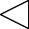
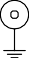
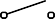

## O-RAN.WG7.OMAC-HRD.0-R003-v03.00.docx

- View in [Reader Mode](https://simewu.com/spec-reader/pages/06-WG7/O-RAN.WG7.OMAC-HRD.0-R003-v03.00.docx).
- Go back to [Table of Contents](../README.md).
- Download the [Original Document](https://github.com/Simewu/spec-reader/raw/refs/heads/main/documents/O-RAN.WG7.OMAC-HRD.0-R003-v03.00.docx).

---

O-RAN-WG7.OMAC.HRD.0-R003-v03.00

*Technical Specification*

**O-RAN Working Group 7 Whitebox Hardware Hardware Reference Design Specification for Outdoor Macrocell with Split Architecture Option 7.2**

Copyright (C) 2023 by the O-RAN ALLIANCE e.V.

The copying or incorporation into any other work of part or all of the material available in this specification in any form without the prior written permission of O-RAN ALLIANCE e.V. is prohibited, save that you may print or download extracts of the material of this specification for your personal use, or copy the material of this specification for the purpose of sending to individual third parties for their information provided that you acknowledge O-RAN ALLIANCE as the source of the material and that you inform the third party that these conditions apply to them and that they must comply with them.

# Contents

1. Figures 5
2. Tables 7
3. Foreword 9
4. Modal verbs terminology 9
5. Chapter 1 Introductory Material 10
6. 1.1 Scope 10
7. 1.2 References 10
8. 1.3 Definitions and Abbreviations 11
9. 1.3.1 Definitions 11
10. 1.3.2 Abbreviations 12
11. Chapter 2 Hardware Reference Design 1 17
12. 2.1 O-CU Hardware Reference Design 17
13. 2.1.1 O-CU High-Level Functional Block Diagram 17
14. 2.1.2 O-CU Hardware Components 18
15. 2.1.2.1 Digital Processing Unit 18
16. 2.1.2.2 Hardware Accelerator (If required by design) 18
17. 2.1.2.2.1 Accelerator Design 1 18
18. 2.1.2.2.2 Accelerator Design 2 18
19. 2.1.3 Synchronization and Timing 18
20. 2.1.4 External Interface Ports 18
21. 2.1.5 O-CU Firmware (if needed) 18
22. 2.1.6 Mechanical 18
23. 2.1.7 Power Unit 18
24. 2.1.8 Thermal 18
25. 2.1.9 Environmental and Regulations 18
26. 2.2 O-DU Hardware Reference Design 18
27. 2.2.1 O-DU High-Level Functional Block Diagram 19
28. 2.2.2 O-DU Hardware Components 20
29. 2.2.2.1 Digital Processing Unit 20
30. 2.2.2.1.1 Interfaces 20
31. 2.2.2.1.1.1 Memory Channel Interfaces 20
32. 2.2.2.1.1.2 PCIe 20
33. 2.2.2.1.1.3 Ethernet 21
34. 2.2.2.2 Hardware Accelerator (if required by design) 21
35. 2.2.2.2.1 Hardware Accelerator 21
36. 2.2.2.2.2 Accelerator Design 1 21
37. 2.2.2.2.3 Accelerator Design 2 23
38. 2.2.2.2.4 Accelerator Design 3 24
39. 2.2.3 Synchronization and Timing 27
40. 2.2.4 External Interface Ports 27
41. 2.2.5 O-DU Firmware 28
42. 2.2.6 Mechanical 28
43. 2.2.6.1 Mother Board 28
44. 2.2.6.2 Chassis 30
45. 2.2.6.3 Cooling 30
46. 2.2.7 Power Unit 30
47. 2.2.7.1 Power Supply 30
48. 2.2.8 Thermal 31
49. 2.2.9 Environmental and Regulations 31
50. 2.3 O- RU Hardware Reference Design 31
51. 2.3.1 O- RU High-Level Functional Block Diagram 32
52. 2.3.2 O-RU Hardware Components 32
53. 2.3.2.1 O-RAN Processing Unit 36
54. 2.3.2.2 Digital Processing Unit 36
55. 2.3.2.2.1 FPGA/ASIC Solution 37
56. 2.3.2.2.1.1 FPGA Requirements 37
57. 2.3.2.2.1.2 FPGA Design 37
58. 2.3.2.3 RF Processing Unit 38
59. 2.3.2.3.1 Transceiver Reference Design 38
60. 2.3.2.3.1.1 Hardware Specifications 38
61. 2.3.2.3.1.1.1 Interface 38
62. 2.3.2.3.1.1.2 Algorithm 39
63. 2.3.2.3.1.1.3 Device Configuration 40
64. 2.3.2.3.1.1.4 Power Dissipation 40
65. 2.3.2.3.1.1.5 RF Specifications 40
66. 2.3.2.3.1.2 Hardware Design 42
67. 2.3.2.4 Interface Requirements 43
68. 2.3.2.4.1 O-RAN Processing Unit and DPU Design 44
69. 2.3.2.4.2 Power Amplifier (PA) Reference Design 45
70. 2.3.2.4.2.1 Hardware Specifications 45
71. 2.3.2.4.2.1.1 Interface 45
72. 2.3.2.4.2.1.2 Power Specifications 45
73. 2.3.2.4.2.1.3 RF Specifications 45
74. 2.3.2.4.2.2 Hardware Design 46
75. 2.3.2.4.3 Low Noise Amplifier (LNA) Reference Design 46
76. 2.3.2.4.3.1.1 Interface 46
77. 2.3.2.4.3.1.2 Power Specifications 47
78. 2.3.2.4.3.1.3 RF Performance Specifications 47
79. 2.3.2.4.3.2 Hardware Design 47
80. 2.3.2.4.4 Circulator Reference Design 47
81. 2.3.2.4.4.1 Hardware Specifications 48
82. 2.3.2.4.4.1.1 Interface 48
83. 2.3.2.4.4.1.2 RF Specifications 48
84. 2.3.2.4.4.2 Hardware Design 48
85. 2.3.2.4.5 Antenna / Phased Array Reference Design 48
86. 2.3.2.4.5.1 Hardware Specifications for Omnidirectional Antenna 49
87. 2.3.2.4.5.2 Hardware Design of Omnidirectional Antenna 49
88. 2.3.2.4.5.3 Hardware Specifications for Directional Antenna 50
89. 2.3.2.4.5.4 Hardware Design of Directional Antenna 50
90. 2.3.2.5 Internal Interfaces 51
91. 2.3.2.5.1 Optional JESD204 Interfacing 51
92. 2.3.3 Synchronization and Timing 58
93. 2.3.3.1 Hardware Specifications 58
94. 2.3.3.1.1 Interface 58
95. 2.3.3.1.2 Performance Specifications 58
96. 2.3.3.1.3 Synchronizer 59
97. 2.3.3.1.3.1 Hardware Specifications 59
98. 2.3.3.1.3.1.1 Interface 59
99. 2.3.3.1.3.1.2 Performance Specifications 59
100. 2.3.3.1.3.2 Hardware Design 60
101. 2.3.3.1.4 Reference Synthesizer 60
102. 2.3.3.1.4.1 Hardware Specifications 60
103. 2.3.3.1.4.1.1 Interface 60
104. 2.3.3.1.4.1.2 Performance Specifications 61
105. 2.3.3.1.4.2 Hardware Design 62
106. 2.3.4 External Interface Ports 63
107. 2.3.4.1 Hardware Specifications 63
108. 2.3.4.2 Hardware Design for External Interfaces 63
109. 2.3.4.2.1 Fronthaul Interface 63
110. 2.3.4.2.2 Debug Interface 63
111. 2.3.4.2.3 Power Interface 64
112. 2.3.4.2.4 RF Interface 64
113. 2.3.5 Mechanical 65
114. 2.3.6 Power Unit 66
115. 2.3.6.1 Hardware Specifications 66
116. 2.3.6.2 Hardware Design 67
117. 2.3.7 Thermal 68
118. 2.3.8 Environmental and Regulations 69
119. 2.4 Integrated O-DU & O-RU (gNB-DU) Reference Design 70
120. 2.4.1 O-DU Portion of Integrated Reference Design 70
121. 2.4.1.1 O-DU High-Level Functional Block Diagram 70
122. 2.4.1.2 O-DU Hardware Components 71
123. 2.4.1.2.1 Digital Processing Unit 72
124. 2.4.1.2.2 Hardware Accelerator (if required by design) 72
125. 2.4.1.2.2.1 Accelerator Design 1 72
126. 2.4.1.2.2.2 Accelerator Design 2 72
127. 2.4.1.3 Synchronization and Timing 72
128. 2.4.2 O-RU Portion of Integrated Reference Design 72
129. 2.4.2.1 O-RU High-Level Functional Block Diagram 72
130. 2.4.2.2 O-RU Hardware Components 73
131. 2.4.2.2.1 Digital Processing Unit 73
132. 2.4.2.2.2 RF Processing Unit 73
133. 2.4.2.2.2.1 Transceiver Reference Design 73
134. 2.4.2.2.2.2 Power Amplifier (PA) Reference Design 73
135. 2.4.2.2.2.3 Low Noise Amplifier (LNA) Reference Design 73
136. 2.4.2.2.2.4 RF Switch Reference Design 73
137. 2.4.2.2.2.5 Antenna / Phased Array Reference Design 73
138. 2.4.2.2.3 Synchronization and Timing 74
139. 2.4.3 External Interface Ports 74
140. 2.4.4 O-DU/O-RU Firmware (if required by design) 74
141. 2.4.5 Mechanical 74
142. 2.4.6 Power Unit 74
143. 2.4.7 Thermal 74
144. 2.4.8 Environmental and Regulations 74
145. 2.5 O- RU7-2x Massive MIMO Hardware Reference Design 75
146. 2.5.1 O-RU7-2x Massive MIMO High-Level Functional Block Diagram 75
147. 2.5.1.1 O-RU7-2x Massive MIMO High Level Architecture Option #1 76
148. 2.5.1.2 O-RU7-2x Massive MIMO High Level Architecture Option #2 76
149. 2.5.1.3 O-RU7-2x Massive MIMO High Level Architecture Option #3 77
150. 2.5.2 O-RU7-2x Massive MIMO Hardware Reference Design Architecture 77
151. 2.5.2.1 O-RAN Fronthaul Processing Unit 79
152. 2.5.2.2 Digital Processing Unit 79
153. 2.5.2.3 RF Processing Unit 80
154. 2.5.2.3.1 RF Transceiver Unit 80
155. 2.5.2.3.2 RF Front End Unit 80
156. 2.5.2.4 mMIMO Antenna/Phased array reference design 82
157. 2.5.3 Mechanical 86
158. 2.6 FHGW Hardware Reference Design 88
159. Annex 1: Parts Reference List 89
160. 1.1 Supermicro O-DU: 89
161. 1.2 ADI Based O-RU 4T4R 89
162. 1.3 ADI Based O-RU 8T8R 90
163. History 90

34

1. Figures
2. Figure 2.2.1-1 O-DU/O-CU Functional Block Diagram 19
3. Figure 2.2.2-1 Dual-chip FPGA-based Hardware Acceleration in O-DU 23
4. Figure 2.2.2-2 Single-chip FPGA-based Hardware Acceleration in O-DU 24
5. Figure 2.2.2-3 Accelerator Design 3 using PCIe 26
6. Figure 2.2.2-4 Accelerator Design 3 using Ethernet 26
7. Figure 2.2.6-1 Mother Board Layout Diagram 29
8. Figure 2.2.6-2 Chassis Mechanical Diagram 30
9. Figure 2.3.1-1 O-RU High-Level Functional Block Diagram 32
10. Figure 2.3.2-1 O-RU Architecture Example Implementation 1 33
11. Figure 2.3.2-2 4T4R General Block Diagram with full RF front end 34
12. Figure 2.3.2-3 8T8R General Block Diagram with RF front end 35
13. Figure 2.3.2-4 Digital Processing Unit Block Diagram (L1 Processing + Beamforming) 36
14. Figure 2.3.2-5 Digital Processing Unit Block Diagram (DFE) 36
15. Figure 2.3.2-6 Transceiver with Integrated CFR and DPD 43
16. Figure 2.3.2-7 Power Amplifier Reference Design 46
17. Figure 2.3.2-8 LNA Reference Design 47
18. Figure 2.3.2-9 Circulator Reference Design 48
19. Figure 2.3.2-10 Canister Style Omni Antenna 49
20. Figure 2.3.2-11 Mounting Arrangement Scenario 1 of 4T4R Radios back of the Directional Antenna 50
21. Figure 2.3.2-12 Mounting Arrangement Scenario 2 of 4T4R Radios back of the Directional Antenna 51
22. Figure 2.3.2-13 Example 4T4R JESD204 Configuration 54
23. Figure 2.3.2-14 Example 64T64R JESD204 Configuration 56
24. Figure 2.3.2-15 64T64R Example Data Mapping 57
25. Figure 2.3.3-1 Clock and Synchronization Functional Block Diagram 58
26. Figure 2.3.3-2 Synchronizer Block Diagram 60
27. Figure 2.3.3-3 Synthesizer Block Diagram 62
28. Figure 2.3.4-1 SFP+ case and connector 63
29. Figure 2.3.4-2 RJ45 Interface 64
30. Figure 2.3.4-3 Power Interface 64
31. [Figure 2.3.4-4 (a) 4.3-10+ RF Connector [7] and (b) M-LOC Cluster/multiport connector 8] 65
32. Figure 2.3.5-1 Mechanical Enclosure Front View 66
33. Figure 2.3.5-2 Mechanical Enclosure Top View 66
34. Figure 2.3.6-1 Power Reference Design 68
35. Figure 2.3.8-1 Integrated O-DU & O-RU (gNB-DU) Reference Design 70
36. Figure 2.4.1-1 Functional Block Diagram For O-DU portion 71
37. Figure 2.4.2-1 Functional Block Diagram for O-RU portion 72
38. Figure 2.4.2-2 Phased array antenna reference design 73
39. [Figure 2.5.1-1 [NxM]TNxM]R mMIMO O-RU7-2x High Level System Architecture #1 76
40. [Figure 2.5.1-2 [NxM]TNxM]R mMIMO O-RU7-2x High Level System Architecture #2 77
41. [Figure 2.5.1-3 [NxM]TNxM]R mMIMO O-RU7-2x High Level System Architecture #3 77
42. Figure 2.5.2-1 mMIMO O-RU7-2x hardware reference design architecture example of 32T32R 78
43. Figure 2.5.2-2 mMIMO O-RU7-2x hardware reference design architecture example of 64T64R 79
44. Figure 2.5.2-3 mMIMO O-RU7-2x Digital processing unit architecture example 80
45. Figure 2.5.2-4 mMIMO O-RU7-2x RF front end architecture example of 32T32R 81
46. Figure 2.5.2-5 mMIMO O-RU7-2x RF front end architecture example of 64T64R 82
47. Figure 2.5.2-6 mMIMO O-RU7-2x antenna array architecture example of 32T32R 83
48. Figure 2.5.2-7 mMIMO O-RU7-2x antenna array architecture example of 64T64R 84
49. Figure 2.5.2-8 mMIMO antenna array view (a) simulation model of 192 reflector backed antenna element array only
50. [and (b) 32T32R mMIMO O-RU7-2x Antenna array prototype 14] 85
51. Figure 2.5.3-1 Mechanical enclosure 86
52. Figure 2.5.3-2 Exploded views of mechanical architecture/stacking examples (a) design #1 and (b) design #2 87

5

# Tables

1. Table 2.2.2-1 Processor Feature List 20
2. Table 2.2.2-2 Memory Channel Feature List 20
3. Table 2.2.2-3 Accelerator Hardware Features 21
4. Table 2.2.2-4 Hardware Accelerator Firmware Features 22
5. Table 2.2.2-5 Accelerator Hardware Features 23
6. Table 2.2.2-6 Hardware Accelerator Firmware Features 24
7. Table 2.2.2-7 Accelerator Hardware Feature List 25
8. Table 2.2.2-8 Accelerator Firmware Feature List 25
9. Table 2.2.4-1 External Port List 27
10. Table 2.2.7-1 O-DU Power Requirements 31
11. Table 2.2.9-1 Environmental Features 31
12. Table 2.3.2-1 FPGA Interface Requirements 37
13. Table 2.3.2-2 FPGA Functional Blocks 38
14. Table 2.3.2-3 RF Processing Unit Interface Specifications 39
15. Table 2.3.2-4 JESD204B/C Serial Data Rates 39
16. Table 2.3.2-5 Transceiver RF Specifications 40
17. Table 2.3.2-6 Interface Requirements 44
18. Table 2.3.2-7 OPU-DPU Functional Blocks 45
19. Table 2.3.2-8 Power Amplifier Interface Specifications 45
20. Table 2.3.2-9 Power Amplifier RF Specifications 46
21. Table 2.3.2-10 LNA Interfaces 46
22. Table 2.3.2-11 LNA RF Specifications 47
23. Table 2.3.2-12 Circulator Specifications 48
24. Table 2.3.2-13 Omnidirectional Antenna Specifications 49
25. Table 2.3.2-14 Directional Antenna Specifications 50
26. Table 2.3.2-15 JESD204 Abridged Lexicon 52
27. Table 2.3.2-16 4T4R Example Data Mapping 55
28. Table 2.3.3-1 Synchronization and Timing Interface Specifications 58
29. Table 2.3.3-2 Synchronizer Interface Specifications 59
30. Table 2.3.3-3 Synchronizer Performance Specifications 59
31. Table 2.3.3-4 Synthesizer Interface Specifications 60
32. Table 2.3.3-5 TCXO Clock Performance Specifications 61
33. Table 2.3.4-1 External Port List 63
34. Table 2.3.6-1 Transceiver Module Specifications 67
35. Table 2.3.6-2 RF Front End Module Specifications 67
36. [Table 2.3.7-1 Thermal Conductivity of common Metals 9] 68
37. [Table 2.3.7-2 Convective heat transfer coefficient 10] 69
38. [Table 2.3.7-3 Emissivity value of different materials 11] 69
39. Table 2.3.8-1 Environmental Features 70

8

# Foreword

1. This Technical Specification (TS) has been produced by O-RAN Alliance.

# Modal verbs terminology

1. In the present document "**shall**", "**shall not**", "**should**", "**should not**", "**may**", "**need not**", "**will**", "**will not**",
2. "**can**" and "**cannot**" are to be interpreted as described in clause 3.2 of the O-RAN Drafting Rules (Verbal
3. forms for the expression of provisions).
4. "**must**" and "**must not**" are **NOT** allowed in O-RAN deliverables except when used in direct citation.

8

# Chapter 1 Introductory Material

## 1.1 Scope

1. This Technical Specification has been produced by the O-RAN.org.
2. The contents of the present document are subject to continuing work within O-RAN WG7 and may change
3. following formal O-RAN approval. Should the O-RAN.org modify the contents of the present document, it
4. will be re-released by O-RAN Alliance with an identifying change of release date and an increase in version
5. number as follows:
6. Release x.y.z
7. where:
8. x the first digit is incremented for all changes of substance, i.e., technical enhancements,
9. corrections, updates, etc. (the initial approved document will have x=01).
10. y the second digit is incremented when editorial only changes have been incorporated in the
11. document.
12. z the third digit included only in working versions of the document indicating incremental changes
13. during the editing process. This variable is for internal WG7 use only.
14. The present document specifies system requirements and high-level architecture for the FR1 Outdoor
15. Macrocell deployment scenario as specified in the Deployment Scenarios and Base Station Classes
16. document [1].
17. In the main body of this specification (in any "chapter") the information contained therein is informative,
18. unless explicitly described as normative. Information contained in an "Annex" to this specification is always
19. informative unless otherwise marked as normative.

## 1.2 References

1. The following documents contain provisions which, through reference in this text, constitute provisions of
2. the present document.
3. [1] ORAN-WG7.DSC.0-V03.00 Technical Specification, 'Deployment Scenarios and Base Station Classes
4. for White Box Hardware'. <https://www.o-ran.org/specifications>.
5. [2] [3GPP TR 21.905: "Vocabulary for 3GPP Specifications](https://www.etsi.org/deliver/etsi_tr/121900_121999/121905/04.05.00_60/tr_121905v040500p.pdf)".
6. [3] 3GPP TS 38.104: "NR; Base Station (BS) radio transmission and reception".
7. [4] ORAN-WG4.CUS.0-v01.00 Technical Specification, 'O-RAN Fronthaul Working Group Control, User
8. and Synchronization Plane Specification'. <https://www.o-ran.org/specifications>
   1. [5] 3GPP TS 38.113:"NR: Base Station (BS) Electromagnetic Compatibility (EMC)".
   2. [http://www.3gpp.org/ftp//Specs/archive/38\_series/38.113/38113-f80.zip](http://www.3gpp.org/ftp/Specs/archive/38_series/38.113/38113-f80.zip)
   3. [6] [O-RAN-WG7 OMAC Hardware Architecture Description - v02.00](https://oranalliance.atlassian.net/wiki/download/attachments/601096550/O-RAN.WG7.OMAC-HAR.0-v02.00.pdf?api=v2) Technical Specification 'Outdoor
   4. Macrocell Hardware Architecture and Requirements (FR1) Specification'
   5. [7] [https://www.rosenberger.com/0\_documents/de/catalogs/ba\_communication/catalog\_coax/15\_Cha](https://www.rosenberger.com/0_documents/de/catalogs/ba_communication/catalog_coax/15_Chapter%C3%82%C2%A0_43-10_41-95.pdf)
   6. [pter \_43-10\_41-95.pdf](https://www.rosenberger.com/0_documents/de/catalogs/ba_communication/catalog_coax/15_Chapter%C3%82%C2%A0_43-10_41-95.pdf)
   7. [8] [https://www.commscope.com/product-type/cable-assemblies/wireless-cable-assemblies/coaxial-](https://www.commscope.com/product-type/cable-assemblies/wireless-cable-assemblies/coaxial-cable-assemblies/itemmloc-f1xm-4/)
   8. [cable-assemblies/itemmloc-f1xm-4/](https://www.commscope.com/product-type/cable-assemblies/wireless-cable-assemblies/coaxial-cable-assemblies/itemmloc-f1xm-4/)
   9. [9] Zhong, J., Liu, D., Li, Z., &amp; Sun, X. (2012, August). High thermal conductivity materials and their
   10. application on the electronic products. In 2012 IEEE Asia-Pacific Conference on Antennas and
   11. Propagation (pp. 173-175). IEEE.
   12. [10] [https://www.engineersedge.com/heat\_transfer/convective\_heat\_transfer\_coefficients 13378.htm](https://www.engineersedge.com/heat_transfer/convective_heat_transfer_coefficients__13378.htm)
   13. [11] <https://www.thermoworks.com/emissivity-table/>
   14. [12] "Serial Interface for Data Converters", JESD204C.1, December 2021, [www.jedec.org](http://www.jedec.org/)
   15. [13] "JESD204x Frame Mapping Table Generator", [https://www.analog.com/en/license/licensing-](https://www.analog.com/en/license/licensing-agreement/jesd204x-frame-mapping-table-generator.html)
   16. [agreement/jesd204x-frame-mapping-table-generator.html](https://www.analog.com/en/license/licensing-agreement/jesd204x-frame-mapping-table-generator.html)

17

## 1.3 Definitions and Abbreviations

### 1.3.1 Definitions

1. For the purposes of the present document, the terms and definitions given in 3GPP TR 21.905 [1] and the
2. following apply. A term defined in the present document takes precedence over the definition of the same
3. term, if any, in 3GPP TR 21.905 [2]. For the base station classes of Pico, Micro and Macro, the definitions
4. are given in 3GPP TR 38.104 [3].
5. **Carrier Frequency**: Center frequency of the cell.
6. **F1 interface**: The open interface between O-CU and O-DU defined by 3GPP TS 38.473.
7. **Frequency Band:** A designated frequency range for the operation of the base station and the UE radios. 5G
8. NR frequency bands are divided into two different frequency ranges: Frequency Range 1 (FR1) that mainly
9. includes sub-6GHz frequency bands, some of which are bands traditionally used by previous standards but
10. has been extended to cover potential new spectrum offerings from 410MHz to 7125MHz; Frequency Range
11. 2 (FR2) that includes frequency bands from 24.25 GHz to 52.6 GHz. Bands in this millimeter wave range
12. have shorter range but higher available bandwidth than bands in the FR1.
13. **Frequency Range**: It refers to bandwidth defined by the frequency range within which the Base Station can
14. be operated, defined by the band-pass filter of the BS; e.g., 3.4 - 3.8 GHz (400 MHz)
15. **Fronthaul Gateway (FHGW)**: A fronthaul gateway is a physical entity that is located between a distributed
16. unit and one or more radio units where it distributes, aggregates, and/or converts fronthaul protocols
17. between the distributed unit and multiple radio units.
18. **gNB**: A RAN node providing NR user plane and control plane protocol terminations towards the UE, and
19. connected via the NG interface to the 5GC.
20. **Integrated architecture**: In the integrated architecture, the O-RU and O-DU are implemented on one
21. platform. Each O-RU and RF front end is associated with one O-DU. They are then aggregated to O-CU and
22. connected by F1 interface.
23. **Split architecture**: The O-RU and O-DU are physically separated from one another in this architecture. A
24. switch may aggregate multiple O-RUs to one O-DU. O-DU, switch and O-RUs are connected by the front
25. haul interface as defined in WG4.

### 1.3.2 Abbreviations

1. For the purposes of the present document, the abbreviations given in [2] and the following apply. An
2. abbreviation defined in the present document takes precedence over the definition of the same
3. abbreviation, if any, as in [2].
4. 7-2x Fronthaul interface split option as defined by O-RAN WG4, also referred to as 7-2x
5. 3GPP Third Generation Partnership Project
6. 5G Fifth-Generation Mobile Communications
7. ADC Analog to Digital Converter
8. AFE Analog Front End
9. AFU Antenna Filter Unit
10. ASIC Application Specific Integrated Circuit
11. BBDEV Baseband Device
12. BH Backhaul
13. BMC Baseboard Management Controller
14. BPSK Binary Phase Shift Keying
15. BS Base Station
16. CISPR International Special Committee on Radio Interference
17. CFR Crest Factor Reduction

|  |  |  |
| --- | --- | --- |
| 1 | CU | Centralized Unit as defined by 3GPP |
| 2 | COM | Cluster Communication |
| 3 | CPRI | Common Public Radio Interface |
| 4 | CPU | Central Processing Unit |
| 5 | CRC | Cyclic Redundancy Check |
| 6 | DAC | Digital to Analog Converter |
| 7 | DDC | Digital Down Conversion |
| 8 | DDR | Double Data Rate |
| 9 | DFE | Digital Front End |
| 10 | DIMM | Dual-Inline-Memory-Modules |
| 11 | DL | Downlink |
| 12 | DPD | Digital Pre-Distortion |
| 13 | DPDK | Data Plane Development Kit |
| 14 | DSP | Digital Signal Processor |
| 15 | DU | Distributed Unit as defined by 3GPP |
| 16 | DUC | Digital Up Conversion |
| 17 | ECC | Error Correcting Code |
| 18 | EMI | Electromagnetic Interference |
| 19 | eCPRI | evolved Common Public Radio Interface |
| 20 | EMC | Electro Magnetic Compatibility |
| 21 | EVM | Error Vector Magnitude |
| 22 | FCC | Federal Communications Commission |
| 23 | FEC | Forward Error Correction |
| 24 | FFT | Fast Fourier Transform |
| 25 | FH | Fronthaul |
| 26 | FHGW | Fronthaul Gateway |
| 27 | FHGWx | Fronthaul gateway with no FH protocol translation, supporting an O-DU with split option x |
| 28 |  | and an O-RU with split option x, with currently available options 6?6, 7-2x?7-2x and 8?8 |

|  |  |  |
| --- | --- | --- |
| 1 | FHGWx?y | Fronthaul Gateway that can translate fronthaul protocol from an O-DU with split option x |
| 2 |  | to an O-RU with split option y, with currently available option 7-2x?8. |
| 3 | FHHL | Full Height Half Length |
| 4 | FPGA | Field Programmable Gate Array |
| 5 | GbE | Gigabit Ethernet |
| 6 | GNSS | Global Navigation Satellite System |
| 7 | GPP | General Purpose Processor |
| 8 | GPS | Global Positioning System |
| 9 | HARQ | Hybrid Automatic Repeat request |
| 10 | HHHL | Half Height Half Length |
| 11 | IP67 | Ingress Protection 67 |
| 12 | IEEE | Institute of Electrical and Electronics Engineers |
| 13 | IFFT | Inverse Fast Fourier Transform |
| 14 | IMD | Inter Modulation Distortion |
| 15 | I/O | Input/Output |
| 16 | JTAG | Joint Test Action Group |
| 17 | L1 | Layer 1 |
| 18 | LDPC | Low-Density Parity Codes |
| 19 | LDO | Low dropout |
| 20 | LRDIMM | Load-Reduced Dual In-line Memory Module |
| 21 | LTE | Long Term Evolution |
| 22 | LVDS | Low-Voltage Differential Signaling |
| 23 | MAC | Media Access Control |
| 24 | MCP | Multi-Chip Package |
| 25 | MH | Midhaul |
| 26 | MIG | Memory Interface Generator |
| 27 | MII | Media-Independent interface |
| 28 | MIMO | Multiple Input Multiple Output |

|  |  |  |
| --- | --- | --- |
| 1 | MU-MIMO | Multiple User MIMO |
| 2 | NEBS | Network Equipment-Building System |
| 3 | NetConf | Network Configuration Protocol |
| 4 | NFV | Network Functions Virtualization |
| 5 | NIC | Network Interface Controller |
| 6 | NR | New Radio |
| 7 | O-CU | O-RAN Centralized Unit as defined by O-RAN |
| 8 | O-DUx | A specific O-RAN Distributed Unit having fronthaul split option x where x may be 6, 7-2x (as |
| 9 |  | defined by WG4) or 8 |
| 10 | O-RUx | A specific O-RAN Radio Unit having fronthaul split option x, where x is 6, 7-2x (as defined by |
| 11 |  | WG4) or 8, and which is used in a configuration where the fronthaul interface is the same |
| 12 |  | at the O-DUx |
| 13 | OCXO | Oven Controlled Crystal Oscillator |
| 14 | ORx | Observation Receiver |
| 15 | PAM | Power Amplifier Module |
| 16 | PCIe | Peripheral Component Interconnect express |
| 17 | PDCP | Packet Data Convergence Protocol |
| 18 | pFIR | Programable Finite Impulse Response filter |
| 19 | PHY | Physical Layer |
| 20 | PIM | Passive Intermodulation |
| 21 | PMBus | Power Management Bus |
| 22 | POE | Power over Ethernet |
| 23 | PPS | Pulse Per Second |
| 24 | PRACH | Physical Random-Access Channel |
| 25 | QAM | Quadrature Amplitude Modulation |
| 26 | QPSK | Quadrature Phase Shift Keying |
| 27 | QSFP | Quad Small Form-factor Pluggable |
| 28 | RAN | Radio Access Network |

|  |  |  |
| --- | --- | --- |
| 1 | RDIMM | Registered Dual In-line Memory Module |
| 2 | RF | Radio Frequency |
| 3 | RFIC | Radio Frequency Integrated Circuit |
| 4 | RoE | Radio over Ethernet |
| 5 | RU | Radio Unit as defined by 3GPP |
| 6 | RX | Receiver |
| 7 | SATA | Serial ATA |
| 8 | SDU | Service Data Unit |
| 9 | SFP | Small Form-factor Pluggable |
| 10 | SFP+ | Small Form-factor Pluggable plus |
| 11 | SOC | System On Chip |
| 12 | SPI | Serial Peripheral Interface |
| 13 | SSD | Solid State Drive |
| 14 | TCXO | Temperature Compensated Crystal Oscillator |
| 15 | TDP | Thermal Design Power |
| 16 | TR | Technical Report |
| 17 | TS | Technical Specification |
| 18 | TX | Transmitter |
| 19 | UL | Uplink |
| 20 | USB | Universal Serial Bus |
| 21 | WG | Working Group |

# Chapter 2 Hardware Reference Design 1

1. This chapter describes one example of white box hardware reference design including O-DU, O-RU.

## 2.1 O-CU Hardware Reference Design

1. The O-CU white box hardware is the platform that performs the O-CU function of upper L2 and L3. The
2. hardware systems specified in this document meet the computing, power and environmental requirements
3. of use cases configurations and feature sets of RAN physical node. These requirements are described in the
4. hardware requirement specification in addition to the deployment scenarios document. The O-CU hardware
5. includes the chassis platform, mother board, peripheral devices, and cooling devices. The mother board
6. contains processing unit, memory, the internal I/O interfaces, and external connection ports. The midhaul
7. (MH) and backhaul (BH) interface are used to carry the traffic between O-CU and O-DU as well as O-CU and
8. core network. The other hardware functional components include: the storage for software, hardware and
9. system debugging interfaces, board management controller, just to name a few; the O-CU designer will make
10. decision based on the specific needs of the implementation.
11. The HW reference design of O-CU is the same as O-DU except for the need of a HW accelerator, thus the
12. detail design will be described in O-DU section 2.2.

### 2.1.1 O-CU High-Level Functional Block Diagram

1. [Intentionally left blank. Refer to O-DU Functional Block Diagram]

### 2.1.2 O-CU Hardware Components

#### 2.1.2.1 Digital Processing Unit

1. 2.1.2.2 Hardware Accelerator (If required by design)
2. 2.1.2.2.1 Accelerator Design 1
3. 2.1.2.2.2 Accelerator Design 2
4. 2.1.3 Synchronization and Timing
5. 2.1.4 External Interface Ports
6. 2.1.5 O-CU Firmware (if needed)
7. 2.1.6 Mechanical
8. 2.1.7 Power Unit
9. 2.1.8 Thermal
10. 2.1.9 Environmental and Regulations

## 2.2 O-DU Hardware Reference Design

1. The O-DU white box hardware is the platform that performs the O- DU functions such as upper L1 and lower
2. L2 functions. The hardware systems specified in this document meet the computing, power and
3. environmental requirements of use case's configurations and feature sets of RAN physical node. These
4. requirements are described in the early hardware requirement specification as well as in the use cases
5. document. The O-DU hardware includes the chassis platform, mother board, peripheral devices, and cooling
6. devices. The mother board contains processing unit, memory, the internal I/O interfaces, and external
7. connection ports. The fronthaul and backhaul interface are used to carry the traffic between O-RU/FHGW7-
8. 2/FHGW7-2?8 and O-DU as well as O-CU and O-DU. The O-DU design may also provide an interface for
9. hardware accelerator if that option is preferred. The other hardware functional components include: the
10. storage for software, hardware and system debugging interfaces, board management controller, just to
11. name a few; the O-DU designer will make decision based on the specific needs of the implementation.
12. Note that the O-DU HW reference design is also feasible for O-CU and integrated O-CU/ O-DU.

### 2.2.1 O-DU High-Level Functional Block Diagram

1. In the following O-DU/O-CU mother board functional block diagram, it shows the interconnections of the
2. major components and external interfaces. The digital processing unit or SoC (CPU) handles the baseband
3. processing workload. To make the processing more efficient, an accelerator can be used to assist with the
4. baseband workload processing. The memory devices include random-access memory (RAM) for temporary
5. storage of data while flash memory is used for codes and logs. The storage device is for persistent storage.
6. The external network cards can be used for fronthaul or backhaul connection. The baseboard management
7. controller (BMC) is a microcontroller which monitors hardware operation on the motherboard. The clock
8. circuits provide digital processing unit with required clock signals.

10

11 **Figure 2.2.1-1 O-DU/O-CU Functional Block Diagram**

### 2.2.2 O-DU Hardware Components

#### 2.2.2.1 Digital Processing Unit

1. The example of general-purpose processor performances and other related information are listed in the
2. following table.

5

##### 6 Table 2.2.2-1 Processor Feature List

|  |  |
| --- | --- |
| **Item Name** | **Description** |
| # of Cores | 24 |
| # of Threads | 48 |
| Base Frequency | 1.90GHZ |
| Max Turbo Frequency | 3.90GHz |
| Cache | 45MB |
| TDP | 165W |
| Max Memory Size (dependent on memory type) | 2TB |
| Memory Types | DDR5 |
| Max # of Memory Channels | 8 |

7

1. 2.2.2.1.1 Interfaces
2. These are the required interface specification for the main board.
3. 2.2.2.1.1.1 Memory Channel Interfaces
4. The system memory capacity, type and related information is described in the following table.

##### Table 2.2.2-2 Memory Channel Feature List

|  |  |
| --- | --- |
| **Item Name** | **Description** |
| Memory Types | DDR5 |
| # of Memory Channels | 8 |
| ECC RDIMM\LRDIMM | Up to 128GB |
| 3DS ECCRDIMM | Up to 256GB |
| Memory Speed | up to 4800MT/s |
| DIMM Sizes | 256GB, 128GB, 64GB, 32GB, 16GB |
| Memory Voltage | 1.1 V |

13

14 2.2.2.1.1.2 PCIe

1. PCIe Gen 5 is supported by the processor. There is a total of 80 PCIe lanes available on the motherboard
2. which are allocated as per Figure 2.2.1-1 O-DU/O-CU Functional Block Diagram. This example has 2 x PCIe
3. Gen5 x 16 Full Height Full Length expansion slots and 1 x PCIe Gen5 x 16 Low Profile expansion slot. Each
4. 16-lane bi-directional PCIe expansion slot has 128GB/s of available bandwidth.

19

1 2.2.2.1.1.3 Ethernet

1. The system should be capable of offering a minimum aggregated 48 Gbps Ethernet bandwidth. The
2. breakdown of the Ethernet ports is discussed in a later section.

4

#### 2.2.2.2 Hardware Accelerator (if required by design)

1. 2.2.2.2.1 Hardware Accelerator
2. Hardware accelerators can be used in O-DU to offload computationally intensive functions and to optimize
3. the performance under varying traffic and loading conditions. While the hardware acceleration functional
4. requirements and implementation are system designer's choice; the O-DU is required to meet the minimum
5. system performance requirements under various loading conditions and deployment scenarios. In most
6. cases, a Field Programmable Gate Array (FPGA) or Application Specific Integrated Circuit (ASIC) based PCIe
7. card can be used to optimize the system performance. FPGA(s) and ASIC(s) may be part of a Network
8. Interface Controller (NIC) that further provides connectivity services.
9. 2.2.2.2.2 Accelerator Design 1
10. The O-DU system is typically implemented using a multi-core processor and one or more hardware
11. accelerators. Parts of O-DU protocol stack can be implemented in software running on the multi-core
12. processors and the computationally intensive L1 and L2 functions can be offloaded to an FPGA-based
13. hardware accelerator. This accelerator comprises two FPGAs for L1 offload and fronthaul connectivity in
14. lookaside mode. The accelerator hardware and firmware features are listed in Table 2.2.2-3 and Table 2.2.2-
15. 4.

##### Table 2.2.2-3 Accelerator Hardware Features

|  |  |  |
| --- | --- | --- |
| SoC Resources | **FPGA1** | **FPGA2** |
| System Logic cells - 930K CLB LUT - 425K  SDFEC -8  DSP Slices - 4,272 BRAM - 38.0Mb URAM - 22.5Mb | System Logic cells - 1,143K CLB LUT - 523K  CLB Flip-Flops -1,045K DSP Slices - 1,968 BRAM - 34.6Mb  URAM - 36.0Mb |
| Form Factor | FHHL PCIe Form Factor | |
| PCIe Interface | Gen 3 x16 with Bifurcation | |
| On Board Memory | **FPGA1** | **FPGA2** |
| Total Capacity 4 GB in PL, upgradeable to 8GB  Total Capacity 2 GB in PS, upgradeable to 4GB | Total Capacity 4 GB in PL, upgradeable to 8GB  Total Capacity 2 GB in PS, upgradeable to 4GB |
| Network Interface(s) | 2xSFP28 optical interfaces to FPGA2  (User Configurable, includes 10/25 Ethernet) | |
| Other External Interface(s) | Micro USB for JTAG support (FPGA programming and debug) and access to BMC | |

|  |  |
| --- | --- |
| Graphical User interface | GUI for monitoring the basic board parameters, monitoring temperature alerts, firmware upgrades for BMC |
| Board Management Controller | Telemetry, Security, Remote Upgrade |
| Clocking | O-RAN C1, C2, C3, C4 |
| Fronthaul | eCPRI, RoE IEEE1914.3, O-RAN WG4 FH |
| GPS | SMA for 1 PPS (In/Out) |
| Operating Temperature | NEBS Compliant |
| Power | < 75 W |
| Clocking Options | Low-Jitter, configurable clock ranging from10MHz to 750MHz  1 PPS input and output with assembly option for OCXO and TCXO |

1

##### 2 Table 2.2.2-4 Hardware Accelerator Firmware Features

|  |  |
| --- | --- |
| **Item Name** | **Description** |
| Remote System Upgrade | Securely upgradable FPGA flash image |
| L1 Acceleration | 5G NR LDPC encoding/decoding with interleaving/de-interleaving and rate- matching/rate-de-matching along with early termination, CRC attachment, and HARQ management |
| Hardware-Software APIs | Fully compliant with DPDK/BBDEV APIs |
| Fronthaul Protocols/Compression | Fully compliant with O-RAN WG4 MCUS-planes Specifications |
| Open Programmable Acceleration Environment | Support for:   * FPGA flashing upgrade * Firmware version reporting * PCIe diagnostics * Ethernet diagnostics * Temperature and voltage telemetry information |

3

1. The hardware accelerator supports x86 or non-x86-based processors. Figure 2.2.2-1 illustrates the two-chip
2. acceleration architecture comprising two FPGAs with multi-lane PCIe interfaces toward the CPU and external
3. connectivity toward O-RU(s) via eCPRI and O-CU(s) through GbE connectivity. The example architecture
4. further depicts multi-lane Gen3 PCIe interfaces between each FPGA and the CPU. The FPGAs communicate
5. through high-bandwidth Ethernet (GbE) transport.

|  |  |
| --- | --- |
| **FPGA1**  **(L1 Offload)** | |
|  | Inter-Chip Interface 100G Ethernet |
| **FPGA2**  **(Connectivity)** | |

[Bifurcated] PCIe Interface

1. PCIe Gen3x16 100G

Fronthaul Interface 10/25G

Ethernet/eCPRI

**X86 or ARM-based CPU**

**(L2 and Partial L1)**

##### Figure 2.2.2-1 Dual-chip FPGA-based Hardware Acceleration in O-DU

3

1. 2.2.2.2.3 Accelerator Design 2
2. The O-DU system is typically implemented using a multi-core processor (CPU) and one or more hardware
3. accelerators. Parts of O-DU protocol stack can be implemented in software running on the multi-core
4. processors and the computationally intensive L1 and L2 functions can be offloaded to an FPGA-based
5. hardware accelerator. This accelerator comprises a single FPGA for L1 offload in lookaside mode. The
6. accelerator hardware and firmware features are listed in Table 2.2.2-5 and Table 2.2.2-6.

##### Table 2.2.2-5 Accelerator Hardware Features

|  |  |
| --- | --- |
| SoC Resources | System Logic cells - 930K CLB LUT - 425K  SDFEC -8  DSP Slices - 4,272 BRAM - 38.0Mb URAM - 22.5Mb |
| Form Factor | HHHL PCIe Form Factor |
| PCIe Interface | Gen 3 x16 (Gen4 x8) |
| On Board Memory | Total Capacity 4 GB in PL, upgradeable to 8GB Total Capacity 2 GB in PS, upgradeable to 4GB |
| Other External Interface(s) | Micro USB for JTAG support (FPGA programming and debug) and access to BMC |
| Graphical User interface | GUI for monitoring the basic board parameters, monitoring temperature alerts, firmware upgrades for BMC |

|  |  |
| --- | --- |
| Board Management Controller | Telemetry, Security, Remote Upgrade |
| Operating Temperature | NEBS Compliant |
| Power | < 35 W |

1

##### 2 Table 2.2.2-6 Hardware Accelerator Firmware Features

|  |  |
| --- | --- |
| Remote System Upgrade | Securely upgradable FPGA flash image |
| L1 Acceleration | 5G NR LDPC encoding/decoding with interleaving/de-interleaving and rate-matching/rate- de-matching along with early termination, CRC attachment, and HARQ management |
| Hardware-Software APIs | Fully compliant with DPDK/BBDEV APIs |
| Open Programmable Acceleration Environment | Support for:   * FPGA flashing upgrade * Firmware version reporting * PCIe diagnostics * Ethernet diagnostics * Temperature and voltage telemetry information |

3

1. The hardware accelerator supports x86 or non-x86-based processors. Figure 2.2.2-2 illustrates the single-
2. chip acceleration architecture comprising one FPGA with Gen3 x16 or Gen4 x8 PCIe interfaces toward the
3. CPU.

FPGA

(L1 Offload)

X86 or ARM-based

CPU

(L2 and Partial L1)

F1 Interface Ethernet (10/25G)

7

PCIe Interface

PCIe Gen3x16 or Gen4 x8 100G

##### Figure 2.2.2-2 Single-chip FPGA-based Hardware Acceleration in O-DU

9

1. 2.2.2.2.4 Accelerator Design 3
2. This design includes an Embedded NIC Inline Accelerator (ENIAC) with an ASIC that can provide NIC functions.
3. One option supports a high-capacity O-DU using multiple PCIe cards in standard racks and aligns with the
4. FAPI interface to maximize software reuse. The second option supports a high-capacity O-DU using an
5. Ethernet-based backplane interconnect and aligns with the nFAPI interface to maximize software reuse.
6. ENIAC unloads L1 from the host, allowing it to focus on L2.

###### *a. Accelerator Requirements*

* 1. Hardware and firmware requirements for this accelerator design are given in Table 2.2.2-7 and Table
  2. 2.2.2-8, respectively.

##### Table 2.2.2-7 Accelerator Hardware Feature List

|  |  |
| --- | --- |
| **Item Name** | **Description** |
| PCIe (Interface with digital processing unit) | Gen4 x16 (and lower) |
| Form factor | FHHL |
| Connectivity | QSFP28/SFP |
| NIC Device | 200Gb xHAUL for FH, BH & MH traffic shaping. |
| DDR Main | TBD GB DDR4 |
| Flash (FPGA images) | >=1 Gbit |
| BMC | Telemetry, Security, remote upgrade |
| Clocking | For O-RAN C1, C2, C3 & C4 |
| Fronthaul | eCPRI, RoE IEEE1914.3, O-RAN WG4 |
| GPS | SMA for 1 PPS & 10MHz (in/out) |
| Operating Temperature (ambient) | NEBS Compliant |
| Power | <75W |
| Clock Accuracy | Low-Jitter, configurable clock ranging from 10MHz to 750MHz. Option for OCXO (TCXO as standard) |

5

##### Table 2.2.2-8 Accelerator Firmware Feature List

|  |  |
| --- | --- |
| **Item Name** | **Description** |
| Remote system upgrade | Securely upgradable image |
| Queuing | Command queuing at FAPI interface |
| LDPC Acceleration | Rel15 compliant |
| Fronthaul Compression | In-line compression/decompression for Mu-Law, block-floating point,  and quantization according to the O-RAN WG4 specification. |
| Open programmable acceleration environment | Support for:   * Flashing upgrade * Firmware version reporting * PCIe diagnostics * Ethernet diagnostics * Temperature and voltage telemetry information. |

###### *b. Accelerator Design*

1. Figure 2.2.2-3 illustrates Accelerator Design 3 with integrated NIC and PCIe connectivity to L2.
2. Figure 2.2.2-4 illustrates Accelerator Design 3 with integrated NIC and Ethernet connectivity to L2.

10

FAPI on PCIe4x16

**L1 Upper Phy Accelerator 16+ Layer mMIMO**

**Embedded NIC with eCPRI**

**L2**

**Processing**

**Timing**

O-RAN 7-2x

eCPRI FH QSFP28

1

PPS 10 MHz

200 Gbps+ Ethernet SyncE

##### 2 Figure 2.2.2-3 Accelerator Design 3 using PCIe

3

4

nFAPI on Ethernet

**Timing**

**L1 Upper Phy Accelerator 16+ Layers mMIMO**

**Embedded NIC with eCPRI**

**L2**

**Processing**

O-RAN 7-2x

eCPRI FH QSFP28

5

PPS 10 MHz

200 Gbps+ Ethernet SyncE

##### 6 Figure 2.2.2-4 Accelerator Design 3 using Ethernet

7

8

9

10

11

### 2.2.3 Synchronization and Timing

1. In this reference design the DU has a GNSS receiver integrated on the network interface card. The GNSS
2. receiver is connected via SMA cable to an external GNSS antenna.
3. The PTP and SyncE signals are transported by Ethernet L2 via the fronthaul network interfaces to the O-RU.
4. Together these provide the local time of day and frequency reference for the O-RU.
5. Summary of timing related software features supported:
6. ? PTP distribution compliant to G.8272
7. ? ITU-T specifications for SyncE:
8. o Definitions: ITU-T G.8260
9. o Architecture: ITU-T G.8261
10. o SSM transport channel and format: ITU-T G.8264
11. o Clock specifications: ITU-T G.8262 (EEC)
12. o Functional model and SSM processing: ITU-T G.781
13. ? IEEE 1588 Telecom Grand Master (T-TGM) using G8275.1 profile.
14. ? T-GM conversion to Telecom Boundary Clock (T-TBC) if GNSS signal is lost.
15. ? Telecom Boundary Clock (T-TBC) per ITU-T G.8273.2.
16. ? Min 4-hour holdover/drift of max 0.65 usec, temperature change of +5?C or -5?C after Holdover starts.
17. ? Compliant with input and output jitter and wander requirements specified in ITU-T G.8262 (for EEC).
18. ? Alternate BMCA specified in G.8275.1.

### 2.2.4 External Interface Ports

1. The following table shows the external ports or slots that the system provided. In addition to 2 onboard
2. 10GbE ports, a Network Interface Card provides a total of 12 additional Ethernet ports; 4 x 25G and 8 x10G.
3. In this configuration the system has 200Gbps of aggregated Ethernet bandwidth.

##### Table 2.2.4-1 External Port List

|  |  |
| --- | --- |
| **Port Name** | **Feature Description** |
| Ethernet | 1 x GbE BMC management port |
| 2 x 10GbE Base-T Ethernet connectors |
| 1 x QSFP28 (via Ethernet NIC) |
| 1 x QSFP+ (via Ethernet NIC) |
| 4 x SFP+ (via Ethernet NIC) |
| PCIe | 2 x PCIe 5.0 x16 FHFL slots |
| 1 x PCIe 5.0 x 16 LP slot |
| USB | 2 x USB 3.0 ports |
| 2 x USB 2.0 ports |
| VGA | VGA port |
| Serial Port | COM port via RJ45 |
| SMA | GNSS Antenna in |
| 10Mhz out |
| 1PPS out |

25

### 2.2.5 O-DU Firmware

* 1. BIOS and BMC firmware are needed in the system and shall be installed.

### 2.2.6 Mechanical

#### 2.2.6.1 Mother Board

* 1. The mechanical layout of the mother board is detailed in Figure 2.2.6-1 Mother Board Layout Diagram and
  2. shows the location of major components and interface ports.

7

1

##### 2 Figure 2.2.6-1 Mother Board Layout Diagram

3

4

#### 2.2.6.2 Chassis

1. The 1U rack mount chassis contains the layout of the power supply, SSD, and fans. The chassis dimensions
2. and layout are detailed in Figure 2.2.6-2 Chassis Mechanical Diagram.

4

5

6

7

#### 2.2.6.3 Cooling

##### Figure 2.2.6-2 Chassis Mechanical Diagram

1. The system is supplied with 6 x 40x56mm PWM fans for cooling.

### 2.2.7 Power Unit

1. In a fully loaded system with three PCIe slots populated, the system power consumption should be less
2. than 400W. The total system power shall be kept at less than 80% of the power supply capacity.

#### 2.2.7.1 Power Supply

1. The power is provided by dual redundant 600W DC 48V High-Efficiency power supplies w/PMBus 1.2. The
2. power support input and output power rails are listed below.

16

1

##### 2 Table 2.2.7-1 O-DU Power Requirements

|  |  |
| --- | --- |
| **Supply Domain** | **Requirements** |
| DC Input | -40Vdc to -65Vdc |
| DC Output | +5Vsb: 3A |
| +12V: 50A |

3

### 2.2.8 Thermal

1. Active cooling with up to 6 fans is integrated in the chassis.
2. The hardware acceleration cards described in Section 2.2.2.2 use passive cooling and a custom heatsink and
3. are equipped with temperature sensors. It is designed to operate in temperatures ranging from -5?C to

8 +55?C.

### 2.2.9 Environmental and Regulations

1. The O-DU hardware system is RoHS Compliant. The power supply unit is EMC FCC/CISPR Class B compliant.
2. Table 2.2.9-1 lists the environmental related features and parameters.

##### Table 2.2.9-1 Environmental Features

|  |  |
| --- | --- |
| **Item Name** | **Description** |
| Operating Temperature | -5?C to +55?C |
| Non-operating Temperature | -40?C to 70?C |
| Operating Relative Humidity | 8% to 90% (non-condensing) |
| Non-operating Relative Humidity | 5% to 95% (non-condensing) |

13

1. The hardware accelerator described in Section 2.2.2.2 is designed to operate in indoor environments and in
2. temperatures ranging from -5?C to +55?C.

## 2.3 O- RU Hardware Reference Design

1. This chapter defines the hardware reference design for the Outdoor Macrocell O-RU. This is defined by a 7-
2. 2 interface to the O-DU on one side and up to 64T64R on the antenna port (more details on the mMIMO O-
3. RU7-2x reference designs are given in Section 2.5). No upper limit is defined to the output power of Wide
4. Range BS according to 3GPP TS38.104-Section 6.2 [3], the external power is supplied by either AC or a
5. standard DC -48V telecom source.

### 2.3.1 O- RU High-Level Functional Block Diagram

1. Figure 2.3.1-1 provides a high-level functional block diagram depicting the major HW/SW components. It
2. also highlights the internal/external interfaces that are required. This document shows how to implement
3. the system defined by the OMAC-HAR [6] document, and mMIMO O-RU7-2x, which can be realized with
4. different high level radio architecture based on various functional splits and interface/interconnects
5. between these functional blocks.

7

O-RU7-2

To/From

O-DU7-2

O-RAN

FH Interface

O-RAN FH

Processing Unit

Digital Processing Unit

To/From

Antenna

Local timing from CDR

RF

Processing Unit

GNSS

(optional)

Local timing from GNSS or equivalent

Timing Unit

Power Unit

8

1. **Figure 2.3.1-1 O-RU High-Level Functional Block Diagram**

### 2.3.2 O-RU Hardware Components

1. Figure 2.3.2-1 shows the high-level block details of O-RU Hardware implementation example. The
2. description of each block from left to right is given below.
3. O-RU7-2x communicates with O-DU7-2x through O-RAN Fronthaul interface and the control/data packets are
4. processed by O-RAN Fronthaul unit with the help of CUS plane processing block. Subsequently the packets
5. are processed by Low-PHY functional blocks such as encoding, scrambling, modulation, layer mapping,
6. precoding, beamforming, and resource element mapping in downlink. The reverse operation is done during
7. the uplink process. The output of the Low-PHY block is fed to digital processing unit through packet
8. interface. Here the frequency conversion in digital domain i.e., digital up conversion (DUC) in DL and digital
9. down conversion (DDC) in UL are done. Furthermore, DPD and CFR algorithms are implemented in digital
10. processing unit to enhance the power amplifier efficiency by reducing the PAPR/ACLR in RF front end. The
11. output of digital processing unit is fed to RF processing unit through digital interface. The digital signals
12. converted to analog in DL and vice versa in UL with the help of DAC and ADC functional blocks in
13. Transceiver unit, respectively. Signals are further amplified with the help of functional blocks like PA in DL
14. and LNA in UL in analog RF front end unit. The output of the amplifier is fed to a cavity filter to suppress the
15. unwanted signals in DL and is done before amplification in the case of UL operation i.e., receive operation.
16. The TDD switch is used to switch the operation between DL and UL, i.e., transmit and receive operations.
17. The output of the cavity filter i.e., the O-RU is fed to antenna unit and then transmitted over the air. Three
18. processing units such as FH, Digital, and RF powered up using the power unit and gets synchronized with
19. the help of timing/synchronization block. In the case of beamforming scenario, antenna calibration is
20. implemented using antenna calibration processing block. This coordinates with Low-PHY processing unit
21. and calibration switch (Cal switch) and processes the signals coming from and going to the antenna
22. calibration port, to compensate for the amplitude and phase offsets existing in each RF chain. Other
23. implementations are also possible by rearranging the functional blocks of O-RAN FH, Digital processing, and
24. RF processing units.

PA+LNA &

PA+LNA &

Cavity

Cavity

14

**O-RU7.2x**

O-RAN Fronthaul Processing Unit

Digital Processing

Unit

RF Processing Unit

eCPRI

C-Plane, S-Plane, and

M-Plane

Processing

Low-Phy

Processing

Packet

Interface

DDC

DUC

Digital Transceiver

Interface

TDD Switch

TDD Switch

O-RAN

FH interface

DPD

CFR

CAL

Switch

Calibration

Port

Timing/Sync.

Unit

ADC

DAC

PA+LNA &

TDD Switch

Filter

Filter

Cavity

Filter

Power Unit

Antenna

Antenna

Calibration

Processing

##### 15 Figure 2.3.2-1 O-RU Architecture Example Implementation 1

**TRx**

**Reference**

Transceiver

1

**Rx Rx**

**enable enable**

**Rx0**

**bypass enable**

RFFE

**Tx0**

**enable**

**PA**

**ORx0**

**To O-DU**

**SERDES**

Digital Processing Unit

**ORx1**

**SPI**

**Cal**

**Control**

**Tx1**

**PA**

**enable**

RFFE

**Rx1**

**Network SPI Clean**

**Clock**

**Clock**

**bypass**

**enable**

Clock

RF Processing Unit

Port A

Transceiver

**bypass**

**enable**

RFFE

**Rx2**

**PA**

**Tx2**

**enable**

Synchronizer

**ORx2**

**enable**

**ORx3**

**PA**

RFFE

**Tx3**

Cal

Switch Box\*

**bypass**

**enable**

Power Unit

**Rx3**

\*Calibration transceiver can be a separate unit or one of the main transceiver channels.

Not all O-RUs will require antenna calibration.

Cal Port

##### Figure 2.3.2-2 4T4R General Block Diagram with full RF front end

1. Figure 2.3.2-2 and Figure 2.3.2-3 shows an example of an O-RU design for 4T4R and 8T8R, respectively. In
2. subsequent sub-sections, we present detailed hardware components the O-RAN Processing Unit and Digital
3. Processing Unit, RF processing unit, Power unit and Clock/Synchronization units.

**Rx enable**

**Rx enable**

**Rx0**

**bypass**

RFFE

**enable**

**To O-DU**

Digital Processing Unit

**SERDES**

**Tx0**

**ORx0 ORx1**

**PA**

**enable**

**Network Clock**

**SPI**

**Clean Clock**

**SPI**

**Cal**

**Control**

**Tx1**

**Rx1**

**PA**

RFFE

**enable**

**bypass enable**

Clock

**bypass**

RFFE

**enable**

Port A

**Rx2**

Transceiver

Transceiver

**enable**

**Tx2**

**PA**

Synchronizer

**ORx2**

**TRx**

**Reference**

**ORx3**

**PA**

**enable**

RFFE

Power Unit

**Tx3**

**bypass enable**

**Rx3**

Transceiver

RF Processing Unit

**Rx4**

**bypass**

RFFE

**enable**

**Tx4**

**ORx4**

**ORx5**

**PA**

**enable**

**Tx5**

**Rx5**

**PA**

RFFE

**enable**

**bypass enable**

**bypass**

RFFE

**enable**

Port A

**Rx6**

**enable**

**Tx6**

**PA**

**ORx6**

**TRx**

**Reference**

**ORx7**

**enable**

**PA**

**Tx7**

**Rx7**

Cal Switch Box\*

**bypass**

RFFE

**enable**

\*Calibration transceiver can be a separate unit or one of the main transceiver channels.

Not all O-RUs will require antenna calibration.

Cal Port

1

2 **Figure 2.3.2-3 8T8R General Block Diagram with RF front end**

#### 2.3.2.1 O-RAN Processing Unit

1. The O-RAN Processing Unit (OPU) receives eCPRI frames from the O-RAN fronthaul and performs the
2. fronthaul interface, lower L1, synchronization and beamforming.

#### 2.3.2.2 Digital Processing Unit

1. The Digital Processing Unit (DPU) of the O-RU performs synchronization, DDC, DUC, CFR, and DPD. The
2. DPU can be implemented as a FPGA or ASIC.
3. The following block diagrams describe the digital processing unit as per example implementation in Figure
4. 2.3.2-4 and Figure 2.3.2-5.
5. Other implementations are possible.

10

##### 11 Figure 2.3.2-4 Digital Processing Unit Block Diagram (L1 Processing + Beamforming)

12

##### 13 Figure 2.3.2-5 Digital Processing Unit Block Diagram (DFE)

1. 2.3.2.2.1 FPGA/ASIC Solution
2. This solution for the digital processing unit is based on an FPGA with embedded ARM processor.
3. 2.3.2.2.1.1 FPGA Requirements
4. Table 2.3.2-1 shows the general interfaces required for an FPGA based design based on Figure 2.3.2-4 and
5. Figure 2.3.2-5.

6

##### 7 Table 2.3.2-1 FPGA Interface Requirements

|  |  |
| --- | --- |
| **Item Name** | **Description** |
| eCPRI Port | High speed bi-directional interface transporting data and control information. Total payload will be determined by the antennas/layers served, bandwidth supported, bit precision, subcarrier spacing, etc. It is typically served by one or more  QSFP+ or SFP28 connectors depending on the payload. |
| SERDES | Up to 16 high speed JESD204B/C serial interface lanes between FPGA fabric and transceiver depending on  transceiver configuration selected. |
| Boot Clock | Clock for any uC or fabric functions required immediately at  power on |
| Sysref | JESD204B/C synchronization signal |
| DevCLK | JESD204B/C device clock |
| ARM Clock | Clock for the ARM processor |
| Memory Clock | Memory clock |
| OAM Port | Control interface used for maintenance |
| DDR | Interface for external DDR memory |

8 2.3.2.2.1.2 FPGA Design

1. Table 2.3.2-2 shows the general blocks required for the design. The core elements implemented in this design
2. are required to be sized to support the requirements shown in the OMAC-HAR [6] document. Specifically,
3. the DPU should support up to 200 MHz of occupied BW with up to two 100 MHz component carriers. In
4. addition to signal processing, the DPU should support C, U, S and M plane handling. Major processing blocks
5. in the DPU are shown in Table 2.3.2-2.

##### Table 2.3.2-2 FPGA Functional Blocks

|  |  |  |  |
| --- | --- | --- | --- |
| **Item Name** | **Description** | **Cat A** | **Cat B** |
| FFT & CP- | FFT and Cyclic Prefix removal for uplink processing | Required | Required |
| iFFT & CP+ | iFFT and Cyclic Prefix insertion for downlink processing | Required | Required |
| PRACH Front  End | PRACH front end processor | Required | Required |
| Channel DDC | Component Carrier Digital Down Converter | Optional | Optional |
| Channel DUC | Component Carrier Digital Up Converter | Optional | Optional |
| CFR | Crest Factor Reduction | Optional | Optional |
| DPD | Digital Pre-Distortion | Optional | Optional |
| JESD204B/C | JEDEC High speed serial interface type B or C framer/de-framer | Required | Required |
| C/U/M Plane | Control, User, and management Plane processing | Required | Required |
| 1588v2 Stack | IEEE 1588v2 Synchronization Software Stack | Required | Required |
| eCPRI | evolved Common Public Radio Interface framer/de-framer | Required | Required |
| I/Q  Compression | I/Q compression/decompression for fronthaul lane rate reduction | Optional | Optional |
| Beamforming | Create & steer several beams | Optional | Optional |
| Pre-coding | Pre-coding | Optional | Required |
| RE Mapping | Resource Element Mapping to Antenna port | Optional | Required |

2

#### 2.3.2.3 RF Processing Unit

1. The RF Processing Unit of O-RU includes the transceiver block, up/down converters, power amplifiers (PAs),
2. low noise amplifiers (LNAs), Tx/Rx filters. All conversions between analog and digital domain (e.g., (RF
3. sampling, frequency conversion using mixing of RF, IF and LO in up and down conversion) are performed
4. within the transceiver block. Note that physical and logical partitioning within the RF processing unit need
5. not occur at any specific boundary.
6. 2.3.2.3.1 Transceiver Reference Design
7. For the O-RU the sampling function and frequency conversion function is performed by transceiver. The
8. purpose of the transceiver is to translate the RF signal to digital as early as possible in the signal chain and
9. to reduce the data rate as low as possible to save power. The Transceiver is to convert between high-speed
10. baseband data and a low-level RF for both transmit and receive signal chain. The transceiver may be
11. responsible for orchestration of external gain control elements in both the receive and transmit paths.
12. Other radio functions may need to be controlled by the DPU where they need to be controlled fast and
13. synchronized with the TDD frame structure. Such elements include the transmit / receive switch, PA and
14. LNA enable.
15. 2.3.2.3.1.1 Hardware Specifications
16. 2.3.2.3.1.1.1 Interface
17. The following table shows the detail of the RF Processing Unit Interface Specifications:

21

22

##### Table 2.3.2-3 RF Processing Unit Interface Specifications

|  |  |
| --- | --- |
| **Item Name** | **Description** |
| High Speed Data (SERDES Out, SERDES In) | High speed data represents the time-domain baseband information being transmitted or received. Depending on the configuration of the O-RAN device, various bandwidths may be supported leading to a range of payload rates.  Options for data include JESD204B and JESD204C, or proprietary formats. Several options are shown in the following table. All data represents IQ 16-bit (N=16) precision. Some devices support IQ 12 bit (N'=12) which may reduce the required data rates accordingly. |
| Reference Clock (REF Clock In) | The transceiver should receive a reference for internal clock and LO synthesis needs. This reference clock can function as the JESD204 Device Clock where the interface is by SERDES. The specific clock frequency is determined by the operation mode of the transceiver. |
| Control | Provides the control functionalities of the transceiver. As an example, SPI or I2C may be supported, or other proprietary solutions. |
| GPIO (GPIO 1 - GPIO #) | The transceiver may optionally include GPIO for controlling peripherals including but not limited to PAs, LNAs and other devices. These GPIOs should at a minimum support 1.8V outputs but the specifics will be determined by the connected devices. The GPIO should also support input from peripheral devices.  Input should at a minimum support 1.8V logic with tolerance of 3.3V preferred. An example could be MIPI/ GRFC interfaces. |
| Tx Enable | The transceiver should provide an output to support enabling and disabling the external devices in the transmit chain such as a TxVGA (optional) and PA. This may be part of the GPIO pins. |
| Rx Enable | The transceiver should provide an output to support enabling and disabling the external devices in the transmit chain such as a RF Front End Module or LNA. This may be part of the GPIO pins. |
| LNA Bypass | The transceiver should provide an output to support bypassing the LNA appropriately in the condition of a large blocker if so required. This may be part of the GPIO pins. |
| RF Outputs (Tx1 - Tx4 or Tx8) | RF outputs including the main Tx signal should support 50 ohm or 100 ohms signalling. These outputs can be either single ended or differential. |
| RF Inputs (Rx1 - Rx4 or Rx8 and ORx1 - ORx4 or ORx8) | RF inputs including the main Rx and the Observation Rx (ORx) (for DPD) should support 50 ohm or 100 ohms signalling. These inputs can be either single ended or differential. The device should support at least 1 ORx. |

2

##### 3 Table 2.3.2-4 JESD204B/C Serial Data Rates

|  |  |  |  |  |
| --- | --- | --- | --- | --- |
| **Bandwidth** | **JESD204B** | **JESD204C** | **JESD204B** | **JESD204C** |
|  | 4T4R | | 8T8R | |
| 20 | 4.9152 | 4.05504 | 9.8304 | 8.11008 |
| 50 | 9.8304 | 8.11008 | 19.6608 | 16.22016 |
| 100 | 19.6608 | 16.22016 | 39.3216 | 32.44032 |
| 200 | 39.3216 | 32.44032 | 78.6432 | 68.88064 |

4 2.3.2.3.1.1.2 Algorithm

1. The transceiver is required to provide appropriate algorithms to sustain RF operation including but not
2. limited to Rx AGC, Tx Power control, DPD and CFR.
3. 2.3.2.3.1.1.3 Device Configuration
4. The transceiver should support either 4T4R or 8T8R. In addition, at least one ORx path should be provided
5. to support DPD functionality.
6. 2.3.2.3.1.1.4 Power Dissipation
7. Total dissipation of transceiver IC for TRx should be less than 6 W for 4T4R.
8. 2.3.2.3.1.1.5 RF Specifications

##### Table 2.3.2-5 Transceiver RF Specifications

|  |  |  |  |  |  |  |
| --- | --- | --- | --- | --- | --- | --- |
| **Parameter** | **Symbol** | **Min** | **Typ** | **Max** | **Unit** | **Test Condition/Comment** |
| Transmitters |  |  |  |  |  |  |
| Centre Frequency |  | 650 |  | 6000 | MHz |  |
| Transmitter Synthesis Bandwidth |  |  |  | 450 | MHz |  |
| Transmitter Large Signal Bandwidth |  |  |  | 200 | MHz |  |
| Transmitter Attenuator Power Control Range |  | 0 |  | 32 | dB | Signal to noise ratio (SNR) maintained for attenuation between 0 and 20 dB |
| Transmitter Attenuation Power Control Resolution |  |  | 0.05 |  | dB | 20 MHz LTE/NR at -12 dBFS |
| Adjacent Channel Leakage Ratio (ACLR) |  |  | -66 |  | dB | 75 MHz <f<=2800 MHz |
| In Band Noise Floor |  |  | -154.5 |  | dBm/Hz | 0 dB attenuation; in band noise falls 1 dB for each dB of attenuation for attenuation between 0 dB and 20 dB |
| Out of Band Noise Floor |  |  | -153 |  | dBm/Hz | 600 MHz < f <= 3000 MHz |
| Maximum Output Power |  |  | 6 |  | dBm | 0 dB attenuation; 3 x bandwidth/2 offset |
| Third Order Output Intermodulation Intercept Point | OIP3 |  | 27 |  | dBm | 600 MHz < f <= 3000 MHz |
| Error Vector Magnitude (3GPP Test Signals) | EVM |  |  |  |  |  |
| 1900 MHz LO |  |  | 0.6 |  | % | 50 kHz RF PLL loop bandwidth |
| 3800 MHz LO |  |  | 0.53 |  | % | 300 kHz RF PLL loop bandwidth |
| Observation Receivers | ORx |  |  |  |  |  |

|  |  |  |  |  |  |  |
| --- | --- | --- | --- | --- | --- | --- |
| **Parameter** | **Symbol** | **Min** | **Typ** | **Max** | **Unit** | **Test Condition/Comment** |
| Center Frequency |  | 450 |  | 6000 | MHz |  |
| Gain Range |  |  | 30 |  | dB | IIP3 improves dB for dB for the first 18 dB of gain attenuation; QEC performance optimized for 0 dB to 6 dB of attenuation only. |
| Analog Gain Step |  |  | 0.5 |  | dB | For attenuation steps from 0 dB to 6 dB |
| Receiver Bandwidth |  |  |  | 450 | MHz |  |
| Maximum Usable Input Level | PHIGH |  | -11 |  | dBm | 0 dB attenuation; increases dB for dB with attenuation. |
| Integrated Noise |  |  | -58.7 |  | dBFS | 450 MHz Integration bandwidth |
|  |  | -57.5 |  | dBFS | 491.52 MHz Integration bandwidth |
| Third Order Input Intermodulation Intercept Point | IIP3 |  |  |  |  |  |
| Narrow Band |  |  |  |  |  | Maximum observation receiver gain; test condition: PHIGH-11 dB/tone |
| 1900 MHz |  |  | 15 |  | dBm |  |
| 2600 MHz |  |  | 16.5 |  | dBm |  |
| 3800 MHz |  |  | 18 |  | dBm |  |
| Wide Band |  |  |  |  |  | IM3 products>130 MHz at baseband; test condition: PHIGH - 11 dB/tone;  491.52 MSPS |
| 1900 MHz |  |  | 13 |  | dBm |  |
| 2600 MHz |  |  | 11 |  | dBm |  |
| 3800 MHz |  |  | 13 |  | dBm |  |
| Third Order Intermodulation Product | IM3 |  | -70 |  | dBc | 600 MHz < f <= 3000 MHz |
| Spurious Free Dynamic Range | SFDR |  | 64 |  | dB | Non IMx related spurs, does not include HDx; (PHIGH - 11) dB input signal |
| Harmonic Distortion |  |  |  |  |  | (PHIGH - 11) dB input signal |
| Second Order Harmonic Distortion Product | HD2 |  | -80 |  | dBc | In band HD falls within +-100 MHz |
| -73 |  | dBc | Out of band HD falls within +-225 MHz |
| Third Order Harmonic Distortion Product | HD3 |  | -70 |  | dBc | In band HD falls within +-100 MHz |
| -65 |  | dBc | Out of band HD falls within +-225 MHz |
| Receivers |  |  |  |  |  |  |

|  |  |  |  |  |  |  |
| --- | --- | --- | --- | --- | --- | --- |
| **Parameter** | **Symbol** | **Min** | **Typ** | **Max** | **Unit** | **Test Condition/Comment** |
| Center Frequency |  |  |  | 6000 | MHz |  |
| Analog Gain Step |  |  | 30 |  | dB | Attenuator steps from 0 dB to 6 dB |
|  |  | 1 |  | dB | Attenuator steps from 6 dB to 30 dB |
| Receiver bandwidth |  |  |  | 200 | MHz |  |
| Maximum Usable Input Level | PHIGH |  | -11 |  | dBm | 0 dB attenuation; increase dB for dB with attenuation; continuous wave = 1800 MHz; corresponds to -1 dBFS at ADC 75 MHz <f<=3000 MHz |
| Noise Figure | NF |  | 12 |  | dB | 0 dB attenuation at receiver port 600 MHz <f<=3000 MHz |
| Input Third Order Intercept Point | IIP3 |  |  |  |  |  |
| Difference Product | IIP3, d |  |  |  |  | Two (PHIGH - 9) dB tones near band edge |
| 2600 MHz  (Wideband) |  |  | 17 |  | dBm |  |
| 2600 MHz (Midband) |  |  | 21 |  | dBm |  |
| Sum Product | IIP3, s |  |  |  |  | Two (PHIGH - 9) dB tones, at bandwidth/6 offset from the LO |
| 2600 MHz  (Wideband) |  |  | 20 |  | dBm |  |
| HD3 | HD3 |  | -66 |  | dBc | (PHIGH - 6) dB continuous wave tone at bandwidth/6 offset from the LO 600 MHz < f <= 4800 MHz |

1

* 1. 2.3.2.3.1.2 Hardware Design
  2. For the O-RU the sampling function and frequency conversion function can be performed by the transceiver.
  3. The transceiver integrates the ADC, DAC, LO, down converter, up converter, and related functions. The block
  4. diagram of transceiver design is shown in Figure 2.3.2-6.

REF Clock In

SYSREF

Ext LO/ Clock In

Rx8

Rx7

Rx6

Rx5

Rx4

Rx3

Rx2

Rx1

Clock, Synchronization & Synt hesis

Receiver Block 8 Receiver Block 7

Receiver Block 6

Receiver Block 5 Receiver Block 4

Receiver Block 3 Receiver Block 2

Receiver Block 1

ADC

Decimation pFIR AGC

Tuning

RSSI

Overload

Device Management

SPI Port

Control

Interface

SCLK CSB SDO SDIO

CPIO 1 GPIO2 GPIO3 GPIO#

Tx8

Tx7

Tx6

Tx5

Tx4

Tx3 Tx2

Tx1

Transmit Block 8 Transmit Block 7

Transmit Block 6 Transmit Block 5

Transmit Block 4

Transmit Block 3

Transmit Block 2 Transmit Block 1

DAC

Interpolation pFIR

Tuning

Device Management

Serial interface (JESD204B/C optional)

SYNC\ IN

SERDES

Out

SERDES

In

SYNC\

OUT

Observation

Receiver

DPD Engine

ORx8

ORx7

ORx6

ORx5

ORx4

ORx3

ORx2

ORx1

Observation

Receiver

ADC

ADC

Decimation pFIR AGC

Tuning

RSSI

Overload

Device Management

1

* 1. **Figure 2.3.2-6 Transceiver with Integrated CFR and DPD**

#### 2.3.2.4 Interface Requirements

* 1. Table 2.3.2-6 shows the general interfaces required for the O-RAN Processing Unit and Digital Processing
  2. Unit based on Figure 2.3.2-4 and Figure 2.3.2-5.

6

7

8

9

10

##### Table 2.3.2-6 Interface Requirements

|  |  |
| --- | --- |
| **Item Name** | **Description** |
| eCPRI Port | High speed bi-directional interface transporting data and control information. Total payload will be determined by the antennas/layers served, bandwidth supported, bit precision, subcarrier spacing, etc. It is served by 4 SFP28 connectors. Actual number of SFP28 transceivers used will depend on RU configuration parameters (e.g., BFP compression bit-width, SRS configuration, etc). |
| SERDES | A number of serial interface lanes between DPU fabric and transceiver depending on transceiver configuration selected. For example, this could be a 16 lanes high speed JESD204B/C, or some other proprietary interface. |
| Boot Clock | Clock for any uC or fabric functions required immediately at power on |
| DDR | Interface for external DDR memory |
| System Clock | System clock |
| Clk / PPS out | SyncE / PTP terminated on the FPGA / ASIC |

2

1. 2.3.2.4.1 O-RAN Processing Unit and DPU Design
2. Table 2.3.2-25 shows the general blocks required for the design. The core elements implemented in this
3. design are required to be sized to support the requirements shown in the OMAC-HAR [6] document.
4. Specifically, the DPU should support up to 200 MHz of occupied BW with up to two 100 MHz component
5. carriers. The OPU-DPU should be capable of processing at least 16 layers in the downlink and 8 layers in the
6. uplink over the whole occupied BW for massive MIMO platforms. Non-massive MIMO platforms may support
7. layers up to the number of antenna paths provided by the hardware. In addition to signal processing, the
8. OPU-DPU should support C, U, S and M plane handling. Major processing blocks in the OPU-DPU are shown
9. in Table 2.3.2-25.

12

13

14

15

16

17

18

19

20

21

1

##### Table 2.3.2-7 OPU-DPU Functional Blocks

|  |  |  |  |
| --- | --- | --- | --- |
| **Item Name** | **Description** | **Cat A** | **Cat B** |
| FFT & CP- | FFT and Cyclic Prefix removal for uplink processing | Required | Required |
| iFFT & CP+ | iFFT and Cyclic Prefix insertion for downlink processing | Required | Required |
| PRACH Front End | PRACH front end processor | Required | Required |
| Channel DDC | Component Carrier Digital Down Converter | Optional | Optional |
| Channel DUC | Component Carrier Digital Up Converter | Optional | Optional |
| CFR | Crest Factor Reduction | Optional | Optional |
| DPD | Digital Pre-Distortion | Optional | Optional |
| SERDES | High speed serial interface (can be JEDEC open interface or can be proprietary) | Required | Required |
| C/U/M Plane | Control, User, and management Plane processing | Required | Required |
| 1588v2 Stack | IEEE 1588v2 Synchronization Software Stack | Required | Required |
| eCPRI | evolved Common Public Radio Interface framer/de-framer | Required | Required |
| I/Q Compression | I/Q compression/decompression for fronthaul lane rate reduction, including Modulation Compression for Downlink in CatB | Required | Required |
| Beamforming | Create & steer several beams | Optional | Optional |
| Pre-coding | Pre-coding | Optional | Required |
| RE Mapping | Resource Element Mapping to Antenna port | Optional | Required |

3

1. 2.3.2.4.2 Power Amplifier (PA) Reference Design
2. 2.3.2.4.2.1 Hardware Specifications
3. 2.3.2.4.2.1.1 Interface

##### Table 2.3.2-8 Power Amplifier Interface Specifications

|  |  |
| --- | --- |
| **Item Name** | **Description** |
| RF Enable | The enable input should be compatible with 1.8V logic and tolerate 3.3V as required. A logic high enables the PA. A logic low disables the device and places  it in a minimum dissipation mode. |
| RF Output | RF outputs support 50-ohm single ended to properly interface to a directional  coupler, isolator, switch, or antenna. |
| RF Input | RF inputs should support 50-ohm, single ended match to the transceiver output or  preamp. |

1. 2.3.2.4.2.1.2 Power Specifications
2. RF output power required is nominally 10 W (40 dBm). For the whole Tx chain including pre-driver amplifier
3. and driver Amplifier this Tx chain efficiency should be more than 33 % since driver and pre-driver work on
4. less Power O/P and are less efficient.
5. 2.3.2.4.2.1.3 RF Specifications
6. The PA and driver should have enough gain to boost the transceiver output to the rated power level. The
7. output power should be at least 10W (40 dBm) including the loss of the circulator and antenna filter. The
8. ACLR with DPD and CFR should be better than 47dBc according to the related 3GPP test models.

##### Table 2.3.2-9 Power Amplifier RF Specifications

|  |  |  |  |
| --- | --- | --- | --- |
| **Item Name** | **Band26** | **Band66** | **Band48** |
| Gain | 15 dB | 14.5 dB | 14 dB |
| P3dB | 50 dBm | 49.7 dBm | 49.8 dBm |
| Input Return Loss | < 12 dB | < 12 dB | < 12 dB |
| Output Return Loss | < 6 dB | < 6 dB | < 6 dB |
| Efficiency | > 42% | > 42% | > 45% |
| Band Flatness | < 0.4 dB | < 0.5 dB | < 0.6 dB |
| ACLR | <-28 dBc | <-28 dBc | <-29 dBc |

* 1. 2.3.2.4.2.2 Hardware Design
  2. RFin is the input of the PA, RFout is the output of the PA. Vdd and Vbias is the power input of the PA. RFenable
  3. is the control pin to disable or enable the PA. The input and output should be matched to 50 ohms to optimize
  4. return loss as much as possible. Proper decoupling shall be provided to minimize the impact of supply ripple
  5. on the RF output. Figure 2.3.2-7 below details an example of a Power Amplifier reference design.

7

RFen

RFout

RFin

Vbias

Vdd

##### Figure 2.3.2-7 Power Amplifier Reference Design

1. 2.3.2.4.3 Low Noise Amplifier (LNA) Reference Design
2. 2.3.2.4.3.1.1 Interface

##### Table 2.3.2-10 LNA Interfaces

|  |  |
| --- | --- |
| **Item Name** | **Description** |
| Enable | The enable input should be compatible with 1.8V logic and tolerate 3.3V as required. A logic high enables the LNA. A logic low disables the device and places  it in a minimum dissipation mode. |
| LNA Bypass | The LNA Bypass skips the second stage LNA effectively reducing the overall gain.  This would be selected when the input signal compromises the linearity of the amplifier. |
| RF Out | RF outputs support 50-ohm single ended to properly interface to the RF filtering  and Rx input port of transceiver. |
| TR Switch | The TR switch is used to shunt any reflected RF power that reaches the LNA to a  shunt load during the transmit period. |
| RF Input | RF inputs should support 50-ohm, single ended match to circulator. |
| Termination | This RF output port shunts any reflected transmit power to an appropriate load  during the Transmit period to protect the input of the LNA. |

12

* 1. 2.3.2.4.3.1.2 Power Specifications
  2. DC power per channel should not exceed 0.5W.
  3. 2.3.2.4.3.1.3 RF Performance Specifications
  4. The following table shows the LNA RF specification for O-RU.

##### Table 2.3.2-11 LNA RF Specifications

|  |  |  |  |
| --- | --- | --- | --- |
| **Item Name** | **Band 26** | **Band 66** | **Band 48** |
| Gain (High/Low) | 45/21 dB | 37/17 dB | 28/11 dB |
| NF (High/Low) | 0.7/0.7 dB | 0.5/0.5 dB | 1.1/1.1 dB |
| OIP3 (High/Low) | 35/33 dBm | 35/32 dBm | 36/30 dBm |
| OP1dB (High/Low) | 21/20 dBm | 20/17.5 dBm | 19/14dBm |
| TR Switch Time | na | na | 290 nsec |

6

1. Considering RF output power required is nominally 10W (40 dBm).
2. 2.3.2.4.3.2 Hardware Design
3. Figure 2.3.2-8 shows the configuration for a dual-stage LNA. The RF inputs and outputs should be properly
4. matched to optimize the noise performance and flatness of the amplifier. The input switch is used to forward
5. any reflected transmit energy to an external load during the transmit period to protect the LNA from damage.
6. The DC supply voltage, VCC, should be properly filtered to prevent power supply noise from entering the LNA
7. and reducing performance.

14

VCC

RFout

Terminationext

RFin

LNAEN

TR

LNAbypass

##### 15 Figure 2.3.2-8 LNA Reference Design

16

1. 2.3.2.4.4 Circulator Reference Design
2. For TDD use, the Tx and Rx links work in time duplex. To properly couple the Tx energy to the antenna and
3. the Rx signal to the LNA input, a circulator is used to perform this function given the potentially high RF power
4. being processed through this device. The circulator can be configured as a clockwise or counterclockwise
5. device depending on the layout details.
6. 2.3.2.4.4.1 Hardware Specifications
7. 2.3.2.4.4.1.1 Interface
8. The circulator includes 3 ports that can function as input or output. If the device is labelled clockwise, then
9. for each input, its nominal output is the next pin rotating right around the device. If it is counterclockwise,
10. the nominal output is the next pin rotating to the left around the device.
11. 2.3.2.4.4.1.2 RF Specifications
12. The following Table 2.3.2-12 details the Circulator Specifications for O-RU.

##### Table 2.3.2-12 Circulator Specifications

|  |  |  |  |
| --- | --- | --- | --- |
| **Item Name** | **Band 26** | **Band 66** | **Band 48** |
| Rotation | Clockwise/Anti Clockwise | Clockwise/Anti Clockwise | Clockwise/Anti Clockwise |
| Average Power | 15 W | 15 W | 15 W |
| Peak Power | 90 W | 90 W | 90 W |
| Impedance | 50 ? | 50 ? | 50 ? |
| Insertion Loss | <=0.3 dB | <=0.3 dB | <=0.4 dB |
| Isolation | >20dB | >20dB | >20dB |
| Return Loss | >20dB | >20dB | >20dB |

9

1. 2.3.2.4.4.2 Hardware Design
2. The example on the left in Figure 2.3.2-9 is a clockwise oriented device. The RF input enters pin 1 and exits
3. pin 2. Pin 2 can also be used as an input and its output is pin 3. Finally pin 3 can also function as an input
4. with pin 1 being the output. The device on the right is counterclockwise oriented and the signal flow is in
5. the opposite direction.

15

1

3

2

1

3

2

##### 16 Figure 2.3.2-9 Circulator Reference Design

17

1. 2.3.2.4.5 Antenna / Phased Array Reference Design
2. The antenna is a transducer, and it is used to convert electrical signal to the Electromagnetic waves during
3. the transmit mode and vice versa in the reception mode. Based on the radiation pattern characteristics of
4. the antenna, it is broadly classified as omni-directional and directional antennas and examples of such
5. antennas are listed below for reference.
6. 2.3.2.4.5.1 Hardware Specifications for Omnidirectional Antenna
7. The Table 2.3.2-13 below details the typical electrical omnidirectional antenna specifications for the O-RU.

##### Table 2.3.2-13 Omnidirectional Antenna Specifications

|  |  |  |  |
| --- | --- | --- | --- |
| **Frequency band** | **n26** | **n66/n70** | **n48** |
| Antenna Type | Quasi-Omni | Quasi-Omni | Quasi-Omni |
| VSWR (max) | 1.5:1 | 1.5:1 | 1.5:1 |
| Power capacity | 75W per port, max | 75W per port, max | 35W per port, max |
| Gain (avg) | 5.0 dBi | 7.5 dBi | 6.0 dBi |
| Beam width (vertical) | 35o | 27o | 32o |
| Polarization | +-45o | +-45o | +-45o |
| 3rd Order PIM, @2x43 dBm | <=-150 dBc | <=-150 dBc | <=-150 dBc |
| Isolation (cross polarization) | >=25 dB | >=25 dB | >=25 dB |

6

1. 2.3.2.4.5.2 Hardware Design of Omnidirectional Antenna
2. One possible choice of the omnidirectional antenna is a cannister type with multiple ports including the 4
3. ports for the 4T4R radio. Conceptual design is shown in the following figure.

10

##### 11 Figure 2.3.2-10 Canister Style Omni Antenna

12

13

14

1. 2.3.2.4.5.3 Hardware Specifications for Directional Antenna
2. The following table shows the typical electrical directional antenna specifications for the O-RU.

##### Table 2.3.2-14 Directional Antenna Specifications

|  |  |  |  |
| --- | --- | --- | --- |
| **Frequency band** | **n71** | **n26** | **n66/n70** |
| Antenna Type | Directional 4T4R | Directional 4T4R | Directional 4T4R |
| VSWR (max) | 1.5:1 | 1.5:1 | 1.5:1 |
| Power capacity | 250W per port, max | 250W per port, max | 200W per port, max |
| Gain (avg) | 13.8 dBi | 14.5 dBi | 18.0 dBi |
| Beam width (horizontal) | 65o | 65o | 65o |
| Beam width (vertical) | 14o | 12o | 5o |
| Polarization | +-45o | +-45o | +-45o |
| Variable Down Tilt | 2-14 o | 2-14 o | 2-12 o |
| 3rd Order PIM, @2x43 dBm | <=-150 dBc | <=-150 dBc | <=-150 dBc |
| Isolation (cross polarization) | >=25 dB | >=25 dB | >=25 dB |

4

1. 2.3.2.4.5.4 Hardware Design of Directional Antenna
2. One possible choice of directional antennas are the radios mounted on the back of the antenna with 4 ports
3. for the 4T4R radio on the back of the antenna just below each radio. Conceptual design is shown in the
4. following figure.

9

##### Figure 2.3.2-11 Mounting Arrangement Scenario 1 of 4T4R Radios back of the Directional

1. **Antenna**

12

13

14

* 1. Another possible choice of directional antennas are the radios located away from the antenna with ports for
  2. each of the 4T4R radios on the bottom cap of the antenna. Conceptual design is shown in the following figure.

3

##### Figure 2.3.2-12 Mounting Arrangement Scenario 2 of 4T4R Radios back of the Directional

1. **Antenna**

6

#### 2.3.2.5 Internal Interfaces

1. The following sections describe potentially useful optional interfaces within the white box. These optional
2. interfaces are not required and may be used at the discrepancy of the manufacturer. This section is
3. provided strictly as information only to better clarify the functionality of these interfaces.
4. 2.3.2.5.1 Optional JESD204 Interfacing
5. O-RU solutions requiring chip to chip interfacing of high-speed time domain data may benefit from
6. utilization of JEDEC defined standard JESD204 [12]. This interface is specified for chip-to-chip interfacing
7. that provides fast, low latency and time aligned data. The benefit of such an interface is to enable an open
8. standard that allows for devices from multiple vendors to seamlessly interface. From a logistical
9. perspective JESD204 allows multiple devices to communicate over the same link in a multiplex fashion
10. while preserving time alignment and providing deterministic latency. This makes JESD204 a good candidate
11. interface for carrying the signals for multiple antennas, multiple component carriers including I and Q data.
12. This allows for relative simplicity requiring only a few differential pairs along with a 'device clock' and
13. 'sysref' signals to carry and synchronize all time aligned signals.
14. Figure 2.3.2-13 provides an example of a typical configuration for a JESD204 configuration. The lines
15. labelled 'JESD for UL x2' and 'JESD for DL x2' are the data bearing connections and consist of differential
16. pairs. In this example, there are 2 differential pairs for the UL data (receiver path) and 2 differential pairs
17. for the DL data (transmit path). These connections provide data using an embedded clock and
18. synchronization with a transport layer coding used to ensure sufficient transitions that the embedded clock
19. can be recovered on the receiving end.
20. The second signal of is labelled 'Device Clock'. The device clock provides the frequency reference to
21. devices in the configuration. Within the scope of JESD204, this signal provides the reference for the
22. interface. In practice, the Device Clock also provide the frequency reference to the individual devices and is
23. usually a multiple of 30.72 MHz. JESD204 connected devices would use this reference for both the
24. interface as well as other frequency services within the device such as sample clocks and other PLLs.
25. The final signal is the 'Sysref' which enables deterministic latency in the system. Each interconnected
26. device uses this signal in conjunction with 'Device Clock' to determine exactly when the sample edge
27. should occur. There are different ways to configure and use 'Sysref' to achieve different goal. For more
28. details on configuration, see [12].
29. JESD204 is an evolving standard. Although it has been around for a while, as process technology evolves
30. and data needs grow, JESD has evolved to keep pace with throughput needs. The initial variation
31. supported up to 3.125 Gbps. JESD204A brough speeds up to 6.25 Gbps. JESD204B brought throughput to
32. 12.5 Gbps. Most recently JESD204C offers throughputs up to 32.45 Gbps. Each variety offers at least one
33. option for transport layer coding like 8B/10B as well as a range of other features including sub-channel
34. coding which allows control channels to be passed along with the primary data. Currently most devices
35. support JESD204B and JESD204C. As of this writing, JEDEC is underway defining the next phase of JESD204x
36. which will further increase data rates as demanded by increasing bandwidth in wireless and other
37. application.

##### Table 2.3.2-15 JESD204 Abridged Lexicon

|  |  |
| --- | --- |
| **Parameter** | **Description** |
| M | Number of converters/converter device (link) |
| NP (or N') | Total number of bits per sample |
| S | Samples transmitted/single converter/frame cycle |
| F | Octets/Frame |
| K | Number of frames per multi-frame |
| SC | Sample Clock Rate |
| L | Number of lanes/converter device (link) |

24

1. To better comprehend the JESD204 standard, understanding the lexicon is important. There are many
2. parameters that can be used, but those in Table 2.3.2-15 provide the core definitions. Most of these are
3. basic parameters related to common data converter characteristics and include the number of converters,
4. number of bits and sample rate. The remaining parameters are related to the transport layer and physical
5. implementation of the interface.
6. Combined, the parameters in this lexicon help define the data throughput, number of lanes required as well
7. as the framing of data onto the interfaces. Starting with the payload, it is determined by computing the serial
8. data rate and adding the transport layer (i.e. 8B/10B, 64B/66B etc) to that as defined in the following
9. equation:

1 M x NP x SC x Transport Layer Coding = Payload Rate

1. This equation provides the total payload to be delivered between devices. This data is delivered over one or
2. more lanes. If the payload exceeds the capacity of one lane, additional lanes are added to ensure that the
3. throughput per lane matches the capability of the standard. As highlighted in preceding paragraphs,
4. currently JESD204B supports up to 12.5 Gbps and JESD204C supports up to 32.45 Gbps but future evolutions
5. will include higher lane capacity. Where the Payload Rate exceeds an individual lanes capacity, the total
6. Payload Rate is divided by the lane capacity, currently 12.5 Gbps or 32.45 Gbps, to determine the
7. approximate number of lanes required. The actual number is the next higher integer to ensure that the lane
8. rate is less than the maximum specified or desired. As the standard continues to evolve, this same math will
9. be used to determine the payload and number of lanes, L.

11 L = Celing (

Payload Rate

)

Max Lane Rate

1. The final important term is F, the number of octets per frame. In JESD204, an octet represents an encoded
2. 8-bit word. Fundamentally, F defines the frame structure given the number of lanes and the specific payload
3. to deliver. F is defined by the following equation and represents the number of octets per frame:

15 F =

M x X x NP 8 x L

1. Figure 2.3.2-13 provides an example 4T4R configuration supporting a typical 100 MHz waveform. The low
2. PHY device processes complex (I & Q data) for each data path and thus there are a total of 8 data streams
3. that must be moved between the digital chip and the data conversion. The bit precision of this data is
4. sufficient to meet the noise requirements of the solution and could be 12 or more bits. For this example, 16-
5. bits will be assumed. To support a 100 MHz bandwidth, a complex data rate of 122.88 MSPS will be used as
6. indicated by Table 2.3.2-16 of [3].

Device Clock A Device Clock B

JESD for UL x2

DFE & Low PHY

Or Low PHY

Fronthaul

JESD for DL x2

ADC

ADC

JESD

PHY

ADC

ADC

Clock Synthesis

Sysref A

Sysref B

DAC

DAC

JESD PHY

DAC

DAC

To RFFE

1

##### Figure 2.3.2-13 Example 4T4R JESD204 Configuration

* 1. Using this information and the equations above and applying 8B10B transport layer coding, the total payload,
  2. number of lanes and octets per frame can be computed. Since this is a 4T4R application and each path is
  3. represented by a complex stream, 'M' equals 8. 'NP' is 16 bits. 'SC' equals 122.88 MSPS. Total data payload
  4. can be computed using the following equation:

7 Payload = 8 x 16 x 122.88 x 106 x 10 = 19.6608Gbps

8

1. Assuming the interface is based on JESD204B, then the maximum data rate for a single lane would be 12.5
2. Gbps. Therefore, we need to divide the data into two physical lanes of 9.8304 Gbps each. Hence in this
3. example, 'L' equals 2.

11 L = Ceiling (

19.6608 Gbps

12.5 Gbps

) = 2

12 Finally, 'F' the number of Octets/Frame is computed to be 8.

13 F =

8 x 1 x 16

= 8

8 x 2

1. Using this information, the mapping of data can be determined by using online tools such as [13]. These
2. tools describe how the converter data is mapped onto each lane by octet as shown in Figure 2.3.2-14. In
3. this example on lane 0, the first octet conveyed are the most significant bits of converter 0. This is followed
4. by the LSBs in the second octet. This is followed by converter 1, 2 and 3 on lane 0. In parallel, lane 1 provides
5. the data for converters 5 through 7 with the most significant octet leading. In this figure, M#SO represents
6. the logical converter where # identifies the specific converter.

##### Table 2.3.2-16 4T4R Example Data Mapping

|  |  |  |  |  |  |  |  |  |
| --- | --- | --- | --- | --- | --- | --- | --- | --- |
|  | **4 (L = 2, M = 8, F = 8, S = 1, NP = 16)** | | | | | | | |
|  | **Frame 0** | | | | | | | |
| **Lanes** | **Octet 0** | **Octet 1** | **Octet 2** | **Octet 3** | **Octet 4** | **Octet 5** | **Octet 6** | **Octet 7** |
|  |  |  |  |  |  |  |  |  |
| **0** | M0S0[15:8] | M0S0[7:0] | M1S0[15:8] | M1S0[7:0] | M2S0[15:8] | M2S0[7:0] | M3S0[15:8] | M3S0[7:0] |
| **1** | M4S0[15:8] | M4S0[7:0] | M5S0[15:8] | M5S0[7:0] | M6S0[15:8] | M6S0[7:0] | M7S0[15:8] | M7S0[7:0] |

2

1. More complicated examples are also supported as shown in Figure 2.3.2-14 where a 64T64R massive MIMO
2. application is described. This configuration supports a 200 MHz iBW and thus requires a complex data rate
3. of 245.76 MSPS. In this case, there are 64 transmit and 64 receive paths. Each of these requires a complex
4. path to the low PHY / beam former device. Therefore 'M' equals 128. Each of these are represented by 16
5. bits. In this example, JESD204C is assumed and thus 64B/66B coding is used. Thus, the total throughput
6. becomes:

9 Payload = 128 x 16 x 245.76 x 106 x 66 = 519.04512Gbps

64

Device Clock A Device Clock B

x8

Sysref A Sysref B

JESD for UL x16

DFE & Low PHY

Or Low PHY

Fronthaul

JESD for DL x16

x8

DAC

DAC

DAC

DAC

JESD

PHY

DAC

DAC

DAC

DAC

ADC

ADC

ADC

ADC

JESD

PHY

ADC

ADC

ADC

ADC

Clock Synthesis

To RFFE

1

##### Figure 2.3.2-14 Example 64T64R JESD204 Configuration

* 1. JESD204C supports up to 32.45 Gbps and therefore 16 lanes will be required as shown below. In this example,
  2. each transceiver device supports 8 channels. Therefore, each radio requires 2 UL and 2 DL JESD lanes which
  3. represents a total of 16 lanes in each direction as computed.

6 L = Ceiling (

519.04512Gbps

32.45 Gbps

) = 16

1. Using the equation for 'F' determines the octets per frame to be 16 in this example. The frame structure as
2. defined by JESD204 is shown in Figure 2.3.2-15. As with the previous example, the frame structure is little
3. endian with lane 0 beginning with converter 0, lane 1 beginning with 8, lane 2 with 16 and so forth as shown.
4. Complete details on JESD204 can be found [12].

11 F =

128 x 1 x 16

8 x 16

= 16

1

2 **Figure 2.3.2-15 64T64R Example Data Mapping**

### 2.3.3 Synchronization and Timing

1. The clock and synchronization are determined by the PTP and SyncE signals transported by ethernet L2 via
2. the front haul in conjunction with clock recovery in the hardware. Together these provide the local time of
3. day and frequency reference for the O-RU.

, Sysref

Control

Ethernet Clock

Embedded CLK

Clock, Sync &

Control

GPS/Aux Clock

DevCLK

Clock, Sync &

Control

TCXO

GPS/Aux or Cascade

Synchronizer

QSFP

Ethernet TRx

RF TRx

Clock Software Stack

XTAL

Clock Synthesizer

5

1. **Figure 2.3.3-1 Clock and Synchronization Functional Block Diagram**

#### 2.3.3.1 Hardware Specifications

1. 2.3.3.1.1 Interface

##### Table 2.3.3-1 Synchronization and Timing Interface Specifications

|  |  |
| --- | --- |
| **Item Name** | **Description** |
| Clock Inputs | Depending on the configuration, the following clock inputs may exist: QFSP,  Ethernet, GPS, Cascaded unit clocks, Synchronized Clock. |
| Clock Outputs | Depending on functional requirements, the following clocks may be delivered:  QFSP, Ethernet, DDR, CPU, RF Transceiver clock, Synchronizer reference. |
| Clock Control | SPI or I2C to control the clock synthesizer and synchronizer. |
| Clock Sync | Logic signal to phase align and time align the synchronizer with master. |
| Crystal Reference | One or more reference oscillators to provide required phase noise and short/long  term stability. |

10

1. 2.3.3.1.2 Performance Specifications
2. See device synchronizer performance specifications in Table 2.3.3-2
3. 2.3.3.1.3 Synchronizer
4. The purpose of the Synchronizer is to function as part of the local clock recovery in conjunction with an
5. IEEE1588v2 software stack to provide local time of day and to generate a local synchronous reference
6. signals to be used for synthesis of necessary clocks to other functions within the O-RU.
7. 2.3.3.1.3.1 Hardware Specifications
8. 2.3.3.1.3.1.1 Interface

##### Table 2.3.3-2 Synchronizer Interface Specifications

|  |  |
| --- | --- |
| **Item Name** | **Description** |
| REFA, REFAA | differential or single ended reference pulse inputs. |
| REFB, REFBB | differential or single ended reference pulse inputs. |
| Status and Control | control core operation and report on state of the PLL. |
| XOA, XOB | complimentary reference inputs or reference crystal connections |
| Output0 and Output0N &  Output1 and Output1N | reference outputs to feed further synthesis, transceiver, or logic blocks. |

8

9 2.3.3.1.3.1.2 Performance Specifications

##### 10 Table 2.3.3-3 Synchronizer Performance Specifications

|  |  |  |
| --- | --- | --- |
| **Item Name** | **Description** | **Notes** |
| 10 Hz Offset | -77 dBc/Hz | Device configuration: fOSC = 52 MHz crystal, fREF = 30.72 MHz, fVCO = 2457.6 MHz, fOUT = 245.76 MHz,  DPLL BW = 50 Hz, internal zero delay operation |
| 100 Hz Offset | -93 dBc/Hz |
| 1 kHz Offset | -114 dBc/Hz |
| 10 kHz Offset | -125 dBc/Hz |
| 100 kHz Offset | -130 dBc/Hz |
| 1 MHz Offset | -140 dBc/Hz |
| 10 MHz Offset | -156 dBc/Hz |

11

1. 2.3.3.1.3.2 Hardware Design

2

##### 3 Figure 2.3.3-2 Synchronizer Block Diagram

4

1. 2.3.3.1.4 Reference Synthesizer
2. The purpose of the clock synthesizer is to generate low jitter, high stability reference clocks as needed
3. throughout the design.
4. 2.3.3.1.4.1 Hardware Specifications
5. 2.3.3.1.4.1.1 Interface

##### Table 2.3.3-4 Synthesizer Interface Specifications

|  |  |
| --- | --- |
| **Item Name** | **Description** |
| Reference Clock(s) Input | The clock inputs device should receive a stable reference from a crystal, network reference or other suitable source. More than one input is allowed that may be  selected between as required by the system. |
| Control | Control of the transceiver is by way of 3 or 4 wire SPI or I2C functioning as a slave. Support for 1.8V control is required and tolerance of 3.3V is preferred. Typically, the clock devices will be part of an IEEE1588v2 protocol loop controlled by way of this control interface or other GPIO lines as required by the hardware  implementation. |
| Clock Outputs | One or more clock outputs are required to drive the digital device and transceiver clock inputs. Each output should be independently programmable in frequency to suit the application. The outputs should nominally be differential to preserve  clocking edge and to maximize tolerance of high common mode signals. |

11

* 1. 2.3.3.1.4.1.2 Performance Specifications

##### Table 2.3.3-5 TCXO Clock Performance Specifications

|  |  |
| --- | --- |
| **Item Name** | **Description** |
| Frequency | 25 MHz |
| Stability | +/- 0.28 ppm |
| 10 Hz Offset | -90 dBc/Hz |
| 100 Hz Offset | -120 dBc/Hz |
| 1 kHz Offset | -140 dBc/Hz |
| 10 kHz Offset | -151 dBc/Hz |
| 100 kHz Offset | -152 dBc/Hz |
| 1 MHz Offset | -154 dBc/Hz |

3

4

**O-RAN.WG7.OMAC-HRD.0-R003-v03.00**

1. 2.3.3.1.4.2 Hardware Design
2. Figure 2.3.3-3 depicts the hardware design of the Synthesizer Block

3

4 **Figure 2.3.3-3 Synthesizer Block Diagram**

### 2.3.4 External Interface Ports

#### 2.3.4.1 Hardware Specifications

1. The following table shows the external ports or slots provided by the O-RU. External connections can be
2. aggregated into a composite connector to minimize the points of environmental ingress as required for a
3. specific deployment.

##### Table 2.3.4-1 External Port List

|  |  |
| --- | --- |
| **Port Name** | **Feature Description** |
| Fronthaul interface | One or more 25Gbps optical interfaces including a primary link and optionally a second link for  redundancy or daisy chain. |
| Debug interface | RJ45 for maintenance access. |
| Power interface | Two pin male panel mount connectors (x1) |
| RF Interface | 4.3-10+ IP67 connector (x4) [7]/M-LOC  cluster/multiport RF connector [8] |

7

#### 2.3.4.2 Hardware Design for External Interfaces

1. 2.3.4.2.1 Fronthaul Interface
2. The fronthaul interface to the OMAC is provided by an optical fiber or fibers connected to the chassis by
3. way of a SFP or SFP+ cage connector. In addition, an IP67 connector seal should be selected to provide
4. appropriate environmental protection.

13

14

1. 2.3.4.2.2 Debug Interface

##### Figure 2.3.4-1 SFP+ case and connector

1. The local maintenance port or debug port is by way of a standard ethernet connector. The RJ45 Ethernet
2. connector are standardized components and available from multiple vendors. The following figure describes
3. the general form factor of one such RJ45 connector.

(C) 2023 by the O-RAN ALLIANCE e.V. Your use is subject to the copyright statement on the cover page of this specification. 63

1

2

* 1. 2.3.4.2.3 Power Interface

##### Figure 2.3.4-2 RJ45 Interface

* 1. The standard power interface is defined by a 2-pin panel mount connector as shown in the following figure.

5

6

1. 2.3.4.2.4 RF Interface

##### Figure 2.3.4-3 Power Interface

1. The standard RF interfaces are the 4.3-10+ Low PIM RF connector and the M-LOC cluster/multiport connector
2. as shown in the following figure.

1

4.13

mm 10 mm

15.16 mm

20 mm

2 (a) (b)

1. **Figure 2.3.4-4 (a) 4.3-10+ RF Connector [7] and (b) M-LOC Cluster/multiport connector [8]**

### 2.3.5 Mechanical

1. One such mechanical structure is shown in the following figure. The shell should provide appropriate
2. environmental protection, RF shielding and passive thermal dissipation. Internally, thermal pads are used to
3. contact local heat sources and transfer that heat to the frame which in turn dissipates the heat through bulk
4. metal and fins used to increase the effective surface area. Other enclosures are possible.

9

1

410 mm

330 mm

##### Figure 2.3.5-1 Mechanical Enclosure Front View

3

4

170 mm

5

### 2.3.6 Power Unit

##### Figure 2.3.5-2 Mechanical Enclosure Top View

1. For the Outdoor Macrocell, the power solution of the O-RU is provided externally from a telco -48V supply.
2. Internally, the telco supply is converted and distributed to devices using appropriate DC-DC and LDO
3. converters. Optionally the unit can be powered by AC line power which is not shown here.

#### 2.3.6.1 Hardware Specifications

1. The power unit is responsible for isolating and converting the telco supply to appropriate voltages for
2. distribution to individual supply domains in the O-RU. The worst-case dissipation is outlined below. The RF
3. front end is broken out separately since different deployment scenarios will require different frequencies
4. and power levels resulting in significantly different total dissipation. Total Power is the sum of transceiver
5. module section and RF front end module section.

##### 1 Table 2.3.6-1 Transceiver Module Specifications

|  |  |  |  |
| --- | --- | --- | --- |
| **Module** | **4T4R (Watts)** |  | **Notes** |
| FPGA | 25 W |  |  |
| Transceiver | 10 W |  |  |
| Synchronization & Clocking | 1.8 W |  |  |
| DDR | 1.8 W |  | 4 modules |
| Others | 6 W |  |  |
| SFP28 Module | 4 W |  | 2 modules |
| total device consumption | 48.6 W |  |  |
| O-RU Low PHY Transceiver power  consumption | 54 W |  | 90% power efficiency |

2

1. **Table 2.3.6-2 RF Front End Module Specifications**

|  |  |  |  |
| --- | --- | --- | --- |
| **Module** | **4T4R (Watts)** |  | **Notes** |
| PA | 330-350 |  | 40W O/P at Antenna Port |
| PA Drive Amp | 30-35 |  | 2W O/P Power |
| LNA | 1.5 - 2.0 |  | For 4 chains |
| Others | 10-13 |  | Gain Block and Switch |
| total device consumption | 344.5 - 400 |  | 80% Duty Cycle |
| O-RU RF Front End power  consumption | 495 |  | Total Power Consumption |

#### 2.3.6.2 Hardware Design

1. The block diagram of the power unit is shown in Figure 2.3.6-1.

Power Connector

Isolated Power Module

Local Supply Generators

(DC-DC & LDO)

n

-48V

Telco Supply

6

1

2

### 2.3.7 Thermal

##### Figure 2.3.6-1 Power Reference Design

1. Heat dissipation in the O-RU is widely done through passive cooling via three modes: conduction,
2. convection, and radiation. These mechanisms are accomplished with the help of heat sink, heat pipes and
3. vapor chamber etc.
4. The transfer of heat though conduction can usually be described by Fourier's law, which is stated
5. q=(k/s)A.dT
6. k is the thermal conductivity of the material, and has units of W/m.K, s = material thickness, A = heat
7. transfer area, dT = temperature difference between inside and outside wall.

##### Table 2.3.7-1 Thermal Conductivity of common Metals [9]

|  |  |
| --- | --- |
| **Type of Material** | **Thermal Conductivity (W/m,K)** |
| Diamond | 2300 |
| Pure Al | 237 |
| Hard Aluminum 4.5% Cu | 315-317 |
| Au | 411-429 |
| Iron | 80 |
| Tin | 67 |

12

1. The heat sinks transfer heat to space by thermal convection and radiation. For thermal convection, it can be
2. calculated by the Newton's Equation:

15 Qd = ?cA?t = ?cA(t? - tf)

1. where,
2. Qd is the convention heat (W), t? is the surface temperature of object (K), tf is the temperature of airflow (K),
3. A is the surface area of the object involved in heat transfer (m2), ?t is the temperature difference between
4. the surface temperature of object and airflow (K), ?c is convective heat transfer coefficient (W/m2.K).

##### Table 2.3.7-2 Convective heat transfer coefficient [10]

|  |  |
| --- | --- |
| **Flow Type** | **Heat transfer coefficients (W/m2.**  **K)** |
| Forced convection; low speed flow of air over a surface | 10 |
| Forced convection; moderate speed flow of air over a surface | 100 |
| Forced convection; moderate speed crossflow of air over a cylinder | 200 |
| Forced convection; moderate flow of water in pipe | 3000 |

4

5 For thermal radiation, it can be calculated by the following Equation:

6 Qr = ??A(t4 - t4)

? f

1. where, Qr is the radiation heat (W), ? is the thermal emissivity, ? is the Stefan- Boltzmann constant,
2. its value is 5.67032 x10 - 8 W/ (m - 2. K -
3. 4). From these Equations, we can see that the increase of surface area A and thermal emissivity ? will
4. improve the heat dissipation.
5. Different materials can have widely different emissivity values within the range of 0 to 1.00.

##### Table 2.3.7-3 Emissivity value of different materials [11]

|  |  |
| --- | --- |
| **Material** | **Emissivity Value (?)** |
| Aluminum: anodized | 0.77 |
| Aluminum: polished | 0.05 |
| Brass: highly polished | 0.03 |
| Brass: oxidized | 0.61 |
| Carbon: candle soot | 0.95 |
| Carbon: graphite, filed surface | 0.98 |
| Copper: polished | 0.05 |
| Copper: oxidized | 0.65 |

13

### 2.3.8 Environmental and Regulations

1. The O-RU hardware system is RoHS Compliant. The unit is passively cooled.

##### 1 Table 2.3.8-1 Environmental Features

|  |  |  |
| --- | --- | --- |
| **Item Name** | **Description** | **Notes** |
| Operating Temperature | -40?C to +55?C | Cold and hot start |
| Operating Relative Humidity | 5% to 95% |  |
| Atmospheric Pressure | 70 to 106Kpa |  |

2

3

## 2.4 Integrated O-DU & O-RU (gNB-DU) Reference Design

1. The integrated hardware consists of O-DU & O-RU in a single box. The integrated O-DU & O-RU is the white
2. box hardware platform that performs the O- DU functions such as upper L1 and lower L2 functions along with
3. O-RU. The integrated small cell (gNB-DU) shall support split option - 2 (F1 Interface) towards gNB-CU and
4. supports FAPI standard logical interface between Layer2 and Layer1 running on different HW options.

9

10

1. **Figure 2.3.8-1 Integrated O-DU & O-RU (gNB-DU) Reference Design**

### 2.4.1 O-DU Portion of Integrated Reference Design

1. In this Integrated architecture, several functions are included such as DDR4, QSPI, 1G Ethernet, SFP, PCIe,
2. JTAG, UART, and EMMC.

#### 2.4.1.1 O-DU High-Level Functional Block Diagram

1. In the following O-DU portion in the integrated architecture it shows the interconnection of the
2. Components and external interfaces. O-DU portion is connected to O-RU portion via PCIe interface.

18

1

##### 2 Figure 2.4.1-1 Functional Block Diagram For O-DU portion

3

#### 2.4.1.2 O-DU Hardware Components

1. [Intentionally left blank awaiting future contributions]
2. 2.4.1.2.1 Digital Processing Unit
3. 2.4.1.2.2 Hardware Accelerator (if required by design)
4. 2.4.1.2.2.1 Accelerator Design 1
5. 2.4.1.2.2.2 Accelerator Design 2
6. 2.4.1.3 Synchronization and Timing

### 2.4.2 O-RU Portion of Integrated Reference Design

1. In this Integrated architecture the O-RU portion contains the Digital Processing Unit Processing Unit,
2. including the Transceiver, RFFE and other RF components, Clock and Synchronization & Power Unit. Digital
3. processing unit is connected to O-DU portion NPU through PCIe interface.

#### 2.4.2.1 O-RU High-Level Functional Block Diagram

1. This is high level functional block diagram for O-RU portion in the Integrated architecture.
2. It also highlights the internal/external interfaces that are required.

13

14 

##### 15 Figure 2.4.2-1 Functional Block Diagram for O-RU portion

16

#### 2.4.2.2 O-RU Hardware Components

1. [Intentionally left blank awaiting future contributions]
2. 2.4.2.2.1 Digital Processing Unit
3. 2.4.2.2.2 RF Processing Unit

|  |  |  |
| --- | --- | --- |
| 5 | 2.4.2.2.2.1 | Transceiver Reference Design |
| 6 | 2.4.2.2.2.2 | Power Amplifier (PA) Reference Design |
| 7 | 2.4.2.2.2.3 | Low Noise Amplifier (LNA) Reference Design |
| 8 | 2.4.2.2.2.4 | RF Switch Reference Design |
| 9 | 2.4.2.2.2.5 | Antenna / Phased Array Reference Design |

1. Phased array antenna reference design is shown in the Figure 2.4.2-2
2. 

##### Figure 2.4.2-2 Phased array antenna reference design

1. It has the following functional blocks:
2. 1. Digital Front-end Block:
3. It is responsible for processing the baseband data and controlling the beams of the antenna. It has two
4. basic functional blocks that are described below.
5. a. FPGA/Baseband processor - To generate/apply the weights (Amplitude and phase) to the phased
6. array antenna elements based on the beam characteristics. Also, it is responsible for scheduling the
7. data/control symbols in each transceiver chain.
8. b. DSP/Algorithm block: It works together with the FPGA to generate the weight matrix and map the
9. same to the corresponding antenna element.
   1. 2. RF Front-end Block:
   2. It has attenuator, amplifiers (PA in the Tx and LNA in the Rx chain), switches and duplexer (to switch
   3. between Tx/Rx chain or Downlink/Uplink)
   4. 3. Plurality of antenna elements:
   5. Two or more antenna elements are there in the phased array antenna to attain the below desired beam
   6. characteristics upon application of the corresponding beam weights, which are estimated based on the
   7. CSI/SRS measurements.
   8. a. Beam splitting (Hard and Soft) - Twin beam, Quad beam etc...
   9. b. Beam steering
   10. c. Plurality of beams (Service beam (Sectoral) and multiple narrow beams)
   11. d. Beam refinement
   12. e. Generating null in the desired direction
   13. f. Tilting of the beams

14

1. 2.4.2.2.3 Synchronization and Timing
2. 2.4.3 External Interface Ports
3. 2.4.4 O-DU/O-RU Firmware (if required by design)
4. 2.4.5 Mechanical
5. 2.4.6 Power Unit
6. 2.4.7 Thermal
7. 2.4.8 Environmental and Regulations

22

23

24

## 2.5 O- RU7-2x Massive MIMO Hardware Reference Design

1. Massive Multiple Input and Multiple Output (mMIMO), as one of the key enablers of 5G NR that enhances
2. the user experience by employing the spatial multiplexing, beamforming, and spatial diversity methods.
3. This O-RU7-2x consists of several digital baseband and RF processing units and several antenna elements,
4. which occupy the larger footprint along with power hungry components that lead to high cost and volume.
5. mMIMO O-RU7-2x can be realized with different high level radio architecture based on various functional
6. splits and interface/interconnects between these functional blocks.

### 2.5.1 O-RU7-2x Massive MIMO High-Level Functional Block Diagram

1. The level of integration achieved on a SoC for different functional blocks can vary and that in turn can result
2. in different O-RU7-2x architecture and the associated interconnects between the functional blocks.
3. These functional splits can be realized through three possible configurations of O-RU7-2x mMIMO
4. Architecture options and they are discussed in detail in the sections below. All configurations have the
5. same three major functional blocks like O-RAN Fronthaul Processing Unit, Digital Processing Unit, and RF
6. Processing unit.
7. For any O-RU7-2x mMIMO Architecture option, the eCPRI frame that comes from O-DU7-2x is
8. compressed/decompressed and processed by the O-RAN Fronthaul Processing Unit & Beamformer block.
9. The Digital Processing Unit, which has a FPGA/ASIC based DFE and AFE modules, receives the
10. packets/digital signals (depending on the architecture used) from O-RAN Fronthaul Processing Unit &
11. Beamformer block and performs the functionalities such as compression/decompression (if applicable),
12. Low-PHY (if applicable), DDC, DUC, CFR, DPD, ADC and DAC. All these three functional blocks can be part of
13. a single SoC or can be split into multiple physical integrated circuits (IC) and connected with a digital or
14. packet-based interface. The functional block labelled RF processing block consists of an optional frequency
15. converter (mixer), Power Amplifier (PA)/ Low Noise Amplifier (LNA). The filter is the next functional block in
16. the path and is needed for each of the N Tx/Rx paths to meet the emissions in the DL and provide the
17. necessary selectivity for UL. The last functional block in the mMIMO RU system is the Antenna. Depending
18. on the power level for each of the Tx chain in a mMIMO system, the filter could be integrated into the RF
19. Section or could be integrated along with the antenna thus making it the AFU. A detailed description of the
20. O-RAN Fronthaul Processing, Digital, and RF Processing blocks is discussed in Section 2.3.2.
21. In a mMIMO O-RU, Tx/Rx reciprocity calibration is one of the important steps for optimal performance.
22. Calibration is required to align the Tx and Rx chains in phase and amplitude. In some implementations,
23. reciprocity calibration requires implementing a dedicated feedback path. Multiple options are possible for
24. the design of such a feedback path - the main three options are shown in Figure 2.5.1-1, Figure 2.5.1-2, and
25. Figure 2.5.1-3. The main difference between each of the calibration options is the implementation of the
26. feedback network and where the RF feedback and associated distribution circuitry reside. The calibration
27. signal ultimately needs to be relayed back to the AFE, so that the phase and amplitude difference between
28. each of the corresponding Tx-Rx chain and the phase and amplitude differences between the multiple Tx-
29. Rx chains can be estimated and calibrated accurately to ensure uplink and downlink channel reciprocity to
30. enable beamforming.
31. In Calibration option #1, the RF feedback and the distribution circuitry resides in the antenna module and
32. all the RF components including the antenna are part of the Tx/Rx reciprocity calibration loop. In
33. Calibration option #2, the RF feedback and the distribution circuitry resides in the filter module and all the
34. RF components till the filter module are part of the Tx/Rx reciprocity calibration. In Calibration option #3,
35. the RF feedback and the distribution circuitry resides in the RF Section and all the RF components till the RF
36. Section's output in the Tx path and input in the Rx path are part of the Tx/Rx reciprocity calibration. These
37. calibration options (CAL option #1, #2 and #3) can apply to all three mMIMO O-RU architectures in Figure
38. 2.5.1-1, Figure 2.5.1-2, and Figure 2.5.1-3. It is also worth mentioning that other calibration options are
39. possible where calibration feedback is not needed.

#### 2.5.1.1 O-RU7-2x Massive MIMO High Level Architecture Option #1

13

##### Figure 2.5.1-1 [NxM]T[NxM]R mMIMO O-RU7-2x High Level System Architecture #1

1. In this section, the diagram of NxM mMIMO O-RU7-2x High Level System Architecture option #1 is provided.
2. This is a difference factor from the other architectures. In this example the Low-PHY functionalities are
3. implemented in DFE block and ADC and DAC converters are in the AFE block, both of them inside Digital
4. Processing Unit.

#### 2.5.1.2 O-RU7-2x Massive MIMO High Level Architecture Option #2

1. In the mMIMO O-RU7-2x High Level System Architecture #2, the operations that are performed in DFE of
2. mMIMO O-RU High Level System Architecture #1 are distributed between the O-RAN Fronthaul Processing
3. Unit & Beamformer and AFE as shown in Figure 2.5.1-2. In particular, the Low-PHY functions of DFE are
4. performed in the ASIC/FPGA for O-RAN Fronthaul Processing Unit & Beamformer and DDC, DUC, CFR, and
5. DPD blocks of DFE are part of AFE in the RFIC as shown in Figure 2.5.1-2. The interconnection between the
6. ORAN Fronthaul Processing Unit & Beamformer and Digital Processing Unit will be done through a digital
7. interface since the Low-PHY is in the first block in this option.

1

* 1. **Figure 2.5.1-2 [NxM]T[NxM]R mMIMO O-RU7-2x High Level System Architecture #2**

#### 2.5.1.3 O-RU7-2x Massive MIMO High Level Architecture Option #3

* 1. In the mMIMO O-RU7-2x High Level System Architecture #3, DFE and AFE functions are combined on a single
  2. DFE & AFE functional module as shown in Figure 2.5.1-3. In this architecture, (De-)Compression, Low-PHY,
  3. DDC, DUC, CFR, and DPD are part of the same FPGA/ASIC. There is a packet-based interface/interconnect
  4. between the O-RAN Fronthaul Processing Unit & Beamformer and the DFE & AFE functional module. These
  5. modules can be on a single SoC or can be on different FPGA/ASIC.

9

1. **Figure 2.5.1-3 [NxM]T[NxM]R mMIMO O-RU7-2x High Level System Architecture #3**

### 2.5.2 O-RU7-2x Massive MIMO Hardware Reference Design Architecture

1. The mMIMO O-RU7-2x hardware reference design architecture examples of 32T32R and 64T64R are shown
2. in Figure 2.5.2-1 and Figure 2.5.2-2, respectively.
3. The 32T32R and 64T64R hardware architectures shown in Figure 2.5.2-1 and Figure 2.5.2-2, respectively,
4. have four major functional blocks such as ORAN fronthaul processing, digital processing, RF processing (RF
5. transceiver and RF front end units), and antenna units and Section 2.5.1 describes each of these blocks. The
6. ORAN fronthaul processing unit is connected with the digital processing unit through a packet interface. the
7. Digital processing unit is connected to the RF processing unit through a digital interface with an interface
8. such as JESD204. In the RF processing block, the RF Transceiver communicates with the RF front end using
9. an RF interface. The RF transceiver unit has four RFICs that cater for 32T32R i.e., thirty-two transceiver
10. chains, where each RFIC contains eight transceiver chains as shown in Figure 2.5.2-1. Similarly, the RF
11. transceiver unit of 64T64R shown in Figure 2.5.2-2 has eight RFICs. RF front end units are accordingly
12. connected to the transceiver chains.
13. RF front end units connected with the antenna array with the 96 antenna elements, where each element is
14. dual polarized (Vertical and Horizontal) thereby total number of antenna elements are 192. The antenna
15. elements can be grouped in different ways. As an example, these elements can be arranged in two rows
16. vertically and eight columns horizontally, where each row has 6 element sub arrays for 32T32R as shown in
17. Figure 2.5.2-1. Similarly, for 64T64R, 96 antenna elements can be arranged in four rows vertically and eight
18. columns horizontally, where each row has 3 element sub arrays as shown in Figure 2.5.2-2. The transceiver
19. output can be either equally or not (following a specific criterion) fed to the all the subarray elements at
20. the same time with the help of a power divider. Moreover, the antenna calibration process is described in
21. detail in Section 2.5.1.

13

14

##### 15 Figure 2.5.2-1 mMIMO O-RU7-2x hardware reference design architecture example of 32T32R

1

##### 2 Figure 2.5.2-2 mMIMO O-RU7-2x hardware reference design architecture example of 64T64R

3

#### 2.5.2.1 O-RAN Fronthaul Processing Unit

1. <<< This is left blank for the future contributions>>>

#### 2.5.2.2 Digital Processing Unit

1. A Digital processing unit (DPU) architecture example of massive MIMO O-RU7-2x is shown in Figure 2.5.2-3
2. and a detailed description of the same is discussed in Sections 2.5.1 and 2.5.2. The DPU processes the
3. packets from O-RAN fronthaul processing unit through the packet interface and feeds the data/control
4. mapped RF output signals to the RF frontend unit through the RF interface to amplify the RF signals
5. according to the output power requirement of the signal chain. These are subsequently fed to the antenna
6. thereby the signals can be received by the user equipment, e.g., mobile subscriber terminal, home CPE, Wi-
7. Fi device etc...
8. The massive MIMO baseband processing requirements are largely based on the antenna data rate,
9. Instantaneous/occupied bandwidth, number of transceiver chains, number of layers and component
10. carriers and so on. Hence, the massive MIMO digital processing unit need to have one or more i.e., N
11. number of digital front-end units to cater to the necessary baseband signal processing as shown in Figure
12. 2.5.2-6 where an example implementation of the Digital Processing Unit is exposed; other implementations
13. are not precluded.
14. The digital processing unit consists of the processing system and FPGA/ASIC blocks, where the later one
15. handles the functions like compression/decompression, layer mapping, beamforming matrix
16. generation/decoding, FFT/IFFT, CP removal/insertion, channel filtering, and many more. Apart from these,
17. the digital processing unit performs PRACH, and SRS associated functions. Some of the digital processing
18. units may also handle the RF transceiver functions like channel DUC/DDC, CFR, DPD, and DAC/ADC along
19. with associated digital serial interfaces.

3

##### Figure 2.5.2-3 mMIMO O-RU7-2x Digital processing unit architecture example

5

#### 2.5.2.3 RF Processing Unit

1. <<< This is left blank for the future contributions>>>
2. 2.5.2.3.1 RF Transceiver Unit
3. <<< This is left blank for the future contributions>>>
4. 2.5.2.3.2 RF Front End Unit
5. In general, the transmitter chain of mMIMO RF front end unit consists of balun, variable gain amplifier or
6. step attenuator, amplifier stage (power amplifier, driver amplifier (optional), and pre-driver amplifier
7. (optional)), circulator, and the filter (can be cavity or ceramic filters) as shown in Figure 2.5.2-4 and Figure
8. 2.5.2-5 for 32T32R and 64T64R configurations, respectively. Similarly, the receiver chain consists of the low
9. noise amplifier stage and band pass filter. The low noise amplifier stage consists of one or more low noise
10. amplifiers either in normal or bypass mode depending on the received power level and the corresponding
11. amplification requirement.
12. The Digital to analog converter (DAC) output (Downlink RF signal) of the RF transceiver unit is fed to the
13. respective transmitter chain for the amplification and subsequently fed to the antenna. Similarly, the
14. receiver chain (Uplink signal) output from the antenna is fed to the respective analog to digital convertor
15. input of the RF transceiver unit after amplification by the low noise amplifier stage and filtering.
16. The number of RF transceiver units is decided based on the number of DAC outputs/ADC inputs that can be
17. handled by the single unit. As an example, in Figure 2.5.2-4, for 32T32R configuration, four RF transceiver
18. units are present, where each has eight ADC/DAC ports. Subsequently, thirty-two RF front end line-ups are
19. connected to the respective DAC output of RF transceiver unit in the case of the transmitter chain and ADC
20. input of RF transceiver in the case of receiver chain as shown in Figure 2.5.2-4.

3

4

##### Figure 2.5.2-4 mMIMO O-RU7-2x RF front end architecture example of 32T32R

1. Like the 32T32R, as an example, in Figure 2.5.2-5, for 64T64R configuration, eight RF transceiver units are
2. present, where each has eight ADC/DAC ports. Subsequently, sixty-four RF front end line-ups are connected
3. to the respective DAC output of RF transceiver unit in the case of the transmitter chain and ADC input of RF
4. transceiver in the case of receiver chain as shown in Figure 2.5.2-5.

1

##### 2 Figure 2.5.2-5 mMIMO O-RU7-2x RF front end architecture example of 64T64R

3

#### 2.5.2.4 mMIMO Antenna/Phased array reference design

1. A mMIMO antenna array reference architecture examples for 32T32R and 64T64R are shown in Figure
2. 2.5.2-6 and Figure 2.5.2-7 respectively. In Figure 2.5.2-6, two transceiver chains are connected to the one
3. sub array with six dual polarized elements. i.e., one transceiver chain is connected to one polarization
4. (vertical) sub array and another one with another polarization (horizontal) sub array. Similarly, each of the
5. transceiver chains are connected to one of the two polarizations of sub arrays. The overall antenna element
6. arrangement of an array for 32T32R is shown in Figure 2.5.2-6
7. In Figure 2.5.2-6 mMIMO O-RU7-2x antenna array architecture example of 32T32R the parameters like
8. transmitted power per chain, antenna element gain, total antenna array gain, and finally the EIRP are
9. shown/mentioned at the respective part of the architecture for 32T32R configuration.
10. The details of parameters are listed below along with the respective equations.
11. **Total output power of the mMIMO Radio Unit in dBm, PT =** 10 log10 (PT, W) + 30, dBm,
12. **Transmit power per chain, Pc =** Total output power of the mMIMO Radio Unit (PT), (W)

No of transceiver chains

1. **Transmit power per chain in dBm, Pc =** 10 log10 (Pc, W) + 30, dBm,
2. **Antenna element gain =** GE, dBi,
3. **Total antenna array gain =** GT, dBi,
4. **Total antenna array absolute gain, GT, abs =** GE, abs x total no of elements,
5. **Total antenna gain in dBi, GT =** 10 log10 ( GT, abs), dBi,
6. **EIRP =** PT, dBm+ GT, dBi.

5

##### Figure 2.5.2-6 mMIMO O-RU7-2x antenna array architecture example of 32T32R

1. An example calculation for the 32T32R mMIMO in the entire RF chain till the antenna, i.e., EIRP is detailed
2. out below.

##### Example calculation for 32T32R mMIMO configuration:

1. **Specifications:**
2. **No of transceiver chains =** 32 i.e., 32T32R,
3. **Total output power, PT =** 320 W,
4. **EIRP =** 79 dBm,
5. **Total number of antenna elements =** 96 (*dual linear polarized, hence total number of elements would be*
6. *192*),

##### Number of elements in a subarray = 6.

1. **Calculation:**
2. **Total output power PT =** 320 W,
3. **Transmit power per chain, Pc** = 320 = 10 W,

32

1. **Total output power of the mMIMO Radio Unit in dBm, PT =** 10 log10 (320, W) + 30 = 55.05 dBm,
2. **Transmit power per chain in dBm, Pc =** 10 log10 (10 W) + 30 dBm = 40 dBm,
3. **Antenna element gain, GE =** 4 dBi,
4. **Final antenna array absolute gain, GT, abs =** 2.51 x 96 = 240.96,
5. **Antenna subarray gain in dBi, GT =** 23.82 dBi,
6. **EIRP =** 55.05 + 23.82 = 78.87 dBm,
7. Similarly, the parameters like transmitted power per chain, antenna element gain, sub array antenna gain,
8. total antenna array gain, and finally the EIRP are shown/mentioned at the respective part of the
9. architecture in Figure 2.5.2-7 mMIMO O-RU7-2x antenna array architecture example of 64T64R.

9

##### Figure 2.5.2-7 mMIMO O-RU7-2x antenna array architecture example of 64T64R

1. Also, the example calculation for the entire RF chain till antenna for 64T64R is presented below

##### Example calculation 64T64R mMIMO configuration:

13

##### Specifications:

1. **No of transceiver chains =** 64 i.e., 64T64R,
2. **Total output power, PT =** 320 W,
3. **EIRP =** 79 dBm,
4. **Total number of antenna elements =** 96 (*dual linear polarized, hence total number of elements would be*
5. *192*),

##### Number of elements in a subarray = 3.

21

22

##### Calculation:

1. **Total output power, PT =** 320 W,
2. **Transmit power per chain, Pc** = 320 = 5 W,

64

1. **Total output power of the mMIMO Radio Unit in dBm, PT =** 10 log10 (320, W) + 30 = 55.05 dBm,
2. **Transmit power per chain in dBm, Pc =** 10 log10 (5 W) + 30 dBm = 37 dBm,
3. **Antenna element gain, GE =** 4 dBi,
4. **Final antenna array absolute gain, GT, abs =** 2.51 x 96 = 240.96,
5. **Antenna subarray gain in dBi, GT =** 23.82 dBi,
6. **EIRP =** 55.05 + 23.82 = 78.87 dBm.
7. The simulation model of mMIMO antenna array with 192 reflector backed elements and the 32T32R mMIMO
8. O-RU7-2x antenna array prototype is shown in Figure 2.5.2-8 mMIMO antenna array view (a) simulation model
9. of 192 reflector backed antenna element array only and (b) 32T32R mMIMO O-RU7-2x Antenna array
10. [prototype 14], respectively.

14

15

16 (a) (b)

##### Figure 2.5.2-8 mMIMO antenna array view (a) simulation model of 192 reflector backed

1. **antenna element array only and (b) 32T32R mMIMO O-RU7-2x Antenna array prototype [14]**

19

### 2.5.3 Mechanical

* 1. Various mechanical designs are possible for the mMIMO O-RU7-2x. As an example, the isometric view of
  2. mMIMO O-RU7-2x is shown in Figure 2.5.3-1 Mechanical enclosure, where the heat sink fins and Radome are
  3. attached/placed at the backside and frontside of the radio unit, respectively. The heatsink fins are used to
  4. dissipate the heat that is generated inside the radio unit to the backward direction. The Radome is a RF
  5. transparent cover, and it acts as a shield and protect the antenna and radio unit from the environment
  6. while allowing the radiated waves from an antenna to the free space environment.

8

##### 9 Figure 2.5.3-1 Mechanical enclosure

10

1. Figure 2.5.3-2 Exploded views of mechanical architecture/stacking examples (a) design #1 and (b) design #2
2. (a) and (b) show the exploded view of two mechanical design examples along with optional stacking. These
3. figures illustrate the stacking of heat sink including vapor chamber or heat pipe for the heat dissipation, RF
4. board, digital board, cavity filter, RF shield, antenna elements, and finally the top cover (Radome). These
5. designs basically show the single stack up approach where all the RF chains, digital, and power section are
6. placed in same heatsink surface area to make the design thermally stable one with few respective
7. challenges. Different sections can be divided into multiple boards to reduce the complexity of routing as
8. well as testing. Vapor chamber or heat pipe solution will help to mitigate this problem. If required, cut-outs
9. can be given in the shield to provide heat sink area to major heat dissipating components.

20

1. Figure 2.5.3-2 Exploded views of mechanical architecture/stacking examples (a) design #1 and (b) design #2
2. shows the mechanical stacking/design where the components/peripherals placed vertically on the RF and
3. digital boards, which results in large height along with moderate width. Accordingly, the cavity filter is
4. designed in accordance with the respective connector position and RF shield also placed vertically to act as
5. an isolator between the radiations coming from the RF board and antenna, in other words, it blocks the
6. signals from RF board to antenna and vice versa. Antenna elements are placed as shown in Figure 2.5.3-2
7. Exploded views of mechanical architecture/stacking examples (a) design #1 and (b) design #2(a) and (b).
8. Figure 2.5.3-2 Exploded views of mechanical architecture/stacking examples (a) design #1 and (b) design #2
9. the stacking option where components/peripherals of RF and digital boards are placed horizontally, and
10. this results in the overall radio unit to have a broader width and moderate height. Here the RF shield and
11. cavity filters are placed in accordance with the layout of RF and digital boards.
12. 

10 **(a)**

11 

12 **(b)**

##### Figure 2.5.3-2 Exploded views of mechanical architecture/stacking examples (a) design #1

1. **and (b) design #2**

15

16

## 2.6 FHGW Hardware Reference Design

* 1. The O-RAN Hardware Reference Design Specification for Fronthaul Gateway v2.0 (if required by design) can
  2. be found here: <https://orandownloadsweb.azurewebsites.net/specifications>
  3. The fronthaul gateway can be used to terminate O-RAN fronthaul user, control, synchronization, and
  4. management planes for option 7-2x and to translate the signals to and from several CPRI interfaces (option
  5. 8). It can further multiplex or demultiplex option 7-2x fronthaul signals to or from several O-RUs. This
  6. version of the specification only supports option 7-2x to option 8 conversion and vice versa in addition to
  7. the transport of other traffic streams.

# Annex 1: Parts Reference List

1. According to WG7 scope and charter, component selection, for example implementation of white box
2. hardware is allowed for WG7 but would not be mandatory in any Specification.

## 1.1 Supermicro O-DU:

|  |  |  |
| --- | --- | --- |
| **No.** | **Supermicro Part Number** | **Description** |
| 1 | SYS-111E-FDWTR | Intel Xeon Gen 4 (Sapphire Rapids) 1U server, DC power |
| 2 | P4X-SPR5411N-SRMGY-MCC | Intel CPU SPR-SP 5411N 24C (1.9G, 2.1G) 165W |
| 3 | MEM-DR516L-HL01-ER48 | 16GB DDR5 4800 ECC RDIMM (x 8) 256MB total |
| 4 | HDS-I2T0-SSDSC2KG480GZ | Intel D3 S4620 480GB SATA 6Gb/s 3D TLC 2.5" 7.0mm<  3DWPD (x2 total in RAID1) |
| 5 | AOM-TPM-9670V-S-O | Trusted Platform Module 2.0 |
| 6 | AOC-P425G410G8-ZR | Silicom 25/10 Gigabit Ethernet Grand Master TimeSync Server Adapter (includes transceivers) |
| 7 | AOC-P3IMB1-M-P2 | Silicom eASIC ACC100 FEC Accelerator |
|  |  |  |

5

6

## 7 1.2 ADI Based O-RU 4T4R**:**

|  |  |  |
| --- | --- | --- |
| **No.** | **Item Name** | **Description** |
| 1 | ADP196ACBZ-R7 | 5V, 3A Logic Controlled High-Side Power Switch |
| 2 | LTC7150SEY#PBF | 20V, 20A Synchronous Ste-Down Regulator |
| 3 | ADRV9029 | Integrated, Quad RF Transceiver with Observation Path and  DPD/CFR |
| 4 | ADP223ACPZ-R7 | Dual, 300 mA Adjustable Output, Low Noise, High PSRR Voltage  Regulator |
| 5 | LTC4217IDHC#PBF | 2A Integrated Hot Swap Controller |
| 6 | ADCLK846BCPZ-REEL7 | 1.8V, 6 LVDS/12 CMOS Output Low Power Clock Fanout Buffer |
| 7 | AD9545BCPZ | IEEE 1588 V2 and 1 pps Synchronizer and Adaptive Clock  Translator |
| 8 | ADRF5545A | Dual-Channel 2.4 to 4.2 GHz Receiver Front End |
| 9 | LTC3315AIV#TRMPBF | Dual 5V, 2A Synchronous Step-Down DC/DCs |
| 10 | LTC3634EUFD#PBF | 15V Dual 3A Monolithic Step-Down Regulator for DDR Power |
| 11 | LTC2928IUHF#BPF | Multichannel Power Supply Sequencer and Supervisor |
| 12 | ADP5054ACPZ-R7 | Quad Buck Regulator Integrated Power Solution |
| 13 | AD9576BPZ | Dual PLL, Asynchronous Clock Generator |
| 14 | LT1389ACS8-1.25#PBF | Nanopower Precision Shunt Voltage Reference |
| 15 | Intel(R) Arria(R) 10 SoC | Intel(R) Arria(R) 10 SoC 1AS048F35 |
| 16 | MAX1619MEE | Temp Sensor with Dual-Alarm Outputs and PMBus |

1 1.3 ADI Based O-RU 8T8R:

|  |  |  |
| --- | --- | --- |
| **No.** | **Item Name** | **Description** |
| 1 | AD9576BPZ | Dual PLL, Asynchronous Clock Generator |
| 2 | AD9545BCPZ | IEEE 1588 V2 and 1 pps Synchronizer and Adaptive Clock  Translator |
| 5 | MAX6581TG9A+ | +-1?C Accurate 8-Channel Temperature Sensor |
| 6 | DS1339C-33# | I2C Serial Real-Time Clock |
| 7 | ADIN1300CCPZ | Robust, Industrial, Low Latency and Low Power 10 Mbps, 100  Mbps, and 1 Gbps Ethernet PHY |
| 8 | ADRV904x | 8T8R 400MHz RF Transceiver, Integrated Observation Paths  with DFE |
| 9 | Intel(R) AGFB014R24B212V | Intel(R) Agilex(R) AGF014 |
| 10 | LTC2980 | PMBus Power System Manager |
| 12 | LTC4251BIS6-1#TRMPBF | Negative Voltage Hot Swap Controllers in SOT-23 |
| 13 | LTC3888-1 | Dual Loop 8-Phase Step-Down DC/DC Controller with Digital  Power System Management |
| 14 | LTC8625SP-1 | 18V/8A Step-Down Silent Switcher 3 with Ultralow Noise |
| 15 | LT8627SPJV#PBF | 18V/16A Step-Down Silent Switcher 3 with Ultralow Noise |
| 16 | LTC3315AJV#WTRPBF | Dual 5V, 2A Synchronous Step-Down DC/DCs in Tiny LQFN and  WLCSP |
| 17 | LTC3636EUFD#TRPBF | Dual Channel 6A, 20V Monolithic Synchronous Step-Down  Regulator |
| 18 | LTC3618EUF#PBF | Dual 4MHz, +-3A Synchronous Buck Converter for DDR  Termination |
| 19 | ADCLK846BCPZ-REEL7 | 1.8V, 6 LVDS/12 CMOS Output Low Power Clock Fanout Buffer |

2

3

4

# History

|  |  |  |
| --- | --- | --- |
| **Date** | **Revision** | **Description** |
| 2022/02/02 | v01.00 | Published as final version 01.00 |
| 2022/11/09 | v02.00 | Published as revision 02.00 (adds a new section for O-RU internal interfaces with updated diagrams and massive MIMO reference design) |
| 2022/02/16 | V03.00 | Published as revision 03.00 (updated section 2.2 O-DU spec and Annex 1.1) |

6
---

- View in [Reader Mode](https://simewu.com/spec-reader/pages/06-WG7/O-RAN.WG7.OMAC-HRD.0-R003-v03.00.docx).
- Go back to [Table of Contents](../README.md).
- Download the [Original Document](https://github.com/Simewu/spec-reader/raw/refs/heads/main/documents/O-RAN.WG7.OMAC-HRD.0-R003-v03.00.docx).
