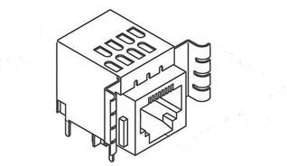

## O-RAN.WG7.OMC-HRD-Opt7-2-R003-v04.00.docx

- View in [Reader Mode](https://simewu.com/spec-reader/pages/05-WG7/O-RAN.WG7.OMC-HRD-Opt7-2-R003-v04.00.docx).
- Go back to [Table of Contents](../README.md).
- Download the [Original Document](https://github.com/Simewu/spec-reader/raw/refs/heads/main/documents/O-RAN.WG7.OMC-HRD-Opt7-2-R003-v04.00.docx).

---

## ORAN.WG7.OMC-HRD.07-2-R003-v04.00

*Technical Specification*

**O-RAN White Box Hardware Working Group Hardware Reference Design Specification for Outdoor Micro Cell**

**with Split Architecture Option 7.2**

Copyright (C) 2023 by the O-RAN ALLIANCE e.V.

The copying or incorporation into any other work of part or all of the material available in this specification in any form without the prior written permission of O-RAN ALLIANCE e.V. is prohibited, save that you may print or download extracts of the material of this specification for your personal use, or copy the material of this specification for the purpose of sending to individual third parties for their information provided that you acknowledge O-RAN ALLIANCE as the source of the material and that you inform the third party that these conditions apply to them and that they must comply with them.

O-RAN ALLIANCE e.V., Buschkauler Weg 27, 53347 Alfter, Germany

# Revision History

|  |  |  |  |
| --- | --- | --- | --- |
| Date | Revision | Author | Description |
| 02/15/2023 | v04.00 | WG7 | Addition of Optional Die to Die Interfacing in 2.3.2.3 |
| 06/22/2022 | v03.00 | WG7 | Expanded chapter 2.3.7 to include detailed information on thermal design. Added chapter 2.3.2.3 to provide details of optional internal interfaces within an O-RU. Updated header and footers. |
| 07/21/2021 | v02.00 | WG7 | Add normative and informative notification to scope. |
| 02/03/2021 | v01.00 | WG7 | First Published Version |

2

3

# Contents

1. Revision History 2
2. Tables 7
3. Figures 8
4. Chapter 1 Introductory Material 10
5. 1.1 Scope 10
6. 1.2 References 10
7. 1.3 Definitions and Abbreviations 12
8. 1.3.1 Definitions 12
9. 1.3.2 Abbreviations 12
10. Chapter 2 Hardware Reference Design 1 17
11. 2.1 O-CU Hardware Reference Design 17
12. 2.2 O-DU7-2 Hardware Reference Design 17
13. 2.2.1 O-DU7-2 High-Level Functional Block Diagram 18
14. 2.2.2 O-DU7-2 Hardware Design Description 18
15. 2.2.3 O-DU7-2 Hardware Components 19
16. 2.2.3.1 Digital Processing Unit 19
17. 2.2.3.1.1 Digital Processing Unit Requirements 19
18. 2.2.3.1.1.1 Interfaces 20
19. 2.2.3.1.1.1.1 Memory Channel Interfaces 20
20. 2.2.3.1.1.1.2 PCIe 20
21. 2.2.3.1.1.1.3 Ethernet 20
22. 2.2.3.1.2 Digital Processing Unit Design 20
23. 2.2.3.2 Hardware Accelerator 21
24. 2.2.3.2.1 Accelerator Design Solution 1 21
25. 2.2.3.2.1.1 Accelerator Requirements 21
26. 2.2.3.2.1.2 Accelerator Design 23
27. 2.2.3.2.2 Accelerator Design Solution 2 23
28. 2.2.3.2.2.1 Accelerator Requirement 24
29. 2.2.3.2.2.2 Accelerator Design 24
30. 2.2.3.2.3 Accelerator Design Solution 3 25
31. 2.2.3.2.3.1 Accelerator Hardware Features 25
32. 2.2.3.2.3.2 Hardware Accelerator Firmware Features 26
33. 2.2.3.2.4 Accelerator Design Solution 4 27
34. 2.2.3.2.4.1 Accelerator Hardware Features 27
35. 2.2.3.2.4.2 Hardware Accelerator Firmware Features 28
36. 2.2.3.2.5 Accelerator Design Solution 5 28
37. 2.2.3.2.5.1 Accelerator Requirements 29
38. 2.2.3.2.5.2 Accelerator Design 29
39. 2.2.3.3 Baseboard Management Controller 30
40. 2.2.4 Synchronization and Timing 31
41. 2.2.4.1 Synchronization and Timing Design 1 31
42. 2.2.4.2 Hardware Requirements 31
43. 2.2.4.3 Hardware Design 31
44. 2.2.5 External Interface Ports 31
45. 2.2.5.1 Hardware Requirements 31
46. 2.2.5.2 Hardware Design 32
47. 2.2.6 O-DU Firmware 32
48. 2.2.7 Mechanical 32
49. 2.2.7.1 Mother Board 32
50. 2.2.7.2 Chassis 33
51. 2.2.7.3 Cooling 34
52. 2.2.8 Power Unit 34
53. 2.2.8.1 Hardware Requirements 34
54. 2.2.8.2 Hardware Design 35
55. 2.2.9 Thermal 35
56. 2.2.10 Environmental and Regulations 35
57. 2.3 O-RU7-2 Hardware Reference Design 36
58. 2.3.1 O-RU7-2 High-Level Functional Block Diagram 36
59. 2.3.2 O-RU7-2 Hardware Components 36
60. 2.3.2.1 Digital Processing Unit 39
61. 2.3.2.1.1 FPGA/ASIC Solution 40
62. 2.3.2.1.1.1 FPGA Specifications 40
63. 2.3.2.1.1.2 FPGA Design 41
64. 2.3.2.2 RF Processing Unit 42
65. 2.3.2.2.1 Transceiver Reference Design 42
66. 2.3.2.2.1.1 Hardware Specifications 42
67. 2.3.2.2.1.1.1 Interface 42
68. 2.3.2.2.1.1.2 Algorithm 44
69. 2.3.2.2.1.1.3 Device Configuration 44
70. 2.3.2.2.1.1.4 Power Dissipation 44
71. 2.3.2.2.1.1.5 RF Specifications 44
72. 2.3.2.2.1.2 Hardware Design 47
73. 2.3.2.2.2 Power Amplifier (PA) Reference Design 48
74. 2.3.2.2.2.1 Hardware Specifications 48
75. 2.3.2.2.2.1.1 Interface 48
76. 2.3.2.2.2.1.2 Power Specifications 48
77. 2.3.2.2.2.1.3 RF Specifications 48
78. 2.3.2.2.2.2 Hardware Design 48
79. 2.3.2.2.3 Low Noise Amplifier (LNA) Reference Design 49
80. 2.3.2.2.3.1.1 Interface 49
81. 2.3.2.2.3.1.2 Power Specifications 49
82. 2.3.2.2.3.1.3 RF Performance Specifications 50
83. 2.3.2.2.3.2 Hardware Design 50
84. 2.3.2.2.4 Circulator Reference Design 50
85. 2.3.2.2.4.1 Hardware Specifications 50
86. 2.3.2.2.4.1.1 Interface 50
87. 2.3.2.2.4.1.2 RF Specifications 51
88. 2.3.2.2.4.2 Hardware Design 51
89. 2.3.2.2.5 Antenna / Phased Array Reference Design 51
90. 2.3.2.2.5.1 Hardware Specifications for Omnidirectional Antenna 51
91. 2.3.2.2.5.1.1 Hardware Design for Omnidirectional Antenna 52
92. 2.3.2.2.5.2 Hardware Specifications for Directional Antenna 52
93. 2.3.2.2.5.2.1 Hardware Design for Directional Antenna 53
94. 2.3.2.3 Internal Interfaces 54
95. 2.3.2.3.1 Optional JES204 Interfacing 54
96. 2.3.2.3.2 Optional Die to Die Interfacing 59
97. 2.3.3 Synchronization and Timing 61
98. 2.3.3.1 Hardware Specifications 61
99. 2.3.3.1.1 Interface 61
100. 2.3.3.1.2 Performance Specifications 62
101. 2.3.3.1.3 Synchronizer 62
102. 2.3.3.1.3.1 Hardware Specifications 62
103. 2.3.3.1.3.1.1 Interface 62
104. 2.3.3.1.3.1.2 Performance Specifications 62
105. 2.3.3.1.3.2 Hardware Design 63
106. 2.3.3.1.4 Reference Synthesizer 63
107. 2.3.3.1.4.1 Hardware Specifications 63
108. 2.3.3.1.4.1.1 Interface 63
109. 2.3.3.1.4.1.2 Performance Specifications 64
110. 2.3.3.1.4.2 Hardware Design 64
111. 2.3.3.2 Hardware Design 64
112. 2.3.4 External Interface Ports 64
113. 2.3.4.1 Hardware Specifications 64
114. 2.3.4.2 Hardware Design 65
115. 2.3.4.2.1 Fronthaul Interface 65
116. 2.3.4.2.2 Debug Interface 65
117. 2.3.4.2.3 Power Interface 66
118. 2.3.4.2.4 RF Interface 66
119. 2.3.5 Mechanical 67
120. 2.3.6 Power Unit 69
121. 2.3.6.1 Hardware Specifications 69
122. 2.3.6.2 Hardware Design 69
123. 2.3.7 Thermal 70
124. 2.3.8 Environmental and Regulations 71
125. 2.4 Integrated O-DU & O-RU (gNB-DU) Reference Design 72
126. 2.4.1 O-DU Portion of Integrated Reference Design 72
127. 2.4.1.1 O-DU High-Level Functional Block Diagram 72
128. 2.4.1.2 O-DU Hardware Components 72
129. 2.4.1.2.1 Digital Processing Unit 72
130. 2.4.1.2.2 Hardware Accelerator (if required by design) 72
131. 2.4.1.2.2.1 Accelerator Design 1 72
132. 2.4.1.2.2.2 Accelerator Design 2 72
133. 2.4.1.3 Synchronization and Timing 72
134. 2.4.2 O-RU Portion of Integrated Reference Design 72
135. 2.4.2.1 O-RU High-Level Functional Block Diagram 72
136. 2.4.2.2 O-RU Hardware Components 72
137. 2.4.2.2.1 Digital Processing Unit 72
138. 2.4.2.2.2 RF Processing Unit 72
139. 2.4.2.2.2.1 Transceiver Reference Design 72
140. 2.4.2.2.2.2 Power Amplifier (PA) Reference Design 72
141. 2.4.2.2.2.3 Low Noise Amplifier (LNA) Reference Design 72
142. 2.4.2.2.2.4 RF Switch Reference Design 72
143. 2.4.2.2.2.5 Antenna / Phased Array Reference Design 72
144. 2.4.2.2.3 Synchronization and Timing 72
145. 2.4.3 External Interface Ports 72
146. 2.4.4 O-DU/O-RU Firmware (if required by design) 72
147. 2.4.5 Mechanical 72
148. 2.4.6 Power Unit 72
149. 2.4.7 Thermal 73
150. 2.4.8 Environmental and Regulations 73
151. 2.5 Integrated O-CU & O-DU Reference Design 73
152. 2.5.1 O-CU Portion of Integrated Reference Design 73
153. 2.5.1.1 Integrated O-CU High-Level Functional Block Diagram 73
154. 2.5.1.2 O-CU Hardware Components 73
155. 2.5.1.2.1 Digital Processing Unit 73
156. 2.5.1.2.2 Hardware Accelerator (if required by design) 73
157. 2.5.1.2.2.1 Accelerator Design 1 73
158. 2.5.1.2.2.2 Accelerator Design 2 73
159. 2.5.1.3 Synchronization and Timing 73
160. 2.5.1.4 O-CU Firmware (if required by design) 73
161. 2.5.2 O-DU Portion of Hardware Reference Design 73
162. 2.5.2.1 O-DU High-Level Functional Block Diagram 73
163. 2.5.2.2 O-DU Hardware Components 73
164. 2.5.2.2.1 Digital Processing Unit 73
165. 2.5.2.2.2 Hardware Accelerator (if required by design) 73
166. 2.5.2.2.2.1 Accelerator Design 1 73
167. 2.5.2.2.2.2 Accelerator Design 2 73
168. 2.5.2.3 Synchronization and Timing 73
169. 2.5.3 External Interface Ports 73
170. 2.5.4 O-DU Firmware 73
171. 2.5.5 Mechanical 73
172. 2.5.6 Power Unit 74
173. 2.5.7 Thermal 74
174. 2.5.8 Environmental and Regulations 74
175. 2.6 FHGW Hardware Reference Design 74
176. 2.6.1 FHGW High-Level Functional Block Diagram 74
177. 2.6.2 FHGW Hardware Components 74
178. 2.6.2.1 Digital Processing Unit 74
179. 2.6.3 Synchronization and Timing 74
180. 2.6.4 External Interface Ports 74
181. 2.6.5 Mechanical 74
182. 2.6.6 Power 74
183. 2.6.7 Thermal 74
184. 2.6.8 Environmental 74
185. Annex 1: Parts Reference List 74
186. Annex 1.1 O-CU Reference Parts List 74
187. Annex 1.2 O-DU7-2 Reference Parts List 75
188. Annex 1.3 O-RU7-2 Reference Parts List 75

9

1. Tables
2. Table 2.2.3-1 Processor Feature List 20
3. Table 2.2.3-2 Memory Channel Feature List 20
4. Table 2.2.3-3 Accelerator Hardware Feature List 22
5. Table 2.2.3-4 Accelerator Firmware Feature List 22
6. Table 2.2.3-5 Accelerator Hardware Feature List 24
7. Table 2.2.3-6 Accelerator Firmware Feature List 24
8. Table 2.2.3-7 Accelerator Hardware Features 25
9. Table 2.2.3-8 Hardware Accelerator Firmware Features 26
10. Table 2.2.3-9 Accelerator Hardware Features 27
11. Table 2.2.3-10 Hardware Accelerator Firmware Features 28
12. Table 2.2.3-11 Accelerator Hardware Feature List] 29
13. Table 2.2.3-12 Accelerator Firmware Feature List 29
14. Table 2.2.5-1 External Port List 32
15. Table 2.2.8-1 Power Supply Rail Requirements 34
16. Table 2.2.8-2 Power Supply Unit Feature List 35
17. Table 2.2.10-1 Environmental Features 35
18. Table 2.3.2-1 FPGA Interface Specifications 41
19. Table 2.3.2-2 FPGA Functional Blocks 42
20. Table 2.3.2-3 RF Processing Unit Interface Specifications 42
21. Table 2.3.2-4 JESD204B/C Serial Data Rates 44
22. Table 2.3.2-5 Transceiver RF Specifications 44
23. Table 2.3.2-6 Power Amplifier Interface Specifications 48
24. Table 2.3.2-7 Power Amplifier RF Specifications 48
25. Table 2.3.2-8 LNA Interfaces 49
26. Table 2.3.2-9 LNA RF Specifications 50
27. Table 2.3.2-10 Circulator Specifications 51
28. Table 2.3.2-11 Omnidirectional Antenna Specifications 52
29. Table 2.3.2-12 Directional Antenna Specifications 53
30. Table 2.3.2-13 JESD204 Abridged Lexicon 55
31. Table 2.3.3-1 Synchronization and Timing Interface Specifications 61
32. Table 2.3.3-2 Synchronizer Interface Specifications 62
33. Table 2.3.3-3 Synchronizer Performance Specifications 62
34. Table 2.3.3-4 Synthesizer Interface Specifications 63
35. Table 2.3.3-5 TCXO Clock Performance Specifications 64
36. Table 2.3.4-1 External Port List 65
37. Table 2.3.6-1 Transceiver Module Specifications 69
38. Table 2.3.6-2 RF Front End Module Specifications 69
39. [Table 2.3.7-1 Thermal Conductivity of common Metals 13] 70
40. [Table 2.3.7-2 Convective heat transfer coefficient 14] 70
41. Table 2.3.8-1 Environmental Features 71

11

# Figures

1. Figure 2.2.1-1 O-DU**7-2** Functional Block Diagram 18
2. Figure 2.2.2-1 O-DU**7-2** Hardware Block Diagram 19
3. Figure 2.2.3-1 Accelerator Design 1 without optional NIC Device 23
4. Figure 2.2.3-2 Accelerator Design 1 with optional NIC Device 23
5. Figure 2.2.3-3 Structured ASIC Accelerator Design 24
6. Figure 2.2.3-4 Dual-chip FPGA-based Hardware Acceleration in O-DU**7-2** 26
7. Figure 2.2.3-5 Single-chip FPGA-based Hardware Acceleration in O-DU**7-2** 28
8. Figure 2.2.3-6 Accelerator Design Using PCIe 30
9. Figure 2.2.3-7 Accelerator Design Using Ethernet 30
10. Figure 2.2.4-1 O-DU Timing Synchronization 31
11. Figure 2.2.5-1 External Interface Reference Design 32
12. Figure 2.2.7-1 Mother Board Layout Diagram 33
13. Figure 2.2.7-2 Chassis Mechanical Diagram 34
14. Figure 2.3.1-1 High-Level Functional Block Diagram 36
15. Figure 2.3.2-1 4T4R General Block Diagram with full RF front end 37
16. Figure 2.3.2-2 8T8R General Block Diagram with RF front end 38
17. Figure 2.3.2-3 O-RU Architecture Example Implementation 1 39
18. Figure 2.3.2-4 Digital Processing Unit Block Diagram (L1 Processing + optional Beamforming) 40
19. Figure 2.3.2-5 Digital Processing Unit Block Diagram (DFE) 40
20. Figure 2.3.2-6 Transceiver with Integrated CFR and DPD 47
21. Figure 2.3.2-7 Power Amplifier Reference Design 49
22. Figure 2.3.2-8 LNA Reference Design 50
23. Figure 2.3.2-9 Circulator Reference Design 51
24. Figure 2.3.2-10 Canister Style Omni Antenna 52
25. Figure 2.3.2-11 Mounting arrangement scenario 1 of 4T4R radios on the back of Directional Antenna 53
26. Figure 2.3.2-12 Mounting arrangement scenario 2 of 4T4R radios remotely mounted with Directional
27. Antenna 54
28. Figure 2.3.2-13 Example 4T4R JESD204 Configuration 56
29. Figure 2.3.2-14 4T4R Example Data Mapping 57
30. Figure 2.3.2-15 Example 8T8R JESD204 Configuration 58
31. Figure 2.3.2-16 8T8R Example Data Mapping 59
32. Figure 2.3.17-1 Basic die-to-die parallel architecture 59
33. Figure 2.3.3-1 Clock and Synchronization Functional Block Diagram 61
34. Figure 2.3.3-2 Synchronizer Block Diagram 63
35. Figure 2.3.3-3 Synthesizer Block Diagram 64
36. Figure 2.3.4-1 SFP+ case and connector 65
37. Figure 2.3.4-2 RJ45 Interface 66
38. Figure 2.3.4-3 Power Interface 66
39. [Figure 2.3.4-4 (a) 4.3-10+ RF Connector [9] [11] (b) M-LOC cluster/multiport connector 12] 67
40. Figure 2.3.5-1 Mechanical Enclosure Side View 68
41. Figure 2.3.5-2 Mechanical Enclosure End View 68
42. Figure 2.3.6-1 Power Reference Design 70

15

16

# Chapter 1 Introductory Material

## 1.1 Scope

1. This Technical Specification has been produced by the O-RAN.org.
2. The contents of the present document are subject to continuing work within O-RAN WG7 and may change
3. following formal O-RAN approval. Should the O-RAN.org modify the contents of the present document, it
4. will be re-released by O-RAN Alliance with an identifying change of release date and an increase in version
5. number as follows:
6. Release x.y.z
7. where:
8. x the first digit is incremented for all changes of substance, i.e. technical enhancements, corrections,
9. updates, etc. (the initial approved document will have x=01).
10. y the second digit is incremented when editorial only changes have been incorporated in the
11. document.
12. z the third digit included only in working versions of the document indicating incremental changes
13. during the editing process. This variable is for internal WG7 use only.
14. The present document specifies system requirements and high-level architecture for the Outdoor Micro Cell
15. for FR1 deployment scenario as specified in the Deployment Scenarios and Base Station Classes document
16. [1].
17. In the main body of this specification (in any "chapter") the information contained therein is informative,
18. unless explicitly described as normative. Information contained in an "Annex" to this specification is always
19. informative unless otherwise marked as normative.

## 1.2 References

1. The following documents contain provisions which, through reference in this text, constitute provisions of
2. the present document.
3. [1] ORAN-WG7.DSC.0-V02.00 Technical Specification, 'Deployment Scenarios and Base Station Classes
4. for White Box Hardware'. <https://www.o-ran.org/specifications>
5. [2] 3GPP TR 21.905: "Vocabulary for 3GPP Specifications".
6. [3] 3GPP TR 38.104: "NR; Base Station (BS) radio transmission and reception".
7. [http://www.3gpp.org/ftp//Specs/archive/38\_series/38.104/38104-g10.zip](http://www.3gpp.org/ftp/Specs/archive/38_series/38.104/38104-g10.zip)
8. [4] ORAN-WG4.CUS.0-v05.00 Technical Specification, 'O-RAN Fronthaul Working Group Control, User
9. and Synchronization Plane Specification'. <https://www.o-ran.org/specifications>
10. [5] 3GPP TS 38.113:"NR: Base Station (BS) Electromagnetic Compatibility (EMC)".
11. [http://www.3gpp.org/ftp//Specs/archive/38\_series/38.113/38113-f80.zip](http://www.3gpp.org/ftp/Specs/archive/38_series/38.113/38113-f80.zip)
12. [6] ORAN-WG7.OMC. HAR-v01.00 Technical Specification, 'Outdoor Micro Cell Hardware Architecture
13. and Requirement (FR1) Specification'. <https://www.o-ran.org/specifications>.
14. [7] "Data Plane Development Kit", <https://www.dpdk.org/>
15. [8] "Baseband Device Library", <https://doc.dpdk.org/guides/prog_guide/bbdev.html>.
16. [9] IEC 61169-54 International Standard, "Radio frequency connectors - Part 54: Sectional specification for
17. coaxial connectors with 10 mm inner diameter of outer conductor, nominal characteristic impedance 50 Ohms,
18. Series 4.3-10", <https://webstore.ansi.org/Standards/BSI/BSENIEC61169542021>
19. [10] AISG 2.0, "Control interface for antenna line devices", Antenna Interface Standards Group, June 2006.
20. [11]
21. [https://www.rosenberger.com/0\_documents/de/catalogs/ba\_communication/catalog\_coax/15\_Chapter\_43-](https://www.rosenberger.com/0_documents/de/catalogs/ba_communication/catalog_coax/15_Chapter_43-10_41-95.pdf)
22. [10\_41-95.pdf](https://www.rosenberger.com/0_documents/de/catalogs/ba_communication/catalog_coax/15_Chapter_43-10_41-95.pdf) (Accessed on March 30, 2022)
23. [12] [https://www.commscope.com/product-type/cable-assemblies/wireless-cable-assemblies/coaxial-cable-](https://www.commscope.com/product-type/cable-assemblies/wireless-cable-assemblies/coaxial-cable-assemblies/itemmloc-f1xm-4)
24. [assemblies/itemmloc-f1xm-4](https://www.commscope.com/product-type/cable-assemblies/wireless-cable-assemblies/coaxial-cable-assemblies/itemmloc-f1xm-4) (Accessed on March 30, 2022)
25. [13] Zhong, J., Liu, D., Li, Z., &amp; Sun, X, High thermal conductivity materials and their application on the
26. electronic products. In 2012 IEEE Asia-Pacific Conference on Antennas and Propagation, pp. 173-175, August
27. 2012.
28. [14] [https://www.engineersedge.com/heat\_transfer/convective\_heat\_transfer\_coefficients 13378.htm](https://www.engineersedge.com/heat_transfer/convective_heat_transfer_coefficients__13378.htm)
29. (Accessed on April 8, 2022)
30. [15] <https://www.thermoworks.com/emissivity-table/> (Accessed on April 8, 2022)
31. [16] "Serial Interface for Data Converters", JESD204C.1, December 2021, [www.jedec.org](http://www.jedec.org/)
32. [17] "JESD204x Frame Mapping Table Generator", [https://www.analog.com/en/license/licensing-](https://www.analog.com/en/license/licensing-agreement/jesd204x-frame-mapping-table-generator.html)
33. [agreement/jesd204x-frame-mapping-table-generator.html](https://www.analog.com/en/license/licensing-agreement/jesd204x-frame-mapping-table-generator.html)
34. [18] AIB specification: <https://github.com/chipsalliance/AIB-specification>
35. [19] BoW PHY specification: <https://opencomputeproject.github.io/ODSA-BoW/bow_specification.html>
36. [20] Universal Chiplet Interconnect Express web site:<https://www.uciexpress.org/> 28

## 1.3 Definitions and Abbreviations

### 1.3.1 Definitions

1. For the purposes of the present document, the terms and definitions given in 3GPP TR 21.905 [2] and the
2. following apply. A term defined in the present document takes precedence over the definition of the same
3. term, if any, in 3GPP TR 21.905 [2]. For the base station classes of Pico, Micro and Macro, the definitions
4. are given in 3GPP TR 38.104 [3].
5. **Integrated architecture**: In the integrated architecture, the O-RU and O-DU are implemented on one
6. platform. Each O-RU and RF front end is associated with one O-DU. They are then aggregated to O-CU and
7. connected by F1 interface.
8. **Split architecture**: The O-RU and O-DU are physically separated from one another in this architecture. A
9. switch may aggregate multiple O-RUs to one O-DU. O-DU, switch and O-RUs are connected by the
10. fronthaul interface as defined in WG4.

### 1.3.2 Abbreviations

1. For the purposes of the present document, the abbreviations given in [2] and the following apply. An
2. abbreviation defined in the present document takes precedence over the definition of the same abbreviation,
3. if any, as in [2].
4. 3GPP Third Generation Partnership Project
5. 5G Fifth-Generation Mobile Communications
6. 7-2 Fronthaul interface split option as defined by O-RAN WG4, also referred to as 7-2x
7. ACLR Adjacent Channel Leakage Ratio
8. ADC Analog to Digital Converter
9. AGC Automatic Gain Control
10. AIB Advanced Interface Bus
11. AISG Antenna Interface Standards Group
12. ASIC Application Specific Integrated Circuit
13. BBDEV Baseband Device
14. BH Backhaul
15. BIOS Basic Input/Output System
16. BMC Baseboard Management Controller
17. BoW Bunch of Wires

|  |  |  |
| --- | --- | --- |
| 1 | BS | Base Station |
| 2 | BW | Bandwidth |
| 3 | C2C | Chip to Chip Interface |
| 4 | CDR | Clock and Data Recovery |
| 5 | CFR | Crest Factor Reduction |
| 6 | CISPR | International Special Committee on Radio Interference |
| 7 | CLB | Configurable Logic Block |
| 8 | CPU | Central Processing Unit |
| 9 | CRC | Cyclic Redundancy Check |
| 10 | CU | Centralized Unit as defined by 3GPP |
| 11 | DAC | Digital to Analog Converter |
| 12 | DDC | Digital Down Conversion |
| 13 | DDR | Double Data Rate |
| 14 | DEVCLK | Device Clock |
| 15 | DIMM | Dual-Inline-Memory-Modules |
| 16 | D2D | Die-to-Die Interface |
| 17 | DL | Downlink |
| 18 | DMA | Direct Memory Access |
| 19 | DPD | Digital Pre-Distortion |
| 20 | DPDK | Data Plane Development Kit |
| 21 | DPU | Digital Processing Unit |
| 22 | DSP | Digital Signal Processor |
| 23 | DU | Distributed Unit as defined by 3GPP |
| 24 | DUC | Digital Up Conversion |
| 25 | ECC | Error Correcting Code |
| 26 | eCPRI | evolved Common Public Radio Interface |
| 27 | EMC | Electro Magnetic Compatibility |
| 28 | ENIAC | Embedded NIC Inline Accelerator |
| 29 | EVM | Error Vector Magnitude |

|  |  |  |
| --- | --- | --- |
| 1 | FCC | Federal Communications Commission |
| 2 | FEC | Forward Error Correction |
| 3 | FFT | Fast Fourier Transform |
| 4 | FH | Fronthaul |
| 5 | FHGW | Fronthaul Gateway |
| 6 | FHGWx | Fronthaul gateway with no FH protocol translation, supporting an O-DU with split option x |
| 7 |  | and an O-RU with split option x, with currently available options 6 6, 7-2 7-2 and 8 8  |
| 8 | FHGWx?y | Fronthaul Gateway that can translate fronthaul protocol from an O-DU with split option x to |
| 9 |  | an O-RU with split option y, with currently available option 7-2 8.  |
| 10 | FHHL | Full Height Half Length |
| 11 | FPGA | Field Programmable Gate Array |
| 12 | GbE | Gigabit Ethernet |
| 13 | GMC | Grand Master Clock |
| 14 | GNSS | Global Navigation Satellite System |
| 15 | GPIO | General Purpose Input Output |
| 16 | GPP | General Purpose Processor |
| 17 | GPS | Global Positioning System |
| 18 | GUI | Graphical User Interface |
| 19 | HAR | Hardware Architecture Requirement |
| 20 | HARQ | Hybrid Automatic Repeat request |
| 21 | HDD | Hard Disk Drive |
| 22 | HHHL | Half Height Half Length |
| 23 | HRD | Hardware Reference Design |
| 24 | HW | Hardware |
| 25 | I/O | Input/Output |
| 26 | I2C | Inter-Integrated Circuit (multi IC interface standard) |
| 27 | IEEE | Institute of Electrical and Electronics Engineers |
| 28 | IFFT | Inverse Fast Fourier Transform |
| 29 | IMC | Integrated Memory Controller |

|  |  |  |
| --- | --- | --- |
| 1 | IMD | Inter Modulation Distortion |
| 2 | JTAG | Joint Test Action Group |
| 3 | KVM | Kernel-based Virtual Machine |
| 4 | L1 | Layer 1 |
| 5 | L2 | Layer 2 |
| 6 | LDPC | Low-Density Parity Codes |
| 7 | LNA | Low Noise Amplifier |
| 8 | LRDIMM | Load-Reduced Dual In-line Memory Module |
| 9 | LTE | Long Term Evolution |
| 10 | LUT | Look-up Table |
| 11 | MH | Midhaul |
| 12 | NEBS | Network Equipment-Building System |
| 13 | NFV | Network Functions Virtualization |
| 14 | NIC | Network Interface Controller |
| 15 | NR | New Radio |
| 16 | OAM | Operations, administration and management |
| 17 | O-CU | O-RAN Centralized Unit as defined by O-RAN |
| 18 | OCXO | Oven Controlled Crystal Oscillator |
| 19 | O-DUx | A specific O-RAN Distributed Unit having fronthaul split option x where x may be 6, 7-2 |
| 20 |  | (as defined by WG4) or 8. |
| 21 | OMC | Outdoor Microcell |
| 22 | O-RUx | A specific O-RAN Radio Unit having fronthaul split option x, where x is 6, 7-2 (as defined |
| 23 |  | by WG4) or 8, and which is used in a configuration where the fronthaul interface is the same |
| 24 |  | at the O-DUx. |
| 25 | ORx | Observation Receiver |
| 26 | PA | Power Amplifier |
| 27 | PCH | Platform Controller Hub |
| 28 | PCIe | Peripheral Component Interface Express |
| 29 | PHC | Physical Hardware Clock |
| 30 | PHY | Physical Layer |

|  |  |  |
| --- | --- | --- |
| 1 | PMBus | Power Management Bus |
| 2 | PPS | Pulse Per Second |
| 3 | PRACH | Physical Random-Access Channel |
| 4 | PTP | Precision Time Protocol |
| 5 | PWM | Pulse Width Modulation |
| 6 | QSFP | Quad Small Form-factor Pluggable |
| 7 | RAN | Radio Access Network |
| 8 | RDIMM | Registered Dual In-line Memory Module |
| 9 | RE | Resource Element |
| 10 | RF | Radio Frequency |
| 11 | RoE | Radio over Ethernet |
| 12 | RU | Radio Unit as defined by 3GPP |
| 13 | Rx | Receiver |
| 14 | SDFEC | Soft-Decision Forward Error Correction |
| 15 | SERDES | Serializer / De-serializer |
| 16 | SFP | Small Form-factor Pluggable |
| 17 | SFP+ | Small Form-factor Pluggable plus |
| 18 | SMA | Sub-Miniature Version A (connector) |
| 19 | SoC | System On Chip |
| 20 | SPI | Serial Peripheral Interface |
| 21 | SSD | Solid State Drive |
| 22 | SyncE | Synchronous Ethernet |
| 23 | TCXO | Temperature Compensate Crystal Oscillator |
| 24 | TDD | Time Division Duplex |
| 25 | TDP | Thermal Design Power |
| 26 | TR | Technical Report |
| 27 | TR | Transmit Receive (switch) |
| 28 | TRx | Transceiver |
| 29 | TS | Technical Specification |

1. Tx Transmitter
2. UEFI Unified Extensible Firmware Interface
3. UCIe Universal Chiplet Interface Express
4. UL Uplink
5. USB Universal Serial Bus
6. UTC Coordinate Universal Time
7. WG Working Group

# Chapter 2 Hardware Reference Design 1

1. This chapter describes a white box hardware reference design example for outdoor Microcell deployment
2. scenario. It includes O-CU and O-DU7-2 for OMC deployment scenario.

## 2.1 O-CU Hardware Reference Design

1. The O-CU white box hardware is the platform that perform the O-CU function of upper L2 and L3. The
2. hardware systems specified in this document meet the computing, power and environmental requirements of
3. use cases configurations and feature sets of RAN physical node. These requirements are described in the early
4. hardware requirement specification as well as in the use cases document. The O-CU hardware includes the
5. chassis platform, mother board, peripheral devices and cooling devices. The mother board contains processing
6. unit, memory, the internal I/O interfaces, and external connection ports. The midhaul (MH) and backhaul (BH)
7. interface are used to carry the traffic between O-CU and O-DU7-2 as well as O-CU and core network. The other
8. hardware functional components include: the storage for software, hardware and system debugging interfaces,
9. board management controller, just to name a few; the O-CU designer will make decision based on the specific
10. needs of the implementation.
11. The HW reference design of O-CU is the same as O-DU7-2 except for the need of HW accelerator, thus detail
12. design will be described in O-DU7-2 section 2.2.

## 2.2 O-DU7-2 Hardware Reference Design

1. The O-DU7-2 white box hardware is the platform that performs the O- DU7-2 functions such as upper L1 and
2. lower L2 functions. The hardware systems specified in this document meet the computing, power and
3. environmental requirements of use case's configurations and feature sets of RAN physical node. These
4. requirements are described in the early hardware requirement specification as well as in the use cases document.
5. The O-DU7-2 hardware includes the chassis platform, mother board, peripheral devices and cooling devices.
6. The mother board contains processing unit, memory, the internal I/O interfaces, and external connection ports.
7. The fronthaul and backhaul interface are used to carry the traffic between O-RU7-2 / FHGW7-2 / FHGW7-2?8
8. and O-DU7-2 as well as O-CU and O-DU7-2. The O-DU7-2 design may also provide an interface for hardware
9. accelerator if that option is preferred. The other hardware functional components include: the storage for
10. software, hardware and system debugging interfaces, board management controller, just to name a few; the O-
11. DU7-2 designer will make decision based on the specific needs of the implementation.
12. Note that the O-DU7-2 HW reference design is also feasible for O-CU and integrated O-CU / O-DU7-2.

### 2.2.1 O-DU7-2 High-Level Functional Block Diagram

1. **Figure 2.2.1-1**shows the major functional blocks of O-DU7-2. The digital processing unit handles the baseband
2. processing workload. To make the processing more efficient, an accelerator can be used to assist with the
3. baseband workload processing. The memory devices include the random-access memory (RAM) for
4. temporary storage of data while flash memory is used for codes and logs. The storage device is for persistent
5. storage. The external network cards can be used for fronthaul or backhaul connection. The baseboard
6. management controller (BMC) is a microcontroller which monitors hardware operation on motherboard. The
7. clock circuits provide digital processing unit with required clock signals. 12

13

14 **Figure 2.2.1-1 O-DU7-2 Functional Block Diagram**

15

### 16 2.2.2 O-DU7-2 Hardware Design Description

17 Figure 2.2.2-1 describes the various components and connections inside the O-DU7-2 white box.

1

2 **Figure 2.2.2-1 O-DU7-2 Hardware Block Diagram**

3

1. As described in the previous section, the O-DU7-2 hardware can be implemented with difference design choices.
2. Here, we use a SoC design-based as an example which performs most of the workload for O-DU7-2. The
3. accelerator can be used to perform other functions based on the overall performance requirement. Several
4. Ethernet controllers are also used for front haul link, back haul link and remote console control connection.
5. The other parts include: RAM, flash memory, and hard drive storage. The JTAG and USB ports are provided
6. for hardware debug and local connection if needed. Finally, BMC block is mainly responsible for monitoring
7. the hardware status of the motherboard.

### 2.2.3 O-DU7-2 Hardware Components

1. In this section, we describe the details of the O-DU7-2 hardware component's requirements, their features and
2. parameters. The component selection is based on the use case requirements which are listed in the hardware
3. architecture and requirements document [6].

#### 2.2.3.1 Digital Processing Unit

1. This example of the digital processing unit in O-DU7-2 is based on the General-Purpose Processor (GPP). 17
2. 2.2.3.1.1 Digital Processing Unit Requirements
3. The GPP requirements are listed in Table 2.2.3-1.

1 **Table 2.2.3-1 Processor Feature List**

|  |  |
| --- | --- |
| **Item Name** | **Description** |
| # of Cores | 16 |
| # of Threads | 32 |
| Base Frequency | 2.20 GHz |
| Max Turbo Frequency | 3.00 GHz |
| Cache | 22 MB |
| Thermal Design Power (TDP) | 100W |
| Max Memory Size (dependent on memory type) | 512 GB |
| Memory Types | DDR4 |
| Max # of Memory Channels | 4 |

2

3 2.2.3.1.1.1 Interfaces

1. The interface specifications on the main board are described in the sections below.
2. 2.2.3.1.1.1.1 Memory Channel Interfaces
3. The system memory capacity, type and related information are described in Table 2.2.3-2.
4. **Table 2.2.3-2 Memory Channel Feature List**

|  |  |
| --- | --- |
| **Item Name** | **Description** |
| Memory Types | DDR4 |
| # of Memory Channels | 4 |
| ECC LRDIMM | Up to 512GB |
| ECC RDIMM | Up to 256GB |
| Memory Speed | 2666/2400/2133MHz |
| DIMM Sizes | 128GB, 64GB, 32GB, 16GB |
| Memory Voltage | 1.2 V |

8 2.2.3.1.1.1.2 PCIe

1. PCIe Gen 3 should be supported by the processor. There are total of 32 PCIe lanes with 128 Gb/s bandwidth.
2. The 32 PCIe lanes can be divided into two x16 slots by using a riser card.
3. 2.2.3.1.1.1.3 Ethernet
4. The system should be capable to offer aggregated 48 Gb/s Ethernet bandwidth. The breakout the ports are
5. discussed in later section. When higher Ethernet bandwidth required, an Ethernet card can be installed in one
6. of the PCIe slot.
7. 2.2.3.1.2 Digital Processing Unit Design
8. The digital processing unit is a system-on-a-chip (SoC) device which is a 64-bit multi-core server class
9. processor. This SoC includes an integrated Platform Controller Hub (PCH), integrated high-speed I/O,
10. Integrated Memory Controllers (IMC), and four integrated 10 Gigabit Ethernet ports.
11. The SoC supports 512-bit wide vector processing instruction set. It also supports hardware virtualization to
12. enable dynamic provisioning of services as communication service providers extend network functions
13. virtualization (NFV). Figure 2.2.2-1 shows the major functional blocks of the digital processing unit.

#### 2.2.3.2 Hardware Accelerator

1. Hardware accelerators can be used in O-DU7-2 to offload computationally intensive functions and to optimize
2. the performance under varying traffic and loading conditions. While the hardware acceleration functional
3. requirements and implementation are system designer's choice; however, the O-DU7-2 is required to meet the
4. minimum system performance requirements under various loading conditions and deployment scenarios. In
5. most cases, a Field Programmable Gate Array (FPGA) or Application Specific Integrated Circuit (ASIC) based
6. PCIe card can be used to optimize the system performance. The FPGA(s) are part of a Network Interface
7. Controller (NIC) that further provides connectivity services.
8. 2.2.3.2.1 Accelerator Design Solution 1
9. Channel coding for Low-Density Parity Codes (LDPC) and fronthaul compression requires a significant
10. amount of bit level processing and is well suited to a fine-grained FPGA architecture and/or low cost/power
11. structured ASIC. Options include:
12. o Virtualization: Multi-channel DMA, Virtual machine integration, load balancing functions
13. o Look-aside FEC: LDPC (de)coding, Polar (de)coding, Rate (De)Matcher, (De) Interleaver, Cyclic
14. Redundancy Check (CRC), Hybrid Automatic Repeat request (HARQ) retransmission
15. o Bump-in-wire Fronthaul: compression / decompression for latency and bandwidth reduction 20
16. 2.2.3.2.1.1 Accelerator Requirements
17. Hardware and firmware requirements for this accelerator design are given in Table 2.2.3-3 and Table 2.2.3-4,
18. respectively.

1 **Table 2.2.3-3 Accelerator Hardware Feature List**

|  |  |
| --- | --- |
| **Item Name** | **Description** |
| PCIe (Interface with digital  processing unit) | Gen4 x16 (and lower) |
| Form factor | FHHL |
| Connectivity | 2x QSFP28/56 |
| FPGA | Logic Elements: 1437K M20K Memory: 139Mb  Quad A53 Hard Processor Sub-system |
| NIC Device | 100Gb xHAUL for FH, BH & MH traffic shaping. Optional  FPGA co-processing. |
| DDR Main | 8+8+1GB DDR4 |
| Flash (FPGA images) | >=1 Gbit |
| BMC | Telemetry, Security, remote upgrade |
| Clocking | For O-RAN C1, C2, C3 & C4 |
| Fronthaul | eCPRI, RoE IEEE1914.3, O-RAN WG4 |
| GPS | SMA for 1 PPS & 10MHz (in/out) |
| Operating Temperature  (ambient) | NEBS Compliant |
| Power | <75W (without optional NIC device) |
| Clock Accuracy | Low-Jitter, configurable clock ranging from 10MHz to  750MHz. Option for OCXO (TCXO as standard) |

2

3 **Table 2.2.3-4 Accelerator Firmware Feature List**

|  |  |
| --- | --- |
| **Item Name** | **Description** |
| Remote system upgrade | Securely upgradable FPGA flash image |
| Queuing | 64 Queues supported equally split between UL & DL. |
| LDPC Acceleration | NR LDPC Encoding with, interleaving and rate-matching.  NR LDPC Decoding with sub-block de-interleaving function of reverse rate matching.  Early Termination, CRC attachment and HARQ buffering.  5G Throughput: DL 14.8Gbps, UL 3.2Gbps |
| Load Balancing (channel coding) | Load balancer distributes the pending encoder/decoder requests to  encoder/decoders |
| Descriptor Format (channel  coding) | Code block-based interface.  Software enablement by BBDEV API (DPDK) [7], [8] |
| Fronthaul Compression | In-line compression/decompression for Mu-Law, block-floating point  and quantization according to the O-RAN WG4 specification. |
| Open programmable acceleration environment | Support for:   * FPGA Flashing upgrade * Firmware version reporting * PCIe diagnostics * Ethernet diagnostics * Temperature and voltage telemetry information |

1. 2.2.3.2.1.2 Accelerator Design
2. Figure 2.2.3-1 illustrates Accelerator Design 1 without optional NIC Device. Figure 2.2.3-2 illustrates the
3. Accelerator Design 1 with optional NIC Device.

4

5 **Figure 2.2.3-1 Accelerator Design 1 without optional NIC Device**

6

7

1. **Figure 2.2.3-2 Accelerator Design 1 with optional NIC Device**

9

1. 2.2.3.2.2 Accelerator Design Solution 2
2. Channel coding for LDPC and fronthaul compression requires a significant amount of bit level processing and
3. is well suited to a fine-grained structured ASIC. Features include:
4. o Virtualization: Multi-channel DMA, Virtual machine integration, load balancing functions
5. o Look-aside FEC: Turbo (de)coding, LDPC (de)coding, Rate (De)Matcher, (De) Interleaver, CRC, HARQ
6. retransmission & (de) interleaver.

1 2.2.3.2.2.1 Accelerator Requirement

2 Accelerator Hardware and Firmware features are listed in Table 2.2.3-5 and Table 2.2.3-6, respectively.

3

4 **Table 2.2.3-5 Accelerator Hardware Feature List**

|  |  |
| --- | --- |
| **Item Name** | **Description** |
| PCIe | Gen3 x16 |
| Form factor | HHHL |
| DDR | DDR4 (64-bit +ECC), 2667Mbps Interface for HARQ buffering |
| Board Management Controller | Telemetry, Security. |
| Power | <35W |

5

6

7 **Table 2.2.3-6 Accelerator Firmware Feature List**

|  |  |
| --- | --- |
| **Item Name** | **Description** |
| Queuing | 64 Queues supported equally split between UL & DL. |
| LDPC Acceleration | NR LDPC Encoding with, interleaving and rate-matching.  NR LDPC Decoding with sub-block de-interleaving function of reverse rate matching.  Early Termination, CRC attachment and HARQ buffering.  5G Throughput: DL 23Gbps, UL 8Gbps |
| Load Balancing (channel coding) | Load balancer distributes the pending encoder/decoder requests to  encoder/decoders |
| Descriptor Format (channel  coding) | Code block and transport block-based interface.  Software enablement by BBDEV API (DPDK) [7], [8] |

8

1. 2.2.3.2.2.2 Accelerator Design
2. The following diagram shows the structured ASIC based accelerator design.

11

1. **Figure 2.2.3-3 Structured ASIC Accelerator Design**

13

* 1. 2.2.3.2.3 Accelerator Design Solution 3
  2. The O-DU7-2 system is typically implemented using a multi-core processor and one or more hardware
  3. accelerators. Parts of O-DU7-2 protocol stack can be implemented in software running on the multi-core
  4. processors and the computationally intensive L1 and L2 functions can be offloaded to an FPGA-based
  5. hardware accelerator. This accelerator comprises two FPGAs for L1 offload and fronthaul connectivity in
  6. lookaside mode. The accelerator hardware and firmware features are listed in Table 2.2.3-7 and Table 2.2.3-8.

7

1. 2.2.3.2.3.1 Accelerator Hardware Features
2. **Table 2.2.3-7 Accelerator Hardware Features**

|  |  |  |  |
| --- | --- | --- | --- |
| **Item Name** | **Description** | | |
| SoC Resources | FPGA 1 | | FPGA 2 |
|  | System Logic cells - 930K | | System Logic cells - 1,143K |
|  | CLB LUT - 425K | | CLB LUT - 523K |
|  | SDFEC -8 | | CLB Flip-Flops -1,045K |
|  | DSP Slices - 4,272 | | DSP Slices - 1,968 |
|  | BRAM - 38.0Mb | | BRAM - 34.6Mb |
|  | URAM - 22.5Mb | | URAM - 36.0Mb |
| Form Factor | FHHL PCIe Form Factor | | |
| PCIe Interface | Gen 3 x16 with Bifurcation | | |
| On Board Memory | FPGA1 | | FPGA2 |
|  | Total Capacity 4 GB in | | Total Capacity 4 GB in |
|  | Programmable Logic, | | Programable Logic, upgradeable |
|  | upgradeable to 8GB | | to 8GB |
|  | Total Capacity 2 GB in | | Total Capacity 2 GB in |
|  | Programmable Subsystem, | | Programmable Subsystem, |
|  | upgradeable to 4GB | | upgradeable to 4GB |
| Network Interface(s) | 2xSFP28 optical interfaces to FPGA2  (User Configurable, includes 10/25 Ethernet) | | |
| Other External Interface(s) | Micro USB for JTAG support (FPGA programming and debug) and  access to BMC | | |
| Graphical User interface | GUI for monitoring the basic board parameters, monitoring  temperature alerts, firmware upgrades for BMC | | |
| Board Management Controller | Telemetry, Security, Remote Upgrade | | |
| Clocking | O-RAN C1, C2, C3, C4 | | |
| Fronthaul | eCPRI, RoE IEEE1914.3, O-RAN WG4 FH | | |
| GPS | GPS | SMA for 1 PPS (In/Out) |  |
| Operating Temperature | NEBS Compliant | | |
| Power | < 75 W | | |
| Clocking Options | Low-Jitter, configurable clock ranging from10MHz to 750MHz  1 PPS input and output with assembly option for OCXO and TCXO | | |

10

11

1. 2.2.3.2.3.2 Hardware Accelerator Firmware Features
2. **Table 2.2.3-8 Hardware Accelerator Firmware Features**

|  |  |
| --- | --- |
| **Item Name** | **Description** |
| Remote System Upgrade | Securely upgradable FPGA flash image |
| L1 Acceleration | 5G NR LDPC encoding/decoding with interleaving/de- interleaving and rate-matching/rate-de-matching along with early termination, CRC attachment, and HARQ  management |
| Hardware-Software APIs | Fully compliant with DPDK/BBDEV APIs |
| Fronthaul  Protocols/Compression | Fully compliant with O-RAN WG4 M, C,U & S-planes  Specifications |
| Open Programmable Acceleration Environment | Support for:   * FPGA flashing upgrade * Firmware version reporting * PCIe diagnostics * Ethernet diagnostics * Temperature and voltage telemetry information |

3

1. The hardware accelerator supports x86 or non-x86-based processors. Figure 2.2.3-4 illustrates the two-chip
2. acceleration architecture comprising two FPGAs with multi-lane PCIe interfaces toward the CPU and external
3. connectivity toward O-RU7-2(s) via eCPRI and O-CU(s) through GbE connectivity. The example architecture
4. further depicts multi-lane Gen3 PCIe interfaces between each FPGA and the CPU. The FPGAs communicate
5. through high-bandwidth Ethernet (GbE) transport.

9

10

1. **Figure 2.2.3-4 Dual-chip FPGA-based Hardware Acceleration in O-DU7-2**

1

* 1. 2.2.3.2.4 Accelerator Design Solution 4
  2. The O-DU7-2 system is typically implemented using a multi-core processor (CPU) and one or more hardware
  3. accelerators. Parts of O-DU7-2 protocol stack can be implemented in software running on the multi-core
  4. processors and the computationally intensive L1 and L2 functions can be offloaded to an FPGA-based
  5. hardware accelerator. This accelerator comprises a single FPGA for L1 offload in lookaside mode. The
  6. accelerator hardware and firmware features are listed in Table 2.2.3-9 and Table 2.2.3-10.

8

1. 2.2.3.2.4.1 Accelerator Hardware Features
2. **Table 2.2.3-9 Accelerator Hardware Features**

|  |  |
| --- | --- |
| **Item Name** | **Description** |
| SoC Resources | System Logic cells - 930K CLB LUT - 425K  SDFEC -8  DSP Slices - 4,272  BRAM - 38.0Mb URAM - 22.5Mb |
| Form Factor | HHHL PCIe Form Factor |
| PCIe Interface | Gen 3 x16 (Gen4 x8) |
| On Board Memory | Total Capacity 4 GB in Programmable Logic, upgradeable to 8GB  Total Capacity 2 GB in Processor Subsystem, upgradeable to 4GB |
| Other External Interface(s) | Micro USB for JTAG support (FPGA programming and debug) and  access to BMC |
| Graphical User interface | GUI for monitoring the basic board parameters, monitoring  temperature alerts, firmware upgrades for BMC |
| Board Management Controller | Telemetry, Security, Remote Upgrade |
| Operating Temperature | NEBS Compliant |
| Power | < 35 W |

11

* 1. 2.2.3.2.4.2 Hardware Accelerator Firmware Features
  2. **Table 2.2.3-10 Hardware Accelerator Firmware Features**

|  |  |
| --- | --- |
| **Item Name** | **Description** |
| Remote System Upgrade | Securely upgradable FPGA flash image |
| L1 Acceleration | 5G NR LDPC encoding/decoding with interleaving/de-interleaving and  rate-matching/rate-de-matching along with early termination, CRC attachment, and HARQ management |
| Hardware-Software APIs | Fully compliant with DPDK/BBDEV APIs |
| Open Programmable Acceleration Environment | Support for:   * FPGA flashing upgrade * Firmware version reporting * PCIe diagnostics * Ethernet diagnostics * Temperature and voltage telemetry information |

3

1. The hardware accelerator supports x86 or non-x86-based processors. Figure 2.2.3-5 illustrates the single-
2. chip acceleration architecture comprising one FPGA with Gen3 x16 or Gen4 x8 PCIe interfaces toward the
3. CPU.

7

FPGA

(L1 Offload)

X86 or ARM-based

CPU

(L2 and Partial L1)

8

PCIe Interface

PCIe Gen3x16 or Gen4 x8 100G

F1 Interface

Ethernet (10/25G)

1. **Figure 2.2.3-5 Single-chip FPGA-based Hardware Acceleration in O-DU7-2**

10

1. 2.2.3.2.5 Accelerator Design Solution 5
2. This design includes an Embedded NIC Inline Accelerator (ENIAC) with an ASIC that is capable of providing
3. NIC functions. One option supports a high-capacity O-DU using multiple PCIe cards in standard racks and
4. aligns with the FAPI interface to maximize software reuse. The second option supports a high-capacity O-DU
5. using an Ethernet-based backplane interconnect and aligns with the nFAPI interface to maximize software
6. reuse. ENIAC unloads L1 from the host, allowing it to focus on L2.

1

1. 2.2.3.2.5.1 Accelerator Requirements
2. Hardware and firmware requirements for this accelerator design are given in Table 2.2.3-11 and Table 2.2.3-12,
3. respectively.
4. **Table 2.2.3-11 Accelerator Hardware Feature List]**

|  |  |
| --- | --- |
| **Item Name** | **Description** |
| PCIe (Interface with digital  processing unit) | Gen4 x16 (and lower) |
| Form factor | FHHL |
| Connectivity | QSFP28/SFP |
| NIC Device | 100Gb xHAUL for FH, BH & MH traffic shaping. |
| DDR Main | Min 4 GB DDR4 |
| Flash (FPGA images) | >=1 Gbit |
| BMC | Telemetry, Security, remote upgrade |
| Clocking | For O-RAN C1, C2, C3 & C4 |
| Fronthaul | eCPRI, RoE IEEE1914.3, O-RAN WG4 |
| GPS | SMA for 1 PPS & 10MHz (in/out) |
| Operating Temperature  (ambient) | NEBS Compliant |
| Power | <75W |
| Clock Accuracy | Low-Jitter, configurable clock ranging from 10MHz to 750MHz. Option  for OCXO (TCXO as standard) |

6

7 **Table 2.2.3-12 Accelerator Firmware Feature List**

|  |  |
| --- | --- |
| **Item Name** | **Description** |
| Remote system upgrade | Securely upgradable image |
| Queuing | Command queuing at FAPI interface |
| LDPC Acceleration | Rel15 compliant |
| Fronthaul Compression | In-line compression/decompression for Mu-Law, block-floating point  and quantization according to the O-RAN WG4 specification. |
| Open programmable acceleration environment | Support for:   * Flashing upgrade * Firmware version reporting * PCIe diagnostics * Ethernet diagnostics * Temperature and voltage telemetry information. |

8

1. 2.2.3.2.5.2 Accelerator Design
2. Figure 2.2.3-6 illustrates Accelerator Design 5 with integrated NIC and PCIe connectivity to L2. Figure 2.2.3-7
3. illustrates Accelerator Design 5 with integrated NIC and Ethernet connectivity to L2.

FAPI on

**L1 Upper Phy Accelerator**

**8 Layer MIMO**

**Embedded NIC with eCPRI**

**L2**

**Processing**

**Timing**

PCIe4x16

O-RAN 7-2x eCPRI FH QSFP28

PPS

* 1. 10 MHz
  2. **Figure 2.2.3-6 Accelerator Design Using PCIe**

3

100 Gbps Ethernet SyncE

FAPI on

**L1 Upper Phy Accelerator**

**8 Layer MIMO**

**Embedded NIC with eCPRI**

**L2**

**Processing**

**Timing**

Ethernet

O-RAN 7-2x eCPRI FH QSFP28

PPS

4 10 MHz

100 Gbps Ethernet SyncE

5 **Figure 2.2.3-7 Accelerator Design Using Ethernet**

6

#### 2.2.3.3 Baseboard Management Controller

1. BMC is used to perform hardware power control (power on, power off and power cycle), monitor hardware
2. status (temperatures, voltages, etc), monitor Basic I/O System (BIOS)/ Unified Extensible Firmware Interface
3. (UEFI) firmware status, and log system events. It provides remote access via shared or dedicated NIC. System
4. user can do console access via serial or physical/Kernel-based Virtual Machine (KVM). The BMC has
5. dedicated RAM and flash memory. It provides access via serial port or Ethernet port. Figure 2.2.2-1 describes
6. the BMC connections with related components.

### 2.2.4 Synchronization and Timing

#### 2.2.4.1 Synchronization and Timing Design 1

1. This section describes the synchronization and timing mechanism that is used in the O-DU7-2.

#### 2.2.4.2 Hardware Requirements

1. The O-DU7-2 shall support following timing synchronization methods:
2. 1. GNSS Synchronization
3. 2. Ethernet based IEEE1588V2 Synchronization
4. 3. GNSS and IEEE1588 switching

#### 2.2.4.3 Hardware Design

1. Depending on the timing distribution topologies used, the O-DU7-2 system clock is able to synchronize with
2. the Grand Master Clock (GMC) using IEEE1588 via either the front haul NIC or backhaul NIC or
3. synchronizing timing using Global Navigation Satellite System (GNSS). In the case of IEEE1588, the Physical
4. Hardware Clock (PHC) within the NIC is synchronized with the GMC first, then the O-DU7-2 system clock is
5. synchronized with the PHC. The O-DU7-2 is also capable to provide a clock to the O-RU7-2 via front haul if
6. needed. When GNSS becomes available to O-DU7-2, it will be able to synchronize the system clock to
7. Coordinated Universal Time (UTC). Figure 2 7 outlines the O-DU7-2 timing synchronization mechanisms.

17

18 **Figure 2.2.4-1 O-DU Timing Synchronization**

19

### 2.2.5 External Interface Ports

1. The external interfaces of O-DU7-2 are described below.

#### 2.2.5.1 Hardware Requirements

1. The following table shows the external ports or slots that the system provides.

1 **Table 2.2.5-1 External Port List**

|  |  |
| --- | --- |
| **Item Name** | **Description** |
| Ethernet | Octave Gigabit Ethernet LAN connectors Dual 10GbE Base-T Ethernet connectors Dual 10GbE SFP+ Faber Ethernet connectors  2x100G QSFP28 or 2x25G SFP28 |
| USB | 2 USB 3.0 ports |
| Serial Port | 1 COM port via RJ45 |
| Antenna port | 1 SMA connector for GNSS |

2

#### 2.2.5.2 Hardware Design

* 1. The digital processing unit is a SoC device which provides the external ports described in the hardware
  2. requirement section. The system includes 2 USB 3.0 ports, and the serial RS232 port that can be used for
  3. Console Redirection, e.g. Out-of-Band Management. The system provides eight 1Gbps and four 10Gbps
  4. Ethernet ports. There are two or four 25G eCPRI ports in system depends on the accelerator card used. The
  5. system also provides a RF interface to connect GNSS antenna. The following diagram outlines the external
  6. interfaces that supported.

10

11 **Figure 2.2.5-1 External Interface Reference Design**

12

### 2.2.6 O-DU Firmware

1. BIOS and BMC firmware are needed in the system and shall be installed.

### 2.2.7 Mechanical

1. The mechanical design for mother board, chassis, and cooling are listed in this section.

#### 2.2.7.1 Mother Board

1. The mechanical layout of the mother board shows the location of major components and interface ports. The
2. following diagram also provides the dimension of the board.

1

2

3 .

#### 2.2.7.2 Chassis

**Figure 2.2.7-1 Mother Board Layout Diagram**

1. The 1U rack mount chassis contains the layout of the power supply, Solid State Drive (SSD) and fans. The
2. chassis dimension is showed in following figure.

1

2

3

#### 2.2.7.3 Cooling

**Figure 2.2.7-2 Chassis Mechanical Diagram**

1. The system installs 4x 40x28mm PWM fans for the cooling. Up to 6 fans can be installed if needed.

6

### 2.2.8 Power Unit

1. In a fully loaded system with two PCIe slots populated with 75W each, the system power consumption should
2. be less than 400W. The total system power requirement shall be kept less than 80% of the power supply
3. capacity.

#### 2.2.8.1 Hardware Requirements

1. The O-DU requires a 500W high-efficiency power supply with Power Management Bus (PMBus) 1.2
2. capability. The required power input range and output power rails are listed in the table below.
3. **Table 2.2.8-1 Power Supply Rail Requirements**

|  |  |
| --- | --- |
| **Item Name** | **Description** |
| AC Input | 100-240V, 50-60Hz, 6.6A max |
| DC Output | +3.3V: 12A  +5V: 15A  +5V standby: 3A  +12V: 41A  -12V: 0.2A |

15

#### 2.2.8.2 Hardware Design

* 1. The O-DU7-2 chassis design includes one 500W power supply unit. The power supply unit is auto-switching
  2. capable, which enables it to automatically sense and operate at a 100v to 240v input voltage. The power supply
  3. unit features are listed in the following table.
  4. **Table 2.2.8-2 Power Supply Unit Feature List**

|  |  |
| --- | --- |
| **Item Name** | **Description** |
| Output connectors | 24pin/8pin/4+4pin/HDD/I2C |
| Dimension (W x D x H) | 3.9 x 7.1 x 1.6 inch |
| Maximum Output Power | +3.3V: 12A  +5V: 15A  +12V: 41A  -12V: 0.2A  +5Vsb: 3A |
| Rated Input Voltage/Current | 100-240Vac / 6.6A max |
| Rated Input Frequency | 50-60HZ |
| Inrush current | Less than 30A |

6

### 2.2.9 Thermal

1. Active cooling with up to 6 fans is integrated in the chassis.
2. The hardware acceleration cards described in 2.2.3.2 use passive cooling and a custom heatsink and is equipped
3. with temperature sensors. It is designed to operate in temperatures ranging from -5?C to +55?C.

### 2.2.10 Environmental and Regulations

1. The O-DU7-2 hardware system is RoHS Compliant. The power supply unit is EMC FCC/CISPR Class B
2. compliant. Table 2 10 lists the environmental related features and parameters.
3. **Table 2.2.10-1 Environmental Features**

|  |  |
| --- | --- |
| **Item Name** | **Description** |
| Operating Temperature | -5?C to +55?C |
| Non-operating Temperature | -40?C to 70?C |
| Operating Relative Humidity | 8% to 90% (non-condensing) |
| Non-operating Relative Humidity | 5% to 95% (non-condensing) |

15

1. The hardware accelerator described in 2.2.3.2 is designed to operate in indoor environments and in
2. temperatures ranging from -5?C to +55?C.

## 2.3 O-RU7-2 Hardware Reference Design

1. This chapter defines the hardware reference design for the Outdoor Microcell O-RU7-2. This is defined by a
2. 7-2 interface to the O-DU on one side and up to 8T8R on the antenna port. Because this design is up to 10W
3. per channel of conducted power, the external power is supplied by either AC or a standard 48V telecom source.

### 2.3.1 O-RU7-2 High-Level Functional Block Diagram

1. Figure 2.3.1-1 provides a high-level functional block diagram depicting the major HW/SW components. It
2. also highlights the internal/external interfaces that are required. This document shows how to implement the
3. system defined by the OMC-HAR [6] document.

O-RU7-2

To/From

O-DU7-2

O-RAN

FH Interface

O-RAN FH

Processing Unit

Digital Processing Unit

To/From Antenna

Local timing from CDR

GNSS

(optional)

RF

Processing Unit

Local timing from GNSS or equivalent

#### Timing Unit

Power Unit

9

* 1. **Figure 2.3.1-1 High-Level Functional Block Diagram**

11

### 12 2.3.2 O-RU7-2 Hardware Components

13 Figure 2.3.2-1 shows a 4T4R implementation and Figure 2.3.2-2 shows an 8T8R implementation. In each of

14 these diagrams, the Digital Processing Unit is further detailed in 2.2.3.1. Items under the umbrella of RF

15 Processing Unit, including the Transceiver, RFFE and other RF items are reviewed in additional detail in

16 2.3.2.2. Clock and Synchronization are reviewed in 2.3.2.3. The Power Unit is detailed in 2.3.6.

2

**TRx**

**Reference**

**Tx**

**enable**

**Rx**

**enable**

**bypass**

**enable**

**Rx0**

RFFE

**Tx0**

**enable**

**PA**

**SERDES**

Digital Processing Unit

**ORx0**

**ORx1**

**SPI**

**Tx1**

**enable**

**PA**

RFFE

**Network**

**Clock**

**SPI**

**Clean**

**Clock**

**Rx1**

**bypass**

**enable**

Clock

Transceiver

Port A

**bypass**

**enable**

**Rx0**

RFFE

**Tx0**

**enable**

**PA**

Synchronizer

**ORx0**

**ORx1**

**Tx1**

**enable**

**PA**

RFFE

**bypass**

**enable**

Power Unit

**Rx1**

3 **Figure 2.3.2-1 4T4R General Block Diagram with full RF front end**

**TRx**

**Reference**

2

**TRx**

**Reference**

**Tx Rx**

**enable enable**

**Rx0**

**bypass enable**

RFFE

**Tx0**

**enable**

**PA**

**SERDES**

Digital Processing Unit

**ORx0**

**ORx1**

**SPI**

**Tx1**

**enable**

**PA**

RFFE

**Rx1**

**Network SPI**

**Clock**

**Clean**

**Clock**

**bypass**

**enable**

Clock

Port A

**bypass**

**enable**

**Rx0**

RFFE

**Tx0**

**PA**

**enable**

**ORx0**

Synchronizer

**ORx1**

**Tx1**

**enable**

**PA**

RFFE

**bypass**

**enable**

**Rx1**

**Rx0**

**bypass enable**

RFFE

**Tx0**

**enable**

**PA**

**ORx0**

**ORx1**

**Tx1**

**PA**

**enable**

RFFE

**Rx1**

**bypass**

**enable**

Transceiver

Port A

**bypass**

**enable**

**Rx0**

RFFE

**Tx0**

**PA**

**enable**

**ORx0**

**ORx1**

**Tx1**

**enable**

**PA**

RFFE

**bypass**

**enable**

**Rx1**

Power Unit

Transceiver

3 **Figure 2.3.2-2 8T8R General Block Diagram with RF front end**

4

1. Figure 2.3.2-3 shows an example of an high-level block details of an O-RU Hardware implementation. The
2. description of each block from left to right is given below.
3. An O-RU7-2 communicate with the O-DU7-2 through the O-RAN Fronthaul interface and the control/data
4. packets are processed by the O-RAN Fronthaul unit with the help of the CUS plane processing block.
5. Subsequently the packets are processed by the low-PHY functional blocks such as encoding, scrambling,
6. modulation, layer mapping, precoding, beamforming, and resource element mapping in the downlink. Exactly
7. the reverse operation is done during the uplink process. The output of the low-PHY block is fed to the digital
8. processing unit through packet interface. Here the frequency conversion in digital domain i.e., digital up
9. conversion (DUC) in DL and digital down conversion (DDC) in UL are done. Furthermore, DPD and CFR
10. algorithms are implemented in the digital processing unit to enhance the power amplifier efficiency by
11. reducing the PAPR/ACLR in the RF front end. The output of digital processing unit is fed to the RF processing
12. unit through the digital interface. The digital signals are converted to analog in the DL and vice versa in the
13. UL with the help of DAC and ADC functional blocks in the Transceiver unit, respectively. The signals are
14. further amplified with the help of functional blocks like the PA in DL and LNA in UL both of which are part
15. of the analog RF front end unit. The output of the power amplifier is fed to cavity filter to suppress the
16. unwanted signals in DL and is done before amplification in the case of UL operation i.e., receive operation to
17. improve selectivity. The TDD switch is used to switch the operation between DL and UL, i.e., transmit and
18. receive operations. The output of the cavity filter is fed to antenna unit and then transmitted over the air. The
19. processing units such as FH, Digital, and RF powered from the power unit and clocking and synchronization
20. is provided from the timing/synchronization block. In the case of a beamforming scenarios, antenna calibration
21. is implemented using the antenna calibration processing block. This coordinates with the low-PHY processing
22. unit and calibration switch (Cal switch) and process the signals coming from and going to the antenna
23. calibration port to compensate the amplitude and phase offsets existing in each RF chain. Other
24. implementations are also possible by rearranging the functional blocks of O-RAN FH, Digital processing, and
25. RF processing units.

24

25

26 **Figure 2.3.2-3 O-RU Architecture Example Implementation 1**

27

#### 2.3.2.1 Digital Processing Unit

1. The digital processing unit of the O-RU7-2 performs the fronthaul interface, lower L1, Synchronization, RF
2. interface, antenna calibration, digital beamforming and OAM. The following block diagram describes the
3. digital processing unit as per example implementation in

1

2

* 1. **Figure 2.3.2-4 Digital Processing Unit Block Diagram (L1 Processing + optional Beamforming)**

4

eCPRI/CPRI

|  |
| --- |
| Boot Flash |
| DDR |
| OAM |
| Digital  Processing |

|  |  |  |
| --- | --- | --- |
| CPU |  | DFE |
| FPGA/ASIC | |
|  | | |

JESD204B/C

DFE

Clock & Control

Clock & Sync

5

6 **Figure 2.3.2-5 Digital Processing Unit Block Diagram (DFE)**

7

1. 2.3.2.1.1 FPGA/ASIC Solution
2. This solution for the digital processing unit is based on an FPGA with embedded ARM processor.
3. 2.3.2.1.1.1 FPGA Specifications
4. Table 2.3.2-2 shows the general interfaces required for an FPGA based design based on Figure 2.3.2-4 and
5. Figure 2.3.2-5.

1 **Table 2.3.2-1 FPGA Interface Specifications**

|  |  |
| --- | --- |
| **Item Name** | **Description** |
| eCPRI Port | High speed bi-directional interface transporting data and control information. Total payload will be determined by the antennas/layers served, bandwidth supported, bit precision, subcarrier spacing, etc. It is typically served by one or more QSFP+ or SFP28  connectors depending on the payload. |
| SERDES | Up to 16 high speed JESD204B/C serial interface lanes  between FPGA fabric and transceiver depending on transceiver configuration selected. |
| Boot Clock | Clock for any uC or fabric functions required  immediately at power on |
| Sysref | JESD204B/C synchronization signal |
| DevCLK | JESD204B/C device clock |
| ARM Clock | Clock for the ARM processor |
| Memory Clock | Memory clock |
| OAM Port | Control interface used for maintenance |
| DDR | Interface for external DDR memory |

2

3 2.3.2.1.1.2 FPGA Design

* 1. Table 2.3.2-2 shows the general blocks required for the design. The core elements implemented in this design
  2. are required to be sized to support the requirements shown in the OMC-HAR [6] document. Specifically, the
  3. DPU should support up to 200 MHz of occupied BW with up to two 100 MHz component carriers. In addition
  4. to signal processing, the DPU should support C, U, S and M plane handling. Major processing blocks in the
  5. DPU are shown in Table 2.3.2-2.

1 **Table 2.3.2-2 FPGA Functional Blocks**

|  |  |  |  |
| --- | --- | --- | --- |
| **Item Name** | **Description** | **Cat A** | **Cat B** |
| FFT & CP- | FFT and Cyclic Prefix removal for uplink processing | Required | Required |
| iFFT & CP+ | iFFT and Cyclic Prefix insertion for downlink processing | Required | Required |
| PRACH Front  End | PRACH front end processor | Required | Required |
| Channel DDC | Component Carrier Digital Down Converter | Optional | Optional |
| Channel DUC | Component Carrier Digital Up Converter | Optional | Optional |
| JESD204B/C | JEDEC High speed serial interface type B or C framer/de-framer | Required | Required |
| CFR | Crest Factor Reduction | Optional | Optional |
| DPD | Digital Pre-Distortion | Optional | Optional |
| C/U/M Plane | Control, User and management Plane processing | Required | Required |
| 1588v2 Stack | IEEE 1588v2 Synchronization Software Stack | Required | Required |
| eCPRI | evolved Common Public Radio Interface framer/de-framer | Required | Required |
| I/Q  Compression | I/Q compression/decompression for fronthaul lane rate reduction | Optional | Optional |
| Beamforming | Create & steer several beams | Optional | Optional |
| Pre-coding | Pre-coding | Optional | Required |
| RE Mapping | Resource Element Mapping to Antenna port | Optional | Required |

2

#### 2.3.2.2 RF Processing Unit

1. The RF Processing Unit of O-RU7-2 includes the power amplifier (PA), low noise amplifier (LNA), Tx/Rx
2. filters and conversion between analog and digital domain. Physical and logical partitioning within the RF
3. processing unit need not occur at any specific boundary.
4. 2.3.2.2.1 Transceiver Reference Design
5. For the O-RU7-2 the sampling function and frequency conversion function is performed by transceiver. The
6. purpose of the transceiver is to translate the RF signal to digital as early as possible in the signal chain and to
7. reduce the data rate as low as possible to save power. The Transceiver is to convert between high-speed
8. baseband data and a low-level RF for both transmit and receive signal chain. The transceiver may be
9. responsible for orchestration of external gain control elements in both the receive and transmit paths. Other
10. radio functions may need to be controlled by the FPGA/ASIC where they need to be control fast and
11. synchronized with the TDD frame structure. Such elements include the transmit / receive switch, PA and LNA
12. enable.
13. 2.3.2.2.1.1 Hardware Specifications
14. 2.3.2.2.1.1.1 Interface
15. **Table 2.3.2-3 RF Processing Unit Interface Specifications**

|  |  |
| --- | --- |
| **Item Name** | **Description** |
| High Speed Data (SERDES Out, SERDES In) | High speed data represents the baseband information being transmitted  or received. Depending on the configuration of the ORAN device, various bandwidths may be supported leading to a range of payload |

|  |  |
| --- | --- |
|  | rates. Options for data include JESD204B and JESD204C. Up to 8 lanes in each direction may be supported although fewer is preferred. Options such as DPD and numeric precision will impact the payload rate. Several options are shown in the following table. All data represents IQ 16-bit (N=16) precision. Some devices support IQ 12 bit (N'=12) which may  reduce the required data rates accordingly. |
| Reference Clock (REF Clock In) | The transceiver should receive a reference for internal clock and LO synthesis needs. This reference clock can function as the JESD204 Device Clock where the interface is by SERDES. The specific clock frequency is  determined by the operation mode of the transceiver. |
| SYSREF | If the transceiver supports SERDES, then it should accept a SYSREF signal from the clock or data source as appropriate. The number and configuration for the SYSREF is dependent on the operating mode of the  transceiver. |
| SYNC\ | If the transceiver supports SERDES, then it should also support a SYNCB  for each link as appropriate. |
| Control (SCLK, CSB, SDO,  SDIO, etc) | Control of the transceiver is by way of 3 or 4 wire SPI or I2C functioning as a slave. Support for 1.8V control is required and tolerance of 3.3V is preferred. The transceiver may optionally include a separate SPI master  for control of peripheral devices as required. |
| GPIO (GPIO 1 - GPIO #) | The transceiver may optionally include GPIO for controlling peripherals including but not limited to PAs, LNAs and other devices. These GPIOs should at a minimum support 1.8V outputs but the specifics will be determined by the connected devices. The GPIO should also support input from peripheral devices. Input should at a minimum support 1.8V  logic with tolerance of 3.3V preferred. |
| Tx Enable | The transceiver should provide an output to support enabling and  disabling the external devices in the transmit chain such as a TxVGA (optional) and PA. This may be part of the GPIO pins. |
| Rx Enable | The transceiver should provide an output to support enabling and  disabling the external devices in the transmit chain such as a RF Front End Module or LNA. This may be part of the GPIO pins. |
| LNA Bypass | The transceiver should provide an output to support bypassing the LNA appropriately in the condition of a large blocker if so required. This may  be part of the GPIO pins. |
| RF Outputs (Tx1 - Tx4) | RF outputs including the main Tx signal should support 50 ohm or 100 ohms signalling. These outputs can be either single ended or  differential. |
| RF Inputs (Rx1 - Rx4 & ORx 1  - ORx4) | RF inputs including the main Rx and the Observation Rx (ORx) (for DPD) should support 50 ohm or 100 ohms signalling. These inputs can be either single ended or differential. The device should support at least 1  ORx. |

1

* 1. **Table 2.3.2-4 JESD204B/C Serial Data Rates**

|  |  |  |  |  |
| --- | --- | --- | --- | --- |
| **Bandwidth** | **JESD204B** | **JESD204C** | **JESD204B** | **JESD204C** |
|  | 4T4R | | 8T8R | |
| 20 | 4.9152 | 4.05504 | 9.8304 | 8.11008 |
| 50 | 9.8304 | 8.11008 | 19.6608 | 16.22016 |
| 100 | 19.6608 | 16.22016 | 39.3216 | 32.44032 |
| 200 | 39.3216 | 32.44032 | 78.6432 | 68.88064 |

2

3 2.3.2.2.1.1.2 Algorithm

1. The transceiver is required to provide appropriate algorithms to sustain RF operation including but not limited
2. to Rx AGC, Tx Power control, DPD and CFR.
3. 2.3.2.2.1.1.3 Device Configuration
4. The transceiver should support either 4T4R or 8T8R. In addition, at least one ORx path should be provided
5. to support DPD functionality.
6. 2.3.2.2.1.1.4 Power Dissipation
7. Total dissipation of the TRx should be less than 6W for 4T4R.
8. 2.3.2.2.1.1.5 RF Specifications
9. **Table 2.3.2-5 Transceiver RF Specifications**

|  |  |  |  |  |  |  |
| --- | --- | --- | --- | --- | --- | --- |
| **Parameter** | **Symbol** | **Min** | **Typ** | **Max** | **Unit** | **Test Condition/Comment** |
| Transmitters |  |  |  |  |  |  |
| Center Frequency | 650 |  | 6000 | MHz |  |
| Transmitter Synthesis  Bandwidth |  |  | 450 | MHz |  |
| Transmitter Large  Signal Bandwidth |  |  | 200 | MHz |  |
| Transmitter Attenuator Power  Control Range | 0 |  | 32 | dB | Signal to noise ratio (SNR) maintained for attenuation  between 0 and 20 dB |
| Transmitter  Attenuation Power Control Resolution |  | 0.05 |  | dB | 20 MHz LTE/NR at -12 dBFS |
| Adjacent Channel Leakage Ratio  (ACLR) |  | -66 |  | dB | 75 MHz <f<=2800 MHz |
| In Band Noise Floor |  | -154.5 |  | dBm/Hz | 0 dB attenuation; in band noise falls 1 dB for each dB of attenuation for attenuation  between 0 dB and 20 dB |
| Out of Band Noise  Floor |  | -153 |  | dBm/Hz | 600 MHz < f <= 3000 MHz |

|  |  |  |  |  |  |  |
| --- | --- | --- | --- | --- | --- | --- |
| **Parameter** | **Symbol** | **Min** | **Typ** | **Max** | **Unit** | **Test Condition/Comment** |
| Maximum Output  Power | OIP3 |  | 6 |  | dBm | 0 dB attenuation; 3 x  bandwidth/2 offset |
| Third Order Output  Intermodulation Intercept Point |  | 27 |  | dBm | 600 MHz < f <= 3000 MHz |
| Error Vector Magnitude (3GPP  Test Signals) | EVM |  |  |  |  |  |
| 1900 MHz LO |  | 0.6 |  | % | 50 kHz RF PLL loop bandwidth |
| 3800 MHz LO |  | 0.53 |  | % | 300 kHz RF PLL loop bandwidth |
| Observation  Receivers | ORx |  |  |  |  |  |
| Center Frequency |  | 450 |  | 6000 | MHz |  |
| Gain Range |  |  | 30 |  | dB | IIP3 improves dB for dB for the first 18 dB of gain attenuation; QEC performance optimized for 0  dB to 6 dB of attenuation only. |
| Analog Gain Step |  |  | 0.5 |  | dB | For attenuation steps from 0 dB  to 6 dB |
| Receiver  Bandwidth |  |  |  | 450 | MHz |  |
| Maximum Usable  Input Level | PHIGH |  | -11 |  | dBm | 0 dB attenuation; increases dB for  dB with attenuation. |
| Integrated Noise |  |  | -58.7 |  | dBFS | 450 MHz Integration bandwidth |
| Third Order Input Intermodulation  Intercept Point | IIP3 |  | -57.5 |  | dBFS | 491.52 MHz Integration bandwidth |
| Narrow Band |  |  |  |  |  | Maximum observation receiver  gain; test condition: PHIGH-11 dB/tone |
| 1900 MHz |  |  | 15 |  | dBm |  |
| 2600 MHz |  |  | 16.5 |  | dBm |  |
| 3800 MHz |  |  | 18 |  | dBm |  |
| Wide Band |  |  |  |  |  | IM3 products>130 MHz at  baseband; test condition: PHIGH - 11 dB/tone; 491.52 MSPS |
| 1900 MHz |  |  | 13 |  | dBm |  |
| 2600 MHz |  |  | 11 |  | dBm |  |
| 3800 MHz |  |  | 13 |  | dBm |  |
| Third Order  Intermodulation Product | IM3 |  | -70 |  | dBc | 600 MHz < f <= 3000 MHz |

|  |  |  |  |  |  |  |
| --- | --- | --- | --- | --- | --- | --- |
| **Parameter** | **Symbol** | **Min** | **Typ** | **Max** | **Unit** | **Test Condition/Comment** |
| Spurious Free Dynamic Range | SFDR |  | 64 |  | dB | Non IMx related spurs, does not include HDx; (PHIGH - 11) dB input  signal |
| Harmonic  Distortion |  |  |  |  |  | (PHIGH - 11) dB input signal |
| Second Order Harmonic  Distortion Product | HD2 |  | -80 |  | dBc | In band HD falls within +-100 MHz |
|  |  |  | -73 |  | dBc | Out of band HD falls within +-225  MHz |
| Third Order Harmonic Distortion Product | HD3 |  | -70 |  | dBc | In band HD falls within +-100 MHz |
|  |  | -65 |  | dBc | Out of band HD falls within +-225 MHz |
| Receivers |  |  |  |  |  |  |
| Center Frequency |  |  |  | 6000 | MHz |  |
| Analog Gain Step |  |  | 30 |  | dB | Attenuator steps from 0 dB to 6  dB |
|  |  |  | 1 |  | dB | Attenuator steps from 6 dB to 30  dB |
| Receiver  bandwidth |  |  |  | 200 | MHz |  |
| Maximum Usable Input Level | PHIGH |  |  |  |  | 0 dB attenuation; increase dB for dB with attenuation; continuous wave = 1800 MHz; corresponds to  -1 dBFS at ADC |
|  |  |  | -11 |  | dBm | 75 MHz <f<=3000 MHz |
| Noise Figure | NF |  |  |  |  | 0 dB attenuation at receiver port |
|  |  |  | 12 |  | dB | 600 MHz <f<=3000 MHz |
| Input Third Order  Intercept Point | IIP3 |  |  |  |  |  |
| Difference Product | IIP3, d |  |  |  |  | Two (PHIGH - 9) dB tones near  band edge |
| 2600 MHz  (Wideband) |  |  | 17 |  | dBm |  |
| 2600 MHz  (Midband) |  |  | 21 |  | dBm |  |
| Sum Product | IIP3, s |  |  |  |  | Two (PHIGH - 9) dB tones, at  bandwidth/6 offset from the LO |
| 2600 MHz  (Wideband) |  |  | 20 |  | dBm |  |
| HD3 | HD3 |  |  |  |  | (PHIGH - 6) dB continuous wave  tone at bandwidth/6 offset from the LO |
|  |  |  | -66 |  | dBc | 600 MHz < f <= 4800 MHz |

1

* 1. 2.3.2.2.1.2 Hardware Design
  2. For the O-RU7-2 the sampling function and frequency conversion function can be performed by the transceiver.
  3. The transceiver integrates the ADC, DAC, LO, down converter, up converter and related functions. The block
  4. diagram of transceiver design is shown in Figure 2.3.2-6.

6

REF Clock

SPI Port

SCLK CSB SDO SDIO

CPIO1

GPIO2 GPIO3

Receiver Block 4

Receiver Block 3

Receiver Block 2

Receiver Block 1

GPIO#

Rx3

Rx2

Rx1

ADC

D

D

Transmit Block 4

Transmit Block 3

Transmit Block 2

Transmit Block 1

SYNC\ IN

Tx3

Tx2

Tx1

JESD204B/C

Serial Interface

DAC

D

D

Interpolation pFIR

Tuning

Device Management

SERDES

Out

SERDES

In

SYNC\ OUT

Observation

Receiver

ADC

Decimation pFIR AGC

Tuning

RSSI

Overload

Device Management

DPD Engine

Decimation pFIR AGC

Tuning

RSSI

Overload

Device Management

Control

Interface

Clock,

Synchronization

& Synthesis

SIYn SRE

Ext LO/ClFock

In

Rx4

Decimation pFIR AGC

Tuning RSSI

Overload

evice Management

ADC

Decimation pFIR AGC

Tuning

RSSI

Overload

evice Management

ADC

Decimation pFIR AGC

Tuning

RSSI

Overload

evice Management

ADC

D

Tx4

Interpolation

pFIR

Tuning

evice Management

DAC

Interpolation

pFIR

Tuning

evice Management

DAC

Interpolation pFIR

Tuning

evice Management

DAC D

ORx1 ORx2

ORx3 ORx4

7

8 **Figure 2.3.2-6 Transceiver with Integrated CFR and DPD**

9

1. 2.3.2.2.2 Power Amplifier (PA) Reference Design
2. 2.3.2.2.2.1 Hardware Specifications
3. 2.3.2.2.2.1.1 Interface
4. **Table 2.3.2-6 Power Amplifier Interface Specifications**

|  |  |
| --- | --- |
| **Item Name** | **Description** |
| RF Enable | The enable input should be compatible with 1.8V logic and tolerate 3.3V as required. A logic high enables the PA. A logic low disables the device  and places it in a minimum dissipation mode. |
| RF Output | RF outputs support 50-ohm single ended to properly interface to a  directional coupler, isolator, switch or antenna. |
| RF Input | RF inputs should support 50-ohm, single ended match to the transceiver  output or preamp. |

1. 2.3.2.2.2.1.2 Power Specifications
2. RF output power required is nominally 10 W (40 dBm). DC power is driven by efficiency of the PA and
3. should not be more than 27W and the efficiency should be greater than 37%.
4. 2.3.2.2.2.1.3 RF Specifications
5. The PA and driver should have enough gain to boost the transceiver output to the rated power level. The
6. output power should be at least 10W (40 dBm) including the loss of the circulator and antenna filter. The
7. ACLR with DPD and CFR should be better than 47dBc according to the related 3GPP test models.
8. **Table 2.3.2-7 Power Amplifier RF Specifications**

|  |  |  |
| --- | --- | --- |
| **Item Name** | **n 77, 48** | **n 41** |
| Gain | >60 dB including driver | To be provided in next version |
| P3dB | 51 dBm |  |
| Input Return Loss | <-15 dB |  |
| Output Return Loss | <-15 dB |  |
| Switching Speed | <1uS |  |
| HD2 | >28 dBc |  |
| HD3 | >30 dBc |  |

1. 2.3.2.2.2.2 Hardware Design
2. RFin is the input of the PA, RFout is the output of the PA. Vdd and Vbias is the power input of the PA. PAenable
3. is the control pin to disable or enable the PA. The input and output should be matched to 50 ohms to optimize
4. return loss as much as possible. Proper decoupling shall be provided to minimize impact of supply ripple on
5. the RF output.

1

RFen

RFout

RFin

Vbias

Vdd

2 **Figure 2.3.2-7 Power Amplifier Reference Design**

3

1. 2.3.2.2.3 Low Noise Amplifier (LNA) Reference Design
2. 2.3.2.2.3.1.1 Interface
3. **Table 2.3.2-8 LNA Interfaces**

|  |  |
| --- | --- |
| **Item Name** | **Description** |
| Enable | The enable input should be compatible with 1.8V logic and tolerate 3.3V  as required. A logic high enables the LNA. A logic low disables the device and places it in a minimum dissipation mode. |
| LNA Bypass | The LNA Bypass skips the second stage LNA effectively reducing the  overall gain. This would be selected when the input signal compromises the linearity of the amplifier. |
| RF Out | RF outputs support 50-ohm single ended to properly interface to the RF  filtering and Rx input port of transceiver. |
| TR Switch | The TR switch is used to shunt any reflected RF power that reaches the  LNA to a shunt load during the transmit period. |
| RF Input | RF inputs should support 50-ohm, single ended match to circulator. |
| Termination | This RF output port shunts any reflected transmit power to an  appropriate load during the Transmit period to protect the input of the LNA. |

7

1. 2.3.2.2.3.1.2 Power Specifications
2. DC power per channel should not exceed 0.5W.
3. 2.3.2.2.3.1.3 RF Performance Specifications
4. **Table 2.3.2-9 LNA RF Specifications**

|  |  |  |
| --- | --- | --- |
| **Item Name** | **n 77, 48** | **n 41** |
| Gain (High/Low) | 32/16 dB | To be provided in next version |
| NF (High/Low) | 1.5/1.5 dB |  |
| OIP3 (High/Low) | 31/31 dBm |  |
| OP1dB (High/Low) | 18/13 dBm |  |
| TR Switch Time | <1uS |  |

3

1. 2.3.2.2.3.2 Hardware Design
2. Figure 2.3.2-8 shows the configuration for a dual-stage LNA. The RF inputs and outputs should be properly
3. matched to optimize the noise performance and flatness of the amplifier. The input switch is used to forward
4. any reflected transmit energy to an external load during the transmit period to protect the LNA from damage.
5. The DC supply voltage, VCC, should be properly filtered to prevent power supply noise from entering the
6. LNA and reducing performance.

10

VCC

RFout

Terminationext

RFin

LNAEN

TR

LNAbypass

11 **Figure 2.3.2-8 LNA Reference Design**

12

1. 2.3.2.2.4 Circulator Reference Design
2. For TDD use, the Tx and Rx links work in time duplex. To properly couple the Tx energy to the antenna and
3. the Rx signal to the LNA input, a circulator is used to perform this function given the potentially high RF
4. power being processed through this device. The circulator can be configured as a clockwise or
5. counterclockwise device depending on the layout details.
6. 2.3.2.2.4.1 Hardware Specifications
7. 2.3.2.2.4.1.1 Interface
8. The circulator includes 3 ports that can function as in input or an output. If the device is labelled clockwise,
9. then for each input, its nominal output is the next pin rotating right around the device. If it is counterclockwise,
10. the nominal output is the next pin rotating to the left around the device.

1 2.3.2.2.4.1.2 RF Specifications

2

**Table 2.3.2-10 Circulator Specifications**

|  |  |  |
| --- | --- | --- |
| **Item Name** | **n 77, 48** | **n 41** |
| Rotation | CW or CCW | To be provided in next version |
| Average Power | Up to 46 dBm |  |
| Peak Power | 52 dBm |  |
| Impedance | 50 ohms |  |
| Insertion Loss | -0.3 dB |  |
| Isolation | 20 dB |  |
| Return Loss | 22 dB |  |

3

1. 2.3.2.2.4.2 Hardware Design
2. The example on the left in Figure 2.3.2-9 is a clockwise oriented device. The RF input enters pin 1 and exits
3. pin 2. Pin 2 can also be used as an input and its output is pin 3. Finally pin 3 can also function as an input
4. with pin 1 being the output. The device on the right is counterclockwise oriented and the signal flow is the in
5. the opposite direction.

9

1

3

2

1

3

2

1. **Figure 2.3.2-9 Circulator Reference Design**

11

1. 2.3.2.2.5 Antenna / Phased Array Reference Design
2. The antenna is a transducer, and it is used to convert electrical signal to the Electromagnetic waves during the
3. transmit mode and vice versa in the reception mode. radiate the TX power and to receive the RX signal. Based
4. on the radiation pattern characteristics of the antenna, it is broadly classified as omni-directional and directional
5. antennas and examples of such antennas are Two options are listed below for reference.
6. 2.3.2.2.5.1 Hardware Specifications for Omnidirectional Antenna
7. The following table shows the typical electrical omnidirectional antenna specifications for the O-RU7-2.

1 **Table 2.3.2-11 Omnidirectional Antenna Specifications**

|  |  |  |  |
| --- | --- | --- | --- |
| **Frequency band** | **n 77** | **n 48** | **n 41** |
| Antenna Type | Omnidirectional | Omnidirectional | To be provided in next version |
| VSWR (max) | 1.5:1 | 1.5:1 |  |
| Power capacity | >=10 W | >=10 W |  |
| Gain (max) | 5.5 dBi | 5.5 dBi |  |
| Beam width  (vertical) | 35o | 35o |  |
| Polarization | +-45o | +-45o |  |

2

1. 2.3.2.2.5.1.1 Hardware Design for Omnidirectional Antenna
2. One possible choice of the omnidirectional antenna is a cannister type with multiple ports including the 4
3. ports for the 4T4R radio. Conceptual design is shown in the following figure.

6

7 **Figure 2.3.2-10 Canister Style Omni Antenna**

8

9

1. 2.3.2.2.5.2 Hardware Specifications for Directional Antenna
2. The following table shows the typical electrical directional antenna specifications for the O-RU7-2.
   1. **Table 2.3.2-12 Directional Antenna Specifications**

|  |  |  |  |
| --- | --- | --- | --- |
| **Frequency band** | **n 77** | **n 48** | **n 41** |
| Antenna Type | Directional | Directional | To be provided in next  version |
| Antenna with  Embedded RET & AISG[10] Compliant | Antenna with  Embedded RET & AISG[10] Compliant | Antenna with  Embedded RET & AISG[10] Compliant | Antenna with  Embedded RET & AISG[10] Compliant |
| VSWR (max) | 1.5:1 | 1.5:1 | 1.5:1 |
| Power capacity | >=10 W | >=10 W | >=10 W |
| Gain (max) | 16 dBi | 16 dBi | 16 dBi |
| Beam width (horizontal) | 65o | 65o | 65o |
| Beam width (vertical) | 11o | 11o | 11o |
| Polarization | +-45o | +-45o | +-45o |
| Variable Tilt | 0-10 o | 0-10 o | 0-10 o |
| Tilt Accuracy | +-1 o | +-1 o | +-1 o |
| 3rd Order PIM, @2x43  dBm (dBc) | <=-153 | <=-153 | <=-150 |
| Isolation (RF Ports) (dB) | >=25 | >=25 | >=20 |

2

1. 2.3.2.2.5.2.1 Hardware Design for Directional Antenna
2. One possible choice of directional antennas are the radios mounted on the back of the antenna with 4 ports for
3. the 4T4R radio on the back of the antenna just below each radio. Conceptual design is shown in the following
4. figure.

7

1. **Figure 2.3.2-11 Mounting arrangement scenario 1 of 4T4R radios on the back of Directional Antenna**
2. Another possible choice of directional antennas are the radios located away from the antenna with ports for
3. each of the 4T4R radios on the bottom cap of the antenna. Conceptual design is shown in the following figure.

11

1

* 1. **Figure 2.3.2-12 Mounting arrangement scenario 2 of 4T4R radios remotely mounted with Directional Antenna**

3

#### 2.3.2.3 Internal Interfaces

1. The following sections describe potentially useful optional interfaces within the white box. These optional
2. interfaces are not required and may be used at the discrepancy of the manufacturer. This section is provided
3. strictly as information only to better clarify the functionality of these interfaces.
4. 2.3.2.3.1 Optional JES204 Interfacing
5. O-RU solutions requiring chip to chip interfacing of high-speed time domain data may benefit from utilization
6. of JEDEC defined standard JESD204 [16]. This interface is specified for chip-to-chip interfacing that provides
7. fast, low latency and time aligned data. The benefit of such an interface is to enable an open standard that
8. allows for devices from multiple vendors to seamlessly interface. From a logistical perspective JESD204
9. allows multiple devices to communicate over the same link in a multiplex fashion while preserving time
10. alignment and providing deterministic latency. This makes JESD204 a good candidate interface for carrying
11. the signals for multiple antennas, multiple component carriers including I and Q data. This allows for relative
12. simplicity requiring only a few differential pairs along with a 'device clock' and 'sysref' signals to carry and
13. synchronize all time aligned signals.
14. Figure 2.3.2-13 provides an example of a typical configuration for a JESD204 configuration. The lines labeled
15. 'JESD for UL x2' and 'JESD for DL x2' are the data bearing connections and consist of differential pairs. In
16. this example, there are 2 differential pairs for the UL data (receiver path) and 2 differential pairs for the DL
17. data (transmit path). These connections provide data using an embedded clock and synchronization with a
18. transport layer coding used to ensure sufficient transitions that the embedded clock can be recovered on the
19. receiving end.
20. The second signal of is labeled 'Device Clock'. The device clock provides the frequency reference to devices
21. in the configuration. Within the scope of JESD204, this signal provides the reference for the interface. In
22. practice, the Device Clock also provide the frequency reference to the individual devices and is usually a
23. multiple of 30.72 MHz. JESD204 connected devices would use this reference for both the interface as well as
24. other frequency services within the device such as sample clocks and other PLLs.
25. The final signal is the 'Sysref' which enables deterministic latency in the system. Each interconnected device
26. uses this signal in conjunction with 'Device Clock' to determine exactly when the sample edge should occur.
27. There are different ways to configure and use 'Sysref' to achieve different goal. For more details on
28. configuration, see [16].
29. JESD204 is an evolving standard. Although it has been around for a while, as process technology evolves and
30. data needs grow, JESD has evolved to keep pace with throughput needs. The initial variation supported up to
31. 3.125 Gbps. JESD204A brough speeds up to 6.25 Gbps. JESD204B brought throughput to 12.5 Gbps. Most
32. recently JESD204C offers throughputs up to 32.45 Gbps. Each variety offers at least one option for transport
33. layer coding like 8B/10B as well as a range of other features including sub-channel coding which allows
34. control channels to be passed along with the primary data. Currently most devices support JESD204B and
35. JESD204C. As of this writing, JEDEC is underway defining the next phase of JESD204x which will further
36. increase data rates as demanded by increasing bandwidth in wireless and other application.
37. **Table 2.3.2-13 JESD204 Abridged Lexicon**

|  |  |
| --- | --- |
| **Parameter** | **Description** |
| M | Number of converters/converter device (link) |
| NP (or N') | Total number of bits per sample |
| S | Samples transmitted/single converter/frame cycle |
| F | Octets/Frame |
| K | Number of frames per multi-frame |
| SC | Sample Clock Rate |
| L | Number of lanes/converter device (link) |

1. To better comprehend the JESD204 standard, understanding the lexicon is important. There are many
2. parameters that can be used, but those in Table 2.3.2-13 provide the core definitions. Most of these are basic
3. parameters related to common data converter characteristics and include the number of converters, number of
4. bits and sample rate. The remaining parameters are related to the transport layer and physical implementation
5. of the interface.
6. Combined, the parameters in this lexicon help define the data throughput, number of lanes required as well as
7. the framing of data onto the interfaces. Starting with the payload, it is determined by computing the serial data
8. rate and adding the transport layer (ie 8B/10B, 64B/66B etc) to that as defined in the following equation:

24 M x NP x SC x Transport Layer Coding = Payload Rate

1. This equation provides the total payload to be delivered between devices. This data is delivered over one or
2. more lanes. If they payload exceeds the capacity of one lane, additional lanes are added to ensure that the
3. throughput per lane matches the capability of the standard. As highlighted in preceding paragraphs, currently
4. JESD204B supports up to 12.5 Gbps and JESD204C supports up to 32.45 Gbps but future evolutions will
5. include higher lane capacity. Where the Payload Rate exceeds an individual lanes capacity, the total Payload
6. Rate is divided by the lane capacity, currently 12.5 Gbps or 32.45 Gbps, to determine the approximate number
7. of lanes required. The actual number is the next higher integer to ensure that the lane rate is less than the
8. maximum specified or desired. As the standard continues to evolve, this same math will be used to determine
9. the payload and number of lanes, L.

3 L = Celing (

Payload Rate

)

Max Lane Rate

1. The final important term is F, the number of octets per frame. In JESD204, an octet represents an encoded 8-
2. bit word. Fundamentally, F defines the frame structure given the number of lanes and the specific payload to
3. deliver. F is defined by the following equation and represents the number of octets per frame:

7 F =

M x X x NP 8 x L

1. Figure 2.3.2-13 provides an example 4T4R configuration supporting a typical 100 MHz waveform. The low
2. PHY device processes complex (I & Q data) for each datapath and thus there are a total of 8 data streams that
3. must be moved between the digital chip and the data conversion. The bit precision of this data is sufficient to
4. meet the noise requirements of the solution and could be 12 or more bits. For this example, 16-bits will be
5. assumed. To support a 100 MHz bandwidth, a complex data rate of 122.88 MSPS will be used as indicated
6. by Table B.5.2-2 of [3].

Device Clock A Device Clock B

JESD for UL x2

DFE & Low PHY

Or Low PHY

Fronthaul

JESD for DL x2

ADC

ADC

JESD

PHY

ADC

ADC

Clock Synthesis

Sysref A

Sysref B

DAC

DAC

JESD PHY

DAC

DAC

To RFFE

14

1. **Figure 2.3.2-13 Example 4T4R JESD204 Configuration**
2. Using this information and the equations above and applying 8B10B transport layer coding, the total payload,
3. number of lanes and octets per frame can be computed. Since this is a 4T4R application and each path is
4. represented by a complex stream, 'M' equals 8. 'NP' is 16 bits. 'SC' equals 122.88 MSPS. Total data payload
5. can be computed using the following equation:

3 Payload = 8 x 16 x 122.886 x 10 = 19.6608Gbps

8

1. Assuming the interface is based on JESD204B, then the maximum data rate for a single lane would be 12.5
2. Gbps. Therefore, we need to divide the data onto two physical lanes of 9.8304 Gbps each. Hence in this
3. example, 'L' equals 2.

7 L = Ceiling (

19.6608 Gbps

12.5 Gbps

) = 2

8 Finally, 'F' the number of Octets/Frame is computed to be 8.

9 F =

8 x 1 x 16

= 8

8 x 2

1. Using this information, the mapping of data can be determined by using online tools such as [17]. These tools
2. describe how the converter data is mapped onto each lane by octet as shown in Figure 2.3.2-14. In this example
3. on lane 0, the first octet conveyed are the most significant bits of converter 0. This is followed by the LSBs
4. in the second octet. This is followed by converter 1, 2 and 3 on lane 0. In parallel, lane 1 provides the data
5. for converters 5 through 7 with the most significant octet leading. In this figure, M#SO represents the logical
6. converter where # identifies the specific converter.

|  |  |  |  |  |  |  |  |  |
| --- | --- | --- | --- | --- | --- | --- | --- | --- |
|  | **4 (L = 2, M = 8, F = 8, S = 1, NP = 16)** | | | | | | | |
|  | **Frame 0** | | | | | | | |
| **Lanes** | **Octet 0** | **Octet 1** | **Octet 2** | **Octet 3** | **Octet 4** | **Octet 5** | **Octet 6** | **Octet 7** |
|  |  |  |  |  |  |  |  |  |
| **0** | M0S0[15:8] | M0S0[7:0] | M1S0[15:8] | M1S0[7:0] | M2S0[15:8] | M2S0[7:0] | M3S0[15:8] | M3S0[7:0] |
| **1** | M4S0[15:8] | M4S0[7:0] | M5S0[15:8] | M5S0[7:0] | M6S0[15:8] | M6S0[7:0] | M7S0[15:8] | M7S0[7:0] |

16

1. **Figure 2.3.2-14 4T4R Example Data Mapping**
2. More complicated examples are also supported as shown in Figure 2.3.2-15 where an 8T8R is described. This
3. configuration supports a 200 MHz iBW and thus requires a complex data rate of 245.76 MSPS. In this case,
4. there are 8 transmit and 8 receive paths. Each of these requires a complex path to the low PHY device.
5. Therefore 'M' equals 16. Each of these are represented by 16 bits. In this example, JESD204C is assumed
6. and thus 64B/66B coding is used. Thus, the total throughput becomes:

3 16 x 16 x 245.766 x 66 = 64.88064Gbps

64

Device Clock A Device Clock B

Sysref A

Sysref B

JESD for UL x2

DFE & Low PHY

Or Low PHY

Fronthaul

JESD for DL x2

DAC

DAC

DAC

DAC

JESD

PHY

DAC

DAC

DAC

DAC

ADC

ADC

ADC

ADC

JESD

PHY

ADC

ADC

ADC

ADC

Clock Synthesis

To RFFE

4

1. **Figure 2.3.2-15 Example 8T8R JESD204 Configuration**
2. JESD204C supports up to 32.45 Gbps and therefore 2 lanes will be required as shown below. In this example,
3. 2 UL and 2 DL JESD lanes connect between the two devices.

8 L = Ceiling (

64.88064Gbps

32.45 Gbps

) = 2

1. Using the equation for 'F' determines the octets per frame to be 16 in this example. The frame structure as
2. defined by JESD204 is shown in Figure 2.3.2-16 As with the 4T4R example, the frame structure is little endian
3. with lane 0 beginning with converter 0 and lane 1 beginning with converter 8. Complete details on JESD204
4. can be found [16].

5 F =

6

16 x 1 x 16

8 x 2

= 16

1. **Figure 2.3.2-16 8T8R Example Data Mapping**
2. 2.3.2.3.2 Optional Die to Die Interfacing
3. The existing specification O-RAN.WG7.OMC-HRD-Opt7-2-v03.00 has several references to SERDES links,
4. either in text or diagrams. The SERDES link is very appropriate for deployments where RF and baseband
5. chips are separated by 10s of cm on a PCB, as it provides low wire count with decent power consumption
6. (pJ/bit). For multi-chip modules, however, where die are separated by 10 mm or less, die-to-die (D2D) parallel
7. interfaces such as Advanced Interface Bus (AIB) [18], Bunch of Wires (BoW) [19] or Universal Chiplet
8. Interconnect Express (UCIe) [20] offer a lower power, lower complexity option, at the cost of more I/O.
9. 
10. **Figure 2.3.27-17 Basic die-to-die parallel architecture**
11. The simplicity of the die-to-die parallel architecture is illustrated in the figure above which depicts a 16-bit
12. unidirectional "data unit" with single-ended drivers and receivers, plus a differential forwarded clock. The
13. salient features of die-to-die interfaces are:
    1. 1. Uni-directional throughput rates in the 100-1000 Gbps/mm depending on packaging technology, clock rate,
    2. channel length, and use of source/load terminations. **1**
    3. 2. Power consumption in the .5-1.0 pJ/bit range.
    4. 3. Scaleable, via the addition of more data units consisting of 16-20 I/O each, encompassing more silicon
    5. beachfront or bump rows.
    6. 4. Simple PHY architecture not requiring any complex pre-emphasis or equalization...usually only Duty
    7. Cycle Correction (DCC) and a Delay Lock Loop (DLL).
    8. 5. Reliable link such that FEC is typically not required.

9

1. The diagram above shows an implementation of D2D in a Multi-chip module including the Digital Baseband
2. unit and the Transceiver in one package. Referring to Figure 2.3.2-2, the Digital Processing unit in the figure
3. corresponds to the Digital Baseband unit in the figure above. This figure shows DL I/Q data flowing to the
4. transceiver, but there would be a corresponding path in the other direction for UL I/Q data flowing from
5. Transceiver to the Digital Baseband unit.
6. In Figure 2.3.27-17, the clock source is shown on the left of the data transmitting unit. Since DDR mode may
7. be used for max throughput, and the clock is typically in the 1-4 GHz range, an accurate duty cycle is required.
8. The Duty Cycle Correction (DCC) block would be employed to ensure that a duty cycle close to 50% is
9. maintained.
10. On the RX side, a Delay Lock Loop (DLL) may be used to ensure that the clock strobes data into the data
11. register at approximately the middle of the data bits. If so, a calibration or initialization procedure would
12. determine the clock phase shift required to center the strobe.
13. The packaging technology and bump pitch used for each die greatly influences the final throughput expressed
14. as Gbps/mm. Standard chip scale bump pitches of 100 um or greater, used with organic substrate chip scale
15. packaging, allow for simplified D2D interconnect but will not give the maximum throughput. The use of
16. micro-bumps and specialized interposer technology, or even EMIB, will provide for throughput approaching
17. 1 Tbps/mm and lower power.
18. With the AIB, UCIe, and BoW D2D interfaces mentioned initially, a standardized bump map for each data
19. unit is either required, or strongly recommended. (At a minimum, there needs to be a wiring order so that
20. packages with different bump pitches can still be used and data lines routed through the RDL without criss-
21. crossing or excess routing skew.) The # of routing layers in the packaging interconnect determines how many
22. data units (with their associated physical bump patterns) can be adjoined (inwards towards the die), in order
23. to further increase throughput for the same silicon beachfront.
24. Initial D2D deployments used un-terminated drivers and receivers, which was sufficient for clock rates in the
25. low GHz range and channel lengths of a few mm. To achieve longer channel lengths and/or higher base clock
26. rates, terminations may be employed at the source driver, the receiver, or both.

36

**1** Here the linear mm dimension refers to the silicon edge beachfront dedicated to the parallel I/O

### 2.3.3 Synchronization and Timing

1. The clock and synchronization are determined by the PTP and SyncE signals transported by ethernet L2 via
2. the fronthaul in conjunction with clock recovery in the hardware. Together these provide the local time of day
3. and frequency reference for the O-RU7-2.

, Sysref

Control

Ethernet Clock

Embedded CLK

Clock, Sync &

Control

GPS/Aux Clock

DevCLK

Clock, Sync &

Control

TCXO

GPS/Aux or Cascade

Synchronizer

QSFP

Ethernet TRx

RF TRx

Clock Software Stack

XTAL

Clock Synthesizer

5

6 **Figure 2.3.3-1 Clock and Synchronization Functional Block Diagram**

7

#### 2.3.3.1 Hardware Specifications

1. 2.3.3.1.1 Interface
2. **Table 2.3.3-1 Synchronization and Timing Interface Specifications**

|  |  |
| --- | --- |
| **Item Name** | **Description** |
| Clock Inputs | Depending on the configuration, the following clock inputs may exist:  QFSP, Ethernet, GPS, Cascaded unit clocks, Synchronized Clock. |
| Clock Outputs | Depending on functional requirements, the following clocks may be delivered: QFSP, Ethernet, DDR, CPU, RF Transceiver clock, Synchronizer  reference. |
| Clock Control | SPI or I2C to control the clock synthesizer and synchronizer. |
| Clock Sync | Logic signal to phase align and time align the synchronizer with master. |
| Crystal Reference | One or more reference oscillators to provide required phase noise and  short/long term stability. |

11

* 1. 2.3.3.1.2 Performance Specifications
  2. See device specifications in Table 2.3.3-3.
  3. 2.3.3.1.3 Synchronizer
  4. The purpose of the Synchronizer is to function as part of the local clock recovery in conjunction with an
  5. IEEE1588v2 software stack to provide local time of day and to generate a local synchronous reference signals
  6. to be used for synthesis of necessary clocks to other functions within the O-RU7-2.
  7. 2.3.3.1.3.1 Hardware Specifications
  8. 2.3.3.1.3.1.1 Interface
  9. **Table 2.3.3-2 Synchronizer Interface Specifications**

|  |  |
| --- | --- |
| **Item Name** | **Description** |
| REFA, REFAA | differential or single ended reference pulse inputs. |
| REFB, REFBB | differential or single ended reference pulse inputs. |
| Status and Control | control core operation and report on state of the PLL. |
| XOA, XOB | complimentary reference inputs or reference crystal connections |
| Output0 and Output0N &  Output1 and Output1N | reference outputs to feed further synthesis, transceiver or logic blocks. |

10

1. 2.3.3.1.3.1.2 Performance Specifications
2. **Table 2.3.3-3 Synchronizer Performance Specifications**

|  |  |  |
| --- | --- | --- |
| **Item Name** | **Description** | **Notes** |
| 10 Hz Offset | -77 dBc/Hz | Device configuration: fOSC = 52 MHz crystal, fREF = 30.72 MHz, fVCO = 2457.6 MHz, fOUT = 245.76 MHz, DPLL BW  = 50 Hz, internal zero delay operation |
| 100 Hz Offset | -93 dBc/Hz |
| 1 kHz Offset | -114 dBc/Hz |
| 10 kHz Offset | -125 dBc/Hz |
| 100 kHz Offset | -130 dBc/Hz |
| 1 MHz Offset | -140 dBc/Hz |
| 10 MHz Offset | -156 dBc/Hz |

13

* 1. 2.3.3.1.3.2 Hardware Design

2

3 **Figure 2.3.3-2 Synchronizer Block Diagram**

4

1. 2.3.3.1.4 Reference Synthesizer
2. The purpose of the clock synthesizer is to generate low jitter, high stability reference clocks as needed
3. throughout the design.
4. 2.3.3.1.4.1 Hardware Specifications
5. 2.3.3.1.4.1.1 Interface
6. **Table 2.3.3-4 Synthesizer Interface Specifications**

|  |  |
| --- | --- |
| **Item Name** | **Description** |
| Reference Clock(s) Input | The clock inputs device should receive a stable reference from a crystal,  network reference or other suitable source. More than one input is allowed that may be selected between as required by the system. |
| Control | Control of the transceiver is by way of 3 or 4 wire SPI or I2C functioning as a slave. Support for 1.8V control is required and tolerance of 3.3V is preferred. Typically, the clock devices will be part of an IEEE1588v2 protocol loop controlled by way of this control interface, or other GPIO  lines as required by the hardware implementation. |
| Clock Outputs | One or more clock outputs are required to drive the digital device and transceiver clock inputs. Each output should be independently programmable in frequency to suit the application. The outputs should nominally be differential to preserve clocking edge and to maximize  tolerance of high common mode signals. |

11

* 1. 2.3.3.1.4.1.2 Performance Specifications
  2. **Table 2.3.3-5 TCXO Clock Performance Specifications**

|  |  |
| --- | --- |
| **Item Name** | **Description** |
| Frequency | 25 MHz |
| Stability | +/- 0.28 ppm |
| 10 Hz Offset | -90 dBc/Hz |
| 100 Hz Offset | -120 dBc/Hz |
| 1 kHz Offset | -140 dBc/Hz |
| 10 kHz Offset | -151 dBc/Hz |
| 100 kHz Offset | -152 dBc/Hz |
| 1 MHz Offset | -154 dBc/Hz |

3

4 2.3.3.1.4.2 Hardware Design

5

6

7

#### 2.3.3.2 Hardware Design

**Figure 2.3.3-3 Synthesizer Block Diagram**

### 2.3.4 External Interface Ports

#### 2.3.4.1 Hardware Specifications

1. The following table shows the external ports or slots provided by the O-RU7-2. External connections can be
2. aggregated into a composite connector to minimize the points of environmental ingress as required for a
3. specific deployment.
   1. **Table 2.3.4-1 External Port List**

|  |  |
| --- | --- |
| **Port Name** | **Feature Description** |
| Fronthaul interface | One or more 25Gbps optical interfaces including a primary link and optionally a second link for  redundancy or daisy chain. |
| Debug interface | RJ45 for maintenance access. |
| Power interface | Two pin male panel mount connectors (x1) |
| RF Interface | 4.3-10+ IP67 connector (x4) [9] [11] / M-LOC  cluster/multiport RF connector [12] |
| Calibration Port (Optional) | N Female or 4.3-10+ Female |
| AISG[10] RET Port | RS-485, IEC 60130-9, or RF connectors |

2

#### 2.3.4.2 Hardware Design

* 1. 2.3.4.2.1 Fronthaul Interface
  2. The fronthaul interface to the OMC is provided by an optical fiber or fibers connected to the chassis by way
  3. of a SFP or SFP+ cage connector. In addition, an IP67 connector seal should be selected to provide appropriate
  4. environmental protection.

8

9

10

11

1. 2.3.4.2.2 Debug Interface

**Figure 2.3.4-1 SFP+ case and connector**

1. The local maintenance port or debug port is by way of a standard ethernet connector. The RJ45 Ethernet
2. connector are standardized components and available from multiple vendors. The following figure describes
3. the general form factor of one such RJ45 connector.

1

2

1. 2.3.4.2.3 Power Interface

**Figure 2.3.4-2 RJ45 Interface**

1. The standard power interface is defined by a 2-pin panel mount connector as shown in the following figure.

5

6

1. 2.3.4.2.4 RF Interface

**Figure 2.3.4-3 Power Interface**

1. The standard RF interface are the 4.3-10+ Low PIM RF connector and the M-LOC cluster/multiport connector
2. as shown in the following figure.

4.13

mm 10 mm

15.16 mm

20 mm

#### (a) (b)

1

* 1. **Figure 2.3.4-4 (a) 4.3-10+ RF Connector [9] [11] (b) M-LOC cluster/multiport connector [12]**

### 2.3.5 Mechanical

* 1. One such mechanical structure is shown in the following figure. The shell should provide appropriate
  2. environmental protection, RF shielding and passive thermal dissipation. Internally, thermal pads are used to
  3. contact local heat sources and transfer that heat to the frame which in turn dissipates the heat through bulk
  4. metal and fins used to increase the effective surface area. Other enclosures are possible.

1

* 1. **Figure 2.3.5-1 Mechanical Enclosure Side View**

3

4 **Figure 2.3.5-2 Mechanical Enclosure End View**

### 2.3.6 Power Unit

1. For the Outdoor Microcell, the power solution of the O-RU7-2 is provided externally from a telco -48V supply.
2. Internally, the telco supply is converted and distributed to devices using appropriate DC-DC and LDO
3. converters. Optionally the unit can be powered by AC line power which is not shown here.

#### 2.3.6.1 Hardware Specifications

1. The power unit is responsible for isolating and converting the telco supply to appropriate voltages for
2. distribution to individual supply domains in the O-RU7-2. The typical dissipation is outlined below. The RF
3. front end is broken out separately since different deployment scenarios will require different frequencies and
4. power levels resulting is significantly different total dissipation. Total Power is the sum of the two sections
5. below.
6. **Table 2.3.6-1 Transceiver Module Specifications**

|  |  |  |  |
| --- | --- | --- | --- |
| **Module** | **4T4R (Watts)** |  | **Notes** |
| FPGA | 16 |  |  |
| Transceiver | 7 |  |  |
| Synchronization & Clocking | 3 |  |  |
| DDR | 1 |  |  |
| Others | 3 |  |  |
| SFP+ Module | 1.5 |  | 1 module installed |
| total device consumption | 31.5 |  |  |
| O-RU7-2 Low PHY Transceiver power consumption | 36.8 |  | On board power efficiency  85% |

12

1. **Table 2.3.6-2 RF Front End Module Specifications**

|  |  |  |  |
| --- | --- | --- | --- |
| **Module** | **4T4R (Watts)** |  | **Notes** |
| PA | 125 |  | 75% Tx, Max RF. 10W rms  output @ 100 MHz |
| PA Drive Amp | 4 |  |  |
| LNA | 0.5 |  | 25% Rx |
| Others | 2.5 |  | Bias generators and  controller |
| total device consumption | 132 |  |  |
| O-RU7-2 RF Front End power consumption | 155.3 |  | On board power efficiency  85% |

#### 2.3.6.2 Hardware Design

1. The block diagram of the power unit is shown in the figure below, which depict the power distribution to
2. various functional modules such as RF PAM board and FPGA/RF SoC board (Digital) along with approximate
3. power requirements.

1

2

### 2.3.7 Thermal

**Figure 2.3.6-1 Power Reference Design**

* 1. Heat dissipation in O-RU7-2 is widely done through passive cooling via three modes: conduction, convection,
  2. and radiation. These mechanisms are accomplished with help of heat sink, heat pipes and vapor chamber etc.
  3. The transfer of heat though conduction can usually be described by Fourier's law, which is stated:

7 q = (k/s)A. dT

1. k is the thermal conductivity of the material, and has units of W/m.K, s = material thickness, A = heat transfer
2. area, dT = temperature difference between inside and outside wall.
3. **Table 2.3.7-1 Thermal Conductivity of common Metals [13]**

|  |  |
| --- | --- |
| **Type of material** | **Thermal Conductivity (W/m.K)** |
| Diamond | 2300 |
| Pure Al | 237 |
| Hard Aluminium 4.5% Cu | 177 |
| Au | 315-317 |
| Ag 99.9% | 411-429 |
| Iron | 80 |
| Tin | 67 |

1. The heat sinks transfer heat to the space by thermal convection and radiation. For thermal convection, it can
2. be calculated by the Newton's Equation:

13 Qd = ?cA?t = ?cA(t? - tf)

1. where, Qd is the convention heat (W), t? is the surface temperature of object (K), tf is the temperature of airflow
2. (K), A is the surface area of the object involved in heat transfer (m2), ?t is the temperature difference between
3. the surface temperature of object and airflow (K), ?c is convective heat transfer coefficient (W/m2.K).
4. **Table 2.3.7-2 Convective heat transfer coefficient [14]**

|  |  |
| --- | --- |
| **Flow Type** | **Heat transfer coefficients (W/m2.K)** |

|  |  |
| --- | --- |
| Forced convection; low speed flow of air over a surface | 10 |
| Forced convection; moderate speed flow of air over a surface | 100 |
| Forced convection; moderate speed cross flow of air over a cylinder | 200 |
| Forced convection; moderate flow of water in a pipe | 3000 |

1

2 For thermal radiation, it can be calculated by the following Equation:

3 Qr = ??A(t4 - t4)

? f

1. where, Qr is the radiation heat (W), ? is the thermal emissivity, ? is the Stefan-Boltzmann constant, its value
2. is 5.67032 x10-8 W/ (m-2. K-4). From these Equations, we can see that the increase of surface area A and
3. thermal emissivity ? will improve the heat dissipation.
4. Different materials can have widely different emissivity values within the range of 0 to 1.00.

8

|  |  |
| --- | --- |
| **Material** | **Emissivity Value (?)** |
| Aluminium: anodized | 0.77 |
| Aluminium: polished | 0.05 |
| Brass: highly polished | 0.03 |
| Brass: oxidized | 0.61 |
| Carbon: candle soot | 0.95 |
| Carbon: graphite, filed surface | 0.98 |
| Copper: polished | 0.05 |
| Copper: oxidized | 0.65 |

9

### 2.3.8 Environmental and Regulations

1. The O-RU7-2 hardware system is RoHS Compliant. Unit is passively cooled.
2. **Table 2.3.8-1 Environmental Features**

|  |  |  |
| --- | --- | --- |
| **Item Name** | **Description** | **Notes** |
| Operating Temperature | -40?C to +55?C | Cold and hot start |
| Operating Relative Humidity | 5% to 95% |  |
| Atmospheric Pressure | 70 to 106Kpa |  |

13

## 2.4 Integrated O-DU & O-RU (gNB-DU) Reference Design

### 2.4.1 O-DU Portion of Integrated Reference Design

#### 2.4.1.1 O-DU High-Level Functional Block Diagram

* 1. 2.4.1.2 O-DU Hardware Components
  2. 2.4.1.2.1 Digital Processing Unit
  3. 2.4.1.2.2 Hardware Accelerator (if required by design)
  4. 2.4.1.2.2.1 Accelerator Design 1
  5. 2.4.1.2.2.2 Accelerator Design 2
  6. 2.4.1.3 Synchronization and Timing

### 2.4.2 O-RU Portion of Integrated Reference Design

#### 2.4.2.1 O-RU High-Level Functional Block Diagram

* 1. 2.4.2.2 O-RU Hardware Components
  2. 2.4.2.2.1 Digital Processing Unit
  3. 2.4.2.2.2 RF Processing Unit
  4. 2.4.2.2.2.1 Transceiver Reference Design
  5. 2.4.2.2.2.2 Power Amplifier (PA) Reference Design
  6. 2.4.2.2.2.3 Low Noise Amplifier (LNA) Reference Design
  7. 2.4.2.2.2.4 RF Switch Reference Design
  8. 2.4.2.2.2.5 Antenna / Phased Array Reference Design
  9. 2.4.2.2.3 Synchronization and Timing
  10. 2.4.3 External Interface Ports
  11. 2.4.4 O-DU/O-RU Firmware (if required by design)
  12. 2.4.5 Mechanical
  13. 2.4.6 Power Unit

1. 2.4.7 Thermal
2. 2.4.8 Environmental and Regulations

## 2.5 Integrated O-CU & O-DU Reference Design

### 2.5.1 O-CU Portion of Integrated Reference Design

#### 2.5.1.1 Integrated O-CU High-Level Functional Block Diagram

1. 2.5.1.2 O-CU Hardware Components
2. 2.5.1.2.1 Digital Processing Unit
3. 2.5.1.2.2 Hardware Accelerator (if required by design)
4. 2.5.1.2.2.1 Accelerator Design 1
5. 2.5.1.2.2.2 Accelerator Design 2
6. 2.5.1.3 Synchronization and Timing
7. 2.5.1.4 O-CU Firmware (if required by design)

### 2.5.2 O-DU Portion of Hardware Reference Design

#### 2.5.2.1 O-DU High-Level Functional Block Diagram

1. 2.5.2.2 O-DU Hardware Components
2. 2.5.2.2.1 Digital Processing Unit
3. 2.5.2.2.2 Hardware Accelerator (if required by design)
4. 2.5.2.2.2.1 Accelerator Design 1
5. 2.5.2.2.2.2 Accelerator Design 2
6. 2.5.2.3 Synchronization and Timing
7. 2.5.3 External Interface Ports
8. 2.5.4 O-DU Firmware
9. 2.5.5 Mechanical
10. 2.5.6 Power Unit
11. 2.5.7 Thermal
12. 2.5.8 Environmental and Regulations
13. 2.6 FHGW Hardware Reference Design

|  |  |  |
| --- | --- | --- |
| 5 | 2.6.1 | FHGW High-Level Functional Block Diagram |
| 6 | 2.6.2 | FHGW Hardware Components |
| 7 | 2.6.2.1 | Digital Processing Unit |
| 8 | 2.6.3 | Synchronization and Timing |
| 9 | 2.6.4 | External Interface Ports |
| 10 | 2.6.5 | Mechanical |
| 11 | 2.6.6 | Power |
| 12 | 2.6.7 | Thermal |
| 13 | 2.6.8 | Environmental |

# Annex 1: Parts Reference List

## Annex 1.1 O-CU Reference Parts List

1. The tables below represent potential options for component selection for O-CU7-2.
2. The HW reference design of O-CU is identical to the O-DU7-2 except for the need of HW accelerator as
3. outlined in section 2.2.

19

## Annex 1.2 O-DU7-2 Reference Parts List

* 1. The tables below represent potential options for component selection for O-DU7-2. 3

4 **Intel Based O-DU7-2**

|  |  |  |
| --- | --- | --- |
| **No.** | **Item Name** | **Description** |
| 1 | Intel(R) Xeon(R) Processor D-2183IT | Intel(R) Xeon(R) Skylake D D-2100 SoC processor |
| 2 | Intel(R) I350 | Intel(R) 1GbE x4 Ethernet controller |
| 3 | Intel(R) X557-AT2 | Intel(R) 10GbE x2 Ethernet controller |
| 4 | Intel(R) I210 | Intel(R) 1GbE Ethernet controller |
| 5 | ASPEED(R) AST-2500 | ASPEED(R) BMC controller |
| 6 | UniIC(R) SCQ08GU03H1F1C-26V | UniIC(R) DDR4 8GB |
| 7 | Powerleader(R) MTFDDAK480TDC-  1AT1ZABYY | Powerleader(R) SSD 480GB |
| 8 | Accelink(R) RTXM228-551 | Accelink(R) 10Gbps Optical module |

5

## 6 Annex 1.3 O-RU7-2 Reference Parts List

7 The tables below represent potential options for component selection for O-RU7-2.

1 **ADI Based O-RU7-2**

|  |  |  |
| --- | --- | --- |
| **No.** | **Item Name** | **Description** |
| 1 | ADP196ACBZ-R7 | 5V, 3A Logic Controlled High-Side Power Switch |
| 2 | LTC7150SEY#PBF | 20V, 20A Synchronous Ste-Down Regulator |
| 3 | ADRV9029 | Integrated, Quad RF Transceiver with Observation Path  and DPD/CFR |
| 4 | ADP223ACPZ-R7 | Dual, 300 mA Adjustable Output, Low Noise, High PSRR  Voltage Regulator |
| 5 | LTC4217IDHC#PBF | 2A Integrated Hot Swap Controller |
| 6 | ADCLK846BCPZ-REEL7 | 1.8V, 6 LVDS/12 CMOS Output Low Power Clock  Fanout Buffer |
| 7 | AD9545BCPZ | IEEE 1588 V2 and 1 pps Synchronizer and Adaptive  Clock Translator |
| 8 | ADRF5545A | Dual-Channel 2.4 to 4.2 GHz Receiver Front End |
| 9 | LTC3315AIV#TRMPBF | Dual 5V, 2A Synchronous Step-Down DC/DCs |
| 10 | LTC3634EUFD#PBF | 15V Dual 3A Monolithic Step-Down Regulator for DDR  Power |
| 11 | LTC2928IUHF#BPF | Multichannel Power Supply Sequencer and Supervisor |
| 12 | ADP5054ACPZ-R7 | Quad Buck Regulator Integrated Power Solution |
| 13 | AD9576BPZ | Dual PLL, Asynchronous Clock Generator |
| 14 | LT1389ACS8-1.25#PBF | Nanopower Precision Shunt Voltage Reference |
| 15 | Intel(R) Arria(R) 10 SoC | Intel(R) Arria(R) 10 SoC 1AS048F35 |
| 16 | MAX1619MEE | Temp Sensor with Dual-Alarm Outputs and PMBus |

2
---

- View in [Reader Mode](https://simewu.com/spec-reader/pages/05-WG7/O-RAN.WG7.OMC-HRD-Opt7-2-R003-v04.00.docx).
- Go back to [Table of Contents](../README.md).
- Download the [Original Document](https://github.com/Simewu/spec-reader/raw/refs/heads/main/documents/O-RAN.WG7.OMC-HRD-Opt7-2-R003-v04.00.docx).
