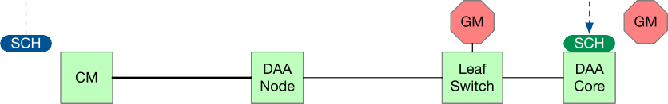
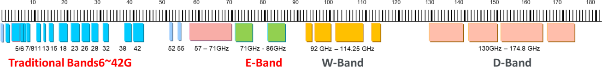
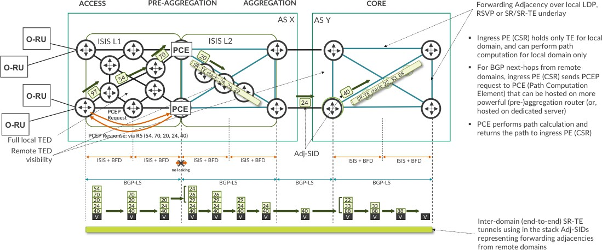
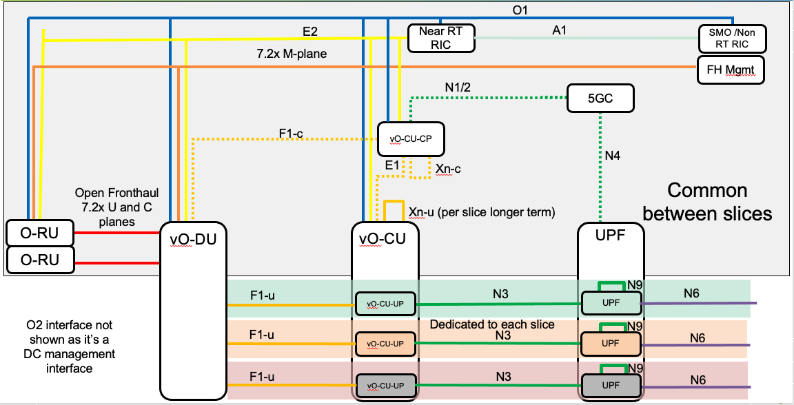
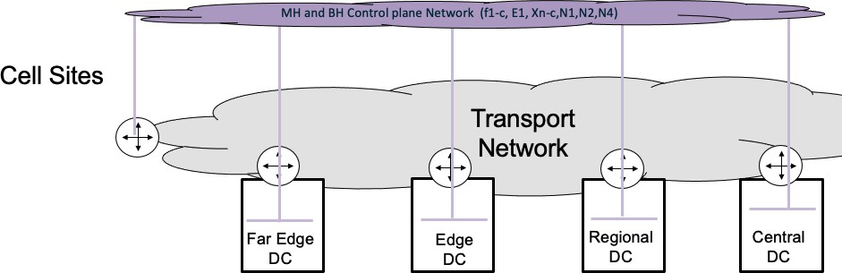

## O-RAN.WG9.XPSAAS.0-R003-v08.00.docx

- View in [Reader Mode](https://simewu.com/spec-reader/pages/03-WG9/O-RAN.WG9.XPSAAS.0-R003-v08.00.docx).
- Go back to [Table of Contents](../README.md).
- Download the [Original Document](https://github.com/Simewu/spec-reader/raw/refs/heads/main/documents/O-RAN.WG9.XPSAAS.0-R003-v08.00.docx).

---

# ORAN-WG9.XPSAAS.0-R003-v08.00

Technical Specification

**O-RAN Open Xhaul Transport Working Group 9 Xhaul Packet Switched Architectures and Solutions**

Copyright (C) 2024 by the O-RAN ALLIANCE e.V.

The copying or incorporation into any other work of part or all of the material available in this specification in any form without the prior written permission of O-RAN ALLIANCE e.V. is prohibited, save that you may print or download extracts of the material of this specification for your personal use, or copy the material of this specification for the purpose of sending to individual third parties for their information provided that you acknowledge O-RAN ALLIANCE as the source of the material and that you inform the third party that these conditions apply to them and that they must comply with them.

O-RAN ALLIANCE e.V., Buschkauler Weg 27, 53347 Alfter, Germany

# 1 Revision History

|  |  |  |  |
| --- | --- | --- | --- |
| **Date** | **Revision** | **Author** | **Description** |
| 2020/11/11 | V01.00 | All Authors | 1st revision outlining a packet switched O-RAN solution based on an underlay transport infrastructure based on MPLS or IPv6 with Segment Routing (SRv6) with mobile services provided by Multi-protocol BGP based VPNs. |
| 2021/07/01 | V02.00 | Simon Spraggs, Krzysztof Grzegorz Szarkowicz, Luis Miguel Contreras Murillo, Ivan Bykov, Lujing Cai | Update of references as required. Addition of annex F describing a packet switched slicing solution appropriate to slicing phase 1 described in O-RAN.WG1.Slicing- Architecture-v05.00 |
| 2022/02/27 | V03.00 | Simon Spraggs, Krzysztof Grzegorz Szarkowicz | Updates to annex F to support slicing phase 1 and 2 as described in O-RAN.WG1.Use Cases Detailed Specification-v06.00. Addition of a section on TNE security. |
| 2022/10/28 | V04.00 | Krzysztof Grzegorz Szarkowicz, Phil Bedard, Simon Spraggs | Updates to Annex F to support slicing phase 3 as described in O-RAN.WG1.Slicing- Architecture-v07.00. Updates of section 17 about TNE security (adding physical security, user security, control plane security and IEEE 802.1X). Updated Section 18 about service slice to underlay transport plane mapping.  Updates to reference list. Updated Section  11.5.1 about Seamless MPLS with transport planes. Updated Section 9.4 to clarify which IETF documents can be referenced. Annex ZZZ (O-RAN Adopter License Agreement) removed, as it is no longer needed |
| 2023/02/24 | V05.00 | Krzysztof Grzegorz Szarkowicz | Updates to Section 17.4 about IEEE 802.1X |
| 2023/06/09 | V06.00 | Ivan Bykov, Lujing Cai, Krzysztof Grzegorz Szarkowicz | Updates of references as required. Updates to Section 10 regarding CTI references. Updates to Annex F regarding slicing phase 4 in Midhaul. |
| 2023/09/27 | V07.00 | Krzysztof Grzegorz Szarkowicz | Updates references, as required (added 3GPP references related to certificate management, added IETF reference related to 5G transport slicing). Updates section 17,4 (IEEE 802.1X authentication towards Computes and O- Cloud-Gateways; additional section about certificate management) |
| 2024/02/16 | V08.00 | Nicolas Fevrier, Luis Miguel Contreras Murillo, Ole Reinartz, Krzysztof Grzegorz Szarkowicz, | Addition of Section 17.2.3: "Security Protocols", and Section [19]: "Energy efficiency in the context of Xhaul Packet Switched Transport Network Elements" |

2

## 1.1 Contributors

1. Editor: Krzysztof Grzegorz Szarkowicz
2. Contributors in alphabetical order: Jennifer Andreoli-Fang, Phil Bedard, Lujing Cai, Nicolas
3. Fevrier, Francois Fredricx, Ivan Bykov, Kashif Islam, Luis Miguel Contreras Murillo, Toby Rees,
4. Ole Reinartz, Simon Spraggs, Krzysztof Grzegorz Szarkowicz, Reza Vaez-Ghaemi, Nader Zein,
5. Jeffrey Zhang

1

# 2 Contents

1. 1 Revision History 2
2. 1.1 Contributors 3
3. 2 Contents 4
4. 3 Scope 8
5. 4 References 11
6. 5 Definitions and abbreviations 19
7. 5.1 Definitions 19
8. 5.2 Abbreviations 19
9. 6 5G Transport network requirements 25
10. 7 5G logical connectivity requirements 27
11. 7.1 Fronthaul 27
12. 7.1.1 O-RAN 7.2x Fronthaul 27
13. 7.1.2 O-RAN Fronthaul logical transport requirements 28
14. 7.2 Non-ORAN Fronthaul 29
15. 7.2.1 eCPRI based C-RAN solutions 29
16. 7.2.2 Radio over Ethernet (RoE) based C-RAN solutions 30
17. 7.2.3 Non O-RAN Fronthaul logical transport requirements 31
18. 7.3 Midhaul logical transport requirements 31
19. 7.3.1 Overall Midhaul logical transport requirements 32
20. 7.4 Backhaul logical transport requirements 32
21. 7.4.1 Overall Backhaul logical transport requirements 33
22. 8 Operator's use cases 33
23. 8.1 Scenario 1: C-RAN architecture with collocated O-DU and O-CU 34
24. 8.2 Scenario 2: C-RAN architecture with collocated O-RU and O-DU 35
25. 8.3 Scenario 3: C-RAN architecture with coexistence of legacy Backhaul traffic 36
26. 8.4 Scenario 4: C-RAN architecture with coexistence of legacy Fronthaul traffic 37
27. 8.5 Scenario 5: C-RAN architecture with further split of O-DU and O-CU 38
28. 8.6 Scenario 6: C-RAN architecture with local breakout 38
29. 8.7 Scenario 7: Transport slicing 39
30. 9 Overall packet switched Open Xhaul architecture 42
31. 9.1 Physical layout and xHaul transport options 42
32. 9.2 Open Xhaul architecture in revision 1 and 2 43
33. 9.3 Technology and architectural choices 44
34. 9.4 Standardization 44
35. 9.5 Document organization 45
36. 10 Physical network design for packet switched Xhaul 45
37. 10.1 Packet over fibre 47
38. 10.1.1 Access 47
39. 10.1.2 Pre-aggregation / Aggregation / Core transport 51
40. 10.2 Alternative physical transport solutions 52
41. 10.2.1 WDM in access network 53
42. 10.2.2 Passive Optical Networks (PONs) 53
43. 10.2.3 DOCSIS Networks 58
44. 10.2.4 Microwave and mmwave radio transport technologies 61
45. 10.3 Data Centers 68
46. 10.3.1 Complete separation between DC and WAN infrastructure 68
47. 10.3.2 DC integrated into WAN infrastructure. 68
48. 11 Packet-switched underlay network - MPLS based 68
49. 11.1 MPLS data plane 69
50. 11.2 MPLS control plane 70
51. 11.3 Classic MPLS control plane 71
52. 11.4 SR/MPLS control plane 73
53. 11.4.1 Interior Gateway Protocol (IGP) for SR/MPLS 73
54. 11.4.2 SR/MPLS Traffic Engineering 77
55. 11.5 Scaling the MPLS infrastructure 78
56. 11.5.1 Seamless MPLS architecture 78
57. 11.5.2 Controller based network scaling architectures 80
58. 11.6 MPLS Quality of Service 87
59. 11.7 MPLS OAM 87
60. 11.8 IP/MPLS service infrastructure 87
61. 12 Packet-switched underlay network - SRv6 based 87
62. 12.1 SRv6 data plane 88
63. 12.2 SRv6 control plane 88
64. 12.2.1 Interior Gateway Protocol (IGP) for SRv6 89
65. 12.2.2 SRv6 Traffic Engineering 93
66. 12.2.3 Inter-domain connectivity 94
67. 12.3 Scaling an SRv6 underlay infrastructure 95
68. 12.3.1 Route summarization and redistribution 95
69. 12.3.2 Controller based scaling 97
70. 12.3.3 SRv6 scaling conclusion 98
71. 12.4 IPv6 Quality of Service 98
72. 12.5 SRv6 OAM 98
73. 12.5.1 Ping / Traceroute to a remote IPv6 network address 98
74. 12.5.2 Ping / Traceroute to remote SID functions 99
75. 12.6 SRv6 Service infrastructure 99
76. 13 Packet-switched Xhaul services Infrastructure 100
77. 13.1 MP-BGP design 100
78. 13.2 Ethernet services 100
79. 13.2.1 Ethernet services redundancy 101
80. 13.3 IP Services 106
81. 13.3.1 Building flexible L3VPN service topologies 106
82. 13.3.2 Constraints based Traffic Steering in L3VPNs 106
83. 14 Quality of Service in packet-switched networks 107
84. 14.1 Xhaul transport core interface QoS 107
85. 14.1.1 Transport network core interface classification 108
86. 14.1.2 Core interface queue structure 108
87. 14.1.3 Transport network core interface marking structure 110
88. 14.1.4 Core interface scheduling model 110
89. 14.2 Xhaul transport network edge interface QoS 111
90. 14.2.1 Transport network domain PE ingress classification of Ethernet frames. 111
91. 14.2.2 Transport domain PE ingress classification IP packets. 113
92. 14.2.3 Admission control 114
93. 14.2.4 PE Egress scheduling 114
94. 15 Multicast 115
95. 15.1 Multicast use cases 115
96. 15.1.1 Multicast transport for fixed line services 115
97. 15.1.2 MBMS/5MBS transport 115
98. 15.2 Overlay and underlay multicast 116
99. 15.3 Recommendation/considerations for multicast solutions 117
100. 16 Packet-switched orchestration and telemetry 117
101. 17 Packet Switched TNE Security 118
102. 17.1 TNE physical security 118
103. 17.1.1 Console Port 118
104. 17.1.2 Auxiliary Port 119
105. 17.1.3 USB Port 119
106. 17.1.4 Front Panel functions 119
107. 17.1.5 TNE software security 119
108. 17.1.6 Zero Touch Provisioning 120
109. 17.1.7 PXE boot over management or data ports 120
110. 17.2 TNE user access security 120
111. 17.2.1 TACACS+ Authentication 120
112. 17.2.2 Login Message 121
113. 17.2.3 Security Protocols 122
114. 17.2.4 Password requirements 122
115. 17.2.5 Device lockout 123
116. 17.3 Transport Network control plane security 123
117. 17.3.1 Control plane DoS/DDoS protection 123
118. 17.3.2 Control plane protocols protection 124
119. 17.4 Port-based network access control (IEEE 802.1X-2020) 126
120. 17.4.1 Certificate time validation 127
121. 17.4.2 Certificate management for TNEs providing Open Fronthaul transport 128
122. 18 5G Slicing in a packet switched Xhaul network 130
123. 18.1 Packet-switched underlay network 133
124. 18.1.1 Underlay transport plane 133
125. 18.1.2 Single transport plane for all slices 133
126. 18.1.3 Transport plane per 5G service type 134
127. 18.1.4 Transport plane per slice customer 135
128. 18.1.5 Transport plane per 5QI group (5QI-aware mapping) 135
129. 18.2 Quality of Service 136
130. 18.2.1 Edge QoS 136
131. 18.2.2 Core QoS 136
132. 18.3 5G Services and slices 138
133. 19 Energy efficiency in the context of Xhaul Packet Switched Transport Network Elements 138
134. 19.1 Architecture level 138
135. 19.2 Transport Network (TN) level 139
136. 19.3 Transport Network Element (TNE) level 139
137. 19.3.1 TNE hardware design 140
138. 19.3.2 SerDes energy optimization 143
139. 19.3.3 PHY energy optimization 144
140. 19.3.4 PFE energy optimization 144
141. 20 Supporting mobile scenarios on a packet switched Xhaul network 147
142. 20.1 Physical network 148
143. 20.2 Logical underlay architecture 149
144. 20.2.1 Underlay Quality of Service (QoS) 150
145. 20.3 Service architecture 151
146. 20.3.1 Automated VPN Traffic Steering 151
147. 20.4 Mobile services 151
148. 20.4.1 Open Fronthaul 151
149. 20.4.2 Non O-RAN Fronthaul 154
150. 20.4.3 Midhaul and Backhaul 154
151. 20.5 Scenario 1 and 5 156
152. 20.6 Scenario 2 158
153. 20.7 Scenario 3 5G C-RAN with legacy D-RAN 159
154. 20.7.1 Scenario 3a 159
155. 20.7.2 Scenario 3b 159
156. 20.8 Scenario 4 5G C-RAN with RoE mappers 160
157. 20.9 Scenario 6 5G C-RAN with distributed UPF 161
158. 20.10 Scenario 7 Slicing 161
159. 21 Annex A: Overview of "Segment Routing" (SR) 161
160. Background 162
161. Segment Routing 162
162. Segment Routing architectural principle 163
163. Segment Routing data plane 164
164. Segment Routing control plane 165
165. 22 Annex B: IETF Ethernet Virtual Private Networks 167
166. 23 Annex C: MP-BGP based L3VPNs 173
167. Building blocks of a L3 VPN service 174
168. Traffic Steering into an BGP VPN 176
169. 24 Annex D: Quality of Service 177
170. What is Quality of Service? 177
171. Why do we need QoS? 177
172. QoS functional elements 178
173. Network level behaviour 178
174. Node level behaviour 179
175. Traffic classification and marking 179
176. Congestion management 182
177. Congestion avoidance 184
178. 25 Annex E: Multicast Technologies background 189
179. Overlay multicast 189
180. PIM-based overlay signalling for IPVPN 189
181. BGP-based overlay signalling for IPVPN and EVPN 189
182. Underlay multicast 190
183. MVPN/EVPN and Seamless MPLS/SR 191
184. 26 Annex F: Transport network slicing solution for WG1 Slicing (informational) 192
185. WG-1 Phase 1 scope 192
186. WG-1 Phase 2 scope 194
187. WG-1 Phase 3 scope 196
188. Overall Packet Switched Transport Architecture 197
189. Underlay network for WG-1 slicing phase 1, 2 and 3 198
190. Service Models for WG-1 slicing phase 1, 2 and 3 199
191. Transport and DC management networks 199
192. Transport network management network 200
193. Data Centre (DC) management network 200
194. O-RAN control and management networks 201
195. O-RAN Fronthaul Management network (M-Plane) 201
196. O-RAN Control and Management network (A1, E2, O1 interfaces) 202
197. 3GPP Control Plane network 202
198. O-RAN and 3GPP user planes networks 203
199. Slicing Phase 1 203
200. Slicing phase 2 and 3 204
201. Fronthaul C/U plane network 204
202. Midhaul user plane network (F1-U and Xn-U) 205
203. Backhaul user plane network (N3 and N9) 206
204. Data Network (N6) 209
205. Transport Network Quality of Service architecture 209
206. Transport QoS considerations in a 5G environment 210
207. 3GPP QoS flows and Transport QoS 211
208. Transport QoS Architecture for O-RAN slicing phase 1, 2 and 3 213

51

52

53

1. 3 Scope
2. This Technical Specification has been produced by the O-RAN Alliance. The document is intended
3. to describe best practises for O-RAN transport based on end-to-end packet switching technology. It
4. is recognised that other solutions, not based on packet switching, could be employed or mixed with a
5. packet switching solution. Beyond the solutions described in this document, other packet switching
6. solutions may be adequate for Xhaul transport networks and can be considered in future versions of
7. this document.

8

1. This specification defines an architecture for an Open Xhaul transport network based on an end-to-
2. end packet switching architecture that utilises statistical multiplexing and a hierarchy of packet
3. switching "Transport Node Equipment" (TNE) starting at the cell site in the access layer and going
4. to the core layer of the transport network capable of supporting the requirements outlined in the O-
5. RAN WG9 Transport Requirements document [19]. 14
6. Within the transport core, aggregation and pre-aggregation it is assumed the L0/L1 transport
7. technology connecting the packet switches are high capacity, low delay Ethernet point to point
8. circuits. These circuits can be derived from dark fibre, WDM or other technologies capable of
9. presenting Ethernet interfaces and where the delay component primarily consists of light propagation
10. within the fibre. This technology is clearly very important but out of scope of this document. 20
11. To allow the operators to offer the most flexibility in designing their RAN infrastructure the access
12. network should utilise the same design paradigm as the transport core, aggregation and pre-
13. aggregation. However, in some instances this may not be an option, so this document identifies other
14. potential access technologies, provides a description and considerations/trade-offs for their usage. 25
15. Figure 3-1 illustrates the scope of network segments covered by WG9. The area inside the dotted
16. orange line characterizes the transport networks composed of a number of Transport Network
17. Elements (TNE) deployed among different components defined in other O-RAN WGs. WG9 does
18. not define the interfaces along the dotted orange line. As an example, the fronthaul interface of an
19. O-RU or O-DU are defined by WG4. 31

**Outside of scope of WG9**

1

**O-RU**

**7-2x**

**Fronthaul F1**

**TNE O-DU TNE**

**eCPRI (7-2x) Midhaul**

**Backhaul**

**TNE O-CU TNE TNE**

**N2,N3**

5GC EPC

**RRH**

**non 7-2x lls**

**7-2x**

**FHG**

**TNE**

**O-RU**

**7-2x O-RU**

**7-2x**

Scope of WG9 is represented as the area inside the dotted green line. The interfaces along the dotted green lines are not defined by WG9.

**7-2x 7-2x**

**O-RU FHM**

Rectangular elements denote logical functions. Actual physical product implementations may combine some of the functions on different sides of the dotted green lines.

Solid lines in this diagram represent logical connections. Actual physical connections may be different.

**RRH**

**RoE TNE**

**CPRI**

**Fronthaul**

**Ethernet**

**TNE**

**RoE**

**Backhaul**

**BBU TNE**

**TNE** EPC

**TNE**

**Fronthaul**

**CPRI**

**S1**

**RRH**

**TNE**

**CPRI**

2

#### 3 Figure 3-1 Xhaul Transport Network Overview

4

1. WG9 focuses on option 7-2x. Functional elements translating option 7-2x to non O-RAN lower layer
2. split option (Fronthaul Gateways FHG) are considered to be part of radio network, and beyond the
3. scope of this document. The same applies to Fronthaul Multiplexer (FHM) and cascaded radios.
4. Radio over Ethernet mapping (RoE, IEEE 1419.3) is covered only as a service provided by the packet-
5. based network and is not defined by WG9. The stated functions are logical ones, actual product
6. implementation may combine several of these functions. For example, vendors may market a
7. Fronthaul Gateway product that combines different elements such as TNE, FHG and RoE mapper in
8. one and the same physical box. 13
9. WG9 sub-teams are working on several solution documents. This document focuses on packet-
10. based transport technologies. It also includes sections on some of the technologies used in physical
11. network such as PON, DOCSIS(R) networks and wireless Xhaul. WDM in the access network
12. providing Fronthaul services is covered in a different document [20]. 18

19 Version 1 of this document covers:

20

1. 1. High level transport requirements
2. 2. 5G Fronthaul, Midhaul, Backhaul transport requirement
3. 3. 5G operator use cases

24

1. The document then considers packet infrastructure and how the packet infrastructure can support the
2. identified requirements and use cases. It describes a packet architecture consisting of an underlay
3. packet switching infrastructure which supports L2 and L3 services.
4. The document covers two potential underlay solutions; MPLS based or SRv6 based. In both cases the
5. service infrastructure consists of MP-BGP VPN solutions supporting L2 and L3 services.
6. The last part of the document outlines, using examples, how the packet switching infrastructure can
7. support the operator use cases outlined earlier in the document. 3
8. Version 3 builds on the MPLS and SRv6 functionality described in Version 1 and 2 and outlines a
9. transport slicing solution capable of supporting phase 1 and 2 of WG-1 slicing architecture [24]. This
10. is primarily covered in an informational annex (Annex F: Transport network slicing solution for WG1
11. Slicing (informational)).

8

9 This document does not cover:

10

1. 1. Timing and synchronization -Another O-RAN WG-9 effort is underway. [21]
2. 2. WDM in access for Fronthaul services -Another O-RAN WG-9 effort is underway[20].
3. 3. Highly specialised URLLC, for example motion control in an industrial setting. I.e., private
4. network, tightly constrained, requiring TSN in the Backhaul and RAN looking like a TSN
5. bridge. This can be covered in a later edition.
6. 4. OTN or SPN/G.mtn as a transport layer. 17
7. This document uses information and requirements published by O-RAN, 3GPP, IEEE, ITU-T,
8. IETF, CableLabs, NGMN, MEF, BBF and many other standard bodies and industry associations. 20

21 Version 4 brings following updates/enhancements to the document:

22

1. ? Section 9.4 provides more clarification, which IETF work can be referenced in this
2. document
3. ? in Section 11.5.1 evolution of Seamless MPLS architecture, with colored underlay
4. transport, is added.
5. ? major update to Section [17] provides details about desired TNE security, including physical
6. security, user access security, transport network control plane security, and port-based
7. access control.
8. ? Section 18 is enhanced with additional mapping option for service slice to underlay
9. transport plane mapping, as well has enhanced in general to provide more details about each
10. mapping method.
11. ? Small changes to Annex F are added to align with slicing phase 3 as described in O-
12. RAN.WG1.Slicing-Architecture [24]
13. ? Annex ZZZ (O-RAN Adopter License Agreement) is removed, as it is no longer needed 36
14. Version 5 brings small update to Section 17.4: Port-based network access control (IEEE 802.1X-
15. 2020), adding some discussion about the TNE-to-TNE authentication methods, as well as
16. describing the behavior when a certificate expires. 40
17. Version 6 brings small updates to Section 10 (reference to CTI documents updated), as well as
18. additions in Annex F related to the description of network slicing phase 4 in midhaul. 43
19. Version 7 brings update to Section 17.4, adding discussion about operator-signed certification
20. management for TNEs providing Open Fronthaul transport connectivity. Annex F is slightly
21. enhanced to reference relevant IETF TEAS WG 5G transport slicing draft. 47
22. Version 8 brings enhacement to Section 17.2: "TNE user access security", by addition a new
23. subsection 17.2.3: "Security Protocols". Version 8 also introduces new section, which discusses
24. energy efficiency aspects of the transport network (Section [19]: "Energy efficiency in the context of
25. Xhaul Packet Switched Transport Network Elements")

# 4 References

1. The following documents contain provisions which, through reference in this text, constitute
2. provisions of the present document.
3. - References are either specific (identified by date of publication, edition number, version
4. number, etc.) or non-specific.
5. - For a specific reference, subsequent revisions do not apply.
6. - For a non-specific reference, the latest version applies. In the case of a reference to a 3GPP
7. document (including a GSM document), a non-specific reference implicitly refers to the latest
8. version of that document in Release 17. 12

13

#### 14 3GPP references

|  |  |  |
| --- | --- | --- |
| 15 | [1] | 3GPP TS 23.501 V17.10.0: "System Architecture for 5G System (5GS)" |
| 16 | [2] | 3GPP TS 23.203 V17.2.0: "Policy Control and Charging Architecture" |
| 17 | [3] | 3GPP TS 28.316 V17.0.0: "Management and orchestration; Plug and Connect; |
| 18 |  | Data formats" |
| 19 | [4] | 3GPP TS 29.060 V17.4.0: "General Packet Radio Service (GPRS); GPRS |
| 20 |  | Tunnelling Protocol (GTP) across the Gn and Gp interface" |
| 21 | [5] | 3GPP TS 29.274 V17.9.0: "3GPP Evolved Packet System (EPS); Evolved |
| 22 |  | General Packet Radio Service (GPRS) Tunnelling Protocol for Control plane |
| 23 |  | (GTPv2-C); Stage 3" |
| 24 | [6] | 3GPP TS 29.281 v17.4.0: "General Packet Radio System (GPRS) Tunnelling |
| 25 |  | Protocol User Plane (GTPv1-U) |
| 26 | [7] | 3GPP TS 32.509 V16.0.0.: "Telecommunication management; Data formats for |
| 27 |  | multi-vendor plug and play eNode B connection to the network" |
| 28 | [8] | 3GPP TS 33.310 V17.7.0: "Network Domain Security (NDS); Authentication |
| 29 |  | Framework (AF)" |
| 30 | [9] | 3GPP TS 36.422 V17.1.0: "Evolved Universal Terrestrial Radio Access |
| 31 |  | Network (E-UTRAN); X2 signalling transport" |
| 32 | [10] | 3GPP TS 36.424 v17.0.0: "Evolved Universal Terrestrial Radio Access Network |
| 33 |  | (E-UTRAN); X2 data transport" |
| 34 | [11] | 3GPP TS 38.306 V17.6.0: "NR; User equipment (UE) radio access capabilities" |
| 35 | [12] | 3GPP TS 38.401 V17.6.0: "NG-RAN; Architecture description" |
| 36 | [13] | 3GPP TS 38.415 V17.0.0: "NG-RAN; PDU Session User Plane Protocol" |
| 37 | [14] | 3GPP TS 38.422 V17.1.0: "NG-RAN; Xn signalling transport" |
| 38 | [15] | 3GPP TS 38.462 V17.0.0: "NG RAN; E1 signalling transport" |
| 39 | [16] | 3GPP TS 38.474 V17.0.0: "NG-RAN; F1 data transport". |
| 40 |  |  |
| 41 |  | **O-RAN references** |
| 42 | [17] | O-RAN.WG4.CUS.0-v09.00 "Open Fronthaul Control, User and |
| 43 |  | Synchronization Plane Specification Version v09.00", August 2022 |
| 44 | [18] | O-RAN.WG4.MP.0-v09.00: "Open Fronthaul Management Plane Specification |
| 45 |  | v09.00", April 2022 |

|  |  |  |
| --- | --- | --- |
| 1 | [19] | O-RAN.WG9.XTRP-REQ-v01.00 "Xhaul Transport Requirements v01.00", |
| 2 |  | November 2020 |
| 3 | [20] | O-RAN.WG9.WDM.0-v02.00 "WDM-based Fronthaul Transport v02.00", |
| 4 |  | November 2021 |
| 5 | [21] | O-RAN.WG9.XTRP-SYN.0-v03.00 "Synchronization Architecture and |
| 6 |  | Solution Specification v03.00", July 2022 |
| 7 | [22] | O-RAN.WG9.XTRP-MGT.0-v04.00 "Management interfaces for Transport |
| 8 |  | Network Elements v04.00", July 2022 |
| 9 | [23] | O-RAN.WG4.CTI-TCP.0-R003-v04.00, "Cooperative Transport Interface |
| 10 |  | Transport Control Plane Specification v04.00", April 2023 |
| 11 |  |  |
| 12 | [24] | O-RAN.WG4.CTI-TMP.0-R003-v04.00, "Cooperative Transport Interface |
| 13 |  | Transport Management Procedures Specification v04.00", April 2023 |
| 14 |  |  |
| 15 | [25] | O-RAN.WG1.Slicing Architecture-v07.00, April 2022 |
| 16 |  |  |
| 17 | [26] | O-RAN.WG11.Security-Requirements-Specifications-v04, November 2022 |
| 18 |  |  |
| 19 | [27] | MITRE-12-05-2022-WG1-CR-0001-UseCaseAnalysisReport-RAN-Sharing- |
| 20 |  | Via-Midhaul-v09, May 2022 |
| 21 |  |  |
| 22 | [28] | O-RAN ALLIANCE TS: "O-RAN Security Protocols Specification" |
| 23 |  |  |
| 24 |  |  |
| 25 |  | **IEEE references** |
| 26 | [29] | IEEE 802.3-2018: "IEEE Standard for Ethernet" |
| 27 | [30] | IEEE 802.1Q-2018: "IEEE Standard for Local and metropolitan area |
| 28 |  | networks-- Bridges and Bridged Networks" |
| 29 | [31] | IEEE 802.1CM-2018: "Time-Sensitive Networking for Fronthaul" |
| 30 | [32] | IEEE Std 1914.1TM-2019: "IEEE Standard for Packet-based Fronthaul |
| 31 |  | Transport Network" |
| 32 | [33] | IEEE 802.3av "Physical Layer Specifications and Management Parameters for |
| 33 |  | 10 Gb/s Passive Optical Networks" |
| 34 | [34] | IEEE 802.3bk "Physical Layer Specifications and Management Parameters for |
| 35 |  | Extended Ethernet Passive Optical Networks" |
| 36 | [35] | IEEE 802.3ca "Physical Layer Specifications and Management Parameters for |
| 37 |  | 25 Gb/s and 50 Gb/s Passive Optical Networks" |
| 38 | [36] | IEEE Std 1914.3-2018 - IEEE standard for radio over Ethernet Encapsulations |
| 39 |  | and Mappings |
| 40 | [37] | IEEE Std 802.1X-2020 "IEEE Standard for Local and Metropolitan Area |
| 41 |  | Networks--Port-Based Network Access Control" |
| 42 |  |  |
| 43 | **IETF references** |  |
| 44 | [38] | IETF RFC 791: "INTERNET PROTOCOL" |
| 45 | [39] | IETF RFC 768: "User Datagram Protocol" |

|  |  |  |
| --- | --- | --- |
| 1 | [40] | IETF RFC 1195: "Use of OSI IS-IS for routing in TCP/IP and dual |
| 2 |  | environments" |
| 3 | [41] | IETF RFC 1771: "A Border Gateway Protocol 4" |
| 4 | [42] | IETF RFC 2205: "Resource ReSerVation Protocol" |
| 5 | [43] | IETF RFC 2209: "Resource ReSerVation Protocol (RSVP) --Version 1 Message |
| 6 |  | Processing Rules" |
| 7 | [44] | IETF RFC 2210: "The use of RSVP with IETF Integrated Services" |
| 8 | [45] | IETF RFC 2328: "OSPF Version 2" |
| 9 | [46] | IETF RFC 2283: "Multiprotocol Extensions for BGP-4" |
| 10 | [47] | IETF RFC 2475: "An Architecture for Differentiated Services" |
| 11 | [48] | IETF RFC 2474: "Definition of the Differentiated Services Field (DS Field) in |
| 12 |  | the IPv4 and IPv6 Headers" |
| 13 | [49] | IETF RFC 2545: Use of BGP-4 Multiprotocol Extensions for IPv6 Inter- |
| 14 |  | Domain Routing" |
| 15 | [50] | IETF RFC 2597: "Assured Forwarding PHB Group" |
| 16 | [51] | IETF RFC 2598: "An Expedited Forwarding PHB" |
| 17 | [52] | IETF RFC 2745: "RSVP Diagnostic Messages" |
| 18 | [53] | IETF RFC 2747: "RSVP Cryptographic Authentication" |
| 19 | [54] | IETF RFC 2865: "Remote Authentication Dial In User Service (RADIUS)" |
| 20 | [55] | IETF RFC 2866: "RADIUS Accounting" |
| 21 | [56] | IETF RFC 2961: "RSVP Refresh Overhead Reduction Extensions" |
| 22 | [57] | IETF RFC 2983: "Differentiated Services and Tunnels" |
| 23 | [58] | IETF RFC 3031: "Multiprotocol Label Switching Architecture" |
| 24 | [59] | IETF RFC 3032: "MPLS Label Stack Encoding" |
| 25 | [60] | IETF RFC 3097: "RSVP Cryptographic Authentication--Updated Message |
| 26 |  | Type Value" |
| 27 | [61] | IETF RFC 3209: "Extensions to RSVP for LSP Tunnels" |
| 28 | [62] | IETF RFC 3212: "Constraint-Based LSP Setup using LDP" |
| 29 | [63] | IETF RFC 3215: "LDP State Machine" |
| 30 | [64] | IETF RFC 3246: "An Expedited Forwarding PHB (Per-Hop Behavior) |
| 31 | [65] | IETF RFC 3107: "Carry Label Information in BGP-4" |
| 32 | [66] | IETF RFC 3443: "Time To Live (TTL) Processing in Multi-Protocol Label |
| 33 |  | Switching (MPLS) Networks" |
| 34 | [67] | IETF RFC 3477: "Unnumbered Links in Resource ReSerVation Protocol - |
| 35 |  | Traffic Engineering (RSVP-TE)" |
| 36 | [68] | IETF RFC 3478: "Graceful Restart Mechanism for Label Distribution Protocol" |
| 37 | [69] | IETF RFC 3579: "RADIUS (Remote Authentication Dial In User Service) |
| 38 |  | Support For Extensible Authentication Protocol (EAP)" |
| 39 | [70] | IETF RFC 3630: "Traffic Engineering (TE) Extensions to OSPF Version 2" |
| 40 | [71] | IETF RFC 3719: "Recommendations for Interoperability using ISIS" |
| 41 | [72] | IETF RFC 4072: "Diameter Extensible Authentication Protocol (EAP) |
| 42 |  | Application" |
| 43 | [73] | IETF RFC 4090: "Fast Reroute Extensions to RSVP-TE for LSP Tunnels" |
| 44 | [74] | IETF RFC 4115: "A Differentiated Service Two-Rate, Three-color Market with |
| 45 |  | Efficient Handling of in-Profile Traffic" |
| 46 | [75] | IETF RFC 4182: "Removing a Restriction on the use of MPLS Explicit NULL" |
| 47 | [76] | IETF RFC 4210: "Internet X.509 Public Key Infrastructure Certificate |
| 48 |  | Management Protocol (CMP)" |
| 49 | [77] | IETF RFC 4271: "A Border Gateway Protocol 4 (BGP-4)" |

|  |  |  |
| --- | --- | --- |
| 1 | [78] | IETF RFC 4303: "OSPF Extensions in Support of Generalized Multi-Protocol |
| 2 |  | Label Switching (GMPLS)" |
| 3 | [79] | IETF RFC 4206: Label Switched Paths (LSP) Hierarchy with Generalized |
| 4 |  | Multi-Protocol Label Switching (GMPLS) Traffic Engineering (TE)" |
| 5 | [80] | IETF RFC 4252: "The Secure Shell (SSH) Authentication Protocol" |
| 6 | [81] | IETF RFC 4443: "ICMPv6 (ICMP for IPv6)" |
| 7 | [82] | IETF RFC 4552: "Authentication/Confidentiality for OSPFv3" |
| 8 | [83] | IETF RFC 4558: "Node-ID Based Resource Reservation Protocol (RSVP) |
| 9 |  | Hello" |
| 10 | [84] | IETF RFC 4561: "Record Route Object (RRO) Node-Id Sub-Object" |
| 11 | [85] | IETF RFC 4594: "Configuration Guidelines for DiffServ Service Classes" |
| 12 | [86] | IETF RFC 4364: "BGP/MPLS IP Virtual Private Networks (VPNs)" |
| 13 | [87] | IETF RFC 4684: "Constrained Route Distribution for BGP/MPLS IP VPNs" |
| 14 |  | Computation Element Protocol (PCEP)" |
| 15 | [88] | IETF RFC 4760: "Multiprotocol Extensions for BGP-4" |
| 16 | [89] | IETF RFC 4875: "Extensions to Resource Reservation Protocol - Traffic |
| 17 |  | Engineering for Point to Multipoint TE Label Switched Paths" |
| 18 | [90] | IETF RFC 5036: "LDP Specification" |
| 19 | [91] | IETF RFC 5130: "A Policy Control Mechanism in IS-IS Using Administrative |
| 20 |  | Tags" |
| 21 | [92] | IETF RFC 5216: "The EAP-TLS Authentication Protocol" |
| 22 | [93] | IETF RFC 5246: "The Transport Layer Security (TLS) Protocol Version 1.2" |
| 23 | [94] | IETF RFC 5283: "LDP Extension for Inter-Area Label Switched Paths (LSPs)" |
| 24 | [95] | IETF RFC 5291: "Outbound Route Filtering Capability for BGP-4" |
| 25 | [96] | IETF RFC 5292 "Address-Prefix-Based Outbound Route Filter for BGP-4" |
| 26 | [97] | IETF RFC 5302 "Domain-Wide Prefix Distribution with Two-Level IS-IS" |
| 27 | [98] | IETF RFC 5303: "Three-Way Handshake for IS-IS Point-to-Point Adjacencies" |
| 28 | [99] | IETF RFC 5305: "IS-IS Extensions for Traffic Engineering" |
| 29 | [100] | IETF RFC 5308: "Routing IPv6 with ISIS" |
| 30 | [101] | IETF RFC 5310: "IS-IS Generic Crypto Authentication" |
| 31 | [102] | IETF RFC 5329: "Traffic Engineering Extensions to OSPF Version 3" |
| 32 | [103] | IETF RFC 5340: "OSPF for IPv6" |
| 33 | [104] | IETF RFC 5420: "Encoding of Attributes for MPLS LSP Establishment Using |
| 34 |  | Resource Reservation Protocol Traffic Engineering (RSVP-TE)" |
| 35 | [105] | IETF RFC 5440: "Path Computational Element (PCE) Communications |
| 36 |  | Protocol (PCEP)" |
| 37 | [106] | IETF RFC 5443: "LDP IGP Synchronization" |
| 38 | [107] | IETF RFC 5496: "The Reverse Path Forwarding (RPF) Vector TLV" |
| 39 | [108] | IETF RFC 5512: "The BGP Encapsulation Subsequent Address Family |
| 40 |  | Identifier (SAFI) and the BGP Tunnel Encapsulation Attribute" |
| 41 | [109] | IETF RFC 5561: "LDP capabilities" |
| 42 | [110] | IETF RFC 5838: "Support of Address Families in OSPFv3" |
| 43 | [111] | IETF RFC 5925: "The TCP Authentication Option" |
| 44 | [112] | IETF RFC 5926: "Cryptographic Algorithms for the TCP Authentication Option |
| 45 |  | (TCP-AO)" |
| 46 | [113] | IETF RFC 6232: "Purge Originator Identification TLV for IS-IS" |
| 47 | [114] | IETF RFC 6388: "Label Distribution Protocol Extensions for Point-to- |
| 48 |  | Multipoint and Multipoint-to-Multipoint Label Switched Paths" |

|  |  |  |
| --- | --- | --- |
| 1 | [115] | IETF RFC 6391: "Flow-Aware Transport of pseudowires over an MPLS Packet |
| 2 |  | Switched Network" |
| 3 | [116] | IETF RFC 6512: "Using Multipoint LDP When the Backbone has No Route to |
| 4 |  | the ROOT" |
| 5 | [117] | IETF RFC 6513: "Multicast in MPLS/BGP IP VPNs" |
| 6 | [118] | IETF RFC 6514: "BGP Encodings and procedures for multicast in MPLS/BGP |
| 7 |  | IP VPNs" |
| 8 | [119] | IETF RFC 7432: "BGP MPLS-Based Ethernet VPN" |
| 9 | [120] | IETF RFC 7471: "OSPF Traffic Engineering (TE) Metric Extensions" |
| 10 | [121] | IETF RFC 7524: "Inter-Area Point to Multipoint Segmented Label Switched |
| 11 |  | Paths (LSPs)" |
| 12 | [122] | IETF RFC 7570: "Label Switched Path (LSP) Attribute in the Explicit Route |
| 13 |  | Object (ERO)" |
| 14 | [123] | IETF RFC 7752: "BGP Link State (BGP-LS)" |
| 15 | [124] | IETF RFC 7761: "Protocol Independent Multicast" |
| 16 | [125] | IETF RFC 7810: "IS-IS Traffic Engineering (TE) Metric Extensions" |
| 17 | [126] | IETF RFC 8029: "Detecting Multiprotocol Label Switched (MPLS) Data-plane |
| 18 |  | Failures" |
| 19 | [127] | IETF RFC 8200: "Internet Protocol, Version 6 (IPv6) Specification" |
| 20 | [128] | IETF RFC 8214: "Virtual Private Wire Service Support in Ethernet VPN" |
| 21 | [129] | IETF RFC 8231: "Path Computational Element Communications Protocol |
| 22 |  | (PCEP) Extensions for Stateful PCE" |
| 23 | [130] | IETF RFC 8277: "BGP and Labeled Address Prefixes" |
| 24 | [131] | IETF RFC 8287: "Label Switched Path (LSP) Ping/Traceroute for Segment |
| 25 |  | Routing (SR) IGP-Prefix and IGP-Adjacency Segment Identifiers (SIDs) with |
| 26 |  | MPLS Data Planes" |
| 27 | [132] | IETF RFC 8317: "Ethernet-Tree (E-Tree) Support in Ethernet VPN (EVPN) and |
| 28 |  | Provider Backbone Bridging EVPN (PBB-EVPN)" |
| 29 | [133] | IETF RFC 8366: "A Voucher Artifact for Bootstrapping Protocols" |
| 30 | [134] | IETF RFC 8370: "Techniques to Improve the Scalability of RSVP-TE |
| 31 |  | Deployments" |
| 32 | [135] | IETF RFC 8395: "Extension to BGP-Signaled pseudowires to support flow- |
| 33 |  | aware transport labels" |
| 34 | [136] | IETF RFC 8402: "Segment Routing Architecture" |
| 35 | [137] | IETF RFC 8446: "The Transport Layer Security (TLS) Protocol Version 1.3" |
| 36 | [138] | IETF RFC 8476: "Signaling Maximum SID depth using OSPF" |
| 37 | [139] | IETF RFC 8491: "Signaling Maximum SID depth using IS-IS" |
| 38 | [140] | IETF RFC 8571: "BGP - Link State (BGP-LS) Advertisement of IGP Traffic |
| 39 |  | Engineering Performance Metric Extensions" |
| 40 | [141] | IETF RFC 8572: "Secure Zero Touch Provisioning (SZTP)" |
| 41 | [142] | IETF RFC 8577: "Signaling RSVP-TE Tunnels on a Shared MPLS Forwarding |
| 42 |  | Plane" |
| 43 | [143] | IETF RFC 8660: "Segment Routing with MPLS Dataplane" |
| 44 | [144] | IETF RFC 8661: "Segment Routing MPLS Interworking with LDP" |
| 45 | [145] | IETF RFC 8664: "PCEP Extensions for Segment Routing" |
| 46 | [146] | IETF RFC 8666: "OSPFv3 Extensions for Segment Routing*"* |
| 47 | [147] | IETF RFC 8667: "IS-IS Extensions for Segment Routing*"* |
| 48 | [148] | IETF RFC 8754: "IPv6 Segment Routing Header (SRH)" |

|  |  |  |
| --- | --- | --- |
| 1 | [149] | IETF RFC 8814: "Signaling Maximum SID Depth (MSD) Using the BGP - |
| 2 |  | Link State" |
| 3 | [150] | IETF RFC 8907: "The Terminal Access Controller Access-Control System Plus |
| 4 |  | (TACACS+) Protocol" |
| 5 | [151] | IETF RFC 8986: "SRv6 Network Programming" |
| 6 | [152] | IETF RFC 9085: "Border Gateway Protocol - Link State (BGP-LS) Extensions |
| 7 |  | for Segment Routing" |
| 8 | [153] | IETF RFC 9136: "IP prefix Advertisements in Ethernet VPN (EVPN) |
| 9 | [154] | IETF RFC 9252: "BGP Overlay Services Based on Segment Routing over IPv6 |
| 10 |  | (SRv6)" |
| 11 | [155] | IETF RFC 9256: "Segment Routing Policy Architecture" |
| 12 | [156] | IETF RFC 9259: "Operations, Administration, and Maintenance (OAM) in |
| 13 |  | Segment Routing Networks over IPv6 (SRv6)" |
| 14 | [157] | IETF RFC 9350: "IGP Flexible Algorithm" |
| 15 | [158] | IETF RFC 9351: "Flexible Algorithm Definition Advertisement with BGP Link- |
| 16 |  | State" |
| 17 | [159] | IETF RFC 9352: "IS-IS Extensions to support SR over IPv6 dataplane" |
| 18 | [160] | IETF RFC 9513: "OSPFv3 Extensions for Segment Routing over IPv6 (SRv6)" |
| 19 | [161] | IETF RFC 9514: "Border Gateway Protocol - Link State (BGP-LS) Extensions |
| 20 |  | Draft-ietf-bess-bgp-multicast-controller-12: "Controller based BGP Multicast |
| 21 |  | signalling" |
| 22 | [162] | Draft-ietf-bess-evpn-bum-procedure-updates-14: "Updates on EVPN BUM |
| 23 |  | procedures" - submitted to IESG for publication |
| 24 | [163] | Draft-ietf-bess-evpn-vpws-fxc-08: "EVPN VPWS Flexible Cross-Connect |
| 25 |  | Service" |
| 26 | [164] | Draft-ietf-bess-evpn-mh-pa-09: "EVPN multi-homing port-active load- |
| 27 |  | balancing" |
| 28 | [165] | Draft-ietf-bess-evpn-pref-df-13: "Preference-based EVPN DF Election" |
| 29 | [166] | Draft-ietf-mpls-ri-rsvp-frr-16: "Refresh-interval independent FRR facility |
| 30 |  | protection" |
| 31 | [167] | Draft-ietf-pim-sr-p2mp-policy-07: "Segment Routing Point-to-Multipoint |
| 32 |  | Policy" |
| 33 | [168] | Draft-ietf-rtgwg-segment-routing-ti-lfa-13: "Topology Independent Fast Reroute |
| 34 |  | using Segment Routing" |
| 35 | [169] | Draft-ietf-pce-binding-label-sid-16: "Carrying Binding Label/Segment-ID in |
| 36 |  | PCE-based Networks" |
| 37 | [170] | Draft-ietf-pce-segment-routing-ipv6-21: "PCEP Extensions for Segment |
| 38 |  | Routing leveraging the IPv6 data plane" |
| 39 | [171] | Draft-ietf-pce-segment-routing-policy-cp-13: "PCEP extension to support |
| 40 |  | Segment Routing Candidate Path |
| 41 | [172] | for Segment Routing over IPv6 (SRv6)" |
| 42 | [173] | Draft-ietf-mpls-seamless-mpls-07: "Seamless MPLS Architecture" |
| 43 | [174] | Draft-ietf-spring-srv6-srh-compression-11: "Compressed SRv6 Segment List |
| 44 |  | Encoding" |
| 45 | [175] | Draft-ietf-teas-5g-ns-ip-mpls-03: "A Realization of Network Slices for 5G |
| 46 |  | Networks Using Current IP/MPLS Technologies" |
| 47 | [176] | Draft-ietf-netconf-trust-anchors-24: "A YANG Data Model for a Truststore" |
| 48 |  |  |
| 49 |  | **Others** |

|  |  |  |
| --- | --- | --- |
| 1 | [177] | NGMN "5G RAN CU-DU network architecture, transport options and |
| 2 |  | dimensioning, version 1.0 12 April 2019" |
| 3 | [178] | MEF 61.1: "IP Service attributes" |
| 4 | [179] | MEF 10.3: "Ethernet Service attributes" |
| 5 | [180] | MEF 6.2: "EVC service definition" |
| 6 | [181] | Broadband Forum TR-101 "Migration to Ethernet-Based Broadband |
| 7 |  | Aggregation" |
| 8 | [182] | Broadband Forum TR-156 "Using GPON Access in the context of TR-101" |
| 9 | [183] | ITU-R M.2083: "IMT Vision - framework and overall objectives of the future |
| 10 |  | development of IMT for 2020 and beyond. |
| 11 | [184] | ITU-T GSTR-TN5G - Transport network support of IMT 2020/5G |
| 12 | [185] | ITU-T G.Sup.66 "5G wireless Fronthaul requirements in a passive optical |
| 13 |  | network context" |
| 14 | [186] | ITU-T G.9807 series "10-Gigabit-capable symmetric passive optical network", |
| 15 |  | ITU-T G.989 series "40-Gigabit-capable passive optical networks (NG PON2)", |
| 16 |  | On-going work ITU-T G.HSP |
| 17 | [187] | ITU-T G.8271 "Time and phase synchronization aspects of telecommunication |
| 18 |  | networks" |
| 19 | [188] | ITU-T G.8271.1 "Network limits for time synchronization in packet networks |
| 20 |  | with full timing support from the network" |
| 21 | [189] | ITU-T G.8273.2 "Timing characteristics of telecom boundary clocks and |
| 22 |  | telecom time slave clocks" |
| 23 | [190] | ITU-T G.8275.1 "Precision time protocol telecom profile for phase/time |
| 24 |  | synchronization with full timing support from the network" |
| 25 | [191] | 40m Transmission of OAM mode and Polarization Multiplexing in E-band, |
| 26 |  | Globcom, Dec 2019. M.Hirabe, et. Al |
| 27 | [192] | CableLabs "Low Latency Mobile Xhaul over DOCSIS Technology" |
| 28 |  | <https://www.cablelabs.com/specifications/CM-SP-LLX> |
| 29 | [193] | CableLabs "Synchronization Techniques for DOCSIS Technology |
| 30 |  | Specification" <https://www.cablelabs.com/specifications/CM-SP-SYNC> |
| 31 | [194] | CableLabs "Data-Over-Cable Service Interface Specifications 3.1, MAC and |
| 32 |  | Upper Layer Protocols Interface" |
| 33 |  | <https://www.cablelabs.com/specifications/CM-SP-MULPIv3.1> |
| 34 | [195] | CableLabs "Data-Over-Cable Service Interface Specifications 4.0, MAC and |
| 35 |  | Upper Layer Protocols Interface" |
| 36 |  | <https://www.cablelabs.com/specifications/CM-SP-MULPIv4.0> |
| 37 | [196] | CableLabs "Remote PHY Specification" |
| 38 |  | <https://www.cablelabs.com/specifications/CM-SP-R-PHY> |
| 39 | [197] | "Study on new radio access technology: Radio access architecture and |
| 40 |  | interfaces" 3GPP TR 38.801 Table A-1. |
| 41 | [198] | Cisco Press, MPLS and VPN Architectures, Volume 1, 420 pages, by Ivan |
| 42 |  | Pepelnjak, and Jim Guichard, 2001 |
| 43 | [199] | Cisco Press, MPLS and VPN Architectures, Volume 2, 470 pages, by Ivan |
| 44 |  | Pepelnjak, Jim Guichard, and Jeff Apcar, 2003 |
| 45 | [200] | O'Reilly, MPLS in the SDN Era, 890 pages, by Antonio Sanchez-Monge, and |
| 46 |  | Krzysztof Grzegorz Szarkowicz, 2015 |
| 47 | [201] | BBF TR-221: Technical Specification for MPLS in Mobile Backhaul Networks, |
| 48 |  | 99 pages, Oct 2011 |

1. [202] BBF TR-221, Amd.1: Technical Specifications for MPLS in Mobile Backhaul
2. Networks, 24 pages, Nov 2013
3. [203] BBF TR-221, Amd.2: Technical Specifications for MPLS in Mobile Backhaul
4. Networks, 22 pages, Sep 2017
5. [204] ETSI GR mWT 012 V1.1.1 (2018-11): 5G Wireless Backhaul/Xhaul
6. [205] Microwave and millimeter-wave technology overview and evolution, Workshop
7. on Evolution of Fixed Service in Backhaul support of IMT 2020 / 5G, Geneva,
8. 29 April 2019, [https://www.itu.int/en/ITU-R/study-](https://www.itu.int/en/ITU-R/study-groups/workshops/fsimt2020/Pages/default.aspx)
9. [groups/workshops/fsimt2020/Pages/default.aspx](https://www.itu.int/en/ITU-R/study-groups/workshops/fsimt2020/Pages/default.aspx)
10. [206] ISO/IEC 10589-2002: "Intermediate System to Intermediate System intra-
11. domain routeing information exchange protocol for use in conjunction with the
12. protocol for providing the connectionless-mode network service" 13

14

1

# 5 Definitions and abbreviations

## 5.1 Definitions

* 1. The key words "**SHALL**", "**SHALL NOT**", "**SHOULD**", "**SHOULD NOT**", "**MAY**", and
  2. "**OPTIONAL**" in this document are to be interpreted as described in IETF RFC 2119 [25]. All key
  3. words must be in upper case, bold text.
  4. Items that are **REQUIRED** (contain the words **SHALL** or **SHALL NOT**) will be labelled as **[Rx]**
  5. for required. Items that are **RECOMMENDED** (contain the words **SHOULD** or **SHOULD NOT**)
  6. will be labelled as **[Dx]** for desirable. Items that are **OPTIONAL** (contain the words **MAY** or
  7. **OPTIONAL**) will be labelled as **[Ox]** for optional**.**
  8. Items, if supported, are not meant to be active at all times, but should be available for use. Their
  9. state (active or not active) should be based on configuration.

## 5.2 Abbreviations

* 1. Abbreviations defined in this document take precedence over the definition of 3GPP 15

|  |  |
| --- | --- |
| Abbreviations | Meaning or explanation |
| **3GPP** | Third Generation Partnership Project - Standards Development Organization |
| **4G** | Fourth-generation mobile network |
| **5G** | Fifth-generation mobile network |
| **ABR** | Area Border Router |
| **Amd** | Ammendment (term used by BBF) |
| **API** | Application Programming Interfaces |
| **ARPU** | Average revenue per user |
| **AS** | Automated (traffic) steering |
| **AS** | Autonomous System |
| **ASBR** | Autonomous System Border Router |
| **ASIC** | Application-Specific Integrated Circuits |
| **BBF** | Broadband Forum |
| **BBU** | Baseband unit |
| **BGP** | Border Gateway Protocol |
| **BGP-LU** | BGP labelled unicast |
| **BGP-LS** | BGP link state |
| **BIER** | Bit Indexed Explicit Replication |
| **BITS** | Building Integrated Timing System |
| **C-RAN** | Centralized Radio Access Network |
| **CA** | Carrier Aggregation |
| **CA** | Certification Authority |

|  |  |
| --- | --- |
| **CapEx** | Capital expenditure |
| **CBWRED** | Class based Weighted Random Early Detection |
| **CDN** | Content delivery network |
| **CDMA** | Code Division Multiple-Access - a mobile radio standard |
| **CMPv2** | Certificate Management Protocol version 2 |
| **COTS** | Commercial off the shelf |
| **CPE** | Customer premises equipment |
| **CPRI** | Common public radio interface |
| **CPU** | Central Processing Unit |
| **CSP** | Communications service provider |
| **CSR** | Cell Site Router |
| **CU** | Centralized unit |
| **CUPS** | Control/User Plane Separation |
| **D-RAN** | Distributed Radio Access Network |
| **DB** | Dynamic Bandwidth assignment |
| **DC** | Data center |
| **DDR-RAM** | Double Data Rate Synchronous Dynamic Random-Access Memory |
| **DHCP** | Dynamic Host Configuration Protocol |
| **DHCPv4** | Dynamic Host Configuration Protocol for IPv4 hosts |
| **DHCPv6** | Dynamic Host Configuration Protocol for IPv6 hosts |
| **DiffServ** | Differentiated services - a quality-of-service mechanism |
| **DSCP** | DiffServ Code Point |
| **DWDM** | Dense Wavelength Division Multiplexing |
| **EAP** | Extensible Authentication Protocol |
| **ECMP** | Equal-cost multipath |
| **eCPRI** | Enhanced Common Radio Interface (CPRI) |
| **eMBB** | Enhanced mobile broadband |
| **eNB** | Enhanced Node B |
| **EPC** | Evolved packet core |
| **ESMC** | Ethernet Synchronization Message Channel |
| **EVPN** | Ethernet VPN |
| **EXP** | Experimental |
| **FDD** | Frequency division duplexing |
| **FHG** | Fronthaul Gateway |
| **FIB** | Fabric Interface Board |
| **FIB** | Forwarding Information Base |
| **FIFO** | First In, First Out |
| **FMC** | Fixed-mobile convergence |
| **FMC** | Fixed-mobile convergence |

|  |  |
| --- | --- |
| **FQDN** | Fully Qualified Domain Name |
| **FPGA** | Field Programmable Gateway Array |
| **Fronthaul** | Portion of the mobile network supporting O-RAN 7.2x, eCPRI, RoE or CPRI protocols |
| **FRR** | Fast Re-Route |
| **Gbps** | Gigabits per second |
| **GNSS** | Global Navigation Satellite System (example being GPS) |
| **GPS** | Global Positioning System |
| **HLS** | High-level split |
| **HSR** | Hub Site Router |
| **IANA** | Internet Assigned Numbers Authority |
| **iBGP** | internal Border Gateway Protocol |
| **IEC** | International Electrotechnical Commission |
| **IEEE** | Institute of Electrical and Electronics Engineers - Standards Development Organization |
| **IETF** | Internet Engineering Task Force - Standards Development Organization |
| **IGP** | Interior Gateway Protocol |
| **IoT** | Internet of Things (see also mMTC) |
| **IP** | Internet Protocol |
| **IPoDWDM** | Internet Protocol over Dense Wavelength Division Multiplexing |
| **IPsec** | Internet Protocol Security |
| **IS-IS** | Intermediate System to Intermediate System |
| **ISO** | International Standardization Organization |
| **ITU-T** | International Telecommunication Union-Telecommunication - Standards Development Organization |
| **ITU-R** | International Telecommunication Union-Radiocommunication - Standards Development Organization |
| **JSON** | JavaScript Object Notation |
| **L1 / L2 / L3** | Layer 1 / layer 2 / layer 3 of the network protocol stack |
| **L3VPN** | Layer 3 Virtual Private Network |
| **LC** | Line Card |
| **LDP** | Label Distribution Protocol |
| **LLS** | Low-level splits |
| **LSDB** | Link state database |
| **LSP** | Label Switched Path |
| **LTE** | Long Term Evolution (generation of Mobile networks - see 4G) |
| **LTE-A** | Long Term Evolution - Advanced |
| **MEC** | Formerly Mobile Edge Compute, now Multi-Access Edge Compute |
| **mMTC** | Massive machine type communications |
| **MIMO** | Multiple-Input Multiple-Output (number of antennas) |
| **MNO** | Mobile Network Operator |
| **MP-BGP** | Multi-protocol Border Gateway Protocol |
| **MPLS** | Multiprotocol Label Switching |

|  |  |
| --- | --- |
| **MSD** | Maximum Segment Depth |
| **MVNO** | Mobile virtual network operator |
| **NAT** | Network Address Translation |
| **NETCONF** | Network Configuration Protocol |
| **NLRI** | Network Layer Reachability Information |
| **NFV** | Network functions virtualization |
| **NGFI** | Next-generation Fronthaul interface |
| **NPU** | Network Processing Unit |
| **NR** | New radio |
| **NSI** | Network Slice Instance |
| **NSSI** | Network Subnet Slice Instance |
| **NTP** | Network Time Protocol |
| **O-CU** | Open Central Unit |
| **O-DU** | Open Distributed Unit |
| **O-RU** | Open Radio Unit |
| **OAM** | Operations, administration, and maintenance |
| **ODN** | On-demand next hop |
| **ODN** | Optical Distribution Network |
| **OLT** | Optical Line Termination |
| **ONU** | Optical Network Unit |
| **OpEx** | Operational expenses |
| **ORF** | Outbound Route Filter |
| **OSPF** | Open Shortest Path First |
| **OTN** | Optical Transport Networking |
| **P** | Provider (router) |
| **PCC** | Path computation client |
| **PCE** | Path computation element |
| **PCEP** | Path computation element protocol |
| **PE** | Provider edge (router) |
| **PFE** | Packet Forwarding Engine |
| **PHY** | Physical Layer |
| **PIM** | Protocol for IP Multicast |
| **PKI** | Public Key Infrastructure |
| **PoE** | Power over Ethernet |
| **PON** | Passive Optical Network |
| **PSU** | Power Supply Unit |
| **PTP** | Precision Time Protocol |
| **QoS** | Quality of Service |
| **RA** | Registration Authority |

|  |  |
| --- | --- |
| **RAM** | Random-Access Memory |
| **RAN** | Radio access network |
| **RE** | Radio equipment |
| **RE** | Routing Engine |
| **REC** | Radio equipment controller |
| **RoE** | Radio over Ethernet |
| **RRO** | Record Route Object |
| **RRU** | Remote Radio Unit |
| **RSVP** | Resource Reservation Protocol |
| **RSVP-TE** | Resource Reservation Protocol - Traffic Engineering |
| **RT** | Route Target |
| **RTT** | Round-trip times |
| **RU** | Rack unit |
| **RU** | Remote (radio) unit |
| **RX** | Receive |
| **SD-WAN** | Software-defined wide area network |
| **SDH** | Synchronous Digital Hierarchy - a digital communications system |
| **SDN** | Software-defined networks |
| **SerDes** | Serialize and Deserialize |
| **SID** | Segment Identifier |
| **SLA** | Service level agreement |
| **SMB** | Small and medium business |
| **SONET** | Synchronous Optical Networking - a digital communications system |
| **SPF** | Shortest Path First |
| **SR** | Segment Routing |
| **SR-DPM** | Segment Routing-data plane management |
| **SR-TE** | Segment Routing - traffic engineering |
| **SR-PCE** | Segment Routing - path computation element |
| **SRH** | Segment Routing header |
| **SIB** | Switch Interface Board |
| **SRLG** | Shared risk link groups |
| **SSH** | Secure Shell |
| **SSU** | Synchronization Supply Unit |
| **SyncE** | Synchronous Ethernet |
| **T-GM** | Telecom - Grand Master - a PTP clock type |
| **T-TSC** | Telecom - Time Slave Clock - a PTP clock type |
| **TAE** | Time Alignment Error |
| **TC** | Traffic Class |
| **TDD** | Time-division duplexing - a radio communications technique |

|  |  |
| --- | --- |
| **TDM** | Time division multiplexing |
| **TE** | Traffic engineering |
| **TE** | Time Error |
| **TI-LFA** | Topology-independent loop-free alternative |
| **TLS** | Transport Layer Security |
| **TLV** | Type-Length-Value |
| **TNE** | Transport Network Equipment (an O-RAN term to denote a transport device) |
| **ToD** | Time of the Day |
| **TR** | Technical report |
| **TTL** | Time to live |
| **TWDM** | Time and Wavelength Domain Multiplexing |
| **TX** | Transmit |
| **UE** | User equipment |
| **URLLC** | Ultra-reliable low-latency communications |
| **UPF** | User plane functions |
| **VIM** | Virtualized infrastructure managers |
| **VNF** | Virtual network function(s) |
| **VPN** | Virtual private networks |
| **VRF** | Virtual Routing and Forwarding |
| **WAN** | Wide area network |
| **WDM** | Wavelength Division Multiplexing |
| **Xhaul** | Collective name for Fronthaul, Midhaul, and Backhaul |
| **XML** | eXtensible Markup Language |
| **YANG** | Yet another next generation - data modelling language |

1

# 6 5G Transport network requirements

1. For full details of the O-RAN transport requirements, bandwidth and delay estimates of a 5G network
2. see [19].

4

5 Requirements for the transport architecture can be characterized in following categories: 6

1. 1. Latency, Frame Loss Ratio and Bandwidth requirements for Fronthaul, Midhaul, and Backhaul.
2. 2. Operability requirements that include fault and performance management.
3. 3. Synchronization requirements.
4. 4. "ITU-T GSTP-TN5G: Transport support of IMT-2020/5G" [184] identifies the need for the
5. transport to be multi-service in nature. In addition to mobile services, the infrastructure needs
6. to support fixed line consumer and enterprise services. These services are not explicitly
7. covered in the document, but the architecture must enable L2 or L3 services to be created
8. between any two edge TNEs regardless of relative position to each other in the transport
9. network.
10. 5. End to end support of 4G/5G mobile infrastructure including Fronthaul / Midhaul / Backhaul.
11. 6. Concurrent support for RAN deployment scenarios outlined in "ITU-T GSTP-TN5G:
12. Transport support of IMT-2020/5G" [184] running from a single cell site location. These
13. shown in Figure 6-1 are:

20

1. a. Co-located O-CU and O-DU - O-RAN split 7.2x from cell site
2. b. Independent O-RU, O-CU, O-DU locations - O-RAN 7.2x from cell site
3. c. O-RU and O-DU integration on cell site - O-RAN split 2 from cell site
4. d. O-RU, O-DU and O-CU integration on cell sites - Split 1 from cell site 25

26

#### 27 Figure 6-1: ITU-T 5G use cases

28

1. 7. Central, distributed or a mix of the two for user plane termination. Central, distributed or a mix
2. of two for 5G control plane placement. (Figure 6-2)

1

2

#### Figure 6-2: 5G central and distributed user plane termination

4

1. 8. Concurrent support for 4G and 5G RAN solutions running from a single cell site. In addition
2. to the use cases outlined in earlier figures, support for 4G radios running alongside 5G radios
3. is required. Figure 6-3 illustrates the two 4G architectures that need to co-exist with the 5G
4. architectures outlined above. In the upper case, the 4G RAN infrastructure utilizes a C-RAN
5. architecture where the RRH and BBU support split 8 which is converted to 7.2x or RoE for
6. transportation across the packet access infrastructure. In the lower case, the 4G RAN
7. infrastructure uses D-RAN or split 1 architecture. 12

13

#### 14 Figure 6-3: 4G use cases

15

16 9. End to end support for 5G slicing and 5G service types. 17

# 7 5G logical connectivity requirements

1. The transport network needs to be very flexible as depending on the use case and the RAN design
2. each part of the physical transport network may need to support multiple slices, multiple 5G
3. services and also different 3GPP interfaces. This section covers the logical transport connectivity
4. requirements of the 5G Fronthaul, Midhaul and Backhaul components. Further details can be found
5. in O-RAN WG9.Transport Requirements document [19].

## 7.1 Fronthaul

1. The Fronthaul infrastructure potentially needs to support:
2. ? O-RAN 7.2x Fronthaul (for 5G NR)
3. ? Non-ORAN Fronthaul 11

### 7.1.1 O-RAN 7.2x Fronthaul

1. The O-RAN 7.2x is a split 7 "Low Level Split" (LLS) that runs between the O-RU and the O-DU
2. (optional more than one for network and DU based redundancy). The associated mobile interfaces
3. for the Fronthaul are the Control, User and Synchronization and Management planes. The
4. synchronization plane is covered in a separate WG-9 Timing and Synchronization Architecture and
5. solutions document [21].

18

19

20

21

#### 22 Figure 7-1: Fronthaul O-RAN 7.2x control and user plane using an Ethernet encapsulation

1

#### 2 Figure 7-2: O-RAN 7.2x Hybrid Management plane

3

* 1. ? **O-RAN 7.2x Control and User planes:** These interfaces are described in O-
  2. RAN.WG4.CUS.0-v09.00: Control, User and Synchronization Plane Specification [17]. These
  3. interfaces run between the O-RUs and their serving O-DU. Ethernet encapsulation is a
  4. mandatory requirement and IP encapsulation is optional and applies if the transmitting and
  5. receiving nodes support IP capabilities. In both cases the payload is one or more eCPRI
  6. transport headers with respective application data. The latency requirements associated with
  7. 7.2x control plane and user plane traffic are very low, and the bandwidth requirements are
  8. generally high but vary based on the level of user data traffic being transmitted.
  9. ? **O-RAN 7.2x Synchronization plane:** This interface is described in O-RAN.WG4.CUS.0-
  10. v9.00: Control, User and Synchronization Plane Specification [17]. In C-RAN architectures
  11. accurate synchronization between the O-DU and O-RUs is required to support "Time Division
  12. Duplex" (TDD), Carrier Aggregation (CA) using multiple O-RUs, MIMO and other processes.
  13. In an O-RAN Fronthaul environment using an Ethernet transport layer, protocols such as PTP
  14. and SyncE are used to achieve synchronization between the O-RUs and O-DUs. For more
  15. details refer to WG-9 Timing and Synchronization Architecture and solutions document [21].
  16. ? **O-RAN 7.2x Management plane:** This interface is described in O-RAN.WG4.MP.0-v09.00
  17. Management plane specification[18]. Two M-Plane models are defined.
  18. o Hierarchical model: In this model, an O-RU is managed by one of more O-DUs. These
  19. O-DUs are entirely responsible for sub-ordinate O-RUs, which means the NMS only
  20. needs to interact with the O-DU level. In this mode the O-RAN 7.2x M-Plane interface
  21. only runs between the O-DU and sub-ordinate O-RUs.
  22. o Hybrid model: In this model, an O-RU is managed by one or more NMSs, in addition to
  23. the serving O-DU. In this mode the O-RAN 7.2x M-Plane interface runs between the O-
  24. RUs, O-DUs and the NMS.
  25. The O-RAN 7.2x M-plane uses IP/NETCONF and the basic transport requirement is end-to-end
  26. IP connectivity between the O-RU and the elements managing it. IPv4 shall be supported as a
  27. mandatory transport protocol for M-Plane and IPv6 support is optional. 31

### 7.1.2 O-RAN Fronthaul logical transport requirements

1. Details of the O-RAN transport requirements are illustrated in Figure 7-1.

#### C/U-Planes:

1. 1. Ethernet connectivity from O-RUs to serving O-DU with potential backup to a redundant O-
2. DU.
   1. 2. Optional IP connectivity from O-RUs to serving O-DU with potential backup to a redundant
   2. O-DU.
   3. 3. O-RUs and serving O-DU in close proximity to each other to meet delay criteria associated
   4. with Fronthaul. It is unlikely the Fronthaul components (ie O-RUs and serving O-DU) will
   5. extend beyond the access transport network. 6

#### S-Plane:

1. 1. This is covered in the "WG-9 Timing and Synchronization Architecture and Solutions
2. document [21].

10

#### M-Plane

1. Details of the O-RAN M-Plane transport running in hybrid mode are illustrated in Figure 7-2. 13
2. 1. IP connectivity allowing NMS to communicate with O-DUs and O-RUs if running the hybrid
3. model.
4. 2. IP connectivity allowing serving O-DU to communicate with all its sibling O-RUs if running
5. in either hybrid or hierarchical models. 18
6. Note: In addition to the 7.2x management plane other management components may need to
7. communicate with entities at the cell site. For example, remote monitoring of sensors and actuators
8. in the cell site. These are not explicitly covered in this document, but the specified transport
9. architecture can cater for scenarios, where management and monitoring, are based on either
10. Ethernet or IP connectivity.

## 7.2 Non-ORAN Fronthaul

1. Legacy Fronthaul scenarios are those C-RAN use cases where the Fronthaul traffic is transported
2. over a packet switch network while not using the O-RAN compliant encapsulation protocol that
3. supports 7.2x split. The two most likely legacy Fronthaul scenario in a packet switched transport
4. network are:

29

1. ? eCPRI based C-RAN solutions: using eCPRI encapsulation protocol not compliant to O-
2. RAN WG4 CUS specifications [17]. i.e., a non O-RAN 7.2x split.
3. ? RoE based C-RAN solutions: CPRI encapsulated by the RoE protocol. 33

### 7.2.1 eCPRI based C-RAN solutions

1. An operator may choose a packet-based C-RAN Fronthaul architecture that is not O-RAN 7.2x
2. compliant. In this case the RU and DU uses eCPRI as the packet encapsulation protocol to
3. packetize the Fronthaul data but implements a non-O-RAN compliant radio message protocol to
4. support a different function split. 39
5. Following 3GPP recommendation [9], the possible function splits may include
6. ? Option 6, split between MAC and PHY layers
7. ? Option 7.1, 7.2, or 7.3, splits within PHY layer
8. ? Option 8, split between radio and PHY layer 44

### 7.2.2 Radio over Ethernet (RoE) based C-RAN solutions

* 1. In this scenario an operator has an existing radio deployed at the cell site and the operator intends to
  2. convert these radios to support a C-RAN Fronthaul architecture whilst implementing their 5G RAN
  3. infrastructure. In this case it is likely the legacy equipment (RRH and BBU) only supports an
  4. optical CPRI interfaces. To implement a C-RAN Fronthaul architecture in a packet switched
  5. transport network the CPRI needs to be converted to an Ethernet frame at the cell site, transported
  6. over the access network as packet and then get converted back to CPRI at the hub for processing
  7. from the BBU. In this scenario a component called a RoE mapper is used to perform a CPRI to
  8. Ethernet frame conversion at the cell site and an Ethernet frame to CPRI conversion at the location
  9. where the BBU is located.
  10. 7.2.2.1 RoE Mapper transport
  11. The design, implementation, management, and interface from the RoE mapper to the legacy
  12. equipment is not in the scope of WG-9 but the expectation is the RoE mapper will present either O-
  13. RAN 7.2x compliant Ethernet or Ethernet IP packets or IEEE 1914.3 Radio over Ethernet packets
  14. [36] to the transport network. At this time O-RAN has not defined a CPRI to O-RAN 7.2x
  15. conversion capability so implementations out in the market are based on CPRI to Radio Over
  16. Ethernet.

18

1. It is then the responsibility of the transport network to transport these packets to their destination
2. with appropriate characteristics for the legacy connection to function.
3. 7.2.2.2 Radio over Ethernet
4. Radio over Ethernet (RoE) is defined in IEEE Std 1914.3-2018 - IEEE standard for radio over
5. Ethernet Encapsulations and Mappings [36]. Two mapping techniques for supporting CPRI to
6. packet conversion are defined. 25

#### Structure-agnostic RoE mapper

1. The structure-agnostic RoE mapper captures bits from one end of a constant bit rate link, packetizes
2. the bits into Ethernet frames, sends the frames across the network, and then recreates the bit stream
3. at the far end of the link. While the constant bit-rate data stream is commonly encoded with the
4. CPRI protocol, it could also be of any other protocol, provided it is within the range of data rates
5. supported by that equipment.
6. The structure-agnostic RoE mapper has two main modes of operation: 33
7. ? Tunnelling mode or type 0 works as a simple Ethernet tunnel. It does not remove any line
8. coding bits and does not interpret any special characters (such as K-characters). If the source
9. data is 8b/10b-encoded, the 10-bit symbols present on the line will be tunnelled by this RoE
10. mapper as 10 bits of data. Similarly, 66-bit symbols will be sent for 64b/66b-encoded data as
11. 66 bits of data. The entire stream is simply packetized. 39
12. ? Line-coding-aware mode or type 1 removes the line coding bits such as for CPRI encoded
13. with 8b/10b or 64b/66b. If the source data is 8b/10b-encoded, the 8-bit symbols present on
14. the line will be tunnelled by this RoE mapper as 8 bits of data. Similarly, if the source data is
15. 64b/66b encoded, the 64-bit symbols present on the line will be tunnelled by this RoE
16. mapper as 64 bits of data. To allow the restoration of the 10-bit or 66-bit symbols at the de-
17. mapper, the RoE mapper/de-mapper must have some awareness of the protocol it is
18. mapping/de-mapping; the locations of the special characters must be known a priori relative
19. to an event that is indicated in the RoE frame. 3

#### Structure-aware RoE mapper

1. In this mode only the useful information in the CPRI stream is packetized into the RoE frames and
2. different types of data (such as control words and data words) can be encapsulated into separate
3. frames for prioritized processing. Those unused fields within the CPRI stream will be ignored thus
4. bring the benefit of Fronthaul BW reduction. This mode requires full knowledge of the protocol
5. layout of the CPRI and due to the proprietary nature of CPRI will require input from the radio
6. vendor.

### 7.2.3 Non O-RAN Fronthaul logical transport requirements

1. The main use case identified by operators for non O-RAN fronthaul is 4G equipment that uses
2. CPRI between the RRH and the BBU (see section 8.4). To support this over a packet based
3. fronthaul network, the CPRI stream needs to be packetized as it ingresses the packet network and
4. the CPRI stream reconstructed as it egresses the packet network. Bandwidth, delay and jitter
5. characteristics in the packet network clearly depend on the technology used to perform this
6. function, which is outside the scope of O-RAN. To provide some guidance on support of this traffic
7. it has been assumed that it is presented as Ethernet and has similar delay and jitter requirements as
8. 7.2x fronhaul traffic.

## 7.3 Midhaul logical transport requirements

1. 3GPP TS 38.401 [9] defines the de-aggregated RAN, it's characteristics and outlines the F1-U, F1-C
2. and E1 interfaces. Figure 7-3, taken from 3GPP TS 38.401 illustrates the components and interfaces.
3. The Midhaul transport infrastructure is responsible for supporting these interfaces. 24

25

26

#### Figure 7-3: Deaggreated gNB

28

1. The characteristics of a disaggregated gNB are:
2. ? A gNB may consist of a gNB-CU-CP, multiple gNB-CU-UPs and multiple gNB-DUs
3. ? DUs and CU-UPs are connected to one CU-CP via the E1 interface or the F1-C interface
4. ? DUs can connect to multiple CU-UPs
5. ? Multiple CU-UPs can connect to one CU-CP
6. ? For resiliency reasons, DUs and CU-UPs may connect to multiple CU-CPs 35
7. The 3GPP interface associated with O-DU and O-CU communication is the F1 interface. It has a
8. control (F1-C) and data (F1-U) plane component. 38
9. **Note:** W1 interface is the 4G equivalent of the F1 interface. It will not be discussed further in this
10. document as its characteristics are expected to be like the 5G equivalent. 3
11. The 3GPP interfaces associated with intra O-CU communications is the E1 interfaces. It runs
12. between the gNB-CU-CP and a gNB-CU-UP. It allows these two components to run as separate
13. entities and potentially in different locations.

### 7.3.1 Overall Midhaul logical transport requirements

Control Plane:

|  |  |
| --- | --- |
| 8 | 1. |
| 9 |  |
| 10 |  |
| 11 |  |
| 12 |  |
| 13 | 2. |
| 14 |  |
| 15 | 3. |
| 16 | 4. |
| 17 |  |
| 18 | 5. |
| 19 | 6. |
| 20 | 7.4 |

* 1. Multi-point at the IP interfaces level (IPv4 or IPv6) between O-CU-CP and multiple O-DUs (F1-C interface).
  2. Multi-point at the IP interfaces level (IPv4 or IPv6) between O-CU-CP and multiple O-CU-UPs (E1 interface).

Data Plane: Multi-point at the IP interfaces level (IPv4 or IPv6) between O-CU-UP and multiple O-DUs (F1-U interface).

IP connectivity between O-CUs for Xn interface.

Some operators may wish to run the user plane interface (F1-U) separately from the control plane interfaces (E1 and F1-C).

Some operators may wish to treat Midhaul and Backhaul as a single logical network. Some operators may wish to treat Midhaul and Backhaul as discrete logical networks.

## Backhaul logical transport requirements

1. Figure 7-4 shows components and the 3GPP interfaces in the mobile Backhaul. It has a control plane
2. and user plane component. It is not uncommon to see the control plane and the data plane divided
3. into separate closed user groups (VPNs) at the transport layer to ensure a clear demarcation between
4. customer user data and the 3GPP control plane. 25

26

27

1. **Figure 7-4: 5G Backhaul components and interfaces Source: Adapted from 3GPP TS 23.501**
2. **v6.4.0(2020-03): System Architecture for 5G [1] with control plane / user plane shading added**
3. **by document authors.**

31

32 The 5G 3GPP interfaces associated with Backhaul are:

33

1. ? **N1 interface** is a logical control plane interface between the mobile core network and the UE.
2. From a physical perspective it flows via the RAN through the Backhaul infrastructure to the
3. AMF. It is a signalling interface between the UE and the AMF.

1

* 1. ? **N2 interface** supports control plane signalling between RAN and 5G core. It is primarily
  2. concerned with connection management, UE context and PDU session management, and UE
  3. mobility management. In addition, Non-Access Spectrum (NAS) signalling between the UE
  4. and the AMF is transported over the N2 connection for that UE. This signalling includes
  5. information regarding access control, authentication and authorization, and session
  6. management procedures.

8

1. ? **N4 Interface** is the bridge between the control plane and the user plane of the 5GC. It runs
2. between the SMF and the UPF and is responsible for conveying policy rules regarding policy
3. handling, forwarding and usage reporting to the UPF. 12
4. ? **N3 interface** is the user plane interface between the O-CU component of the (gNB) and the
5. initial UPF.

15

1. ? **N9 interface** is a user plane interface than runs between two UPFs. (i.e. an intermediate UPF
2. and the UPF session anchor). 18

### 7.4.1 Overall Backhaul logical transport requirements

1. 1. Control Plane: Multi-point at the IP interfaces level (IPv4 or IPv6) between O-CU, UPF and
2. 5GC components (N1, N2, N4, Xn-c).
3. 2. User Plane: Multi-point at the IP interfaces level (IPv4 or IPv6) between O-CU??UPF
4. (N3), UPF??UPF (N9) and O-CU??O-CU (Xn-u).
5. 3. Some operators may wish to run the Backhaul user plane (N3/N9) separate from the
6. Backhaul control plane (N1/N2/N4).
7. 4. Some operators may wish to treat Midhaul and Backhaul as a single logical network.
8. 5. Some operators may wish to treat Midhaul and Backhaul as discrete logical networks. 28

# 8 Operator's use cases

1. Operators have indicated the following use cases are of interest. Any combination of these
2. scenarios may apply in practical deployments though they are described individually. Unless
3. otherwise stated, the eCPRI traffic herein is O-RAN compliant and presents the data according to
4. O-RAN Open Fronthaul CUS plane and management plane specifications [17][18]. 34
5. Multicast use cases are deferred to section 15.1, after logical network and services have been
6. described, so that they can be provided with better background. 37
7. Before describing the individual deployment scenarios, it is worth clarifying the terminology of C-
8. RAN vs. D-RAN. In a 5G Distributed RAN (D-RAN) architecture, the O-CU, O-DU, and O-RU all
9. reside at the cell site (Figure 8-1). 41

1

#### 2 Figure 8-1 5G O-RAN D-RAN architecture

3

1. 5G Centralized RAN (C-RAN) architectures splits the radio components into discrete components
2. which can be in different locations. In 5G O-RAN model (Figure 8-2), operators may decide to only
3. place the O-RU at the cell site, and centralize the O-DUs or the O-DUs together with O-CU in a
4. central location. The other alternative can be represented by locating the O-RUs and O-DUs at the
5. cell-site and centralizing the O-CUs in a location farther away. 9

10

11

12

#### 13 Figure 8-2 5G O-RAN C-RAN architectures

14

1. When considering a C-RAN architecture there are both positive and negative impacts. On the
2. positive side, it can increase component efficiency by pooling RAN elements in a centralised
3. location and improve co-ordination between the radio component. On the negative side a C-RAN
4. architecture can significantly increase the bandwidth required if the Fronthaul protocols are
5. traversing the transport network. 20
6. **Note:** The representation of the access and aggregation networks in the use case figures below are
7. not to scale. In scenarios where a Fronthaul component exists, the access network will be
8. geographically constrained due to delay requirements of the Fronthaul protocols. In contrast, the
9. aggregation network in the figures can cover much greater areas due to more relaxed delay
10. requirements of the 5G Midhaul and Backhaul protocols.

## 8.1 Scenario 1: C-RAN architecture with collocated O-DU and O-CU

1. As illustrated in Figure 8-3 for this scenario, O-DU and O-CU are collocated at a Hub site, therefore
2. the Midhaul traffic between O-DU and O-CU is local and not going through the transport network.
3. The eCPRI traffic from the 7.2x split from the O-RU, is transported by a packet switched access
4. transport network to the C-RAN Hub. At the other end of the C-RAN Hub, the aggregation
5. transport network transports the Backhaul traffic to the mobile core. 4
6. The O-RU can be a new NR radio as well as a legacy LTE radio, as long as they are made to have
7. the O-RAN compliant Fronthaul interface with 7.2x function split. 7
8. The Xn traffic that performs the inter-gNB coordination is considered as part of Midhaul traffic, but
9. it will not reach to the Core. Instead, it is routed to another O-CU, either within the same Hub site
10. or between the Hub sites, via the aggregation transport network. 11
11. There is inter-connection between the access and aggregation transport networks for the passing
12. through services such as management traffic. In some cases, the two transport networks can share a
13. same edge router that naturally completes the connection. 15

16

1. **Figure 8-3: Scenario 1 - C-RAN architecture with collocated O-DU and O-CU**

## 8.2 Scenario 2: C-RAN architecture with collocated O-RU and O-DU

1. In this scenario, both O-RU and O-DU are deployed at the cell site and O-CU is located at the Hub
2. site. By 3GPP standard, the O-DU and O-CU is split by the functional split option 2 and connected
3. with F1 interface, which is transported by the access transport network that connects the cell site
4. and the Hub site. The aggregation transport network carries the N2/N3 Backhaul traffic to the 5G
5. core.

24

1. O-RU and O-DU may be collocated or be in close proximity around the cell site. In both cases, O-
2. RU and O-DU communicate to each other by the Fronthaul interfaces via the Cell Site Router
3. (CSR), which is located at the cell site and is considered as part of access transport network, as
4. shown in Figure 8-4

29

1

#### 2 Figure 8-4: Scenario 2 - C-RAN architecture with collocated O-RU and O-DU

3

1. NOTE: In this scenario the location of the CSR, O-DU and O-RU relative to each other may be
2. close or in some scenarios more distant. For example, within a stadium environment, the O-DU
3. could be centralised and the O-RUs distributed around the stadium. In all cases consideration needs
4. to be given to the low latency requirements associated with the Fronthaul interfaces.

## 8.3 Scenario 3: C-RAN architecture with coexistence of legacy Backhaul

1. traffic
2. This scenario is an extension of Scenario 1, or Scenario 2, where 3G / 4G D-RAN deployments
3. coexist with a 5G C-RAN deployment. The access transport network thus carries the Backhaul
4. traffic from LTE (S1) or 3G UMTS (lu/lub) in addition to the Fronthaul traffic from Scenario 1, or
5. Midhaul traffic from Scenario 2, as illustrated in Figure 8-5 and Figure 8-6 respectively. 14
6. The aggregation transport network is responsible for carrying the Backhaul traffic for both new and
7. legacy mobile services. 17

18

#### 19 Figure 8-5 Scenario 3a - 7.2x interface combined with legacy Backhaul at access layer

20

1

2

3

4

5

#### Figure 8-6: Scenario 3b - Midhaul combined legacy Backhaul at access layer

7

8 These mixed D-RAN and C-RAN scenarios are important for the brown field deployment. 9

## 8.4 Scenario 4: C-RAN architecture with coexistence of legacy Fronthaul

1. traffic
2. In this scenario, shown in Figure 8-7, both the 4G and 5G networks utilise a C-RAN Fronthaul
3. deployment in the access transport network. In this scenario it is assumed the 4G radio
4. infrastructure consists of RRHs communicating with their serving BBU using CPRI. To migrate
5. these services to a packet based Fronthaul, the native CPRI is converted to packets as it enters the
6. packet infrastructure and converted from packets back to native CPRI as it egresses the packet
7. infrastructure. This scenario assumes the CPRI to packet conversion function is performed by an
8. RoE Mapper using the IEEE 1914.3 standard [36]. The RoE mapper is out of scope of this
9. specification. The impact on the access transport network is it carries 7.2x and RoE fronthaul
10. traffic.

21

22 In the Backhaul network, S1 from LTE is transported together with NR Backhaul N2/N3. 23

1

2

#### 3 Figure 8-7: Scenario 4 - C-RAN architecture with coexistence of legacy Fronthaul traffic

4

5 This scenario is important to support migration plan from 4G to 5G, such as the NSA architecture. 6

## 8.5 Scenario 5: C-RAN architecture with further split of O-DU and O-CU

1. This is a C-RAN architecture with two RAN splits with the O-RUs, O-DUs, and O-CUs hosted at
2. separate locations. The O-DU is placed at C-RAN Hub site closer to the cell sites for shorter latency
3. and the O-CU is more centralized at a different location as shown in Figure 8-8. The Midhaul
4. traffic, identified as F1 from the 3GPP option 2 split, is carried by an addition transport network
5. segment (pre-aggregation transport network) that connects the two hub sites. Similar to other use
6. cases, the Backhaul traffic is transported by the aggregation transport network. 14

15

1. **Figure 8-8: Scenario 5 - Dual split C-RAN architecture**

## 8.6 Scenario 6: C-RAN architecture with local breakout

1. In supporting URLLC to reduce the data plane latency, or fixed wireless application to offload large
2. amounts of user data locally, the User Plane Function (UPF) breakouts before the aggregation
3. network. In this case the aggregation network only carries the control plane traffic N2 **(**Figure 8-9**).** 21

1

* 1. **Figure 8-9: Scenario 6 - C-RAN architecture with local user plane breakout**

## 8.7 Scenario 7: Transport slicing

* 1. An O-RAN wide initiative to develop end-to-end O-RAN slicing solutions has started, led by WG-
  2. 1. The architecture and phasing are defined in O-RAN.WG1.Slicing-Architecture-v07.00 [24] and
  3. is based on operator use cases and the slicing capability of the O-RAN components. This operator
  4. scenario will now track the phasing and slicing use cases developed by WG-1.
  5. Revision 2 of this document now includes Annex F: Transport network slicing solution for WG1
  6. Slicing (informational), which define an example transport solution for slice phase 1 contained in
  7. O-RAN.WG1.Slicing-Architecture-v07.00 [24].
  8. From the operator use case given in previous subsection, it is observed that the transport network,
  9. especially the access transport network, may experience all types of transport flows simultaneously
  10. when operators have the need to engage mixed use cases in their deployment. Possible transport
  11. service range widely with:

15

1. ? Fronthaul, Midhaul, and Backhaul
2. ? NR, legacy LTE and legacy UMTS
3. ? Control plan, User plane, and Management plane
4. ? To support transport operation for different operators
5. ? To support different types of end-to-end services or applications (such as URLLC and
6. eMBB)

22

1. Each of them may be multiplexed into a commonly shared transport network with largely different
2. transport requirements, which include latency, throughput, transmission reliability. 25
3. To reduce complexity and manage network resource more efficiently, these transport flows can be
4. classified into transport slices according to common service requirements. One example is shown in
5. Table 1.

29

30

|  |  |  |  |  |  |
| --- | --- | --- | --- | --- | --- |
| Transport Slices | Description | Transport flows | Transport BW | Transport timing sensitivity | Transport reliability |

|  |  |  |  |  |  |
| --- | --- | --- | --- | --- | --- |
| TS 1 | Fronthaul | 7.2x CUS-plane, RoE | High | High | High |
| TS 2\_1 | Data plane for Backhaul of URLLC service of Operator A | F1-U, S1-U, N3, X2/Xn-U | Medium | High | High |
| TS 2\_2 | Data plane for Midhaul, Backhaul of  Operator B | F1-U, S1-U, N3, X2/Xn-U | Medium | Medium | High |
| TS 3 | Control plane for Midhaul, Backhaul, Management plane | 7.2x M-Plane, F1-C, S1-C, N2, X2/Xn-C,  Management | Low | Low | Low |

1

#### 2 Table 1 Transport slicing example

3

1. The above transport slice may further split into more sub-slices if necessary, for different end-to-
2. end user applications or different operators depending on separate needs of the priority, latency, or
3. bandwidth.

7

1. These transport slices are designed to meet the objectives:
2. ? Provide the transport elements to support network slicing. As part of network sub-network
3. instances, the transport network interfaces with other network segments by the transport
4. slices.
5. ? Allow flexible configuration to efficiently support adding/deleting/reconfiguring slices and
6. services
7. ? Support protection/isolation/prioritization mechanisms to minimize inter-slice effects
8. ? Support monitoring/reporting the slice KPIs
9. With reference to the network slicing use cases described in WG1 network slicing specification
10. document [24], Figure 8-10 presents a transport realization example in supporting the phase 1 scope
11. summarized in *Annex F: Transport network slicing solution for WG1 Slicing (informational)*. This is
12. based on the dual split transport architecture (scenario 5) combined with scenario 3b described in
13. previous sections. The purpose of this example is to illustrate a practical scenario of traffic distribution
14. in a slicing transport network. 22

23

1

#### 2 Figure 8-10: Transport based on dual split architecture

3

1. The TNEs in the figure are defined as follows:
2. ? CSR: Cell Site Router, aggregating traffics from collocated O-RUs
3. ? HSR: Hub Site Router, aggregating traffics from multiple cell sites
4. ? HSR-F: Hub Site Router that distribute fronthaul traffics to O-DUs
5. ? HSR-B/M: Hub Site Router that aggregate Backhaul or Midhaul traffics
6. ? Agg-HSR: Hub Site Router at centralized O-CU site that aggregate the traffic from multiple
7. O-DU hub sites
8. ? Core-HSR: Hub Site Router at Core site that aggregate traffic from multiple O-CU hub sites 12
9. The logical link across the Access transport network between cell site and C-RAN hub is seen with
10. complex traffic types: fronthaul, midhaul, and backhaul are mixed. Specifically, following traffic
11. flows are jointly transported cross the transport:

16

17 UP: *7.2x C/U-P, S1-U, F1-U, X2/Xn-U*

1. CP: *S1-C, F1-C, X2/Xn-C*
2. MP: *7.2x M-P, O1, E2*

20

1. At the Pre-aggregation transport network, there is no presence of the fronthaul anymore. Those
2. traffics are merged and carried by the network 23
3. UP: *S1-U, F1-U, X2/Xn-U*
4. CP: *S1-C, F1-C, X2/Xn-C*
5. MP: *O1, E2*

27

1. At the aggregation transport network, only backhaul traffic are distributed to UPFs that may be
2. geographically separated for eMBB and mMTC/NB-IOT:

30

31 UP: *N3, N9, S1-U*

1. CP: *N2, S1-C*
2. MP: *O1, E2*

34

1. The transport solutions provided in this specification, as described in section 18 and *Annex F:*
2. *Transport network slicing solution for WG1 Slicing (informational)* are expected to provide
3. adequate toolbox to achieve prioritization, isolation, QoS, and configuration objectives in managing
4. the above transport scenarios.

# 9 Overall packet switched Open Xhaul architecture

1. There are different ways packet switching could be deployed to support an Open Xhaul
2. architecture. Factors include:
3. ? Span of the packet switching components. Packet switching could be deployed from cell
4. site to the transport core or mixed with other technologies, for example WDM in access, to
5. form the end-to-end network.
6. ? The nature of the underlying L0/L1transport used by the packet switching equipment.
7. ? The network protocols used at the packet switching layer.
8. ? How Xhaul services are built on the Xhaul infrastructure. 10

## 9.1 Physical layout and xHaul transport options

1. A simple model illustrated in Figure 9-1 relies on an end-to-end packet-based transport architecture
2. that builds on a physical network. In this model, Fronthaul, Midhaul and Backhaul deploy packet-
3. based transport technologies. The diagram represents a logical view of the network. The physical
4. network implementation might be different. For example, an O-DU might be connected to a single
5. TNE port but deliver two logical connections to a second TNE in Fronthaul network, and a third
6. TNE in Midhaul network. 18

Packet Switched Network: Ethernet, MPLS, IP

Physical Network: xWDM, PON, Wireless, DOCSIS

**Fronthaul**

**O-RU**

**7-2x TNE**

**TNE O-DU TNE**

**Midhaul**

**F1**

**TNE O-CU TNE**

**Backhaul N2,N3**

**TNE**

5GC EPC

19

#### Figure 9-1 Packet based architecture in front-, mid- and Backhaul networks

21

1. Unlike the previous architecture some operators may decide to use the packet-based technology
2. only in Mid- and Backhaul, and use simple physical networking to connect the O-DU ports with O-
3. RUs (Figure 9-2). In this case the physical network between the O-RUs and O-DUs could, in the
4. simplest case could be dark fiber links. The next choice in terms of simplicity can be a passive
5. WDM system.

27

Packet Switched Network: Ethernet, MPLS, IP

Physical Network: xWDM, PON, Wireless, DOCSIS

**Fronthaul**

**O-RU**

**7-2x TNE**

**TNE O-DU TNE**

**Midhaul**

**F1**

**TNE O-CU TNE**

**Backhaul N2,N3**

**TNE**

5GC EPC

28

#### 29 Figure 9-2: Packet based architecture in mid and Backhaul networks

30

1. Another architectural variant (Figure 9-3) can be designed by inserting TDM based layer 1 transport
2. technologies between the packet-based and physical networks. OTN and SPN/G.mtn are two
3. choices that allow for aggregation and transparent transport of larger traffic volumes, and design of
4. hard slicing architectures. In this architecture, the OTN or SPN/G.mtn infrastructure must present
5. Ethernet clients at UNI-C/UNI-N interfaces to the packet switched network. The clients need to be
6. transparent and operate at full Ethernet line rates, because the packet switched network elements are
7. responsible for QoS and need to rely on client signals with proper bandwidth. 4

**O-RU**

**TNE**

**Fronthaul**

**eCPRI (7.2x)**

**TNE**

**O-DU**

**TNE Midhaul TNE**

**F1**

**O-CU**

**TNE**

**Backhaul**

**TNE**

**N2,N3**

5GC

5

OTN, SPN

packet switched

OTN, SPN

Physical Network: xWDM, PON, Wiireless, DOCSIS

OTN, SPN

6

#### Figure 9-3 Use of TDM based technologies with Ethernet presentation in Xhaul networks

8

1. In cases where there are underlying L0/L1 transport solutions, the synchronization and timing flows
2. must not be impaired by these layers, as any impairment will impact the synchronization function of
3. the packet switched network, and the overall synchronization performance of the end-to-end
4. system.

13

## 9.2 Open Xhaul architecture in revision 1 and 2

1. Revision 1,2 and 3 of this document describes a packet switched transport architecture illustrated in
2. Figure 9-4.

17

18

#### 19 Figure 9-4 Packet switched transport for mobile Xhaul

20

1. It is a converged end to end packet switched infrastructure, beginning at the cell site, located in the
2. edge of the access layer and stretching to the core of the transport layer. The packet switching TNEs
3. are QoS enabled, high capacity, low latency devices interconnected by point-to-point Ethernet
4. interfaces running at the full capacity of the Ethernet interface, typically using either point to point
5. fibres or via a WDM infrastructure. It incorporates data centers suitably placed across the transport
6. network infrastructure to support virtual and physical NFs associated with mobile and fixed services
7. but also potentially the placement of "Application Functions" associated with value-add services
8. and customer specific application.

1

1. The logical architecture is based on a common underlay packet switching infrastructure based on
2. either MPLS or SRv6 overlaid with a L2 / L3 service infrastructure (VPNs) that uses the
3. capabilities of the underlay packet switched network to support the mobiles interfaces.
4. The underlay packet switching infrastructure provides basic network services such as; any-to-any
5. connectivity between TNEs, scaling, fast convergence, shortest path and traffic engineered
6. forwarding, packet-based Quality of Service (QoS) and timing. 8
7. The service layer supports native Ethernet services, using EVPN technology and IP VPN services,
8. using MP-BGP based L3VPNs. These services can utilise the facilities offered by the underlay
9. packet switched infrastructure to support the different mobile interfaces in an appropriate fashion.
10. Where possible transport services are built on an end-to-end basis without intermediate stitching /
11. switching points within the transport infrastructure. This approach has been taken to minimise the
12. transport service orchestration overhead.

## 9.3 Technology and architectural choices

1. As discussed in the introduction to this section there are other packet-switched solutions and
2. potentially many design approaches available that may have the same capabilities of the
3. architecture described in this revision of the document. Future versions of this document may
4. describe alternative technologies and designs based on operator requirements and suitably mature
5. standards.

## 9.4 Standardization

1. The underlay packet-switching technologies described in this document are based on MPLS and
2. IPv6 with an emphasis on the Segment Routing (SR) control and data planes. The overlay service
3. layer uses EVPN and MP-BGP L3VPNs. The IETF is the primary standardization body for these
4. technologies. The key specification of the IETF is the "Request For Comments" (RFC). RFCs are
5. labelled with different statuses: Internet Standard, Proposed Standard, Best Current Practice,
6. Experimental, Informational, and Historic. RFCs usually begin as Internet-Drafts written by
7. Individuals, or a small group and are known as individual drafts. Depending on interest an
8. individual draft can be adopted by an IETF Work Group (WG) where it is improved and revised by
9. a wider group and can ultimately become an RFC. This process is well defined by the IETF, with
10. guides and considerations for the progression of a document. If the process completes, then the
11. document is published as an RFC by the IETF RFC Editor. If a document does not follow the
12. process or doesn't meet the guidelines outlined, then the drafts will expire and never become an
13. RFC. Depending on subject matter the process of moving from an WG adopted draft to an RFC can
14. several years.

36

1. To present architectures suitable for 5G, based on modern packet-switching technologies,
2. Standards, proposed standards, best current practise and informational RFCs and current workgroup
3. adopted drafts with the same designations can be referenced in this document. All experimental and
4. historic RFCs and workgroup adopted drafts and all forms of personal drafts MUST NOT be
5. referenced. When writing requirements around these different types of documents consideration
6. should be given to document type and their status. 43
7. Future revisions of this document MUST be updated to reflect the status of IETF drafts which are
8. referenced. If they expire, they MUST be removed and if they complete the IETF standardization
9. process, references and requirements MUST be updated to remove the IETF draft and include the
10. appropriate RFC number. 3

## 9.5 Document organization

1. The remainder of this document describes the physical and logical architecture of a packet
2. switching Xhaul architecture and how it can support 5G and legacy mobile services. It is arranged
3. as follows:

8

9 **Section 10** describes the end-to-end physical network infrastructure. 10

1. **Sections 11 and 12** describes two underlay packet switching architectures capable of supporting a
2. 5G mobile environment. The first is based on MPLS, the second IPv6 with Segment Routing
3. (SRv6). Depending on scale and preference, operators will need to select one or the other. 14

15 **Section 13** describes how IP and Ethernet services suitable for 5G are delivered on a packet

16 switched Xhaul network. The approach is common regardless of the underlay technology deployed. 17

18 **Section 14** describes the QoS architecture for a packet switched Xhaul network. 19

20 **Section 15** describes multicast and consideration for deployment. 21

22 **Section 16** covers packet-switched orchestration and telemetry. Currently it is empty and will be

23 completed in a later revision of this document or in a separate document. 24

25 **Section 17** covers TNE and transport network security. 26

1. **Section 18 and 19** describes how the packet switched Xhaul architecture supports 5G and legacy
2. mobile use cases outlined in section 8.

# 10 Physical network design for packet switched Xhaul

1. Figure 10-1 shows two of the most common physical topologies seen in transport networks between
2. the access and the core of the transport network. In the first, there are four layers of transport
3. infrastructure; access, pre-aggregation, aggregation, and transport core. In the second, there are three
4. layers of transport infrastructure; access, aggregation, and transport core. Packet switches are used
5. within each layer and provides connectivity between the layers. 35
6. The way the mobile RAN and core infrastructure is arranged over these different segments varies
7. based on geography and the MNO's RAN and mobile core designs and individual operator's
8. classification of different components in the physical network. It should be noted that in most cases
9. the transport core doesn't form part of the 5G RAN infrastructure, which is restricted to the access
10. and aggregation infrastructure (often called the metro network), but it does play an important role in
11. scaling and connecting metro infrastructures together to enable end to end services to be built.

1

2

#### Figure 10-1: Physical transport components

4

5

#### Figure 10-2 Hierarchical designed transport network consisting of access / aggregation and

1. **transport core.**

8

1. Figure 10-2 shows an example of a logical transport network consisting of a number of access,
2. aggregation domains connected hierarchically to form a single transport core domain. From a logical
3. architecture perspective, the entire infrastructure needs to be considered as a whole, but at the physical
4. layer there are significant differences in these discrete physical segments. These include: 13
   1. 1. Distances between sites
   2. 2. Layout of the physical media
   3. 3. Technology employed
   4. 4. Environmental conditions
   5. 5. Bandwidth requirements
   6. 6. Cost structures surrounding equipment and real estate. 7

## 10.1Packet over fibre

1. This document concentrated primarily on a transport infrastructure built using packet over fibre
2. solutions in all physical segments of the network.

### 10.1.1Access

1. A transport network element (TNE) - Ethernet switch or IP router - resides in the cell site
2. aggregating traffic received on access ports (downlinks) from end-hosts (O-RUs, or O-DUs, as
3. outlined in Section 8, as well as other types of end-hosts, like for example 4G BBUs, business
4. CPEs, etc. in hybrid deployment models), and statistically multiplexing this traffic onto a higher
5. capacity Ethernet uplink, typically established over a dark fibre or WDM lambda, or any other
6. underlying technology (for example microwave radio link). Link speed will depend on the traffic
7. levels required by the services running in the access network. The anticipated ranges will be from
8. 1...50 Gbps (downlink) up to bundles of 100 Gbps (uplink).
9. 10.1.1.1 Topology
10. The physical topology employed in the transport access network is operator dependent and driven
11. mainly by the three aspects:
12. ? fibre topology, its availability
13. ? the traffic matrix
14. ? latency and time error requirements 26

27 The main physical architectures anticipated in the transport access are:

28 ? ring

29 ? chain

30 ? hub and spoke (called as well spine and leaf), with redundant CSR connectivity

31 ? hub and spoke (called as well spine and leaf), without redundant CSR connectivity 32

33 as shown in Figure 10-3, Figure 10-4, Figure 10-5 and Figure 10-6.

CSR

CSR

CSR

HSR

CSR

HSR

CSR

CSR

CSR

34

#### 35 Figure 10-3: Ring based access physical topology

36

1

CSR CSR CSR CSR

HSR

#### 2 Figure 10-4 Chain based access physical topology

3

CSR

CSR

HSR

CSR

HSR

CSR

4

#### 5 Figure 10-5 Redundant hub and spoke access physical topology (also often called spine and

6 **leaf)**

CSR

CSR

HSR

CSR

CSR

7

#### 8 Figure 10-6 Non-redundant hub and spoke access physical topology (also often call spine and

9 **leaf)**

10

1. 10.1.1.2 Suitability to support O-RAN Fronthaul/Midhaul/Backhaul
2. As discussed in detail in Section 8, depending on the use case, O-DU function can be placed at the
3. cell site, together with O-RU function, or placed away from the O-RU, at the hub site. The O-DU
4. placement has big influence on the possible physical topology for the access domain of the transport
5. network.

16

1. Open Fronthaul Interface between O-RU and O-DU has very strict latency and timing budgets
2. (O-RAN.WG9.XTRP-REQ-v01.00 "Xhaul Transport Requirements v01.00", November 2020 [19]).
3. The implication of these requirements on the transport network design is, the number of Transport
4. Network Elements (TNEs) between O-RU and O-DU should be minimized, as each TNE increases
5. the latency and time error. 22
6. While each of the depicted access topology could be used for Fronthaul, topologies with limited
7. number of transit transport network elements - hub-and-spoke or spine-and-leaf - leave more
8. latency budget for delay caused by light propagation in the fiber, allowing for extending Fronthaul
9. over larger distances, comparing to the topologies with bigger number of transit transport network
10. elements (ring or chain topologies). 3
11. Ring or chain topologies can be used for Fronthaul, providing that latency and timing error budgets
12. required for particular Fronthaul deployment are maintained. For example, designing Fronthaul for
13. standard NR performance (O-RAN.WG9.XTRP-REQ-v01.00 "Xhaul Transport Requirements
14. v01.00", November 2020 [19] Table 3), mandates maximum 100 ?s one-way latency between O-
15. RU and O-DU. This latency budget is consumed by the fiber (~4.9 ?s/km), as well as by transit
16. transport network elements (~1-20 ?s per node, depending on hardware capabilities and port
17. speeds). Assuming 10 ?s latency per transport network element, a chain or ring with 10 transport
18. network elements would completely consume entire Fronthaul latency budget (ring might break, so
19. any Fronthaul design must be prepared for link failures not only from traffic rerouting perspective,
20. but as well must take into account increased number of transit network elements, leading to
21. increased latency, under ring failure condition). 15
22. Shorter chain or ring, with for example 7 transport network elements, leaves only 30 ? (6 km)
23. latency budget for fiber. 18
24. Note: the maximum number of TNEs can be limited due to overall synchronization requirements
25. and the consideration of time error contributions of integrated T-BC/T-TC. Examples are given in
26. CUS specification Annex H, and will be provided in WG9 Timing and Synchronization architecture
27. solution document [21].

23

1. For Midhaul/Backhaul interfaces, there are not so strict requirements regarding latency budgets, so
2. any access topology (ring, chain or hub-and-spoke/spine-and-leaf) can be used without special
3. considerations.

27

1. Note: Hub and spoke architectures are often super-imposed over a physical ring topology using
2. WDM technology. To minimize the Fronthaul latency, direct (dark) fibre should be used in hub and
3. spoke (spine and leaf) access physical architecture carrying Fronthaul traffic. Otherwise (ring
4. topology), detailed latency analysis must be performed to confirm that latency stays within
5. mandated Fronthaul budget. 33

34 10.1.1.2.1 Time Sensitive Networking (TSN) for Fronthaul

35 IEEE 802.1CM [31] defines two Time Sensitive Networking (TSN) profiles, with main

36 characteristics summarized in Table 2.

37

|  |  |  |
| --- | --- | --- |
| Characteristic | TSN Profile A | TSN Profile B |
| Max frame size for Fronthaul data | 2,000 octets | 2,000 octets |
| Max frame size for non-Fronthaul data | 2,000 octets | no limit |
| Differentiated prioritization for Fronthaul data | yes | yes |
| Frame pre-emption of non-Fronthaul data | no | yes |

38

#### 39 Table 2 TSN Profile A and Profile B comparison

40

41 The major differences between TSN Profile A and TSN Profile B are therefore the maximum frame

42 size of non-Fronthaul traffic, as well frame pre-emption, as pictured in Figure 10-7**.** 43

1

**TSN Profile A**

**(no preemption)**

eCPRI

**TSN Profile B**

**(preemption)**

eCPRI

AF2 AF1

BE

1

T0: packet 1 transmit starts

AF2 AF1

BE

1

T0: packet 1 transmit starts

eCPRI AF2 AF1

BE

2

1

T1: packet 2 appears in eCPRI queue

eCPRI AF2 AF1

BE

2

1

T1: packet 2 appears in eCPRI queue

eCPRI AF2 AF1

BE

2

1

T2: packet 1 transmit finishes

eCPRI AF2 AF1

BE

2

1

T2: max 155 bytes transmitted since T1

eCPRI AF2 AF1

BE

2

T3: packet 2 transmit starts

T2-T1?packet 2 serialization delay (=eCPRI latency/PDV)

eCPRI AF2 AF1

BE

2

1

T3: packet 2 transmit starts

T2-T1?155 bytes of packet 2 serialization delay (=eCPRI latency/PDV)

Frame preemption

~

~

#### 2 Figure 10-7 TSN Profile A and TSN Profile B operations

3

1. IEEE 802.1CM has detailed discussion about transport network element latency calculation
2. (Section 7.2), as well as example end-to-end delay calculations (Annex B), therefore these
3. calculations are not repeated in this document. This document, however, focuses on delay
4. differences of Fronthaul traffic introduced by transport network element operating in accordance
5. with TSN Profile A or TSN Profile B. 9

10 Following delay components contribute to overall transport network element delay: 11

1. ? **Frame transmission delay**, which is the time taken to transmit the frame at the
2. transmission rate of the port. Since both TSN Profile A and TSN Profile B mandate for
3. Fronthaul data maximum frame size of 2000 bytes, this delay component is equal for
4. Fronthaul data frames with both TSN Profile A and TSN Profile B.
5. ? **Self-queueing delay**, which is the delay caused by other frames in the same traffic class as
6. frame to be sent (i.e. both frames are for example Fronthaul data frames). The part of the
7. self-queuing delay caused by frames that arrive at more or less the same time from different
8. input ports is referred to as fan-in delay; however, it is simpler to handle fan-in delay as part
9. of the self-queuing delay. Since both TSN Profile A and TSN Profile B mandate that
10. Fronthaul data frames cannot be pre-empted, this delay component is equal for Fronthaul
11. data frames with both TSN Profile A and TSN Profile B.
12. ? **Queuing delay**, which is the delay caused by the frame of which transmission already
13. started in an arbitrarily small time before frame X became eligible for transmission, plus the
14. delay caused by queued-up frames from all flows with higher priority than the traffic class
15. of frame X. Since both TSN Profile A and TSN Profile B mandate that Fronthaul data must
16. be prioritized over non-Fronthaul data, in both profiles only single non-Fronthaul frame can
17. contribute to this delay. In case of TSN Profile A, a non-Fronthaul frame size is limited to
18. 2,000 bytes (2,020 bytes including preamble, start of frame delimiter and inter-frame gap).
19. In case of TSN Profile B, a non-Fronthaul frame can be pre-empted, but at least 155 bytes of
20. pre-empted frame are transmitted due to the characteristics of frame preemption.
    1. ? **Store-and-forward delay**, which includes all other elements of the forwarding delay that
    2. are a consequence of the internal processing of the transport network element, including the
    3. time to select the input for transmission to the egress port, assuming that the input queue
    4. under consideration and output queues are empty. This delay factor is highly hardware
    5. dependent, but is equal for both TSN Profile A and TSN Profile B on given hardware. 6
21. Summarizing, the only differentiated delay factor between TSN Profile A and TSN Profile B is
22. queueing delay of non-Fronthaul data (queueing delay of 2,020 octets in TSN Profile A, versus
23. queuing delay of 155 octets in TSN Profile B). 10

11 Table 3 summarizes this queuing delay for various port speeds. 12

|  |  |  |  |  |
| --- | --- | --- | --- | --- |
| Port speed | TSN Profile A  Queuing delay of 2,020 bytes | TSN Profile B  Queuing delay of 155 bytes | Difference | |
| 1 Gbps | 16.160 ?s | 1.240 ?s | 14.920 ?s | 3,045 m |
| 10 Gbps | 1.616 ?s | 0.124 ?s | 1.492 ?s | 304 m |
| 25 Gbps | 0.646 ?s | 0.050 ?s | 0.596 ?s | 122 m |
| 50 Gbps | 0.323 ?s | 0.025 ?s | 0.298 ?s | 61 m |
| 100 Gbps | 0.162 ?s | 0.012 ?s | 0.149 ?s | 30 m |
| 200 Gbps | 0.081 ?s | 0.006 ?s | 0.075 ?s | 15 m |
| 400 Gbps | 0.040 ?s | 0.003 ?s | 0.037 ?s | 8 m |

13

#### Table 3 Queuing delay of non-Fronthaul data

15

1. Significant difference between TSN Profile A and TSN Profile B can be observed over port with 1
2. Gbps speed (14.92 ?s, which is equivalent to ~3 km fiber). For port speeds 10 Gbps or above, the
3. latency difference introduced to Fronthaul traffic (1.494 ?s, which is equivalent to 305 m fiber, or
4. less) is not so significant for designs targeting standard NR performance (with 100 ?s overall
5. latency budget).

21

### 10.1.2Pre-aggregation / Aggregation / Core transport

1. Pre-aggregation and aggregation and the core transport infrastructure can support Midhaul and
2. Backhaul requirements. Due to the delay requirements associated with Fronthaul, it is unlikely O-
3. RAN 7.2x or RoE will be seen in these portions of the network. Additionally, in most scenarios the
4. transport core will not be part of the Midhaul or Backhaul environment but may provide N6
5. connectivity to any of the following:
6. 1. Peering points for mobile consumer services.
7. 2. Enterprise locations for mobile enterprise solutions.
8. 3. Inter region voice communications within the operator.
9. 4. Other operators.
10. 10.1.2.1 Physical media and topologies
11. The assumption made in this architecture is the connectivity between routers in the pre-aggregation,
12. aggregation and transport core is provided by point-to-point Ethernet connections where the full
13. capacity of the Ethernet interface is available to the router. Link speed will depend on the traffic
14. levels required by the services running and the position in the network. The anticipated ranges will
15. be from 10Gbps up to bundles of 400Gbps with the capacity provided over dark fibre or some form
16. of WDM solution.

3

1. The physical topology employed in the pre-aggregation, aggregation and transport core are operator
2. dependent and driven by fibre topology, its availability and the traffic matrix. The main physical
3. architectures seen in these segments of the network are all redundant and include ring, "hub and
4. spoke" and mesh. These are shown in Figure 10-8. 8
5. Note: This document uses the term "hub and spoke architecture" but it is used inter-changeably
6. with leaf / spine and fabric architectures.

11

#### 12 Figure 10-8 Physical topologies anticipated in Xhaul pre-aggregation, aggregation and core

13

1. 1. Ring: This architecture is commonly seen in pre-aggregation and aggregation networks
2. where traffic is being collected and aggregated from the access towards components in the
3. aggregation or transport core. Connectivity between routers is either via direct dark fibre
4. connections or via lambdas derived from a WDM system. 18
5. 2. Dual hub and spoke: This architecture is most commonly seen in aggregation and core
6. transport networks but also sometimes in pre-aggregation networks. It is used to collect and
7. aggregate traffic towards common aggregation points. Connectivity between routers is
8. typically via direct dark fibre or via lambdas derived from a WDM system. 23
9. Note: Hub and spoke architectures are often super-imposed over a physical ring topology
10. using WDM technology. 26
11. 3. Mesh: This is architecture is normally seen in transport core networks but can be seen in
12. aggregation networks. It is used when traffic is flowing in an any-to-any fashion. As drive
13. distances increase and connectivity becomes meshier in nature, so there is increasing use of
14. DWDM and ROADM technology to derive the links between routers. 31

## 10.2Alternative physical transport solutions

1. This document concentrates packet switching over a fibre infrastructure. However, there are other
2. physical solutions that can be employed in Xhaul networks. This section outlines some of those
3. technologies and discusses their applicability in different Xhaul roles.

### 10.2.1WDM in access network

1. The access network uses optical technology with no packet switching transport functionality. Figure
2. 10-9 illustrates a passive WDM Fronthaul design but the same design principle applies regardless of
3. the WDM solution. Each O-RU directly connected to the WDM multiplexer/demultiplexer by a
4. colored optic and an optical cable. At the O-DU side in the central office, the WDM
5. multiplexer/demultiplexer performs wavelength multiplexing/demultiplexing, which realize the
6. one-to-one optical wavelength connection. The WDM solution can be passive, semi active or active. 8

9

#### 10 Figure 10-9 WDM Fronthaul design (passive)

11

1. WG-9 has a work item underway considering WDM-based Fronthaul transport [20], consequently
2. this document does not consider this type of access network design further. 14

### 10.2.2Passive Optical Networks (PONs)

1. Passive Optical Networks (PONs) are fiber-based point-multipoint access networks, relying on
2. TDM/TDMA for the exchange of traffic between a central Optical Line Termination (OLT) and
3. multiple Optical Network Units (ONUs). PONs also use WDM for separation of up- and
4. downstream traffic, and for overlaying of multiple different PON technologies over the same fiber
5. infrastructure called Optical Distribution Network (ODN). Note that there are two basic flavours of
6. PON;
7. 1. Time or Time +Wavelength Division Multiplexing (TDM or TWDM) PONs apply point-
8. multipoint connections (one up/down wavelength pair (called Channel Pair) is shared over
9. multiple ONUs) over a point-multipoint ODN.
10. 2. Wavelength Division Multiplexing (WDM) PONs apply point-point connections between
11. each ONU and the OLT (one Channel Pair per ONU) over a point-multipoint ODN. 27
12. WDM PONs are like dedicated point-point links whereas TDM/TWDM PONs have some
13. fundamental characteristics to bear in mind when considering them for mobile Xhaul, described
14. below.

31

1

#### Figure 10-10: Typical TDM PON network. In TWDM PON multiple Channel Pairs are

* 1. **muxed per ODN**

4

1. TDM/TWDM PONs are standardized technologies (see [186], [33], [34], [35]) and are
2. characterized by generic capabilities (independently of the use case):
3. ? PON line rates are shared over the ONUs and existing technologies reach 10 Gbit/s per
4. channel (up to 4x 10 Gbit/s with NG-PON2), with new variants being developed at 25 Gbit/s
5. and 50 Gbit/s. Note that some fraction is consumed by the technology-specific overheads
6. (e.g. by parity bits for Forward Error Correction).
7. ? Depending on the technology the maximum distance can reach 20 km or 40 km (or 60 km
8. with a reach extender), the maximum amount of ONUs per PON port can reach 64 or 128.
9. Note that the reach (distance) and scalability (amount of ONUs per PON ODN) are a mutual
10. trade-off bound by the optical budget (many classes of optical budget exist, e.g. Class N1
11. covers optical losses from 14dB to 29dB).
12. ? The max amount of traffic flows per PON port can reach 4k (independently of physical layer
13. considerations).
14. ? The upstream TDMA multiplexing is controlled by a Dynamic Bandwidth Assignment
15. (DBA) algorithm in the OLT (which is equivalent to upstream shaping over the PON
16. segment). The DBA allocates the bandwidth needs per transport container (each ONU can
17. have one or multiple transport containers) and update its assigned bandwidth. The assigned
18. bandwidth is then converted into a burstiness (rate and size of bursts). Bandwidth can also
19. be (partially or fully) assigned as a fixed value. The upstream latency is influenced by the
20. DBA behaviour, with a trade-off between latency and efficiency (more frequent bursts
21. means less waiting time between bursts but more overhead).
22. ? Protection of (parts of) the passive ODN and active OLT equipment by automated switch-
23. over from working to protecting parts of the equipment.
24. ? Management and configuration of the ONUs. Note that ONUs operate at Layer 2 only (e.g.
25. for Layer 2 flow classification). An ONU can be connected to (or integrated with) a Layer 3
26. device like a residential gateway. 31
27. PON ports are terminated in the OLT node, which terminates the PON layers and acts as an
28. aggregation and multiplexing node for the multiple PON ports. Contrary to the PON layer, the
29. OLT's features are not strictly standardized, although reference deployment models are defined in
30. Broadband Forum documents (See [181], [182]). Typical OLT features include;
31. ? QoS-aware packet forwarding between user side and network side (unicast, multicast, Layer
32. 2 switching, Layer 3 routing)
33. ? Traffic management (classification, (re)marking, queuing and scheduling, policing,
34. shaping...)
35. ? User-side protocol interaction (e.g., DHCP relay agent, IGMP proxy, ARP relay, ...) or on
36. the contrary protocol transparency
37. ? Network-side protocol support (e.g., IP routing protocols, IGMP proxy, MPLS signalling,

10 ...)

11

1. The datagrams (typically IP over Ethernet) undergo several handlings when being transported from
2. end to end over a PON system. The different steps can be summarized as follows: 14

#### Downstream (OLT SNI ingress to ONU UNI egress)

1. 1. Traffic Management (classification, policing, queuing and scheduling) at ingress (OLT SNI),
2. 2. Forwarding (Layer 2 switching or Layer 3 routing) towards corresponding PON MAC (PON
3. port),
4. 3. Encapsulation in PON MAC (according to standard, ITU-T or IEEE),
5. 4. OLT PON port egress queuing and scheduling,
6. 5. Fiber propagation,
7. 6. ONU (Layer 2 based) forwarding to corresponding UNI,
8. 7. Decapsulation of PON MAC layer,
9. 8. ONU UNI egress queuing and scheduling (Layer 2) 25

#### Upstream (ONU UNI ingress to OLT SNI egress)

1. 1. DBA processing in OLT for burst-based TDMA transmission (acts as policer and shaper),
2. OLT notifies grants to ONUs by sending a Bandwidth Map to all ONUs,
3. 2. Traffic Management (Layer 2 classification, queuing and scheduling) at ingress (ONU UNI),
4. 3. Encapsulation in PON MAC (according to standard, ITU-T or IEEE),
5. 4. Burst generation as per bandwidth map,
6. 5. Fiber propagation,
7. 6. Decapsulation of PON MAC layer,
8. 7. Forwarding (L2 switching or L3 routing) to right OLT uplink (SNI),
9. 8. OLT uplink (SNI) egress queuing and scheduling 36
10. PONs are widely used for all FTTx use cases (Cabinet, DPU, Office, Home, ...), and are designed
11. for multi-service support (residential triple play, business services, Wireless LAN access points). As
12. explained in the next section and [185], PONs have been extended with additional features and are
13. also suitable for multiple Xhaul scenario's. PONs can act as layer 2 legs in the end-end transport, or
14. participate (from OLT upwards) to layer 3 routing.
15. 10.2.2.1 Using PON for Xhaul: specific features
16. As a PON is an asymmetrical (bandwidth and latency) point-to-multipoint medium, time and
17. frequency synchronization have to be transported using native media means using media converters
18. (in OLT and ONU). The PON technology have in-built mechanisms for providing frequency and
19. phase synchronization. This will be described in [21]. 47
20. The PON DBA is being extended with a cooperative mode DBA (called Cooperative DBA or CO
21. DBA in short) for interaction with O-RAN CTI ([23], [24]) making it suitable for some Fronthaul
22. needs by improving the multiplexing while keeping transport latency low. 4
23. A specific side effect of T(W)DM PONs is the need for discovery and ranging of new ONUs by
24. means of short interruptions (up to a couple of 100's of us) of upstream traffic. Such interruptions
25. are likely to impact the performance at the mobile radio layer, but several ways to mitigate the
26. impact or reduce or eliminate the interruptions are being developed (ranging notification from OLT
27. to O-DU by CTI, optimization of ranging timing to minimize impact, avoiding ranging on the
28. latency-sensitive channel by means of separate dedicated activation wavelength). 11
29. 10.2.2.2 Xhaul Use cases: topologies

#### PON for Fronthaul

14

15 

#### 16 Figure 10-11 PON for transport of Fronthaul flows

17

1. Points of attention for Fronthaul deployments are latency at transport level, capacity per O-RU, and
2. time synchronization accuracy (Time Error between the O-RUs). For Fronthaul the O-RUs are
3. connected to ONUs, the OLT is connected to multiple O-DUs (or O-DU/O-CUs), possibly through
4. intermediate aggregating node(s). The PON system can be on-site (e.g., cell site = event zone) or
5. reach up to the cell site (ONU at cell site).
6. The appropriateness of a PON technology depends on several points:
7. - the considered radio bandwidth and corresponding Fronthaul throughput and the number of
8. O-RUs per PON that can multiplexed per single PON port
9. - the obtained latency at packet transport level which depends on the DBA settings (and use
10. of CTI). The requirements for Fronthaul depend on the combination of O-DU and O-RU
11. categories, which have one-way latency budgets ranging from tens to hundreds of us for
12. usual Fronthaul, and multiple ms for non-ideal Fronthaul (see [17]). Plain DBA is not suited
13. for usual fronthaul, for which Cooperative DBA with CTI is required. Plain DBA can
14. address non-ideal fronthaul. See 10.2.2.3 for more details.
15. - The time accuracy between O-RUs on PON systems will be described in [21]. 33

#### 34 PON for Midhaul

35

36 

#### 37 Figure 10-12: PON for transport of Midhaul flows

38

1. Points of attention for Midhaul deployments are latency at application level (e.g. for URLLC), QoS
2. differentiation (for achieving better statistical multiplexing), capacity per O-RU. For Midhaul the
3. O-DUs are connected to ONUs, the OLT is connected to multiple O-CUs, possibly through
4. intermediate aggregating node(s). The PON system (ONU) can reach up to the cell site or to some
5. higher aggregation point.
6. The appropriateness of a PON technology depends on
7. - the considered radio bandwidth and corresponding Midhaul throughput,
8. - the number of O-RUs per PON that can multiplexed per single PON port and the obtained
9. latency at application level (for higher CoS like e.g. URLLC). See 10.2.3.2 for more details.
10. - the requirement for time alignment accuracy of TDD transmitters between O-RU and the
11. PRTC (Class 4A 3us) is independent of the topology of O-RU clusters (mutual position of
12. O-RUs on the PONs). The time accuracy with PON systems will be described in [21]. 11

#### PON for Backhaul

1. 
2. **Figure 10-13 PON for transport of Backhaul flows**

15

1. The points of attention are similar as for Midhaul. For Backhaul the O-CUs are connected to ONUs,
2. the OLT is connected to the mobile core, possibly through intermediate Backhaul aggregating
3. node(s). The PON system (ONU) can reach up to the cell site or to some higher aggregation point.
4. The appropriateness of a PON technology is similar as for Midhaul. 20

#### 21 PON for carrying traffic mixes

22

1. Note that PON systems are multi-service, hence mixes of different Xhaul flavours can co-exist on
2. the same PON system (e.g. Midhaul + Backhaul) and can also co-exist with non-mobile traffic (e.g.
3. business services). There is also the possibility of re-using the passive fiber infrastructure for
4. different PON technologies by means of WDM overlay, e.g., one system for mobile and one system
5. for residential services. Traffic characteristics of each PON system are then fully independent of the
6. other system.

29

1. 10.2.2.3 Using PON for Xhaul: trade-offs of the technology
2. PON systems can be used in many situations, but obviously not all. Each Xhaul transport use case
3. poses specific requirements, which must be considered in light of the possible trade-offs inherent to
4. the PON technology:
5. 1. Latency
6. a. versus bandwidth efficiency (making bursts more numerous and shorter decreases
7. latency but increases physical layer overhead).
8. b. versus statistical multiplexing (the higher the ratio of variable versus fixed BW
9. allocations, the better the multiplexing but the higher the latency can become). Using
10. CTI allows to reach higher statistical multiplexing while keeping latency limited.
11. c. versus reach (5us/km one-way propagation time)
12. d. As guideline, using PONs with fixed bitrate allows to support very low latencies
13. (sub-100us) but this is not efficient for variable rate fronthaul. PONs with plain DBA
14. efficiently follow variable rate traffic but introduce a latency in the order of one to
15. several ms. When combining CTI with Cooperative DBA in the OLT for variable rate
16. fronthaul traffic (like O-RAN 7.2x), the extra latency can be reduced by an order of
17. magnitude compared to plain DBA, and such PONs can support several use cases of
18. usual fronthaul and all combinations of non-ideal fronthaul (see O-RU and O-DU
19. combinations as per [17]).
20. 2. Bandwidth per Xhauled node versus the number of nodes served per ODN (bandwidth
21. sharing)
22. 3. phase synchronization accuracy versus topology of O-RU clusters in PONs and path
23. propagation difference up/down (max fiber distance and wavelength-dependent correction
24. factors). This will be described in [21]. 10

### 10.2.3DOCSIS Networks

1. Today's modern cable operators deploy and manage extensive hybrid fiber coaxial (HFC) networks.
2. The HFC plant reaches 93% of American households and connects to virtually every building
3. across north America. The data-over-cable service interface specification (DOCSIS(R)) is the
4. protocol designed to work on the HFC network. DOCSIS suite of specifications is standardized and
5. maintained by CableLabs(R) [194][195], and is deployed worldwide. DOCSIS technology has
6. evolved through six generations of progressive refinement. Originally developed for delivering high
7. speed broadband to residential customers, the cable industry has made many advances in the HFC
8. technology, making it a promising option for 5G transport. The HFC plants are already extensively
9. deployed in areas where 5G will be in the most demands, especially in dense urban and suburban
10. environments. Additionally, the HFC plant is active, providing power needed for small cell radios.
11. The cable operators typically have the right of way on the strands where radios can be hung,
12. eliminating the need to obtain permits from government. Leveraging the existing HFC deployments
13. significantly reduces time-to-market and cost of deploying 5G. 25
14. 10.2.3.1 DOCSIS technology overview
15. DOCSIS protocol is a Layer 2 transmission protocol that encapsulates the IEEE 802.3 Ethernet. The
16. technology supports both Layer 2 and Layer 3 services and is aware of both. DOCSIS network is a
17. point-to-multipoint access network, where the transmission of upstream and downstream is
18. controlled by the cable modem termination system (CMTS). Figure 10-14 shows a typical HFC
19. plant. The CMTS is typically located in either a headend or a hub, which is connected to the fiber
20. nodes through digital or analog fiber. From there, the communication path traverses through a coax
21. network of zero or more amplifiers to the neighborhoods. The hybrid (fiber and coax) network
22. topology is called "N+x", where "N" is the fiber node, where the fiber ends and coax starts, and "x"
23. is the number of amplifiers traversed. The average north American plant is between N+2 and N+5.
24. The smaller the x, the closer the fiber node it is to the neighborhood, the larger the amount of
25. capacity would be available to each customer. 38
26. The traditional physical CMTS controls 50k cable modems (CMs). It is expected to scale up as the
27. CMTS moves to the cloud native architecture. 41

1

Fiber

Coax (including amplifiers, taps)

Average reach ~30km

Fiber node

Cable Modem

**Headend / Hub**

CMTS

Cable Modem

Cable Modem

Residential / business aggregation

Mobile Core

Cable Modem

Aggregation

#### 2 Figure 10-14: Typical HFC plant

3

1. Table 4 shows the capabilities of the most recent DOCSIS standards. While DOCSIS 4.0 will
2. provide over 10 Gbps of downstream capacity, even higher rates can be supported. A unique aspect
3. of the DOCSIS technology is its ability to progressively expand downstream and upstream
4. capacities when and where it is needed. Traditionally, the same plant is used to provide video and
5. broadband services. As the cable industry moves away from traditional video delivery, the RF
6. spectrum that is used for video can be reclaimed for broadband. Moreover, as cable operators
7. moves to reduce the "x" in the N+x topology, node segmentation takes place. For every node that is
8. segmented into two, the network capacity essentially doubles. 12

|  |  |  |  |
| --- | --- | --- | --- |
| **Requirements** | **D3.1 today** | **D3.1 max** | **D4.0** |
| **(2020)** | **(2021-22)** | **(2023-24)** |
| Downstream spectrum Upstream spectrum | Shared spectrum with video | Full spectrum through video reclamation | Extending to 1.8 GHz, possibly 3 GHz |
| 54 - 1002 MHz  5 - 42 MHz | 258-1218 MHz  5 - 204 MHz | 602 - 1794 MHz  5 - 492 MHz |
| DS capacity US capacity | 8.5 Gbps  0.1 Gbps | 8.6 Gbps  1.4 Gbps | 10.8 Gbps  3.7 Gbps |
| Upstream latency | Best effort: 5 - 50 ms  With LLX / CTI: 1 - 2 ms (can be further reduced) | | |
| Synchronization | Frequency sync only No time sync | Frequency + time sync through DTP | |

13

#### 14 Table 4 DOCSIS Capabilities; Today and the near future

15

1. The DOCSIS specification provides a rich set of QoS mechanisms, including traffic classification,
2. queuing, multiple scheduling services, policing, traffic shaping. Each CM supports 16-32 service
3. flows in each direction. DOCSIS technology supports several native upstream scheduling
4. mechanisms: best effort, unsolicited grant service (UGS), real-time polling service (RTPS), and
5. proactive grant service (PGS). Latency on the upstream can range from minimum of 3-5 ms to
6. average of 12 ms under best effort, to 1-5 ms under UGS or PGS. For best effort scheduling service,
7. latency is dependent on the load, as well as frame configurations such as OFDM frame size and
8. interleaver depth. For UGS/PGS services, there are trade-offs between incurring capacity overhead
9. vs. lowering the latency. The recommendation is to transport mobile Xhaul traffic over the DOCSIS
10. network via best effort service. To address the latency concern, CableLabs standardized the Low
11. Latency Xhaul (LLX) technology [192], which provides consistent 1-2 ms of latency on the
12. upstream. The latency could potentially be further reduced with some configuration optimizations.
13. The ORAN CTI ([23], [24]) specification uses a similar scheduler pipelining mechanism as LLX.
14. Typically, the latency on the downstream is 1ms. 5
15. Cable operators are in the midst of disaggregating the traditional CMTS. The "Distributed Access
16. Architecture" (DAA), shown in Figure 10-15, has been specified by CableLabs [196] and is being
17. deployed. Replacing the traditional "integrated" CMTS, PHY layer component of the CMTS is
18. being pushed to the fiber node and is called Remote PHY Device (RPD), while MAC and upper
19. layers are implemented as DAA Core, and is located in the headend or regional data center. The
20. DAA Core has been architected with the cloud native architecture. The links between the fiber node
21. and the hub are being upgraded to a digital fiber network, with DWDM as a starting point, but some
22. operators may choose to migrate to point-to-point coherent optics. A device called "CTD" is being
23. specified to terminate the fiber from the hub, and is essentially be a Layer 2 switch that provides
24. high-speed Ethernet to the neighborhood. A multitude of services can be provided through the CTD,
25. including 5G Fronthaul, PON, etc, thus achieving a form of transport convergence. 17

18

19

#### Figure 10-15 Distributed Access Architecture (DAA) for transport convergence

1. 10.2.3.2 Xhaul transport DOCSIS network
2. Functionally, the DOCSIS network can interconnect the small cells or radios as shown in Figure
3. 10-16. However, the requirement on capacity and latency vary between Backhaul, Midhaul, and
4. Fronthaul. Backhaul and Midhaul are both based on an IP encapsulation of the original mobile
5. transport. Thus, the bandwidth requirement on the transport network roughly matches the mobile
6. traffic rate.

27

1. The latency requirement for Backhaul is based on the application. Additional service-level
2. agreement (SLA) can be specified by the mobile operator. Midhaul latency is generally considered
3. to be less than 10 ms [197]. LLX can be implemented to ensure these requirements can be met, as
4. well as providing better latency performance, particularly for latency-sensitive flows. 32

1

#### 2 Figure 10-16 Mobile Xhaul over DOCSIS Network

3

1. Fronthaul is much more difficult to support over the coax portion of the HFC network. Studies have
2. shown that the eCPRI-based Fronthaul transport needs significantly more bandwidth, overhead, and
3. one-way latency in the neighborhood of 250 microseconds between the O-RU and O-DU and
4. between TNEs 100 microseconds. Even with LLX, it will be difficult to reduce the DOCSIS latency
5. to this level. Because of the stringent requirements, Fronthaul is better carried directly over the
6. digital fiber network and over CTD as shown in Figure 10-16. 10

### 10.2.4Microwave and mmwave radio transport technologies

1. 10.2.4.1 Overview of Microwave and mmwave technology
2. For over 20 years, microwave has been the primary solution for the rapid and cost-effective rollout
3. of mobile Backhaul infrastructure with over 50% of mobile sites worldwide today connected via
4. Microwave (MW) or Millimetre Wave (mmW) radio links and up to over 90% in some networks.
5. The evolution from 4G towards 5G presents significant challenges to all transport technologies and
6. wireless ones make no exception. 18
7. Spectrum is a vital asset to support the mobile Backhaul requirements and certainly this topic
8. becomes increasingly relevant as future mobile access data rates and respective Backhaul capacity
9. requirements continue to rise. Various frequency bands are used today for mobile Backhaul
10. depending on the requested capacity, hop length, link availability, spectrum availability and
11. frequency re-use capability. The spectrum that is available for mobile Backhaul ranges from the
12. traditional microwave bands up to the millimetre wave spectrum as illustrated in the Figure 10-17.
13. These bands are allocated for fixed services by the WRC Radio regulations. Their channel plans are
14. detailed by the ITU-R F-series recommendations as well as some regional or national regulatory
15. regimes, such as CEPT. Fixed services spectrum uses authorisations awarded by national
16. administrations on the basis of link by link assignments as either coordinated or self-coordinated, or
17. as block assignments. 3

4

#### Figure 10-17 Microwave and mmwave spectrum

6

1. The engineering of a MW or mmW link involves finding the optimal combination of link length,
2. capacity, frequency band and availability. 9
3. The physics of radio waves propagation determine the relation among capacity, availability and link
4. length.
5. Since the available spectrum is proportional to the center frequency, the highest frequencies are also
6. those that carry the most capacity, but also cover the comparatively shortest link lengths.
7. As a rule of thumb, frequencies below 13 GHz can be considered mostly unaffected by the intensity
8. of rainfall and frequencies above are more and more influenced by the attenuation caused by rain,
9. so that as a general principle higher frequencies are used for shorter links, as illustrated in Figure
10. 10-18. It should be noted that features could be inherited for links combining different bands as
11. indicated in the circles in this figure. 19
12. 

#### Figure 10-18 Interdependence among frequency, capacity and availability. Source ETS TS

1. **mWT**

23

1. The availability of MW/mmW spectrum depends on both technological and regulatory factors.
2. Technology is available and under development to make full use of existing (6-86 GHz) and future
3. (90-300 GHz) spectrum: E-band (80 GHz) has been commercially deployed for several years, W-
4. band (100 GHz) and D-band (150 GHz) are the most promising upcoming bands, with prototypes
5. already appearing in the market. 29
6. Wider channels (112MHz, even 224MHz where possible) in traditional frequency bands and raw
7. availability of spectrum (10GHz in E-band, 18GHz in W-band and 30GHz in D-band) provide the
8. main resources to expand the capacity of MW and mmW radio systems. Overview of available
9. spectrum for wireless transport network with corresponding capability related to link capacity,
10. latency and hop length is illustrated in Figure 10-19. 6

7

8

#### Figure 10-19 Bands characteristics and capabilities. Source ETSI TSG mWT

10

1. 10.2.4.2 Evolving technologies
2. There are a number of existing and evolving technologies which are applied in microwave and
3. mmwave radio to enhance its spectrum efficiency, achievable capacity and reducing latency. An
4. overview of these technologies is presented in[205]. As follow is a summary of these applicable
5. technologies in the microwave and mwave radio transport systems. 16

#### Capacity and spectrum efficiency enhancement

1. Larger channels are no longer a technology limit. In MW bands recent regulatory limit shifted up to
2. Channel Spacing CS=224MHz, but not everywhere. Up to CS=2000MHz is standardised in E-Band
3. and above 100GHz.
4. Larger CS are needed where Carrier Aggregation, in same band or adjacent band is employed. 22
5. Higher Modulation schemes reached the reasonable top at 4096QAM (and more). After 1024QAM
6. spectral efficiency gain is less than 10% for every step. Higher order result in reduction in system
7. gain (impacting availability), however, with adaptive modulation availability can be maintained
8. with lower modulation order (i.e. scarifying capacity). 27

#### Frequency reuse with cross polar interference cancelation (XPIC)

1. This is a well-known technique for doubling the spectral efficiency by utilising the cross
2. polarisation of the channel bandwidth occupied. 31

#### 32 LoS-MIMO Line of Sight Multi-Input Multi-Output

1. Exploiting link geometry deployment, two different signals in the same channel can be transmitted.
2. 4x4 LoS-MIMO is obtained with LoS-MIMO 2x2 plus XPIC
3. LoS MIMO needs optimal antennas separation.
4. Under optimal conditions, spectral efficiency close to four times capacity improvement can be
5. achieved, while lower performance in case of suboptimal conditions should be expected. 6

7

#### 8 Figure 10-20 4x4 Multiplexing with LoS MIMO and XPIC

9

#### Orbital Angular Momentum

1. OAM is a new transmission mechanism allowing multiplexing multiple streams simultaneously
2. over the same frequency channel without the limitation imposed by the optimum separation
3. distance of antennas in the LoS MIMO. Using different antennas, multiple OAM signals with
4. different spiral phase front (mode) can be transmitted. OAM modes are orthogonal of each other.
5. A pragmatic OAM system, uses uniform circular antenna array while the OAM signal is generated
6. at the base band as illustrated in the Figure 10-21**.** 17

18

#### Figure 10-21 Orbital Angular momentum transmission

20

1. An OAM system with 8 Uniform Circular Array UCA antenna elements allows the transmission of
2. 16 orthogonal streams resulting in capacity of around 105Gbps. [191] 23

#### Bands & Carriers Aggregation (BCA)

1. BCA joins different channels that may be even in different bands, providing a single big capacity
2. pipe. Lower band will provide capacity pipe's segment with high availability, while higher band the
3. best effort capacity pipe segment. Packets may be adaptively re-routed among different channels
4. according to their priority and channels condition.

1

#### 2 Figure 10-22 Bands and carrier aggregation concept and benefits

3

1. One of the most valuable approach is 15/18/23 GHz with E-Band where dual band antennas are
2. available:
3. - Links up to 7-10Km are feasible. Capacity may even exceed 10Gbps
4. - High spectral efficiency obtained because E-Band can reach longer links than in traditional
5. approach.
6. BCA among two MW bands is another variant when distance becomes more challenging i.e.: rural
7. application.

11

#### Geographical spectral efficiency: Dense reuse of channels

1. To better exploit the scarce resource (spectrum) it is advisable to increase not only the single
2. channel spectral efficiency but also the channel reusability in a given area, guaranteeing the
3. "interference free operation". 16
4. Nodal configuration is the key point to understand the concept of geographical spectral efficiency.
5. Better antenna class are introduced (e.g. ETSI Class 4), reducing significantly the minimum angle
6. between two links using the same/adjacent channels (angle discrimination)
7. Cross polar (XPIC) can also be used in reducing angle discrimination.
8. Co-Channel Interference Canceller (CCIC) further improve the re-use of channels with very narrow
9. angle discrimination.

23

24

#### 25 Figure 10-23 Increase nodal capacity is now easy with no additional spectrum with XPIC

26

1. When additional capacity is needed and then additional channels shall be used, CCIC permits an
2. optimal re-use of channels with very narrow angle discrimination 29

1

#### Figure 10-24 Further increase nodal capacity with increased spectral utilization by applying

* 1. **CCIC technique**

4

1. Combination of the above technologies gives enhancements to microwave/mmwave capabilities as
2. indicated below [204].

7

8

|  |  |  |  |  |  |  |  |
| --- | --- | --- | --- | --- | --- | --- | --- |
| **MW Backhaul Technology** | **56 MHz BW** | **112 MH BW** | **224 MHz BW** | **+XPIC** | **+ Los 2x2 MIMO** | **+ BCA**  **(with higher MW Band)** | **+BCA**  **(with mmW Band)** |
| **6-15 GHz** | 0.5 Gbps | 1 Gbps |  | 2 Gbps |  | 3-4Gbps |  |
| **18-42 GHz** | 0.5 Gbps | 1 Gbps | 2 Gbps | 2-4 Gbps | 4-8 Gbps |  | 4-10 Gbps |

9

|  |  |  |  |  |  |
| --- | --- | --- | --- | --- | --- |
| **mmW Backhaul Technology** | **500 MHz BW** | **2 GHz BW** | **4 GHz BW** | **+XPIC** | **+LOS 2x2 MIMO/OAM** |
| **V-band (60GHz)** |  | >4 Gbps |  |  |  |
| **E-band (70/80GHz)** | 3.2 Gbps | 12.8 Gbps |  | 25.6 Gbps | 51.2 Gbps |
| **W-band (100GHz)** | 3.2 Gbps | 12.8 Gbps | 25.2 Gbps | 51.2 Gbps | 102.4 Gbps |
| **D-band (150GHz)** | 3.2 Gbps | 12.8 Gbps | 25.6 Gbps | 51.2 Gbps | 102.4 Gbps |

10

#### Table 5 Microwave/mmwave enhancements

12

1. 10.2.4.3 Support for packet
2. MW or mmW links are characterised by their physical capabilities related to the combination of
3. link length, capacity, frequency band and availability, which is independent of their network layer
4. functionalities and use cases. These radio links are usually capable of multiplexing various types of
5. traffic over single radio channel and can be equipped with multiple network interfaces including
6. FE/GbE (RJ45, SFP) and CWDM filter support. Various packet functions are also supported as
7. optional features and can be configured by network operators, such as L2 pass through, feature rich
8. L2 switch with ERPS, H-QoS among others enabling carrier grade Ethernet services. MPLS-TP is
9. also supported for layer 2 services, and for timing and synchronisation support includes 1588v2
10. (TC, BC) and SyncE.

23

1. These network features make MW and mmwave radio popular in Backhaul and Xhaul network
2. infrastructure by themselves. They are also used as a complementing technology to other physical
3. technologies where the MW and mmwave radio links can be used as part of network segments to
4. close links where underlying technology infrastructure is missing or absent or as a back-up in
5. mission critical part of the network. The section below illustrates some use case examples where
6. MW and mmwave radio links are utilised. 30
   1. 10.2.4.4 Topology example use cases

#### Dense urban/urban (C-RAN plus D-RAN support) case

* 1. The figure below illustrates an example of transport network use in an end-to-end network with C-
  2. RAN infrastructure used to provide network coverage in a Dense Urban/Urban environment with
  3. support for some D-RAN sites.
  4. In this network, the core is connected to the O-CU via a Backhaul aggregate and pre-aggregate
  5. transport part of the network. At the aggregation/pre-aggregation transport network, a bandwidth of
  6. 10G or more will be required, mainly 25G or more. MW and mmW will be used as alternative (ring
  7. closer) or redundant circuit to fibre, and the application of wide-bandwidth products in the E/D/W
  8. bands will be the main focus.
  9. At the Midhaul transport network, MW and mmW radio equipment can be used in almost the same
  10. band as conventional Backhaul. From the transport perspective, there is little different between 5G
  11. and 4G transport networks, with additional synchronisation and delay requirements. 14

15

16

17

18

19

#### Figure 10-25 Network topology example for dense urban/urban environment with microware

1. **and mmwave links**

22

1. In urban centers, high bandwidth services are required, hence Fronthaul LLS needs to be more than
2. 25G (25-100G). In many cases, LLS is used when DU/RU are collocated in the same building. It

25 may be in short distances. In this case, MW/mmW radio equipment is of limited application.

1. Within the urban environment, some D-RAN sites may also be connected to edge site. In this case
2. IAB (integrated Access Backhaul) base station to base station communication, which cover about
3. 100 metres with LoS, can be used. 29

#### Rural (C-RAN) case

1. In this topology scenario, coverage in rural areas is migrated using existing fibres in a C-RAN
2. configuration for 4G. Generalisation of equipment is made possible by upgrading CPRI links to
3. Ethernet utilising eCPRI or IEEE1914.3 mechanism. The link capacity requirements in this case is
4. in the range 10 to 25G. The application of MW/mmW radio equipment is used to extend coverage
5. and other uses due to its ease of installation. 36

37

1. 
2. **Figure 10-26 Network topology example for rural environment with microware and mmwave**
3. **links.**

## 10.3Data Centers

1. Data center solutions, connectivity to the Xhaul transport infrastructure and orchestration are not in
2. scope of this version of document. However, it is important to note the critical role
3. Data centers play in 5G, with key components of the 5G architecture running on servers either
4. virtualized, containerized or as bare metal located in data centers. Consequently, operators need to
5. consider how data centers are connected to the Xhaul transport network and how end to end
6. transport services are built that span the DC and the WAN. At a high-level two basic approaches to
7. interconnecting DC to the Xhaul transport network are available. 12

### 10.3.1Complete separation between DC and WAN infrastructure

1. This refers to data centers that are discrete from the WAN infrastructure with each domain
2. potentially running different underlay and overlay transport network technologies. The inter-
3. connection between the two domains is via "Data Center Interconnect" (DCIs) routers. These
4. routers reside in both the DC and WAN domains and have an awareness of the DC environment on
5. one side and an awareness of the WAN on the other. To provision an end-to-end network service,
6. the data center and the WAN are provisioned separately, using a cross-domain orchestrator to stitch
7. the two separate service environments together. 21

### 10.3.2DC integrated into WAN infrastructure.

1. This refers to data centers that run the same underlay and service infrastructures as the WAN. In
2. this case, although there maybe DCIs to create underlay separation between the WAN and the DC,
3. it is possible to treat the network service infrastructure as a single orchestration domain with WAN
4. transport services directly configured on the Top of Rack (ToRs) devices or on soft switches /
5. routers residing on the server themselves.

# 11 Packet-switched underlay network - MPLS based

1. This document presents two packet switched underlay technologies, the first is based on MPLS
2. contained in this section (section 11) and the second based on SRv6 contained in section 12. An
3. operator wishing to implement the transport architecture outlined in this document will need to
4. select one of the two and implement the requirements outlined in the associated section. It should be
5. noted that other transport architectures are potentially available but not covered in this revision of
6. the document.

3

1. This section outlines a packet switched underlay model based on "Multi-Protocol Label Switching"
2. (MPLS). MPLS data plane is based on label switching but has more than one control plane
3. technology. The first, classic approach is based on the control plane developed when MPLS was
4. first conceived in the mid 1990s and utilizes IGPs, BGP-LU, LDP and RSVP. An emerging
5. approach, very appropriate to mobile transport networks, is based on Segment Routing (SR)
6. extensions to IGP and BGP, which have been developed since around 2010 and aim to simplify and
7. minimize the number of protocols running in network, as well as reduce the state held on the TNEs.
8. This document describes scalable, multi-domain Xhaul transport architecture that can involve
9. domains with different MPLS control plane technologies (classic: LDP, RSVP, BGP-LU, as well as
10. emerging: SR, SR with Flex-Algo, or SR-TE), in order to support both brownfield (extending
11. existing mobile transport network using classic control plane with additional domains using new,
12. emerging SR control plane) and greenfield (building new Xhaul transport network) deployment use
13. cases. However, in order to avoid duplications with BBF technical reports documenting classic
14. MPLS control plane in mobile transport network designs, and to keep the size of this document
15. within reasonable limits, this document puts more focus on the new, emerging control plane based
16. on SR.

20

1. Regardless which MPLS control plane - classic or SR - is used to distribute underlay transport
2. labels, the services are overlaid on-top. The service layer is independent from the underlaying
3. MPLS transport layer and supports native Ethernet services and layer 3 services. 24

## 11.1MPLS data plane

1. MPLS architecture relies on an MPLS data plane using MPLS encapsulated IP (for L3VPN) or
2. Ethernet (for L2VPN/EVPN) data packets. MPLS label stack, containing potentially multiple labels,
3. pushed on the data packet might encode various information, like for example:
4. ? path through the transport network (transport labels)
5. ? entropy for load balancing on transit routers (flow or entropy labels)
6. ? function/service on egress router (L3VPN/EVPN labels) 32
7. Figure 11-1 shows examples for Ethernet based eCPRI and IP based eCPRI encapsulated in MPLS. 34

35

#### Figure 11-1 MPLS encapsulation of Ethernet frame or IP packet

37

1. To support packet switching transport with MPLS data plane, the transport device will need to
2. support:

40

|  |  |  |
| --- | --- | --- |
| 1 | **[R1]:** | MUST support MPLS architecture as defined by "Multiprotocol Label Switching |
| 2 |  | Architecture", RFC 3031 [58]. |
| 3 | **[R2]:** | MUST support MPLS label stack encoding defined by "MPLS Label Stack Encoding" RFC |
| 4 |  | 3032 [59]. |
| 5 | **[R3]:** | MUST support TTL processing defined by "Time To Live (TTL) Processing in Multi- |
| 6 |  | Protocol Label Switching (MPLS) Networks", RFC 3443 [66]. |
| 7 | **[D1]:** | SHOULD support MPLS Explicit Null operation defined by "Removing a Restriction on the |
| 8 |  | use of MPLS Explicit NULL", RFC 4182 [75]. |
| 9 |  |  |

## 11.2MPLS control plane

1. The MPLS control plane is used to distribute information required to deliver the packets through the
2. transport network. It typically includes following information:

13

1. ? Topological information (nodes and links in transport network, including attributes, like
2. metrics, IP prefixes administrative groups, SRLGs, etc., associated with these topological
3. elements)
4. ? IP prefixes
5. ? MPLS transport label information 19

20 Based on the collected information, control plane responsibility is to 21

1. ? calculate paths (shortest path to the destination, or path fulfilling certain administrative
2. constraints, which are not necessarily the shortest paths - for example low latency path)
3. ? program data plane with information required to forward the MPLS packets through the
4. network (next-hops, MPLS labels stack manipulation rules - pop, push, swap)
5. ? calculate and program in the data plane backup paths required for rapid protection
6. mechanisms (fast re-route - FRR) 28
7. In a packet switched transport network consisting of a large number of routers, a mix of WAN and
8. data centers components, the need to support traffic engineering, the underlay control plane is a
9. typically a collection of independent routing domains that interact in a collaborate fashion. 32

33

Distributed PCE Layer

BGP-LS Telemetry

CSR ACCESS HSR AGGREGATION

TRANSPORT CORE

AGGREGATION HSR ACCESS CSR

End-to-End Label Switched Path

**O-RU**

**O-RU**

**O-RU**

**O-RU**

**PCE**

**PCE**

**PCE**

#### Figure 11-2 MPLS packet switched underlay architecture

35

* 1. Figure 11-2 illustrates how a large packet switched MPLS transport infrastructure might be
  2. designed and how different components interact. It should be noted that not all these components
  3. are required, and some serve the same purpose but in different ways.
  4. 1. Each routing domain has an IGP for internal connectivity.
  5. 2. Each routing domain has a protocol for distributing label information. It could be SR
  6. extension to an IGP, or could be as well legacy protocol like RSVP or LDP. Architecture
  7. supporting legacy MPLS transports (LDP and/or RSVP) is especially important in brown-
  8. field deployments, with legacy MPLS transport already in place.
  9. 3. Mechanisms to calculate Traffic Engineered paths within a routing domain. Depending on
  10. scale, TE paths can be calculated on the transport devices themselves (distributed constrained
  11. shortest path first - D-CSPF - calculation), calculation can be off-loaded from less powerful
  12. transport devices to more powerful transport devices (on-box PCE), or even dedicated
  13. servers could be deployed (off-box PCE). The diagram shows a distributed "Path
  14. Computation Element" (PCE) layer with "Path Computation Element Protocol" PCEP
  15. running between the edge nodes and the PCE
  16. 4. Mechanism to establish end-to-end MPLS LSPs between IGP domains. To achieve highly
  17. scalable architecture, two mechanism could be considered: Seamless MPLS Architecture, or
  18. a controller-based Architecture. Both architectures are described in more details in Section
  19. 11.5.
  20. 5. Mechanism to convey topology and network state information from the network to the PCE
  21. and other management elements. BGP Link State (BGP-LS) and Telemetry feeds are
  22. recommended tools to fulfil this requirement.

## 11.3Classic MPLS control plane

* 1. The classic control plane is widely implemented, and designs and requirements are well
  2. documented in:

26

1. ? Cisco Press, MPLS and VPN Architectures, Volume 1, 420 pages, by Ivan Pepelnjak, and
2. Jim Guichard, 2001 [198]
3. ? Cisco Press, MPLS and VPN Architectures, Volume 2, 470 pages, by Ivan Pepelnjak, Jim
4. Guichard, and Jeff Apcar, 2003 [199]
5. ? O'Reilly, MPLS in the SDN Era, 890 pages, by Antonio Sanchez-Monge, and Krzysztof
6. Grzegorz Szarkowicz, 2015 [200]

33

34 The application of classic MPLS control plane protocols (IGP, LDP, RSVP, BGP) to the mobile

35 transport networks is defined by Broadband Forum (BBF) in following technical reports: 36

37 ? BBF TR-221: Technical Specification for MPLS in Mobile Backhaul Networks, 99 pages,

38 Oct 2011u [201]

39 ? BBF TR-221, Amd.1: Technical Specifications for MPLS in Mobile Backhaul Networks, 24

40 pages, Nov 2013 [202]

41 ? BBF TR-221, Amd.2: Technical Specifications for MPLS in Mobile Backhaul Networks, 22

42 pages, Sep 2017 [203]

1. 11.3.1.1 LDP base requirements
2. If an operator wishes to use LDP MPLS control plane in some routing domain, then the routing
3. equipment in that routing domain will require: 46

|  |  |  |
| --- | --- | --- |
| 1 | **[D2]:** | SHOULD support constraint-based LSP setup using LDP defined by "Constraint-Based LSP |
| 2 |  | Setup using LDP", RFC 3212 [62] |
| 3 | **[R4]:** | MUST support LDP state machine defined by "LDP State Machine", RFC 3215 [63] |
| 4 | **[D3]:** | SHOULD support graceful restart mechanism for LDP defined by "Graceful Restart |
| 5 |  | Mechanism for Label Distribution Protocol", RFC 3478 [68] |
| 6 | **[R5]:** | MUST support LDP defined by "LDP Specification", RFC 5036 [90] |
| 7 | **[D4]:** | SHOULD support LDP extension for inter-area label switched paths defined by "LDP |
| 8 |  | Extension for Inter-Area Label Switched Paths (LSPs)", RFC 5283 [94] |
| 9 | **[D5]:** | SHOULD support LDP IGP synchronization defined by "LDP IGP Synchronization", RFC |
| 10 |  | 5443 [106] |
| 11 | **[D6]:** | SHOULD support LDP capabilities defined by "LDP capabilities", RFC 5561 [109] |

1. 11.3.1.2 RSVP base requirements
2. If an operator wishes to use RSVP MPLS control plane in some routing domain, then the routing
3. equipment in that routing domain will require: 15

|  |  |  |
| --- | --- | --- |
| 16 | **[R6]:** | MUST support "Resource ReSerVation Protocol (RSVP)", RFC 2205 [42], RFC 2209 [43] , |
| 17 |  | RFC 2210 [44] |
| 18 | **[R7]:** | MUST support "RSVP Diagnostic Messages", RFC 2745[52] |
| 19 |  |  |
| 20 | **[R8]:** | MUST support "RSVP Refresh Overhead Reduction Extensions", RFC 2961[56] |
| 21 |  |  |
| 22 | **[D7]:** | SHOULD support "RSVP Cryptographic Authentication--Updated Message Type Value", |
| 23 |  | RFC 3097 [60] |
| 24 | **[R9]:** | MUST support "RSVP-TE: Extensions to RSVP for LSP Tunnels", RFC 3209 [61] |
| 25 |  |  |
| 26 | **[D8]:** | SHOULD support "Signalling Unnumbered Links in Resource ReSerVation Protocol - |
| 27 |  | Traffic Engineering (RSVP-TE)", RFC 3477 [67] |
| 28 | **[R10]:** | MUST support "Traffic Engineering (TE) Extensions of OSPF Version 2", RFC 3630 [70] |
| 29 |  |  |
| 30 | **[D9]:** | SHOULD support "Fast Reroute Extensions to RSVP-TE for LSP Tunnels", RFC 4090 [73] |
| 31 |  |  |
| 32 | **[D10]:** | SHOULD support "OSPF Extensions in Support of Generalized Multi-Protocol Label |
| 33 |  | Switching (GMPLS)", RFC 4203 [79] |
| 34 | **[D11]:** | SHOULD support "Node-ID Based Resource Reservation Protocol (RSVP) Hello", RFC |
| 35 |  | 4558 [82] |
| 36 |  |  |
| 37 | **[R11]:** | MUST support "Record Route Object (RRO) Node-Id Sub-Object", RFC 4561[84] |
| 38 |  |  |
| 39 | **[R12]:** | MUST support "IS-IS Extensions for Traffic Engineering", RFC 5305 [99] |
| 40 |  |  |
| 41 | **[D12]:** | SHOULD support "Traffic Engineering Extensions to OSPF Version 3", RFC 5329 [102] |
| 42 |  |  |
| 43 | **[R13]:** | MUST support Encoding of Attributes for MPLS LSP Establishment Using Resource |
| 44 |  | Reservation Protocol Traffic Engineering (RSVP-TE), RFC 5420 [104] |
| 45 | **[R14]:** | MUST support "Label Switched Path (LSP) Attribute in the Explicit Route Object (ERO)", |
| 46 |  | RFC 7570 [122] |
| 47 | **[D13]:** | SHOULD support "Techniques to Improve the Scalability of RSVP-TE Deployments", RFC |
| 48 |  | 8370 [134] |

1. **[D14]:** SHOULD support "Signaling RSVP-TE Tunnels on a Shared MPLS Forwarding Plane",

2 RFC 8577 [142]

1. **[D15]:** SHOULD support "Refresh-interval Independent FRR Facility Protection", draft-ietf-mpls-
2. ri-rsvp-frr [166]

## 11.4SR/MPLS control plane

1. The following section outlines the control plane requirements for SR/MPLS environment.

### 11.4.1Interior Gateway Protocol (IGP) for SR/MPLS

1. The distribution of labels, rapid convergence and distribution of traffic engineering information and
2. optional calculation of TE optimized transport planes in a single SR domain is done by a link-state
3. IGP, in the form of either IS-IS or ISPF, with suitable SR enhancements. This document separately
4. outlines the requirements for IS-IS and OSPF with support for TiLFA for fast convergence and
5. optional support for flex-algorithm for the creation of multiple transport planes optimised for
6. different criteria and potentially using different topologies. 14
7. SR/MPLS requires at least one IGP with SR awareness per routing domain or autonomous system.
8. There are two IGPs that support SR/MPLS; ISIS or OSPF. They are both link-state protocols and
9. have similar capabilities but there are operational differences which is beyond the scope of this
10. document.

19

1. The IGP provides internal connectivity within a routing domain. The size of a routing domain is
2. determined by technical, operational and organizational considerations, such as protocol scalability
3. and spans of control. In large networks, such as a 5G infrastructure, extending from the access to
4. the transport core, it is very common to see multiple autonomous systems, IGPs and segmentation
5. within the IGPs.

25

1. In an SR/MPLS environment the IGP is responsible for distributing node, prefix and label
2. information to all nodes within the routing domain and for calculating the "Routing Information
3. Base" (RIB) and the Label Forwarding Information Base (LFIB) on each TNE. Optionally it can
4. provide fast convergence mechanisms and distribute traffic engineering attributes within the domain
5. and build multiple transport planes. Both IS-IS and OSPF have facilities to create a hierarchical
6. routing structure within a routing domain using levels and areas respectively. They also have the
7. facility to bring external routing information into a routing domain and push its routing information
8. into other routing domains using route redistribution. 34
9. Note: There are other techniques to achieve route re-distribution between routing domains, such as
10. BGP and centralised SDN controllers. 37
11. Note: When looking at SR/MPLS IGP requirements there are sets of requirements for ISIS and
12. OSPF. Operators need to follow the requirements associated with IGPs they are using within their
13. network infrastructure.
14. 11.4.1.1 Topology Independent Loop Free Alternative (TiLFA)
15. In the SR/MPLS underlay design outlined in this document, TiLFA can be used to achieve fast IGP
16. convergence in the event of a network failure. Topology Independent Loop Free Alternative as
17. defined "Topology Independent Fast Reroute" using Segment Routing (draft ietf-rtgwg-segment-
18. routing-ti-lfa [168]) is an IGP capability supported by Segment Routing that provides a local repair
19. mechanism that achieves 100% coverage within a routing domain against links, nodes and SRLGs
20. failures with convergence times, once failure detection has occurred, H/W dependent but typically
21. less than 50ms. 4
22. For each destination in the network, TI-LFA pre-installs a backup forwarding entry for each
23. protected destination ready to be activated upon detection of the failure of a link used to reach the
24. destination. TI-LFA provides protection in the event of any one of the following: single link
25. failure, single node failure, or single SRLG failure. In link failure mode, the destination is protected
26. assuming the failure of the link. In node protection mode, the destination is protected assuming that
27. the neighbor connected to the primary link has failed. In SRLG protecting mode, the destination is
28. protected assuming that a configured set of links sharing fate with the primary link has failed (e.g. a
29. linecard or a set of links sharing a common transmission pipe). The mechanics of the TiLFA in an
30. SR/MPLS environment at failure is shown in Figure 11-3 and upon convergence in Figure
31. 12-3Figure 11-4. One of the key advantages of TiLFA over some other fast convergence
32. mechanisms, not well illustrated in the example below, is that the TiLFA backup path is the same as
33. the post convergence path, thus minimising micro-loops that can occur as IGPs converge. 17

18

#### Figure 11-3 TiLFA at failure with SR/MPLS

1

2

3

#### Figure 11-4 Post convergence traffic flow with SR/MPLS

1. 11.4.1.2 IGP Flexible-Algorithm
2. In the SR/MPLS underlay design outlined in this document Flexible Algorithm can be used to
3. within an IGP domain to provide an IGP based traffic engineering facility. Flexible-Algorithm is an
4. IGP based traffic engineering technique that permits multiple forwarding tables to be created in the
5. IGP based on operator programmed criteria. It is a simple, automatic way, in which a packet
6. switched transport network can be traffic engineered, using only the IGP, to create different
7. transport planes designed to meet specific operator defined criteria. 12
8. Standard ISIS and OSPF use the IGP metric on links and the "Shortest Path First" (SPF) algorithm
9. to calculate the "best" path between an ingress and egress point in the network. For many services
10. this approach is sufficient, however this approach cannot, for example, take into account real-time
11. link latency, utilization, packet loss and whether an ECMP path shares links using the same
12. underlying fibre ducts. 18
13. IGP Flex-Algo, defined in RFC 9350 [157] is an IGP based Segment Routing traffic engineering
14. capability, that enables an operator to define their own custom algorithm, based on a wide range of
15. variables including: link latency, packet loss, bandwidth, affinity and shared risk link groups
16. (SRLG), to achieve a specific forwarding aim. This is illustrated in Figure 11-5.

1

#### Figure 11-5 Flex-algo example with three topologies

3

1. This enables an operator, using a single IGP instance, to build multiple forwarding tables within an
2. SR/MPLS underlay network based on different optimization criteria. The base forwarding instance
3. is still based on IGP metrics, but an operator can build additional IGP Traffic engineered
4. forwarding tables based, for example on lowest latency or avoiding certain links or a combination
5. of the two.

9

1. The requirements to support flex-algorithm are all associated with the IGP requirements and
2. contained in sections 11.4.1.3 and 11.4.1.4
3. 11.4.1.3 IS-IS SR/MPLS base requirements
4. If an operator wishes to use IS-IS to support SR/MPLS with TiLFA and optionally flexible
5. Algorithm (flex-algo) then a TNE providing the packet switching function will require: 15

16 **[R15]:** MUST support Routing IPv4 with ISIS, as defined in ISO/IEC 10589, RFC 1195 [40], RFC

17 3719, and/or Routing IPv6 with ISIS, RFC5308 [100]

18

19 **[R16]:** MUST support "IS-IS Extensions for Segment Routing", RFC 8667 [147] 20

21 **[D16]:** SHOULD support "Signaling Maximum SID Depth (MSD) Using IS-IS", RFC 8491 [139] 22

23 **[D17]:** SHOULD support "IGP Flexible Algorithm", RFC 9350 [157]

24

25 **[R17]:** MUST support IS-IS TE Extensions, RFC5305 [99] and RFC7810 [125] 26

27 **[D18]:** SHOULD support "Topology Independent Fast Reroute using Segment Routing", draft-ietf-

28 rtgwg-segment-routing-ti-lfa [168]

29

30 **[R18]:** MUST support ISIS cryptographic extensions as defined in RFC5310 [101] 31

32 **[R19]:** MUST support Domain-Wide Prefix Distribution with Two-Level IS-IS as defined in

33 RFC5302 [97].

1

2 **[R20]:** MUST support Three-Way Handshake for IS-IS Point-to-Point Adjacencies as defined in

3 RFC5303 [98]

4

5 **[D19]:** SHOULD support purge originator identification TLV for IS-IS as defined in RFC6232

6 [113]

7

1. 11.4.1.4 OSPF SR/MPLS basic requirements
2. If an operator wishes to use OSPF (v2 or v3) to support SR/MPLS with TiLFA and optionally
3. flexible Algorithm (flex-algo) then a TNE providing the packet switching function will require: 11

12 **[R21]:** MUST support OSPFv2 (support for IPv4 only) as defined in RFC2328 [45], or OSPFv3

13 (IPv4/IPv6 support) as defined in RFC5340 [103] and RFC 5838 [110].

14

15 **[R22]:** MUST support "OSPFv3 Extensions for Segment Routing", RFC 8666 [146] 16

17 **[D20]:** SHOULD support "Signalling Maximum SID Depth (MSD) Using OSPF," RFC 8476 [138] 18

19 **[D21]:** SHOULD support "IGP Flexible Algorithm", RFC 9350 [157]

20

21 **[R23]:** MUST support "OSPF TE Extensions", as defined in RFC3630 [70] and RFC 7471 [120] 22

23 **[D22]:** SHOULD support Topology Independent Fast Reroute using Segment Routing "draft-ietf-

24 rtgwg-segment-routing-ti-lfa [168]

25

26 **[D23]:** SHOULD support authentication/confidentiality for OSPFv3, as defined in RFC 4552 [82] 27

### 11.4.2SR/MPLS Traffic Engineering

1. SR/MPLS supports two forms of SR policies or Traffic Engineering. Both solutions rely on the IGP
2. to gather and convey topological and resource information around the network and optionally to an
3. SR Path Computation Element (SR-PCE) via BGP-LS.
4. 11.4.2.1 Segment Routing Traffic Engineering (SR-TE)
5. The SR policy consists of a list of SIDs the packet needs to traverse and is programmed into the
6. packet on the source node. The SID list can consist of a mix of prefix and adjacency SIDs. In SR
7. this form of TE allows a path to be:
8. 1. Loosely source routed where some intermediate points, but not all, are specified between the
9. ingress and egress node. Paths between these intermediate points typically use the shortest
10. path, ECMP based routing determined by the IGP.
11. 2. Explicitly source routed where all intermediate points and even links are specified between
12. the ingress and egress nodes. 41
13. In all cases, topology information and live network status within a routing domain is distributed
14. within a routing domain by the IGP with suitable extensions. In single routing domain environments
15. path computation can be performed either by individual head-end routers or via a centralised "SR
16. Path Computational Element" (SR-PCE). In multi-domain routing environments, then path
17. computation generally occurs on a "centralised SR-PCE" component that has topology information
18. for all domains being traversed. This function can be a standalone entity or be integrated into
19. strategically placed TNEs. This form of traffic engineering can support loose and explicitly routed
20. paths, low-latency paths, bandwidth-guaranteed paths, and disjoint paths. Precise TE capability
21. depends on the capabilities of the SR-PCE component.
22. 11.4.2.2 IGP Flexible Algorithm
23. IGP Flexible-Algorithm is described in section 11.4.1.2. It is an IGP based traffic engineering
24. technique that permits multiple logical topologies to be created in an IGP domain based on operator
25. programmed criteria. When used in a single IGP routing domain the IGP calculates and maintains
26. the path. The ingress node simply needs to address the packet to the MPLS label associated with the
27. flexible algorithm. This removes the need for a head-end or centralised PCE path computation
28. element and also keeps SID list contained in the label stack to a minimum.
29. This works in a single IGP domain but depending on area border router and autonomous system
30. border router capabilities can be supported in multi-domain environments based on redistribution. 14
31. For flex-algo requirements for SR/MPLS, see section 11.4.1.3 and 11.4.1.4.

## 11.5Scaling the MPLS infrastructure

1. In order to provide communication between two MPLS TNEs, end-to-end MPLS LSPs must be
2. available between the TNEs. This implies, that unique MPLS label towards the transport network
3. element, which possibly resides in different routing domain, must be available. In highly scaled
4. environment the number of potential next-hops can be high, therefore care must be taken to ensure
5. that resources, especially forwarding plane resources, are utilized in an efficient way, while
6. providing end-to-end MPLS connectivity. 23
7. While the requirement for having unique label per remote transport network element increases the
8. pressure on scaling, the benefit of unique label is faster detection of remote transport network
9. element failure, resulting from unique underlay prefix/label withdrawal. For architectures, which
10. can use prefix summarization for remote transport network element reachability, like for example
11. SRv6 architecture discussed in Section 12, such capability is missing, since remote transport
12. network element failure does not influence underlay summary prefix state.

### 11.5.1Seamless MPLS architecture

1. Seamless MPLS (draft-ietf-mpls-seamless-mpls [173]) is applicable to for both LDP/RSVP and SR
2. based control planes. Seamless MPLS is based on following architectural aspects: 33
3. ? Transport network is divided into multiple smaller routing domains. Routing domains can be
4. represented by separate BGP autonomous systems, or separate IGP domains (areas). Or,
5. combination of BGP autonomous systems and IGP areas, where BGP autonomous systems
6. are further divided with IGP areas.
7. ? The size of each routing domain might vary, but must be chosen in such a way, that even the
8. weakest transport device in given routing domain can participate in intra-domain routing and
9. intra-domain MPLS path (SR, SR-TE, Flex-Algo, RSVP, LDP) establishment without any
10. scaling concerns.
11. ? Inter-domain routing and MPLS path establishment is achieved by BGP labelled unicast
12. (BGP LU), running on top of intra-domain protocols. BGP-LU is used for both prefix
13. distribution (PE loopbacks), as well as label distribution (labels allocated for PE loopbacks) 45

1 This concept is outlined in Figure 11-6**.**

2

**ACCESS**

**PRE-AGGREGATION**

**AGGREGATION**

**CORE**

**EDGE**

AS X AS Y

**O-RU**

ISIS L1

ISIS L2

**O-RU**

**LDP**

LDP: 66 ? Impl. Null

**SR/ SR-TE**

SR-TE stack: 24, 26, 29

**RSVP**

RSVP: 71 ? Impl. Null

**O-RU**

**O-RU**

ISIS + BFD ISIS + BFD ISIS + BFD ISIS + BFD

ISIS + BFD ISIS + BFD

**no leaking**

Intra-domain tunnels (LDP, RSVP, SR/SR-TE)

77

BGP-LU

88

BGP-LU

99

BGP-LU

3

BGP-LU

**NHS**

**NHS NHS**

24

26

29

88

V

**NHS NHS**

**NHS NHS**

**NHS**

66

77

V

77

V

26

29 29

88 88 88

V V V

99

V

71

V

V

Inter-domain (end-to- end) colored BGP-CT tunnels tunneled inside intra-domain tunnel in each domain

BGP-LU distributes prefixes (router's loopbacks) together with their labels, across all domains, with following scaling optimization:

* BGP-LU not installed in the forwarding plane (just in the control plane) ? typical transport node control plane scales few times (10x) better than forwarding plane
* BGP service prefixes (L3VPN, EVPN) use automatic constrained route distribution (RFC 4684) ? only required BGP service prefixes delivered
* Optionally: Outbound Route Filtering (ORF, RFC 5292) generated automatically from the next-hops of received BGP service prefixes, further decreases the scaling pressure

#### 3 Figure 11-6 Seamless MPLS architecture

4

5 BGP-LU operation can be further optimized for enhanced scaling:

6

1. ? BGP-LU prefixes (loopbacks of remote TNE) are not installed in the forwarding table (FIB)
2. - they are just installed in the routing table (RIB), which consumes only control plane
3. resources. On typical transport device, control plane resources scale better than forwarding
4. plane resources
5. ? Service NLRIs (L3VPN, EVPN) are automatically filtered on route reflectors (not shown in
6. Figure 11-6, for diagram simplicity), and distributed only to the TNEs requiring specific
7. service prefixes. This is achieved with constrained route distribution.
8. ? Only these automatically filtered service NLRIs are installed in the forwarding plane, using
9. the BGP-LU transport label of the required BGP-LU prefix (remote TNE loopback).
10. Therefore, usage of forwarding plane resources is highly minimized.
11. ? Further optimization of control plane resources is possible, where TNE (PE) requests from
12. route reflector only limited set of BGP-LU prefixes. This can be achieved with outbound
13. route filtering (ORF) of BGP-LU prefixes with ORF filter automatically generated to allow
14. only BGP-LU prefixes required to resolve protocol next-hops of accepted (filtered with
15. constrained route distribution mechanism) service NLRIs. 22
16. With Seamless MPLS architecture, ingress PE uses recursive next-hop resolution, where service
17. NLRI received from remote PE is resolved over BGP protocol next-hop (BGP-LU loopback of
18. remote PE), which in turn is resolved over local intra-domain MPLS tunnel (SR/SR-TE or legacy
19. RSVP/LDP).

27

1. If an operator wishes to use Seamless MPLS architecture for enhanced scaling of an MPLS
2. underlay, then the transport device will require:

30

1. **[R24]:** MUST support "Seamless MPLS architecture", draft-ietf-mpls-seamless-mpls [173] (note:
2. this is an expired IETF draft but is a widely referenced document that describes the
3. architecture)

1 **[R25]:** MUST support BGP Labelled Unicast (BGP-LU), as defined in RFC3107/RFC8277

2 [65][130]

3 **[D24]:** SHOULD support Constrained Route Distribution for BGP/MPLS virtual private networks,

4 RFC4684 [87]

5 **[R26]:** MAY support Outbound Route Filter (ORF) for BGP, RFC5291/RFC5292 [95][96] 6

1. In scenarios where seamless MPLS is operating in heterogeneous environments where some
2. domains are LDP based and some are SR based, then a Segment Routing Mapping Server can be
3. used to provide an interworking function between the two environments. 10
4. **[D25]:** SHOULD support Segment Routing MPLS Interworking with LDP, RFC8661 [144] 12
5. IETF conducts work on enhancing the Seamless MPLS architecture to support inter-domain, multi-
6. plane (multi-color) underlay transport infrastructure, as depicted in Figure 11-7. For example, one
7. colored underlay transport plane (represented by color 'A') might be optimized for low latency,
8. while another colored underlay transport plane (represented by color 'B') might be optimized for
9. high-capacity, but not necessarily low-latency. More detailed discussion about colored underlay
10. transport planes, and mapping of slice services to these colored underlay transport planes can be
11. found in Section 18.1.

20

21

**ACCESS**

**PRE-AGGREGATION**

**AGGREGATION**

**CORE**

**EDGE**

AS X AS Y

ISIS L1

ISIS L2

**colored intra-domain tunnels colored intra-domain tunnels**

(Flex-Algo, colored RSVP, colored SR-TE) (Flex-Algo, colored RSVP, colored SR-TE)

Flex-Algo Node-SID: 66 SR-TE stack: 24, 26, 29

**colored intra-domain tunnels**

(Flex-Algo, colored RSVP, colored SR-TE)

RSVP: 71 ? Impl. Null

ISIS + BFD ISIS + BFD ISIS + BFD ISIS + BFD

ISIS + BFD ISIS + BFD

**no leaking**

Intra-domain colored tunnels (Flex-Algo, RSVP, SR-TE)

77

BGP

88

BGP

99

BGP

3

BGP-CT

**NHS**

BGP (with new IETF extensions) distributes prefixes (router's loopbacks) for each colored underlay (transport plane across all domains.

77

V

**NHS NHS**

24

26

29

88

V

**NHS NHS**

**NHS NHS**

**NHS**

66

77

V

26

29

88

V

29

88 88

V

V

99

V

71

V

V

**UNDERLAY A**

**UNDERLAY B**

Inter-domain (end-to-end) colored BGP tunnels tunneled inside intra-domain tunnel in each domain

**UNDERLAY C**

**O-RU**

**O-RU**

**O-RU**

**O-RU**

#### Figure 11-7 Seamless MPLS architecture with colored underlay transport planes

23

1. To this end, within the IETF Inter-Domain Routing WG there are two active experimental IETF
2. drafts on BGP enhancements to support this enhanced architecture. As these IETF standards
3. mature and are found to benefit packet switched xHaul, future versions of this document may
4. describe in detail the BGP mechanisms chosen by the IETF to convey the inter-domain multi-
5. plane/multi-color transport information. 29

### 11.5.2Controller based network scaling architectures

1. In addition to the "Seamless MPLS" approach which is an infrastructure-based scaling technique,
2. an external controller in the form of a distributed "Path Computational Element" (PCE) could be
3. used for scaling across multiple MPLS domains. The approach aims to simplify the underlying
4. infrastructure by reducing interactions between domains at the infrastructure level and delegating
5. cross domain path determination to a distributed PCE component. 3
6. Figure 11-8 shows the general architecture with a distributed PCE layer that gathers IGP topology
7. information from their respective domain. PCE's can exchange topology information with each
8. other using BGP-LS. In scenarios where the headend is not able to resolve the next-hop locally, it

7 may rely on PCE to provide an End-to-End Path when requested. The headend communicates with

1. the PCE using Path Computation Element Protocol (PCEP). This mechanism can helps save
2. resources on CSR's contributing to overall Xhaul Network scale. 10

11

#### Figure 11-8 General concept of a controller-based architecture

13

1. The figure above shows network simplification and scalability by:
2. ? Creating a multi domain topology, each with its own PCE Controller
3. ? Removing extensive Route leaking and filtering requirements between IGP domains.
4. ? Removing the need for the headend to populate its routing table with topology and routing
5. information.
6. ? Use Passive Stateful PCE Path Computation Request/Response as per RFC 8231 to create
7. an end-to-end path. 21
8. Each domain may have its own path consideration and constraints that can independently be
9. implemented and communicated to the PCE/PCEs. PCEs can calculate end to end path based on
10. these constraints and communicated to the headend TNE via PCEP as shown in Figure 11-9. 25

26

27

#### 28 Figure 11-9 Path with Domain specific constraints using PCE based architecture

1

1. The SID list provided by the PCE to the headend is in actuality a label stack. Depending on the
2. network size and the use-case, the SID list may exceed the platform's label stack capacity. In those
3. cases, the SID list across domains could be further optimized by using techniques offered by one of
4. the following two architectures. 6
5. ? Using Forwarding Adjacency (FA) between domain boundaries, with associated Adjacency
6. SID, abstracting the path between domain boundaries
7. ? Using SR-TE policies between domain boundaries, with associated Binding SID, abstracting
8. the path between domain boundaries 11
9. Both these approaches are optional architectures that could be used to further optimize the size of
10. the label stack in controller-based solutions. 14
11. While the PCE is shown as a separate entity in the figure above, an operator may choose to either
12. have PCE functionality integrated into the infrastructure router(s) or use a dedicated device or
13. devices for PCE. As long as the PCE's in the distributed PCE layer can exchange topology
14. information and communicate with their respective PCEP clients, the positioning of PCE
15. functionality can be a choice an operator makes based on their respective network environment. 20

21 Following are the requirements that should be met for implementing a controller-based architecture.

22 These additions are in addition to baseline Segment Routing and Segment Routing Traffic

23 Engineering requirements already mentioned:

24

25 **[R27]:** MUST support BGP Link State (BGP-LS), RFC7752 [123]

26

27 **[R28]:** MUST Support BGP-LS Extensions for SR as per RFC9085 [152] 28

29 **[D26]:** SHOULD support "Signaling Maximum SID Depth using Border Gateway Protocol Link-

30 State", RFC8814 [149]

31

1. **[R29]:** MUST support "Segment Routing Policy Architecture", RFC9256 [155]
2. **[R30]:** MUST support "Path Computation Element Protocol (PCEP)", RFC5440 [105] 34
3. **[R31]:** MUST support PCEP for communication between CSR and PCE as per "Path Computation
4. Element Communication Protocol (PCEP) Extensions for Segment Routing", RFC-8664
5. [145]
6. **[D27]:** SHOULD support PCEP extension to support Segment Routing Policy Candidate Paths as
7. per draft-ietf-pce-segment-routing-policy-cp [171]
8. **[D28]:** SHOULD support "PCEP Extensions for Stateful PCE", RFC8231 41
9. **[D29]:** SHOULD support "BGP - Link State (BGP-LS) Advertisement of IGP Traffic Engineering
10. Performance Metric Extensions", RFC8571 [140]

44

1. 11.5.2.1 Forwarding Adjacency architecture for cross domain scale
2. Forwarding Adjacency abstracting the path between domain boundary routers is one of the ways to
3. optimize and scale a controller based Xhaul architecture. Forwarding Adjacency architecture is
4. based on following architectural concepts:

1

* 1. ? Transport network is divided into multiple smaller routing domains. Routing domains can
  2. be represented by separate BGP autonomous systems, or separate IGP domains (areas).
  3. Or, combination of BGP autonomous systems and IGP areas, where BGP autonomous
  4. systems are further divided with IGP areas.
  5. ? The size of each routing domain might vary, but must be chosen in such a way, that even
  6. the weakest transport device in given routing domain can participate in intra-domain
  7. routing and intra-domain MPLS path (SR, SR-TE, Flex-Algo, RSVP, LDP) establishment
  8. without any scaling concerns
  9. ? Head-end router (border router) of intra-domain LSP advertises the intra-domain LSP (of
  10. any kind, i.e. SR, SR-TE, Flex-Algo, RSVP, LDP) as standard link in BGP Link State
  11. (LS) topology database, with attributes similar to standard link, like for example SR
  12. Adjacency-SID, administrative group (link color, link affinity), SRLG, etc. IGP
  13. forwarding adjacency is established (RFC 4206) between domain border routers creating
  14. abstracted topology of the routing domain.
  15. ? BGP-LS (RFC 8571) is used to distribute abstracted topology. Given the fact that only
  16. border routers, and only abstracted forwarding adjacency links between these border
  17. routers are exported, the size of the topology database exported via BGP-LS is
  18. considerably smaller. BGP-LS distribution can happen in two way, depending on the
  19. overall network scale
  20. o BGP-LS topology is exchanged between routers in different routing domains
  21. o BGP-LS topology is exchanged between PCEs in distributed PCE layer 23

24 The first approach is more suitable for small to medium scale deployments. In this approach, any

25 transport network element has the detailed topology visibility of the local routing domain, and

26 abstracted (with Forwarding Adjacencies advertised as links in BGP-LS) visibility of the remote

27 routing domains. This significantly reduces the topology database stored on the transport network

28 elements, therefore, in small/medium deployments PCE might not be necessary. 29

30 The headend PE, based on the full topology database (detailed topology from local routing domain

31 + topology abstracted with links representing forwarding adjacencies from remote routing

32 domains), performs calculation of end-to-end SR-TE paths (local constrained shortest path first -

33 CSPF - calculation). Each forwarding adjacency is represented in the resulting SR-TE label stack as

34 single Adjacency-SID associated with given forwarding adjacency, regardless of the underlying

35 MPLS transport used for given forwarding adjacency. At each border node, this Adjacency SID is

36 mapped to the actual transport label stack (LDP, RSVP, SR, SR-TE) used for the given forwarding

37 adjacency.

38

39 This concept is outlined in Figure 11-10**.**

1

#### 2 Figure 11-10 Forwarding Adjacency architecture

3

1. As further scaling optimization of this architecture, ingress PEs (typically cell site routers, with
2. limited control plane resources required for efficient end-to-end path computation) can be off-
3. loaded from end-to-end path computation. Distributed PCEs (Path Computation Elements) can be
4. placed on more powerful transport devices (for example pre-aggregation or aggregation routers), or
5. containerized/virtualized PCE function can be placed in the distributed telco cloud environment to
6. execute end-to-end path computation duties over simplified (via forwarding adjacencies) full
7. network topology. In this scenario, ingress PE requests from PCE on demand path computation for
8. unresolved next-hops, as outlined in Figure 11-11**.** 12

13

#### Figure 11-11 Forwarding Adjacency architecture with distributed PCE layer

15

1. If an operator wishes to use a forwarding adjacency based architecture for enhanced scaling of
2. MPLS underlay, then the transport device will require: 18

19 **[R32]:** MUST support "forwarding adjacency links", RFC4206 [131]

1

1. 11.5.2.2 Using Binding SID (BSID) for cross domain scale
2. As mentioned earlier, a controller-based architecture make use of the PCE to provides the SID list
3. to the headend for an end-to-end path across multiple domains. If no constraints are imposed on the
4. traffic, the SID list would consist of Area Border Routers Prefix SIDs as next hop. Traffic within
5. the domain will use IGP to get to the next hop while utilizing well established IGP routing
6. mechanism such as Equal Cost Multi Path (ECMP), metric based best path etc. At the ABR, the top
7. most SID is popped and the new next hop SID/Label is exposed, starting the routing within the next
8. IGP are or domain. The process is repeated until traffic reaches its destination. Figure 11-12 shows
9. such behaviour between IGP Domain 0,1 and 2.

11

12

13

14

15

16

17

#### Figure 11-12 Basic SID list with no constraints

19

1. There may be scenarios where more explicit path considerations and constraints could be required,
2. such as using low latency path or inclusion/exclusion of certain links or node. In those scenarios,
3. rather than provide a SID list that encompasses every link/node through the path, mechanisms such
4. as Flex Algo could be used to optimize the SID list on the head end. Figure 11-13 shows a scenario
5. with latency and link/node constraints across the path. In this case operator may use Flex-Algo
6. within a domain and use the PCE controller to provide SID list to the headend accordingly. Notice
7. while the SID depth is no different from the earlier scenario Figure 11-13) and while it still only
8. contain prefix-SIDs of ABR as next hop label, the SID's now refer to the node's Flex-Algo Prefix
9. SID, instead of default algo SID. Due to this, the traffic behavior is also different and the next Hop
10. SID automatically uses the desired constraints-based path. 30

1

2

#### 3 Figure 11-13 Constraint based SID list with Flex-Algorithm

4

1. In scenarios where an operator is unable or unwilling to use Flex-Algo for SID list optimization, an
2. SRTE Binding SID (BSID) could be used. A Binding SID is a fundamental component of Segment
3. Routing network that may be used to provide SID and network scaling. A BSID is a SID that is
4. associated with an SRTE policy's active path and is a representation of an End-to-End candidate
5. path. BSIDs could be used to provide additional scale by using nested SRTE policies across
6. domains. The PCE instead of providing a full path through multiple domains, may provide the
7. headend with a path within its own domain and a BSID corresponding to the next domain. When,
8. exposed at the domain boundaries, the BSID gets translated into another set of SID List, providing
9. extensibility and scalability throughout the topology. This process is shown in Figure 11-14. 14

15

16

17

#### 18 Figure 11-14 SID scaling using binding SID

19

1. Figure 11-14 compares the two scenarios where an End-to-End path is required with latency and
2. link/nodes constraints along the path. The first scenario is where the PCE provides a full SID list to
3. the headend for the entire path, with based path is required end to end. The second scenario uses a
4. Binding, exposed at domain boundaries and then use the appropriate constrains based SID within
5. the domain in question. 25
6. If an operator wishes to implement controller based architectural scaling, in addition to underlying
7. segment-routing based transport with controllers, a device will need to support: 3
8. **[R33]:** SHOULD support Binding SID as per draft-ietf-pce-binding-label-sid [169]

## 11.6MPLS Quality of Service

1. The MPLS data plane includes a 3-bit field in the MPLS header, the TC - Traffic Class (previously
2. EXP - Experimental) bits. These bits are assignable as a marker for QoS mechanisms in transport
3. nodes to use as a classification and marking tool. The per-hop behavior for MPLS forwarding
4. elements can be defined based on these markings. Because of the restricted size of the TC field, the
5. specific markings are not standardized, but are open for individual operators to define. For a full
6. discussion of a proposed marking scheme and QoS architecture for TNEs in Xhaul, see Chapter [14].

## 11.7MPLS OAM

1. Basic OAM tools are Ping and Traceroute. Ping is required to test liveliness to a remote MPLS
2. underlay destination and traceroute is required to trace paths and perform hop-by-hop fault isolation
3. to remote MPLS underlay destination. The following capabilities are required on all TNEs. 16

17 **[R34]:** MUST support "Detection of MPLS Data Plane Failures", RFC8029 [126] 18

1. **[R35]:** MUST support LSP Ping/Traceroute for SR IGP Prefix-SID and IGP Adjacency-SID with
2. MPLS Data Plane, as defined in RFC8287 [131] 21

## 11.8IP/MPLS service infrastructure

1. For IPv4, IPv6 and Ethernet services an overlay solution is used. Please refer to section 13 for a
2. description of overlay service recommendations for a 5G Xhaul infrastructure.

# 12 Packet-switched underlay network - SRv6 based

1. This document presents two packet switched underlay technologies, the first based on MPLS
2. contained in section 11 and the second based on SRv6 contained in this section (section 12). An
3. operator wishing to implement the transport architecture outlined in this document will need to
4. select one of the two and implement the requirements outlined in the associated section. It should be
5. noted that other transport architectures are potentially available but not covered in this revision of
6. the document. This section outlines a packet switched underlay model based on SRv6. 32
7. SRv6 is based on the segment routing architecture as defined in RFC8402 [136]. For more
8. information on Segment Routing see annex A. In an SRv6 infrastructure, like an MPLS
9. environment, it is important to consider the underlay / fabric of the transport infrastructure
10. somewhat separately from the services that run on-top of the infrastructure. The emphasis with the
11. underlay / fabric is to provide an environment that will scale and support the services required by a
12. 5G infrastructure. In contrast, the services infrastructure runs on-top of the underlay/fabric of the
13. transport network and supports the different components of the 5G infrastructure (Fronthaul,
14. Midhaul, Backhaul).
15. This chapter is specific to an SRv6 underlay/fabric, its data plane, control plane and how to scale it.
16. Although there are some similarities with an SR-MPLS environment, in terms of architecture, there
17. are some key differences in requirements and particularly on how to scale the underlay
18. infrastructure, which is critical in a 5G environment. 3
19. The service infrastructure and how to support 5G service requirements for both SR-MPLS and
20. SRv6 are covered in a common services section (section 13) as the technologies used and the
21. designs have many similarities.

## 12.1SRv6 data plane

1. SRv6 relies on an IPv6 data plane with segments defined using SIDs contained in the IPv6 header.
2. SRv6 SIDs are specified in "Segment Routing Header" (SRH) and standardised in RFC8754 [148].
3. Packet switching TNEs supporting SRv6 will need to:

11

12 **[R36]:** MUST support "IPv6 Segment Routing Header (SRH)" RFC8754 [148] 13

14 **[R37]:** MUST support "SRv6 Network Programming", RFC8986 [151] 15

1. **[D30]:** SHOULD support "Compressed SRv6 Segment List Encoding in SRH", draft-ietf-spring-
2. srv6-srh-compression [174]

## 12.2SRv6 control plane

1. The SRv6 control plane refers to routing and path control within the SRv6 underlay/fabric. This
2. infrastructure can extend to customer devices or stop at a Provider Edge (PE) function. Its role can
3. be summarised as learning the topology, calculation, and implementation of dynamic and explicit
4. routes across the SRv6 infrastructure and providing rapid protection and repair mechanisms.
5. In a packet switched transport network consisting of a large number of routers, a mix of WAN and
6. data centers components, the need to support traffic engineering, the underlay control plane is a
7. typically a collection of independent routing domains that interact in a collaborate fashion. 26

27

#### 28 Figure 12-1 SRv6 underlay architecture

29

1. Figure 12-1 illustrates how a large packet-switched transport infrastructure might be designed and
2. how different components interact. It should be noted that not all these components are required,
3. and some serve the same purpose but in different ways.
   1. 1. Each routing domain has an IGP for internal connectivity.
   2. 2. Mechanisms to calculate SR policies or Traffic Engineer paths and convey them to the
   3. source nodes. Figure 12-1 shows a distributed "Path Computation Element" (PCE), with
   4. "Path Computation Element Protocol" (PCEP) running between the edge nodes and the PCE
   5. but there are other network-based mechanisms to calculate SR policies such as Flex-algo
   6. running in the IGP or head-end calculated paths.
   7. 3. Mechanisms to convey routing between IGP domains. This could be provided by
   8. summarization and redistribution, E-BGP between AS boundaries or via a multi-domain
   9. "Path Computation Element" (PCE). One of the key differences between an MPLS and IPv6
   10. based underlay is that IPv6 enables address summarization within routing domains and also
   11. between routing domains. This makes an IPv6 based underlay network more scalable and
   12. less complex than a corresponding MPLS solution.
   13. 4. Mechanisms to convey topology and network state information from the network to the PCE
   14. and other central management elements. BGP Link State (BGP-LS) and Telemetry feeds are
   15. recommended tools to fulfil this requirement.

### 12.2.1Interior Gateway Protocol (IGP) for SRv6

* 1. SRv6 requires at least one IPv6 IGP per routing domain or autonomous system. There are two IGPs
  2. that support SRv6; ISIS for IPv6 or OSPFv3. They are both link-state protocols and have similar
  3. capabilities but there are operational differences which is beyond the scope of this document. 20

21 The IGP provides internal connectivity within a routing domain. The size of a routing domain is

22 determined by technical, operational and organizational considerations, such as protocol scalability

23 and spans of control. In large networks, such as a 5G infrastructure, extending from the access to

24 the transport core, it is very common to see multiple autonomous systems, IGPs and segmentation

25 within the IGPs.

26

1. In an SRv6 environment the IGP is responsible for distributing node, prefix and SID information to
2. all nodes within the routing domain and for calculating the forward tables between these nodes.
3. Optionally it can provide fast convergence mechanisms and distribute traffic engineering attributes
4. within the domain and build multiple transport planes. Both IS-IS for IPv6 and OSPFv3 have
5. facilities to create a hierarchical routing structure within a routing domain using levels and areas
6. respectively. They also have the facility to bring external routing information into a routing domain
7. and push routing information into other routing domains using route redistribution. 34
8. **Note:** There are other techniques to achieve route re-distribution between routing domains, such as
9. BGP and centralised SDN controllers.
10. **Note:** When looking at SRv6 IGP requirements, there are sets of requirements for ISIS for IPv6 and
11. OSPFv3. Operators need to follow the requirements associated with IGPs they are using within
12. their network infrastructure.
13. 12.2.1.1 Topology Independent Loop Free Alternative (TiLFA)
14. In the SRv6 underlay design outlined in this document TiLFA can be used to achieve fast IGP
15. convergence in the event of a network failure. Topology Independent Loop Free Alternative as
16. defined "Topology Independent Fast Reroute" using Segment Routing [168] is an IGP capability
17. supported by Segment Routing that provides a local repair mechanism that achieves 100% coverage
18. within a routing domain against links, nodes and SRLGs failures with convergence times, once
19. failure detection has occurred, H/W dependent but typically less than 50ms.

1

1. For each destination in the network, TI-LFA pre-installs a backup forwarding entry for each
2. protected destination ready to be activated upon detection of the failure of a link used to reach the
3. destination. TI-LFA provides protection in the event of any one of the following: single link
4. failure, single node failure, or single SRLG failure. In link failure mode, the destination is protected
5. assuming the failure of the link. In node protection mode, the destination is protected assuming that
6. the neighbor connected to the primary link has failed. In SRLG protecting mode, the destination is
7. protected assuming that a configured set of links sharing fate with the primary link has failed (e.g. a
8. linecard or a set of links sharing a common transmission pipe). The mechanics of the TiLFA for
9. SRv6 at failure is shown in Figure 12-2 and upon convergence in Figure 12-3. One of the key
10. advantages of TiLFA over some other fast convergence mechanisms, not well illustrated in the
11. example below, is that the TiLFA backup path is the same as the post convergence path, thus
12. minimising micro-loops that can occur as IGPs converge. 14

15

16

#### 17 Figure 12-2 TiLFA at failure with SRv6

1

2

3

#### Figure 12-3 Post convergence traffic flow with SRv6

1. 12.2.1.2 IGP Flexible-Algorithm
2. IGP Flexible-Algorithm is an IGP based traffic engineering technique that permits multiple
3. forwarding tables to be created in the IGP based on operator programmed criteria. It is a simple,
4. automatic way, in which a packet switched transport network can be traffic engineered, using only
5. the IGP, to create different transport planes designed to meet specific operator defined criteria.
6. Standard ISIS for IPv6 and OSPFv3 use the IGP metric on links and the "Shortest Path First" (SPF)
7. algorithm to calculate the "best" path between an ingress and egress point in the network. For many
8. services this approach is sufficient, however this approach cannot, for example, take into account
9. real-time link latency, utilization, packet loss and whether an ECMP path shares links using the
10. same underlying fibre ducts. 15
11. IGP Flex-Algo, defined in RFC 9350 [157] is an IGP based Segment Routing traffic engineering
12. capability, that enables an operator to define their own custom algorithm, based on a wide range of
13. variables including: link latency, packet loss, bandwidth, affinity and shared risk link groups
14. (SRLG), to achieve a specific forwarding aim. This is illustrated in Figure 12-4.

1

#### 2 Figure 12-4 Flex-algo example with three topologies

3

1. This enables an operator, using a single IGP instance, to build multiple forwarding tables within an
2. SRv6 underlay network based on different optimization criteria. The default forwarding instance
3. uses shortest path forwarding based on IGP metrics, but an operator can build additional IGP
4. Traffic Engineered forwarding tables based, for example on lowest latency or avoiding certain links
5. or a combination of the two. 9
6. The requirements to support flex-algorithm are all associated with the IGP requirements and
7. contained in sections 12.2.1.3 and 12.2.1.4.

12

13 12.2.1.3 ISIS for IPv6 base requirements

14 If an operator wishes to use ISIS for IPv6 with TiLFA and optionally Flexible Algorithm (flex-algo)

15 with SRv6 then the TNE will require:

16

17 **[R38]:** MUST support routing IPv6 with ISIS as defined in RFC5308 [100]. 18

19 **[R39]:** MUST support RFC 9352: "IS-IS Extensions to Support Routing over IPv6 Dataplane"

20 [159]

21 **[R40]:** MUST support "Topology Independent Fast Reroute using Segment Routing", draft-ietf-

22 rtgwg-segment-routing-ti-lfa [168]

23 **[R41]:** MUST support IS-IS TE Metric Extensions, as defined in RFC5305 [99] and RFC7810

24 [125].

25

26 **[D31]:** SHOULD support RFC 9350: "IGP Flexible Algorithm", [157] 27

28 12.2.1.4 OSPFv3 basic requirements

29 If an operator wishes to use OSPFv3 with TiLFA and optionally flexible Algorithm (flex-algo) with

30 SRv6 then the TNE will require: 31

32 **[R42]:** MUST support OSPFv3, RFC5340 [103].

1

2 **[R43]:** MUST support "OSPFv3 Extensions for Segment Routing over IPv6 (SRv6)", RFC 9513

3 [160]

1. **[R44]:** MUST support "Topology Independent Fast Reroute using Segment Routing", draft-ietf-
2. rtgwg-segment-routing-ti-lfa [168].
3. **[R45]:** MUST support OSPFv3 TE Metric Extensions, as defined in RFC5329 [102]. 7

8 **[D32]:** SHOULD support RFC 9350: "IGP Flexible Algorithm" [157] 9

### 12.2.2SRv6 Traffic Engineering

1. SRv6 supports two forms of SR policies or SR Traffic Engineering. Both solutions rely on the IGP
2. to gather and convey topological and resource information around the network and optionally to a
3. Path Computation Element (PCE) optimized for SR via BGP-LS.
4. 12.2.2.1 Segment Routing Traffic Engineering (SR-TE)
5. The SR policy consists of a list of SIDs the packet needs to traverse and is programmed into the
6. packet on the source node. The SID list can consist of a mix of prefix and adjacency SIDs. In SR
7. this form of TE allows a path to be:
8. 1. Loosely source routed where some intermediate points, but not all, are specified between the
9. ingress and egress node. Paths between these intermediate points typically use the shortest
10. path, ECMP based routing determined by the IGP.
11. 2. Explicitly source routed where all intermediate points and even links are specified between
12. the ingress and egress nodes. 23
13. In all cases, topology information and live network status within a routing domain is distributed
14. within a routing domain by the IGP with suitable extensions. In single routing domain environments
15. path computation can be performed either by individual head-end routers or via a centralised "SR
16. Path Computational Element" (SR-PCE). In multi-domain routing environments, then path
17. computation generally occurs on a "centralised SR-PCE" component that has topology information
18. for all domains being traversed. This function can be a standalone entity or be integrated into
19. strategically placed TNEs. This form of traffic engineering can support loose and explicitly routed
20. paths, low-latency paths, bandwidth-guaranteed paths, and disjoint paths. Precise TE capability
21. depends on the capabilities of the SR-PCE component. 33
22. 12.2.2.2 IGP Flexible Algorithm
23. IGP Flexible-Algorithm is described in section 12.2.1.2. It is an IGP based traffic engineering
24. technique that permits multiple logical topologies to be created in an IGP domain based on operator
25. programmed criteria. When used in a single IGP routing domain the IGP calculates and maintains
26. the path. The ingress node simply needs to address the packet to the "locator-block" associated with
27. the flexible algorithm. This removes the need for a head-end or centralised PCE path computation
28. element and also keeps SID list to a minimum. 41
29. This works in a single IGP domain but depending on area border router and autonomous system
30. border router capabilities can be supported in multi-domain environments based on redistribution.
31. For flex-algo requirements in an SRv6 environment see section 12.2.1.3 and 12.2.1.4.

### 12.2.3Inter-domain connectivity

1. In a large packet-switched transport network the underlay infrastructure will need to be sub-divided
2. into multiple routing domains. These routing domains can be within an autonomous system, at the
3. IGP level, or between autonomous systems. One motivation is IGP scalability, but other reasons
4. include fault isolation between domains and organizational, for example different groups run the
5. DC and WAN infrastructures. However, even though the infrastructure is divided, connectivity
6. between routers in different routing domains is still required to build end to end services, therefore
7. the underlay infrastructure needs mechanisms to enable inter-domain connectivity and services to
8. be built inter-domain. In an SRv6 environment, potential mechanisms for interchanging routing
9. between domains include:

11

1. 1. IGP based hierarchy
2. 2. Inter-domain IGP redistribution
3. 3. Inter AS BGP
4. 4. Controller based

16

1. 12.2.3.1 IGP based hierarchy
2. Both ISIS for IPv6 and OSPFv3 have the concept of routing hierarchy in their basic designs. In an
3. SRv6 environment, route summarization or injection of a default route between IS-IS levels or
4. OSPFv3 areas is sufficient to enable EVPN or L3VPNs services to be built over an SRv6
5. hierarchical IGP infrastructure. 22
6. 12.2.3.2 Inter-domain IGP redistribution
7. One or more routers are located on the boundary between two or more IGP routing domains. These
8. routers run multiple IGP instances, so have routing awareness of all the IGPs they participate in.
9. Routing information is mutually re-distributed between the IGP protocols allowing reachability
10. between the domains. This redistribution can be in the form of full routing, summarised routes or
11. even default routes. The choice is dependent on the level of awareness required between domains. 29
12. See Figure 12-5 for more detail. IGP route re-distribution in both IS-IS for IPv6 and OSPFv3 is a
13. common capability.

32

1. 12.2.3.3 Inter-AS BGP based routing
2. A router in each autonomous system exchanges routing information using BGP-4 supporting the
3. IPv6 address family. It should be noted that this scheme provides better separation than inter-
4. domain IGP redistribution but typically requires separate routers in each autonomous system.
5. See Figure 12-6 for more detail. 38
6. 12.2.3.4 Controller based path calculation
7. In this scenario no routing information is exchanged between routing domains at the device level.
8. Instead, each routing domain provides its topology to an SR Path Computation Element (SR-PCE),
9. which is a central SDN control element responsible for determining and finding routes to a
10. destination node on behalf of a source node. Although the SR-PCE is logically a central component,
11. for scale and resiliency reasons it can consist of multiple individual entities distributed around and
12. serving different parts of the network. In this case the source TNE requires very limited visibility of
13. the overall network, as end to end cross-domain path computation is delegated to the SR-PCE.
14. A SR-PCE function in an SRv6 underlay transport network has three main functions.
15. 1. Gather data about the topology of the overall SRv6 network underlay. Several options exist:
16. a. The SR-PCE participates in the IGP domains and directly collects each domains IGP
17. link-state database.
18. b. Use BGP Link-State (BGP-LS) with appropriate extensions for SRv6 to collect the
19. IGP's link-state database from each routing domain. This is done through one or
20. more BGP session between the SR-PCE and a TNE in each routing domain
21. participating in the domain's IGP. The TNEs retrieve information from the IGP
22. LSDB and distribute it to the controller using the BGP link-state address family.
23. 2. Communications between the PCE and PCC (path computation client) which is the headend
24. TNE. In this document it is assumed to PCEP (path computation Element Protocol) is used as
25. the communication mechanism between the source TNE and the SR-PCE.
26. 3. Path computation. The PCE uses information gathered from the various domains to compute
27. an SR policy consisting of a SID list which packets using the SR policy will traverse. This
28. SID list can be a loosely sourced routed or explicitly source routed. 18

## 12.3Scaling an SRv6 underlay infrastructure

1. Scaling is one of the key challenges in building a packet switched infrastructure supporting 5G
2. services. Communications and support of L2 and L3 VPN services between two SRv6 TNEs relies
3. entirely on IP routing mechanisms on the underlay transport fabric. In SRv6 this is based on longest
4. IP prefix matching and forwarding, so TNEs can support routing and forwarding based on full IPv6
5. host routes, summarized IPv6 routes or default routing or a combination, derived from dynamic
6. routing protocols or statically defined. Further, different TNEs in the end to end path can use
7. different levels of route summarization appropriate to their position in the network and their
8. computation, memory and NPU/ASIC resources. 28

### 12.3.1Route summarization and redistribution

1. Summarization within ISIS for IPv6 and OSPFv3 is part of the base protocol capability and can
2. occur between levels in IS-IS for IPv6 and between areas in OSPFv3 using "Area Border Routers"
3. (ABRs). Summarization is also a common capability when redistributing routes between different
4. routing domains and is also supported between Autonomous Systems using BGP-4 between
5. "Autonomous System Border Routers" (ASBRs). This is illustrated in Figure 12-5 and Figure 12-6
6. and shows how PE1-4's routing tables can be controlled through route summarization.

1

2

#### 3 Figure 12-5 Summarization / redistribution using IGPs

4

5

#### 6 Figure 12-6 Summarization / redistribution using BGP-4

7

1. This approach offers considerable flexibility, as operators can choose the level of summarization,
2. ranging from no summarization to default routing between domains depending on the size of the
3. network and level of awareness required between domains. It can also offer inter-domain traffic
4. engineering support based on flexible algorithm within an IGP domain. However, there are some
5. considerations and limitations:
6. 1. Address planning is critical and needs to occur upfront.
7. 2. Route summarization might result in sub-optimal routing in certain designs.
8. 3. Some traffic engineering scenarios cannot be achieved with route summarization alone.
9. 4. A source TNE cannot rely on a host route withdrawal to detect a remote TNE failure covered
10. by a summary route. In this situation over forms of device or service verification are
11. required.

19

1 **[D33]:** ABRs SHOULD have flex-algorithm aware summarization/redistribution function. This is a

2 local behavior.

3

4 To use BGP-4 to transmit underlay SRv6 routing between Autonomous Systems requires: 5

6 **[R46]:** BGP with IPv6 multi-protocol extensions (RFC1771, RFC2283, RFC2545) [41][46][49] 7

### 12.3.2Controller based scaling

1. Route summarization and redistribution is simple and allows massive scale and allows end to end
2. traffic engineering based on flex-algo. However, some traffic engineering scenarios cannot be
3. achieved, such as path diversity and bandwidth optimization, because summarization hides
4. topological details.

13

1. To achieve more complex TE solutions, end-to-end visibility of the network is required, and a
2. controller-based solution based on an SR-PCE is used. The SR-PCE receives detailed topology
3. information via BGP-LS protocol from each domain. The SR-PCE then has a full picture of end to
4. end reachability. When an ingress PE need to establish an end to end path it requests information
5. from SR-PCE via PCEP protocol. SR-PCE responds with stack of SIDs to establish path to egress
6. PE.
7. Figure 12-7 illustrates an SR-PCE based solution where PE1 needs to establish shortest path to PE3. 21

22

23

#### 24 Figure 12-7 Path computation based on SR-PCE

25

26 1. SR-PCE gathers topology from each domain via BGP-LS.

27 2. PE1 sends a PCEP request to SR-PCE

28 3. PCE will respond with list of SIDs fcbb:bb00:300, fcbb:bb00:203:ffff::. 29

30 For more complex path establishment SR-PCE will provide more complex SID list. 31

1 **[R47]:** PCE and at least one TNE in each domain MUST support BGP Link State (BGP-LS),

2 RFC7752 [123]

1. **[R48]:** SR-PCE and at least one TNE in each domain MUST support "Border Gateway Protocol -
2. Link State (BGP-LS) Extensions for Segment Routing over IPv6 (SRv6)", RFC9514 [161] 5
3. **[D34]:** SR-PCE and at least one TNE in each domain SHOULD support extensions to advertise
4. Flexible Algorithm Definition as part of the topology, RFC 9351 [158] 8
5. **[R49]:** SR-PCE and TNEs providing PE functionality MUST support Path Computation Element
6. Protocol (PCEP), as described in RFC5440 [105] 11
7. **[R50]:** SR-PCE and TNEs providing PE functionality MUST support PCEP protocol client
8. functionality with SRv6 extensions, draft-ietf-pce-segment-routing-IPv6 [170] 14
9. **[D35]:** SR-PCE SHOULD support "IGP Flexible Algorithm be able to compute paths based on
10. different flexible algorithms 17

### 12.3.3SRv6 scaling conclusion

1. To build an underlay transport network that is highly scalable and supports traffic engineering the
2. simplest way is to uses a multi-domain IGP that supports flex-algo and use address summarization.
3. This design might not be sufficient for all application requirements. In these instances, a PCE based
4. solution could be deployed in tandem for TE use cases that require additional network visibility.

## 12.4IPv6 Quality of Service

1. The IPv6 packet includes a 6-bit field in the IPv6 header, the DiffServ Code Point (DSCP). These
2. bits are assignable as a marker for QoS mechanisms in transport nodes to use as a classification and
3. marking tool. The per-hop behavior for IPv6 forwarding elements can be defined based on these
4. markings. For a full discussion of a proposed marking scheme and QoS architecture for TNEs in
5. Xhaul, section 14.

## 12.5SRv6 OAM

1. SRv6 OAM functionality is required to understand the status of the network. SRv6 OAM is
2. described in "Operations, Administration, and Maintenance (OAM) in Segment Routing over IPv6
3. (SRv6)" RFC 9259 [156]

### 12.5.1Ping / Traceroute to a remote IPv6 network address

1. Ping is required to test liveliness to a remote SRv6 underlay address and traceroute is required to
2. trace paths and perform hop-by-hop fault isolation to remote SRv6 underlay address. The following
3. capabilities are required on all TNEs. 37
4. **[R51]:** TNEs MUST support ICMPv6 (RFC4443) [81]

39

1. **[R52]:** TNEs MUST support IPv6 ping to query liveliness of a remote IPv6 address along the
2. shortest path for default SPF algorithm. 42

1 **[R53]:** TNEs MUST support IPv6 ping to query liveliness of a remote IPv6 address along a path

2 calculated by a flex-algorithm. 3

1. **[R54]:** TNEs MUST support IPv6 ping to query liveliness of a remote IPv6 address along a path
2. designated by a list of SIDs. 6
3. **[R55]:** TNEs MUST support IPv6 traceroute to trace the path to a remote IPv6 address along the
4. shortest path for default SPF algorithm 9
5. **[R56]:** TNEs MUST support IPv6 traceroute to trace the path to a remote IPv6 address along a path
6. calculated by a flexible algorithm. 12
7. **[R57]:** TNEs MUST support IPv6 traceroute to trace the path to a remote IPv6 address along a path
8. designated by a list of SIDs. 15

### 12.5.2Ping / Traceroute to remote SID functions

1. Ping is required to test liveliness to a remote SID and traceroute is required to trace paths and
2. perform hop-by-hop fault isolation to a remote SRv6 SID. The following capabilities are required
3. on all Transport Nodes. 20
4. **[R58]:** TNEs MUST support IPv6 ping to query liveliness of a remote EVPN and L3VPN services
5. along the shortest path for default SPF algorithm. 23
6. **[R59]:** TNEs MUST support IPv6 ping to query liveliness of a remote EVPN and L3VPN services
7. along a path calculated by a flex-algorithm. 26
8. **[R60]:** TNEs MUST support IPv6 ping to query liveliness of a remote EVPN and L3VPN service
9. along a path designated by a list of SIDs. 29
10. **[R61]:** TNEs MUST support IPv6 traceroute to trace the path to a remote EVPN and L3VPN
11. service along the shortest path for default algorithm 32
12. **[R62]:** TNEs MUST support IPv6 traceroute to trace the path to a remote EVPN and L3VPN
13. service along a path calculated by a flexible algorithm. 35
14. **[R63]:** TNEs MUST support IPv6 traceroute to trace the path to a remote EVPN and L3VPN
15. service along a path designated by a list of SIDs. 38

## 12.6SRv6 Service infrastructure

1. An SRv6 transport underlay supports basic IPv6 services natively at the control and data plane. For
2. Ethernet, IPv4 and IPv6 VPN services an overlay control plane infrastructure is used to convey
3. VPN connectivity information. At the data plane the P devices can utilise a standard IPv6 data plane
4. with the PE devices requiring an IPv6 data plane with SRv6 VPN network programming awareness
5. [151]. Please refer to section 13 for a description of overlay service recommendations for a 5G
6. Xhaul infrastructure.

46

# 13 Packet-switched Xhaul services Infrastructure

1. To support an Xhaul environment requires the packet switched network to support L2 and L3
2. services. Both an MPLS and IPv6 packet switched underlays use EVPN to support L2 and MP-BGP
3. L3VPNs.

## 13.1MP-BGP design

1. Both EVPN and MP-BGP L3VPNs use MP-BGP, with appropriate address-family support for
2. EVPN and L3VPN, to convey service connectivity information between Provider Edge (PE)
3. equipment.
4. Typically, the MP-BGP infrastructure for L2 and L3 services uses a Route Reflector design rather
5. than an I-BGP mesh between all PEs. In large networks, operators will normally implement a
6. hierarchical Route Reflector (RR) design for Multi-Protocol BGP (MP-BGP) peering. A pair of
7. Route Reflectors (RR) could be used at every domain to provide scalability and extensibility. 13

14

15

#### Figure 13-1 Hierarchical Route Reflector Design for Multiple Protocol BGP

17

1. Figure 13-1 shows the Hierarchical Route Reflector Design utilizing RR pairs in each network
2. domain, all peering with National Route Reflector core.

## 13.2Ethernet services

1. Ethernet services will be provided by EVPN over either MPLS or IPv6 depending on the underlay
2. network employed by the operator. More details on EVPN are provided in annex B. 23
3. EVPN VPWS can be used as transport service for Open Fronthaul (eCPRI), as well a transport
4. service for Radio over Ethernet (RoE) as outlined in following Figure 13-2 and Figure 13-3.

 eCPRI flow

EVPN VPWS

Hub site

Cell site

CSR

HSR

eCPRI

Fronthaul

**O-RU**

**O-DU**

26

27

#### 28 Figure 13-2 EVPN VPWS for eCPRI

 CPRI flow

 RoE flow EVPN VPWS

Hub site

**RoE Mapper**

**RRH**

Cell site

CSR

Fronthaul

RoE

HSR

**RoE Mapper**

**BBU**

1

2

#### 3 Figure 13-3 EVPN VPWS for RoE

4

5 To support EVPN VPWS for eCPRI or RoE, the transport device will need to support: 6

7 **[D36]:** SHOULD support "Flow-Aware Transport of Pseudowires over an MPLS Packet Switched

8 Network", RFC 6391 [115]

9 **[R64]:** MUST support "Virtual Private Wire Service Support in Ethernet VPN", RFC 8214 [128] 10

1. **[D37]:** SHOULD support "Extensions to BGP-Signaled Pseudowires to Support Flow-Aware
2. Transport Labels", Internet Engineering Task Force, RFC 8395 [135]
3. **[R65]:** If using SRv6 as the underlay technology TNEs providing PE functionality MUST support
4. "BGP Overlay Services Based on Segment Routing over IPv6 (SRv6)", Internet Engineering
5. Task Force, RFC 9252 [154]

16

### 13.2.1Ethernet services redundancy

1. EVPN VPWS can provide redundancy for O-RU to O-DU (Open Fronthaul) interface to react to the
2. transport network errors that might occur. 20
3. 13.2.1.1 Ethernet services redundancy - Option 1

 eCPRI flow

22

EVPN VPWS

HSR-1

Hub site

MAC-A

Cell site

CSR

MAC-B

eCPRI

**O-DU**

Fronthaul

HSR-2

**O-RU**

23

#### 24 Figure 13-4 EVPN VPWS redundancy option 1

25

1. This option assumes that O-DU supports Link Aggregation Group (LAG, also called Ethernet
2. bundling) and terminates the eCPRI stream on a MAC address associated with the Ethernet bundle
3. (e.g. MAC-B in the diagram). Therefore, eCPRI stream can arrive on any physical interface (via
4. HSR-1 or via HSR-2) to O-DU, and O-DU might sent eCPRI stream, again, on any interface (via
5. HSR-1 or via HSR-2) (see Figure 13-4).

1

2 To facilitate fast failover in case of HSR?O-DU link failure, following architectural design choices

3 are recommended:

4

1. ? O-DU uplinks towards HSR pair should be bundled on O-DU to create Link Aggregation
2. Group (LAG), often called an "Ethernet bundle".
3. ? EVPN VPWS service should be terminated on HSR pair as 'multi-homed all-active' service 8
4. When O-RU generates eCPRI stream towards O-DU, this stream can be sent from CSR via EVPN
5. VPWS leg towards HSR-1, or via EVPN VPWS leg towards HSR-2. It is CSR implementation
6. choice, towards which HSR eCPRI stream will be sent. In case multiple O-RUs are connected to
7. single CSR, and multiple eCPRI streams are forwarded from CSR towards O-DU via HSR pair,
8. each eCPRI stream might take differen path (i.e. via HSR-1 or HSR-2). 14
9. When for example HSR-1?O-DU link failure happens, following EVPN failure detection
10. machinery, the EVPN VPWS leg between CSR and HSR-1 is disabled, and eCPRI stream flows
11. now over HSR-2. Since EVPN VPWS termination on HSR-2 was originally 'active' (multi-homed
12. all-active service) no special forwarding plane reprogramming is needed on HSR-2, allowing quick
13. delivery of rerouted eCPRI streams towards O-DU, as outlined in Figure 13-5. 20

 eCPRI flow

EVPN VPWS

HSR-1

Hub site

MAC-A

Cell site

CSR

MAC-B

**O-RU**

eCPRI

**O-DU**

Fronthaul

HSR-2

21

#### Figure 13-5 EVPN VPWS Redundancy option 1 - failure event

23

1. 13.2.1.2 Ethernet services redundancy - Option 2
2. Option 2 is similar to option 1, with the difference that O-DU expects to receive eCPRI stream on a
3. particular interface (for example, on the interface from HSR-1), as outlined in Figure 13-6 27

 eCPRI flow

EVPN VPWS

HSR-1

Hub site

DF

MAC-A

Cell site

CSR

MAC-B

eCPRI

**O-DU**

Fronthaul

nDF

HSR-2

**O-RU**

28

29

#### 30 Figure 13-6 EVPN VPWS Redundancy Option 2

31

32 For this option, following architectural design choices are recommended:

1

1. ? O-DU uplinks towards HSR pair should be bundled on O-DU to create Link Aggregation
2. Group (LAG), often called an "Ethernet bundle".
3. ? EVPN VPWS service should be terminated on HSR pair as 'multi-homed single-active'
4. service
5. ? Deterministic Designated Forwarder (DF) election should be used on HSR pair, to ensure
6. that one of the HSR is deterministically elected as 'active' forwarder (DF), and second HSR
7. is deterministically elected as 'standby'/'passive' forwarder (non-DF)
8. ? Per physical port (rather than default per-VLAN) DF election should be used on HSR pair
9. ? HSR should signal the non-DF status to O-DU via OAM (for example LACP - Link
10. Aggregation Control Protocol - Out of Sync signalling) 12

13 In addition to requirements already mentioned in the main section, to support this option following

14 requirements must be supported on HSR:

15

16 **[R66]:** MUST support "Preference-based EVPN DF Election", draft-ietf-bess-evpn-pref-df [165] 17

18 **[R67]:** MUST support "EVPN multi-homing port-active load-balancing", draft-ietf-bess-evpn-mh-

19 pa [164]

20

1. As outlined in Figure 13-7, when HSR-1?O-DU link failure happens, following EVPN failure
2. detection machinery, the EVPN VPWS leg between CSR and HSR-1 is disabled, HSR-2 becomes
3. DF and EVPN VPWS leg between CSR and HSR-2 is enabled. Additionally, LACP Out-of-Sync
4. state from HSR-2 to O-DU is cleared, allowing forwarding over the HSR-2?O-DU link. eCPRI
5. stream flows now over HSR-2. As opposed to Option 1, since EVPN VPWS termination on HSR-2
6. was originally 'standby' (multi-homed single-active service), DF election, LACP OOS clearance
7. and forwarding plane reprogramming is needed on HSR-2, thus failover is longer than in case of
8. Option 1.

29

 eCPRI flow

EVPN VPWS

HSR-1

Hub site

nDF

MAC-A

Cell site

CSR

MAC-B

**O-RU**

eCPRI

**O-DU**

Fronthaul

DF

HSR-2

30

31

#### Figure 13-7 EVPN VPWS Redundancy Option 2 -failure event

1. 13.2.1.3 Ethernet services redundancy - Option 3
2. Option 3 is further modification of option 2. It is suitable for O-DUs that do no support LAG
3. bundling, but have the capability to terminate eCPRI stream on some internal virtual MAC,
4. allowing reception of eCPRI stream over any uplink. 37

 eCPRI flow

1

EVPN VPWS

HSR-1

Hub site

MAC-A

Cell site

CSR

MAC-B

eCPRI

**O-DU**

Fronthaul

HSR-2

**O-RU**

#### 2 Figure 13-8 EVPN VPWS Redundancy Option 3

3

4 For this option, following architectural design choices are recommended: 5

1. ? Two O-DU uplinks towards HSR pair are not bundled, but are standalone links placed inside
2. internal bridge on O-DU
3. ? EVPN VPWS service should be terminated on HSR pair as 'multi-homed single-active'
4. service

10

1. In this option, one of the HSR routers (for example HSR-1) is automatically elected by EVPN
2. control plane as 'active' (Designated Forwarder) router, and eCPRI stream is delivered over EVPN
3. VPWS service from CSR to active HSR only, where it is forwarded to O-DU in Ethernet frames.
4. Internal bridge at O-DU performs MAC learning (to learn O-RU MAC: MAC-A), therefore the
5. eCPRI stream generated from O-DU side and destined to O-RU (MAC-A) follows the same path
6. via HSR-1.

17

1. As outlined in Figure 13-9, when HSR-1?O-DU link failure happens, following EVPN failure
2. detection machinery, the EVPN VPWS leg between CSR and HSR-1 is disabled, HSR-2 becomes
3. DF and EVPN VPWS leg between CSR and HSR-2 is enabled. eCPRI stream flows now over HSR-
4. 2, and internal bridge in O-DU relearns the MAC-A via HSR-2. As opposed to Option 1, since
5. EVPN VPWS termination on HSR-2 was originally 'standby' (multi-homed single-active service),
6. DF election and forwarding plane reprogramming is needed on HSR-2, thus failover is longer than
7. in case of Option 1.

25

 eCPRI flow

EVPN VPWS

HSR-1

Hub site

MAC-A

Cell site

CSR

MAC-B

**O-RU**

eCPRI

**O-DU**

Fronthaul

HSR-2

26

#### Figure 13-9 EVPN VPWS Redundancy Option 3 - failure event

1. 13.2.1.4 Ethernet services redundancy - Option 4
2. Option 4 is suitable for O-DUs with only basic Ethernet support. i.e. O-DUs not supporting LAG,
3. internal bridge, or virtual MAC for eCPRI stream termination. Therefore, O-DU is represented by
4. two MAC addresses: MAC-B, on the link towards HSR-1, and MAC-C, on the link towards HSR-2. 32

 eCPRI flow

1

EVPN VPWS

HSR-1

Hub site

DF

MAC-A

Cell site

CSR

MAC-B

eCPRI

Fronthaul

MAC-C

nDF

HSR-2

**O-RU**

**O-DU**

#### 2 Figure 13-10 EVPN VPWS Redundancy Option 4

3

4 For this option, following architectural design choices are recommended: 5

1. ? Two O-DU uplinks towards HSR pair are not bundled, but are standalone links placed inside
2. internal bridge on O-DU
3. ? EVPN VPWS service should be terminated on HSR pair as 'multi-homed single-active'
4. service

10

1. In this option, eCPRI stream generated at O-RU uses of the O-DUs MAC addresses, for example
2. MAC-B, as the destination MAC in eCPRI Ethernet frames. Therefore, EVPN DF election must be
3. deterministic, similar to the DF election on Option 2. 14
4. In addition to requirements already mentioned in the main section, to support this option following
5. requirements must be supported on HSR:

17

18 **[R68]:** MUST support "Preference-based EVPN DF Election", draft-ietf-bess-evpn-pref-df [165] 19

1. As outlined in Figure 13-11, when HSR-1?O-DU link failure happens, following EVPN failure
2. detection machinery, the EVPN VPWS leg between CSR and HSR-1 is disabled, HSR-2 becomes
3. DF and EVPN VPWS leg between CSR and HSR-2 is enabled. However, as opposed to all options
4. discussed previously, in this option, when failure happens, O-RU configuration must be changed by
5. the orchestrator, so that new MAC address (MAC-C) is used as the destination MAC in eCPRI
6. Ethernet frames. This contributes to the highest failover time among all options discussed so far. 26

 eCPRI flow

EVPN VPWS

HSR-1

Hub site

DF

MAC-A

Cell site

CSR

MAC-B

**O-RU**

eCPRI

Fronthaul

**O-DU**

MAC-C

nDF

HSR-2

27

#### 28 Figure 13-11 EVPN VPWS Redundancy Option 4 - failure event

29

30

## 13.3IP Services

1. Mobile IP services will be provided by MP-BGP based L3 VPNs (RFC4364) [86] over MPLS or
2. SRv6 depending on the underlay network technology employed by the operator. More details on
3. L3VPN are provided in annex C. 5
4. Operators that choose to implement IP services using the BGP Based L3VPN services may use the
5. following architectural design options:

8

### 13.3.1Building flexible L3VPN service topologies

1. L3VPN services can be used to establish L3 connectivity between various mobile components. BGP
2. L3 VPN support both IPv4 and IPv6 VPNs and offer flexible connectivity models including:
3. ? IP N:N multipoint services
4. ? IP 1:N multipoint services
5. ? IP 1:1 connectivity services

15

16

1. **Figure 13-12 Flexible L3 VPN service topologies**

### 13.3.2Constraints based Traffic Steering in L3VPNs

1. By default, BGP based L3VPN use shortest path routing across the transport underlay. However,
2. BGP based VPN traffic can also get automatically steered into SR policy, such as one created by a
3. flexible algorithm or a point-to-point TE tunnel. This is achieved by coloring VPN routes within
4. MP-BGP with extended community attributes. As illustrated in Figure 13-13 this can be done in
5. two ways
6. 1. While defining a VRF, define a color for all Prefixes associated with that VRF, or
7. 2. When sending or receiving BGP routes, using a policy to "color" the route. 26

27

28

1

#### Figure 13-13 Import / Export of route colors for SR policy selection

3

4 In either case, the VPN route will now be tagged with a color and traffic for the destination will

5 automatically get steering into an SR policy based on the color associated with the VPN route. 6

7 An operator using MP-BGP L3VPN services for Xhaul, TNEs need to support: 8

9 **[R69]:** MUST support Multiprotocol Extensions for BGP-4, RFC4760 [88] 10

11 **[R70]:** MUST Support BGP/MPLS IP Virtual Private Networks (VPNs), RFC4364 [86] 12

1. **[D38]:** SHOULD support SRTE Policy configuration as RFC 9256 [155], if SRTE policies are used
2. with L3VPN services
3. **[D39]:** SHOULD support EVPN and L3VPN traffic steering based on "color extended community
4. BGP attributes" defined in RFC5512 [108]
5. **[D40]:** SHOULD support to color extended community attribute for VPNv4, VPNv6 and EVPN
6. BGP address families defined in RFC5512 [108]
7. **[R71]:** If using SRv6 as the underlay technology TNEs providing PE functionality MUST support
8. "BGP Overlay Services Based on Segment Routing over IPv6 (SRv6)", Internet Engineering
9. Task Force, RFC 9252 [154]

22

# 14 Quality of Service in packet-switched networks

1. This chapter discusses the Quality of Service (QoS) capabilities that must be deployed to support
2. the delivery of Xhaul traffic and non-Xhaul traffic in the RAN network.

## 14.1Xhaul transport core interface QoS

1. For the purposes of this document, the transport network domain will be considered to be
2. constructed of two interface types. Core interfaces and edge interfaces. An interface is considered to
3. be transport network core if it is interconnecting two devices inside the transport domain. An
4. interface is considered transport network edge if it is connecting to an element outside the transport
5. domain.

### 14.1.1Transport network core interface classification

1. Interfaces in the transport network core domain should perform classification on the outer transport
2. header only. The header in use will depend on the transport model selected by the operator. An
3. example classification scheme for MPLS TC (EXP) to queue is shown below in Figure 14-1

5

1. **[R72]:** TNEs MUST support classification based on MPLS TC in a MPLS underlay transport
2. network
3. **[R73]:** TNEs MUST support classification based on IPv6 DSCP in an SRv6 underlay transport
4. network

10

### 14.1.2Core interface queue structure

1. The Xhaul domain must support a differentiated QoS architecture supporting priority queueing and
2. scheduling with weighted fair queue scheduler for non-priority packets.

14

1. **[R74]:** MUST support EF forwarding described in IETF RFC 3246 [64] mapped to a strict priority
2. scheduler with shaping and policing to prevent bandwidth starvation of other classes.
3. **[R75]:** MUST support AF forwarding model described in IETF RFC 2597 [50] mapped to a WFQ,
4. WRR or MDRR scheduler for non-priority classes.
5. **[R76]:** MUST support the ability to manipulate queue depths 20
6. 14.1.2.1 Flat queue model
7. In the flat queue model, the TNE should support a single level of queue on each physical interface.
8. This model is used for a single topology infrastructure, or a "soft slicing" where the QoS model for
9. each slice is common and bandwidth is dynamically shared between slices.

25

#### 26 Figure 14-1 Example Xhaul queue model

27

1. The system should be capable of supporting a minimum of six queues within the core domain. An
2. example queuing model is provided in Figure 14-1which should be adapted to fit the available
3. queue and scheduling model available in the deployed hardware.
4. All deployments must support a strict priority queue dedicated to latency sensitive front haul traffic
5. (shown as queue marking 5). This queue must be serviced in strict priority over all other queues up
6. to its shaped or policed limit. If the node is providing transit for G.8275.2 PTPoIP as a PTP
7. unaware element, then PTP packets MUST also be scheduled in this queue. If the hardware
8. supports multiple levels of strict priority queueing, and is a PTP unaware node, then PTP MAY also
9. be scheduled in a dedicated highest priority queue to minimise packet delay variation (PDV).
10. Two further latency sensitive queues are defined, one for network control (shown as queue marking
11. 7) and one for other latency sensitive transit traffic (e.g. latency sensitive Backhaul or Midhaul U-
12. plane or latency sensitive business or consumer traffic) (shown as queue marking 2). These queues
13. should be configured to be serviced with a latency bound suitable for the traffic associated with
14. them. The scheduling model used will be dependent on the specific HW choice. For example, this
15. could be a guaranteed bandwidth queue with suitable scheduler weight and queue depth, or a high
16. priority queue with lower priority scheduling than that for the latency sensitive Fronthaul traffic.
17. Additional queues are defined for guaranteed bandwidth traffic (Management (shown as queue
18. marking 6), guaranteed bandwidth U-plane (shown as queue marking 3,4) and best effort traffic
19. (shown as queue marking 0,1)).
20. Additional queues may be supported if the carrier deems necessary.
21. The example queue model is show in Figure 14-1 provides example MPLS "Traffic Class" (TC) or
22. often called EXP, based classification for the queues. It should be noted that a transport based on
23. SRv6 allows the use of IP DSCP as the QoS marker, allowing for more flexibility in the queue
24. model, and that more queues may be used if the marking scheme and hardware are appropriate.
25. **[R77]:** MUST support a minimum of 6 HW queues per physical interface 21
26. 14.1.2.2 Hierarchical queue model
27. The hierarchical queue model provides a capability to support a segmented infrastructure "Hard
28. slicing" where the QoS model for each slice is different, or where each slice requires dedicated
29. bandwidth. (see Figure 14-2 for details)
30. Here the model the transport device must support a minimum of two levels of queue hierarchy on
31. each physical interface.

1

2

#### Figure 14-2 Sample hierarchical queue model

* 1. In this model the first, or child level defines the queues needed to support the capabilities associated
  2. with the slice. These might be the same as in the flat queue model or may be different. In the second
  3. or parent level, a scheduler is defined to allocate the maximum bandwidth that will be available to
  4. that hard slice. It should be noted that the sum of the guaranteed bandwidth to each shaper should
  5. not exceed the interface bandwidth. As with the flat queue model, example is provided which
  6. should be adapted for the specific HW in use.

10

11 **[R78]:** MUST support a minimum of 6 HW queues per logical interface 12

13 **[R79]:** MUST support a minimum of two tiers of configurable scheduler per physical interface 14

### 14.1.3 Transport network core interface marking structure

1. Transport nodes should preserve the QoS marking of transported frames and packets across the
2. transport network. This should be accomplished via the use of the pipe or short pipe model
3. described in IETF RFC2983[57].
4. The specific marking structure used to define the transport QoS behaviours is left to the individual
5. providers and is dependent on the transport encapsulation implemented. An example marking
6. structure for MPLS TC values is shown in Figure 14-1**.** 22

### 14.1.4Core interface scheduling model

1. Latency sensitive and network control plane traffic should be forwarded using an expedited
2. forwarding model as described in IETF RFC 3246[64]. In order to preserve minimum latency, these
3. queues should be scheduled with a maximum of one packet in each queue and be allocated a
4. priority forwarding schedule in the NPU. To prevent bandwidth starvation of non-priority scheduled
5. traffic, each priority queue should be shaped or policed at a combined capacity less than the
6. physical rate of each egress interface in the core, and with sufficient bandwidth capacity available
7. for the latency sensitive Fronthaul services they are supporting. Where needed a TSN based
8. scheduler may also be implemented if the interface bandwidth demands such optimisation. Details
9. on TSN may be found in section 10.1.1.2.1.
10. Guaranteed bandwidth queues (management and best effort) should be scheduled using the assured
11. forwarding model described in IETF RFC 2597[50]. These queues should be scheduled using a
12. Weighted Round Robin (WRR), Minimum deficit round robin (MDRR) or weighted fair queue
13. (WFQ) scheduler, depending on the capability available in the NPU. Where network control traffic
14. is assigned to a guaranteed bandwidth queue, the scheduler for that queue must be configured to
15. support minimum latency to ensure time sensitive network control traffic (eg BFD) is not delayed.
16. The scheduler MUST have sufficient buffer capacity to avoid loss in these queues due to the effects
17. of micro-burst caused by the aggregation of traffic from different ingress interfaces, or speed
18. mismatch (higher to lower).

## 14.2Xhaul transport network edge interface QoS

1. PE elements in the transport network domain will be responsible for providing logical separation
2. and encapsulation for transport. It can be assumed that there are two types of traffic that will be
3. presented for transport.
4. 1. Ethernet frames. For example, RoE or eCPRI frames not using an IP header.
5. 2. IP packets. For example, eCPRI packets or Backhaul traffic whose encapsulation includes an
6. IP header.

### 14.2.1Transport network domain PE ingress classification of Ethernet frames.

1. For the purposes of this section, it is assumed that there will be a physical or logical interface
2. attaching the Ethernet frame device to the transport network edge PE. As an example, this could be
3. a Mobile Client, such as a Front Haul Gateway or O-DU supporting an RU using RoE. PE nodes in
4. the transport network will perform classification on traffic ingressing the domain using different
5. models.

26

27

28

#### Figure 14-3 Ethernet ingress classification models

2

1. Figure 14-3 identifies three models by which transport domain PE devices will classify traffic
2. originating from a ROE mapper. All three models must be supported.
3. 14.2.1.1 Untagged frames
4. As per Figure 14-3(1) the Mobile Client (MC) presents a flow of untagged frames to the PE. The
5. PE uses the local port as the context for the MC. This context must be preserved in the transport
6. network and presented at the port level (untagged) at the remote PE. Because the PE has no
7. knowledge of the MC encapsulation model, or priority needed for each frame, all frames must be
8. given the same appropriate treatment (and transport marking) to support the encapsulation mode. It
9. can be assumed that the operator has this knowledge at the port level and can apply the appropriate
10. local policy for both transport marking and PHB for all frames. These frames should be
11. encapsulated with the appropriate transport and marked with QoS marking for carried in the class
12. defined in section 14.1.2 for Latency sensitive Fronthaul traffic.
13. 14.2.1.2 Tagged frames (VLAN), PCP unset or untrusted
14. As per Figure 14-3(2) The RoE mapper presents a flow of VLAN tagged frames to the PE. The PE
15. uses the VLAN and local port as the context for the RoE mapper. This context must be preserved in
16. the transport network and presented at the remote PE with the same VLAN marking. Because the
17. PE has no knowledge of the RoE mapper encapsulation model, or priority needed for each frame,
18. all frames must be given the same appropriate treatment and transport marking, to support the
19. encapsulation mode. It can be assumed that the operator has this knowledge at the either the VLAN
20. or port level and can apply the appropriate local policy for both transport marking and PHB for all
21. frames. These frames should be encapsulated with the appropriate transport and marked with QoS
22. marking for carried in the class defined in 14.1.2 for Latency sensitive Fronthaul traffic.
23. 14.2.1.3 Tagged frames (VLAN), PCP set and trusted
24. As per Figure 14-3(3). The RoE mapper presents a flow of VLAN tagged frames to the PE. The PE
25. uses the VLAN and local port as the context for the RoE mapper. This context must be preserved in
26. the transport network and presented at the remote PE with the same VLAN marking. In this model
27. it is assumed that the RoE mapper supports a differential marking scheme for flows requiring
28. different treatment. The marking is placed in the PCP field of the VLAN header (described by IEEE
29. 802.1p). The PE should be capable of classifying flows based on the PCP marking and
30. implementing an appropriate PHB. The PE should also apply an appropriate marking to the frames
31. as supported by the transport model in use. It can be assumed that the operator has this knowledge
32. of the PCP markings from the RoE mapper.
33. Each class presented by the RoE mapper must be mapped to one of the class markings defined in
34. section 14.1.2. It is assumed that the operator has appropriate knowledge to determine this
35. mapping.

38

39 **[R80]:** MUST support classification of frames based on 802.1p PCP bit field 40

41 **[R81]:** MUST support classification of frames based on incoming logical interface.

1

* 1. **[D41]:** SHOULD support ingress policing using a single rate 2 color policer described in RFC2698

3 [51] or RFC4115 [74]

4 **[D42]:** SHOULD support ingress policing using a dual rate 3 color policer described in RFC2698

5 [51] or RFC4115 [74]

6 **[R82]:** MUST support ingress marking of frames based on result of soft policing using policers in

7 [D41]: and [D42]:.

8

### 14.2.2 Transport domain PE ingress classification IP packets.

1. Unlike Ethernet frames, IP packets will always have a QoS marking field available to them. As a
2. result, we do not have to be concerned with IP packets arriving unmarked from a QoS perspective
3. and must simply determine if we trust the marking.
4. 14.2.2.1 Marked packets DSCP untrusted
5. Similar to Figure 14-3(2). The client element presents a flow of DSCP marked packets to the PE.
6. The PE uses local port as the context for the flow. This context must be preserved in the transport
7. network and presented at the remote PE with the same DSCP marking. Because the PE has no
8. knowledge of the client element encapsulation model, or priority needed for each packet, all packets
9. must be given the same appropriate treatment and transport marking, to support the encapsulation
10. mode. It can be assumed that the operator has this knowledge at the port level and can apply the
11. appropriate local policy for both transport marking and PHB for all frames. These frames should be
12. encapsulated with the appropriate transport and marked with QoS marking for carried in the class
13. defined in section 14.1.2 for Latency sensitive Fronthaul traffic.
14. 14.2.2.2 Marked packets DSCP trusted
15. Similar to Figure 14-3. The client element presents a flow of DSCP marked packets to the PE. The
16. PE uses the local port as the context for the flow. This context must be preserved in the transport
17. network and presented at the remote PE with the same DSCP marking. In this model it is assumed
18. that the client element or IP source supports a differential marking scheme for flows requiring
19. different treatment. The marking is placed in the DSCP field of the IP header. The PE should be
20. capable of classifying flows based on the DSCP marking and implementing an appropriate PHB.
21. The PE should also apply an appropriate marking to the frames as supported by the transport model
22. in use. It can be assumed that the operator has this knowledge of the DSCP markings from the client
23. element or IP source.
24. Each class presented by the client element or IP source must be mapped to one of the class
25. markings defined in section 14.1.2. It is assumed that the operator has appropriate knowledge to
26. determine this mapping.
27. **[R83]:** MUST support classification of frames based on IPv4 DSCP field 37

38 **[R84]:** MUST support classification of frames based on IPv6 DSCP field 39

### 14.2.3Admission control

1. Admission control via policing should be applied to all sources of traffic at the PE. It is important to
2. recognise that suitable capacity MUST be made available for all traffic (especially where loss is
3. problematic) in each element of the infrastructure. Where statistical multiplexing is expected to be
4. used to support additional service capacity in the network, excess traffic, beyond that which is
5. committed, MUST be marked as excess and be eligible for drop to protect other committed traffic
6. under heavy usage periods.

### 14.2.4 PE Egress scheduling

1. Traffic arriving at a PE from the infrastructure, to be transmitted to a CE device should be done so
2. based on the model used for its classification on ingress.
3. 14.2.4.1 Unclassified traffic
4. Where an interface is using unclassified traffic, that is;
5. all traffic is always marked as default by the CE or
6. traffic with no marking available e.g. ethernet without a VLAN header,
7. traffic should be forwarded on a FIFO basis. In this model it must be ensured that the flow of traffic
8. into the PE toward the CE MUST be at a lower rate than the interface attaching the PE to the CE to
9. avoid congestion resulting in latency or loss.
10. 14.2.4.2 Classified traffic
11. Where an interface is using classified traffic, that is traffic has a marking scheme available, and
12. traffic is marked using this scheme, traffic should be forwarded to the CE with a queueing scheme
13. and scheduling model that is appropriate to the traffic for that CE. The specific marking and
14. queueing scheme are beyond the scope of this document but MUST be understood by the operator.
15. In this model the PE MUST support the classification and queueing of the CE destined traffic based
16. on the marking on the CE packet or frame. This is understood as "pipe model - after" as defined in
17. IETF RFC 2983, section 5 - 6.

26

1. **[R85]:** MUST support classification of encapsulated frames or packets based on 802.1p PCP bit
2. field or IP DSCP field as described in IETF RFC 2983 section 5-6 29
3. Latency sensitive and network control plane traffic should be forwarded using an expedited
4. forwarding model as described in IETF RFC 3246 [64]. In order to preserve minimum latency,
5. these queues should be scheduled with a maximum of one packet in each queue and be allocated a
6. priority forwarding schedule in the NPU. To prevent bandwidth starvation of non-priority scheduled
7. traffic, each priority queue should be shaped or policed at a combined capacity less than the
8. physical rate of each egress interface in the core, and with sufficient bandwidth capacity available
9. for the latency sensitive Fronthaul services they are supporting. Where needed a TSN based
10. scheduler may also be implemented if the interface bandwidth demands such optimisation. Details
11. on TSN may be found in section10.1.1.2.1.
12. Guaranteed bandwidth queues (management and best effort) should be scheduled using the assured
13. forwarding model described in IETF RFC 2597 [50]. These queues should be scheduled using a
14. Weighted Round Robin (WRR), Minimum deficit round robin (MDRR) or weighted fair queue
15. (WFQ) scheduler, depending on the capability available in the NPU. The scheduler MUST have
16. sufficient buffer capacity to avoid loss in these queues due to the effects of micro-burst caused by
17. the aggregation of traffic from different ingress interfaces, or speed mismatch (higher to lower).

# 15 Multicast

## 15.1Multicast use cases

1. Multicast use cases in an Xhaul transport network come from two categories as described below. 10

### 15.1.1Multicast transport for fixed line services

1. As mentioned in the requirements section:

13

1. *"ITU-T GSTP-TN5G: Transport support of IMT-2020/5G" identifies the need for the transport to*
2. *be multi-service in nature. In addition to mobile services, the infrastructure needs to support fixed*
3. *line consumer and enterprise services.*

17

1. Fixed line consumer/enterprise services like IPTV and VPN all require multicast support in the
2. transport network.

### 15.1.2MBMS/5MBS transport

1. 3GPP TS 23.246 *MBMS Architecture and Functional Specification* (R15) and TR 23.757 *Study on*
2. *architectural enhancements for 5G multicast-broadcast services* (5MBS, R17) all support "shared
3. delivery method" with which multicast/broadcast traffic is transported via multicast to RAN nodes
4. (N3/N9), who will then transmit over the air. This means multicast transport is needed to CU-UP. 25
5. Another "individual delivery method" may also be used - UPFs send individual copies of multicast
6. traffic over PDU sessions to UEs, transparent to RAN nodes. With this method, if UPFs are
7. distributed, then multicast should be used in DNN to the UPFs (N6). Note that, a UPF may be
8. connected to multiple DNNs as the anchored PDU sessions may belong to multiple DNNs. 30

1

2

* 1. **Figure 15-1 Mobile multicast use cases**

## 15.2Overlay and underlay multicast

* 1. The multi-service nature of 5G transport network is not only that the transport network is also used
  2. for fixed line service transport. Even for 5G itself, the same transport network is used for multiple
  3. purposes, e.g., N3/N9 transport, N6 transport and Xhaul transport.

8

9

10

11

#### Figure 15-2 VPN infrastructure for mobile

1. As described in the service capability section, different transports are rendered as different
2. IPVPN/EVPN overlay services over a common transport underlay. When it comes to multicast, it is
3. just an aspect of the IPVPN/EVPN, as further described in section 13.

1

## 15.3Recommendation/considerations for multicast solutions

1. With the background discussion provided in Annex E: Multicast Technologies background, the
2. following multicast solutions are recommended:

5

1. 1. BGP-MVPN and EVPN-BUM for overlay, with tunnel segmentation if different tunnel
2. types/instances are necessary/desired for different ASes/areas.
3. 2. Currently deployed underlay tunnel solutions can still be used even with Segment Routing
4. (mLDP/RSVP protocol would only be used for multicast not unicast purposes). If end-to-
5. end tunnels are used without tunnel segmentation, PIM RPF Vector or mLDP Recursive
6. FEC or controller signalling need to be used.
7. 3. Controller-signaled multicast can be used if tree calculation and signalling by controllers are
8. desired to satisfy TE constraints, or to remove legacy LDP/RSVP protocols from the
9. network. This includes SR-P2MP an BGP-signalled mLDP tunnels, with the latter offering
10. the best flexibility - easy transition from existing mLDP deployment and flexible ways of
11. tunnel identification via mLDP FEC.
12. 4. BIER can be deployed in (part of) the network when enough routers support BIER. 18

19 Depending on the selected solution, some of the following standards may need to be supported. 20

21 **[O1]:** BGP Encoding and Procedures for Multicast in MPLS/BGP IP VPNs, RFC6514 [118] 22

1. **[O2]:** BGP MPLS-Based Ethernet VPN, RFC7432 [119]

24

25 **[O3]:** Update on EVPN BUM Procedures, draft-ietf-bess-evpn-bum-procedure-updates [162] 26

27 **[O4]:** Protocol Independent Multicast - Sparse Mode (PIM-SM) Protocol Specification, RFC 7761

28 [124]

29

1. **[O5]:** The Reverse Path Forwarding (RPF) Vector TLV, RFC 5496 [107] 31
2. **[O6]:** Label Distribution Protocol Extensions for Point-to-Multipoint and Multipoint-to-Multipoint
3. Label Switched Paths, RFC6388 [114]
4. **[O7]:** Using Multipoint LDP When the Backbone Has No Route to the Root, RFC 6512 [116] 35
5. **[O8]:** Extensions to Resource Reservation Protocol - Traffic Engineering (RSVP-TE) for Point-to-
6. Multipoint TE Label Switched Paths (LSPs), RFC4875 [89]
7. **[O9]:** Controller Based BGP Multicast Signaling, draft-ietf-bess-bgp-multicast-controller [157] 39
8. **[O10]:** Segment Routing Point-to-Multipoint Policy, draft-ietf-pim-sr-p2mp-policy [167]

# 16 Packet-switched orchestration and telemetry

1. Packet switched orchestration and telemetry covers how the packet switching transport network is
2. programmed at a device and service level and how telemetry data is retrieved from TNEs. This will
3. be covered in a separate document[22].

# 17 Packet Switched TNE Security

1. Packet Switched Transport Network Equipment (TNE) plays a vital role in building the transport
2. infrastructure needed to support a 5G infrastructure. As such the packet switched TNEs needs to
3. support a set of security features associated with:
4. 1) The security of the TNEs (both physical security nad user access security)
5. 2) The security of the network control, data and management plane protocols the TNEs run
6. 3) Security functionality required by the TNEs to support security functionality required by the 5G
7. mobile components.

9

1. This section, which deals with transport specific requirements, in association with O-
2. RAN.WG11.Security-Requirements-Specifications [26] provides guidelines and requirements for
3. security features required for an O-RAN compliant packet switched transport infrastructure. 13

## 17.1TNE physical security

1. This section describes the measures to improve the security of the TNE, when the TNE is placed in
2. unsecured, publicly accessible location. For example, such as remote unattended site, or a shared
3. rack with a partner or customer organization

### 17.1.1Console Port

1. Typical TNE has a console port, which is typically used for last resort, emergency access to the
2. TNE. Console port on TNE MUST be properly secured to prevent unauthorized access over the
3. console port.

22

1. One type of such unauthorized access could happen, when an authorized user is logged into the
2. console port and inadvertently disconnects the cable without properly logging out. The next time
3. someone connects to the console, they could have access to the TNE without authenticating. 26
4. **[R86]:** TNE MUST automatically log out a user connected over console when console cable is
5. disconnected

29

1. The other type of unattended session occurs when a connection is left idle, which is rather common
2. situation when a terminal server is used, as in that case the console cable is always connected. 32
3. **[R87]:** TNE MUST support automatic log out of users connected over console, when the session is
4. idle for a (configurable) period 35
5. The Root or "Super user" account is the most important and most powerful user account on a TNE.
6. Very often, TNEs do not provide idle timers for the root account. Therefore, to increase the console
7. security, the root user MUST be prevented from directly login using the console. This essentially
8. forces console users to initially authenticate using a regular user account, and subsequently, from
9. within the session of the regular user, authenticate as the root user. If the root session, running
10. within regular user session, is idle for a (configurable) period, regular user session is idle as well.
11. Based on [R87]:, the regular user session MUST be automatically logged out, which will
12. automatically break all other user sessions (i.e., root user) within that regular user session, too. 44

45 **[R88]:** TNE MUST prevent root user login over the console

1

### 17.1.2Auxiliary Port

1. Many TNEs have as well an auxiliary port, which is intended to be used with a modem to provide
2. dial-in access to a TNE in remote locations. In most cases, the auxiliary port can also be used as a
3. secondary console port, in which case it inherits some console port security concerns. In most cases,
4. the auxiliary port is not used in typical network deployments. Leaving that port enabled creates
5. security concern.

8

1. **[R89]:** TNE MUST provide capability to disable auxiliary port, if the port is not used 10
2. **[R90]:** TNE MUST provide capability to secure auxiliary port in a similar manner as console port, if
3. the auxiliary port is used 13

### 17.1.3USB Port

1. Many TNEs today have external user accessible USB ports used for booting the device off a USB
2. stored image or for loading software onto the device's internal storage. The USB port can be
3. exploited to load malicious device software or used to easily transfer provider information in the
4. case of a device with a compromised management plane. In many cases the device when booting
5. will give the user an option to boot off the USB if a capable USB storage device is connected.
6. Leaving the USB port active creates a security concern. 21
7. **[R91]:** TNE MUST provide capability to disable USB port, if the port is not in use 23

### 17.1.4Front Panel functions

1. Many TNEs have front panel with physical buttons, LCD displays or menu options to perform
2. system control and maintenance functions, like bringing a line-card offline or online, restoring the
3. factory default configuration, acknowledging alarms, etc. There may be scenarios, where TNEs are
4. placed in an unsecure location, such as remote unattended site, or a shared rack with a partner or
5. customer organization. Such unsecure locations require enhanced security for front panel functions
6. (buttons, LCD displays, menus, etc.). 31
7. **[R92]:** TNE MUST provide capability to disable/enable front panel functions (buttons, menus, LCD
8. displays, etc.)

34

### 17.1.5TNE software security

1. Due to the security risks posed by malicious software, the TNE must validate software loaded onto
2. the device before execution. The method for implementation is outside the scope of this document,
3. however the signing of all software images by the TNE vendor's private key is the common
4. industry practice. Image signing applies to boot software as well as incremental updates applied to
5. a running device. 41
6. **[D43]:** TNE SHOULD validate the device boot loader before execution, halting boot on revocation
7. **[D44]:** TNE SHOULD support signed boot images validated by the device boot loader before
8. execution, halting boot on revocation

1 **[D45]:** TNE SHOULD validate all software images and updates prior to execution 2

### 17.1.6Zero Touch Provisioning

1. Due to the scale of today's mobile packet switched networks, Zero Touch Provisioning (ZTP) is
2. often used either in the field to deploy new devices or replace existing devices with hardware
3. impairments. While ZTP operations are typically internal to a provider network, it's important to
4. secure the communication and components used with ZTP. RFC 8572 [141] defines Secure ZTP, a
5. framework for ensuring the ZTP process is secure end to end. The primary points of security for
6. ZTP are:

10

1. 1) ZTP client validation, to ensure the client is trusted by the server before offering ZTP artifacts or
2. configuration information
3. 2) ZTP server validation, to ensure the server is trusted by the client before accepting any ZTP
4. configuration or artifacts
5. 3) Artifact validation, to ensure the ZTP components downloaded from the ZTP server are trusted
6. before being loaded or executed

17

1. **[R93]:** TNE MUST provide follow the SZTP framework defined in RFC 8572 [141] if the device
2. supports ZTP
3. **[R94]:** TNE MUST follow methods and formats defined in RFC 8366 [133] to ensure the validity of
4. the device from the manufacturer using an Ownership Voucher 22

### 17.1.7PXE boot over management or data ports

1. Many TNEs today will attempt to boot via PXE as part of their Zero Touch Provisioning process.
2. The ZTP process can run on the management Ethernet interface as well as on standard data
3. interfaces. This process can be a security risk if the physical device location is compromised,
4. allowing an attacker to load malicious software onto the device or compromise its boot integrity
5. protections.

29

30 **[R95]:** TNE MUST provide capability to disable ZTP, if ZTP is not in use 31

## 17.2TNE user access security

1. This section describes the measures to improve the security of the TNE, preventing unauthorized
2. user to access the device. 35

### 17.2.1TACACS+ Authentication

1. Typically, the default authentication used to authenticate user on the TNE is password
2. authentication using locally stored user data (username, password). In large-scale deployments, like
3. 5G Xhaul deployment, local authentication database on each TNE is very impractical. Therefore,
4. the recommended solution is to use TACACS+ server, which should always be considered the first
5. and principal authentication method. 42
6. After integrating the TNE into TACACS+ authentication infrastructure, the TACACS+
7. authentication method should be preferred over password authentication using local authentication
8. database. When user authentication order is set on TNE (with TACACS+ authentication as first, and
9. authentication using local authentication database as second) the user is first authenticated with
10. TACACS+ server. If TACACAS+ server responds (either granting the access or refusing the
11. access), this response is used by the TNE to either allow or deny the user access to the device.
12. However, if TACACS+ server doesn't respond (is unreachable), local password authentication is
13. used to grant or deny access to the device. Therefore, it is always recommended to have limited
14. number of local users defined on the TNE as a last resort for authentication. These users can be
15. used for authentication purpose in failure cases, when TACACS+ server is not available. 9
16. TACACS+ provides not only user authentication, i.e., to determine who a user is, but as well
17. authorization, i.e., to grant access rights to certain portions of the TNE, or to certain configuration
18. or operational commands on the TNE. Additionally, TACACS+ performs accounting, which is the
19. action of recording what a user is doing and/or has done. This is commonly known as AAA
20. (Authentication, Authorization, Accounting). 15

16

1. **[R96]:** TNE MUST support TACACS+ for user authentication, in accordance with Section 5 of
2. RFC 8907: "The Terminal Access Controller Access-Control System Plus (TACACS+)
3. Protocol" [150]

20

1. **[R97]:** TNE MUST support TACACS+ for user authorization, in accordance with Section 6 of RFC
2. 8907: "The Terminal Access Controller Access-Control System Plus (TACACS+) Protocol"
3. [150]

24

1. **[D46]:** TNE SHOULD support TACACS+ for user accounting, in accordance with Section 7 of
2. RFC 8907: "The Terminal Access Controller Access-Control System Plus (TACACS+)
3. Protocol" [150]

28

1. **[R98]:** TNE MUST support specification of authentication order, preferring TACACS+
2. authentication (RFC 8907 [150]) over authentication using local user database 31

### 17.2.2Login Message

1. Typically, by default, no message is displayed by the TNE before or after login. It is strongly
2. advised that a system login message is present before the user logs in, as well as another message
3. after user successfully logged in. A strongly worded login banner SHOULD include statements
4. regarding the following:
5. ? Clear prohibition of unauthorized access.
6. ? Clear prohibition of unauthorized use. This warns authorized users against unauthorized use of
7. the system.
8. ? Warning that the system may be monitored. Note that the wording might have important
9. ramifications for successful prosecutions. Do not say the system will be monitored.
10. ? Statement that there is no expectation of privacy. This statement insures that no legal defense can
11. be mounted claiming that the company should not have monitored an unauthorized user.
12. ? Statement that results of monitoring may be provided to the appropriate authorities.
13. ? Statement that continued use of the system implies consent to the stated terms and conditions.
14. ? Warning to log off immediately if consent is not given. 3
15. Login banners SHOULD NOT include any of the following information:
16. ? Information about the device type or software
17. ? Information about the device location
18. ? Contact information
19. ? Administrator information 9
20. There could be two level of messages displayed by on TNE's terminal: one message appearing
21. before the user logs in, and 2nd message after the user logs in. 12
22. **[R99]:** TNE MUST support modifiable messages displayed on the user session before and after user
23. login

15

1. **[D47]:** Login banners SHOULD NOT include details about the device, location or
2. contact/administrator information

18

### 17.2.3Security Protocols

1. In order to provide secure user to access to TNEs for configuration management, security protocols
2. are required that provide Confidentiality, Integrity, Authenticity and replay protection. This section
3. provides details on Secure Shell (SSH, RFC4252, [80]) and Transport Layer Security (TLS,
4. RFC5246, [93] and RFC8446, [137]).
5. 17.2.3.1 Secure Shell (SSH)
6. Requirements for O-RAN elements supporting SSH are generally defined in the O-RAN
7. ALLIANCE TS: "O-RAN Security Protocols Specification" ([28]). 27

28 **[D48]:** TNEs supporting SSH SHOULD implement the protocol as defined in [28], clause 4.1. 29

1. 17.2.3.2 Transport Layer Security (TLS)
2. Requirements for O-RAN elements supporting TLS are generally defined in the O-RAN
3. ALLIANCE TS: "O-RAN Security Protocols Specification" ([28]). 33
4. **[D49]:** TNEs supporting SSH SHOULD implement the protocol as defined in [28], clause 4.2. 35

### 17.2.4Password requirements

1. Variety of requirements can be used to strengthen passwords for greater security. TNE should
2. provide a framework allowing to enforce password rules defined by the operator to conform to a
3. particular set of requirements defined in operator's security policy. These password rules may
4. include such things as length, number of changes, type of characters, numbers, or letters, case, etc.

1

1. **[D50]:** TNE SHOULD support definition and enforcement of user password rules like length,
2. number of changes, type of characters, numbers, or letters, case, etc.

### 17.2.5Device lockout

1. Malicious users sometimes might try to log in to a secure TNE by guessing an authorized user
2. account's password. Locking out a user account after several failed authentication attempts helps
3. protect the device from malicious users. 8
4. **[D51]:** TNE SHOULD have the possibility to lockout the user after a number of failed attempts, and
5. to set the amount of time before the user can attempt to log in to the device again.

## 17.3Transport Network control plane security

### 17.3.1Control plane DoS/DDoS protection

1. A denial-of-service (DoS) attack against an TNE is any attempt to disturb legitimate traffic or deny
2. valid users access the TNE by using up all the resources of the TNE. Distributed denial-of-service
3. (DDoS) attacks involve an attack from multiple sources, enabling a much greater amount of traffic
4. to attack the TNE. The attacks typically use network protocol control packets to trigger a large
5. number of exceptions, which are packets handed over from the data plane to the control plane of the
6. TNE. This results in an excessive processing load that disrupts normal network operations. 19
7. TNE MUST have DDoS protection capability, which enables the TNE to continue functioning
8. while under an attack. It identifies and suppresses malicious control packets while enabling
9. legitimate control traffic to be processed. TNE SHOULD have possibility to customize DDoS
10. protection profiles allowing to optimize DDoS protection of network control traffic in a particular
11. deployment.

25

1. To protect against DDoS attacks, typically filters and policers for host-bound exception traffic are
2. used. The filters completely block specific types of control traffic (for example, if OSPF is not used
3. in particular deployment, there is no need to send OSPF packets to the TNE's control plane), while
4. policers specify rate limits for individual types of protocol control packets or for all control packet
5. types for a protocol. Control traffic is dropped when it exceeds policer values. Each violation
6. SHOULD immediately generates a notification to alert operators about a possible attack. The
7. violation SHOULD be counted, the time that the violation starts noted, and the time of the last
8. observed violation noted. 34
9. **[R100]:** TNE MUST support protection mechanisms (filters, policer) to protect own control plane
10. from DoS/DDoS attacks 37
11. **[D52]:** TNE SHOULD have the possibility to customize DoS/DDoS protection parameters to
12. protect own control plane 40

41 **[D53]:** TNE SHOULD have the possibility to raise alarms, when DoS/DDoS attacks are detected 42

### 17.3.2Control plane protocols protection

1. Transport control plane uses various protocols to exchange information between TNEs. This
2. information is required to build paths across transport network, exchange label information (in
3. MPLS deployments), exchange service information (L3VPN, L2VPN), monitor the network state
4. (periodic OAM messages), and more (for example, determine the virtual gateway state in multi-
5. homed environment). These protocols could be divided into following groups:
6. ? IGP (e.g., OSPFv2, OSPFv3, IS-IS)
7. ? Multicast (e.g., PIM, MSDP)
8. ? Protocols to distribute transport labels (e.g. LDP, RSVP)
9. ? Other protocols (e.g. BFD, VRRP, ...)

11

1. This document doesn't mandate any specific protocol to be used. For example, one deployment
2. could use OSPFv2 as the IGP, while other deployment could use IS-IS as the IGP. However, if
3. certain protocol is used, this document mandates minimum security requirements for each protocol
4. that must be fulfilled.

16

17 17.3.2.1 IS-IS

1. All IS-IS packets (Hello, Link State, Sequence Numbers) shall be authenticated with the Hashed
2. Message Authentication Code with the Secure Hash Algorithm (HMAC-SHA-1) cryptographic
3. checksum in accordance with the recommendations outlined in RFC 5310: "IS-IS Generic
4. Cryptographic Authentication" [101]. Cryptographic checksum is calculated over additional fields
5. from IS-IS packets (LSP ID, Sequence Number) not covered by basic IS-IS checksum defined in
6. ISO/IEC 10589:2002: "Intermediate System to Intermediate System intra-domain routeing
7. information exchange protocol for use in conjunction with the protocol for providing the
8. connectionless-mode network service" [206], Section 7.3.11. With basic IS-IS checksum,
9. undetected bit errors (caused for example due to some hardware failure) in LSP ID or Sequence
10. Number fields may lead to complete network outage in the worst case. 28
11. **[R101]:** In deployments using IS-IS, TNE MUST support HMAC-SHA-1 authentication for all IS-
12. IS packets (Hello, Link State, Sequence Numbers) in accordance with RFC 5310: "IS-IS
13. Generic Cryptographic Authentication" [101]

32

33 17.3.2.1 OSPFv2

1. OSPFv2 has built-in authentication mechanism defined in RFC 2328: "OSPF Version 2" [45]. It
2. defines three authentication types:
3. ? 0: Null authentication
4. ? 1: Simple password
5. ? 2: Cryptographic authentication
6. Null (no authentication) and simple (clear text) authentication methods are not sufficient in today's
7. network.

41

1. **[R102]:** In deployments using OSPFv2, TNE MUST support cryptographic authentication in
2. accordance with RFC 2328: "OSPF Version 2" [45].

3 17.3.2.2 OSPFv3

1. OSPF version 3 (OSPFv3), unlike OSPF version 2, does not have a built-in authentication method
2. and relies on IPsec to provide this functionality. This authentication functionality for OSPFv3 is
3. defined in RFC 4552: "Authentication/Confidentiality for OSPFv3" [82].

7

1. **[R103]:** In deployments using OSPFv3, TNE MUST support IPsec based authentication for
2. OSPFv3 packets in accordance with RFC 4552: "Authentication/Confidentiality for
3. OSPFv3" [82]

11 17.3.2.3 BGP

1. BGP is TCP based protocol, therefore it benefits from RFC 5925: "The TCP Authentication
2. Option" (TCP-AO) [111] to protect against the malicious or accidental insertion of unauthorized
3. BGP data into the network by preventing the establishment of BGP adjacencies with any
4. unauthenticated router. As per [111] TCP-AO specifies the use of stronger Message Authentication
5. Codes (MACs), protects against replays even for long-lived TCP connections, and provides more
6. details on the association of security with TCP connections than TCP MD5 introduced in the BGP
7. specification [77]. Further, TCP-AO uses cryptographic algorithms to compute the MAC that is
8. used to authenticate a segment and its headers. MAC algorithms are specified in a separate RFC
9. 5926: "Cryptographic Algorithms for the TCP Authentication Option (TCP-AO)" [112]. This
10. allows updating the algorithm requirements independently from the protocol. 22
11. **[R104]:** TNE MUST support the TCP Authentication Option Authentication to secure BGP
12. sessions in accordance with RFC 5925: "The TCP Authentication Option Authentication"
13. [111]

26

1. **[R105]:** TNE MUST support HMAC-SHA-1-96 MAC algorithm for TCP-AO in accordance with
2. RFC 5926: "Cryptographic Algorithms for the TCP Authentication Option (TCP-AO)" [112] 29
3. **[D54]:** TNE SHOULD support AES-128-CMAC-96 MAC algorithm for TCP-AO in accordance
4. with RFC 5926: "Cryptographic Algorithms for the TCP Authentication Option (TCP-AO)"
5. [112]

33

34 17.3.2.4 LDP

1. LDP, similarly to BGP, uses TCP for underlay transport. Therefore, TCP-AO [111] applies to LDP
2. as well.

37

1. **[R106]:** In deployments using LDP, TNE MUST support the TCP Authentication Option
2. Authentication to secure LDP sessions in accordance with RFC 5925: "The TCP
3. Authentication Option Authentication" [111]

41

42 17.3.2.1 RSVP

1. IETF defined authentication for RSVP using MD5 one-way hashes in RFC 2747: "RSVP
2. Cryptographic Authentication" [53]. RSVP protocol exchanges can be authenticated to guarantee
3. that only trusted neighbors participate in setting up reservations. RSVP authentication uses an
4. HMAC MD5 message-based digest. This scheme produces a message digest based on a secret
5. authentication key and the message contents. 3
6. Small error correction to RFC 2547 [53] was provided via RFC 3097 "RSVP Cryptographic
7. Authentication--Updated Message Type Value" [60]. IETF didn't specified, so far, any more
8. modern authentication method for RSVP. 7
9. **[R107]:** In deployments using RSVP, TNE MUST support MD5-based cryptographic
10. authentication to secure RSVP sessions in accordance with RFC 2747: "RSVP
11. Cryptographic Authentication" [53]

11

1. **[R108]:** In deployments using RSVP, TNE MUST support amendment to the cryptographic
2. authentication in accordance with RFC 3097 "RSVP Cryptographic Authentication--
3. Updated Message Type Value" [60].

## 17.4Port-based network access control (IEEE 802.1X-2020)

1. WG11 has standardized (O-RAN.WG11.Security-Requirements-Specifications [26]) on IEEE
2. 802.1X-2020 [37] as the port security mechanism in O-RAN compliant network infrastructure.
3. Based on [26], from the transport network domain perspective, following aspects of IEEE 802.1X-
4. 2020 [37] SHALL be supported on the TNE deployed in Open Fronthaul 20
5. **[R109]:** Port-based network access control for point-to-point LAN segments for both port types:
6. with Layer-2 and Layer-3 encapsulation. Note: VLAN-based access control or access control
7. for non-point-to-point LAN segments is optional. 24
8. **[R110]:** IEEE 802.1X-2020 [37] authenticator functionality for each port connection towards the
9. O-RAN compliant network elements. 27
10. IEEE 802.1X-2020 [37] can be used with various authentication methods, and with IETF RADIUS
11. or IETF Diameter to interact with an authentication server. The exact requirements mandatory and
12. optional methods are specified in O-RAN.WG11.Security-Requirements-Specifications [26]. 31
13. Figure 17-1 outlines the scope of IEEE 802.1X in Open Fronthaul showing all features required on
14. TNE deployed in Open Fronthaul point-to-point LAN segment links for support of TNE-to-O-RU,
15. TNE-to-FHG, TNE-to-FHM, TNE-to-O-DU TNE-to-Compute or TNE-to-O-Cloud-Gateway. O-
16. DU can be physical O-DU (O-DU on a bare-metal) directly connected to TNE (1), virtual O-DU
17. deployed on a compute node directly connected to the TNE (2), or an O-DU deployed in the O-
18. Cloud, which connects to TNE via O-Cloud gateway (3). In use cases (2) and (3) TNE uses IEEE
19. 802.1X [37] authentication not towards O-DU, but towards physical device directly connected to
20. TNE (compute node or O-Cloud gateway). IEEE 802.1X [37] authentication beyond the physical
21. device (compute node or O-Cloud gateway) directly connected to TNE is out-of-scope for this
22. document.
23. Intermediate relay TNEs without Layer-2 or Layer-3 switching/routing functionality enabled are out
24. of scope for IEEE 802.1X-2020 [37] port-based network access control because there are no point-
25. to-point LAN segment links. Furthermore, in packet switched transport network architecture using
26. MPLS or SRv6 underlay, as described in this document (Sections [11] and [12]), transport network
27. control plane protocols (e.g., IS-IS, OSPF, BGP, LDP, RSVP) have built-in authentication
28. mechanisms (Section 17.3.2) for authentication and authorization of the Open Fronthaul between
29. TNEs.

3

4

WG9 scope

O-RU **S**

Open Fronthaul

eCPRI (7.2x)

**A**

TNE

Authentication

Server

RRH

non 7.2x LLS

FHG **S**

Open Fronthaul

eCPRI (7.2x)

**A**

O-RU

Open Fronthaul

eCPRI (7.2x)

FHM **S**

Open Fronthaul

eCPRI (7.2x)

**A**

(1)

O-DU **S**

Open Fronthaul

eCPRI (7.2x)

**A**

(2)

**vO-DU vO-DU**

Compute

**vO-Cloud**

**GW**

**S**

Open Fronthaul

eCPRI (7.2x)

**A**

(3) O-DU

O-Cloud

O-Cloud

GW

**S**

Open Fronthaul

eCPRI (7.2x)

**A**

**S**

**A**

IEEE 802.1X Supplicant

**S**

**A**

Port-based EAP TLS authentication

IEEE 802.1X Authenticator

RADIUS/Diameter based authentication

5

#### 6 Figure 17-1: IEEE 802.1X scope in Open Fronthaul (Example)

7

8 At the high-level, the overall authentication process via EAP-TLS can be divided into three phases: 9

1. 1. Limited authentication using manufacturer pre-installed certificate
2. 2. Certificate enrollment into operator's Public Key Infrastructure (PKI)
3. 3. Full authentication using operator installed certificate 13
4. The details of this authentication process are described and standardized in O-
5. RAN.WG11.Security-Requirements-Specifications [26], Section 5.2.5.5.2. All three phases SHALL
6. be supported on the TNE deployed in Open Fronthaul. 17
7. Note: IEEE 802.1X-2020 [37] support on TNEs deployed in other parts of the network (not Open
8. Fronthaul) is optional.

### 17.4.1Certificate time validation

1. Operation of the EAP-TLS method requires the TNE verify the certificate chain presented by the
2. authenticator PAE, including confirming the certificate's validity periods. TNEs using IEEE 802.1X
3. port-based access control shall be able to verify the certificate validity periods during the EAP-TLS
4. exchange, e.g., by employing Global Navigation Satellite System (GNSS), PTP, or NTP-based ToD
5. (Time of the day) synchronization, or employing a persistent clock previously synchronized to
6. GNSS, PTP or NTP.

27

1. If the TNE cannot verify the certificates validity, e.g., because there is not available
2. GNSS/PTP/NTP time source, and a persistent clock has failed or was never synchronized to
3. GNSS/PTP/NTP, the EAP authentication procedure will fail. The behavior to handle such situation
4. is not specified in this document but is up to the operator's policy.

### 17.4.2Certificate management for TNEs providing Open Fronthaul transport

1. 17.4.2.1 Trust anchor provisioning
2. Before a TNE can establish a mutual EAP-TLS connection with a signaling peer, e.g., with an IEEE
3. 802.1X supplicant, a TNE needs to be able to trace the peer's certificate path to a valid trust anchor.
4. To validate against a trust anchor, the TNE shall be able to be provisioned with one or more trust
5. anchor certificates. The TNE shall ensure that all trust anchor certificates are stored in reset
6. persistent memory and protected from external modification. 12
7. The TNE shall be able to be provisioned with new trust anchors. The TNE shall be able to have an
8. existing trust anchor replaced, e.g., because it has expired. The TNE should support ietf-truststore
9. YANG model ([176]) to enable to recover the list of provisioned trust anchors and associated public
10. keys.

17

1. The present document defines the use of Certification Management Protocol version 2 (CMPv2,
2. [76]) Initialization Response message to allow the discovered Certification Authority (CA) and
3. Registration Authority (RA) server to provision a trust anchor. 21
4. NOTE: The CA/RA Server identity is configured manually or by the DHCP server using
5. techniques described in section 17.4.2.2. The Dynamic Host Configuration Protocol
6. (DHCP) server is not considered by the TNE as a trusted source of security
7. bootstrapping data.

26

1. When shipped, a TNE only trusts information that is signed or encrypted using a certificate chain
2. leading to a pre-loaded trust anchor.
3. 17.4.2.2 Operator-signed certificate enrolment
4. A TNE shall support certificate enrolment using CMPv2 ([76]). Reachability (IP address, Fully
5. Qualified Domain Name - FQDN) to the CA/RA servers can be configured on TNE during initial
6. TNE provisioning. Alternatively, 3GPP TS 32.509 ([7]), clause 4.2.2, specifies how the TNE
7. supporting certificate enrolment over IPv4 can be configured with the IP address or FQDN of one
8. or more CA/RA servers using DHCP Option 43. 35
9. The DHCP Options specified in 3GPP TS 32.509 ([7]), do not specify how to signal a CA/RA
10. server identity using DHCP for IPv6 hosts (DHCPv6). Hence, TNE certificate enrolment using
11. CMPv2 over IPv6 shall support the signaling of vendor specific options using DHCPv6 option 17.
12. The format of the DHCPv6 option 17 follows the format of the DHCP for IPv4 hosts (DHCPv4)
13. encoding as specified in clause 4.2.2 of 3GPP TS 32.509 ([7]), with the additional inclusion of an
14. Enterprise Number prior to the Type-Length-Value (TLV) option data. The Internet Assigned
15. Numbers Authority (IANA) allocated private enterprise number to be used with DHCPv6 option 17
16. shall be 53148 (as allocated by IANA to O-RAN Alliance). 44
17. 3GPP has since published 3GPP TS 28.316 ([3]), which now specifies how to signal a CA/RA
18. server identity with DHCPv6 option 17 messages using the 3GPP registered IANA Enterprise
19. Number (10415). The DHCP Options defined in [7] are a subset of those defined in [3]. An operator
20. and vendor can agree to use the 3GPP registered IANA Enterprise Number in DHCPv6 messages
21. that signal the CA/RA server information instead of the O-RAN registered IANA Enterprise
22. Number.

5

1. If a TNE provides Layer-3 (IP) transport connectivity between IEEE 802.1X supplicants, the TNE
2. shall operate as the default gateway to the IEEE 802.1X supplicant to provide connectivity between
3. the IEEE 802.1X supplicant and a remote CA/RA server, when the IEEE 802.1X supplicant is
4. required to perform certificate enrolment using CMPv2, the TNE shall provide means for the IEEE
5. 802.1X supplicant to access the operator CA/RA for the IEEE 802.1X supplicant certificate
6. enrolment at the IP address conveyed as described above. If the FQDN option is used instead, the
7. TNE shall provide means for the IEEE 802.1X supplicant to access an operator DNS server in
8. addition. Examples of providing such access by a TNE include:

14

1. - An IP forwarding function within the TNE providing access to the operators PKI.
2. - A Network Address Translation (NAT) function within the TNE providing access to the operators PKI.
3. - A Registration Authority function accessible by the TNE (in the same domain), which is part of the
4. operator PKI.
5. A TNE shall report any discovered multi-vendor plug-and-play servers using the o-ran-dhcp YANG
6. model (reference needed).
7. 17.4.2.3 CMPv2 based certificate enrolment
8. This section covers the use case where a TNE is configured with the identity of a CMPv2 capable
9. CA/RA server that the operator uses for certificate enrolment. The TNE shall attempt to enroll in
10. the operator-PKI and may be issued an operator-signed certificate. 25
11. Clause 9 of 3GPP TS 33.310 ([8]) specifies the use of CMPv2 used by base stations to obtain an
12. operator-signed certificate using a secured communication based on the vendor-signed certificate in
13. the base station and a vendor root certificate pre-installed in the CA/RA server. While the approach
14. has been defined for provisioning certificates on base stations for use in either IPSec or TLS, the
15. same techniques defined for provisioning TLS certificates on base stations can be used for
16. provisioning TLS certificates on TNEs. 32
17. The handling of certificates, including certificate profiles, shall follow the rules defined in 3GPP TS
18. 33.310 ([8]) for TLS CA certificates. In addition:

35

1. - when a TNE generates a certificate signing request it shall populate the Subject Distinguished Name field
2. with a string that includes the TNE manufacturer's name, model and serial number. The exact Subject
3. DN sub-field used is defined in the operator of the CA/RA server's certificate policy.
4. NOTE 1: In future, an O-RAN defined certificate policy may be defined to normalize the sub-
5. field definition across the O-RAN ecosystem. 41
   1. NOTE 2: There are various characters that may not be permissible in the Subject Distinguished
   2. Name Field, e.g., ":" (colon, hexadecimal character 0x34), "." (period, hexadecimal
   3. character 0x2E), "\_" (underscore, hexadecimal character 0x5F), "#" (hash, hexadecimal
   4. 0x23), "GBP" (pound, hexadecimal 0xa3), "\*" (asterisk, hexadecimal 0x2a) or """ (double
   5. quote, hexadecimal 0x22). Manufacturers that include such characters in their name,
   6. model and/or serial number should ensure such characters are removed before including
   7. in the Subject Distinguished Name Field. 8
6. - when transferring messages to the CA/RA server, the TNE shall use the "port number of the CA/RA
7. server" and the "path to the CA/RA directory" as signalled using the DHCP options as specified in clause
8. 4.2.2 of 3GPP TS 32.509 ([7]). If no DHCP based configuration is received by a TNE, the TNE shall use
9. the default port 443 and default directory "/pkix/".
10. - The CA/RA server shall include the trust anchor for the operator issued certificate and the appropriate
11. certificate chains in the initialization response message.
12. - The TNE shall store the operator issued certificate and corresponding certificate chain in reset persistent
13. memory.
14. When configured to operate with EAP-TLS, a TNE that has a valid certificate issued by an operator
15. PKI shall use this certificate to establish a mutually authenticated EAP-TLS connection for IEEE
16. 802.1X-2020 [37] authentication.
17. 17.4.2.4 Operation with vendor-signed certificates
18. All TNEs should be pre-provisioned at a factory with a unique device vendor-signed certificate and
19. its entire certificate chain up to the root. If a TNE fails to enroll in an operator-PKI, as specified in
20. section 17.4.2.2, a TNE configured to operate with TLS may use its vendor-signed certificate
21. initially. The vendor's public trusted certificate and certificate management services should be
22. accessible within the operator network to allow management of vendor-signed certificates. The
23. extended use of unmanaged vendor-signed certificates, such as outside of enrolment, is not
24. recommended.

28

# 18 5G Slicing in a packet switched Xhaul network

1. Network Slicing is end-to-end partitioning of the network resources and network functions so that
2. selected applications/services/connections may run in isolation from each other for a specific
3. business purpose. The overall slicing architecture is shown in Figure 18-1 and covers the
4. orchestration infrastructure and at the physical layer can cover the radio access network, the mobile
5. core, including data centers and virtualization aspects, and the X-haul transport network. 35

1

#### 2 Figure 18-1: Overall 5G slicing architecture

3

1. Although slicing is a key capability of 5G, there is debate as to how it exactly translates into the
2. transport network, which mobile interfaces (Fronthaul, Midhaul, Backhaul, N6) need to be sliced,
3. what form they will take, and the number of slices required at the transport layer. For the purposes
4. of this document the Xhaul transport infrastructure needs the capability to support transport
5. requirements of the:
6. 1. O-RAN and 3GPP control, management, and user plane interfaces.
7. 2. Wireline consumer, enterprise, and wholesale services. 11
8. This includes 5G transport slicing, which from a mobile perspective may include:
9. 1. Transport separation between Fronthaul, Midhaul, Backhaul interfaces.
10. 2. Transport separation between Control, management, and user plane interfaces of each domain.
11. 3. Flexible mapping of Network Slice Instances (NSIs) to physical or logical transport network
12. instances.

17

1. Figure 18-2 is an example of how three NSIs could be mapped to logical networks within an Xhaul
2. transport network. In this example there is a:

20

1. 1. Common logical transport infrastructure supporting the Fronthaul and Midhaul
2. management planes for all three NSIs
3. 2. Common logical transport infrastructure supporting Fronthaul control and user planes for
4. all three NSIs.
5. 3. Common logical transport network supporting Midhaul user plane for all three NSIs.
6. 4. Common logical transport network supporting 3GPP control plane (Midhaul and Backhaul)
7. for all three NSIs.
8. 5. Dedicated logical transport networks for backhaul and N6 networks for each NSI.

1

#### Figure 18-2: Overall 5G slicing architecture

3

1. The characteristics of a transport slice are defined in clause 5.2.3 of 3GPP Technical Report 22.891.
2. Although not referenceable, further useful information can be found in various expired personal
3. informational IETF drafts which provide thinking on the characteristics of a sliced transport
4. network. Some of the key points are:

8

1. ? Management and lifecycle of the network
2. o Definition
3. o Creation / deletion
4. o Modification
5. ? Per slice OAM
6. ? Resource Reservation
7. ? Slice isolation
8. o Performance
9. o Operational
10. o Security
11. o Reliability
12. ? Abstraction
13. o Virtualization of network functions (where appropriate)
14. o Use of shared compute resources 23
15. In the transport space, the informal terms, hard and soft slicing has emerged. This refers to the level
16. of isolation between different slices. In both cases they need to support the functions outlined above
17. but the way the slice is built and managed differs considerably. 27
18. ? Hard slicing: Transport resources are dedicated to a specific "Network Slice Instance" (NSI).
19. In this case a resource is dedicated to a particular slice and not available to other slices. 30
20. ? Soft slicing: The transport slice has the characteristics outlined above but a resource is shared
21. and can be re-used by other slice instances. 33
    1. A packet switched infrastructure, as described in this document, has an extensive toolset, consisting
    2. of underlay forwarding solutions, Quality of Service (QoS) and VPNs that allows an operator to
    3. scalable partition the transport network to cater for both hard and soft slices use cases. Figure 18-3
    4. outlines some of the packet switched features that can be flexibly combined to create transport slice
    5. with different level of resource sharing.

6

#### 7 Figure 18-3: Packet switched toolset for transport level slicing

8

1. When considering hard and soft slices it is important to bear in mind they should be thought of as a
2. spectrum of capability, rather than one or the other. 11

## 18.1 Packet-switched underlay network

1. The packet-switched underlay network can use MPLS, SRv6 or a combination.

### 18.1.1Underlay transport plane

1. The transport plane determines how traffic is sent over the packet-switched underlay infrastructure.
2. Four approaches are outlined for constructing the underlay transport plane/planes for a 5G transport
3. infrastructure. In each of the first three cases the level of resource sharing reduces, hence the slice
4. solution becomes harder in nature but may introduces scalability and operational challenges. Fourth
5. mapping approach is based on 5QI/DSCP, and scaling doesn't depend on the number of slices.

### 18.1.2Single transport plane for all slices

1. The underlay network relies solely on the routing protocols (IGPs and EGPs) to calculate a single
2. forwarding table based on shortest path routing. The routing protocol sees all links and there is a
3. single forwarding table based on IGP and BGP metrics. All traffic takes the shortest path between
4. two points within the network and utilises ECMP.
5. In the context of slicing, all slices will see the same set of paths between end points within the
6. network. It can be considered the softest slicing solution in terms of the underlay transport plane.
7. However, although the infrastructure is shared between slices, it is highly scalable, widely
8. implemented in 4G and critical enterprise environments, and is capable of delivering high quality
9. SLAs.

### 18.1.3Transport plane per 5G service type

1. Within the underlay network multiple transport planes are built to meet the specific forwarding
2. behaviors associated with the different 5G services types. One or more customers can then use these
3. transport planes. This is achieved using VPNs and traffic steering techniques. The transport planes
4. can utilise different topologies and be optimized based on different criteria. For example, a URLLC
5. service types could be optimised to use only the most reliable links in the network and select the
6. best paths between endpoints based on link delay metrics. In contrast, the eMBB service types
7. could be designed to use cheap, high bandwidth links, based on paths calculated with IGP metrics
8. correlated with link capacity (high link capacity ? low IGP metric). And, NB-IoT service types,
9. which don't require neither low latency communication, nor high capacity, could use a 3rd transport
10. plane with paths established based on TE metrics, favoring links for this type of services. This
11. concept is outlined in Figure 18-4. 13

O-CU

O-CU

O-DU

O-DU

O-CU

O-CU

O-DU

O-DU

O-DU

O-DU

O-CU

O-CU

**Transport Plane is a group of paths (tunnels) with common optimization strategy (topology**

|  |  |
| --- | --- |
| Prefix: eMBB1 | Prefix: eMBB2 |
| VPN Label: V1 | VPN Label: V2 |
| PNH: PE1 | PNH: PE1 |
| RT: VPN01 | RT: VPN02 |
| **Color: 1** | **Color: 1** |

**constraints, metric type, ...)**

**Tunnel types: Flex-Algo, RSVP-TE, SR-TE, SRv6-TE, BGP-CT**

**VRF Import based on RT**

**Mapping based on Color**

**Automatic mapping between service prefix and underlay transport plane based on Color Extended Community**

**VPN**

|  |
| --- |
| Prefix: URLLC2 |
| VPN Label: V6 |
| PNH: PE1 |
| RT: VPN06 |
| **Color: 3** |

eMBB

services

NB-IoT

services

URLLC

services

**VPN01 VPN02 VPN03 VPN04 VPN05 VPN06**

**Transport Plane X** Color: 1

**Transport Plane Y**

Color: 2

**Transport Plane Z**

Color: 3

PE3

**VPN**

**VPN**

PE1

**VPN**

**VPN**

PE2

PE4

14

**VPN**

#### 15 Figure 18-4: Transport Plane per 5G service type - midhaul example

16

1. To implement such an approach, a mix of shortest path routing and traffic engineering solutions
2. could be used. Traffic engineering options include flex-algo, SR-TE or traditional MPLS TE. As
3. with any traffic engineering approach, consideration needs to be made of scale and state held within
4. the network. Perhaps the simplest approach would be to use the default Flex-algorithm for eMBB
5. and the mMTC services and a delay optimized flexible algorithm for the URLLC services.
6. Backbone links and even nodes could be considered for inclusion or exclusion into the delay
7. optimized flex-algorithm transport planes based on whether the algorithm is enabled on a TNE and
8. TE affinities associated with the links. 25
9. The mapping between services and transport planes can be simplified with the usage of Color
10. Extended Community defined in RFC 5512 [100]. Each transport plane (each tunnel being part of
11. specific transport plane) is associated with some color value. For example, latency optimized
12. tunnels use color 1 (Transport Plane A), capacity optimized tunnels use color 2 (Transport Plane B),
13. and remaining tunnels use color 3 (Transport Plane C). At the same time, service prefixes are
14. advertised via BGP with appropriate Color Extended Community. URLLC service prefixes use
15. community value 1, eMBB service prefixes community value 2, and NB-IoT service prefixes
16. community 3. On the PE router receiving such service prefixes, selection of appropriate transport
17. plane is automatic based on matching colors advertised via Color Extended Community with the
18. service prefix and the color associated with the transport plane.

### 18.1.4Transport plane per slice customer

1. This is a variation on the previous scheme. In this case rather than a transport plane per 5G service
2. type, a transport plane for individual customers is defined, as depicted in Figure 18-5. The same
3. techniques outlined above would be used but very careful consideration needs to be given to scale
4. and operational complexity of such an approach. In this case, scalability is a function of the number
5. of customers using the network rather than the 5G service types. 10

O-CU

O-CU

O-DU

O-DU

O-DU

O-DU

O-DU

O-DU

O-CU

O-CU

**Color: 1**

**Transport Plane is a group of paths (tunnels) with common optimization strategy (topology**

|  |  |
| --- | --- |
| Prefix: Cust-1 | Prefix: Cust-2 |
| VPN Label: V1 | VPN Label: V2 |
| PNH: PE1 | PNH: PE1 |
| RT: VPN01 | RT: VPN02 |
| **Color: 1** | **Color: 2** |

**constraints, metric type, ...)**

**Tunnel types: Flex-Algo, RSVP-TE, SR-TE, SRv6-TE, BGP-CT**

**VRF Import based on RT**

**Mapping based on Color**

**Automatic mapping between service prefix and underlay transport plane based on Color Extended Community**

**VPN**

|  |
| --- |
| Prefix: Cust-6 |
| VPN Label: V6 |
| PNH: PE1 |
| RT: VPN06 |
| **Color: 6** |

**VPN01 VPN02 VPN03 VPN04 VPN05 VPN06**

**Plane A**

Color: 1

**Plane B**

Color: 2

**Plane C**

Color: 3

**Plane D**

Color: 4

**Plane E**

Color: 5

**Plane F**

Color: 6

**VPN**

PE1

**VPN**

**VPN**

PE2

O-CU O-CU

**VPN**

**VPN**

11

#### 12 Figure 18-5: Transport Plane per slice customer - midhaul example

13

1. Mapping per customer and mapping per 5G service type might be used together to address scaling
2. challenges. E.g., as the default approach mapping per 5G service type might be used, and only small
3. number of selected premium customers might have mapping to individual transport planes.

### 18.1.5Transport plane per 5QI group (5QI-aware mapping)

1. 5G slices might carry traffic belonging to multiple 5QI flows. Annex F: Transport network slicing
2. solution for WG1 Slicing (informational) proposes an approach for mapping between 5QI and
3. DSCP, and for grouping multiple 5QI/DSCP flows to limited number of 5QI/DSCP groups, where
4. each group contains 5QI/DSCP flows (from multiple slices) with similar characteristics. This
5. grouping is introduced to allow easy mapping of large number of 5QIs to limited set of transport
6. resources, like for example queues in TNEs. 5QI/DSCP grouping allows as well for intelligent
7. transport plane mapping, as outlined in Figure 18-6. 25

1

**Transport Plane is a group of paths (tunnels) with common optimization strategy (topology constraints, metric type, ...)**

**Tunnel types: Flex-Algo, RSVP-TE, SR-TE, SRv6-TE, BGP-CT**

**Automatic mapping between slice service packet and underlay transport plane based on DSCP or PCP value**

**VPN01**

**DSCP A**

**Mapping based on DSCP**

**VPN**

O-CU

**Transport Plane X** Color: 1

**VPN**

O-DU

**DSCP B**

O-CU

PE1

**DSCP C**

**DSCP D**

**Transport Plane Y**

Color: 2

**VPN** O-CU

O-DU

**DSCP E**

**Transport Plane Z** Color: 3

**VPN**

O-CU

PE2

**DSCP F**

**VPN02**

**VPN**

O-CU

**VPN**

PE3

O-CU

2

#### Figure 18-6: Transport Plane per 5QI group (5QI-aware mapping) - midhaul example

4

1. In this example, three 5QI groups (group X: DCSP A; group Y: DSCP B, D; group Z: DSCP C, E,
2. F) are uniquely mapped to three transport planes. With this approach, Color Extended Community
3. is no longer used, as the mapping is based on DSCP (which corresponds to some 5QI). 5QI-aware
4. mapping is most advanced mapping option between the service flows and underlay transport planes.

## 18.2Quality of Service

1. Quality of Service is an important component in slicing a transport infrastructure. As with the
2. transport plane, different approaches could be taken depending on the level of isolation required
3. between slices. In considering QoS it is necessary to look at the edge QoS solution and the core
4. QoS solutions. For more info on QoS refer to section 14 and 24. 14

### 18.2.1Edge QoS

1. Edge interfaces to packet transport networks are generally the slowest and also where congestion
2. and packet drop most often occurs. Regardless of the QoS structures implemented in the transport
3. core, it is important with slicing to support edge conditioning of traffic on ingress and scheduling on
4. egress to the transport network. This ensures that each slice gets its contracted overall bandwidth
5. and class bandwidth as it enters and leaves the transport network. When slices are presented via
6. VLANs from the mobile clients, the PE router needs a hierarchical QoS capability that can account
7. for the overall contracted bandwidth at the VLAN level and also the overall contracted class
8. bandwidth within the VLAN. 24

### 18.2.2Core QoS

1. Within the core network different QoS strategies can be applied that determine the level of
2. bandwidth and queue sharing that occurs between different slices.
   1. 18.2.2.1 Shared queue architecture
   2. This approach follows the classic Diffserv QoS architecture. Slice traffic would be conditioned, and
   3. optionally marked or remarked as it enters the Diffserv domain, in this case the transport network.
   4. These markings determine the behaviour or Per Hop Behaviour (PHB) the traffic receives in the
   5. transport network. The number of PHBs in the core is determined by a number of factors; the
   6. number of PHBs that can be marked, the number of queues supported on the TNEs and operational
   7. complexity of the solution. Typically, in an MPLS network the traffic-class field is used to
   8. designate the PHB in the core. This is 3 bits, giving a maximum of 8 markings. In an IPv6 network
   9. the DSCP field is used to designate the PHB in the core. This is 6 bits giving a maximum of 64
   10. markings. Even with more marking options, the number of PHBs in the core is generally kept small
   11. (<8) to simplify configuration, management and is generally done as a one-time set-up when a link
   12. is first installed. Core PHBs are enabled using a combination of queues, congestion management
   13. and scheduling techniques and are normally set-up in a work preserving fashion. That is, if one
   14. PHB is not fully utilised, the unused capacity can be used by traffic with other PHBs.
   15. Applying this to slicing. Each slice has an SLA based on overall and class bandwidth it receives.
   16. This is enforced on ingress at the PEs. In this QoS model, core queues are shared between slices and
   17. can be considered to be a soft form of slicing, but there is protection between slices through ingress
   18. edge conditioning of traffic. This architecture it is well tried, and tested, is simple and scales and
   19. able to support very tight SLAs. 20
3. 18.2.2.2 Dedicated queue architecture
4. This approach uses the same Diffserv QoS architecture, except one or more PHBs is exclusively
5. dedicated to a particular slice or slice type. An example could be a high priority PHB, which is
6. dedicated exclusively to the URLLC slice. At the same time other slices can share the remaining
7. PHBs. Given the small numbers of queues normally provisioned in the core (and available traffic
8. classes in an MPLS environment), this type of solution needs to be used with extreme care, however
9. it is a model used today successfully in production networks to support private line services which
10. run in a dedicated high priority queue, while simultaneously supporting other services using a
11. shared queue architecture. 30
12. 18.2.2.3 Dedicated links and queues per slice
13. This QoS approach achieves hard slicing by either dedicating core links or parts of a core link to a
14. specific slice. This can be achieved by one of the following approaches:
15. ? Using dedicated links per slice in the transport network. This could be done using full
16. physical Ethernet interfaces or using Ethernet TDM technology, such as flexE, to create
17. dedicated Ethernet channels for different slices. Within these links, class-based queuing
18. would be used to support different traffic types associated with the slice. This approach
19. offers no ability to share unused bandwidth between slices as the links are hard partitioned.
20. ? Using hierarchically scheduled bandwidth on core links. In this case core links would be split
21. using a shaper to govern the level of bandwidth available to each slice, with class-based
22. queuing within the shaped bandwidth. This approach does offer the ability to share unused
23. bandwidth between slices. 43
24. In addition to dividing the core bandwidth up, mechanisms are required to guide slice traffic into
25. the links or shaped bandwidth associated with each slice. Slice traffic could be guided into the
26. appropriate links using a TE solution, such as flex-algo or SR-TE or alternatively the core routers
27. could be enhanced to schedule on a slice identifier within the packet. At this time there is discussion
28. on this subject but as yet nothing solid. Like with the previous example, this could support a small
29. number of slices but scaling up would be highly problematic with core provisioning, as well as edge
30. provisioning required when a slice is defined, changed or deleted. It is also a large departure in the
31. way QoS in core of packet networks has been managed in the past.

## 18.35G Services and slices

1. MP-BGP based L2 EVPN and L3VPNs are used to create slice instances. VPNs are very scalable in
2. terms of numbers and endpoints and allow different flexible connectivity models. This means slices
3. could be based on 5G service, customer or a combination of the two.
4. Each slice would have a VPN associated with it. By default, VPNs use the default IGP based
5. forwarding tables to forward traffic. However, VPN traffic can be directed, either by configuration
6. or using automated traffic steering techniques based on BGP "color extended community attribute"
7. to use traffic engineered paths. In this way, a URLLC slice could be directed to use a delay
8. optimised TE solution. Further control of the transport level connectivity within the VPN can be
9. achieved using Route Target filtering. For example, "Route Target" filtering could be used to stop
10. transport level connectivity between UPFs of different customers but allow O-CUs to communicate
11. with any UPF.

# 19 Energy efficiency in the context of Xhaul Packet

1. Switched Transport Network Elements
2. Energy efficiency is becoming relevant as sustainability goal in the operation of any kind of
3. network, and in consequence, also for the purpose of Xhaul. 22
4. The O-RAN Alliance has already setup activities in regards energy efficiency in WG5 and WG10,
5. in relation to the management of the energy consumption at the radio level, enabled by e.g. the
6. possibility of handling "sleep modes" of radio elements. This work is complementary to that by
7. focusing on the transport side, specifically on which relates to packet switches solutions, as part of
8. the scope of WG9.

28

29 When dealing with Transport Network Elements (TNEs), different approaches can be considered: 30

1. ? Actions taken at architectural level
2. ? Actions taken at transport network (TN) level
3. ? Actions taken at transport network element (TNE) level 34

35 The following sections elaborate on each of those approaches. 36

## 19.1Architecture level

1. Here the purpose is the identification of actions that can positively influence the consumption of
2. energy of the Xhaul segment at architectural level. This means the identification of architectural
3. propositions resulting more efficient from an energy consumption perspective. This is much related
4. to the design of the overall Xhaul solution by leveraging on architectural approaches in the direction
5. of reducing the number of elements present in the network. Actions that could lay on this set are for
6. instance:
   1. ? Topological optimizations by concentrating the number of TNEs aggregating O-RU's, O-
   2. DU's and O-CU's, while keeping the necessary redundancy levels to satisfy service SLAs.
   3. ? On scenarios requiring both packet-switched TNEs and an underlay optical network,
   4. schemes favouring the reduction of elements such as IPoDWDM solutions (i.e., the support
   5. of coloured interfaces on routers to avoid transponders).
   6. ? When feasible, the support of coloured interfaces directly on O-RU's, O-DU's and O-CU's. 7
7. Any of these actions require an initial planning or a migration process. There could be structural
8. dependencies on the suitability of these approaches based on the architecture design of the operators
9. in their actual aggregation networks. 11

## 19.2Transport Network (TN) level

1. Here the purpose is to improve the energy consumption of a network by implementing mechanisms
2. that can dynamically optimize such consumption according to network status and conditions. Some
3. events need to be identified as triggers for such optimization, that could require of smart
4. management and control capabilities to make the network adapt to the observed circumstances,
5. while reducing energy. Actions that could lay on this set are for instance: 18
6. ? Concentration of traffic flows in some links during low-activity periods, then freeing up
7. some of the links for reducing the consumption on the corresponding TNEs. This could be
8. done by the transport network in an isolated manner, or as part of a combined radio-
9. transport optimization scenario. Note that additional capabilities are needed at device level
10. for taking advantage of the links becoming empty as consequence of the traffic
11. consolidation.

25

1. ? Exposure of energy per path or topology based on the consumption of the participating
2. individual devices, so that upper management systems can build an overall view of the
3. energy consumption map for taking decisions (e.g., function placement, traffic consolidation
4. as before, etc). 30
5. These actions leverage on the capability of the management system to collect the necessary
6. information, decide on top of the collected data, and enforce control actions on the network all in an
7. automated manner, ensuring prompting reaction to observed and even predicted network status. 34

## 19.3Transport Network Element (TNE) level

1. Here the objective is to leverage on intrinsic capabilities of the TNEs for reducing its individual
2. energy consumption under conditions that can be triggered either internally or externally (i.e., from
3. the management systems referred before). Actions that could lay on this set are for instance: 39
4. ? Presence of native capabilities for supporting "sleep modes" of operation, that is, reducing
5. the consumption during periods of time according to e.g. traffic patterns. 42
6. ? Possibility of switching off TNE parts, especially for modular architectures, in situations
7. where those parts do not participate of the communications. This could be simply because
8. there is no active participation, or because the consolidation of network traffic as described
9. in 19.2.

1

2 These actions leverage on the capabilities of each device, so are dependent of the particular

3 implementations for equipment vendors. There is also a great dependency on the capabilities of the

4 installed base, so brownfield scenarios can be no such efficient as new deployments. 5

### 6 19.3.1TNE hardware design

7

8 Based on the hardware structure, TNEs can be grouped into two main categories 9

10 ? fixed systems

11 ? modular chassis 12

13 Fixed systems (Figure 19-1) are typically 1 RU or 2 RU devices, which do not have replacable

14 network modules. Modular chassis (Figure 19-2), on the other hand, are typically bigger devices,

15 with flexible hardware options (line cards, modules). This allows assembling the TNE with

16 interfaces specifically required for the particular deployment. Fixed systems, while less flexible,

17 when it comes to port type variations, due to their simpler hardware structure, are typically more

18 power efficient compared to modular chassis. 19

DDR

20

Load

**Chassis**

**Fans**

PHY

Optic type

Conversion efficiency Traffic load

PoE

PFE

CPU

PHY

PFE

Fabric

Features

**Power Supplies**

PHY

PFE

Misc

circuits FPGA

Port configuration

Features Traffic Load PFE state

Temperature and Elevation

influence all system components

Features

Variable efficiency, based on power supply type

Traffic load PFE state

Optics, PHY, PFE and Fabric heat dissipation

#### 21 Figure 19-1: High-level architecture for fixed-systems

22

DDR

DDR

1

**Fans**

**RE**

Misc

circuits

CPU

LC

CPU

PHY

PFE

PHY

PHY

Fabric

ASIC

PHY

PHY

PFE

PHY

Fabric

ASIC

Variable efficiency, based on

power supply type

**LC**

**FIB**

**PSM**

Temperature and Elevation influence all system components

Load

Port configuration Features

Traffic Load PFE state

Features

Traffic load PFE state

Optic type Conversion efficiency Traffic load

PoE

Features

Optics, PHY, PFE and Fabric heat dissipation

#### 2 Figure 19-2: High-level architecture for modular chassis

3

4 In both cases, fixed systems and modular chassis, components consuming energy are: 5

1. ? Pluggable optical modules inserted into the system. Responsible for electric ? optic
2. conversion of the signal. Energy consumption of pluggable optical modules can greatly
3. vary, depending on the module type. For example, 800 Gbps optical module consumes
4. significantly more energy than 1 Gbps optical module. Similarly, long range or extended
5. range optical module consumes significantly more energy than short range optical module.
6. Additionally, energy consumption might depend on the traffic load. Some optical modules,
7. the so called Power over Ethernet (PoE) optical modules, can also provide power to the
8. attached end-user equipment (e.g. small in-house O-RU), which considerably increases the
9. energy drawn by the optical module.
10. ? Physical Layer (PHY). Dedicated chipset responsible for providing an electrical,
11. mechanical, and procedural interface to the transmission medium. Energy consumption
12. might depend on the features supported by PHY.
13. ? Packet Forwarding Engine (PFE). Called as well Network Processing Unit (NPU). It is a
14. dedicated chipset (or group of chipsets) responsible for TN data plane, switching frames or
15. routing packets from one port to another port of the device. PFE/NPU energy consumption
16. increases with increased traffic volume (for example, 800 Gbps PFE/NPU, consumes
17. significantly more energy than 1 Gbps PFE/NPU), as well as with features supported and
18. enabled on the port (for example, enabling MACsec or IPsec encryption might increase the
19. energy consumption).
20. ? Central Processing Unit (CPU) and Double Data Rate Synchronous Dynamic Random-
21. Access Memory (DDR-RAM). In TNEs, CPUs together DDR-RAM, are responsible for
22. handling transport network control plane, processing messages exchanged by various
23. transport network protocols (IGP, BGP, LDP, ...). Control plane load, for example sizes of
24. the routing and forwarding tables that must be maintained, number of IGP/BGP peers,
25. inbound/outbound route policy complexity, etc. have effect on energy consumption.
26. Additionally, modular chassis design relies on distributed control plane, with additional
27. CPUs and DDR-RAMs in the line cards (LCs).
    1. ? Fabric. Dedicated chipset(s) to provide internal connectivity between PFEs/NPUs in multi
    2. PFE/NPU systems. Energy consumption depends mainly on the traffic load.
    3. ? Miscellaneous chipsets. Some additional functions (for example, PTP handling, IPsec or
    4. MACsec encryption) might be implemented via dedicated Application-Specific Integrated
    5. Circuits (ASICs) or Field Programmable Gateway Arrays (FPGAs). These circuits consume
    6. energy to fulfill their functions.
    7. ? Fans. Fans are used to improve heat dissipation from the device. Fans energy consumption
    8. increases with the temperature. Also, some fixed systems are constructed as fanless devices,
    9. with heat dissipation realized via other means (like extensive use of dedicated heatsinks, or
    10. reusing itself the metal shelf of the device as a heatsinks). Fanless device design might be
    11. applicable to smaller TNEs only, like for example small cell site routers.
    12. ? Power Supply Unit (PSU). Energy consumed by PSU is related to the efficiency of PSU.
    13. PSU with efficiency 90% consumes less energy (10% from total energy drawn) than PSU
    14. with efficiency 85% (15% from total energy drawn).

15

16 In modular chassis, the components are placed in different field replaceable modules, for example: 17

1. ? Routing Engine (RE). Hosts main CPU and main DDR-RAM
2. ? Line Card (LC). Hosts optical modules, PHY, PFE and LC dedicated CPU + DDR-RAM.
3. ? Fabric Interface Board (FIB). Hosts Fabric ASICs and PHY, to interconnect PFEs spread
4. across multiple LCs
5. ? Fan trays
6. ? Power Supply Module (PSM) 24

25 Figure 19-3 and Figure 19-4 provides an example of energy consumption distribution across various

26 components for both fixed systems and modular chassis. Components that typically consumes most

27 energy are PFEs, or FPCs hosting PFEs. Other significant energy consumers are optics, fabric, and

28 - for modular chassis - fans. Therefore, it is most important to energy optimize these components

29 of a TNE.

30

31

Fabric

#### 32 Figure 19-3: Example of energy consumption distribution - fixed system

33

34

1

LC

**25C / 30% IMIX**

**40C / Line Rate IMIX**

#### 2 Figure 19-4: Example of energy consumption distribution - modular chassis

3

### 19.3.2SerDes energy optimization

1. SerDes is a functional block (single chipset or group of chipsets) that Serializes and Deserializes
2. digital data used between electrical side of optics inserted in the port socket and a PFE. In some
3. TNE designs PHY might be placed between port and PFE to aggregate multiple lower speed SerDes
4. lines to higher speed SerDes line (Figure 19-5). 9

10

PHY

Port0 Port1 Port2 Port3

unused

Empty

Port4 Port5 Port6 Port7

unused

Empty

PG3

PG2

PG1

PG0

PFE1

PFE0

SerDes **1**

Shutdown

SerDes **1**

Shutdown

SerDes **3**

Shutdown

SerDes **2**

Shutdown

SerDes **2**

Shutdown

SerDes **3**

Shutdown

PG4

**400GE**

**100GE**

**400GE**

**100GE**

**100GE**

**100GE**

#### 11 Figure 19-5: SerDes energy optimization

12

13 To optimize energy usage TNE should support following features:

14

1. **[D55]:** TNE SHOULD automatically shut down SerDes associated with empty port (optical cage
2. not populated with any pluggable optical module). This process SHOULD not impact
3. neighboring ports ? (1)

18

1. **[D56]:** TNE SHOULD automatically restart SerDes associated with port to which a pluggable
2. optical module has been inserted. This process SHOULD not impact neighboring ports ?
3. (1)

22

1. **[D57]:** TNE SHOULD have capability to administratively declare a port as "unused". SerDes
2. associated with "unused" port (regardless, if populated with pluggable optical module or not)
3. SHOULD be automatically shut down. Further, power to pluggable optical module inserted
4. into "unused" port SHOULD be switched off, which also results in TX laser off. This
5. process SHOULD not impact neighboring ports ? (2) 4
6. **[D58]:** TNE SHOULD have capability to administratively clear "unused" port state. If port with
7. cleared "unused" state is populated with optical module, SerDes associated with such port
8. SHOULD be automatically restarted and power to pluggable optical module inserted into
9. such port SHOULD be enabled, which also results in TX laser on. This process SHOULD
10. not impact neighboring ports ? (2) 10
11. **[D59]:** Higher speed SerDes aggregated by PHY, where all contributing lower speed SerDes are
12. shutdown SHOULD be shut down as well. If at least one contributing lower speed SerDes
13. restarts, higher speed aggregated SerDes SHOULD restart as well ? (3) 14

### 19.3.3PHY energy optimization

* 1. After SerDes, next component in forwarding path is PHY. PHY should be automatically shut down,
  2. when all connected SerDes lines are shut down (Figure 19-6). 18

19

PFE SerDes

Shutdown

PG4

Empty Empty Empty

PFE2

Port7 unused

Port6

Port5

Port4

PHY

WAN SerDes Shutdown

PHY in "shutdown" mode

**100GE**

#### 20 Figure 19-6: PHY energy optimization

21

1. **[D60]:** PHY with all connected SerDes in shutdown state SHOULD automatically shut down. When
2. some of connected SerDes restarts (for example, due to pluggable optical module insertion
3. into a "used" port cage, or due to administrative change of port state from "unused" to
4. "used" for port with pluggable optical module already inserted) PHY SHOULD
5. automatically restart. This process SHOULD not impact neighboring ports. 27

### 28 19.3.4PFE energy optimization

29 As visible in Figure 19-3 and Figure 19-4 the major energy consumer in a TNE is the packet

30 forwarding engine (PFE). 31

32 PFE energy can be optimized via different approaches:

1

2 ? Flexible, fully programmable versus fixed pipeline PFE chipsets 3

1. PFE chipsets can be divided into two main categories: flexible, fully programmable (1), and
2. fixed pipeline, with limited programmability (2). Fixed pipeline chipsets consume less
3. energy (Figure 19-7), as their design is simpler - they are designed to perform pre-
4. determined functions (for example, to do the MPLS switching) with limited flexibility to
5. program other functions (for example, perform SRv6 encapsulation/decapsulation, if the
6. chipset was not designed from day one to perform this function). Therefore, to support
7. particular throughput, they require less transistors comparing to flexible, fully programmable
8. chipsets. This results in lower energy consumption. However, the tradeoff is feature
9. flexibility offered by flexible, fully programmable PFE chipsets. 13

14

1st Gen

2nd Gen

3rd Gen

1st Gen

4th Gen

3rd Gen

5th Gen

4th Gen

6th Gen

5 Gen

th

Flexible (fully programmable) chipset architecture

Fixed pipeline chipset architecture

2nd Gen

#### 15 Figure 19-7: PFE chipset evolution

16

17 **[D61]:** To optimize PFE energy consumption, it is recommended TNE is built using fixed

18 pipeline PFE chipsets. 19

20 ? PFE chipset generations 21

1. Newer generation of chipsets, produced with 16 nm, or 7 nm (and emerging 5 nm)
2. technologies consume significantly less energy (Figure 19-7) compared to older generation
3. chipsets (28nm - 65nm). 25
4. **[D62]:** To optimize PFE energy consumption, it is recommended TNE is build using new
5. generation (<16 nm) PFE chipsets.

28

29

30 ? Traffic Load 31

1. Traffic load might impact TNE energy consumption by about 10%-20% (TNE with minimal
2. traffic load, versus TNE with maximal traffic load). Thus, minimizing traffic load might
3. bring some energy savings. Some exemplary techniques to minimize traffic load are: 35
4. ? Use efficient transport encapsulation with small overhead (for example, MPLS
5. overhead is typically smaller than SRv6 overhead)
   1. ? Compress data before transmission, where possible and applicable (for example, photos
   2. and videos might be resized and compressed by the application server, before they are
   3. sent to the user equipment). However, this might increase energy consumption by
   4. servers hosting applications.
   5. ? Cache frequently used data close to end-users (for example, web cache)
   6. ? Use optimized multicast replication for multicast streams (for example, IPTV
   7. distribution via optimized multicast tree instead of ingress replication) 8

9 ? PFE power off 10

11 Both, administrative and automatic PFE power off bring energy savings. 12

1. **[D63]:** TNE SHOULD have capability to administratively switch off the power of a PFE
2. (Figure 19-8), which also automatically switches off the power of associated PHY,
3. SerDes and pluggable optical modules. This process SHOULD not impact other
4. PFEs.

17

DDR

18

PFE

admin power off

LC

CPU

**LC**

PHY

PFE

PHY

#### 19 Figure 19-8: PFE administrative power off

20

21

1. **[D64]:** TNE SHOULD automatically switch off the power of a PFE, if all associates SerDes
2. are in shutdown state (Figure 19-9). When some of connected SerDes restarts (for
3. example, due to pluggable optical module insertion into a "used" port cage, or due to
4. administrative change of port state from "unused" to "used" for port with pluggable
5. optical module already inserted) PFE SHOULD automatically restart. This process
6. SHOULD not impact other PFEs. 28

|  |  |  |  |  |  |  |  |  |  |  |  |  |  |  |  |  |
| --- | --- | --- | --- | --- | --- | --- | --- | --- | --- | --- | --- | --- | --- | --- | --- | --- |
| PFE0 | | | | | | | | | | | | | | | | |
|  |  |  |  |  | | |  |  |  | ... | | |  |  |  |  |
| Port0 unused | | | | |  | Port1 | | | | |  | Port3 | | | | |

|  |  |  |  |  |  |  |  |  |  |  |  |  |  |  |  |  |
| --- | --- | --- | --- | --- | --- | --- | --- | --- | --- | --- | --- | --- | --- | --- | --- | --- |
| PFE1 | | | | | | | | | | | | | | | | |
|  |  |  |  |  | | |  |  |  | ***PFE1***  ***omatic wer off***  ... | | |  |  |  |  |
| Port0 | | | | |  | Port1 | | | | |  | Port3 | | | | |

|  |  |  |  |  |  |  |  |  |  |  |  |  |  |  |  |  |
| --- | --- | --- | --- | --- | --- | --- | --- | --- | --- | --- | --- | --- | --- | --- | --- | --- |
| PFE2 | | | | | | | | | | | | | | | | |
|  |  |  |  |  | | |  |  |  | ... | | |  |  |  |  |
| Port0 | | | | |  | Port1 | | | | |  | Port3 | | | | |

|  |  |  |  |  |  |  |  |  |  |  |  |  |  |  |  |  |
| --- | --- | --- | --- | --- | --- | --- | --- | --- | --- | --- | --- | --- | --- | --- | --- | --- |
| PFE3 | | | | | | | | | | | | | | | | |
|  |  |  |  |  | | |  |  |  | ***PFE3***  ***omatic wer off***  ... | | |  |  |  |  |
| Port0 unused | | | | |  | Port1 | | | | |  | Port3 | | | | |

1

***aut***

***po***

***aut***

***po***

2

#### 3 Figure 19-9: PFE automatic power off

4

5

# 20 Supporting mobile scenarios on a packet switched Xhaul

1. network
2. What is clear in discussions with operators is that although section 8 outlines individual use cases,
3. operator's expect multiple use cases to be present in their transport network based on the need to
4. support 4G and 5G, maturity and timelines of the O-RAN specifications, vendor product readiness,
5. use cases and latency requirements. Figure 20-1, an adapted operator's view, illustrates this well
6. with multiple 4G/5G architectures present along with Enterprise and consumer services. 13

14

15

#### 16 Figure 20-1: An adapted O-RAN operator's view of mobile component placement

17

1. In order to make this document generic to operators, simplification is required. For this reason, the
2. following physical topology and underlay transport solution is used as a baseline. Operators can
3. then use the information and customize to their specific requirements.

## 20.1Physical network

1. Figure 20-2 illustrates physical network layout for a metro network and its connectivity to the
2. transport core. It consists of:
3. 1. A collection of metro networks surrounding a transport core. Each metro network consists of
4. a number of access networks that are consolidated by an aggregation network towards to the
5. transport core.
6. 2. All sites which interface to customer or mobile components supports Provider Edge
7. functionality for L2 and L3 overlay services.
8. 3. Data centers or location for positioning mobile components potentially exist at the hub sites,
9. edge sites and in centralised locations.
10. 4. Connectivity between routers is provided by line-rate point-to-point Ethernet connections
11. derived from dark fibre or WDM.
12. 5. Access networks could be based on either small rings, star, chained or hub and spoke
13. topologies. To simplify the following discussion, it is assumed each cell site has a CSR
14. connected via a single high-capacity dark fibre to the HSR in a star topology. Refer to
15. section 10 for more details on potential fiber access topologies.
16. 6. The Aggregation network originates from the HSR and is based on either a ring or a hub and
17. spoke topology. For some scenarios the aggregation network may be split into a pre-
18. aggregation and aggregation component. In this case, there is an intermediate layer of packet
19. switches and an additional layer of statistical multiplexing. (See greyed out router / switch in
20. Figure 20-2)

25

26

27

28

1

2

* 1. **Figure 20-2: An example physical architecture**

## 20.2Logical underlay architecture

* 1. The logical underlay is illustrated in Figure 20-3 and consists of QoS enabled infrastructure that
  2. either uses an IP/MPLS or an SRv6 underlay data and control plane. It provides any-to-any
  3. connectivity between TNEs in the network, regardless of whether they reside in the same metro
  4. network, a different metro network or the transport core and supports both shortest path routing and
  5. traffic engineering. The underlay data planes, control plane and scaling mechanisms to enable this
  6. for IP/MPLS and SRv6 are different and discussed in their respective chapters. Both solutions have
  7. the capabilities to support best effort and traffic engineered forwarding and the capability to create
  8. discrete constrained based topologies using either traditional traffic engineering or flexible
  9. algorithm which can be optimized on criteria such as shortest path, delay and bandwidth.

1

2

* + 1. **Figure 20-3: An example logical architecture**

### 20.2.1Underlay Quality of Service (QoS)

* + 1. Refer to section 14 for fuller discussion on QoS. Underlay QoS refers to the scheduling used on the
    2. core or backbone links. All backbone links are enabled with a combination of priority and class-
    3. based queueing. Assignment of traffic to different queues within the core is based on marking
    4. within the packet header. In an MPLS backbone this is based on the EXP bits or traffic class field, a
    5. three-bit field, giving a maximum number of core behaviours of eight. In an IPv6 backbone this is
    6. based on the DSCP bits, a six-bit field, giving a maximum number of 64 markings and potential
    7. behaviours.

12

13

14

#### 15 Figure 20-4: Example Xhaul queue structure

16

## 20.3 Service architecture

1. For mobile services it is proposed to use BGP based VPNs to overlay service functionality onto the
2. underlay transport network as described in section 13. 4
3. NOTE: There is no reason this same transport infrastructure cannot support other VPN solutions
4. such as VXLAN or SD-WAN type solutions. 7
5. All PEs and DCIs (which are also PEs) should be capable of supporting point to point Ethernet
6. services using EVPN VPWS services and L3 BGP VPN services described in section 13. With
7. these two basic service overlays all the scenarios outlined in section 8 can be accommodated.

### 20.3.1Automated VPN Traffic Steering

1. If required traffic from different VPNs or specific flows within an VPN can be steered into different
2. underlay transport planes based on coloring the MP-BGP VPN routes associated with L2 and
3. L3VPNs. This capability is described in *Annex C: MP-BGP based L3VPNs* .

## 20.4Mobile services

1. There are many ways Fronthaul, Midhaul and Backhaul services could be provisioned onto the
2. transport network. Below are a set of assumptions and mechanisms used to illustrate how a packet
3. switched architecture can accommodate the scenarios outlined. These can easily be adapted based
4. on operator's individual requirements.

### 20.4.1Open Fronthaul

1. Figure 20-5 illustrates a physical and logical design that supports Open Fronthaul traffic. It is fairly
2. simple in nature, however, can easily be adapted based on operator designs and requirements. It
3. uses the underlay building blocks discussed earlier chapters. 24

25

#### 26 Figure 20-5: Fronthaul physical and logical topology

1. 20.4.1.1 Assumptions
2. 1. 7.2x C/U planes connects to the transport network via a VLAN on a physical Ethernet
3. interfaces on O-RUs and O-DUs. 4
4. 2. 7.2x C/U planes traffic uses Ethernet / VLAN encapsulation option and not the optional
5. Ethernet / VLAN / IP encapsulation. 7
6. 3. 7.2x C/U planes uses an Ethernet service across the transport network to connect O-RUs to
7. O-DUs. This is via an Ethernet VPWS service using EVPN in the transport network. 10
8. 4. If the 7.2x C/U planes traffic used an Ethernet / VLAN / IP encapsulation, then the transport
9. network could use a L3 VPN service to transport the traffic between the O-RU and the O-
10. DU, but this is not considered in the following sections. 14

15 5. 7.2x M-plane connects to the transport network via a VLAN on a physical Ethernet. 16

1. 6. 7.2x M-plane uses an Ethernet / VLAN / IP encapsulation. 18
2. 7. 7.2x M-plane is operating in hybrid mode and uses an L3 VPN service across the transport
3. network to connect O-RUs, O-DUs and O-RAN NMS together. This is via an overlay MP-
4. BGP based L3VPN. 22
5. 8. For the following discussion, the 7.2x C/U planes and M plane share a single physical
6. Ethernet interface on the O-RU towards the CSR with the C/U plane and M-Plane running in
7. different VLANs.

26

1. 9. Each O-RU has its own dedicated Ethernet port on the CSR. I.E There is no lower level
2. aggregation of statistical multiplexing component between an O-RU and the CSR. 29
3. 10. O-RU and O-DU set appropriate QoS markings for C/U and M-plane traffic that the
4. transport network can trust. In other words, the TNE does not need to classify different
5. components of Fronthaul for transport. 33
6. 20.4.1.2 Open Fronthaul physical design
7. 1. 3 O-RUs per cell site.

36

1. 2. In the above example, each O-RU is connected via a dedicated Ethernet interface to a co-
2. located CSR. This single Ethernet supports both the C/U planes and the M-plane presented
3. through two VLANs. The required capacity of the Ethernet link between the O-RU and the
4. CSR is primarily dependent on the O-RU's radio capabilities. The requirements document
5. [19] provides some bandwidth examples for Open Fronthaul bandwidth. The expectation is
6. that the C/U plane traffic will be significantly larger than the M-Plane traffic, therefore these
7. Ethernet interfaces should be provisioned to deal with the peak 7.2x C/U-plane traffic of an
8. O-RU. It should be noted that unlike CPRI, the 7.2x C/U plane traffic loads are dependent on
9. user activity, so peak loading will only occur when the O-RU is running at full theoretical
10. capacity.

47

* 1. 3. In the above example, each CSR is connected using a single Ethernet link across dark fibre to
  2. the HSR. Other underlay transport technologies and topologies are available, such as
  3. redundant hub and spoke, chain or ring topologies in the access network. Regardless of the
  4. WAN technology and topology employed, careful consideration needs to be given the
  5. latency and jitter requirements of C/U plane traffic between the O-RU and the O-DU.
  6. Transport considerations includes fibre distances between the O-RU and the O-DU, the
  7. number of routers/switches traversed, link speeds and switching times of the intermediate
  8. transport network equipment. (see section 10.1.1.2 for more details). As O-RAN 7.2x traffic
  9. loads are dependent on user activity and in the example there are multiple O-RUs in the cell
  10. site, the link capacity between the CSR and HSR does not need to be provisioned at the
  11. theoretical sum of the O-RU's peak rates because a statistical gain can be realised. The
  12. bandwidth provisioning should be based on usage and the real achievable peak rates
  13. associated with the O-RUs. The real achievable peak rates are dependent on factors such as
  14. number and proximity of radios to each other and environmental factors. Precise
  15. provisioning rules for 5G Fronthaul is subject to further investigation. 16

17 20.4.1.3 QoS

1. 1. The QoS scheme outlined in section 20.2.1, Figure 20-4 will be applied across the transport
2. network and is capable of supporting Fronthaul, Midhaul and Backhaul traffic running on
3. the same link. If an SRv6 underlay is to be used, then at a minimum the same queue
4. structure supported by appropriate operator selected DSCP marking should be used.
5. 2. O-RU and O-DU set appropriate QoS markings for C/U and M-plane traffic that transport
6. network can trust.
7. 3. In the above example, the C/U and M-plane traffic share the same physical interface,
8. separated using VLANs between the O-RU and CSR and between HSR and O-DU. In this
9. situation the mobile components (O-RUs and O-DUs) will need to support:
10. o An internal scheduling mechanism to prioritise C/U plane traffic over M-Plane
11. traffic onto the Ethernet interface
12. o Depending on O-RU?? CSR and HSR?? O-DU link speeds, the O-RU, O-DU,
13. CSR and HSR may need to support TSN frame pre-emption to control serialization
14. delay. (refer to section 10.1.1.2.1 for more details). Alternatively, if the O-RU or
15. CSR do not support TSN frame pre-emption or the O-DU or HSR do not support
16. TSN frame pre-emption, then separate physical interfaces could be used to separate
17. the C/U plane and M-plane traffic.
18. 5. C/U and M-plane traffic from all O-RUs in the cell site share the same transport link
19. between the CSR and the HSR. In most scenarios where a CSR supports multiple radios
20. running fronthaul, this link will be 25Gbps or above and therefore does not really benefit
21. from TSN frame pre-emption. However, in some instances, the link between the CSR and
22. HSR may be lower speed and would benefit from TSN frame pre-emption. (see section
23. 10.1.1.2.1 for more details)
24. 6. C/U plane traffic must be prioritized over M-plane traffic on the WAN links. CSR and HSR
25. must be provisioned at both the link level and within the link level queuing infrastructure in
26. a manner such that C/U plane traffic is not dropped or experiences queuing delay in either
27. the CSR or HSR (or any additional Transport Network Equipment in the path between the
28. O-RU and the O-DU). M-plane traffic can experience a level of delay, so be configured to
29. use a lower priority queue or a queuing scheme such as Weighted Round Robin that reserves
30. a small amount of bandwidth for management traffic (see section 14 for an example) 48
    1. 20.4.1.4 Services
    2. 1. C/U plane traffic uses an EVPN VPWS service to transport traffic between the O-RU and O-
    3. DU over the access network. To simplify cell site VLAN provisioning, common VLANs
    4. could be used between the O-RUs and the CSR and VLAN tag translation could occur on the
    5. HSR to provide a unique interface / VLAN id per O-RU towards the O-DU. Depending on
    6. the capabilities of the O-DU, EVPN has mechanisms that can provide service level resiliency
    7. but this is dependent on the O-DU network implementation.
    8. 2. The M-plane traffic on the O-RU and O-DU connects, via a VLAN or physical interface to a
    9. MP-BGP based L3 VPN service. This provides layer 3 connectivity between the
    10. management components on the O-RU, O-DU and the O-RAN "Network Management
    11. System" (NMS). "Route Target" filtering could be used to restrict transport level
    12. connectivity between management entities. For example, the transport network could be
    13. configured such that IP connectivity is only permitted between the NMS and the O-DUs and
    14. O-RUs, while no IP connectivity is permitted between O-RUs. 15

### 20.4.2Non O-RAN Fronthaul

* 1. The assumptions, design approach and considerations discussed for the C/U planes in Open
  2. Fronthaul are used for Non O-RAN Fronthaul.

### 20.4.3Midhaul and Backhaul

* 1. Figure 20-6 illustrates a physical and logical design that could be employed to support Midhaul and
  2. Backhaul traffic. It is a simple example but can easily be adapted based on operator designs and
  3. requirements. It uses the underlay building blocks discussed earlier in the chapter. 23

24

#### 25 Figure 20-6: Midhaul and Backhaul logical topology

26

1. The following design assumptions have been made about the Midhaul / Backhaul components and
2. how traffic is presented and moved across the transport network.
3. 20.4.3.1 Assumptions
4. 1. Midhaul and Backhaul traffic share the same L3 VPNs.
5. 2. There are dedicated and separate L3 VPNs for control plane traffic (N1, N2) and user plane
6. traffic (N3 and N9).
7. 3. If legacy Backhaul is required, it shares the same L3 VPN transport services used by the 5G
8. EMBB Midhaul and Backhaul user and control plane infrastructure.
9. 4. If there are multiple Midhaul and Backhaul transport slices, they could run in their own
10. independent L3 VPNs (see Annex F: Transport network slicing solution for WG1 Slicing
11. (informational))
12. 5. Midhaul and Backhaul mobile components will either use a discrete independent VLAN or a
13. dedicated physical Ethernet to separate control and user plane traffic. For the following
14. discussion it is assumed they are presented via VLANs on a single Ethernet interface.
15. 6. Midhaul and Backhaul mobile components which require connectivity to different transport
16. slices will either use a discrete VLAN or a dedicated physical interfaces per slice. For the
17. following discussion it is assumed they will be presented via VLANs.
18. 7. The transport and RAN teams have collaborated on Midhaul / Backhaul QoS marking and
19. packets emerging from O-DUs, O-CUs and UPFs have a DSCP marking appropriate to their
20. 5G forwarding requirements, and the TNEs can trust these markings.
21. 8. N6 networks associated with different customers, applications or use cases will use L3
22. VPNs.

23

1. Note: Other service designs could be considered, for example a design where only Ethernet services
2. are used from the cell site and the hub sites and L3 VPN services are built at the hub sites. The
3. primary reason for the choice outlined above is to make the service orchestration as simple as
4. possible, so services only need to be configured where the mobile clients connect to the transport
5. network and no intermediate stitching points within the transport network are needed.
6. 20.4.3.2 Midhaul and Backhaul physical topology
7. 1. O-DUs connect, via Ethernet interface/interfaces, to a co-located HSR or CSR. The Ethernet
8. interface/interfaces support Midhaul control and user plane traffic via two discrete VLANs.
9. 2. O-CUs connect, via Ethernet interfaces to the transport network. The O-CU Ethernet
10. interface/interfaces support Midhaul and Backhaul control and user plane traffic via two
11. discrete VLANs.
12. 3. The UPFs connect, via Ethernet interfaces to the transport network. The UPF connects to the
13. common control and user plane Midhaul/Backhaul VPNs.
14. 4. The location of the O-CUs and UPFs is service dependent and the choice of the operator.
15. Additionally, these components may be virtualized or containerized and reside in a data
16. center. In these scenarios, orchestration techniques maybe be required to connect the
17. virtualized O-DU, O-CU and UPF components in the data centers to the correct WAN
18. L3VPNs.
19. 5. 5G Core components connect via Ethernet interfaces to the transport network in their
20. respective locations. These components may be virtualized or containerized and reside in a
21. data center. In these scenarios, orchestration techniques are required to connect the 5G
22. control plane entities in the data centers to the Midhaul and Backhaul control plane WAN
23. L3VPNs.
    1. 6. O-CU can reside in the same location as the O-DUs it controls, therefore Midhaul traffic
    2. never leaves the site and is switched between the two entities by the either the CSR or HSR.
    3. Alternatively, the O-CU can reside in a different location to the O-DUs it controls. In this
    4. case the Midhaul traffic traverses the WAN.
    5. 7. HSRs provides the boundary between the access and aggregation networks. Connectivity to
    6. the aggregation network will typically use high-capacity Ethernet interfaces or bundles of
    7. high capacity Ethernet interface. The topology of the aggregation network is normally
    8. resilient, but topologies vary based on operator choices and constraints, with hub and spoke
    9. and rings very common.
    10. 8. Midhaul and Backhaul user plane traffic levels are dependent on UE usage, the
    11. characteristics of the radio and the number the proximity of radios to each other. The O-RAN
    12. Transport Requirements document [19] outlines some of the provisioning rules widely used
    13. in planning 4G Backhaul networks. Although not directly applicable to the 5G, they provide
    14. a good starting point in terms. Longer term network capacity planning should be done based
    15. on monitoring and modelling the live network.

16 20.4.3.3 QoS

1. 1. O-CU and UPFs mark the packets they produce based on the behaviour required for the
2. mobile data the carry.
3. 2. Most Midhaul and Backhaul traffic is far more tolerant to delay, and jitter compared with
4. Fronthaul traffic. The exception could be some URLLC based use-cases. However, for most
5. 5G use-cases fibre propagation delay, number of hops, transport equipment switching times
6. and serialization delays are not of a huge issue when designing Midhaul and Backhaul
7. networks.
8. 3. In some scenarios, particularly when some forms of slicing are considered then edge QoS in
9. the form of ingress and egress H-QoS will be required.
10. 20.4.3.4 Services
11. 1. Two L3 VPNs are created; the first is Midhaul/Backhaul control plane traffic and the second
12. is Midhaul/Backhaul user plane traffic. O-DUs, O-CUs, UPFs connects to both L3VPNs. The
13. 5GC connect only to the control plane L3VPN. If required "Route Target" filtering could be
14. used to restrict transport level connectivity between mobile entities.

## 20.5 Scenario 1 and 5

1. Both scenario 1 and 5 represent a full two split C-RAN architecture. The main difference is the
2. location and proximity of the O-DUs and the O-CUs to each other. In scenario 1 they are contained
3. in a single hub site location, in scenario 5 they are split across different locations. 35
4. At the high level the basic service layout for scenario 1 and 5 is shown in Figure 20-7 and Figure
5. 20-8 with a more detailed layout shown in Figure 20-9. 38

1

2

#### 3 Figure 20-7: Scenario 1 layout

4

5

6

#### Figure 20-8: Scenario 5 layout

1

2

3

4

## 20.6Scenario 2

#### Figure 20-9: L2 / L3 service layout for scenario 1 and 5

1. Scenario 2 represent a full two split C-RAN architecture with the O-RU and O-DU at the cell site
2. and the O-CU at the hub site and is shown in Figure 20-10. 8

9

10

11

1. Notes on the design:

#### Figure 20-10: L2 / L3 service layout for scenario 2

1. 1. Fronthaul traffic is restricted to the cell site with the CSR providing a local L2 x-connect
2. function to get C/U plane traffic between the O-RUs and the O-DU.
3. 2. The Midhaul/Backhaul control and user plane L3 VPNs need to be extended to the cell site
4. router.
   1. 3. In above diagram the O-DU has two physical interfaces with one supporting Fronthaul
   2. traffic and the other supporting, via VLANs, Midhaul and Backhaul control plane, user
   3. plane and Open Fronthaul M-plane traffic. In this instance TSN frame pre-emption is not
   4. really a consideration. If the Midhaul, Backhaul and Fronthaul traffic shared the same
   5. physical interface on the O-DU and the CSR, then depending on interface speeds, TSN
   6. frame pre-emption may need to run between the O-DU and the CSR. 7

## 20.7Scenario 3 5G C-RAN with legacy D-RAN

### 20.7.1Scenario 3a

1. Scenario 3a is a full two split C-RAN architecture with the O-RU at the cell site and O-DU at the
2. hub site sitting alongside an existing 4G D-RAN architecture and is shown in Figure 20-11. O-CU,
3. UPF and 5GC location are largely immaterial but they do need connectivity to the appropriate
4. L3VPNs.

14

15

16

17

18

1. Notes on the design:

#### Figure 20-11: L2 / L3 service layout for scenario 3a

1. 1. Open Fronthaul traffic runs over the access network to an O-DU located in the Hub site
2. using a VPWS EVPN service.
3. 2. The Midhaul/Backhaul control and user plane VPNs extend to the cell site to support the
4. existing 4G D-RAN solution.
5. 3. The QoS design in the access network needs to be able to cater for the requirements of the
6. Open Fronthaul when D-RAN Backhaul traffic is sharing the same physical link. 26

### 20.7.2Scenario 3b

1. Scenario 3b is a full two split C-RAN architecture with the O-RU and O-DU at the cell site and the
2. O-CU located at the hub site sitting alongside an existing D-RAN architecture and is shown in
3. Figure 20-12

1

2

3

4

1. Notes on the design:

#### Figure 20-12: L2 / L3 service layout for scenario 3b

1. 1. The only difference between scenario 2 is that the legacy D-RAN equipment also connect to
2. the Midhaul/Backhaul control and user plane VPNs at the cell site.

## 20.8Scenario 4 5G C-RAN with RoE mappers

1. Scenario 4 is a full two split C-RAN architecture with O-RAN 7.2x and non O-RAN Fronthaul
2. protocols running across the access network and is shown in Figure 20-13**.**

11

12

13

1. Notes on the design:

#### Figure 20-13: L2 / L3 service layout for scenario 4

1. 1. O-RAN 7.2x C/U plane and non O-RAN Fronthaul packet traffic (between RoE mappers)
2. use VPWS EVPN services.
   1. 2. The expectation is both the O-RAN 7.2x C/U plane traffic and the non O-RAN Fronthaul
   2. traffic will have similar delay and jitter characteristics so will run in the same traffic class
   3. which is priority queued.
   4. 3. The vendor of the RoE mapper function will need to provide details of traffic rates and
   5. whether they are fixed or vary depending on user data. The network planner will need to
   6. take this into account when capacity planning the access links between the CSR and the
   7. HSR.

8

## 20.9Scenario 6 5G C-RAN with distributed UPF

1. Scenario 6 includes the insertion of distributed UPFs in the architecture. The solution is illustrated
2. in Figure 20-14 and is easily to achieve by simply connecting the distributed UPF to the
3. Midhaul/Backhaul control and user plane L3VPNs. All necessary transport routing will occur
4. automatically through the L3VPN control plane. 14

15

1. **Figure 20-14: L2 / L3 service layout for scenario 6**

## 20.10 Scenario 7 Slicing

1. This section has been removed because WG-1 is now developing the overall slice architecture and
2. use cases [24] for the whole of the O-RAN organization. The WG-1 slicing task force is developing
3. the slicing solution in phases over multiple O-RAN releases. The packet switched architecture has
4. an extensive set of capabilities to support transport level slicing which are outlined in section 17. As
5. the slice use cases are going to rapidly evolve based on WG-1 slice use cases, slicing scenario have
6. been moved to Annex F where solution examples are presented. 24

# 21 Annex A: Overview of "Segment Routing" (SR)

1. This annex gives an overview of segment routing based on the Segment Routing Architecture
2. defined in RFC8402 [136] and related drafts. It has been included as an annex because the main
3. document describes two architecture/designs that utilise Segment Routing: SR-MPLS and SR for
4. IPv6 or SRv6. There are differences between the two implementations and capabilities of SR when
5. using an MPLS and IPv6 data plane but there are also many similarities in the basic architectural
6. concepts and the motivation for using the technology. Consequently, this annex describes the basic
7. SR architecture and the "logical architecture sections" in the main document goes into more detail
8. on the technologies and outlines implementation and design considerations when using the
9. respective technologies.
10. This annex utilises many different information sources and, in some instances, takes content very
11. literally from these sources. Information sources include IETF documents, research and vendor
12. documents.

10

## Background

1. The Internet and role of packet switching has changed over the last couple of decades and continues
2. to evolve rapidly. This is no better illustrated than by the 5G transport requirements which
3. anticipates billions of endpoints, massive numbers of antenna, huge bandwidths and the ability to
4. concurrently support different 5G services. This evolution is challenging existing Internet protocols,
5. equipment and increasing the operational complexity of the network. Segment Routing and related
6. technology evolutions aims to address these challenges through protocol simplification, removal of
7. state from the network and embracing technology advances such as Software Defined Networking.

## Segment Routing

1. Segment Routing (SR) is based on the loose Source Routing concept. A node can include an
2. ordered list of instructions in the packet headers. These instructions steer the forwarding and the
3. processing of the packet along its path in the network. Single instructions are called segments, a
4. sequence of instructions is called a segment list or an SR Policy. Each segment can enforce a
5. topological requirement (e.g. pass through a node or an interface) or a service requirement (e.g.
6. execute an operation on the packet). The term segment refers to the fact that a network path towards
7. a destination can be split in segments by adding intermediate waypoints. The segment list can be
8. included by the original source of the packet or by an intermediate node. When the segment list is
9. inserted by an intermediate node, it can be removed by another node along the path of the packet,
10. supporting the concept of *tunneling* through an *SR domain* from an *ingress* node to an *egress* node.
11. The implementation of the Segment Routing Architecture requires a data plane which is able to
12. carry the segment lists in the packet headers and to properly process them. Control plane operations
13. complement the data plane functionality, allowing segment allocation (i.e. associate a segment
14. identifier to a specific instruction in a node) and distribution of segment identifiers within an SR
15. domain.
16. 

1

#### 2 Figure 21-1: Segment Routing protocol stack and path capabilities

3

### Segment Routing architectural principle

1. There is a single SR architecture which is defined in RFC8402 [136]. This defines the general
2. concepts of SR and is independent from the specific data plane. Currently, there are two
3. instantiations of the SR architecture designed and implemented in production code, SR over MPLS
4. (SR-MPLS) and SR over IPv6 (SRv6). 9
5. The architecture relies on segments identifiers (SIDs) and SID lists. The SID represents a single
6. instruction which can be related to how the packet is forwarded or a function that needs to be
7. performed on a packet. A SID lists or the SR policy is a collection of SIDs or instructions to be
8. performed on the packet as it traverses the SR domain. Typically, a SID list is imposed on the
9. packets as it enters the SR domain and is either empty or completed by the time it leaves an SR
10. domain.
11. There are two basic types of segment, global segments which correspond to instructions that are
12. globally valid in an SR domain and local segments which correspond to instructions that are only
13. valid within a single node. Some of the key segment types are:
14. 1. IGP Prefix and IGP node segments: These are global SIDs and are instructions on how to
15. forward a packet towards a destination IP network or destination IP node. As the name
16. suggests these are conveyed by IGP and can be used by any node in the SR domain to send
17. traffic to a node or IP prefix.
18. 2. Adjacency segments: These are local SIDs which identify the links available on that node.
19. 3. Anycast segments: These are a special IGP-prefix segment that corresponds to an anycast
20. prefix. ie a prefix advertised by more than one router. Anycast and anycast segments are
21. commonly used to provide high availability or load balancing solutions.
22. 4. Binding Segments: These are a single SID that is associated with a segment list or SR
23. policy. This means the node that processes the Binding SID replaces the single segment with
24. a segment list. 30
25. Using Figure 21-1 as an example, the basic SR architecture can support:
26. 1. A dynamically locally computed forwarding path between an ingress and egress point
27. within the SR domain by the ingress node either imposing the node SID of the egress node
28. or the prefix SID of the destination prefix. Typically, a link-state IGP or an EGP routing
29. protocol, running locally on the routers calculate these types of paths and they exhibit the
30. behaviour of normal routing protocols such "Shortest Path Forwarding" and "Equal Cost
31. Multi Pathing (ECMP)
32. 2. A fully deterministic path between the ingress and egress points. In this case the SR policy
33. or SID list includes all nodes on the path and if required adjacency SIDs to select links
34. between nodes.
35. 3. A combination of the two. The SR architecture can build a path between an ingress and
36. egress node that combines dynamically computed forwarding and explicitly routed
37. forwarding.

44

### Segment Routing data plane

* 1. Two data plane instantiations are designed and implement: SR over MPLS (SR-MPLS) and SR over
  2. IPv6 (SRv6).
  3. SR-MPLS
  4. The MPLS data plane (SR-MPLS) is specified in RFC 8660 "Segment Routing with MPLS data
  5. plane"[143], In the case of SR-MPLS, Segment Routing does not require any change to the MPLS
  6. forwarding plane. An SR Policy is instantiated through the MPLS Label Stack and the Segment IDs
  7. (SIDs) of a Segment List are inserted as MPLS Labels. The classical forwarding functions available
  8. for MPLS networks allow implementing the SR operations.
  9. IPv6 data plane (SRv6)
  10. For the IPv6 data plane (SRv6), a new type of IPv6 Routing Extension Header, called Segment
  11. Routing Header (SRH) has been defined in RFC 8754 IPv6 Segment Routing Header (SRH) [148].
  12. The SRH contains the Segment List (SR Policy) as an ordered list of IPv6 addresses: each address
  13. in the list is a SID. A dedicated field, referred to as *Segments Left*, is used to maintain the pointer to
  14. the active SID of the Segment List. This SRH format and basic operation of the SRH is illustrated
  15. in Figure 21-2.

17

#### 18 Figure 21-2 SRH header and interaction between segments left and SID list

19

1. To explain the SRv6 data plane, there are three categories of nodes: Source SR nodes, Transit nodes
2. and SR Segment Endpoint nodes. A Source SR node corresponds to the *headend* node, it can be a
3. host originating an IPv6 packet, or an SR domain ingress router encapsulating a received packet in
4. an outer IPv6 header.

1

#### 2 Figure 21-3 Packet and SRH construct for IPv4 payload for traffic following nodes 1,2,5

3

1. In Figure 21-3, which considers the latter case the source SR node (S1) is an edge router that
2. encapsulates a packet (which can be IPv6, IPv4 or an Layer 2 frame) into an outer IPv6 packet and
3. inserts the SR Header (SRH) as a Routing Extension Header in the outer IPv6 header. The traffic is
4. destined for S5 and for policy reasons the operator wishes to send the traffic via S2 and S3 which is
5. not the shortest IGP path. To implement this policy, a segment list is composed of S2 and S5. S3
6. does not need to be specified because the shortest path from S2 to S5 is via S3. To implement this
7. SR policy and assuming the use of a reduced SRH (for details see RFC8754[143]) the packet details
8. are shown in Figure 21-3.

12

1. In addition to the basic operations, the *SRv6 Network Programming* model [151] describes a set of
2. functions that can be associated to segments and executed in a given SRv6 node. Examples of such
3. functions are: different types of packet encapsulation (e.g. IPv6 in IPv6, IPv4 in IPv6, Ethernet in
4. IPv6), corresponding decapsulation, lookup operation on a specific routing table (e.g. to support
5. VPNs). The list of functions described in [151] is not meant to be exhaustive, as any function can be
6. associated to a segment identifier in a node. Obviously, the definition of a standardized set of
7. segment routing functions facilitates the deployment of SR domains with interoperable equipment
8. from multiple vendors.

### Segment Routing control plane

1. The control plane is responsible for calculating, building the connectivity graphs and implementing
2. the SR policies within the network. Segment Routing can support distributed, centralised or hybrid
3. control plane architectures. See Figure 21-4 for more details. 25

1

#### Figure 21-4 Distributed, centralised and hybrid control planes

3

1. In a distributed control plane environment, the transport nodes independently interact with each
2. other to convey routing information and independently make decisions to set-up and enforce SR
3. policies. This is achieved through a combination of IGP and EGP protocols running between the
4. transport nodes.
5. In a centralised control plane environment, central SDN controllers have full knowledge of the
6. network topology and calculates SR policies centrally. These are then programmed onto the TNEs
7. in the network.
8. The hybrid approach splits the responsibilities, the TNEs in the network support some functions,
9. such as building the link state database, calculating the intra-domain routing tables, monitoring the
10. links to attached nodes, and rapidly recovering in the event of failure. At the same time the central
11. SDN controllers has a feed from the network and is used for functions that require a network wide
12. view such as transport optimization and inter-domain routing. 16
13. MPLS-SR distributed control plane
14. The MPLS-SR distributed control plane utilises ISIS or OSPF routing protocols with extensions to
15. advertise the different types of IGP segments (prefix, node, adjacency, any cast) between TNEs. 20
16. IPv6 distributed control plane
17. For the IPv6 data plane, the process of advertising the IGP-prefix, IGP-node and IGP-anycast
18. segments is simplified due to the use of IPv6 addresses as SIDs. In particular, there is no need to
19. extend the IGP routing protocols to distribute these segment types, because they are IPv6 prefixes
20. natively distributed by the routing protocols. This means that the Control Plane for SRv6 can use
21. the regular IPv6 link state IGP routing protocols (OSPFv3, ISIS) to support the basic operations,
22. while extensions are still needed ([146][147]) to distribute IGP-Adjacency segments and other SR
23. configuration information.
24. Centralised control plane
25. Although much emphasis has been made of fully centralised control plane models in academia for
26. path computation, they have not made their ways into production large scale WAN designs due to
27. the distributed nature of the transport nodes and the need for the transport nodes to communicate at
28. all times with the central controller. As a consequence, most WAN SDN designs today are hybrid in
29. nature, where intelligence is split between the TNEs and central SDN controllers. 3
30. Note: This discussion above only considers path computation element of a central controller. There
31. are many aspects of a central SDN controller including orchestration, data analytics etc.
32. Hybrid control plane
33. The hybrid control plane is combination of distributed control plane and centralised SDN control
34. plane functionality. Like the central control plane model there is no universal architecture for a
35. hybrid control plane design, other than some functions are provided centrally and others occur
36. locally on the TNEs. One of the most common hybrid control plane designs is where the central
37. SDN controllers provides a "Path Computation Element" capability. In this model the PCE is
38. responsible for path computation and inter-domain routing with the distributed control planes
39. running on the TNEs, responsible for building the link state database, calculating the network graph
40. and building the shortest path forwarding tables. In this scenario there is generally a tight
41. relationship between the two components. 16
42. A. The TNEs exchange topology information, creates the link-state database and computes the
43. shortest path forwarding tables.
44. B. The centralised control plane component needs to get visibility of the distributed protocol's
45. link-state database to understand the current topology. Some of the common approaches are:
46. a. The SDN controller participates in the IGP and as a consequence builds its own link-
47. state database and network graph.
48. b. The SDN controller extracts IGP databases from the network using proprietary
49. mechanisms.
50. c. BGP-LS (BGP link state) runs between one or more TNEs and centralised
51. controllers. In this way the centralised controller gets visibility of the network
52. through BGP-LS.
53. C. In many instances the centralised control plane needs to gather other information about the
54. network, for example link loading. Currently, there is no single standard for collecting this
55. information. Common mechanisms include SNMP, telemetry feeds and operational data from
56. Yang models residing on the devices. 32
57. D. The central controller and the TNEs also need to communicate when, either a TNE requests a
58. service from the central SDN controller, or the central SDN controller wants to push an explicit
59. policy to a TNE. An example would be if a TNE needs build an SR policy and wants to use the
60. services of a PCE. The transport node and the PCE need to communicate, some of the common
61. protocols used for this type of communications include:
62. a. Network Configuration Protocol
63. b. PCE (PCEP)
64. c. BGP
65. d. Openflow (SR-MPLS)

# 22 Annex B: IETF Ethernet Virtual Private Networks

1. IETF Ethernet Virtual Private Network (EVPN) is a service supporting transportation of Ethernet
2. frames across a transport network encapsulated in MPLS or IP. There are multiple flavors of IETF
3. EVPN service as outlined Table 6. 46

|  |  |  |  |
| --- | --- | --- | --- |
| Service Type | | | Standardization status |
| Layer 2 VPN | E-LAN | VLAN-based | **RFC 7432 [119]**: *BGP MPLS-Based Ethernet VPN* |
| VLAN-bundle |
| VLAN-aware bundle |
| E-Tree | VLAN-based | **RFC 8317[132]** : *Ethernet-Tree (E-Tree) Support in Ethernet VPN (EVPN) and Provider Backbone Bridging EVPN (PBB-EVPN)* |
| VLAN-bundle |
| VLAN-aware bundle |
| E-Line (VPWS) | VLAN-based | **RFC 8214 [128]**: *Virtual Private Wire Service Support in Ethernet VPN*  **draft-ietf-bess-evpn-vpws-fxc [163]**: *EVPN VPWS Flexible Cross-Connect Service* |
| VLAN-bundle |
| Layer 3 VPN | | | **RFC 9136** [**153]**: *IP Prefix Advertisement in Ethernet VPN (EVPN)* |

#### Table 6: EVPN service classification

2

1. The two major building blocks of EVPN are:
2. ? Control plane, based on Border Gateway Protocol (BGP), to distribute all necessary
3. information required for proper EVPN operation
4. ? Data plane, with different underlay transport options, to suit various requirements:
5. o MPLS (LDP, RSVP, BGP-LU, MPLSoUDP, SR, SR-TE)
6. o IP (VxLAN, SRv6)
7. EVPN E-LAN service
8. EVPN E-LAN service is a Layer 2 multipoint-to-multipoint service. In essence, EVPN E-LAN
9. emulates Layer 2 switch behavior, with attachment circuits (ACs) of this single emulated Layer 2
10. switch present on multiple Provider Edge (PE) routers, which are placed in different network
11. locations, as outlined in Figure 22-1

**CE1**

PE1

PE3

**CE3**

**CE2**

PE4

PE2

**CE4**

**CE1**

**CE3**

**CE2**

**CE4**

14

15

#### Figure 22-1: EVPN E-LAN service

17

18 Similar to ordinary Layer-2/Layer-3 switch, EVPN E-LAN service provides

1. ? MAC learning capability (globally or per VLAN)
2. ? capability to carry Ethernet frames without VLAN tag, as well as with single or double
3. VLAN tags, including VLAN translation
4. ? single-homed, as well as multi-homed (both single-active and all-active) attachment circuits
5. capability
6. ? BUM optimization mechanisms (like for example APR proxy/suppression, IGMP proxy,
7. etc.)
8. ? handover to Layer-3 domain via integrated routing and bridging (IRB) operation and more.
9. EVPN E-Tree service
10. EVPN E-Tree service is an enhancement of EVPN E-LAN service, which allows to restrict certain
11. communication patterns, creating in essence a point-to-multipoint service model. As outlined in
12. Figure 22-2, each attachment circuit is designated as *root* (R) or *leaf* (L). As per EVPN E-Tree
13. definition, only *root*?*root* and *root*?*leaf* Layer 2 communication is permitted, while *leaf*?*leaf*
14. Layer 2 communication is blocked.

**CE1**

PE1

**R**

PE3

**R**

**CE3**

**CE2**

**R**

**L**

P

E2

PE4

**L**

**CE4**

**CE1**

**CE3**

**R R**

**CE2**

**L**

**L**

**CE4**

15

#### 16 Figure 22-2 EVPN E-Tree services

17

1. At a high level, EVPN E-LAN service can be considered as a special case of EVPN E-Tree service,
2. with all attachment circuits designated as *root*. In fact, many vendors use the same configuration
3. constructs for EVPN E-LAN and EVPN E-Tree, defaulting the attachment circuit to a *root*, with
4. some configuration knobs turning it to a *leaf*.
5. EVPN E-Line service
6. EVN E-Line, called as well EVPN Virtual Private Wire Service (VPWS), is point-to-point Layer 2
7. service, without MAC learning. Ethernet frame received from an end device connected via single-
8. homed or multi-homed attachment circuit, is transported over this point-to-point service to the
9. remote end device, connected again via single-homed or multi-homed attachment circuit. Since it is
10. pure point-to-point communication, no MAC learning is required, and thus MAC learning is not
11. part of EVPN E-Line (VPWS) architecture. 29

1

**CE1**

**CE2**

PE4

PE2 **CE4**

**CE1**

**CE3**

PE1

PE3 **CE3**

**CE2**

**CE4**

2

#### Figure 22-3 EVPN E-Line (VPWS) services

4

1. EVPN VLAN-based service
2. EVPN architecture uses three implementation constructs defined on the Provider Edge (PE)
3. devices:
4. ? EVPN Instance (EVI), called as well MAC-VRF. Both EVI and MAC-VRF will be used in
5. this document interchangeably.
6. ? Bridge (MAC learning) domain/table
7. ? Broadcast (flooding) domain (i.e. VLAN) 12
8. Depending how these building blocks are used, EVPN architecture defines 3 options for
9. constructing EVPN services:
10. ? EVPN VLAN-based service (applicable to EVPN E-LAN, EVPN E-Tree and EVPN E-Line
11. services)
12. ? EVPN VLAN-bundle service (applicable to EVPN E-LAN, EVPN E-Tree and EVPN E-
13. Line services)
14. ? EVPN VLAN-aware bundle (applicable to EVPN E-LAN and EVPN E-Tree services only) 20
15. In EVPN VLAN-based service, each EVI contains single bridge (MAC learning) domain/table,
16. which in turn contains only single VLAN (single broadcast/flooding domain). This is the simplest
17. EVPN service with 1:1 mapping between VLAN and EVI as outlined in 0 24

1

#### Figure 22-4 EVPN VLAN-based services (E-LAN, E-Tree, E-Line)

3

1. EVPN VLAN-based service allows for VLAN tag translation, where incoming VLAN tag (for
2. example VLAN 2) is translated to VLAN 12. Additionally, EVPN VLAN-based service provides
3. the option to carry the Ethernet frame with the VLAN tag across EVPN network, or to strip the
4. VLAN tag before carrying the Ethernet frame across EVPN network.
5. EVPN VLAN-bundle service
6. The biggest challenge with basic EVPN VLAN-based service is scaling. In EVPN VLAN-based
7. service each VLAN consumes dedicated EVI, thus the maximum numbers of VLANs that can be
8. served is limited by the supported EVIs on given hardware platform. EVPN VLAN-bundle service
9. addresses this scaling limitation by bundling multiple VLANs into single bridge (MAC learning)
10. domain/table and single EVI (MAC-VRF), as outlined in Figure 22-5 14

15

#### 16 Figure 22-5 EVPN VLAN-bundle service (E-LAN, E-Tree, E-Line)

17

1. VLAN bundling allows dramatic reduction of MAC-VRFs that otherwise would be needed on the
2. router. Therefore, EVPN VLAN-bundle service is typically used in high-scale environment, with
3. large number of VLANs or VLAN combination (QinQ) that must be transported with EVPN
4. service.

5

1. This scaling improvements brings improvements, as well some restrictions for service deployment,
2. namely:
3. ? the original VLAN tag must be carried with frame across EVPN network and VLAN
4. translation is not supported
5. ? MACs cannot be re-used across different VLANs 11
6. The first restriction is related to the fact, that underlying transport identification (i.e. MPLS label
7. with MPLS underlay transport, Function:Argument with SRv6 underlay transport) identifies the
8. bridge domain. Therefore, the underlying transport identification cannot be used to distinguish
9. Ethernet frames - received over EVPN network - as belonging to different VLANs, if VLAN tag is
10. stripped before sending Ethernet frames across EVPN. And this differentiation is required to
11. maintain per-VLAN broadcast/flooding restrictions. 18
12. Second restriction is the straight result of bundling multiple VLANs in single bridge (MAC
13. learning) domain/table. All these bundled VLANs use the same MAC table, therefore all MACs
14. must be unique across all bundle VLANs.
15. EVPN VLAN-aware bundle Service
16. Restrictions of EVPN VLAN-bundle services are removed by EVPN VLAN-aware bundle service.
17. EVPN VLAN-aware bundle service is a trade-off between EVPN VLAN-based service (poor
18. scaling, but simple service without restrictions related to VLAN translation or MAC learning) and
19. EVPN VLAN-bundle service (good scaling, but restricting VLAN translation support and requiring
20. MAC uniqueness).
21. EVPN VLAN-aware bundle brings back separate bridge (MAC learning) domain/table per VLAN,
22. still keeping the option to bundle multiple VLANs with single EVI (MAC-VRF), as outlined in
23. Figure 22-6**.**

31

32

33

#### 1 Figure 22-6 EVPN VLAN-aware bundle service (E-LAN, E-Tree)

2

3 Scaling wise EVPN VLAN-aware bundle service sits between EVPN VLAN-based service and

4 EVPN VLAN-bundle service, optimizing number of required EVIs (MAC-VRFs), while keeping

5 the same number of bridge (MAC learning) domain as EVPN VLAN-based service. 6

7 Table 7 summarizes different EVPN service models. 8

|  |  |  |  |
| --- | --- | --- | --- |
| Characteristic | VLAN-  based | VLAN-  bundle | VLAN-  aware bundle |
| Broadcast domains (VLANs) per EVI | =1 | ?1 | ?1 |
| Bridge (MAC learning) domains per EVI | =1 | =1 | ?1 |
| MACs must be unique across VLANs | no | yes | no |
| VLAN translation allowed | yes | no | yes |
| VLAN tag carried over | yes/no | yes | yes |
| Ethernet Tag (BD) ID on BD scoped routes | 0 | 0 | !=0 |
| Port based service support | no | yes | yes |

#### 9 Table 7: EVPN VLAN service types comparison

10

1. MEF/EVPN service mapping
2. MEF 6.3 (Subscriber Ethernet Service Definitions) defines Ethernet services commonly used in
3. Ethernet metro aggregation architectures. Table 8 provides the mapping between MEF service
4. definitions and IETF EVPN service implementations. 15

|  |  |
| --- | --- |
| **MEF 6.3 Ethernet Service Definitions** | **IETF EVPN Service Definition** |
| EPL: Ethernet Private Line | EVPN E-Line VLAN-based |
| EVPL: Virtual Ethernet Private Line | EVPN E-Line VLAN-bundle (port-based) |
| EP-LAN: Ethernet Private LAN | EVPN E-LAN VLAN-based |
| EVP-LAN: Ethernet Virtual Private LAN | EVPN E-LAN VLAN-bundle (port-based) EVPN E-LAN VLAN-aware bundle (port based) |
| EP-Tree: Ethernet Private Tree | EVPN E-Tree VLAN-based |
| EVP-Tree: Ethernet Virtual Private Tree | EVPN E-Tree VLAN-bundle (port-based) EVPN E-Tree VLAN-aware bundle (port based) |

#### 16 Table 8: MEF Ethernet Services to IETF EVPN Services Mapping

17

# 23 Annex C: MP-BGP based L3VPNs

1. BGP based layer 3 VPNs are a widely deployed connectivity application in Service Provider
2. networks and work over an MPLS and SRv6 underlay infrastructure. BGP based layer 3 VPNs are
3. based on RFC4364 [86] and use a peer-to-peer model that uses Border Gateway Protocol (BGP) to
4. distribute VPN-related information. It is a highly scalable, peer-to-peer model that through route
5. filtering allows flexible connectivity models within a VPN. VPN topologies include any-to-any L3
6. multi-point solutions as well as L3 tree solutions where connectivity constraints are built into the
7. VPN infrastructure through controlled exportations and importation of routing information. This
8. makes it an effective and efficient technology for L3 services associated with Xhaul transport.

### Building blocks of a L3 VPN service

1. A typical L3 VPN services consists of the following:

3

1. ? A Provider Edge (PE) Routers
2. ? Virtual Routing Forwarding
3. ? Route Distinguisher (RD)
4. ? Route Target (RT)
5. ? Multi-Protocol Border Gateway Protocol (MP-BGP) 9

10 Provider Edge (PE) Router

11 A Provider Edge router is a device which originate or terminate a L3VPN service. In other words, a

12 PE router is a VPN Endpoint, providing connectivity to the device(s) connected to it. 13

14

#### Figure 23-1 PE routers in an Xhaul infrastructure

16

1. In the context of an Xhaul packet switched transport network, the first L3 router enabling an
2. L3VPN services to provide connectivity between the O-RAN/3GPP components (O-RU, O-DU, O-
3. CU, UPF, 5GC) is considered a Provider Edge (PE) router. This could be a CSR or HSR in
4. Fronthaul, Midhaul or Backhaul network. 21
5. VPN Routing and Forwarding Tables (VRF) and Route Distinguishers (RD)
6. The VPN routing and forwarding table (VRF) is a key element in the BGP based L3 VPN
7. technology. A VRF essentially define a VPN instance on PE and associates a routing table instance
8. with the VRF. A VRF exist on PEs and more than one VRF can exist on a single PE. The VRF
9. contains routes that should be available to a particular set of sites participating in the VPN. 27

1

#### 2 Figure 23-2: VRF routing tables

3

1. A route distinguisher (RD) is a unique value assigned to a VRF on the PE Router. A RD allows to
2. associate and identify routes in the routing table with a particular VRF and allows for overlapping
3. IP address space across VRFs.
4. An RD is a local value on the PE in the Packet Switched RAN network. 8
5. Route Targets (RT)
6. Route Targets (RT) are the mechanism by routing information distribution can be controlled within
7. an BGP based VPN throughout the packet switched network. Route Target are propagated through
8. the BGP based VPN network using route-target extended MP-BGP communities. Every PE within
9. the MPLS VPN network define a set of RT values for import or export of VPN route information.
10. BGP based VPN uses route-target communities as follows:
11. ? When a VPN route is injected into MP-BGP, the route is associated with a list of VPN
12. route-target communities.
13. ? An import list of route-target communities is associated with each VRF. This list defines the
14. values that should be matched against to decide whether a route is eligible to be imported
15. into this VRF. 20

21

22

#### 23 Figure 23-3: Use of route targets to control IP connectivity within a VRF

1

1. Figure 23-3 above shows a simple mechanism of import and export Route Communities within an
2. BGP based VPN network. Where required CSR route-targets may be configured to be different than
3. the Hub Site Router. For scalability and efficient resource usage on the CSR, the operator may
4. choose to not import all the routes, rather importing the routes from Hub Site Route and only certain
5. other CSR's.

7

1. When used properly, Route Targets can be used to limit the routing table information within a BGP
2. based VPN Network and create different IP topologies at the transport layer. These include:
3. ? Any to any topologies.
4. ? Hub and spoke topologies. 12
5. Multi-Protocol Border Gateway Protocol (MP-BGP)
6. MPLS VPN information is propagated through the network using Multi-Protocol BGP (MP-BGP)
7. [88]. All PE routers within the VPN must configure MP-BGP peering and enable VPN address-
8. family and extended communities to exchange VPN related information including routing table
9. information and Route Targets. 18

### Traffic Steering into an BGP VPN

1. SR Policy operations is defined in [155]. It is a mechanism that can be to create an end-to-end Label
2. Switch Path (LSP) using required metrics and constraints. While using Segment Routing Traffic
3. Engineering (SRTE) for traffic path programmability, it is possible to automatically steer BGP
4. based VPN traffic into an SRTE policy.
5. Typically, an SRTE Policy is uniquely identified using the following 3-tuple consisting of:
6. ? **Head End:** Starting point of the LSP created by SRTE Policy
7. ? **End Point:** Destination for the traffic using the SRTE LSP
8. ? **Color:** A numeric value associated with the SRTE policy. 28
9. The SRTE policy color is a numeric value that is configurable in the SRTE policy. Once a VPN
10. endpoint route is "tagged" with this color, traffic can be automatically steered into the SRTE policy. 31

32

33

#### 34 Figure 23-4: Traffic Steering with BGP based VPNs

1

2 As shown above, the VPN routes can be colored in 2 possible ways: 3

1. 1. While defining a VRF, define a color for all Prefixes associated with that VRF, or
2. 2. When sending or receiving BGP routes, using a policy to "color" the route. 6
3. In either case, the VPN route will now be tagged with a color and traffic for the destination or a
4. flow will automatically be steered into the SRTE policy that may provide traffic path
5. programmability.

10

# 24 Annex D: Quality of Service

1. This annex gives an overview of packet base Quality of Service (QoS).

## What is Quality of Service?

1. Quality of Service (QoS) is an umbrella term that broadly covers the concept of the management of
2. traffic flowing in an infrastructure. In general, QoS can provide two capabilities. 16
3. 1. A mechanism to actively manage the transmission of data on a network link out of a node
4. when the link is approaching or at saturation. This active management consists of
5. determining which data to forward next, which data to store for forwarding later, and which
6. data to drop.
7. 2. The enforcement of service level agreements through the selective acceptance of traffic into a
8. node (or network) based on pre-determined criteria. Again, this acceptance is based on
9. determining which data to accept now, which data to store for acceptance later and which
10. data to deny (drop). 25
11. Fundamentally, QoS only operates when traffic is flowing at the limits of capacity (either physical
12. or logical). When flowing traffic rates are well below the limits, QoS is essentially benign allowing
13. all traffic to be forwarded as it is received. 29

### Why do we need QoS?

1. Applications using the network transport will often require certain capabilities from the network in
2. order for the application to function correctly. 33
3. For example, real-time voice services (telephone calls) can only sustain a maximum latency
4. between the end points before interactive speech becomes difficult. This maximum latency between
5. endpoints translates to two demands from the network;
6. 1. Minimising hop by hop latency as a voice packet flows across the network infrastructure.
7. 2. Minimising jitter in the packets arriving in order to minimise the de-jitter buffer needed at the
8. receiver (which adds latency).
9. It is useful then to be able to identify voice traffic in the network and prioritise if for forwarding
10. such that it is not held up behind other less time sensitive traffic. 42
11. A second example might be an Electronic Point of Sale (EPoS) application. This type of application
12. does not need to be particularly latency bound (a few 10s or 100s of milliseconds in packet arrival
13. does not impact the service), but it does need to have some guaranteed capacity in order to function.
14. I.e. we do not want the EPoS application struggling for bandwidth because a large data transfer is
15. taking place. This guaranteed bandwidth requirement also translates into network demands.
16. 1. Minimising packet loss for the traffic, if necessary, storing it locally until the local egress
17. interface has capacity to send it on.
18. 2. Reserving a minimum amount of transmission time (or bandwidth) on the interface for
19. packets of the EPoS application. 10
20. QoS then is the mechanism by which operators can identify applications in an infrastructure and
21. apply policies to the infrastructure to maintain the applications transport requirements, even when
22. capacity is limited.

14

## QoS functional elements

1. As a suite of capabilities QoS can be broken out into three distinct sets of functions; 17
2. 1. Traffic Classification and marking
3. 2. Congestion avoidance
4. 3. Congestion management

21

1. These three function sets work together to identify (classify) different traffic types, determine how
2. much of each traffic type should be allowed into and through the network (congestion avoidance)
3. and how traffic should be scheduled when interfaces become congested (congestion management). 25
4. The specific implementation of these capabilities is vendor specific, but in general, the behaviours
5. required by the different functions are defined as policies, either individually or in groups. These
6. policies are applied to interfaces on the switching elements in a network defining the local
7. behaviours within the device. 30

## Network level behaviour

1. QoS is implicitly a mechanism that is node based; the management of traffic in one node has no
2. direct impact on the management of traffic in surrounding nodes. However, it is important to design
3. the QoS behaviour of a network as a whole. Just as the operator has the ability to define the routing
4. behaviour of a network as a system of single hop by hop elements, so she has the ability to define
5. the QoS behaviour of the network as a system. 37
6. The interaction between elements is defined by the policies applied to each device and the use of
7. "class of service" markings applied to the packets or frames flowing between the devices. [1]
8. The use of markings allows an individual network element to pass some information about a given
9. packet to a downstream element. How this downstream element interprets the information and then

1 The term "class of service" is used here to generically to describe the specific markings in a packet or frame. The author recognises Class of Service (COS) identifies such markings in an ethernet header as defined by IEEE 802.1p. Here it is generically used to refer to Ethernet COS, IP TOS, IP PREC, IP DSCP. MPLS EXP etc.

1 acts on it, is out of the upstream elements control, but a network of devices under single

2 administrative control may choose to use such information in network wide policy. 3

## 4 Node level behaviour

5

6

#### 7 Figure 24-1: Example network QoS structure

8

9

1. The per-hop-behaviours (PHBs) needed in the network can generally be broken down into two sets;
2. Those needed at the edge of the network (Edge QoS), and those needed in the core of the network
3. (Core QoS). We can see these behaviours in Figure 24-1**.** 13
4. 1. Edge QoS. Here we are classifying traffic entering into the network on ingress (1) and
5. scheduling traffic leaving the network on egress (6). Here the ingress classification (from the
6. client) and egress classification (5) and scheduling (6) (towards the client) will (often) be
7. determined by the markings of the client traffic being transported across the network. In
8. addition, ingress traffic (CE ? PE), once classified, will be marked (2) to conform to the
9. transport marking scheme. 20
10. 2. Core QoS. Here traffic will be classified by the transport marking scheme (4) (mentioned
11. above), scheduled based on those markings (3). This PHB is designed to manage traffic at an
12. aggregate level, treating services that have common requirements (defined by marking) with
13. a common behaviour. 25
14. These two sets of PHBs present different requirements to the underlying hardware and care should
15. be taken when selecting a platform to ensure the operators desired PHBs can be met. 28

### Traffic classification and marking

1. As previously mentioned, traffic classification is a term used to describe the identification and
2. categorisation of traffic arriving at or inside network element. Classification broadly falls into two
3. distinct categories.
4. Context based classification
5. In this model, traffic arriving at a node is classified, (allocated to some internal category) based on
6. the context associated with its arrival. For example, it might be assumed that all traffic arriving
7. from a specific logical or physical interface will be categorized as "best effort". This specific
8. example actually represents the default behaviour for almost all network elements, and is useful to
9. recognise, as it forms the basis for all other classifications. I.e. that without further modification,
10. traffic arriving at a node will be treated as best effort (without any specific explicit treatment).

8

9

#### Figure 24-2: Context based classification

11

1. In a second example, all traffic arriving on a specific interface might be classified (categorised) as
2. "real time" or "high priority" (see Figure 24-2). 14
3. Whilst use of context-based classification is important, it is a somewhat blunt tool, and assumes that
4. all traffic arriving on an interface is of a single type and requires common treatment.
5. Packet based classification
6. Packet based classification gives us a more selective tool with which to categorize traffic arriving at
7. a node. In this mode the node examines one or more fields in the arriving packets (or frames) to
8. make a categorisation decision. 21
9. One approach is to classify traffic into categories based on some flow or application information.
10. E.g. looking at source or destination, ether type, IP protocol, UDP or TCP port number etc. In this
11. way the node can infer the required QoS capabilities (e.g. low latency, minimum bandwidth, best
12. effort etc) from the type of traffic embedded in the packet. 26
13. However, often the most pragmatic approach is to require that packets are pre-marked with an
14. explicit class of service marking. The specific marking model varies dependent on the transport
15. being used, but the primary marking schemes to support are Ethernet Priority Code Point (PCP) and
16. Drop Eligible Indicator (DEI) fields in Ethernet IEEE 802.1p (part of the IEEE 802.1q VLAN
17. header specification), IP TOS, PREC or DSCP ECN fields (defined in IETF RFC 2474 [48] and
18. RFC 3168) and MPLS TC (EXP) field (defined in IEFT RFC 3032 [59] and RFC 5462). 33
19. The use of a class of service (COS) marking allows a packet source or network element to encode
20. the required QOS capabilities for a packet directly into the packet header. By predetermining the
21. marking scheme to be used for the COS field, classification using the COS field alone is often
22. sufficient to determine the PHB needed in the network node. 38
23. Traffic marking
24. As described above, a key attribute of a QoS architecture is the ability to pass information about the
25. QoS status of a packet between nodes, and indeed within a node (e.g. from ingress to egress). This
26. is achieved through the use of QoS markings, setting bit fields within a packet header that convey
27. some information about the QoS related context in which this packet should be considered. 6
28. Again, as described above there are numerous traffic marking schemes that are in use, each
29. associated with a particular header type in the packet (or frame) world. There are also bit fields
30. defined in meta-data associated with internal forwarding in many router and switch silicon
31. architectures. Two examples of this are "Discard Class or Loss Priority" often associated with the
32. output of a policing function, but also explicitly settable, and "qos-group" or "forwarding-class", an
33. opaque field provided in many router implementations 13
34. The use and meaning associated with the values represented by these bits is entirely arbitrary, as
35. defined and used by users and operators. However, the value in their use lies in having agreed
36. meaning that can be passed between network elements. Some fields, for example IP DSCP, have
37. recommend meanings that can be used between providers. Others, such as MPLS TC (EXP) are not
38. formally defined so as to remain flexible. 19

20

21

22

23

#### 24 Figure 24-3: QoS marking domains

25

1. A useful concept is to consider the use of a given marking scheme within a QoS marking domain.
2. Nodes within a domain use a common scheme, allowing identification of traffic with common
3. properties (a traffic class). Policies are then implemented in each node to maintain the appropriate
4. network behaviour for each identified class, when under congested conditions. 30
5. At the border between domains, the border element should be capable of classifying traffic in the
6. first domain and remarking it for transport in the second. Usually the policy for forwarding will be
7. implemented to honour the class structure for the domain it is in. In Figure 24-3, three domains are
8. identified, 1) the customer domain, 2) the provider domain 3) an intra-node domain. The PE
9. elements on the left and right of the provider domain border the provider and customer domains and
10. will be responsible for remarking traffic as appropriate. 3

### Congestion management

1. Thus far we have discussed the options available for classifying traffic. But once classified, we
2. must consider what behaviour to apply. As mentioned in the introduction to this section, a QoS
3. node fundamentally only has three options available for managing traffic; forward, store for
4. forwarding later or drop, but these options need only be applied when a bandwidth resource is
5. congested.

10

1. A key function of QoS is that of managing traffic during congestion of an interface. Congestion
2. occurs when the quantity of traffic to be forwarded on an interface exceeds its capacity. In its
3. simplest form, QoS alleviates this issue by buffering the excess traffic, i.e. storing it in a local
4. memory until such time that the interface is available to send the stored traffic. 15
5. FIFO Queueing
6. By storing packets that need to be sent on to this interface in the order they arrive, and then sending
7. them in that order when the interface is free, we form a "first in - first out" (FIFO) queue of packets. 19
8. This mechanism, queueing, is a useful tool for managing temporary congestion, smoothing out the
9. bursts of traffic flowing into an interface, and forms the basis for more complex congestion
10. management tools.
11. There are four aspects of this capability that cause challenges;
12. 1. By storing traffic for later sending, we intrinsically delay that traffic that is being stored,
13. adding latency to the transmission path for that traffic. Further, because the delay may be
14. variable, (different amounts of traffic may be enqueued prior to this packet arriving) we
15. introduce jitter.
16. 2. As the speeds of the interfaces we are managing increases, we need more memory capacity to
17. store enough packets to substantively impact the traffic we are buffering.
18. 3. The process is of queuing traffic is indiscriminate, in that it impacts all traffic flowing
19. through an interface. This presents the same latency implication to all applications using this
20. interface, some of which will be impacted by this delay, and some will not.
21. 4. As the amount of memory available to for the queue is finite, so the queue is finite. As a
22. result, if the rate of arrival of traffic to be forwarded is significantly higher than the interface
23. rate or the burst is long enough, the available buffer will be filled, and no further traffic can
24. be enqueued. At this point, the node has no option but to drop traffic. When a queue is full,
25. and a node can no longer add packets to the end (tail) of the queue, traffic otherwise destined
26. for that queue is indiscriminately dropped from the tail (tail drop), until such time that the
27. queue depth reduces and space is made available again for new traffic.
28. It is worth remembering at this point that the application of QoS to an infrastructure is only a
29. solution for the management of how traffic is dropped under congestion conditions. It is not a
30. replacement for capacity planning and management for traffic that MUST be delivered. I.e. if a
31. network has less capacity available than the amount of traffic that MUST be delivered, applying
32. QoS is not an alternative to augmenting the capacity.
33. However, it is possible to significantly improve on this single FIFO queue model by combining the
34. use of classification with a programable scheduler to determine how we enqueue traffic, how much
35. we allow to pass, and what to do with the excess.
36. Class based queueing
37. By combining the concept of classifying traffic with the concept of a queue it is possible to allow a
38. node to manage the traffic flowing on an interface with a behaviour that is appropriate to the
39. applications flowing in each class. 5

6

7

#### Figure 24-4: Class based queue

9

1. In this model, shown in Figure 24-4, the system identifies separate logical queues for traffic
2. destined to flow out of a given interface. Traffic can be placed into a queue based on the
3. classification information gained on arrival (or if the system is capable, after the packet has been
4. forwarded - determined that it should flow out of this specific interface). 14
5. For example, traffic identified as needing low latency, and low jitter (real time - our voice calls
6. from earlier) may be placed into queue 1. Traffic requiring some minimum bandwidth (business
7. critical, our EPOS traffic) may be placed into queue 3. Traffic that has no specific requirements
8. (best effort) may be placed into queue 5. 19
9. The scheduler can now be programmed to dequeue traffic and place it onto the interface following a
10. pre-determined policy - for example;
11. 1. Serve all high-priority traffic first (E.g. Queue 1 and 2), up to a given capacity of the
12. interface for each queue (for example 50% and 5%). Any traffic arriving at this interface for
13. those queues that cannot be served at that rate should be placed into the appropriate queue.
14. 2. Serve traffic from low priority queues (queue 3, 4 and 5) with equal priority (a packet from
15. each) until the minimum guaranteed amount of bandwidth allocated to that queue is met.
16. 3. Continue to serve traffic from low priority queues until either the queue is empty, or the
17. interface bandwidth is consumed. 29
18. This type of policy allows maximum use of the available bandwidth whilst guaranteeing each
19. application class will have access to at least the capacity it needs to support the user base. 32
20. Hierarchical class-based queueing
21. A further extension of this model uses a tiered set of schedulers to manage sets of queues that are
22. "grouped" to manage traffic associated with some logical entity on the physical interface.

1

2

#### Figure 24-5: Hierarchical class-based queue model

4

1. In Figure 24-5, we have a physical interface supporting two VLANs (orange and green). Each
2. VLAN has its own set of queues and its own scheduling policy for those queues. In this example the
3. orange VLAN has two priority queues and three guaranteed bandwidth queues. The top scheduler
4. (2) is responsible for managing the flow of traffic from the queues associated with that VLAN.
5. The bottom scheduler (3) manages this flow of traffic from the queue associated with the green
6. VLAN.
7. Schedulers (2) and (3) are regarded as child schedulers, and their packet flow is in turn managed by
8. scheduler (1), the parent scheduler for the interface. The parent scheduler will be programmed with
9. a policy to manage the traffic flowing from the child schedulers toward the interface. 14
10. This model can allow for a "hard" distribution of the bandwidth on an interface amongst the logic
11. entities sharing that capacity, protecting the use of the bandwidth for a given VLAN (orange) from
12. the others on the same interface (green). 18

### Congestion avoidance

1. Thus far we have discussed the options available for classifying traffic, and managing traffic when
2. interfaces are under congestion. We have examined how, when an interface is congested, we can
3. consider which packets to forward and when. However, one important aspect of QoS is the
4. prevention of congestion in the first place. 24
5. Congestion avoidance predominantly takes two forms;
6. 1. Admission control
7. 2. Selective queue management through random early discard (RED) or weighted random early
8. discard (WRED)

29

* 1. Admission control
  2. This is the process of managing the amount of traffic that we accept into the network. This can be
  3. thought of as the enforcement of the contract between the applications requirements', and the
  4. networks transport capability. Returning to the example of the voice call, let us imagine that the
  5. transport network has enough capacity to sustain 100 concurrent voice calls (Figure 24-6). If more
  6. than 100 calls are introduced there is insufficient bandwidth to sustain all the calls and some traffic
  7. will inevitably be dropped. Because the dropping of traffic will be random, all calls will be
  8. impacted by the packet loss equally, resulting in reduced voice quality or even call failure.

9

10

11

#### 12 Figure 24-6: Admission control policing

13

1. By pre-agreeing that the network can only sustain a certain number of calls, we can police the
2. traffic arriving from the application, to the agreed level. In the case of the packet network, this
3. means agreeing a sustainable bandwidth level and honouring that level at the point that we accept
4. traffic from the application. 18
5. Once we have classified traffic to determine that it is indeed voice traffic, we can apply a policer to
6. that traffic class to limit the amount of traffic that is accepted. If the application violates the agreed
7. rate, the policer will drop some packets, forwarding only the rate that was previously agreed. It
8. should be noted that for this particular application, again voice quality will suffer, however, the
9. onus is now on the application to stay within the terms of the agreed contract for the benefit of its
10. own service.

25

1. So, if by dropping traffic at admission to the network we will see the application service degrade,
2. just as if we drop traffic in the middle of the network, why bother? Should we not simply let the
3. traffic have access and hope there is sufficient capacity to support the application demand? 29

1

2

#### Figure 24-7: Service protection through admission control

4

1. This is where the network level administration of QoS becomes relevant. Consider the same core
2. network resource now being shared by two customers (Figure 24-7). If we recognise that the
3. network can only sustain 100 calls, we can ask each customer to restrict their usage, customer 1 to
4. 60 calls and customer 2 to 40 calls. By applying a policy that is specific to each customer context
5. we can ensure that the available network resources are not exhausted, resulting in poor performance
6. for all.
7. If customer 1 exceeds their allocated capacity, some traffic will be dropped at point 1, resulting in
8. poor quality for customer 1. However, if customer 2 continues to maintain their agreement not to
9. exceed 40 calls, there will always be sufficient capacity to support their service without quality
10. impairment.

15

1. Weighted Random Early Discard (WRED)
2. When looking at congestion management, the idea of a queue was introduced in order to store
3. traffic that is awaiting transmission on an outgoing interface. In this previous discussion we saw
4. that in a simple queue, when the queue is full, any additional traffic is "tail dropped"
5. indiscriminately.

21

1. For applications that are using a TCP connection over IP, the loss of one (or more) packets from the
2. flow will cause the TCP algorithm to time out and request re-delivery of these missing packets. This
3. also triggers the shortening of the TCP "ack window" resulting in lower throughput for that TCP
4. session. As many TCP session may be impacted at once in a tail drop scenario, this can cause a
5. number of sessions to "back off" reducing the total load on the interface, and the queue to be
6. drained.

28

1. Over time, the TCP sessions will re-open their ACK window, increasing bandwidth until the
2. interface is once again full and the queue overwhelmed. The result is a sawtooth type bandwidth
3. profile that oscillates around the maximum interface speed. This oscillation reduces the efficiency
4. of the interface usage as there are periods where the interface is not full. 33
5. Weighted Random early discard (WRED) is a modification to the queue drop behaviour that can
6. help to eliminate this effect. The premise is to manage the acceptance of traffic into the queue in a
7. more intelligent manner. 37

1

#### 2 Figure 24-8: RED queue threshold

3

* 1. Consider the queue in Figure 24-8, with three depths at 0% (1), 50% (2) and 100 % (3).
  2. As traffic arrives for the interface and the scheduler has no capacity available to forward them, the
  3. waiting packets are placed into the queue. Between queue depth 1 (0% full) and depth 2 (50% full),
  4. packets are added as normal to the queue. 8

1. When the queue depth reaches the lower RED threshold (2) (50% in this example), rather than
2. adding all new packets to the queue, some will be randomly dropped. The probability of dropping
3. any given packet changes dependent on the current (and possibly historical) queue depth. As the
4. depth of the queue increases, so does the probability of drop until at depth 3 (100% full) the
5. probability of drop is 1 (always drop). 14
6. The impact of this weighted behaviour is to slowly encourage individual TCP sessions flowing in
7. the queue to find an appropriate TCP window (and hence bandwidth) such that the queue never
8. saturates, and the link can continue flowing at 100% capacity, eliminating the sawtooth behaviour. 18
9. Class based Weighted Random Early Discard
10. We have seen it is possible to add traffic to a specific queue based on a classification, in order to
11. differentiate between traffic types flowing in an interface. This allows us the flexibility to manage
12. bandwidth to support different applications in an infrastructure. We have also seen that under some
13. circumstances it might be possible to "borrow" bandwidth from one class to use in another class, in
14. the event that the bandwidth in an interface is not fully used. 25
15. It is possible to extend the idea differentiated behaviour for traffic from between queues, to within a
16. single queue using the Weighted RED scheme.

28

#### 29 Figure 24-9: Class based WRED function and behaviour

30

1. Consider the PE node on the left of Figure 24-9, two CEs are sending EPOS traffic. The PE has
2. capacity at (3) for 100 concurrent sessions. The number of sessions sent by each CE varies. CE 1
3. has a minimum sustained rate of 60 sessions, and CE 2 has a minimum sustained rate of 40. Each
4. has a possible peak rate of 100. 3
5. As traffic arrives from CE 1 at point (1) the PE node classifies traffic as part of the EPOS
6. application. It also measures the amount arriving and allows up to 100 sessions worth into the
7. network. For traffic that exceeds the rate of 60 sessions, the node marks this traffic as having
8. exceeded its contracted rate or "out of contract". The same classification, policing and marking
9. takes place at point (2) for CE 2 with a rate of 40 sessions. This extra marking is termed the discard
10. class or DC.

10

1. When the incoming packets arrive at the queue depicted on the right, again a decision is made prior
2. to enqueuing the traffic. This time the decision is based on two criteria, the current queue depth
3. AND the discard class of the packet as determined in the ingress policing and marking stages. 14
4. A sample policy may behave as follows. For queue depth between 0% (4) and 33% (5) all traffic is
5. enqueued.

17

1. For traffic that is marked with the out-of-contract discard class marking, between queue depth 33%
2. (5) and 66% (6) the drop probability varies from 0 to 1; that is at depth 66% (6) all traffic that is
3. marked out of contract will be dropped. Traffic that is marked "in contract" will continue to be
4. queued for transmission. 22
5. For queue depths between 66% (6) and 100% (7) no out of contract traffic will be enqueued, and
6. the drop probability for in contract traffic will increase from 0 to 1. 25
7. It should be noted that the PE is not policing "sessions", but simply the traffic associated with those
8. sessions. The PE has no knowledge of the nature of the traffic sent by the CE (for example the
9. membership of a specific packet to a specific session), other than the markings being examined.
10. It should also be noted that traffic dropped at point (3) will contain packets associated with many or
11. all of the sessions from the CE whose traffic is being marked "out-of-contract". The impact of this
12. is that all TCP sessions that lose traffic will again contract their TCP windows, with the effect of
13. lowering the BW used by each session and so reducing the load on the network. 33
14. This behaviour has the following benefits;
15. 1. both CE users 1 and 2 potentially have access to all the bandwidth at point 3 in the diagram
16. when the other user is not consuming it. The network resources at 3 can be optimally used
17. when demand from one user is high and the other is low. Compare this to the example in
18. Service protection through admission control where the network resource at point 3 may be
19. under used.
20. 2. If a user constrains their traffic to within the contracted limit, they are guaranteed delivery,
21. even under congestion caused by out-of-contract traffic being generated by other users. 42

# 25 Annex E: Multicast Technologies background

## Overlay multicast

* 1. Overlay multicast refers to CE to CE multicast over the transport provider/underlay network. In the
  2. following example, CE1 is a First Hop Router (FHR) connecting to the source and CE2/3 are Last
  3. Hop Routers (LHRs) connecting to receivers. Receivers send IGMP/MLD joins towards the LHRs,
  4. who then send PIM joins towards their upstream routers PE2/3. If the PEs were connected by a
  5. LAN, PE2/3 would simply send PIM joins onto the LAN towards PE1. Since PEs are actually
  6. Provider Edge routers that are not directly connected and typically serve many VPNs, Overlay
  7. Multicast signalling is used to signal the overlay multicast state over, not through, the
  8. provider/underlay network.

11

12

13

CE2

PE2

PE3

rcvr

CE3

rcvr

14

PE1

CE1

src

15

16 PIM

17

PIM

IGMP

#### Figure 25-1: Multicast procedures

19

### PIM-based overlay signalling for IPVPN

1. The most straightforward way is to emulate a per-VPN pseudo LAN over the underlay network.
2. The pseudo LAN is instantiated by a multicast GRE tunnel for the VPN. Every PE for the VPN
3. joins that tunnel and can send both control plane (PIM messages) and data plane traffic over the
4. tunnel. For example, multicast group 225.1.1.1 used for VPN1, 225.1.1.2 for VPN2, etc. 25
5. This is referred to as PIM-MVPN and also commonly as Rosen-MVPN. It is documented in the
6. historic RFC6037 and further in RFC6513 [117] (which documents both PIM- and BGP-based
7. overlay signaling).

29

1. Essentially, a PE runs PIM sessions over each pseudo LAN for each VPN. This is different from
2. unicast, with which no per-VPN session is used. 32
3. When there are a large number of VPNs, many PIM sessions and signalling (including message
4. refreshes) are incurred so it does not scale well. Most implementations and deployments of
5. PIM/Rosen-MVPN only use IP multicast tunnel in the underlay to emulate the pseudo LANs.

### BGP-based overlay signalling for IPVPN and EVPN

1. For BGP-based signalling, the overlay signalling is done by BGP just like unicast case. It is referred
2. to as C-multicast signalling (C for Customer) in RFC6513 [117]. BGP-based signaling use unified
3. methods for both unicast and multicast, and inherits all BGP scaling mechanisms and properties. 40
4. Multicast (IP) VPN with BGP based overlay signalling is referred to BGP-MVPN. While
5. RFC6513[117] covers both PIM-MVPN and BGP-MVPN concepts, BGP-MVPN specific encoding
6. and procedures are specified in RFC6514 [118] . 44
7. BGP-MVPN also defines mechanisms to signal what type and instance of provider/underlay tunnels
8. are used to transport overlay multicast traffic over the underlay, via Inclusive or Selective PMSI
9. Auto-Discovery routes (often referred to as I/S-PMSI or x-PMSI routes). IP multicast, RSVP-TE
10. P2MP, mLDP P2MP/MP2MP, Ingress Replication, BIER and future additions could all be used as
11. underlay tunnels.

6

1. EVPN BUM (Broadcast, Unknown unicast and Multicast) only uses BGP overlay signalling and is
2. modelled after BGP-MVPN. It is specified in RFC7432 [119] and further in draft-ietf-bess-evpn-
3. bum-procedures-update [162].

10

* 1. BGP-MVPN and EVPN BUM have been widely deployed and are often referred to as Next
  2. Generation MVPN (NG-MVPN).

## Underlay multicast

* 1. As mentioned above, overlay multicast traffic is transported via underlay multicast tunnels. Many
  2. tunnel types have been mature and widely deployed, but with Segment Routing and central control
  3. being widely adopted, it is necessary to review the pros and cons of various multicast technologies
  4. and see what is the best solution in the SR era. 18

1. Traditionally, multicast requires per-tree state on all routers of a tree for efficient replication. PIM,
2. RSVP-TE P2MP, mLDP P2MP/MP2MP are all signaling protocols to instantiate tree state on those
3. routers, either from the tree leaves towards the tree root or vice versa. The new SR-P2MP (aka tree-
4. sid) tunnels also requires per-tree state on all root/leaf and replication nodes, except that the
5. signalling is directly from a central controller who also calculates the tree. 24
6. Obviously, this does not go well with one principal of Segment Routing - no per-flow state inside
7. the network. An alternative is Ingress Replication - the root tunnels individual copies directly to
8. leaves so no per-tree state is needed inside the network. Since replication is done at the root, it is not
9. efficient and does not work well for high fan-out hight data rate cases. 29
10. BIER is a new technology that achieves efficient replication w/o incurring per-tree state, so it is the
11. ideal multicast solution for an SR network. However, it uses a new encapsulation and forwarding
12. algorithm, so it requires new hardware. While this makes it difficult to deploy in non-greenfield
13. networks, there are very well-designed brownfield deployment methods, and all major vendors have
14. BIER implementation & hardware available/upcoming. 35
15. For an SR network, an operator may prefer to remove all legacy multicast signaling -
16. PIM/RSVP/mLDP and switch to controller-based tree calculation and signaling via either PCEP or
17. BGP (i.e., SR-P2MP [draft-ietf-pim-sr-p2mp-policy[167]] [draft-ietf-spring-sr-replication-segment]
18. or BGP-signaled IP/MPLS multicast [draft-ietf-bess-bgp-multicast-controller[157]]). Notice that
19. this still incurs per-tree state inside the network and the only real benefit is the central calculation of
20. the tree based on many TE constraints/considerations. 42
21. In summary, depending on many factors, multicast technologies can be considered in the following
22. preference order:

45

1. 1. PIM or mLDP/RSVP-TE P2MP that are already deployed in existing network
2. 2. Controller calculated/signalled IP multicast or mLDP/RSVP/SR-P2MP tunnel
3. 3. BIER if enough routers in the network support it

1

## MVPN/EVPN and Seamless MPLS/SR

1. Given the vast scale of the transport network, a seamless architecture is used as described
2. previously. In this architecture, two aspects have impacts to multicast: 5
3. a) Only border routes have routes to edges nodes (that connect to 5G NFs like RAN/UPF),
4. while internal routers only have routes to the border routes.
5. b) Different ASes/areas may support/prefer different types of underlay tunnels 9
6. For a), to establish end-to-end underlay tunnels across those different ASes/areas, PIM RPF vector
7. [RFC5496][107] or mLDP Recursive FEC [RFC6512][116] can be used - a leaf router looks up the
8. route to the tree root, with the BGP protocol nexthop being a border router in the local area/AS. It
9. then encodes that border router's address in PIM/mLDP signaling so that internal routers will signal
10. towards that border router instead of the original root. When that border router gets the signaling, it
11. encodes the next border router's address so that the internal routers in the next AS/area will signal
12. towards the next border router, and so on so forth. 17
13. An alternative solution for a) is use controller signaled multicast, since the routers become dumb
14. forwarding devices programed with forwarding state for the tunnels by the controllers. 20
15. For b), MVPN/EVPN-BUM tunnel segmentation RFC7524 [121] and draft-ietf-bess-bgp-multicast-
16. controller [157] can be used - MVPN/EVPN-BUM procedures will run on the border routers and
17. the signaled tunnel type/identification are changed as MVPN/EVPN routes are re-advertised by the
18. border routers, so that different tunnel types/instances are used in different ASes/areas. 25
19. 

27

28 **Figure 25-2: Multicast diagram**

# 26 Annex F: Transport network slicing solution for WG1

1. Slicing (informational)
2. WG-1 is developing a slicing architecture contained in O-RAN.WG1.Slicing-Architecture-v07.00
3. [24]. It is a multi-phased effort based on the roadmaps of the different O-RAN working groups
4. combined with use cases specified by O-RAN operators. The use cases are additive, so a slicing
5. phase 2 environment must be able to concurrently support phase 1 and phase 2 use cases. 7
6. This annex currently addresses the transport network solution needed to support the use cases in
7. phase 1 and 2 of WG-1's slicing architecture [24]. There are potentially many ways a packet
8. switched network can address the requirements outlined by WG-1, so this section has been
9. presented as an example solution that uses capabilities defined in the main body of this document.
10. This annex is inline with work done by IETF TEAS WG in draft-ietf-teas-5g-ns-ip-mpls dealing
11. with a realization of IETF network slices for 5G networks using current IP/MPLS technologies
12. ([175]).

## WG-1 Phase 1 scope

1. The role of the transport network in a 5G slicing scenario is to provide the necessary connectivity,
2. isolation, and Quality of Service (QoS) so management, control and user plane traffic can flow
3. between the mobile components, making up a slice, in an appropriate fashion. 19
4. Figure 26-1 shows the use cases for slicing phase 1 in O-RAN.WG1.Slicing-Architecture-v07.00
5. [24].

22

23

24

25

26

1. In slicing phase 1 the scope is:

#### Figure 26-1: WG-1 Phase 1 use cases

1. ? Single Mobile Network Operator (MNO) and Transport Network Operator (TNO) who can
2. be separate organizational entities or the same organizational entity.
   1. ? Single management and 3GPP and O-RAN control plane infrastructure for all slices.
   2. ? Three public geographically dispersed slices covering mobile broadband, mMTC and NB-
   3. IoT.
   4. ? Each cell site supports two radio deployments: 1) Distributed: The O-RU is in the cell site
   5. and the O-DU is in a data center, located across the transport access network. In this
   6. instance, the O-RAN 7.2x C/U protocols and procedures run across the transport access
   7. infrastructure. 2) Collocated: The O-RU and O-DU reside in the cell site. In this instance, O-
   8. RAN 7.2x protocols and procedures run locally in the cell site and Midhaul interfaces run
   9. across the transport access infrastructure.
   10. ? All three slices are present in all cell sites and all slices use both radio deployment options. 11
3. Not illustrated in Figure 26-1, the following has been assumed or are limitations in slicing phase 1.
4. ? The transport network is multi-service and in addition to 5G needs to support:
5. o 3G and 4G mobile services
6. o Wireline services (consumer, enterprise, and wholesale)
7. ? Mobile components connect directly to the transport network or reside in a data centre that
8. connects to the transport network.
9. ? O-RAN and 3GPP components present slices to the transport network or Data Center
10. infrastructure via a discrete physical or logical Ethernet interface (VLANs).
11. ? Data Centers, connected to the transport network, present slices to the transport network via
12. logical Ethernet interfaces (VLANs).
13. ? There is no slicing in phase 1 in Fronthaul and Midhaul due to lack of slicing support in
14. these mobile components.
15. ? For the transport network to support QoS appropriate to the QoS requirements of the mobile
16. infrastructure, it is necessary for the O-RAN and 3GPP mobile components, in the Midhaul
17. and Backhaul, to set the DSCP bits in the IP header of the GTP-U packets based on the
18. importance of the user's traffic in the radio domain. In slicing phase 1 this is possible for
19. Uplink and Downlink traffic in Backhaul but only for Downlink traffic in Midhaul.
20. ? No multicast capability in required in slicing phase 1.
21. ? Management architectures and interfaces to packet switched infrastructure for slicing are
22. dealt with in O-RAN.WG9.XTRP-MGT.0-v04.00 "Management interfaces for Transport
23. Network Elements v04.00", July 2022[22]

33

1. NOTE: This annex only covers 5G slice requirements, however transport network architects also
2. need to consider the other network services outlined above when designing the transport network. 36

1

2

3

#### Figure 26-2: 3GPP and O-RAN connectivity requirements for phase 1 slicing architecture

5

1. Figure 26-2 developed jointly between WG-1 and WG-9 shows the capabilities and transport
2. connectivity requirements in slicing phase 1. Components and interfaces in the grey shaded box at
3. the top of the figure are shared entities and interfaces, while entities and interfaces shaded green,
4. orange and pink at the bottom of the figure are dedicated to a slice. At the transport level the design
5. in slicing phase 1 provides:
6. 1. A single O-RAN / 3GPP control plane for all slices.
7. 2. Fronthaul service overlay is common for all slices.
8. 3. Midhaul service overlay is common for all slices.
9. 4. Sliced Backhaul user planes are presented to the transport network by mobile
10. components via a discrete VLAN per slice. User plane traffic from each slice is carried
11. in a discrete L3 VPN in the transport network.

## WG-1 Phase 2 scope

1. Figure 26-3 shows the new use cases introduced in slicing phase 2 in O-RAN.WG1.Slicing-
2. Architecture-v07.00 [24].

20

1. 

#### Figure 26-3: WG-1 Phase 2 use cases

3

1. In slicing phase 2 the transport infrastructure needs to concurrently support the phase 1 and phase 2
2. use cases. Phase 2 use cases are:
3. ? MBB IPTV: Slice for IPTV with UPFs and CDNs located at regional and core DC levels
4. ? Enterprise Core Slice: Slices for enterprise customers where the enterprise's UPF is located
5. centrally.
6. ? Enterprise Private Cloud Slice #1 and #2: Slices for enterprise customers where the
7. enterprise's UPFs are in central and distributed locations. Two examples are shown; 1)
8. UPFs are sited in either the RAN cluster PoP or the Collector Rural Mid PoP and the Core
9. DC Central PoP. In this instance all UPFs share common backhaul and N6 networks. 2)
10. UPFs are sited in Regional Zone Big PoP and the Core DC Central PoP. In this instance all
11. UPFs share a common backhaul network but Distributed UPFs are used only for local
12. breakout and the central UPFs are used only for centralised breakout. In this case their N6
13. networks are discrete logical networks.
14. ? As per phase 1, each cell site may need to support a distributed and/or a co-located radio
15. infrastructure.
16. ? All phase 1 and phase 2 scenarios may be present in all cell sites and all slice types can
17. potentially use both radio deployment options.
18. ? Up to 1000 enterprise slices in total. 22
19. Not illustrated in Figure 26-3, the following assumptions and limitations have changed moving
20. from slicing phase 1 to slicing phase 2.
21. ? Slicing of the Midhaul user plane (F1-U interface) is supported in phase 2. This is achieved
22. by presenting either a dedicated Ethernet interface or a separate VLAN interface per slice on
23. O-DUs and the O-CU-UPs. Slicing phase 2 does not support fronthaul slicing.
24. ? Midhaul mobile components associated with user plane traffic (O-DUs and O-CU-UPs) can
25. set the DSCP bits in the IP header of the GTP-U packet for Uplink and Downlink traffic
26. based on the importance of the user's traffic in the radio domain.
27. ? Selection of UPFs for different traffic streams within a slice is the sole responsibility of the
28. 3GPP mobile core. 33

1 

2

#### Figure 26-4: 3GPP and O-RAN connectivity requirements for phase 2 slicing architecture

4

1. Figure 26-4 developed jointly between WG-1 and WG-9 shows the capabilities and transport
2. connectivity requirements in slicing phase 2. Components and interfaces in the grey shaded box at
3. the top of the figure are shared entities and interfaces, while entities and interfaces shaded green,
4. orange and pink at the bottom of the figure are dedicated to a slice. At the transport level the design
5. in slicing phase 2 provides:
6. 1. A single O-RAN / 3GPP control plane for all slices.
7. 2. Fronthaul service overlay is common for all slices.
8. 3. Sliced Midhaul and Backhaul user planes are presented to the transport network by
9. mobile components via a discrete VLAN per slice. User plane traffic from each slice is
10. carried in discrete L3VPNs in the transport network.

## WG-1 Phase 3 scope

1. Figure 26-5 shows the new use cases introduced in slicing phase 2 in O-RAN.WG1.Slicing-
2. Architecture [24].

18

1

#### 2 Figure 26-5: WG-1 Phase 3 use cases

3

1. WG1 phase 3 slicing doesn't introduce any new requirements on transport regarding DSCP
2. handling. Both, WG1 phase 2 and WG1 phase 3 are based on the DSCP mechanism, in both
3. midhaul and backhaul, as described with Phase 2. 7
4. WG1 phase 3 slicing introduces more complex scenarios regarding placement of O-RAN
5. components (Scenario C.1 in Figure 26-5), which doesn't change how the transport network is
6. orchestrated, how the logical isolation between slices is realized with VPNs, or how the slices are
7. handed-off to the transport network (VLAN hand-off). 12

## Overall Packet Switched Transport Architecture

1. In reading this annex the reader is expected to be fully familiar with the main body and other
2. annexes in this document. The solution is based on a packet switched transport architecture
3. illustrated in Figure 26-6.3

17

18

#### 1 Figure 26-6 Packet switched transport for mobile Xhaul

2

1. It is a converged end to end packet switched infrastructure, beginning at the cell site, located in the
2. edge of the access layer, and stretching to the core of the transport layer. The packet switching
3. TNEs are IP/MPLS or SRv6, QoS enabled, high capacity, low latency devices interconnected by
4. point-to-point Ethernet interfaces running at the full capacity of the Ethernet interface, typically
5. using either point to point fibres or via a WDM infrastructure. It incorporates data centers suitably
6. placed across the transport network infrastructure to support virtual and physical NFs associated
7. with mobile and fixed services but also potentially the placement of "Application Functions"
8. associated with value-add services and customer specific application. 11
9. The logical architecture is based on a common underlay packet switching infrastructure based on
10. either MPLS or SRv6 overlaid with an L2 / L3 service infrastructure (VPNs) that uses the
11. capabilities of the underlay packet switched network to support the mobiles interfaces.
12. The underlay packet switching infrastructure provides basic network services such as any-to-any
13. connectivity between TNEs, scaling, fast convergence, shortest path and traffic engineered
14. forwarding, packet-based Quality of Service (QoS) and timing. 18
15. The service layer supports native Ethernet services, using EVPN technology and IP VPN services,
16. using MP-BGP based L3VPNs. These services can utilise the facilities offered by the underlay
17. packet switched infrastructure to support the different mobile interfaces in an appropriate fashion.
18. Where possible transport services are built on an end-to-end basis without intermediate stitching /
19. switching points within the transport infrastructure. This approach has been taken to minimise the
20. transport service orchestration overhead.
21. NOTE: The term MP-BGP L3VPNs is used throughout this annex. It refers to L3VPNs built using
22. MP-BGP based on either RFC4364 [86] or RFC9252 [154] depending on whether the underlay
23. technology is MPLS or SRv6. More details on the technology can be found in section 13 and Annex
24. C: MP-BGP based L3VPNs of this document.

## Underlay network for WG-1 slicing phase 1, 2 and 3

1. A packet switched network has extensive capabilities to support slicing. These are outlined in
2. section 18. Slicing phase 1 is basic in nature with limited slicing capabilities in the O-RAN mobile
3. components and the actual slices (mobile BB, MMTc, NB-IOT) are low priority and delay tolerant
4. slices. In phase 2, some additional slice types are added (MBB IPTV, Enterprise Core, Enterprise
5. Private Cloud), with more distributed 3GPP, O-RAN component and Application Functions (UPFs
6. and CDNs can be located at regional and central DC levels), and more - but still not very critical -
7. delay sensitivity (for example IPTV). Phase 3 adds even distribution possibilities. With this in
8. mind, and more onerous slicing use cases in later phases, it is proposed to support slicing phase 1
9. and 2 in the transport network using:

39

1. ? Default IGP instances running in each underlay routing domain calculating shortest path
2. routing based on IGP metrics.
3. ? IGP supporting fast and loop free convergence.
4. ? Inter-domain connectivity performed using either BGP, IGP redistributing or a PCE
5. infrastructure.
6. ? Management, control and user planes in phase 1 and 2 use shortest path routing between
7. TNEs. I.e., the Service VPNs associated with each slice are not mapped to TE tunnels or
8. Flex-algos in phase 1 or 2.
   1. ? QoS based on Diffserv model defined in RFC2475 [47] and outlined in section 14 and
   2. *Annex D: Quality of Service.*

3

4

* 1. As the WG-1 slicing use cases and slicing capabilities within O-RAN equipment matures so more
  2. sophisticated forwarding techniques, such as SR-TE and Flex-algo may need to be utilised.
  3. Therefore, phase 3 introduces mapping between Service VPNs and transport planes, where each
  4. transport plane is realized via set of tunnels optimized for some common characteristics. For
  5. example, one transport plane could reflect set of tunnels optimized for latency (using latency link
  6. metrics for optimization), where another transport plane could group tunnels optimized for high
  7. capacity (but not necessarily low latency), using IGP metrics. Tunnels could be TE tunnels (RSVP,
  8. SR-TE, SRv6-TE), or different Flex-Algos. This approach might result in different path being taken
  9. by different slices. Please see Section 18.1 "Packet-switched underlay network" for discussion on
  10. how they can be applied and used to support slicing. 15

1. NOTE: When designing and implementing the transport network Service Providers may want to
2. anticipate more onerous slicing use cases and implement facilities such as Traffic Engineering,
3. Flex-Algo from the outset.

## Service Models for WG-1 slicing phase 1, 2 and 3

1. Management and control plane networks are needed to support the management, orchestration and
2. monitoring of the transport network and the data center infrastructure. In addition to these
3. "infrastructure components", various management and control plane networks are needed for the
4. management and control of the 5G 3GPP and O-RAN mobile environments. In the transport slicing
5. architecture outlined, some management networks are discrete VPN entities, while others combine
6. multiple management functions together in a single VPN entity. The reasoning behind these choices
7. is outlined, but individual Service Provider's need to assess their organizational needs and adjust
8. accordingly.

## Transport and DC management networks

1. Both the transport network and the data center infrastructure are common capabilities used by a
2. range of different services and in many organizations managed by different organizational groups.
3. In this example the management networks for these two entities are separate, as shown in Figure
4. 26-7. Both these management networks need to be set-up in advance on the transport network and
5. are pre-requisites to building a slice across the transport network or instantiating VMs or containers
6. within data centers. 35

1

#### 2 Figure 26-7: Transport network and Data centre management networks

3

### Transport network management network

1. A network wide in-band L3VPN is used for day-to-day management of the TNEs. Every TNE has a
2. local network management interface with an associated network management IP address configured
3. at installation. This is typically a loopback interface. Management protocols associated with TNE's
4. configuration, monitoring and service orchestration are configured to use this interface as their
5. source interface. The TNE's management interface is placed into a transport management network
6. built using a MP-BGP L3VPN mapped to the underlay's default routing algorithm. The transport
7. network management network can be designed as an any-to-any network, meaning that every entity
8. within the L3VPN can connect to every other entity in the transport network management network
9. but are more commonly built so that the central network management functions can communicate
10. with the TNEs and vice versa but the TNEs cannot communicate with each other.
11. In addition to the in-band management network Service Providers may also choose to have an out-
12. of-band network for scenarios when in-band network connectivity has been lost. Various solutions
13. exist, often based on access to the console port, through mobile, xDSL or PON technology. 18

### Data Centre (DC) management network

1. In the packet switched transport architecture data centers are distributed around the transport
2. network and although distributed they need to be managed centrally. The DC infrastructure supports
3. "Network Functions" and "Applications Functions". Some functions are associated with the
4. provision of 5G and O-RAN capabilities and services, but DCs should be considered common
5. infrastructure facilities that support services beyond just 5G. The DC management network needs to
6. support the O2 interface defined by O-RAN but also other data center management, monitoring and
7. orchestration facilities. In the slicing phase 1, 2 and 3 the handoff between the DC and the transport
8. network is via a logical Ethernet attachment circuit. The design of the management infrastructure
9. within the DC is handled by WG-6, with connectivity between DCs and the central DC
10. management infrastructure provided by the transport network. Each DC needs to hand-off the DC
11. management network to a TNE via a logical Ethernet interface. On the TNE the logical Ethernet
12. attachment circuit is placed into a MP-BGP L3VPN mapped to the underlay's default routing
13. algorithm. This VPN connects all the DCs to the central DC management, monitoring and
14. orchestration functions. The DC management network can be designed as an any-to-any network,
15. meaning that every entity within the L3VPN can connect to any other entity in the DC management
16. network but are more commonly built so that the central network management functions can
17. communicate with the DC components (servers and DC switches) and vice versa, but the DC
18. components cannot communicate with each other.

## O-RAN control and management networks

1. The O-RAN control and management networks are illustrated in Figure 26-8. 8

9

10

#### Figure 26-8: Fronthaul Management and O-RAN management and control networks

12

### O-RAN Fronthaul Management network (M-Plane)

1. Based on guidance from WG-1, the O-RAN Fronthaul M-Plane interface is supported across the
2. transport network as a dedicated VPN. This is discrete from the O-RAN Management and Control
3. VPN that supports the O-RAN A1, E2 and O1 interfaces. The reasoning is Fronthaul management
4. and O-RAN control and management may fall under different organizations within the Service
5. Provider.
6. Full details of Fronthaul M-plane can be found in section 7.1. The design outlined assumes the
7. Fronthaul M-plane is operating in hybrid mode, where a central Fronthaul NMS needs IP
8. connectivity to the O-DUs and the O-RUs. The O-RAN Fronthaul Management network in the
9. transport network uses a MP-BGP L3VPN mapped to the underlay's default routing algorithm. The
10. VPN needs to be present on all TNEs, through VLAN attachment circuits, that support O-RAN
11. mobile components managed using the Fronthaul M-Plane. O-RAN mobile components that use the
12. M-Plane need to connect to the O-RAN Fronthaul Management VPN, via a logical Ethernet
13. interface, when they are installed or instantiated.
14. The O-RAN Fronthaul Management VPN can be designed as an any-to-any network, meaning that
15. every O-RAN component in the L3VPN can connect to any other entity in the O-RAN Fronthaul
16. Management VPN, or more likely built so the M-Plane management components can communicate
17. with the O-RUs and O-DUs but the O-RUs and O-DUs are restricted in their connectivity. 31

### O-RAN Control and Management network (A1, E2, O1 interfaces)

1. Based on guidance from WG-1, the O-RAN A1, E2, O1 interfaces are supported across the
2. transport network as single VPN, discrete from the Fronthaul management VPN. The A1 and E2
3. interfaces are associated with the RAN Intelligent Controllers (RICs). The O-RAN architecture has
4. two RIC entities:
5. ? Near-Real-Time RIC (Near-RT RIC). Near-RT RICs use the E2 interface to communicate
6. with the O-CUs, and O-DUs they control. The interface controls the O-CUs and O-DUs with
7. execution actions coming from the Near-RT RIC and feedback in the opposite direction. 9
8. ? Non-Real-Time RIC (Non-RT RIC). Non-RT RICs use the A1 interface to communicate
9. with the Near-RT RICs they control. The interface provides the Near-RT RICs with policies,
10. enrichment info, and ML model updates. In the other direction the Near-RT RICs provides
11. policy feedback to the Non-RT RIC. 14
12. The O1 interface is associated with "Service and Management Orchestration". This interface is an
13. FCAPs interface with configuration, registration, security, performance, and monitoring
14. responsibilities.

18

1. The O-RAN Control and Management network in the transport network uses MP-BGP L3VPN
2. technology, mapped to the underlay's default routing algorithm. It needs to be present on all TNEs
3. through VLAN attachment circuits, that support O-RAN components that use either the A1, E2 or
4. O1 interfaces. All O-RAN components using these interfaces need to connect, via the TNEs, to the
5. O-RAN Management and Control VPN when they are installed or instantiated.
6. The O-RAN control and management VPN can be designed as an any-to-any network, meaning
7. that every O-RAN component in the L3VPN can connect to any other entity in the O-RAN control
8. and management VPN, or more likely built as a tiered VPN using a combination of Virtual Routing
9. and Forwarding (VRFs) instances and Route Targets (RTs) so that:
10. ? SMO can communicate Near-RT RICs, O-CU-CPs, O-CU-UPs and O-DUs.
11. ? Non-RT RIC can communicate with the Near-RT RICs.
12. ? Near-RT RICs can communicate with the O-CUs, O-DUs and O-RUs.

## 3GPP Control Plane network

1. In slicing phase 1, 2 and 3 there is a single 3GPP core infrastructure running in a 3GPP control
2. plane VPN across the transport network. See Figure 26-9 for details. It carries all the 3GPP control
3. plane traffic associated with Midhaul and Backhaul including F1-C, E1, Xn-C, N1, N2, N4 for all
4. slices. In the longer term it is expected that some 5G slices may have a dedicated 3GPP control
5. plane, in these instances they could share the same transport VPN or utilise separate transport VPNs
6. for each slice's mobile core. 38

1

#### 2 Figure 26-9: Midhaul and Backhaul control plane network

3

1. In slicing phase 1, 2 and 3 connectivity for the 3GPP control plane network across the transport
2. network uses a MP-BGP L3VPN, mapped to the underlay's default routing algorithms. The 3GPP
3. control plane VPN needs to be present on all TNEs via VLAN attachment circuits, where mobile
4. components using the 3GPP control plane reside. All 3GPP mobile components using these control
5. plane interfaces need to connect, via VLANs to the TNEs, to the 3GPP control plane VPN when
6. they are installed or instantiated.
7. The 3GPP control and management VPN can be designed as an any-to-any network, meaning that
8. every 3GPP component in the L3VPN can connect to any other entity in the 3GPP control plane
9. VPN, or more likely built with limited connectivity based on the mobile core connectivity
10. requirements.

## O-RAN and 3GPP user planes networks

### Slicing Phase 1

1. Slicing phase 1 transport connectivity architecture for the O-RAN and 3GPP user planes is shown
2. in Figure 26-10. The transport connectivity architecture is driven by two factors.
3. ? Fronthaul and midhaul do not support slicing
4. ? UPFs for all slice types are positioned centrally 20

21

1

#### 2 Figure 26-10: Slicing Phase 1 O-RAN and 3GPP user plane networks

3

### Slicing phase 2 and 3

1. Slicing phase 2 and 3 transport connectivity architecture for the O-RAN and 3GPP user planes is
2. shown in Figure 26-11. The transport connectivity architecture changes to accommodate slicing in
3. midhaul and distributed UPFs and the distribution of the N6 network closer to the radio sites. 8

9

#### 10 Figure 26-11: Slicing phase 2 and 3 O-RAN and 3GPP user plane networks

11

1. This basic set-up can be used for all the phase 1 use cases and those introduced into phase 2 and 3,
2. if midhaul slicing is supported. Each slice now has a single L3 VPN that concurrently supports
3. midhaul and backhaul user plane traffic. Figure 26-11 also shows the N6 network extending deeper
4. into the transport network. This is required, if distributed and centralised UPFs need to be able to
5. access common applications or take advantage of local breakout. 17

### Fronthaul C/U plane network

1. In slicing phase 1, 2 and 3, slicing is not supported on O-RAN fronthaul components. In practical
2. terms this means O-RUs and O-DUs are common across all slices and there is a single 7.2X eCPRI
3. stream between the O-RU and O-DU which carries all the control and user plane traffic associated
4. with all slices. The 7.2X C/U interface must support Ethernet encapsulation or optionally support
5. Ethernet / IP encapsulation. Slicing phase 1, 2 and 3 use cases assume the Ethernet variant of the
6. 7.2X protocol, meaning Ethernet connectivity needs to exist between O-RUs and the parent O-DU.
7. Slicing phase 1, 2 and 3 use cases also assumes two radio deployments options:

#### Co-located O-RU and O-DU at cell site.

1. Ethernet connectivity needs to exist between the O-DU and the O-RUs and they both reside in the
2. cell site. There are two options:
3. ? Direct point to point connectivity between the O-RU and the O-DU. In this case the
4. transport network plays no part in the connectivity or the provision of an Ethernet service
5. between the O-RU and the O-DU.
6. ? Connectivity between the O-DU and O-RUs is via the "Cell Site Router" (CSR). In this case
7. the Cell Site Router provides layer 2 bridging, or an L2 Ethernet cross connect function
8. between the O-DUs port and the O-RUs port. See section 20.6 for more details.

#### O-RU and O-DU separated by access network

1. For distributed solutions, the O-RUs and the O-DUs are separated across the access portion of the
2. transport network. In this instance, an Ethernet service needs to be created across the MPLS or
3. SRv6 transport underlay. This Ethernet service can use either an E-Line or E-Tree service
4. configured using EVPN over MPLS or SRv6. See sections 13.2 for more details. 19

### Midhaul user plane network (F1-U and Xn-U)

1. Slicing Phase 1
2. In slicing phase 1 slicing is not supported on Midhaul O-RAN mobile components. O-DUs and O-
3. CU-UPs do not have a concept of slicing with the F1-U traffic from all slices originating and
4. terminating on the same physical/logical interface and IP address on the O-DU. In scenarios, where
5. the O-CU-UP is shared between two or more slices there is also no concept of slicing on the O-CU-
6. UP. In situations, as shown in Figure 26-2, where the O-CU-UP is dedicated to a slice, then the O-
7. CU-UP function will only receive and send traffic associated with that slice, however the O-CU-UP
8. slice assignment and selection process is completely transparent to the transport network and under
9. the control of the O-RAN / 3GPP control planes. For this reason, in slicing phase 1 a single MP-
10. BGP L3VPN mapped to the underlay's default routing algorithm is used across the transport
11. network to support all Midhaul user plane traffic regardless of slice it belongs too. The L3VPN
12. needs to be present on all TNEs and DC-TNEs that either connect directly or indirectly (through the
13. DC infrastructure) to mobile components that support Midhaul user plane interfaces. Access to the
14. Midhaul user plane VPN, on the TNEs, is via VLAN interfaces.
15. A further challenge with Midhaul user plane interfaces in slicing phase 1 is the lack of a QoS
16. mapping function on the O-DUs to map radio orientated QoS parameters, controlled by the 3GPP /
17. ORAN control planes, to transport orientated DSCP QoS markings. The means the transport
18. network QoS mechanisms must treat all uplink traffic the same, regardless of the importance of the
19. data contained within Midhaul GTP-U packets. 40
20. Slicing Phase 2 and 3
21. Midhaul slicing and QoS is supported in slicing phase 2 and 3. F1-U traffic segregation is supported
22. using a VLAN per user plane slice on the O-DUs and O-CU-UPs and QoS is supported by the O-
23. DUs and O-CU-UPs setting a DSCP value appropriate to the importance of the user payload in the
24. GTP-U packet.
25. For slicing phase 2 and 3 this annex provides an example where midhaul and backhaul user plane
26. traffic associated with a slice shares a single MP-BGP L3VPN that provides any to any
27. connectivity. If an operator wishes to keep the midhaul and backhaul traffic separate then they
28. could run each slice's midhaul and backhaul traffic in separate MP-BGP L3VPNs or alternatively
29. use "Route Target" (RT) and BGP community filtering within a single L3VPN, so only backhaul
30. mobile components can communicate with each other and only midhaul mobile components can
31. communicate with each other. Examples of how this can be done are in the following section. 8
32. Slicing Phase 4
33. Since Slicing and Sharing utilizes similar toolbox in Transport Network domain, the RAN-Sharing
34. via Midhaul" use-case analysis ([27]) captured by ORAN ATG and ORAN UCTG is included in
35. Slicing Phase 4 of the current document scope. Transport Network isolation may be utilized for
36. NPN 5G RAN-sharing architecture to support multiple operator's midhaul traffic. As shown in
37. NPN RAN-sharing diagram in Figure 26-12, NPN RAN is shared and connected to multiple partner
38. operator's O-CU via shared midhaul in Transport Network domain. 16

17

#### 18 Figure 26-12: NPN RAN-sharing via midhaul

19

1. Trusted and untrusted midhaul connection in which MNO's O-CU connects to shared NPN RAN-
2. partition may be isolated using Transport Network L2/L3VPNs and other techniques from Network
3. Slicing Framework of this document. 23

### Backhaul user plane network (N3 and N9)

1. WG-1 slicing phase 1, 2 and 3 includes user plane slicing in the backhaul network. In phase 1, 2 and
2. 3 it is assumed traffic associated with different slices originates from individual logical Ethernet
3. interfaces on the O-CU-UPs backhaul interfaces and UPFs. These same slice mappings can be
4. maintained across the transport network by mapping VLAN attachment circuits to different
5. L3VPNs on the TNEs or DC-TNEs. Within the transport network MP-BGP L3VPNs can be built
6. per slice or shared between slices depending how the mobile component present the slice traffic to
7. the transport network. For slicing phase 1 and 2 these L3VPNs are mapped to the underlay's default
8. routing algorithm. In slicing phase 3, flex-algo or Traffic Engineering can be used to map L3VPN
9. to different underlay transport planes. 4
10. Backhaul L3VPNs (phase 1) or backhaul/midhaul L3VPNs (phase 2 and 3) associated with a slice
11. needs to be present on all TNEs and DC-TNEs that either connect directly or indirectly (through the
12. DC infrastructure) to mobile components supporting that slice. Access to the slice's L3VPN, on the
13. TNEs, is via an VLAN attachment circuit.
14. Backhaul Transport Slicing
15. A full description of MP-BGP based L3VPNs is contained in sections 13.3 and *Annex C: MP-BGP*
16. *based L3VPNs*. MP-BGP based L3VPNs support flexible connectivity models and are highly
17. scalable in terms of sites, VPNs and the number of VPN IP routes so able to
18. deal with transport connectivity requirements associated with WG-1s slicing phases and the
19. anticipated size of 5G environments. MP-BGP L3VPN's have two basic mechanisms for
20. controlling connectivity within a L3VPN.
21. ? Virtual Routing and Forwarding (VRF) instances: These are local routing table associated
22. with L3VPNs on Provider Edge (PE) TNEs. The VRF holds local and remote VPN routing
23. information. Local routes are those learnt by the PE and normally consist of attachment
24. circuits, routes learnt via routing protocols running over attachment circuits or via local
25. static routing. Remote VPN routes are those learnt from remote PEs. They are conveyed
26. between PEs using MP-BGP and held in the PE's BGP table. Installation of remote routes
27. into the VRF routing table is determined by local policies. One of the key policy attributes
28. used to determine what routes are installed into a VRF are Route Targets (RTs).
29. ? Route Targets (RTs): RTs are a BGP attribute attached to VPN routes when they are
30. distributed by MP-BGP from the PE where they were learnt. At the destination PE, filtering
31. of routes based on RTs is one of the key mechanisms for determining what remote VPN
32. routes are imported into a VRF. 28
33. Slicing Phase 1
34. Slicing phase 1 supports three general purpose 5G backhaul service slices which are network wide.
35. For these simple slice use cases the design shown in Figure 26-13 could be used. 32

1

2

#### 3 Figure 26-13: Backhaul phase 1 slice design

4

1. ? Three discrete VRFs associated with the phase 1 slices are created on PEs supporting slices.
2. Alphabetic VRF names have been used in the illustration. In reality, VRF names could also
3. be numeric values.
4. o VRF1: MBB
5. o VRF2: MMTC
6. o VRF3: NB-IOT
7. ? Mobile components associated with each slice connects to the PE via a VLAN attachment
8. circuit which is placed into the appropriate slice VRF.
9. ? Each VRF on the PE learns local IP subnets containing the mobile slice components, either
10. as connected routes, via a routing protocol or via static routes.
11. ? A single RT is associated with each slice type. Alphabetic RT names have been used in the
12. illustration. In reality, RT values are numeric values.
13. o VRF1: RT = MBB
14. o VRF2: RT = MMTC
15. o VRF3: RT = NB-IOT
16. ? Routes from each slice's VRF are exported where they are learnt with their associated RT.
17. ? On remote PEs each VRF imports the RT associated with their slice.
18. ? This creates an any-to-any transport network allowing connectivity between all mobile
19. backhaul components in the slice. 24
20. NOTE: In many cases, Service Providers already use L3VPNs based on RFC4364 [86] and have
21. their own methodologies for creating L3VPNs. In these instances, Service Providers could use their
22. own VPN design methodology to create an any-to-any VPN for Backhaul slices.
23. NOTE: This is a very simple transport slice architecture and suitable for general-purpose slices.
24. More complex slice use cases may need different L3VPN topologies. The combination of VRFs,
25. RTs and BGP communities and import and export filtering provides a powerful toolset to build
26. these connectivity models. 32
27. Slicing phase 2 and 3
28. The transport technology and mechanisms outlined above for slicing phase 1 are largely applicable
29. in slicing phase 2 and 3.

4 ?

5

6

7

1. The main differences are:

#### Figure 26-14: Backhaul phase 2 slice design

1. ? A common midhaul/ backhaul MP-BGP L3VPN which extended to all TNEs and DC-TNEs
2. containing midhaul and backhaul mobile components.
3. ? Distributed UPFs also means the data network (N6) L3VPN may need to extend to
4. distributed data centers.
5. ? Up to 1000 slices, in addition to the three supported in slicing phase 1. 14

### Data Network (N6)

1. The data network or N6 is not part of the RAN and is not in scope of the WG-1 slicing work item.
2. However, transport slicing needs to extend to the N6 data network, particularly as the Data Network
3. (N6) network extends closer to the radio infrastructure with multiple breakout points and although
4. not discussed in this annex, the techniques outlined for the backhaul and midhaul user plane slicing
5. are largely applicable when building the data networks across a common packet switched transport
6. infrastructure. An important consideration when utilising multiple breakout points in the data
7. network (N6) is to ensure traffic exits the network in the desired place but also returning traffic
8. enters the data network (N6) in desired place. This requires UPF address block planning within the
9. data network, how these routes are advertised externally by the routers at the peering points and
10. how external routes are advertised within the Data network (N6). 26

## Transport Network Quality of Service architecture

1. Quality of Service (QoS) in the transport network in O-RAN phase 1, 2 and 3 is based on the
2. Diffserv architecture defined in RFC2475 [47] and further outlined in section 14 and *Annex D:*
3. *Quality of Service* of this document. The QoS architecture is widely implemented by Service
4. Providers but there are significant differences between Service Providers in their QoS
5. implementations. These include DSCP bit usage, edge policies, marking strategies, numbers of
6. queues on the edge and within the core and how different Per Hop Behaviours (PHBs) are
7. implemented. As such, this section aims to outline some of the key considerations associated with
8. 5G traffic and provide example QoS implementations. Service Providers can use this information to
9. adjust their existing QoS architectures to support 5G.

### Transport QoS considerations in a 5G environment

1. Section 7 outlines the 5G interfaces the transport network needs to support. In many areas the
2. transport QoS requirements for 5G are very similar to existing 4G and general multi-service
3. environments. However, there are some notable considerations and exceptions.
4. ? In the context of packet-based switching technologies for O-RAN and 3GPP, the interplay
5. of QoS and transport slicing has two dimensions: 1) The QoS requirements of O-RAN
6. fronthaul traffic 2) The QoS requirements of the mobile services, which depends on the kind
7. of application being delivered to the end users.
8. The transport slicing and QoS architectures needs to consider both dimensions to properly
9. allocate QoS resources capable of satisfying the expected requirements for each kind of
10. traffic in terms of bandwidth, latency, etc.
11. ? O-RAN 7.2X Fronthaul Traffic: The user and control traffic stream is eCPRI based and runs
12. between the O-RU and the O-DU. It is a new traffic type associated with 5G. The transport
13. requirements of the Fronthaul user and control plane interfaces are contained in the O-
14. RAN.WG9.CTRP-REQ-V01.00 [19] but can be summarised as high bandwidth and more
15. importantly from a QoS perspective, extremely low delay (micro-seconds) traffic. Due to the
16. low delay requirements this traffic type will only ever be seen in the access network and
17. requires packet switching equipment to treat this traffic with the highest priority through the
18. device and when scheduling onto attached interfaces. Today, many Service Providers use
19. the highest priority queue for voice traffic, consequently, changes to the existing QoS
20. schemes may be required.
21. ? 5G introduces Midhaul: Midhaul interfaces run between the O-DUs and the O-CUs and
22. between O-CUs. The F1 interfaces are a new set of interfaces associated with 5G, but use
23. GTP-U and GTP-C which is the same packet types used in Backhaul. It is expected that
24. Midhaul and Backhaul interfaces will have similar QoS requirements.
25. ? 5G introduces new service types, each with their own QoS requirements. GTPv1-U [5] is
26. used in the Midhaul and Backhaul for F1-U, Xn-U, N3 and N9 interfaces. The importance of
27. user data packet within the mobile environment is indicated in the QoS Field Identifier
28. (QFI)**Error! Reference source not found.** in the GTP-U extension header[5]. High
29. performance TNEs do not have the capability to examine the QFI field and instead use the
30. DSCP field in the IP header or the MPLS Traffic Class to understand the QoS requirements
31. of packets in the transport network. For the transport network to be able to treat GTP-U
32. packets in an appropriate fashion for the mobile service, the Midhaul (starting from O-RAN
33. slicing phase 2) and Backhaul (starting from O-RAN slicing phase 1) mobile components
34. (O-DUs, O-CU-UP and UPFs) must have mechanisms to set a DSCP value in the GTP IP
35. header appropriate to the QoS requirements of the mobile service carried in the GTP-U
36. packet. This could be achieved using a mapping mechanism on the Midhaul and Backhaul
37. mobile components that map QFI values to DSCP values. 46
38. NOTE: In O-RAN slicing phase 1, QFI to DSCP mapping facilities is a capability seen on Backhaul
39. mobile component's (O-CU-UP (on backhaul side), UPF) user plane interfaces. In phase 2 and 3,
40. QFI to DSCP mapping capability and associated management and control is enhanced to Midhaul
41. mobile components (O-DU, O-CU-UP) user plane interfaces. 3

### 3GPP QoS flows and Transport QoS

1. The concept of QoS in 4G LTE is based on bearers, while the concept of QoS in 5G mobile systems
2. is based on the QoS Flow concept [1] which provides finer granularity. Flows in 5G and 4G bearers
3. can be divided into guaranteed bit rate flows (GBR QoS flows) and non-guaranteed bit rate flows
4. (non-GBR QoS flows). 5G also has a new delay critical GBR flow category which is not present in
5. LTE. QoS flows also have a service expectation which is expressed in terms of packet delay budget
6. and packet error rate. The mobile QoS requirements are designated through the QoS Class Identifier
7. (QCI) in LTE [2] and the 5G QoS Identifier (5QI) in 5G [2]. These identifiers can be operator
8. defined but there is also a standardized list contained in [1]. Within the mobile domain traffic (of
9. flows in 5G or bearers in LTE) with a given QCI or 5QI should receive the same forwarding
10. treatment (e.g, in terms of scheduling, admission threshold, etc) 15
11. **NOTE:** The majority of the QCI and 5QI are the same, with very few exceptions of identifiers
12. being defined in one case but not in the other (e.g., QCI 75 or 5QI 10). 18
13. TNEs in the transport network use DSCP or MPLS traffic class markings in the IP/MPLS header to
14. determine QoS packet handling. To keep consistency of QoS treatment between the overlay mobile
15. service and the underlay packet-based switching networks it is interesting to look at the different
16. standard QCI and 5QI in qualitative terms to understand how distinct kind of flows (or bearers) at
17. the mobile overlay level could be grouped together and treated on the underlay packet transport
18. network. This equates to how different QCIs and QFIs could be mapped to DSCP markings on the
19. 5G mobile components (RUs, DUs, CUs) and how these DSCPs are mapped to Diffserv Per Hop
20. Behaviour (PHB) in the transport network.
21. Figure 26-15 plots the standardized QCIs and 5QIs in relation to the defined packet loss and delay
22. characteristics (Note, the figure is not to scale). Each box in the plot firstly contains the 5QI or QCI
23. (top part) complemented with the values for delay / packet loss (at the bottom). To distinguish
24. profiles, that are GBR, non-GBR or delay-critical GBR, a color code is used which is indicated in
25. the legend of the figure (note that delay-critical GBR 5QI in 5G are simply GBR QCI in LTE).

1

#### 2 Figure 26-15: 5QI and QCI plot in relation to packet loss and delay

3

1. The plot identifies 5QI or QCI values with common QoS flow characteristics. It is now possible to
2. group 5QI and QCI which require similar forwarding treatment in the transport network. Figure
3. 26-16 presents a set of exemplary groupings, in which the 5QI/QCI are categorized into four
4. distinct groups: group 1 consists of QoS flows requiring low delay, e.g., < 30 ms; group 2 consists
5. QoS flows which are in the delay range between 50 and 75 ms; group 3 consists of the rest of GBR
6. 5QI/QCI; while finally group 4, as default group, aggregates the rest 5QI/QCI of non-GBR profile. 10

11

#### 12 Figure 26-16: Exemplary 5QI and QCI grouping

13

1. Using the above example, a transport QoS architecture is illustrated in the next section that supports
2. a set of transport core PHBs capable of supporting existing services, new 5G services, 5G fronthaul
3. and protecting the infrastructure needed to deliver timing, OAM and the transport routing protocols.
4. This annex makes no recommendations on QFI to DSCP mapping that needs to occur on the
5. Midhaul (starting from O-RAN slicing phase 2) and Backhaul (starting from O-RAN slicing phase
6. 1) mobile components, as there are huge variations between operators on their usage of DSCP
7. markings. Viable approaches include:
8. ? A dedicated DSCP marking for some 5QI / QFI value.
9. ? Group 5QI and QFI values, for example as shown above, and allocate all 5QIs and QFIs in
10. the group the same DSCP value.
11. ? A combination of the two. 9
12. Regardless of the edge marking scheme chosen, the most important action occurs on the ingress
13. TNE which needs to map the edge DSCP marking to the appropriate transport core marking (MPLS
14. TC for MPLS underlays and DSCP for SRv6 underlays) to ensure the appropriate PHB in the core
15. of the transport network.

### Transport QoS Architecture for O-RAN slicing phase 1, 2 and 3

1. To ensure that Service Level Objectives (SLOs) requested for a particular slice are maintained,
2. appropriate QoS scheme must be deployed in the transport network. 17
3. The details of QoS functionality are provided in *Annex D: Quality of Service*. This section provides
4. guidelines about particular use of the QoS concepts discussed in that annex to deploy the QoS
5. architecture suitable for providing SLO guarantees for transport network slices. 21
6. As outlined in Figure 26-17, the QoS model for transport network slicing has following major
7. building blocks:

24

1. ? Ingress (input) policing (rate limiting) at the edge of the transport domain
2. ? Mapping function at the edge of the transport domain to map potentially large number of
3. edge traffic classes, as described earlier, into finite (typically 4 to 8) traffic classes used in
4. the transport core
5. ? Flat egress (output) scheduling (queuing) on the transport network transit links in the
6. transport core with typically 4 to 8 traffic classes
7. ? Egress (output) scheduling (queuing) at the edge - optionally hierarchical 32
8. **NOTE**: Figure 26-17 is an example figure and for simplicity shows the traffic in one direction only
9. (from UPF on the left-hand side to O-CU-UP on the right-hand side). However, traffic is typically
10. bidirectional (for example UPF ? O-CU-UP and O-CU-UP ? UPF), therefore the building blocks
11. mentioned earlier are deployed in opposite direction, too. Thus, all transport transit interfaces
12. (transport core) should have flat egress (output) scheduling (queuing) deployed, whereas all
13. transport edge interfaces would have input policing and potentially hierarchical output scheduling
14. (queuing) deployed. Also, the figure shows only one type of interface (backhaul), in accordance
15. with O-RAN slicing phase 1 requirements. Similar QoS concepts apply to other sliced interfaces,
16. for example midhaul, starting from O-RAN slicing phase 2. 42

43

**recommended**

**optional**

1

transport edge slice-aware ingress policing

**Slice 1 (VLAN 1)**

transport core non slice-aware

(flat) egress scheduling

Transport Core Traffic Class 1 Transport Core Traffic Class 2

**Slice 2 (VLAN 2)**

**Slice 3 (VLAN 3)**

edge to core class mapping

**Slice 4 (VLAN 4)**

**Slice 5 (VLAN 5)**

**Slice 6 (VLAN 6)**

Transport Core Traffic Class 3 Transport Core Traffic Class 4 Transport Core Traffic Class 5 Transport Core Traffic Class 6 Transport Core Traffic Class 7

Transport Core Traffic Class 8

transport edge slice-aware

(hierarchical) egress scheduling

**Slice 1**

**(VLAN 1)**

**Slice 2**

**(VLAN 2)**

**Slice 3**

**(VLAN 3)**

**Slice 4**

**(VLAN 4)**

**Slice 5**

**(VLAN 5)**

**Slice 6**

**(VLAN 6)**

DC-X

Edge TNE

Edge TNE

DC-Y

**UPF**

**VRF-1**

**VRF-1**

**O-CU-UP Slice 1 (MBB Backhaul: N3/ M 9)**

**UPF**

**VRF-2**

**VRF-2**

**O-CU-UP Slice 2 (mMTC Backhaul: N3/ N9)**

**UPF**

**VRF-3**

**VRF-3**

**O-CU-UP**

**Slice 3 (NB-IOT Backhaul: N3/ N9)**

**UPF**

**VRF-4**

**VRF-4**

**O-CU-UP**

**Slice 4 (another slice)**

**UPF**

**VRF-5**

**VRF-5**

**O-CU-UP**

**Slice 5 (another slice)**

**UPF**

**VRF-6**

**VRF-6**

**O-CU-UP**

**Slice 6 (another slice)**

Transport Network Domain

traffic flow direction

#### Figure 26-17: High-level QoS model for transport slices

3

1. Subsequent subsections provide detailed discussion for each element in the QoS architecture for
2. transport network slicing.
3. Edge QoS
4. When the slice is created, mechanisms required to implement the slice in the transport network are
5. deployed on the transport network elements (TNEs). An important building block is edge QoS to
6. condition slice traffic at the transport edge and ensure that slice traffic does not exceed the
7. previously requested and agreed bandwidth values.

#### Ingress policing

1. Ingress policing (rate limiting) is used to police (rate limit) the traffic of a particular slice when the
2. traffic enters the transport network domain. This slice admission control function is required to
3. ensure, that only traffic contracted by given slice at the time of slice creation (or at the time of last
4. slice modification) is accepted with SLO guarantees. 16
5. **NOTE**: In the deployments where there is no expectation from the transport network to provide
6. SLO guarantees (delay, jitter, bandwidth, no traffic interference between different slices, etc.)
7. ingress policing might be omitted. 20
8. Depending on the actual slice QoS profile requested at the slice creation/modification, out-of-
9. contract traffic is either completely dropped at the transport network edge (if requested slice
10. guaranteed rate and maximum rate are equal, or maximum guaranteed rate is missing in the
11. request), or, if slice guaranteed rate is not equal to slice maximum rate, slice traffic is handled at the
12. edge in following way:

26

27 ? Slice traffic under guaranteed rate: unconditionally accepted at the transport edge

1

1. ? Slice traffic above guaranteed rate and below maximum rate: conditionally accepted at the
2. transport edge. Such traffic is marked at the transport edge with QoS marking (DSCP or
3. MPLS Traffic Class bits) representing high drop probability. Using Class based Weighted
4. Random Early Discard (CBWRED) functionality, described in *Annex D: Quality of Service* *,*
5. and implemented on transit transport network elements, when the transit links are nearing
6. the congestion (transmit queues on transit links are building up) CBWRED kicks in, and
7. starts to drop packets marked with QoS marking representing high drop probability. Thus,
8. when no congestion is observed in the transport network, slice traffic can go up to the
9. contracted value (no drop at the transport edge for traffic volumes below slice maximum
10. rate), but when congestion is close, high drop probability packets (above guaranteed rate but
11. below maximum rate) are being dropped at transit. This ingress marking behaviour at the
12. transport edge can be implemented with 2-rate 3-color policer. 14
13. ? Slice traffic above maximum rate (or above guaranteed rate, if maximum rate is not
14. specified during slice creation/modification): unconditionally dropped at the transport edge.
15. This behaviour can be implemented with 1-rate policer (when slice guaranteed rate equals to
16. maximum rate), or 2-rate 3-color policer (when different guaranteed and maximum rates are
17. specified for the slice) 20
18. There could be many reasons for misbehaving (send traffic above the contracted rates) slices, like
19. for example:

23

1. ? Underestimate for slice traffic volume during slice creation (or slice modification) events
2. ? Some failure within the slice, causing extra traffic generation
3. ? Denial of Service (DoS) attack started from within the slice 27
4. With slice admission control, implemented via ingress policing (rate limiting), it can be ensured that
5. only legitimate in-contract slice traffic is allowed at the transport edge, thus slices that are sending
6. traffic above the agreed rate do not negatively impact other slices. This provides traffic isolation
7. guarantees between the different slices. 32
8. **NOTE**: In O-RAN slicing phase 1, only per slice SLO parameters might be specified. There is no
9. granular per class (per 5QI) SLO parametrization within each slice in phase 1. Therefore, in phase 1
10. of network slicing single policer (1-rate or 2-rate-3-color) per slice might be sufficient for slice
11. admission control implementation. 37
12. O-RAN slicing phase 2 introduces slices with multiple traffic classes (multiple 5QIs) within a single
13. slice, like for example MBB with IPTV. Therefore, starting from slicing phase 2, more individual
14. policers, or even hierarchical policers, might be introduced to implement slice admission control. 41

#### Ingress Edge to core traffic class mapping

1. As described earlier multiple 5QIs, resulting in multiple DSCP markings, are potentially being used
2. at the edge of the transport domain in the deployments. 45
3. Transport core typically uses flat QoS model with up to 8 traffic classes. Therefore, mapping
4. function to map multiple transport edge classes (represented by multiple 5QI/DSCP values) to
5. limited set of transport core classes is implemented on the edge transport network element as
6. outlined in Figure 26-18.

1

2

transport edge ingress policing & classification

**Slice 1 (VLAN 1)**

**Slice 2 (VLAN 2)**

**Slice 3 (VLAN 3)**

transport core (flat) egress scheduling

Transport Core Traffic Class 1 Transport Core Traffic Class 2 Transport Core Traffic Class 3

Transport Core Traffic Class 4

**Slice 4 (VLAN 4)** Transport Core Traffic Class 5

Transport Core Traffic Class 6

**Slice 5 (VLAN 5)**

**Slice 6 (VLAN 6)**

Transport Core Traffic Class 7

Transport Core Traffic Class 8

Edge ?Core mapping

slice identification at the transport edge

new headers

**ETH header** added

header

**ETH header** removed

transport edge QoS marking

**IP header**

DSCP

**MPLSheader**

label TC **MPLSheader** label TC **IP header**

DSCP

transport core QoS marking

**Payload** retained **Payload**

For illustration purposes only

VLAN PCP

#### Figure 26-18: Transport edge to transport core QoS mapping

4

1. In case of MPLS encapsulation in transport core, the result of this transport edge to transport core
2. class mapping is setting the Traffic Class (TC) field in outer MPLS label. If SRv6 is used as the
3. encapsulation mechanism, DSCP field in the outer IPv6 header carries the transport core class
4. marking, while DSCP field in the inner IPv4/IPv6 header, similarly to MPLS encapsulation, carried
5. transport edge class marking. 10
6. Transport network elements (TNEs) associate transport core class markings, carried either in outer
7. MPLS header TC field, or in outer IPv6 header DSCP field, with QoS output queues and execute
8. appropriate scheduling mechanism to implement desired traffic prioritization during link congestion
9. events.

15

#### Egress (hierarchical) scheduling

1. On the egress side of transport edge, egress scheduling is implemented to provide desired traffic
2. prioritization among the slices, as well as among traffic classes within each slice. Depending on the
3. hardware capabilities of the edge transport network element, as well as the intended granularity
4. (more "soft" or more "hard") of the enforcement, one of the following option can be used: 21
5. ? flat, non-hierarchical QoS model with up to 8 queues (similar to transport core QoS model)
6. ? hierarchical, slice-aware QoS model with separate set of queues per each slice 24
7. As described in the *Annex D: Quality of Service*, the hierarchical QoS scheduler model allows for a
8. "hard" distribution of the bandwidth on an interface amongst the slices sharing that interface
9. capacity, protecting the use of the bandwidth for a given slice from the other slices on the same
10. interface.

29

1. Core QoS
2. Transport core QoS is based on a flat model with 4 to 8 queues. Transport core QoS settings are
3. rather static in the nature, provisioned at the time the transport network infrastructure (interface
4. settings, IGP settings, BGP settings, etc.) is provisioned. Especially, there is no direct correlation
5. between transport core QoS and 5G slices being created/modified/deleted. Transport core QoS
6. doesn't maintain any state related to individual 5G slice, neither adjust its QoS parameters based on
7. 5G slices creation/modification/deletion events. 8
8. The goal of transport core QoS is to ensure right prioritization of transport core traffic classes
9. during congestion events caused by network failures and subsequent traffic rerouting, so that during
10. such congestion events traffic classes requiring low latency are using priority forwarding, and
11. traffic classes requiring low drop are not dropped. The goal of transport core QoS is not end-to-end
12. bandwidth management or providing granular guarantees per each 5G slice. 14
13. Table 9 contains a list of typical flows that can be observed in the multiclass transport network used
14. to transport 5G flows as well, taking into considerations exemplary 5QI/QCI grouping described
15. earlier in this annex. When recommending appropriate transport core QoS model, overall QoS
16. policies for all flows must be taken into consideration. 19

|  |  |  |  |
| --- | --- | --- | --- |
| **Traffic type** | **Packet size**  **(order of magnitude)** | **Per-hop latency**  **(order of magnitude)1)** | **Per-hop PDV**  **(order of magnitude)1)** |
| PTP (unaware mode)2) | ~100 bytes | constant average | ~0.5 us3) |
| CPRI (RoE) | ~1500 bytes | ~1-20 us | ~1-20 us |
| eCPRI CU-plane | ~1500 bytes | ~1-20 us | ~1-20 us |
| OAM with aggressive timers | ~100 bytes | ~1 ms | ~1 ms |
| 5QI/QCI Group 1 (low latency U-plane) | variable | ~1 ms | ~1 ms |
| Low latency business traffic | variable | ~1 ms | ~1 ms |
| Network Control: OAM with relaxed timers, IGP, BGP, LDP, RSVP, PTP aware mode (T-TC/T-BC)4) | variable | ~5 ms | ~1-3 ms |
| O-RAN/3GPP C-plane and M-plane5) | variable | ~5 ms | ~1-3 ms |
| 5QI/QCI Group 2 (medium latency U-plane) | variable | ~5 ms | ~1-3 ms |
| 5QI/QCI Group 3 (remaining GBR U-plane) | variable | ~10 ms | ~5 ms |
| Guaranteed business traffic | variable | ~10 ms | ~5 ms |
| 5QI/QCI Group 4 (remaining non-GBR U- plane)  Other traffic types (best effort) | variable | ~10-50 ms | ~5-25 ms |

20

#### Table 9: Different flows per-hop latency/PDV (order of magnitude)

22

1. **Note 1**: Per-hop latency includes all latency contributors, like frame transmission delay, self-queueing
2. delay, queuing delay, store-and-forward delay, as described in section 10.1.1.2.1. Exact per-hop
3. requirements depend on the overall network budget, number of hops, budget allocated to fibers, etc.
4. The table intends to emphasize only relative order of magnitude for per-hop latency/PDV to illustrate
5. the process of assigning traffic to QoS queues. 28
6. **Note 2**: PTP unaware mode (i.e., router transiting G.8275.2 PTP stream, without T-TC function on
7. the router that could add timestamps to transit PTP packets) ? strict-priority queue is required to
8. minimize jitter (actual latency value is not relevant, but its average should be constant). Minimizing
9. the latency via strict-priority queue minimizes jitter as well. 3

4 **Note 3**: Max|TE| accumulated across the network must be <=1.1 us. 5

1. **Note 4**: T-BC/T-TC (both G.8275.1 and G.8275.2) with physical layer time stamping ? guaranteed
2. bandwidth queue is OK, strict-priority queue is not required, since jitter/PDV will be accounted by
3. physical layer timestamps in PTP packet. Also, latency value is not relevant, but average latency
4. should be constant. QoS should ensure that PTP packets are not dropped during congestion, and
5. guaranteed bandwidth queue is sufficient for that. 11
6. **Note 5**: O-RAN/3GPP C-plane and M-plane kept in separate queue to ensure minimum bandwidth
7. guarantees during congestion events preventing failures of these planes, as well as to increase security
8. and separation of these planes. 15
9. There are variety of QoS models, depending on the hardware support available on transport network
10. element platform. It is out of scope for this document to discuss all the various QoS models supported
11. by different hardware platforms of transport network elements. However, for illustration purposes,
12. two major, most common QoS models are worth to mention: with single priority queue, and with
13. multiple priority queues. 21

**WFQ/WRR/WDRR/MDRR Scheduling**

|  |  |  |
| --- | --- | --- |
|  | Very high weight (BW over-dimensioning) to ensure frequent enqueuing in order to avoid queue congestion, and thus to keep queue latency to minimum |  |
| PIR mandatory ? to avoid Scheduler parameters starving of remaining queues  CPRI (RoE), eCPRI CU-P, PTP unaware mode PQ PIR  OAM with aggressive timers, **5QI/QCI Group 1** BQ Weight PIR  (low latency U-plane), low latency business traffic  Network Control: OAM with relaxed timers, BQ Weight PIR  IGP, BGP, LDP, RSVP, eCPRI S-P, PTP (T-TC/T-BC)  O-RAN/3GPP C-plane and M-plane BQ Weight PIR  (e.g. eCPRI M-plane, other management)  Port  **5QI/QCI Group 2** (medium latency U-plane) BQ Weight PIR  **5QI/QCI Group 3** (remaining GBR U-plane), BQ Weight PIR  guaranteed business traffic  spare BQ Weight PIR  **5QI/QCI Group 4** (remaining non-GBR U-plane) BQ Weight PIR  Other best effort (may be guaranteed)  Queue buffer size aligned to maximum latency requirements | | |

22

PIR optional

#### 23 Figure 26-19: Example of QoS model with single priority queue

24

1. Figure 26-19 outlines an example QoS model with a single priority queue. In this hardware model,
2. all flows with ultra-low latency/PDV sensitivity (PTP unaware mode, CPRI/RoE, eCPRI CU-plane)
3. must be placed in this priority queue, while other flows should be distributed among remaining
4. bandwidth queues. Bandwidth queue used for flows with low (but not ultra-low) latency/PDV
5. sensitivity (OAM with aggressive timers, latency sensitive U-plane and business traffic) should be
6. parametrized with relatively high weight used in WFQ/WRR/WDRR/MDRR (Weighted Fair
7. Queueing, Weighted Round Robin, Weighted Deficit Round Robin. Modified Deficit Round Robin)
8. scheduling algorithms, so that this queue is serviced very frequently, to avoid queue congestion and
9. to minimize latency/PDV. With high weight parameterization this queue behaves almost as priority
10. queue.

5

1. To avoid starvation of the remaining queues during congestion events, priority queue, as well as
2. highly over dimensioned bandwidth queue must have a policer or shaper to limit the rate (PIR -
3. Peak Information Rate) of the queue. Queue buffer sizes in both cases must be aligned to maximum
4. latency requirements of the traffic assigned to the queue. 10

**Priority Scheduling**

PIR mandatory

11

Scheduler parameters

PTP unaware mode

CPRI (RoE), eCPRI CU-P

OAM with aggressive timers, **5QI/QCI Group 1**

(low latency U-plane), low latency business traffic

Network Control: OAM with relaxed timers, IGP, BGP, LDP, RSVP, eCPRI S-P, PTP (T-TC/T-BC)

O-RAN/3GPP C-plane and M-plane (e.g. eCPRI M-plane, other management)

PQ PQ

PQ

PIR

PIR PIR

BQ BQ BQ BQ

BQ

Weight

PIR PIR PIR PIR

PIR

Port

Weight

**5QI/QCI Group 2** (medium latency U-plane)

Weight

**5QI/QCI Group 3** (remaining GBR U-plane),

guaranteed business traffic

**5QI/QCI Group 4** (remaining non-GBR U-plane) other best effort (may be guaranteed)

Weight

Weight

Queue buffer size aligned to maximum latency requirements

**WFQ/WRR/WDRR/MDRR Scheduling**

PIR optional

#### 12 Figure 26-20: Example of QoS model with multiple priority queues

13

1. Figure 26-20 outlines an example of queue assignment on hardware platforms supporting multiple
2. priority queues, dequeued in strict priority order. With multiple priority queues available it is
3. recommended to place PTP packets in unaware mode in the highest priority queue, to minimize the
4. PDV of these packets to the highest possible degree. Putting these packets above CPRI(RoE) or
5. eCPRI has only minimal influence on CPRI/eCPRI packets PDV, since PTP packets are very small
6. (~100 bytes). For example, serialization delay of such small packet on 10 GE interface is only 80
7. ns, so PDV factor contributing to CPRI/eCPRI PDV is very small as well and can be easily handled
8. by the CPRI/eCPRI reassembly functions. 22

23

24

25

26

27

28
---

- View in [Reader Mode](https://simewu.com/spec-reader/pages/03-WG9/O-RAN.WG9.XPSAAS.0-R003-v08.00.docx).
- Go back to [Table of Contents](../README.md).
- Download the [Original Document](https://github.com/Simewu/spec-reader/raw/refs/heads/main/documents/O-RAN.WG9.XPSAAS.0-R003-v08.00.docx).
